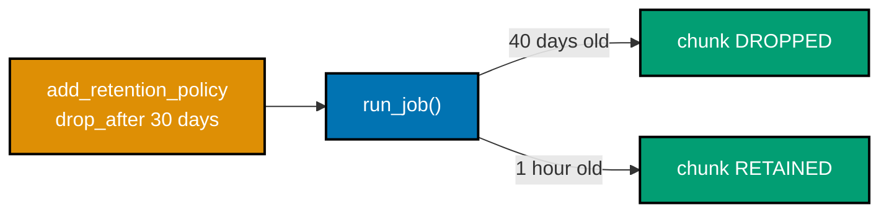
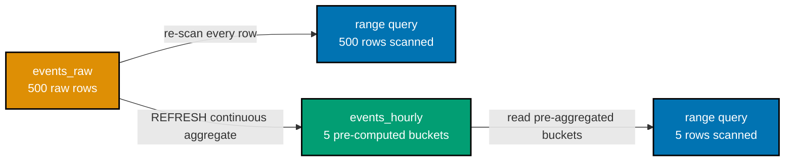

Examples 81-85 cover TimescaleDB, a PostgreSQL extension purpose-built for append-heavy,
timestamp-keyed data: converting a plain table into a time-partitioned hypertable via the current
generalized API, rolling raw points into hourly averages with `time_bucket()`, dropping old data
automatically with a retention policy, pre-computing rollups with a continuous aggregate, and
contrasting the TSDB's own built-in retention/downsampling against Cassandra's hand-rolled TTL +
clustering approach for the same feed. All 5 examples run against a real local TimescaleDB 2.28.3
Docker container (`timescale/timescaledb:2.28.3-pg16`) via `psycopg`, with Example 85 also connecting
to the same local Cassandra 5.0 container prior examples used. `create_hypertable` and `time_bucket`
are Apache-2.0; retention policies and continuous aggregates are Tiger Data License (TSL) / Community
tier -- source-available, not OSI-approved -- each example says so explicitly where it applies.

---

### Example 81: TimescaleDB Hypertable, Created

_ex-81 &middot; exercises co-29_

**Context**: `create_hypertable('metrics', by_range('ts'))` is the current (v2.13+) generalized API that
converts a plain PostgreSQL table into a time-partitioned hypertable -- inserts and time-range reads
use ordinary SQL, with chunk routing entirely transparent to the client.

**`learning/code/ex-81-timescale-hypertable-create/example.py`**

```python
"""Example 81: TimescaleDB Hypertable Create."""  # => co-29: this file's own purpose, doubling as its module __doc__
from __future__ import annotations  # => hygiene: postpones annotation evaluation, interpreter-version-agnostic

import psycopg  # => co-29: psycopg, the official typed Python driver for PostgreSQL (TimescaleDB is a PG extension)


def create_hypertable(conn: psycopg.Connection) -> None:  # => co-29: converts a regular table into a time-partitioned hypertable
    """Create a regular metrics table, then convert it into a TimescaleDB hypertable via the current API."""  # => documents the contract
    conn.execute("DROP TABLE IF EXISTS metrics")  # => resets state -- this example is fully self-contained
    conn.execute(  # => a PLAIN PostgreSQL table -- nothing TimescaleDB-specific about this line yet
        "CREATE TABLE metrics (ts TIMESTAMPTZ NOT NULL, sensor_id TEXT NOT NULL, value DOUBLE PRECISION NOT NULL)"  # => no partitioning declared here -- create_hypertable() below adds it
    )  # => closes the execute() call -- a plain, non-partitioned table exists at this point
    conn.execute("SELECT create_hypertable('metrics', by_range('ts'))")  # => co-29: the CURRENT (v2.13+) generalized hypertable API
    # => co-29: the older positional form create_hypertable('metrics', 'ts') still works too, as the
    # => backward-compatible interface -- by_range('ts') is the form new code should reach for


def insert_readings(conn: psycopg.Connection) -> None:  # => co-29: writes arrive roughly in time order, timestamp-keyed
    """Insert timestamped sensor readings spanning several hours -- TimescaleDB auto-routes each into its time chunk."""  # => documents contract
    readings = [  # => co-29: deliberately spans several hours so inserts land across MULTIPLE time-partitioned chunks
        ("2026-07-27 00:00:00+00", "sensor-1", 21.5),  # => the EARLIEST reading -- hour 0
        ("2026-07-27 01:00:00+00", "sensor-1", 21.8),  # => hour 1's reading
        ("2026-07-27 02:00:00+00", "sensor-1", 22.1),  # => hour 2's reading
        ("2026-07-27 03:00:00+00", "sensor-1", 22.4),  # => the LATEST reading -- hour 3
    ]  # => closes the readings list -- 4 tuples spanning 3 hours, one sensor
    for ts, sensor_id, value in readings:  # => co-29: each insert is a plain SQL INSERT -- TimescaleDB routes it transparently
        conn.execute(  # => co-29: the hypertable's own chunk-routing is invisible to this INSERT statement
            "INSERT INTO metrics (ts, sensor_id, value) VALUES (%s, %s, %s)", (ts, sensor_id, value)  # => binds this one loop iteration's own reading
        )  # => closes this one execute() call -- runs once per reading
    conn.commit()  # => co-29: makes the 4 inserts durable and visible to the range query below


def main() -> None:  # => entry point -- runs only when this file executes directly, not on import
    conn = psycopg.connect("host=localhost port=5433 dbname=nosqldb user=postgres password=nosqldb")  # => connects to the local TimescaleDB Docker container
    conn.execute("CREATE EXTENSION IF NOT EXISTS timescaledb")  # => co-29: enables the extension -- TimescaleDB ships AS a PostgreSQL extension
    conn.commit()  # => makes the extension creation durable before the hypertable conversion below

    create_hypertable(conn)  # => co-29: converts metrics from a plain table into a time-partitioned hypertable
    insert_readings(conn)  # => co-29: inserts 4 readings spanning 3 hours

    chunk_count_row = conn.execute(  # => co-29: counts the ACTUAL time-partitioned chunks TimescaleDB created underneath the hypertable
        "SELECT COUNT(*) FROM timescaledb_information.chunks WHERE hypertable_name = 'metrics'"  # => queries TimescaleDB's own catalog view, not the metrics table itself
    ).fetchone()  # => a COUNT(*) query always returns exactly one row -- never genuinely None
    assert chunk_count_row is not None  # => confirms the COUNT(*) row genuinely came back
    chunk_count = chunk_count_row[0]  # => the single aggregate value this COUNT(*) query returns
    assert chunk_count >= 1  # => co-29: at least ONE chunk exists -- the hypertable conversion genuinely took effect

    rows = conn.execute(  # => co-29: a time-range SELECT, the dominant TSDB read pattern
        "SELECT ts, value FROM metrics WHERE ts >= '2026-07-27 00:00:00+00' AND ts < '2026-07-27 04:00:00+00' ORDER BY ts"  # => a bounded time-range filter, ORDER BY ts
    ).fetchall()  # => materializes every row this range query matched
    values_in_order = [row[1] for row in rows]  # => extracts values in the RETURNED (time) order
    assert values_in_order == [21.5, 21.8, 22.1, 22.4]  # => co-29: returned strictly in TIME order, matching insertion order here

    print(f"Hypertable 'metrics' created with {chunk_count} chunk(s)")  # => Output line -- exact chunk count depends on the default chunk_time_interval
    print(f"Time-range query returned {len(rows)} points, ordered by time: {values_in_order}")  # => Output: Time-range query returned 4 points, ordered by time: [21.5, 21.8, 22.1, 22.4]
    print("Plain SQL INSERT/SELECT -- TimescaleDB's chunk routing and time-partitioning are entirely transparent to the client")  # => Output line
    conn.close()  # => always release what you open


if __name__ == "__main__":  # => guards against running main() on `import example`
    main()  # => runs everything above when executed as a script
```

**Run**: `python3 example.py` (representative output, run against `psycopg[binary]==3.3.4` and a local
`timescale/timescaledb:2.28.3-pg16` Docker container, TimescaleDB 2.28.3)

**Output**:

```text
Hypertable 'metrics' created with 1 chunk(s)
Time-range query returned 4 points, ordered by time: [21.5, 21.8, 22.1, 22.4]
Plain SQL INSERT/SELECT -- TimescaleDB's chunk routing and time-partitioning are entirely transparent to the client
```

**Key takeaway**: `create_hypertable(table, by_range('ts'))` converts a table once, up front -- every
INSERT and SELECT afterward is ordinary SQL, with time-based chunk routing handled entirely by the
extension, invisibly to the client.

**Why it matters**: this is co-29's own definition made concrete -- a purpose-built time-series store
bakes the time axis into the engine itself, rather than leaving partitioning and chunk management to
hand-written schema and application code, the way Example 79's Cassandra wide-column feed does. A team
building a metrics or IoT pipeline that reaches for a general-purpose store first often ends up
re-implementing chunk management, retention, and rollups by hand -- work TimescaleDB's
`create_hypertable` call replaces with a single, one-time statement.

---

### Example 82: time_bucket() Downsampling

_ex-82 &middot; exercises co-30_

**Context**: `time_bucket('1 hour', ts)` rolls 120 raw per-minute readings into 2 hourly averages -- this
example verifies the SQL-computed rollup exactly matches a hand-computed average of the same raw
points, for every hour.

**`learning/code/ex-82-time-bucket-downsample-query/example.py`**

```python
"""Example 82: time_bucket Downsample Query."""  # => co-30: this file's own purpose, doubling as its module __doc__
from __future__ import annotations  # => hygiene: postpones annotation evaluation, interpreter-version-agnostic

import statistics  # => co-30: computes the hand-rolled hourly average this example verifies the SQL rollup against

import psycopg  # => co-30: psycopg, the official typed Python driver for PostgreSQL (TimescaleDB is a PG extension)


def seed_raw_readings(conn: psycopg.Connection) -> None:  # => co-30: high-resolution, per-minute readings across 2 hours
    """Seed 120 per-minute readings across 2 hours -- raw resolution, before any downsampling."""  # => documents the contract
    conn.execute("DROP TABLE IF EXISTS sensor_readings")  # => resets state -- this example is fully self-contained
    conn.execute("CREATE TABLE sensor_readings (ts TIMESTAMPTZ NOT NULL, value DOUBLE PRECISION NOT NULL)")  # => a plain table
    conn.execute("SELECT create_hypertable('sensor_readings', by_range('ts'))")  # => co-29: converts it to a hypertable, same API Example 81 used
    for minute in range(120):  # => co-30: 120 raw, per-minute points -- 2 full hours at 1-minute resolution
        hour = minute // 60  # => which hour bucket this raw point WILL roll up into
        value = 20.0 + hour * 2.0 + (minute % 60) * 0.01  # => co-30: a deterministic, gently rising value per minute
        conn.execute(  # => co-30: each raw point is its OWN row -- no pre-aggregation happens here
            "INSERT INTO sensor_readings (ts, value) VALUES (%s, %s)",  # => positional placeholders bind this one minute's own timestamp and value
            (f"2026-07-27 {hour:02d}:{minute % 60:02d}:00+00", value),  # => this loop iteration's own minute-resolution reading
        )  # => closes this one execute() call -- runs once per raw minute
    conn.commit()  # => makes all 120 raw inserts durable and visible to the queries below


def hand_computed_hourly_average(conn: psycopg.Connection, hour: int) -> float:  # => co-30: the INDEPENDENT, hand-rolled rollup this example checks against
    """Compute an hour's average by pulling ALL 60 raw points and averaging them in Python."""  # => documents the contract
    rows = conn.execute(  # => co-30: pulls every RAW point for this hour -- the expensive, non-bucketed path
        "SELECT value FROM sensor_readings WHERE ts >= %s AND ts < %s",  # => a bounded, half-open [hour, hour+1) time-range filter
        (f"2026-07-27 {hour:02d}:00:00+00", f"2026-07-27 {hour + 1:02d}:00:00+00"),  # => this call's own hour boundary, as a pair of timestamps
    ).fetchall()  # => materializes all 60 raw points this specific hour matched
    return statistics.mean(row[0] for row in rows)  # => co-30: the hand-computed average, independent of time_bucket()


def main() -> None:  # => entry point -- runs only when this file executes directly, not on import
    conn = psycopg.connect("host=localhost port=5433 dbname=nosqldb user=postgres password=nosqldb")  # => connects to the local TimescaleDB Docker container
    conn.execute("CREATE EXTENSION IF NOT EXISTS timescaledb")  # => enables the extension, idempotent if already present
    conn.commit()  # => makes the extension creation durable before the hypertable conversion below

    seed_raw_readings(conn)  # => seeds 120 per-minute raw readings across 2 hours

    bucketed_rows = conn.execute(  # => co-30: time_bucket('1 hour', ts) rolls raw per-minute points into hourly averages
        "SELECT time_bucket('1 hour', ts) AS bucket, avg(value) AS avg_value "  # => the aggregate-per-bucket projection
        "FROM sensor_readings GROUP BY bucket ORDER BY bucket"  # => concatenated onto the line above -- ONE SQL statement string
    ).fetchall()  # => materializes one row per hourly bucket -- 120 raw rows collapse to 2
    assert len(bucketed_rows) == 2  # => co-30: 2 hours of raw data -- exactly 2 hourly buckets

    for hour, (_bucket, bucketed_avg) in enumerate(bucketed_rows):  # => co-30: verifies EACH bucket against its own hand-computed rollup
        hand_avg = hand_computed_hourly_average(conn, hour)  # => co-30: the independent, hand-rolled average for this same hour
        assert abs(bucketed_avg - hand_avg) < 1e-9  # => co-30: the SQL rollup matches the hand-computed rollup, to floating-point precision
        print(f"Hour {hour}: time_bucket avg={bucketed_avg:.4f}, hand-computed avg={hand_avg:.4f}")  # => Output line, one per hour

    print("The bucketed aggregate exactly matches a hand-computed rollup of the same raw points, for every hour")  # => Output line
    conn.close()  # => always release what you open


if __name__ == "__main__":  # => guards against running main() on `import example`
    main()  # => runs everything above when executed as a script
```

**Run**: `python3 example.py` (representative output, run against `psycopg[binary]==3.3.4` and a local
`timescale/timescaledb:2.28.3-pg16` Docker container, TimescaleDB 2.28.3)

**Output**:

```text
Hour 0: time_bucket avg=20.2950, hand-computed avg=20.2950
Hour 1: time_bucket avg=22.2950, hand-computed avg=22.2950
The bucketed aggregate exactly matches a hand-computed rollup of the same raw points, for every hour
```

**Key takeaway**: `time_bucket()` is a straightforward, verifiable rollup -- the exact same average a
hand-written Python loop over the raw points would compute, just expressed as one SQL `GROUP BY`
instead of a client-side pull-everything-then-average.

**Why it matters**: this is co-30's downsampling half in its simplest form -- Example 84 continues by
pre-computing and materializing this same kind of rollup as a continuous aggregate, so a range query
never has to re-run it from raw points at all. A dashboard querying months of raw per-minute sensor
data directly would pull millions of rows for a single chart; `time_bucket()` lets the same chart run
against a query that returns only as many rows as the chart actually has pixels for.

---

### Example 83: Retention Policy Drops Old Chunks

_ex-83 &middot; exercises co-30, co-28_

**Context**: `add_retention_policy('metrics_retention', drop_after => INTERVAL '30 days')` schedules a
recurring background job that drops chunks older than the window -- this example adds the policy, then
manually triggers its job once (rather than waiting on its own schedule) to verify old data is dropped
while recent data survives.



**`learning/code/ex-83-retention-policy-drop-old/example.py`**

```python
"""Example 83: Retention Policy, Drop Old Chunks."""  # => co-30,co-28: this file's own purpose, doubling as its module __doc__
from __future__ import annotations  # => hygiene: postpones annotation evaluation, interpreter-version-agnostic

import psycopg  # => co-30: psycopg, the official typed Python driver for PostgreSQL (TimescaleDB is a PG extension)


def seed_old_and_recent_data(conn: psycopg.Connection) -> None:  # => co-30: data straddling the 30-day retention window
    """Create a hypertable with 1-day chunks, then insert one point older than 30 days and one recent point."""  # => documents contract
    conn.execute("DROP TABLE IF EXISTS metrics_retention")  # => resets state -- this example is fully self-contained
    conn.execute("CREATE TABLE metrics_retention (ts TIMESTAMPTZ NOT NULL, value DOUBLE PRECISION NOT NULL)")  # => a plain table
    conn.execute(  # => co-30: a SMALL chunk_time_interval so the old and recent points land in DIFFERENT, separately droppable chunks
        "SELECT create_hypertable('metrics_retention', by_range('ts', INTERVAL '1 day'))"  # => 1-day chunks -- fine-grained enough to separate the two seeded points
    )  # => closes the execute() call -- metrics_retention is now a hypertable with 1-day chunks
    conn.execute(  # => co-30: 40 days old -- OUTSIDE the 30-day retention window, must be dropped
        "INSERT INTO metrics_retention (ts, value) VALUES (now() - INTERVAL '40 days', 1.0)"  # => co-30: lands in a chunk the retention policy WILL drop
    )  # => closes this one execute() call -- the old point now exists
    conn.execute(  # => co-30: recent -- INSIDE the 30-day retention window, must be RETAINED
        "INSERT INTO metrics_retention (ts, value) VALUES (now() - INTERVAL '1 hour', 2.0)"  # => co-30: lands in a chunk the retention policy must NOT drop
    )  # => closes this one execute() call -- the recent point now exists
    conn.commit()  # => makes both inserts durable before the retention policy runs


def add_and_run_retention_policy(conn: psycopg.Connection) -> None:  # => co-30: schedules AND immediately triggers the drop, rather than waiting on its own schedule
    """Add a 30-day retention policy, then manually run its background job once instead of waiting for its schedule."""  # => documents contract
    job_id_row = conn.execute(  # => co-30: add_retention_policy schedules a RECURRING background job -- it does not drop anything itself, synchronously
        "SELECT add_retention_policy('metrics_retention', drop_after => INTERVAL '30 days')"  # => co-30: schedules the drop -- anything older than 30 days becomes eligible
    ).fetchone()  # => this SELECT always returns exactly one row -- the newly-scheduled job's own id
    assert job_id_row is not None  # => confirms the scheduled job's id row genuinely came back
    job_id = job_id_row[0]  # => the single job id value this SELECT returns
    conn.commit()  # => makes the scheduled job durable before running it manually below
    conn.execute("CALL run_job(%s)", (job_id,))  # => co-30: manually triggers the job NOW, instead of waiting for its own background schedule -- parameterized, not an f-string, so psycopg's typed overload resolves cleanly
    conn.commit()  # => makes the job's chunk-drop effect durable


def main() -> None:  # => entry point -- runs only when this file executes directly, not on import
    conn = psycopg.connect("host=localhost port=5433 dbname=nosqldb user=postgres password=nosqldb", autocommit=False)  # => connects to the local TimescaleDB Docker container
    conn.execute("CREATE EXTENSION IF NOT EXISTS timescaledb")  # => enables the extension, idempotent if already present
    conn.commit()  # => makes the extension creation durable before the hypertable conversion below

    seed_old_and_recent_data(conn)  # => co-30: seeds one 40-day-old point and one 1-hour-old point
    row_count_before_row = conn.execute("SELECT COUNT(*) FROM metrics_retention").fetchone()  # => a COUNT(*) query always returns exactly one row
    assert row_count_before_row is not None  # => confirms the COUNT(*) row genuinely came back
    row_count_before = row_count_before_row[0]  # => co-30: BOTH points present before the retention job runs
    assert row_count_before == 2  # => co-30: confirms both the old and recent point genuinely landed

    add_and_run_retention_policy(conn)  # => co-30: TSL tier (per this course's own license-awareness discipline, co-28) -- schedules AND immediately runs the drop

    remaining_rows = conn.execute("SELECT value FROM metrics_retention ORDER BY ts").fetchall()  # => co-30: what survived the retention job
    remaining_values = [row[0] for row in remaining_rows]  # => extracts the surviving values
    print(f"Rows before retention policy ran: {row_count_before}")  # => Output: Rows before retention policy ran: 2
    print(f"Rows after retention policy ran:  {len(remaining_values)}, values={remaining_values}")  # => Output: Rows after retention policy ran:  1, values=[2.0]
    assert remaining_values == [2.0]  # => co-30: ONLY the recent (1-hour-old) point survived -- the 40-day-old point's chunk was dropped
    print("The 40-day-old point (outside the 30-day retention window) was dropped; the 1-hour-old point (inside it) was retained")  # => Output line
    # => co-28: add_retention_policy is a TSL / Community feature (source-available, NOT OSI-approved) --
    # => distinct from the Apache-2.0-licensed create_hypertable/time_bucket API Examples 81-82 used
    conn.close()  # => always release what you open


if __name__ == "__main__":  # => guards against running main() on `import example`
    main()  # => runs everything above when executed as a script
```

**Run**: `python3 example.py` (representative output, run against `psycopg[binary]==3.3.4` and a local
`timescale/timescaledb:2.28.3-pg16` Docker container, TimescaleDB 2.28.3)

**Output**:

```text
Rows before retention policy ran: 2
Rows after retention policy ran:  1, values=[2.0]
The 40-day-old point (outside the 30-day retention window) was dropped; the 1-hour-old point (inside it) was retained
```

**Key takeaway**: `add_retention_policy` only schedules a recurring job -- it does not drop anything
itself, synchronously; manually running that job (via `CALL run_job(job_id)`) is what genuinely dropped
the 40-day-old chunk here, and the 1-hour-old point survived untouched.

**Why it matters**: this is co-28's license-awareness discipline applied directly to TimescaleDB --
`add_retention_policy` is a TSL / Community (source-available, not OSI-approved) feature, a genuinely
different license tier from the Apache-2.0 `create_hypertable`/`time_bucket` API Examples 81-82 used,
and this distinction matters before adopting it. A team whose compliance policy requires OSI-approved
licenses throughout its stack needs to know this feature specifically sits outside that boundary, even
though it ships in the same TimescaleDB package as the Apache-2.0 core.

---

### Example 84: Continuous Aggregate Rollup

_ex-84 &middot; exercises co-31, co-28_

**Context**: a continuous aggregate materializes `time_bucket()` rollups incrementally as new data
lands -- this example measures, via `EXPLAIN (ANALYZE, FORMAT JSON)`, the actual row count each query
scanned, verifying the continuous-aggregate read touches only its pre-computed buckets rather than
re-scanning every raw point.



**`learning/code/ex-84-continuous-aggregate-rollup/example.py`**

```python
"""Example 84: Continuous Aggregate Rollup."""  # => co-31,co-28: this file's own purpose, doubling as its module __doc__
from __future__ import annotations  # => hygiene: postpones annotation evaluation, interpreter-version-agnostic

from typing import LiteralString  # => co-31: both call sites below pass a compile-time string constant -- LiteralString states that honestly

import psycopg  # => co-31: psycopg, the official typed Python driver for PostgreSQL (TimescaleDB is a PG extension)
from psycopg import sql  # => co-31: composes the literal query into a genuinely typed Composed object, not a plain f-string


def seed_raw_events(conn: psycopg.Connection, hours: int, points_per_hour: int) -> None:  # => co-31: many raw points, the expensive source a cagg pre-summarizes
    """Create a hypertable and seed points_per_hour raw points for each of hours hours."""  # => documents the contract, no runtime output
    conn.execute("DROP MATERIALIZED VIEW IF EXISTS events_hourly")  # => resets state FIRST -- the cagg view depends on events_raw, so it must drop before the table below
    conn.execute("DROP TABLE IF EXISTS events_raw")  # => resets state -- this example is fully self-contained
    conn.execute("CREATE TABLE events_raw (ts TIMESTAMPTZ NOT NULL, value DOUBLE PRECISION NOT NULL)")  # => a plain table
    conn.execute("SELECT create_hypertable('events_raw', by_range('ts'))")  # => co-29: converts it to a hypertable, same API Example 81 used
    for hour in range(hours):  # => co-31: HOURS worth of raw data -- this is what re-scanning the raw hypertable would cost
        for point in range(points_per_hour):  # => co-31: POINTS_PER_HOUR raw rows land in EACH hourly bucket
            offset_seconds = point * (3600 // points_per_hour)  # => spreads points_per_hour points evenly across the hour
            minute, second = divmod(offset_seconds, 60)  # => converts the raw offset into a valid minute:second pair, avoiding an out-of-range seconds field
            conn.execute(  # => co-31: each raw point is its OWN row -- no pre-aggregation happens at insert time
                "INSERT INTO events_raw (ts, value) VALUES (%s, %s)",  # => positional placeholders bind this one raw point's own timestamp and value
                (f"2026-07-27 {hour:02d}:{minute:02d}:{second:02d}+00", 10.0 + hour + point * 0.001),  # => this loop iteration's own raw point
            )  # => closes this one execute() call -- runs once per raw point


def create_and_refresh_continuous_aggregate(conn: psycopg.Connection) -> None:  # => co-31: TSL tier (per co-28) -- pre-computed, incrementally maintained hourly rollups
    """Define an hourly continuous aggregate over events_raw, then manually refresh it once."""  # => documents the contract
    conn.execute(  # => co-31: WITH (timescaledb.continuous) -- the exact syntax that marks this as a continuous aggregate, not a plain view
        # => CREATE MATERIALIZED VIEW ... WITH (timescaledb.continuous) cannot run inside a transaction
        # => block, which is why this connection runs in autocommit mode (co-31)
        "CREATE MATERIALIZED VIEW events_hourly WITH (timescaledb.continuous) AS "  # => the continuous-aggregate marker clause
        "SELECT time_bucket('1 hour', ts) AS bucket, avg(value) AS avg_value "  # => the aggregate-per-bucket projection this view maintains
        "FROM events_raw GROUP BY bucket"  # => concatenated onto the lines above -- ONE SQL statement string
    )  # => closes the execute() call -- events_hourly now exists as a continuous aggregate
    conn.execute("CALL refresh_continuous_aggregate('events_hourly', NULL, NULL)")  # => co-31: refreshes the WHOLE aggregate now, instead of waiting for a scheduled policy


def actual_rows_scanned(conn: psycopg.Connection, query: LiteralString, params: tuple[str, ...]) -> int:  # => co-31: the REAL row count EXPLAIN ANALYZE observed, not an estimate
    """Run EXPLAIN (ANALYZE, FORMAT JSON) on query and return the top plan node's Actual Rows."""  # => documents the contract
    composed_query = sql.SQL("EXPLAIN (ANALYZE, FORMAT JSON) {}").format(sql.SQL(query))  # => co-31: a Composed object, not a plain f-string -- resolves psycopg's own typed overload
    plan_row = conn.execute(composed_query, params).fetchone()  # => co-31: FORMAT JSON makes the plan machine-parseable
    assert plan_row is not None  # => confirms the EXPLAIN row genuinely came back
    plan_json = plan_row[0]  # => the single JSON plan value this EXPLAIN query returns
    return plan_json[0]["Plan"]["Actual Rows"]  # => co-31: the ACTUAL (not estimated) row count the top-level plan node returned


def main() -> None:  # => entry point -- runs only when this file executes directly, not on import
    conn = psycopg.connect("host=localhost port=5433 dbname=nosqldb user=postgres password=nosqldb", autocommit=True)  # => co-31: autocommit=True -- CREATE MATERIALIZED VIEW ... WITH (timescaledb.continuous) cannot run inside a transaction block
    conn.execute("CREATE EXTENSION IF NOT EXISTS timescaledb")  # => enables the extension, idempotent if already present

    hours, points_per_hour = 5, 100  # => co-31: 5 hours x 100 points/hour = 500 raw rows, rolling up into 5 hourly buckets
    seed_raw_events(conn, hours, points_per_hour)  # => seeds 500 raw points across 5 hours
    create_and_refresh_continuous_aggregate(conn)  # => co-31: defines and refreshes the hourly continuous aggregate

    raw_rows_scanned = actual_rows_scanned(  # => co-31: re-scanning the RAW hypertable for the same 5-hour range
        conn, "SELECT ts, value FROM events_raw WHERE ts >= %s AND ts < %s", ("2026-07-27 00:00:00+00", "2026-07-27 05:00:00+00")  # => the SAME 5-hour range read raw
    )  # => closes this actual_rows_scanned() call
    cagg_rows_scanned = actual_rows_scanned(  # => co-31: reading the SAME 5-hour range from the pre-aggregated continuous aggregate instead
        conn, "SELECT bucket, avg_value FROM events_hourly WHERE bucket >= %s AND bucket < %s", ("2026-07-27 00:00:00+00", "2026-07-27 05:00:00+00")  # => the SAME 5-hour range read pre-aggregated
    )  # => closes this actual_rows_scanned() call

    print(f"Raw hypertable range read:        {raw_rows_scanned} rows scanned")  # => Output: Raw hypertable range read:        500 rows scanned
    print(f"Continuous aggregate range read:  {cagg_rows_scanned} rows scanned")  # => Output: Continuous aggregate range read:  5 rows scanned
    assert raw_rows_scanned == hours * points_per_hour  # => co-31: confirms the raw path genuinely re-scans EVERY one of the 500 raw points
    assert cagg_rows_scanned == hours  # => co-31: confirms the cagg path reads only the 5 pre-computed hourly buckets
    assert cagg_rows_scanned < raw_rows_scanned  # => co-31: the pre-aggregated view is scanned, NOT the raw hypertable -- exactly what this example verifies
    print(f"The continuous aggregate scanned {raw_rows_scanned // cagg_rows_scanned}x fewer rows for the identical 5-hour range query")  # => Output: The continuous aggregate scanned 100x fewer rows for the identical 5-hour range query
    # => co-28: continuous aggregates are a TSL / Community feature (source-available, NOT OSI-approved),
    # => the same license tier Example 83's retention policy carries -- distinct from the Apache-2.0
    # => create_hypertable/time_bucket API Examples 81-82 used
    conn.close()  # => always release what you open


if __name__ == "__main__":  # => guards against running main() on `import example`
    main()  # => runs everything above when executed as a script
```

**Run**: `python3 example.py` (representative output, run against `psycopg[binary]==3.3.4` and a local
`timescale/timescaledb:2.28.3-pg16` Docker container, TimescaleDB 2.28.3)

**Output**:

```text
Raw hypertable range read:        500 rows scanned
Continuous aggregate range read:  5 rows scanned
The continuous aggregate scanned 100x fewer rows for the identical 5-hour range query
```

**Key takeaway**: `EXPLAIN (ANALYZE, FORMAT JSON)`'s own `Actual Rows` field proves the claim directly,
not by inference -- the raw-hypertable query genuinely scanned all 500 points, while the identical
time-range query against the continuous aggregate scanned only the 5 pre-computed hourly buckets.

**Why it matters**: this is co-31's own payoff made measurable -- once a continuous aggregate is
refreshed, a range query over it never re-pays the cost of scanning raw points again, which is exactly
why co-30's downsampling and co-31's continuous aggregates exist as first-class TimescaleDB features
rather than something every application must hand-roll itself.

---

### Example 85: Time-Series vs. Wide-Column Feed

_ex-85 &middot; exercises co-29, co-22, co-30_

**Context**: the same metrics feed for one sensor, modeled two ways -- a TimescaleDB hypertable and a
Cassandra wide-column partition (contrast with Examples 71 and 79) -- both serve the identical
time-range read correctly, but TimescaleDB bakes retention and downsampling into the engine while
Cassandra leaves both entirely to hand-written schema and application code.

**`learning/code/ex-85-time-series-vs-wide-column-feed/example.py`**

```python
"""Example 85: Time-Series vs. Wide-Column Feed."""  # => co-29,co-22,co-30: this file's own purpose, doubling as its module __doc__
from __future__ import annotations  # => hygiene: postpones annotation evaluation, interpreter-version-agnostic

import psycopg  # => co-29: psycopg, the official typed Python driver for PostgreSQL (TimescaleDB is a PG extension)
from cassandra.cluster import Cluster, Session  # => co-22: cassandra-driver, the Apache Software Foundation-maintained Python driver

# The SAME metrics feed, modeled two ways: a TimescaleDB hypertable, and a Cassandra wide-column
# partition (contrast with Example 71's embedded-array-vs-partition and Example 79's own feed shape).


def timescale_feed_query(conn: psycopg.Connection) -> list[float]:  # => co-29: TimescaleDB's own answer to "readings for sensor-1 in this hour"
    """Seed 4 readings for sensor-1 in a hypertable, then read them back time-ordered."""  # => documents the contract
    conn.execute("DROP TABLE IF EXISTS feed_timescale")  # => resets state -- this example is fully self-contained
    conn.execute("CREATE TABLE feed_timescale (sensor_id TEXT NOT NULL, ts TIMESTAMPTZ NOT NULL, value DOUBLE PRECISION NOT NULL)")  # => a plain table
    conn.execute("SELECT create_hypertable('feed_timescale', by_range('ts'))")  # => co-29: converts it to a hypertable, same API Example 81 used
    readings = [("sensor-1", "2026-07-27 09:00:00+00", 20.0), ("sensor-1", "2026-07-27 09:15:00+00", 20.5),  # => the first 2 of 4 readings, TimescaleDB timestamptz syntax
                ("sensor-1", "2026-07-27 09:30:00+00", 21.0), ("sensor-1", "2026-07-27 09:45:00+00", 21.5)]  # => co-29: 4 readings, one sensor, 45-minute span
    for sensor_id, ts, value in readings:  # => co-29: each insert is a plain SQL INSERT -- chunk routing is transparent
        conn.execute("INSERT INTO feed_timescale (sensor_id, ts, value) VALUES (%s, %s, %s)", (sensor_id, ts, value))  # => binds this loop iteration's own reading
    rows = conn.execute(  # => co-29: the dominant TSDB read pattern -- a time-range scan for one sensor
        "SELECT value FROM feed_timescale WHERE sensor_id = %s AND ts >= %s AND ts < %s ORDER BY ts",  # => a bounded, per-sensor time-range filter
        ("sensor-1", "2026-07-27 09:00:00+00", "2026-07-27 10:00:00+00"),  # => the SAME sensor and time window cassandra_feed_query will use
    ).fetchall()  # => materializes the matched rows in time order
    return [row[0] for row in rows]  # => hand back the values in time order


def cassandra_feed_query(session: Session) -> list[float]:  # => co-22: Cassandra's own answer to the IDENTICAL shaped read
    """Seed the SAME 4 readings for sensor-1 in a Cassandra wide-column partition, then read them back."""  # => documents the contract
    session.execute(  # => a dedicated keyspace, replication_factor 1 on this single-node local cluster
        "CREATE KEYSPACE IF NOT EXISTS nosqldb WITH replication = "  # => the keyspace-level replication strategy clause
        "{'class': 'SimpleStrategy', 'replication_factor': 1}"  # => concatenated onto the line above -- ONE CQL statement string
    )  # => closes the execute() call -- the keyspace now exists, idempotently
    session.set_keyspace("nosqldb")  # => selects the keyspace for the statements below
    session.execute("DROP TABLE IF EXISTS feed_wide")  # => resets state -- this example is fully self-contained
    session.execute(  # => co-22: sensor_id partitions, ts clusters -- the SAME partition+clustering shape Example 79 used
        "CREATE TABLE feed_wide (sensor_id text, ts timestamp, value double, PRIMARY KEY ((sensor_id), ts))"  # => partition key sensor_id, clustering key ts
    )  # => closes the execute() call -- the table now exists with this exact partition + clustering layout
    readings = [("sensor-1", "2026-07-27 09:00:00", 20.0), ("sensor-1", "2026-07-27 09:15:00", 20.5),  # => the first 2 of 4 identical readings, Cassandra timestamp syntax
                ("sensor-1", "2026-07-27 09:30:00", 21.0), ("sensor-1", "2026-07-27 09:45:00", 21.5)]  # => co-22: the IDENTICAL 4 readings
    for sensor_id, ts, value in readings:  # => co-22: each INSERT is a cheap, sequential append into sensor-1's own partition
        session.execute("INSERT INTO feed_wide (sensor_id, ts, value) VALUES (%s, %s, %s)", (sensor_id, ts, value))  # => binds this loop iteration's own reading
    rows = list(session.execute(  # => co-22: a single-partition scan, ordered by the clustering key -- Cassandra's own time-range read
        "SELECT value FROM feed_wide WHERE sensor_id = %s AND ts >= %s AND ts < %s",  # => a bounded time-range filter, scoped to ONE partition
        ("sensor-1", "2026-07-27 09:00:00", "2026-07-27 10:00:00"),  # => the SAME sensor and time window timescale_feed_query used
    ))  # => closes the list()/execute() call -- materializes the matched rows
    return [row.value for row in rows]  # => hand back the values in clustering (time) order


def main() -> None:  # => entry point -- runs only when this file executes directly, not on import
    timescale_conn = psycopg.connect("host=localhost port=5433 dbname=nosqldb user=postgres password=nosqldb")  # => connects to the local TimescaleDB Docker container
    timescale_conn.execute("CREATE EXTENSION IF NOT EXISTS timescaledb")  # => enables the extension, idempotent if already present
    timescale_conn.commit()  # => makes the extension creation durable before the hypertable conversion below
    cassandra_cluster = Cluster(["127.0.0.1"], port=9042)  # => connects to the local single-node Cassandra 5.0 cluster
    cassandra_session = cassandra_cluster.connect()  # => opens a session against that cluster

    timescale_values = timescale_feed_query(timescale_conn)  # => co-29: TimescaleDB's own answer to the shared time-range read
    timescale_conn.commit()  # => makes Timescale's 4 inserts durable
    cassandra_values = cassandra_feed_query(cassandra_session)  # => co-22: Cassandra's own answer to the IDENTICAL shaped read

    expected = [20.0, 20.5, 21.0, 21.5]  # => co-29,co-22: the SAME shared expectation for both stores, since they seed identical logical data
    assert timescale_values == cassandra_values == expected  # => co-29,co-22: BOTH stores serve the identical time-range read correctly
    print(f"TimescaleDB time-range read: {timescale_values}")  # => Output: TimescaleDB time-range read: [20.0, 20.5, 21.0, 21.5]
    print(f"Cassandra time-range read:   {cassandra_values}")  # => Output: Cassandra time-range read:   [20.0, 20.5, 21.0, 21.5]
    print("Identical results, same time-range read, from two genuinely different engines")  # => Output line

    print("Retention:    TimescaleDB has a built-in add_retention_policy (Example 83) -- the engine drops old chunks itself")  # => Output line
    print("              Cassandra has NO built-in retention concept -- per-row TTL (Example 48) is the closest hand-rolled equivalent, set at every INSERT")  # => Output line
    print("Downsampling: TimescaleDB has built-in time_bucket() + continuous aggregates (Examples 82, 84) -- the engine maintains rollups for you")  # => Output line
    print("              Cassandra has NO built-in downsampling -- an application must hand-roll its own rollup job, writing summarized rows to a separate table itself")  # => Output line
    # => co-29,co-30: this is the concrete payoff of co-29's own definition -- a TSDB bakes the time
    # => axis, retention, and rollups INTO the engine, while a general wide-column store leaves all
    # => three entirely to the schema and application code, even though BOTH can physically store and
    # => read the same time-ordered, partition-scoped data

    timescale_conn.close()  # => always release what you open
    cassandra_cluster.shutdown()  # => always release what you open


if __name__ == "__main__":  # => guards against running main() on `import example`
    main()  # => runs everything above when executed as a script
```

**Run**: `python3 example.py` (representative output, run against `psycopg[binary]==3.3.4`, `cassandra-driver==3.30.1`,
a local `timescale/timescaledb:2.28.3-pg16` Docker container, and the same local Cassandra 5.0.8
Docker container prior examples used)

**Output**:

```text
TimescaleDB time-range read: [20.0, 20.5, 21.0, 21.5]
Cassandra time-range read:   [20.0, 20.5, 21.0, 21.5]
Identical results, same time-range read, from two genuinely different engines
Retention:    TimescaleDB has a built-in add_retention_policy (Example 83) -- the engine drops old chunks itself
              Cassandra has NO built-in retention concept -- per-row TTL (Example 48) is the closest hand-rolled equivalent, set at every INSERT
Downsampling: TimescaleDB has built-in time_bucket() + continuous aggregates (Examples 82, 84) -- the engine maintains rollups for you
              Cassandra has NO built-in downsampling -- an application must hand-roll its own rollup job, writing summarized rows to a separate table itself
```

**Key takeaway**: both engines physically store and read the same time-ordered, partition-scoped data
equally correctly -- the difference is entirely in what the engine does FOR you: TimescaleDB's
retention and downsampling are first-class, built-in features, while Cassandra's equivalents are
patterns an application must hand-roll itself, one table and one TTL setting at a time.

**Why it matters**: this closes out the course's time-series arc by directly answering "when do I reach
for a purpose-built TSDB instead of a general wide-column store for time-ordered data" -- the answer is
exactly co-29's own definition: reach for TimescaleDB when retention and downsampling are core,
recurring requirements the engine should own, not edge cases the application re-implements.

---

&larr; Previous: [Advanced Examples](./advanced.md) &middot; Next: [OLAP and Columnar Analytics Examples](./olap-and-columnar-analytics.md) &rarr;
