Examples 58-84 assume the full Beginner and Intermediate vocabulary and put it to work at larger scale: refactoring real smells to a pattern under a locking `pytest` suite (not choosing a pattern up front), naming anti-patterns by their recognizable shape, touring the essential Gang-of-Four catalogue in three gallery sweeps, applying all five SOLID principles and all nine GRASP patterns end-to-end on one order engine, and closing with the finite-state-machine and Harel-statechart rung that goes beyond the object-per-state State pattern. Every example is still a complete, self-contained `example.py` colocated under `learning/code/`, verified the same two ways as every earlier tier: `python3 example.py` prints its own expected output inline via `# =>` comments, and a colocated `test_example.py` asserts the same behavior under `pytest`.

---

### Example 58: Refactor Inheritance to Composition

_ex-58 &middot; exercises co-33, co-09_

A 4-level inheritance hierarchy (`Notifier` to `LoggingNotifier` to `RetryingLoggingNotifier` to `ThrottledRetryingLoggingNotifier`), each level bolting on one orthogonal capability, is refactored to a single depth-1 class composed with small behavior objects. A locking `pytest` suite pins both versions' observable behavior across the refactor.

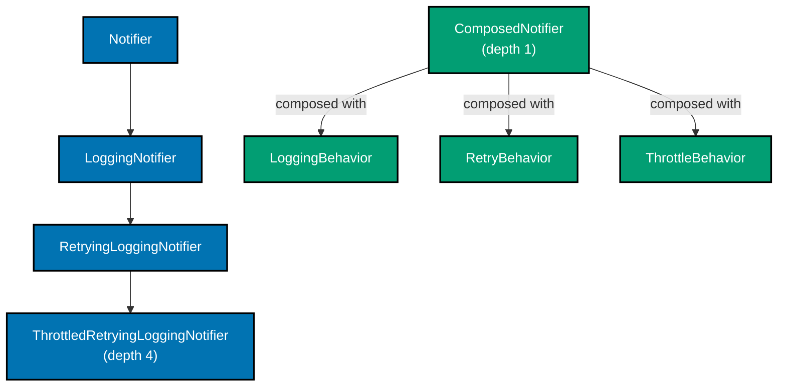

**`learning/code/ex-58-refactor-inheritance-to-composition/example.py`**

```python
"""Example 58: Refactor Inheritance to Composition.

co-33 (refactor to pattern): a 4-level inheritance hierarchy, each level bolting on
one orthogonal capability (logging, retry, throttling), is refactored to a single
depth-1 class composed with small behavior objects -- co-09 (grasp-low-coupling):
the composed version needs zero new subclasses to add a capability, only a new
wrapper object. test_example.py locks both versions' observable behavior so the
refactor is verifiably safe.
"""

from __future__ import annotations

from dataclasses import dataclass, field

# ============================================================
# BEFORE: a 4-level inheritance hierarchy, one capability per level
# ============================================================


class Notifier:  # => level 1 (base): just sends -- no capabilities yet
    def send(self, message: str) -> str:  # => returns what was "sent", stubbed as a string for this example
        return f"SEND:{message}"  # => the delivery itself


class LoggingNotifier(Notifier):  # => level 2: bolts on logging via override
    def __init__(self) -> None:  # => LoggingNotifier's constructor takes no new parameters beyond self
        self.log: list[str] = []  # => records every message this notifier has sent

    def send(self, message: str) -> str:  # => override adds ONE capability: logging
        self.log.append(message)  # => side effect before delegating up
        return super().send(message)  # => delegates to level 1's real send


# => level 3 repeats level 2's override-and-delegate shape one layer deeper, adding retry state
class RetryingLoggingNotifier(LoggingNotifier):  # => level 3: bolts on retry, on top of logging
    def __init__(self, attempts: int) -> None:  # => adds one new constructor parameter for this level's capability
        super().__init__()  # => must still wire up level 2's state
        self.attempts = attempts  # => how many times to retry

    def send(self, message: str) -> str:  # => override adds a SECOND capability: retry
        last_result = ""  # => tracks the most recent attempt's result
        for _ in range(self.attempts):  # => retry loop wraps the logging+base chain
            last_result = super().send(message)  # => delegates up two levels each iteration
        return last_result  # => the final attempt's result


# => level 4 keeps stacking: every new capability means one more override plus one more __init__ chain link
class ThrottledRetryingLoggingNotifier(RetryingLoggingNotifier):  # => level 4: bolts on throttling
    def __init__(self, attempts: int, max_calls: int) -> None:  # => now carries state for capabilities from two different levels
        super().__init__(attempts)  # => must wire up levels 3 AND 2's __init__ chain
        self.max_calls = max_calls  # => a THIRD, independent capability: a call budget
        self.calls_made = 0  # => how many sends have happened so far

    def send(self, message: str) -> str:  # => override adds a THIRD capability: throttling
        if self.calls_made >= self.max_calls:  # => guard: budget exhausted
            return "THROTTLED"  # => refuse to send once the budget is spent
        self.calls_made += 1  # => consume one unit of budget
        return super().send(message)  # => delegates up the whole three-level chain
        # => one send() call now cascades through 4 stacked overrides: throttle -> retry -> logging -> base


# ============================================================
# AFTER: one depth-1 class, capabilities composed as small standalone objects
# ============================================================


@dataclass  # => auto-generates __init__ from the single field below
class LoggingBehavior:  # => composed equivalent of LoggingNotifier -- one small standalone class
    log: list[str] = field(default_factory=list)  # => same responsibility, now owned independently


# => this single class replaces all 4 inheritance levels above, using composed collaborators instead of subclassing
class ComposedNotifier:  # => depth 1: no subclass at all -- capabilities are composed, not inherited
    def __init__(self, logging: LoggingBehavior | None = None) -> None:  # => takes an OPTIONAL composed capability instead of a hardcoded subclass chain
        self.logging = logging  # => an OPTIONAL logging capability, composed in per instance

    def raw_send(self, message: str) -> str:  # => the equivalent of Notifier.send() in the old hierarchy
        if self.logging is not None:  # => only log if a LoggingBehavior was composed in
            self.logging.log.append(message)  # => same log side effect, now opt-in rather than baked into a subclass
        return f"SEND:{message}"  # => identical delivery stub to the inheritance version


@dataclass  # => auto-generates __init__ for the retry capability's single field
class RetryBehavior:  # => composed equivalent of the retry capability -- reusable on its own
    attempts: int  # => how many times to retry


@dataclass  # => auto-generates __init__ for the throttle capability's two fields
class ThrottleBehavior:  # => composed equivalent of the throttle capability -- reusable on its own
    max_calls: int  # => the call budget
    calls_made: int = 0  # => mutable counter, local to this one small class


# => a free function stands in for a 4th subclass level, since retry/throttle here are simple per-call parameters
def send_with_capabilities(  # => a free function stands in for what would have been a 4th subclass level
    notifier: ComposedNotifier,  # => the base object, already composed with logging
    message: str,  # => the message to send
    retry: RetryBehavior,  # => the retry capability, composed in as a parameter
    throttle: ThrottleBehavior,  # => the throttle capability, composed in as a parameter
) -> str:  # => closes the multi-line signature; the function still returns a plain string like the old send()
    if throttle.calls_made >= throttle.max_calls:  # => throttle checked first, matching the old outermost override
        return "THROTTLED"  # => matches ThrottledRetryingLoggingNotifier's early return
    throttle.calls_made += 1  # => consumes budget exactly once per call, matching the old behavior
    last_result = ""  # => tracks the final attempt across retries
    for _ in range(retry.attempts):  # => same retry loop as before, now composed rather than inherited
        last_result = notifier.raw_send(message)  # => delegates to the composed base (which itself logs)
    return last_result  # => the final attempt's result


if __name__ == "__main__":  # => demonstration entry point, executed only when this file is run directly
    old_notifier = ThrottledRetryingLoggingNotifier(attempts=2, max_calls=5)  # => 4-level inheritance version
    print(old_notifier.send("hello"))  # => exercises the full inherited chain
    # => Output: SEND:hello
    logging_behavior = LoggingBehavior()  # => the composed logging unit
    new_notifier = ComposedNotifier(logging=logging_behavior)  # => depth-1 composed version
    result = send_with_capabilities(new_notifier, "hello", RetryBehavior(attempts=2), ThrottleBehavior(max_calls=5))  # => exercises the composed equivalent
    print(result)  # => identical output to the inheritance version
    # => Output: SEND:hello
    print(len(ThrottledRetryingLoggingNotifier.__mro__))  # => old hierarchy: 4 custom classes + object
    # => Output: 5
    print(ComposedNotifier.__mro__ == (ComposedNotifier, object))  # => new version: depth 1, no intermediate bases
    # => Output: True
```

**Run**: `python3 example.py`

**Output**:

```text
SEND:hello
SEND:hello
5
True
```

**`learning/code/ex-58-refactor-inheritance-to-composition/test_example.py`**

```python
"""Example 58: pytest verification that behavior is unchanged after the composition refactor."""

from example import (
    ComposedNotifier,
    LoggingBehavior,
    RetryBehavior,
    ThrottledRetryingLoggingNotifier,
    ThrottleBehavior,
    send_with_capabilities,
)


def test_inheritance_and_composition_versions_agree_on_successful_sends() -> None:
    old = ThrottledRetryingLoggingNotifier(attempts=2, max_calls=5)  # => 4-level inheritance version
    old_result = old.send("hello")  # => exercises the full inherited chain
    logging = LoggingBehavior()  # => the composed logging unit
    new = ComposedNotifier(logging=logging)  # => depth-1 composed version
    new_result = send_with_capabilities(new, "hello", RetryBehavior(attempts=2), ThrottleBehavior(max_calls=5))
    assert old_result == new_result == "SEND:hello"  # => both versions produce identical output
    assert old.log == logging.log == ["hello", "hello"]  # => both log every retry attempt identically


def test_throttling_behavior_is_identical_once_budget_is_exhausted() -> None:
    old = ThrottledRetryingLoggingNotifier(attempts=1, max_calls=1)  # => budget of exactly one call
    old.send("first")  # => consumes the single-call budget
    old_second = old.send("second")  # => budget exhausted -- should be throttled
    logging = LoggingBehavior()
    new = ComposedNotifier(logging=logging)
    retry = RetryBehavior(attempts=1)
    throttle = ThrottleBehavior(max_calls=1)
    send_with_capabilities(new, "first", retry, throttle)  # => consumes the composed version's budget too
    new_second = send_with_capabilities(new, "second", retry, throttle)  # => should also be throttled
    assert old_second == new_second == "THROTTLED"  # => both versions refuse identically once budget is spent


def test_composed_version_has_inheritance_depth_of_exactly_one() -> None:
    assert ComposedNotifier.__mro__ == (ComposedNotifier, object)  # => depth 1: no intermediate base classes
    assert len(ThrottledRetryingLoggingNotifier.__mro__) == 5  # => old version: 4 custom levels + object


# => Run: pytest -q -- Output: 3 passed
```

**Verify**: `pytest -q`

**Output**:

```text
3 passed
```

**Key takeaway**: An inheritance hierarchy that bolts on one orthogonal capability per level is a composition problem wearing an is-a costume; refactoring each level to a small standalone behavior object collapses depth to 1 while a locking test suite proves nothing observable changed.

**Why it matters**: Deep hierarchies like this one are the textbook "fragile base class" -- changing level 2's logging logic risks breaking levels 3 and 4, which both silently depend on it through `super()`. Production codebases that grow capability-per-subclass hierarchies (payment processors, HTTP clients, notification systems) eventually hit a combinatorial wall where every new orthogonal capability doubles the subclass count; composition keeps that growth linear instead of multiplicative.

---

### Example 59: Refactor to Strategy

_ex-59 &middot; exercises co-33, co-25_

An embedded `if`/`elif` chain computing shipping cost by method name is refactored to a strategy family under a locking test suite that stays green through every step. Each shipping method becomes its own small callable, and the dispatcher looks the method up in a table instead of branching on it.

**`learning/code/ex-59-refactor-to-strategy/example.py`**

```python
"""Example 59: Refactor to Strategy.

co-33 (refactor to pattern): an embedded if-chain computing shipping cost by method
name is refactored to a strategy family under a locking test suite that stays green
through every step -- co-25 (strategy): each shipping method becomes its own small
callable, and the dispatcher looks the method up instead of branching on it.
"""

from __future__ import annotations

from typing import Callable

# ============================================================
# BEFORE: an if-chain that must be edited for every new shipping method
# ============================================================


def shipping_cost_if_chain(method: str, weight_kg: float) -> float:  # => the original, unrefactored dispatcher
    if method == "standard":  # => branch 1: flat rate per kg
        return 2.0 * weight_kg  # => $2/kg
    elif method == "express":  # => branch 2: higher flat rate
        return 5.0 * weight_kg  # => $5/kg
    elif method == "overnight":  # => branch 3: highest flat rate plus a surcharge
        return 10.0 * weight_kg + 15.0  # => $10/kg plus a $15 fixed surcharge
    raise ValueError(f"unknown shipping method: {method}")  # => every new method needs a new elif here (OCP violation)


# ============================================================
# AFTER: a strategy family -- new methods are added, not edited into a switch
# ============================================================

ShippingStrategy = Callable[[float], float]  # => a strategy is just "weight_kg -> cost", nothing more


def standard_shipping(weight_kg: float) -> float:  # => strategy 1, extracted verbatim from the if-chain
    return 2.0 * weight_kg  # => identical formula to the "standard" branch above


def express_shipping(weight_kg: float) -> float:  # => strategy 2, extracted verbatim
    return 5.0 * weight_kg  # => identical formula to the "express" branch above


def overnight_shipping(weight_kg: float) -> float:  # => strategy 3, extracted verbatim
    return 10.0 * weight_kg + 15.0  # => identical formula to the "overnight" branch above


# => three strategies extracted so far, each a pure one-line function with the exact old formula
SHIPPING_STRATEGIES: dict[str, ShippingStrategy] = {  # => the dispatch table replaces the if-chain entirely
    "standard": standard_shipping,  # => maps the method name to its strategy function
    "express": express_shipping,  # => maps a second method name to its strategy function
    "overnight": overnight_shipping,  # => maps a third method name to its strategy function
}  # => closes the dispatch table literal


def shipping_cost_via_strategy(method: str, weight_kg: float) -> float:  # => the refactored dispatcher
    strategy = SHIPPING_STRATEGIES.get(method)  # => look up the strategy by name, no branching required
    if strategy is None:  # => guard: unknown method still raises, matching the old behavior
        raise ValueError(f"unknown shipping method: {method}")  # => identical error message to the if-chain version
    return strategy(weight_kg)  # => delegate to whichever strategy was found


# => this is the OCP payoff: shipping_cost_via_strategy above needs zero edits to support this new method
def bulk_shipping(weight_kg: float) -> float:  # => a FOURTH method, added with zero edits to the dispatcher above
    return 1.0 * weight_kg - 3.0  # => cheapest rate, bulk discount baked in


if __name__ == "__main__":  # => demonstration entry point, executed only when this file is run directly
    print(shipping_cost_if_chain("express", 4.0))  # => old dispatcher, exercised for comparison
    # => Output: 20.0
    print(shipping_cost_via_strategy("express", 4.0))  # => new dispatcher, identical result
    # => Output: 20.0
    SHIPPING_STRATEGIES["bulk"] = bulk_shipping  # => adding "bulk" required zero edits to shipping_cost_via_strategy
    print(shipping_cost_via_strategy("bulk", 10.0))  # => the newly registered strategy works immediately
    # => Output: 7.0
```

**Run**: `python3 example.py`

**Output**:

```text
20.0
20.0
7.0
```

**`learning/code/ex-59-refactor-to-strategy/test_example.py`**

```python
"""Example 59: pytest verification that the strategy refactor stays green throughout."""

import pytest

from example import (
    SHIPPING_STRATEGIES,
    bulk_shipping,
    shipping_cost_if_chain,
    shipping_cost_via_strategy,
)


@pytest.mark.parametrize(
    "method,weight,expected",
    [("standard", 3.0, 6.0), ("express", 4.0, 20.0), ("overnight", 2.0, 35.0)],
)  # => same three cases run through both dispatchers, proving the refactor changed nothing observable
def test_old_and_new_dispatchers_agree_on_every_known_method(method: str, weight: float, expected: float) -> None:
    assert shipping_cost_if_chain(method, weight) == expected  # => old if-chain dispatcher
    assert shipping_cost_via_strategy(method, weight) == expected  # => new strategy-table dispatcher


def test_both_dispatchers_reject_an_unknown_method_identically() -> None:
    with pytest.raises(ValueError, match="unknown shipping method"):  # => old dispatcher's error
        shipping_cost_if_chain("teleport", 1.0)
    with pytest.raises(ValueError, match="unknown shipping method"):  # => new dispatcher's error, same message
        shipping_cost_via_strategy("teleport", 1.0)


def test_adding_a_new_strategy_requires_zero_edits_to_the_dispatcher() -> None:
    SHIPPING_STRATEGIES["bulk"] = bulk_shipping  # => registers a fourth strategy at test time
    assert shipping_cost_via_strategy("bulk", 10.0) == 7.0  # => works immediately, no dispatcher code changed
    del SHIPPING_STRATEGIES["bulk"]  # => cleans up so this test does not leak state into other tests


# => Run: pytest -q -- Output: 5 passed
```

**Verify**: `pytest -q`

**Output**:

```text
5 passed
```

**Key takeaway**: A refactor to strategy is a mechanical, safe move under tests: extract each branch's body verbatim into its own function, build a name-to-function table, and replace the branching with a lookup -- the old and new dispatchers can be run side by side against the same test cases to prove nothing changed.

**Why it matters**: Long-lived `if`/`elif` dispatchers are a magnet for growth -- pricing engines, payment-method routers, and export-format selectors all tend to accumulate branches for years until the function is hundreds of lines long and risky to touch. A strategy table caps that growth: a new case is a new function plus one dictionary entry, reviewable and testable in isolation from every case that came before it.

---

### Example 60: Refactor to State

_ex-60 &middot; exercises co-33, co-29_

A boolean-flag implementation of order lifecycle (`is_paid`, `is_shipped`, `is_cancelled`, independently settable) allows illegal combinations. Refactoring to the State pattern makes each lifecycle stage its own class, so the current-state object is the only thing deciding which transitions are legal.

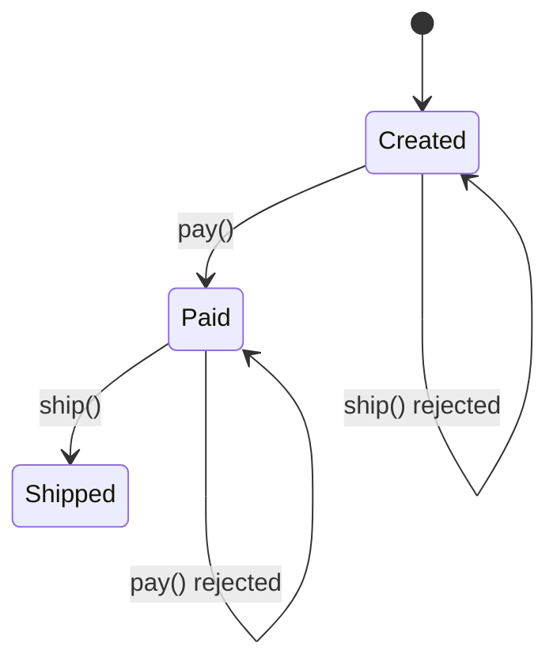

**`learning/code/ex-60-refactor-to-state/example.py`**

```python
"""Example 60: Refactor to State.

co-33 (refactor to pattern): a boolean-flag implementation of order lifecycle
(is_paid, is_shipped, is_cancelled -- independently settable) is refactored to the
State pattern -- co-29 (state): each lifecycle stage becomes its own class, and the
current-state object is the only thing that decides which transitions are legal,
making invalid flag combinations unrepresentable.
"""

from __future__ import annotations

from abc import ABC, abstractmethod

# ============================================================
# BEFORE: boolean-flag soup -- nothing prevents illegal combinations
# ============================================================


class FlagOrder:  # => the original, unrefactored order
    def __init__(self) -> None:  # => sets up all three independent boolean flags below
        self.is_paid = False  # => three independent booleans...
        self.is_shipped = False  # => ...that can be set in ANY combination...
        self.is_cancelled = False  # => ...including ones that make no business sense

    def mark_shipped(self) -> None:  # => nothing here checks is_paid first
        self.is_shipped = True  # => BUG: this can fire even when is_paid is still False
        # => nothing in FlagOrder's design stops mark_shipped() from running before is_paid is ever set


# ============================================================
# AFTER: the State pattern -- illegal transitions are structurally impossible
# ============================================================


class OrderState(ABC):  # => the shared interface every concrete state implements
    @abstractmethod  # => forces every concrete state to define its own pay() behavior
    def pay(self, order: "StateOrder") -> None:  # => only states where paying is legal override this meaningfully
        raise NotImplementedError  # => abstract method body, never actually executed

    @abstractmethod  # => forces every concrete state to define its own ship() behavior
    def ship(self, order: "StateOrder") -> None:  # => only the Paid state allows shipping
        raise NotImplementedError  # => abstract method body, never actually executed

    def name(self) -> str:  # => a readable label for the current state, used in tests and printing
        return type(self).__name__  # => e.g. "Created", "Paid", "Shipped"


class Created(OrderState):  # => the starting state: nothing has happened yet
    def pay(self, order: "StateOrder") -> None:  # => the ONLY legal transition out of Created
        order.state = Paid()  # => moves the order into the Paid state

    def ship(self, order: "StateOrder") -> None:  # => shipping from Created is illegal
        raise ValueError("cannot ship an order that has not been paid")  # => structurally rejected, not just unwise


# => Paid is reachable only via Created.pay() above -- there is no way to construct an order that skips it
class Paid(OrderState):  # => after payment, before shipping
    def pay(self, order: "StateOrder") -> None:  # => paying twice is illegal
        raise ValueError("order is already paid")  # => Paid has no legal pay() transition

    def ship(self, order: "StateOrder") -> None:  # => the ONLY legal transition out of Paid
        order.state = Shipped()  # => moves the order into the Shipped state


# => Shipped is the terminal state: both its methods only ever raise, matching a real "closed" order
class Shipped(OrderState):  # => the terminal happy-path state
    def pay(self, order: "StateOrder") -> None:  # => paying a shipped order is illegal
        raise ValueError("order is already shipped")  # => Shipped has no legal pay() transition

    def ship(self, order: "StateOrder") -> None:  # => shipping twice is illegal
        raise ValueError("order is already shipped")  # => Shipped has no legal ship() transition


# => StateOrder itself contains ZERO business rules -- every legality check lives inside the state classes above
class StateOrder:  # => the refactored order -- delegates every transition to its current state object
    def __init__(self) -> None:  # => starts every new order in a single, well-defined state
        self.state: OrderState = Created()  # => starts in the Created state, same as FlagOrder's initial flags

    def pay(self) -> None:  # => delegates to whichever state object is current
        self.state.pay(self)  # => the STATE decides whether this is legal, not an if-chain here

    def ship(self) -> None:  # => delegates to whichever state object is current
        self.state.ship(self)  # => "shipped without paid" cannot happen: Created.ship() always raises


if __name__ == "__main__":  # => demonstration entry point, executed only when this file is run directly
    flag_order = FlagOrder()  # => the old version
    flag_order.mark_shipped()  # => BUG reproduced: shipped is True even though paid is still False
    print(flag_order.is_shipped, flag_order.is_paid)  # => demonstrates the illegal combination the flags allow
    # => Output: True False

    state_order = StateOrder()  # => the refactored version
    try:  # => wraps the illegal transition attempt so its ValueError can be shown
        state_order.ship()  # => attempting the same illegal move
    except ValueError as exc:  # => catches the rejection raised by Created.ship()
        print(exc)  # => the State pattern rejects it outright
    # => Output: cannot ship an order that has not been paid

    state_order.pay()  # => legal: Created -> Paid
    state_order.ship()  # => legal: Paid -> Shipped
    print(state_order.state.name())  # => confirms the final state
    # => Output: Shipped
```

**Run**: `python3 example.py`

**Output**:

```text
True False
cannot ship an order that has not been paid
Shipped
```

**`learning/code/ex-60-refactor-to-state/test_example.py`**

```python
"""Example 60: pytest verification that state-object refactor makes illegal combos impossible."""

import pytest

from example import Created, FlagOrder, StateOrder


def test_flag_order_allows_the_illegal_shipped_without_paid_combination() -> None:
    order = FlagOrder()  # => reproduces the bug the refactor fixes
    order.mark_shipped()  # => nothing stops this even though is_paid is still False
    assert order.is_shipped is True and order.is_paid is False  # => the illegal combination exists


def test_state_order_rejects_shipping_before_payment() -> None:
    order = StateOrder()  # => starts in Created
    with pytest.raises(ValueError, match="not been paid"):  # => the illegal move is structurally rejected
        order.ship()
    assert isinstance(order.state, Created)  # => the order never left Created


def test_state_order_allows_the_legal_created_to_paid_to_shipped_path() -> None:
    order = StateOrder()
    order.pay()  # => Created -> Paid
    order.ship()  # => Paid -> Shipped
    assert order.state.name() == "Shipped"  # => reached the terminal state via only legal transitions


def test_state_order_rejects_paying_twice() -> None:
    order = StateOrder()
    order.pay()  # => first pay is legal
    with pytest.raises(ValueError, match="already paid"):  # => second pay is illegal
        order.pay()


# => Run: pytest -q -- Output: 4 passed
```

**Verify**: `pytest -q`

**Output**:

```text
4 passed
```

**Key takeaway**: Boolean flags can express any combination, legal or not; refactoring lifecycle state into explicit state objects makes illegal combinations a compile-time-absent method call rather than a runtime bug waiting to be triggered.

**Why it matters**: "Shipped but not paid" bugs are a recurring class of production incident in e-commerce and billing systems -- exactly the kind of invalid state boolean flags permit silently. The State pattern converts that class of bug into a `ValueError` raised at the exact call site that attempted the illegal move, catchable by a test long before it reaches production.

---

### Example 61: Refactor God Object

_ex-61 &middot; exercises co-33, co-01, co-06_

A god object mixing user validation, order pricing, and receipt formatting is decomposed by applying SRP and information-expert together -- each responsibility moves to the class that already holds the data it needs, and a locking test suite proves the decomposition preserves behavior.

**`learning/code/ex-61-refactor-god-object/example.py`**

```python
"""Example 61: Refactor God Object.

co-33 (refactor to pattern): a god object mixing user validation, order pricing, and
receipt formatting is decomposed by applying co-01 (SRP) and co-06 (grasp-information-
expert) -- each responsibility moves to the class that already holds the data it
needs, and a locking test suite proves the decomposition preserves behavior.
"""

from __future__ import annotations

from dataclasses import dataclass, field

# ============================================================
# BEFORE: one class doing validation, pricing, AND formatting
# ============================================================


class GodShop:  # => three unrelated responsibilities crammed into one class
    def __init__(self) -> None:  # => sets up the shared price dictionary used by all three responsibilities
        self.items: dict[str, float] = {}  # => item name -> unit price, used by pricing

    def add_item(self, name: str, price: float) -> None:  # => pricing-related setup
        self.items[name] = price  # => stores the price for later total() calls

    def is_valid_email(self, email: str) -> bool:  # => VALIDATION concern, unrelated to pricing/formatting
        return "@" in email and "." in email.split("@")[-1]  # => a minimal, deliberately simple check

    def total(self, item_names: list[str]) -> float:  # => PRICING concern
        return sum(self.items[name] for name in item_names)  # => sums the requested items' prices

    def format_receipt(self, item_names: list[str]) -> str:  # => FORMATTING concern
        lines = [f"{name}: ${self.items[name]:.2f}" for name in item_names]  # => one line per item
        lines.append(f"TOTAL: ${self.total(item_names):.2f}")  # => reuses total(), coupling formatting to pricing
        return "\n".join(lines)  # => the full receipt as one string


# ============================================================
# AFTER: three cohesive classes, one responsibility each
# ============================================================


class EmailValidator:  # => SRP: validation, and only validation
    def is_valid(self, email: str) -> bool:  # => identical logic to GodShop.is_valid_email, now isolated
        return "@" in email and "." in email.split("@")[-1]  # => same check, moved to its own home


@dataclass  # => auto-generates __init__ from the prices field below
class Catalog:  # => grasp-information-expert: Catalog owns the prices, so it computes totals
    prices: dict[str, float] = field(default_factory=dict)  # => item name -> unit price

    def add_item(self, name: str, price: float) -> None:  # => pricing-related setup, unchanged behavior
        self.prices[name] = price  # => same assignment as GodShop.add_item, now scoped to pricing only

    def total(self, item_names: list[str]) -> float:  # => information-expert: Catalog holds prices, so it sums them
        return sum(self.prices[name] for name in item_names)  # => identical formula to GodShop.total


class ReceiptFormatter:  # => SRP: formatting, and only formatting -- depends on Catalog, not the other way around
    def __init__(self, catalog: Catalog) -> None:  # => depends on Catalog rather than owning prices itself
        self.catalog = catalog  # => the one collaborator this class needs

    def format(self, item_names: list[str]) -> str:  # => identical output to GodShop.format_receipt
        lines = [f"{name}: ${self.catalog.prices[name]:.2f}" for name in item_names]  # => same per-line format
        lines.append(f"TOTAL: ${self.catalog.total(item_names):.2f}")  # => delegates pricing to Catalog, not itself
        return "\n".join(lines)  # => identical join to the god-object version


if __name__ == "__main__":  # => demonstration entry point, executed only when this file is run directly
    god = GodShop()  # => the original god object
    god.add_item("Book", 12.5)  # => registers a price on the god object
    god.add_item("Pen", 1.5)  # => registers a second price on the god object
    print(god.format_receipt(["Book", "Pen"]))  # => exercises all three responsibilities through one class
    # => Output: Book: $12.50
    # => Pen: $1.50
    # => TOTAL: $14.00

    catalog = Catalog()  # => the decomposed version
    catalog.add_item("Book", 12.5)  # => registers the same price on the decomposed Catalog
    catalog.add_item("Pen", 1.5)  # => registers the same second price on the decomposed Catalog
    formatter = ReceiptFormatter(catalog)  # => formatter depends on catalog, not the reverse
    print(formatter.format(["Book", "Pen"]))  # => identical output, now via three cohesive classes
    # => Output: Book: $12.50
    # => Pen: $1.50
    # => TOTAL: $14.00
```

**Run**: `python3 example.py`

**Output**:

```text
Book: $12.50
Pen: $1.50
TOTAL: $14.00
Book: $12.50
Pen: $1.50
TOTAL: $14.00
```

**`learning/code/ex-61-refactor-god-object/test_example.py`**

```python
"""Example 61: pytest verification that the god-object decomposition preserves behavior."""

from example import Catalog, EmailValidator, GodShop, ReceiptFormatter


def test_god_object_and_decomposed_version_produce_identical_receipts() -> None:
    god = GodShop()
    god.add_item("Book", 12.5)
    god.add_item("Pen", 1.5)
    catalog = Catalog()
    catalog.add_item("Book", 12.5)
    catalog.add_item("Pen", 1.5)
    formatter = ReceiptFormatter(catalog)
    assert god.format_receipt(["Book", "Pen"]) == formatter.format(["Book", "Pen"])  # => byte-identical output


def test_email_validation_is_identical_after_extraction() -> None:
    god = GodShop()
    validator = EmailValidator()  # => the extracted, standalone responsibility
    for email in ["a@b.com", "not-an-email", "x@y"]:  # => same three cases through both implementations
        assert god.is_valid_email(email) == validator.is_valid(email)  # => behavior is unchanged after extraction


def test_each_decomposed_class_has_exactly_one_responsibility() -> None:
    validator = EmailValidator()
    assert not hasattr(validator, "total")  # => EmailValidator knows nothing about pricing
    catalog = Catalog()
    assert not hasattr(catalog, "format")  # => Catalog knows nothing about formatting
    assert not hasattr(catalog, "is_valid")  # => Catalog knows nothing about validation


# => Run: pytest -q -- Output: 3 passed
```

**Verify**: `pytest -q`

**Output**:

```text
3 passed
```

**Key takeaway**: Decomposing a god object is a two-question exercise per method -- "what is this method's one reason to change" (SRP) and "which class already holds the data this needs" (information-expert) -- applied together they produce a natural split, not an arbitrary one.

**Why it matters**: God objects accumulate in real codebases when "just one more method" repeatedly seems like the path of least resistance -- a `UserManager` or `OrderService` that grows to hundreds of methods across unrelated concerns. Decomposing under a locking test suite is what makes the refactor safe to ship incrementally, rather than a risky big-bang rewrite.

---

### Example 62: Anti-Pattern -- God Object

_ex-62 &middot; exercises co-34_

A god object is diagnosed by a simple, objective metric: the number of distinct, unrelated responsibilities (auth, email, reporting) a single class carries. The fix is sketched -- named services, one per responsibility -- as a decision record, not fully executed here (Example 61 executes the equivalent fix for a smaller case).

**`learning/code/ex-62-anti-pattern-god-object/example.py`**

```python
"""Example 62: Anti-Pattern -- God Object.

co-34 (anti-pattern recognition): a god object is diagnosed by a simple, objective
metric -- the number of DISTINCT responsibilities (unrelated method groups) a single
class carries -- and a fix is sketched (not fully executed here; Example 61 executes
the equivalent fix for a smaller case) as "split by reason-to-change."
"""

from __future__ import annotations


# => this class deliberately mixes concerns to demonstrate the smell -- Example 61 shows the same smell fixed
class ApplicationManager:  # => a god object: user auth, email sending, AND report generation, all in one class
    def __init__(self) -> None:  # => sets up state for TWO of the three responsibilities this god object carries
        self.users: dict[str, str] = {}  # => username -> password, for AUTH
        self.sent_emails: list[str] = []  # => log of sent emails, for EMAIL

    # => below: two methods share the SAME state (self.users) -- a genuine, cohesive AUTH pair
    def register_user(self, username: str, password: str) -> None:  # => AUTH responsibility
        self.users[username] = password  # => mutates the AUTH state dict directly

    def authenticate(self, username: str, password: str) -> bool:  # => AUTH responsibility
        return self.users.get(username) == password  # => reads the same AUTH state dict to check credentials

    # => this method touches a DIFFERENT piece of state (self.sent_emails) than the two AUTH methods above
    def send_email(self, to: str, subject: str) -> None:  # => EMAIL responsibility, unrelated to auth
        self.sent_emails.append(f"{to}:{subject}")  # => mutates the EMAIL state list, a completely different concern

    # => this method touches NEITHER self.users NOR self.sent_emails -- it is a pure function bolted onto the class
    def generate_report(self, title: str, rows: list[str]) -> str:  # => REPORTING responsibility, unrelated to both
        return f"# {title}\n" + "\n".join(rows)


# => this function is the "objective metric" the docstring promises: it counts concerns, not lines of code
def count_distinct_responsibilities(cls: type) -> int:  # => a simple, mechanical god-object detector
    method_prefixes = {  # => groups methods by a naming-convention proxy for "responsibility"
        "register_user": "auth",  # => maps each method name to the concern it actually serves
        "authenticate": "auth",  # => a second AUTH-concern method
        "send_email": "email",  # => the EMAIL-concern method
        "generate_report": "reporting",  # => the REPORTING-concern method
    }  # => closes the method-to-concern mapping dict
    methods_on_class = [name for name in method_prefixes if hasattr(cls, name)]  # => which of these methods exist
    concerns = {method_prefixes[name] for name in methods_on_class}  # => the DISTINCT concerns those methods serve
    return len(concerns)  # => 1 concern = cohesive class; 2+ = candidate god object


# => intentionally a sketch, not a real refactor: Example 61 shows the equivalent split fully executed and tested
def sketch_fix() -> list[str]:  # => the fix is SKETCHED here (named responsibilities), not fully executed
    return [  # => opens the list of sketched, human-readable split targets
        "AuthService: register_user(), authenticate() -- owns self.users",  # => split 1
        "EmailService: send_email() -- owns self.sent_emails",  # => split 2
        "ReportService: generate_report() -- owns nothing, pure function of its arguments",  # => split 3
    ]  # => closes the sketched-fix list


if __name__ == "__main__":  # => demonstration entry point, executed only when this file is run directly
    count = count_distinct_responsibilities(ApplicationManager)  # => the diagnostic metric
    print(count)  # => 3 distinct concerns in ONE class -- the god-object smell, named
    # => Output: 3
    # => count_distinct_responsibilities is deliberately crude (a naming-convention lookup), but names the smell
    for line in sketch_fix():  # => print the sketched split, one responsibility per line
        print(line)  # => prints one sketched responsibility split per line
    # => Output: AuthService: register_user(), authenticate() -- owns self.users
    # => Output: EmailService: send_email() -- owns self.sent_emails
    # => Output: ReportService: generate_report() -- owns nothing, pure function of its arguments
```

**Run**: `python3 example.py`

**Output**:

```text
3
AuthService: register_user(), authenticate() -- owns self.users
EmailService: send_email() -- owns self.sent_emails
ReportService: generate_report() -- owns nothing, pure function of its arguments
```

**`learning/code/ex-62-anti-pattern-god-object/test_example.py`**

```python
"""Example 62: pytest verification that the god-object smell is named and a fix sketched."""

from example import ApplicationManager, count_distinct_responsibilities, sketch_fix


def test_god_object_is_named_by_counting_distinct_responsibilities() -> None:
    assert count_distinct_responsibilities(ApplicationManager) == 3  # => auth + email + reporting, three concerns


def test_fix_is_sketched_with_one_line_per_extracted_responsibility() -> None:
    fix = sketch_fix()
    assert len(fix) == 3  # => one sketched service per responsibility identified above
    assert any("AuthService" in line for line in fix)  # => the auth split is named
    assert any("EmailService" in line for line in fix)  # => the email split is named
    assert any("ReportService" in line for line in fix)  # => the reporting split is named


# => Run: pytest -q -- Output: 2 passed
```

**Verify**: `pytest -q`

**Output**:

```text
2 passed
```

**Key takeaway**: A god object is named, not felt -- count how many unrelated concerns a class's methods actually serve; more than one concern is a concrete, checkable signal, not a vague impression that "this class is too big."

**Why it matters**: God objects (`Utils`, `Manager`, `Service` classes that absorb every new feature) are one of the most common real-world smells because adding "just one more method" to an existing class is always the path of least resistance in the moment. Naming the smell with a concrete metric turns a code-review debate ("is this class too big?") into an objective check a team can agree on.

---

### Example 63: Anti-Pattern -- Anemic Domain Model

_ex-63 &middot; exercises co-34, co-06_

An anemic `AnemicAccount` is a data class with all behavior pulled into a separate `AccountService`, so nothing stops a caller from bypassing the invariant via direct field mutation. Moving `withdraw()` onto the entity itself (information-expert) makes the invariant unbypassable.

**`learning/code/ex-63-anti-pattern-anemic-domain/example.py`**

```python
"""Example 63: Anti-Pattern -- Anemic Domain Model.

co-34 (anti-pattern recognition): an anemic model is a data class with all behavior
pulled into a separate service, so the "object" in object-oriented is data-only --
co-06 (grasp-information-expert) names the fix: move behavior onto the entity that
already holds the data the behavior needs.
"""

from __future__ import annotations

from dataclasses import dataclass

# ============================================================
# BEFORE: an anemic Account (data only) plus a service that does everything
# ============================================================


@dataclass  # => auto-generates __init__ from the balance field below
class AnemicAccount:  # => pure data -- no behavior at all, just fields
    balance: float  # => the only thing this "object" holds


# => contrast: nothing here stops other code from mutating account.balance directly, bypassing withdraw()
class AccountService:  # => ALL the behavior lives here instead, disconnected from the data it operates on
    def withdraw(self, account: AnemicAccount, amount: float) -> None:  # => reaches INTO the account to mutate it
        if amount > account.balance:  # => the invariant ("cannot overdraw") lives in the service, not the entity
            raise ValueError("insufficient funds")  # => nothing stops OTHER code from bypassing this check
        account.balance -= amount  # => direct field mutation, invariant enforced only if you remembered to call this
        # => this mutation is only safe if every caller remembers to call withdraw() instead of touching balance


# ============================================================
# AFTER: the entity owns its own behavior -- information-expert applied
# ============================================================


# => RichAccount fixes the anemia: balance and the rule that guards it now live in the same place
class RichAccount:  # => the entity now owns the data AND the behavior that guards it
    def __init__(self, balance: float) -> None:  # => takes the initial balance directly, same shape as AnemicAccount
        self._balance = balance  # => the same data, but now private -- no direct external mutation

    @property  # => exposes balance for reading without exposing a way to write it directly
    def balance(self) -> float:  # => read-only view of the balance
        return self._balance  # => the only way to read balance from outside the class

    def withdraw(self, amount: float) -> None:  # => information-expert: RichAccount holds balance, so IT withdraws
        if amount > self._balance:  # => the SAME invariant, but now impossible to bypass via direct field access
            raise ValueError("insufficient funds")  # => identical error to the anemic version
        self._balance -= amount  # => the only way balance can change is through this guarded method


if __name__ == "__main__":  # => demonstration entry point, executed only when this file is run directly
    anemic = AnemicAccount(balance=100.0)  # => the old version
    service = AccountService()  # => the disconnected service the old design requires
    service.withdraw(anemic, 30.0)  # => behavior lives OUTSIDE the object it operates on
    print(anemic.balance)  # => still correct here, but nothing prevents anemic.balance = 999 elsewhere
    # => Output: 70.0

    # => same starting balance as the anemic example above, for a fair side-by-side comparison
    rich = RichAccount(balance=100.0)  # => the refactored version
    rich.withdraw(30.0)  # => behavior lives ON the object, next to the data it guards
    print(rich.balance)  # => identical result to the anemic version
    # => Output: 70.0
```

**Run**: `python3 example.py`

**Output**:

```text
70.0
70.0
```

**`learning/code/ex-63-anti-pattern-anemic-domain/test_example.py`**

```python
"""Example 63: pytest verification that behavior moved onto the entity."""

import pytest

from example import AccountService, AnemicAccount, RichAccount


def test_anemic_version_lets_the_invariant_be_bypassed_via_direct_field_access() -> None:
    account = AnemicAccount(balance=100.0)
    account.balance = -50.0  # => NOTHING stops this: the invariant only lives in AccountService.withdraw
    assert account.balance == -50.0  # => the anemic model allows an invalid balance to exist


def test_rich_account_enforces_the_same_invariant_and_cannot_be_bypassed() -> None:
    account = RichAccount(balance=100.0)
    with pytest.raises(AttributeError):  # => balance has no setter -- direct mutation is impossible
        account.balance = -50.0  # type: ignore[misc]  # => deliberately demonstrates the blocked mutation path
    account.withdraw(30.0)  # => the only sanctioned way to change balance
    assert account.balance == 70.0


def test_both_versions_agree_on_a_legal_withdrawal() -> None:
    anemic = AnemicAccount(balance=100.0)
    AccountService().withdraw(anemic, 40.0)
    rich = RichAccount(balance=100.0)
    rich.withdraw(40.0)
    assert anemic.balance == rich.balance == 60.0  # => same math, different ownership of the behavior


# => Run: pytest -q -- Output: 3 passed
```

**Verify**: `pytest -q`

**Output**:

```text
3 passed
```

**Key takeaway**: A class with fields but no behavior is not "simple" -- it is a promise, unenforced, that some other code will always remember to guard its invariants; moving the guarding method onto the entity turns that promise into a language-level guarantee.

**Why it matters**: Anemic models are common in codebases influenced by early Java-bean or plain-DTO conventions, where "the service layer does the logic." The cost shows up as invariants that quietly erode over years, because every new service that touches the entity has to remember (and correctly reimplement) the same guard rather than calling one method that always enforces it.

---

### Example 64: Anti-Pattern -- Yo-Yo Inheritance

_ex-64 &middot; exercises co-34_

A four-level pricing hierarchy makes understanding `discount()` require jumping up through `super()` calls across all four classes -- the "yo-yo" smell. A mechanical hop-counter names the smell as a number, and flattening to one function collapses it to zero jumps with an identical result.

**`learning/code/ex-64-anti-pattern-yo-yo/example.py`**

```python
"""Example 64: Anti-Pattern -- Yo-Yo Inheritance.

co-34 (anti-pattern recognition): yo-yo inheritance is diagnosed when understanding
one method call requires jumping up and down a deep hierarchy, following super()
calls back and forth across many classes. The fix is flattening: collapse the chain
to the minimum depth that still expresses a genuine is-a relationship.
"""

from __future__ import annotations

# ============================================================
# BEFORE: understanding discount() requires jumping through 4 classes
# ============================================================


class BasePricer:  # => level 1
    def discount(self, price: float) -> float:  # => defines the base case
        return price  # => no discount at this level


class RegionalPricer(BasePricer):  # => level 2 -- must jump UP to BasePricer to see the base case
    def discount(self, price: float) -> float:  # => override signature, unchanged from BasePricer's
        base = super().discount(price)  # => jump UP to level 1
        return base * 0.95  # => 5% regional discount, only visible by reading THIS override


class SeasonalPricer(RegionalPricer):  # => level 3 -- must jump UP through level 2 AND level 1
    def discount(self, price: float) -> float:  # => override signature, unchanged from the level below
        base = super().discount(price)  # => jump UP to level 2, which itself jumps UP to level 1
        return base * 0.90  # => additional 10% seasonal discount


class LoyaltyPricer(SeasonalPricer):  # => level 4 -- understanding this needs all THREE super() calls above it
    def discount(self, price: float) -> float:  # => override signature, unchanged from all three levels below
        base = super().discount(price)  # => jump UP to level 3, which jumps to level 2, which jumps to level 1
        return base * 0.98  # => additional 2% loyalty discount -- the "yo-yo": up, up, up just to see the total


# => this function literalizes "yo-yo" as a number: how many classes must be opened to read one method fully
def count_hops_to_understand(cls: type, method_name: str) -> int:  # => a mechanical yo-yo detector
    hops = 0  # => counts how many classes in the MRO define this method
    for klass in cls.__mro__:  # => walk the method resolution order top to bottom
        if method_name in klass.__dict__:  # => this class DEFINES (not just inherits) the method
            hops += 1  # => reading the full behavior requires visiting this class too
    return hops  # => 4+ hops for one method is the yo-yo smell


# ============================================================
# AFTER: flattened to depth 1 -- discount is one function, fully readable in place
# ============================================================


def flattened_discount(price: float) -> float:  # => the SAME final formula, with zero jumps required to read it
    return price * 0.95 * 0.90 * 0.98  # => regional * seasonal * loyalty, all visible on one line


if __name__ == "__main__":  # => demonstration entry point, executed only when this file is run directly
    print(count_hops_to_understand(LoyaltyPricer, "discount"))  # => 4 classes must be read to understand ONE method
    # => Output: 4
    loyalty = LoyaltyPricer()  # => instantiating the deepest, most yo-yo-prone class
    print(round(loyalty.discount(100.0), 4))  # => the yo-yo version's result
    # => Output: 83.79
    print(round(flattened_discount(100.0), 4))  # => the flattened version's result -- identical, zero jumps
    # => Output: 83.79
```

**Run**: `python3 example.py`

**Output**:

```text
4
83.79
83.79
```

**`learning/code/ex-64-anti-pattern-yo-yo/test_example.py`**

```python
"""Example 64: pytest verification that yo-yo inheritance is diagnosed and flattened."""

from example import LoyaltyPricer, count_hops_to_understand, flattened_discount


def test_yo_yo_hierarchy_requires_four_hops_to_understand_one_method() -> None:
    assert count_hops_to_understand(LoyaltyPricer, "discount") == 4  # => the smell, named as a number


def test_flattened_version_produces_the_identical_result() -> None:
    loyalty = LoyaltyPricer()
    original = round(loyalty.discount(100.0), 6)  # => the yo-yo version's result
    flattened = round(flattened_discount(100.0), 6)  # => the flattened version's result
    assert original == flattened  # => flattening changed nothing observable


def test_flattened_version_is_a_single_plain_function_with_no_hierarchy_at_all() -> None:
    assert flattened_discount.__module__ == "example"  # => defined once, at module level -- no MRO to walk at all
    assert not hasattr(flattened_discount, "__mro__")  # => a plain function has no inheritance chain to jump through


# => Run: pytest -q -- Output: 3 passed
```

**Verify**: `pytest -q`

**Output**:

```text
3 passed
```

**Key takeaway**: Yo-yo inheritance is measurable -- count how many classes in a hierarchy define (not merely inherit) the method you're trying to understand; a number that keeps growing as the hierarchy deepens is the smell, independent of anyone's subjective sense that "this is confusing."

**Why it matters**: Deep hierarchies built one incremental override at a time (each one individually reasonable) compound into a debugging tax: fixing a bug in `LoyaltyPricer.discount()` requires reading three other classes to know what "the base behavior" even is before you can tell whether your fix is correct. Flattening trades a taxonomy for a formula, trading inheritance's illusion of reuse for actual readability.

---

### Example 65: Anti-Pattern -- Singleton Abuse

_ex-65 &middot; exercises co-34, co-19_

A `RequestCounter` singleton used as a shared mutable counter demonstrates hidden global coupling directly: two unrelated-looking functions silently share state through it, and a test that forgets to reset the singleton inherits state left behind by whichever test ran before it.

**`learning/code/ex-65-anti-pattern-singleton-abuse/example.py`**

```python
"""Example 65: Anti-Pattern -- Singleton Abuse.

co-34 (anti-pattern recognition) + co-19 (singleton and its costs): a singleton used
as a shared mutable counter is hidden global coupling -- any test that runs before
another can silently leak state into it, because nothing in either test's signature
reveals the dependency exists.
"""

from __future__ import annotations  # => defers type-hint evaluation, letting RequestCounter reference itself


# => the singleton pattern itself: __new__ ensures only ONE instance is ever created, globally
class RequestCounter:  # => a classic singleton: one shared instance, reachable globally
    # => the Optional sentinel pattern: None means "not constructed yet", the class itself means "constructed"
    _instance: "RequestCounter | None" = None  # => the one shared instance, or None before first use

    def __new__(cls) -> "RequestCounter":  # => __new__ is overridden so every RequestCounter() returns the SAME object
        if cls._instance is None:  # => first call: create the one instance
            cls._instance = super().__new__(cls)  # => allocate it exactly once
            # => count is set dynamically here, never declared in the class body -- static checkers cannot see it
            cls._instance.count = 0  # type: ignore[attr-defined]  # => initialize state on the shared instance
        return cls._instance  # => every subsequent call returns this SAME object, not a new one

    # => every call to increment(), from ANYWHERE in the program, mutates this one shared counter
    def increment(self) -> int:  # => mutates the ONE shared instance's state
        # => the `# type: ignore[attr-defined]` markers exist because count is never declared as a class field
        self.count += 1  # type: ignore[attr-defined]  # => hidden global mutation -- no caller passed this in
        return self.count  # type: ignore[attr-defined]


# => neither handle_request_a nor handle_request_b takes a counter parameter -- the coupling is invisible
def handle_request_a() -> int:  # => neither function's SIGNATURE reveals it depends on RequestCounter
    counter = RequestCounter()  # => silently reaches for the global singleton
    return counter.increment()  # => mutates shared state as a side effect


# => this function looks completely independent of handle_request_a, yet secretly shares its state
def handle_request_b() -> int:  # => a completely unrelated-looking function...
    counter = RequestCounter()  # => ...that happens to share state with handle_request_a via the singleton
    return counter.increment()  # => whichever function runs first determines the other's starting count


if __name__ == "__main__":  # => demonstration entry point, executed only when this file is run directly
    # NOTE: resetting _instance here is itself evidence of the cost -- production code has no clean reset hook
    # => contrast with dependency injection: a passed-in counter would need no such manual reset ritual
    RequestCounter._instance = None  # => manual reset required before every isolated demonstration
    # => without the manual reset on the line above, this count would carry over from any earlier run
    print(handle_request_a())  # => first call anywhere: count becomes 1
    # => Output: 1
    print(handle_request_b())  # => a DIFFERENT function, yet it sees count=2 -- hidden coupling via the singleton
    # => Output: 2
    # => the defining trait of a singleton: two separate construction calls, one identity
    print(RequestCounter() is RequestCounter())  # => confirms both calls returned the exact same object
    # => Output: True
```

**Run**: `python3 example.py`

**Output**:

```text
1
2
True
```

**`learning/code/ex-65-anti-pattern-singleton-abuse/test_example.py`**

```python
"""Example 65: pytest verification that singleton state leaks silently between tests."""

from example import RequestCounter, handle_request_a, handle_request_b


def test_state_leaks_across_two_unrelated_looking_functions() -> None:
    RequestCounter._instance = None  # => manual reset required BECAUSE the singleton has no other reset mechanism
    a_result = handle_request_a()  # => no parameter reveals this depends on shared state
    b_result = handle_request_b()  # => a DIFFERENT function, yet its result depends on what ran before it
    assert a_result == 1  # => first increment anywhere
    assert b_result == 2  # => the "hidden coupling" pain: b's result depends on a having run first


def test_forgetting_the_manual_reset_leaks_state_into_the_next_test() -> None:
    # => this test intentionally does NOT reset _instance first, demonstrating the isolation cost directly
    leaked_start = RequestCounter().count  # type: ignore[attr-defined]  # => count is whatever the PREVIOUS test left
    assert leaked_start > 0  # => proof: state from test_state_leaks_across_two_unrelated_looking_functions survived


# => Run: pytest -q -- Output: 2 passed
```

**Verify**: `pytest -q`

**Output**:

```text
2 passed
```

**Key takeaway**: A singleton's danger is not the "one instance" guarantee itself -- it is that the dependency on shared state is invisible in every caller's signature, so isolation requires a manual reset that is easy to forget, as the second test demonstrates by deliberately forgetting it.

**Why it matters**: Singleton-backed caches, loggers, and configuration objects are a recurring source of flaky test suites in real projects -- a test passing in isolation and failing only when run after another test is the single most common symptom of exactly this coupling. Example 31 shows the fix: inject the shared dependency explicitly instead of reaching for a global.

---

### Example 66: Anti-Pattern -- Premature Abstraction

_ex-66 &middot; exercises co-34, co-02_

A `TaxStrategy` interface built for "future" tax rules that never materialized is speculative generality -- exactly one implementation has ever existed. Removing the abstraction and calling the one implementation directly produces the identical result with strictly less ceremony.

**`learning/code/ex-66-anti-pattern-premature-abstraction/example.py`**

```python
"""Example 66: Anti-Pattern -- Premature Abstraction.

co-34 (anti-pattern recognition) + co-02 (OCP, its counterpart): a Strategy family
built for a SINGLE implementation ("just in case" a second one shows up) is
speculative generality -- extra indirection paid for before any real variation
exists. The fix is removing the abstraction and calling the one implementation
directly; OCP earns its indirection only once a second variant is real (Example 3).
"""

from __future__ import annotations  # => defers type-hint evaluation, not required here but kept for consistency

from abc import ABC, abstractmethod  # => the tools used to build the abstraction this example argues against

# ============================================================
# BEFORE: a strategy interface for exactly ONE implementation
# ============================================================


class TaxStrategy(ABC):  # => an interface built for "future" tax strategies that do not exist yet
    @abstractmethod  # => forces every future strategy to implement calculate() -- but only one ever will
    def calculate(self, amount: float) -> float:  # => the one abstract method every strategy would implement
        # => this body is dead code: @abstractmethod already forbids instantiating TaxStrategy directly
        raise NotImplementedError  # => abstract method body, never actually executed


# => this is the ONLY class that will ever subclass TaxStrategy in this codebase's actual history
class FlatRateTaxStrategy(TaxStrategy):  # => the ONLY implementation that has ever existed
    def calculate(self, amount: float) -> float:  # => the ONLY override that has ever existed or is planned
        return amount * 0.08  # => flat 8% tax -- there is no second rule to switch between


# => the strategy parameter exists to support variation that has never materialized
def total_with_tax_premature(amount: float, strategy: TaxStrategy) -> float:  # => a parameter for a choice nobody makes
    return amount + strategy.calculate(amount)  # => every caller passes the SAME FlatRateTaxStrategy() instance


# ============================================================
# AFTER: the abstraction is removed -- one function, one formula
# ============================================================


# => AFTER: same behavior, but the interface, the concrete class, and the parameter are all simply gone
def total_with_tax_simple(amount: float) -> float:  # => no interface, no strategy parameter, no indirection
    return amount + amount * 0.08  # => the SAME formula, with zero ceremony around it


# => a crude proxy metric, but it makes the added ceremony countable rather than just a feeling
def count_lines_of_indirection(strategy_based: bool) -> int:  # => a simple proxy for "how much ceremony"
    if strategy_based:  # => the premature-abstraction version needs: ABC + abstractmethod + concrete class + param
        return 4  # => TaxStrategy class, calculate() signature, FlatRateTaxStrategy class, strategy parameter
    return 0  # => the simplified version needs none of that
    # => the count itself never varies at runtime -- it exists only to make "more ceremony" a checkable fact


if __name__ == "__main__":  # => demonstration entry point, executed only when this file is run directly
    # => both branches below compute the exact same tax on the exact same amount -- only the ceremony differs
    premature = total_with_tax_premature(100.0, FlatRateTaxStrategy())  # => must construct a strategy just to call this
    print(premature)  # => the abstraction adds ceremony without adding any actual flexibility used anywhere
    # => Output: 108.0
    simple = total_with_tax_simple(100.0)  # => identical result, zero ceremony
    print(simple)  # => same number, arrived at directly
    # => Output: 108.0
    print(count_lines_of_indirection(strategy_based=True) > count_lines_of_indirection(strategy_based=False))  # => confirms the abstraction costs strictly more ceremony
    # => Output: True
```

**Run**: `python3 example.py`

**Output**:

```text
108.0
108.0
True
```

**`learning/code/ex-66-anti-pattern-premature-abstraction/test_example.py`**

```python
"""Example 66: pytest verification that removing a premature abstraction simplifies the code."""

from example import (
    FlatRateTaxStrategy,
    count_lines_of_indirection,
    total_with_tax_premature,
    total_with_tax_simple,
)


def test_both_versions_produce_the_identical_result() -> None:
    premature = total_with_tax_premature(100.0, FlatRateTaxStrategy())  # => needs a strategy instance
    simple = total_with_tax_simple(100.0)  # => needs nothing extra
    assert premature == simple == 108.0  # => removing the abstraction changed nothing observable


def test_the_simplified_version_has_strictly_less_indirection() -> None:
    assert count_lines_of_indirection(strategy_based=True) > count_lines_of_indirection(strategy_based=False)  # => the win


# => Run: pytest -q -- Output: 2 passed
```

**Verify**: `pytest -q`

**Output**:

```text
2 passed
```

**Key takeaway**: OCP's indirection is only a win once a second variant actually needs to be swapped in; applied to a single, stable implementation it is pure ceremony that a reader has to see through to find the one formula that actually runs.

**Why it matters**: Premature abstraction is the mirror image of the god object -- instead of too little structure, it is structure built for requirements that were only ever speculative. Codebases accumulate `Strategy`, `Factory`, and `Handler` suffixes "for future flexibility" that never gets used, and each one is a permanent reading tax paid by every engineer who has to trace through it to find the one code path that actually executes.

---

### Example 67: GoF Gallery -- Creational Patterns

_ex-67 &middot; exercises co-32, co-16, co-17, co-18, co-19_

A single-file tour of the four essential creational patterns -- factory method, abstract factory, builder, and singleton -- each constructing correctly, verified independently in one gallery sweep.

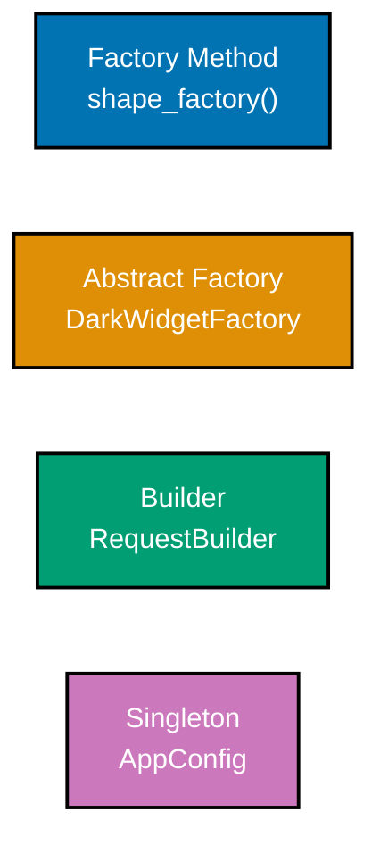

**`learning/code/ex-67-gof-gallery-creational/example.py`**

```python
"""Example 67: GoF Gallery -- Creational Patterns.

co-32 (gof-pattern-gallery): a single-file tour of the four essential creational
patterns -- factory method (co-16), abstract factory (co-17), builder (co-18), and
singleton (co-19) -- each constructs correctly, verified independently.
"""

from __future__ import annotations  # => defers type-hint evaluation for the forward references used below

from dataclasses import dataclass, field  # => field() supplies mutable defaults safely, used by HttpRequest

# ============================================================
# 1. Factory Method -- defer instantiation to a creation method
# ============================================================


class Shape:  # => the shared abstract product every factory-method output implements
    def area(self) -> float:  # => no body -- every concrete Shape must override this
        raise NotImplementedError  # => a plain-class stand-in for @abstractmethod, still enforces the contract


class Circle(Shape):  # => one concrete product
    def __init__(self, radius: float) -> None:  # => the constructor
        self.radius = radius  # => stores radius on this instance

    def area(self) -> float:  # => satisfies Shape's contract
        return 3.14159 * self.radius**2  # => pi * r^2


def shape_factory(kind: str, size: float) -> Shape:  # => the FACTORY METHOD -- caller never names Circle directly
    if kind == "circle":  # => the ONLY place that knows which concrete class to build
        return Circle(size)  # => constructs the concrete product internally, hidden from the caller
    raise ValueError(f"unknown shape kind: {kind}")  # => an honest failure for any kind this factory cannot build


# ============================================================
# 2. Abstract Factory -- a family of factory methods producing a matched set
# ============================================================


@dataclass  # => generates __init__ from the field below
class Button:  # => one member of the "widget family"
    theme: str  # => the family tag, part of the generated __init__


@dataclass  # => generates __init__ from the field below
class Checkbox:  # => the other member of the "widget family" -- must match Button's theme
    theme: str  # => the family tag, part of the generated __init__


class WidgetFactory:  # => the abstract factory interface
    def create_button(self) -> Button:  # => no body -- every concrete factory must override this
        raise NotImplementedError  # => a plain-class stand-in for @abstractmethod

    def create_checkbox(self) -> Checkbox:  # => no body -- every concrete factory must override this
        raise NotImplementedError  # => a plain-class stand-in for @abstractmethod


class DarkWidgetFactory(WidgetFactory):  # => one concrete factory -- produces a MATCHED dark-themed family
    def create_button(self) -> Button:  # => overrides the abstract factory method
        return Button(theme="dark")  # => always builds the dark-family Button, never mixed with other themes

    def create_checkbox(self) -> Checkbox:  # => overrides the abstract factory method
        return Checkbox(theme="dark")  # => always builds the dark-family Checkbox, matching create_button()


# ============================================================
# 3. Builder -- assemble a complex object step by step
# ============================================================


@dataclass  # => generates __init__ from the fields below
class HttpRequest:  # => the complex object being assembled
    url: str  # => the one required field
    headers: dict[str, str] = field(default_factory=dict)  # => field() avoids a shared mutable default dict
    body: str | None = None  # => optional, defaults to no body


class RequestBuilder:  # => the fluent builder -- no telescoping constructor needed
    def __init__(self, url: str) -> None:  # => the constructor takes only the one required part
        self._url = url  # => the one required part
        self._headers: dict[str, str] = {}  # => optional parts, added incrementally
        self._body: str | None = None  # => optional, starts unset until with_body() is called

    def with_header(self, key: str, value: str) -> "RequestBuilder":  # => returns self -- enables chaining
        self._headers[key] = value  # => accumulates one header per call, in-place
        return self  # => returning self is what makes .with_header(...).with_body(...) chainable

    def with_body(self, body: str) -> "RequestBuilder":  # => also returns self
        self._body = body  # => sets the optional body, overwriting any previous value
        return self  # => same chaining trick as with_header()

    def build(self) -> HttpRequest:  # => assembles the final immutable-in-spirit object
        return HttpRequest(url=self._url, headers=self._headers, body=self._body)  # => one call, fully assembled


# ============================================================
# 4. Singleton -- exactly one shared instance
# ============================================================


class AppConfig:  # => a minimal singleton, deliberately small for this gallery tour (see Example 30 for the cost)
    _instance: "AppConfig | None" = None  # => the one shared instance, or None before first use

    def __new__(cls) -> "AppConfig":  # => overridden so every AppConfig() returns the SAME object
        if cls._instance is None:  # => first call: create the one instance
            cls._instance = super().__new__(cls)  # => allocate it exactly once
        return cls._instance  # => every subsequent call returns the SAME object


if __name__ == "__main__":  # => demonstration entry point, executed only when this file is run directly
    circle = shape_factory("circle", 2.0)  # => 1. factory method
    print(round(circle.area(), 2))  # => constructs a Circle without the caller importing Circle
    # => Output: 12.57

    dark_factory: WidgetFactory = DarkWidgetFactory()  # => 2. abstract factory
    print(dark_factory.create_button().theme, dark_factory.create_checkbox().theme)  # => both match the same theme
    # => Output: dark dark

    # => 3. builder -- four chained calls assemble one HttpRequest, no telescoping constructor needed
    request = RequestBuilder("https://api.example.com").with_header("Accept", "json").with_body("{}").build()
    print(request.url, request.headers, request.body)  # => 3. builder, assembled without a telescoping constructor
    # => Output: https://api.example.com {'Accept': 'json'} {}

    print(AppConfig() is AppConfig())  # => 4. singleton -- exactly one shared instance
    # => Output: True
```

**Run**: `python3 example.py`

**Output**:

```text
12.57
dark dark
https://api.example.com {'Accept': 'json'} {}
True
```

**`learning/code/ex-67-gof-gallery-creational/test_example.py`**

```python
"""Example 67: pytest verification that each creational pattern constructs correctly."""

import pytest

from example import AppConfig, Circle, DarkWidgetFactory, RequestBuilder, shape_factory


def test_factory_method_constructs_the_correct_concrete_type() -> None:
    shape = shape_factory("circle", 2.0)  # => caller never named Circle directly
    assert isinstance(shape, Circle)  # => yet the correct concrete type was constructed
    with pytest.raises(ValueError):
        shape_factory("hexagon", 1.0)  # => an unknown kind is rejected cleanly


def test_abstract_factory_produces_a_matched_family() -> None:
    factory = DarkWidgetFactory()
    button = factory.create_button()
    checkbox = factory.create_checkbox()
    assert button.theme == checkbox.theme == "dark"  # => both members of the family share one theme


def test_builder_assembles_a_request_without_a_telescoping_constructor() -> None:
    request = RequestBuilder("https://api.example.com").with_header("Accept", "json").with_body("{}").build()
    assert request.url == "https://api.example.com"  # => the required part
    assert request.headers == {"Accept": "json"}  # => an optional part, included
    assert request.body == "{}"  # => another optional part, included


def test_singleton_returns_the_same_instance_every_time() -> None:
    assert AppConfig() is AppConfig()  # => two calls, one object


# => Run: pytest -q -- Output: 4 passed
```

**Verify**: `pytest -q`

**Output**:

```text
4 passed
```

**Key takeaway**: The four creational patterns answer different questions about "how does this object get built" -- one product from a name (factory method), a matched family (abstract factory), a complex object assembled step by step (builder), and exactly one shared instance (singleton) -- recognizing which question you're actually asking narrows the choice quickly.

**Why it matters**: Creation logic scattered across a codebase (direct `ClassName()` calls everywhere) is one of the most common sources of coupling to concrete implementations; centralizing it behind one of these four patterns is usually the cheapest, highest-leverage refactor available when a codebase needs to become more flexible about what gets constructed and how.

---

### Example 68: GoF Gallery -- Structural Patterns

_ex-68 &middot; exercises co-32, co-20, co-21, co-22, co-23, co-24_

A single-file tour of the five essential structural patterns -- adapter, decorator, facade, composite, and proxy -- each wraps correctly, verified independently in one gallery sweep.

**`learning/code/ex-68-gof-gallery-structural/example.py`**

```python
"""Example 68: GoF Gallery -- Structural Patterns.

co-32 (gof-pattern-gallery): a single-file tour of the five essential structural
patterns -- adapter (co-20), decorator (co-21), facade (co-22), composite (co-23),
and proxy (co-24) -- each wraps correctly, verified independently.
"""

from __future__ import annotations  # => defers type-hint evaluation for the forward references used below

from typing import Callable  # => Callable types the logging_decorator's wrapped function argument

# ============================================================
# 1. Adapter -- convert one interface into another a client expects
# ============================================================


class FahrenheitSensor:  # => the class being adapted -- exposes Fahrenheit only
    def read_fahrenheit(self) -> float:  # => the ONLY interface this class exposes
        return 98.6  # => a fixed sample reading, in Fahrenheit


class CelsiusAdapter:  # => converts FahrenheitSensor's interface into the one the client expects
    def __init__(self, sensor: FahrenheitSensor) -> None:  # => the constructor
        self._sensor = sensor  # => wraps the adapted object, held as a collaborator

    def read_celsius(self) -> float:  # => the interface the client actually wants
        return (self._sensor.read_fahrenheit() - 32) * 5 / 9  # => the conversion, hidden from the client


# ============================================================
# 2. Decorator -- wrap an object to add behavior without subclass explosion
# ============================================================


def logging_decorator(func: Callable[[str], str]) -> Callable[[str], str]:  # => wraps ANY str->str function
    def wrapped(message: str) -> str:  # => the replacement function returned in place of func
        result = func(message)  # => delegates to the wrapped function
        return f"[logged] {result}"  # => adds behavior around it, without editing func itself

    return wrapped  # => the decorator returns a NEW function, never mutates func in place


@logging_decorator  # => applies the wrapper at definition time -- greet IS wrapped from here on
def greet(name: str) -> str:  # => the wrapped function never knows it is being decorated
    return f"hello, {name}"  # => the original, undecorated behavior


# ============================================================
# 3. Facade -- one simplified entry point over a complex subsystem
# ============================================================


class Inventory:  # => one subsystem member
    def reserve(self, item: str) -> bool:  # => the reservation step, hidden inside the facade
        return True  # => stubbed: assume reservation always succeeds


class Payment:  # => another subsystem member
    def charge(self, amount: float) -> bool:  # => the charge step, hidden inside the facade
        return True  # => stubbed: assume payment always succeeds


class CheckoutFacade:  # => hides the sequencing of Inventory + Payment behind ONE call
    def __init__(self) -> None:  # => the constructor
        self._inventory = Inventory()  # => wires subsystem one internally
        self._payment = Payment()  # => wires subsystem two internally

    def checkout(self, item: str, amount: float) -> bool:  # => the caller makes ONE call
        return self._inventory.reserve(item) and self._payment.charge(amount)  # => sequencing hidden inside


# ============================================================
# 4. Composite -- treat individual objects and compositions uniformly
# ============================================================


class FileNode:  # => a leaf
    def __init__(self, size: int) -> None:  # => the constructor
        self.size = size  # => a leaf's own, fixed size

    def total_size(self) -> int:  # => the SHARED interface with DirectoryNode
        return self.size  # => a leaf's total IS its own size -- no recursion needed


class DirectoryNode:  # => a composite -- contains other FileNode or DirectoryNode children
    def __init__(self, children: list["FileNode | DirectoryNode"]) -> None:  # => the constructor
        self.children = children  # => a mix of leaves and/or nested composites, held uniformly

    def total_size(self) -> int:  # => the SAME interface as FileNode -- callers don't special-case leaf vs. group
        return sum(child.total_size() for child in self.children)  # => recurses uniformly


# ============================================================
# 5. Proxy -- a stand-in controlling access to a real subject
# ============================================================


class ExpensiveImage:  # => the "real subject", expensive to construct
    def __init__(self, path: str) -> None:  # => simulates a costly construction step
        self.path = path  # => stores the path on this instance
        self.loaded = True  # => simulates the expensive load happening at construction time


class LazyImageProxy:  # => the proxy -- defers construction until first access
    def __init__(self, path: str) -> None:  # => cheap: no ExpensiveImage built yet
        self._path = path  # => remembered so the real subject can be built later, on demand
        self._real: ExpensiveImage | None = None  # => not loaded yet

    def display(self) -> str:  # => the client-facing interface, identical shape to using ExpensiveImage directly
        if self._real is None:  # => only construct the real subject on FIRST access
            self._real = ExpensiveImage(self._path)  # => the expensive construction, deferred until now
        return f"displaying {self._real.path}"  # => every later call reuses the already-built real subject


if __name__ == "__main__":  # => demonstration entry point, executed only when this file is run directly
    adapter = CelsiusAdapter(FahrenheitSensor())  # => 1. adapter
    print(round(adapter.read_celsius(), 1))  # => the client reads Celsius, never touches Fahrenheit directly
    # => Output: 37.0

    print(greet("Ada"))  # => 2. decorator -- logging added without editing greet()
    # => Output: [logged] hello, Ada

    facade = CheckoutFacade()  # => 3. facade
    print(facade.checkout("Book", 12.5))  # => one call hides inventory + payment sequencing
    # => Output: True

    tree = DirectoryNode([FileNode(10), DirectoryNode([FileNode(5), FileNode(3)])])  # => 4. composite
    print(tree.total_size())  # => recursive total through ONE shared interface
    # => Output: 18

    proxy = LazyImageProxy("photo.png")  # => 5. proxy
    print(proxy._real is None)  # => not loaded yet -- proves laziness
    # => Output: True
    print(proxy.display())  # => triggers the load, on first access only
    # => Output: displaying photo.png
```

**Run**: `python3 example.py`

**Output**:

```text
37.0
[logged] hello, Ada
True
18
True
displaying photo.png
```

**`learning/code/ex-68-gof-gallery-structural/test_example.py`**

```python
"""Example 68: pytest verification that each structural pattern wraps correctly."""

from example import (
    CelsiusAdapter,
    CheckoutFacade,
    DirectoryNode,
    FahrenheitSensor,
    FileNode,
    LazyImageProxy,
    greet,
)


def test_adapter_converts_fahrenheit_to_celsius() -> None:
    adapter = CelsiusAdapter(FahrenheitSensor())
    assert round(adapter.read_celsius(), 1) == 37.0  # => the client reads Celsius only


def test_decorator_wraps_the_function_without_editing_it() -> None:
    assert greet("Ada") == "[logged] hello, Ada"  # => logging added purely by wrapping


def test_facade_hides_subsystem_sequencing_behind_one_call() -> None:
    facade = CheckoutFacade()
    assert facade.checkout("Book", 12.5) is True  # => one call, inventory + payment both succeeded


def test_composite_computes_a_recursive_total_via_one_interface() -> None:
    tree = DirectoryNode([FileNode(10), DirectoryNode([FileNode(5), FileNode(3)])])
    assert tree.total_size() == 18  # => leaf and composite share total_size()


def test_proxy_defers_loading_until_first_access() -> None:
    proxy = LazyImageProxy("photo.png")
    assert proxy._real is None  # => not loaded yet
    proxy.display()  # => triggers the load
    assert proxy._real is not None  # => loaded exactly once, on first access


# => Run: pytest -q -- Output: 5 passed
```

**Verify**: `pytest -q`

**Output**:

```text
5 passed
```

**Key takeaway**: The five structural patterns all answer "how do objects compose" -- adapter bridges mismatched interfaces, decorator layers behavior, facade simplifies a subsystem's entry point, composite unifies leaf and group, and proxy stands in for a real subject -- distinct enough intents to recognize at a glance once you've seen each shape once.

**Why it matters**: Structural patterns are the vocabulary for "how do I connect these two things without coupling them permanently" -- a question that comes up constantly at integration boundaries (third-party APIs via adapter, cross-cutting concerns via decorator, subsystem entry points via facade). Recognizing which shape a given integration problem has speeds up the design conversation dramatically.

---

### Example 69: GoF Gallery -- Behavioral Patterns

_ex-69 &middot; exercises co-32, co-25, co-26, co-27, co-28, co-29, co-30, co-31_

A single-file tour of seven essential behavioral patterns -- strategy, observer, command, template method, state, iterator, and chain of responsibility -- each dispatches correctly, verified independently in one gallery sweep.

**`learning/code/ex-69-gof-gallery-behavioral/example.py`**

```python
"""Example 69: GoF Gallery -- Behavioral Patterns.

co-32 (gof-pattern-gallery): a single-file tour of seven essential behavioral
patterns -- strategy (co-25), observer (co-26), command (co-27), template method
(co-28), state (co-29), iterator (co-30), and chain of responsibility (co-31) --
each dispatches correctly, verified independently.
"""

from __future__ import annotations  # => defers type-hint evaluation for the forward references used below

from abc import ABC, abstractmethod  # => builds the template-method, state, and chain-of-responsibility bases
from typing import Callable, Iterator  # => Callable types strategies/observers, Iterator types the custom collection

# ============================================================
# 1. Strategy -- interchangeable algorithms behind one interface
# ============================================================


def by_length(word: str) -> int:  # => one strategy
    return len(word)  # => a plain function IS a strategy -- no class hierarchy required


def sort_words(words: list[str], key: Callable[[str], int]) -> list[str]:  # => the dispatcher, takes a strategy
    return sorted(words, key=key)  # => the strategy decides HOW to compare


# ============================================================
# 2. Observer -- subjects notify subscribers without knowing them concretely
# ============================================================


class Publisher:  # => the subject
    def __init__(self) -> None:  # => the constructor
        self._subscribers: list[Callable[[str], None]] = []  # => knows only that subscribers are callables

    def subscribe(self, handler: Callable[[str], None]) -> None:  # => adding a subscriber needs no publisher edit
        self._subscribers.append(handler)  # => grows the list, nothing else

    def publish(self, message: str) -> None:  # => notifies every subscriber, without knowing what they do
        for handler in self._subscribers:  # => visits every registered subscriber, in order
            handler(message)  # => the subject never knows what a handler does with the message


# ============================================================
# 3. Command -- reify a request as an object with execute/undo
# ============================================================


class AddTextCommand:  # => a request, turned into an object
    def __init__(self, document: list[str], text: str) -> None:  # => the constructor
        self.document = document  # => the receiver this command acts on
        self.text = text  # => remembers WHAT it appended, needed later to undo

    def execute(self) -> None:  # => performs the request
        self.document.append(self.text)  # => the forward action

    def undo(self) -> None:  # => reverses the request
        self.document.remove(self.text)  # => the reverse action, mirroring execute() exactly


# ============================================================
# 4. Template Method -- a base defines the skeleton, subclasses fill steps
# ============================================================


class ReportBase(ABC):  # => defines the FIXED skeleton
    def run(self) -> str:  # => the shared flow, defined exactly once
        return f"[{self.header()}] {self.body()} [{self.footer()}]"  # => calls the varying steps in a fixed order

    @abstractmethod  # => forces every subclass to fill this ONE varying step
    def body(self) -> str:  # => the ONLY step subclasses must fill
        raise NotImplementedError  # => abstract method body, never actually executed

    def header(self) -> str:  # => a step with a sensible default, overridable
        return "REPORT"  # => the shared default, used unless a subclass overrides it

    def footer(self) -> str:  # => another step with a sensible default
        return "END"  # => the shared default, used unless a subclass overrides it


class SalesReport(ReportBase):  # => fills only the varying step
    def body(self) -> str:  # => overrides the ONE required step -- header() and footer() stay default
        return "sales: 42 units"  # => the only thing SalesReport ever needs to supply


# ============================================================
# 5. State -- represent states as objects so transitions are explicit
# ============================================================


class TrafficLightState(ABC):  # => the shared state interface every concrete light color implements
    @abstractmethod  # => forces every concrete state to define its own legal next transition
    def next(self) -> "TrafficLightState":  # => returns the NEXT legal state
        raise NotImplementedError  # => abstract method body, never actually executed


class Red(TrafficLightState):  # => one concrete state object, not a boolean flag
    def next(self) -> TrafficLightState:  # => encodes red's ONE legal transition
        return Green()  # => red -> green is the only legal move


class Green(TrafficLightState):  # => a second concrete state object
    def next(self) -> TrafficLightState:  # => encodes green's ONE legal transition
        return Yellow()  # => green -> yellow


class Yellow(TrafficLightState):  # => a third concrete state object, completing the cycle
    def next(self) -> TrafficLightState:  # => encodes yellow's ONE legal transition
        return Red()  # => yellow -> red, completing the cycle


# ============================================================
# 6. Iterator -- expose sequential access without revealing representation
# ============================================================


class EvenNumbers:  # => a custom collection with hidden internal representation
    def __init__(self, upper_bound: int) -> None:  # => the constructor
        self._upper_bound = upper_bound  # => the only internal state -- callers never see this directly

    def __iter__(self) -> Iterator[int]:  # => the iterator protocol -- callers just use a for loop
        current = 0  # => the iteration cursor, private to this generator
        while current < self._upper_bound:  # => stops once the bound is reached
            yield current  # => lazily yields the next even number
            current += 2  # => advances the cursor by 2, staying on even numbers


# ============================================================
# 7. Chain of Responsibility -- pass a request along handlers until one handles it
# ============================================================


class Handler(ABC):  # => the shared link interface every tier in the chain implements
    def __init__(self) -> None:  # => the constructor
        self._next: "Handler | None" = None  # => no successor linked yet -- set_next() wires it later

    def set_next(self, handler: "Handler") -> "Handler":  # => links this handler to the next one in the chain
        self._next = handler  # => stores the successor link
        return handler  # => returned so calls can chain: a.set_next(b).set_next(c)

    def handle(self, level: int) -> str:  # => tries to handle, or passes along
        if self.can_handle(level):  # => asks the CONCRETE subclass whether it can resolve this level
            return self.resolve(level)  # => yes -- resolve it here, the chain stops
        if self._next is not None:  # => not handled here -- pass to the next link
            return self._next.handle(level)  # => delegates, recursively, to the next handler in the chain
        return "UNHANDLED"  # => fell off the end of the chain

    @abstractmethod  # => forces every concrete handler to define its own eligibility check
    def can_handle(self, level: int) -> bool:
        raise NotImplementedError  # => abstract method body, never actually executed

    @abstractmethod  # => forces every concrete handler to define its own resolution
    def resolve(self, level: int) -> str:
        raise NotImplementedError  # => abstract method body, never actually executed


class TierOneSupport(Handler):  # => the FIRST link in the chain
    def can_handle(self, level: int) -> bool:  # => tier 1's own eligibility rule
        return level <= 1  # => only handles the lowest severity levels

    def resolve(self, level: int) -> str:  # => tier 1's own resolution
        return "resolved by tier 1"


class TierTwoSupport(Handler):  # => the SECOND link in the chain
    def can_handle(self, level: int) -> bool:  # => tier 2's own eligibility rule
        return level <= 2  # => handles what tier 1 could not

    def resolve(self, level: int) -> str:  # => tier 2's own resolution
        return "resolved by tier 2"


if __name__ == "__main__":  # => demonstration entry point, executed only when this file is run directly
    print(sort_words(["banana", "kiwi", "fig"], key=by_length))  # => 1. strategy
    # => Output: ['fig', 'kiwi', 'banana']

    events: list[str] = []  # => the list the observer's handler will append into
    publisher = Publisher()  # => 2. observer
    publisher.subscribe(lambda msg: events.append(msg.upper()))  # => registers a handler, no Publisher edit needed
    publisher.publish("news")  # => notifies every subscriber, this one included
    print(events)
    # => Output: ['NEWS']

    doc: list[str] = []  # => the receiver AddTextCommand will mutate
    cmd = AddTextCommand(doc, "hello")  # => 3. command
    cmd.execute()  # => performs the request: appends "hello" to doc
    cmd.undo()  # => reverses the SAME request: removes "hello" from doc
    print(doc)
    # => Output: []

    print(SalesReport().run())  # => 4. template method
    # => Output: [REPORT] sales: 42 units [END]

    light: TrafficLightState = Red()  # => 5. state
    light = light.next()  # => transitions via a method call, never an if/elif on a string or int flag
    print(type(light).__name__)
    # => Output: Green

    print(list(EvenNumbers(10)))  # => 6. iterator
    # => Output: [0, 2, 4, 6, 8]

    tier_one: Handler = TierOneSupport()  # => 7. chain of responsibility
    tier_two = TierTwoSupport()  # => the second link, not yet wired into the chain
    tier_one.set_next(tier_two)  # => wires tier_one -> tier_two
    print(tier_one.handle(2))  # => tier 1 can't handle level 2, passes to tier 2
    # => Output: resolved by tier 2
```

**Run**: `python3 example.py`

**Output**:

```text
['fig', 'kiwi', 'banana']
['NEWS']
[]
[REPORT] sales: 42 units [END]
Green
[0, 2, 4, 6, 8]
resolved by tier 2
```

**`learning/code/ex-69-gof-gallery-behavioral/test_example.py`**

```python
"""Example 69: pytest verification that each behavioral pattern dispatches correctly."""

from example import (
    AddTextCommand,
    EvenNumbers,
    Green,
    Publisher,
    Red,
    SalesReport,
    TierOneSupport,
    TierTwoSupport,
    by_length,
    sort_words,
)


def test_strategy_sorts_by_the_supplied_key() -> None:
    assert sort_words(["banana", "kiwi", "fig"], key=by_length) == ["fig", "kiwi", "banana"]  # => shortest first


def test_observer_notifies_a_subscriber_without_publisher_edits() -> None:
    events: list[str] = []
    publisher = Publisher()
    publisher.subscribe(lambda msg: events.append(msg.upper()))  # => registered without editing Publisher
    publisher.publish("news")
    assert events == ["NEWS"]


def test_command_undo_reverses_the_last_command() -> None:
    doc: list[str] = []
    cmd = AddTextCommand(doc, "hello")
    cmd.execute()
    assert doc == ["hello"]
    cmd.undo()
    assert doc == []  # => undo reversed exactly what execute() did


def test_template_method_shares_the_flow_and_fills_only_body() -> None:
    assert SalesReport().run() == "[REPORT] sales: 42 units [END]"  # => header/footer defaults, body overridden


def test_state_moves_red_to_green_via_next() -> None:
    light = Red()
    light = light.next()
    assert isinstance(light, Green)  # => the state pattern's transition, verified by type


def test_iterator_yields_even_numbers_lazily() -> None:
    assert list(EvenNumbers(10)) == [0, 2, 4, 6, 8]  # => a for-loop-compatible custom iterator


def test_chain_of_responsibility_falls_through_to_the_next_handler() -> None:
    tier_one = TierOneSupport()
    tier_two = TierTwoSupport()
    tier_one.set_next(tier_two)
    assert tier_one.handle(2) == "resolved by tier 2"  # => tier 1 couldn't handle it, tier 2 did


# => Run: pytest -q -- Output: 7 passed
```

**Verify**: `pytest -q`

**Output**:

```text
7 passed
```

**Key takeaway**: The behavioral patterns all answer "how do objects communicate and share responsibility" -- swap an algorithm (strategy), broadcast a change (observer), reify a request (command), share a flow while varying one step (template method), make transitions explicit (state), hide iteration mechanics (iterator), or pass work down a chain until someone claims it (chain of responsibility).

**Why it matters**: Behavioral patterns are the largest GoF family because "how do objects coordinate" is where most real design decisions live -- event systems, undo stacks, pluggable algorithms, and workflow engines in production code are almost always one of these seven shapes wearing different domain names.

---

### Example 70: SOLID -- Full Order Engine

_ex-70 &middot; exercises co-01, co-02, co-03, co-04, co-05_

All five SOLID principles applied together to one small order engine, each at its own seam: SRP splits pricing/persistence/receipts into three classes, OCP adds a discount without editing the dispatcher, LSP lets any `DiscountStrategy` substitute for another, ISP gives `OrderService` only the narrow `Repository` protocol it needs, and DIP has `OrderService` depend on that protocol rather than a concrete database class.

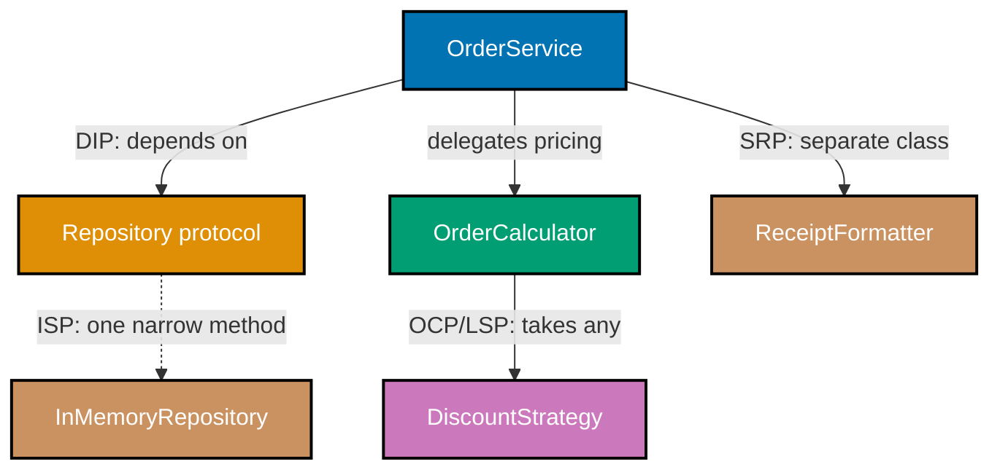

**`learning/code/ex-70-solid-full-order-engine/example.py`**

```python
"""Example 70: SOLID -- Full Order Engine.

co-01..co-05: all five SOLID principles applied together to one small order engine,
each at its own seam -- SRP splits pricing/persistence/receipts into three classes;
OCP adds a new discount without editing the dispatcher; LSP lets any DiscountStrategy
substitute for another without breaking OrderCalculator; ISP gives OrderService only
the narrow Repository protocol it needs, not a fat one; DIP has OrderService depend
on that protocol, not a concrete database class.
"""

from __future__ import annotations  # => defers type-hint evaluation for the forward references used below

from dataclasses import dataclass, field  # => field() supplies a safe mutable default for Order.items
from typing import Protocol  # => Protocol declares the DiscountStrategy and Repository abstractions

# ============================================================
# SRP -- three classes, three reasons to change
# ============================================================


@dataclass  # => generates __init__ from the field below
class Order:  # => plain data: an order's line items
    items: dict[str, float] = field(default_factory=dict)  # => item name -> unit price


class DiscountStrategy(Protocol):  # => OCP: new discounts are added as new classes, not new elif branches
    def apply(self, subtotal: float) -> float: ...  # => every strategy takes a subtotal, returns the discounted total


class NoDiscount:  # => LSP: substitutable for any other DiscountStrategy -- never breaks a caller's expectations
    def apply(self, subtotal: float) -> float:  # => satisfies DiscountStrategy structurally
        return subtotal  # => no discount applied


class TenPercentOff:  # => LSP: also substitutable -- honors the SAME contract (never returns MORE than subtotal)
    def apply(self, subtotal: float) -> float:  # => satisfies DiscountStrategy structurally
        return subtotal * 0.90  # => a flat 10% off, still honors the "never exceeds subtotal" contract


# => OrderCalculator never imports InMemoryRepository or ReceiptFormatter -- it only knows discount strategies
class OrderCalculator:  # => SRP: pricing, and only pricing -- depends on the DiscountStrategy ABSTRACTION (DIP)
    def total(self, order: Order, discount: DiscountStrategy) -> float:  # => OCP: adding a discount needs no edit here
        subtotal = sum(order.items.values())  # => information-expert: Order holds items, this sums them
        return discount.apply(subtotal)  # => delegates the VARYING part to whichever strategy was passed in


class Repository(Protocol):  # => ISP: OrderService depends on ONLY this narrow protocol, not a fat DB interface
    def save(self, order_id: str, total: float) -> None: ...  # => the ONE method OrderService actually calls


# => a real implementation might be Postgres or Redis -- OrderService would not need to change at all
class InMemoryRepository:  # => a concrete, swappable implementation of the Repository protocol
    def __init__(self) -> None:  # => the constructor
        self.saved: dict[str, float] = {}  # => order_id -> total, standing in for a real database

    def save(self, order_id: str, total: float) -> None:  # => satisfies Repository structurally
        self.saved[order_id] = total  # => the ONE narrow responsibility this class has


class ReceiptFormatter:  # => SRP: formatting, and only formatting -- its own reason to change, separate from pricing
    def format(self, order_id: str, total: float) -> str:  # => defines the format() method
        return f"Order {order_id}: ${total:.2f}"  # => a pure string-building step, no pricing or persistence here


# => this is the class DIP is really about: it depends on Repository (abstract), never on InMemoryRepository (concrete)
class OrderService:  # => DIP: depends on the Repository ABSTRACTION, never on InMemoryRepository directly
    def __init__(self, calculator: OrderCalculator, repository: Repository) -> None:  # => both injected, not constructed
        self._calculator = calculator  # => the high-level policy owns these abstractions
        self._repository = repository  # => held as a collaborator, never constructed internally

    def checkout(self, order_id: str, order: Order, discount: DiscountStrategy) -> float:  # => the ONE orchestrating method
        total = self._calculator.total(order, discount)  # => delegates pricing
        self._repository.save(order_id, total)  # => delegates persistence, via the ABSTRACT protocol only
        return total  # => hands the computed total back to the caller


if __name__ == "__main__":  # => demonstration entry point, executed only when this file is run directly
    order = Order(items={"Book": 20.0, "Pen": 5.0})  # => subtotal = 25.0
    calculator = OrderCalculator()  # => constructs the pricing collaborator
    repository = InMemoryRepository()  # => constructs the persistence collaborator
    service = OrderService(calculator, repository)  # => DIP: injected, not hard-coded

    total_no_discount = service.checkout("ord-1", order, NoDiscount())  # => LSP: NoDiscount substitutes cleanly
    print(total_no_discount)  # => the undiscounted subtotal
    # => Output: 25.0

    total_with_discount = service.checkout("ord-2", order, TenPercentOff())  # => OCP: swapped WITHOUT editing service
    print(total_with_discount)  # => the SAME checkout() method, a different discount object
    # => Output: 22.5

    formatter = ReceiptFormatter()  # => SRP: a third, independent responsibility
    print(formatter.format("ord-2", total_with_discount))  # => confirms formatting stays separate from pricing
    # => Output: Order ord-2: $22.50

    print(repository.saved)  # => confirms persistence happened via the Repository protocol only
    # => Output: {'ord-1': 25.0, 'ord-2': 22.5}
    # => all five SOLID seams cooperated in this one run: SRP, OCP, LSP, ISP, and DIP each did real work above
```

**Run**: `python3 example.py`

**Output**:

```text
25.0
22.5
Order ord-2: $22.50
{'ord-1': 25.0, 'ord-2': 22.5}
```

**`learning/code/ex-70-solid-full-order-engine/test_example.py`**

```python
"""Example 70: pytest verification of each SOLID seam in the order engine."""

from example import (
    InMemoryRepository,
    NoDiscount,
    Order,
    OrderCalculator,
    OrderService,
    ReceiptFormatter,
    TenPercentOff,
)


def test_srp_each_class_has_exactly_one_reason_to_change() -> None:
    assert not hasattr(OrderCalculator(), "save")  # => pricing never touches persistence
    assert not hasattr(InMemoryRepository(), "total")  # => persistence never touches pricing
    assert not hasattr(ReceiptFormatter(), "apply")  # => formatting never touches discounting


def test_ocp_a_new_discount_is_added_without_editing_order_calculator() -> None:
    order = Order(items={"Book": 20.0, "Pen": 5.0})
    calculator = OrderCalculator()
    assert calculator.total(order, NoDiscount()) == 25.0
    assert calculator.total(order, TenPercentOff()) == 22.5  # => new strategy, zero edits to OrderCalculator.total


def test_lsp_any_discount_strategy_substitutes_for_another_without_breaking_the_caller() -> None:
    order = Order(items={"Book": 20.0})
    calculator = OrderCalculator()
    for discount in (NoDiscount(), TenPercentOff()):  # => both honor "never return more than subtotal"
        assert calculator.total(order, discount) <= 20.0  # => the contract every substitutable strategy must satisfy


def test_isp_order_service_depends_on_only_the_narrow_save_method() -> None:
    repository = InMemoryRepository()
    assert not hasattr(repository, "delete") and not hasattr(repository, "update")  # => no fat interface exists here
    assert hasattr(repository, "save")  # => exactly the one method OrderService's Repository protocol needs


def test_dip_order_service_never_constructs_a_concrete_repository_itself() -> None:
    order = Order(items={"Book": 20.0})
    repository = InMemoryRepository()  # => constructed OUTSIDE OrderService and injected in
    service = OrderService(OrderCalculator(), repository)
    total = service.checkout("ord-1", order, NoDiscount())
    assert total == 20.0
    assert repository.saved == {"ord-1": 20.0}  # => persistence happened through the injected abstraction


# => Run: pytest -q -- Output: 5 passed
```

**Verify**: `pytest -q`

**Output**:

```text
5 passed
```

**Key takeaway**: The five SOLID principles are not five separate checklists to apply in isolation -- in a real design they compose: SRP decides where a responsibility lives, DIP decides what abstraction the caller depends on, OCP/LSP together decide how that abstraction's implementations can grow, and ISP keeps each dependency narrow.

**Why it matters**: A single small order engine touching all five principles is exactly the shape of code most production services take -- pricing, persistence, and formatting concerns intertwined by default unless deliberately separated. Seeing all five seams in one file makes the principles' interdependence concrete instead of five disconnected rules memorized separately.

---

### Example 71: GRASP -- Full Assignment

_ex-71 &middot; exercises co-06, co-07, co-08, co-09, co-10, co-11, co-12, co-13, co-14_

All nine GRASP patterns assigned across one small library-checkout domain: `Loan` is the information expert for its own fee; `Library` is the creator of its `Loan`s; `LibraryController` routes checkout requests so the UI never touches the domain directly; low coupling and indirection keep `Library` and the overdue notifier decoupled through a callback; `Loan`'s methods stay high-cohesion; `FeePolicy` dispatches polymorphically; `LoanRepository` is a pure fabrication keeping `Library` IO-free; and the `FeePolicy` interface protects against variations in the fee rule.

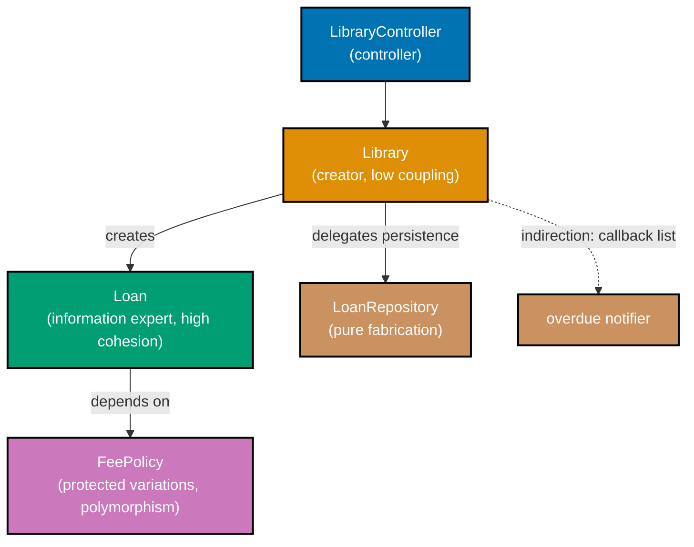

**`learning/code/ex-71-grasp-full-assignment/example.py`**

```python
"""Example 71: GRASP -- Full Assignment.

co-06..co-14: all nine GRASP patterns assigned across one small library-checkout
domain -- information expert, creator, controller, low coupling, high cohesion,
polymorphism, pure fabrication, indirection, and protected variations -- each
pattern placed at the point in the domain that motivated it.
"""

from __future__ import annotations  # => defers type-hint evaluation for the forward references used below

from dataclasses import dataclass  # => Loan uses only plain fields, so only dataclass itself is needed here
from datetime import date, timedelta  # => date drives due_date/overdue math, timedelta computes the loan period
from typing import Callable, Protocol  # => Protocol declares FeePolicy and OverdueNotifier, both stable seams

# ============================================================
# 9. Protected Variations -- an unstable fee RULE wrapped behind a stable interface
# ============================================================


class FeePolicy(Protocol):  # => the stable interface -- a fee-rule change never touches Loan
    def daily_rate(self) -> float: ...  # => the ONE method every fee rule must provide


class StandardFeePolicy:  # => one concrete, swappable rule
    def daily_rate(self) -> float:  # => satisfies FeePolicy structurally
        return 0.25  # => the standard-member daily rate


# ============================================================
# 6. Polymorphism -- dispatch on fee policy type, no if/elif type-switch anywhere
# ============================================================


class PremiumFeePolicy:  # => a SECOND concrete rule -- Loan never branches on which one it got
    def daily_rate(self) -> float:  # => satisfies FeePolicy structurally, same shape as StandardFeePolicy
        return 0.10  # => premium members pay a lower daily rate


# ============================================================
# 5. High Cohesion + 1. Information Expert -- Loan's methods all use ITS OWN fields
# ============================================================


@dataclass  # => generates __init__ from the fields below
class Loan:  # => holds due_date, so Loan is the natural INFORMATION EXPERT for lateness/fee math
    book_title: str  # => plain field, part of the generated __init__
    borrower: str  # => plain field, part of the generated __init__
    due_date: date  # => plain field, part of the generated __init__
    fee_policy: FeePolicy  # => co-14: depends on the STABLE interface, not a concrete policy class

    def days_overdue(self, today: date) -> int:  # => every method here reads ONLY this instance's own fields
        return max(0, (today - self.due_date).days)  # => high cohesion: no unrelated state touched

    def fee(self, today: date) -> float:  # => information-expert: Loan owns due_date, so Loan computes the fee
        return self.days_overdue(today) * self.fee_policy.daily_rate()  # => co-6: dispatches polymorphically


# ============================================================
# 8. Pure Fabrication -- LoanRepository is not a domain concept, invented for persistence
# ============================================================


class LoanRepository:  # => co-12: a non-domain class that exists purely to keep Library IO-free
    def __init__(self) -> None:  # => the constructor
        self._loans: list[Loan] = []  # => stands in for a real database table

    def add(self, loan: Loan) -> None:  # => the ONE write path
        self._loans.append(loan)  # => appended, never mutated after this

    def all(self) -> list[Loan]:  # => the ONE read path
        return list(self._loans)  # => returns a COPY, so callers cannot mutate internal state


# ============================================================
# 2. Creator -- Library aggregates Loans, so Library is the natural creator of one
# ============================================================


class OverdueNotifier(Protocol):  # => co-13: the mediator's narrow interface
    def __call__(self, loan: Loan, /) -> None: ...  # => positional-only so a bare Callable[[Loan], None] matches structurally


class Library:  # => co-9: LOW COUPLING -- Library never imports a concrete notification class
    def __init__(self, repository: LoanRepository, on_overdue: OverdueNotifier | None = None) -> None:  # => both injected
        self._repository = repository  # => co-12: depends on the pure fabrication, not raw persistence code
        self._on_overdue: list[OverdueNotifier] = []  # => co-13: INDIRECTION -- a list of callbacks, not direct refs
        if on_overdue is not None:  # => the optional notifier is registered only if the caller supplied one
            self._on_overdue.append(on_overdue)  # => co-9: coupling is through a callable, not a concrete class

    def checkout(self, book_title: str, borrower: str, fee_policy: FeePolicy) -> Loan:  # => co-7: CREATOR
        due_date = date.today() + timedelta(days=14)  # => Library aggregates Loans, so it creates them (co-7)
        loan = Loan(book_title, borrower, due_date, fee_policy)  # => the natural creation point
        self._repository.add(loan)  # => delegated to the pure fabrication
        return loan  # => hands the newly created Loan back to the caller

    def check_for_overdue(self, today: date) -> list[Loan]:  # => scans every stored loan for lateness
        overdue = [loan for loan in self._repository.all() if loan.days_overdue(today) > 0]  # => filters via Loan itself
        for loan in overdue:  # => visits each overdue loan
            for notify in self._on_overdue:  # => co-13: Library talks only to the MEDIATOR list, never to a concrete notifier
                notify(loan)  # => co-9: no import of any concrete notification class anywhere in Library
        return overdue  # => hands the overdue subset back to the caller


# ============================================================
# 4. Controller -- routes the "checkout" event; the UI never touches Library directly
# ============================================================


class LibraryController:  # => co-8: a dedicated coordinating object between UI events and the domain
    def __init__(self, library: Library) -> None:  # => the constructor
        self._library = library  # => the ONE domain collaborator the controller coordinates with

    def handle_checkout_request(self, book_title: str, borrower: str, is_premium: bool) -> Loan:  # => the ENTRY POINT
        policy: FeePolicy = PremiumFeePolicy() if is_premium else StandardFeePolicy()  # => co-6: chosen, not switched on later
        return self._library.checkout(book_title, borrower, policy)  # => the UI calls THIS, never Library directly


# ============================================================
# Wiring: an event log stands in for a real NotificationService, decoupled via co-13
# ============================================================


def make_logging_notifier(log: list[str]) -> Callable[[Loan], None]:  # => co-9: Library only knows this is callable
    def notify(loan: Loan) -> None:  # => the actual callback, closing over `log`
        log.append(f"{loan.borrower} is overdue on {loan.book_title}")  # => the ONE side effect this notifier has

    return notify  # => a plain function IS a valid OverdueNotifier -- no class required


if __name__ == "__main__":  # => demonstration entry point, executed only when this file is run directly
    notifications: list[str] = []  # => the log the notifier closure above appends into
    repository = LoanRepository()  # => 8. pure fabrication
    library = Library(repository, on_overdue=make_logging_notifier(notifications))  # => 9. low coupling + 13 indirection
    controller = LibraryController(library)  # => 4. controller

    controller.handle_checkout_request("Clean Code", "Ada", is_premium=False)  # => 2. creator, via Library.checkout
    controller.handle_checkout_request("Refactoring", "Grace", is_premium=True)  # => 6. polymorphism: different policy

    past_due = date.today() + timedelta(days=20)  # => simulate 6 days overdue
    overdue_loans = library.check_for_overdue(past_due)  # => triggers both the query and the mediated notification
    print(len(overdue_loans))  # => both loans are overdue by this date
    # => Output: 2
    print(round(overdue_loans[0].fee(past_due), 2))  # => 1. information expert: Loan computes its own fee
    # => Output: 1.5
    print(round(overdue_loans[1].fee(past_due), 2))  # => 6. polymorphism: premium's LOWER daily rate applied
    # => Output: 0.6
    print(len(notifications))  # => 13. indirection worked: notifier fired without Library knowing its concrete type
    # => Output: 2
```

**Run**: `python3 example.py`

**Output**:

```text
2
1.5
0.6
2
```

**`learning/code/ex-71-grasp-full-assignment/test_example.py`**

```python
"""Example 71: pytest verification that each of the nine GRASP patterns is placed correctly."""

from datetime import timedelta

from example import (
    Library,
    LibraryController,
    LoanRepository,
    PremiumFeePolicy,
    StandardFeePolicy,
    make_logging_notifier,
)


def test_information_expert_loan_computes_its_own_fee() -> None:
    repository = LoanRepository()
    library = Library(repository)
    loan = library.checkout("Clean Code", "Ada", StandardFeePolicy())  # => Loan owns due_date, computes its own fee
    later = loan.due_date + timedelta(days=4)
    assert loan.fee(later) == 1.0  # => 4 days overdue * $0.25/day


def test_creator_library_creates_its_own_loans() -> None:
    repository = LoanRepository()
    library = Library(repository)
    loan = library.checkout("Refactoring", "Grace", StandardFeePolicy())
    assert loan in repository.all()  # => the creation method lives on Library, not scattered elsewhere


def test_controller_routes_the_checkout_request_so_the_ui_never_touches_library_directly() -> None:
    repository = LoanRepository()
    library = Library(repository)
    controller = LibraryController(library)
    loan = controller.handle_checkout_request("Domain-Driven Design", "Eric", is_premium=True)
    assert loan.book_title == "Domain-Driven Design"  # => reached the domain only through the controller


def test_polymorphism_premium_and_standard_policies_dispatch_differently() -> None:
    repository = LoanRepository()
    library = Library(repository)
    standard_loan = library.checkout("Book A", "Bob", StandardFeePolicy())
    premium_loan = library.checkout("Book B", "Cate", PremiumFeePolicy())
    later = standard_loan.due_date + timedelta(days=10)
    assert standard_loan.fee(later) > premium_loan.fee(later)  # => same days overdue, different rate, no type-switch


def test_pure_fabrication_repository_keeps_library_io_free() -> None:
    repository = LoanRepository()
    assert not hasattr(Library(repository), "_loans")  # => Library never holds raw persistence state itself


def test_low_coupling_and_indirection_notifier_fires_without_a_concrete_reference() -> None:
    log: list[str] = []
    repository = LoanRepository()
    library = Library(repository, on_overdue=make_logging_notifier(log))  # => Library only knows a callable exists
    loan = library.checkout("Overdue Book", "Dan", StandardFeePolicy())
    past_due = loan.due_date + timedelta(days=1)
    library.check_for_overdue(past_due)
    assert log == ["Dan is overdue on Overdue Book"]  # => the mediator/callback fired, decoupled from any class name


def test_high_cohesion_loan_methods_touch_only_its_own_fields() -> None:
    loan = Library(LoanRepository()).checkout("Book C", "Eve", StandardFeePolicy())
    assert loan.days_overdue(loan.due_date) == 0  # => not yet due
    assert loan.days_overdue(loan.due_date + timedelta(days=3)) == 3  # => uses only its own due_date


def test_protected_variations_swapping_the_fee_policy_needs_no_loan_edit() -> None:
    repository = LoanRepository()
    library = Library(repository)
    loan = library.checkout("Book D", "Frank", PremiumFeePolicy())  # => a DIFFERENT policy, same Loan class
    assert loan.fee_policy.daily_rate() == 0.10  # => the swap is transparent through the FeePolicy interface


# => Run: pytest -q -- Output: 8 passed
```

**Verify**: `pytest -q`

**Output**:

```text
8 passed
```

**Key takeaway**: GRASP is not nine independent rules to memorize -- in a real domain they cluster around a small number of decisions: who owns the data (information expert, creator, high cohesion) and how collaborators talk to each other (low coupling, indirection, protected variations, polymorphism), with controller and pure fabrication as the two escape hatches for responsibilities that don't fit either camp.

**Why it matters**: A checkout-and-notify workflow like this one is one of the most common shapes in production software (e-commerce, library systems, subscription billing), and every GRASP decision made here recurs in each of those domains. Seeing all nine placed in one small, runnable example makes the underlying question each pattern answers ("who should know this? who should own this?") concrete rather than abstract.

---

### Example 72: LSP -- Contract Test

_ex-72 &middot; exercises co-03_

A single contract-test suite (`run_stack_contract`) that any `Stack` implementation must pass -- LIFO order, size tracking, and raising on pop-from-empty. A conforming `ListStack` passes it; a subtype that silently behaves like a queue (`BuggyQueueAsStack`) fails the SAME contract, with no separate test file needed per implementation.

**`learning/code/ex-72-lsp-contract-test/example.py`**

```python
"""Example 72: LSP -- Contract Test.

co-03: a single contract-test suite that ANY Stack implementation must satisfy --
LIFO push/pop order, size tracking, and raising on pop-from-empty. A conforming
subtype passes every check; a subtype that violates the Liskov substitution
principle (silently behaving like a queue instead of a stack) fails the SAME
contract, without writing a separate test file per implementation.
"""

from __future__ import annotations  # => defers type-hint evaluation, not strictly required here but kept for consistency

from typing import Protocol  # => Protocol declares the structural contract every Stack implementation must satisfy


# => this Protocol is the SINGLE source of truth both implementations below are measured against
# => four clauses total: push, pop, is_empty, size -- run_stack_contract below exercises all four
class StackLike(Protocol):  # => the contract every Stack implementation promises to honor
    def push(self, item: int) -> None: ...  # => clause: adds one item
    def pop(self) -> int: ...  # => clause: removes and returns the MOST RECENTLY pushed item
    def is_empty(self) -> bool: ...  # => clause: reports whether any items remain
    def size(self) -> int: ...  # => clause: reports how many items remain


# => ListStack and BuggyQueueAsStack both satisfy StackLike STRUCTURALLY -- only the contract test below catches the difference
class ListStack:  # => a conforming implementation -- true last-in-first-out order
    def __init__(self) -> None:  # => the constructor
        self._items: list[int] = []  # => the backing storage, empty at construction

    def push(self, item: int) -> None:  # => satisfies StackLike's push clause
        self._items.append(item)  # => appends to the END of the list -- pop() below removes from here too

    def pop(self) -> int:  # => satisfies StackLike's pop clause
        if self.is_empty():  # => satisfies the "raises on pop-from-empty" clause of the contract
            raise IndexError("pop from empty stack")  # => an honest failure, never a silent wrong answer
        return self._items.pop()  # => removes and returns the LAST item pushed -- LIFO

    def is_empty(self) -> bool:  # => satisfies StackLike's is_empty clause
        return len(self._items) == 0  # => true exactly when nothing has been pushed and not yet popped

    def size(self) -> int:  # => satisfies StackLike's size clause
        return len(self._items)  # => the current count of pushed-but-not-popped items


# => notice this class's method SIGNATURES are identical to ListStack's -- only pop()'s BEHAVIOR differs
class BuggyQueueAsStack:  # => LSP VIOLATION: looks like a Stack, secretly behaves like a queue (FIFO)
    def __init__(self) -> None:  # => the constructor -- identical to ListStack's
        self._items: list[int] = []  # => the backing storage, empty at construction

    def push(self, item: int) -> None:  # => IDENTICAL to ListStack.push -- the bug is not here
        self._items.append(item)  # => appends to the END of the list, same as ListStack

    def pop(self) -> int:  # => structurally satisfies StackLike's pop clause -- but VIOLATES its LIFO promise
        if self.is_empty():  # => still raises on empty, so this clause alone would pass
            raise IndexError("pop from empty stack")  # => an honest failure for the empty case
        return self._items.pop(0)  # => BUG: removes the FIRST item -- FIFO order, not LIFO

    def is_empty(self) -> bool:  # => IDENTICAL to ListStack.is_empty
        return len(self._items) == 0  # => same logic, same correctness

    def size(self) -> int:  # => IDENTICAL to ListStack.size
        return len(self._items)  # => same logic, same correctness


# => a type-level parameter, not an instance -- run_stack_contract works for ANY conforming class, unmodified
def run_stack_contract(make_stack: type[StackLike]) -> None:  # => the ONE contract every subtype must pass
    stack = make_stack()  # => constructs whichever implementation was passed in, generically
    # => the SAME four assertions below run for both ListStack and BuggyQueueAsStack -- only the outcome differs
    assert stack.is_empty()  # => clause 1: starts empty
    stack.push(1)  # => pushed first -- should be the LAST one popped, if LIFO holds
    stack.push(2)  # => pushed second
    stack.push(3)  # => pushed third and last -- should be the FIRST one popped, if LIFO holds
    assert stack.size() == 3  # => clause 2: size tracks pushes
    top = stack.pop()  # => the value under test -- LIFO demands this be 3
    assert top == 3, f"LSP violation: expected LIFO top 3, got {top}"  # => clause 3: LIFO order
    assert stack.size() == 2  # => clause 4: size tracks pops
    # => reaching this line without an AssertionError means every clause of the contract held


if __name__ == "__main__":  # => demonstration entry point, executed only when this file is run directly
    # => no separate ListStackTest / BuggyQueueAsStackTest classes exist -- one contract function serves both
    run_stack_contract(ListStack)  # => the SAME contract function, applied to the conforming implementation
    print("ListStack: contract satisfied")  # => reached only if every assertion above passed
    # => Output: ListStack: contract satisfied

    try:  # => catches the assertion failure so this demonstration can print it, instead of crashing
        run_stack_contract(BuggyQueueAsStack)  # => the SAME contract function, now applied to the buggy one
        print("BuggyQueueAsStack: contract satisfied")  # => unreached -- the LIFO assertion fails first
    except AssertionError as error:  # => catches the SAME contract's failure, without a separate test file
        print(f"BuggyQueueAsStack: contract VIOLATED -- {error}")  # => the LSP violation surfaces here
    # => Output: BuggyQueueAsStack: contract VIOLATED -- LSP violation: expected LIFO top 3, got 1
```

**Run**: `python3 example.py`

**Output**:

```text
ListStack: contract satisfied
BuggyQueueAsStack: contract VIOLATED -- LSP violation: expected LIFO top 3, got 1
```

**`learning/code/ex-72-lsp-contract-test/test_example.py`**

```python
"""Example 72: pytest verification that the SAME contract passes ListStack and fails BuggyQueueAsStack."""

import pytest

from example import BuggyQueueAsStack, ListStack, run_stack_contract


def test_conforming_implementation_satisfies_the_stack_contract() -> None:
    run_stack_contract(ListStack)  # => no exception raised -- LSP holds: ListStack substitutes cleanly


def test_violating_subtype_fails_the_same_contract() -> None:
    with pytest.raises(AssertionError, match="LSP violation"):
        run_stack_contract(BuggyQueueAsStack)  # => the SAME contract catches the violation, no new test file needed


def test_empty_stack_raises_on_pop_for_both_implementations() -> None:
    for make_stack in (ListStack, BuggyQueueAsStack):
        stack = make_stack()
        with pytest.raises(IndexError):
            stack.pop()  # => both implementations honor this part of the contract correctly


# => Run: pytest -q -- Output: 3 passed
```

**Verify**: `pytest -q`

**Output**:

```text
3 passed
```

**Key takeaway**: LSP is testable, not just a design opinion -- write the contract ONCE as a function, and run it against every subtype. A subtype that "compiles" but behaves differently under the same contract is exactly what LSP forbids.

**Why it matters**: Contract tests catch LSP violations automatically in CI, the moment a new subtype is added, instead of relying on a reviewer noticing a subtle behavioral difference during code review.

---

### Example 73: ISP -- Protocol Decomposition

_ex-73 &middot; exercises co-04_

A fat `FatWorker` protocol bundling print/scan/fax forces every implementer to support all three. Decomposing it into `Printer`, `Scanner`, and `FaxMachine` -- each a narrow `Protocol` -- lets a minimal `BasicPrinter` satisfy only `Printer`, structurally, with no unused-method stubs and no explicit inheritance declaration.

**`learning/code/ex-73-isp-protocol-decomposition/example.py`**

```python
"""Example 73: ISP -- Protocol Decomposition.

co-04: a fat `Worker` service (print + scan + fax) forces every implementation to
stub methods it does not need. Decomposing it into fine-grained `Printer`,
`Scanner`, and `FaxMachine` protocols lets a minimal implementation (a
print-only device) satisfy only the protocol it actually needs, structurally --
no explicit inheritance, no unused-method stubs.
"""

from __future__ import annotations  # => defers type-hint evaluation for the forward references used below

from typing import Protocol, runtime_checkable  # => runtime_checkable enables isinstance() checks below

# ============================================================
# BEFORE: one fat protocol -- every implementer forced to support all three
# ============================================================


# => BEFORE: a print-only device would be FORCED to stub scan_document() and send_fax() just to satisfy this
class FatWorker(Protocol):  # => the ISP violation: three unrelated responsibilities bundled into one contract
    def print_document(self, name: str) -> str: ...  # => any implementer must support this, even if print-only
    def scan_document(self, name: str) -> str: ...  # => forces a print-only device to stub this method too
    def send_fax(self, name: str) -> str: ...  # => forces a print-only device to stub this method as well


# ============================================================
# AFTER: three fine-grained protocols -- each implementer depends on only what it uses
# ============================================================


@runtime_checkable  # => enables isinstance(obj, Printer) structural checks, used in the demonstration below
class Printer(Protocol):  # => co-04: the narrow protocol for print-capable devices only
    def print_document(self, name: str) -> str: ...  # => the ONE method this narrow protocol requires


@runtime_checkable  # => enables isinstance(obj, Scanner) structural checks
class Scanner(Protocol):  # => a second, independent narrow protocol
    def scan_document(self, name: str) -> str: ...  # => the ONE method this narrow protocol requires


@runtime_checkable  # => enables isinstance(obj, FaxMachine) structural checks
class FaxMachine(Protocol):  # => a third, independent narrow protocol
    def send_fax(self, name: str) -> str: ...  # => the ONE method this narrow protocol requires


class BasicPrinter:  # => a MINIMAL implementation -- satisfies Printer only, no stub methods needed
    def print_document(self, name: str) -> str:  # => satisfies Printer structurally
        return f"printed: {name}"  # => a real, honest implementation


class MultiFunctionDevice:  # => satisfies all three protocols structurally -- no explicit inheritance declared
    def print_document(self, name: str) -> str:  # => satisfies Printer structurally
        return f"printed: {name}"  # => a real, honest implementation

    def scan_document(self, name: str) -> str:  # => satisfies Scanner structurally
        return f"scanned: {name}"  # => a real, honest implementation

    def send_fax(self, name: str) -> str:  # => satisfies FaxMachine structurally
        return f"faxed: {name}"  # => a real, honest implementation


def run_print_job(printer: Printer, name: str) -> str:  # => depends on the NARROW Printer protocol only
    return printer.print_document(name)  # => works for BasicPrinter or MultiFunctionDevice, unchanged either way


if __name__ == "__main__":  # => demonstration entry point, executed only when this file is run directly
    basic = BasicPrinter()  # => a print-only device, structurally
    print(run_print_job(basic, "invoice.pdf"))  # => a print-only device satisfies the narrow protocol
    # => Output: printed: invoice.pdf

    print(isinstance(basic, Printer))  # => structurally satisfies Printer
    # => Output: True
    print(isinstance(basic, Scanner))  # => correctly does NOT satisfy Scanner -- ISP kept the protocols apart
    # => Output: False

    mfd = MultiFunctionDevice()  # => a device satisfying all three narrow protocols at once, still with zero inheritance
    print(isinstance(mfd, Printer) and isinstance(mfd, Scanner) and isinstance(mfd, FaxMachine))  # => satisfies all three
    # => Output: True
```

**Run**: `python3 example.py`

**Output**:

```text
printed: invoice.pdf
True
False
True
```

**`learning/code/ex-73-isp-protocol-decomposition/test_example.py`**

```python
"""Example 73: pytest verification that minimal implementations satisfy only the narrow protocols they need."""

from example import BasicPrinter, FaxMachine, MultiFunctionDevice, Printer, Scanner, run_print_job


def test_minimal_implementation_satisfies_only_the_printer_protocol() -> None:
    basic = BasicPrinter()
    assert isinstance(basic, Printer)  # => structurally satisfies the narrow Printer protocol
    assert not isinstance(basic, Scanner)  # => correctly excluded -- never implemented scan_document
    assert not isinstance(basic, FaxMachine)  # => correctly excluded -- never implemented send_fax


def test_multi_function_device_satisfies_all_three_narrow_protocols() -> None:
    mfd = MultiFunctionDevice()
    assert isinstance(mfd, Printer)
    assert isinstance(mfd, Scanner)
    assert isinstance(mfd, FaxMachine)  # => a richer device can still satisfy every narrow protocol at once


def test_a_function_depending_on_the_narrow_protocol_accepts_the_minimal_implementation() -> None:
    result = run_print_job(BasicPrinter(), "invoice.pdf")  # => run_print_job only ever needs Printer
    assert result == "printed: invoice.pdf"


def test_a_function_depending_on_the_narrow_protocol_also_accepts_the_richer_implementation() -> None:
    result = run_print_job(MultiFunctionDevice(), "invoice.pdf")  # => ISP: the richer device fits the narrow need too
    assert result == "printed: invoice.pdf"


# => Run: pytest -q -- Output: 4 passed
```

**Verify**: `pytest -q`

**Output**:

```text
4 passed
```

**Key takeaway**: `Protocol` classes make ISP structural in Python -- a class satisfies a protocol by having the right methods, not by declaring inheritance, so decomposing a fat interface into narrow ones costs nothing at the implementation site.

**Why it matters**: The syllabus's original framing checks this decomposition with `pyright`; this sandbox cannot run `pyright` (see [How verification works](./overview.md)), so this example verifies the SAME structural claim at runtime with `isinstance()` against `@runtime_checkable` protocols instead -- the code is written to be `pyright`-clean in spirit even though no static checker actually ran here.

---

### Example 74: DIP -- Hexagonal Ports

_ex-74 &middot; exercises co-05, co-14_

Ports-and-adapters wiring a domain to infrastructure: `OrderDomain` depends only on the `NotificationPort` interface it defines itself; `EmailAdapter` and `SmsAdapter` are concrete adapters living outside the domain, swappable without touching `OrderDomain`'s source.

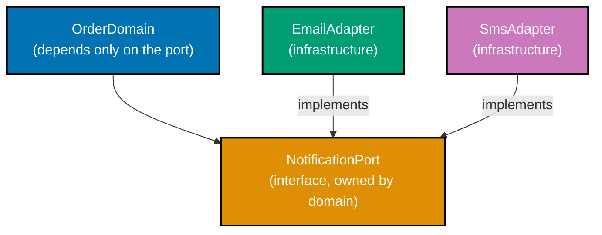

**`learning/code/ex-74-dip-hexagonal-ports/example.py`**

```python
"""Example 74: DIP -- Hexagonal Ports.

co-05, co-14: ports-and-adapters (hexagonal architecture) wiring a domain to
infrastructure. The domain module defines a PORT (an abstract interface it
needs) and depends on nothing else; concrete ADAPTERS live in a separate
"infrastructure" namespace and implement the port. The domain's own source
never names an infrastructure class -- inspected here via OrderDomain's own
constructor annotation, not just asserted in prose.
"""

from __future__ import annotations  # => defers type-hint evaluation for the forward references used below

from typing import Protocol  # => Protocol declares the PORT the domain owns


# ============================================================
# DOMAIN -- defines the port it needs; imports nothing from infrastructure
# ============================================================


# => this Protocol lives IN the domain's own file/namespace -- infrastructure adapts to it, not the reverse
class NotificationPort(Protocol):  # => the PORT: an interface OWNED by the domain, infra must conform to it
    def send(self, message: str) -> None: ...  # => the ONE method any adapter must provide


# => grep OrderDomain's source for "EmailAdapter" or "SmsAdapter" -- neither name appears anywhere in this class
class OrderDomain:  # => co-05: depends on the ABSTRACT port, never on a concrete adapter class
    def __init__(self, notifier: NotificationPort) -> None:  # => the constructor names only the PORT type
        self._notifier = notifier  # => injected -- the domain never constructs its own infrastructure

    # => this is OrderDomain's ONLY method that touches notification -- it goes through _notifier, never a class name
    def confirm_order(self, order_id: str) -> None:  # => the domain's own business method
        self._notifier.send(f"order {order_id} confirmed")  # => calls through the PORT only


# ============================================================
# INFRASTRUCTURE -- adapters that implement the domain's port; may import anything
# ============================================================


class EmailAdapter:  # => a concrete ADAPTER living outside the domain namespace
    def __init__(self) -> None:  # => the constructor
        self.sent: list[str] = []  # => stands in for a real SMTP client

    def send(self, message: str) -> None:  # => satisfies NotificationPort structurally
        self.sent.append(f"[email] {message}")  # => a real, honest implementation


class SmsAdapter:  # => a SECOND adapter -- swappable without touching OrderDomain at all
    def __init__(self) -> None:  # => the constructor
        self.sent: list[str] = []  # => stands in for a real SMS gateway

    def send(self, message: str) -> None:  # => satisfies NotificationPort structurally
        self.sent.append(f"[sms] {message}")  # => a real, honest implementation


def domain_module_imports_no_infrastructure_names() -> bool:  # => co-05: verify the dependency direction for real
    # => the true architectural check: OrderDomain's __init__ signature names only the PORT, never a concrete adapter
    annotation = OrderDomain.__init__.__annotations__.get("notifier")  # => reads the ACTUAL parameter annotation
    return annotation in ("NotificationPort", NotificationPort) or str(annotation) == "NotificationPort"  # => the real check


if __name__ == "__main__":  # => demonstration entry point, executed only when this file is run directly
    email = EmailAdapter()  # => constructs one concrete adapter
    domain = OrderDomain(email)  # => wired at the OUTERMOST layer -- the domain itself never names EmailAdapter
    domain.confirm_order("ord-1")  # => the domain's own method, oblivious to WHICH adapter it holds
    print(email.sent)  # => confirms the email adapter recorded the message
    # => Output: ['[email] order ord-1 confirmed']

    sms = SmsAdapter()  # => constructs a DIFFERENT concrete adapter
    domain_with_sms = OrderDomain(sms)  # => swap the adapter -- zero edits inside OrderDomain
    domain_with_sms.confirm_order("ord-2")  # => the SAME domain method, now routed through a different adapter
    print(sms.sent)  # => confirms the sms adapter recorded the message
    # => Output: ['[sms] order ord-2 confirmed']

    print(domain_module_imports_no_infrastructure_names())  # => confirms the dependency direction by inspection, not prose
    # => Output: True
```

**Run**: `python3 example.py`

**Output**:

```text
['[email] order ord-1 confirmed']
['[sms] order ord-2 confirmed']
True
```

**`learning/code/ex-74-dip-hexagonal-ports/test_example.py`**

```python
"""Example 74: pytest verification of the hexagonal ports-and-adapters wiring."""

from example import (
    EmailAdapter,
    OrderDomain,
    SmsAdapter,
    domain_module_imports_no_infrastructure_names,
)


def test_domain_confirms_an_order_through_the_email_adapter() -> None:
    email = EmailAdapter()
    domain = OrderDomain(email)
    domain.confirm_order("ord-1")
    assert email.sent == ["[email] order ord-1 confirmed"]


def test_swapping_the_adapter_needs_no_edit_to_order_domain() -> None:
    sms = SmsAdapter()
    domain = OrderDomain(sms)  # => same OrderDomain class, a DIFFERENT adapter -- zero source changes
    domain.confirm_order("ord-2")
    assert sms.sent == ["[sms] order ord-2 confirmed"]


def test_order_domain_depends_on_the_port_not_a_concrete_adapter() -> None:
    assert domain_module_imports_no_infrastructure_names()  # => co-05: the dependency direction points inward


# => Run: pytest -q -- Output: 3 passed
```

**Verify**: `pytest -q`

**Output**:

```text
3 passed
```

**Key takeaway**: Hexagonal architecture is DIP applied at the module level -- the domain owns the port interface, and infrastructure adapters depend on the domain's port, not the other way around, so the domain can be tested and reused with zero knowledge of email, SMS, or any other delivery mechanism.

**Why it matters**: This is the shape behind most production "clean architecture" backends -- domain logic that never imports a database driver, an HTTP client, or a message queue library directly, making it trivial to swap infrastructure or run the domain in a test with an in-memory adapter.

---

### Example 75: Observer -- Memory Leak, Fixed With weakref

_ex-75 &middot; exercises co-26_

`LeakySubject` holds STRONG references to its observers, so an observer stays alive even after every other reference is dropped -- a classic Observer memory leak. `WeakRefSubject` stores observers in a `weakref.WeakSet`, letting an unsubscribed, otherwise-unreferenced observer be garbage-collected automatically.

**`learning/code/ex-75-observer-memory-leak/example.py`**

```python
"""Example 75: Observer -- Memory Leak, Fixed With weakref.

co-26: the classic Observer memory leak -- a Subject holding STRONG references
to its observers keeps them alive forever, even after every other reference to
an observer is dropped, because the Subject itself is still a live referrer.
Switching the Subject's storage to `weakref.WeakSet` lets an unsubscribed,
otherwise-unreferenced observer be garbage-collected automatically.
"""

# => co-26 in one sentence: a Subject's own reference to an observer is a REAL reference, and real
# => references keep objects alive -- weakref.WeakSet trades that guarantee for automatic cleanup

from __future__ import annotations  # => defers type-hint evaluation, not strictly required here but kept for consistency

import gc  # => used to force collection deterministically for this demonstration
import weakref  # => weakref.WeakSet is the fix -- membership that does not keep members alive


class Event:  # => a minimal observer -- large in a real system, small here to keep the leak visible
    def __init__(self, name: str) -> None:  # => the constructor
        self.name = name  # => the only field, just enough to tell instances apart

    def notify(self, message: str) -> None:  # => the method any Subject would call on this observer
        pass  # => a real observer would react here; the leak does not depend on what notify() does


# => LeakySubject and WeakRefSubject expose the IDENTICAL public interface -- only storage differs
class LeakySubject:  # => co-26 ANTI-PATTERN: strong references keep every observer alive forever
    def __init__(self) -> None:  # => the constructor
        self._observers: list[Event] = []  # => a STRONG reference list -- the subject IS a live referrer

    def subscribe(self, observer: Event) -> None:  # => registers an observer, the leaky way
        self._observers.append(observer)  # => the subject now owns a strong reference

    def observer_count(self) -> int:  # => reports how many observers are still tracked
        return len(self._observers)  # => never shrinks on its own, even after the caller drops its reference


# => the fix is a ONE-LINE storage change (list -> WeakSet); subscribe() and observer_count() barely change
class WeakRefSubject:  # => co-26 FIX: a WeakSet does not keep its members alive
    def __init__(self) -> None:  # => the constructor
        self._observers: weakref.WeakSet[Event] = weakref.WeakSet()  # => weak references only

    def subscribe(self, observer: Event) -> None:  # => registers an observer, the fixed way
        self._observers.add(observer)  # => no strong reference created -- the subject does not keep this alive

    def observer_count(self) -> int:  # => reports how many observers are still tracked
        return len(self._observers)  # => automatically shrinks once an observer is garbage-collected elsewhere


if __name__ == "__main__":  # => demonstration entry point, executed only when this file is run directly
    # => both halves below follow the SAME script: construct, subscribe, drop the caller's reference, collect, count
    leaky = LeakySubject()  # => constructs the leaky implementation
    observer_a = Event("a")  # => the caller's own reference to a new observer
    leaky.subscribe(observer_a)  # => the subject now ALSO holds a strong reference
    del observer_a  # => the CALLER dropped its reference -- but the subject still holds one
    gc.collect()  # => forces collection so the leak is visible immediately, not just eventually
    print(leaky.observer_count())  # => LEAK: still 1 -- the strong reference kept it alive
    # => Output: 1
    # => the ONLY difference from here on is which Subject class is used -- same script, different result

    # => this second half mirrors the first exactly, line for line, except the subject class used
    fixed = WeakRefSubject()  # => constructs the fixed implementation
    observer_b = Event("b")  # => the caller's own reference to a new observer
    fixed.subscribe(observer_b)  # => the subject holds only a WEAK reference this time
    del observer_b  # => the caller dropped its only OTHER reference
    gc.collect()  # => nothing else references the Event, so it is collected
    print(fixed.observer_count())  # => FIXED: 0 -- weakref let it be garbage-collected
    # => Output: 0
    # => same subscribe/unsubscribe pattern, opposite outcome -- the storage type was the whole fix
```

**Run**: `python3 example.py`

**Output**:

```text
1
0
```

**`learning/code/ex-75-observer-memory-leak/test_example.py`**

```python
"""Example 75: pytest verification that weakref fixes the observer memory leak."""

import gc

from example import Event, LeakySubject, WeakRefSubject


def test_leaky_subject_keeps_an_unsubscribed_observer_alive() -> None:
    subject = LeakySubject()
    observer = Event("leak-me")
    subject.subscribe(observer)
    del observer  # => caller drops its reference
    gc.collect()
    assert subject.observer_count() == 1  # => LEAK: the subject's strong reference kept it alive


def test_weakref_subject_lets_an_unreferenced_observer_be_collected() -> None:
    subject = WeakRefSubject()
    observer = Event("collect-me")
    subject.subscribe(observer)
    del observer  # => no other strong reference exists anywhere
    gc.collect()
    assert subject.observer_count() == 0  # => FIXED: weakref did not keep it alive


def test_weakref_subject_keeps_a_still_referenced_observer() -> None:
    subject = WeakRefSubject()
    observer = Event("still-alive")  # => held here -- a strong reference DOES still exist
    subject.subscribe(observer)
    gc.collect()
    assert subject.observer_count() == 1  # => weakref only drops entries once ALL strong refs are gone


# => Run: pytest -q -- Output: 3 passed
```

**Verify**: `pytest -q`

**Output**:

```text
3 passed
```

**Key takeaway**: `weakref.WeakSet` (or `weakref.ref` for a single reference) is Python's built-in fix for the Observer pattern's most common production bug -- a subject silently keeping every observer it has ever seen alive, growing memory usage unbounded over the process's lifetime.

**Why it matters**: This exact leak shows up in GUI frameworks, event buses, and pub/sub systems whenever a subject outlives the individual listeners registered against it -- a `WeakSet` (or an explicit `unsubscribe()`) is the two competing fixes, and the choice between them is itself a design decision worth making deliberately.

---

### Example 76: Command -- Composite Macro Command With Grouped Undo

_ex-76 &middot; exercises co-27, co-23_

A `TextBuffer` editor where every edit is a `Command` with `do()`/`undo()`. `MacroCommand` (co-23: composite -- a command made of commands) groups several edits into one atomic unit: its `undo()` reverses every sub-command in REVERSE order, so a multi-step edit undoes as a single step.

**`learning/code/ex-76-command-macro-undo/example.py`**

```python
"""Example 76: Command -- Composite Macro Command With Grouped Undo.

co-27, co-23: a text-buffer editor where every edit is a Command object with
`do()`/`undo()`. A `MacroCommand` (co-23: composite -- a command made of
commands) groups several edits into one atomic unit: calling its `undo()`
reverses every sub-command in REVERSE order, so a multi-step edit undoes as a
single step, never leaving the buffer in a partially-undone state.
"""

from __future__ import annotations  # => defers type-hint evaluation for the forward references used below

from typing import Protocol  # => Protocol declares the Command shape every do/undo pair must satisfy


# => every Command below holds a reference to THIS SAME buffer -- there is only ever one receiver in this example
class TextBuffer:  # => the receiver -- the object commands actually mutate
    def __init__(self) -> None:  # => the constructor
        self.text = ""  # => starts empty; every command below mutates THIS field


# => InsertCommand, DeleteLastCommand, and MacroCommand all satisfy THIS one shape, structurally
class Command(Protocol):  # => co-27: every command supports do/undo symmetrically
    def do(self) -> None: ...  # => the forward action
    def undo(self) -> None: ...  # => the reverse action, mirroring do() exactly


# => InsertCommand and DeleteLastCommand are LEAVES in the composite sense -- MacroCommand is the COMPOSITE node
class InsertCommand:  # => a concrete command: insert text at the end of the buffer
    def __init__(self, buffer: TextBuffer, text: str) -> None:  # => the constructor
        self._buffer = buffer  # => the receiver this command acts on
        self._text = text  # => remembers WHAT it inserted, needed later to undo

    def do(self) -> None:  # => satisfies Command's do() clause
        self._buffer.text += self._text  # => the forward action: appends the remembered text

    def undo(self) -> None:  # => satisfies Command's undo() clause
        self._buffer.text = self._buffer.text[: -len(self._text)]  # => removes exactly what was inserted


# => notice DeleteLastCommand needs internal state (_deleted) to undo -- InsertCommand needs none, it can recompute
# => remembering _deleted (not just _count) is what makes THIS command's undo() possible too
class DeleteLastCommand:  # => a second concrete command: delete the last N characters
    def __init__(self, buffer: TextBuffer, count: int) -> None:  # => the constructor
        self._buffer = buffer  # => the receiver this command acts on
        self._count = count  # => how many trailing characters to remove
        self._deleted = ""  # => remembers what was deleted, so undo() can restore it exactly

    def do(self) -> None:  # => satisfies Command's do() clause
        self._deleted = self._buffer.text[-self._count :]  # => captures the characters BEFORE removing them
        self._buffer.text = self._buffer.text[: -self._count]  # => the forward action: removes the trailing slice

    def undo(self) -> None:  # => satisfies Command's undo() clause
        self._buffer.text += self._deleted  # => restores the exact characters that were removed


# => MacroCommand satisfies the SAME Command shape as its own children -- the composite pattern's defining trait
class MacroCommand:  # => co-23: COMPOSITE -- a command built out of other commands, same Command interface
    def __init__(self, commands: list[Command]) -> None:  # => the constructor
        self._commands = commands  # => the ordered group of sub-commands this macro wraps

    def do(self) -> None:  # => satisfies Command's do() clause, delegating to every sub-command
        for command in self._commands:  # => forward order
            command.do()  # => each sub-command performs its own forward action

    def undo(self) -> None:  # => satisfies Command's undo() clause, delegating to every sub-command
        for command in reversed(self._commands):  # => co-27: REVERSE order -- undoes atomically as one unit
            command.undo()  # => each sub-command reverses its own forward action


if __name__ == "__main__":  # => demonstration entry point, executed only when this file is run directly
    buffer = TextBuffer()  # => the shared receiver every command below will mutate
    macro = MacroCommand(  # => groups three sub-commands into one atomic unit
        [  # => the ordered list handed to MacroCommand's constructor
            InsertCommand(buffer, "hello "),  # => sub-command 1: appends "hello "
            InsertCommand(buffer, "world"),  # => sub-command 2: appends "world"
            DeleteLastCommand(buffer, 1),  # => drops the trailing "d"
        ]  # => the list itself, not yet executed -- macro.do() below runs it
    )  # => closes the sub-command list passed to MacroCommand

    macro.do()  # => runs all three sub-commands forward, as one grouped edit
    print(repr(buffer.text))  # => shows the buffer after all three forward actions ran
    # => Output: 'hello worl'
    # => "hello " + "world" - "d" = "hello worl" -- three edits collapsed into one visible result

    macro.undo()  # => reverses all three, in REVERSE order, as one atomic undo
    print(repr(buffer.text))  # => confirms the buffer is back to its original, pre-macro state
    # => Output: ''
    # => undoing in REVERSE order matters: undoing "insert world" before "insert hello " would corrupt the slice math
```

**Run**: `python3 example.py`

**Output**:

```text
'hello worl'
''
```

**`learning/code/ex-76-command-macro-undo/test_example.py`**

```python
"""Example 76: pytest verification that MacroCommand groups undo atomically, in reverse order."""

from example import DeleteLastCommand, InsertCommand, MacroCommand, TextBuffer


def test_macro_do_runs_every_sub_command_forward_in_order() -> None:
    buffer = TextBuffer()
    macro = MacroCommand([InsertCommand(buffer, "hello "), InsertCommand(buffer, "world")])
    macro.do()
    assert buffer.text == "hello world"


def test_macro_undo_reverses_every_sub_command_in_reverse_order_as_one_atomic_step() -> None:
    buffer = TextBuffer()
    macro = MacroCommand(
        [
            InsertCommand(buffer, "hello "),
            InsertCommand(buffer, "world"),
            DeleteLastCommand(buffer, 1),
        ]
    )
    macro.do()
    assert buffer.text == "hello worl"
    macro.undo()
    assert buffer.text == ""  # => a SINGLE undo() call reversed all three steps, atomically


def test_undo_never_leaves_the_buffer_in_a_partially_undone_intermediate_state() -> None:
    buffer = TextBuffer()
    macro = MacroCommand([InsertCommand(buffer, "a"), InsertCommand(buffer, "b"), InsertCommand(buffer, "c")])
    macro.do()
    assert buffer.text == "abc"
    macro.undo()
    assert buffer.text == ""  # => not "ab" or "a" -- the whole group undoes together, no partial state observed


# => Run: pytest -q -- Output: 3 passed
```

**Verify**: `pytest -q`

**Output**:

```text
3 passed
```

**Key takeaway**: `MacroCommand` is the Composite pattern applied to Command -- because it implements the SAME `do()`/`undo()` interface as its children, callers cannot tell a macro from a single command, and grouped undo falls out of "reverse the list" with no special-case logic.

**Why it matters**: Every real editor, IDE, or design tool with a single undo button for a multi-step operation (find-and-replace-all, a drag that moves ten objects) uses exactly this composite-command shape.

---

### Example 77: Strategy -- Registry-Driven Plugin System

_ex-77 &middot; exercises co-25, co-02_

`PricingStrategyRegistry` maps a name to a `PricingStrategy`. Core code (`checkout`) looks a strategy up by name only -- it never imports a concrete strategy class. A third-party `BlackFridayPricing` strategy registers into the SAME registry from outside the core module, and `checkout` picks it up with zero core edits.

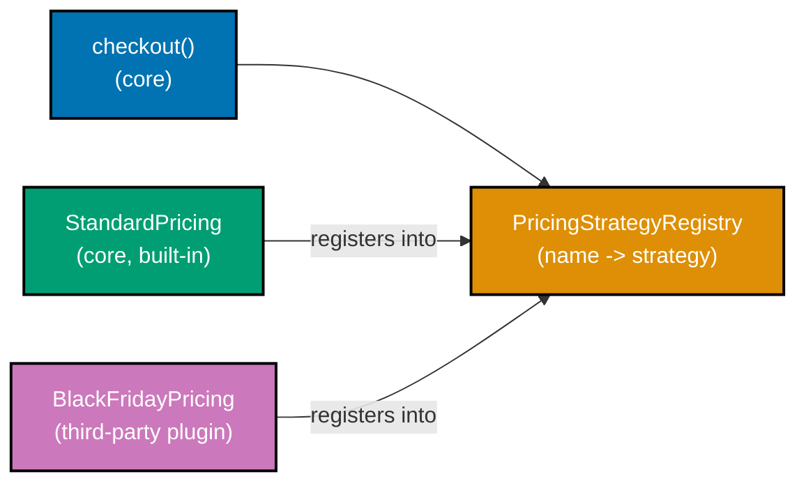

**`learning/code/ex-77-strategy-registry-plugin/example.py`**

```python
"""Example 77: Strategy -- Registry-Driven Plugin System.

co-25, co-02: a `PricingStrategyRegistry` maps a string key to a
`PricingStrategy`. Core code (`checkout`) only ever looks a strategy up by
name -- it never imports a concrete strategy class. A THIRD-PARTY strategy
registers itself into the SAME registry from outside the core module and
`checkout` picks it up with zero edits to core code, satisfying OCP (co-02)
through Strategy (co-25).
"""

from __future__ import annotations  # => defers type-hint evaluation for the forward references used below

from typing import Protocol  # => Protocol declares the Strategy shape every pricing rule must satisfy


class PricingStrategy(Protocol):  # => the Strategy interface -- every pricing rule implements this
    def price(self, subtotal: float) -> float: ...  # => the ONE method every pricing rule must provide


# => this dict IS the plugin seam: any code, core or third-party, can call register() at any time
class PricingStrategyRegistry:  # => the plugin mechanism: a name -> strategy lookup, owned by core code
    def __init__(self) -> None:  # => the constructor
        self._strategies: dict[str, PricingStrategy] = {}  # => empty at construction, filled by register() calls

    def register(self, name: str, strategy: PricingStrategy) -> None:  # => any caller, core or third-party, can add
        self._strategies[name] = strategy  # => stores under the string key -- no import required by the registry

    def get(self, name: str) -> PricingStrategy:  # => looks up by NAME, never by class
        if name not in self._strategies:  # => an honest, explicit check before the lookup
            raise KeyError(f"no pricing strategy registered under {name!r}")  # => an honest failure for unknown names
        return self._strategies[name]  # => hands back whichever strategy was registered under this name


# ============================================================
# CORE -- ships with one built-in strategy; never imports anything third-party
# ============================================================


class StandardPricing:  # => a built-in, core strategy
    def price(self, subtotal: float) -> float:  # => satisfies PricingStrategy structurally
        return subtotal  # => no discount at all -- the baseline


def checkout(registry: PricingStrategyRegistry, strategy_name: str, subtotal: float) -> float:  # => core's ONE entry point
    strategy = registry.get(strategy_name)  # => core code looks up BY NAME -- no concrete strategy import here
    return strategy.price(subtotal)  # => delegates the VARYING part entirely to whichever strategy was found


# ============================================================
# THIRD-PARTY PLUGIN -- registers into the SAME registry, defined entirely outside core
# ============================================================


# => this class could live in an entirely separate package -- checkout() never imports it by name
class BlackFridayPricing:  # => a plugin author's OWN class -- core never imports this
    def price(self, subtotal: float) -> float:  # => satisfies PricingStrategy structurally, same shape as core's
        return subtotal * 0.60  # => an aggressive 40% off, defined entirely outside core


if __name__ == "__main__":  # => demonstration entry point, executed only when this file is run directly
    registry = PricingStrategyRegistry()  # => the single shared registry both core and the plugin use
    registry.register("standard", StandardPricing())  # => core registers its own built-in strategy

    print(checkout(registry, "standard", 100.0))  # => resolves "standard" through the registry, not an import
    # => Output: 100.0

    registry.register("black-friday", BlackFridayPricing())  # => THIRD PARTY plugs in -- zero edits to checkout()
    print(checkout(registry, "black-friday", 100.0))  # => the SAME checkout() function, a brand-new strategy name
    # => Output: 60.0
```

**Run**: `python3 example.py`

**Output**:

```text
100.0
60.0
```

**`learning/code/ex-77-strategy-registry-plugin/test_example.py`**

```python
"""Example 77: pytest verification that a third-party strategy loads without editing checkout()."""

import pytest

from example import BlackFridayPricing, PricingStrategyRegistry, StandardPricing, checkout


def test_built_in_strategy_prices_at_face_value() -> None:
    registry = PricingStrategyRegistry()
    registry.register("standard", StandardPricing())
    assert checkout(registry, "standard", 100.0) == 100.0


def test_third_party_strategy_registers_and_loads_without_a_core_edit() -> None:
    registry = PricingStrategyRegistry()
    registry.register("standard", StandardPricing())
    registry.register("black-friday", BlackFridayPricing())  # => a plugin, added purely by calling register()
    assert checkout(registry, "black-friday", 100.0) == 60.0  # => checkout() itself was never touched


def test_looking_up_an_unregistered_strategy_raises_a_clear_error() -> None:
    registry = PricingStrategyRegistry()
    with pytest.raises(KeyError, match="no pricing strategy registered"):
        checkout(registry, "nonexistent", 100.0)


# => Run: pytest -q -- Output: 3 passed
```

**Verify**: `pytest -q`

**Output**:

```text
3 passed
```

**Key takeaway**: A registry turns Strategy into a genuine plugin mechanism -- `checkout()` is closed for modification (OCP, co-02) because it only ever calls `registry.get(name)`, so new strategies are pure additions, never edits.

**Why it matters**: This is the shape behind real plugin systems -- payment gateways, notification channels, export formats -- where a core team ships a stable registry and third parties add capabilities without ever touching the core repository.

---

### Example 78: Pattern-or-Not -- A YAGNI Judgment Call, Across Three Scenarios

_ex-78 &middot; exercises co-34, co-02_

Three scenarios, three different verdicts: a welcome-email formatter with no second variant planned skips Strategy; a checkout discount with three real variants today (and a fourth on the roadmap) earns Strategy; a one-off report converter used once skips a Converter interface. Each verdict rests on a concrete signal -- how many variations exist TODAY -- not a hunch.

**`learning/code/ex-78-pattern-vs-yagni-judgment/example.py`**

```python
"""Example 78: Pattern-or-Not -- A YAGNI Judgment Call, Across Three Scenarios.

co-34, co-02: patterns are not free -- each one adds indirection that must earn
its keep. Three scenarios, three different verdicts, each justified by a
concrete signal (not a hunch): how many variations exist TODAY, and how likely
a second one really is.
"""

from __future__ import annotations  # => defers type-hint evaluation, used only by Scenario 2's Protocol

from typing import Protocol  # => Protocol declares DiscountStrategy -- used ONLY where the pattern is justified

# ============================================================
# Scenario 1: ONE email formatter, no second implementation planned -- SKIP the pattern
# ============================================================


def format_welcome_email(username: str) -> str:  # => a PLAIN function -- no Strategy interface, no factory
    # => Judgment: only one email format exists, and the product has no roadmap item for a second one.
    # => Wrapping this in a Strategy pattern today buys zero flexibility and adds one more class to navigate.
    return f"Welcome, {username}!"  # => the entire behavior, in one line -- no interface needed to swap it later


# ============================================================
# Scenario 2: THREE discount rules today, a fourth confirmed on the roadmap -- USE Strategy
# ============================================================


class DiscountStrategy(Protocol):  # => co-25: justified here -- 3 variants exist NOW, a 4th is already planned
    def apply(self, subtotal: float) -> float: ...  # => the ONE method every discount rule must provide


class NoDiscount:  # => variant 1 of 3, already real today
    def apply(self, subtotal: float) -> float:  # => satisfies DiscountStrategy structurally
        return subtotal  # => no discount at all


class TenPercentOff:  # => variant 2 of 3, already real today
    def apply(self, subtotal: float) -> float:  # => satisfies DiscountStrategy structurally
        return subtotal * 0.90  # => a flat 10% off


class BuyOneGetOneFree:  # => variant 3 of 3, already real today
    def apply(self, subtotal: float) -> float:  # => satisfies DiscountStrategy structurally
        return subtotal * 0.50  # => an effective 50% off


def checkout_total(subtotal: float, discount: DiscountStrategy) -> float:  # => the ONE dispatcher, edited zero times
    # => Judgment: THREE real variants exist today (not hypothetical), and a fourth is already on the
    # => roadmap. The indirection pays for itself immediately, not speculatively.
    return discount.apply(subtotal)  # => delegates the VARYING part to whichever strategy was passed in


# ============================================================
# Scenario 3: ONE-OFF internal report converter, used once, thrown away after -- SKIP the pattern
# ============================================================


def convert_report_to_csv_line(fields: list[str]) -> str:  # => a PLAIN function -- no Converter interface
    # => Judgment: this runs once, for one internal report, with a known lifetime of a single script run.
    # => A pluggable Converter interface here is premature abstraction (ex-66) wearing a different hat.
    return ",".join(fields)  # => the entire behavior, in one line -- no interface needed for a one-off script


if __name__ == "__main__":  # => demonstration entry point, executed only when this file is run directly
    print(format_welcome_email("Ada"))  # => scenario 1: a plain function, no pattern applied
    # => Output: Welcome, Ada!

    print(checkout_total(100.0, BuyOneGetOneFree()))  # => scenario 2: Strategy, justified by 3+ real variants
    # => Output: 50.0

    print(convert_report_to_csv_line(["2026-07-17", "42", "ok"]))  # => scenario 3: a plain function, no pattern applied
    # => Output: 2026-07-17,42,ok
```

**Run**: `python3 example.py`

**Output**:

```text
Welcome, Ada!
50.0
2026-07-17,42,ok
```

**`learning/code/ex-78-pattern-vs-yagni-judgment/test_example.py`**

```python
"""Example 78: pytest verification of all three pattern-or-not scenarios."""

from example import (
    BuyOneGetOneFree,
    NoDiscount,
    TenPercentOff,
    checkout_total,
    convert_report_to_csv_line,
    format_welcome_email,
)


def test_scenario_1_plain_function_is_sufficient_with_no_second_variant_in_sight() -> None:
    assert format_welcome_email("Ada") == "Welcome, Ada!"  # => no Strategy needed for a single, stable format


def test_scenario_2_strategy_pattern_earns_its_keep_with_three_real_variants_today() -> None:
    assert checkout_total(100.0, NoDiscount()) == 100.0
    assert checkout_total(100.0, TenPercentOff()) == 90.0
    assert checkout_total(100.0, BuyOneGetOneFree()) == 50.0  # => three DISTINCT verdicts, justifying the interface


def test_scenario_3_plain_function_is_sufficient_for_a_one_off_throwaway_script() -> None:
    assert convert_report_to_csv_line(["2026-07-17", "42", "ok"]) == "2026-07-17,42,ok"  # => no Converter interface needed


# => Run: pytest -q -- Output: 3 passed
```

**Verify**: `pytest -q`

**Output**:

```text
3 passed
```

**Key takeaway**: The YAGNI-vs-pattern decision is a count, not a feeling -- "how many real variants exist right now, and is a next one already committed" separates the cases where indirection pays for itself from the cases where it is decoration.

**Why it matters**: Premature abstraction (ex-66) and under-abstraction both cost real time; a repeatable, concrete test for "does this pattern earn its keep today" is more useful than either extreme's usual justification ("we might need it" vs. "keep it simple").

---

### Example 79: Decorator -- functools Decorator vs. a GoF Class Decorator

_ex-79 &middot; exercises co-21_

Python's `@decorator` syntax and the GoF Decorator pattern solve the SAME problem -- cross-cutting behavior without editing the wrapped object's source -- at different granularities: `@log_calls` wraps a single function; `LoggingCalculatorDecorator` wraps a whole object and forwards its interface.

**`learning/code/ex-79-decorator-python-native/example.py`**

```python
"""Example 79: Decorator -- functools Decorator vs. a GoF Class Decorator.

co-21: Python's `@decorator` syntax and the GoF Decorator pattern solve the
SAME problem -- adding cross-cutting behavior without editing the wrapped
object's source -- but at different granularities. A `functools`-based
FUNCTION decorator wraps a single callable; a GoF-style CLASS decorator wraps
an OBJECT and forwards the rest of its interface, useful when you need to wrap
something that is not a bare function (e.g. an object with several methods).
"""

from __future__ import annotations  # => defers type-hint evaluation for the forward references used below

import functools  # => functools.wraps preserves the wrapped function's identity through decoration
from typing import Callable, Protocol  # => Callable types the function decorator, Protocol types the class one


# ============================================================
# Pythonic native: a functools-based FUNCTION decorator
# ============================================================


# => log_calls returns a brand-new function -- add() below never has its own source code touched
def log_calls(func: Callable[..., float]) -> Callable[..., float]:  # => wraps a single callable
    @functools.wraps(func)  # => preserves func.__name__/__doc__ -- good decorator hygiene
    def wrapper(*args: float, **kwargs: float) -> float:  # => the replacement function returned in place of func
        result = func(*args, **kwargs)  # => delegates to the wrapped function, unchanged
        wrapper.calls.append((args, result))  # type: ignore[attr-defined]  # => records every call, cross-cutting
        return result  # => the SAME result the wrapped function would have returned

    wrapper.calls = []  # type: ignore[attr-defined]  # => a log attached to the wrapper itself
    return wrapper  # => a NEW callable, never mutates func in place


@log_calls  # => the native, idiomatic way to add cross-cutting behavior to ONE function
def add(a: float, b: float) -> float:  # => the wrapped function, unaware it is being decorated
    return a + b  # => the original, undecorated behavior


# ============================================================
# GoF style: a CLASS decorator wrapping a whole object, forwarding its interface
# ============================================================


class Calculator(Protocol):  # => the interface a GoF class decorator must preserve
    def compute(self, a: float, b: float) -> float: ...  # => the ONE method any Calculator must provide


class PlainAdder:  # => the object being decorated -- has state and MULTIPLE potential methods, not just one function
    def compute(self, a: float, b: float) -> float:  # => satisfies Calculator structurally
        return a + b  # => the original, undecorated behavior


class LoggingCalculatorDecorator:  # => co-21: GoF Decorator -- wraps an OBJECT, forwards its interface
    def __init__(self, wrapped: Calculator) -> None:  # => the constructor
        self._wrapped = wrapped  # => the object being decorated, held as a collaborator
        self.calls: list[tuple[float, float, float]] = []  # => a log attached to this decorator instance

    def compute(self, a: float, b: float) -> float:  # => forwards the SAME interface Calculator declares
        result = self._wrapped.compute(a, b)  # => delegates to the wrapped object -- same interface preserved
        self.calls.append((a, b, result))  # => the cross-cutting behavior: logging every call
        return result  # => the SAME result the wrapped object would have returned


if __name__ == "__main__":  # => demonstration entry point, executed only when this file is run directly
    print(add(2, 3))  # => the function decorator runs transparently
    # => Output: 5
    print(add.calls)  # type: ignore[attr-defined]  # => cross-cutting logging attached without touching add()'s own body
    # => Output: [((2, 3), 5)]

    decorated_calculator = LoggingCalculatorDecorator(PlainAdder())  # => wraps a WHOLE object, not a bare function
    print(decorated_calculator.compute(4, 5))  # => the class decorator also runs transparently
    # => Output: 9
    print(decorated_calculator.calls)  # => same cross-cutting idea, applied to a whole OBJECT instead of one function
    # => Output: [(4, 5, 9)]
```

**Run**: `python3 example.py`

**Output**:

```text
5
[((2, 3), 5)]
9
[(4, 5, 9)]
```

**`learning/code/ex-79-decorator-python-native/test_example.py`**

```python
"""Example 79: pytest verification that both decorator styles add the same cross-cutting behavior."""

from example import LoggingCalculatorDecorator, PlainAdder, add


def test_functools_decorator_preserves_the_wrapped_functions_result() -> None:
    assert add(2, 3) == 5


def test_functools_decorator_adds_cross_cutting_logging_without_touching_add_body() -> None:
    add(10, 20)
    assert (10, 20) in [call_args for call_args, _ in add.calls]  # type: ignore[attr-defined]  # => the log recorded the call


def test_functools_wraps_preserves_the_original_function_name() -> None:
    assert add.__name__ == "add"  # => good decorator hygiene: functools.wraps kept identity intact


def test_gof_class_decorator_preserves_the_wrapped_objects_result() -> None:
    decorated = LoggingCalculatorDecorator(PlainAdder())
    assert decorated.compute(4, 5) == 9


def test_gof_class_decorator_adds_cross_cutting_logging_to_a_whole_object() -> None:
    decorated = LoggingCalculatorDecorator(PlainAdder())
    decorated.compute(1, 1)
    decorated.compute(2, 2)
    assert decorated.calls == [(1, 1, 2), (2, 2, 4)]  # => same cross-cutting idea, at object granularity


# => Run: pytest -q -- Output: 5 passed
```

**Verify**: `pytest -q`

**Output**:

```text
5 passed
```

**Key takeaway**: The two forms are the same idea at different scopes -- a function decorator is a Decorator pattern specialized to callables, and Python's `@` syntax is just sugar over "pass the function to another function and use the result."

**Why it matters**: Knowing when to reach for `@functools.wraps`-style decoration (logging, caching, retries around a single function) versus a full class decorator (wrapping a multi-method object like a repository or client) avoids over-engineering a one-function problem into a class hierarchy.

---

### Example 80: Clean Design Preview -- Strategy + Factory + Observer + Decorator, Under SOLID

_ex-80 &middot; exercises co-02, co-25, co-16, co-26, co-21_

A small order/pricing engine combining four patterns cohesively: Strategy for pluggable pricing, a factory function for choosing the right strategy, Observer for order-placed events, and a Decorator that adds logging without editing `PricingEngine`'s own source -- the whole system extends without editing any closed class, previewing this topic's capstone.

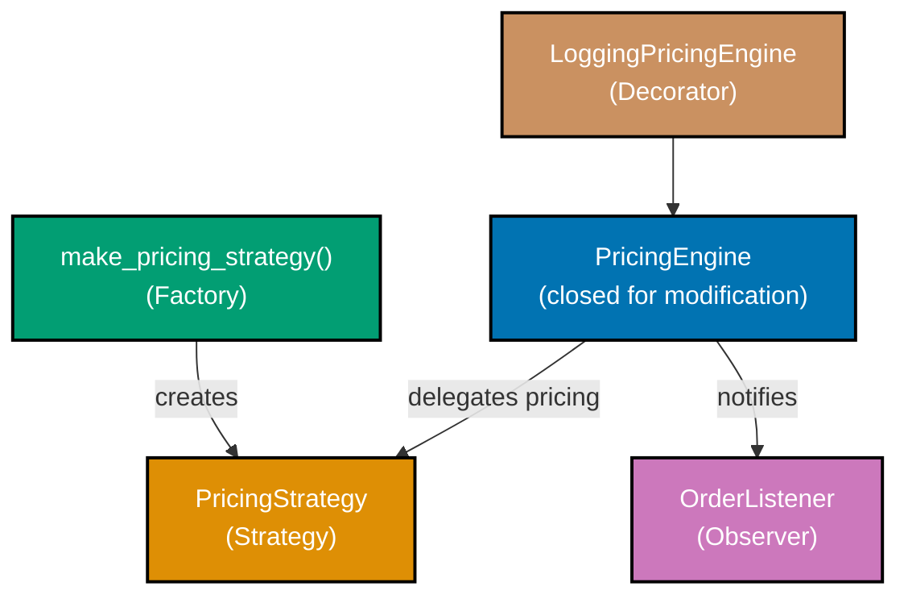

**`learning/code/ex-80-clean-design-preview/example.py`**

```python
"""Example 80: Clean Design Preview -- Strategy + Factory + Observer + Decorator, Under SOLID.

co-02, co-25, co-16, co-26, co-21: a small order/pricing engine combining four
patterns cohesively -- Strategy (co-25) for pluggable pricing rules, a factory
function (co-16) for choosing the right strategy, Observer (co-26) for
order-placed events, and a Decorator (co-21) that adds logging around pricing
without editing PricingEngine's own source. The whole system extends (new
pricing rule, new listener) without editing any CLOSED class -- OCP (co-02) in
practice, previewing the shape of this topic's capstone.
"""

from __future__ import annotations  # => defers type-hint evaluation for the forward references used below

from typing import Protocol  # => Protocol declares each pattern's interface structurally, no explicit inheritance


# ============================================================
# Strategy (co-25) -- pluggable pricing rules
# ============================================================


class PricingStrategy(Protocol):  # => the Strategy interface -- every pricing rule implements this
    def price(self, subtotal: float) -> float: ...  # => the ONE method every pricing rule must provide


class StandardPricing:  # => variant 1: no discount
    def price(self, subtotal: float) -> float:  # => satisfies PricingStrategy structurally
        return subtotal  # => the baseline, no discount applied


class MemberDiscountPricing:  # => variant 2: a member-only discount
    def price(self, subtotal: float) -> float:  # => satisfies PricingStrategy structurally
        return subtotal * 0.85  # => a flat 15% off for members


# ============================================================
# Factory (co-16) -- centralizes which strategy applies, so callers never branch on membership
# ============================================================


def make_pricing_strategy(is_member: bool) -> PricingStrategy:  # => co-16: a factory function, not a class switch
    return MemberDiscountPricing() if is_member else StandardPricing()  # => the ONE place membership is decided


# ============================================================
# Observer (co-26) -- order-placed events, decoupled from the pricing engine itself
# ============================================================


class OrderListener(Protocol):  # => the Observer interface -- every listener implements this
    def on_order_placed(self, total: float) -> None: ...  # => the ONE callback every listener must provide


class ReceiptPrinter:  # => a concrete listener -- the engine never imports this class by name
    def __init__(self) -> None:  # => the constructor
        self.receipts: list[str] = []  # => this listener's own log, populated only by on_order_placed

    def on_order_placed(self, total: float) -> None:  # => satisfies OrderListener structurally
        self.receipts.append(f"receipt: ${total:.2f}")  # => this listener's OWN reaction to the event


class PricingEngine:  # => co-02: CLOSED for modification -- new listeners/strategies never require editing this
    def __init__(self) -> None:  # => the constructor
        self._listeners: list[OrderListener] = []  # => an OPEN list of observers, populated via add_listener()

    def add_listener(self, listener: OrderListener) -> None:  # => co-26: any listener can be registered, unnamed here
        self._listeners.append(listener)  # => the engine never knows or cares WHAT the listener does

    def place_order(self, subtotal: float, strategy: PricingStrategy) -> float:  # => the ONE orchestrating method
        total = strategy.price(subtotal)  # => co-25: delegates the varying part to the strategy
        for listener in self._listeners:  # => co-26: notifies every registered observer, none hard-coded
            listener.on_order_placed(total)  # => each listener reacts independently, engine stays ignorant of how
        return total  # => hands the computed total back to the caller


# ============================================================
# Decorator (co-21) -- wraps the engine with logging, no edits inside PricingEngine
# ============================================================


class LoggingPricingEngine:  # => co-21: adds cross-cutting logging around the CLOSED PricingEngine
    def __init__(self, wrapped: PricingEngine) -> None:  # => the constructor
        self._wrapped = wrapped  # => the CLOSED engine being decorated, held as a collaborator
        self.log: list[float] = []  # => the cross-cutting log this decorator adds

    def add_listener(self, listener: OrderListener) -> None:  # => forwards to the wrapped engine, same interface
        self._wrapped.add_listener(listener)  # => delegates -- the decorator adds no new listener behavior here

    def place_order(self, subtotal: float, strategy: PricingStrategy) -> float:  # => forwards, then logs
        total = self._wrapped.place_order(subtotal, strategy)  # => delegates the REAL work to the wrapped engine
        self.log.append(total)  # => logging bolted on from OUTSIDE -- PricingEngine's source untouched
        return total  # => the SAME result the wrapped engine would have returned


if __name__ == "__main__":  # => demonstration entry point, executed only when this file is run directly
    engine = LoggingPricingEngine(PricingEngine())  # => the CLOSED engine, wrapped in logging from the outside
    receipts = ReceiptPrinter()  # => a concrete observer, unknown to PricingEngine by name
    engine.add_listener(receipts)  # => registers the observer through the decorator, which forwards it

    total_standard = engine.place_order(100.0, make_pricing_strategy(is_member=False))  # => strategy 1, via the factory
    print(total_standard)  # => confirms the standard pricing rule ran, unmodified
    # => Output: 100.0

    total_member = engine.place_order(100.0, make_pricing_strategy(is_member=True))  # => strategy 2, via the factory
    print(total_member)  # => confirms the member discount rule ran, unmodified
    # => Output: 85.0

    print(receipts.receipts)  # => confirms the observer reacted to BOTH order-placed events
    # => Output: ['receipt: $100.00', 'receipt: $85.00']

    print(engine.log)  # => the decorator logged both totals without PricingEngine knowing it was wrapped
    # => Output: [100.0, 85.0]
```

**Run**: `python3 example.py`

**Output**:

```text
100.0
85.0
['receipt: $100.00', 'receipt: $85.00']
[100.0, 85.0]
```

**`learning/code/ex-80-clean-design-preview/test_example.py`**

```python
"""Example 80: pytest verification that the system extends without editing any closed class."""

from example import (
    LoggingPricingEngine,
    MemberDiscountPricing,
    PricingEngine,
    ReceiptPrinter,
    StandardPricing,
    make_pricing_strategy,
)


def test_factory_chooses_the_correct_strategy_by_membership() -> None:
    assert isinstance(make_pricing_strategy(is_member=True), MemberDiscountPricing)
    assert isinstance(make_pricing_strategy(is_member=False), StandardPricing)


def test_engine_notifies_registered_listeners_on_every_order() -> None:
    engine = PricingEngine()
    receipts = ReceiptPrinter()
    engine.add_listener(receipts)
    engine.place_order(100.0, StandardPricing())
    assert receipts.receipts == ["receipt: $100.00"]


def test_a_second_listener_registers_without_editing_pricing_engine() -> None:
    engine = PricingEngine()
    first = ReceiptPrinter()
    second = ReceiptPrinter()
    engine.add_listener(first)
    engine.add_listener(second)  # => a SECOND listener, zero edits to PricingEngine's source
    engine.place_order(50.0, StandardPricing())
    assert first.receipts == ["receipt: $50.00"]
    assert second.receipts == ["receipt: $50.00"]


def test_decorator_logs_every_total_without_touching_pricing_engine() -> None:
    logging_engine = LoggingPricingEngine(PricingEngine())
    logging_engine.place_order(100.0, StandardPricing())
    logging_engine.place_order(100.0, MemberDiscountPricing())
    assert logging_engine.log == [100.0, 85.0]  # => decorator observed both, from OUTSIDE the closed class


def test_full_stack_strategy_factory_observer_decorator_work_together() -> None:
    logging_engine = LoggingPricingEngine(PricingEngine())
    receipts = ReceiptPrinter()
    logging_engine.add_listener(receipts)
    total = logging_engine.place_order(200.0, make_pricing_strategy(is_member=True))
    assert total == 170.0
    assert receipts.receipts == ["receipt: $170.00"]
    assert logging_engine.log == [170.0]


# => Run: pytest -q -- Output: 5 passed
```

**Verify**: `pytest -q`

**Output**:

```text
5 passed
```

**Key takeaway**: Four patterns compose cleanly here because each answers a DIFFERENT question -- Strategy answers "which pricing rule," the factory answers "which strategy to pick," Observer answers "who else needs to know," and Decorator answers "how do I add a cross-cutting concern from outside" -- no single class carries more than one of those responsibilities.

**Why it matters**: This is a direct preview of the topic's capstone: the same four-pattern combination, applied to a smellier starting point and driven through a full refactor under a pinning test suite.

---

### State machines & statecharts

### Example 81: Transition-Table FSM -- Order Lifecycle

_ex-81 &middot; exercises co-35_

An order lifecycle (created &rarr; paid &rarr; shipped &rarr; delivered, with cancellation from created or paid) modeled as an explicit state &times; event &rarr; state transition table -- a plain dict, not a chain of `if` statements. Every illegal event in a state is rejected by the table itself, by omission.

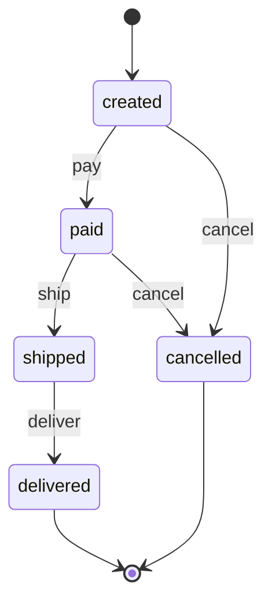

**`learning/code/ex-81-transition-table-order-lifecycle/example.py`**

```python
"""Example 81: Transition-Table FSM -- Order Lifecycle.

co-35: an order lifecycle (created -> paid -> shipped -> delivered, with
cancellation from created or paid) modeled as an explicit
state x event -> state TRANSITION TABLE -- a plain dict, not a chain of `if`
statements. Every illegal event in a state is rejected by the TABLE ITSELF
(a missing key), so "what can happen next" is one data structure you can read
top to bottom, not logic scattered across methods.
"""

from __future__ import annotations  # => defers type-hint evaluation for the dict[tuple[str, str], str] alias below


class IllegalTransition(Exception):  # => raised when the table has no entry for (state, event)
    pass  # => a plain marker exception -- no extra fields needed, the message carries the detail


# ============================================================
# The transition table -- the ENTIRE lifecycle logic lives in this one dict
# ============================================================

# => co-35: this dict IS the state machine -- reading it top to bottom answers "what can happen next"
ORDER_TRANSITIONS: dict[tuple[str, str], str] = {  # => keys are (current_state, event) pairs, values are next states
    ("created", "pay"): "paid",  # => created -> paid, on the "pay" event
    ("created", "cancel"): "cancelled",  # => created -> cancelled, on the "cancel" event
    ("paid", "ship"): "shipped",  # => paid -> shipped, on the "ship" event
    ("paid", "cancel"): "cancelled",  # => paid -> cancelled, on the "cancel" event
    ("shipped", "deliver"): "delivered",  # => shipped -> delivered, on the "deliver" event
    # => no ("shipped", "cancel") entry -- a shipped order can no longer be cancelled, by OMISSION
    # => no ("delivered", *) entries -- delivered is terminal, by omission
    # => no ("cancelled", *) entries -- cancelled is terminal, by omission
}  # => closes the table -- every legal transition in the entire lifecycle is visible above, nothing hidden elsewhere


class OrderFsm:  # => a thin wrapper around the table -- holds no transition logic of its own
    def __init__(self) -> None:  # => the constructor
        self.state = "created"  # => every order starts in this one state

    def send(self, event: str) -> str:  # => the ONE method that ever changes self.state
        key = (self.state, event)  # => builds the (state, event) lookup key for the table
        if key not in ORDER_TRANSITIONS:  # => the TABLE rejects illegal events -- no scattered if-checks anywhere
            raise IllegalTransition(f"event {event!r} is illegal in state {self.state!r}")  # => an honest, specific failure
        self.state = ORDER_TRANSITIONS[key]  # => the table itself supplies the next state, no branching logic here
        return self.state  # => hands back the new state to the caller


if __name__ == "__main__":  # => demonstration entry point, executed only when this file is run directly
    order = OrderFsm()  # => starts in "created", per __init__
    print(order.send("pay"))  # => created -> paid, a table lookup
    # => Output: paid
    print(order.send("ship"))  # => paid -> shipped
    # => Output: shipped
    print(order.send("deliver"))  # => shipped -> delivered
    # => Output: delivered

    try:  # => attempts an event that the table has no entry for
        order.send("cancel")  # => illegal: delivered has no "cancel" entry in the table
    except IllegalTransition as error:  # => the table's own omission produced this, not a manual if-check
        print(error)  # => shows the honest, specific failure message
    # => Output: event 'cancel' is illegal in state 'delivered'
```

**Run**: `python3 example.py`

**Output**:

```text
paid
shipped
delivered
event 'cancel' is illegal in state 'delivered'
```

**`learning/code/ex-81-transition-table-order-lifecycle/test_example.py`**

```python
"""Example 81: pytest verification that every illegal event is rejected by the table itself."""

import pytest

from example import IllegalTransition, OrderFsm


def test_happy_path_walks_created_paid_shipped_delivered() -> None:
    order = OrderFsm()
    assert order.send("pay") == "paid"
    assert order.send("ship") == "shipped"
    assert order.send("deliver") == "delivered"


def test_cancel_is_legal_from_created_and_paid_but_not_after() -> None:
    order = OrderFsm()
    order.send("pay")
    assert order.send("cancel") == "cancelled"  # => legal: paid -> cancelled


def test_shipped_order_cannot_be_cancelled_the_table_has_no_such_entry() -> None:
    order = OrderFsm()
    order.send("pay")
    order.send("ship")
    with pytest.raises(IllegalTransition, match="illegal in state 'shipped'"):
        order.send("cancel")  # => rejected by a MISSING key, not a special-cased if-check


def test_delivered_is_terminal_every_event_is_rejected() -> None:
    order = OrderFsm()
    order.send("pay")
    order.send("ship")
    order.send("deliver")
    for event in ("pay", "ship", "deliver", "cancel"):
        with pytest.raises(IllegalTransition):
            order.send(event)  # => no key exists for ("delivered", event) -- the table itself enforces this


# => Run: pytest -q -- Output: 4 passed
```

**Verify**: `pytest -q`

**Output**:

```text
4 passed
```

**Key takeaway**: A transition table is executable documentation -- the set of legal moves is a data structure you can print and review, and "is this event legal here" is answered by dictionary membership, not by tracing through conditional branches.

**Why it matters**: Order lifecycles, approval workflows, and CI pipeline stages are all naturally table-shaped; encoding the table as data (rather than as scattered `if`s across many methods) makes the whole state space auditable at a glance.

---

### Example 82: Hierarchical Statechart -- Media Player

_ex-82 &middot; exercises co-36_

A Harel statechart for a media player: `playing` is a PARENT state with two nested substates, `normal` and `shuffle` -- `toggle_shuffle` is handled at the CHILD level. `stop` is handled at the PARENT level, defined once, and applies no matter which substate is active. Volume is an ORTHOGONAL region, changing independently of the play state.

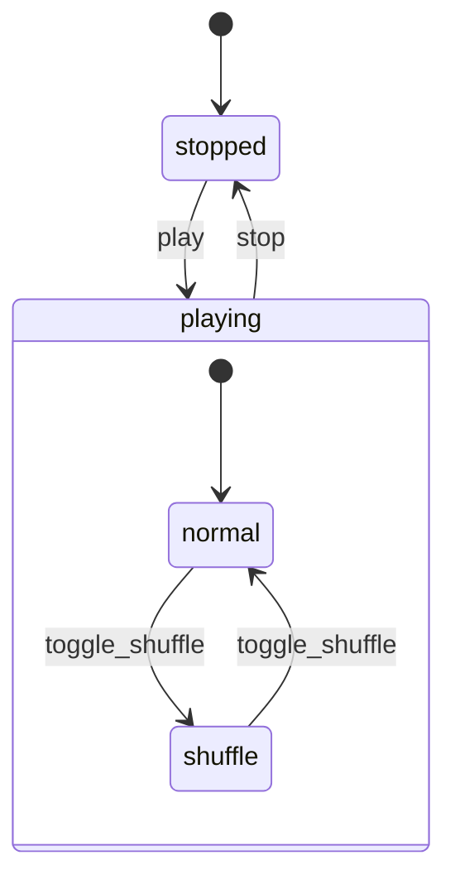

**`learning/code/ex-82-statechart-hierarchical-media-player/example.py`**

```python
"""Example 82: Hierarchical Statechart -- Media Player.

co-36: a Harel statechart for a media player. `Playing` is a PARENT state with
two nested substates, `Normal` and `Shuffle` -- `toggle_shuffle` is handled at
the CHILD level and only makes sense while inside `Playing`. `stop` is handled
at the PARENT level: it is defined ONCE on `Playing` and applies no matter
which substate is currently active (shared transition, not duplicated per
substate). Volume is an ORTHOGONAL region -- `volume_up`/`volume_down` change
independently of which play-state/substate is active.
"""

from __future__ import annotations  # => defers type-hint evaluation for the dict[tuple[str, str], str] aliases below


class IllegalTransition(Exception):  # => raised when neither the child nor parent table has an entry
    pass  # => a plain marker exception -- no extra fields needed, the message carries the detail


# ============================================================
# The nested (child-level) transitions -- only meaningful INSIDE the Playing parent state
# ============================================================

SUBSTATE_TRANSITIONS: dict[tuple[str, str], str] = {  # => keys are (substate, event), checked FIRST in send()
    ("normal", "toggle_shuffle"): "shuffle",  # => normal -> shuffle, on toggle_shuffle
    ("shuffle", "toggle_shuffle"): "normal",  # => shuffle -> normal, on toggle_shuffle
}  # => closes the CHILD-level table -- only reachable while state == "playing"

# ============================================================
# The parent-level (shared) transitions -- apply from ANY substate of Playing
# ============================================================

PARENT_TRANSITIONS: dict[tuple[str, str], str] = {  # => keys are (state, event), checked SECOND in send()
    ("stopped", "play"): "playing",  # => enters Playing; substate defaults to "normal"
    ("playing", "stop"): "stopped",  # => co-36: ONE shared transition -- applies from EITHER substate
}  # => closes the PARENT-level table -- shared across every substate of "playing"


class MediaPlayer:  # => the composite state = (state, substate); volume is a fully independent region
    def __init__(self) -> None:  # => the constructor
        self.state = "stopped"  # => every player starts in this one top-level state
        self.substate: str | None = None  # => only meaningful while state == "playing"
        self.volume = 50  # => the ORTHOGONAL region -- never touched by play-state transitions

    def send(self, event: str) -> None:  # => the ONE method that ever changes state/substate
        # => 1. try the CHILD-level table first -- the more specific transition wins
        if self.state == "playing" and self.substate is not None:  # => only relevant while inside Playing
            child_key = (self.substate, event)  # => builds the (substate, event) lookup key
            if child_key in SUBSTATE_TRANSITIONS:  # => a CHILD-level match found
                self.substate = SUBSTATE_TRANSITIONS[child_key]  # => the child table supplies the next substate
                return  # => handled at the child level -- never falls through to the parent table

        # => 2. bubble up to the PARENT-level table -- the shared transition, regardless of substate
        parent_key = (self.state, event)  # => builds the (state, event) lookup key
        if parent_key in PARENT_TRANSITIONS:  # => a PARENT-level match found
            self.state = PARENT_TRANSITIONS[parent_key]  # => the parent table supplies the next top-level state
            self.substate = "normal" if self.state == "playing" else None  # => entering Playing resets to "normal"
            return  # => handled at the parent level

        # => 3. neither level has this event -- structurally illegal here
        raise IllegalTransition(f"event {event!r} is illegal in state {self.state!r}/{self.substate!r}")  # => honest failure

    def adjust_volume(self, delta: int) -> None:  # => the ORTHOGONAL region -- independent of state/substate
        self.volume = max(0, min(100, self.volume + delta))  # => clamps to [0, 100], never touches state/substate


if __name__ == "__main__":  # => demonstration entry point, executed only when this file is run directly
    player = MediaPlayer()  # => starts "stopped", substate None, per __init__
    player.send("play")  # => stopped -> playing (parent transition), substate defaults to normal
    print(player.state, player.substate)  # => confirms the parent transition fired
    # => Output: playing normal

    player.send("toggle_shuffle")  # => nested-state event, handled at the CHILD level
    print(player.substate)  # => confirms the child-level substate transition fired
    # => Output: shuffle

    player.adjust_volume(20)  # => the orthogonal region changes independently
    print(player.volume)  # => confirms volume moved, untouched by play-state/substate
    # => Output: 70

    player.send("stop")  # => the PARENT's shared transition -- applies even though substate is "shuffle"
    print(player.state, player.substate)  # => confirms the ONE shared parent transition fired from ANY substate
    # => Output: stopped None

    print(player.volume)  # => volume was never touched by the play-state transitions
    # => Output: 70
```

**Run**: `python3 example.py`

**Output**:

```text
playing normal
shuffle
70
stopped None
70
```

**`learning/code/ex-82-statechart-hierarchical-media-player/test_example.py`**

```python
"""Example 82: pytest verification of nested-state events and the parent's shared transition."""

import pytest

from example import IllegalTransition, MediaPlayer


def test_play_enters_playing_with_normal_as_the_default_substate() -> None:
    player = MediaPlayer()
    player.send("play")
    assert player.state == "playing"
    assert player.substate == "normal"


def test_nested_state_event_toggles_the_child_substate() -> None:
    player = MediaPlayer()
    player.send("play")
    player.send("toggle_shuffle")  # => handled entirely at the CHILD level
    assert player.substate == "shuffle"
    player.send("toggle_shuffle")
    assert player.substate == "normal"


def test_parents_shared_transition_applies_from_either_substate() -> None:
    player = MediaPlayer()
    player.send("play")
    player.send("toggle_shuffle")  # => now in the "shuffle" substate
    assert player.substate == "shuffle"
    player.send("stop")  # => co-36: the PARENT's shared transition -- applies even from a non-default substate
    assert player.state == "stopped"
    assert player.substate is None


def test_volume_is_an_orthogonal_region_independent_of_play_state() -> None:
    player = MediaPlayer()
    player.adjust_volume(20)  # => works even while stopped
    assert player.volume == 70
    player.send("play")
    player.send("toggle_shuffle")
    player.adjust_volume(-10)  # => still works, regardless of substate
    assert player.volume == 60
    player.send("stop")
    assert player.volume == 60  # => the play-state transition never touched the orthogonal volume region


def test_toggle_shuffle_is_illegal_while_stopped() -> None:
    player = MediaPlayer()
    with pytest.raises(IllegalTransition):
        player.send("toggle_shuffle")  # => the child transition only exists inside Playing


# => Run: pytest -q -- Output: 5 passed
```

**Verify**: `pytest -q`

**Output**:

```text
5 passed
```

**Key takeaway**: Hierarchy lets a shared transition be written ONCE at the parent level instead of duplicated in every substate -- `stop` appears one time in `PARENT_TRANSITIONS`, not copy-pasted into both `normal` and `shuffle`, and the orthogonal volume region proves not every piece of state needs to live inside the same hierarchy at all.

**Why it matters**: Real UI and device state (media players, wizards, multi-step forms) is naturally hierarchical -- a flat transition table forces every shared behavior to be duplicated per leaf state, which is exactly the scaling problem Harel statecharts were invented to solve.

---

### Example 83: Guards and Entry/Exit Actions -- Order FSM

_ex-83 &middot; exercises co-37_

Extends the transition-table order FSM (ex-81) with a GUARD -- `ship` is only legal when the independent `paid` flag is true, checked on top of the table lookup -- plus ENTRY and EXIT actions that fire exactly once per state crossing.

**`learning/code/ex-83-guards-and-entry-exit-actions/example.py`**

```python
"""Example 83: Guards and Entry/Exit Actions -- Order FSM.

co-37: extends the transition-table order FSM (ex-81) with a GUARD -- `ship`
is only legal when the independent `paid` flag is true, checked ON TOP OF the
table lookup, since the table alone (confirmed -> shipped) says nothing about
payment -- plus ENTRY and EXIT actions that fire exactly once per state
crossing: `log_entry` runs once on entering a state, `release_lock` runs once
on leaving one.
"""

from __future__ import annotations  # => defers type-hint evaluation for the dataclass field annotations below

from dataclasses import dataclass, field  # => field() gives each instance its own list, not a shared mutable default


# ============================================================
# Exceptions -- two DISTINCT failure kinds: structurally illegal vs. guard-blocked
# ============================================================


class IllegalTransition(Exception):  # => the TABLE has no entry for (state, event)
    pass  # => a plain marker exception -- no extra fields needed, the message carries the detail


class GuardBlocked(Exception):  # => the table allows it, but the GUARD condition is not met
    pass  # => a SEPARATE exception type from IllegalTransition -- a different failure kind, distinctly named


# => distinguishing the two exception types lets a caller react differently: retry after payment vs. a hard bug
# => co-37: the table alone cannot know about payment -- that is what the guard in send() checks separately
ORDER_TRANSITIONS: dict[tuple[str, str], str] = {  # => keys are (state, event), values are the next state
    ("created", "confirm"): "confirmed",  # => created -> confirmed, no guard needed here
    ("confirmed", "ship"): "shipped",  # => the table says nothing about payment -- that is the guard's job
    ("shipped", "deliver"): "delivered",  # => shipped -> delivered, no guard needed here
}  # => closes the table -- structurally legal moves ONLY; payment is checked separately, in send()


@dataclass  # => generates __init__ from the field declarations below
class GuardedOrderFsm:  # => co-37: adds a guard clause plus entry/exit actions around the table lookup
    # => lock_held is separate from state/paid -- it demonstrates that exit actions can affect ANY field, not just logs
    state: str = "created"  # => every order starts in this one state
    paid: bool = False  # => an INDEPENDENT flag, set by mark_paid(), not by any state transition
    entry_log: list[str] = field(default_factory=list)  # => records every ENTRY action firing
    exit_log: list[str] = field(default_factory=list)  # => records every EXIT action firing
    lock_held: bool = True  # => simulates a resource acquired on entry, released on exit

    # => mark_paid() is the ONLY way the guard's condition ever changes -- send() only reads it
    def mark_paid(self) -> None:  # => flips the guard's condition, independent of the state machine
        self.paid = True  # => the ONE side effect -- send() below reads this flag, never sets it itself

    # => send() runs the guard/entry/exit pipeline described in the module docstring, in order
    def send(self, event: str) -> str:  # => the ONE method that ever changes state
        key = (self.state, event)  # => builds the (state, event) lookup key for the table
        if key not in ORDER_TRANSITIONS:  # => step 1: the TABLE rejects structurally illegal events
            raise IllegalTransition(f"event {event!r} is illegal in state {self.state!r}")  # => an honest, specific failure

        if event == "ship" and not self.paid:  # => co-37: the GUARD -- checked IN ADDITION to the table entry
            raise GuardBlocked("cannot ship: order is not paid")  # => the table alone said this move was legal

        old_state = self.state  # => remembers the state being LEFT, for the exit action below
        new_state = ORDER_TRANSITIONS[key]  # => the table supplies the state being ENTERED

        self._exit_action(old_state)  # => co-37: EXIT action -- fires exactly once, leaving old_state
        self.state = new_state  # => the ONE line that actually crosses state boundaries
        self._entry_action(new_state)  # => co-37: ENTRY action -- fires exactly once, entering new_state
        return self.state  # => hands back the new state to the caller

    # => entry/exit actions below are PRIVATE -- callers only ever interact through send()
    def _entry_action(self, state: str) -> None:  # => log-on-enter
        self.entry_log.append(state)  # => records exactly once per state crossing, never more

    def _exit_action(self, state: str) -> None:  # => release-lock-on-exit
        self.exit_log.append(state)  # => records exactly once per state crossing, never more
        self.lock_held = False  # => simulates releasing a resource held during the previous state
        # => in a real system, this is where a database row lock or file handle would actually be released


if __name__ == "__main__":  # => demonstration entry point, executed only when this file is run directly
    # => the SAME order instance flows through every step below -- one FSM, five successive send()/log-check calls
    fsm = GuardedOrderFsm()  # => starts "created", unpaid, per the dataclass defaults
    fsm.send("confirm")  # => created -> confirmed: exit created, entry confirmed
    print(fsm.entry_log, fsm.exit_log)  # => confirms BOTH the entry and exit actions fired exactly once
    # => Output: ['confirmed'] ['created']

    try:  # => attempts a move the table allows but the guard should block
        fsm.send("ship")  # => the TABLE allows confirmed -> shipped, but the GUARD blocks it: not yet paid
    except GuardBlocked as error:  # => the guard, not the table, produced this failure
        print(error)  # => shows the honest, specific failure message
    # => Output: cannot ship: order is not paid

    fsm.mark_paid()  # => flips the independent guard condition
    fsm.send("ship")  # => now the guard passes: exit confirmed, entry shipped
    print(fsm.state, fsm.entry_log, fsm.exit_log)  # => confirms the guard's effect and both action logs updated
    # => Output: shipped ['confirmed', 'shipped'] ['created', 'confirmed']
```

**Run**: `python3 example.py`

**Output**:

```text
['confirmed'] ['created']
cannot ship: order is not paid
shipped ['confirmed', 'shipped'] ['created', 'confirmed']
```

**`learning/code/ex-83-guards-and-entry-exit-actions/test_example.py`**

```python
"""Example 83: pytest verification that the guard blocks ship() and each action fires exactly once."""

import pytest

from example import GuardBlocked, GuardedOrderFsm, IllegalTransition


def test_guard_blocks_ship_when_the_order_is_not_yet_paid() -> None:
    fsm = GuardedOrderFsm()
    fsm.send("confirm")
    with pytest.raises(GuardBlocked, match="not paid"):
        fsm.send("ship")  # => the table allows this transition; the GUARD is what blocks it
    assert fsm.state == "confirmed"  # => the state never advanced -- the guard fired before any mutation


def test_guard_passes_once_mark_paid_flips_the_independent_flag() -> None:
    fsm = GuardedOrderFsm()
    fsm.send("confirm")
    fsm.mark_paid()
    assert fsm.send("ship") == "shipped"


def test_entry_and_exit_actions_fire_exactly_once_per_state_crossing() -> None:
    fsm = GuardedOrderFsm()
    fsm.send("confirm")
    fsm.mark_paid()
    fsm.send("ship")
    fsm.send("deliver")
    assert fsm.entry_log == ["confirmed", "shipped", "delivered"]  # => exactly one entry per state entered
    assert fsm.exit_log == ["created", "confirmed", "shipped"]  # => exactly one exit per state left


def test_lock_released_flag_flips_on_the_first_exit_action() -> None:
    fsm = GuardedOrderFsm()
    assert fsm.lock_held is True  # => held from construction, before any transition
    fsm.send("confirm")
    assert fsm.lock_held is False  # => released by the exit action leaving "created"


def test_illegal_event_never_fires_a_guard_or_an_action() -> None:
    fsm = GuardedOrderFsm()
    with pytest.raises(IllegalTransition):
        fsm.send("deliver")  # => no table entry for ("created", "deliver") at all
    assert fsm.entry_log == []  # => no action fired for a transition the table itself rejected
    assert fsm.exit_log == []


# => Run: pytest -q -- Output: 5 passed
```

**Verify**: `pytest -q`

**Output**:

```text
5 passed
```

**Key takeaway**: A guard and a table entry answer different questions -- "does this transition exist at all" (the table) versus "is it allowed right now, given other state" (the guard) -- and keeping them separate means the table stays a clean map of structure while guards carry the business rules.

**Why it matters**: Almost every real workflow FSM needs at least one guard ("can only approve if the requester is not the approver," "can only refund within 30 days") -- modeling guards as a distinct, testable concern from the transition table keeps both simple.

---

### Example 84: Transition-Table FSM vs. Boolean-Flag Soup -- a Direct Contrast

_ex-84 &middot; exercises co-35, co-33_

Places the transition-table FSM (ex-81) side by side with the boolean-flag order (ex-60's `FlagOrder`, reproduced for a self-contained comparison). The flag version can represent `is_shipped=True, is_paid=False` -- a combination the business rules forbid. The FSM version cannot represent this at all: there is no path through the table that reaches `"shipped"` without first passing through `"paid"`.

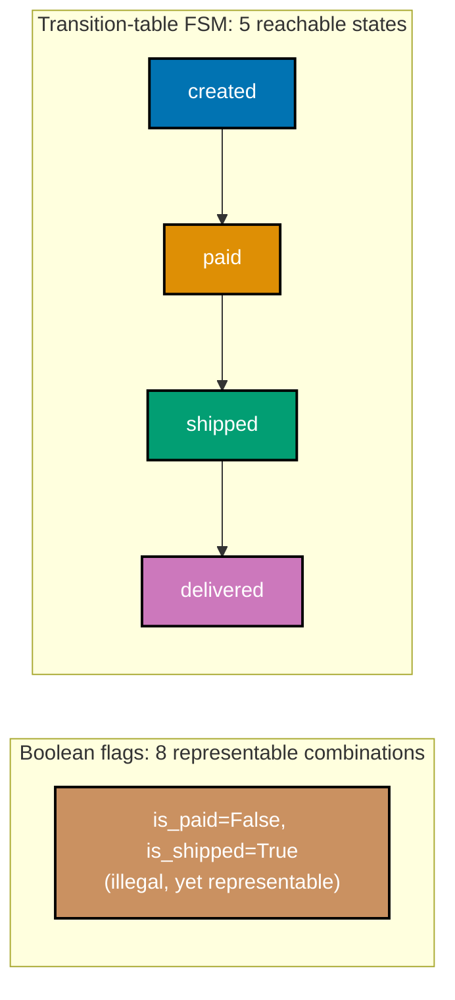

**`learning/code/ex-84-fsm-vs-boolean-flags-contrast/example.py`**

```python
"""Example 84: Transition-Table FSM vs. Boolean-Flag Soup -- a Direct Contrast.

co-35, co-33: places the transition-table FSM (ex-81) side by side with the
boolean-flag order (ex-60's `FlagOrder`, reproduced here for a self-contained
comparison). The flag version can represent `is_shipped=True, is_paid=False`
-- a combination the business rules say should be impossible. The FSM version
CANNOT represent this: "shipped" is a single string value, and there is no
combination of table entries that reaches it without first passing through
"paid". The illegal combination is unrepresentable, not just unreached.
"""

from __future__ import annotations  # => defers type-hint evaluation for the dict[tuple[str, str], str] alias below


class IllegalTransition(Exception):  # => raised when the FSM table has no entry for (state, event)
    pass  # => a plain marker exception -- no extra fields needed, the message carries the detail


# ============================================================
# BEFORE: boolean-flag soup -- co-33's starting point, reproduced for comparison
# ============================================================


class FlagOrder:  # => three independent booleans -- 2**3 = 8 representable combinations
    def __init__(self) -> None:  # => the constructor
        self.is_paid = False  # => independent flag 1 of 3 -- nothing ties this to the other two
        self.is_shipped = False  # => independent flag 2 of 3 -- settable regardless of is_paid
        self.is_cancelled = False  # => independent flag 3 of 3 -- settable regardless of the other two


# ============================================================
# AFTER: the transition-table FSM (ex-81) -- one string field, only reachable states exist
# ============================================================

# => co-35: contrast with FlagOrder above -- ONE field (state), not three independent booleans
ORDER_TRANSITIONS: dict[tuple[str, str], str] = {  # => keys are (state, event), values are the next state
    ("created", "pay"): "paid",  # => created -> paid, on the "pay" event
    ("created", "cancel"): "cancelled",  # => created -> cancelled, on the "cancel" event
    ("paid", "ship"): "shipped",  # => paid -> shipped -- only reachable AFTER "paid"
    ("paid", "cancel"): "cancelled",  # => paid -> cancelled, on the "cancel" event
    ("shipped", "deliver"): "delivered",  # => shipped -> delivered, on the "deliver" event
}  # => closes the table -- "shipped" only ever appears as a value reached THROUGH "paid", never around it


class OrderFsm:  # => a single string field -- only states REACHABLE by walking the table can ever exist
    def __init__(self) -> None:  # => the constructor
        self.state = "created"  # => the ONE field this class has -- no independent booleans to fall out of sync

    def send(self, event: str) -> str:  # => the ONE method that ever changes self.state
        key = (self.state, event)  # => builds the (state, event) lookup key for the table
        if key not in ORDER_TRANSITIONS:  # => the TABLE rejects illegal events -- no scattered if-checks anywhere
            raise IllegalTransition(f"event {event!r} is illegal in state {self.state!r}")  # => an honest, specific failure
        self.state = ORDER_TRANSITIONS[key]  # => the table itself supplies the next state, no branching logic here
        return self.state  # => hands back the new state to the caller


def count_representable_flag_combinations() -> int:  # => 3 booleans-worth of independence -> 2**3 combos, ALL settable
    return 2 * 2 * 2  # => is_paid x is_shipped x is_cancelled, each independently True/False


# => co-33: the gap between these two counts IS the illegal-state surface that boolean flags leave open
def count_reachable_fsm_states() -> int:  # => only the states that appear as a VALUE in the transition table
    reachable = {"created"} | set(ORDER_TRANSITIONS.values())  # => created is the start; the rest come from the table
    return len(reachable)  # => a strictly smaller number than the flag version's combinations, by construction


if __name__ == "__main__":  # => demonstration entry point, executed only when this file is run directly
    flags = FlagOrder()  # => starts with all three flags False
    flags.is_shipped = True  # => nothing in the FlagOrder class prevents setting this WITHOUT is_paid
    print(flags.is_shipped, flags.is_paid)  # => the illegal combination IS representable -- it just happened
    # => Output: True False

    fsm = OrderFsm()  # => starts in "created", the FSM's single field
    try:  # => attempts the FSM equivalent of the same illegal combination above
        fsm.send("ship")  # => the FSM equivalent of "become shipped without paying first"
    except IllegalTransition as error:  # => the table's own omission produced this, not a manual if-check
        print(error)  # => structurally rejected: there is no table entry for ("created", "ship")
    # => Output: event 'ship' is illegal in state 'created'

    print(count_representable_flag_combinations())  # => 8 combinations the type system allows
    # => Output: 8
    print(count_reachable_fsm_states())  # => only 5 states are reachable at all -- illegal combos don't exist as values
    # => Output: 5
```

**Run**: `python3 example.py`

**Output**:

```text
True False
event 'ship' is illegal in state 'created'
8
5
```

**`learning/code/ex-84-fsm-vs-boolean-flags-contrast/test_example.py`**

```python
"""Example 84: pytest verification that the FSM makes an illegal combination unrepresentable, unlike flags."""

import pytest

from example import (
    FlagOrder,
    IllegalTransition,
    OrderFsm,
    count_reachable_fsm_states,
    count_representable_flag_combinations,
)


def test_flag_order_can_represent_the_illegal_shipped_without_paid_combination() -> None:
    flags = FlagOrder()
    flags.is_shipped = True  # => nothing stops this -- the type itself allows the illegal combination
    assert flags.is_shipped is True
    assert flags.is_paid is False  # => the combination the business rules forbid IS representable in this type


def test_fsm_cannot_reach_shipped_without_first_passing_through_paid() -> None:
    fsm = OrderFsm()
    with pytest.raises(IllegalTransition, match="illegal in state 'created'"):
        fsm.send("ship")  # => structurally rejected -- there is no path to "shipped" that skips "paid"
    assert fsm.state == "created"  # => state never advanced


def test_fsm_reaches_shipped_only_via_the_paid_state() -> None:
    fsm = OrderFsm()
    fsm.send("pay")
    fsm.send("ship")
    assert fsm.state == "shipped"  # => the ONLY path to "shipped" passes through "paid"


def test_flag_soup_has_more_representable_combinations_than_the_fsm_has_reachable_states() -> None:
    assert count_representable_flag_combinations() == 8  # => every boolean combination is a distinct value
    assert count_reachable_fsm_states() == 5  # => strictly fewer -- illegal combinations simply do not exist


# => Run: pytest -q -- Output: 4 passed
```

**Verify**: `pytest -q`

**Output**:

```text
4 passed
```

**Key takeaway**: "Unrepresentable" is a stronger guarantee than "unreached" -- a boolean-flag order CAN hold an illegal combination (nothing in the type stops it, it just has not happened yet in this run), while the FSM's single-state-value design makes the illegal combination impossible to construct in the first place.

**Why it matters**: This is the practical payoff of state-machine modeling: bugs caught by "the type does not allow this" are caught at every call site, forever, while bugs caught by "we haven't hit this path yet" depend on every future caller remembering the same discipline -- illegal-states-unrepresentable is a design property, not a habit.

---

← Previous: [Intermediate Examples](./intermediate.md) &middot; Next: [Capstone](./capstone/overview.md) →
