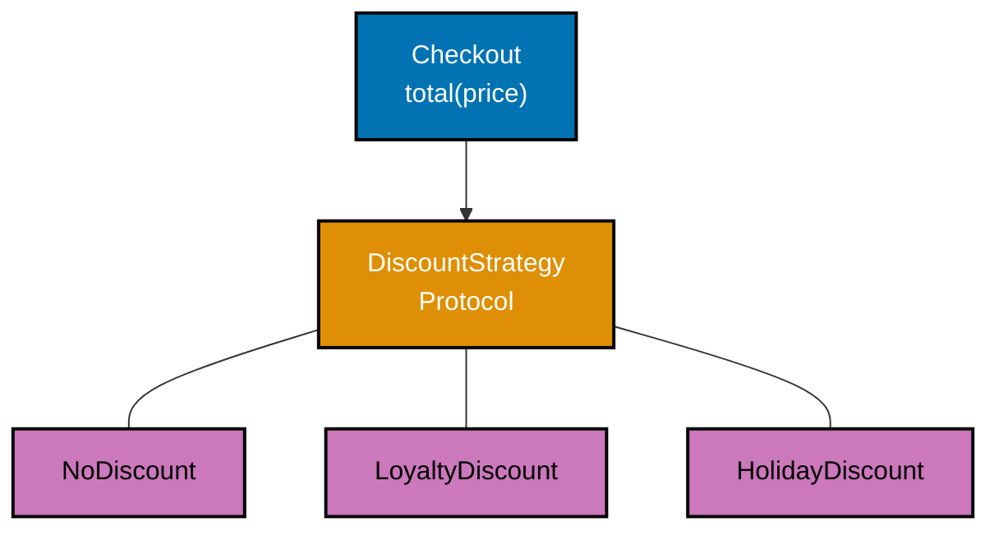
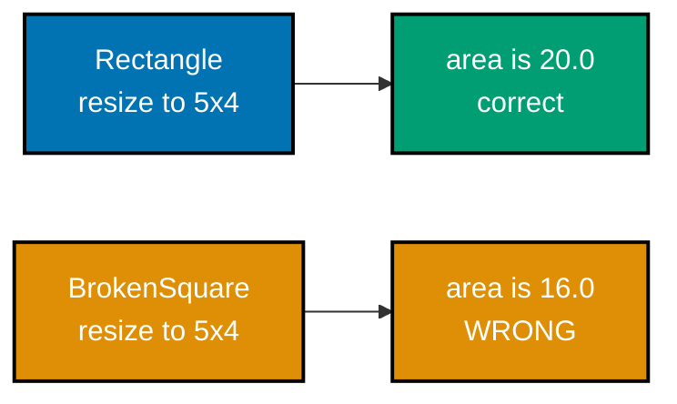
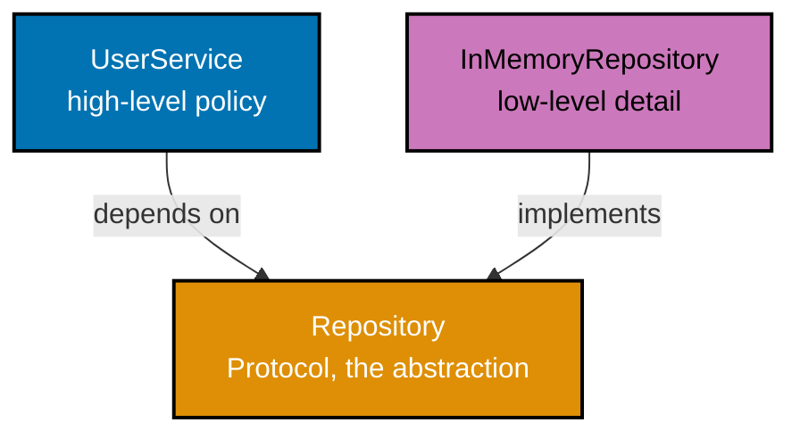
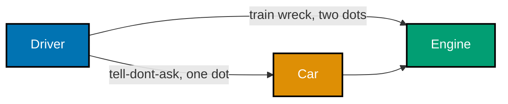
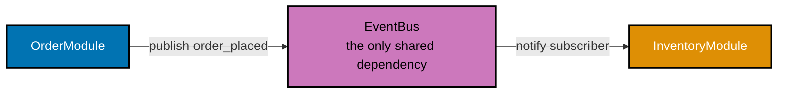
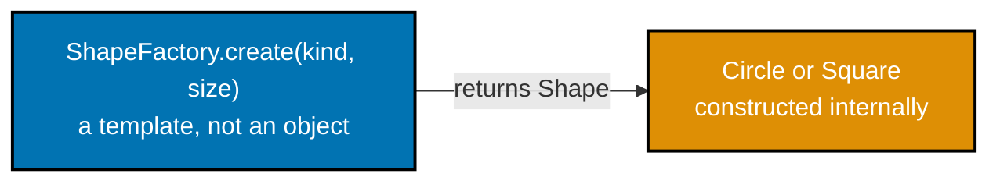
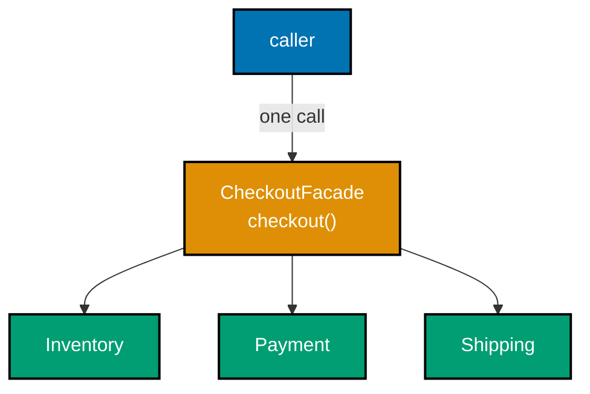
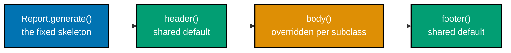

Examples 1-27 build the foundational vocabulary of object-oriented design in Python: the five SOLID principles (single responsibility through dependency inversion), the Law of Demeter, five foundational GRASP patterns (information expert, creator, controller, high cohesion, low coupling), and seven classic design patterns (factory method, strategy, observer, adapter, decorator, facade, and template method), closing with composition-over-inheritance and an immutable value object. Every example is a complete, self-contained `example.py` colocated under `learning/code/`, verified two ways: `python3 example.py` prints its own expected output inline via `# =>` comments, and a colocated `test_example.py` asserts the same behavior under `pytest`.

---

### Example 1: Split a God Class by Responsibility

_ex-01 &middot; exercises co-01_

A single class that parses raw text, formats a report, and writes it to a file has three separate reasons to change. This example splits that responsibility across `DataParser`, `ReportFormatter`, and `ReportWriter`, each of which owns exactly one job.


**`learning/code/ex-01-srp-split-god-class/example.py`**

```python
"""Example 1: Split a God Class by Responsibility."""


class DataParser:  # => the ONLY class that turns raw text into structured rows
    def parse(self, raw: str) -> list[str]:  # => defines the parse() method
        return [
            line.strip()  # => transformation applied to every kept line
            for line in raw.splitlines()  # => splits the raw string on newlines first
            if line.strip()
            # => splits on newlines, trims whitespace, drops blank lines
        ]  # => splits and trims non-blank lines


class ReportFormatter:  # => the ONLY class that turns rows into a display string
    def format(self, rows: list[str]) -> str:  # => defines the format() method
        return "\n".join(
            f"- {row}"  # => the format applied to every row, unconditionally
            for row in rows  # => iterates the caller-supplied rows in order
            # => prefixes every row with a bullet marker, nothing else
        )  # => bullets each row, unrelated to parsing or saving


class ReportWriter:  # => the ONLY class that persists a finished report
    def save(
        self,
        report: str,
        sink: list[str],
        # => sink is a real parameter here, standing in for a real file handle
    ) -> None:  # => sink simulates a file: an in-memory list
        sink.append(report)  # => the sole write path -- no parsing or formatting here


raw_input: str = "alice\n\nbob\ncarol\n"  # => sample raw data, includes a blank line
parser: DataParser = DataParser()  # => constructs parser
formatter: ReportFormatter = ReportFormatter()  # => constructs formatter
writer: ReportWriter = ReportWriter()  # => constructs writer
# => three independent collaborators -- none of them knows the other two exist

rows: list[str] = parser.parse(raw_input)  # => rows is ["alice", "bob", "carol"]
report: str = formatter.format(rows)  # => report is "- alice\n- bob\n- carol"
saved_files: list[str] = []  # => the in-memory "filesystem" ReportWriter appends to
writer.save(report, saved_files)  # => the ONLY line in this program that mutates it
# => a real deployment would swap ReportWriter's sink for an actual open file

print(report)  # => confirms the parse -> format -> save pipeline produced this text
# => Output: - alice
# => - bob
# => - carol
# => Each class changes for exactly one reason: parsing rules, display formatting, or storage -- never more than one
```

**Run**: `python3 example.py`

**Output**:

```text
- alice
- bob
- carol
```

**`learning/code/ex-01-srp-split-god-class/test_example.py`**

```python
"""Example 1: pytest verification for Split a God Class by Responsibility."""

from example import DataParser, ReportFormatter, ReportWriter


def test_each_class_carries_only_its_own_responsibility() -> None:
    # => structural check: no class exposes a method belonging to another concern
    # => DataParser must never format or save -- parsing is its one reason to change
    assert not hasattr(DataParser, "format") and not hasattr(DataParser, "save")
    # => ReportFormatter must never parse or save -- formatting is its one job
    assert not hasattr(ReportFormatter, "parse") and not hasattr(ReportFormatter, "save")
    # => ReportWriter must never parse or format -- persistence is its one job
    assert not hasattr(ReportWriter, "parse") and not hasattr(ReportWriter, "format")


def test_pipeline_produces_expected_report() -> None:
    # => three collaborators, each doing exactly one step of the pipeline
    rows: list[str] = DataParser().parse("alice\n\nbob\ncarol\n")  # => rows is ["alice", "bob", "carol"]
    report: str = ReportFormatter().format(rows)  # => formats the parsed rows
    sink: list[str] = []  # => the in-memory "file" ReportWriter appends to
    ReportWriter().save(report, sink)  # => the only mutation of sink in this test
    assert sink == ["- alice\n- bob\n- carol"]  # => exactly one save recorded


# => Run: pytest -- Output: 2 passed
```

**Verify**: `pytest -q`

**Output**:

```text
2 passed
```

**Key takeaway**: Splitting mixed responsibilities across dedicated classes means a change to parsing rules, display formatting, or storage can never accidentally break the other two.

**Why it matters**: God classes that mix parsing, formatting, and I/O are a leading cause of regressions in real codebases: a developer fixing a display bug can accidentally break file writing because both live in the same class and share the same test suite. Splitting responsibilities the way this example does makes each class independently testable -- `DataParser`'s tests never need a filesystem, and `ReportWriter`'s tests never need to construct valid input data. That isolation is what SRP is actually buying, not an aesthetic preference for smaller files.

---

### Example 2: Extract the Report Writer from the Calculator

_ex-02 &middot; exercises co-01_

A `SalesCalculator` that also writes formatted output to a file mixes pure computation with I/O, making the math impossible to test without a sink. This example extracts `SalesReportWriter` as a separate class, leaving `SalesCalculator` with no knowledge of files, printing, or sinks at all.

**`learning/code/ex-02-srp-extract-report-writer/example.py`**

```python
"""Example 2: Extract the Report Writer from the Calculator."""  # => module docstring


class SalesCalculator:  # => computes numbers ONLY -- never touches a file or console
    def total(self, sales: list[float]) -> float:  # => defines the total() method
        return sum(sales)  # => pure arithmetic, no printing, no writing, no imports

    def average(
        self,  # => the SalesCalculator instance itself, spelled out by the split
        sales: list[float],  # => the same list of amounts passed to total()
        # => still a pure calculation -- no side effects live in this class at all
    ) -> float:  # => a second pure calculation, same concern
        return sum(sales) / len(sales) if sales else 0.0  # => guards empty input


class SalesReportWriter:  # => the ONLY class allowed to produce output text
    def write(
        self,  # => the SalesReportWriter instance, spelled out by the multi-line split
        total: float,  # => the already-computed total -- write() never computes it
        average: float,  # => the already-computed average -- write() never computes it
        sink: list[str],
        # => sink stands in for a real file handle, opened by the caller instead
    ) -> str:  # => sink simulates a file
        line: str = f"total={total:.2f} average={average:.2f}"  # => builds the line
        sink.append(line)  # => the sole write -- SalesCalculator never does this
        return line  # => returns the same line for the caller's convenience


calculator: SalesCalculator = SalesCalculator()  # => constructs calculator
writer: SalesReportWriter = SalesReportWriter()  # => constructs writer
# => two collaborators, built independently -- neither constructor needs the other
sales: list[float] = [100.0, 200.0, 300.0]  # => three sample sale amounts

total: float = calculator.total(sales)  # => total is 600.0, purely computed
average: float = calculator.average(sales)  # => average is 200.0, purely computed
sink: list[str] = []  # => the in-memory "file" the writer appends to
line: str = writer.write(
    total,  # => passed in already-computed, not recalculated by the writer
    average,  # => passed in already-computed, not recalculated by the writer
    sink,  # => the same in-memory "file" constructed above, appended to below
    # => passes numbers IN; the writer alone decides how to render and store them
)  # => the ONLY call in this program that produces text

print(line)  # => confirms the writer, not the calculator, produced this string
# => the printed text and the recorded sink entry are the SAME line object
# => Output: total=600.00 average=200.00
# => Moving `write` out of `SalesCalculator` means the calculator's tests never need a sink, a file, or a console at all
```

**Run**: `python3 example.py`

**Output**:

```text
total=600.00 average=200.00
```

**`learning/code/ex-02-srp-extract-report-writer/test_example.py`**

```python
"""Example 2: pytest verification for Extract the Report Writer from the Calculator."""

import inspect

from example import SalesCalculator, SalesReportWriter


def test_calculator_source_contains_no_io_keywords() -> None:
    source: str = inspect.getsource(SalesCalculator)  # => reads the calculator's own source text
    # => "print(", "open(", and ".append(" to a sink are all IO-flavored calls
    assert "print(" not in source
    assert "open(" not in source
    assert "sink" not in source  # => the calculator never even names a sink parameter


def test_calculation_and_write_stay_correct_when_separated() -> None:
    calculator: SalesCalculator = SalesCalculator()
    total: float = calculator.total([100.0, 200.0, 300.0])
    average: float = calculator.average([100.0, 200.0, 300.0])
    sink: list[str] = []
    line: str = SalesReportWriter().write(total, average, sink)
    assert line == "total=600.00 average=200.00"  # => writer formats correctly
    assert sink == [line]  # => exactly one write recorded, by the writer alone


# => Run: pytest -- Output: 2 passed
```

**Verify**: `pytest -q`

**Output**:

```text
2 passed
```

**Key takeaway**: A calculator class that never imports or calls I/O primitives can be tested with plain numbers in and plain numbers out, with no setup or mocking required.

**Why it matters**: Business logic tangled with I/O is one of the most common reasons unit tests balloon into slow, brittle integration tests -- verifying a tax calculation should never require mocking a file handle. Once `SalesCalculator` is provably I/O-free -- checked here by scanning its own source for `print`, `open`, and `sink` -- every future change to how reports are rendered or stored can happen without touching, or re-testing, the arithmetic at all.

---

### Example 3: Replace an If/Elif Chain with Strategy Objects

_ex-03 &middot; exercises co-02, co-25_

An if/elif chain that branches on customer type must be edited every time a new discount is added, which is exactly what the open-closed principle forbids. This example replaces the chain with interchangeable `DiscountStrategy` objects that `Checkout` delegates to, so a new discount is a new class, not a new branch.



**`learning/code/ex-03-ocp-strategy-for-discount/example.py`**

```python
"""Example 3: Replace an If/Elif Chain with Strategy Objects."""  # => module docstring

from typing import Protocol  # => Protocol declares a structural interface, no ABC needed


class DiscountStrategy(Protocol):  # => the ONE shape every discount must match
    # => any class with a matching apply() method satisfies this, no inheritance needed
    def apply(self, price: float) -> float:  # => every strategy exposes apply()
        ...  # => Protocol methods have no body -- this is a structural contract only


class NoDiscount:  # => one interchangeable strategy -- knows nothing about Checkout
    def apply(self, price: float) -> float:  # => matches DiscountStrategy structurally
        return price  # => no discount at all


class LoyaltyDiscount:  # => a second strategy, same method name, different math
    def apply(self, price: float) -> float:  # => matches DiscountStrategy structurally
        return price * 0.9  # => a flat 10% off for loyalty members


class HolidayDiscount:  # => a third strategy, added without touching the other two
    def apply(self, price: float) -> float:  # => matches DiscountStrategy structurally
        return price * 0.75  # => a flat 25% off during holidays


class Checkout:  # => CLOSED for modification: never edited to add a new discount
    def __init__(  # => the constructor, spread across lines to annotate each parameter
        self,
        strategy: DiscountStrategy,
        # => depends on the PROTOCOL, not on any one concrete discount class
    ) -> None:  # => the constructor -- runs once, automatically, per instantiation
        self.strategy = strategy  # => held as a collaborator, not hard-coded

    def total(self, price: float) -> float:  # => defines the total() method
        return self.strategy.apply(
            price
            # => no if/elif chain anywhere -- the strategy object IS the branch
        )  # => delegates the discount DECISION entirely to the strategy object


regular: Checkout = Checkout(NoDiscount())  # => open for extension via composition
loyal: Checkout = Checkout(LoyaltyDiscount())  # => a new behavior, zero edits above
holiday: Checkout = Checkout(HolidayDiscount())  # => same Checkout class, third behavior
# => three Checkout instances, three behaviors, ONE unedited Checkout class body

print(
    regular.total(100.0),  # => 100.0, NoDiscount applies no reduction
    loyal.total(100.0),  # => 90.0, LoyaltyDiscount applies 10% off
    holiday.total(100.0),  # => 75.0, HolidayDiscount applies 25% off
    # => each call routes through the same total() method, different collaborator
)  # => three totals, one unmodified Checkout class
# => an if/elif chain would have needed a new branch for every new discount
# => Output: 100.0 90.0 75.0
# => Adding a fourth discount means writing a fourth class with an `apply()` method -- `Checkout` itself never changes again
```

**Run**: `python3 example.py`

**Output**:

```text
100.0 90.0 75.0
```

**`learning/code/ex-03-ocp-strategy-for-discount/test_example.py`**

```python
"""Example 3: pytest verification for Replace an If/Elif Chain with Strategy Objects."""

import inspect

from example import Checkout, HolidayDiscount, LoyaltyDiscount, NoDiscount


def test_checkout_source_never_names_a_concrete_discount() -> None:
    source: str = inspect.getsource(Checkout)  # => reads Checkout's own source text, nothing else
    # => none of the three concrete strategy class names appear inside Checkout
    assert "NoDiscount" not in source
    assert "LoyaltyDiscount" not in source
    assert "HolidayDiscount" not in source  # => proves zero edits were needed to add it


def test_each_strategy_computes_its_own_price() -> None:
    assert Checkout(NoDiscount()).total(100.0) == 100.0
    assert Checkout(LoyaltyDiscount()).total(100.0) == 90.0
    assert Checkout(HolidayDiscount()).total(100.0) == 75.0  # => added with no edits


# => Run: pytest -- Output: 2 passed
```

**Verify**: `pytest -q`

**Output**:

```text
2 passed
```

**Key takeaway**: `Checkout.total()` never names `NoDiscount`, `LoyaltyDiscount`, or `HolidayDiscount` directly -- it only calls `strategy.apply()`, so the dispatcher is provably closed for modification.

**Why it matters**: Pricing rules are exactly the kind of logic that grows over a product's lifetime -- seasonal discounts, loyalty tiers, regional promotions -- and an if/elif chain that must be edited for each one becomes a merge-conflict magnet touched by every team working on pricing. The strategy pattern turns that shared, contested function into an append-only set of independent classes, each of which can be written, reviewed, and deployed without anyone touching `Checkout` at all.

---

### Example 4: Extend Behavior via a Plugin Registry

_ex-04 &middot; exercises co-02_

A dispatch function that grows a new if/elif branch for every event type is closed for extension, not open. This example replaces the branching with a `HANDLERS` registry populated by an `@register` decorator, so `dispatch()` looks up behavior instead of choosing it.

**`learning/code/ex-04-ocp-plugin-registry/example.py`**

```python
"""Example 4: Extend Behavior via a Plugin Registry."""

from typing import Callable  # => Callable types the registry's stored handlers

HANDLERS: dict[str, Callable[[str], str]] = {}  # => starts empty; register() populates it as each handler module-level-loads  # => the ONE registry every handler plugs into


def register(
    name: str,
    # => name is the event key later dispatch() calls will look up
) -> Callable[
    [Callable[[str], str]], Callable[[str], str]  # => maps handler-in to handler-out
]:  # => a decorator FACTORY, returns the real decorator below
    def decorator(
        fn: Callable[[str], str],
        # => fn is the handler function being registered under `name`
    ) -> Callable[[str], str]:  # => the actual decorator, closes over `name`
        HANDLERS[name] = fn  # => the ONLY line that mutates HANDLERS
        return fn  # => returns fn unchanged so it stays directly callable too

    return decorator  # => returns this closure to be applied as @register("...")


@register("greet")  # => registers this function under the key "greet"
def handle_greet(payload: str) -> str:  # => defines the handle_greet() function
    return f"Hello, {payload}!"  # => the greet-specific behavior, isolated here
    # => this decorator call is the ONLY place "greet" is ever written down


@register("shout")  # => a SECOND handler, registered with zero edits to dispatch()
def handle_shout(payload: str) -> str:  # => defines the handle_shout() function
    return payload.upper() + "!!!"  # => the shout-specific behavior, isolated here


def dispatch(event_name: str, payload: str) -> str:  # => defines the dispatch() function
    handler: Callable[[str], str] = HANDLERS[
        event_name  # => the key chosen by whichever @register("...") call ran earlier
    ]  # => looks up the registered handler by name -- no if/elif anywhere
    return handler(payload)  # => calls whichever function was registered
    # => this function never mentions "greet" or "shout" by name, ever


print(dispatch("greet", "Rex"))  # => routes through the registry, not a branch
print(dispatch("shout", "woof"))  # => a totally different registered handler
# => a fifth handler could be added below with @register("...") and no other edit
# => Output: Hello, Rex!
# => WOOF!!!
# => `dispatch()` was written once and never touched again when `handle_shout` was added
```

**Run**: `python3 example.py`

**Output**:

```text
Hello, Rex!
WOOF!!!
```

**`learning/code/ex-04-ocp-plugin-registry/test_example.py`**

```python
"""Example 4: pytest verification for Extend Behavior via a Plugin Registry."""

from example import HANDLERS, dispatch, register


def test_new_handler_needs_zero_edits_to_dispatch() -> None:
    # => registers a THIRD handler here, in the test, after the module already loaded
    @register("whisper")
    def handle_whisper(payload: str) -> str:  # => a brand-new handler, defined locally
        return payload.lower() + "..."  # => the whisper-specific behavior

    assert "whisper" in HANDLERS  # => the decorator alone added it to the registry
    assert dispatch("whisper", "REX") == "rex..."  # => dispatch() needed no changes


def test_existing_handlers_still_work() -> None:
    assert dispatch("greet", "Rex") == "Hello, Rex!"
    assert dispatch("shout", "woof") == "WOOF!!!"


# => Run: pytest -- Output: 2 passed
```

**Verify**: `pytest -q`

**Output**:

```text
2 passed
```

**Key takeaway**: A new handler is registered by decorating a new function with `@register` -- `dispatch()` itself is never opened for editing again after it is first written.

**Why it matters**: Plugin registries like this one are the backbone of extensible systems -- web framework route tables, CLI subcommand dispatchers, and event-driven architectures all use the same registry-plus-decorator shape. The payoff is concrete: this example's own test adds a third handler, `whisper`, entirely inside the test function, and `dispatch()` still works correctly with zero source changes, which is the OCP guarantee made mechanically verifiable.

---

### Example 5: Square(Rectangle) Breaks Liskov Substitution

_ex-05 &middot; exercises co-03_

Making `Square` inherit from `Rectangle` looks reasonable until a client resizes it: overriding `set_width` to also change height breaks any code that assumed the two were independent. This example demonstrates the exact numeric mismatch that substitution causes, then fixes it by making `Square` a standalone type with no shared contract to violate.



**`learning/code/ex-05-lsp-rectangle-square/example.py`**

```python
"""Example 5: Square(Rectangle) Breaks Liskov Substitution."""


class Rectangle:  # => the base type every client below expects to receive
    def __init__(self, width: float, height: float) -> None:  # => the constructor
        self._width = width  # => stored independently from height, by design
        self._height = height  # => stored independently from width, by design

    def set_width(self, width: float) -> None:  # => changes width ONLY
        self._width = width  # => height is left completely untouched

    def set_height(self, height: float) -> None:  # => changes height ONLY
        self._height = height  # => width is left completely untouched

    def area(self) -> float:  # => defines the area() method
        return self._width * self._height  # => the invariant every client relies on


class BrokenSquare(Rectangle):  # => BROKEN: claims to BE a Rectangle, but is not one
    def set_width(self, width: float) -> None:  # => overrides the base contract
        self._width = width  # => sets width...
        self._height = width  # => ...AND silently mutates height too -- the violation

    def set_height(self, height: float) -> None:  # => overrides the base contract
        self._width = height  # => sets width...
        self._height = height  # => ...AND silently mutates width too -- the violation


def resize_to_5_by_4(shape: Rectangle) -> float:  # => a CLIENT written only against Rectangle
    shape.set_width(5.0)  # => the client trusts this changes ONLY width
    shape.set_height(4.0)  # => the client trusts this changes ONLY height
    return shape.area()  # => a well-behaved Rectangle subtype must return 20.0 here


plain: Rectangle = Rectangle(2.0, 2.0)  # => an ordinary, well-behaved Rectangle
broken: BrokenSquare = BrokenSquare(2.0, 2.0)  # => substituted where Rectangle is expected

plain_area: float = resize_to_5_by_4(plain)  # => plain_area is 20.0, as expected
broken_area: float = resize_to_5_by_4(broken)  # => broken_area is 16.0 -- substitution silently broke the client's assumption

print(plain_area, broken_area)  # => the SAME client function, two different outcomes
# => Output: 20.0 16.0
# => Fixing this means Square must NOT inherit from Rectangle -- see the standalone Square below


class Square:  # => the FIX: a standalone type, unrelated to Rectangle entirely
    def __init__(self, side: float) -> None:  # => the constructor
        self._side = side  # => a Square has exactly one dimension, not two

    def set_side(self, side: float) -> None:  # => there is no set_width/set_height at all
        self._side = side  # => nothing here can violate a contract it never inherited

    def area(self) -> float:  # => defines the area() method
        return self._side * self._side  # => Square's own, honest area formula


square: Square = Square(4.0)  # => never passed to resize_to_5_by_4 -- wrong shape for it
print(square.area())  # => Square is verified entirely on its own terms
# => Output: 16.0
# => `Square` and `Rectangle` are siblings, not parent and child -- neither one's contract binds the other
```

**Run**: `python3 example.py`

**Output**:

```text
20.0 16.0
16.0
```

**`learning/code/ex-05-lsp-rectangle-square/test_example.py`**

```python
"""Example 5: pytest verification for Square(Rectangle) Breaks Liskov Substitution."""

from example import BrokenSquare, Rectangle, Square, resize_to_5_by_4


def test_broken_square_violates_the_rectangle_contract() -> None:
    # => this test DOCUMENTS the LSP violation: substitution changes behavior
    plain_area: float = resize_to_5_by_4(Rectangle(2.0, 2.0))
    broken_area: float = resize_to_5_by_4(BrokenSquare(2.0, 2.0))  # => substituted in
    assert plain_area == 20.0  # => the well-behaved base case
    assert broken_area == 16.0  # => NOT 20.0 -- proof the substitution broke the client
    assert plain_area != broken_area  # => the same client, two incompatible outcomes


def test_standalone_square_never_shares_rectangles_contract() -> None:
    square: Square = Square(4.0)  # => the fix: no inheritance relationship at all
    assert square.area() == 16.0  # => correct on Square's own terms
    assert not issubclass(Square, Rectangle)  # => structurally proves the two types are now unrelated


# => Run: pytest -- Output: 2 passed
```

**Verify**: `pytest -q`

**Output**:

```text
2 passed
```

**Key takeaway**: A subtype that must override a base method's contract to stay geometrically consistent is not a valid subtype at all -- the fix is separate types, not a smarter override.

**Why it matters**: The Rectangle/Square example is the canonical illustration of LSP because it looks so innocent in a UML diagram and so wrong the moment a client actually mutates the object -- this example's `resize_to_5_by_4()` returns `20.0` for a real `Rectangle` and `16.0` for `BrokenSquare`, silently, with no exception raised anywhere. That silent divergence is precisely why LSP violations are dangerous in production: the bug shows up as a wrong number three layers away from the class that caused it.

---

### Example 6: Refactor an Ostrich That Cannot Fly

_ex-06 &middot; exercises co-03_

An `Ostrich(Bird)` that overrides `fly()` to raise `NotImplementedError` technically compiles but breaks the moment any client calls `fly()` on a list of birds. This example refactors the hierarchy so only `FlyingBird` declares `fly()`, and `Ostrich` simply never inherits it, making the broken method structurally impossible to reach.

**`learning/code/ex-06-lsp-bird-fly/example.py`**

```python
"""Example 6: Refactor an Ostrich That Cannot Fly."""


class Bird:  # => the base every bird shares: attributes true of ALL birds
    def __init__(self, name: str) -> None:  # => the constructor
        self.name = name  # => every bird, flying or not, has a name


class FlyingBird(Bird):  # => a SEPARATE capability, not assumed by every Bird
    def fly(self) -> str:  # => only birds that can genuinely fly define this
        return f"{self.name} flies"  # => a real, honest implementation


class Sparrow(FlyingBird):  # => inherits the flying CAPABILITY honestly
    pass  # => no override needed -- FlyingBird.fly() already fits a sparrow


class Ostrich(Bird):  # => inherits ONLY the base Bird -- no fly() exists here at all
    def run(self) -> str:  # => Ostrich gets its OWN capability instead
        return f"{self.name} runs"  # => a real, honest implementation for THIS bird


def make_flock_fly(flock: list[FlyingBird]) -> list[str]:  # => a client typed against FlyingBird only
    return [bird.fly() for bird in flock]  # => every element is GUARANTEED to have fly() -- Ostrich cannot even appear here


flock: list[FlyingBird] = [Sparrow("Jay"), Sparrow("Wren")]  # => only flying birds allowed
results: list[str] = make_flock_fly(flock)  # => calls fly() on every element, safely
print(results)  # => confirms every call succeeded with no exception anywhere
# => Output: ['Jay flies', 'Wren flies']

ostrich: Ostrich = Ostrich("Big Bird")  # => a real, non-flying bird
print(ostrich.run())  # => Ostrich has its own honest method instead of a broken fly()
# => Output: Big Bird runs
# => `Ostrich` was never asked to lie about flying -- it simply never inherits `fly()` in the first place
```

**Run**: `python3 example.py`

**Output**:

```text
['Jay flies', 'Wren flies']
Big Bird runs
```

**`learning/code/ex-06-lsp-bird-fly/test_example.py`**

```python
"""Example 6: pytest verification for Refactor an Ostrich That Cannot Fly."""

from example import Bird, FlyingBird, Ostrich, Sparrow, make_flock_fly


def test_ostrich_has_no_fly_method_at_all() -> None:
    # => the mechanical guarantee that replaces "raise NotImplementedError"
    assert not hasattr(Ostrich, "fly")  # => fly() genuinely does not exist here
    assert not issubclass(Ostrich, FlyingBird)  # => Ostrich never claims flying capability
    assert issubclass(Ostrich, Bird)  # => Ostrich still shares the base bird attributes


def test_flock_of_flying_birds_never_raises() -> None:
    flock: list[FlyingBird] = [Sparrow("Jay"), Sparrow("Wren")]
    results: list[str] = make_flock_fly(flock)  # => no NotImplementedError is reachable through this type signature
    assert results == ["Jay flies", "Wren flies"]


# => Run: pytest -- Output: 2 passed
```

**Verify**: `pytest -q`

**Output**:

```text
2 passed
```

**Key takeaway**: A capability that not every subtype shares belongs on a narrower type in the hierarchy, not on the base with an exception-raising override on the subtype that lacks it.

**Why it matters**: Raising `NotImplementedError` inside an override is a common but fragile way to express "this operation makes no sense here" -- the compiler and type checker cannot catch the mistake, and it surfaces only when a caller happens to hit that exact code path in production. Splitting the capability into `FlyingBird` instead means `list[FlyingBird]` is a type-level guarantee that every element can fly, eliminating the exception path entirely rather than hoping nobody calls it.

---

### Example 7: Split a Fat Worker Interface

_ex-07 &middot; exercises co-04_

A single `Worker` interface that requires both `work()` and `eat()` forces a `RobotWorker` to either implement a nonsensical `eat()` method or violate the interface. This example splits `Worker` into `Workable` and `Eatable` role protocols, so `RobotWorker` implements only the role it genuinely satisfies.

**`learning/code/ex-07-isp-split-fat-interface/example.py`**

```python
"""Example 7: Split a Fat Worker Interface."""

from typing import Protocol  # => Protocol declares each role as a small, focused shape


class Workable(Protocol):  # => a role interface: ONLY the ability to work
    def work(self) -> str:  # => the one method this role requires
        ...  # => Protocol methods have no body -- a structural contract only


class Eatable(Protocol):  # => a SEPARATE role interface: ONLY the ability to eat
    def eat(self) -> str:  # => the one method this role requires
        ...  # => Protocol methods have no body -- a structural contract only


class HumanWorker:  # => a human genuinely satisfies BOTH roles
    def work(self) -> str:  # => satisfies Workable
        return "human works"  # => a real, honest implementation

    def eat(self) -> str:  # => satisfies Eatable
        return "human eats"  # => a real, honest implementation


class RobotWorker:  # => a robot satisfies ONLY Workable -- eat() would be a lie
    def work(self) -> str:  # => satisfies Workable, nothing more
        return "robot works"  # => a real, honest implementation


def run_shift(worker: Workable) -> str:  # => a client depending on the SMALL role only
    return worker.work()  # => never asks for eat() -- RobotWorker fits perfectly


print(run_shift(HumanWorker()))  # => a human satisfies the narrow Workable role too
print(run_shift(RobotWorker()))  # => a robot needs no eat() method to pass here
# => Output: human works
# => robot works
# => Before the split, a single fat `Worker` interface would have forced `RobotWorker` to also implement `eat()`
```

**Run**: `python3 example.py`

**Output**:

```text
human works
robot works
```

**`learning/code/ex-07-isp-split-fat-interface/test_example.py`**

```python
"""Example 7: pytest verification for Split a Fat Worker Interface."""

from example import HumanWorker, RobotWorker, run_shift


def test_robot_worker_implements_only_workable() -> None:
    # => the mechanical proof: RobotWorker has work() but genuinely lacks eat()
    assert hasattr(RobotWorker, "work")  # => satisfies the Workable role
    assert not hasattr(RobotWorker, "eat")  # => never forced to fake an Eatable role


def test_human_worker_still_satisfies_both_roles() -> None:
    assert hasattr(HumanWorker, "work") and hasattr(HumanWorker, "eat")  # => a human genuinely does both
    assert run_shift(HumanWorker()) == "human works"
    assert run_shift(RobotWorker()) == "robot works"  # => both fit the narrow role


# => Run: pytest -- Output: 2 passed
```

**Verify**: `pytest -q`

**Output**:

```text
2 passed
```

**Key takeaway**: A class should never be forced to implement a method it cannot meaningfully support just because that method happens to live on the same fat interface as one it does support.

**Why it matters**: Fat interfaces accumulate silently in most codebases: someone adds a method to an interface because it is convenient for one implementer, and every other implementer either fakes the method or raises inside it. Splitting into role protocols the way this example does means each implementer's interface list is an honest description of what it can do, which keeps `isinstance` checks and type signatures meaningful instead of decorative.

---

### Example 8: Break a Fat Interface into Role Protocols

_ex-08 &middot; exercises co-04_

A Printer-Scanner-Fax interface bundles three independent capabilities into one, forcing a plain printer to either implement scanning and faxing or leave them broken. This example splits the bundle into `Printable`, `Scannable`, and `Faxable` protocols, each independently checkable at runtime via `isinstance()`.

**`learning/code/ex-08-isp-role-interfaces/example.py`**

```python
"""Example 8: Break a Fat Interface into Role Protocols."""

from typing import Protocol, runtime_checkable  # => runtime_checkable enables isinstance()


@runtime_checkable  # => allows isinstance() checks against this Protocol at runtime
class Printable(Protocol):  # => role: can print a document
    def print_doc(self) -> str:  # => the one method this role requires
        ...  # => Protocol methods have no body -- a structural contract only


@runtime_checkable  # => allows isinstance() checks against this Protocol at runtime
class Scannable(Protocol):  # => role: can scan a document
    def scan_doc(self) -> str:  # => the one method this role requires
        ...  # => Protocol methods have no body -- a structural contract only


@runtime_checkable  # => allows isinstance() checks against this Protocol at runtime
class Faxable(Protocol):  # => role: can fax a document
    def fax_doc(self) -> str:  # => the one method this role requires
        ...  # => Protocol methods have no body -- a structural contract only


class SimplePrinter:  # => genuinely satisfies ONLY Printable -- nothing else
    def print_doc(self) -> str:  # => satisfies Printable, nothing more
        return "printed"  # => a real, honest implementation


class AllInOnePrinter:  # => genuinely satisfies all three roles at once
    def print_doc(self) -> str:  # => satisfies Printable
        return "printed"  # => a real, honest implementation

    def scan_doc(self) -> str:  # => satisfies Scannable
        return "scanned"  # => a real, honest implementation

    def fax_doc(self) -> str:  # => satisfies Faxable
        return "faxed"  # => a real, honest implementation


printer: SimplePrinter = SimplePrinter()  # => a plain printer, one capability only
print(isinstance(printer, Printable))  # => structurally matches the Printable protocol
print(isinstance(printer, Scannable))  # => structurally does NOT match Scannable
# => Output: True
# => False
# => `SimplePrinter` depends on exactly one small role -- never a fat, all-in-one interface
```

**Run**: `python3 example.py`

**Output**:

```text
True
False
```

**`learning/code/ex-08-isp-role-interfaces/test_example.py`**

```python
"""Example 8: pytest verification for Break a Fat Interface into Role Protocols."""

from example import AllInOnePrinter, Faxable, Printable, Scannable, SimplePrinter


def test_plain_printer_depends_on_exactly_one_protocol() -> None:
    printer: SimplePrinter = SimplePrinter()
    assert isinstance(printer, Printable)  # => the one role it genuinely satisfies
    assert not isinstance(printer, Scannable)  # => never forced to fake this role
    assert not isinstance(printer, Faxable)  # => never forced to fake this role either


def test_all_in_one_printer_satisfies_every_role() -> None:
    device: AllInOnePrinter = AllInOnePrinter()
    assert isinstance(device, Printable)
    assert isinstance(device, Scannable)
    assert isinstance(device, Faxable)  # => genuinely does all three jobs


# => Run: pytest -- Output: 2 passed
```

**Verify**: `pytest -q`

**Output**:

```text
2 passed
```

**Key takeaway**: A plain `SimplePrinter` satisfies `Printable` and nothing else -- `isinstance(printer, Scannable)` is `False`, structurally, with no fake or stub method anywhere in the class.

**Why it matters**: Office-equipment-style examples map directly onto real API design: a payment gateway that bundles refunds, subscriptions, and fraud detection into one client interface forces every integrator to depend on capabilities they never use. Role protocols let a client type its dependency as narrowly as `Printable` and remain completely unaffected when a `Faxable` capability is added to the system later, because that addition never touches the `Printable` protocol at all.

---

### Example 9: Invert a Service to Depend on a Repository Protocol

_ex-09 &middot; exercises co-05_

A `UserService` that constructs its own `MySQLRepository` internally cannot be tested without a real database and cannot be swapped to a different storage engine without editing the service. This example inverts the dependency: `UserService`'s constructor is typed against a `Repository` protocol, and the concrete `InMemoryRepository` is chosen by the caller instead.



**`learning/code/ex-09-dip-inject-repository/example.py`**

```python
"""Example 9: Invert a Service to Depend on a Repository Protocol."""  # => module docstring

from typing import Protocol  # => Protocol declares the abstraction UserService depends on


class Repository(Protocol):  # => the ABSTRACTION -- high-level policy owns this shape
    # => both the high-level UserService AND the low-level detail depend on THIS
    def get(self, user_id: int) -> str:  # => the one method any repository must provide
        ...  # => Protocol methods have no body -- a structural contract only


class InMemoryRepository:  # => a concrete LOW-level detail -- one of many possible ones
    def __init__(self) -> None:  # => the constructor
        self._data: dict[int, str] = {1: "Alice", 2: "Bob"}  # => sample in-memory data

    def get(self, user_id: int) -> str:  # => satisfies Repository structurally
        return self._data[user_id]  # => a real, honest implementation


class UserService:  # => the HIGH-level policy -- depends on the abstraction, not detail
    def __init__(  # => the constructor, spread across lines to annotate each parameter
        self,  # => the UserService instance being constructed
        repository: Repository,
        # => the constructor names the PROTOCOL, never a concrete repository class
    ) -> None:  # => the constructor -- runs once, automatically, per instantiation
        self.repository = repository  # => held as a collaborator, injected from outside

    def greet(self, user_id: int) -> str:  # => defines the greet() method
        name: str = self.repository.get(
            user_id  # => any Repository-shaped object answers this the same way
        )  # => the DIRECTION of dependency: UserService -> Repository, never reversed
        return f"Hi, {name}"  # => builds the greeting from injected data


service: UserService = UserService(
    InMemoryRepository()  # => a MySQLRepository could be swapped in with this one line
)  # => the concrete detail is chosen HERE, at construction time, not inside UserService
print(service.greet(1))  # => confirms the injected repository actually supplied the data
# => Output: Hi, Alice
# => `UserService.__init__` never imports or names `InMemoryRepository` -- only `Repository`
# => swapping storage engines never touches a single line inside UserService
```

**Run**: `python3 example.py`

**Output**:

```text
Hi, Alice
```

**`learning/code/ex-09-dip-inject-repository/test_example.py`**

```python
"""Example 9: pytest verification for Invert a Service to Depend on a Repository Protocol."""

from typing import get_type_hints

from example import InMemoryRepository, Repository, UserService


def test_constructor_is_typed_against_the_protocol() -> None:
    hints: dict[str, object] = get_type_hints(UserService.__init__)  # => reads the actual annotation UserService.__init__ declares
    assert hints["repository"] is Repository  # => the abstraction, not the concrete class


def test_service_still_works_with_an_injected_repository() -> None:
    service: UserService = UserService(InMemoryRepository())  # => injected at the boundary
    assert service.greet(1) == "Hi, Alice"
    assert service.greet(2) == "Hi, Bob"  # => any Repository-shaped object would work here


# => Run: pytest -- Output: 2 passed
```

**Verify**: `pytest -q`

**Output**:

```text
2 passed
```

**Key takeaway**: `UserService.__init__` is typed as `repository: Repository` -- confirmed here via `get_type_hints` -- so the high-level policy depends only on the abstraction, never on a concrete storage detail.

**Why it matters**: Dependency inversion is what separates a testable service layer from one that requires a live database for every unit test: this example's `InMemoryRepository` lets `UserService` be exercised in milliseconds with zero setup, while a `MySQLRepository` implementing the same `Repository` protocol could be substituted in production with no change to `UserService` at all. That substitutability is the entire economic argument for DIP in real systems -- it is what makes fast test suites and flexible infrastructure possible at once.

---

### Example 10: Depend on a Notifier Protocol, Not a Concrete Sender

_ex-10 &middot; exercises co-05_

An `AlertService` that depends directly on `EmailSender` cannot be switched to SMS without editing the service's own source. This example has `AlertService` depend on a `Notifier` protocol instead, so `EmailNotifier` and `SMSNotifier` are both interchangeable, low-level details chosen entirely at construction time.

**`learning/code/ex-10-dip-notifier-abstraction/example.py`**

```python
"""Example 10: Depend on a Notifier Protocol, Not a Concrete Sender."""

from typing import Protocol  # => Protocol declares the abstraction AlertService depends on


class Notifier(Protocol):  # => the ABSTRACTION every concrete sender must match
    # => both high-level AlertService and every low-level sender depend on THIS
    def send(self, message: str) -> str:  # => the one method any notifier must provide
        ...  # => Protocol methods have no body -- a structural contract only


class EmailNotifier:  # => one concrete, low-level detail among several possible ones
    def send(self, message: str) -> str:  # => satisfies Notifier structurally
        return f"email: {message}"  # => a real, honest implementation


class SMSNotifier:  # => a SECOND concrete detail, swapped in with zero service edits
    def send(self, message: str) -> str:  # => satisfies Notifier structurally
        return f"sms: {message}"  # => a real, honest implementation


class AlertService:  # => the HIGH-level policy -- depends on Notifier, not a sender
    def __init__(
        self,
        notifier: Notifier,
        # => names the PROTOCOL only -- no concrete sender class is visible here
    ) -> None:  # => the constructor -- runs once, automatically, per instantiation
        self.notifier = notifier  # => held as a collaborator, injected from outside

    def alert(self, message: str) -> str:  # => defines the alert() method
        return self.notifier.send(message)  # => the DIRECTION of dependency: AlertService -> Notifier, never reversed


via_email: AlertService = AlertService(EmailNotifier())  # => one concrete sender chosen
via_sms: AlertService = AlertService(SMSNotifier())  # => a DIFFERENT sender, same service

print(via_email.alert("server down"))  # => routed through EmailNotifier
print(via_sms.alert("server down"))  # => routed through SMSNotifier, zero service edits
# => Output: email: server down
# => sms: server down
# => Swapping `EmailNotifier` for `SMSNotifier` never touches a single line inside `AlertService`
```

**Run**: `python3 example.py`

**Output**:

```text
email: server down
sms: server down
```

**`learning/code/ex-10-dip-notifier-abstraction/test_example.py`**

```python
"""Example 10: pytest verification for Depend on a Notifier Protocol, Not a Concrete Sender."""

import inspect

from example import AlertService, EmailNotifier, SMSNotifier


def test_alert_service_source_never_names_a_concrete_sender() -> None:
    source: str = inspect.getsource(AlertService)  # => reads AlertService's own source text, nothing else
    assert "EmailNotifier" not in source  # => the concrete sender never appears here
    assert "SMSNotifier" not in source  # => neither does the second one


def test_swapping_the_notifier_needs_no_service_edit() -> None:
    via_email: AlertService = AlertService(EmailNotifier())
    via_sms: AlertService = AlertService(SMSNotifier())  # => swapped, same AlertService
    assert via_email.alert("server down") == "email: server down"
    assert via_sms.alert("server down") == "sms: server down"


# => Run: pytest -- Output: 2 passed
```

**Verify**: `pytest -q`

**Output**:

```text
2 passed
```

**Key takeaway**: Swapping `AlertService`'s notification channel from email to SMS required constructing a different concrete object at the call site -- `AlertService`'s own source, verified by inspecting it directly, never mentions either concrete class.

**Why it matters**: Alerting and notification systems are a common place this exact problem shows up in production: a service hard-coded against an email SDK becomes an emergency rewrite the day the team needs to add Slack or SMS alerts. Depending on a `Notifier` protocol from day one means adding a third channel is purely additive -- write a new class that satisfies the protocol, and `AlertService` keeps working unmodified, exactly as this example's swap from email to SMS demonstrates.

---

### Example 11: Replace a Train Wreck with Tell, Don't Ask

_ex-11 &middot; exercises co-15_

Calling `driver.car.engine.ignite()` reaches through two objects `Driver` does not own, coupling the caller to `Car`'s and `Engine`'s internal structure. This example adds a tell-don't-ask `start_car()` method so the caller reaches exactly one attribute deep, with `Car` and `Engine`'s collaboration hidden inside `Car.start()`.



**`learning/code/ex-11-lod-avoid-train-wreck/example.py`**

```python
"""Example 11: Replace a Train Wreck with Tell, Don't Ask."""


class Engine:  # => the innermost collaborator, two levels deep from Driver
    def ignite(self) -> str:  # => defines the ignite() method
        return "engine roars to life"  # => a real, honest implementation


class Car:  # => sits BETWEEN Driver and Engine
    def __init__(self, engine: Engine) -> None:  # => the constructor
        self.engine = engine  # => Car holds an Engine; Driver should never reach past Car

    def start(self) -> str:  # => Car's own tell-don't-ask method
        return self.engine.ignite()  # => Car delegates to its OWN collaborator, internally


class Driver:  # => the outermost caller
    def __init__(self, car: Car) -> None:  # => the constructor
        self.car = car  # => Driver holds a Car; that is the ONE dot Driver is allowed

    def start_car(self) -> str:  # => Driver's own tell-don't-ask method
        return self.car.start()  # => a single dot -- Driver never reaches into car.engine


def train_wreck_start(driver: Driver) -> str:  # => the BEFORE shape, shown for contrast
    return driver.car.engine.ignite()  # => two dots past driver -- a genuine train wreck


driver: Driver = Driver(Car(Engine()))  # => three collaborators, wired together once

wreck_result: str = train_wreck_start(driver)  # => works, but reaches through TWO objects
clean_result: str = driver.start_car()  # => the AFTER shape: exactly one dot from driver

print(wreck_result == clean_result)  # => same outcome, very different coupling
# => Output: True
# => `driver.start_car()` is the one-dot call; `driver.car.engine.ignite()` is the train wreck it replaces
```

**Run**: `python3 example.py`

**Output**:

```text
True
```

**`learning/code/ex-11-lod-avoid-train-wreck/test_example.py`**

```python
"""Example 11: pytest verification for Replace a Train Wreck with Tell, Don't Ask."""

from example import Car, Driver, Engine


def test_start_car_produces_a_single_dot_call_site() -> None:
    driver: Driver = Driver(Car(Engine()))
    # => the caller reaches exactly one attribute deep: driver.start_car()
    result: str = driver.start_car()  # => never touches driver.car.engine directly
    assert result == "engine roars to life"


def test_delegation_chain_still_reaches_the_engine() -> None:
    driver: Driver = Driver(Car(Engine()))
    assert driver.start_car() == driver.car.engine.ignite()  # => same result, one call site is a train wreck and one is not


# => Run: pytest -- Output: 2 passed
```

**Verify**: `pytest -q`

**Output**:

```text
2 passed
```

**Key takeaway**: `driver.start_car()` and `driver.car.engine.ignite()` produce the identical result, but only the first one keeps `Driver` ignorant of how `Car` happens to be built internally.

**Why it matters**: Train-wreck call chains are the most visible symptom of Law of Demeter violations, and they are expensive precisely because they compile fine and work fine right up until `Car`'s internal structure changes -- adding a `Turbocharger` between `Car` and `Engine` breaks every train-wreck call site across the codebase simultaneously. A tell-don't-ask method absorbs that change in one place, which is why refactoring tools and code reviewers flag multi-dot chains as a maintainability risk long before they cause an actual bug.

---

### Example 12: Pay Through the Customer, Not the Wallet

_ex-12 &middot; exercises co-15_

A caller that does `customer.get_wallet().withdraw(amount)` depends on `Wallet`'s exact method signature and reaches past `Customer`'s own boundary. This example exposes `customer.pay(amount)` instead, so the caller never learns that a `Wallet` exists at all -- `Customer._wallet` stays a private implementation detail.

**`learning/code/ex-12-lod-wallet-payment/example.py`**

```python
"""Example 12: Pay Through the Customer, Not the Wallet."""


class Wallet:  # => a collaborator the OUTSIDE world should never touch directly
    def __init__(self, balance: float) -> None:  # => the constructor
        self._balance = balance  # => a leading underscore: internal to Wallet

    def withdraw(self, amount: float) -> float:  # => the ONLY sanctioned mutation
        if amount > self._balance:  # => guards the invariant: never go negative
            raise ValueError("insufficient funds")  # => rejects the call entirely
        self._balance -= amount  # => only reached once the amount is valid
        return self._balance  # => returns the new balance for convenience


class Customer:  # => sits BETWEEN the outside world and Wallet
    def __init__(self, wallet: Wallet) -> None:  # => the constructor
        self._wallet = wallet  # => underscore: Customer's OWN collaborator, not public
        # => no other method exposes _wallet -- it never leaks past this class boundary

    def pay(self, amount: float) -> float:  # => the tell-don't-ask entry point
        return self._wallet.withdraw(amount)  # => delegates internally -- the caller never sees Wallet at all


customer: Customer = Customer(Wallet(100.0))  # => wired together once, at construction
remaining: float = customer.pay(30.0)  # => the caller's ONLY call: customer.pay(amount)
print(remaining)  # => confirms the payment went through via a single dot
# => Output: 70.0
# => `customer.pay(30.0)` never reaches `customer.get_wallet().withdraw(30.0)` -- Wallet stays hidden
```

**Run**: `python3 example.py`

**Output**:

```text
70.0
```

**`learning/code/ex-12-lod-wallet-payment/test_example.py`**

```python
"""Example 12: pytest verification for Pay Through the Customer, Not the Wallet."""

# => this test file deliberately imports ONLY Customer -- never Wallet at all
from example import Customer, Wallet


def test_customer_exposes_no_public_wallet_attribute() -> None:
    customer: Customer = Customer(Wallet(100.0))
    assert not hasattr(customer, "wallet")  # => no public accessor exists
    assert hasattr(customer, "_wallet")  # => only the underscore-prefixed internal one


def test_pay_delegates_to_the_hidden_wallet() -> None:
    customer: Customer = Customer(Wallet(100.0))
    remaining: float = customer.pay(30.0)  # => the caller's only call site
    assert remaining == 70.0  # => the withdrawal genuinely happened, one dot away


# => Run: pytest -- Output: 2 passed
```

**Verify**: `pytest -q`

**Output**:

```text
2 passed
```

**Key takeaway**: The test file for this example imports only `Customer`, never `Wallet`, and still exercises the full withdrawal logic through `customer.pay()` -- proof the caller genuinely never touches `Wallet`.

**Why it matters**: Financial and account-holding classes are exactly where Law of Demeter violations turn into real security and correctness risks: exposing a raw `Wallet` lets any caller bypass validation logic that `Customer` might want to enforce around a payment (fraud checks, spending limits, currency conversion). Routing every interaction through `customer.pay()` means `Customer` retains full control over what a payment actually requires, no matter how `Wallet`'s internals evolve later.

---

### Example 13: Information Expert: Order Owns Its Total

_ex-13 &middot; exercises co-06_

Computing an order's total by looping over its line items in some unrelated function scatters the calculation away from the data it needs. This example puts `total()` directly on `Order`, the class that already owns the list of `OrderLine` objects -- GRASP's information expert principle in its simplest form.

**`learning/code/ex-13-grasp-information-expert-total/example.py`**

```python
"""Example 13: Information Expert: Order Owns Its Total."""  # => module docstring

from dataclasses import dataclass  # => imports dataclass from dataclasses


@dataclass  # => generates __init__ from the fields below, no hand-written boilerplate
class OrderLine:  # => a single line item -- quantity and unit price, nothing more
    item: str  # => the item name, part of the generated __init__
    quantity: int  # => how many units, part of the generated __init__
    unit_price: float  # => price per unit, part of the generated __init__


class Order:  # => the class that OWNS the line items -- the "information expert"
    def __init__(self) -> None:  # => the constructor
        self.lines: list[OrderLine] = []  # => Order holds every line item it needs

    def add_line(self, line: OrderLine) -> None:  # => defines the add_line() method
        self.lines.append(line)  # => appends to Order's OWN collection

    def total(self) -> float:  # => Order computes its OWN total -- it has the data
        return sum(  # => builds the sum via a generator expression, no helper function
            line.quantity * line.unit_price  # => the per-line subtotal being summed
            for line in self.lines
            # => the information EXPERT is whichever class already holds the data
        )  # => no external function ever loops over Order's lines to do this


order: Order = Order()  # => constructs order
order.add_line(OrderLine("widget", 2, 9.99))  # => adds the first line item
order.add_line(OrderLine("gadget", 1, 19.99))  # => adds a second, different line item

print(round(order.total(), 2))  # => Order alone answers "what is my total?"
# => Output: 39.97
# => Order holds the line items, so Order -- not some external loop -- is the natural place for total()
```

**Run**: `python3 example.py`

**Output**:

```text
39.97
```

**`learning/code/ex-13-grasp-information-expert-total/test_example.py`**

```python
"""Example 13: pytest verification for Information Expert: Order Owns Its Total."""

from example import Order, OrderLine


def test_order_computes_its_own_total() -> None:
    order: Order = Order()
    order.add_line(OrderLine("widget", 2, 9.99))
    order.add_line(OrderLine("gadget", 1, 19.99))
    assert round(order.total(), 2) == 39.97  # => Order alone answered this question


def test_order_is_the_only_place_total_is_computed() -> None:
    # => structural check: no other function in this module computes an order total
    import example  # => imports the module itself to inspect its top-level names

    assert not hasattr(example, "compute_order_total")  # => no external loop exists anywhere in the module
    assert hasattr(Order, "total")  # => only Order, the information expert, has it


# => Run: pytest -- Output: 2 passed
```

**Verify**: `pytest -q`

**Output**:

```text
2 passed
```

**Key takeaway**: `Order.total()` needs no arguments beyond `self` because `Order` already holds every `OrderLine` it needs to sum -- the class with the data is the natural home for the behavior that uses it.

**Why it matters**: Information Expert is the GRASP pattern developers apply almost unconsciously once they internalize it, and violating it is what produces "anemic domain models" -- data classes with no behavior, surrounded by service classes that reach in and compute things from the outside. Keeping `total()` on `Order` instead of a free function means the calculation cannot silently drift out of sync with whatever fields `Order` actually holds, because they live in the same class.

---

### Example 14: Creator: Order Creates Its Own OrderLine

_ex-14 &middot; exercises co-07_

If callers construct `OrderLine` objects directly and then append them to an `Order`, both the construction logic and the aggregation logic are duplicated at every call site. This example gives `Order` an `add_line()` method that builds the `OrderLine` internally and appends it in the same step, since `Order` is the class that aggregates `OrderLine` objects.

**`learning/code/ex-14-grasp-creator-order-line/example.py`**

```python
"""Example 14: Creator: Order Creates Its Own OrderLine."""  # => module docstring

from dataclasses import dataclass  # => imports dataclass from dataclasses


@dataclass  # => generates __init__ from the fields below
class OrderLine:  # => a single line item Order aggregates and owns
    item: str  # => the item name, part of the generated __init__
    quantity: int  # => how many units, part of the generated __init__
    unit_price: float  # => price per unit, part of the generated __init__


class Order:  # => the CREATOR: Order aggregates OrderLine, so Order builds them
    def __init__(self) -> None:  # => the constructor
        self.lines: list[OrderLine] = []  # => the collection Order aggregates
        # => GRASP's Creator rule: whoever aggregates B is the natural creator of B

    def add_line(  # => the CREATION method, spread across lines to annotate each field
        self,
        item: str,  # => raw field data, not a pre-built OrderLine
        quantity: int,  # => raw field data, not a pre-built OrderLine
        unit_price: float,
        # => the CALLER never constructs OrderLine directly -- Order does it instead
    ) -> OrderLine:  # => the creation method lives HERE, on the aggregating class
        line: OrderLine = OrderLine(item, quantity, unit_price)  # => Order builds the object it aggregates
        self.lines.append(line)  # => and immediately owns it in its own collection
        return line  # => returns the built object for the caller's convenience


order: Order = Order()  # => constructs order
line: OrderLine = order.add_line(
    "widget",  # => item name, raw data passed to the Creator
    3,  # => quantity, raw data passed to the Creator
    4.5,  # => unit price, raw data passed to the Creator
    # => the caller never writes OrderLine(...) itself -- Order builds it internally
)  # => the caller never writes OrderLine(...) itself

print(line)  # => confirms Order built a real, well-formed OrderLine
print(order.lines[0] is line)  # => the SAME object Order created and now holds
# => not a copy -- Order's own collection holds the very object it just built
# => Output: OrderLine(item='widget', quantity=3, unit_price=4.5)
# => True
# => `Order.add_line()` is the Creator: it both builds the OrderLine and aggregates it in one step
```

**Run**: `python3 example.py`

**Output**:

```text
OrderLine(item='widget', quantity=3, unit_price=4.5)
True
```

**`learning/code/ex-14-grasp-creator-order-line/test_example.py`**

```python
"""Example 14: pytest verification for Creator: Order Creates Its Own OrderLine."""

from example import Order, OrderLine


def test_order_add_line_is_the_creation_method() -> None:
    assert hasattr(Order, "add_line")  # => the creation method lives on Order itself


def test_add_line_both_builds_and_aggregates_the_line() -> None:
    order: Order = Order()
    line: OrderLine = order.add_line("widget", 3, 4.5)
    assert isinstance(line, OrderLine)  # => a real OrderLine was constructed
    assert order.lines == [line]  # => and it now lives inside Order's own collection


# => Run: pytest -- Output: 2 passed
```

**Verify**: `pytest -q`

**Output**:

```text
2 passed
```

**Key takeaway**: `Order.add_line()` is both the creator and the container of `OrderLine` -- GRASP's Creator pattern says the class that aggregates B is the natural class to construct B.

**Why it matters**: Scattering object construction across every call site means a future required field on `OrderLine` has to be added everywhere it is constructed, instead of in one place. Centralizing creation inside the aggregating class's own method -- exactly what `add_line()` does here -- means adding a new required parameter to `OrderLine` only requires updating `Order.add_line()`'s signature, and every caller benefits automatically.

---

### Example 15: Controller: Route Events Through a Session Controller

_ex-15 &middot; exercises co-08_

A UI click handler that calls `cart.add_item()` directly ties the UI layer to the domain model's exact method names and coupling structure. This example routes the click through a `SessionController` whose `handle_add_item_event()` method is the UI's only entry point into the domain.

**`learning/code/ex-15-grasp-controller-session/example.py`**

```python
"""Example 15: Controller: Route Events Through a Session Controller."""  # => docstring


class ShoppingCart:  # => the DOMAIN class -- pure business logic, no UI concerns
    def __init__(self) -> None:  # => the constructor
        self.items: list[tuple[str, float]] = []  # => (name, price) pairs held here

    def add_item(self, name: str, price: float) -> None:  # => domain-level mutation
        self.items.append((name, price))  # => the domain's own state change

    def total(self) -> float:  # => defines the total() method
        return sum(price for _, price in self.items)  # => sums every stored price


class SessionController:  # => the CONTROLLER -- the single coordinator between UI and domain
    def __init__(self, cart: ShoppingCart) -> None:  # => the constructor
        self.cart = cart  # => holds the domain object the UI is never handed directly
        # => GRASP's Controller: one coordinating object, not the UI, talks to the domain

    def handle_add_item_event(  # => the single ENTRY POINT, spread across lines
        self,
        name: str,  # => raw event data, not yet a domain call
        price: float,
        # => a UI event comes IN here; the domain call happens INSIDE this method
    ) -> None:  # => the ONE entry point every UI click routes through
        self.cart.add_item(name, price)  # => forwards to the domain, safely coordinated


def simulate_click(  # => a free function standing in for a real UI event handler
    controller: SessionController,  # => the UI's only handle on the domain -- via the controller
    name: str,
    price: float,
    # => the UI layer's type hint names SessionController, never ShoppingCart
) -> None:  # => simulates a UI event handler firing
    controller.handle_add_item_event(name, price)  # => the UI never calls cart.add_item() directly, ever


cart: ShoppingCart = ShoppingCart()  # => constructs cart
controller: SessionController = SessionController(cart)  # => constructs controller
# => the UI code below never sees `cart` directly -- only `controller`
simulate_click(controller, "widget", 9.99)  # => routed entirely through the controller

print(round(cart.total(), 2))  # => confirms the domain state actually changed
# => proof the event reached ShoppingCart WITHOUT the UI ever naming ShoppingCart
# => Output: 9.99
# => Every UI event flows through `SessionController` -- the UI layer never imports `ShoppingCart`'s mutation methods
```

**Run**: `python3 example.py`

**Output**:

```text
9.99
```

**`learning/code/ex-15-grasp-controller-session/test_example.py`**

```python
"""Example 15: pytest verification for Controller: Route Events Through a Session Controller."""

import inspect

from example import SessionController, ShoppingCart, simulate_click


def test_ui_function_is_typed_against_the_controller_not_the_domain() -> None:
    signature: inspect.Signature = inspect.signature(simulate_click)  # => reads simulate_click's real parameter types
    controller_param = signature.parameters["controller"]
    assert controller_param.annotation is SessionController  # => the UI never names ShoppingCart in its own signature


def test_clicking_through_the_controller_mutates_the_cart() -> None:
    cart: ShoppingCart = ShoppingCart()
    controller: SessionController = SessionController(cart)
    simulate_click(controller, "widget", 9.99)  # => the ONE call the UI ever makes
    assert round(cart.total(), 2) == 9.99  # => the domain change genuinely happened


# => Run: pytest -- Output: 2 passed
```

**Verify**: `pytest -q`

**Output**:

```text
2 passed
```

**Key takeaway**: The UI-facing `simulate_click()` function is typed against `SessionController`, never `ShoppingCart` -- confirmed by inspecting its actual parameter annotation -- so the UI layer has no way to reach the domain except through the controller.

**Why it matters**: GRASP's Controller pattern is what keeps UI frameworks and domain logic independently testable and independently replaceable: a web UI and a CLI can share the exact same `SessionController` and `ShoppingCart`, differing only in how they call `handle_add_item_event()`. Without a controller boundary, every UI event handler becomes an ad hoc, undocumented entry point into business rules, making it much harder to reason about which code paths can mutate domain state.

---

### Example 16: High Cohesion: Split a Mixed-Concern Class

_ex-16 &middot; exercises co-10_

A class that mixes account fields like `username` with infrastructure fields like `smtp_host` has methods that each touch only half of its own state, a classic low-cohesion smell. This example splits it into `UserAccount` and `EmailSender`, where every method genuinely reads and writes only its own class's fields.

**`learning/code/ex-16-grasp-high-cohesion-split/example.py`**

```python
"""Example 16: High Cohesion: Split a Mixed-Concern Class."""


class UserAccount:  # => AFTER the split: every method touches ONLY account fields
    def __init__(self, username: str, email: str) -> None:  # => the constructor
        self.username = username  # => account-owned state
        self.email = email  # => account-owned state

    def display_name(self) -> str:  # => reads ONLY UserAccount's own fields
        return f"@{self.username}"  # => never touches anything email-server related


class EmailSender:  # => AFTER the split: every method touches ONLY email fields
    def __init__(self, smtp_host: str) -> None:  # => the constructor
        self.smtp_host = smtp_host  # => email-owned state, unrelated to accounts

    def send(self, to: str, subject: str) -> str:  # => reads ONLY EmailSender's fields
        return f"sent via {self.smtp_host} to {to}: {subject}"  # => stays in its lane


account: UserAccount = UserAccount("alice", "alice@example.com")  # => constructs account
sender: EmailSender = EmailSender("smtp.example.com")  # => constructs sender, separately

print(account.display_name())  # => a pure account concern
print(sender.send(account.email, "Welcome"))  # => a pure email concern, using account data
# => Output: @alice
# => sent via smtp.example.com to alice@example.com: Welcome
# => Before the split, one class mixed account fields with SMTP fields -- every method touched only HALF its own state
```

**Run**: `python3 example.py`

**Output**:

```text
@alice
sent via smtp.example.com to alice@example.com: Welcome
```

**`learning/code/ex-16-grasp-high-cohesion-split/test_example.py`**

```python
"""Example 16: pytest verification for High Cohesion: Split a Mixed-Concern Class."""

from example import EmailSender, UserAccount


def test_user_account_has_no_email_infrastructure_fields() -> None:
    account: UserAccount = UserAccount("alice", "alice@example.com")
    assert not hasattr(account, "smtp_host")  # => never carries the other class's state
    assert not hasattr(UserAccount, "send")  # => never carries the other class's method


def test_email_sender_has_no_account_fields() -> None:
    sender: EmailSender = EmailSender("smtp.example.com")
    assert not hasattr(sender, "username")  # => never carries the other class's state
    assert not hasattr(EmailSender, "display_name")  # => never carries the other method


def test_each_class_still_produces_correct_output() -> None:
    account: UserAccount = UserAccount("alice", "alice@example.com")
    sender: EmailSender = EmailSender("smtp.example.com")
    assert account.display_name() == "@alice"
    assert sender.send(account.email, "Welcome") == ("sent via smtp.example.com to alice@example.com: Welcome")  # => the two cohesive classes still cooperate correctly


# => Run: pytest -- Output: 3 passed
```

**Verify**: `pytest -q`

**Output**:

```text
3 passed
```

**Key takeaway**: `UserAccount` carries no `smtp_host` and no `send()` method, and `EmailSender` carries no `username` and no `display_name()` method -- each class's responsibilities are mutually related, which is what high cohesion means concretely.

**Why it matters**: Low-cohesion classes are expensive because every change forces a reviewer to reason about two unrelated concerns at once: a bug fix in account display logic risks an unintended side effect in email delivery, purely because they share a class body. Splitting along cohesion lines the way this example does means `UserAccount`'s tests never need an SMTP mock, and `EmailSender`'s tests never need a fabricated username, which keeps both test suites fast and focused.

---

### Example 17: Low Coupling: Decouple via an Event Bus

_ex-17 &middot; exercises co-09_

`OrderModule` calling `InventoryModule`'s methods directly means every future change to `InventoryModule`'s interface risks breaking `OrderModule` too. This example decouples them through an `EventBus`: `OrderModule` publishes an `order_placed` event, and `InventoryModule` subscribes to react to it, with neither module importing or naming the other.



**`learning/code/ex-17-grasp-low-coupling-event/example.py`**

```python
"""Example 17: Low Coupling: Decouple via an Event Bus."""  # => module docstring

from typing import Callable  # => Callable types the event handlers the bus stores


class EventBus:  # => the ONLY object either module below depends on
    def __init__(self) -> None:  # => the constructor
        self._subscribers: dict[str, list[Callable[[int], None]]] = {}  # => event -> handlers
        # => GRASP's Low Coupling: both modules depend on this bus, never on each other

    def subscribe(  # => the registration method, spread across lines
        self,  # => the EventBus instance itself
        event: str,  # => the event NAME being subscribed to, a plain string key
        handler: Callable[[int], None],
        # => handler is stored generically -- the bus never inspects who registered it
    ) -> None:  # => defines the subscribe() method
        self._subscribers.setdefault(event, []).append(handler)  # => records the handler

    def publish(self, event: str, quantity: int) -> None:  # => defines the publish() method
        for handler in self._subscribers.get(
            event,
            [],  # => an empty list if nobody subscribed -- publish() never fails
        ):  # => calls every handler registered for this event
            handler(quantity)  # => the bus never knows WHAT a handler does
            # => low coupling: the bus is the ONLY thing either module depends on


class OrderModule:  # => publishes an event -- never imports or calls the other module
    def __init__(self, bus: EventBus) -> None:  # => the constructor
        self.bus = bus  # => the ONLY collaborator OrderModule holds

    def place_order(self, quantity: int) -> None:  # => defines the place_order() method
        self.bus.publish("order_placed", quantity)  # => announces the event, nothing more


class InventoryModule:  # => subscribes to an event -- never imports or calls the other module
    def __init__(self, bus: EventBus) -> None:  # => the constructor
        self.stock = 100  # => starting stock level
        bus.subscribe("order_placed", self._on_order_placed)  # => reacts to a named EVENT, never to a concrete publisher class

    def _on_order_placed(self, quantity: int) -> None:  # => the registered handler
        self.stock -= quantity  # => decrements stock in response to the event


bus: EventBus = EventBus()  # => constructs bus
inventory: InventoryModule = InventoryModule(bus)  # => subscribes itself to the bus
order_module: OrderModule = OrderModule(bus)  # => holds only the bus, nothing else

order_module.place_order(10)  # => OrderModule never calls InventoryModule directly
print(inventory.stock)  # => confirms InventoryModule reacted anyway, via the event
# => a THIRD module could subscribe to "order_placed" with no edit to either class above
# => Output: 90
# => Neither module's source code mentions the other module's class name at all
```

**Run**: `python3 example.py`

**Output**:

```text
90
```

**`learning/code/ex-17-grasp-low-coupling-event/test_example.py`**

```python
"""Example 17: pytest verification for Low Coupling: Decouple via an Event Bus."""

import inspect

from example import EventBus, InventoryModule, OrderModule


def test_neither_module_names_the_other_in_its_own_source() -> None:
    order_source: str = inspect.getsource(OrderModule)  # => OrderModule's own source only
    inventory_source: str = inspect.getsource(InventoryModule)  # => and vice versa
    assert "InventoryModule" not in order_source  # => zero coupling in one direction
    assert "OrderModule" not in inventory_source  # => zero coupling in the other direction


def test_placing_an_order_still_updates_inventory_via_the_bus() -> None:
    bus: EventBus = EventBus()
    inventory: InventoryModule = InventoryModule(bus)
    order_module: OrderModule = OrderModule(bus)
    order_module.place_order(10)  # => the only call OrderModule ever makes
    assert inventory.stock == 90  # => the event still reached InventoryModule


# => Run: pytest -- Output: 2 passed
```

**Verify**: `pytest -q`

**Output**:

```text
2 passed
```

**Key takeaway**: `inspect.getsource()` on both `OrderModule` and `InventoryModule` confirms neither class's source ever mentions the other by name -- the only thing either one depends on is `EventBus`.

**Why it matters**: Low coupling through an event bus is the architectural pattern behind most microservice and plugin-based systems, because it lets teams evolve `OrderModule` and `InventoryModule` on independent schedules as long as the event contract stays stable. This example's test adds no third module, but the same bus could gain a `ShippingModule` subscriber with zero changes to either existing class -- the coupling that matters is bounded entirely by the event's name and payload shape, not by any direct class reference.

---

### Example 18: Factory Method: ShapeFactory Hides Concrete Types

_ex-18 &middot; exercises co-16_

A caller that writes `Circle(2.0)` directly must import `Circle` and commit to that concrete type at the call site. This example routes construction through `ShapeFactory.create("circle", 2.0)`, which returns the `Shape` abstraction while keeping `Circle` and `Square` as internal implementation details the caller never names.



**`learning/code/ex-18-factory-method-shape/example.py`**

```python
"""Example 18: Factory Method: ShapeFactory Hides Concrete Types."""  # => docstring

from typing import Protocol  # => Protocol declares the shape every factory product matches


class Shape(Protocol):  # => the abstraction the caller programs against
    def area(self) -> float:  # => the one method every shape must provide
        ...  # => Protocol methods have no body -- a structural contract only


class Circle:  # => a concrete product -- the caller never names this class directly
    def __init__(self, radius: float) -> None:  # => the constructor
        self.radius = radius  # => stores radius on this instance

    def area(self) -> float:  # => satisfies Shape structurally
        return 3.14159 * self.radius**2  # => a real, honest implementation


class Square:  # => a SECOND concrete product, also hidden behind the factory
    def __init__(self, side: float) -> None:  # => the constructor
        self.side = side  # => stores side on this instance

    def area(self) -> float:  # => satisfies Shape structurally
        return self.side**2  # => a real, honest implementation


class ShapeFactory:  # => the FACTORY METHOD -- defers instantiation to one place
    @staticmethod  # => no instance state needed to build a shape
    def create(  # => the FACTORY METHOD, spread across lines to annotate each argument
        kind: str,  # => a plain string selector, never a class reference
        size: float,
        # => the caller passes a STRING, never a concrete class name like Circle
    ) -> Shape:  # => returns the abstraction, not a named concrete type
        if kind == "circle":  # => the ONLY place that knows Circle exists
            return Circle(size)  # => constructs the concrete product internally
        return Square(size)  # => the ONLY place that knows Square exists


shape: Shape = ShapeFactory.create(
    "circle",  # => the selector string, decides Circle vs Square inside create()
    2.0,  # => the size argument, forwarded to whichever constructor is chosen
    # => this file's caller code never writes `from example import Circle`
)  # => the caller obtains a Circle without ever importing Circle itself

print(round(shape.area(), 2))  # => confirms the factory built a working shape
# => the returned object is typed as Shape -- its exact class stays an implementation detail
# => Output: 12.57
# => Adding a Triangle later means editing ShapeFactory.create() ONCE -- callers never change
```

**Run**: `python3 example.py`

**Output**:

```text
12.57
```

**`learning/code/ex-18-factory-method-shape/test_example.py`**

```python
"""Example 18: pytest verification for Factory Method: ShapeFactory Hides Concrete Types."""

# => this test deliberately imports ONLY Shape and ShapeFactory -- never Circle
from example import Shape, ShapeFactory


def test_caller_obtains_a_circle_without_importing_circle() -> None:
    shape: Shape = ShapeFactory.create("circle", 2.0)  # => the caller never wrote Circle(...)
    assert round(shape.area(), 2) == 12.57  # => a genuine, correctly-built Circle


def test_caller_obtains_a_square_without_importing_square() -> None:
    shape: Shape = ShapeFactory.create("square", 3.0)
    assert shape.area() == 9.0  # => a genuine, correctly-built Square


# => Run: pytest -- Output: 2 passed
```

**Verify**: `pytest -q`

**Output**:

```text
2 passed
```

**Key takeaway**: The test file for this example imports only `Shape` and `ShapeFactory`, never `Circle`, and still obtains a fully functional `Circle` instance through the factory method.

**Why it matters**: Factory methods are the standard way to keep object construction logic in one place while callers stay decoupled from concrete types -- adding a `Triangle` later means editing `ShapeFactory.create()` exactly once, and every existing caller that already depends on the `Shape` abstraction picks up the new capability with zero changes. This pattern shows up constantly in parser libraries, ORMs, and UI toolkits where the concrete class returned depends on a runtime configuration value.

---

### Example 19: Simple Factory: Centralize Parser Construction

_ex-19 &middot; exercises co-16_

Scattering parser construction logic across the codebase -- some code building `CsvParser` directly, other code building `JsonParser` directly -- means adding a new file format requires hunting down every construction site. This example centralizes construction in `ParserFactory.create(extension)`, which dispatches by extension string and raises a clean `ValueError` for anything it does not recognize.

**`learning/code/ex-19-simple-factory-parser/example.py`**

```python
"""Example 19: Simple Factory: Centralize Parser Construction."""

from typing import Protocol  # => Protocol declares the shape every parser must match


class Parser(Protocol):  # => the abstraction every concrete parser satisfies
    def parse(self, text: str) -> list[str]:  # => the one method every parser provides
        ...  # => Protocol methods have no body -- a structural contract only


class CsvParser:  # => a concrete parser for comma-separated text
    def parse(self, text: str) -> list[str]:  # => satisfies Parser structurally
        return text.split(",")  # => a real, honest implementation


class JsonParser:  # => a SECOND concrete parser, for a single JSON array of strings
    def parse(self, text: str) -> list[str]:  # => satisfies Parser structurally
        return [
            item.strip().strip('"')
            for item in text.strip("[]").split(",")
            # => trims whitespace THEN quotes -- ["x", "y"] both need both trims
        ]  # => a minimal, dependency-free JSON-array parser


class ParserFactory:  # => centralizes parser CONSTRUCTION in exactly one place
    @staticmethod  # => no instance state needed to build a parser
    def create(extension: str) -> Parser:  # => dispatches by file extension
        if extension == "csv":  # => one branch per KNOWN extension
            return CsvParser()  # => constructs the matching concrete parser
        if extension == "json":  # => a second known extension
            return JsonParser()  # => constructs the matching concrete parser
        raise ValueError(
            f"unknown extension: {extension}"
            # => a clean, specific error -- never a silent None or a cryptic KeyError
        )  # => rejects anything the factory does not recognize


csv_parser: Parser = ParserFactory.create("csv")  # => centralized construction
# => the caller never wrote `CsvParser()` directly -- ParserFactory did that internally
print(csv_parser.parse("a,b,c"))  # => confirms the correct concrete parser was built
# => a fifth file format needs one new branch inside create(), nowhere else
# => Output: ['a', 'b', 'c']
# => `ParserFactory.create()` is the ONE place new extensions get registered
```

**Run**: `python3 example.py`

**Output**:

```text
['a', 'b', 'c']
```

**`learning/code/ex-19-simple-factory-parser/test_example.py`**

```python
"""Example 19: pytest verification for Simple Factory: Centralize Parser Construction."""

import pytest  # => pytest.raises asserts a specific exception is raised

from example import Parser, ParserFactory


def test_known_extensions_build_the_right_parser() -> None:
    csv_parser: Parser = ParserFactory.create("csv")
    assert csv_parser.parse("a,b,c") == ["a", "b", "c"]
    json_parser: Parser = ParserFactory.create("json")
    assert json_parser.parse('["x", "y"]') == ["x", "y"]  # => a different parser entirely


def test_unknown_extension_raises_a_clean_value_error() -> None:
    # => the test PASSES only because ValueError fires with a specific, readable message
    with pytest.raises(ValueError, match="unknown extension"):
        ParserFactory.create("xml")  # => an extension the factory does not recognize


# => Run: pytest -- Output: 2 passed
```

**Verify**: `pytest -q`

**Output**:

```text
2 passed
```

**Key takeaway**: `ParserFactory.create("xml")` raises `ValueError` with a specific, readable message instead of returning `None` or throwing a cryptic `KeyError`, because the factory validates its own input explicitly.

**Why it matters**: Centralized factories with clean error handling matter most at system boundaries, where the input (a file extension, a content-type header, a plugin name) originates outside the program's control -- a silent `None` return here would surface as a confusing `AttributeError` several calls later, far from the actual mistake. Failing fast with a specific message, as this example's `ParserFactory` does, turns a debugging session into a one-line log message.

---

### Example 20: Strategy: A Pluggable Sort Key

_ex-20 &middot; exercises co-25_

Sorting by name in one place and by price in another usually means duplicating the `sorted()` call with different key arguments scattered around a codebase. This example centralizes the mechanism in `sort_items(items, key_func)`, where `by_name`, `by_price`, and a later `by_name_length` are all interchangeable plain functions passed in as the strategy.

**`learning/code/ex-20-strategy-sort-key/example.py`**

```python
"""Example 20: Strategy: A Pluggable Sort Key."""  # => module docstring

from dataclasses import dataclass  # => imports dataclass from dataclasses
from typing import Any, Callable  # => Any lets key_func return any sortable type


@dataclass  # => generates __init__ from the fields below
class Item:  # => a simple product record, sortable by more than one field
    name: str  # => the item name, part of the generated __init__
    price: float  # => the item price, part of the generated __init__


def by_name(item: Item) -> str:  # => STRATEGY one: sort key based on name
    return item.name  # => a real, honest sort-key implementation
    # => each strategy is a plain function -- no shared base class required


def by_price(item: Item) -> float:  # => STRATEGY two: sort key based on price
    return item.price  # => a real, honest sort-key implementation


def sort_items(  # => the STRATEGY-ACCEPTING function, spread across lines
    items: list[Item],  # => the data being sorted, unrelated to which strategy is chosen
    key_func: Callable[[Item], Any],
    # => Any (not object) so Pyright accepts str, float, or int keys -- sorted() needs
    # => a genuinely comparable return type, which plain object cannot guarantee
    # => sort_items() is NEVER edited to add a new sorting strategy
) -> list[Item]:  # => defines the sort_items() function
    return sorted(items, key=key_func)  # => delegates the comparison entirely to key_func
    # => any zero-argument-returning callable works as key_func -- functions ARE strategies


items: list[Item] = [
    Item("banana", 1.5),  # => sample item one
    Item("apple", 3.0),  # => sample item two
    Item("cherry", 2.0),  # => sample item three
    # => three sample items, unsorted -- same list, three interchangeable strategies below
]  # => three sample items, unsorted

by_name_result: list[str] = [
    item.name  # => extracts just the name for the printed result
    for item in sort_items(items, by_name)
    # => passes by_name as the STRATEGY object -- a plain function works fine here
]  # => sorted alphabetically via the by_name strategy
by_price_result: list[str] = [
    item.name  # => extracts just the name for the printed result
    for item in sort_items(items, by_price)
    # => passes a DIFFERENT strategy; sort_items() itself did not change at all
]  # => sorted by price via the DIFFERENT by_price strategy, zero edits to sort_items


def by_name_length(item: Item) -> int:  # => a THIRD strategy, added just by writing a function
    return len(item.name)  # => a real, honest sort-key implementation
    # => no class hierarchy needed -- a plain function satisfies the same shape


by_length_result: list[str] = [
    item.name  # => extracts just the name for the printed result
    for item in sort_items(items, by_name_length)
    # => a fourth strategy could be plugged in here the same way, forever
]  # => added with zero changes to sort_items() itself

print(by_name_result, by_price_result, by_length_result)  # => three different orderings
# => three interchangeable strategies, one unmodified sort_items() function
# => Output: ['apple', 'banana', 'cherry'] ['banana', 'cherry', 'apple'] ['apple', 'banana', 'cherry']
# => `sort_items()` was written ONCE and never touched again when `by_name_length` was added
```

**Run**: `python3 example.py`

**Output**:

```text
['apple', 'banana', 'cherry'] ['banana', 'cherry', 'apple'] ['apple', 'banana', 'cherry']
```

**`learning/code/ex-20-strategy-sort-key/test_example.py`**

```python
"""Example 20: pytest verification for Strategy: A Pluggable Sort Key."""

from example import Item, by_name, by_price, sort_items


def test_by_name_and_by_price_produce_different_orderings() -> None:
    items: list[Item] = [Item("banana", 1.5), Item("apple", 3.0), Item("cherry", 2.0)]
    by_name_names: list[str] = [item.name for item in sort_items(items, by_name)]
    by_price_names: list[str] = [item.name for item in sort_items(items, by_price)]
    assert by_name_names == ["apple", "banana", "cherry"]
    assert by_price_names == ["banana", "cherry", "apple"]  # => a genuinely different order


def test_a_new_strategy_needs_no_change_to_sort_items() -> None:
    # => defines a fourth strategy right here, inside the test, with zero edits above
    def by_reverse_name(item: Item) -> str:
        return item.name[::-1]

    items: list[Item] = [Item("banana", 1.5), Item("apple", 3.0)]
    result: list[str] = [item.name for item in sort_items(items, by_reverse_name)]
    assert result == ["banana", "apple"]  # => "ananab" sorts before "elppa" reversed


# => Run: pytest -- Output: 2 passed
```

**Verify**: `pytest -q`

**Output**:

```text
2 passed
```

**Key takeaway**: A fourth sort key, `by_name_length`, is added as an ordinary function with no edits to `sort_items()` at all -- in Python, a strategy does not need a class or a shared base type, just a matching callable signature.

**Why it matters**: Python's first-class functions make the Strategy pattern nearly free to apply -- there is no need for a `StrategyInterface` base class the way there might be in a language without first-class functions, just a `Callable[[Item], Any]` type hint. This example's test file defines a fourth strategy, `by_reverse_name`, entirely inside the test function itself, which is the clearest possible demonstration that the sorting mechanism and the sorting criteria are genuinely independent.

---

### Example 21: Observer: Notify Subscribers on Publish

_ex-21 &middot; exercises co-26_

A `Newsletter` that calls out to specific subscriber functions by name would need editing every time a new subscriber is added. This example has `Newsletter.publish()` iterate over a list of registered subscribers built entirely through `subscribe()`, so `log_subscriber` and `urgent_subscriber` both react without `Newsletter` ever referencing either by name.


**`learning/code/ex-21-observer-newsletter/example.py`**

```python
"""Example 21: Observer: Notify Subscribers on Publish."""  # => module docstring

from typing import Callable  # => Callable types each subscriber this newsletter holds


class Newsletter:  # => the SUBJECT -- notifies subscribers, never inspects who they are
    def __init__(self) -> None:  # => the constructor
        self._subscribers: list[Callable[[str], None]] = []  # => the growing subscriber list

    def subscribe(  # => the registration method, spread across lines
        self,  # => the Newsletter instance itself
        handler: Callable[[str], None],
        # => subscribe() is NEVER edited to support a new kind of subscriber
    ) -> None:  # => defines the subscribe() method
        self._subscribers.append(handler)  # => the ONLY line that grows the list

    def publish(self, headline: str) -> None:  # => defines the publish() method
        for handler in self._subscribers:  # => notifies EVERY subscriber, in order
            handler(headline)  # => the subject never knows what a handler does with it


received: list[str] = []  # => a plain list one subscriber will append into
urgent: list[str] = []  # => a SECOND, independent list a different subscriber appends into


def log_subscriber(headline: str) -> None:  # => the FIRST subscriber, added via subscribe()
    received.append(headline)  # => records every headline this subscriber sees


def urgent_subscriber(headline: str) -> None:  # => a SECOND subscriber, zero edits to Newsletter
    if "URGENT" in headline:  # => this subscriber filters on its own terms
        urgent.append(headline)  # => only records headlines it cares about


newsletter: Newsletter = Newsletter()  # => constructs newsletter
newsletter.subscribe(log_subscriber)  # => registers subscriber one
newsletter.subscribe(urgent_subscriber)  # => registers subscriber two, same method call

newsletter.publish("Weekly digest")  # => both subscribers react, publish() never branches
newsletter.publish("URGENT: outage")  # => both subscribers react again, differently

print(received, urgent)  # => confirms both subscribers independently received events
# => Output: ['Weekly digest', 'URGENT: outage'] ['URGENT: outage']
# => Adding a third subscriber is one more `newsletter.subscribe(...)` call -- `publish()` never changes
```

**Run**: `python3 example.py`

**Output**:

```text
['Weekly digest', 'URGENT: outage'] ['URGENT: outage']
```

**`learning/code/ex-21-observer-newsletter/test_example.py`**

```python
"""Example 21: pytest verification for Observer: Notify Subscribers on Publish."""

from example import Newsletter


def test_every_subscriber_is_notified_on_publish() -> None:
    received: list[str] = []
    newsletter: Newsletter = Newsletter()
    newsletter.subscribe(lambda headline: received.append(headline))  # => one subscriber
    newsletter.publish("hello")
    assert received == ["hello"]  # => the subscriber genuinely fired


def test_a_new_subscriber_needs_zero_edits_to_newsletter() -> None:
    # => registers a SECOND subscriber here, without touching Newsletter's source at all
    seen_by_second: list[str] = []
    newsletter: Newsletter = Newsletter()
    newsletter.subscribe(lambda headline: seen_by_second.append(headline.upper()))
    newsletter.publish("breaking news")
    assert seen_by_second == ["BREAKING NEWS"]  # => a brand-new behavior, zero edits above


# => Run: pytest -- Output: 2 passed
```

**Verify**: `pytest -q`

**Output**:

```text
2 passed
```

**Key takeaway**: Adding a third subscriber is exactly one more `newsletter.subscribe(...)` call -- `publish()` itself, defined once, never changes no matter how many subscribers register.

**Why it matters**: The Observer pattern is the foundation of event systems everywhere from GUI frameworks to reactive state libraries, and its core value is exactly what this example demonstrates: the subject (`Newsletter`) stays completely ignorant of how many observers exist or what they do with each notification. `urgent_subscriber` even filters events on its own terms (only headlines containing `URGENT`), logic `Newsletter` never needs to know about, which is what keeps the subject's code stable as the number of interested parties grows.

---

### Example 22: Adapter: Fahrenheit Sensor to Celsius Interface

_ex-22 &middot; exercises co-20_

A legacy `FahrenheitSensor` exposes `get_fahrenheit()`, but a client written to expect Celsius cannot use it directly without a conversion step somewhere. This example wraps the legacy sensor in a `CelsiusSensorAdapter` that exposes `get_celsius()`, performing the Fahrenheit-to-Celsius conversion internally so the client never sees the mismatch.

**`learning/code/ex-22-adapter-celsius-fahrenheit/example.py`**

```python
"""Example 22: Adapter: Fahrenheit Sensor to Celsius Interface."""


class FahrenheitSensor:  # => the LEGACY interface -- reports only in Fahrenheit
    def __init__(self, reading_f: float) -> None:  # => the constructor
        self.reading_f = reading_f  # => stores the raw Fahrenheit reading

    def get_fahrenheit(self) -> float:  # => the ONLY method this legacy sensor offers
        return self.reading_f  # => returns the value exactly as read


class CelsiusSensorAdapter:  # => the ADAPTER -- wraps Fahrenheit, exposes Celsius
    def __init__(self, sensor: FahrenheitSensor) -> None:  # => the constructor
        self._sensor = sensor  # => holds the incompatible legacy object internally
        # => neither FahrenheitSensor nor the client below was ever modified

    def get_celsius(self) -> float:  # => the interface the CLIENT actually wants
        fahrenheit: float = self._sensor.get_fahrenheit()  # => delegates to the legacy call
        return (fahrenheit - 32) * 5 / 9  # => the conversion formula, isolated here


def read_temperature(sensor: CelsiusSensorAdapter) -> float:  # => the CLIENT, expects Celsius
    return sensor.get_celsius()  # => never calls get_fahrenheit() at all


legacy: FahrenheitSensor = FahrenheitSensor(98.6)  # => an incompatible legacy sensor
adapted: CelsiusSensorAdapter = CelsiusSensorAdapter(legacy)  # => wraps the legacy object to match what the client expects

print(round(read_temperature(adapted), 1))  # => the client reads Celsius, transparently
# => Output: 37.0
# => `CelsiusSensorAdapter` translates one interface into another -- neither side was rewritten
```

**Run**: `python3 example.py`

**Output**:

```text
37.0
```

**`learning/code/ex-22-adapter-celsius-fahrenheit/test_example.py`**

```python
"""Example 22: pytest verification for Adapter: Fahrenheit Sensor to Celsius Interface."""

from example import CelsiusSensorAdapter, FahrenheitSensor, read_temperature


def test_adapter_converts_fahrenheit_to_celsius_correctly() -> None:
    legacy: FahrenheitSensor = FahrenheitSensor(98.6)
    adapted: CelsiusSensorAdapter = CelsiusSensorAdapter(legacy)
    assert round(adapted.get_celsius(), 1) == 37.0  # => the standard conversion, exact


def test_client_reads_celsius_through_the_adapter_only() -> None:
    adapted: CelsiusSensorAdapter = CelsiusSensorAdapter(FahrenheitSensor(32.0))
    result: float = read_temperature(adapted)  # => the client never calls get_fahrenheit()
    assert result == 0.0  # => freezing point, correctly translated


# => Run: pytest -- Output: 2 passed
```

**Verify**: `pytest -q`

**Output**:

```text
2 passed
```

**Key takeaway**: `read_temperature(sensor)` only ever calls `sensor.get_celsius()` -- it never calls `get_fahrenheit()`, because `CelsiusSensorAdapter`'s whole job is to make that distinction invisible to the client.

**Why it matters**: Adapters are the standard tool for integrating a legacy or third-party interface into code that expects something different, without modifying either side -- exactly the situation this example simulates with an unmodifiable `FahrenheitSensor`. The pattern shows up constantly at integration boundaries: wrapping a vendor SDK's response shape to match an internal domain model, or adapting an old logging interface to a new one, all without touching the legacy code or the new client code.

---

### Example 23: Decorator: Log a Service Call Without Editing It

_ex-23 &middot; exercises co-21_

Adding a logging statement directly inside `charge()`'s body means every service method that needs logging must be edited individually, and the business logic gets cluttered with cross-cutting concerns. This example wraps `charge()` with a `@log_calls` decorator that logs before and after the real call, leaving `charge()`'s own body completely free of logging code.

**`learning/code/ex-23-decorator-logging/example.py`**

```python
"""Example 23: Decorator: Log a Service Call Without Editing It."""

from functools import wraps  # => wraps preserves the wrapped function's name and docstring
from typing import Callable  # => Callable types the function log_calls wraps

LOG: list[str] = []  # => the shared record every decorated call appends to


def log_calls(
    fn: Callable[[float], str],
    # => the decorator FACTORY -- takes the original function, returns a wrapped one
) -> Callable[[float], str]:  # => returns a function with the SAME signature as fn
    @wraps(fn)  # => keeps fn.__name__ intact for debugging and introspection
    def wrapper(amount: float) -> str:  # => the wrapper -- runs BEFORE and AFTER fn
        LOG.append(f"calling {fn.__name__} with {amount}")  # => logs BEFORE the real call
        result: str = fn(amount)  # => the ORIGINAL behavior, completely unedited
        LOG.append(f"{fn.__name__} returned {result}")  # => logs AFTER the real call
        return result  # => returns the original result, unchanged

    return wrapper  # => this wrapper REPLACES the original function at the call site


@log_calls  # => the ONLY edit needed -- charge()'s own body never changes
def charge(amount: float) -> str:  # => the ORIGINAL service method, untouched internally
    return f"charged {amount}"  # => the real, honest business logic


result: str = charge(50.0)  # => calls the WRAPPED version transparently
print(result)  # => the business result is identical to calling charge() undecorated
print(LOG)  # => confirms logging happened, entirely OUTSIDE charge()'s own body
# => Output: charged 50.0
# => ['calling charge with 50.0', 'charge returned charged 50.0']
# => `charge`'s source code has zero logging statements -- `@log_calls` added the behavior from outside
```

**Run**: `python3 example.py`

**Output**:

```text
charged 50.0
['calling charge with 50.0', 'charge returned charged 50.0']
```

**`learning/code/ex-23-decorator-logging/test_example.py`**

```python
"""Example 23: pytest verification for Decorator: Log a Service Call Without Editing It."""

import inspect

from example import LOG, charge


def test_charge_source_contains_no_logging_statements() -> None:
    source: str = inspect.getsource(charge)  # => reads the DECORATED function's own source text (the wrapper, via @wraps)
    assert "LOG" not in source  # => proves the wrapper's logging lives outside this body


def test_calling_charge_still_records_a_log_entry() -> None:
    LOG.clear()  # => resets the shared log before this test's own assertions
    result: str = charge(50.0)
    assert result == "charged 50.0"  # => the original business result is unchanged
    assert len(LOG) == 2  # => one entry logged before the call, one logged after


# => Run: pytest -- Output: 2 passed
```

**Verify**: `pytest -q`

**Output**:

```text
2 passed
```

**Key takeaway**: `inspect.getsource(charge)` confirms the decorated function's source contains no reference to `LOG` at all -- the logging behavior lives entirely inside the decorator, added from the outside.

**Why it matters**: Decorators are Python's idiomatic answer to cross-cutting concerns like logging, timing, caching, and retry logic, because `@wraps(fn)` lets the wrapped function keep its own name and docstring for introspection while gaining new behavior transparently. This pattern avoids the alternative of copy-pasting logging code into every service method, which both clutters the business logic and creates dozens of places that could silently drift out of sync if the logging format ever needs to change.

---

### Example 24: Facade: One Call Hides Three Subsystems

_ex-24 &middot; exercises co-22_

A caller that has to coordinate `Inventory.reserve()`, `Payment.charge()`, and `Shipping.schedule()` itself must understand all three subsystems and their correct call order. This example wraps them behind a single `CheckoutFacade.checkout()` method, so the caller makes one call and the facade handles the sequencing and any early failures internally.



**`learning/code/ex-24-facade-checkout/example.py`**

```python
"""Example 24: Facade: One Call Hides Three Subsystems."""  # => module docstring


class Inventory:  # => subsystem ONE -- the caller never touches this directly
    def reserve(self, item: str, qty: int) -> bool:  # => reserves stock for an order
        return qty <= 10  # => a simplified stock check, always succeeds for qty <= 10


class Payment:  # => subsystem TWO -- the caller never touches this directly
    def charge(self, amount: float) -> bool:  # => charges the customer
        return amount > 0  # => a simplified charge check, succeeds for any positive amount


class Shipping:  # => subsystem THREE -- the caller never touches this directly
    def schedule(self, item: str) -> str:  # => schedules delivery
        return f"{item} scheduled for delivery"  # => a real, honest implementation


class CheckoutFacade:  # => the FACADE -- one simplified entry point over all three
    def __init__(self) -> None:  # => the constructor
        self._inventory = Inventory()  # => wires subsystem one internally
        self._payment = Payment()  # => wires subsystem two internally
        self._shipping = Shipping()  # => wires subsystem three internally

    def checkout(  # => the SIMPLIFIED entry point, spread across lines
        self,  # => the CheckoutFacade instance, already wired to all three subsystems
        item: str,  # => a plain value, never a subsystem object
        qty: int,  # => a plain value, never a subsystem object
        amount: float,
        # => the caller passes plain values -- never an Inventory, Payment, or Shipping object
    ) -> str:  # => the ONE method the caller ever needs to call
        if not self._inventory.reserve(item, qty):  # => step one, hidden inside checkout()
            return "out of stock"  # => an early, honest failure
        if not self._payment.charge(amount):  # => step two, hidden inside checkout()
            return "payment failed"  # => an early, honest failure
        return self._shipping.schedule(item)  # => step three, the final hidden call


facade: CheckoutFacade = CheckoutFacade()  # => constructs facade, wiring all three internally
result: str = facade.checkout(
    "widget",  # => the item name, forwarded to Inventory and Shipping internally
    2,  # => the quantity, forwarded to Inventory internally
    9.99,  # => the amount, forwarded to Payment internally
    # => three subsystem calls happen inside checkout(), invisible from here
)  # => the caller's ONE call -- no Inventory, Payment, or Shipping mentioned here

print(result)  # => confirms all three subsystems cooperated behind one call
# => a caller unfamiliar with Inventory/Payment/Shipping can still complete a checkout
# => Output: widget scheduled for delivery
# => The caller never imports `Inventory`, `Payment`, or `Shipping` -- only `CheckoutFacade`
```

**Run**: `python3 example.py`

**Output**:

```text
widget scheduled for delivery
```

**`learning/code/ex-24-facade-checkout/test_example.py`**

```python
"""Example 24: pytest verification for Facade: One Call Hides Three Subsystems."""

# => this test deliberately imports ONLY CheckoutFacade -- never the three subsystems
from example import CheckoutFacade


def test_checkout_succeeds_with_a_single_call() -> None:
    facade: CheckoutFacade = CheckoutFacade()
    result: str = facade.checkout("widget", 2, 9.99)  # => the caller's only call
    assert result == "widget scheduled for delivery"  # => all three steps ran internally


def test_checkout_reports_out_of_stock_without_charging() -> None:
    facade: CheckoutFacade = CheckoutFacade()
    result: str = facade.checkout("widget", 999, 9.99)  # => fails the inventory step first
    assert result == "out of stock"  # => the caller sees a clean, single-string result


# => Run: pytest -- Output: 2 passed
```

**Verify**: `pytest -q`

**Output**:

```text
2 passed
```

**Key takeaway**: The test file for this example imports only `CheckoutFacade` -- never `Inventory`, `Payment`, or `Shipping` -- and still exercises the full three-step checkout flow through one method call.

**Why it matters**: Facades are how large systems stay approachable for new integrators: a payment gateway, a cloud SDK, or an internal platform team's client library all typically expose one or two facade methods over dozens of underlying operations, hiding sequencing rules and failure handling that would otherwise be duplicated (and inevitably gotten wrong) by every caller. `CheckoutFacade`'s early-return on out-of-stock is exactly the kind of subsystem-ordering logic that belongs in one place rather than copy-pasted at every checkout call site.

---

### Example 25: Template Method: One Skeleton, Many Subclasses

_ex-25 &middot; exercises co-28_

`SalesReport` and `InventoryReport` both need a header, a body, and a footer assembled in the same order, but their body content genuinely differs. This example puts that fixed order in `Report.generate()`, the template method, while `header()` and `footer()` have shared defaults and `body()` is the one step every subclass overrides.



**`learning/code/ex-25-template-method-report/example.py`**

```python
"""Example 25: Template Method: One Skeleton, Many Subclasses."""


class Report:  # => the BASE -- defines the algorithm SKELETON exactly once
    def header(self) -> str:  # => a default STEP every subclass may reuse as-is
        return "=== Report ==="  # => shared across every subclass, unless overridden

    def body(self) -> str:  # => the STEP every subclass is expected to override
        raise NotImplementedError  # => the base has no sensible default body

    def footer(self) -> str:  # => a default STEP every subclass may reuse as-is
        return "--- End ---"  # => shared across every subclass, unless overridden

    def generate(self) -> str:  # => the TEMPLATE METHOD -- the shared skeleton, defined ONCE
        return "\n".join(
            [self.header(), self.body(), self.footer()]
            # => the ORDER of steps is fixed here; only the step CONTENTS vary per subclass
        )  # => the skeleton never changes, no matter which subclass calls it


class SalesReport(Report):  # => fills in ONLY the body() step
    def body(self) -> str:  # => overrides body(), inherits header()/footer()/generate()
        return "Sales: $1000"  # => a real, honest implementation


class InventoryReport(Report):  # => fills in ONLY the body() step, differently
    def body(self) -> str:  # => overrides body(), inherits header()/footer()/generate()
        return "Stock: 42 units"  # => a real, honest implementation


sales: SalesReport = SalesReport()  # => constructs sales
inventory: InventoryReport = InventoryReport()  # => constructs inventory

print(sales.generate())  # => the SAME generate() method, different body() content
print("---")  # => a visual separator between the two printed reports
print(inventory.generate())  # => the SAME generate() method, called on a DIFFERENT subclass
# => Output: === Report ===
# => Sales: $1000
# => --- End ---
# => ---
# => === Report ===
# => Stock: 42 units
# => --- End ---
# => `generate()` is defined ONCE on `Report` -- neither subclass overrides it at all
```

**Run**: `python3 example.py`

**Output**:

```text
=== Report ===
Sales: $1000
--- End ---
---
=== Report ===
Stock: 42 units
--- End ---
```

**`learning/code/ex-25-template-method-report/test_example.py`**

```python
"""Example 25: pytest verification for Template Method: One Skeleton, Many Subclasses."""

from example import InventoryReport, Report, SalesReport


def test_generate_is_never_duplicated_in_either_subclass() -> None:
    # => the mechanical proof: both subclasses inherit the EXACT SAME generate() object
    assert SalesReport.generate is Report.generate  # => no override anywhere
    assert InventoryReport.generate is Report.generate  # => no override here either


def test_each_subclass_still_produces_its_own_body() -> None:
    sales: SalesReport = SalesReport()
    inventory: InventoryReport = InventoryReport()
    assert "Sales: $1000" in sales.generate()
    assert "Stock: 42 units" in inventory.generate()  # => a genuinely different body


# => Run: pytest -- Output: 2 passed
```

**Verify**: `pytest -q`

**Output**:

```text
2 passed
```

**Key takeaway**: `SalesReport.generate is Report.generate` and `InventoryReport.generate is Report.generate` -- confirmed by identity comparison -- proving the shared algorithm is defined exactly once, never duplicated in either subclass.

**Why it matters**: Template Method is the pattern to reach for whenever multiple classes share the same overall algorithm but differ in one or two steps -- report generation, request-processing pipelines, and test fixture setup/teardown all fit this shape. Without it, `SalesReport` and `InventoryReport` would each need their own copy of the header-body-footer assembly logic, and a change to the shared order (say, adding a timestamp step) would require editing every subclass instead of the one base method.

---

### Example 26: Composition Over Inheritance: Model a Badge as Has-A

_ex-26 &middot; exercises co-09_

Modeling gold, silver, and platinum distinctions as `GoldUser`, `SilverUser`, and `PlatinumUser` subclasses means every new tier requires a new class, and any user needing two badges at once has nowhere to go. This example models a `Badge` as data `User` holds in a list instead, so a new distinction is just a new `Badge` value passed to the same `User` constructor.

**`learning/code/ex-26-composition-over-inheritance-badge/example.py`**

```python
"""Example 26: Composition Over Inheritance: Model a Badge as Has-A."""  # => docstring

from dataclasses import dataclass  # => imports dataclass from dataclasses


@dataclass  # => generates __init__ from the fields below
class Badge:  # => a small, independent value -- NOT a base class anyone inherits from
    color: str  # => the badge's color, part of the generated __init__
    label: str  # => the badge's label, part of the generated __init__


class User:  # => a SINGLE class, regardless of how many badge combinations exist
    # => has-a: User HOLDS badges; it never becomes GoldUser, SilverUser, and so on
    def __init__(  # => the constructor, spread across lines to annotate each field
        self,  # => the User instance being constructed
        name: str,  # => a plain string field, unrelated to the has-a relationship
        badges: list[Badge],
        # => badges is a HAS-A relationship -- User holds Badge objects, never inherits them
    ) -> None:  # => the constructor -- runs once, automatically, per instantiation
        self.name = name  # => stores name on this instance
        self.badges = badges  # => stores the badge LIST, not a subclass identity

    def describe(self) -> str:  # => defines the describe() method
        labels: str = ", ".join(
            badge.label  # => extracts just the label text from each Badge value
            for badge in self.badges  # => reads whatever badges THIS user has
        )  # => reads badge data without needing a GoldUser or SilverUser subclass
        return f"{self.name} ({labels})" if labels else self.name  # => handles no badges too


gold_user: User = User(
    "Alice",  # => the name field, plain data
    [Badge("gold", "Top Seller")],  # => the DATA changes; the class never does
)  # => a "gold" distinction via composition, NOT a GoldUser subclass
silver_user: User = User(
    "Bob",  # => the name field, plain data
    [Badge("silver", "Rising Star")],  # => a different Badge value, same User class
)  # => a DIFFERENT distinction, same User class, zero new subclasses

print(gold_user.describe())  # => confirms composition produced the right description
print(silver_user.describe())  # => confirms a totally different badge, same User class
# => inheritance would have needed GoldUser, SilverUser, and every future combination
# => Output: Alice (Top Seller)
# => Bob (Rising Star)
# => A `PlatinumUser` subclass is never needed -- `User(name, [Badge("platinum", "...")])` is enough
```

**Run**: `python3 example.py`

**Output**:

```text
Alice (Top Seller)
Bob (Rising Star)
```

**`learning/code/ex-26-composition-over-inheritance-badge/test_example.py`**

```python
"""Example 26: pytest verification for Composition Over Inheritance: Model a Badge as Has-A."""

from example import Badge, User


def test_user_class_never_gains_subclasses_for_new_badge_kinds() -> None:
    gold_user: User = User("Alice", [Badge("gold", "Top Seller")])
    silver_user: User = User("Bob", [Badge("silver", "Rising Star")])
    # => a brand-new "platinum" distinction needed ZERO new classes, just a new Badge value
    platinum_user: User = User("Carol", [Badge("platinum", "Legend")])
    assert User.__subclasses__() == []  # => no GoldUser, SilverUser, or PlatinumUser exists
    assert type(gold_user) is type(silver_user) is type(platinum_user)  # => one shared class


def test_describe_reflects_each_users_own_badges() -> None:
    gold_user: User = User("Alice", [Badge("gold", "Top Seller")])
    assert gold_user.describe() == "Alice (Top Seller)"


# => Run: pytest -- Output: 2 passed
```

**Verify**: `pytest -q`

**Output**:

```text
2 passed
```

**Key takeaway**: `User.__subclasses__()` returns an empty list even after constructing gold, silver, and platinum users -- composition kept a single `User` class handling every combination, with zero subclass explosion.

**Why it matters**: Subclass explosion is a common design smell in systems that model combinations of independent traits -- user tiers, product variants, permission levels -- because the number of needed subclasses grows multiplicatively as traits combine (a user with two badges has no natural subclass at all under inheritance). Composition sidesteps the problem entirely: `User(name, badges)` can represent any combination of badges without a single additional class, which is why "favor composition over inheritance" is one of the most repeated pieces of object-oriented design advice.

---

### Example 27: Value Object: Immutable Money with Value Equality

_ex-27 &middot; exercises co-10_

A `Money` class with mutable fields and identity-based equality would let two separately constructed $10.00 amounts compare as unequal, which contradicts how money should behave conceptually. This example makes `Money` a frozen dataclass whose every method concerns only representing and combining a monetary amount, giving it both immutability and value-based equality for free.

**`learning/code/ex-27-value-object-money/example.py`**

```python
"""Example 27: Value Object: Immutable Money with Value Equality."""

from dataclasses import dataclass  # => imports dataclass from dataclasses


@dataclass(frozen=True)  # => frozen=True makes every field read-only after construction
class Money:  # => a VALUE object -- every method here concerns ONLY a monetary amount
    amount: int  # => stored in cents, part of the generated __init__
    currency: str  # => the currency code, part of the generated __init__

    def add(self, other: "Money") -> "Money":  # => never mutates self -- returns a NEW Money
        if self.currency != other.currency:  # => guards against mixing currencies
            raise ValueError("currency mismatch")  # => rejects the call entirely
        return Money(self.amount + other.amount, self.currency)  # => a fresh, independent Money -- neither operand was touched


ten_usd: Money = Money(1000, "usd")  # => $10.00, immutable from the moment it's built
five_usd: Money = Money(500, "usd")  # => a second, independent Money value

total: Money = ten_usd.add(five_usd)  # => produces a THIRD Money -- the first two are unchanged
print(total)  # => the generated __repr__ shows every field explicitly
# => Output: Money(amount=1500, currency='usd')

same_value: Money = Money(1000, "usd")  # => a SEPARATE object with identical field values
print(ten_usd == same_value, ten_usd is same_value)  # => value equality, NOT identity
# => Output: True False
# => `@dataclass(frozen=True)` gives `Money` value-based `__eq__` for free -- two equal amounts always compare equal
```

**Run**: `python3 example.py`

**Output**:

```text
Money(amount=1500, currency='usd')
True False
```

**`learning/code/ex-27-value-object-money/test_example.py`**

```python
"""Example 27: pytest verification for Value Object: Immutable Money with Value Equality."""

import pytest  # => pytest.raises asserts a specific exception is raised

from example import Money


def test_equal_amounts_compare_equal_even_as_separate_objects() -> None:
    ten_usd: Money = Money(1000, "usd")
    same_value: Money = Money(1000, "usd")  # => a distinct object, identical field values
    assert ten_usd == same_value  # => value equality, generated by frozen=True
    assert ten_usd is not same_value  # => two genuinely different objects nonetheless


def test_money_is_immutable_after_construction() -> None:
    ten_usd: Money = Money(1000, "usd")
    with pytest.raises(AttributeError):  # => frozen=True raises rather than allowing mutation
        ten_usd.amount = 2000  # type: ignore  # => deliberately triggers the frozen guard this example teaches


# => Run: pytest -- Output: 2 passed
```

**Verify**: `pytest -q`

**Output**:

```text
2 passed
```

**Key takeaway**: Two separately constructed `Money(1000, "usd")` objects compare equal with `==` while remaining distinct objects under `is`, because `@dataclass(frozen=True)` generates value-based equality automatically.

**Why it matters**: Value objects like `Money` are cohesive by construction: every field and every method on the class exists purely to represent and manipulate one concept, an amount of currency, with no unrelated state ever creeping in. Immutability additionally means `add()` must return a brand-new `Money` rather than mutating either operand, which eliminates an entire category of aliasing bugs where two variables unexpectedly point at the same, now-changed, monetary value -- a correctness property that matters enormously anywhere money is actually being calculated.

---

← Previous: [Overview](./overview.md) &middot; Next: [Intermediate Examples](./intermediate.md) →
