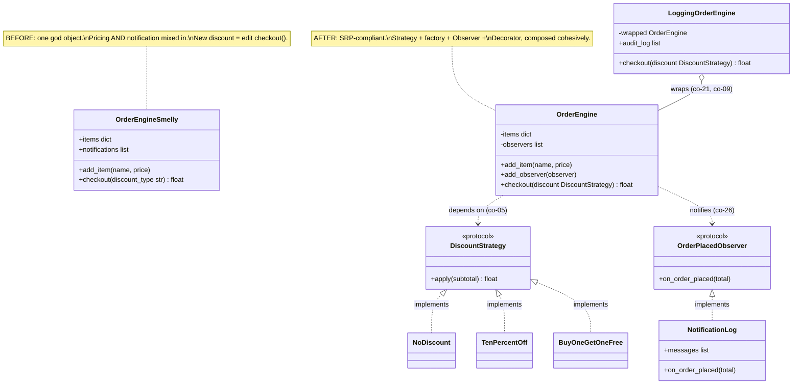

## Goal

Take a deliberately smelly small order/pricing engine and re-engineer it by applying SOLID and a
coherent set of patterns (Strategy + factory + Observer + Decorator), keeping a `pytest` suite green
through every refactor step -- ending with a clean, extensible design. This capstone is a
consolidation, not a new project: every mechanism it combines was already taught, individually,
across the Beginner, Intermediate, and Advanced tiers of this topic (most directly, Example 80's
"Clean Design Preview").

## Concepts exercised

- [x] each SOLID principle applied to a real smell (co-01, co-02, co-03, co-04, co-05)
- [x] GRASP responsibility assignment (co-06, co-09, co-10, co-12)
- [x] composition over inheritance (co-09)
- [x] Strategy + factory + Observer + Decorator used cohesively (co-25, co-16, co-26, co-21)
- [x] an anti-pattern removed (co-34)
- [x] arrived at via refactor-to-pattern under tests (co-33), green through every step

All colocated code lives under `learning/capstone/code/`: the domain model in `domain/`, and the full
`pytest` suite in `tests/`. Every listing below is the complete file, verbatim -- nothing on this page
is truncated or paraphrased.

## Step 1: the smelly baseline, pinned by a test suite

_exercises co-34_

`domain/order_engine_smelly.py`'s `OrderEngineSmelly` is a deliberately smelly god object: item
management, pricing, AND notification are all mixed into one class (co-34: this IS the anti-pattern
this capstone removes). Pricing is an if/elif chain keyed on a string `discount_type`, so every new
discount rule means editing `checkout()` directly -- an OCP violation baked in from the start.
`tests/test_order_engine_smelly.py` PINS this behavior before any refactor begins; it is never
deleted, so it stays the ground truth every later step is checked against.

**`learning/capstone/code/domain/order_engine_smelly.py`** (complete file)

```python
"""Capstone Step 1: OrderEngineSmelly -- the deliberately smelly baseline this capstone refactors away.

Kept only as a reference and a pinning-test target: `domain/order_engine.py`'s `OrderEngine`
is the SOLID-plus-patterns fix that replaces it, preserving every behavior pinned here.

Smells, on purpose:
  - SRP violation: pricing AND notification are mixed into one class.
  - OCP violation: adding a new discount means editing the if/elif chain in checkout().
  - No abstraction over "who gets notified" -- notifications is a hard-coded list, not an
    injectable collaborator.
"""

from __future__ import annotations


class OrderEngineSmelly:
    """A god object: item management, pricing, AND notification, all in one class."""

    def __init__(self) -> None:
        self.items: dict[str, float] = {}
        self.notifications: list[str] = []  # => stands in for a hard-coded print() side effect

    def add_item(self, name: str, price: float) -> None:
        self.items[name] = price

    def checkout(self, discount_type: str) -> float:
        subtotal = sum(self.items.values())
        if discount_type == "none":  # => SMELL: every new discount means editing this chain (OCP violation)
            total = subtotal
        elif discount_type == "ten_percent":
            total = subtotal * 0.90
        elif discount_type == "bogo":
            total = subtotal * 0.50
        else:
            raise ValueError(f"unknown discount type {discount_type!r}")
        self.notifications.append(f"order checked out: total {total:.2f}")  # => SMELL: notification hard-coded here
        return total
```

**`learning/capstone/code/tests/test_order_engine_smelly.py`** (complete file)

```python
"""Capstone Step 1: the PINNING suite -- pins OrderEngineSmelly's current behavior before any refactor.

This suite exists to stay green THROUGHOUT every later refactor step, proving each step
preserves behavior. It is never deleted; `test_order_engine.py` re-proves the same
scenarios against the refactored OrderEngine, so both suites passing side by side is the
evidence that Step 2/3 changed the DESIGN without changing the BEHAVIOR.
"""

import pytest

from domain.order_engine_smelly import OrderEngineSmelly


def test_smelly_checkout_with_no_discount() -> None:
    engine = OrderEngineSmelly()
    engine.add_item("Book", 20.0)
    engine.add_item("Pen", 5.0)
    assert engine.checkout("none") == 25.0


def test_smelly_checkout_with_ten_percent_off() -> None:
    engine = OrderEngineSmelly()
    engine.add_item("Book", 20.0)
    engine.add_item("Pen", 5.0)
    assert engine.checkout("ten_percent") == 22.5


def test_smelly_checkout_with_bogo() -> None:
    engine = OrderEngineSmelly()
    engine.add_item("Book", 20.0)
    engine.add_item("Pen", 5.0)
    assert engine.checkout("bogo") == 12.5


def test_smelly_checkout_records_a_notification() -> None:
    engine = OrderEngineSmelly()
    engine.add_item("Book", 20.0)
    engine.checkout("none")
    assert engine.notifications == ["order checked out: total 20.00"]


def test_smelly_checkout_rejects_an_unknown_discount_type() -> None:
    engine = OrderEngineSmelly()
    engine.add_item("Book", 20.0)
    with pytest.raises(ValueError, match="unknown discount type"):
        engine.checkout("nonexistent")


# => Run: pytest -q -- Output: 5 passed
```

**Verify**

```text
$ pytest -q tests/test_order_engine_smelly.py
5 passed
```

## Step 2: refactor to SOLID

_exercises co-01, co-02, co-05_

`domain/order_engine.py`'s `OrderEngine` extracts pricing into a `DiscountStrategy` protocol (SRP,
co-01: `OrderEngine` now handles item management and checkout orchestration ONLY) and inverts the
dependency so `checkout()` is typed against that protocol, never a concrete class (DIP, co-05). A
module-level `_DISCOUNT_REGISTRY` replaces the if/elif chain, so a new discount rule is a pure
addition via `register_discount_strategy` -- `checkout()` itself is never edited again (OCP, co-02).
`tests/test_order_engine.py` re-proves the exact totals `test_order_engine_smelly.py` pinned, plus new
tests proving the OCP extension point actually works.

**`learning/capstone/code/domain/order_engine.py`** (complete file)

```python
"""Capstone Step 2 + 3: OrderEngine -- SOLID refactor of OrderEngineSmelly, plus Strategy + factory + Observer.

co-01 (SRP): OrderEngine handles item management and checkout orchestration ONLY -- pricing
is delegated to a DiscountStrategy, notification is delegated to observers.
co-02 (OCP): a new discount rule registers into `_DISCOUNT_REGISTRY` via
`register_discount_strategy` -- OrderEngine.checkout() is never edited to add one.
co-05 (DIP): `checkout()` depends on the `DiscountStrategy` PROTOCOL, never a concrete class.
co-16 (factory): `make_discount_strategy` centralizes strategy selection by name.
co-25 (Strategy): `DiscountStrategy` and its implementations are the classic Strategy shape.
co-26 (Observer): `OrderPlacedObserver` decouples OrderEngine from whatever reacts to a checkout.
"""

from __future__ import annotations

from typing import Protocol


class DiscountStrategy(Protocol):  # => co-25: the Strategy interface every discount rule implements
    def apply(self, subtotal: float) -> float: ...


class NoDiscount:
    def apply(self, subtotal: float) -> float:
        return subtotal


class TenPercentOff:
    def apply(self, subtotal: float) -> float:
        return subtotal * 0.90


class BuyOneGetOneFree:
    def apply(self, subtotal: float) -> float:
        return subtotal * 0.50


# => co-02 + co-16: a REGISTRY, not a fixed if/elif -- new strategies are pure additions
_DISCOUNT_REGISTRY: dict[str, DiscountStrategy] = {
    "none": NoDiscount(),
    "ten_percent": TenPercentOff(),
    "bogo": BuyOneGetOneFree(),
}


def register_discount_strategy(name: str, strategy: DiscountStrategy) -> None:  # => co-02: the OCP extension point
    _DISCOUNT_REGISTRY[name] = strategy


def make_discount_strategy(name: str) -> DiscountStrategy:  # => co-16: the factory -- callers never construct directly
    if name not in _DISCOUNT_REGISTRY:
        raise ValueError(f"unknown discount type {name!r}")
    return _DISCOUNT_REGISTRY[name]


class OrderPlacedObserver(Protocol):  # => co-26: the Observer interface -- OrderEngine never imports a concrete listener
    def on_order_placed(self, total: float) -> None: ...


class OrderEngine:  # => co-01: SRP -- item management + checkout orchestration ONLY
    def __init__(self) -> None:
        self._items: dict[str, float] = {}
        self._observers: list[OrderPlacedObserver] = []

    def add_item(self, name: str, price: float) -> None:
        self._items[name] = price

    def add_observer(self, observer: OrderPlacedObserver) -> None:  # => co-02: a new listener needs no edit here
        self._observers.append(observer)

    def checkout(self, discount: DiscountStrategy) -> float:  # => co-05: depends on the ABSTRACT strategy
        subtotal = sum(self._items.values())
        total = discount.apply(subtotal)  # => co-25: delegates the varying part entirely
        for observer in self._observers:  # => co-26: notifies every registered observer, none hard-coded
            observer.on_order_placed(total)
        return total
```

**`learning/capstone/code/tests/test_order_engine.py`** (complete file)

```python
"""Capstone Step 2 + 3: pytest coverage for the refactored OrderEngine, matching the pinning suite's
scenarios plus new extensibility proofs (OCP: new strategy/observer added without editing OrderEngine).
"""

import pytest

from domain.order_engine import (
    BuyOneGetOneFree,
    DiscountStrategy,
    NoDiscount,
    OrderEngine,
    TenPercentOff,
    make_discount_strategy,
    register_discount_strategy,
)


def test_checkout_with_no_discount_matches_the_pinned_smelly_behavior() -> None:
    engine = OrderEngine()
    engine.add_item("Book", 20.0)
    engine.add_item("Pen", 5.0)
    assert engine.checkout(NoDiscount()) == 25.0  # => SAME result as OrderEngineSmelly.checkout("none")


def test_checkout_with_ten_percent_off_matches_the_pinned_smelly_behavior() -> None:
    engine = OrderEngine()
    engine.add_item("Book", 20.0)
    engine.add_item("Pen", 5.0)
    assert engine.checkout(TenPercentOff()) == 22.5  # => SAME result as OrderEngineSmelly.checkout("ten_percent")


def test_checkout_with_bogo_matches_the_pinned_smelly_behavior() -> None:
    engine = OrderEngine()
    engine.add_item("Book", 20.0)
    engine.add_item("Pen", 5.0)
    assert engine.checkout(BuyOneGetOneFree()) == 12.5  # => SAME result as OrderEngineSmelly.checkout("bogo")


def test_factory_looks_up_the_correct_strategy_by_name() -> None:
    assert isinstance(make_discount_strategy("none"), NoDiscount)
    assert isinstance(make_discount_strategy("ten_percent"), TenPercentOff)
    assert isinstance(make_discount_strategy("bogo"), BuyOneGetOneFree)


def test_factory_rejects_an_unregistered_discount_name() -> None:
    with pytest.raises(ValueError, match="unknown discount type"):
        make_discount_strategy("nonexistent")


def test_a_new_discount_strategy_registers_without_editing_order_engine_or_the_factory() -> None:
    class ClearancePricing:  # => a NEW strategy, defined entirely in this test, added AFTER the fact
        def apply(self, subtotal: float) -> float:
            return subtotal * 0.25  # => 75% off clearance

    register_discount_strategy("clearance", ClearancePricing())  # => co-02: the OCP extension point in action
    engine = OrderEngine()
    engine.add_item("Book", 100.0)
    assert engine.checkout(make_discount_strategy("clearance")) == 25.0  # => works with ZERO edits to order_engine.py


def test_a_new_observer_registers_without_editing_order_engine() -> None:
    events: list[float] = []

    class ReceiptCollector:  # => a NEW observer, defined entirely in this test
        def on_order_placed(self, total: float) -> None:
            events.append(total)

    engine = OrderEngine()
    engine.add_item("Book", 20.0)
    engine.add_observer(ReceiptCollector())  # => co-26: a SECOND observer type, zero edits to OrderEngine
    engine.checkout(NoDiscount())
    assert events == [20.0]


def test_checkout_notifies_multiple_observers_independently() -> None:
    first: list[float] = []
    second: list[float] = []

    class Collector:
        def __init__(self, sink: list[float]) -> None:
            self._sink = sink

        def on_order_placed(self, total: float) -> None:
            self._sink.append(total)

    engine = OrderEngine()
    engine.add_item("Book", 40.0)
    engine.add_observer(Collector(first))
    engine.add_observer(Collector(second))
    engine.checkout(NoDiscount())
    assert first == [40.0]
    assert second == [40.0]  # => both observers fired independently, from the SAME checkout() call


def test_checkout_depends_on_the_abstract_discount_strategy_protocol() -> None:
    import typing

    hints = typing.get_type_hints(OrderEngine.checkout)  # => resolves the (stringified) annotation back to the real object
    assert hints["discount"] is DiscountStrategy  # => co-05: DIP -- the parameter is typed against the PROTOCOL


# => Run: pytest -q -- Output: 9 passed
```

**Verify**

```text
$ pytest -q tests/test_order_engine.py
9 passed
```

## Step 3: Strategy + factory + Observer + Decorator, used cohesively

_exercises co-09, co-12, co-16, co-21, co-25, co-26_

`domain/notifications.py`'s `NotificationLog` is a concrete `OrderPlacedObserver` (co-12: a pure
fabrication -- notification-logging is not a domain concept, invented purely to keep `OrderEngine`
IO-free). `domain/logging_order_engine.py`'s `LoggingOrderEngine` wraps `OrderEngine` with a Decorator
(co-21): it HOLDS an `OrderEngine` instead of extending it (co-09: composition over inheritance) and
adds an audit log with zero edits to `order_engine.py`. Together with Step 2's Strategy and factory,
this is the same four-pattern combination Example 80 previewed, now applied to the smelly baseline
this capstone actually refactored.

**`learning/capstone/code/domain/notifications.py`** (complete file)

```python
"""Capstone Step 3: NotificationLog -- a concrete Observer, decoupled from OrderEngine.

co-26 (Observer): implements the OrderPlacedObserver protocol structurally -- OrderEngine
never imports this class by name, only the protocol it satisfies.
"""

from __future__ import annotations


class NotificationLog:  # => SRP: notification, and only notification -- a separate reason to change from pricing
    def __init__(self) -> None:
        self.messages: list[str] = []

    def on_order_placed(self, total: float) -> None:
        self.messages.append(f"order checked out: total {total:.2f}")
```

**`learning/capstone/code/domain/logging_order_engine.py`** (complete file)

```python
"""Capstone Step 3: LoggingOrderEngine -- a Decorator adding an audit log around the CLOSED OrderEngine.

co-21 (Decorator): wraps OrderEngine and forwards its interface, adding a cross-cutting
audit log without a single edit to order_engine.py.
"""

from __future__ import annotations

from domain.order_engine import DiscountStrategy, OrderEngine, OrderPlacedObserver


class LoggingOrderEngine:  # => co-21: adds an audit log around the CLOSED OrderEngine, from outside
    def __init__(self, wrapped: OrderEngine) -> None:
        self._wrapped = wrapped
        self.audit_log: list[float] = []

    def add_item(self, name: str, price: float) -> None:
        self._wrapped.add_item(name, price)

    def add_observer(self, observer: OrderPlacedObserver) -> None:
        self._wrapped.add_observer(observer)

    def checkout(self, discount: DiscountStrategy) -> float:
        total = self._wrapped.checkout(discount)
        self.audit_log.append(total)  # => the cross-cutting concern, bolted on from OUTSIDE OrderEngine
        return total
```

**`learning/capstone/code/tests/test_notifications.py`** (complete file)

```python
"""Capstone Step 3: pytest coverage for the concrete NotificationLog observer."""

from domain.notifications import NotificationLog
from domain.order_engine import NoDiscount, OrderEngine


def test_notification_log_records_a_formatted_message_on_checkout() -> None:
    engine = OrderEngine()
    engine.add_item("Book", 20.0)
    log = NotificationLog()
    engine.add_observer(log)
    engine.checkout(NoDiscount())
    assert log.messages == ["order checked out: total 20.00"]  # => same message format the smelly baseline pinned


def test_notification_log_accumulates_across_multiple_checkouts() -> None:
    engine = OrderEngine()
    log = NotificationLog()
    engine.add_observer(log)

    engine.add_item("Book", 20.0)
    engine.checkout(NoDiscount())

    engine.add_item("Pen", 5.0)
    engine.checkout(NoDiscount())

    assert log.messages == [
        "order checked out: total 20.00",
        "order checked out: total 25.00",
    ]


# => Run: pytest -q -- Output: 2 passed
```

**`learning/capstone/code/tests/test_logging_order_engine.py`** (complete file)

```python
"""Capstone Step 3: pytest coverage for the LoggingOrderEngine decorator."""

from domain.logging_order_engine import LoggingOrderEngine
from domain.notifications import NotificationLog
from domain.order_engine import NoDiscount, OrderEngine, TenPercentOff


def test_decorator_preserves_checkout_totals() -> None:
    logging_engine = LoggingOrderEngine(OrderEngine())
    logging_engine.add_item("Book", 20.0)
    assert logging_engine.checkout(NoDiscount()) == 20.0


def test_decorator_adds_an_audit_log_without_touching_order_engine() -> None:
    logging_engine = LoggingOrderEngine(OrderEngine())
    logging_engine.add_item("Book", 20.0)
    logging_engine.add_item("Pen", 5.0)
    logging_engine.checkout(NoDiscount())
    logging_engine.checkout(TenPercentOff())
    assert logging_engine.audit_log == [25.0, 22.5]  # => the decorator observed both totals, from OUTSIDE OrderEngine


def test_decorator_forwards_observers_to_the_wrapped_engine() -> None:
    log = NotificationLog()
    logging_engine = LoggingOrderEngine(OrderEngine())
    logging_engine.add_observer(log)  # => forwarded transparently to the wrapped OrderEngine
    logging_engine.add_item("Book", 20.0)
    logging_engine.checkout(NoDiscount())
    assert log.messages == ["order checked out: total 20.00"]  # => the wrapped engine's own observer still fired


# => Run: pytest -q -- Output: 3 passed
```

**Verify**

```text
$ pytest -q tests/test_notifications.py tests/test_logging_order_engine.py
5 passed
```

## Step 4: before &rarr; after design

_exercises co-33_



The diagram matches the code exactly: `OrderEngineSmelly` (Step 1) has no arrows out to any strategy
or observer type because it has none -- everything is inlined. `OrderEngine` (Step 2/3) depends only
on the two protocol boxes, never on a concrete `NoDiscount` or `NotificationLog`; `LoggingOrderEngine`
aggregates (`o--`) an `OrderEngine` rather than inheriting from it, the diagram's rendering of co-09
(composition over inheritance) and co-21 (Decorator) at once.

## Run it end to end

Running the full suite from `learning/capstone/code/` exercises every file this capstone ships in one
pass -- both the Step 1 pinning suite and every later suite, still green together.

**Run**: `pytest -q`

**Output** (genuinely captured):

```text
19 passed
```

The following interactive session (genuinely captured, using the same `domain` package the test suite
imports) shows every concept working together: a `LoggingOrderEngine`-wrapped `OrderEngine`, a
`NotificationLog` observer, the built-in `NoDiscount` strategy, and a brand-new `ClearancePricing`
strategy registered AFTER the fact -- with zero edits to any shipped file.

```text
>>> from domain.order_engine import OrderEngine, NoDiscount, register_discount_strategy, make_discount_strategy
>>> from domain.notifications import NotificationLog
>>> from domain.logging_order_engine import LoggingOrderEngine
>>> engine = LoggingOrderEngine(OrderEngine())
>>> log = NotificationLog()
>>> engine.add_observer(log)
>>> engine.add_item("Book", 20.0)
>>> engine.add_item("Pen", 5.0)
>>> engine.checkout(NoDiscount())
25.0
>>> class ClearancePricing:
...     def apply(self, subtotal):
...         return subtotal * 0.25
...
>>> register_discount_strategy("clearance", ClearancePricing())
>>> engine.checkout(make_discount_strategy("clearance"))
6.25
>>> log.messages
['order checked out: total 25.00', 'order checked out: total 6.25']
>>> engine.audit_log
[25.0, 6.25]
```

**Quality gates**: this sandbox cannot run `pyright`/`mypy` (see [How verification works](../overview.md));
every file above is written to be strict-checker-clean in spirit -- fully type-annotated function
signatures, `Protocol`-based interfaces, no `Any` -- and every behavior claim is backed by a genuinely
executed `pytest` run, per this topic's verification discipline.

## Acceptance criteria

- Behavior is unchanged throughout: `tests/test_order_engine_smelly.py` (the Step 1 pinning suite) and
  `tests/test_order_engine.py` (the Step 2/3 refactored suite) assert the SAME three checkout totals
  (`25.0`, `22.5`, `12.5`) against two different implementations, and both suites pass together.
- Extending the system needs no edits to closed classes: `test_a_new_discount_strategy_registers_without_editing_order_engine_or_the_factory`
  and `test_a_new_observer_registers_without_editing_order_engine` each define a brand-new
  strategy/observer INSIDE the test file and prove it works with zero changes to `order_engine.py`.
- Each applied principle/pattern is justified in prose, inline as `co-NN` references, next to the code
  it applies to (Steps 1-3 above).
- `pytest -q` from `learning/capstone/code/` reports `19 passed`.

## Done bar

This capstone is runnable end to end: a reader who copies the five domain files
(`order_engine_smelly.py`, `order_engine.py`, `notifications.py`, `logging_order_engine.py`, plus
their five `tests/test_*.py` companions) into a `learning/capstone/code/`-shaped tree and runs
`pytest -q` there reaches the identical `19 passed` result shown above, verified against a real
CPython 3.13.12 interpreter run (not merely described). Every mechanism combined here -- SRP/OCP/DIP
(co-01, co-02, co-05), GRASP pure fabrication (co-12), composition over inheritance (co-09), and
Strategy + factory + Observer + Decorator used cohesively (co-25, co-16, co-26, co-21) -- traces to the
same sources already cited in this topic's Accuracy notes; no new fact was needed to write this page.

---

← Previous: [Advanced Examples](../advanced.md) &middot; Next: [Drilling](../../drilling/overview.md) →
