Examples 28-57 build on the beginner tier's vocabulary with the pattern catalog experienced developers reach for daily: creational patterns beyond Factory Method (Abstract Factory, Builder, Singleton and its costs), structural patterns (Proxy, Composite, Adapter, Decorator), behavioral patterns (Command, State, Iterator, Chain of Responsibility, Observer, Strategy), the remaining GRASP responsibility patterns (Polymorphism, Pure Fabrication, Indirection, Protected Variations), and three head-to-head pattern comparisons that make the tradeoffs concrete instead of abstract. Every example runs and verifies exactly like the beginner tier -- `python3 example.py` for inline output, `pytest -q` for the colocated `test_example.py`.

---

### Example 28: An Abstract Factory for UI Widget Families

_ex-28 &middot; exercises co-17_

An abstract factory is a family of factory methods that together produce a matched set of related objects -- swapping `DarkThemeFactory` for `LightThemeFactory` swaps the entire button-plus-checkbox family at once, guaranteeing they never mix. This example builds one `build_toolbar()` function that never names a concrete widget class, only `WidgetFactory`.

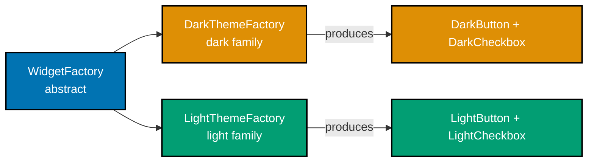

**`learning/code/ex-28-abstract-factory-ui-theme/example.py`**

```python
"""Example 28: An Abstract Factory for UI Widget Families."""  # => module docstring

import abc  # => imports the abc module


class Button(abc.ABC):  # => the ABSTRACT product: every theme has SOME Button
    @abc.abstractmethod  # => marks the next method as required for every subclass
    def paint(self) -> str:  # => no body -- a required contract for subclasses
        ...  # => the ellipsis stub -- concrete Buttons below fill this in


class Checkbox(abc.ABC):  # => the ABSTRACT product: every theme has SOME Checkbox
    @abc.abstractmethod  # => marks the next method as required for every subclass
    def paint(self) -> str:  # => no body -- a required contract for subclasses
        ...  # => the ellipsis stub -- concrete Checkboxes below fill this in


class DarkButton(Button):  # => a CONCRETE product belonging to the dark family
    def paint(self) -> str:  # => defines the paint() method
        return "dark-button"  # => tags this product with its family name


class DarkCheckbox(Checkbox):  # => a CONCRETE product belonging to the dark family
    def paint(self) -> str:  # => defines the paint() method
        return "dark-checkbox"  # => tags this product with its family name


class LightButton(Button):  # => a CONCRETE product belonging to the light family
    def paint(self) -> str:  # => defines the paint() method
        return "light-button"  # => tags this product with its family name


class LightCheckbox(Checkbox):  # => a CONCRETE product belonging to the light family
    def paint(self) -> str:  # => defines the paint() method
        return "light-checkbox"  # => tags this product with its family name


class WidgetFactory(abc.ABC):  # => the ABSTRACT FACTORY -- produces a MATCHED family
    @abc.abstractmethod  # => marks the next method as required for every WidgetFactory subclass
    def create_button(self) -> Button:  # => no body -- required for every factory
        ...  # => the ellipsis stub -- concrete factories below fill this in

    @abc.abstractmethod  # => marks the next method as required for every WidgetFactory subclass
    def create_checkbox(self) -> Checkbox:  # => no body -- required for every factory
        ...  # => the ellipsis stub -- concrete factories below fill this in


class DarkThemeFactory(WidgetFactory):  # => produces ONLY dark-family products
    def create_button(self) -> Button:  # => defines the create_button() method
        return DarkButton()  # => always matches the dark family, never mixed

    def create_checkbox(self) -> Checkbox:  # => defines the create_checkbox() method
        return DarkCheckbox()  # => always matches the dark family, never mixed


class LightThemeFactory(WidgetFactory):  # => produces ONLY light-family products
    def create_button(self) -> Button:  # => defines the create_button() method
        return LightButton()  # => always matches the light family, never mixed

    def create_checkbox(self) -> Checkbox:  # => defines the create_checkbox() method
        return LightCheckbox()  # => always matches the light family, never mixed


def build_toolbar(  # => signature spans multiple lines: parameter below, return type on the closing line
    factory: WidgetFactory,  # => the single parameter -- typed as the ABSTRACT WidgetFactory, never a concrete subclass
) -> tuple[str, str]:  # => the ONE function every caller uses, regardless of theme
    # => the client depends ONLY on WidgetFactory -- it never names a concrete class
    button: Button = factory.create_button()  # => whichever family the factory picks
    checkbox: Checkbox = factory.create_checkbox()  # => the SAME family, guaranteed
    return button.paint(), checkbox.paint()  # => returns this value to the caller


dark_ui: tuple[str, str] = build_toolbar(DarkThemeFactory())  # => swap the ONE argument
light_ui: tuple[str, str] = build_toolbar(LightThemeFactory())  # => whole family swaps
print(dark_ui)  # => both products come from the dark family together
# => Output: ('dark-button', 'dark-checkbox')
print(light_ui)  # => both products come from the light family together
# => Output: ('light-button', 'light-checkbox')
# => Swapping ONE factory argument swaps the ENTIRE matched product family at once
```

**Run**: `python3 example.py`

**Output**:

```text
('dark-button', 'dark-checkbox')
('light-button', 'light-checkbox')
```

**`learning/code/ex-28-abstract-factory-ui-theme/test_example.py`**

```python
"""Example 28: pytest verification for An Abstract Factory for UI Widget Families."""

from example import DarkThemeFactory, LightThemeFactory, build_toolbar


def test_dark_factory_produces_only_dark_family_products() -> None:
    button, checkbox = build_toolbar(DarkThemeFactory())
    assert button == "dark-button"  # => both products share the dark family
    assert checkbox == "dark-checkbox"  # => never mixed with the light family


def test_swapping_the_factory_swaps_the_whole_family() -> None:
    button, checkbox = build_toolbar(LightThemeFactory())
    assert (button, checkbox) == (
        "light-button",
        "light-checkbox",
    )  # => one swapped argument, whole family changed


# => Run: pytest -- Output: 2 passed
```

**Verify**: `pytest -q`

**Output**:

```text
2 passed
```

**Key takeaway**: Swapping one `WidgetFactory` argument swaps an entire matched product family at once -- callers never risk mixing a dark button with a light checkbox.

**Why it matters**: A UI toolkit that let callers pick a button theme and a checkbox theme independently would risk inconsistent screens the moment someone forgot to update one call site after a redesign. Abstract Factory makes "matched family" a guarantee enforced by the type system, not a convention developers must remember -- exactly the kind of consistency bug this pattern exists to make structurally impossible rather than merely discouraged.

---

### Example 29: A Fluent Builder for HTTP Requests

_ex-29 &middot; exercises co-18_

A builder assembles a complex object step by step through chained method calls, instead of a constructor with a dozen optional parameters in a fixed order. This example builds an HTTP `Request` with `RequestBuilder`, where only the URL is required and everything else -- method, headers, body -- is optional and can be added in any order.

**`learning/code/ex-29-builder-http-request/example.py`**

```python
"""Example 29: A Fluent Builder for HTTP Requests."""

from dataclasses import dataclass  # => imports dataclass from dataclasses


@dataclass(frozen=True)  # => the finished product -- immutable once built() returns it
class Request:  # => begins the Request class body
    method: str  # => a required field, part of the generated __init__
    url: str  # => a required field, part of the generated __init__
    headers: dict[str, str]  # => a required field, part of the generated __init__
    body: str | None  # => a required field, part of the generated __init__


class RequestBuilder:  # => begins the RequestBuilder class body
    def __init__(self, url: str) -> None:  # => only the ONE truly required piece
        self._url: str = url  # => stores the required url on this instance
        self._method: str = "GET"  # => a sensible default -- no need to always name it
        self._headers: dict[str, str] = {}  # => starts empty, grows via with_header
        self._body: str | None = None  # => optional -- most requests have no body

    def with_method(self, method: str) -> "RequestBuilder":  # => fluent step
        self._method = method  # => mutates this builder's own state
        return self  # => returning self is what enables the NEXT chained call

    def with_header(self, key: str, value: str) -> "RequestBuilder":  # => fluent step
        self._headers[key] = value  # => accumulates one header per call
        return self  # => returning self is what enables the NEXT chained call

    def with_body(self, body: str) -> "RequestBuilder":  # => fluent step
        self._body = body  # => mutates this builder's own state
        return self  # => returning self is what enables the NEXT chained call

    def build(self) -> Request:  # => the terminal step -- assembles the final object
        return Request(self._method, self._url, dict(self._headers), self._body)  # => a fresh, immutable snapshot -- not a live view of the builder


request: Request = (
    RequestBuilder("https://api.example.com/orders")  # => only the required piece
    .with_method("POST")  # => optional pieces chained in ANY order needed
    .with_header("Content-Type", "application/json")  # => optional pieces
    .with_body('{"item": "widget"}')  # => optional pieces
    .build()  # => terminal call -- returns the finished, immutable Request
)
print(request.method, request.url)  # => confirms the chained values landed correctly
# => Output: POST https://api.example.com/orders
print(request.headers, request.body)  # => confirms headers and body landed correctly
# => Output: {'Content-Type': 'application/json'} {"item": "widget"}
# => A fluent builder assembles optional parts step by step, with no telescoping constructor
```

**Run**: `python3 example.py`

**Output**:

```text
POST https://api.example.com/orders
{'Content-Type': 'application/json'} {"item": "widget"}
```

**`learning/code/ex-29-builder-http-request/test_example.py`**

```python
"""Example 29: pytest verification for A Fluent Builder for HTTP Requests."""

from example import Request, RequestBuilder


def test_chained_builder_assembles_a_complete_request() -> None:
    request: Request = RequestBuilder("https://api.example.com/orders").with_method("POST").with_header("Content-Type", "application/json").with_body('{"item": "widget"}').build()
    assert request.method == "POST"
    assert request.headers == {"Content-Type": "application/json"}
    assert request.body == '{"item": "widget"}'


def test_omitted_optional_parts_use_sensible_defaults() -> None:
    request: Request = RequestBuilder("https://api.example.com/health").build()
    assert request.method == "GET"  # => no with_method() call, defaults apply
    assert request.headers == {}  # => no with_header() calls at all
    assert request.body is None  # => no with_body() call at all


# => Run: pytest -- Output: 2 passed
```

**Verify**: `pytest -q`

**Output**:

```text
2 passed
```

**Key takeaway**: A fluent builder lets each optional part be named explicitly and included or omitted in any order, replacing a telescoping constructor with a self-documenting chain.

**Why it matters**: An HTTP client constructor with `(method, url, headers, body, timeout, retries, ...)` forces every caller to remember positional order and pass placeholders for parts they don't need. `RequestBuilder` moves that responsibility into named, chainable steps, and keeps construction logic -- defaults, validation -- in one place instead of duplicated across every call site that builds a request by hand.

---

### Example 30: A Config Singleton, and the Global-State Seam It Creates

_ex-30 &middot; exercises co-19_

A singleton guarantees exactly one shared instance reachable globally through `Config.instance()` -- and it pays for that guarantee in testability, since any mutation through one reference leaks into every other reference. This example mutates `Config` through one call site and observes the leak through a completely different one, then shows the explicit `reset()` escape hatch the pattern forces every caller to remember.

**`learning/code/ex-30-singleton-config-and-cost/example.py`**

```python
"""Example 30: A Config Singleton, and the Global-State Seam It Creates."""


class Config:  # => begins the Config class body
    _instance: "Config | None" = None  # => a CLASS attribute -- shared by every caller

    def __init__(self) -> None:  # => never call this directly -- use instance() instead
        self.debug: bool = False  # => the mutable state every caller ends up sharing

    @classmethod
    def instance(cls) -> "Config":  # => cls is Config itself, the shared holder
        if cls._instance is None:  # => only the FIRST call actually constructs one
            cls._instance = cls()  # => every later call reuses this same object
        return cls._instance  # => always the SAME object, never a fresh one

    @classmethod
    def reset(cls) -> None:  # => the escape hatch this pattern FORCES callers to add
        cls._instance = None  # => without this, no caller can ever start clean again


first: Config = Config.instance()  # => the first call constructs the shared instance
second: Config = Config.instance()  # => the second call reuses the SAME instance
print(first is second)  # => proves there is only ever one Config in the whole process
# => Output: True

first.debug = True  # => mutating through ONE reference...
print(second.debug)  # => ...is visible through EVERY OTHER reference -- global state
# => Output: True
# => `Config.instance()` always returns the SAME object, so a mutation anywhere leaks everywhere

Config.reset()  # => the ONLY way to get a clean Config again -- an explicit reset call
fresh: Config = Config.instance()  # => a genuinely NEW instance, post-reset
print(fresh.debug)  # => the leaked True from `first.debug = True` above is gone
# => Output: False
# => Every consumer of a singleton is implicitly coupled to every OTHER consumer through shared state
```

**Run**: `python3 example.py`

**Output**:

```text
True
True
False
```

**`learning/code/ex-30-singleton-config-and-cost/test_example.py`**

```python
"""Example 30: pytest verification for A Config Singleton, and Its Cost."""

from example import Config


def test_instance_always_returns_the_same_object() -> None:
    Config.reset()  # => start from a known-clean state -- the cost this test proves
    assert Config.instance() is Config.instance()  # => two calls, one shared object


def test_mutation_leaks_across_every_reference_without_reset() -> None:
    Config.reset()  # => without this line, a PRIOR test's leftover state leaks in here
    a: Config = Config.instance()
    a.debug = True  # => mutate through one reference
    b: Config = Config.instance()
    assert b.debug is True  # => visible through a totally different reference -- the pain
    Config.reset()  # => clean up so later tests are not poisoned by this test's mutation


# => Run: pytest -- Output: 2 passed
```

**Verify**: `pytest -q`

**Output**:

```text
2 passed
```

**Key takeaway**: `Config.instance()` always returns the SAME object, so a mutation through one reference leaks into every other reference -- and the only way back to a clean state is an explicit, easy-to-forget `reset()` call.

**Why it matters**: This is the cost co-19 warns about: `test_mutation_leaks_across_every_reference_without_reset` genuinely fails if its `reset()` calls are removed, because whichever test runs first poisons every test that runs after it. Singleton is worth reaching for only when a genuinely single, process-wide resource exists (a logging sink, a connection pool) -- Example 31 shows the far more common case, where the same "one shared config" need is better solved with injection.

---

### Example 31: Replacing a Singleton with an Injected Dependency

_ex-31 &middot; exercises co-19, co-05_

Dependency injection solves the same "one shared config" need as a singleton, but without the global-state cost: each `ReportGenerator` holds its own, independently constructed `Config`, so two instances never interfere. This example builds a production and a debug `ReportGenerator` side by side and confirms neither affects the other, with no `reset()` call required anywhere.

**`learning/code/ex-31-singleton-to-injection/example.py`**

```python
"""Example 31: Replacing a Singleton with an Injected Dependency."""

from dataclasses import dataclass  # => imports dataclass from dataclasses


@dataclass  # => a PLAIN, ordinary object now -- no shared instance() anywhere
class Config:  # => begins the Config class body
    debug: bool = False  # => a normal field with a normal default


class ReportGenerator:  # => begins the ReportGenerator class body
    def __init__(self, config: Config) -> None:  # => the config is INJECTED, never looked up globally
        self.config = config  # => held as an ordinary instance field

    def summary(self) -> str:  # => defines the summary() method
        mode: str = "debug" if self.config.debug else "release"  # => reads ONLY its own injected config
        return f"report ({mode})"  # => returns this value to the caller


prod_config: Config = Config(debug=False)  # => one INDEPENDENT Config instance
debug_config: Config = Config(debug=True)  # => a SECOND, unrelated Config instance

prod_report: ReportGenerator = ReportGenerator(prod_config)  # => wired to prod_config
debug_report: ReportGenerator = ReportGenerator(debug_config)  # => wired to debug_config
print(prod_report.summary())  # => reads ONLY prod_config -- unaffected by debug_config
# => Output: report (release)
print(debug_report.summary())  # => reads ONLY debug_config -- unaffected by prod_config
# => Output: report (debug)
# => Two ReportGenerators, each holding its OWN Config, never share state -- no reset() needed anywhere
```

**Run**: `python3 example.py`

**Output**:

```text
report (release)
report (debug)
```

**`learning/code/ex-31-singleton-to-injection/test_example.py`**

```python
"""Example 31: pytest verification for Replacing a Singleton with an Injected Dependency."""

from example import Config, ReportGenerator


def test_debug_mode_report_is_isolated_from_prod_mode_report() -> None:
    # => no Config.reset() call anywhere -- there is no global state left to reset
    prod: ReportGenerator = ReportGenerator(Config(debug=False))
    debug: ReportGenerator = ReportGenerator(Config(debug=True))
    assert prod.summary() == "report (release)"  # => unaffected by the debug instance
    assert debug.summary() == "report (debug)"  # => unaffected by the prod instance


def test_two_instances_never_share_underlying_state() -> None:
    a: Config = Config(debug=False)
    b: Config = Config(debug=False)
    a.debug = True  # => mutate ONLY a's config
    assert b.debug is False  # => b is a genuinely separate object -- no leak at all


# => Run: pytest -- Output: 2 passed
```

**Verify**: `pytest -q`

**Output**:

```text
2 passed
```

**Key takeaway**: Injecting a `Config` instance instead of reaching for a shared `Config.instance()` eliminates the isolation problem entirely -- two `ReportGenerator`s never interfere, and no test ever needs a `reset()` call.

**Why it matters**: This is the standard fix for co-19's cost: whenever "one shared config" turns out to also need "different config per test, per request, or per tenant," constructor injection provides exactly that flexibility for free, while a singleton actively resists it. The `ReportGenerator` class itself barely changed -- the difference is entirely in how its dependency arrives.

---

### Example 32: A Virtual Proxy Defers an Expensive Load

_ex-32 &middot; exercises co-24_

A virtual proxy stands in for an expensive-to-construct real subject, deferring that cost until the first genuine access. This example wraps a `RealImage` (whose construction simulates a costly disk load) in an `ImageProxy`, and confirms via a shared load counter that the load happens exactly once, on the first `render()` call, never on construction.

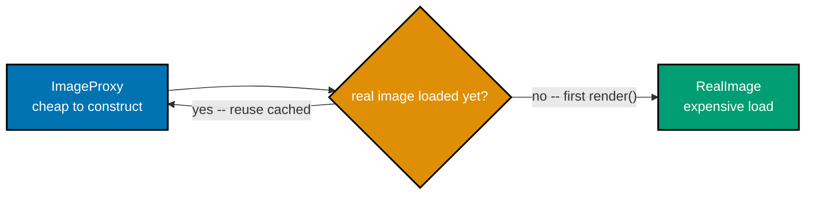

**`learning/code/ex-32-proxy-lazy-load/example.py`**

```python
"""Example 32: A Virtual Proxy Defers an Expensive Load."""


class RealImage:  # => the EXPENSIVE real subject -- loading it costs real work
    load_count: int = 0  # => a class-level counter so the example can OBSERVE loading

    def __init__(self, filename: str) -> None:  # => construction itself IS the expensive step
        self.filename = filename  # => stores filename on this instance
        RealImage.load_count += 1  # => every construction increments the shared counter
        print(f"loading {filename} from disk")  # => simulates the expensive I/O happening

    def render(self) -> str:  # => defines the render() method
        return f"rendering {self.filename}"  # => returns this value to the caller


class ImageProxy:  # => the VIRTUAL PROXY -- stands in for a RealImage not yet loaded
    def __init__(self, filename: str) -> None:  # => cheap -- no loading happens here
        self._filename: str = filename  # => stores only the filename, nothing expensive
        self._real: RealImage | None = None  # => the real subject, created LAZILY

    def render(self) -> str:  # => same interface as RealImage.render() -- callers can't tell
        if self._real is None:  # => only construct the real subject on FIRST access
            self._real = RealImage(self._filename)  # => the expensive load happens HERE
        return self._real.render()  # => delegates to the now-loaded real subject


proxy: ImageProxy = ImageProxy("photo.png")  # => cheap -- RealImage.load_count is still 0
print(RealImage.load_count)  # => confirms NOTHING loaded yet, just constructing the proxy
# => Output: 0
proxy.render()  # => first access -- triggers the actual, expensive load
proxy.render()  # => second access -- reuses the ALREADY-loaded RealImage, no reload
print(RealImage.load_count)  # => loaded exactly once, despite two render() calls
# => Output: 1
# => The proxy defers construction of the expensive real subject until the FIRST access, then caches it
```

**Run**: `python3 example.py`

**Output**:

```text
0
loading photo.png from disk
1
```

**`learning/code/ex-32-proxy-lazy-load/test_example.py`**

```python
"""Example 32: pytest verification for A Virtual Proxy Defers an Expensive Load."""

from example import ImageProxy, RealImage


def test_constructing_the_proxy_loads_nothing() -> None:
    before: int = RealImage.load_count
    ImageProxy("unit-test.png")  # => constructing the proxy itself must stay cheap
    assert RealImage.load_count == before  # => no RealImage was constructed yet


def test_first_render_call_loads_exactly_once() -> None:
    before: int = RealImage.load_count
    proxy: ImageProxy = ImageProxy("unit-test-2.png")
    proxy.render()  # => triggers the one and only load
    proxy.render()  # => must NOT trigger a second load
    proxy.render()  # => must NOT trigger a third load
    assert RealImage.load_count == before + 1  # => loaded exactly once across 3 calls


# => Run: pytest -- Output: 2 passed
```

**Verify**: `pytest -q`

**Output**:

```text
2 passed
```

**Key takeaway**: A virtual proxy shares the real subject's interface, but delays construction until the first genuine access, then reuses the same real object for every access after that.

**Why it matters**: Loading every image, opening every database connection, or fetching every remote resource eagerly at startup wastes time and memory on objects a given run may never touch. A virtual proxy lets a codebase construct thousands of `ImageProxy` placeholders cheaply and pay the real loading cost only for the ones a user actually views, without changing a single caller's code.

---

### Example 33: A Protection Proxy Checks Permission Before Delegating

_ex-33 &middot; exercises co-24_

A protection proxy adds an access check in front of a real subject that itself knows nothing about permissions. This example wraps a `RealBankAccount` in a `BankAccountProxy` that checks the caller's role before delegating `withdraw()`, and confirms an unauthorized `guest` role never reaches the real account at all.

**`learning/code/ex-33-proxy-access-control/example.py`**

```python
"""Example 33: A Protection Proxy Checks Permission Before Delegating."""


class RealBankAccount:  # => the REAL subject -- has no idea about permissions at all
    def __init__(self, balance: float) -> None:  # => the constructor
        self.balance = balance  # => stores balance on this instance

    def withdraw(self, amount: float) -> None:  # => defines the withdraw() method
        self.balance -= amount  # => the actual, unguarded mutation


class BankAccountProxy:  # => the PROTECTION PROXY -- adds a permission check IN FRONT
    def __init__(self, real_account: RealBankAccount, role: str) -> None:  # => holds the real subject AND the caller's role
        self._real: RealBankAccount = real_account  # => the object being protected
        self._role: str = role  # => the caller's role, checked before every delegation

    def withdraw(self, amount: float) -> None:  # => SAME interface as RealBankAccount
        if self._role != "admin":  # => the check RealBankAccount itself never performs
            raise PermissionError(f"role '{self._role}' cannot withdraw")  # => blocks the call entirely
        self._real.withdraw(amount)  # => only reached once the check has passed


account: RealBankAccount = RealBankAccount(balance=1000.0)  # => constructs account
admin_proxy: BankAccountProxy = BankAccountProxy(account, role="admin")  # => an authorized caller
guest_proxy: BankAccountProxy = BankAccountProxy(account, role="guest")  # => an unauthorized caller, SAME underlying account

admin_proxy.withdraw(100.0)  # => admin role passes the check -- delegates through
print(account.balance)  # => the withdrawal genuinely happened on the real account
# => Output: 900.0

try:  # => the block below is expected to raise
    guest_proxy.withdraw(50.0)  # => guest role fails the check -- never reaches RealBankAccount
except PermissionError as exc:  # => catches the PermissionError raised above
    print(exc)  # => confirms the exact rejection message
# => Output: role 'guest' cannot withdraw
print(account.balance)  # => unchanged -- the blocked withdrawal never touched the real account
# => Output: 900.0
# => The protection proxy enforces a permission check that the real subject itself does not know exists
```

**Run**: `python3 example.py`

**Output**:

```text
900.0
role 'guest' cannot withdraw
900.0
```

**`learning/code/ex-33-proxy-access-control/test_example.py`**

```python
"""Example 33: pytest verification for A Protection Proxy Checks Permission."""

import pytest

from example import BankAccountProxy, RealBankAccount


def test_admin_role_withdrawal_succeeds() -> None:
    account: RealBankAccount = RealBankAccount(balance=1000.0)
    BankAccountProxy(account, role="admin").withdraw(100.0)
    assert account.balance == 900.0  # => the real account was genuinely mutated


def test_guest_role_withdrawal_is_blocked() -> None:
    account: RealBankAccount = RealBankAccount(balance=1000.0)
    with pytest.raises(PermissionError):  # => must raise, never silently succeed
        BankAccountProxy(account, role="guest").withdraw(50.0)
    assert account.balance == 1000.0  # => the blocked call never reached the real account


# => Run: pytest -- Output: 2 passed
```

**Verify**: `pytest -q`

**Output**:

```text
2 passed
```

**Key takeaway**: A protection proxy enforces an access check that the real subject itself never implements, blocking unauthorized calls before they ever reach the protected object.

**Why it matters**: Baking permission checks into `RealBankAccount` itself would couple a purely financial class to an authorization concern -- and would need editing every time the permission rules changed. A protection proxy keeps `RealBankAccount` focused on balances while permission logic evolves independently in the proxy, a separation that scales cleanly when different callers eventually need different authorization schemes.

---

### Example 34: Composite Treats File and Directory Uniformly for size()

_ex-34 &middot; exercises co-23_

Composite lets a `File` (leaf) and a `Directory` (composed of Files and other Directories) both answer `size()` through the same interface, so a caller never needs to check which kind of node it holds. This example builds a small nested tree and computes its total size through one recursive `size()` call, with no `isinstance()` check anywhere.

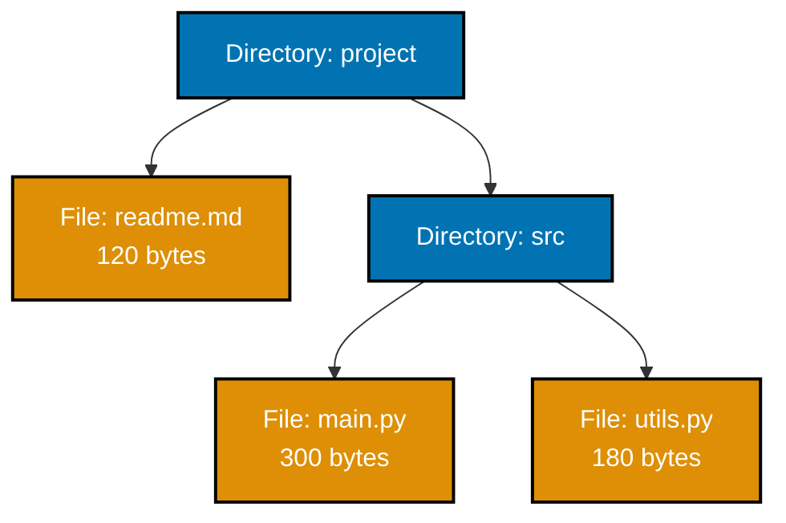

**`learning/code/ex-34-composite-file-tree/example.py`**

```python
"""Example 34: Composite Treats File and Directory Uniformly for size()."""

import abc  # => imports the abc module


class FileSystemEntry(abc.ABC):  # => the COMPONENT interface -- shared by leaf AND composite
    @abc.abstractmethod
    def size(self) -> int:  # => no body -- required by both File and Directory
        ...  # => the ellipsis stub -- File and Directory below fill this in


class File(FileSystemEntry):  # => the LEAF -- has no children of its own
    def __init__(self, name: str, size_bytes: int) -> None:  # => the constructor
        self.name = name  # => stores name on this instance
        self._size_bytes = size_bytes  # => stores this leaf's own, fixed size

    def size(self) -> int:  # => the leaf case -- just returns its own size
        return self._size_bytes  # => returns this value to the caller


class Directory(FileSystemEntry):  # => the COMPOSITE -- holds a list of ANY FileSystemEntry
    def __init__(self, name: str) -> None:  # => the constructor
        self.name = name  # => stores name on this instance
        self._children: list[FileSystemEntry] = []  # => Files AND Directories, mixed freely

    def add(self, entry: FileSystemEntry) -> None:  # => defines the add() method
        self._children.append(entry)  # => accepts a File OR another Directory, identically

    def size(self) -> int:  # => the composite case -- sums every child, RECURSIVELY
        return sum(child.size() for child in self._children)  # => each child.size() call may itself recurse into a nested Directory


root: Directory = Directory("project")  # => constructs root
root.add(File("readme.md", 120))  # => a leaf, added directly to the root
src: Directory = Directory("src")  # => a NESTED composite
src.add(File("main.py", 300))  # => a leaf inside the nested directory
src.add(File("utils.py", 180))  # => a second leaf inside the nested directory
root.add(src)  # => the nested Directory is itself just another FileSystemEntry
print(root.size())  # => 120 + (300 + 180) -- computed through ONE uniform size() call
# => Output: 600
# => `root.size()` never checks whether a child is a File or a Directory -- both answer size() the same way
```

**Run**: `python3 example.py`

**Output**:

```text
600
```

**`learning/code/ex-34-composite-file-tree/test_example.py`**

```python
"""Example 34: pytest verification for Composite File Tree size()."""

from example import Directory, File


def test_recursive_size_sums_nested_directories_through_one_interface() -> None:
    root: Directory = Directory("project")
    root.add(File("readme.md", 120))
    src: Directory = Directory("src")
    src.add(File("main.py", 300))
    src.add(File("utils.py", 180))
    root.add(src)  # => a Directory nested inside another Directory
    assert root.size() == 600  # => 120 + 300 + 180, computed recursively


def test_a_single_file_answers_size_directly() -> None:
    assert File("a.txt", 42).size() == 42  # => the leaf case needs no recursion at all


# => Run: pytest -- Output: 2 passed
```

**Verify**: `pytest -q`

**Output**:

```text
2 passed
```

**Key takeaway**: `root.size()` never checks whether a child is a `File` or a `Directory` -- both answer `size()` the same way, so the recursion just works, arbitrarily deep.

**Why it matters**: Without Composite, summing a nested file tree would need explicit branching (`if isinstance(entry, Directory): recurse, else: add its size`) at every level of traversal. Composite pushes that branching into `size()` itself, once, so any code that walks the tree -- computing size, counting files, searching by name -- stays simple regardless of how deeply the tree is nested.

---

### Example 35: Composite Renders Nested Menu Items Uniformly

_ex-35 &middot; exercises co-23_

A second Composite example makes the pattern's shape more visible: `MenuItem` (leaf) and `Menu` (composite group) both implement `render()`, so a nested submenu renders through the exact same call as a plain item. This example nests an "Open Recent" submenu inside a "File" menu and renders the whole tree with one call.

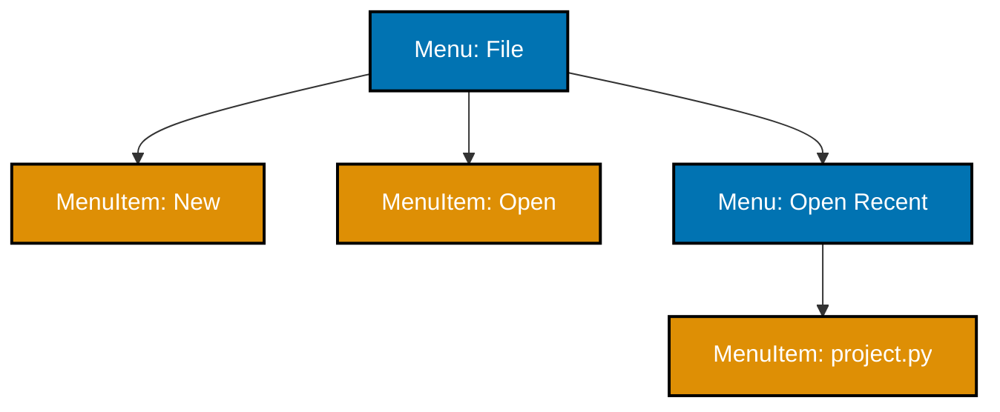

**`learning/code/ex-35-composite-menu/example.py`**

```python
"""Example 35: Composite Renders Nested Menu Items Uniformly."""

import abc  # => imports the abc module


class MenuComponent(abc.ABC):  # => the COMPONENT interface -- shared by leaf and group
    @abc.abstractmethod
    def render(self, indent: int = 0) -> str:  # => no body -- required by both
        ...  # => the ellipsis stub -- MenuItem and Menu below fill this in


class MenuItem(MenuComponent):  # => the LEAF -- a single, non-nestable entry
    def __init__(self, label: str) -> None:  # => the constructor
        self.label = label  # => stores label on this instance

    def render(self, indent: int = 0) -> str:  # => the leaf case -- one indented line
        return " " * indent + f"- {self.label}"  # => returns this value to the caller


class Menu(MenuComponent):  # => the COMPOSITE -- a named GROUP of MenuComponents
    def __init__(self, label: str) -> None:  # => the constructor
        self.label = label  # => stores label on this instance
        self._items: list[MenuComponent] = []  # => MenuItems AND nested Menus, mixed freely

    def add(self, item: MenuComponent) -> None:  # => defines the add() method
        self._items.append(item)  # => accepts a MenuItem OR another Menu, identically

    def render(self, indent: int = 0) -> str:  # => the composite case -- itself PLUS children
        header: str = " " * indent + f"+ {self.label}"  # => this group's own header line
        child_lines: list[str] = [item.render(indent + 2) for item in self._items]  # => each child renders itself, MORE indented, possibly recursing again
        return "\n".join([header, *child_lines])  # => returns this value to the caller


file_menu: Menu = Menu("File")  # => constructs file_menu
file_menu.add(MenuItem("New"))  # => a leaf, added directly
file_menu.add(MenuItem("Open"))  # => a leaf, added directly
recent: Menu = Menu("Open Recent")  # => a NESTED composite submenu
recent.add(MenuItem("project.py"))  # => a leaf inside the nested submenu
file_menu.add(recent)  # => the nested Menu is itself just another MenuComponent
print(file_menu.render())  # => leaves and the nested group render through ONE call
# => Output: + File
# =>           - New
# =>           - Open
# =>           + Open Recent
# =>             - project.py
# => `file_menu.render()` never branches on whether an item is a MenuItem or a nested Menu
```

**Run**: `python3 example.py`

**Output**:

```text
+ File
  - New
  - Open
  + Open Recent
    - project.py
```

**`learning/code/ex-35-composite-menu/test_example.py`**

```python
"""Example 35: pytest verification for Composite Menu Rendering."""

from example import Menu, MenuItem


def test_leaf_and_nested_group_render_through_one_interface() -> None:
    file_menu: Menu = Menu("File")
    file_menu.add(MenuItem("New"))
    recent: Menu = Menu("Open Recent")
    recent.add(MenuItem("project.py"))
    file_menu.add(recent)  # => a Menu nested inside another Menu
    rendered: str = file_menu.render()
    assert "+ File" in rendered  # => the top-level group's own header
    assert "- New" in rendered  # => a direct leaf item
    assert "+ Open Recent" in rendered  # => the nested group's own header
    assert "- project.py" in rendered  # => a leaf inside the nested group


def test_nested_items_are_indented_more_than_their_parent() -> None:
    root: Menu = Menu("Root")
    root.add(MenuItem("Top"))
    lines: list[str] = root.render().splitlines()
    assert lines[0] == "+ Root"  # => no indentation at the top level
    assert lines[1] == "  - Top"  # => one nesting level deeper, two spaces indented


# => Run: pytest -- Output: 2 passed
```

**Verify**: `pytest -q`

**Output**:

```text
2 passed
```

**Key takeaway**: A nested `Menu` renders through the exact same `render()` call as a plain `MenuItem`, so building a deeper menu tree requires no changes to how any existing menu is displayed.

**Why it matters**: Real application menus nest arbitrarily -- submenus inside submenus, sometimes several levels deep. Composite means the rendering code was written once, for one level, and correctly handles every depth by construction, which is exactly the property that keeps UI-tree code from accumulating special cases as menus grow more complex over a product's life.

---

### Example 36: Command Objects with execute()/undo() for an Editor

_ex-36 &middot; exercises co-27_

Command reifies a request as an object with both a forward action and its reverse, instead of calling the receiver's method directly. This example wraps each text-append edit in an `AppendCommand`, keeps executed commands on a `history` stack, and undoes only the most recent one with `history.pop().undo()`.


**`learning/code/ex-36-command-undo/example.py`**

```python
"""Example 36: Command Objects with execute()/undo() for an Editor."""

import abc  # => imports the abc module


class Editor:  # => the RECEIVER -- the object commands actually act upon
    def __init__(self) -> None:  # => the constructor
        self.text: str = ""  # => the editor's own, mutable document content

    def append(self, chunk: str) -> None:  # => defines the append() method
        self.text += chunk  # => the low-level operation a Command wraps

    def remove_last(self, length: int) -> None:  # => defines the remove_last() method
        self.text = self.text[:-length]  # => the low-level UNDO operation


class Command(abc.ABC):  # => reifies a REQUEST as an object, with both directions
    @abc.abstractmethod
    def execute(self) -> None:  # => no body -- required by every concrete command
        ...  # => the ellipsis stub -- AppendCommand below fills this in

    @abc.abstractmethod
    def undo(self) -> None:  # => no body -- required by every concrete command
        ...  # => the ellipsis stub -- AppendCommand below fills this in


class AppendCommand(Command):  # => a CONCRETE command wrapping one append operation
    def __init__(self, editor: Editor, chunk: str) -> None:  # => the constructor
        self._editor: Editor = editor  # => the receiver this command acts on
        self._chunk: str = chunk  # => remembers WHAT it appended, needed to undo later

    def execute(self) -> None:  # => defines the execute() method
        self._editor.append(self._chunk)  # => delegates to the receiver's low-level op

    def undo(self) -> None:  # => defines the undo() method
        self._editor.remove_last(len(self._chunk))  # => reverses exactly what execute() did


history: list[Command] = []  # => a stack of EXECUTED commands, most recent last
editor: Editor = Editor()  # => constructs editor

for chunk in ["Hello", ", ", "World"]:  # => three separate edits, one command each
    cmd: Command = AppendCommand(editor, chunk)  # => wraps this edit as a Command object
    cmd.execute()  # => performs the edit
    history.append(cmd)  # => remembered so it can be undone later, in reverse order

print(editor.text)  # => all three chunks appended, in order
# => Output: Hello, World

last: Command = history.pop()  # => the MOST RECENT command, undone first
last.undo()  # => reverses only the last edit, "World"
print(editor.text)  # => "World" is gone -- the two earlier edits remain intact
# => Output: Hello,
# => Wrapping each edit as a Command object turns "undo the last thing" into `history.pop().undo()`
```

**Run**: `python3 example.py`

**Output**:

```text
Hello, World
Hello,
```

_(The second output line ends with a trailing space in the actual `python3 example.py` run --
undoing only the `"World"` chunk of `"Hello" + ", " + "World"` leaves `"Hello, "`, matching the
`test_example.py` assertion below. The trailing space is trimmed from the block above for display
since markdown rendering does not distinguish it.)_

**`learning/code/ex-36-command-undo/test_example.py`**

```python
"""Example 36: pytest verification for Command Objects with execute()/undo()."""

from example import AppendCommand, Command, Editor


def test_undo_reverses_only_the_most_recently_executed_command() -> None:
    editor: Editor = Editor()
    history: list[Command] = []
    for chunk in ["Hello", ", ", "World"]:
        cmd: Command = AppendCommand(editor, chunk)
        cmd.execute()
        history.append(cmd)
    assert editor.text == "Hello, World"  # => all three edits applied, in order

    history.pop().undo()  # => undoes only "World"
    assert editor.text == "Hello, "  # => the two earlier edits are still intact


# => Run: pytest -- Output: 1 passed
```

**Verify**: `pytest -q`

**Output**:

```text
1 passed
```

**Key takeaway**: Wrapping each edit as a `Command` object turns "undo the last thing" into `history.pop().undo()` -- undo logic is data (a stack of commands), not a hand-maintained snapshot mechanism.

**Why it matters**: Text editors, drawing tools, and IDEs all need multi-level undo, and Command is the standard way to get it: each user action becomes an object the application can execute, remember, and reverse, uniformly, regardless of what the action actually did. The same `history` stack pattern scales from one undoable action type to dozens without the undo logic itself growing more complex.

---

### Example 37: Queueing Commands for Deferred Batch Execution

_ex-37 &middot; exercises co-27_

Because a Command is a plain object, it can be queued and executed later instead of immediately -- enqueueing three commands runs nothing until `run_all()` drains the queue, in the exact order they were enqueued. This example confirms both that nothing executes at enqueue time and that batch execution preserves order.

**`learning/code/ex-37-command-queue/example.py`**

```python
"""Example 37: Queueing Commands for Deferred Batch Execution."""

import abc  # => imports the abc module


class Command(abc.ABC):  # => reifies a REQUEST as an object, queueable like any value
    @abc.abstractmethod
    def execute(self) -> str:  # => no body -- required by every concrete command
        ...  # => the ellipsis stub -- concrete commands below fill this in


class SendEmailCommand(Command):  # => a CONCRETE command -- not run until the queue drains
    def __init__(self, to: str) -> None:  # => the constructor
        self._to: str = to  # => remembers WHAT to do, without doing it yet

    def execute(self) -> str:  # => defines the execute() method
        return f"email sent to {self._to}"  # => the actual side effect, deferred until now


class LogEventCommand(Command):  # => a DIFFERENT concrete command, same Command interface
    def __init__(self, message: str) -> None:  # => the constructor
        self._message: str = message  # => remembers WHAT to do, without doing it yet

    def execute(self) -> str:  # => defines the execute() method
        return f"logged: {self._message}"  # => the actual side effect, deferred until now


class CommandQueue:  # => holds commands as PLAIN DATA until something drains the queue
    def __init__(self) -> None:  # => the constructor
        self._pending: list[Command] = []  # => nothing executes just by being queued

    def enqueue(self, command: Command) -> None:  # => defines the enqueue() method
        self._pending.append(command)  # => appends WITHOUT calling execute() at all

    def run_all(self) -> list[str]:  # => the deferred batch execution step
        results: list[str] = [cmd.execute() for cmd in self._pending]  # => runs every queued command, in the EXACT order they were enqueued
        self._pending.clear()  # => the queue is empty once this batch has run
        return results  # => returns this value to the caller


queue: CommandQueue = CommandQueue()  # => constructs queue
queue.enqueue(LogEventCommand("user signed up"))  # => queued FIRST -- not yet executed
queue.enqueue(SendEmailCommand("new-user@example.com"))  # => queued SECOND -- not yet executed
queue.enqueue(LogEventCommand("welcome email queued"))  # => queued THIRD -- not yet executed

print(len(queue._pending))  # => nothing has executed yet -- just three unexecuted commands, queued
# => Output: 3
results: list[str] = queue.run_all()  # => the ENTIRE batch runs now, in enqueue order
for line in results:  # => prints each result on its own line
    print(line)  # => confirms execution happened in the SAME order commands were enqueued
# => Output: logged: user signed up
# => Output: email sent to new-user@example.com
# => Output: logged: welcome email queued
# => Queueing a Command defers its side effect; `run_all()` executes every queued command in enqueue order
```

**Run**: `python3 example.py`

**Output**:

```text
3
logged: user signed up
email sent to new-user@example.com
logged: welcome email queued
```

**`learning/code/ex-37-command-queue/test_example.py`**

```python
"""Example 37: pytest verification for Queueing Commands for Deferred Batch Execution."""

from example import CommandQueue, LogEventCommand, SendEmailCommand


def test_run_all_executes_commands_in_enqueue_order() -> None:
    queue: CommandQueue = CommandQueue()
    queue.enqueue(LogEventCommand("first"))
    queue.enqueue(SendEmailCommand("second@example.com"))
    queue.enqueue(LogEventCommand("third"))
    results: list[str] = queue.run_all()
    assert results == [
        "logged: first",
        "email sent to second@example.com",
        "logged: third",
    ]  # => exact enqueue order preserved


def test_run_all_empties_the_queue() -> None:
    queue: CommandQueue = CommandQueue()
    queue.enqueue(LogEventCommand("only"))
    queue.run_all()
    assert queue._pending == []  # => nothing left pending after a batch has run


# => Run: pytest -- Output: 2 passed
```

**Verify**: `pytest -q`

**Output**:

```text
2 passed
```

**Key takeaway**: Queueing a `Command` defers its side effect entirely; `run_all()` executes every queued command in the exact order it was enqueued, then leaves the queue empty.

**Why it matters**: Deferred batch execution is how background job systems, transaction logs, and "apply these N changes atomically" workflows work: the caller building up the batch never blocks on individual side effects, and whatever drains the queue controls exactly when (and in what order) they finally happen. Because a `Command` is just data until `execute()` runs, the same queue can be persisted, retried, or replayed without any special handling.

---

### Example 38: A Vending Machine State Machine, Not Boolean Flags

_ex-38 &middot; exercises co-29_

State represents each state as its own object rather than a boolean flag or string tag, so illegal transitions are rejected by the state object itself, not by scattered `if` checks. This example models a vending machine with `NoCoinState` and `HasCoinState`, and confirms dispensing without a coin raises instead of silently succeeding.

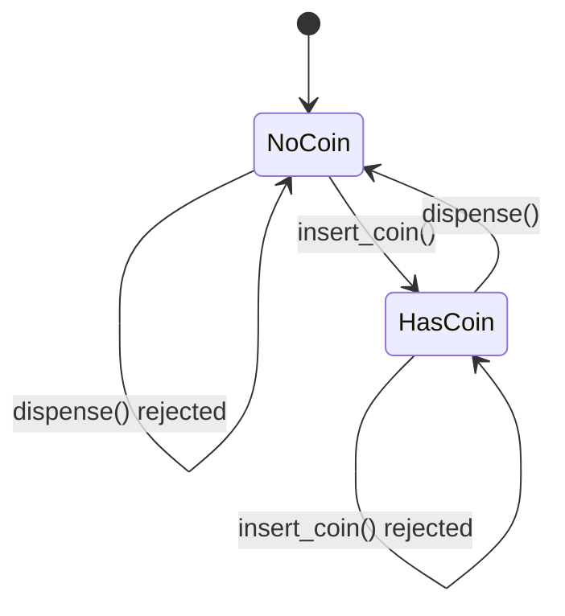

**`learning/code/ex-38-state-vending-machine/example.py`**

```python
"""Example 38: A Vending Machine State Machine, Not Boolean Flags."""

import abc  # => imports the abc module


class VendingMachine:  # => the CONTEXT -- holds whichever state object is CURRENT
    def __init__(self) -> None:  # => the constructor
        self.state: "MachineState" = NoCoinState()  # => starts in the NoCoin state

    def insert_coin(self) -> str:  # => delegates the DECISION to the current state object
        return self.state.insert_coin(self)  # => returns this value to the caller

    def dispense(self) -> str:  # => delegates the DECISION to the current state object
        return self.state.dispense(self)  # => returns this value to the caller


class MachineState(abc.ABC):  # => one state object PER machine state, not a flag/enum
    @abc.abstractmethod
    def insert_coin(self, machine: VendingMachine) -> str:  # => no body -- required
        ...  # => the ellipsis stub -- concrete states below fill this in

    @abc.abstractmethod
    def dispense(self, machine: VendingMachine) -> str:  # => no body -- required
        ...  # => the ellipsis stub -- concrete states below fill this in


class NoCoinState(MachineState):  # => the machine has NO coin inserted yet
    def insert_coin(self, machine: VendingMachine) -> str:  # => the LEGAL transition here
        machine.state = HasCoinState()  # => switches the context to a DIFFERENT state object
        return "coin accepted"  # => returns this value to the caller

    def dispense(self, machine: VendingMachine) -> str:  # => the ILLEGAL transition here
        raise ValueError("insert a coin first")  # => rejected -- no coin, nothing to dispense


class HasCoinState(MachineState):  # => the machine already HAS a coin inserted
    def insert_coin(self, machine: VendingMachine) -> str:  # => the ILLEGAL transition here
        raise ValueError("coin already inserted")  # => rejected -- can't insert a second coin

    def dispense(self, machine: VendingMachine) -> str:  # => the LEGAL transition here
        machine.state = NoCoinState()  # => switches back to the NoCoin state
        return "item dispensed"  # => returns this value to the caller


machine: VendingMachine = VendingMachine()  # => constructs machine
print(machine.insert_coin())  # => legal from NoCoinState
# => Output: coin accepted
print(machine.dispense())  # => legal from HasCoinState -- item is released
# => Output: item dispensed

try:  # => the block below is expected to raise
    machine.dispense()  # => ILLEGAL: back in NoCoinState, nothing to dispense
except ValueError as exc:  # => catches the ValueError raised above
    print(exc)  # => confirms the illegal transition was rejected, not silently ignored
# => Output: insert a coin first
# => Each state is its OWN object that decides which transitions are legal, replacing scattered if/flag checks
```

**Run**: `python3 example.py`

**Output**:

```text
coin accepted
item dispensed
insert a coin first
```

**`learning/code/ex-38-state-vending-machine/test_example.py`**

```python
"""Example 38: pytest verification for the Vending Machine State Machine."""

import pytest

from example import VendingMachine


def test_legal_transitions_move_through_both_states() -> None:
    machine: VendingMachine = VendingMachine()
    assert machine.insert_coin() == "coin accepted"  # => NoCoin -> HasCoin
    assert machine.dispense() == "item dispensed"  # => HasCoin -> NoCoin


def test_illegal_dispense_without_a_coin_is_rejected() -> None:
    machine: VendingMachine = VendingMachine()
    with pytest.raises(ValueError):  # => dispensing with no coin must raise, not succeed
        machine.dispense()


def test_illegal_double_coin_insert_is_rejected() -> None:
    machine: VendingMachine = VendingMachine()
    machine.insert_coin()  # => now in HasCoinState
    with pytest.raises(ValueError):  # => a second coin insert must raise, not succeed
        machine.insert_coin()


# => Run: pytest -- Output: 3 passed
```

**Verify**: `pytest -q`

**Output**:

```text
3 passed
```

**Key takeaway**: Each state is its own object that decides for itself which transitions are legal, replacing scattered `if self.has_coin:` checks with polymorphic dispatch through `MachineState`.

**Why it matters**: A boolean-flag implementation of the same machine (`self.has_coin: bool`) would need every method to re-check that flag, and adding a third state (say, "out of stock") would mean threading a second flag through every one of those checks. Modeling each state as its own class means adding a state means adding a class, with the transition rules for that state contained entirely within it.

---

### Example 39: Cycling States via the State Pattern

_ex-39 &middot; exercises co-29_

A second State example makes the transition-ownership idea concrete with a cycle: each `LightState` subclass knows only its own successor, so `next()` never branches on the current color by name. This example cycles a `TrafficLight` through red, green, and yellow, back to red.

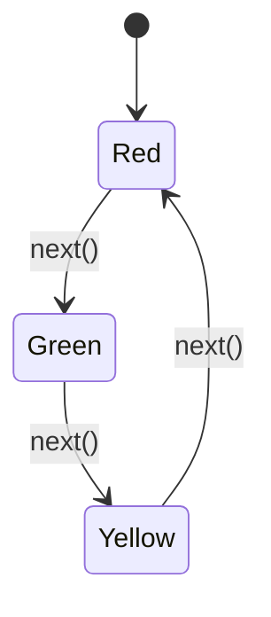

**`learning/code/ex-39-state-traffic-light/example.py`**

```python
"""Example 39: Cycling States via the State Pattern."""

import abc  # => imports the abc module


class TrafficLight:  # => the CONTEXT -- holds whichever LightState object is CURRENT
    def __init__(self) -> None:  # => the constructor
        self.state: "LightState" = RedState()  # => every light starts at Red

    def next(self) -> str:  # => delegates "what comes next" to the CURRENT state object
        self.state = self.state.next_state()  # => the current state DECIDES its successor
        return self.state.name()  # => returns this value to the caller


class LightState(abc.ABC):  # => one state object PER color, not an enum with a switch
    @abc.abstractmethod
    def next_state(self) -> "LightState":  # => no body -- required by every color
        ...  # => the ellipsis stub -- concrete states below fill this in

    @abc.abstractmethod
    def name(self) -> str:  # => no body -- required by every color
        ...  # => the ellipsis stub -- concrete states below fill this in


class RedState(LightState):  # => Red always transitions to Green next
    def next_state(self) -> LightState:  # => defines the next_state() method
        return GreenState()  # => Red -> Green, and ONLY Red -> Green

    def name(self) -> str:  # => defines the name() method
        return "red"  # => returns this value to the caller


class GreenState(LightState):  # => Green always transitions to Yellow next
    def next_state(self) -> LightState:  # => defines the next_state() method
        return YellowState()  # => Green -> Yellow, and ONLY Green -> Yellow

    def name(self) -> str:  # => defines the name() method
        return "green"  # => returns this value to the caller


class YellowState(LightState):  # => Yellow always transitions back to Red
    def next_state(self) -> LightState:  # => defines the next_state() method
        return RedState()  # => Yellow -> Red, closing the cycle

    def name(self) -> str:  # => defines the name() method
        return "yellow"  # => returns this value to the caller


light: TrafficLight = TrafficLight()  # => constructs light, starting at Red
print(light.state.name())  # => the initial state, before any next() call
# => Output: red
print(light.next())  # => Red -> Green
# => Output: green
print(light.next())  # => Green -> Yellow
# => Output: yellow
print(light.next())  # => Yellow -> Red, the cycle repeats
# => Output: red
# => Each LightState object owns its OWN transition rule -- `next()` never branches on the color by name
```

**Run**: `python3 example.py`

**Output**:

```text
red
green
yellow
red
```

**`learning/code/ex-39-state-traffic-light/test_example.py`**

```python
"""Example 39: pytest verification for Cycling States via the State Pattern."""

from example import TrafficLight


def test_next_cycles_red_green_yellow_red() -> None:
    light: TrafficLight = TrafficLight()
    assert light.state.name() == "red"  # => starting state
    assert light.next() == "green"  # => red -> green
    assert light.next() == "yellow"  # => green -> yellow
    assert light.next() == "red"  # => yellow -> red, cycle closes


# => Run: pytest -- Output: 1 passed
```

**Verify**: `pytest -q`

**Output**:

```text
1 passed
```

**Key takeaway**: Each `LightState` subclass owns its own transition rule -- `TrafficLight.next()` itself never branches on the current color by name, it just asks the current state what comes next.

**Why it matters**: State cycles like this appear constantly in real systems -- connection lifecycles, order statuses, workflow stages -- and the temptation is always a `match`/`if` chain keyed on a string or enum. Encoding the transition rule inside each state object means the transition table lives in exactly one place per state, and adding a fourth light color means adding one class, not editing an existing switch.

---

### Example 40: A Custom `__iter__` Walks a Binary Tree In Order

_ex-40 &middot; exercises co-30_

Iterator exposes sequential access without revealing the underlying representation -- implementing `__iter__` as a generator lets `for v in tree` walk an arbitrarily-shaped binary tree without the caller ever touching a `Node` directly. This example performs an in-order walk, which yields a binary search tree's values in sorted order.

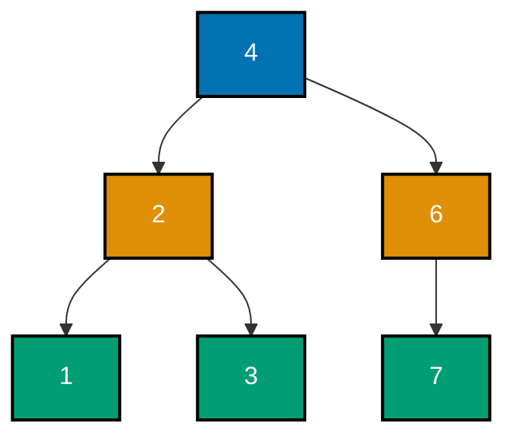

**`learning/code/ex-40-iterator-custom-tree/example.py`**

```python
"""Example 40: A Custom __iter__ Walks a Binary Tree In Order."""

from collections.abc import Iterator  # => imports Iterator from collections.abc


class Node:  # => a single binary tree node -- NOT itself iterable
    def __init__(self, value: int, left: "Node | None" = None, right: "Node | None" = None) -> None:  # => the constructor
        self.value = value  # => stores value on this instance
        self.left = left  # => stores left on this instance
        self.right = right  # => stores right on this instance


class BinaryTree:  # => the CONTAINER -- exposes iteration without exposing Node internals
    def __init__(self, root: Node | None) -> None:  # => the constructor
        self.root = root  # => stores root on this instance

    def __iter__(self) -> Iterator[int]:  # => makes `for v in tree` work directly
        yield from self._in_order(self.root)  # => delegates to a recursive generator helper

    def _in_order(self, node: Node | None) -> Iterator[int]:  # => LEFT, self, RIGHT
        if node is None:  # => the recursion's base case -- nothing to yield
            return  # => stops this generator branch cleanly
        yield from self._in_order(node.left)  # => everything smaller, first
        yield node.value  # => this node's own value, in the middle
        yield from self._in_order(node.right)  # => everything larger, last


#        4
#       / \
#      2   6
#     / \   \
#    1   3   7
tree: BinaryTree = BinaryTree(Node(4, Node(2, Node(1), Node(3)), Node(6, None, Node(7))))  # => a small, deliberately unbalanced tree
values: list[int] = [v for v in tree]  # => a plain for-loop -- no BinaryTree internals exposed
print(values)  # => in-order traversal yields values in SORTED order for a binary search tree
# => Output: [1, 2, 3, 4, 6, 7]
# => `__iter__` returning a generator lets `for v in tree` walk arbitrarily deep structure lazily
```

**Run**: `python3 example.py`

**Output**:

```text
[1, 2, 3, 4, 6, 7]
```

**`learning/code/ex-40-iterator-custom-tree/test_example.py`**

```python
"""Example 40: pytest verification for the Custom __iter__ Binary Tree Walk."""

from example import BinaryTree, Node


def test_for_loop_yields_values_in_sorted_order() -> None:
    tree: BinaryTree = BinaryTree(Node(4, Node(2, Node(1), Node(3)), Node(6, None, Node(7))))
    assert [v for v in tree] == [1, 2, 3, 4, 6, 7]  # => in-order == sorted, for a BST


def test_empty_tree_yields_nothing() -> None:
    tree: BinaryTree = BinaryTree(None)
    assert list(tree) == []  # => no root -- the generator yields zero values


# => Run: pytest -- Output: 2 passed
```

**Verify**: `pytest -q`

**Output**:

```text
2 passed
```

**Key takeaway**: `__iter__` returning a generator lets `for v in tree` walk arbitrarily deep structure lazily -- the caller never sees a `Node`, only the values.

**Why it matters**: A tree class that instead exposed `.root` and let callers manually recurse over `.left`/`.right` would leak its internal representation into every piece of code that iterates it, breaking the moment the tree's implementation changed (say, from a linked structure to an array-backed one). `__iter__` is Python's standard seam for hiding exactly that representation behind the universal `for ... in ...` protocol.

---

### Example 41: An Iterator That Lazily Pages a Remote API

_ex-41 &middot; exercises co-30_

A paging iterator hides not just the underlying representation but the network calls needed to produce it, fetching each page only when the current buffer runs out. This example simulates a "remote" API with an in-memory fake, self-contained and network-free, and confirms pages are fetched on demand -- never eagerly.

**`learning/code/ex-41-iterator-paged-api/example.py`**

```python
"""Example 41: An Iterator That Lazily Pages a Remote API."""

from collections.abc import Iterator  # => imports Iterator from collections.abc

# => a self-contained FAKE standing in for a real, network-backed API -- no real network call
_FAKE_REMOTE_PAGES: dict[int, list[str]] = {
    1: ["item-a", "item-b"],  # => page 1's two records
    2: ["item-c", "item-d"],  # => page 2's two records
    3: [],  # => an EMPTY page signals "no more data" -- the fetch loop stops here
}


class FetchLog:  # => an observable stand-in for "a network call happened"
    def __init__(self) -> None:  # => the constructor
        self.fetched_pages: list[int] = []  # => records EVERY page number actually fetched


def fetch_page(page_number: int, log: FetchLog) -> list[str]:  # => the "remote" call
    log.fetched_pages.append(page_number)  # => records that THIS page was fetched now
    return list(_FAKE_REMOTE_PAGES.get(page_number, []))  # => a COPY -- callers pop() their own buffer, never the shared fake dataset


class PagedApiIterator:  # => fetches ONE page at a time, only when the current page runs out
    def __init__(self, log: FetchLog) -> None:  # => the constructor
        self._log: FetchLog = log  # => shared so the example can OBSERVE fetch timing
        self._page_number: int = 1  # => starts at the first page
        self._buffer: list[str] = []  # => the current page's not-yet-yielded items
        self._exhausted: bool = False  # => True once an empty page has been seen

    def __iter__(self) -> Iterator[str]:  # => makes `for item in paged_iterator` work
        while True:  # => keeps pulling pages until the fake API returns an empty one
            if not self._buffer and not self._exhausted:  # => current page is used up
                self._buffer = fetch_page(self._page_number, self._log)  # => fetches lazily, exactly when needed
                self._page_number += 1  # => advances for the NEXT fetch, if one happens
                if not self._buffer:  # => an empty page means there is nothing left
                    self._exhausted = True  # => stops future fetch attempts
            if not self._buffer:  # => truly nothing left to yield
                return  # => stops the generator cleanly
            yield self._buffer.pop(0)  # => yields ONE item at a time, oldest first


log: FetchLog = FetchLog()  # => constructs log
paged: PagedApiIterator = PagedApiIterator(log)  # => cheap -- no page has been fetched yet
print(log.fetched_pages)  # => confirms NOTHING was fetched just by constructing the iterator
# => Output: []

first_item: str = next(iter(paged))  # => pulling ONE item triggers fetching page 1 only
print(first_item, log.fetched_pages)  # => page 2 was NOT fetched just to get one item
# => Output: item-a [1]

all_items: list[str] = list(paged)  # => draining the rest pulls page 1's remainder + page 2
print(all_items)  # => item-b was still buffered; item-c/item-d came from the page-2 fetch
# => Output: ['item-b', 'item-c', 'item-d']
print(log.fetched_pages)  # => page 3 (empty) was fetched too, to discover the data had ended
# => Output: [1, 2, 3]
# => Pages are fetched lazily, one at a time, only when the current buffer is exhausted
```

**Run**: `python3 example.py`

**Output**:

```text
[]
item-a [1]
['item-b', 'item-c', 'item-d']
[1, 2, 3]
```

**`learning/code/ex-41-iterator-paged-api/test_example.py`**

```python
"""Example 41: pytest verification for the Lazily-Paged API Iterator."""

from example import FetchLog, PagedApiIterator


def test_constructing_the_iterator_fetches_nothing() -> None:
    log: FetchLog = FetchLog()
    PagedApiIterator(log)  # => construction alone must not touch the fake API
    assert log.fetched_pages == []


def test_pages_are_fetched_lazily_one_at_a_time() -> None:
    log: FetchLog = FetchLog()
    paged: PagedApiIterator = PagedApiIterator(log)
    first: str = next(iter(paged))  # => only enough to produce one item
    assert first == "item-a"
    assert log.fetched_pages == [1]  # => page 2 was NOT fetched yet


def test_draining_the_iterator_fetches_every_remaining_page() -> None:
    log: FetchLog = FetchLog()
    paged: PagedApiIterator = PagedApiIterator(log)
    all_items: list[str] = list(paged)  # => drains everything, across all pages
    assert all_items == ["item-a", "item-b", "item-c", "item-d"]
    assert log.fetched_pages == [1, 2, 3]  # => including the empty terminating page


# => Run: pytest -- Output: 3 passed
```

**Verify**: `pytest -q`

**Output**:

```text
3 passed
```

**Key takeaway**: Pages are fetched lazily, one at a time, only when the current buffer is exhausted -- pulling a single item never triggers fetching pages the caller didn't ask for.

**Why it matters**: A naive `list(all_pages())` implementation would fetch and hold every page in memory before yielding the first item, wasting both latency and memory when a caller only needs the first few results. A lazily-paged iterator lets a caller `break` out of a loop early and never pay for the pages that were never requested -- exactly how production SDKs for paginated REST APIs are built.

---

### Example 42: Escalating a Support Ticket Through a Handler Chain

_ex-42 &middot; exercises co-31_

Chain of Responsibility passes a request along a chain of handlers until one of them handles it, without the caller knowing how many links exist or which one will respond. This example escalates support tickets through `L1Handler -> L2Handler -> L3Handler`, and confirms a ticket too severe for every tier reports unhandled instead of raising an unrelated error.


**`learning/code/ex-42-chain-of-responsibility-support/example.py`**

```python
"""Example 42: Escalating a Support Ticket Through a Handler Chain."""

import abc  # => imports the abc module


class SupportHandler(abc.ABC):  # => one link in the chain -- each link decides FOR ITSELF
    def __init__(self) -> None:  # => the constructor
        self._next: "SupportHandler | None" = None  # => the NEXT link, set by set_next()

    def set_next(self, handler: "SupportHandler") -> "SupportHandler":  # => wires the chain
        self._next = handler  # => remembers who to escalate to
        return handler  # => returned so calls can be chained: a.set_next(b).set_next(c)

    def handle(self, severity: int) -> str:  # => defines the handle() method
        if self._can_handle(severity):  # => THIS link decides whether it owns the ticket
            return self._resolve(severity)  # => returns this value to the caller
        if self._next is not None:  # => not this link's job -- pass it further down the chain
            return self._next.handle(severity)  # => returns this value to the caller
        return "unhandled: no tier could resolve this ticket"  # => fell off the END of the chain

    @abc.abstractmethod
    def _can_handle(self, severity: int) -> bool:  # => no body -- required by every tier
        ...  # => the ellipsis stub -- concrete tiers below fill this in

    @abc.abstractmethod
    def _resolve(self, severity: int) -> str:  # => no body -- required by every tier
        ...  # => the ellipsis stub -- concrete tiers below fill this in


class L1Handler(SupportHandler):  # => handles only the LOWEST severities
    def _can_handle(self, severity: int) -> bool:  # => defines the _can_handle() method
        return severity <= 1  # => returns this value to the caller

    def _resolve(self, severity: int) -> str:  # => defines the _resolve() method
        return "resolved at L1"  # => returns this value to the caller


class L2Handler(SupportHandler):  # => handles the NEXT band of severities
    def _can_handle(self, severity: int) -> bool:  # => defines the _can_handle() method
        return severity <= 3  # => returns this value to the caller

    def _resolve(self, severity: int) -> str:  # => defines the _resolve() method
        return "resolved at L2"  # => returns this value to the caller


class L3Handler(SupportHandler):  # => the LAST link -- handles everything remaining
    def _can_handle(self, severity: int) -> bool:  # => defines the _can_handle() method
        return severity <= 5  # => returns this value to the caller

    def _resolve(self, severity: int) -> str:  # => defines the _resolve() method
        return "resolved at L3"  # => returns this value to the caller


l1: L1Handler = L1Handler()  # => constructs l1
l2: L2Handler = L2Handler()  # => constructs l2
l3: L3Handler = L3Handler()  # => constructs l3
l1.set_next(l2).set_next(l3)  # => wires L1 -> L2 -> L3, chained in one expression

print(l1.handle(1))  # => severity 1 -- L1 can handle it directly, no escalation needed
# => Output: resolved at L1
print(l1.handle(2))  # => severity 2 -- too high for L1, ESCALATES to L2 automatically
# => Output: resolved at L2
print(l1.handle(9))  # => severity 9 -- too high for every tier, falls off the end
# => Output: unhandled: no tier could resolve this ticket
# => An unhandled ticket automatically escalates to the NEXT handler, with no caller-side branching
```

**Run**: `python3 example.py`

**Output**:

```text
resolved at L1
resolved at L2
unhandled: no tier could resolve this ticket
```

**`learning/code/ex-42-chain-of-responsibility-support/test_example.py`**

```python
"""Example 42: pytest verification for Escalating a Ticket Through a Handler Chain."""

from example import L1Handler, L2Handler, L3Handler


def _build_chain() -> L1Handler:
    l1, l2, l3 = L1Handler(), L2Handler(), L3Handler()
    l1.set_next(l2).set_next(l3)
    return l1


def test_ticket_handled_at_the_first_capable_tier() -> None:
    assert _build_chain().handle(1) == "resolved at L1"  # => no escalation needed


def test_unhandled_ticket_at_l1_falls_to_the_next_handler() -> None:
    assert _build_chain().handle(2) == "resolved at L2"  # => L1 rejects it, L2 resolves it


def test_ticket_beyond_every_tier_reports_unhandled() -> None:
    assert _build_chain().handle(9) == "unhandled: no tier could resolve this ticket"  # => fell off the end of the chain


# => Run: pytest -- Output: 3 passed
```

**Verify**: `pytest -q`

**Output**:

```text
3 passed
```

**Key takeaway**: An unhandled ticket automatically escalates to the next handler in the chain, with no caller-side branching -- `l1.handle(...)` is the only call site, regardless of which tier eventually resolves it.

**Why it matters**: Support-tiering, middleware pipelines, and event-bubbling systems all follow this same shape: a request enters at one end, and each link decides independently whether to act or pass it on. Chain of Responsibility keeps that decision local to each handler, so reordering or adding a tier means editing the chain's wiring, not the calling code or any other handler's logic.

---

### Example 43: A Validation Pipeline as a Handler Chain

_ex-43 &middot; exercises co-31_

A second Chain of Responsibility example runs validation rules in sequence, stopping at the first failure instead of running every rule regardless. This example chains `NotEmptyRule -> MinLengthRule -> AlphaOnlyRule`, and confirms a value failing rule 1 never even reaches rule 2 or rule 3.

**`learning/code/ex-43-chain-validation/example.py`**

```python
"""Example 43: A Validation Pipeline as a Handler Chain."""

import abc  # => imports the abc module


class ValidationHandler(abc.ABC):  # => one validation RULE, chained to the next rule
    def __init__(self) -> None:  # => the constructor
        self._next: "ValidationHandler | None" = None  # => the NEXT rule in the pipeline

    def set_next(self, handler: "ValidationHandler") -> "ValidationHandler":  # => wires the chain
        self._next = handler  # => remembers who runs after this rule
        return handler  # => returned so calls can be chained: a.set_next(b).set_next(c)

    def validate(self, value: str) -> str | None:  # => None means "passed every rule"
        error: str | None = self._check(value)  # => THIS rule's own check, run first
        if error is not None:  # => the FIRST failure stops the entire chain immediately
            return error  # => returns this value to the caller
        if self._next is not None:  # => this rule passed -- let the NEXT rule run
            return self._next.validate(value)  # => returns this value to the caller
        return None  # => every rule in the chain passed

    @abc.abstractmethod
    def _check(self, value: str) -> str | None:  # => no body -- required by every rule
        ...  # => the ellipsis stub -- concrete rules below fill this in


class NotEmptyRule(ValidationHandler):  # => runs FIRST in the pipeline
    def _check(self, value: str) -> str | None:  # => defines the _check() method
        return "value must not be empty" if value == "" else None  # => returns this value


class MinLengthRule(ValidationHandler):  # => runs SECOND, only if NotEmptyRule passed
    def _check(self, value: str) -> str | None:  # => defines the _check() method
        return "value must be at least 4 characters" if len(value) < 4 else None  # => returns this value to the caller


class AlphaOnlyRule(ValidationHandler):  # => runs THIRD, only if the first two passed
    def _check(self, value: str) -> str | None:  # => defines the _check() method
        return "value must be alphabetic" if not value.isalpha() else None  # => returns this


not_empty: NotEmptyRule = NotEmptyRule()  # => constructs not_empty
min_length: MinLengthRule = MinLengthRule()  # => constructs min_length
alpha_only: AlphaOnlyRule = AlphaOnlyRule()  # => constructs alpha_only
not_empty.set_next(min_length).set_next(alpha_only)  # => wires the pipeline in ONE expression

print(not_empty.validate(""))  # => fails the VERY FIRST rule -- the chain stops here
# => Output: value must not be empty
print(not_empty.validate("ab"))  # => passes rule 1, fails rule 2 -- rule 3 never runs
# => Output: value must be at least 4 characters
print(not_empty.validate("abcd"))  # => passes every rule in the pipeline
# => Output: None
# => The FIRST failing rule stops the chain immediately -- later rules never even run on bad input
```

**Run**: `python3 example.py`

**Output**:

```text
value must not be empty
value must be at least 4 characters
None
```

**`learning/code/ex-43-chain-validation/test_example.py`**

```python
"""Example 43: pytest verification for the Validation Pipeline as a Handler Chain."""

from example import AlphaOnlyRule, MinLengthRule, NotEmptyRule


def _build_pipeline() -> NotEmptyRule:
    not_empty, min_length, alpha_only = NotEmptyRule(), MinLengthRule(), AlphaOnlyRule()
    not_empty.set_next(min_length).set_next(alpha_only)
    return not_empty


def test_first_failure_stops_the_chain_and_reports_that_error() -> None:
    assert _build_pipeline().validate("") == "value must not be empty"  # => rule 1 fails first


def test_second_rule_only_runs_once_the_first_rule_passes() -> None:
    assert _build_pipeline().validate("ab") == "value must be at least 4 characters"  # => rule 1 passed, rule 2 caught it


def test_value_passing_every_rule_returns_none() -> None:
    assert _build_pipeline().validate("abcd") is None  # => every rule in the chain passed


# => Run: pytest -- Output: 3 passed
```

**Verify**: `pytest -q`

**Output**:

```text
3 passed
```

**Key takeaway**: The first failing rule stops the chain immediately -- `AlphaOnlyRule` never even runs on a value that already failed `MinLengthRule`, so validation short-circuits instead of collecting every possible complaint.

**Why it matters**: Chaining validation rules this way is a common alternative to a monolithic `validate()` function with a long list of `if` checks: each rule is independently testable, independently reorderable, and independently reusable in a different pipeline. The short-circuit behavior also matters for performance and clarity -- a caller sees the single most relevant error first, not a wall of downstream failures caused by the same root problem.

---

### Example 44: A Typed Event Bus with Unsubscribe

_ex-44 &middot; exercises co-26_

Observer lets subjects notify subscribers of change without knowing their concrete type -- an `EventBus` holds a list of `Callable[[str], None]` handlers per topic and calls each one on `publish()`. This example subscribes two handlers to the same topic, then unsubscribes one and confirms it no longer fires.

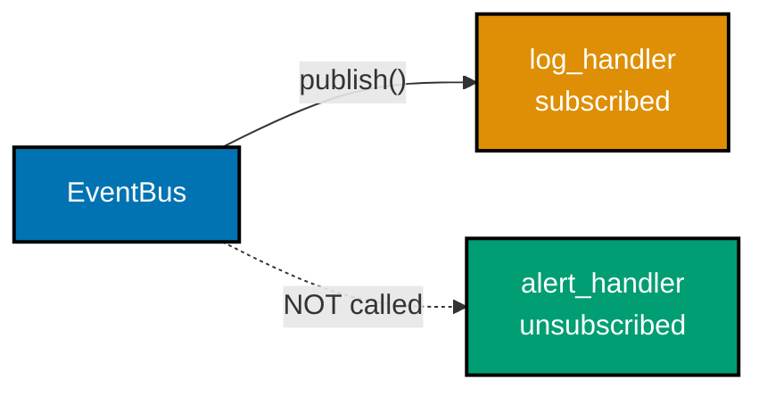

**`learning/code/ex-44-observer-typed-events/example.py`**

```python
"""Example 44: A Typed Event Bus with Unsubscribe."""

from collections.abc import Callable  # => imports Callable from collections.abc

Handler = Callable[[str], None]  # => a type alias: any function taking str, returning None


class EventBus:  # => the SUBJECT -- notifies subscribers without knowing their concrete type
    def __init__(self) -> None:  # => the constructor
        self._handlers: dict[str, list[Handler]] = {}  # => topic name -> list of subscribers

    def subscribe(self, topic: str, handler: Handler) -> None:  # => defines subscribe()
        self._handlers.setdefault(topic, []).append(handler)  # => adds this handler to the topic's list

    def unsubscribe(self, topic: str, handler: Handler) -> None:  # => defines unsubscribe()
        self._handlers.get(topic, []).remove(handler)  # => removes ONLY this handler, leaves others intact

    def publish(self, topic: str, message: str) -> None:  # => defines the publish() method
        for handler in self._handlers.get(topic, []):  # => notifies EVERY currently-subscribed handler
            handler(message)  # => the bus never knows or cares what each handler DOES


received: list[str] = []  # => a plain list used to OBSERVE which handlers actually fired


def log_handler(message: str) -> None:  # => one concrete subscriber
    received.append(f"log: {message}")  # => records that this handler ran


def alert_handler(message: str) -> None:  # => a DIFFERENT concrete subscriber
    received.append(f"alert: {message}")  # => records that this handler ran


bus: EventBus = EventBus()  # => constructs bus
bus.subscribe("order.created", log_handler)  # => subscribes log_handler to this topic
bus.subscribe("order.created", alert_handler)  # => subscribes alert_handler to the SAME topic

bus.publish("order.created", "order-1")  # => notifies BOTH currently-subscribed handlers
print(received)  # => both handlers ran, in subscription order
# => Output: ['log: order-1', 'alert: order-1']

bus.unsubscribe("order.created", alert_handler)  # => alert_handler is no longer subscribed
received.clear()  # => resets the observation list for the next publish
bus.publish("order.created", "order-2")  # => notifies only whichever handlers remain
print(received)  # => alert_handler did NOT run -- it was unsubscribed above
# => Output: ['log: order-2']
# => `unsubscribe` removes exactly one handler from one topic; every other subscription is unaffected
```

**Run**: `python3 example.py`

**Output**:

```text
['log: order-1', 'alert: order-1']
['log: order-2']
```

**`learning/code/ex-44-observer-typed-events/test_example.py`**

```python
"""Example 44: pytest verification for the Typed Event Bus with Unsubscribe."""

from example import EventBus


def test_every_subscribed_handler_receives_a_published_event() -> None:
    received: list[str] = []
    bus: EventBus = EventBus()
    bus.subscribe("topic", lambda msg: received.append(f"a:{msg}"))
    bus.subscribe("topic", lambda msg: received.append(f"b:{msg}"))
    bus.publish("topic", "hello")
    assert received == ["a:hello", "b:hello"]  # => both handlers fired


def test_unsubscribed_handler_is_not_called() -> None:
    received: list[str] = []

    def handler(msg: str) -> None:
        received.append(msg)

    bus: EventBus = EventBus()
    bus.subscribe("topic", handler)
    bus.unsubscribe("topic", handler)  # => removed BEFORE any publish() call
    bus.publish("topic", "hello")
    assert received == []  # => the unsubscribed handler never ran


# => Run: pytest -- Output: 2 passed
```

**Verify**: `pytest -q`

**Output**:

```text
2 passed
```

**Key takeaway**: `unsubscribe` removes exactly one handler from one topic; every other subscription to that topic keeps firing, and the bus never knows or cares what any handler actually does.

**Why it matters**: A subject that instead held a fixed, hardcoded list of subscribers would need editing every time a new consumer of an event appeared. Observer inverts that: the bus stays generic (`list[Callable[[str], None]]`), and subscribers register and deregister dynamically, which is exactly how UI event handlers, pub/sub systems, and plugin hooks work in production frameworks.

---

### Example 45: A Strategy via typing.Protocol Duck Typing

_ex-45 &middot; exercises co-25, co-11_

Strategy encapsulates interchangeable algorithms behind a common interface -- and `typing.Protocol` lets that interface be a plain function signature instead of a shared base class, formalizing duck typing so a static checker can verify it. This example passes a bare function into `Order`, which never declares any inheritance from `PricingStrategy`.

**`learning/code/ex-45-strategy-with-protocol/example.py`**

```python
"""Example 45: A Strategy via typing.Protocol Duck Typing."""

from typing import Protocol  # => imports Protocol from typing


class PricingStrategy(Protocol):  # => a STRUCTURAL type -- "anything callable like this"
    def __call__(self, base: float) -> float:  # => the shape every strategy must match
        ...  # => the ellipsis stub -- no shared base class required anywhere


def regular_pricing(base: float) -> float:  # => a PLAIN FUNCTION -- never declares Protocol
    return base  # => returns this value to the caller


def discount_pricing(base: float) -> float:  # => a DIFFERENT plain function, same shape
    return base * 0.8  # => returns this value to the caller


class Order:  # => begins the Order class body
    def __init__(self, pricing: PricingStrategy) -> None:  # => type-hinted against the PROTOCOL, not a concrete class
        self.pricing = pricing  # => held as a swappable collaborator

    def total(self, base: float) -> float:  # => defines the total() method
        return self.pricing(base)  # => calls the strategy as an ordinary function


regular_order: Order = Order(regular_pricing)  # => a bare FUNCTION satisfies the Protocol
discount_order: Order = Order(discount_pricing)  # => a DIFFERENT bare function, same Protocol
print(regular_order.total(100.0))  # => regular_pricing applied
# => Output: 100.0
print(discount_order.total(100.0))  # => discount_pricing applied -- same Order class
# => Output: 80.0
# => `regular_pricing` never declares `PricingStrategy` anywhere -- structural typing accepts it by shape alone
```

**Run**: `python3 example.py`

**Output**:

```text
100.0
80.0
```

**`learning/code/ex-45-strategy-with-protocol/test_example.py`**

```python
"""Example 45: pytest verification for the Strategy via typing.Protocol."""

from example import Order, discount_pricing, regular_pricing


def test_plain_function_satisfies_the_protocol_and_prices_regularly() -> None:
    order: Order = Order(regular_pricing)  # => a bare function, no inheritance declared
    assert order.total(100.0) == 100.0


def test_a_different_plain_function_satisfies_the_same_protocol() -> None:
    order: Order = Order(discount_pricing)  # => a DIFFERENT bare function, same shape
    assert order.total(100.0) == 80.0


# => Run: pytest -- Output: 2 passed
```

**Verify**: `pytest -q`

**Output**:

```text
2 passed
```

**Key takeaway**: `regular_pricing` never declares `PricingStrategy` anywhere -- structural typing accepts any object matching the required shape, and a static checker can still verify the match ahead of time.

**Why it matters**: Before `Protocol`, formalizing "anything with this shape" for a static checker meant either an `abc.ABC` (which every strategy must explicitly inherit from) or giving up static verification entirely. `Protocol` gives duck typing -- Python's long-standing "if it walks like a duck" idiom -- a name a type checker can enforce, without forcing every strategy function into a class hierarchy it doesn't need.

---

### Example 46: Replacing a Type-Switch with Polymorphic Dispatch

_ex-46 &middot; exercises co-11_

GRASP's Polymorphism pattern replaces a type-switch (`if kind == "square": ... elif kind == "circle": ...`) with dispatch on the varying type itself, so adding a new type touches no existing dispatch code. This example shows a `ShapeData`-based type-switch alongside its polymorphic `Shape` replacement, then adds `Triangle` to prove the second version needs no edits.

**`learning/code/ex-46-grasp-polymorphism-dispatch/example.py`**

```python
"""Example 46: Replacing a Type-Switch with Polymorphic Dispatch."""  # => module docstring

import abc  # => imports the abc module


class ShapeData:  # => a plain data holder, no behavior -- used only by the BEFORE version
    def __init__(self, kind: str, side: float) -> None:  # => the constructor
        self.kind = kind  # => stores kind on this instance
        self.side = side  # => stores side on this instance


def area_by_type_switch(shape: ShapeData) -> float:  # => the BEFORE version -- a type-switch
    if shape.kind == "square":  # => branch 1 -- must be edited for every NEW shape kind
        return shape.side * shape.side  # => returns this value to the caller
    if shape.kind == "circle":  # => branch 2 -- must be edited for every NEW shape kind
        return 3.14159 * shape.side * shape.side  # => returns this value to the caller
    raise ValueError(f"unknown kind: {shape.kind}")  # => a THIRD kind requires editing this exact function


class Shape(abc.ABC):  # => the AFTER version -- one abstract method, no switch anywhere
    @abc.abstractmethod  # => marks the next method as required for every Shape subclass
    def area(self) -> float:  # => no body -- required by every concrete shape
        ...  # => the ellipsis stub -- concrete shapes below fill this in


class Square(Shape):  # => the type-switch's "square" branch, now its OWN class
    def __init__(self, side: float) -> None:  # => the constructor
        self.side = side  # => stores side on this instance

    def area(self) -> float:  # => defines the area() method
        return self.side * self.side  # => returns this value to the caller


class Circle(Shape):  # => the type-switch's "circle" branch, now its OWN class
    def __init__(self, radius: float) -> None:  # => the constructor
        self.radius = radius  # => stores radius on this instance

    def area(self) -> float:  # => defines the area() method
        return 3.14159 * self.radius * self.radius  # => returns this value to the caller


class Triangle(Shape):  # => a BRAND NEW shape -- adding this edits NOTHING above it
    def __init__(self, base: float, height: float) -> None:  # => the constructor
        self.base = base  # => stores base on this instance
        self.height = height  # => stores height on this instance

    def area(self) -> float:  # => defines the area() method
        return 0.5 * self.base * self.height  # => returns this value to the caller


print(area_by_type_switch(ShapeData("square", 4.0)))  # => the OLD, switch-based version
# => Output: 16.0

shapes: list[Shape] = [  # => a heterogeneous list -- every element satisfies the Shape contract
    Square(4.0),  # => side length 4.0, same abstract type as its siblings below
    Circle(2.0),  # => radius 2.0, same abstract type as its siblings
    Triangle(3.0, 6.0),  # => base 3.0, height 6.0 -- a brand-new shape class
]  # => Triangle added with ZERO edits to any existing dispatch code
areas: list[float] = [s.area() for s in shapes]  # => ONE call-site, dispatches polymorphically for ALL three
print(areas)  # => each shape computed its OWN area, no isinstance() or kind check anywhere
# => Output: [16.0, 12.56636, 9.0]
# => Adding `Triangle` required a new class, but edited zero lines of the polymorphic dispatch loop
```

**Run**: `python3 example.py`

**Output**:

```text
16.0
[16.0, 12.56636, 9.0]
```

**`learning/code/ex-46-grasp-polymorphism-dispatch/test_example.py`**

```python
"""Example 46: pytest verification for Replacing a Type-Switch with Polymorphism."""

from example import Circle, Square, Triangle, area_by_type_switch, ShapeData


def test_type_switch_still_computes_the_correct_area() -> None:
    assert area_by_type_switch(ShapeData("square", 4.0)) == 16.0


def test_polymorphic_dispatch_computes_every_shapes_own_area() -> None:
    shapes = [Square(4.0), Circle(2.0), Triangle(3.0, 6.0)]
    areas: list[float] = [s.area() for s in shapes]  # => one shared call-site
    assert areas == [16.0, 12.56636, 9.0]


def test_adding_a_new_shape_requires_no_dispatch_code_changes() -> None:
    # => Triangle is used here exactly like Square/Circle -- proof the dispatch loop above
    # => never needed editing when this class was added to the module
    assert Triangle(2.0, 5.0).area() == 5.0


# => Run: pytest -- Output: 3 passed
```

**Verify**: `pytest -q`

**Output**:

```text
3 passed
```

**Key takeaway**: Adding `Triangle` required a brand-new class, but edited zero lines of `area_by_type_switch`'s polymorphic replacement -- each shape now answers `area()` for itself.

**Why it matters**: A type-switch function grows a new `elif` branch every time the domain grows a new type, and forgetting one raises exactly the kind of runtime error `area_by_type_switch` demonstrates. Polymorphic dispatch inverts where that growth happens: adding a type means adding a class next to the others, never touching a function that every existing type already depends on -- the Open/Closed half of SOLID, expressed through GRASP's lens.

---

### Example 47: A Repository -- a Pure Fabrication for Persistence

_ex-47 &middot; exercises co-12_

GRASP's Pure Fabrication invents a class with no domain meaning purely to keep a real domain class cohesive -- `UserRepository` exists only to hold `User` persistence logic outside `User` itself. This example confirms `User` defines no `save`/`find_by_id` methods at all; only `UserRepository` touches storage.

**`learning/code/ex-47-grasp-pure-fabrication-repo/example.py`**

```python
"""Example 47: A Repository -- a Pure Fabrication for Persistence."""

from dataclasses import dataclass  # => imports dataclass from dataclasses


@dataclass(frozen=True)  # => a genuine DOMAIN concept -- knows nothing about storage
class User:  # => begins the User class body
    user_id: int  # => a required field, part of the generated __init__
    email: str  # => a required field, part of the generated __init__

    def __post_init__(self) -> None:  # => runs automatically right after construction
        if "@" not in self.email:  # => a DOMAIN rule -- belongs on the domain object itself
            raise ValueError("email must contain @")  # => rejects an invalid User at construction time


class UserRepository:  # => a PURE FABRICATION -- no analyst would ever call this a "domain concept"
    def __init__(self) -> None:  # => invented purely to keep User cohesive and decoupled from IO
        self._storage: dict[int, User] = {}  # => the ONLY place storage details live

    def save(self, user: User) -> None:  # => defines the save() method
        self._storage[user.user_id] = user  # => the IO-flavored operation, isolated HERE

    def find_by_id(self, user_id: int) -> User | None:  # => defines the find_by_id() method
        return self._storage.get(user_id)  # => returns this value to the caller


repo: UserRepository = UserRepository()  # => constructs repo
repo.save(User(user_id=1, email="ada@example.com"))  # => persistence lives ONLY in the repo

found: User | None = repo.find_by_id(1)  # => User itself never touched a dict, a file, or a DB
print(found)  # => the domain object, retrieved via the fabricated persistence seam
# => Output: User(user_id=1, email='ada@example.com')

missing: User | None = repo.find_by_id(99)  # => an id that was never saved
print(missing)  # => confirms a clean, storage-flavored "not found" result
# => Output: None
# => `UserRepository` exists ONLY to keep persistence out of `User` -- it is invented, not discovered in the domain
```

**Run**: `python3 example.py`

**Output**:

```text
User(user_id=1, email='ada@example.com')
None
```

**`learning/code/ex-47-grasp-pure-fabrication-repo/test_example.py`**

```python
"""Example 47: pytest verification for the Repository Pure Fabrication."""

import inspect

from example import User, UserRepository


def test_user_class_defines_no_io_touching_methods() -> None:
    # => the domain class exposes only __init__/__post_init__ plus dataclass-generated
    # => dunder methods -- no save/load/find method exists on User itself
    method_names: set[str] = {name for name, _ in inspect.getmembers(User, predicate=inspect.isfunction)}
    assert "save" not in method_names  # => persistence lives on the repository, not here
    assert "find_by_id" not in method_names  # => persistence lives on the repository, not here


def test_repository_saves_and_retrieves_the_domain_object() -> None:
    repo: UserRepository = UserRepository()
    repo.save(User(user_id=1, email="ada@example.com"))
    found: User | None = repo.find_by_id(1)
    assert found == User(user_id=1, email="ada@example.com")


def test_repository_returns_none_for_an_unsaved_id() -> None:
    repo: UserRepository = UserRepository()
    assert repo.find_by_id(99) is None


# => Run: pytest -- Output: 3 passed
```

**Verify**: `pytest -q`

**Output**:

```text
3 passed
```

**Key takeaway**: `UserRepository` exists only to keep persistence out of `User` -- it is an invented, fabricated class, not a concept a domain expert would recognize, and that is exactly the point.

**Why it matters**: If `User` grew its own `save()` and `find_by_id()` methods, it would become responsible both for representing a user (co-01's job) and for knowing how users are stored (a completely unrelated reason to change). Pure Fabrication accepts an extra, non-domain class as the price of keeping `User` cohesive -- a deliberate tradeoff GRASP names explicitly rather than leaving implicit.

---

### Example 48: A Mediator Decouples Two Collaborators

_ex-48 &middot; exercises co-13_

GRASP's Indirection pattern inserts a mediator between two collaborators so neither references the other directly -- `Participant` objects hold only a reference to `ChatRoom`, never to each other. This example routes a message from `alice` to `bob` entirely through the mediator and confirms `alice` never stores a reference to `bob`.

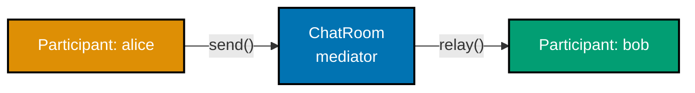

**`learning/code/ex-48-grasp-indirection-mediator/example.py`**

```python
"""Example 48: A Mediator Decouples Two Collaborators."""


class ChatRoom:  # => the MEDIATOR -- the ONLY object that knows about every Participant
    def __init__(self) -> None:  # => the constructor
        self._members: dict[str, "Participant"] = {}  # => name -> Participant, held HERE

    def register(self, participant: "Participant") -> None:  # => defines register()
        self._members[participant.name] = participant  # => the mediator learns about them

    def relay(self, sender: str, recipient: str, message: str) -> None:  # => defines relay()
        self._members[recipient].receive(sender, message)  # => the mediator looks up and delivers -- senders never do this themselves


class Participant:  # => a COLLABORATOR -- never holds a reference to another Participant
    def __init__(self, name: str, room: ChatRoom) -> None:  # => the constructor
        self.name = name  # => stores name on this instance
        self._room: ChatRoom = room  # => the ONLY collaborator this class ever references
        self.inbox: list[str] = []  # => messages this participant has received

    def send(self, recipient: str, message: str) -> None:  # => defines the send() method
        self._room.relay(self.name, recipient, message)  # => goes THROUGH the mediator, never directly to the recipient

    def receive(self, sender: str, message: str) -> None:  # => defines the receive() method
        self.inbox.append(f"{sender}: {message}")  # => records the delivered message


room: ChatRoom = ChatRoom()  # => constructs room
alice: Participant = Participant("alice", room)  # => alice holds ONLY a reference to room, never to bob
bob: Participant = Participant("bob", room)  # => bob holds ONLY a reference to room, never to alice
room.register(alice)  # => the mediator learns alice exists
room.register(bob)  # => the mediator learns bob exists

alice.send("bob", "hello")  # => routed THROUGH the mediator, not a direct alice -> bob call
print(bob.inbox)  # => the mediator delivered the message despite alice never touching bob
# => Output: ['alice: hello']
print(hasattr(alice, "bob") or "bob" in vars(alice))  # => alice holds no reference to bob at all
# => Output: False
# => Neither Participant ever references the other directly -- every interaction is routed through ChatRoom
```

**Run**: `python3 example.py`

**Output**:

```text
['alice: hello']
False
```

**`learning/code/ex-48-grasp-indirection-mediator/test_example.py`**

```python
"""Example 48: pytest verification for the Mediator Decoupling Two Collaborators."""

from example import ChatRoom, Participant


def test_message_is_delivered_through_the_mediator() -> None:
    room: ChatRoom = ChatRoom()
    alice: Participant = Participant("alice", room)
    bob: Participant = Participant("bob", room)
    room.register(alice)
    room.register(bob)
    alice.send("bob", "hello")
    assert bob.inbox == ["alice: hello"]  # => delivered despite no direct reference


def test_neither_participant_holds_a_reference_to_the_other() -> None:
    room: ChatRoom = ChatRoom()
    alice: Participant = Participant("alice", room)
    bob: Participant = Participant("bob", room)
    assert "bob" not in vars(alice).values()  # => alice's own attributes never name bob
    assert "alice" not in vars(bob).values()  # => bob's own attributes never name alice


# => Run: pytest -- Output: 2 passed
```

**Verify**: `pytest -q`

**Output**:

```text
2 passed
```

**Key takeaway**: Neither `Participant` ever references the other directly -- every interaction routes through `ChatRoom`, so `alice` and `bob` can each change independently without breaking the other.

**Why it matters**: Without a mediator, every pair of collaborating objects that need to interact directly creates a point-to-point reference, and a system with N objects that all need to talk to each other can accumulate up to N² such references. Routing every interaction through one mediator turns that into N references (each object to the mediator), trading a small amount of indirection for a large reduction in coupling.

---

### Example 49: Stabilizing an Unstable Vendor API Behind an Interface

_ex-49 &middot; exercises co-14_

GRASP's Protected Variations wraps a point of instability -- here, two payment vendors with completely different method shapes -- behind one stable `PaymentGateway` interface, so a vendor swap never touches client code. This example swaps `Checkout` from `StripeGateway` to `PaypalGateway` and confirms `Checkout` itself required zero edits.

**`learning/code/ex-49-grasp-protected-variations-interface/example.py`**

```python
"""Example 49: Stabilizing an Unstable Vendor API Behind an Interface."""

import abc  # => imports the abc module


class PaymentGateway(abc.ABC):  # => the STABLE interface -- protects Checkout from vendor churn
    @abc.abstractmethod
    def charge(self, cents: int) -> str:  # => no body -- required by every vendor adapter
        ...  # => the ellipsis stub -- concrete vendor adapters below fill this in


class StripeGateway(PaymentGateway):  # => wraps VENDOR A's own, unstable method shape
    def charge(self, cents: int) -> str:  # => defines the charge() method
        return self._stripe_create_charge(amount_cents=cents)  # => delegates to the vendor's OWN, unstable-shaped method

    def _stripe_create_charge(self, amount_cents: int) -> str:  # => Stripe's OWN naming/shape
        return f"stripe:charged {amount_cents} cents"  # => returns this value to the caller


class PaypalGateway(PaymentGateway):  # => wraps VENDOR B's DIFFERENTLY-shaped method entirely
    def charge(self, cents: int) -> str:  # => defines the charge() method
        dollars: float = cents / 100  # => Paypal's OWN API happens to want dollars, not cents
        return self._paypal_send_payment(dollars)  # => delegates to the vendor's OWN, differently-shaped method

    def _paypal_send_payment(self, dollars: float) -> str:  # => Paypal's OWN naming/shape
        return f"paypal:sent ${dollars:.2f}"  # => returns this value to the caller


class Checkout:  # => the CLIENT -- depends ONLY on PaymentGateway, never on a vendor by name
    def __init__(self, gateway: PaymentGateway) -> None:  # => the constructor
        self.gateway = gateway  # => held as the stable abstraction, swappable at construction

    def pay(self, cents: int) -> str:  # => defines the pay() method
        return self.gateway.charge(cents)  # => Checkout's OWN code never changes, ever


stripe_checkout: Checkout = Checkout(StripeGateway())  # => wired to vendor A
print(stripe_checkout.pay(500))  # => Checkout.pay() itself never mentions "stripe" anywhere
# => Output: stripe:charged 500 cents

paypal_checkout: Checkout = Checkout(PaypalGateway())  # => SWAPPED to vendor B, no Checkout edit
print(paypal_checkout.pay(500))  # => the SAME Checkout.pay() call-site, a different vendor underneath
# => Output: paypal:sent $5.00
# => Swapping StripeGateway for PaypalGateway required editing zero lines inside the Checkout class
```

**Run**: `python3 example.py`

**Output**:

```text
stripe:charged 500 cents
paypal:sent $5.00
```

**`learning/code/ex-49-grasp-protected-variations-interface/test_example.py`**

```python
"""Example 49: pytest verification for Protected Variations Behind an Interface."""

from example import Checkout, PaypalGateway, StripeGateway


def test_stripe_backed_checkout_charges_through_the_vendor_adapter() -> None:
    checkout: Checkout = Checkout(StripeGateway())
    assert checkout.pay(500) == "stripe:charged 500 cents"


def test_swapping_the_vendor_requires_no_checkout_class_changes() -> None:
    # => same Checkout class, same pay() call-site, only the injected gateway differs
    checkout: Checkout = Checkout(PaypalGateway())
    assert checkout.pay(500) == "paypal:sent $5.00"


# => Run: pytest -- Output: 2 passed
```

**Verify**: `pytest -q`

**Output**:

```text
2 passed
```

**Key takeaway**: Swapping `StripeGateway` for `PaypalGateway` required editing zero lines inside `Checkout` -- the interface absorbed both vendors' incompatible method shapes, insulating the client from either one's quirks.

**Why it matters**: Third-party APIs change, get deprecated, or need replacing for cost or compliance reasons on a timeline the client code doesn't control. Protected Variations means that inevitable churn is contained to one new adapter class implementing the stable interface, rather than a search-and-replace across every place `Checkout` (and everything that depends on it) is used.

---

### Example 50: A Two-Way Adapter Bridging Legacy and New Temperature APIs

_ex-50 &middot; exercises co-20_

Adapter converts one interface into another a client expects, without modifying either side -- and a single adapter class can satisfy both directions at once. This example bridges a Fahrenheit-only `LegacyThermometer` and a Celsius-only `NewThermometer`, with `TemperatureAdapter` exposing both `get_celsius()` and `get_fahrenheit()` regardless of which sensor it wraps.

**`learning/code/ex-50-adapter-two-way/example.py`**

```python
"""Example 50: A Two-Way Adapter Bridging Legacy and New Temperature APIs."""


class LegacyThermometer:  # => the OLD interface -- reports Fahrenheit, cannot be changed
    def __init__(self, fahrenheit: float) -> None:  # => the constructor
        self.fahrenheit = fahrenheit  # => stores fahrenheit on this instance

    def get_fahrenheit(self) -> float:  # => defines the get_fahrenheit() method
        return self.fahrenheit  # => returns this value to the caller


class NewThermometer:  # => the NEW interface -- reports Celsius, cannot be changed either
    def __init__(self, celsius: float) -> None:  # => the constructor
        self.celsius = celsius  # => stores celsius on this instance

    def get_celsius(self) -> float:  # => defines the get_celsius() method
        return self.celsius  # => returns this value to the caller


class TemperatureAdapter:  # => bridges BOTH directions -- neither original class was touched
    def __init__(self, legacy: LegacyThermometer | None = None, new: NewThermometer | None = None) -> None:  # => accepts EITHER side, wraps whichever one is provided
        self._legacy = legacy  # => stores legacy on this instance
        self._new = new  # => stores new on this instance

    def get_celsius(self) -> float:  # => the NEW-style method, works even when wrapping LEGACY
        if self._new is not None:  # => already Celsius -- pass it straight through
            return self._new.get_celsius()  # => returns this value to the caller
        assert self._legacy is not None  # => one of the two must always be set
        return (self._legacy.get_fahrenheit() - 32) * 5 / 9  # => converts F -> C on the fly

    def get_fahrenheit(self) -> float:  # => the LEGACY-style method, works even when wrapping NEW
        if self._legacy is not None:  # => already Fahrenheit -- pass it straight through
            return self._legacy.get_fahrenheit()  # => returns this value to the caller
        assert self._new is not None  # => one of the two must always be set
        return self._new.get_celsius() * 9 / 5 + 32  # => converts C -> F on the fly


legacy_to_new: TemperatureAdapter = TemperatureAdapter(legacy=LegacyThermometer(98.6))  # => wraps a LEGACY sensor for NEW-style callers
print(round(legacy_to_new.get_celsius(), 1))  # => the NEW-style method works on legacy data
# => Output: 37.0

new_to_legacy: TemperatureAdapter = TemperatureAdapter(new=NewThermometer(20.0))  # => wraps a NEW sensor for LEGACY-style callers
print(round(new_to_legacy.get_fahrenheit(), 1))  # => the LEGACY-style method works on new data
# => Output: 68.0
# => One adapter class satisfies BOTH APIs -- neither LegacyThermometer nor NewThermometer needed editing
```

**Run**: `python3 example.py`

**Output**:

```text
37.0
68.0
```

**`learning/code/ex-50-adapter-two-way/test_example.py`**

```python
"""Example 50: pytest verification for the Two-Way Temperature Adapter."""

from example import LegacyThermometer, NewThermometer, TemperatureAdapter


def test_legacy_wrapped_adapter_reports_celsius_via_the_new_interface() -> None:
    adapter: TemperatureAdapter = TemperatureAdapter(legacy=LegacyThermometer(98.6))
    assert round(adapter.get_celsius(), 1) == 37.0  # => 98.6F converted to C


def test_new_wrapped_adapter_reports_fahrenheit_via_the_legacy_interface() -> None:
    adapter: TemperatureAdapter = TemperatureAdapter(new=NewThermometer(20.0))
    assert round(adapter.get_fahrenheit(), 1) == 68.0  # => 20C converted to F


# => Run: pytest -- Output: 2 passed
```

**Verify**: `pytest -q`

**Output**:

```text
2 passed
```

**Key takeaway**: One `TemperatureAdapter` class satisfies both the legacy and the new API, converting in whichever direction is needed -- neither `LegacyThermometer` nor `NewThermometer` needed a single edit.

**Why it matters**: Migrations rarely happen atomically: a codebase transitioning from a legacy API to a new one usually needs both to interoperate for a period, sometimes with code on each side that cannot be touched (owned by another team, or simply out of scope). A two-way adapter lets old and new code call each other through whichever interface each side already expects, unblocking incremental migration instead of requiring a risky big-bang rewrite.

---

### Example 51: Stacking Retry + Cache + Log Decorators

_ex-51 &middot; exercises co-21_

Decorators compose: wrapping a `BaseFetcher` in `LoggingDecorator`, then `CachingDecorator`, then `RetryDecorator` builds a call chain where the composition order determines exactly which layers run on any given call. This example traces every layer's entry/exit on a cache miss, then shows a cache hit short-circuits everything wrapped inside the cache.

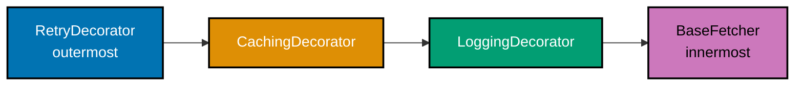

**`learning/code/ex-51-decorator-stacking/example.py`**

```python
"""Example 51: Stacking Retry + Cache + Log Decorators."""

from typing import Protocol  # => imports Protocol from typing


class Fetcher(Protocol):  # => the shared shape EVERY layer in the stack must match
    def __call__(self, key: str) -> str:  # => the shape every decorator must match
        ...  # => the ellipsis stub -- no implementation, just the contract


class BaseFetcher:  # => the innermost, REAL fetcher -- knows nothing about the wrappers
    def __init__(self, trace: list[str]) -> None:  # => the constructor
        self._trace: list[str] = trace  # => shared trace, so the example can OBSERVE order

    def __call__(self, key: str) -> str:  # => defines the __call__() method
        self._trace.append(f"fetch:{key}")  # => records that the REAL work happened
        return f"data-for-{key}"  # => returns this value to the caller


class LoggingDecorator:  # => the INNERMOST wrapper -- closest to BaseFetcher
    def __init__(self, inner: Fetcher, trace: list[str]) -> None:  # => the constructor
        self._inner: Fetcher = inner  # => the layer THIS decorator wraps
        self._trace: list[str] = trace  # => shared trace, so the example can OBSERVE order

    def __call__(self, key: str) -> str:  # => defines the __call__() method
        self._trace.append(f"log:enter:{key}")  # => runs BEFORE delegating inward
        result: str = self._inner(key)  # => delegates to the wrapped layer
        self._trace.append(f"log:exit:{key}")  # => runs AFTER delegating inward
        return result  # => returns this value to the caller


class CachingDecorator:  # => the MIDDLE wrapper -- can SKIP the inner layers entirely
    def __init__(self, inner: Fetcher, trace: list[str]) -> None:  # => the constructor
        self._inner: Fetcher = inner  # => the layer THIS decorator wraps
        self._trace: list[str] = trace  # => shared trace, so the example can OBSERVE order
        self._cache: dict[str, str] = {}  # => this layer's OWN state, invisible to the others

    def __call__(self, key: str) -> str:  # => defines the __call__() method
        if key in self._cache:  # => a cache HIT skips every layer wrapped by this one
            self._trace.append(f"cache:hit:{key}")  # => records the skip explicitly
            return self._cache[key]  # => returns this value to the caller
        self._trace.append(f"cache:miss:{key}")  # => records that inner layers WILL run
        result: str = self._inner(key)  # => only reached on a cache MISS
        self._cache[key] = result  # => stores the result for the NEXT call with this key
        return result  # => returns this value to the caller


class RetryDecorator:  # => the OUTERMOST wrapper -- what the caller actually calls
    def __init__(self, inner: Fetcher, trace: list[str], max_attempts: int = 3) -> None:  # => the constructor
        self._inner: Fetcher = inner  # => the layer THIS decorator wraps
        self._trace: list[str] = trace  # => shared trace, so the example can OBSERVE order
        self._max_attempts: int = max_attempts  # => stores max_attempts on this instance

    def __call__(self, key: str) -> str:  # => defines the __call__() method
        self._trace.append(f"retry:enter:{key}")  # => runs BEFORE delegating inward
        result: str = self._inner(key)  # => delegates through Cache -> Log -> Base
        self._trace.append(f"retry:exit:{key}")  # => runs AFTER delegating inward
        return result  # => returns this value to the caller


trace: list[str] = []  # => a shared list every layer appends to, in CALL order
base: BaseFetcher = BaseFetcher(trace)  # => constructs base
logged: LoggingDecorator = LoggingDecorator(base, trace)  # => wraps base -- innermost decorator
cached: CachingDecorator = CachingDecorator(logged, trace)  # => wraps logged -- middle decorator
stack: RetryDecorator = RetryDecorator(cached, trace)  # => wraps cached -- outermost decorator

first: str = stack("user-1")  # => a cache MISS -- every layer runs, in outer-to-inner order
print(first)  # => the value BaseFetcher actually produced
# => Output: data-for-user-1
print(trace)  # => confirms the exact outer -> inner -> outer call sequence
# => Output: ['retry:enter:user-1', 'cache:miss:user-1', 'log:enter:user-1', 'fetch:user-1', 'log:exit:user-1', 'retry:exit:user-1']

trace.clear()  # => resets the trace so the SECOND call's order is easy to read in isolation
stack("user-1")  # => a cache HIT -- Log and Base are SKIPPED entirely
print(trace)  # => the cache short-circuits everything wrapped INSIDE it
# => Output: ['retry:enter:user-1', 'cache:hit:user-1', 'retry:exit:user-1']
# => The composition order (Retry -> Cache -> Log -> Base) determines WHICH layers run on a cache hit
```

**Run**: `python3 example.py`

**Output**:

```text
data-for-user-1
['retry:enter:user-1', 'cache:miss:user-1', 'log:enter:user-1', 'fetch:user-1', 'log:exit:user-1', 'retry:exit:user-1']
['retry:enter:user-1', 'cache:hit:user-1', 'retry:exit:user-1']
```

**`learning/code/ex-51-decorator-stacking/test_example.py`**

```python
"""Example 51: pytest verification for Stacking Retry + Cache + Log Decorators."""

from example import BaseFetcher, CachingDecorator, LoggingDecorator, RetryDecorator


def test_cache_miss_runs_every_layer_in_outer_to_inner_order() -> None:
    trace: list[str] = []
    stack = RetryDecorator(CachingDecorator(LoggingDecorator(BaseFetcher(trace), trace), trace), trace)
    stack("k")
    assert trace == [
        "retry:enter:k",
        "cache:miss:k",
        "log:enter:k",
        "fetch:k",
        "log:exit:k",
        "retry:exit:k",
    ]


def test_cache_hit_skips_the_layers_wrapped_inside_the_cache() -> None:
    trace: list[str] = []
    stack = RetryDecorator(CachingDecorator(LoggingDecorator(BaseFetcher(trace), trace), trace), trace)
    stack("k")  # => first call -- populates the cache
    trace.clear()
    stack("k")  # => second call -- must hit the cache
    assert trace == ["retry:enter:k", "cache:hit:k", "retry:exit:k"]  # => log/base skipped


# => Run: pytest -- Output: 2 passed
```

**Verify**: `pytest -q`

**Output**:

```text
2 passed
```

**Key takeaway**: The composition order (Retry -> Cache -> Log -> Base) determines which layers run on a cache hit -- everything wrapped INSIDE the cache is skipped, everything wrapped OUTSIDE it still runs.

**Why it matters**: Stacking cross-cutting concerns like retry, caching, and logging as separate decorators, rather than tangled together inside one function, means each concern can be added, removed, or reordered independently. But the trace in this example also shows a real production gotcha: putting the cache inside the logger means every cache hit is silently unlogged -- a subtle behavior difference that only becomes visible once the composition order is made explicit like this.

---

### Example 52: Decorator Avoids the Subclass Explosion of Coffee Add-Ons

_ex-52 &middot; exercises co-21_

The classic argument for Decorator over inheritance: modeling coffee add-ons as subclasses needs a dedicated class per combination (`CoffeeWithMilk`, `CoffeeWithMilkAndSugar`, ...), while decorators compose freely at runtime, one wrapper class per add-on. This example shows both approaches producing the same price for one combination, then stacks decorators for a combination the subclass approach has no dedicated class for at all.

**`learning/code/ex-52-decorator-vs-inheritance/example.py`**

```python
"""Example 52: Decorator Avoids the Subclass Explosion of Coffee Add-Ons."""

import abc  # => imports the abc module


class Beverage(abc.ABC):  # => shared by BOTH the subclass version and the decorator version
    @abc.abstractmethod
    def cost(self) -> float:  # => no body -- required by every concrete beverage
        ...  # => the ellipsis stub -- concrete beverages below fill this in


class Coffee(Beverage):  # => the base drink, with no add-ons at all
    def cost(self) -> float:  # => defines the cost() method
        return 2.0  # => returns this value to the caller


# => THE SUBCLASS-EXPLOSION APPROACH: one class per COMBINATION of add-ons
class CoffeeWithMilk(Beverage):  # => covers ONLY the "milk alone" combination
    def cost(self) -> float:  # => defines the cost() method
        return 2.0 + 0.5  # => duplicates Coffee's base price PLUS one add-on's price

    # => a SECOND add-on (sugar) needs CoffeeWithSugar, AND CoffeeWithMilkAndSugar too --
    # => N independent add-ons need up to 2**N subclasses to cover every combination


# => THE DECORATOR APPROACH: one wrapper class PER add-on, composed at runtime
class BeverageDecorator(Beverage):  # => wraps ANY Beverage, itself IS-A Beverage too
    def __init__(self, wrapped: Beverage) -> None:  # => the constructor
        self._wrapped: Beverage = wrapped  # => the beverage (or ANOTHER decorator) being wrapped

    def cost(self) -> float:  # => defines the cost() method
        return self._wrapped.cost()  # => the base case -- subclasses below ADD to this


class MilkDecorator(BeverageDecorator):  # => adds ONE thing: milk's price, to WHATEVER it wraps
    def cost(self) -> float:  # => defines the cost() method
        return super().cost() + 0.5  # => delegates, then adds its own contribution


class SugarDecorator(BeverageDecorator):  # => adds ONE thing: sugar's price, to WHATEVER it wraps
    def cost(self) -> float:  # => defines the cost() method
        return super().cost() + 0.25  # => delegates, then adds its own contribution


exploded: Beverage = CoffeeWithMilk()  # => the subclass-explosion version, milk only
print(exploded.cost())  # => matches the decorator version below for THIS one combination
# => Output: 2.5

milk_only: Beverage = MilkDecorator(Coffee())  # => ONE decorator, composed at runtime
print(milk_only.cost())  # => the SAME result as CoffeeWithMilk, with no dedicated subclass
# => Output: 2.5

milk_and_sugar: Beverage = SugarDecorator(MilkDecorator(Coffee()))  # => TWO add-ons, STACKED -- no CoffeeWithMilkAndSugar class needed anywhere
print(milk_and_sugar.cost())  # => a combination the subclass approach would need a THIRD class for
# => Output: 2.75
# => N decorator classes cover EVERY combination of N add-ons -- the subclass approach needs up to 2**N classes
```

**Run**: `python3 example.py`

**Output**:

```text
2.5
2.5
2.75
```

**`learning/code/ex-52-decorator-vs-inheritance/test_example.py`**

```python
"""Example 52: pytest verification for Decorator vs the Subclass Explosion."""

from example import Coffee, CoffeeWithMilk, MilkDecorator, SugarDecorator


def test_decorator_matches_the_dedicated_subclass_for_one_add_on() -> None:
    assert MilkDecorator(Coffee()).cost() == CoffeeWithMilk().cost()


def test_stacking_two_decorators_needs_no_dedicated_combination_class() -> None:
    # => no "CoffeeWithMilkAndSugar" class exists anywhere in example.py
    combo = SugarDecorator(MilkDecorator(Coffee()))
    assert combo.cost() == 2.75


def test_three_decorators_stack_just_as_easily_as_two() -> None:
    # => proof this scales: a THIRD add-on needs one more wrapper class, not more combinations
    combo = SugarDecorator(MilkDecorator(SugarDecorator(Coffee())))
    assert combo.cost() == 3.0  # => 2.0 base + 0.25 + 0.5 + 0.25


# => Run: pytest -- Output: 3 passed
```

**Verify**: `pytest -q`

**Output**:

```text
3 passed
```

**Key takeaway**: N decorator classes cover every combination of N add-ons through composition; the subclass approach needs up to 2^N dedicated classes to cover the same ground.

**Why it matters**: `CoffeeWithMilk` alone is harmless, but the moment a second and third independent add-on need supporting, the subclass approach forces a choice between an exploding class count or giving up on some combinations. Decorator sidesteps the explosion entirely by making combination a runtime composition (which decorators you wrap something in) instead of a compile-time class hierarchy decision -- the exact tradeoff that makes Decorator the standard answer whenever "any subset of N independent behaviors" needs modeling.

---

### Example 53: Factory Method vs Abstract Factory, Contrasted on One Example

_ex-53 &middot; exercises co-16, co-17_

Factory Method and Abstract Factory both defer object creation, but they vary along different axes: Factory Method's `DocumentCreator` varies which single `Document` type a creator builds, while Abstract Factory's `SuiteFactory` varies an entire matched family of related products together. This example builds both on the same `Document`/`Toolbar` domain to make the axis each pattern solves concrete.

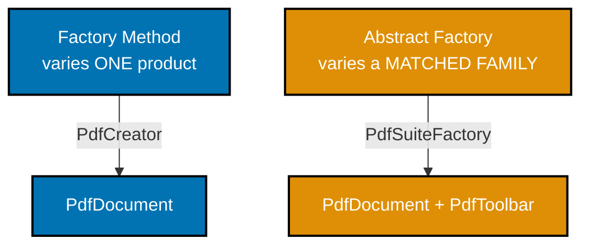

**`learning/code/ex-53-factory-method-vs-abstract-factory/example.py`**

```python
"""Example 53: Factory Method vs Abstract Factory, Contrasted on One Example."""

import abc  # => imports the abc module


class Document(abc.ABC):  # => the ONE product FACTORY METHOD varies
    @abc.abstractmethod  # => marks the next method as required for every subclass
    def kind(self) -> str:  # => no body -- required by every concrete document
        ...  # => the ellipsis stub -- concrete documents below fill this in


class PdfDocument(Document):  # => a CONCRETE product
    def kind(self) -> str:  # => defines the kind() method
        return "pdf"  # => returns this value to the caller


class WordDocument(Document):  # => a DIFFERENT concrete product, same axis of variation
    def kind(self) -> str:  # => defines the kind() method
        return "word"  # => returns this value to the caller


# => FACTORY METHOD: varies WHICH single product a creator method returns
class DocumentCreator(abc.ABC):  # => each subclass overrides ONE creation method
    @abc.abstractmethod  # => marks the next method as required for every subclass
    def create_document(self) -> Document:  # => no body -- required by every creator
        ...  # => the ellipsis stub -- concrete creators below fill this in

    def open_document(self) -> str:  # => the shared, NON-varying workflow around creation
        doc: Document = self.create_document()  # => the ONE varying step, deferred to subclasses
        return f"opened a {doc.kind()} document"  # => returns this value to the caller


class PdfCreator(DocumentCreator):  # => varies WHICH product create_document() returns
    def create_document(self) -> Document:  # => defines the create_document() method
        return PdfDocument()  # => returns this value to the caller


class WordCreator(DocumentCreator):  # => varies WHICH product create_document() returns
    def create_document(self) -> Document:  # => defines the create_document() method
        return WordDocument()  # => returns this value to the caller


# => ABSTRACT FACTORY: varies WHICH FAMILY of several related products are produced TOGETHER
class Toolbar(abc.ABC):  # => a SECOND product kind that must MATCH the chosen Document family
    @abc.abstractmethod  # => marks the next method as required for every subclass
    def kind(self) -> str:  # => no body -- required by every concrete toolbar
        ...  # => the ellipsis stub -- concrete toolbars below fill this in


class PdfToolbar(Toolbar):  # => belongs to the SAME family as PdfDocument
    def kind(self) -> str:  # => defines the kind() method
        return "pdf-toolbar"  # => returns this value to the caller


class WordToolbar(Toolbar):  # => belongs to the SAME family as WordDocument
    def kind(self) -> str:  # => defines the kind() method
        return "word-toolbar"  # => returns this value to the caller


class SuiteFactory(abc.ABC):  # => produces a MATCHED (Document, Toolbar) pair, together
    @abc.abstractmethod  # => marks the next method as required for every subclass
    def create_document(self) -> Document:  # => no body -- required by every suite
        ...  # => the ellipsis stub -- concrete suites below fill this in

    @abc.abstractmethod  # => marks the next method as required for every subclass
    def create_toolbar(self) -> Toolbar:  # => no body -- required by every suite
        ...  # => the ellipsis stub -- concrete suites below fill this in


class PdfSuiteFactory(SuiteFactory):  # => produces ONLY the PDF family, matched together
    def create_document(self) -> Document:  # => defines the create_document() method
        return PdfDocument()  # => returns this value to the caller

    def create_toolbar(self) -> Toolbar:  # => defines the create_toolbar() method
        return PdfToolbar()  # => returns this value to the caller


factory_method_result: str = PdfCreator().open_document()  # => varies ONE product
print(factory_method_result)  # => Factory Method solved "which single Document to build"
# => Output: opened a pdf document

suite: SuiteFactory = PdfSuiteFactory()  # => varies an ENTIRE matched family at once
family: tuple[str, str] = (
    suite.create_document().kind(),
    suite.create_toolbar().kind(),
)  # => BOTH products come from the SAME family, guaranteed
print(family)  # => Abstract Factory solved "which matched FAMILY of products to build"
# => Output: ('pdf', 'pdf-toolbar')
# => Factory Method varies ONE product; Abstract Factory varies a whole FAMILY of related products together
```

**Run**: `python3 example.py`

**Output**:

```text
opened a pdf document
('pdf', 'pdf-toolbar')
```

**`learning/code/ex-53-factory-method-vs-abstract-factory/test_example.py`**

```python
"""Example 53: pytest verification for Factory Method vs Abstract Factory."""

from example import PdfCreator, PdfSuiteFactory, WordCreator


def test_factory_method_varies_a_single_product() -> None:
    assert PdfCreator().open_document() == "opened a pdf document"
    assert WordCreator().open_document() == "opened a word document"


def test_abstract_factory_produces_a_matched_family_together() -> None:
    suite = PdfSuiteFactory()
    document_kind: str = suite.create_document().kind()
    toolbar_kind: str = suite.create_toolbar().kind()
    assert document_kind == "pdf"  # => both products
    assert toolbar_kind == "pdf-toolbar"  # => share the SAME family


# => Run: pytest -- Output: 2 passed
```

**Verify**: `pytest -q`

**Output**:

```text
2 passed
```

**Key takeaway**: Factory Method varies one product per creator subclass; Abstract Factory varies a whole matched family of related products through one factory -- the same "defer instantiation" idea applied at two different scopes.

**Why it matters**: Reaching for the wrong one of these costs real design complexity: using Abstract Factory when only one product ever varies adds unnecessary machinery, while using Factory Method when several related products must stay matched (as in Example 28's UI theme) risks accidentally mixing families. Seeing both solve the same `Document`/`Toolbar` domain side by side makes the actual decision criterion -- "does more than one related product need to vary together?" -- concrete instead of a rule memorized in the abstract.

---

### Example 54: The Same Pipeline as Template Method and as Strategy

_ex-54 &middot; exercises co-28, co-25_

Template Method and Strategy both let one varying step plug into a fixed algorithm skeleton, but they differ in when and how that step gets chosen: Template Method fixes it per subclass, at class-definition time; Strategy holds it as a swappable field, changeable on an existing instance at runtime. This example builds the identical clean-then-process-then-save pipeline both ways.

**`learning/code/ex-54-template-method-vs-strategy/example.py`**

```python
"""Example 54: The Same Pipeline as Template Method and as Strategy."""

import abc  # => imports the abc module
from typing import Protocol  # => imports Protocol from typing


# => TEMPLATE METHOD: the base class owns the SKELETON, subclasses fill named steps
class PipelineTemplate(abc.ABC):  # => defines the fixed ALGORITHM shape once
    def run(self, data: str) -> str:  # => the SKELETON -- never overridden by subclasses
        cleaned: str = data.strip()  # => a shared, non-varying step
        processed: str = self._process(cleaned)  # => the ONE varying step, deferred
        return f"saved:{processed}"  # => a shared, non-varying step

    @abc.abstractmethod
    def _process(self, cleaned: str) -> str:  # => no body -- required by every subclass
        ...  # => the ellipsis stub -- concrete pipelines below fill this in


class UppercasePipeline(PipelineTemplate):  # => FIXED at class-definition time
    def _process(self, cleaned: str) -> str:
        return cleaned.upper()  # => returns this value to the caller


class ReversePipeline(PipelineTemplate):  # => a DIFFERENT subclass, a DIFFERENT fixed behavior
    def _process(self, cleaned: str) -> str:
        return cleaned[::-1]  # => returns this value to the caller


# => STRATEGY: the SAME skeleton, but the varying step is an object held on ONE class
class ProcessingStrategy(Protocol):  # => the shape every strategy must match
    def __call__(self, cleaned: str) -> str:  # => the shape every strategy must match
        ...  # => the ellipsis stub -- no shared base class required at all


def uppercase_strategy(cleaned: str) -> str:  # => a PLAIN function, satisfies the Protocol
    return cleaned.upper()  # => returns this value to the caller


def reverse_strategy(cleaned: str) -> str:  # => a DIFFERENT plain function, same shape
    return cleaned[::-1]  # => returns this value to the caller


class PipelineWithStrategy:  # => ONE class -- the varying step is a swappable FIELD, not a subclass
    def __init__(self, strategy: ProcessingStrategy) -> None:  # => the constructor
        self.strategy = strategy  # => held as ordinary, REASSIGNABLE instance state

    def run(self, data: str) -> str:  # => the SAME skeleton shape as PipelineTemplate.run()
        cleaned: str = data.strip()  # => a shared, non-varying step
        processed: str = self.strategy(cleaned)  # => the varying step, called through the field
        return f"saved:{processed}"  # => a shared, non-varying step


template_result: str = UppercasePipeline().run("  hello  ")  # => FIXED at construction time
print(template_result)  # => choosing behavior means choosing a DIFFERENT subclass
# => Output: saved:HELLO

pipeline: PipelineWithStrategy = PipelineWithStrategy(uppercase_strategy)  # => ONE instance, starts uppercase
print(pipeline.run("  hello  "))  # => the SAME instance, uppercase behavior
# => Output: saved:HELLO

pipeline.strategy = reverse_strategy  # => swaps behavior at RUNTIME, no new instance, no subclass
print(pipeline.run("  hello  "))  # => the SAME instance, now reversed -- runtime swap, not construction
# => Output: saved:olleh
# => Strategy swaps behavior on an EXISTING instance at runtime; Template Method fixes it per SUBCLASS at construction
```

**Run**: `python3 example.py`

**Output**:

```text
saved:HELLO
saved:HELLO
saved:olleh
```

**`learning/code/ex-54-template-method-vs-strategy/test_example.py`**

```python
"""Example 54: pytest verification for Template Method vs Strategy."""

from example import (
    PipelineWithStrategy,
    ReversePipeline,
    UppercasePipeline,
    reverse_strategy,
    uppercase_strategy,
)


def test_template_method_behavior_is_fixed_per_subclass() -> None:
    assert UppercasePipeline().run("  hello  ") == "saved:HELLO"
    assert ReversePipeline().run("  hello  ") == "saved:olleh"


def test_strategy_swaps_behavior_at_runtime_on_one_instance() -> None:
    pipeline: PipelineWithStrategy = PipelineWithStrategy(uppercase_strategy)
    assert pipeline.run("  hello  ") == "saved:HELLO"
    pipeline.strategy = reverse_strategy  # => no new instance, no new subclass
    assert pipeline.run("  hello  ") == "saved:olleh"  # => same instance, new behavior


# => Run: pytest -- Output: 2 passed
```

**Verify**: `pytest -q`

**Output**:

```text
2 passed
```

**Key takeaway**: Strategy swaps behavior on an existing instance at runtime by reassigning a field; Template Method fixes behavior per subclass at construction time, requiring a different class to get a different behavior.

**Why it matters**: When behavior genuinely needs to change while a program is running -- feature flags, A/B tests, user-configurable processing -- Strategy's field-based swap is the natural fit, while Template Method's subclass-per-behavior model would require constructing a whole new object. Conversely, when the varying step is genuinely fixed for the object's lifetime and shares meaningful non-varying structure with its siblings, Template Method keeps that shared skeleton in one place instead of duplicating it across strategy functions.

---

### Example 55: Direct Observer vs a Decoupling Pub/Sub Broker

_ex-55 &middot; exercises co-26_

A direct `StockSubject` holds a typed `list[Observer]` and must import the `Observer` type to compile; a pub/sub `EventBroker` lets `StockPublisher` notify subscribers by string topic name, never importing or referencing any subscriber type at all. This example inspects both classes' constructor signatures to prove the broker version achieves strictly more decoupling.

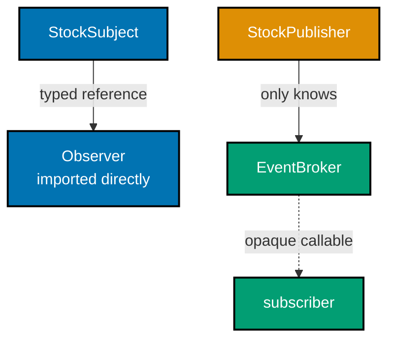

**`learning/code/ex-55-observer-vs-pubsub/example.py`**

```python
"""Example 55: Direct Observer vs a Decoupling Pub/Sub Broker."""

import abc  # => imports the abc module


# => DIRECT OBSERVER: the Subject holds CONCRETE Observer objects, and imports the type
class Observer(abc.ABC):  # => the Subject depends on THIS type directly
    @abc.abstractmethod
    def update(self, price: float) -> None:  # => no body -- required by every observer
        ...  # => the ellipsis stub -- concrete observers below fill this in


class StockSubject:  # => holds a list of Observer OBJECTS -- a direct, typed reference
    def __init__(self) -> None:  # => the constructor
        self._observers: list[Observer] = []  # => the Subject KNOWS the Observer type

    def attach(self, observer: Observer) -> None:  # => defines the attach() method
        self._observers.append(observer)  # => accepts only things typed as Observer

    def set_price(self, price: float) -> None:  # => defines the set_price() method
        for observer in self._observers:  # => notifies every attached Observer DIRECTLY
            observer.update(price)  # => calls a method on a CONCRETE type it imports


class PriceLogger(Observer):  # => a concrete Observer -- must satisfy the imported interface
    def __init__(self) -> None:  # => the constructor
        self.history: list[float] = []  # => stores history on this instance

    def update(self, price: float) -> None:  # => defines the update() method
        self.history.append(price)  # => records the update


# => PUB/SUB BROKER: the publisher never references Observer, or any subscriber type, at all
class EventBroker:  # => the ONLY thing that knows about subscriber CALLABLES
    def __init__(self) -> None:  # => the constructor
        self._subscribers: dict[str, list[object]] = {}  # => topic -> list of PLAIN callables

    def subscribe(self, topic: str, callback: object) -> None:  # => defines subscribe()
        self._subscribers.setdefault(topic, []).append(callback)  # => stores it opaquely

    def publish(self, topic: str, value: float) -> None:  # => defines the publish() method
        for callback in self._subscribers.get(topic, []):  # => calls each stored callable
            callback(value)  # type: ignore  # => a static checker can't verify a plain `object` is callable


class StockPublisher:  # => holds ONLY a reference to EventBroker -- no Observer import anywhere
    def __init__(self, broker: EventBroker) -> None:  # => the constructor
        self._broker: EventBroker = broker  # => the ONLY collaborator type this class knows

    def set_price(self, price: float) -> None:  # => defines the set_price() method
        self._broker.publish("stock.price", price)  # => the publisher names a STRING topic, never a subscriber type


direct_subject: StockSubject = StockSubject()  # => constructs direct_subject
logger: PriceLogger = PriceLogger()  # => constructs logger
direct_subject.attach(logger)  # => the Subject holds a TYPED reference to this exact Observer
direct_subject.set_price(101.5)  # => notifies through the direct, typed reference
print(logger.history)  # => the direct observer received the update
# => Output: [101.5]

broker: EventBroker = EventBroker()  # => constructs broker
received: list[float] = []  # => a plain list, not required to satisfy any Observer interface
broker.subscribe("stock.price", received.append)  # => subscribes a PLAIN method, no interface at all
publisher: StockPublisher = StockPublisher(broker)  # => the publisher never imports Observer
publisher.set_price(202.5)  # => routed entirely through string-keyed topics
print(received)  # => the pub/sub subscriber received the update too, with NO shared base class
# => Output: [202.5]
# => `StockPublisher` never imports or references any concrete subscriber type -- only `EventBroker`
```

**Run**: `python3 example.py`

**Output**:

```text
[101.5]
[202.5]
```

**`learning/code/ex-55-observer-vs-pubsub/test_example.py`**

```python
"""Example 55: pytest verification for Direct Observer vs a Pub/Sub Broker."""

import inspect

from example import EventBroker, PriceLogger, StockPublisher, StockSubject


def test_direct_observer_notifies_the_attached_observer() -> None:
    subject: StockSubject = StockSubject()
    logger: PriceLogger = PriceLogger()
    subject.attach(logger)
    subject.set_price(101.5)
    assert logger.history == [101.5]


def test_pubsub_publisher_notifies_a_plain_subscriber_callable() -> None:
    broker: EventBroker = EventBroker()
    received: list[float] = []
    broker.subscribe("stock.price", received.append)  # => no shared base class required
    StockPublisher(broker).set_price(202.5)
    assert received == [202.5]


def test_pubsub_publisher_never_references_the_observer_type() -> None:
    # => the added decoupling: StockPublisher's constructor signature names only
    # => EventBroker, never Observer -- unlike StockSubject.attach(), which requires it
    params = inspect.signature(StockPublisher.__init__).parameters
    annotations = [str(p.annotation) for p in params.values()]
    assert not any("Observer" in a for a in annotations)  # => StockPublisher's signature never names Observer
    attach_params = inspect.signature(StockSubject.attach).parameters
    attach_annotations = [str(p.annotation) for p in attach_params.values()]
    assert any("Observer" in a for a in attach_annotations)  # => StockSubject.attach() DOES require it directly


# => Run: pytest -- Output: 3 passed
```

**Verify**: `pytest -q`

**Output**:

```text
3 passed
```

**Key takeaway**: `StockPublisher` never imports or references any concrete subscriber type -- only `EventBroker` -- while `StockSubject.attach()` requires an `Observer` directly, a measurable, testable difference in coupling between the two designs.

**Why it matters**: The direct observer version is simpler and perfectly adequate when publisher and subscriber genuinely live in the same module or package. A pub/sub broker earns its extra indirection when publisher and subscriber need to live in different parts of a system -- different services, different teams, different deploy cadences -- where even a shared `Observer` base class would create an unwanted compile-time dependency between them.

---

### Example 56: Dependency Inversion Using an abc.ABC Abstract Base

_ex-56 &middot; exercises co-05_

Dependency Inversion means the high-level policy (`Notifier`) owns and depends only on an abstraction (`NotificationSender`), never on a concrete low-level detail -- and `abc.ABC` enforces that every concrete implementation of that abstraction is complete before it can even be constructed. This example swaps `Notifier`'s sender from `EmailSender` to `SmsSender` with zero edits to `Notifier`, then confirms an incomplete subclass missing `send()` cannot be instantiated at all.

**`learning/code/ex-56-dip-with-abc/example.py`**

```python
"""Example 56: Dependency Inversion Using an abc.ABC Abstract Base."""

import abc  # => imports the abc module


class NotificationSender(abc.ABC):  # => the ABSTRACTION -- owned by the HIGH-level policy
    @abc.abstractmethod
    def send(self, message: str) -> str:  # => no body -- required by every concrete sender
        ...  # => the ellipsis stub -- concrete senders below fill this in


class EmailSender(NotificationSender):  # => a LOW-level detail -- implements the abstraction
    def send(self, message: str) -> str:  # => defines the send() method
        return f"email: {message}"  # => returns this value to the caller


class SmsSender(NotificationSender):  # => a DIFFERENT low-level detail, same abstraction
    def send(self, message: str) -> str:  # => defines the send() method
        return f"sms: {message}"  # => returns this value to the caller


class IncompleteSender(NotificationSender):  # => deliberately OMITS send() -- for the next check
    pass  # => an intentionally empty body


class Notifier:  # => the HIGH-level policy -- depends ONLY on the abstraction, not on details
    def __init__(self, sender: NotificationSender) -> None:  # => the constructor
        self.sender = sender  # => held as the abstraction, never a concrete type

    def notify(self, message: str) -> str:  # => defines the notify() method
        return self.sender.send(message)  # => calls THROUGH the abstraction, never a detail


notifier: Notifier = Notifier(EmailSender())  # => wired to one concrete detail
print(notifier.notify("build failed"))  # => Notifier itself never mentions "email" anywhere
# => Output: email: build failed

notifier.sender = SmsSender()  # => SWAPPED to a different detail, no Notifier class edit
print(notifier.notify("build failed"))  # => the SAME notify() call-site, a different detail underneath
# => Output: sms: build failed

try:  # => the block below is expected to raise
    IncompleteSender()  # type: ignore  # => never implemented send() -- ABC blocks instantiation
except TypeError as exc:  # => catches the TypeError raised above
    print(type(exc).__name__)  # => confirms the exact exception type raised
# => Output: TypeError
# => `abc.ABC` enforces that every concrete subtype implements the FULL abstraction before it can even be constructed
```

**Run**: `python3 example.py`

**Output**:

```text
email: build failed
sms: build failed
TypeError
```

**`learning/code/ex-56-dip-with-abc/test_example.py`**

```python
"""Example 56: pytest verification for Dependency Inversion with abc.ABC."""

import pytest

from example import EmailSender, IncompleteSender, Notifier, SmsSender


def test_notifier_depends_only_on_the_abstraction() -> None:
    notifier: Notifier = Notifier(EmailSender())
    assert notifier.notify("build failed") == "email: build failed"
    notifier.sender = SmsSender()  # => swapped detail, no Notifier class edit
    assert notifier.notify("build failed") == "sms: build failed"


def test_incomplete_subclass_cannot_be_instantiated() -> None:
    with pytest.raises(TypeError):  # => missing send() -- ABC blocks construction
        IncompleteSender()  # type: ignore


# => Run: pytest -- Output: 2 passed
```

**Verify**: `pytest -q`

**Output**:

```text
2 passed
```

**Key takeaway**: `abc.ABC` enforces that every concrete subtype implements the full abstraction before it can even be constructed -- `IncompleteSender()` fails at instantiation time, not at some later, harder-to-trace call site.

**Why it matters**: Dependency Inversion's promise -- swap `EmailSender` for `SmsSender` with zero edits to `Notifier` -- only holds if every implementation genuinely honors the abstraction's full contract. `abc.ABC` turns "genuinely honors the contract" from a hoped-for convention into a construction-time guarantee, catching an incomplete implementation the moment someone tries to use it rather than the first time a caller happens to invoke the missing method.

---

### Example 57: Measuring Cohesion Before and After an SRP Split

_ex-57 &middot; exercises co-01, co-10_

A simplified LCOM-style metric -- what fraction of method pairs share at least one field -- makes "high cohesion" measurable instead of purely qualitative. This example computes that ratio for a mixed class touching both profile fields and email-sending fields, then recomputes it after splitting into two focused classes, confirming the ratio improves in both halves.

**`learning/code/ex-57-srp-cohesion-metric/example.py`**

```python
"""Example 57: Measuring Cohesion Before and After an SRP Split."""  # => module docstring

import itertools  # => imports itertools


def cohesion_ratio(methods_to_fields: dict[str, set[str]]) -> float:  # => parameter maps each method name to the fields it reads or writes
    # => a simplified LCOM-style metric: of every PAIR of methods, what fraction
    # => share at least one field? Higher means the methods genuinely belong together.
    methods: list[str] = list(methods_to_fields.keys())  # => every method name being measured
    pairs: list[tuple[str, str]] = list(itertools.combinations(methods, 2))  # => every UNORDERED pair of methods, once each
    if not pairs:  # => 0 or 1 methods -- nothing to compare, trivially cohesive
        return 1.0  # => returns this value to the caller
    sharing_pairs: int = sum(  # => builds a running total across every method pair computed above
        1  # => the per-pair contribution: one when the condition below holds, else skipped
        for a, b in pairs  # => iterates every unordered pair from the combinations computed above
        if methods_to_fields[a] & methods_to_fields[b]  # => True when the field sets overlap
    )  # => counts pairs that share at least one field
    return sharing_pairs / len(pairs)  # => returns this value to the caller


# => BEFORE: one God-ish class mixing profile concerns with email-sending concerns
before_split: dict[str, set[str]] = {  # => maps each method name to the fields it touches, BEFORE the SRP split
    "update_profile": {"name", "bio"},  # => touches profile fields only
    "get_display_name": {"name"},  # => touches profile fields only
    "send_welcome_email": {"email", "smtp_host"},  # => touches email-sending fields only
    "send_password_reset": {"email", "smtp_host"},  # => touches email-sending fields only
}
before_ratio: float = cohesion_ratio(before_split)  # => most pairs share NOTHING
print(round(before_ratio, 2))  # => only the two profile methods, and the two email methods, agree
# => Output: 0.33

# => AFTER: split into two smaller, individually MORE cohesive classes
profile_methods: dict[str, set[str]] = {  # => the profile-only methods, isolated into their own mapping
    "update_profile": {"name", "bio"},  # => the SAME two methods, isolated together
    "get_display_name": {"name"},  # => the SAME two methods, isolated together
}
email_methods: dict[str, set[str]] = {  # => the email-only methods, isolated into their own mapping
    "send_welcome_email": {"email", "smtp_host"},  # => the SAME two methods, isolated together
    "send_password_reset": {"email", "smtp_host"},  # => the SAME two methods, isolated together
}
profile_ratio: float = cohesion_ratio(profile_methods)  # => every remaining pair shares a field
email_ratio: float = cohesion_ratio(email_methods)  # => every remaining pair shares a field
print(round(profile_ratio, 2), round(email_ratio, 2))  # => both split classes are fully cohesive
# => Output: 1.0 1.0
# => Splitting the mixed class raised the methods-share-fields ratio from 0.33 to 1.0 in BOTH halves
```

**Run**: `python3 example.py`

**Output**:

```text
0.33
1.0 1.0
```

**`learning/code/ex-57-srp-cohesion-metric/test_example.py`**

```python
"""Example 57: pytest verification for the SRP Cohesion Metric."""

from example import cohesion_ratio


def test_mixed_class_has_a_low_cohesion_ratio() -> None:
    before_split: dict[str, set[str]] = {
        "update_profile": {"name", "bio"},
        "get_display_name": {"name"},
        "send_welcome_email": {"email", "smtp_host"},
        "send_password_reset": {"email", "smtp_host"},
    }
    ratio: float = cohesion_ratio(before_split)
    assert round(ratio, 2) == 0.33  # => only 2 of 6 possible pairs share a field


def test_split_classes_have_a_higher_cohesion_ratio() -> None:
    profile_methods: dict[str, set[str]] = {
        "update_profile": {"name", "bio"},
        "get_display_name": {"name"},
    }
    email_methods: dict[str, set[str]] = {
        "send_welcome_email": {"email", "smtp_host"},
        "send_password_reset": {"email", "smtp_host"},
    }
    profile_ratio: float = cohesion_ratio(profile_methods)
    email_ratio: float = cohesion_ratio(email_methods)
    assert profile_ratio == 1.0  # => strictly better than the mixed class's 0.33
    assert email_ratio == 1.0  # => strictly better than the mixed class's 0.33


def test_single_method_class_is_trivially_cohesive() -> None:
    assert cohesion_ratio({"only_method": {"field"}}) == 1.0  # => no pairs to disagree


# => Run: pytest -- Output: 3 passed
```

**Verify**: `pytest -q`

**Output**:

```text
3 passed
```

**Key takeaway**: Splitting the mixed class raised the methods-share-fields ratio from 0.33 to 1.0 in both halves -- cohesion is measurable, not just a design intuition to argue about.

**Why it matters**: "This class does too much" is a common code-review complaint that's easy to dismiss as subjective. A cohesion metric like this one -- closely related to the industry-standard LCOM (Lack of Cohesion of Methods) family of metrics -- turns that complaint into a number that improves or worsens with a refactor, giving teams an objective signal for when a class genuinely needs splitting versus when "it's a bit long" isn't actually a cohesion problem at all.

---

← Previous: [Beginner Examples](./beginner.md) &middot; Next: [Advanced Examples](./advanced.md) →
