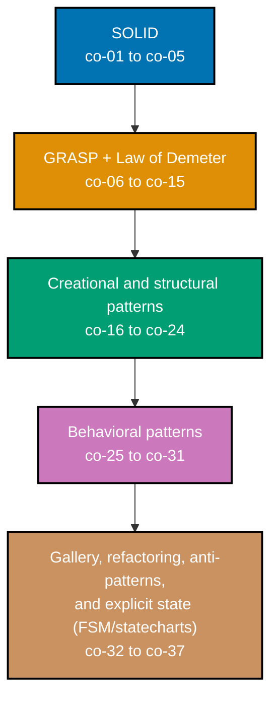

## Prerequisites

- **Prior topics**: [8 · Object-Oriented Programming Essentials](../../object-oriented-programming-essentials/learning/overview.md) -- this topic assumes you are already fluent with classes, `__init__`, inheritance, polymorphism, `@dataclass`, `abc.ABC`, and composition-over-inheritance from that topic, and builds a design vocabulary on top of those mechanics; [4 · Just Enough Python](../../just-enough-python/learning/overview.md) covers the base language syntax used throughout.
- **Tools & environment**: a macOS/Linux terminal; **Python 3.13.12**; `pytest` (9.1.1) installed for running every example's locking test. Every `example.py` in this topic is fully type-annotated (PEP 484): parameters, return types, and non-obvious local variables all carry explicit type hints, written to be clean under a strict static checker (`pyright --strict` / `mypy --strict` in spirit) -- the handful of deliberate exceptions demonstrate an error a static checker would correctly flag, and are marked `# type: ignore[...]` with an inline explanation.
- **Assumed knowledge**: writing Python classes; the difference between composition and inheritance; reading and writing a basic `pytest` test (topic 15 Software Testing helps but is not required).

## Why this exists -- the big idea

**The problem before the solution**: OO mechanics let you build classes; they don't stop you building a rigid tangle where every change ripples outward. Design is what keeps a growing system **soft** -- changeable without fear. **Keep this if you forget everything else**: depend on abstractions, not concretions, and put each responsibility where change is isolated -- most patterns below are just named tactics for that one move.

**Cross-cutting big ideas**: `coupling-vs-cohesion` -- the core lens this whole topic teaches you to see through: a well-shaped class is cohesive (its fields and methods genuinely belong together, co-10) and loosely coupled to the rest of the system (co-09), and nearly every principle and pattern below is a tactic for improving one or both. `abstraction-and-its-cost` -- an interface buys pluggability (co-05, co-25) but charges indirection; a pattern applied where no second variant exists or is imminent is that cost paid for nothing (see Tensions & Trade-offs). `taming-state` -- the State pattern (co-29) and the finite-state-machine rung (co-35-co-37) both replace implicit, scattered state (boolean flags, ad hoc `if` chains) with an explicit model where illegal combinations become unrepresentable.

**Scope note**: this topic is about designing well with the OO mechanics topic 8 already taught -- SOLID, coupling/cohesion, the nine GRASP patterns, the essential Gang-of-Four catalogue, and explicit state modeling (FSMs and statecharts). Domain modeling at scale, and patterns for coordinating whole subsystems, continue in later Domain-Driven Design and Software Architecture topics in this journey -- nothing here assumes you have read that material first.

## How verification works in this topic

Every one of this topic's 84 worked examples is a complete, self-contained `example.py` colocated under `learning/code/ex-NN-slug/`, runnable in isolation with `python3 example.py` -- its expected output is shown two ways: inline, as a `# => Output: ...` comment directly beneath the `print()` call that produces it, and as a captured, verbatim `python3 example.py` run in this page's **Output** block. Every example also ships a colocated `test_example.py`, verified with `pytest -q` and shown the same way. Nothing on the following pages is a description of what Python "should" do -- every claim was independently run against Python 3.13.12, and every code/test pair is fully type-annotated by hand to the standard a strict static checker would accept.

## Concepts

Every worked example in this topic's follow-up pages cites the `co-NN` concept it exercises -- this section is the 1:1 reference those citations point back to. Read it in order: SOLID first (the five principles that name what "good design" means at the class-and-interface level), then GRASP and the Law of Demeter (who should own a responsibility, and how narrowly collaborators should talk to each other), then the essential Gang-of-Four catalogue grouped by intent (creational, structural, behavioral), then the meta-skills that tie it together (recognizing the whole gallery, arriving at a pattern by refactoring under tests rather than up front, naming anti-patterns), and finally explicit state modeling (finite-state machines and Harel statecharts), which goes beyond the object-per-state State pattern from the behavioral group.

### co-01 &middot; Single-Responsibility Principle

A class should have one reason to change -- when parsing, formatting, and file I/O all live in one class, a change to any one of those concerns risks breaking the other two, and the class is hard to test in isolation. Splitting by reason-to-change (not by "one method per class") produces smaller units that are each individually easy to reason about, reuse, and test.

**Why it matters**: A class mixing concerns accumulates unrelated reasons to change over time -- a report calculator that also writes files must be edited (and re-tested) whenever the output format changes, even though its math never did. SRP is the entry point into every other principle below: a class that already does one thing is far easier to make substitutable (LSP), depend on abstractly (DIP), or slot behind an interface (strategy, decorator).

**Verify it**: Examples 1-2 split a god class and extract file-writing out of a calculator; Example 57 measures the cohesion improvement directly; Example 61 applies SRP (with information-expert) to decompose a god object; Example 70 places SRP as one seam of a five-principle order engine.

### co-02 &middot; Open-Closed Principle

A module should be open for extension but closed for modification -- you should be able to add new behavior without editing code that already works and is already tested. In practice this means routing variation through polymorphism (a new subclass, a new registered handler, a new strategy object) instead of adding another branch to an existing `if`/`elif` chain.

**Why it matters**: Every edit to already-working, already-tested code is a chance to break it -- OCP converts "add a feature" from "modify a risky central dispatcher" into "add a new, independently testable unit that plugs into a stable seam." This is the load-bearing principle behind Strategy, Factory Method, and plugin-style registries below.

**Verify it**: Examples 3-4 replace an `if`/`elif` discount chain with strategy objects and a plugin registry; Example 66 shows the opposite failure mode (a strategy applied where OCP was not yet needed); Examples 70, 77, 78, and 80 revisit OCP at increasing scale.

### co-03 &middot; Liskov Substitution Principle

Subtypes must be usable anywhere their base type is expected, without the caller needing to know which concrete subtype it received -- if code written against the base type breaks when handed a particular subtype, that subtype violates LSP no matter how clean its inheritance syntax looks. The classic trap is a subtype that narrows a method's precondition or throws where the base type promised it would not.

**Why it matters**: LSP is what makes polymorphism trustworthy -- a caller iterating over a list of a base type can call any base method on any element only if every subtype actually honors the base's contract. A subtype that "is-a" base type syntactically but not behaviorally turns every polymorphic call site into a hidden landmine.

**Verify it**: Example 5 reproduces the classic `Square(Rectangle)` violation and fixes it with separate types; Example 6 refactors a `fly()`-less `Ostrich(Bird)` so no `NotImplementedError` is reachable; Example 70 places LSP as a seam of the order engine; Example 72 writes a reusable contract-test suite every subtype must pass.

### co-04 &middot; Interface-Segregation Principle

Many small, role-specific interfaces beat one large interface that forces every implementer to support methods it doesn't need. A fat `Worker` interface that bundles `work()` and `eat()` forces a `Robot` to implement (or stub out) an `eat()` method that makes no sense for it.

**Why it matters**: A fat interface couples every implementer to every method any implementer might need, so a change to one role's method signature risks breaking implementers that never used that method. Splitting by role keeps each implementer depending only on what it actually calls.

**Verify it**: Examples 7-8 split a fat `Worker` interface and a `Printer-Scanner-Fax` interface into role-specific protocols; Example 70 places ISP as a seam of the order engine; Example 73 decomposes a fat service into fine `typing.Protocol` roles.

### co-05 &middot; Dependency-Inversion Principle

High-level policy should depend on abstractions, and low-level infrastructure should implement those abstractions -- not the other way around. A checkout service that directly imports and constructs `MySQLRepo` is coupled to a specific database; a checkout service that depends on a `Repository` protocol can be handed any implementation, including a fake one in tests.

**Why it matters**: Direct dependence on a concrete infrastructure class means every test of the high-level policy also has to stand up that infrastructure (a real database connection, a real HTTP client). Inverting the dependency -- policy owns the interface, infrastructure implements it -- makes the policy testable in isolation and the infrastructure swappable without touching policy code.

**Verify it**: Examples 9-10 invert a service's dependency on a concrete repository and a concrete `EmailSender`; Example 31 replaces a singleton with an injected dependency; Example 56 inverts via `abc.ABC`; Example 70 places DIP as a seam of the order engine; Example 74 wires a full ports-and-adapters boundary.

### co-06 &middot; GRASP -- Information Expert

Assign a responsibility to the class that already holds the data it needs to fulfill it -- if `Order` owns the list of line items, `Order` (not an external loop written elsewhere) should compute `order_total`. This is the single most load-bearing GRASP pattern: it is the default answer to "which class should this method live on?"

**Why it matters**: Putting a computation anywhere other than the class holding its data means every caller that needs the computation must first extract the raw data and duplicate the logic -- and every future change to that logic has to be found and updated in every duplicate. Information Expert collapses "where does this method go?" into a mechanical question: which class already has the fields this needs?

**Verify it**: Example 13 puts `order_total` directly on `Order`; Example 61 applies information-expert alongside SRP to decompose a god object; Example 63 spots an anemic model where a class's own data has no owning behavior; Example 71 places information-expert as one of nine GRASP seams in a full assignment.

### co-07 &middot; GRASP -- Creator

The class that aggregates, contains, or closely uses instances of B is the natural class to create B -- if `Order` owns its `OrderLine` objects, the method that constructs a new `OrderLine` belongs on `Order`, not scattered across every caller that wants to add a line.

**Why it matters**: Scattering construction logic across every call site duplicates whatever invariants the constructed object needs (defaults, validation, wiring) and makes those invariants easy to forget in one call site while remembering them in another. Creator collapses construction into one place, next to the data the created object depends on.

**Verify it**: Example 14 gives `Order` its own `add_line()` creation method for `OrderLine`; Example 71 places Creator as one of nine GRASP seams in a full assignment.

### co-08 &middot; GRASP -- Controller

Route system events (a UI click, an incoming request) through a dedicated coordinating object rather than letting the UI layer call domain objects directly. A `SessionController` receives the event and orchestrates the domain calls needed to handle it -- the UI never reaches past it into domain logic.

**Why it matters**: Without a controller, UI code and domain code become directly coupled -- every UI framework change risks touching domain logic, and every domain change risks touching UI code. A controller is a single, stable seam: swap the UI (web to CLI) or the domain implementation, and only the controller's wiring changes.

**Verify it**: Example 15 routes UI events through a single `SessionController`; Example 71 places Controller as one of nine GRASP seams in a full assignment.

### co-09 &middot; GRASP -- Low Coupling

Minimize the number and strength of dependencies between classes, so a change to one class stays local instead of rippling through every class that depends on it. Prefer an event, a callback, or an injected abstraction over a direct import and a direct call between two modules that don't otherwise need to know about each other.

**Why it matters**: A tightly coupled pair of modules cannot be changed, tested, or deployed independently -- editing one risks breaking the other, and testing one requires standing up the other. Low coupling is the property that composition-over-inheritance (co-33) and most GoF patterns below are ultimately in service of.

**Verify it**: Example 17 decouples two modules via an event instead of a direct call; Example 26 models a `Badge` via has-a instead of is-a; Example 58 converts a four-level inheritance hierarchy to composition; Example 71 places low-coupling as one of nine GRASP seams.

### co-10 &middot; GRASP -- High Cohesion

Keep a class's responsibilities focused and mutually related -- every method on the class should genuinely use the class's own fields, not just happen to be grouped there. A class whose methods barely touch each other's data is a candidate for splitting.

**Why it matters**: Low-cohesion classes are confusing to navigate (their methods don't tell a single coherent story) and resist reuse (you can rarely take "half" of a class's behavior without dragging the rest along). High cohesion is the twin lens to low coupling: cohesive within a class, loosely coupled between classes.

**Verify it**: Example 16 splits a mixed-concern module into cohesive units; Example 27 builds an immutable `Money` value object whose fields and equality logic are tightly related; Example 57 measures the methods-share-fields cohesion ratio directly; Example 71 places high-cohesion as one of nine GRASP seams.

### co-11 &middot; GRASP -- Polymorphism

When behavior varies by type, replace a type-switch (`if isinstance(x, A): ... elif isinstance(x, B): ...`) with polymorphic dispatch -- give each type its own implementation of a shared method, and let the runtime pick the right one. Adding a new type then means adding a new class, not editing an existing switch.

**Why it matters**: A type-switch is a standing OCP violation waiting to happen -- every new type requires finding and editing the switch, and it is easy to miss a branch. Polymorphic dispatch turns "did I handle every type?" into a question the type checker and the runtime both answer for you.

**Verify it**: Example 45 shows a plain function satisfying a `typing.Protocol` (structural polymorphism); Example 46 replaces a type-switch with polymorphic dispatch directly; Example 71 places polymorphism as one of nine GRASP seams.

### co-12 &middot; GRASP -- Pure Fabrication

When no domain concept cleanly owns a responsibility, invent a class that does not correspond to anything in the problem domain, purely to preserve cohesion and low coupling -- a `Repository` is not a business concept, but introducing one keeps persistence logic out of domain classes that would otherwise become both a business model and a database client.

**Why it matters**: Forcing every responsibility onto a "real" domain class produces domain classes that know about databases, HTTP, and file formats -- infrastructure concerns bleeding into business logic. A pure fabrication absorbs the infrastructure concern so the domain model stays about the domain.

**Verify it**: Example 47 introduces a `Repository` so the domain stays IO-free; Example 71 places pure fabrication as one of nine GRASP seams.

### co-13 &middot; GRASP -- Indirection

Insert an intermediate object (a mediator) to decouple two collaborators that would otherwise need to know about each other directly. Neither collaborator imports or references the other -- both only know the mediator.

**Why it matters**: Direct collaborator-to-collaborator references create the same rippling-change problem low coupling warns about, but indirection specifically names the fix: introduce a third object whose entire job is managing the relationship, so the two original objects can change independently of each other.

**Verify it**: Example 48 has a `Mediator` decouple two collaborators that never reference each other; Example 71 places indirection as one of nine GRASP seams.

### co-14 &middot; GRASP -- Protected Variations

Identify the point most likely to change (an unstable vendor API, a volatile external format) and wrap it behind a stable interface, so the instability cannot leak into the rest of the system. When the vendor API changes, only the wrapper's implementation changes -- every client of the stable interface is unaffected.

**Why it matters**: Without an insulating interface, a vendor API change (or a swap to a different vendor entirely) forces edits everywhere that API was called directly. A protected-variation boundary confines the blast radius of change to exactly one place.

**Verify it**: Example 49 stabilizes an unstable vendor API behind an interface; Example 71 places protected variations as one of nine GRASP seams; Example 74 applies the same idea at a whole-system scale via hexagonal ports.

### co-15 &middot; Law of Demeter

Talk only to your immediate collaborators -- avoid reaching through an object to command a third object it happens to hold a reference to (`a.get_b().get_c().do_x()`, the "train wreck"). Prefer "tell, don't ask": give the immediate collaborator a method that does the work, rather than asking it for its internals and doing the work yourself.

**Why it matters**: A train-wreck call couples the caller to the entire chain of internal structure between it and the final object -- any class in that chain changing its internal representation breaks the caller. Tell-don't-ask methods hide that internal structure behind one dot.

**Verify it**: Example 11 replaces a train-wreck call with a tell-don't-ask method; Example 12 has `customer.pay(amt)` replace direct access to `Wallet`.

### co-16 &middot; Factory Method

Defer instantiation to a dedicated creation method (or a small factory class) so callers ask for "a `Shape` of this kind" without importing or naming the concrete subclass directly. The factory owns the mapping from a request to a concrete type.

**Why it matters**: A caller that directly names a concrete class (`Circle()`) is coupled to that concrete class forever -- adding a new shape means finding and editing every call site that constructs shapes. A factory method centralizes that mapping in one place, so callers depend only on the abstract return type.

**Verify it**: Examples 18-19 build a `ShapeFactory` and a parser-construction factory keyed by extension; Example 53 contrasts factory method against abstract factory directly; Example 67 tours it alongside the other creational patterns; Example 80 uses it inside a cohesive multi-pattern redesign.

### co-17 &middot; Abstract Factory

A family of factory methods that together produce a matched set of related objects -- a dark-theme `WidgetFactory` and a light-theme `WidgetFactory` each produce a consistent button, checkbox, and window that all belong to the same theme. Swapping the factory swaps the entire family at once.

**Why it matters**: Without an abstract factory, swapping "which family of related objects to use" means finding and swapping every individual factory-method call site -- and risks silently mixing objects from two different families. An abstract factory guarantees the whole set stays consistent by construction.

**Verify it**: Example 28 swaps a whole dark/light widget family through one `WidgetFactory` interface; Example 53 contrasts it against factory method; Example 67 tours it alongside the other creational patterns.

### co-18 &middot; Builder

Assemble a complex object step by step through a fluent interface, instead of a constructor with a dozen optional parameters in a fixed order (a "telescoping constructor"). Each builder method sets one part and returns the builder, so optional parts can be included or omitted in any order, readably.

**Why it matters**: A telescoping constructor forces every caller to remember positional parameter order and to pass placeholder values for parts they don't need. A builder makes each part self-documenting by name and lets construction logic (validation, defaults) live in one place instead of being duplicated across call sites that each build the object by hand.

**Verify it**: Example 29 builds an HTTP request through a fluent `RequestBuilder`; Example 67 tours it alongside the other creational patterns.

### co-19 &middot; Singleton -- and Its Costs

Guarantee exactly one shared instance of a class, reachable globally -- and pay for it in testability: any test that touches the singleton's state can leak that state into the next test unless it is explicitly reset, and code that depends on the singleton cannot easily be tested with a different configuration. Singleton is the one pattern in this topic that is as much a warning as a recipe.

**Why it matters**: A singleton is global mutable state wearing a design-pattern name -- every hidden dependency on it is a hidden coupling that doesn't show up in any constructor signature, and every test that runs after a test which mutated it inherits that mutation unless something resets it. Dependency injection (co-05) solves the same "one shared thing" problem without the global-state cost.

**Verify it**: Example 30 builds a `Config` singleton and demonstrates the test-isolation pain directly; Example 31 replaces it with an injected dependency that a test can isolate without any global reset; Example 65 shows singleton abuse as hidden global coupling; Example 67 tours it alongside the other creational patterns.

### co-20 &middot; Adapter

Convert one interface into another that a client already expects, without modifying either the client or the class being adapted. A Fahrenheit-only sensor gets wrapped in an adapter that exposes a `read_celsius()` method, so client code written against Celsius never has to change.

**Why it matters**: Adapter lets two pieces of code that were never designed together interoperate without either one changing -- essential when you don't own one side (a third-party sensor, a legacy API) or don't want to touch code that already has its own tests and callers.

**Verify it**: Example 22 adapts a Fahrenheit sensor to a Celsius interface; Example 50 builds a two-way adapter bridging a legacy and a new API; Example 68 tours it alongside the other structural patterns.

### co-21 &middot; Decorator

Wrap an object to add behavior around it (logging, caching, retrying) without editing the wrapped object's class and without the subclass explosion that would result from a subclass for every combination of add-ons. Decorators compose: stacking three decorators applies all three, in the order they were applied.

**Why it matters**: If N independent add-ons were each modeled as a subclass, combining all of them would require up to 2^N subclasses (one per combination). Decorator turns "which combination of add-ons" into "which decorators did I wrap this in," addable and removable independently, with the original class untouched.

**Verify it**: Example 23 wraps a service call in a logging decorator; Examples 51-52 stack retry+cache+log decorators and contrast decorator against the 2^N subclass explosion directly; Example 68 tours it alongside the other structural patterns; Example 79 contrasts a GoF class decorator against Python's native `functools`-based function decorator; Example 80 uses it inside a cohesive multi-pattern redesign.

### co-22 &middot; Facade

Provide one simplified entry point over a complex subsystem of several collaborating classes, so a caller makes one call instead of orchestrating inventory, payment, and shipping itself. The facade does not hide the subsystem's classes from callers who need finer control -- it just gives most callers a simple default path.

**Why it matters**: Without a facade, every caller that needs "checkout" has to know and correctly sequence every subsystem it depends on -- inventory, payment, shipping -- and any change to that sequence has to be found and updated in every caller. A facade centralizes the sequencing once.

**Verify it**: Example 24 hides inventory, payment, and shipping behind one `CheckoutFacade` call; Example 68 tours it alongside the other structural patterns.

### co-23 &middot; Composite

Treat individual objects and compositions of objects uniformly through one shared interface -- a `File` and a `Directory` (which contains `File`s and other `Directory`s) both expose `size()`, so a caller computing a total does not need to know whether it is looking at a leaf or a group. Composite is the pattern that makes recursive tree structures easy to consume.

**Why it matters**: Without a shared interface, a caller must special-case "is this a leaf or a group?" at every level of a tree, and that special-casing is duplicated at every call site that walks the tree. Composite pushes the recursion into the objects themselves, so the caller just calls one method.

**Verify it**: Example 34 computes a recursive file-tree total through one `size()` interface; Example 35 renders nested menu items where leaf and group share `render()`; Example 68 tours it alongside the other structural patterns; Example 76 groups several commands into one atomically-undoable composite macro command.

### co-24 &middot; Proxy

A stand-in object that controls access to a real subject -- deferring an expensive operation until it is actually needed (a virtual proxy), checking permission before delegating (a protection proxy), or standing in for an object that lives elsewhere (a remote proxy). The client talks to the proxy exactly as if it were the real subject.

**Why it matters**: Loading an expensive resource (a large image, a remote connection) eagerly wastes work whenever the resource ends up unused; checking permission inline at every call site duplicates the check and risks a forgotten one. A proxy centralizes the deferred-loading or access-control logic in one place, transparent to the caller.

**Verify it**: Example 32 defers an expensive image load to first access via a virtual proxy; Example 33 blocks an unauthorized call via a protection proxy; Example 68 tours it alongside the other structural patterns.

### co-25 &middot; Strategy

Encapsulate a family of interchangeable algorithms behind one common interface, so the algorithm used at a call site can be swapped -- at construction time or at runtime -- without touching the code that uses it. A sort key, a discount calculation, and a pricing rule are all naturally modeled as swappable strategies.

**Why it matters**: An `if`/`elif` chain selecting behavior by type or flag has to be edited every time a new option is added (an OCP violation); a strategy family lets a new option be added as a new class or function that plugs into the existing call site untouched. Strategy is the single most common tactic for satisfying OCP.

**Verify it**: Examples 3, 20, and 45 build discount strategies, a pluggable sort key, and a protocol-based strategy; Example 54 contrasts strategy's runtime swap against template method's fixed skeleton; Example 59 arrives at strategy by refactoring an embedded `if`-chain under tests; Example 69 tours it alongside the other behavioral patterns; Example 77 builds a registry-driven plugin strategy system; Example 80 uses it inside a cohesive multi-pattern redesign.

### co-26 &middot; Observer

A subject notifies a list of subscribers when something changes, without knowing anything concrete about who is subscribed -- adding a new subscriber never requires editing the subject (or the subjects that already publish). This is the same OCP move as strategy, applied to "who reacts to this event" instead of "which algorithm runs."

**Why it matters**: Without observer, a subject that needs to notify N different kinds of interested code ends up with N hard-coded calls baked into it, each one an edit point whenever a new interested party appears. Observer inverts that: interested parties register themselves, and the subject stays unaware of how many, or which kinds, of subscribers exist.

**Verify it**: Example 21 notifies newsletter subscribers on `publish()` with zero publisher edits per new subscriber; Example 44 builds a typed event bus with unsubscribe; Example 55 contrasts direct observer against a decoupling broker/pub-sub version; Example 69 tours it alongside the other behavioral patterns; Example 75 fixes an observer memory leak with `weakref`; Example 80 uses it inside a cohesive multi-pattern redesign.

### co-27 &middot; Command

Reify a request as an object with an `execute()` (and often an `undo()`) method, instead of a bare function call -- once a request is an object, it can be queued, logged, undone, or grouped with other commands, none of which a bare function call supports directly.

**Why it matters**: A direct function call happens immediately and leaves nothing behind to inspect, replay, or reverse. Turning the request into an object opens up an entire class of features -- undo stacks, deferred/batched execution, audit logs -- that a bare call cannot support without the caller inventing its own bookkeeping every time.

**Verify it**: Example 36 reverses the last command via `undo()`; Example 37 queues commands for deferred batch execution, preserving order; Example 69 tours it alongside the other behavioral patterns; Example 76 groups several commands into one atomically-undoable composite macro command.

### co-28 &middot; Template Method

A base class defines the fixed skeleton of an algorithm as a sequence of steps, and subclasses fill in the steps that vary -- the shared flow (open, process, close) lives in exactly one place (the base class), while each subclass only supplies the step-specific logic.

**Why it matters**: Without a template method, every subclass that needs a variant of the same overall flow has to re-implement (and keep in sync) the shared parts of that flow -- a bug fix to the shared logic has to be copied into every duplicate. Template method guarantees the shared flow is defined exactly once.

**Verify it**: Example 25 builds a report whose shared flow is defined once in a base class; Example 54 contrasts template method's fixed skeleton against strategy's runtime-swappable algorithm; Example 69 tours it alongside the other behavioral patterns.

### co-29 &middot; State

Represent each state of an object as its own class (or object), so transitions and legal moves become explicit method calls rather than an implicit tangle of boolean flags and conditionals. A vending machine or traffic light modeled this way rejects illegal transitions by construction, because the current state object simply does not offer the method for an illegal move.

**Why it matters**: A boolean-flag implementation of state (`is_paid`, `is_shipped`, `is_cancelled`, all independently settable) allows combinations that should never exist (shipped-but-not-paid) -- nothing in the code prevents it. Modeling states as objects makes the current state, and the set of legal next states, explicit and checkable.

**Verify it**: Example 38 rejects an illegal vending-machine transition; Example 39 cycles a traffic light red to green to yellow; Example 60 arrives at the state pattern by refactoring boolean-flag soup under tests; Example 69 tours it alongside the other behavioral patterns. The transition-table and statechart rung (co-35-co-37) goes further than the object-per-state form taught here.

### co-30 &middot; Iterator

Expose sequential access to a collection's elements without revealing how the collection is represented internally -- a `for` loop over a custom tree structure yields values in order without the caller ever seeing the tree's node layout, and an iterator over a paginated API can fetch each page lazily, only when the caller actually asks for the next element.

**Why it matters**: Without an iterator protocol, every caller that wants to walk a custom structure has to know (and duplicate) its internal representation. An iterator hides that representation behind a uniform `for`-loop interface, and a lazy iterator additionally avoids doing work (or making a network call) for elements the caller never actually reaches.

**Verify it**: Example 40 implements `__iter__` for an in-order tree walk; Example 41 lazily pages a simulated remote API, fetching pages only on demand; Example 69 tours it alongside the other behavioral patterns.

### co-31 &middot; Chain of Responsibility

Pass a request along a chain of handlers until one of them handles it, without the sender knowing in advance which handler will. Each handler decides independently whether to handle the request or pass it to the next handler in the chain.

**Why it matters**: A single handler with a large `if`/`elif` covering every case is an OCP violation waiting to happen -- every new case means editing that handler. A chain lets each case live in its own handler, addable to the chain without touching the handlers already there, and a validation pipeline built this way stops cleanly at the first failure.

**Verify it**: Example 42 escalates an unhandled support ticket to the next handler in the chain; Example 43 stops a validation pipeline at the first failure; Example 69 tours it alongside the other behavioral patterns.

### co-32 &middot; GoF Pattern Gallery

Recognizing all 23 Gang-of-Four patterns by the intent they serve, grouped into three families: **creational** (how objects get built -- factory method, abstract factory, builder, singleton), **structural** (how objects are composed -- adapter, decorator, facade, composite, proxy), and **behavioral** (how objects communicate and share responsibility -- strategy, observer, command, template method, state, iterator, chain of responsibility, among others). This topic teaches the essential subset most likely to earn their place in a real codebase.

**Why it matters**: A named pattern is a shared vocabulary -- saying "this needs a strategy" communicates an entire design shape to another engineer in three words, instead of re-explaining the mechanism from scratch every time. Recognizing which family a problem belongs to (creation, structure, or behavior) narrows the search for the right tactic quickly.

**Verify it**: Examples 67-69 tour the essential creational, structural, and behavioral patterns from this topic in three dedicated gallery examples, each constructing/wrapping/dispatching correctly.

### co-33 &middot; Refactor to Pattern

Arrive at a pattern by relieving a real, currently-felt smell under a test suite that stays green through every step -- not by choosing a pattern up front and building toward it speculatively. The tests that pin current behavior before the refactor are what make each step verifiably safe.

**Why it matters**: A pattern applied speculatively, before the second variant that would justify it exists, is pure ceremony (see Tensions & Trade-offs, and co-34's premature-abstraction anti-pattern). A pattern arrived at by refactoring a smell that is already causing pain, kept green under tests the whole way, is earned complexity -- justified by a problem that is actually present, not merely anticipated.

**Verify it**: Examples 58-61 refactor inheritance to composition, an `if`-chain to strategy, boolean-flag soup to state, and a god object to distributed responsibilities -- each keeping its test suite green throughout; Example 84 revisits the flag-to-FSM refactor from the state-machine side.

### co-34 &middot; Anti-Pattern Recognition

Name the recurring failure shapes so they can be spotted before they compound: the **god object** (one class doing everything), the **anemic domain model** (data classes with all behavior pulled into a separate service, so the "object" in object-oriented is data-only), **yo-yo inheritance** (understanding a class requires jumping up and down a deep hierarchy), **singleton abuse** (hidden global coupling), and **premature abstraction** (a pattern applied for a variant that doesn't exist yet).

**Why it matters**: Naming a smell is the first step to fixing it -- "this is a god object" turns a vague feeling that a class is unwieldy into an actionable diagnosis (apply SRP and information-expert) with a known target shape. Anti-patterns are also a check on the patterns above: applying a pattern to relieve a real smell is design; applying one where no smell exists yet is itself a smell (premature abstraction).

**Verify it**: Examples 62-66 name and diagnose a god object, an anemic domain model, yo-yo inheritance, singleton abuse, and premature abstraction, each with a sketched or executed fix; Example 78 practices the judgment call -- pattern or not -- across three scenarios.

### co-35 &middot; Finite-State-Machine Modeling

Model a feature's lifecycle as an explicit finite-state machine: a fixed set of states, an alphabet of events, and a transition function from (state, event) to the next state. A transition table makes every legal move explicit and, critically, makes every illegal move unrepresentable -- the table simply has no entry for it, rather than relying on scattered `if` guards to catch it. This goes beyond the object-per-state form of the State pattern (co-29): the table is the single source of truth for the whole machine's legal moves, inspectable in one place.

**Why it matters**: A boolean-flag model of lifecycle state (co-29's motivating problem) allows illegal combinations because nothing enumerates the legal ones; a transition table enumerates every legal (state, event) pair explicitly, so an illegal one is rejected by lookup rather than by a conditional someone had to remember to write.

**Verify it**: Example 81 models an order lifecycle (created to paid to shipped to delivered, or cancelled) as an explicit transition table and verifies an illegal event in a given state is rejected by the table itself; Example 84 contrasts this table-driven FSM directly against the boolean-flag version it replaces.

### co-36 &middot; Statecharts and Hierarchical States

Harel statecharts (1987) extend flat finite-state machines with nested/hierarchical states, orthogonal (parallel) regions, guards, and entry/exit actions -- the model implemented by XState (current major version 5, terminology: states, events, guards, actions, actors). A flat FSM suffers a combinatorial explosion of states as independent concerns (playback mode, volume level) are added; a statechart lets one parent state (`Playing`) hold nested substates (`Normal`, `Shuffle`) and share a single parent-level transition across all of them, taming that explosion.

**Why it matters**: A flat FSM modeling two independent concerns (say, three playback modes times four volume levels) needs a state for every combination -- twelve states for two three/four-valued concerns, growing multiplicatively as concerns are added. Hierarchical and orthogonal states let each concern be modeled with its own small number of states, composed rather than multiplied.

**Verify it**: Example 82 models a media player with a parent `Playing` state holding nested `Normal`/`Shuffle` substates plus an orthogonal volume region, and verifies a nested-state event is handled while the parent's shared transition still applies to every substate.

### co-37 &middot; Guards and Entry/Exit Actions

A **guard** is a boolean condition that gates whether a transition is allowed to fire at all (e.g. `ship` only succeeds if `paid` is true); **entry** and **exit actions** are side effects that run automatically when a state is entered or left (logging on enter, releasing a lock on exit), keeping side effects anchored at state boundaries instead of scattered through ad hoc transition logic.

**Why it matters**: Without guards, an FSM's transition table can only say "this event moves to that state," with no way to express "only if some additional condition holds" -- that condition ends up bolted on as an external `if` before the transition call, easy to forget at one call site while remembering it at another. Without entry/exit actions, side effects get duplicated at every place a transition into (or out of) a state can happen; anchoring them to the state boundary guarantees they fire exactly once per crossing, regardless of which event triggered it.

**Verify it**: Example 83 adds a `paid`-checking guard and log-on-enter/release-lock-on-exit actions to the order FSM, and verifies the guard blocks an unpaid `ship` while each action fires exactly once per state crossing.

## Tensions & trade-offs -- when NOT to reach for this

- **Pattern vs. YAGNI**: a strategy or factory earns its indirection only when a second variant exists or is imminent; applied to a single case, it is speculative generality -- extra classes hiding straight-line logic behind ceremony (Example 66, Example 78).
- **Inheritance vs. composition**: inheritance couples a subclass to its superclass's internals (the fragile base class); reach for it only for genuine substitutable is-a hierarchies (co-03), and prefer composition otherwise -- the default, not the fallback (Example 58).
- **When NOT to use it**: a small script, a one-off, or a stable spec with no real axis of change. SOLID and patterns are insurance against change; insurance you don't need is pure cost, and over-applied they make a codebase harder to read, not easier.

## Examples by Level

### Beginner (Examples 1–27)

- [Example 1: Split a God Class by Responsibility](/en/c/learn/fundamentally-strong/software-engineer/object-oriented-design-and-patterns/learning/beginner#example-1-split-a-god-class-by-responsibility)
- [Example 2: Extract the Report Writer from the Calculator](/en/c/learn/fundamentally-strong/software-engineer/object-oriented-design-and-patterns/learning/beginner#example-2-extract-the-report-writer-from-the-calculator)
- [Example 3: Replace an If/Elif Chain with Strategy Objects](/en/c/learn/fundamentally-strong/software-engineer/object-oriented-design-and-patterns/learning/beginner#example-3-replace-an-ifelif-chain-with-strategy-objects)
- [Example 4: Extend Behavior via a Plugin Registry](/en/c/learn/fundamentally-strong/software-engineer/object-oriented-design-and-patterns/learning/beginner#example-4-extend-behavior-via-a-plugin-registry)
- [Example 5: Square(Rectangle) Breaks Liskov Substitution](/en/c/learn/fundamentally-strong/software-engineer/object-oriented-design-and-patterns/learning/beginner#example-5-squarerectangle-breaks-liskov-substitution)
- [Example 6: Refactor an Ostrich That Cannot Fly](/en/c/learn/fundamentally-strong/software-engineer/object-oriented-design-and-patterns/learning/beginner#example-6-refactor-an-ostrich-that-cannot-fly)
- [Example 7: Split a Fat Worker Interface](/en/c/learn/fundamentally-strong/software-engineer/object-oriented-design-and-patterns/learning/beginner#example-7-split-a-fat-worker-interface)
- [Example 8: Break a Fat Interface into Role Protocols](/en/c/learn/fundamentally-strong/software-engineer/object-oriented-design-and-patterns/learning/beginner#example-8-break-a-fat-interface-into-role-protocols)
- [Example 9: Invert a Service to Depend on a Repository Protocol](/en/c/learn/fundamentally-strong/software-engineer/object-oriented-design-and-patterns/learning/beginner#example-9-invert-a-service-to-depend-on-a-repository-protocol)
- [Example 10: Depend on a Notifier Protocol, Not a Concrete Sender](/en/c/learn/fundamentally-strong/software-engineer/object-oriented-design-and-patterns/learning/beginner#example-10-depend-on-a-notifier-protocol-not-a-concrete-sender)
- [Example 11: Replace a Train Wreck with Tell, Don't Ask](/en/c/learn/fundamentally-strong/software-engineer/object-oriented-design-and-patterns/learning/beginner#example-11-replace-a-train-wreck-with-tell-dont-ask)
- [Example 12: Pay Through the Customer, Not the Wallet](/en/c/learn/fundamentally-strong/software-engineer/object-oriented-design-and-patterns/learning/beginner#example-12-pay-through-the-customer-not-the-wallet)
- [Example 13: Information Expert: Order Owns Its Total](/en/c/learn/fundamentally-strong/software-engineer/object-oriented-design-and-patterns/learning/beginner#example-13-information-expert-order-owns-its-total)
- [Example 14: Creator: Order Creates Its Own OrderLine](/en/c/learn/fundamentally-strong/software-engineer/object-oriented-design-and-patterns/learning/beginner#example-14-creator-order-creates-its-own-orderline)
- [Example 15: Controller: Route Events Through a Session Controller](/en/c/learn/fundamentally-strong/software-engineer/object-oriented-design-and-patterns/learning/beginner#example-15-controller-route-events-through-a-session-controller)
- [Example 16: High Cohesion: Split a Mixed-Concern Class](/en/c/learn/fundamentally-strong/software-engineer/object-oriented-design-and-patterns/learning/beginner#example-16-high-cohesion-split-a-mixed-concern-class)
- [Example 17: Low Coupling: Decouple via an Event Bus](/en/c/learn/fundamentally-strong/software-engineer/object-oriented-design-and-patterns/learning/beginner#example-17-low-coupling-decouple-via-an-event-bus)
- [Example 18: Factory Method: ShapeFactory Hides Concrete Types](/en/c/learn/fundamentally-strong/software-engineer/object-oriented-design-and-patterns/learning/beginner#example-18-factory-method-shapefactory-hides-concrete-types)
- [Example 19: Simple Factory: Centralize Parser Construction](/en/c/learn/fundamentally-strong/software-engineer/object-oriented-design-and-patterns/learning/beginner#example-19-simple-factory-centralize-parser-construction)
- [Example 20: Strategy: A Pluggable Sort Key](/en/c/learn/fundamentally-strong/software-engineer/object-oriented-design-and-patterns/learning/beginner#example-20-strategy-a-pluggable-sort-key)
- [Example 21: Observer: Notify Subscribers on Publish](/en/c/learn/fundamentally-strong/software-engineer/object-oriented-design-and-patterns/learning/beginner#example-21-observer-notify-subscribers-on-publish)
- [Example 22: Adapter: Fahrenheit Sensor to Celsius Interface](/en/c/learn/fundamentally-strong/software-engineer/object-oriented-design-and-patterns/learning/beginner#example-22-adapter-fahrenheit-sensor-to-celsius-interface)
- [Example 23: Decorator: Log a Service Call Without Editing It](/en/c/learn/fundamentally-strong/software-engineer/object-oriented-design-and-patterns/learning/beginner#example-23-decorator-log-a-service-call-without-editing-it)
- [Example 24: Facade: One Call Hides Three Subsystems](/en/c/learn/fundamentally-strong/software-engineer/object-oriented-design-and-patterns/learning/beginner#example-24-facade-one-call-hides-three-subsystems)
- [Example 25: Template Method: One Skeleton, Many Subclasses](/en/c/learn/fundamentally-strong/software-engineer/object-oriented-design-and-patterns/learning/beginner#example-25-template-method-one-skeleton-many-subclasses)
- [Example 26: Composition Over Inheritance: Model a Badge as Has-A](/en/c/learn/fundamentally-strong/software-engineer/object-oriented-design-and-patterns/learning/beginner#example-26-composition-over-inheritance-model-a-badge-as-has-a)
- [Example 27: Value Object: Immutable Money with Value Equality](/en/c/learn/fundamentally-strong/software-engineer/object-oriented-design-and-patterns/learning/beginner#example-27-value-object-immutable-money-with-value-equality)

### Intermediate (Examples 28–57)

- [Example 28: An Abstract Factory for UI Widget Families](/en/c/learn/fundamentally-strong/software-engineer/object-oriented-design-and-patterns/learning/intermediate#example-28-an-abstract-factory-for-ui-widget-families)
- [Example 29: A Fluent Builder for HTTP Requests](/en/c/learn/fundamentally-strong/software-engineer/object-oriented-design-and-patterns/learning/intermediate#example-29-a-fluent-builder-for-http-requests)
- [Example 30: A Config Singleton, and the Global-State Seam It Creates](/en/c/learn/fundamentally-strong/software-engineer/object-oriented-design-and-patterns/learning/intermediate#example-30-a-config-singleton-and-the-global-state-seam-it-creates)
- [Example 31: Replacing a Singleton with an Injected Dependency](/en/c/learn/fundamentally-strong/software-engineer/object-oriented-design-and-patterns/learning/intermediate#example-31-replacing-a-singleton-with-an-injected-dependency)
- [Example 32: A Virtual Proxy Defers an Expensive Load](/en/c/learn/fundamentally-strong/software-engineer/object-oriented-design-and-patterns/learning/intermediate#example-32-a-virtual-proxy-defers-an-expensive-load)
- [Example 33: A Protection Proxy Checks Permission Before Delegating](/en/c/learn/fundamentally-strong/software-engineer/object-oriented-design-and-patterns/learning/intermediate#example-33-a-protection-proxy-checks-permission-before-delegating)
- [Example 34: Composite Treats File and Directory Uniformly for size()](/en/c/learn/fundamentally-strong/software-engineer/object-oriented-design-and-patterns/learning/intermediate#example-34-composite-treats-file-and-directory-uniformly-for-size)
- [Example 35: Composite Renders Nested Menu Items Uniformly](/en/c/learn/fundamentally-strong/software-engineer/object-oriented-design-and-patterns/learning/intermediate#example-35-composite-renders-nested-menu-items-uniformly)
- [Example 36: Command Objects with execute()/undo() for an Editor](/en/c/learn/fundamentally-strong/software-engineer/object-oriented-design-and-patterns/learning/intermediate#example-36-command-objects-with-executeundo-for-an-editor)
- [Example 37: Queueing Commands for Deferred Batch Execution](/en/c/learn/fundamentally-strong/software-engineer/object-oriented-design-and-patterns/learning/intermediate#example-37-queueing-commands-for-deferred-batch-execution)
- [Example 38: A Vending Machine State Machine, Not Boolean Flags](/en/c/learn/fundamentally-strong/software-engineer/object-oriented-design-and-patterns/learning/intermediate#example-38-a-vending-machine-state-machine-not-boolean-flags)
- [Example 39: Cycling States via the State Pattern](/en/c/learn/fundamentally-strong/software-engineer/object-oriented-design-and-patterns/learning/intermediate#example-39-cycling-states-via-the-state-pattern)
- [Example 40: A Custom `__iter__` Walks a Binary Tree In Order](/en/c/learn/fundamentally-strong/software-engineer/object-oriented-design-and-patterns/learning/intermediate#example-40-a-custom-__iter__-walks-a-binary-tree-in-order)
- [Example 41: An Iterator That Lazily Pages a Remote API](/en/c/learn/fundamentally-strong/software-engineer/object-oriented-design-and-patterns/learning/intermediate#example-41-an-iterator-that-lazily-pages-a-remote-api)
- [Example 42: Escalating a Support Ticket Through a Handler Chain](/en/c/learn/fundamentally-strong/software-engineer/object-oriented-design-and-patterns/learning/intermediate#example-42-escalating-a-support-ticket-through-a-handler-chain)
- [Example 43: A Validation Pipeline as a Handler Chain](/en/c/learn/fundamentally-strong/software-engineer/object-oriented-design-and-patterns/learning/intermediate#example-43-a-validation-pipeline-as-a-handler-chain)
- [Example 44: A Typed Event Bus with Unsubscribe](/en/c/learn/fundamentally-strong/software-engineer/object-oriented-design-and-patterns/learning/intermediate#example-44-a-typed-event-bus-with-unsubscribe)
- [Example 45: A Strategy via typing.Protocol Duck Typing](/en/c/learn/fundamentally-strong/software-engineer/object-oriented-design-and-patterns/learning/intermediate#example-45-a-strategy-via-typingprotocol-duck-typing)
- [Example 46: Replacing a Type-Switch with Polymorphic Dispatch](/en/c/learn/fundamentally-strong/software-engineer/object-oriented-design-and-patterns/learning/intermediate#example-46-replacing-a-type-switch-with-polymorphic-dispatch)
- [Example 47: A Repository -- a Pure Fabrication for Persistence](/en/c/learn/fundamentally-strong/software-engineer/object-oriented-design-and-patterns/learning/intermediate#example-47-a-repository----a-pure-fabrication-for-persistence)
- [Example 48: A Mediator Decouples Two Collaborators](/en/c/learn/fundamentally-strong/software-engineer/object-oriented-design-and-patterns/learning/intermediate#example-48-a-mediator-decouples-two-collaborators)
- [Example 49: Stabilizing an Unstable Vendor API Behind an Interface](/en/c/learn/fundamentally-strong/software-engineer/object-oriented-design-and-patterns/learning/intermediate#example-49-stabilizing-an-unstable-vendor-api-behind-an-interface)
- [Example 50: A Two-Way Adapter Bridging Legacy and New Temperature APIs](/en/c/learn/fundamentally-strong/software-engineer/object-oriented-design-and-patterns/learning/intermediate#example-50-a-two-way-adapter-bridging-legacy-and-new-temperature-apis)
- [Example 51: Stacking Retry + Cache + Log Decorators](/en/c/learn/fundamentally-strong/software-engineer/object-oriented-design-and-patterns/learning/intermediate#example-51-stacking-retry--cache--log-decorators)
- [Example 52: Decorator Avoids the Subclass Explosion of Coffee Add-Ons](/en/c/learn/fundamentally-strong/software-engineer/object-oriented-design-and-patterns/learning/intermediate#example-52-decorator-avoids-the-subclass-explosion-of-coffee-add-ons)
- [Example 53: Factory Method vs Abstract Factory, Contrasted on One Example](/en/c/learn/fundamentally-strong/software-engineer/object-oriented-design-and-patterns/learning/intermediate#example-53-factory-method-vs-abstract-factory-contrasted-on-one-example)
- [Example 54: The Same Pipeline as Template Method and as Strategy](/en/c/learn/fundamentally-strong/software-engineer/object-oriented-design-and-patterns/learning/intermediate#example-54-the-same-pipeline-as-template-method-and-as-strategy)
- [Example 55: Direct Observer vs a Decoupling Pub/Sub Broker](/en/c/learn/fundamentally-strong/software-engineer/object-oriented-design-and-patterns/learning/intermediate#example-55-direct-observer-vs-a-decoupling-pubsub-broker)
- [Example 56: Dependency Inversion Using an abc.ABC Abstract Base](/en/c/learn/fundamentally-strong/software-engineer/object-oriented-design-and-patterns/learning/intermediate#example-56-dependency-inversion-using-an-abcabc-abstract-base)
- [Example 57: Measuring Cohesion Before and After an SRP Split](/en/c/learn/fundamentally-strong/software-engineer/object-oriented-design-and-patterns/learning/intermediate#example-57-measuring-cohesion-before-and-after-an-srp-split)

### Advanced (Examples 58–84)

- [Example 58: Refactor Inheritance to Composition](/en/c/learn/fundamentally-strong/software-engineer/object-oriented-design-and-patterns/learning/advanced#example-58-refactor-inheritance-to-composition)
- [Example 59: Refactor to Strategy](/en/c/learn/fundamentally-strong/software-engineer/object-oriented-design-and-patterns/learning/advanced#example-59-refactor-to-strategy)
- [Example 60: Refactor to State](/en/c/learn/fundamentally-strong/software-engineer/object-oriented-design-and-patterns/learning/advanced#example-60-refactor-to-state)
- [Example 61: Refactor God Object](/en/c/learn/fundamentally-strong/software-engineer/object-oriented-design-and-patterns/learning/advanced#example-61-refactor-god-object)
- [Example 62: Anti-Pattern -- God Object](/en/c/learn/fundamentally-strong/software-engineer/object-oriented-design-and-patterns/learning/advanced#example-62-anti-pattern----god-object)
- [Example 63: Anti-Pattern -- Anemic Domain Model](/en/c/learn/fundamentally-strong/software-engineer/object-oriented-design-and-patterns/learning/advanced#example-63-anti-pattern----anemic-domain-model)
- [Example 64: Anti-Pattern -- Yo-Yo Inheritance](/en/c/learn/fundamentally-strong/software-engineer/object-oriented-design-and-patterns/learning/advanced#example-64-anti-pattern----yo-yo-inheritance)
- [Example 65: Anti-Pattern -- Singleton Abuse](/en/c/learn/fundamentally-strong/software-engineer/object-oriented-design-and-patterns/learning/advanced#example-65-anti-pattern----singleton-abuse)
- [Example 66: Anti-Pattern -- Premature Abstraction](/en/c/learn/fundamentally-strong/software-engineer/object-oriented-design-and-patterns/learning/advanced#example-66-anti-pattern----premature-abstraction)
- [Example 67: GoF Gallery -- Creational Patterns](/en/c/learn/fundamentally-strong/software-engineer/object-oriented-design-and-patterns/learning/advanced#example-67-gof-gallery----creational-patterns)
- [Example 68: GoF Gallery -- Structural Patterns](/en/c/learn/fundamentally-strong/software-engineer/object-oriented-design-and-patterns/learning/advanced#example-68-gof-gallery----structural-patterns)
- [Example 69: GoF Gallery -- Behavioral Patterns](/en/c/learn/fundamentally-strong/software-engineer/object-oriented-design-and-patterns/learning/advanced#example-69-gof-gallery----behavioral-patterns)
- [Example 70: SOLID -- Full Order Engine](/en/c/learn/fundamentally-strong/software-engineer/object-oriented-design-and-patterns/learning/advanced#example-70-solid----full-order-engine)
- [Example 71: GRASP -- Full Assignment](/en/c/learn/fundamentally-strong/software-engineer/object-oriented-design-and-patterns/learning/advanced#example-71-grasp----full-assignment)
- [Example 72: LSP -- Contract Test](/en/c/learn/fundamentally-strong/software-engineer/object-oriented-design-and-patterns/learning/advanced#example-72-lsp----contract-test)
- [Example 73: ISP -- Protocol Decomposition](/en/c/learn/fundamentally-strong/software-engineer/object-oriented-design-and-patterns/learning/advanced#example-73-isp----protocol-decomposition)
- [Example 74: DIP -- Hexagonal Ports](/en/c/learn/fundamentally-strong/software-engineer/object-oriented-design-and-patterns/learning/advanced#example-74-dip----hexagonal-ports)
- [Example 75: Observer -- Memory Leak, Fixed With weakref](/en/c/learn/fundamentally-strong/software-engineer/object-oriented-design-and-patterns/learning/advanced#example-75-observer----memory-leak-fixed-with-weakref)
- [Example 76: Command -- Composite Macro Command With Grouped Undo](/en/c/learn/fundamentally-strong/software-engineer/object-oriented-design-and-patterns/learning/advanced#example-76-command----composite-macro-command-with-grouped-undo)
- [Example 77: Strategy -- Registry-Driven Plugin System](/en/c/learn/fundamentally-strong/software-engineer/object-oriented-design-and-patterns/learning/advanced#example-77-strategy----registry-driven-plugin-system)
- [Example 78: Pattern-or-Not -- A YAGNI Judgment Call, Across Three Scenarios](/en/c/learn/fundamentally-strong/software-engineer/object-oriented-design-and-patterns/learning/advanced#example-78-pattern-or-not----a-yagni-judgment-call-across-three-scenarios)
- [Example 79: Decorator -- functools Decorator vs. a GoF Class Decorator](/en/c/learn/fundamentally-strong/software-engineer/object-oriented-design-and-patterns/learning/advanced#example-79-decorator----functools-decorator-vs-a-gof-class-decorator)
- [Example 80: Clean Design Preview -- Strategy + Factory + Observer + Decorator, Under SOLID](/en/c/learn/fundamentally-strong/software-engineer/object-oriented-design-and-patterns/learning/advanced#example-80-clean-design-preview----strategy--factory--observer--decorator-under-solid)
- [Example 81: Transition-Table FSM -- Order Lifecycle](/en/c/learn/fundamentally-strong/software-engineer/object-oriented-design-and-patterns/learning/advanced#example-81-transition-table-fsm----order-lifecycle)
- [Example 82: Hierarchical Statechart -- Media Player](/en/c/learn/fundamentally-strong/software-engineer/object-oriented-design-and-patterns/learning/advanced#example-82-hierarchical-statechart----media-player)
- [Example 83: Guards and Entry/Exit Actions -- Order FSM](/en/c/learn/fundamentally-strong/software-engineer/object-oriented-design-and-patterns/learning/advanced#example-83-guards-and-entryexit-actions----order-fsm)
- [Example 84: Transition-Table FSM vs. Boolean-Flag Soup -- a Direct Contrast](/en/c/learn/fundamentally-strong/software-engineer/object-oriented-design-and-patterns/learning/advanced#example-84-transition-table-fsm-vs-boolean-flag-soup----a-direct-contrast)

---

← Previous: [20 · Computer Architecture Drilling](../../computer-architecture/drilling/overview.md) &middot; Next: [Beginner Examples](./beginner.md) →
