Examples 59-80 close the topic with the design-level decisions that separate a working class from a well-shaped one: `abc.ABC` interfaces with `@abstractmethod`, polymorphic dispatch across concrete implementations, composition over inheritance (including the naive `Stack(list)` leaky-interface smell and its composition-based fix), constructor-injected collaborators typed against an interface, an encapsulated state machine, immutable value objects that deduplicate inside a `set`, the template method pattern, `__init_subclass__` auto-registration, and a full domain model that combines every prior concept in one small package -- closing with a property-based test that throws hundreds of random inputs at a single invariant. Every example runs and verifies exactly like the earlier tiers -- `python3 example.py` for inline output, `pytest` for the colocated `test_example.py`.

---

### Example 59: Define an ABC Interface

_ex-59 &middot; exercises co-11_

`abc.ABC` plus `@abc.abstractmethod` declares an interface contract that cannot be instantiated on its own -- Python enforces this at construction time, not merely by convention. This example confirms `Shape()` raises `TypeError` immediately.

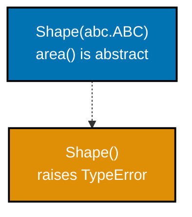

**`learning/code/ex-59-define-abc-interface/example.py`**

```python
"""Example 59: Define an ABC Interface."""

import abc  # => imports the abc module


class Shape(
    abc.ABC
):  # => abc.ABC marks this class as an INTERFACE, never directly instantiable
    @abc.abstractmethod  # => marks the next method as required for every subclass
    def area(
        self,
    ) -> float:  # => no body implementation -- a REQUIRED contract for subclasses
        ...  # => the ellipsis stub -- Shape() below proves this makes the class uninstantiable


try:  # => the block below is expected to raise
    Shape()  # type: ignore  # => instantiating an ABC with unimplemented methods always fails
except TypeError as exc:  # => catches the TypeError raised above
    print(
        type(exc).__name__
    )  # => confirms it is genuinely a TypeError, not merely any exception
# => Output: TypeError
# => `abc.ABC` plus at least one `@abstractmethod` makes a class impossible to instantiate directly
```

**Run**: `python3 example.py`

**Output**:

```text
TypeError
```

**`learning/code/ex-59-define-abc-interface/test_example.py`**

```python
"""Example 59: pytest verification for Define an ABC Interface."""

import pytest

from example import Shape


def test_abc_with_unimplemented_method_cannot_be_instantiated() -> None:
    with pytest.raises(TypeError):  # => Shape() must raise, never silently construct
        Shape()  # type: ignore  # => deliberately triggers the ABC instantiation guard


# => Run: pytest -- Output: 1 passed
```

**Verify**: `pytest -q`

**Output**:

```text
1 passed
```

**Key takeaway**: `abc.ABC` plus at least one `@abstractmethod` makes a class impossible to instantiate directly -- the check happens the moment `Shape()` runs, not the first time `area()` is called.

**Why it matters**: A plain base class with an unimplemented `area()` method would only fail once something actually calls `.area()` on it -- potentially far from where the missing implementation was introduced. `abc.ABC` moves that failure to the earliest possible moment: construction itself. This matters most in larger codebases where the gap between defining an interface and calling every method on it can span multiple files, so catching a missing implementation immediately at construction saves real debugging time later.

---

### Example 60: An Incomplete Subclass Also Cannot Be Instantiated

_ex-60 &middot; exercises co-11_

A subclass that forgets to implement a required abstract method is itself still abstract -- Python does not treat "subclassed" as "complete". This example confirms `Triangle(Shape)` with no `area()` override still cannot be constructed.

**`learning/code/ex-60-abc-subclass-must-implement/example.py`**

```python
"""Example 60: An Incomplete Subclass Also Cannot Be Instantiated."""

import abc  # => imports the abc module


class Shape(abc.ABC):  # => Shape extends abc.ABC
    @abc.abstractmethod  # => marks the next method as required for every subclass
    def area(
        self,
    ) -> float: ...  # => no body -- Triangle below never supplies one either


class Triangle(Shape):  # => subclasses Shape but forgets to implement area()
    pass  # => STILL abstract -- the missing method means Triangle inherits the same restriction


try:  # => the block below is expected to raise
    Triangle()  # type: ignore  # => fails for the same reason Shape() does: area() is unimplemented
except TypeError as exc:  # => catches the TypeError raised above
    print(
        type(exc).__name__
    )  # => confirms it is genuinely a TypeError, same as Example 59
# => Output: TypeError
# => Subclassing an ABC does not automatically satisfy its contract
```

**Run**: `python3 example.py`

**Output**:

```text
TypeError
```

**`learning/code/ex-60-abc-subclass-must-implement/test_example.py`**

```python
"""Example 60: pytest verification for An Incomplete Subclass Also Cannot Be Instantiated."""

import pytest

from example import Triangle


def test_subclass_missing_abstract_method_cannot_be_instantiated() -> None:
    with pytest.raises(TypeError):
        Triangle()  # type: ignore  # => area() was never implemented -- still abstract


# => Run: pytest -- Output: 1 passed
```

**Verify**: `pytest -q`

**Output**:

```text
1 passed
```

**Key takeaway**: Subclassing an ABC does not automatically satisfy its contract -- `Triangle(Shape)` remains abstract, and just as uninstantiable as `Shape` itself, until `area()` is actually implemented.

**Why it matters**: This closes the loophole a plain base class would leave open: without `abc.ABC`, a forgetful subclass would construct successfully and only fail later, at the first `.area()` call. The ABC machinery tracks exactly which abstract methods remain unimplemented across the whole subclass chain. This is especially valuable in larger hierarchies with several levels of subclassing, where it is easy to lose track of which abstract method a deeply nested subclass still owes an implementation for.

---

### Example 61: Two Concrete Implementations of the Same ABC

_ex-61 &middot; exercises co-11, co-09_

Once a subclass implements every abstract method, it instantiates normally -- this example gives `Shape` two independent, concrete implementations, `Circle` and `Square`, each with its own `area()` formula.

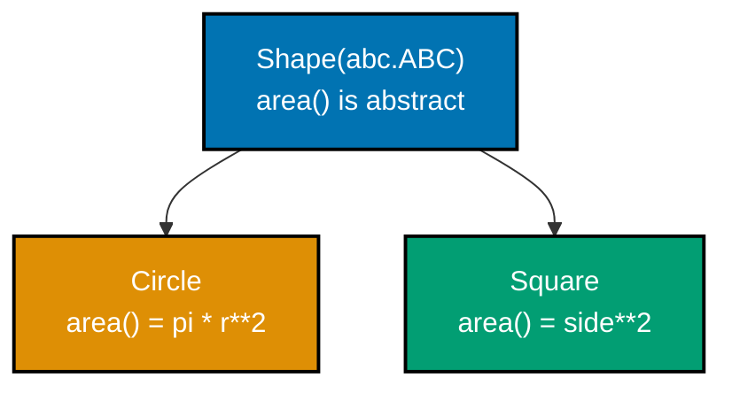

**`learning/code/ex-61-abc-concrete-implementations/example.py`**

```python
"""Example 61: Two Concrete Implementations of the Same ABC."""

import abc  # => imports the abc module
import math  # => imports the math module


class Shape(abc.ABC):  # => Shape extends abc.ABC
    @abc.abstractmethod  # => marks the next method as required for every subclass
    def area(
        self,
    ) -> float: ...  # => no body -- Circle and Square below each supply their own


class Circle(Shape):  # => Circle extends Shape
    def __init__(
        self, radius: float
    ) -> None:  # => the constructor -- runs once, automatically, per instantiation
        self.radius = radius  # => stores radius on this instance

    def area(
        self,
    ) -> float:  # => implements the required abstract method -- now instantiable
        return math.pi * self.radius**2  # => returns this value to the caller


class Square(Shape):  # => Square extends Shape
    def __init__(
        self, side: float
    ) -> None:  # => the constructor -- runs once, automatically, per instantiation
        self.side = side  # => stores side on this instance

    def area(
        self,
    ) -> float:  # => a SECOND, independent implementation of the same contract
        return self.side**2  # => returns this value to the caller


print(
    round(Circle(2.0).area(), 2), Square(3.0).area()
)  # => both classes instantiate AND compute
# => Output: 12.57 9.0
# => Implementing every abstract method a base class declares is the entire requirement for instantiability
```

**Run**: `python3 example.py`

**Output**:

```text
12.57 9.0
```

**`learning/code/ex-61-abc-concrete-implementations/test_example.py`**

```python
"""Example 61: pytest verification for Two Concrete Implementations of the Same ABC."""

from example import Circle, Square


def test_both_concrete_implementations_instantiate_and_compute() -> None:
    assert round(Circle(2.0).area(), 2) == 12.57
    assert Square(3.0).area() == 9.0


# => Run: pytest -- Output: 1 passed
```

**Verify**: `pytest -q`

**Output**:

```text
1 passed
```

**Key takeaway**: Implementing every abstract method a base class declares is the entire requirement for instantiability -- `Circle` and `Square` share no logic with each other beyond satisfying the same `Shape` contract.

**Why it matters**: An ABC with two or more concrete implementations is the normal, expected shape of real interface usage -- one contract, several independently-varying implementations. Example 62 immediately shows why this matters: one function can handle both without knowing which concrete class it received. This is exactly the shape production plugin systems, payment processors, and storage backends take: one interface, many interchangeable implementations chosen at runtime or configuration time.

---

### Example 62: One Call-Site Handles Every Shape Implementation

_ex-62 &middot; exercises co-11, co-10_

A function typed against the ABC (`shape: Shape`), rather than any concrete subclass, accepts every current and future implementation uniformly. This example runs `describe()` against both `Circle` and `Square` with zero type-specific branching.

**`learning/code/ex-62-abc-polymorphic-callsite/example.py`**

```python
"""Example 62: One Call-Site Handles Every Shape Implementation."""

import abc  # => imports the abc module
import math  # => imports the math module


class Shape(abc.ABC):  # => Shape extends abc.ABC
    @abc.abstractmethod  # => marks the next method as required for every subclass
    def area(
        self,
    ) -> float: ...  # => no body -- Circle and Square below each supply their own


class Circle(Shape):  # => Circle extends Shape
    def __init__(
        self, radius: float
    ) -> None:  # => the constructor -- runs once, automatically, per instantiation
        self.radius = radius  # => stores radius on this instance

    def area(self) -> float:  # => defines the area() method
        return math.pi * self.radius**2  # => returns this value to the caller


class Square(Shape):  # => Square extends Shape
    def __init__(
        self, side: float
    ) -> None:  # => the constructor -- runs once, automatically, per instantiation
        self.side = side  # => stores side on this instance

    def area(self) -> float:  # => defines the area() method
        return self.side**2  # => returns this value to the caller


def describe(
    shape: Shape,
) -> str:  # => typed against the ABC -- accepts ANY Shape subclass
    return f"{type(shape).__name__} area is {shape.area():.2f}"  # => returns this value to the caller


shapes: list[Shape] = [
    Circle(2.0),
    Square(3.0),
]  # => mixed concrete types, one shared base
print(
    [describe(s) for s in shapes]
)  # => the SAME function handles both, no branching by type
# => Output: ['Circle area is 12.57', 'Square area is 9.00']
# => `describe(shape: Shape)` contains no `if isinstance(shape, Circle)` branch anywhere
```

**Run**: `python3 example.py`

**Output**:

```text
['Circle area is 12.57', 'Square area is 9.00']
```

**`learning/code/ex-62-abc-polymorphic-callsite/test_example.py`**

```python
"""Example 62: pytest verification for One Call-Site Handles Every Shape Implementation."""

from example import Circle, Square, describe


def test_one_function_handles_every_shape_subclass() -> None:
    assert describe(Circle(2.0)) == "Circle area is 12.57"
    assert (
        describe(Square(3.0)) == "Square area is 9.00"
    )  # => same describe(), no type branching


# => Run: pytest -- Output: 1 passed
```

**Verify**: `pytest -q`

**Output**:

```text
1 passed
```

**Key takeaway**: `describe(shape: Shape)` contains no `if isinstance(shape, Circle)` branch anywhere -- typing the parameter against the ABC is what makes one function body correct for every implementation.

**Why it matters**: A brand-new `Triangle(Shape)` implementation, added months later with no change to `describe()` at all, would work here immediately -- this is the concrete payoff of combining co-11's interface contract with co-10's polymorphic dispatch: the call-site is closed for modification, open for extension. This open-closed property is a cornerstone of maintainable object-oriented design, because it means new functionality ships by adding code, not by risking a regression in code that already works.

---

### Example 63: An ABC Providing a Concrete Shared Helper

_ex-63 &middot; exercises co-11, co-08_

An ABC can mix abstract methods (required, no implementation) with ordinary concrete methods (shared, inherited as-is) in the same class. This example gives `Shape` a concrete `describe()` that every subclass inherits for free, built on top of the required `area()`.

**`learning/code/ex-63-abstract-with-shared-helper/example.py`**

```python
"""Example 63: An ABC Providing a Concrete Shared Helper."""

import abc  # => imports the abc module


class Shape(abc.ABC):  # => Shape extends abc.ABC
    @abc.abstractmethod  # => marks the next method as required for every subclass
    def area(
        self,
    ) -> float: ...  # => no body -- Square below supplies the required implementation

    def describe(
        self,
    ) -> str:  # => a CONCRETE method -- every subclass inherits this for free
        return f"{type(self).__name__}: area={self.area():.2f}"  # => reuses the abstract method


class Square(Shape):  # => Square extends Shape
    def __init__(
        self, side: float
    ) -> None:  # => the constructor -- runs once, automatically, per instantiation
        self.side = side  # => stores side on this instance

    def area(self) -> float:  # => Square only implements the REQUIRED abstract part
        return self.side**2  # => returns this value to the caller


print(
    Square(3.0).describe()
)  # => describe() was never redefined -- inherited straight from Shape
# => Output: Square: area=9.00
# => An ABC is not "every method abstract"
```

**Run**: `python3 example.py`

**Output**:

```text
Square: area=9.00
```

**`learning/code/ex-63-abstract-with-shared-helper/test_example.py`**

```python
"""Example 63: pytest verification for An ABC Providing a Concrete Shared Helper."""

from example import Square


def test_subclass_inherits_shared_concrete_helper() -> None:
    assert (
        Square(3.0).describe() == "Square: area=9.00"
    )  # => inherited, not redefined, method


# => Run: pytest -- Output: 1 passed
```

**Verify**: `pytest -q`

**Output**:

```text
1 passed
```

**Key takeaway**: An ABC is not "every method abstract" -- `describe()` here is a fully concrete method, shared by every subclass, that itself calls the one method (`area()`) each subclass is required to supply.

**Why it matters**: This pattern -- a handful of required abstract methods plus a larger set of concrete helpers built on top of them -- is how real interface hierarchies avoid forcing every subclass to reimplement shared logic. Example 75's template method pattern is this same idea taken further, with the concrete method dictating an entire fixed algorithm.

---

### Example 64: Registering a Virtual Subclass

_ex-64 &middot; exercises co-11, co-12_

`Shape.register(SomeClass)` tells the ABC machinery to treat `SomeClass` as a `Shape` for `isinstance`/`issubclass` purposes, with zero actual inheritance declared. This example registers an unrelated third-party-style class and confirms `isinstance` accepts it.

**`learning/code/ex-64-register-virtual-subclass/example.py`**

```python
"""Example 64: Registering a Virtual Subclass."""

import abc  # => imports the abc module


class Shape(abc.ABC):  # => Shape extends abc.ABC
    @abc.abstractmethod  # => marks the next method as required for every subclass
    def area(self) -> float: ...


class ThirdPartyCircle:  # => a class Shape never declares any relationship to at all
    def __init__(
        self, radius: float
    ) -> None:  # => the constructor -- runs once, automatically, per instantiation
        self.radius = radius  # => stores radius on this instance

    def area(self) -> float:  # => defines the area() method
        return 3.14159 * self.radius**2  # => returns this value to the caller


Shape.register(
    ThirdPartyCircle
)  # => tells the ABC machinery to treat this class as a Shape
print(
    isinstance(ThirdPartyCircle(1.0), Shape)
)  # => True, with ZERO inheritance declared anywhere
# => Output: True
print(
    ThirdPartyCircle in Shape.__subclasses__()
)  # => .register() does NOT appear in the MRO list
# => Output: False
# => `.register()` grants `isinstance`/`issubclass` compatibility without touching the registered class's own definition or its method resolution order at all
```

**Run**: `python3 example.py`

**Output**:

```text
True
False
```

**`learning/code/ex-64-register-virtual-subclass/test_example.py`**

```python
"""Example 64: pytest verification for Registering a Virtual Subclass."""

from example import Shape, ThirdPartyCircle


def test_registered_class_passes_isinstance_without_inheriting() -> None:
    Shape.register(
        ThirdPartyCircle
    )  # => idempotent to call more than once across test runs
    assert isinstance(
        ThirdPartyCircle(1.0), Shape
    )  # => True with no `class ThirdPartyCircle(Shape)`


# => Run: pytest -- Output: 1 passed
```

**Verify**: `pytest -q`

**Output**:

```text
1 passed
```

**Key takeaway**: `.register()` grants `isinstance`/`issubclass` compatibility without touching the registered class's own definition or its method resolution order at all -- it is a separate, virtual relationship.

**Why it matters**: This is the mechanism to reach for when a class genuinely cannot be edited to add real inheritance (a third-party library type, for instance) but still needs to pass `isinstance(x, Shape)` checks elsewhere in a codebase -- a bridge between co-11's nominal typing and co-12's duck typing, in one specific, documented direction.

---

### Example 65: A Naive Stack(list) Leaks the Wrong Interface

_ex-65 &middot; exercises co-08_

Subclassing `list` to get a `Stack` "for free" is-a a list, which means it inherits every list method, including ones a stack was never meant to expose (`insert` at an arbitrary index). This example reproduces exactly that interface leak.

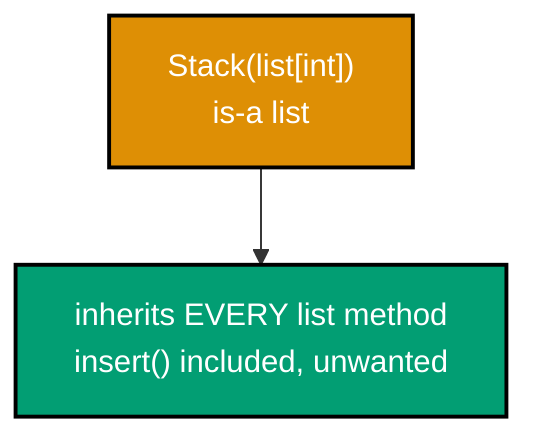

**`learning/code/ex-65-naive-inheritance-smell/example.py`**

```python
"""Example 65: A Naive Stack(list) Leaks the Wrong Interface."""


class Stack(
    list[int]
):  # => "is-a list" -- inherits EVERY list method, not just stack operations
    def push(self, item: int) -> None:  # => defines the push() method
        self.append(item)  # => reuses list.append -- convenient, but see the leak below

    def pop_top(self) -> int:  # => defines the pop_top() method
        return self.pop()  # => reuses list.pop -- also convenient


s: Stack = Stack()  # => constructs s
s.push(1)  # => pushes 1 -- goes through the intended push() method
s.push(2)  # => pushes 2 -- still through the intended push() method
s.insert(0, 99)  # => LEAK: insert() was never meant to be part of a stack's interface
# => a real stack only supports push/pop at ONE end -- insert(0, ...) breaks that guarantee
print(list(s))  # => 99 was inserted at an arbitrary position, not pushed
# => Output: [99, 1, 2]
# => `class Stack(list[int])` inherits `list`'s ENTIRE public interface, not just the parts a stack conceptually needs
```

**Run**: `python3 example.py`

**Output**:

```text
[99, 1, 2]
```

**`learning/code/ex-65-naive-inheritance-smell/test_example.py`**

```python
"""Example 65: pytest verification for A Naive Stack(list) Leaks the Wrong Interface."""

from example import Stack


def test_naive_stack_leaks_list_insert() -> None:
    s: Stack = Stack()
    s.push(1)
    s.push(2)
    s.insert(0, 99)  # => a method a stack should never have exposed
    assert list(s) == [
        99,
        1,
        2,
    ]  # => reproduces the interface leak: insert() bypassed push/pop


# => Run: pytest -- Output: 1 passed
```

**Verify**: `pytest -q`

**Output**:

```text
1 passed
```

**Key takeaway**: `class Stack(list[int])` inherits `list`'s ENTIRE public interface, not just the parts a stack conceptually needs -- `insert`, `sort`, slicing, and every other list method all leak through unchanged.

**Why it matters**: This is inheritance's most common misuse: reaching for `class X(list)` purely to borrow `append`/`pop` for free, without noticing every other list method comes along uninvited. Example 66 is the direct fix -- holding a list as a private collaborator instead of inheriting its whole public surface. Recognizing this smell matters because it shows up constantly in real code review: any subclass of a built-in container is worth a second look for exactly this leaked-interface problem.

---

### Example 66: Refactoring Stack to Composition

_ex-66 &middot; exercises co-13_

Holding `self._items: list[int]` as a private collaborator, instead of subclassing `list`, means `Stack` exposes only the methods it deliberately chooses to -- `push`, `pop`, `peek`, and nothing else. This example confirms `insert` no longer exists on `Stack` at all.

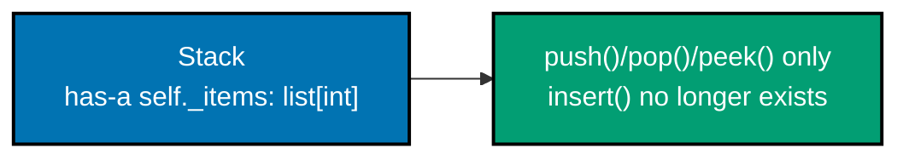

**`learning/code/ex-66-refactor-to-composition/example.py`**

```python
"""Example 66: Refactoring Stack to Composition."""


class Stack:  # => no longer subclasses list -- HOLDS one instead
    def __init__(
        self,
    ) -> None:  # => the constructor -- runs once, automatically, per instantiation
        self._items: list[
            int
        ] = []  # => a private collaborator, not an inherited interface

    def push(self, item: int) -> None:  # => defines the push() method
        self._items.append(
            item
        )  # => delegates to the list, but does not EXPOSE the list

    def pop(self) -> int:  # => defines the pop() method
        return self._items.pop()  # => returns this value to the caller

    def peek(self) -> int:  # => defines the peek() method
        return self._items[
            -1
        ]  # => only push/pop/peek exist -- insert() is simply not here


s: Stack = Stack()  # => constructs s
s.push(1)
s.push(2)
print(s.peek())  # => reads the top without removing it
# => Output: 2
print(s.pop())  # => removes and returns the top
# => Output: 2
print(
    hasattr(s, "insert")
)  # => the leaked method from Example 65 no longer exists on Stack
# => Output: False
# => Composing a `list` as `self._items` and forwarding only `push`/`pop`/`peek` gives `Stack` an interface entirely of its own choosing
```

**Run**: `python3 example.py`

**Output**:

```text
2
2
False
```

**`learning/code/ex-66-refactor-to-composition/test_example.py`**

```python
"""Example 66: pytest verification for Refactoring Stack to Composition."""

from example import Stack


def test_only_push_pop_peek_are_public() -> None:
    s: Stack = Stack()
    s.push(1)
    s.push(2)
    assert s.peek() == 2
    assert s.pop() == 2
    assert not hasattr(
        s, "insert"
    )  # => composition means Stack exposes only its OWN interface


def test_original_push_pop_behavior_still_holds() -> None:
    s: Stack = Stack()
    s.push(10)
    assert s.pop() == 10  # => the tests Example 65's Stack would also have passed


# => Run: pytest -- Output: 2 passed
```

**Verify**: `pytest -q`

**Output**:

```text
2 passed
```

**Key takeaway**: Composing a `list` as `self._items` and forwarding only `push`/`pop`/`peek` gives `Stack` an interface entirely of its own choosing -- narrower, and impossible to accidentally widen by inheriting from `list` again.

**Why it matters**: This is "favor composition over inheritance" made concrete: the working push/pop behavior from Example 65 survives unchanged, but every leaked method is gone. The cost is a little forwarding boilerplate (`push` calling `self._items.append`); the benefit is a class whose public surface exactly matches its intended contract. This trade-off -- a small amount of forwarding code in exchange for a precisely scoped interface -- is one production codebases make constantly once a leaked-interface bug has been felt firsthand.

---

### Example 67: A Service Delegates to a Logger Collaborator

_ex-67 &middot; exercises co-13_

`Service` holds a logging collaborator rather than inheriting from one, so swapping which collaborator it holds changes its observed behavior with zero changes to `Service`'s own code. This example swaps in a silent logger and shows the effect.

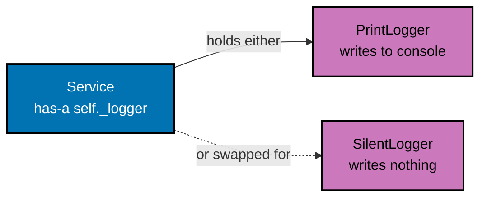

**`learning/code/ex-67-composition-delegates/example.py`**

```python
"""Example 67: A Service Delegates to a Logger Collaborator."""

from typing import Protocol  # => imports Protocol from typing


class SupportsLog(Protocol):  # => the structural contract Service actually depends on
    def log(
        self, message: str
    ) -> str: ...  # => no body -- Logger and SilentLogger each supply one


class Logger:  # => begins the Logger class body
    def log(self, message: str) -> str:  # => the default collaborator behavior
        return f"[LOG] {message}"  # => returns this value to the caller


class SilentLogger:  # => unrelated to Logger -- satisfies SupportsLog structurally, not by inheritance
    def log(self, message: str) -> str:  # => same method NAME, deliberately swappable
        return ""  # => discards the message instead of formatting it


class Service:  # => begins the Service class body
    def __init__(
        self, logger: SupportsLog
    ) -> None:  # => typed against the PROTOCOL, not a class
        self.logger = logger  # => HOLDS a collaborator -- does not inherit from it

    def run(self) -> str:  # => defines the run() method
        return self.logger.log(
            "service ran"
        )  # => delegates the actual work to the collaborator


loud: Service = Service(Logger())  # => constructs loud
quiet: Service = Service(SilentLogger())  # => structurally compatible, accepted cleanly
print(
    f"{loud.run()!r} | {quiet.run()!r}"
)  # => swapping the collaborator changed the observed behavior
# => Output: '[LOG] service ran' | ''
# => `Service.run()` never knows or cares which `log()` implementation it holds
```

**Run**: `python3 example.py`

**Output**:

```text
'[LOG] service ran' | ''
```

**`learning/code/ex-67-composition-delegates/test_example.py`**

```python
"""Example 67: pytest verification for A Service Delegates to a Logger Collaborator."""

from example import Logger, Service, SilentLogger


def test_swapping_the_collaborator_changes_observed_behavior() -> None:
    loud: Service = Service(Logger())
    quiet: Service = Service(
        SilentLogger()
    )  # => structurally compatible, accepted cleanly
    assert loud.run() == "[LOG] service ran"
    assert (
        quiet.run() == ""
    )  # => same Service code, a different collaborator, different behavior


# => Run: pytest -- Output: 1 passed
```

**Verify**: `pytest -q`

**Output**:

```text
1 passed
```

**Key takeaway**: `Service.run()` never knows or cares which `log()` implementation it holds -- swapping `Logger()` for `SilentLogger()` at construction time is the only thing that changes `run()`'s observed behavior.

**Why it matters**: Typing the constructor parameter as `SupportsLog` (a `Protocol`) rather than the concrete `Logger` class means `SilentLogger` -- which shares no inheritance with `Logger` at all -- is accepted cleanly by a static checker too, not just at runtime. Composition plus structural typing keeps `Service` decoupled from any one concrete logging implementation.

---

### Example 68: Constructor-Injected Dependencies Enable Fakes in Tests

_ex-68 &middot; exercises co-13, co-12_

Passing a collaborator into `__init__`, rather than constructing it inside the class, lets a test substitute a fake with zero changes to the class under test. This example injects a `FakeClock` in place of a `RealClock`.

**`learning/code/ex-68-dependency-injection-constructor/example.py`**

```python
"""Example 68: Constructor-Injected Dependencies Enable Fakes in Tests."""


class RealClock:  # => begins the RealClock class body
    def now(self) -> str:  # => in real life this would call the system clock
        return "2026-07-14T00:00:00"  # => returns this value to the caller


class FakeClock:  # => a TEST DOUBLE -- no shared base class with RealClock, by design
    def now(self) -> str:  # => returns a fixed, predictable value instead
        return "1999-01-01T00:00:00"  # => returns this value to the caller


class Event:  # => begins the Event class body
    def __init__(
        self, clock: RealClock
    ) -> None:  # => the collaborator is INJECTED, not built inside
        self.clock = clock  # => stores clock on this instance

    def timestamp(self) -> str:  # => defines the timestamp() method
        return self.clock.now()  # => delegates to whichever clock was injected


real_event: Event = Event(RealClock())  # => constructs real_event
fake_event: Event = Event(FakeClock())  # type: ignore  # => duck typing lets a fake substitute cleanly
print(
    real_event.timestamp(), "|", fake_event.timestamp()
)  # => the SAME Event class, two results
# => Output: 2026-07-14T00:00:00 | 1999-01-01T00:00:00
# => Because `Event` never constructs its own clock, a test can inject `FakeClock()`
```

**Run**: `python3 example.py`

**Output**:

```text
2026-07-14T00:00:00 | 1999-01-01T00:00:00
```

**`learning/code/ex-68-dependency-injection-constructor/test_example.py`**

```python
"""Example 68: pytest verification for Constructor-Injected Dependencies Enable Fakes in Tests."""

from example import Event, FakeClock


def test_fake_collaborator_substitutes_cleanly_in_a_test() -> None:
    event: Event = Event(FakeClock())  # type: ignore  # => duck typing accepts the structural match
    assert (
        event.timestamp() == "1999-01-01T00:00:00"
    )  # => no real clock or real time involved


# => Run: pytest -- Output: 1 passed
```

**Verify**: `pytest -q`

**Output**:

```text
1 passed
```

**Key takeaway**: Because `Event` never constructs its own clock, a test can inject `FakeClock()` -- with no relationship to `RealClock` at all -- and get fully deterministic, real-time-independent behavior.

**Why it matters**: If `Event.__init__` built `self.clock = RealClock()` internally, no test could ever substitute a predictable clock without monkeypatching. Injecting the collaborator through the constructor is what makes dependency substitution a normal, first-class capability instead of a workaround -- Example 56's `Protocol` is the properly-typed way to express the same `clock` parameter.

---

### Example 69: A Swappable Pricing Strategy via Composition

_ex-69 &middot; exercises co-13, co-10_

`Order` holds a pricing collaborator and delegates the pricing decision to it entirely -- swapping `RegularPricing` for `DiscountPricing` changes the computed total with zero subclassing of `Order` itself. This example's `Order` is deliberately typed against the concrete `RegularPricing` class -- narrower typing that Example 70 goes on to fix.

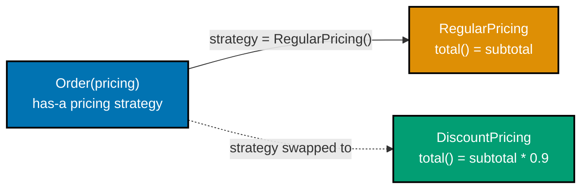

**`learning/code/ex-69-strategy-via-composition/example.py`**

```python
"""Example 69: A Swappable Pricing Strategy via Composition."""


class RegularPricing:  # => begins the RegularPricing class body
    def price(self, base: float) -> float:  # => no discount at all
        return base  # => returns this value to the caller


class DiscountPricing:  # => unrelated to RegularPricing -- no shared base class
    def price(self, base: float) -> float:  # => same method NAME, different formula
        return base * 0.8  # => a flat 20% discount


class Order:  # => begins the Order class body
    def __init__(
        self, pricing: RegularPricing
    ) -> None:  # => too NARROW a type -- Example 70 fixes this
        self.pricing = (
            pricing  # => held, not inherited -- swappable at construction time
        )

    def total(self, base: float) -> float:  # => defines the total() method
        return self.pricing.price(
            base
        )  # => delegates the pricing DECISION to the collaborator


regular: Order = Order(RegularPricing())  # => constructs regular
discounted: Order = Order(DiscountPricing())  # type: ignore  # => works at runtime despite the narrow hint
print(
    regular.total(100.0), discounted.total(100.0)
)  # => same Order class, two different totals
# => Output: 100.0 80.0
# => Swapping the collaborator `Order` holds changes `total()`'s result with no subclass of `Order` anywhere
```

**Run**: `python3 example.py`

**Output**:

```text
100.0 80.0
```

**`learning/code/ex-69-strategy-via-composition/test_example.py`**

```python
"""Example 69: pytest verification for A Swappable Pricing Strategy via Composition."""

from example import DiscountPricing, Order, RegularPricing


def test_swapping_the_strategy_changes_the_computed_price() -> None:
    regular: Order = Order(RegularPricing())
    discounted: Order = Order(DiscountPricing())  # type: ignore
    assert regular.total(100.0) == 100.0
    assert discounted.total(100.0) == 80.0  # => zero subclassing of Order was needed


# => Run: pytest -- Output: 1 passed
```

**Verify**: `pytest -q`

**Output**:

```text
1 passed
```

**Key takeaway**: Swapping the collaborator `Order` holds -- `RegularPricing()` versus `DiscountPricing()` -- changes `total()`'s result with no subclass of `Order` anywhere; only the constructor argument differs.

**Why it matters**: This works at runtime because Python does not enforce the `RegularPricing` type hint -- `DiscountPricing`'s matching method shape is all that actually matters when the code runs. The type hint itself is misleadingly narrow, though, which is precisely the smell Example 70 fixes by typing against an interface instead. This gap between what actually runs and what the type hint claims is one of the more common sources of misleading static analysis results in real Python codebases.

---

### Example 70: Type the Injected Field Against an Interface, Not a Concrete Class

_ex-70 &middot; exercises co-13, co-11_

Typing the injected collaborator as an ABC (`PricingStrategy`) rather than one concrete implementation lets a static checker confirm every conforming implementation is accepted, with no `# type: ignore` needed anywhere. This example fixes Example 69's narrow typing.

**`learning/code/ex-70-favor-interface-over-concrete/example.py`**

```python
"""Example 70: Type the Injected Field Against an Interface, Not a Concrete Class."""

import abc  # => imports the abc module


class PricingStrategy(
    abc.ABC
):  # => the interface Order depends on -- never a concrete class
    @abc.abstractmethod  # => marks the next method as required for every subclass
    def price(
        self, base: float
    ) -> float: ...  # => no body -- both implementations below supply one


class RegularPricing(PricingStrategy):  # => RegularPricing extends PricingStrategy
    def price(self, base: float) -> float:  # => defines the price() method
        return base  # => returns this value to the caller


class DiscountPricing(
    PricingStrategy
):  # => a SECOND implementation of the same interface
    def price(self, base: float) -> float:  # => defines the price() method
        return base * 0.8  # => returns this value to the caller


class Order:  # => begins the Order class body
    def __init__(
        self, pricing: PricingStrategy
    ) -> None:  # => typed against the ABC, not a class
        self.pricing = pricing  # => stores pricing on this instance

    def total(self, base: float) -> float:  # => defines the total() method
        return self.pricing.price(base)  # => returns this value to the caller


strategies: list[PricingStrategy] = [
    RegularPricing(),
    DiscountPricing(),
]  # => two conforming impls
totals: list[float] = [
    Order(s).total(100.0) for s in strategies
]  # => any conforming impl accepted
print(
    totals
)  # => both implementations plug into the SAME Order class with no special-casing
# => Output: [100.0, 80.0]
# => Typing `pricing` as the `PricingStrategy` ABC, not a concrete class, is what lets both implementations pass static type checking
```

**Run**: `python3 example.py`

**Output**:

```text
[100.0, 80.0]
```

**`learning/code/ex-70-favor-interface-over-concrete/test_example.py`**

```python
"""Example 70: pytest verification for Typing the Injected Field Against an Interface."""

from example import DiscountPricing, Order, PricingStrategy, RegularPricing


def test_any_conforming_implementation_is_accepted() -> None:
    strategies: list[PricingStrategy] = [RegularPricing(), DiscountPricing()]
    totals: list[float] = [Order(s).total(100.0) for s in strategies]
    assert totals == [
        100.0,
        80.0,
    ]  # => Order never mentions a concrete pricing class anywhere


# => Run: pytest -- Output: 1 passed
```

**Verify**: `pytest -q`

**Output**:

```text
1 passed
```

**Key takeaway**: Typing `Order.__init__`'s `pricing` parameter as `PricingStrategy` (the ABC), instead of any one concrete implementation, is what lets both `RegularPricing` and `DiscountPricing` pass static type checking with zero `# type: ignore` comments.

**Why it matters**: This is the fix Example 69's comments already pointed toward: a constructor parameter typed against a concrete class only happens to accept other implementations because Python does not enforce type hints at runtime. Typing against the interface both documents the real dependency and lets a checker verify every conforming implementation ahead of time.

---

### Example 71: An Order Enforcing Legal Status Transitions

_ex-71 &middot; exercises co-02, co-17_

`Order` guards every status change against a table of legal transitions, rejecting any jump that table does not permit -- a state machine enforced entirely inside the class's own methods. This example allows `pending -> shipped` but rejects `shipped -> pending`.

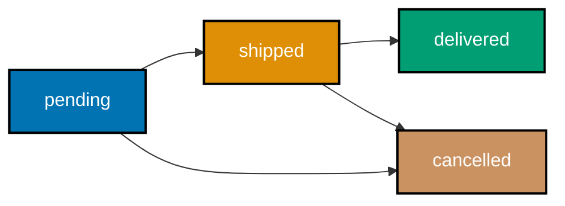

**`learning/code/ex-71-encapsulated-state-machine/example.py`**

```python
"""Example 71: An Order Enforcing Legal Status Transitions."""


class Order:  # => begins the Order class body
    _LEGAL_NEXT: dict[
        str, set[str]
    ] = {  # => the whole state machine, declared in one place
        "pending": {
            "shipped",
            "cancelled",
        },  # => from pending, only shipped or cancelled are legal
        "shipped": {"delivered"},  # => from shipped, only delivered is legal
        "delivered": set(),  # => a terminal state -- no legal transitions out of it
        "cancelled": set(),  # => also terminal -- no legal transitions out of it
    }  # => closes the state-machine table

    def __init__(
        self,
    ) -> None:  # => the constructor -- runs once, automatically, per instantiation
        self.status: str = "pending"  # => every Order starts in the same initial state

    def transition_to(
        self, new_status: str
    ) -> None:  # => defines the transition_to() method
        allowed: set[str] = self._LEGAL_NEXT[
            self.status
        ]  # => looks up what THIS status permits
        if (
            new_status not in allowed
        ):  # => guards every transition, not just the "obvious" ones
            raise ValueError(
                f"cannot go from {self.status} to {new_status}"
            )  # => rejects it
        self.status = (
            new_status  # => only reached once the transition is confirmed legal
        )


order: Order = Order()  # => constructs order
order.transition_to("shipped")  # => pending -> shipped is legal
print(order.status)  # => confirms the legal transition actually took effect
# => Output: shipped
try:  # => the block below is expected to raise
    order.transition_to("pending")  # => shipped -> pending is NOT in the legal set
except ValueError as exc:  # => catches the ValueError raised above
    print(exc)  # => prints the exact rejection message
# => Output: cannot go from shipped to pending
# => `_LEGAL_NEXT` names every allowed transition in one table, and `transition_to` is the ONLY method that ever changes `status`
```

**Run**: `python3 example.py`

**Output**:

```text
shipped
cannot go from shipped to pending
```

**`learning/code/ex-71-encapsulated-state-machine/test_example.py`**

```python
"""Example 71: pytest verification for An Order Enforcing Legal Status Transitions."""

import pytest

from example import Order


def test_legal_transition_succeeds() -> None:
    order: Order = Order()
    order.transition_to("shipped")
    assert order.status == "shipped"


def test_illegal_transition_raises() -> None:
    order: Order = Order()
    order.transition_to("shipped")
    with pytest.raises(ValueError):  # => shipped -> pending is not a legal transition
        order.transition_to("pending")


# => Run: pytest -- Output: 2 passed
```

**Verify**: `pytest -q`

**Output**:

```text
2 passed
```

**Key takeaway**: `_LEGAL_NEXT` names every allowed transition in one table, and `transition_to` is the ONLY method that ever changes `status` -- an `Order` cannot reach an illegal status from any code path.

**Why it matters**: A state machine expressed as an explicit table (rather than scattered `if` statements checking specific transitions) is both easier to audit for correctness and easier to extend -- adding a new legal transition is a one-line table edit, not a new branch buried somewhere in the class's methods. This pattern shows up constantly in production systems modeling anything with a lifecycle -- orders, tickets, deployments, approvals -- where illegal transitions are exactly the bug class this design prevents.

---

### Example 72: A Frozen Money Whose Arithmetic Returns New Instances

_ex-72 &middot; exercises co-06, co-02_

A frozen value object's arithmetic methods never mutate `self` or their argument -- they always compute and return a brand-new instance. This example confirms both operands are untouched after `a.plus(b)`.

**`learning/code/ex-72-immutable-value-object-full/example.py`**

```python
"""Example 72: A Frozen Money Whose Arithmetic Returns New Instances."""

from dataclasses import dataclass  # => imports dataclass from dataclasses


@dataclass(frozen=True)  # => generates boilerplate methods from the field list below
class Money:  # => begins the Money class body
    amount: int  # => integer cents -- immutable once constructed

    def plus(self, other: "Money") -> "Money":  # => never mutates self OR other
        return Money(self.amount + other.amount)  # => always returns a BRAND-NEW Money


a: Money = Money(500)  # => constructs a
b: Money = Money(300)  # => constructs b
c: Money = a.plus(b)  # => a new object, computed from a and b
print(a.amount, b.amount, c.amount)  # => neither operand changed; only c holds the sum
# => Output: 500 300 800
# => `a.plus(b)` cannot mutate `a` or `b` even if it tried
```

**Run**: `python3 example.py`

**Output**:

```text
500 300 800
```

**`learning/code/ex-72-immutable-value-object-full/test_example.py`**

```python
"""Example 72: pytest verification for A Frozen Money Whose Arithmetic Returns New Instances."""

from example import Money


def test_plus_leaves_both_operands_unchanged() -> None:
    a: Money = Money(500)
    b: Money = Money(300)
    c: Money = a.plus(b)
    assert a.amount == 500  # => untouched
    assert b.amount == 300  # => untouched
    assert c.amount == 800  # => a brand-new object holding the sum


# => Run: pytest -- Output: 1 passed
```

**Verify**: `pytest -q`

**Output**:

```text
1 passed
```

**Key takeaway**: `a.plus(b)` cannot mutate `a` or `b` even if it tried -- `frozen=True` makes both operands immutable, so the only possible way to produce a result is constructing a new `Money`.

**Why it matters**: This is co-02's encapsulation and co-06's frozen dataclass combined into a guarantee stronger than either alone: not only is `_balance`-style direct mutation prevented (co-02), the class cannot mutate itself even from the INSIDE, which eliminates an entire category of aliasing bug where two variables holding the same value object unexpectedly observe each other's changes.

---

### Example 73: Value Objects Deduplicate Inside a Set

_ex-73 &middot; exercises co-05, co-06_

A frozen dataclass's generated `__eq__` and `__hash__` work together automatically, so placing several `Money` value objects in a `set` deduplicates exact-value duplicates while keeping genuinely distinct values apart.

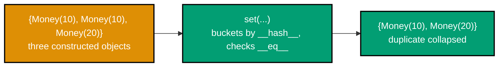

**`learning/code/ex-73-value-objects-set-dedup/example.py`**

```python
"""Example 73: Value Objects Deduplicate Inside a Set."""

from dataclasses import dataclass  # => imports dataclass from dataclasses


@dataclass(
    frozen=True
)  # => frozen gives consistent __eq__ AND __hash__ together, for free
class Money:  # => begins the Money class body
    amount: int  # => a required dataclass field, part of the generated __init__
    currency: str  # => a required dataclass field, part of the generated __init__


payments: list[Money] = [  # => a list that deliberately contains one exact duplicate
    Money(500, "USD"),  # => the first, original entry
    Money(500, "USD"),  # => a genuine duplicate value
    Money(100, "USD"),  # => a distinct amount -- never collides with the entries above
    Money(500, "EUR"),  # => same amount, different currency -- NOT a duplicate
]  # => closes the payments list
unique: set[Money] = set(
    payments
)  # => relies on __eq__ + __hash__ working together, correctly
print(len(unique))  # => three distinct (amount, currency) pairs survive
# => Output: 3
# => `set(payments)` deduplicates by value, not identity, because `Money`'s generated `__eq__`/`__hash__` pair compares and hashes `(amount, currency)` together
```

**Run**: `python3 example.py`

**Output**:

```text
3
```

**`learning/code/ex-73-value-objects-set-dedup/test_example.py`**

```python
"""Example 73: pytest verification for Value Objects Deduplicate Inside a Set."""

from example import Money


def test_duplicate_value_objects_collapse_in_a_set() -> None:
    payments: list[Money] = [
        Money(500, "USD"),
        Money(500, "USD"),
        Money(100, "USD"),
        Money(500, "EUR"),
    ]
    unique: set[Money] = set(payments)
    assert len(unique) == 3  # => only the exact duplicate collapsed


# => Run: pytest -- Output: 1 passed
```

**Verify**: `pytest -q`

**Output**:

```text
1 passed
```

**Key takeaway**: `set(payments)` deduplicates by value, not identity, because `Money`'s generated `__eq__`/`__hash__` pair compares and hashes `(amount, currency)` together -- exactly one `Money(500, "USD")` survives, but `Money(500, "EUR")` does not collide with it.

**Why it matters**: This is Examples 33-35's hand-written eq/hash contract, delivered automatically by `frozen=True` with zero risk of the two methods drifting out of sync -- a significant real-world use case (deduplicating a list of transactions, prices, or coordinates) made trivial by the dataclass machinery instead of hand-maintained code. This is precisely why frozen dataclasses are the default recommendation for value objects that will ever end up inside a `set` or as a `dict` key.

---

### Example 74: Polymorphism via Duck Typing, with No Shared Base Class

_ex-74 &middot; exercises co-12, co-10_

A single rendering pipeline can dispatch across several completely unrelated renderer classes, as long as each one exposes the same `render()` method -- polymorphism achieved with zero inheritance hierarchy at all.

**`learning/code/ex-74-polymorphism-without-inheritance/example.py`**

```python
"""Example 74: Polymorphism via Duck Typing, with No Shared Base Class."""


class HtmlRenderer:  # => begins the HtmlRenderer class body
    def render(
        self, text: str
    ) -> str:  # => no inheritance from any shared Renderer base
        return f"<p>{text}</p>"  # => returns this value to the caller


class MarkdownRenderer:  # => a second, entirely unrelated class
    def render(self, text: str) -> str:  # => same method NAME, structurally compatible
        return f"**{text}**"  # => returns this value to the caller


def render_all(
    text: str, renderers: list[object]
) -> list[str]:  # => a SINGLE shared pipeline
    return [r.render(text) for r in renderers]  # type: ignore


output: list[str] = render_all(
    "hi", [HtmlRenderer(), MarkdownRenderer()]
)  # => constructs output
print(output)  # => one pipeline call handled BOTH unrelated renderer types
# => Output: ['<p>hi</p>', '**hi**']
# => `render_all` never imports `HtmlRenderer` or `MarkdownRenderer`
```

**Run**: `python3 example.py`

**Output**:

```text
['<p>hi</p>', '**hi**']
```

**`learning/code/ex-74-polymorphism-without-inheritance/test_example.py`**

```python
"""Example 74: pytest verification for Polymorphism via Duck Typing, with No Shared Base Class."""

from example import HtmlRenderer, MarkdownRenderer, render_all


def test_single_pipeline_handles_every_unrelated_renderer() -> None:
    output: list[str] = render_all("hi", [HtmlRenderer(), MarkdownRenderer()])
    assert output == ["<p>hi</p>", "**hi**"]  # => neither renderer shares a base class


# => Run: pytest -- Output: 1 passed
```

**Verify**: `pytest -q`

**Output**:

```text
1 passed
```

**Key takeaway**: `render_all` never imports `HtmlRenderer` or `MarkdownRenderer` -- it iterates a list of arbitrary objects and calls `.render(text)` on each, working for any class with that one method.

**Why it matters**: This is co-10's polymorphism at its most flexible: not even a common ABC ties `HtmlRenderer` and `MarkdownRenderer` together, only the fact that both happen to define `render()`. A `typing.Protocol` (Example 56) would let a checker verify this same pipeline statically instead of relying on `# type: ignore`. This flexibility is exactly why duck typing appeals to plugin authors who cannot force every third-party plugin to inherit from a shared base class they control.

---

### Example 75: The Template Method Pattern

_ex-75 &middot; exercises co-11, co-09_

A base class can define a fixed algorithm (`build()`) that calls a mix of required abstract hooks and optional overridable ones -- subclasses vary the steps without ever touching the overall flow. This example builds a `SalesReport` that overrides only the one required hook.

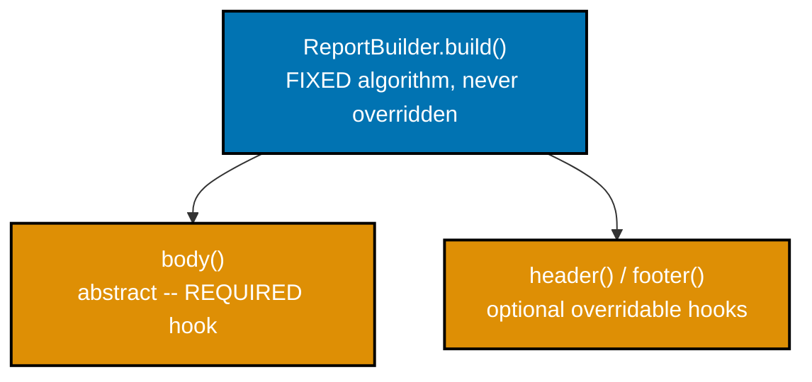

**`learning/code/ex-75-template-method-pattern/example.py`**

```python
"""Example 75: The Template Method Pattern."""

import abc  # => imports the abc module


class ReportBuilder(abc.ABC):  # => ReportBuilder extends abc.ABC
    def build(self) -> str:  # => the FIXED algorithm -- never overridden by subclasses
        return f"{self.header()} | {self.body()} | {self.footer()}"  # => calls the hooks below

    def header(
        self,
    ) -> str:  # => a hook with a sensible default -- optional to override
        return "REPORT"  # => returns this value to the caller

    @abc.abstractmethod  # => marks the next method as required for every subclass
    def body(
        self,
    ) -> str: ...  # => a REQUIRED hook -- every subclass must supply its own

    def footer(self) -> str:  # => another optional hook, with its own default
        return "END"  # => returns this value to the caller


class SalesReport(ReportBuilder):  # => SalesReport extends ReportBuilder
    def body(self) -> str:  # => only overrides the ONE required hook
        return "sales figures"  # => returns this value to the caller


print(
    SalesReport().build()
)  # => the overall flow (build) is fixed; only body() varied per subclass
# => Output: REPORT | sales figures | END
# => `build()` is never overridden by any subclass
```

**Run**: `python3 example.py`

**Output**:

```text
REPORT | sales figures | END
```

**`learning/code/ex-75-template-method-pattern/test_example.py`**

```python
"""Example 75: pytest verification for The Template Method Pattern."""

from example import SalesReport


def test_fixed_flow_with_only_the_required_hook_overridden() -> None:
    assert (
        SalesReport().build() == "REPORT | sales figures | END"
    )  # => header/footer defaults used


# => Run: pytest -- Output: 1 passed
```

**Verify**: `pytest -q`

**Output**:

```text
1 passed
```

**Key takeaway**: `build()` is never overridden by any subclass -- its shape (`header | body | footer`) is fixed forever; only the individual hook methods it calls vary per subclass.

**Why it matters**: This inverts the usual override relationship: instead of a subclass calling `super().method()` to extend the base (Example 44), the base class calls the subclass's hook methods itself, at points the base class alone controls. It is the standard way to guarantee a multi-step process always runs in the same order across every variation.

---

### Example 76: Splitting a Two-Responsibility Class into Composed Collaborators

_ex-76 &middot; exercises co-13, co-02_

A class doing two unrelated jobs at once (formatting AND sending a report) can be split into two single-responsibility collaborators, composed back together by a thin coordinating class. This example refactors exactly that split.

**`learning/code/ex-76-refactor-god-class/example.py`**

```python
"""Example 76: Splitting a Two-Responsibility Class into Composed Collaborators."""


class ReportGenerator:  # => AFTER the refactor -- each collaborator owns ONE responsibility
    def __init__(
        self,
    ) -> None:  # => the constructor -- runs once, automatically, per instantiation
        self.formatter: Formatter = Formatter()  # => composed, not inherited
        self.sender: Sender = Sender()  # => stores sender on this instance

    def send_report(self, data: str) -> str:  # => defines the send_report() method
        formatted: str = self.formatter.format(data)  # => delegates FORMATTING entirely
        return self.sender.send(formatted)  # => delegates SENDING entirely


class Formatter:  # => responsibility #1: turning raw data into a formatted string
    def format(self, data: str) -> str:  # => defines the format() method
        return f"[REPORT] {data}"  # => returns this value to the caller


class Sender:  # => responsibility #2: delivering an already-formatted string
    def send(self, formatted: str) -> str:  # => defines the send() method
        return f"sent: {formatted}"  # => returns this value to the caller


generator: ReportGenerator = ReportGenerator()  # => constructs generator
print(
    generator.send_report("Q3 numbers")
)  # => the same overall behavior, now composed of two units
# => Output: sent: [REPORT] Q3 numbers
# => `Formatter` and `Sender` can each be tested, understood, and changed independently
```

**Run**: `python3 example.py`

**Output**:

```text
sent: [REPORT] Q3 numbers
```

**`learning/code/ex-76-refactor-god-class/test_example.py`**

```python
"""Example 76: pytest verification for Splitting a Two-Responsibility Class into Collaborators."""

from example import Formatter, ReportGenerator, Sender


def test_each_collaborator_has_exactly_one_responsibility() -> None:
    assert Formatter().format("x") == "[REPORT] x"  # => formatting, and only formatting
    assert Sender().send("y") == "sent: y"  # => sending, and only sending


def test_report_generator_still_produces_the_original_behavior() -> None:
    generator: ReportGenerator = ReportGenerator()
    assert generator.send_report("Q3 numbers") == "sent: [REPORT] Q3 numbers"


# => Run: pytest -- Output: 2 passed
```

**Verify**: `pytest -q`

**Output**:

```text
2 passed
```

**Key takeaway**: `Formatter` and `Sender` can each be tested, understood, and changed independently -- `ReportGenerator` itself shrinks to pure coordination, composing the two collaborators rather than doing both jobs itself.

**Why it matters**: A class handling two unrelated responsibilities is harder to test in isolation (testing formatting requires exercising sending too) and harder to change safely (a formatting change risks breaking sending logic that happens to live in the same class). Splitting by responsibility, composed back together, is the direct structural fix for both problems at once.

---

### Example 77: An Invariant Still Holds After a Composition Refactor

_ex-77 &middot; exercises co-17, co-13_

Moving an invariant check out of `BankAccount` and into a dedicated `Validator` collaborator does not weaken the guarantee -- the exact same rule still runs on every deposit, just from a different object. This example re-runs the original invariant test against the refactored version.

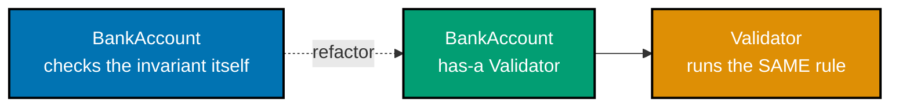

**`learning/code/ex-77-invariant-survives-refactor/example.py`**

```python
"""Example 77: An Invariant Still Holds After a Composition Refactor."""


class Validator:  # => holds the invariant rule as its OWN, testable responsibility
    def check_non_negative(
        self, amount: float
    ) -> None:  # => defines the check_non_negative() method
        if amount < 0:  # => the ORIGINAL invariant, now living in its own collaborator
            raise ValueError(
                "amount must be non-negative"
            )  # => rejects the invalid amount


class BankAccount:  # => now COMPOSED with a Validator, instead of checking inline
    def __init__(
        self,
    ) -> None:  # => the constructor -- runs once, automatically, per instantiation
        self._balance: float = 0.0  # => stores _balance on this instance
        self._validator: Validator = (
            Validator()
        )  # => the invariant now lives in its own object

    def deposit(self, amount: float) -> float:  # => defines the deposit() method
        self._validator.check_non_negative(
            amount
        )  # => delegates the SAME rule as before
        self._balance += amount  # => only reached once the delegated validation passed
        return self._balance  # => returns this value to the caller


account: BankAccount = BankAccount()  # => constructs account
account.deposit(50.0)  # => a valid deposit, routed through the composed Validator
print(account._balance)  # => the happy path still works after the refactor
# => Output: 50.0
# => Refactoring WHERE an invariant lives (from an inline `if` check to a dedicated `Validator` collaborator) is orthogonal to WHETHER the invariant still holds
```

**Run**: `python3 example.py`

**Output**:

```text
50.0
```

**`learning/code/ex-77-invariant-survives-refactor/test_example.py`**

```python
"""Example 77: pytest verification for An Invariant Still Holds After a Composition Refactor."""

import pytest

from example import BankAccount


def test_valid_deposit_still_works_after_refactor() -> None:
    account: BankAccount = BankAccount()
    assert account.deposit(50.0) == 50.0


def test_invariant_still_cannot_be_violated_after_refactor() -> None:
    account: BankAccount = BankAccount()
    with pytest.raises(
        ValueError
    ):  # => the ORIGINAL invariant, now enforced by a collaborator
        account.deposit(-10.0)


# => Run: pytest -- Output: 2 passed
```

**Verify**: `pytest -q`

**Output**:

```text
2 passed
```

**Key takeaway**: Refactoring WHERE an invariant lives (from an inline `if` check to a dedicated `Validator` collaborator) is orthogonal to WHETHER the invariant still holds -- the same two tests from Example 16 pass unchanged.

**Why it matters**: This closes the loop on co-13's central promise: composition refactors change a class's internal structure without changing its externally observable contract. A `Validator` object is also independently reusable and independently testable in a way an inline `if` statement buried in `deposit()` never was. This is the practical reward for refactoring toward composition: the same invariant tests written against the original class keep passing unchanged, proving the refactor was behavior-preserving rather than merely hoped to be.

---

### Example 78: Auto-Registering Subclasses with `__init_subclass__`

_ex-78 &middot; exercises co-15, co-08_

`__init_subclass__` fires automatically every time a subclass is defined -- not instantiated, defined -- making it possible for a base class to maintain a registry of every subclass with zero manual registration calls anywhere.

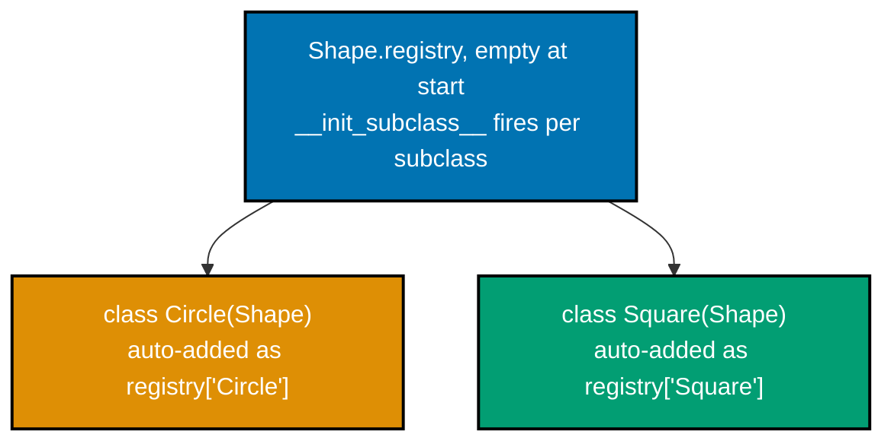

**`learning/code/ex-78-subclass-registry/example.py`**

```python
"""Example 78: Auto-Registering Subclasses with __init_subclass__."""


class Shape:  # => begins the Shape class body
    registry: dict[
        str, type["Shape"]
    ] = {}  # => ONE shared registry, living on the base class

    def __init_subclass__(
        cls, **kwargs: object
    ) -> None:  # => fires automatically at SUBCLASS DEFINITION
        super().__init_subclass__(
            **kwargs
        )  # => cooperates with any other __init_subclass__ in the MRO
        Shape.registry[cls.__name__] = (
            cls  # => registers itself -- no manual call needed anywhere
        )


class Circle(Shape):  # => defining this class alone triggers __init_subclass__
    pass  # => an intentionally empty body


class Square(
    Shape
):  # => same here -- registration happens at class-definition time, not instantiation
    pass  # => an intentionally empty body


print(
    sorted(Shape.registry.keys())
)  # => both subclasses appear, with zero manual registration code
# => Output: ['Circle', 'Square']
# => `__init_subclass__` runs once per subclass, at the moment `class Circle(Shape):` finishes executing
```

**Run**: `python3 example.py`

**Output**:

```text
['Circle', 'Square']
```

**`learning/code/ex-78-subclass-registry/test_example.py`**

```python
"""Example 78: pytest verification for Auto-Registering Subclasses with __init_subclass__."""

from example import Circle, Shape, Square


def test_every_subclass_appears_in_the_registry_on_definition() -> None:
    assert (
        Shape.registry["Circle"] is Circle
    )  # => registered the moment the class was defined
    assert Shape.registry["Square"] is Square


# => Run: pytest -- Output: 1 passed
```

**Verify**: `pytest -q`

**Output**:

```text
1 passed
```

**Key takeaway**: `__init_subclass__` runs once per subclass, at the moment `class Circle(Shape):` finishes executing -- long before anyone ever calls `Circle()` -- which is what makes automatic registration possible with no boilerplate in any subclass.

**Why it matters**: Compare this to a manual registry pattern, where every new subclass author must remember to call `Shape.registry["Circle"] = Circle` themselves -- easy to forget, and a silent gap when they do. `__init_subclass__` makes registration a structural guarantee of subclassing `Shape` at all, not an opt-in extra step. This pattern underlies plugin-discovery systems in real frameworks, where every subclass of a base plugin class needs to become automatically discoverable without every plugin author remembering a manual registration step.

---

### Example 79: A Full Domain Model in One Package

_ex-79 &middot; exercises co-02, co-06, co-11, co-13_

This example assembles four ideas from across the topic into one small but complete package: a `@dataclass` value object, an `abc.ABC` interface with a concrete implementation, an encapsulated entity with an invariant, and composition over inheritance -- all working together, verified end-to-end with `pytest`.

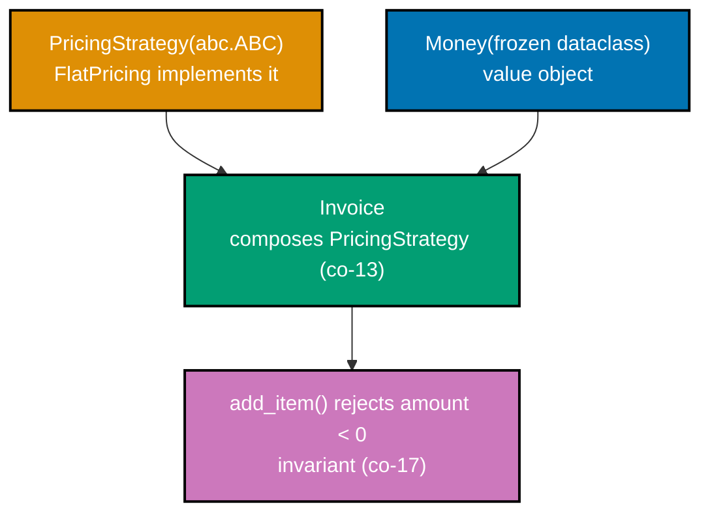

**`learning/code/ex-79-full-domain-model/example.py`**

```python
"""Example 79: A Full Domain Model in One Package."""

import abc  # => imports the abc module
from dataclasses import dataclass  # => imports dataclass from dataclasses


@dataclass(frozen=True)  # => co-06: a dataclass value object
class Money:  # => begins the Money class body
    amount: int  # => a required dataclass field, part of the generated __init__


class PricingStrategy(abc.ABC):  # => co-11: an ABC interface
    @abc.abstractmethod  # => marks the next method as required for every subclass
    def price(
        self, base: Money
    ) -> Money: ...  # => no body -- FlatPricing below supplies one


class FlatPricing(PricingStrategy):  # => FlatPricing extends PricingStrategy
    def price(self, base: Money) -> Money:  # => defines the price() method
        return base  # => no adjustment -- the simplest possible strategy


class Invoice:  # => co-02: an encapsulated entity with an invariant
    def __init__(
        self, pricing: PricingStrategy
    ) -> None:  # => co-13: pricing is COMPOSED, not inherited
        self._pricing: PricingStrategy = pricing  # => stores _pricing on this instance
        self._total: Money = Money(
            0
        )  # => private state, only ever changed through add_item

    def add_item(self, base: Money) -> None:  # => defines the add_item() method
        if base.amount < 0:  # => the invariant: no negative line item is ever accepted
            raise ValueError(
                "item amount must be non-negative"
            )  # => co-17: rejects it entirely
        priced: Money = self._pricing.price(base)  # => delegates the pricing decision
        self._total = Money(
            self._total.amount + priced.amount
        )  # => accumulates the running total

    @property  # => marks the next method as a computed attribute
    def total(self) -> Money:  # => defines the total() method
        return self._total  # => returns this value to the caller


invoice: Invoice = Invoice(FlatPricing())  # => constructs invoice
invoice.add_item(Money(500))  # => adds the first, valid line item
invoice.add_item(Money(300))  # => adds a second, valid line item
print(
    invoice.total.amount
)  # => every piece (value object, ABC, composition, invariant) working together
# => Output: 800
# => `Invoice` composes a `PricingStrategy` (co-13, co-11), accumulates `Money` value objects (co-06), and enforces its own invariant (co-02, co-17)
```

**Run**: `python3 example.py`

**Output**:

```text
800
```

**`learning/code/ex-79-full-domain-model/test_example.py`**

```python
"""Example 79: pytest verification for A Full Domain Model in One Package."""

import pytest

from example import FlatPricing, Invoice, Money


def test_full_domain_model_computes_correct_total() -> None:
    invoice: Invoice = Invoice(FlatPricing())
    invoice.add_item(Money(500))
    invoice.add_item(Money(300))
    assert invoice.total == Money(800)  # => Money's dataclass __eq__ compares by value


def test_full_domain_model_rejects_negative_line_item() -> None:
    invoice: Invoice = Invoice(FlatPricing())
    with pytest.raises(ValueError):
        invoice.add_item(Money(-1))


# => Run: pytest -- Output: 2 passed
```

**Verify**: `pytest -q`

**Output**:

```text
2 passed
```

**Key takeaway**: `Invoice` composes a `PricingStrategy` (co-13, co-11), accumulates `Money` value objects (co-06), and enforces its own invariant (co-02, co-17) -- four separately-taught ideas cooperating in about twenty lines.

**Why it matters**: This is a compact rehearsal of the capstone's own shape: no single concept in this topic is meant to be used in isolation in a real codebase. A genuinely useful domain model almost always combines encapsulated entities, dataclass value objects, an interface for the parts that vary, and composition to wire it all together.

---

### Example 80: A Property-Based Test of an Invariant

_ex-80 &middot; exercises co-17, co-07_

Instead of hand-picking a handful of test inputs, this example throws hundreds of randomly generated values -- spanning both valid and invalid ranges -- at `Percentage`'s invariant, checking that no successfully constructed instance ever holds an out-of-range value.

**`learning/code/ex-80-property-based-invariant-test/example.py`**

```python
"""Example 80: A Property-Based Test of an Invariant."""

import random  # => imports the random module


class Percentage:  # => begins the Percentage class body
    def __init__(
        self, value: float
    ) -> None:  # => the constructor -- runs once, automatically, per instantiation
        self.value = value  # => routes through the validating setter below

    @property  # => marks the next method as a computed attribute
    def value(self) -> float:  # => defines the value() method
        return self._value  # => returns this value to the caller

    @value.setter  # => marks the next method as value's validating setter
    def value(self, v: float) -> None:  # => defines the value() method
        if not (
            0 <= v <= 100
        ):  # => the invariant EVERY constructed instance must satisfy
            raise ValueError(
                "value must be between 0 and 100"
            )  # => rejects out-of-range values
        self._value = v  # => stores _value on this instance


def random_valid_or_invalid(
    rng: random.Random,
) -> float:  # => generates BOTH in- and out-of-range values
    return rng.uniform(
        -50, 150
    )  # => a wide range spanning valid (0-100) and invalid values


rng: random.Random = random.Random(42)  # => a FIXED seed makes this run reproducible
violations: int = 0  # => tallies any successfully constructed, out-of-range Percentage
for _ in range(
    500
):  # => hundreds of randomized inputs, not just a handful of hand-picked ones
    candidate: float = random_valid_or_invalid(rng)  # => constructs candidate
    try:  # => the block below is expected to raise
        p: Percentage = Percentage(candidate)  # => constructs p
        if not (
            0 <= p.value <= 100
        ):  # => if construction ever SUCCEEDS with a bad value, that's a bug
            violations += (
                1  # => would indicate the invariant was violated -- should never happen
            )
    except ValueError:  # => catches the ValueError raised above
        pass  # => the expected outcome for an out-of-range candidate
print(
    violations
)  # => zero means no generated input ever reached an invalid constructed state
# => Output: 0
# => Testing an invariant against hundreds of randomized inputs is a much stronger claim than a couple of hand-picked edge cases
```

**Run**: `python3 example.py`

**Output**:

```text
0
```

**`learning/code/ex-80-property-based-invariant-test/test_example.py`**

```python
"""Example 80: pytest verification for A Property-Based Test of an Invariant."""

import random

from example import Percentage


def test_no_randomized_input_reaches_an_invalid_state() -> None:
    rng: random.Random = random.Random(
        1234
    )  # => a different, still-fixed seed for reproducibility
    for _ in range(500):
        candidate: float = rng.uniform(-50, 150)
        try:
            p: Percentage = Percentage(candidate)
        except ValueError:
            continue  # => rejection is the correct outcome for an out-of-range candidate
        assert (
            0 <= p.value <= 100
        )  # => any SUCCESSFULLY constructed instance must satisfy the invariant


# => Run: pytest -- Output: 1 passed
```

**Verify**: `pytest -q`

**Output**:

```text
1 passed
```

**Key takeaway**: Testing an invariant against hundreds of randomized inputs, not just a couple of hand-picked edge cases, is a much stronger claim that "no input reaches an invalid state" -- and a fixed random seed keeps the run reproducible.

**Why it matters**: Hand-picked test cases only prove the invariant holds for the specific values a test author happened to think of. Generating hundreds of values across a wide range -- deliberately including plenty of invalid ones, to confirm they are correctly rejected too -- is a meaningfully stronger check that co-17's "never enter an invalid state from anywhere" promise genuinely holds.

---

← Previous: [Intermediate Examples](./intermediate.md) · Next: [Capstone](./capstone/overview.md) →
