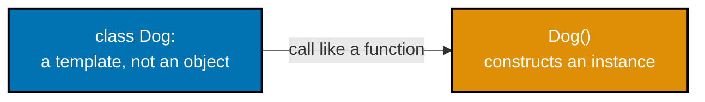
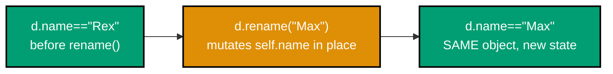
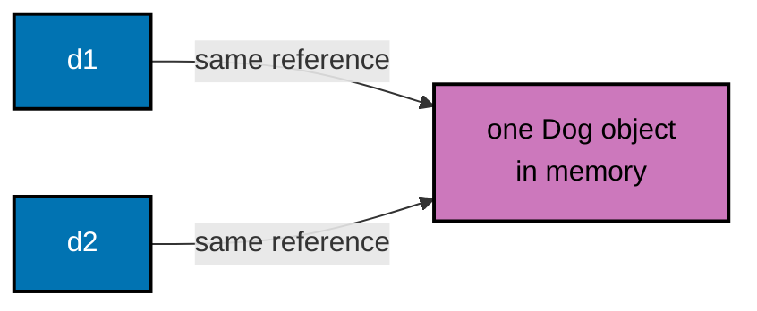
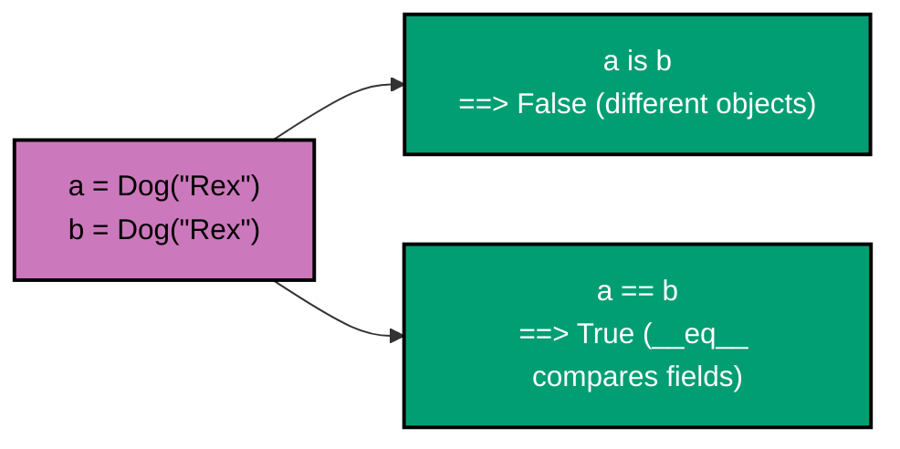
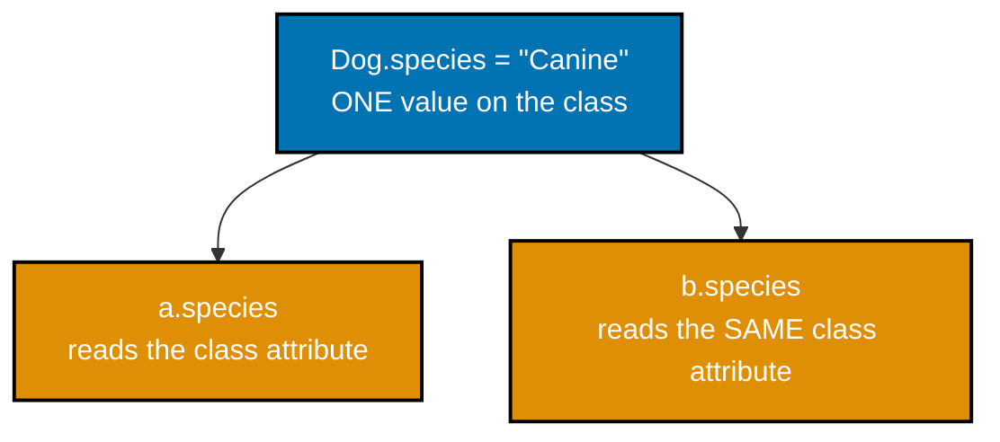
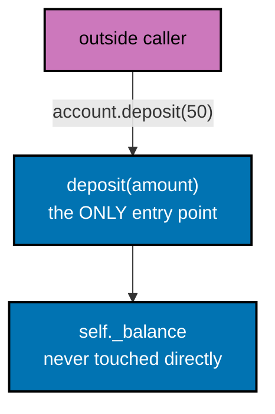
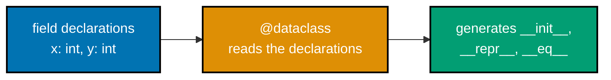
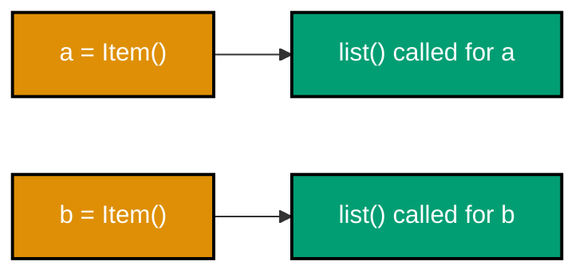
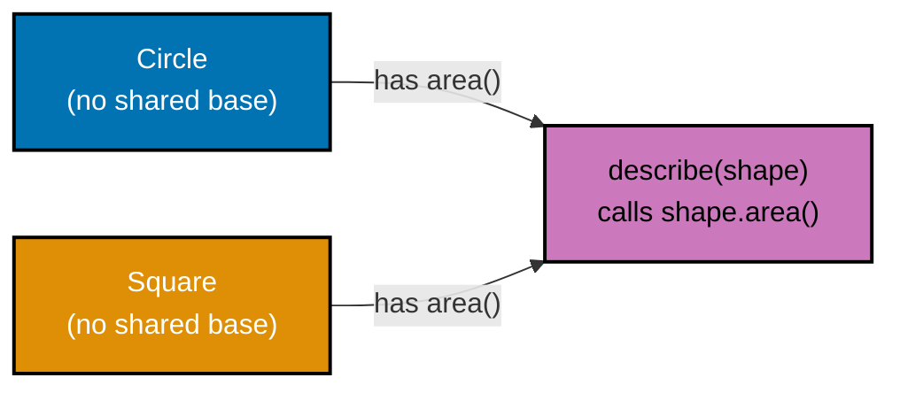

Examples 1-28 build the foundational vocabulary of Python OOP: defining a class and constructing instances, initializing fields in `__init__`, methods that read and mutate instance state, identity (`is`) versus equality (`==`), `__repr__`/`__str__` for debugging, class versus instance attributes, encapsulating a guarded balance, the underscore and double-underscore naming conventions, and `@dataclass` value objects through `__post_init__` validation. Every example is a complete, self-contained `example.py` colocated under `learning/code/`, verified two ways: `python3 example.py` prints its own expected output inline via `# =>` comments, and a colocated `test_example.py` asserts the same behavior under `pytest`.

---

### Example 1: Define a Minimal Class

_ex-01 &middot; exercises co-01_

The smallest possible class is just a name and a body of `pass` -- Python still creates a first-class type object you can instantiate immediately. This example defines `Dog` with no fields or methods at all and confirms `type()` reports it as a genuine class.



**`learning/code/ex-01-define-minimal-class/example.py`**

```python
"""Example 1: Define a Minimal Class."""


class Dog:  # => defines a new class named Dog -- a template, not yet an object
    pass  # => no fields or methods yet; a class body cannot be entirely empty in Python


d: Dog = Dog()  # => calling the class like a function CONSTRUCTS an instance
# => d is now a real object: the class Dog acted as a factory that built it
print(type(d) is Dog)  # => type(d) returns the exact class used to build d
# => Output: True
```

**Run**: `python3 example.py`

**Output**:

```text
True
```

**`learning/code/ex-01-define-minimal-class/test_example.py`**

```python
"""Example 1: pytest verification for Define a Minimal Class."""

from example import Dog  # => imports the class under test


def test_instance_type_matches_class() -> None:
    d: Dog = Dog()  # => constructs a fresh Dog instance
    assert type(d) is Dog  # => the built object's exact type is the Dog class itself


# => Run: pytest -- Output: 1 passed
```

**Verify**: `pytest -q`

**Output**:

```text
1 passed
```

**Key takeaway**: Calling a class like a function constructs a new instance; `type(instance) is TheClass` confirms the class actually built it.

**Why it matters**: Every other concept in this topic builds on top of a class producing independent instances -- encapsulation, equality, inheritance, and composition all presuppose that a class is a factory for distinct objects, not the objects themselves. Confirming `type(d) is Dog` here is the smallest possible proof that instantiation genuinely happened, before any field or method complicates the picture.

---

### Example 2: Initialize Fields in `__init__`

_ex-02 &middot; exercises co-01_

`__init__` runs automatically the moment `Dog(...)` is called, and anything it assigns onto `self` becomes that instance's own state. This example gives `Dog` a `name` field and confirms the constructor argument actually lands on the built object.

**`learning/code/ex-02-init-with-fields/example.py`**

```python
"""Example 2: Initialize Fields in __init__."""


class Dog:  # => begins the Dog class body
    def __init__(
        self, name: str
    ) -> None:  # => runs automatically when Dog(...) is called
        self.name = name  # => stores the argument on THIS instance's own namespace


d: Dog = Dog("Rex")  # => __init__ runs immediately, setting d.name to "Rex"
print(d.name)  # => reads the instance attribute set inside __init__
# => Output: Rex
# => `__init__(self, ...)` is where constructor arguments become instance state, via plain `self.field = value` assignment
```

**Run**: `python3 example.py`

**Output**:

```text
Rex
```

**`learning/code/ex-02-init-with-fields/test_example.py`**

```python
"""Example 2: pytest verification for Initialize Fields in __init__."""

from example import Dog


def test_init_sets_name_field() -> None:
    assert (
        Dog("Rex").name == "Rex"
    )  # => __init__ stored the constructor argument on the instance


# => Run: pytest -- Output: 1 passed
```

**Verify**: `pytest -q`

**Output**:

```text
1 passed
```

**Key takeaway**: `__init__(self, ...)` is where constructor arguments become instance state, via plain `self.field = value` assignment.

**Why it matters**: `__init__` is the single most common place a class's invariants start life, because it is the first code that ever runs for a new instance. Every later concept in this topic that validates state on construction (co-17) hooks into exactly this method, so understanding it as "an ordinary function that happens to run automatically" matters before any validation logic is layered on top of it.

---

### Example 3: Define an Instance Method

_ex-03 &middot; exercises co-01_

A method is a function defined inside a class body whose first parameter, `self`, is bound automatically to the instance it was called on. This example adds `bark()` to `Dog` and calls it through the familiar `d.bark()` dot syntax.

**`learning/code/ex-03-instance-method/example.py`**

```python
"""Example 3: Define an Instance Method."""


class Dog:  # => begins the Dog class body
    def __init__(
        self, name: str
    ) -> None:  # => the constructor -- runs once, automatically, per instantiation
        self.name = name  # => per-instance state, unrelated to the method below

    def bark(
        self,
    ) -> str:  # => an instance method: self is bound automatically on d.bark()
        return "woof"  # => a method body is ordinary Python code, same as any function


d: Dog = Dog("Rex")  # => constructs d
print(
    d.bark()
)  # => d.bark() implicitly passes d as self -- no argument needed at the call site
# => Output: woof
# => `d.bark()` and `def bark(self)` are two halves of the same mechanism: the dot-call syntax implicitly supplies `self`
```

**Run**: `python3 example.py`

**Output**:

```text
woof
```

**`learning/code/ex-03-instance-method/test_example.py`**

```python
"""Example 3: pytest verification for Define an Instance Method."""

from example import Dog


def test_bark_returns_woof() -> None:
    d: Dog = Dog("Rex")
    assert (
        d.bark() == "woof"
    )  # => calling the instance method returns its literal string


# => Run: pytest -- Output: 1 passed
```

**Verify**: `pytest -q`

**Output**:

```text
1 passed
```

**Key takeaway**: `d.bark()` and `def bark(self)` are two halves of the same mechanism: the dot-call syntax implicitly supplies `self`.

**Why it matters**: Methods are how behavior stays attached to the data it operates on, instead of living as free-floating functions that need the object passed in every time. Example 28 later demystifies exactly how `self` gets bound, but this example is the first proof that a method is just a function reached through an instance.

---

### Example 4: A Method That Reads Instance State

_ex-04 &middot; exercises co-01_

A method's body can reach back into `self` to read whatever `__init__` (or any other method) previously stored there. This example builds a greeting string from `self.name` inside `greet()`.

**`learning/code/ex-04-method-reads-state/example.py`**

```python
"""Example 4: A Method That Reads Instance State."""


class Dog:  # => begins the Dog class body
    def __init__(
        self, name: str
    ) -> None:  # => the constructor -- runs once, automatically, per instantiation
        self.name = name  # => state greet() below will read back out

    def greet(
        self,
    ) -> str:  # => a method that builds its return value FROM self's own state
        return f"Hi, I'm {self.name}"  # => f-string interpolates self.name at call time


d: Dog = Dog("Rex")  # => constructs d
message: str = d.greet()  # => greet() reaches into self.name to build the sentence
print(message)  # => confirms the instance's own name flows through the method
# => Output: Hi, I'm Rex
# => A method's return value can be built entirely from `self`'s own fields, with no external arguments needed
```

**Run**: `python3 example.py`

**Output**:

```text
Hi, I'm Rex
```

**`learning/code/ex-04-method-reads-state/test_example.py`**

```python
"""Example 4: pytest verification for A Method That Reads Instance State."""

from example import Dog


def test_greet_contains_instance_name() -> None:
    d: Dog = Dog("Rex")
    assert "Rex" in d.greet()  # => the returned string embeds this instance's own name


# => Run: pytest -- Output: 1 passed
```

**Verify**: `pytest -q`

**Output**:

```text
1 passed
```

**Key takeaway**: A method's return value can be built entirely from `self`'s own fields, with no external arguments needed.

**Why it matters**: This is the pattern almost every read-only method in this topic follows: reach into `self`, derive a value, return it. Properties (co-07) formalize this exact pattern later so the caller does not even need to know a method call is happening underneath the attribute-looking syntax. In production code this shape covers most computed values -- a cart total, a display name, an elapsed duration -- because deriving on demand from existing state avoids the far more common bug of a cached field silently drifting out of sync.

---

### Example 5: Multiple Instances Stay Independent

_ex-05 &middot; exercises co-01_

Each call to `Dog(...)` builds a separate object with its own `self.name` binding -- nothing about one instance's state leaks into another's. This example constructs two dogs and confirms neither one's name affects the other.

**`learning/code/ex-05-multiple-instances-independent/example.py`**

```python
"""Example 5: Multiple Instances Stay Independent."""


class Dog:  # => begins the Dog class body
    def __init__(
        self, name: str
    ) -> None:  # => the constructor -- runs once, automatically, per instantiation
        self.name = name  # => each Dog() call creates a SEPARATE self.name binding


rex: Dog = Dog("Rex")  # => first instance, its own name attribute
fido: Dog = Dog("Fido")  # => second instance, a completely different name attribute
print(rex.name, fido.name)  # => neither instance's name leaked into the other
# => Output: Rex Fido
# => Instance attributes set inside `__init__` are per-object by default
```

**Run**: `python3 example.py`

**Output**:

```text
Rex Fido
```

**`learning/code/ex-05-multiple-instances-independent/test_example.py`**

```python
"""Example 5: pytest verification for Multiple Instances Stay Independent."""

from example import Dog


def test_instances_keep_separate_names() -> None:
    rex: Dog = Dog("Rex")
    fido: Dog = Dog("Fido")
    assert (
        rex.name == "Rex" and fido.name == "Fido"
    )  # => no cross-talk between the two objects


# => Run: pytest -- Output: 1 passed
```

**Verify**: `pytest -q`

**Output**:

```text
1 passed
```

**Key takeaway**: Instance attributes set inside `__init__` are per-object by default -- two instances never share them unless a class attribute (co-14) is involved instead.

**Why it matters**: This independence is the whole point of instances existing at all: a program can model an unbounded number of dogs, bank accounts, or orders, each with its own state, from one class definition. Example 51 later shows the one common way this independence accidentally breaks -- a mutable value declared on the class instead of inside `__init__`.

---

### Example 6: A Method That Mutates Instance State

_ex-06 &middot; exercises co-01_

A method can reassign `self`'s own fields, permanently changing the object it was called on rather than returning a new one. This example adds `rename()`, which mutates `self.name` in place and returns nothing.



**`learning/code/ex-06-method-mutates-state/example.py`**

```python
"""Example 6: A Method That Mutates Instance State."""


class Dog:  # => begins the Dog class body
    def __init__(
        self, name: str
    ) -> None:  # => the constructor -- runs once, automatically, per instantiation
        self.name = name  # => starting value rename() below will overwrite

    def rename(
        self, new: str
    ) -> None:  # => mutates self in place; returns nothing (None)
        self.name = new  # => reassigns the SAME instance's name attribute


d: Dog = Dog("Rex")  # => constructs d
d.rename("Max")  # => mutates d.name -- there is no new Dog object here
print(d.name)  # => reads back the mutated value from the same instance
# => Output: Max
# => A method that mutates `self` and returns `None` is Python's normal shape for changing an object in place
```

**Run**: `python3 example.py`

**Output**:

```text
Max
```

**`learning/code/ex-06-method-mutates-state/test_example.py`**

```python
"""Example 6: pytest verification for A Method That Mutates Instance State."""

from example import Dog


def test_rename_mutates_name_in_place() -> None:
    d: Dog = Dog("Rex")
    d.rename("Max")  # => mutates the existing instance
    assert d.name == "Max"  # => the SAME object now reports the new name


# => Run: pytest -- Output: 1 passed
```

**Verify**: `pytest -q`

**Output**:

```text
1 passed
```

**Key takeaway**: A method that mutates `self` and returns `None` is Python's normal shape for "change this object in place", as opposed to a method that returns a brand-new value.

**Why it matters**: Recognizing mutating methods (`-> None`, changes `self`) versus pure methods (return a value, change nothing) matters for reasoning about a program's state over time. co-02's encapsulation and co-17's invariant enforcement both depend on controlling exactly which methods are allowed to mutate state, and this is the first one that does.

---

### Example 7: A Default `__init__` Argument

_ex-07 &middot; exercises co-01_

`__init__` parameters can carry default values exactly like any other Python function, letting a caller omit an argument entirely. This example gives `Dog` a `legs` field that defaults to `4` when the caller does not specify one.

**`learning/code/ex-07-default-init-argument/example.py`**

```python
"""Example 7: A Default __init__ Argument."""


class Dog:  # => begins the Dog class body
    def __init__(
        self, name: str, legs: int = 4
    ) -> None:  # => legs defaults when omitted
        self.name = name  # => stores name on this instance
        self.legs = legs  # => uses the caller's value, or 4 if none was given


d: Dog = Dog("Rex")  # => legs omitted entirely -- Python supplies the default
print(d.legs)  # => confirms the default actually applied
# => Output: 4
# => `__init__` default arguments work exactly like default arguments on any function
```

**Run**: `python3 example.py`

**Output**:

```text
4
```

**`learning/code/ex-07-default-init-argument/test_example.py`**

```python
"""Example 7: pytest verification for A Default __init__ Argument."""

from example import Dog


def test_default_legs_applies_when_omitted() -> None:
    assert (
        Dog("Rex").legs == 4
    )  # => no legs= argument supplied, so the default (4) is used


def test_explicit_legs_overrides_default() -> None:
    assert (
        Dog("Tripod", legs=3).legs == 3
    )  # => an explicit argument overrides the default


# => Run: pytest -- Output: 2 passed
```

**Verify**: `pytest -q`

**Output**:

```text
2 passed
```

**Key takeaway**: `__init__` default arguments work exactly like default arguments on any function -- the caller can omit them, or override them by name.

**Why it matters**: Optional constructor arguments let a class support both a minimal, common call shape and a fully-specified one from the same `__init__`, without needing separate constructor methods for each. Example 24 later shows the one case where a default value needs a different mechanism entirely -- a mutable default. Real APIs lean on this constantly: most callers accept the sensible default, and only the callers with unusual requirements need to spell the argument out explicitly.

---

### Example 8: `__repr__` for Debugging

_ex-08 &middot; exercises co-04_

`__repr__` is the method Python calls to build the developer-facing string for an object -- used by `print()`, the REPL, and every traceback. This example defines `__repr__` to show the exact field values a `Dog` was built with.

**`learning/code/ex-08-repr-for-debugging/example.py`**

```python
"""Example 8: __repr__ for Debugging."""


class Dog:  # => begins the Dog class body
    def __init__(
        self, name: str
    ) -> None:  # => the constructor -- runs once, automatically, per instantiation
        self.name = name  # => stores name on this instance

    def __repr__(self) -> str:  # => called by print(), the REPL, and every traceback
        return f"Dog(name={self.name!r})"  # => !r formats name WITH quotes, like Python source


d: Dog = Dog("Rex")  # => constructs d
print(repr(d))  # => repr() calls __repr__ directly
# => Output: Dog(name='Rex')
# => `__repr__` controls how an object prints everywhere
```

**Run**: `python3 example.py`

**Output**:

```text
Dog(name='Rex')
```

**`learning/code/ex-08-repr-for-debugging/test_example.py`**

```python
"""Example 8: pytest verification for __repr__ for Debugging."""

from example import Dog


def test_repr_matches_expected_string() -> None:
    d: Dog = Dog("Rex")
    assert repr(d) == "Dog(name='Rex')"  # => the exact string __repr__ returns


# => Run: pytest -- Output: 1 passed
```

**Verify**: `pytest -q`

**Output**:

```text
1 passed
```

**Key takeaway**: `__repr__` controls how an object prints everywhere -- `print()`, the REPL, and tracebacks all route through it, so it is worth writing deliberately.

**Why it matters**: Without a custom `__repr__`, printing an object shows only its memory address -- useless for debugging. A `__repr__` that shows the field values (or, per Example 53, the exact constructor call) turns every `print(obj)` and every traceback into actionable information instead of an opaque pointer. This is one of the highest-leverage five minutes a class author can spend, because every future debugging session for that class benefits from it.

---

### Example 9: str vs. repr

_ex-09 &middot; exercises co-04_

`__str__` and `__repr__` can return different strings for different audiences: `__repr__` for developers, `__str__` for end users. This example gives `Dog` both, and confirms `str()` prefers `__str__` while `repr()` always calls `__repr__`.

**`learning/code/ex-09-str-vs-repr/example.py`**

```python
"""Example 9: str vs. repr."""


class Dog:  # => begins the Dog class body
    def __init__(
        self, name: str
    ) -> None:  # => the constructor -- runs once, automatically, per instantiation
        self.name = name  # => stores name on this instance

    def __repr__(self) -> str:  # => developer-facing, unambiguous
        return f"Dog(name={self.name!r})"  # => returns this value to the caller

    def __str__(self) -> str:  # => end-user-facing, readable prose
        return f"a dog named {self.name}"  # => deliberately different wording from __repr__


d: Dog = Dog("Rex")  # => constructs d
print(str(d), "|", repr(d))  # => str() prefers __str__; repr() always calls __repr__
# => Output: a dog named Rex | Dog(name='Rex')
# => `str(obj)` prefers `__str__` and falls back to `__repr__` only when `__str__` is absent
```

**Run**: `python3 example.py`

**Output**:

```text
a dog named Rex | Dog(name='Rex')
```

**`learning/code/ex-09-str-vs-repr/test_example.py`**

```python
"""Example 9: pytest verification for str vs. repr."""

from example import Dog


def test_str_and_repr_return_different_strings() -> None:
    d: Dog = Dog("Rex")
    assert str(d) != repr(d)  # => two distinct string forms exist for the same object
    assert str(d) == "a dog named Rex"
    assert repr(d) == "Dog(name='Rex')"


# => Run: pytest -- Output: 1 passed
```

**Verify**: `pytest -q`

**Output**:

```text
1 passed
```

**Key takeaway**: `str(obj)` prefers `__str__` and falls back to `__repr__` only when `__str__` is absent; `repr(obj)` always calls `__repr__` directly.

**Why it matters**: Many classes only ever need `__repr__` -- Python's fallback already makes `str()` reuse it when no `__str__` exists. Defining both is worth doing specifically when the developer-facing and end-user-facing strings genuinely need to differ, as with a class whose repr shows internal field names a user should never see. Getting this distinction right matters most in user-facing applications, where a debugging-oriented repr leaking into an error message a customer sees looks unprofessional and confusing.

---

### Example 10: Identity with is

_ex-10 &middot; exercises co-03_

`is` compares whether two names refer to the exact same object in memory, not whether their field values happen to match. This example aliases one `Dog` object under a second name and confirms `is` reports them as identical.



**`learning/code/ex-10-identity-with-is/example.py`**

```python
"""Example 10: Identity with is."""


class Dog:  # => begins the Dog class body
    def __init__(
        self, name: str
    ) -> None:  # => the constructor -- runs once, automatically, per instantiation
        self.name = name  # => stores name on this instance


a: Dog = Dog("Rex")  # => constructs exactly one Dog object
b: Dog = a  # => b is a NEW NAME for the SAME object -- no new Dog is constructed here
print(a is b)  # => is compares OBJECT IDENTITY, not field values
# => Output: True
# => `b = a` creates a second name for the same object, not a copy
```

**Run**: `python3 example.py`

**Output**:

```text
True
```

**`learning/code/ex-10-identity-with-is/test_example.py`**

```python
"""Example 10: pytest verification for Identity with is."""

from example import Dog


def test_aliased_name_is_identical_object() -> None:
    a: Dog = Dog("Rex")
    b: Dog = a  # => an alias, not a copy
    assert a is b  # => both names refer to the exact same object in memory


# => Run: pytest -- Output: 1 passed
```

**Verify**: `pytest -q`

**Output**:

```text
1 passed
```

**Key takeaway**: `b = a` creates a second name for the same object, not a copy -- `a is b` is `True` because there is only ever one `Dog` here.

**Why it matters**: `is` is the correct tool for exactly two situations: checking against `None`, and confirming two references point at one shared object. Example 11 immediately shows the opposite case -- two genuinely separate objects -- to make the contrast between identity and equality concrete before `__eq__` is introduced. Reaching for `==` instead of `is` for a `None` check works by accident today but breaks the moment a class defines its own `__eq__`, which is why style guides insist on `is None` specifically.

---

### Example 11: Default Equality Falls Back to Identity

_ex-11 &middot; exercises co-03_

Without a custom `__eq__`, Python's `==` operator falls back to the same check as `is` -- object identity. This example builds two separately constructed `Dog` objects with the same name and shows `==` reports them as unequal anyway.

**`learning/code/ex-11-default-equality-is-identity/example.py`**

```python
"""Example 11: Default Equality Falls Back to Identity."""


class Dog:  # => begins the Dog class body
    def __init__(
        self, name: str
    ) -> None:  # => the constructor -- runs once, automatically, per instantiation
        self.name = (
            name  # => no __eq__ defined -- Python uses object's default comparison
        )


a: Dog = Dog("Rex")  # => first, independent object
b: Dog = Dog("Rex")  # => second, independent object with the SAME name value
print(
    a == b
)  # => without __eq__, == falls back to `is` -- identical VALUES, different OBJECTS
# => Output: False
# => A class with no `__eq__` compares by identity even if `==` is the operator written
```

**Run**: `python3 example.py`

**Output**:

```text
False
```

**`learning/code/ex-11-default-equality-is-identity/test_example.py`**

```python
"""Example 11: pytest verification for Default Equality Falls Back to Identity."""

from example import Dog


def test_equal_looking_objects_compare_false_without_eq() -> None:
    a: Dog = Dog("Rex")
    b: Dog = Dog("Rex")  # => same name, but a DIFFERENT object
    assert (
        a != b
    )  # => default equality is identity: two distinct objects are never equal


# => Run: pytest -- Output: 1 passed
```

**Verify**: `pytest -q`

**Output**:

```text
1 passed
```

**Key takeaway**: A class with no `__eq__` compares by identity even if `==` is the operator written -- two separately built objects with identical fields are still unequal.

**Why it matters**: This default surprises many newcomers, who expect `==` to mean "same values" the way it does for `int` or `str`. Understanding that `object`'s default `__eq__` is really identity comparison is the reason Example 12 exists: opting into value equality is always an explicit, deliberate choice a class author makes. Forgetting this is a common source of bugs in real code, where two freshly-constructed objects that look identical on paper fail an equality check that a developer assumed would just work.

---

### Example 12: Define `__eq__` for Value Comparison

_ex-12 &middot; exercises co-03, co-05_

Overriding `__eq__` lets a class define what "equal" means in terms of its own field values, rather than accepting the identity-based default. This example makes two `Dog` objects with the same name compare equal.



**`learning/code/ex-12-define-eq/example.py`**

```python
"""Example 12: Define __eq__ for Value Comparison."""


class Dog:  # => begins the Dog class body
    def __init__(
        self, name: str
    ) -> None:  # => the constructor -- runs once, automatically, per instantiation
        self.name = name  # => stores name on this instance

    def __eq__(
        self, other: object
    ) -> bool:  # => other is `object`, not Dog -- must narrow it
        if not isinstance(
            other, Dog
        ):  # => guards against comparing a Dog to an unrelated type
            return NotImplemented  # => lets Python try the other object's __eq__ next
        return self.name == other.name  # => value equality: same name means equal dogs


a: Dog = Dog("Rex")  # => constructs a
b: Dog = Dog("Rex")  # => a different object, but the same name
print(a == b)  # => now == compares VALUES, not identity
# => Output: True
# => `__eq__` should `isinstance`-check `other` first and return `NotImplemented` for unrelated types
```

**Run**: `python3 example.py`

**Output**:

```text
True
```

**`learning/code/ex-12-define-eq/test_example.py`**

```python
"""Example 12: pytest verification for Define __eq__ for Value Comparison."""

from example import Dog


def test_same_name_dogs_compare_equal() -> None:
    a: Dog = Dog("Rex")
    b: Dog = Dog("Rex")
    assert a == b  # => __eq__ now compares name, not object identity


def test_different_name_dogs_compare_unequal() -> None:
    assert Dog("Rex") != Dog("Fido")  # => different name values are never equal


# => Run: pytest -- Output: 2 passed
```

**Verify**: `pytest -q`

**Output**:

```text
2 passed
```

**Key takeaway**: `__eq__(self, other: object) -> bool` should `isinstance`-check `other` first and return `NotImplemented` for unrelated types, then compare the fields that define equality.

**Why it matters**: This `isinstance` guard is not decoration -- returning `NotImplemented` (not `False`) for an unrelated type lets Python fall back to the other object's own `__eq__`, which is what makes comparisons against genuinely unrelated types behave correctly instead of just silently returning `False` for everything. Getting this contract right matters in any codebase with more than one value-object type, because comparing a `Money` to a `Distance` should raise or fall through cleanly, not silently claim they are unequal by coincidence.

---

### Example 13: A Shared Class Attribute

_ex-13 &middot; exercises co-14_

An attribute declared directly in the class body, outside `__init__`, lives on the class itself and is shared by every instance that has not overridden it. This example gives `Dog` a `species` class attribute both instances read identically.



**`learning/code/ex-13-class-attribute-shared/example.py`**

```python
"""Example 13: A Shared Class Attribute."""


class Dog:  # => begins the Dog class body
    species: str = (
        "canine"  # => declared on the CLASS, not inside __init__ -- one shared value
    )

    def __init__(
        self, name: str
    ) -> None:  # => the constructor -- runs once, automatically, per instantiation
        self.name = name  # => this one IS per-instance


a: Dog = Dog("Rex")  # => constructs a
b: Dog = Dog("Fido")  # => constructs b
print(a.species, b.species)  # => both instances read the SAME class attribute
# => Output: canine canine
# => A field declared in the class body, not inside `__init__`, is a class attribute
```

**Run**: `python3 example.py`

**Output**:

```text
canine canine
```

**`learning/code/ex-13-class-attribute-shared/test_example.py`**

```python
"""Example 13: pytest verification for A Shared Class Attribute."""

from example import Dog


def test_instances_share_class_attribute() -> None:
    a: Dog = Dog("Rex")
    b: Dog = Dog("Fido")
    assert a.species == b.species == "canine"  # => both read the one class-level value


# => Run: pytest -- Output: 1 passed
```

**Verify**: `pytest -q`

**Output**:

```text
1 passed
```

**Key takeaway**: A field declared in the class body, not inside `__init__`, is a class attribute -- one value shared across every instance until an instance shadows it locally.

**Why it matters**: Class attributes are the right tool for genuinely shared constants (like `species` here) but a trap for anything meant to be mutable per-instance state -- Example 51 shows the exact bug that results from confusing the two. Recognizing "declared in the class body" versus "assigned inside `__init__`" is the whole distinction.

---

### Example 14: An Instance Attribute Shadows the Class Attribute

_ex-14 &middot; exercises co-14_

Assigning to `instance.attr` creates a brand-new instance attribute with that name, which shadows (but does not modify) the class attribute of the same name. This example reassigns `species` on one `Dog` and confirms the other is unaffected.

**`learning/code/ex-14-instance-shadows-class-attr/example.py`**

```python
"""Example 14: An Instance Attribute Shadows the Class Attribute."""


class Dog:  # => begins the Dog class body
    species: str = "canine"  # => the shared default every instance starts out reading

    def __init__(
        self, name: str
    ) -> None:  # => the constructor -- runs once, automatically, per instantiation
        self.name = name  # => stores name on this instance


a: Dog = Dog("Rex")  # => constructs a
b: Dog = Dog("Fido")  # => constructs b
a.species = (
    "wolf"  # => creates a NEW instance attribute on a, shadowing the class attribute
)
# => this does NOT touch Dog.species or b.species at all
print(
    a.species, b.species
)  # => a now reads its own shadow; b still reads the class value
# => Output: wolf canine
# => `a.species = "wolf"` never mutates `Dog.species`
```

**Run**: `python3 example.py`

**Output**:

```text
wolf canine
```

**`learning/code/ex-14-instance-shadows-class-attr/test_example.py`**

```python
"""Example 14: pytest verification for An Instance Attribute Shadows the Class Attribute."""

from example import Dog


def test_instance_assignment_shadows_only_that_instance() -> None:
    a: Dog = Dog("Rex")
    b: Dog = Dog("Fido")
    a.species = "wolf"  # => shadows Dog.species locally, on a only
    assert a.species == "wolf"
    assert b.species == "canine"  # => untouched: b never got its own instance attribute


# => Run: pytest -- Output: 1 passed
```

**Verify**: `pytest -q`

**Output**:

```text
1 passed
```

**Key takeaway**: `a.species = "wolf"` never mutates `Dog.species` -- it creates a separate instance attribute on `a` that Python's attribute lookup finds before falling back to the class.

**Why it matters**: This shadowing behavior is what makes class attributes safe to use as shared defaults for immutable values: any instance that needs a different value can override it locally without disturbing the class-level default every other instance still reads. Example 50 puts this same mechanism to deliberate use as an instance counter.

---

### Example 15: Encapsulate a Bank Balance

_ex-15 &middot; exercises co-02_

Bundling `_balance` with the only methods allowed to change it -- `deposit`, and later `withdraw` -- is the essence of encapsulation. This example builds a minimal `BankAccount` where every mutation is routed through `deposit`.



**`learning/code/ex-15-encapsulate-balance/example.py`**

```python
"""Example 15: Encapsulate a Bank Balance."""


class BankAccount:  # => begins the BankAccount class body
    def __init__(
        self, opening_balance: float = 0.0
    ) -> None:  # => the constructor -- runs once, automatically, per instantiation
        self._balance: float = (
            opening_balance  # => single leading underscore: internal state
        )

    def deposit(
        self, amount: float
    ) -> float:  # => the ONLY sanctioned way to grow _balance
        self._balance += amount  # => mutates the guarded field
        return self._balance  # => returns the new balance for convenience

    @property  # => marks the next method as a computed attribute
    def balance(
        self,
    ) -> float:  # => read access without exposing the raw field for writes
        return self._balance  # => returns this value to the caller


account: BankAccount = BankAccount()  # => constructs account
new_balance: float = account.deposit(
    100.0
)  # => routes the mutation through the guarded method
print(new_balance, account.balance)  # => both reflect the SAME underlying _balance
# => Output: 100.0 100.0
# => Routing every mutation of `_balance` through `deposit()` means the invariant "balance changes only through sanctioned methods" holds by construction, not by convention alone
```

**Run**: `python3 example.py`

**Output**:

```text
100.0 100.0
```

**`learning/code/ex-15-encapsulate-balance/test_example.py`**

```python
"""Example 15: pytest verification for Encapsulate a Bank Balance."""

from example import BankAccount


def test_deposit_raises_reported_balance() -> None:
    account: BankAccount = BankAccount()
    result: float = account.deposit(
        100.0
    )  # => deposit both mutates and returns the new balance
    assert result == 100.0
    assert account.balance == 100.0  # => the read-only property reflects the same state


# => Run: pytest -- Output: 1 passed
```

**Verify**: `pytest -q`

**Output**:

```text
1 passed
```

**Key takeaway**: Routing every mutation of `_balance` through `deposit()` means the invariant "balance changes only through sanctioned methods" holds by construction, not by convention alone.

**Why it matters**: A `BankAccount` with a public, writable `balance` field would let any code anywhere set it to an arbitrary value with no validation at all. Concentrating every mutation in `deposit()` (and, next, `withdraw()`) is what makes it possible to add a guard rule once and know every code path respects it.

---

### Example 16: Reject a Negative Deposit

_ex-16 &middot; exercises co-02, co-17_

`deposit()` is the one place a `BankAccount`'s balance changes, so it is also the right place to enforce "a deposit can never be negative". This example raises `ValueError` for a negative amount and verifies the rejection with `pytest.raises`.

**`learning/code/ex-16-reject-negative-deposit/example.py`**

```python
"""Example 16: Reject a Negative Deposit."""


class BankAccount:  # => begins the BankAccount class body
    def __init__(
        self, opening_balance: float = 0.0
    ) -> None:  # => the constructor -- runs once, automatically, per instantiation
        self._balance: float = opening_balance  # => stores _balance on this instance

    def deposit(self, amount: float) -> float:  # => defines the deposit() method
        if amount < 0:  # => guards the invariant: a deposit can never be negative
            raise ValueError(
                "deposit amount must be non-negative"
            )  # => rejects the whole call
        self._balance += amount  # => only reached when the amount passed validation
        return self._balance  # => returns this value to the caller

    @property  # => marks the next method as a computed attribute
    def balance(self) -> float:  # => defines the balance() method
        return self._balance  # => returns this value to the caller


account: BankAccount = BankAccount()  # => constructs account
try:  # => the block below is expected to raise
    account.deposit(-10.0)  # => triggers the guard above
except ValueError as exc:  # => catches the raised exception to demonstrate it fired
    print(exc)  # => prints the exact message the guard raised
# => Output: deposit amount must be non-negative
# => `pytest.raises(ValueError)` turns "this call must fail" into a first-class, passing assertion
```

**Run**: `python3 example.py`

**Output**:

```text
deposit amount must be non-negative
```

**`learning/code/ex-16-reject-negative-deposit/test_example.py`**

```python
"""Example 16: pytest verification for Reject a Negative Deposit."""

import pytest  # => pytest.raises asserts a specific exception is raised

from example import BankAccount


def test_negative_deposit_raises_value_error() -> None:
    account: BankAccount = BankAccount()
    with pytest.raises(ValueError):  # => the test PASSES only because ValueError fires
        account.deposit(-10.0)  # => the call expected to raise


# => Run: pytest -- Output: 1 passed
```

**Verify**: `pytest -q`

**Output**:

```text
1 passed
```

**Key takeaway**: `pytest.raises(ValueError)` turns "this call must fail" into a first-class, passing assertion -- the test succeeds precisely because the exception happens.

**Why it matters**: Guarding `deposit` here is a small example of a large idea: an invariant is only as strong as its weakest, unguarded entry point. `raise ValueError(...)` fails loudly and immediately, which is far preferable to silently accepting a negative deposit and corrupting the balance invariant for every future operation on that account.

---

### Example 17: Guard Against Overdrafting on Withdraw

_ex-17 &middot; exercises co-02, co-17_

`withdraw()` needs its own guard, symmetric to `deposit()`'s: a withdrawal larger than the current balance must be rejected before it can push the balance negative. This example confirms both the rejection and that the balance stays unchanged afterward.

**`learning/code/ex-17-withdraw-guard-overdraft/example.py`**

```python
"""Example 17: Guard Against Overdrafting on Withdraw."""


class BankAccount:  # => begins the BankAccount class body
    def __init__(
        self, opening_balance: float = 0.0
    ) -> None:  # => the constructor -- runs once, automatically, per instantiation
        self._balance: float = opening_balance  # => stores _balance on this instance

    def withdraw(self, amount: float) -> float:  # => defines the withdraw() method
        if (
            amount > self._balance
        ):  # => guards the invariant: balance never goes negative
            raise ValueError(
                "insufficient funds"
            )  # => rejects the overdrawing call entirely
        self._balance -= amount  # => only reached when funds are sufficient
        return self._balance  # => returns this value to the caller

    @property  # => marks the next method as a computed attribute
    def balance(self) -> float:  # => defines the balance() method
        return self._balance  # => returns this value to the caller


account: BankAccount = BankAccount(opening_balance=50.0)  # => constructs account
try:  # => the block below is expected to raise
    account.withdraw(100.0)  # => exceeds the current balance -- should be rejected
except ValueError:  # => catches the ValueError raised above
    pass  # => the raise itself is the assertion; balance must remain untouched below
print(account.balance)  # => confirms the rejected withdrawal left balance unchanged
# => Output: 50.0
# => A rejected mutation must leave state exactly as it was
```

**Run**: `python3 example.py`

**Output**:

```text
50.0
```

**`learning/code/ex-17-withdraw-guard-overdraft/test_example.py`**

```python
"""Example 17: pytest verification for Guard Against Overdrafting on Withdraw."""

import pytest

from example import BankAccount


def test_overdraw_is_rejected_and_balance_unchanged() -> None:
    account: BankAccount = BankAccount(opening_balance=50.0)
    with pytest.raises(ValueError):
        account.withdraw(100.0)  # => more than the current balance
    assert account.balance == 50.0  # => the rejected call left state untouched


# => Run: pytest -- Output: 1 passed
```

**Verify**: `pytest -q`

**Output**:

```text
1 passed
```

**Key takeaway**: A rejected mutation must leave state exactly as it was -- checking the balance _after_ the raised exception is what proves the guard ran before any mutation, not after.

**Why it matters**: Raising an exception is only half of enforcing an invariant; the other half is making sure the guard runs strictly _before_ any mutating statement, so a rejected call has zero side effects. This ordering -- validate, then mutate, never the reverse -- recurs in every invariant this topic builds, up through Example 71's full state machine.

---

### Example 18: The Single-Underscore Convention

_ex-18 &middot; exercises co-16_

A single leading underscore (`_balance`) is Python's convention for "internal, do not touch from outside the class" -- a promise to readers, not an enforced rule. This example shows the field remains directly, technically reachable anyway.

**`learning/code/ex-18-protected-attr-convention/example.py`**

```python
"""Example 18: The Single-Underscore Convention."""


class BankAccount:  # => begins the BankAccount class body
    def __init__(
        self, opening_balance: float = 0.0
    ) -> None:  # => the constructor -- runs once, automatically, per instantiation
        self._balance: float = (
            opening_balance  # => single underscore: "internal, do not touch"
        )


account: BankAccount = BankAccount(75.0)  # => constructs account
print(account._balance)  # => TECHNICALLY reachable -- Python enforces nothing here
# => Output: 75.0
# => `_name` communicates "internal" to every reader of the code, but Python performs no access check at all
```

**Run**: `python3 example.py`

**Output**:

```text
75.0
```

**`learning/code/ex-18-protected-attr-convention/test_example.py`**

```python
"""Example 18: pytest verification for The Single-Underscore Convention."""

from example import BankAccount


def test_single_underscore_field_is_still_reachable() -> None:
    account: BankAccount = BankAccount(75.0)
    # => a single leading underscore is a NAMING CONVENTION, not enforced access control
    assert (
        account._balance == 75.0
    )  # => still directly accessible, unlike __balance (Example 19)


# => Run: pytest -- Output: 1 passed
```

**Verify**: `pytest -q`

**Output**:

```text
1 passed
```

**Key takeaway**: `_name` communicates "internal" to every reader of the code, but Python performs no access check at all -- the convention relies entirely on other code respecting it.

**Why it matters**: Python's "we're all consenting adults" design trades compiler-enforced privacy for a lightweight, universally-recognized convention. Knowing that `_balance` is _reachable but discouraged_, rather than truly private, sets up the contrast with Example 19's `__pin`, which goes one step further via name mangling. This convention shows up constantly in real Python codebases and libraries, where a leading underscore is the accepted signal that a name is an implementation detail, not a promise about what the interpreter will let a caller do.

---

### Example 19: Name Mangling with a Double-Underscore Attribute

_ex-19 &middot; exercises co-16_

A double leading underscore (`__pin`) triggers Python's name mangling: inside the class, `self.__pin` works normally, but the attribute is actually stored under `_ClassName__pin`. This example shows both the internal access and the mangled name.

**`learning/code/ex-19-name-mangled-attr/example.py`**

```python
"""Example 19: Name Mangling with a Double-Underscore Attribute."""


class SecureBox:  # => begins the SecureBox class body
    def __init__(
        self, pin: str
    ) -> None:  # => the constructor -- runs once, automatically, per instantiation
        self.__pin: str = pin  # => double leading underscore triggers NAME MANGLING

    def check_pin(
        self, guess: str
    ) -> bool:  # => the sanctioned way to compare against __pin
        return guess == self.__pin  # => inside the class, __pin still reads normally


box: SecureBox = SecureBox("1234")  # => constructs box
print(box.check_pin("1234"))  # => internal access works exactly as written
# => Output: True
print(box._SecureBox__pin)  # type: ignore  # => the MANGLED name Python actually stores it under (static checkers cannot resolve this literal spelling)
# => Output: 1234
# => `self.__pin` inside a class is rewritten by Python itself to `self._ClassName__pin` at parse time
```

**Run**: `python3 example.py`

**Output**:

```text
True
1234
```

**`learning/code/ex-19-name-mangled-attr/test_example.py`**

```python
"""Example 19: pytest verification for Name Mangling with a Double-Underscore Attribute."""

import pytest

from example import SecureBox


def test_direct_dunder_access_raises_attribute_error() -> None:
    box: SecureBox = SecureBox("1234")
    with pytest.raises(
        AttributeError
    ):  # => box.__pin does NOT exist under that literal name
        _ = box.__pin  # type: ignore  # => deliberately triggers the mangling gap this example teaches


def test_mangled_name_is_reachable() -> None:
    box: SecureBox = SecureBox("1234")
    assert box._SecureBox__pin == "1234"  # type: ignore  # => the actual, mangled attribute name (static checkers cannot resolve this literal spelling)


# => Run: pytest -- Output: 2 passed
```

**Verify**: `pytest -q`

**Output**:

```text
2 passed
```

**Key takeaway**: `self.__pin` inside a class is rewritten by Python itself to `self._ClassName__pin` at parse time -- outside the class, only the mangled name resolves; the literal `__pin` does not exist.

**Why it matters**: Name mangling's actual purpose is avoiding accidental attribute collisions in subclasses (a base class's `__pin` and a subclass's own `__pin` mangle to two different names automatically), not creating true privacy -- `_SecureBox__pin` is still reachable if a caller knows to spell it out, same as `_balance` in Example 18. This distinction matters for anyone maintaining a class hierarchy, because relying on name mangling for actual security (rather than collision avoidance) is a common and dangerous misunderstanding of what the double underscore is for.

---

### Example 20: A Basic Dataclass

_ex-20 &middot; exercises co-06_

`@dataclass` inspects a class's field declarations and generates `__init__`, `__repr__`, and `__eq__` automatically -- no method bodies need to be hand-written. This example declares `Point` with two fields and confirms the generated `__init__` works.



**`learning/code/ex-20-dataclass-basic/example.py`**

```python
"""Example 20: A Basic Dataclass."""

from dataclasses import (
    dataclass,
)  # => imports the decorator that generates boilerplate methods


@dataclass  # => auto-generates __init__, __repr__, and __eq__ from the fields below
class Point:  # => begins the Point class body
    x: int  # => a required positional/keyword field
    y: int  # => a second required field


p: Point = Point(1, 2)  # => the auto-generated __init__ accepts fields positionally
print(p.x, p.y)  # => confirms both fields were actually set by the generated __init__
# => Output: 1 2
# => `@dataclass` turns typed field declarations into a working `__init__`, `__repr__`, and `__eq__` with no hand-written method bodies
```

**Run**: `python3 example.py`

**Output**:

```text
1 2
```

**`learning/code/ex-20-dataclass-basic/test_example.py`**

```python
"""Example 20: pytest verification for A Basic Dataclass."""

from example import Point


def test_generated_init_builds_point() -> None:
    p: Point = Point(1, 2)  # => positional construction via the auto-generated __init__
    assert p.x == 1
    assert p.y == 2


# => Run: pytest -- Output: 1 passed
```

**Verify**: `pytest -q`

**Output**:

```text
1 passed
```

**Key takeaway**: `@dataclass` turns a list of typed field declarations into a working `__init__` (plus `__repr__` and `__eq__`) with zero method bodies written by hand.

**Why it matters**: Hand-writing `__init__` for every small data-holding class is repetitive and, worse, error-prone -- a forgotten field assignment is a silent bug. `@dataclass` derives the constructor directly from the field list, so the two can never silently drift out of sync the way hand-written code can. This is why `@dataclass` (and its cousins, Pydantic models and attrs classes) has become the default choice for value-shaped classes across the Python ecosystem rather than a niche convenience.

---

### Example 21: A Dataclass's Auto-Generated `__repr__`

_ex-21 &middot; exercises co-06, co-04_

The same `@dataclass` decorator that generates `__init__` also generates a `__repr__` that names every field explicitly, with no hand-written method needed. This example checks the exact string the generated `__repr__` produces.

**`learning/code/ex-21-dataclass-auto-repr/example.py`**

```python
"""Example 21: A Dataclass's Auto-Generated __repr__."""

from dataclasses import dataclass  # => imports dataclass from dataclasses


@dataclass  # => generates __repr__ too -- no hand-written __repr__ anywhere in this file
class Point:  # => begins the Point class body
    x: int  # => a required dataclass field, part of the generated __init__
    y: int  # => a required dataclass field, part of the generated __init__


p: Point = Point(1, 2)  # => constructs p
print(repr(p))  # => the generated __repr__ names every field explicitly
# => Output: Point(x=1, y=2)
# => `@dataclass`'s generated `__repr__` always shows `ClassName(field=value, ...)` for every declared field, in declaration order
```

**Run**: `python3 example.py`

**Output**:

```text
Point(x=1, y=2)
```

**`learning/code/ex-21-dataclass-auto-repr/test_example.py`**

```python
"""Example 21: pytest verification for A Dataclass's Auto-Generated __repr__."""

from example import Point


def test_generated_repr_names_every_field() -> None:
    p: Point = Point(1, 2)
    assert (
        repr(p) == "Point(x=1, y=2)"
    )  # => exact string the @dataclass decorator generated


# => Run: pytest -- Output: 1 passed
```

**Verify**: `pytest -q`

**Output**:

```text
1 passed
```

**Key takeaway**: `@dataclass`'s generated `__repr__` always shows `ClassName(field=value, ...)` for every declared field, in declaration order.

**Why it matters**: Compare this to Example 8's hand-written `__repr__`, which required writing out each field by name manually. `@dataclass` gives every field-holding class this same debuggability for free, and it updates automatically the moment a field is added or removed -- a hand-written `__repr__` has to be remembered and updated separately. In a codebase with dozens of small value classes, this automatic upkeep alone eliminates an entire category of silently-stale debugging output that nobody remembered to fix.

---

### Example 22: A Dataclass's Auto-Generated `__eq__`

_ex-22 &middot; exercises co-06, co-05_

`@dataclass` also generates `__eq__`, comparing every declared field in order -- two instances with identical field values compare equal even though they remain distinct objects. This example confirms both `==` and `is` on two equal-valued points.

**`learning/code/ex-22-dataclass-auto-eq/example.py`**

```python
"""Example 22: A Dataclass's Auto-Generated __eq__."""

from dataclasses import dataclass  # => imports dataclass from dataclasses


@dataclass  # => generates __eq__ that compares EVERY field, field by field
class Point:  # => begins the Point class body
    x: int  # => a required dataclass field, part of the generated __init__
    y: int  # => a required dataclass field, part of the generated __init__


a: Point = Point(1, 2)  # => constructs a
b: Point = Point(1, 2)  # => a distinct object, but equal field values
print(
    a == b, a is b
)  # => == is True by VALUE; is remains False -- two different objects
# => Output: True False
# => A bare `@dataclass` gives value equality automatically
```

**Run**: `python3 example.py`

**Output**:

```text
True False
```

**`learning/code/ex-22-dataclass-auto-eq/test_example.py`**

```python
"""Example 22: pytest verification for A Dataclass's Auto-Generated __eq__."""

from example import Point


def test_equal_field_values_compare_equal() -> None:
    a: Point = Point(1, 2)
    b: Point = Point(1, 2)
    assert a == b  # => value equality, generated automatically from the field list
    assert a is not b  # => still two separate objects


# => Run: pytest -- Output: 1 passed
```

**Verify**: `pytest -q`

**Output**:

```text
1 passed
```

**Key takeaway**: A bare `@dataclass` gives value equality automatically -- no hand-written `__eq__` (compare to Example 12) is needed to compare two instances field-by-field.

**Why it matters**: This is the single biggest reason `@dataclass` exists for value-object-shaped classes: `__eq__` generated from the field list can never silently drift out of sync the way a hand-written one can when a field is added later and the author forgets to update the comparison logic. Value objects are compared constantly in real code -- in tests, in caches, in deduplication logic -- so a comparison that quietly ignores a newly added field is a bug that can go unnoticed for a long time.

---

### Example 23: A Dataclass Field with a Default Value

_ex-23 &middot; exercises co-06_

A dataclass field can carry a plain default value exactly like a regular function parameter, as long as it comes after every field without a default. This example adds `label: str = ""` to `Point` and confirms omitting it uses the default.

**`learning/code/ex-23-dataclass-default-field/example.py`**

```python
"""Example 23: A Dataclass Field with a Default Value."""

from dataclasses import dataclass  # => imports dataclass from dataclasses


@dataclass  # => generates boilerplate methods from the field list below
class Point:  # => begins the Point class body
    x: int  # => a required dataclass field, part of the generated __init__
    y: int  # => a required dataclass field, part of the generated __init__
    label: str = (
        ""  # => a default value -- fields with defaults must follow fields without one
    )


p: Point = Point(1, 2)  # => label omitted entirely
print(p.label == "")  # => confirms the default applied when the caller supplied nothing
# => Output: True
# => A dataclass default value works the same as any Python default argument
```

**Run**: `python3 example.py`

**Output**:

```text
True
```

**`learning/code/ex-23-dataclass-default-field/test_example.py`**

```python
"""Example 23: pytest verification for A Dataclass Field with a Default Value."""

from example import Point


def test_omitted_field_uses_default_value() -> None:
    p: Point = Point(1, 2)  # => label not passed
    assert p.label == ""  # => the default from the field declaration applied


def test_explicit_field_overrides_default() -> None:
    p: Point = Point(1, 2, label="origin")
    assert p.label == "origin"


# => Run: pytest -- Output: 2 passed
```

**Verify**: `pytest -q`

**Output**:

```text
2 passed
```

**Key takeaway**: A dataclass default value works the same as any Python default argument -- but the field ordering rule (defaults last) is enforced at class-definition time, not silently ignored.

**Why it matters**: Optional fields with sensible defaults keep a value object's common construction call short while still allowing full customization when needed. The ordering rule exists because the generated `__init__` is positional-by-default, and a no-default field after a defaulted one would make positional calls ambiguous. This same ordering constraint applies to ordinary function signatures too, so understanding it here transfers directly to any Python function that mixes required and optional parameters.

---

### Example 24: default_factory for a Mutable Default

_ex-24 &middot; exercises co-06_

A plain mutable default (`tags: list[str] = []`) is forbidden outright by `@dataclass`, precisely because Python's usual mutable-default trap would make every instance share the same list. `field(default_factory=list)` calls `list()` fresh per instance instead.



**`learning/code/ex-24-dataclass-default-factory/example.py`**

```python
"""Example 24: default_factory for a Mutable Default."""

from dataclasses import (
    dataclass,
    field,
)  # => field() lets a mutable default be per-instance


@dataclass  # => generates boilerplate methods from the field list below
class Point:  # => begins the Point class body
    x: int  # => a required dataclass field, part of the generated __init__
    y: int  # => a required dataclass field, part of the generated __init__
    tags: list[str] = field(
        default_factory=list
    )  # => calls list() FRESH for every instance
    # => a bare `tags: list[str] = []` would raise ValueError -- @dataclass forbids it outright


a: Point = Point(1, 2)  # => constructs a
b: Point = Point(3, 4)  # => constructs b
a.tags.append("origin")  # => mutates ONLY a's own list
print(
    a.tags, b.tags
)  # => b's list is untouched -- proves each instance got its own list
# => Output: ['origin'] []
# => `field(default_factory=list)` calls the factory function once per instance construction
```

**Run**: `python3 example.py`

**Output**:

```text
['origin'] []
```

**`learning/code/ex-24-dataclass-default-factory/test_example.py`**

```python
"""Example 24: pytest verification for default_factory for a Mutable Default."""

from example import Point


def test_each_instance_gets_its_own_list() -> None:
    a: Point = Point(1, 2)
    b: Point = Point(3, 4)
    a.tags.append("origin")  # => mutates a's list only
    assert a.tags == ["origin"]
    assert b.tags == []  # => b's list is independent, not shared with a


# => Run: pytest -- Output: 1 passed
```

**Verify**: `pytest -q`

**Output**:

```text
1 passed
```

**Key takeaway**: `field(default_factory=list)` calls the factory function once per instance construction -- the documented, correct way to give a dataclass field a fresh mutable default.

**Why it matters**: This is the dataclass-specific version of the exact bug Example 51 reproduces for plain classes: a shared mutable default silently links every instance's state together. `@dataclass` refuses to let that mistake compile at all for a bare mutable literal, forcing `default_factory` as the only path forward. This compile-time guard is one of the clearest examples in the whole topic of a language feature actively preventing a bug class rather than merely documenting how to avoid it.

---

### Example 25: `__post_init__` Validation

_ex-25 &middot; exercises co-06, co-17_

`__post_init__` runs automatically right after the generated `__init__` finishes assigning fields, making it the dataclass equivalent of validation code in a hand-written `__init__`. This example rejects a `Temperature` below absolute zero.

**`learning/code/ex-25-post-init-validation/example.py`**

```python
"""Example 25: __post_init__ Validation."""

from dataclasses import dataclass  # => imports dataclass from dataclasses

ABSOLUTE_ZERO_CELSIUS: float = (
    -273.15
)  # => the physical lower bound this class enforces


@dataclass  # => generates boilerplate methods from the field list below
class Temperature:  # => begins the Temperature class body
    celsius: float  # => a required dataclass field, part of the generated __init__

    def __post_init__(
        self,
    ) -> None:  # => runs automatically right after the generated __init__
        if self.celsius < ABSOLUTE_ZERO_CELSIUS:  # => guards the physical invariant
            raise ValueError(
                "temperature below absolute zero"
            )  # => rejects construction entirely


valid: Temperature = Temperature(
    20.0
)  # => passes validation -- ordinary room temperature
print(valid.celsius)  # => confirms the value survived __post_init__ unchanged
# => Output: 20.0
# => `__post_init__` is where a dataclass validates invariants the generated `__init__` cannot express on its own
```

**Run**: `python3 example.py`

**Output**:

```text
20.0
```

**`learning/code/ex-25-post-init-validation/test_example.py`**

```python
"""Example 25: pytest verification for __post_init__ Validation."""

import pytest

from example import Temperature


def test_valid_temperature_constructs() -> None:
    assert Temperature(20.0).celsius == 20.0


def test_below_absolute_zero_raises_value_error() -> None:
    with pytest.raises(
        ValueError
    ):  # => __post_init__ raises before construction completes
        Temperature(-300.0)  # => colder than physically possible


# => Run: pytest -- Output: 2 passed
```

**Verify**: `pytest -q`

**Output**:

```text
2 passed
```

**Key takeaway**: `__post_init__` is where a dataclass validates invariants the generated `__init__` cannot express on its own -- it runs automatically, immediately after every field is assigned.

**Why it matters**: Without `__post_init__`, `@dataclass`'s generated `__init__` would accept literally any value for `celsius`, including physically impossible ones. `__post_init__` closes exactly that gap, keeping the convenience of a generated constructor while still enforcing co-17's "never enter an invalid state" rule. This combination -- a generated constructor plus one deliberate validation hook -- is the standard way production dataclasses stay both concise and safe, rather than forcing a full hand-written `__init__` just to add one check.

---

### Example 26: A Duck-Typed area() Preview

_ex-26 &middot; exercises co-12_

Two classes with no shared base at all can still be used interchangeably by any function that only calls the method they happen to share. This example previews duck typing with `Circle` and `Square`, both exposing an unrelated `area()` method; Example 56 later formalizes the same idea with `typing.Protocol`.



**`learning/code/ex-26-duck-typed-area-preview/example.py`**

```python
"""Example 26: A Duck-Typed area() Preview."""


class Circle:  # => begins the Circle class body
    def __init__(
        self, radius: float
    ) -> None:  # => the constructor -- runs once, automatically, per instantiation
        self.radius = radius  # => stores radius on this instance

    def area(
        self,
    ) -> float:  # => no shared base class with Square below -- just this one method
        return 3.14159 * self.radius**2  # => returns this value to the caller


class Square:  # => begins the Square class body
    def __init__(
        self, side: float
    ) -> None:  # => the constructor -- runs once, automatically, per instantiation
        self.side = side  # => stores side on this instance

    def area(
        self,
    ) -> float:  # => an UNRELATED class that happens to have the same method name
        return self.side**2  # => returns this value to the caller


def print_area(shape: object) -> None:  # => accepts ANYTHING with an area() method
    print(shape.area())  # type: ignore  # => duck typing: no shared base required (see Example 56)


print_area(Circle(2.0))  # => works because Circle has area()
# => Output: 12.56636
print_area(
    Square(3.0)
)  # => works because Square ALSO has area(), despite no shared ancestor
# => Output: 9.0
# => A function typed to accept `object` and calling `.area()` on it works with any class that happens to define `area()`
```

**Run**: `python3 example.py`

**Output**:

```text
12.56636
9.0
```

**`learning/code/ex-26-duck-typed-area-preview/test_example.py`**

```python
"""Example 26: pytest verification for A Duck-Typed area() Preview."""

from example import Circle, Square


def test_unrelated_classes_both_expose_area() -> None:
    circle: Circle = Circle(2.0)
    square: Square = Square(3.0)
    assert round(circle.area(), 5) == 12.56636  # => Circle's own area formula
    assert (
        square.area() == 9.0
    )  # => Square's own area formula -- no common base class needed


# => Run: pytest -- Output: 1 passed
```

**Verify**: `pytest -q`

**Output**:

```text
1 passed
```

**Key takeaway**: A function typed to accept `object` and calling `.area()` on it works with any class that happens to define `area()` -- compatibility here is decided by the method, not a declared type.

**Why it matters**: `object` plus `# type: ignore` is deliberately the _untyped_ version of duck typing -- it works at runtime but gives a static checker nothing to verify ahead of time. Example 56 revisits this exact scenario with `typing.Protocol`, which keeps the same runtime flexibility while letting `pyright` verify it too. Seeing the untyped version first makes the value of `Protocol` concrete rather than abstract: the runtime behavior does not change at all, only how much a type checker can catch before the code ever runs.

---

### Example 27: Objects in a Collection

_ex-27 &middot; exercises co-01_

Instances are ordinary values -- a `list[Dog]` holds them exactly like a list of numbers or strings, and iterating the list yields each object in insertion order. This example builds three dogs and confirms the iteration order.

**`learning/code/ex-27-objects-in-collection/example.py`**

```python
"""Example 27: Objects in a Collection."""


class Dog:  # => begins the Dog class body
    def __init__(
        self, name: str
    ) -> None:  # => the constructor -- runs once, automatically, per instantiation
        self.name = name  # => stores name on this instance


dogs: list[Dog] = [
    Dog("Rex"),
    Dog("Fido"),
    Dog("Max"),
]  # => three independent Dog instances
names: list[str] = [
    dog.name for dog in dogs
]  # => iteration yields each object, in order
print(names)  # => confirms the iteration order matches construction order
# => Output: ['Rex', 'Fido', 'Max']
# => `list[Dog]` is a list of objects like any other
```

**Run**: `python3 example.py`

**Output**:

```text
['Rex', 'Fido', 'Max']
```

**`learning/code/ex-27-objects-in-collection/test_example.py`**

```python
"""Example 27: pytest verification for Objects in a Collection."""

from example import Dog


def test_iteration_yields_each_object_in_order() -> None:
    dogs: list[Dog] = [Dog("Rex"), Dog("Fido"), Dog("Max")]
    names: list[str] = [
        dog.name for dog in dogs
    ]  # => walks the list in construction order
    assert names == ["Rex", "Fido", "Max"]


# => Run: pytest -- Output: 1 passed
```

**Verify**: `pytest -q`

**Output**:

```text
1 passed
```

**Key takeaway**: `list[Dog]` is a list of objects like any other -- iterating it with a `for` loop or comprehension yields each `Dog` instance in the order the list holds them.

**Why it matters**: Once objects behave like ordinary values inside collections, every list, dict, and set operation Python already offers becomes available for free: sorting a `list[Point]` (Example 40), deduplicating a `set[Money]` (Example 34), and iterating a `list[Animal]` polymorphically (Example 45) all build directly on this fact. Almost every real program eventually needs to hold many instances of a class at once, so this is not a niche capability -- it is the default shape most object-oriented code actually takes in practice.

---

### Example 28: self Is Just an Explicit First Argument

_ex-28 &middot; exercises co-01_

`d.bark()` is syntactic sugar for `Dog.bark(d)` -- the dot-call form implicitly passes `d` as the first argument, `self`. This example calls the method both ways and confirms they produce identical results.

**`learning/code/ex-28-self-is-explicit/example.py`**

```python
"""Example 28: self Is Just an Explicit First Argument."""


class Dog:  # => begins the Dog class body
    def __init__(
        self, name: str
    ) -> None:  # => the constructor -- runs once, automatically, per instantiation
        self.name = name  # => stores name on this instance

    def bark(
        self,
    ) -> str:  # => self here is the SAME parameter Dog.bark(d) passes explicitly
        return f"{self.name} says woof"  # => returns this value to the caller


d: Dog = Dog("Rex")  # => constructs d
via_instance: str = (
    d.bark()
)  # => the familiar dot-call syntax -- self is bound implicitly
via_class: str = Dog.bark(
    d
)  # => the SAME call, with self passed explicitly as an argument
print(via_instance == via_class)  # => both forms are exactly equivalent
# => Output: True
# => `self` is not magic
```

**Run**: `python3 example.py`

**Output**:

```text
True
```

**`learning/code/ex-28-self-is-explicit/test_example.py`**

```python
"""Example 28: pytest verification for self Is Just an Explicit First Argument."""

from example import Dog


def test_dot_call_equals_explicit_class_call() -> None:
    d: Dog = Dog("Rex")
    assert Dog.bark(d) == d.bark()  # => Dog.bark(d) is the desugared form of d.bark()


# => Run: pytest -- Output: 1 passed
```

**Verify**: `pytest -q`

**Output**:

```text
1 passed
```

**Key takeaway**: `self` is not magic -- it is an ordinary first parameter that the dot-call syntax (`d.bark()`) fills in automatically with the instance to the left of the dot.

**Why it matters**: This example demystifies `self` for good: once it is clear that `d.bark()` and `Dog.bark(d)` are literally the same function call, every other method in this topic -- including `classmethod`'s `cls` (co-15), which follows the identical pattern one level up -- becomes easier to reason about precisely. This mental model also explains why an unbound method reference (`Dog.bark`) can be called with any matching instance passed explicitly, which is exactly how `super()` delegation works in Examples 42 and 44.

---

← Previous: [Overview](./overview.md) · Next: [Intermediate Examples](./intermediate.md) →
