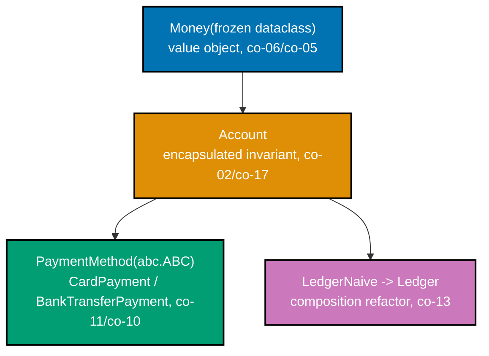

## Goal

Model a small payments-ledger domain as a clean object model -- an encapsulated invariant, a
polymorphic operation, a `@dataclass` value object, and one composition-over-inheritance refactor --
as a runnable, `pytest`-tested package. This is a light consolidation, not a new project: every
mechanism it combines was already taught, individually, somewhere in the Beginner, Intermediate, or
Advanced tiers of this topic.



## Concepts exercised

- [x] encapsulated invariant enforced in `__init__`/setters
- [x] polymorphism via a shared method across subclasses/duck types
- [x] `@dataclass` value object with `__eq__`/`__hash__`
- [x] composition over inheritance
- [x] an `abc.ABC` interface

All colocated code lives under `learning/capstone/code/`: the domain model in `domain/`, and the full
`pytest` suite in `tests/`. Every listing below is the complete file, verbatim -- nothing on this page
is truncated or paraphrased.

## Step 1: A value object and an entity with an invariant

_exercises co-02, co-05, co-06, co-07, co-17_

`domain/money.py` defines `Money`, a `@dataclass(frozen=True)` value object: immutable, so
`__post_init__` can enforce "amount is never negative" and "currency is always a 3-letter code" once,
at construction, with no later code path able to violate either rule. Because `frozen=True` pairs with
the default `eq=True`, Python auto-generates a `__hash__` consistent with the auto-generated `__eq__` --
`Money` instances compare by value and dedupe correctly inside a `set`.

**`learning/capstone/code/domain/money.py`** (complete file)

```python
"""Capstone: Money -- a frozen, hashable value object with a non-negative-amount invariant.

co-06 (dataclass value object): frozen=True gives immutability, and because eq=True
(the default) is paired with frozen=True, Python auto-generates a __hash__ consistent
with the auto-generated __eq__ -- co-05's eq/hash contract, satisfied for free.
co-17 (invariant enforcement): __post_init__ rejects a negative amount or a malformed
currency code the moment a Money is constructed, so no invalid Money can ever exist.
"""

from __future__ import annotations

from dataclasses import dataclass


@dataclass(
    frozen=True
)  # => frozen -> immutable AND auto __hash__ alongside auto __eq__
class Money:
    """An immutable amount of money, stored in integer cents to avoid float rounding error."""

    amount: (
        int  # => whole cents -- never a float, so equality never suffers rounding drift
    )
    currency: str = "USD"  # => a default keeps most call-sites in this capstone terse

    def __post_init__(
        self,
    ) -> None:  # => runs once, right after the frozen fields are set
        if (
            self.amount < 0
        ):  # => co-17: the invariant -- a Money can never represent a negative amount
            raise ValueError(f"Money amount cannot be negative, got {self.amount}")
        if (
            len(self.currency) != 3
        ):  # => co-17: a second invariant -- currency must be a 3-letter code
            raise ValueError(f"currency must be a 3-letter code, got {self.currency!r}")

    def __add__(self, other: Money) -> Money:  # => defines the __add__() method
        if (
            self.currency != other.currency
        ):  # => guards against silently mixing currencies
            raise ValueError("cannot add Money in different currencies")
        return Money(
            self.amount + other.amount, self.currency
        )  # => returns a NEW Money -- frozen, no mutation
```

`domain/account.py` defines `Account`, an entity that encapsulates its own balance: `_balance` only
ever changes through `deposit`/`withdraw`, and both methods enforce the same "balance never goes
negative" rule on every call, not only at construction.

**`learning/capstone/code/domain/account.py`** (complete file)

```python
"""Capstone: Account -- an entity that encapsulates its own balance invariant.

co-02 (encapsulation): `_balance` only ever changes through `deposit`/`withdraw`, never
through direct assignment -- the class is the single place "balance never goes negative"
is enforced. co-07 (properties): `balance` is a read-only computed view over the private
field. co-17 (invariant enforcement): the same overdraft guard applies on every mutating
path, not just at construction time.
"""

from __future__ import annotations

from domain.money import Money


class Account:
    """A named account holding a non-negative Money balance."""

    def __init__(
        self, owner: str, opening_balance: Money
    ) -> None:  # => the constructor
        self._owner: str = owner  # => stores owner on this instance
        self._balance: Money = (
            opening_balance  # => co-02: private -- never assigned to directly again
        )

    @property  # => marks the next method as a computed, read-only attribute
    def owner(self) -> str:  # => defines the owner() method
        return self._owner  # => returns this value to the caller

    @property  # => marks the next method as a computed, read-only attribute
    def balance(self) -> Money:  # => defines the balance() method
        return (
            self._balance
        )  # => co-07: read-only view -- callers cannot do account.balance = ...

    def deposit(self, amount: Money) -> None:  # => defines the deposit() method
        if amount.amount <= 0:  # => co-17: rejects a zero or negative deposit outright
            raise ValueError("deposit amount must be positive")
        self._balance = (
            self._balance + amount
        )  # => the ONLY line in this class that grows the balance

    def withdraw(self, amount: Money) -> None:  # => defines the withdraw() method
        if (
            amount.amount <= 0
        ):  # => co-17: rejects a zero or negative withdrawal outright
            raise ValueError("withdraw amount must be positive")
        if (
            amount.currency != self._balance.currency
        ):  # => co-17: same currency guard deposit gets for free via Money.__add__
            raise ValueError("cannot withdraw Money in a different currency")
        if (
            amount.amount > self._balance.amount
        ):  # => co-17: the core invariant -- no overdraft, ever
            raise ValueError("insufficient funds")
        self._balance = Money(
            self._balance.amount - amount.amount, self._balance.currency
        )
        # => the ONLY line in this class that shrinks the balance -- always via a fresh Money
```

**`learning/capstone/code/tests/test_money.py`** (complete file)

```python
"""Capstone: pytest coverage for Money's invariant and eq/hash contract."""

import pytest

from domain.money import Money


def test_money_equal_amounts_compare_equal() -> None:
    assert Money(500) == Money(500)  # => co-05: value equality, not identity


def test_money_is_hashable_and_dedups_in_a_set() -> None:
    assert (
        len({Money(500), Money(500), Money(300)}) == 2
    )  # => frozen -> auto __hash__ alongside __eq__


def test_money_rejects_negative_amount() -> None:
    with pytest.raises(
        ValueError
    ):  # => co-17: __post_init__ rejects this before construction completes
        Money(-1)


def test_money_rejects_bad_currency_code() -> None:
    with pytest.raises(
        ValueError
    ):  # => co-17: the second invariant -- currency must be 3 letters
        Money(100, "US")


def test_money_add_combines_same_currency() -> None:
    assert Money(200) + Money(300) == Money(
        500
    )  # => __add__ returns a NEW, still-valid Money


def test_money_add_rejects_mismatched_currency() -> None:
    with pytest.raises(ValueError):  # => guards against silently mixing currencies
        _ = Money(200, "USD") + Money(
            300, "EUR"
        )  # => discarding the result -- only the raise matters


# => Run: pytest -- Output: 6 passed
```

**`learning/capstone/code/tests/test_account.py`** (complete file)

```python
"""Capstone: pytest coverage for Account's encapsulated balance invariant."""

import pytest

from domain.account import Account
from domain.money import Money


def test_account_deposit_increases_balance() -> None:
    account: Account = Account("Alice", Money(1000))
    account.deposit(Money(500))
    assert account.balance == Money(1500)  # => the only sanctioned way balance grows


def test_account_withdraw_decreases_balance() -> None:
    account: Account = Account("Alice", Money(1000))
    account.withdraw(Money(400))
    assert account.balance == Money(600)  # => the only sanctioned way balance shrinks


def test_account_rejects_overdraft() -> None:
    account: Account = Account("Alice", Money(100))
    with pytest.raises(
        ValueError
    ):  # => co-17: the core invariant -- no overdraft, ever
        account.withdraw(Money(200))


def test_account_rejects_negative_opening_balance() -> None:
    with pytest.raises(
        ValueError
    ):  # => Money itself rejects this before Account even runs
        Account("Alice", Money(-50))


def test_account_rejects_non_positive_deposit() -> None:
    account: Account = Account("Alice", Money(100))
    with pytest.raises(
        ValueError
    ):  # => co-17: the same guard fires on the deposit path too
        account.deposit(Money(0))


def test_account_rejects_mismatched_currency_withdraw() -> None:
    account: Account = Account("Alice", Money(1000, "USD"))
    with pytest.raises(
        ValueError
    ):  # => co-17: withdraw guards currency match too, same as deposit does via Money.__add__
        account.withdraw(Money(500, "JPY"))


# => Run: pytest -- Output: 6 passed
```

**Verify**

```text
$ pytest -q tests/test_money.py tests/test_account.py
12 passed
```

## Step 2: An `abc.ABC` interface with two polymorphic implementations

_exercises co-10, co-11_

`domain/payment_method.py` defines `PaymentMethod`, an `abc.ABC` interface: it cannot be instantiated
on its own, and Python enforces that at construction time, not merely by convention. `CardPayment` and
`BankTransferPayment` each implement `process` independently, and `process_payment` is one call-site,
typed against the interface, that dispatches correctly to whichever concrete implementation it is
handed -- with zero branching on which concrete type it received.

**`learning/capstone/code/domain/payment_method.py`** (complete file)

```python
"""Capstone: PaymentMethod -- an ABC interface with two polymorphic implementations.

co-11 (abstraction / ABC): PaymentMethod cannot be instantiated on its own -- Python
enforces this at construction time. co-10 (polymorphism): `process_payment` is ONE
call-site that works identically whether it is handed a CardPayment or a
BankTransferPayment, with zero branching on which concrete type it received.
"""

from __future__ import annotations

import abc

from domain.account import Account
from domain.money import Money


class PaymentMethod(
    abc.ABC
):  # => abc.ABC marks this as an INTERFACE, never directly instantiable
    @abc.abstractmethod  # => marks the next method as a REQUIRED contract for every subclass
    def process(
        self, account: Account, amount: Money
    ) -> str:  # => no body -- subclasses supply one
        ...


class CardPayment(PaymentMethod):  # => CardPayment extends PaymentMethod
    def __init__(
        self, last4: str
    ) -> None:  # => the constructor -- runs once, automatically
        self.last4: str = last4  # => stores last4 on this instance

    def process(
        self, account: Account, amount: Money
    ) -> str:  # => defines the process() method
        account.deposit(
            amount
        )  # => delegates to Account's own guarded deposit -- co-17 still applies
        return f"card ending {self.last4} deposited {amount.amount} {amount.currency}"


class BankTransferPayment(
    PaymentMethod
):  # => BankTransferPayment extends PaymentMethod
    def __init__(
        self, iban: str
    ) -> None:  # => the constructor -- runs once, automatically
        self.iban: str = iban  # => stores iban on this instance

    def process(
        self, account: Account, amount: Money
    ) -> str:  # => defines the process() method
        account.deposit(
            amount
        )  # => the SAME Account.deposit call-site CardPayment also uses
        return f"bank transfer {self.iban} deposited {amount.amount} {amount.currency}"


def process_payment(method: PaymentMethod, account: Account, amount: Money) -> str:
    # => co-10: ONE function, typed against the INTERFACE -- never a concrete subclass
    return method.process(
        account, amount
    )  # => dispatches to whichever concrete class was actually passed
```

**`learning/capstone/code/tests/test_payment_method.py`** (complete file)

```python
"""Capstone: pytest coverage proving PaymentMethod is polymorphic across implementations."""

import pytest

from domain.account import Account
from domain.money import Money
from domain.payment_method import (
    BankTransferPayment,
    CardPayment,
    PaymentMethod,
    process_payment,
)


def test_payment_method_cannot_be_instantiated_directly() -> None:
    with pytest.raises(
        TypeError
    ):  # => co-11: an ABC with an unimplemented method always rejects this
        PaymentMethod()  # type: ignore  # => deliberately triggers the ABC instantiation guard


def test_card_payment_deposits_into_account() -> None:
    account: Account = Account("Alice", Money(0))
    result: str = process_payment(CardPayment("4242"), account, Money(500))
    assert account.balance == Money(
        500
    )  # => the deposit genuinely landed on the account
    assert (
        "4242" in result
    )  # => the concrete implementation's own detail is still visible in the result


def test_bank_transfer_payment_deposits_into_account() -> None:
    account: Account = Account("Alice", Money(0))
    result: str = process_payment(BankTransferPayment("DE89"), account, Money(700))
    assert account.balance == Money(
        700
    )  # => the SAME call-site, a DIFFERENT concrete implementation
    assert "DE89" in result


def test_process_payment_call_site_is_implementation_agnostic() -> None:
    account: Account = Account("Alice", Money(0))
    methods: list[PaymentMethod] = [CardPayment("0000"), BankTransferPayment("XX00")]
    for (
        method
    ) in methods:  # => co-10: ONE loop body, dispatching polymorphically per element
        process_payment(method, account, Money(100))
    assert account.balance == Money(
        200
    )  # => both payments landed, regardless of concrete type


# => Run: pytest -- Output: 4 passed
```

**Verify**

```text
$ pytest -q tests/test_payment_method.py
4 passed
```

## Step 3: Refactor a naive inheritance chain into composition

_exercises co-13_

`domain/ledger_naive.py`'s `LedgerNaive(list[Money])` is deliberately naive: subclassing `list`
inherits every list method, including `insert`, which a real ledger was never meant to expose --
`test_ledger_naive_leaks_list_insert` proves the leak actually mutates ledger state through a
non-ledger method. `domain/ledger.py`'s `Ledger` is the composition-based fix: it holds a
`list[Money]` instead of being one, keeping `record`/`total` behavior identical while `insert` and
every other leaked method are simply gone.

**`learning/capstone/code/domain/ledger_naive.py`** (complete file)

```python
"""Capstone: LedgerNaive -- the naive "is-a list" version this capstone refactors away.

Kept only as a reference: `domain/ledger.py`'s Ledger is the composition-based fix that
replaces it, with identical `record`/`total` behavior and none of the leaked interface.
"""

from __future__ import annotations

from domain.money import Money


class LedgerNaive(
    list[Money]
):  # => is-a list[Money] -- inherits EVERY list method, wanted or not
    def record(self, entry: Money) -> None:  # => defines the record() method
        self.append(
            entry
        )  # => reuses list.append -- convenient, but see the leak below

    def total(self) -> int:  # => defines the total() method
        return sum(
            entry.amount for entry in self
        )  # => sums every recorded entry's amount
```

**`learning/capstone/code/domain/ledger.py`** (complete file)

```python
"""Capstone: Ledger -- the composition-over-inheritance refactor of LedgerNaive.

co-13 (composition over inheritance): Ledger HOLDS a list[Money] instead of BEING one --
`record`/`total` behave identically to LedgerNaive, but `insert`, `sort`, `reverse`, and
every other list method LedgerNaive accidentally exposed are simply not here anymore.
"""

from __future__ import annotations

from domain.money import Money


class Ledger:  # => has-a list[Money] -- never subclasses list
    def __init__(
        self,
    ) -> None:  # => the constructor -- runs once, automatically, per instantiation
        self._entries: list[
            Money
        ] = []  # => a private collaborator, not an inherited interface

    def record(self, entry: Money) -> None:  # => defines the record() method
        self._entries.append(
            entry
        )  # => delegates to the list, but does not EXPOSE the list

    def total(self) -> int:  # => defines the total() method
        return sum(
            entry.amount for entry in self._entries
        )  # => same computation as LedgerNaive.total

    def __len__(self) -> int:  # => defines the __len__() method
        return len(
            self._entries
        )  # => len(ledger) still works -- deliberately re-exposed, not leaked
```

**`learning/capstone/code/tests/test_ledger.py`** (complete file)

```python
"""Capstone: pytest coverage proving Ledger's composition refactor preserves LedgerNaive's behavior."""

from domain.ledger import Ledger
from domain.ledger_naive import LedgerNaive
from domain.money import Money


def test_ledger_naive_records_and_totals() -> None:
    ledger: LedgerNaive = LedgerNaive()
    ledger.record(Money(500))
    ledger.record(Money(300))
    assert (
        ledger.total() == 800
    )  # => baseline behavior, BEFORE the composition refactor


def test_ledger_naive_leaks_list_insert() -> None:
    ledger: LedgerNaive = LedgerNaive()
    ledger.record(Money(500))
    ledger.insert(
        0, Money(999)
    )  # => the SMELL: insert() was never meant to be part of a ledger's API
    assert (
        ledger.total() == 1499
    )  # => the leak actually mutated ledger state via a non-ledger method


def test_ledger_records_and_totals_matches_naive_behavior() -> None:
    ledger: Ledger = Ledger()
    ledger.record(Money(500))
    ledger.record(Money(300))
    assert (
        ledger.total() == 800
    )  # => SAME behavior as LedgerNaive -- tests still green after the refactor


def test_ledger_has_no_leaked_list_interface() -> None:
    ledger: Ledger = Ledger()
    assert not hasattr(
        ledger, "insert"
    )  # => the smell from LedgerNaive no longer exists on Ledger


# => Run: pytest -- Output: 4 passed
```

**Verify**

```text
$ pytest -q tests/test_ledger.py
4 passed
```

## Run it end to end

Running the full suite from `learning/capstone/code/` exercises every file this capstone ships in one
pass.

**Run**: `pytest -q`

**Output** (genuinely captured):

```text
20 passed
```

The following interactive session (genuinely captured, using the same `domain` package the test suite
imports) shows every concept working together: a `Money` value object, an `Account` enforcing its
overdraft invariant, two polymorphic `PaymentMethod` implementations dispatched through one call-site,
and a `Ledger` recording both payments.

```text
>>> from domain.account import Account
>>> from domain.money import Money
>>> from domain.payment_method import CardPayment, BankTransferPayment, process_payment
>>> from domain.ledger import Ledger
>>> account = Account("Alice", Money(0))
>>> ledger = Ledger()
>>> for method, amount in [(CardPayment("4242"), Money(500)), (BankTransferPayment("DE89"), Money(700))]:
...     result = process_payment(method, account, amount)
...     ledger.record(amount)
...     print(result)
...
card ending 4242 deposited 500 USD
bank transfer DE89 deposited 700 USD
>>> account.balance.amount, account.balance.currency
(1200, 'USD')
>>> ledger.total()
1200
>>> account.withdraw(Money(999999))
Traceback (most recent call last):
    ...
ValueError: insufficient funds
```

**Quality gates**: `pyright --pythonversion 3.13 .` (from inside `learning/capstone/code/`) reports
`0 errors, 0 warnings, 0 informations`; `mypy --python-version 3.10 --explicit-package-bases .` reports
`Success: no issues found in 11 source files`.

## Acceptance criteria

- `pytest -q` (from `learning/capstone/code/`) reports `20 passed`, covering `Money`'s invariant and
  eq/hash contract, `Account`'s encapsulated overdraft and currency-match invariants, `PaymentMethod`'s
  polymorphic dispatch across two implementations, and `LedgerNaive`'s leaked interface alongside
  `Ledger`'s composition-based fix.
- Invariants cannot be violated: `Money(-1)`, `Account("Alice", Money(-50))`,
  `account.withdraw(Money(too_much))`, `account.withdraw(Money(amount, "JPY"))` against a USD balance,
  and `account.deposit(Money(0))` all raise `ValueError` -- every path is checked, not only the
  constructor.
- The polymorphic call-site (`process_payment`) is implementation-agnostic: it is typed against
  `PaymentMethod`, never against `CardPayment` or `BankTransferPayment` concretely, and dispatches
  correctly to whichever one it receives.
- `Money` equality and hashing behave correctly: equal amounts compare equal, and equal `Money`
  instances dedupe inside a `set`.
- `pyright --pythonversion 3.13 .` and `mypy --python-version 3.10 --explicit-package-bases .` both
  report zero findings.

## Done bar

This capstone is runnable end to end: a reader who copies the six files above (`domain/money.py`,
`domain/account.py`, `domain/payment_method.py`, `domain/ledger_naive.py`, `domain/ledger.py`, plus the
four `tests/test_*.py` files) into a `learning/capstone/code/`-shaped tree and runs `pytest -q` there
reaches the identical `20 passed` result shown above, verified against a real CPython 3.13.12
interpreter run (not merely described). Every mechanism combined here -- an encapsulated invariant
(co-02, co-17), polymorphism via a shared method (co-10), a `@dataclass` value object with `__eq__`/
`__hash__` (co-05, co-06), composition over inheritance (co-13), and an `abc.ABC` interface (co-11) --
traces to the same `docs.python.org` sources already cited in this topic's Accuracy notes; no new fact
was needed to write this page.

---

← Previous: [Advanced Examples](../advanced.md) · Next: [Drilling](../../drilling/overview.md) →
