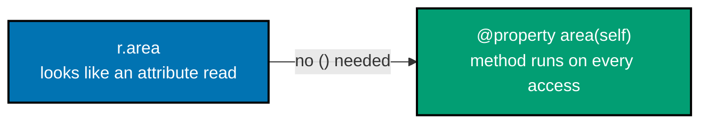
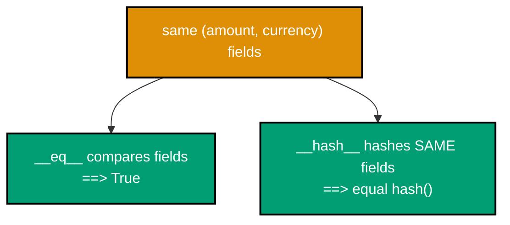
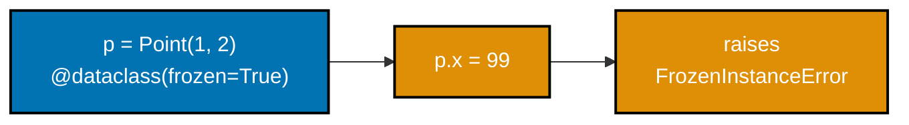
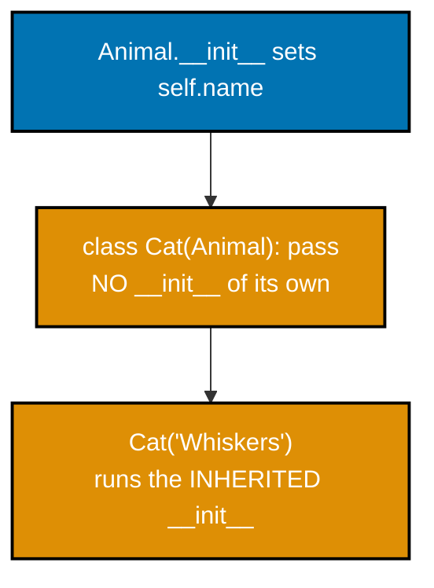
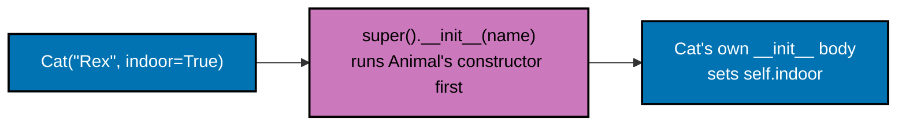
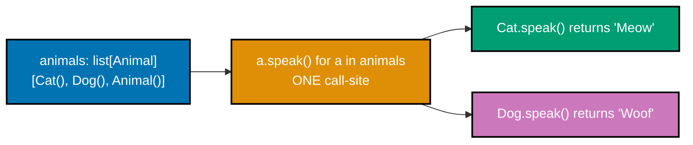
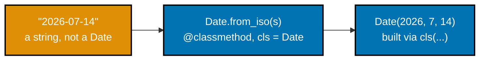
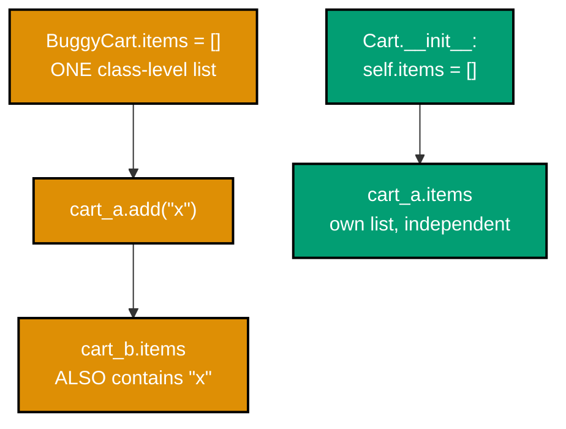
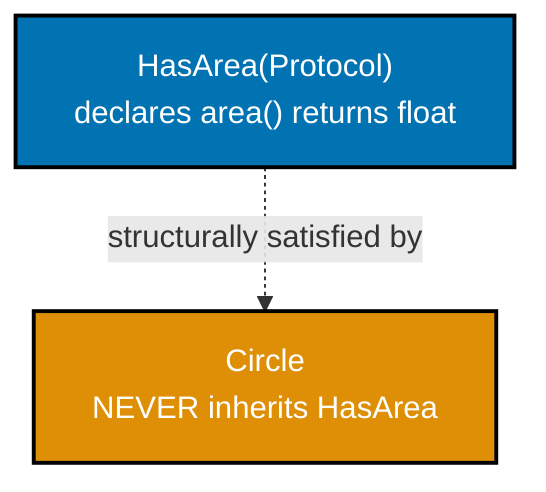
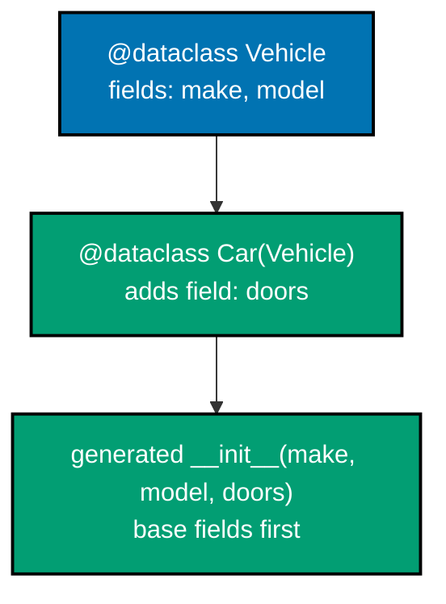

Examples 29-58 build on the beginner tier's vocabulary with the machinery that keeps a class correct as it grows: `@property` getters and validating setters, the full `__eq__`/`__hash__` contract (including the unhashable trap of defining one without the other), every `@dataclass` option (`frozen`, `slots`, `order`, `eq=False`), inheritance and `super()`, method overriding and polymorphic dispatch, `@classmethod`/`@staticmethod`, the class-attribute mutable-default pitfall, and `typing.Protocol` formalizing duck typing for a static checker. Every example runs and verifies exactly like the beginner tier -- `python3 example.py` for inline output, `pytest` for the colocated `test_example.py`.

---

### Example 29: A Read-Only Property

_ex-29 &middot; exercises co-07_

`@property` turns a method into something read exactly like a plain attribute -- `r.area`, never `r.area()`. This example computes `Rectangle.area` on every access instead of storing it as its own field.



**`learning/code/ex-29-property-read-only/example.py`**

```python
"""Example 29: A Read-Only Property."""


class Rectangle:  # => begins the Rectangle class body
    def __init__(
        self, width: float, height: float
    ) -> None:  # => the constructor -- runs once, automatically, per instantiation
        self.width = width  # => stores width on this instance
        self.height = height  # => stores height on this instance

    @property  # => marks the next method as a computed attribute
    def area(
        self,
    ) -> float:  # => computed on every access -- never stored as its own field
        return (
            self.width * self.height
        )  # => always reflects the CURRENT width and height


r: Rectangle = Rectangle(3.0, 4.0)  # => constructs r
print(r.area)  # => read like a plain attribute -- no parentheses at the call site
# => Output: 12.0
# => `@property` on a method makes `obj.method_name` (no parentheses) call it
```

**Run**: `python3 example.py`

**Output**:

```text
12.0
```

**`learning/code/ex-29-property-read-only/test_example.py`**

```python
"""Example 29: pytest verification for A Read-Only Property."""

from example import Rectangle


def test_area_reads_as_plain_attribute() -> None:
    r: Rectangle = Rectangle(3.0, 4.0)
    assert r.area == 12.0  # => r.area, not r.area() -- property syntax, computed value


# => Run: pytest -- Output: 1 passed
```

**Verify**: `pytest -q`

**Output**:

```text
1 passed
```

**Key takeaway**: `@property` on a method makes `obj.method_name` (no parentheses) call it -- the caller cannot tell whether `area` is stored or computed, and does not need to.

**Why it matters**: This is the payoff of properties: `r.area` reads identically whether `area` is a plain field or a derived computation. Example 32 pushes this further with a property that recomputes from two other fields every time, proving nothing here is cached. This flexibility matters most when a class evolves: a field that started as plain storage can become a computed property later without forcing every caller across a codebase to change how they read it.

---

### Example 30: A Property Setter That Validates

_ex-30 &middot; exercises co-07, co-17_

A `@width.setter` runs on every assignment to `.width`, which means it is the ideal place to enforce "a rectangle's width must be positive" without changing the caller's plain `obj.attr = value` syntax at all.

**`learning/code/ex-30-property-setter-validation/example.py`**

```python
"""Example 30: A Property Setter That Validates."""


class Rectangle:  # => begins the Rectangle class body
    def __init__(
        self, width: float, height: float
    ) -> None:  # => the constructor -- runs once, automatically, per instantiation
        self.width = width  # => routes through the setter below, even during __init__
        self.height = height  # => stores height on this instance

    @property  # => marks the next method as a computed attribute
    def width(self) -> float:  # => defines the width() method
        return self._width  # => returns this value to the caller

    @width.setter  # => marks the next method as width's validating setter
    def width(
        self, value: float
    ) -> None:  # => every assignment to .width passes through here
        if value <= 0:  # => guards the invariant: a rectangle's width must be positive
            raise ValueError(
                "width must be positive"
            )  # => rejects the assignment entirely
        self._width = value  # => only reached when the value passed validation


r: Rectangle = Rectangle(3.0, 4.0)  # => constructs r
try:  # => the block below is expected to raise
    r.width = -1  # => triggers the guard above, ordinary attribute-assignment syntax
except ValueError as exc:  # => catches the ValueError raised above
    print(exc)  # => prints the exact rejection message
# => Output: width must be positive
# => `@width.setter` intercepts every `obj.width = value` assignment, including the one `__init__` performs
```

**Run**: `python3 example.py`

**Output**:

```text
width must be positive
```

**`learning/code/ex-30-property-setter-validation/test_example.py`**

```python
"""Example 30: pytest verification for A Property Setter That Validates."""

import pytest

from example import Rectangle


def test_negative_width_assignment_raises() -> None:
    r: Rectangle = Rectangle(3.0, 4.0)
    with pytest.raises(
        ValueError
    ):  # => r.width = -1 must raise, not silently accept it
        r.width = -1


# => Run: pytest -- Output: 1 passed
```

**Verify**: `pytest -q`

**Output**:

```text
1 passed
```

**Key takeaway**: `@width.setter` intercepts every `obj.width = value` assignment, including the one `__init__` performs -- one guard covers both construction and every later mutation.

**Why it matters**: Because `__init__` assigns `self.width = width` (not `self._width = width`), construction itself routes through the setter's validation. This is exactly the "same rule everywhere" pattern co-17 asks for, achieved here with no code duplicated between the constructor and later assignments. Production classes rely on this constantly: a single validation rule written once in the setter protects every future assignment site, including ones added long after the class was first written.

---

### Example 31: A Property Backed by a Private Field

_ex-31 &middot; exercises co-07, co-16_

The property's storage lives in a conventionally-internal `_width` field, while external code only ever spells `.width`. This example shows the public name is the only one callers should ever write, even though the private one genuinely exists.

**`learning/code/ex-31-property-backed-by-private/example.py`**

```python
"""Example 31: A Property Backed by a Private Field."""


class Rectangle:  # => begins the Rectangle class body
    def __init__(
        self, width: float
    ) -> None:  # => the constructor -- runs once, automatically, per instantiation
        self.width = (
            width  # => external code always uses THIS name, never _width directly
        )

    @property  # => marks the next method as a computed attribute
    def width(self) -> float:  # => defines the width() method
        return (
            self._width
        )  # => internally-named storage field, hidden behind the property

    @width.setter  # => marks the next method as width's validating setter
    def width(self, value: float) -> None:  # => defines the width() method
        self._width = value  # => the ONLY place _width is ever assigned


r: Rectangle = Rectangle(5.0)  # => constructs r
print(r.width)  # => external code never spells out ._width anywhere
# => Output: 5.0
print(
    hasattr(r, "_width")
)  # => the storage field exists, but is not the public interface
# => Output: True
# => A property's public name (`width`) and its private storage name (`_width`) can differ
```

**Run**: `python3 example.py`

**Output**:

```text
5.0
True
```

**`learning/code/ex-31-property-backed-by-private/test_example.py`**

```python
"""Example 31: pytest verification for A Property Backed by a Private Field."""

from example import Rectangle


def test_external_code_reads_through_public_property() -> None:
    r: Rectangle = Rectangle(5.0)
    assert r.width == 5.0  # => callers use .width, never ._width, by convention
    assert r._width == 5.0  # => the private field genuinely backs the property


# => Run: pytest -- Output: 1 passed
```

**Verify**: `pytest -q`

**Output**:

```text
1 passed
```

**Key takeaway**: A property's public name (`width`) and its private storage name (`_width`) can differ -- callers only ever need to know the public one.

**Why it matters**: This pairing -- co-16's naming convention plus co-07's property mechanism -- is how a class can freely change its internal storage representation later (renaming `_width`, deriving it instead of storing it) without breaking a single external caller, since every caller only ever touched the public property name. This is the core promise of encapsulation in practice: internal refactors become safe, low-risk changes instead of breaking changes that ripple across every consumer of the class.

---

### Example 32: A Computed Property Derived from Two Fields

_ex-32 &middot; exercises co-07_

A property can derive its value from more than one field, and it recomputes on every access with nothing cached in between. This example checks `perimeter` before and after mutating `width`, confirming it always reflects the current fields.

**`learning/code/ex-32-computed-property-derived/example.py`**

```python
"""Example 32: A Computed Property Derived from Two Fields."""


class Rectangle:  # => begins the Rectangle class body
    def __init__(
        self, width: float, height: float
    ) -> None:  # => the constructor -- runs once, automatically, per instantiation
        self.width = width  # => stores width on this instance
        self.height = height  # => stores height on this instance

    @property  # => marks the next method as a computed attribute
    def perimeter(self) -> float:  # => recomputed from width/height every single access
        return 2 * (self.width + self.height)  # => returns this value to the caller


r: Rectangle = Rectangle(3.0, 4.0)  # => constructs r
print(r.perimeter)  # => baseline perimeter before mutating width below
# => Output: 14.0
r.width = 10.0  # => mutating a plain field the property depends on
print(r.perimeter)  # => perimeter reflects the NEW width -- nothing was cached
# => Output: 28.0
# => A property with no explicit cache always recomputes from its dependencies
```

**Run**: `python3 example.py`

**Output**:

```text
14.0
28.0
```

**`learning/code/ex-32-computed-property-derived/test_example.py`**

```python
"""Example 32: pytest verification for A Computed Property Derived from Two Fields."""

from example import Rectangle


def test_perimeter_updates_after_width_changes() -> None:
    r: Rectangle = Rectangle(3.0, 4.0)
    assert r.perimeter == 14.0
    r.width = 10.0  # => mutate the field the property is derived from
    assert (
        r.perimeter == 28.0
    )  # => the computed value tracks the mutation automatically


# => Run: pytest -- Output: 1 passed
```

**Verify**: `pytest -q`

**Output**:

```text
1 passed
```

**Key takeaway**: A property with no explicit cache always recomputes from its dependencies -- mutating any field it reads is immediately visible on the next access, with no stale value possible.

**Why it matters**: Compare this to storing `perimeter` as a plain field set once in `__init__`: it would silently go stale the instant `width` or `height` changed. A computed property can never go stale by construction, at the cost of recomputing on every single access -- a tradeoff worth making deliberately, not by accident.

---

### Example 33: A Money Value Object with `__eq__`

_ex-33 &middot; exercises co-05_

A value object's equality should depend on every field that makes up its value -- `Money` is equal only when both `amount` and `currency` match. This example checks both a full match and a partial match (same amount, different currency).

**`learning/code/ex-33-eq-value-object/example.py`**

```python
"""Example 33: A Money Value Object with __eq__."""


class Money:  # => begins the Money class body
    def __init__(
        self, amount: int, currency: str
    ) -> None:  # => amount in integer cents
        self.amount = amount  # => stores amount on this instance
        self.currency = currency  # => stores currency on this instance

    def __eq__(self, other: object) -> bool:  # => defines the __eq__() method
        if not isinstance(other, Money):
            return NotImplemented  # => returns this value to the caller
        return (
            self.amount == other.amount and self.currency == other.currency
        )  # => returns this value to the caller
        # => equal ONLY when BOTH fields match -- a partial match is not equality


a: Money = Money(500, "USD")  # => constructs a
b: Money = Money(500, "USD")  # => same amount and currency, different object
c: Money = Money(500, "EUR")  # => same amount, DIFFERENT currency
print(a == b, a == c)  # => value equality on both fields together
# => Output: True False
# => A multi-field value object's `__eq__` must compare every field that participates in its value
```

**Run**: `python3 example.py`

**Output**:

```text
True False
```

**`learning/code/ex-33-eq-value-object/test_example.py`**

```python
"""Example 33: pytest verification for A Money Value Object with __eq__."""

from example import Money


def test_equal_amount_and_currency_compare_equal() -> None:
    assert Money(500, "USD") == Money(500, "USD")


def test_matching_amount_different_currency_compares_unequal() -> None:
    assert Money(500, "USD") != Money(500, "EUR")  # => amount alone is not enough


# => Run: pytest -- Output: 2 passed
```

**Verify**: `pytest -q`

**Output**:

```text
2 passed
```

**Key takeaway**: A multi-field value object's `__eq__` must compare every field that participates in its value -- comparing only `amount` would incorrectly treat different currencies as the same money.

**Why it matters**: `Money(500, "USD") == Money(500, "EUR")` being `True` would be a genuinely dangerous bug in any real financial code -- 500 US cents and 500 Euro cents are not interchangeable. Getting the equality contract right, field by field, is what makes a value object trustworthy to use in comparisons, sets, and dict keys later.

---

### Example 34: A Consistent `__hash__` Alongside `__eq__`

_ex-34 &middot; exercises co-05_

`__hash__` must hash exactly the fields `__eq__` compares, so that two equal objects always share a hash -- the requirement `set`/`dict` bucketing depends on. This example adds `__hash__` and confirms equal `Money` objects deduplicate in a `set`.



**`learning/code/ex-34-hash-consistent-with-eq/example.py`**

```python
"""Example 34: A Consistent __hash__ Alongside __eq__."""


class Money:  # => begins the Money class body
    def __init__(
        self, amount: int, currency: str
    ) -> None:  # => the constructor -- runs once, automatically, per instantiation
        self.amount = amount  # => stores amount on this instance
        self.currency = currency  # => stores currency on this instance

    def __eq__(self, other: object) -> bool:  # => defines the __eq__() method
        if not isinstance(
            other, Money
        ):  # => guards against comparing a Money to an unrelated type
            return NotImplemented  # => returns this value to the caller
        return (
            self.amount == other.amount and self.currency == other.currency
        )  # => returns this value to the caller

    def __hash__(self) -> int:  # => MUST hash the SAME fields __eq__ compares
        return hash(
            (self.amount, self.currency)
        )  # => tuple hash -- combines both fields at once


wallet: set[Money] = {Money(500, "USD"), Money(500, "USD"), Money(100, "USD")}
# => two equal Money objects were inserted above; a correct hash/eq pair deduplicates them
print(len(wallet))  # => only 2 distinct (amount, currency) pairs survive
# => Output: 2
# => `hash((self.amount, self.currency))` combines the exact same fields `__eq__` compares into a single hash
```

**Run**: `python3 example.py`

**Output**:

```text
2
```

**`learning/code/ex-34-hash-consistent-with-eq/test_example.py`**

```python
"""Example 34: pytest verification for A Consistent __hash__ Alongside __eq__."""

from example import Money


def test_equal_money_objects_deduplicate_in_a_set() -> None:
    wallet: set[Money] = {Money(500, "USD"), Money(500, "USD"), Money(100, "USD")}
    assert len(wallet) == 2  # => the duplicate Money(500, "USD") collapses to one entry


def test_equal_objects_share_a_hash() -> None:
    assert hash(Money(500, "USD")) == hash(
        Money(500, "USD")
    )  # => required by the eq/hash contract


# => Run: pytest -- Output: 2 passed
```

**Verify**: `pytest -q`

**Output**:

```text
2 passed
```

**Key takeaway**: `hash((self.amount, self.currency))` combines the exact same fields `__eq__` compares into a single hash -- the eq/hash contract holds because both methods agree on what makes two objects equal.

**Why it matters**: Sets and dicts bucket elements by hash first and compare with `__eq__` only within a bucket -- if `__hash__` used different fields than `__eq__`, two equal objects could land in different buckets and never even get compared, silently defeating deduplication entirely. This is not a theoretical edge case: a `Money(__eq__)` inconsistent with `__hash__` produces a `set` or `dict` that silently keeps duplicate entries, a bug that is hard to notice until deduplication quietly fails in production.

---

### Example 35: `__eq__` Without `__hash__` Is Unhashable

_ex-35 &middot; exercises co-05_

Defining `__eq__` alone, with no accompanying `__hash__`, makes Python set `__hash__ = None` on the class automatically -- the safe default, since an inconsistent eq/hash pair is worse than no hash at all. This example confirms the resulting `TypeError`.

**`learning/code/ex-35-eq-without-hash-unhashable/example.py`**

```python
"""Example 35: __eq__ Without __hash__ Is Unhashable."""


class Money:  # => begins the Money class body
    def __init__(
        self, amount: int, currency: str
    ) -> None:  # => the constructor -- runs once, automatically, per instantiation
        self.amount = amount  # => stores amount on this instance
        self.currency = currency  # => stores currency on this instance

    def __eq__(self, other: object) -> bool:  # => defining __eq__ ALONE
        if not isinstance(other, Money):
            return NotImplemented  # => returns this value to the caller
        return (
            self.amount == other.amount and self.currency == other.currency
        )  # => returns this value to the caller

    # => Python sets __hash__ = None automatically the moment __eq__ is defined without __hash__


try:  # => the block below is expected to raise
    {Money(500, "USD")}  # type: ignore  # => building a set calls hash() on each element (static checkers correctly flag Money as unhashable)
except TypeError as exc:  # => catches the TypeError raised above
    print(exc)  # => confirms the instance is genuinely unhashable
# => Output: unhashable type: 'Money'
# => Defining `__eq__` without `__hash__` does not silently inherit `object`'s default hash
```

**Run**: `python3 example.py`

**Output**:

```text
unhashable type: 'Money'
```

**`learning/code/ex-35-eq-without-hash-unhashable/test_example.py`**

```python
"""Example 35: pytest verification for __eq__ Without __hash__ Is Unhashable."""

import pytest

from example import Money


def test_eq_only_class_is_unhashable() -> None:
    with pytest.raises(
        TypeError
    ):  # => hash(Money(...)) must raise, not silently succeed
        {Money(500, "USD")}  # type: ignore  # => set construction calls hash() internally (static checkers correctly flag Money as unhashable)


# => Run: pytest -- Output: 1 passed
```

**Verify**: `pytest -q`

**Output**:

```text
1 passed
```

**Key takeaway**: Defining `__eq__` without `__hash__` does not silently inherit `object`'s default hash -- Python explicitly sets `__hash__ = None`, making the class unhashable until `__hash__` is defined too.

**Why it matters**: This is a deliberate safety rail, not an oversight: inheriting `object`'s identity-based hash while overriding `__eq__` to compare by value would break the eq/hash contract silently (two equal objects with different hashes). Forcing `TypeError` at the point of use surfaces the gap immediately instead of producing a subtle deduplication bug.

---

### Example 36: A Frozen Dataclass Rejects Field Assignment

_ex-36 &middot; exercises co-06_

`@dataclass(frozen=True)` makes every field read-only after construction -- any later assignment raises `dataclasses.FrozenInstanceError`. This example constructs a frozen `Point` and confirms the exact exception type on a rejected assignment.



**`learning/code/ex-36-frozen-dataclass-immutable/example.py`**

```python
"""Example 36: A Frozen Dataclass Rejects Field Assignment."""

from dataclasses import dataclass  # => imports dataclass from dataclasses


@dataclass(frozen=True)  # => frozen=True makes every field read-only after construction
class Point:  # => begins the Point class body
    x: int  # => a required dataclass field, part of the generated __init__
    y: int  # => a required dataclass field, part of the generated __init__


p: Point = Point(1, 2)  # => constructs p
try:  # => the block below is expected to raise
    p.x = 99  # type: ignore  # => assignment to a frozen field always raises (static checkers also flag it as read-only)
except (
    Exception
) as exc:  # => dataclasses.FrozenInstanceError, a subclass of AttributeError
    print(type(exc).__name__)  # => confirms the exact exception type raised
# => Output: FrozenInstanceError
# => `dataclasses.FrozenInstanceError` (a subclass of `AttributeError`) fires on every attempted field assignment after construction
```

**Run**: `python3 example.py`

**Output**:

```text
FrozenInstanceError
```

**`learning/code/ex-36-frozen-dataclass-immutable/test_example.py`**

```python
"""Example 36: pytest verification for A Frozen Dataclass Rejects Field Assignment."""

import dataclasses

import pytest

from example import Point


def test_assigning_frozen_field_raises_frozen_instance_error() -> None:
    p: Point = Point(1, 2)
    with pytest.raises(
        dataclasses.FrozenInstanceError
    ):  # => the exact documented exception type
        p.x = 99  # type: ignore  # => static checkers also flag frozen-field assignment as an error


# => Run: pytest -- Output: 1 passed
```

**Verify**: `pytest -q`

**Output**:

```text
1 passed
```

**Key takeaway**: `dataclasses.FrozenInstanceError` (a subclass of `AttributeError`) fires on every attempted field assignment after construction -- `frozen=True` is enforced at the object level, not just documented.

**Why it matters**: Immutability by construction eliminates a whole category of bug where one part of a program mutates a value object another part is still holding a reference to, expecting it to stay constant. Example 72 builds on exactly this guarantee, using a frozen `Money` whose arithmetic methods return new instances instead of mutating.

---

### Example 37: A Frozen Dataclass Is Hashable by Default

_ex-37 &middot; exercises co-06, co-05_

`frozen=True` combined with the default `eq=True` auto-generates a consistent `__hash__` too, since an immutable object's hash can never go stale. This example uses a frozen `Point` as both a dict key and a set member.

**`learning/code/ex-37-frozen-dataclass-hashable/example.py`**

```python
"""Example 37: A Frozen Dataclass Is Hashable by Default."""

from dataclasses import dataclass  # => imports dataclass from dataclasses


@dataclass(
    frozen=True
)  # => frozen=True (with the default eq=True) auto-generates __hash__ too
class Point:  # => begins the Point class body
    x: int  # => a required dataclass field, part of the generated __init__
    y: int  # => a required dataclass field, part of the generated __init__


lookup: dict[Point, str] = {
    Point(1, 2): "origin-ish"
}  # => works as a dict key -- it is hashable
members: set[Point] = {
    Point(1, 2),
    Point(1, 2),
}  # => equal frozen instances deduplicate
print(
    lookup[Point(1, 2)], len(members)
)  # => a NEW equal Point still finds the same entry
# => Output: origin-ish 1
# => `@dataclass(frozen=True)` is the shortest path to a fully correct, hashable value object
```

**Run**: `python3 example.py`

**Output**:

```text
origin-ish 1
```

**`learning/code/ex-37-frozen-dataclass-hashable/test_example.py`**

```python
"""Example 37: pytest verification for A Frozen Dataclass Is Hashable by Default."""

from example import Point


def test_frozen_dataclass_works_as_dict_key() -> None:
    lookup: dict[Point, str] = {Point(1, 2): "origin-ish"}
    assert (
        lookup[Point(1, 2)] == "origin-ish"
    )  # => a NEW, equal Point finds the same entry


def test_frozen_dataclass_deduplicates_in_a_set() -> None:
    members: set[Point] = {Point(1, 2), Point(1, 2)}
    assert len(members) == 1


# => Run: pytest -- Output: 2 passed
```

**Verify**: `pytest -q`

**Output**:

```text
2 passed
```

**Key takeaway**: `@dataclass(frozen=True)` is the shortest path to a fully correct value object: generated `__eq__` and `__hash__` stay consistent automatically, with no hand-written `__hash__` needed at all.

**Why it matters**: Contrast this with Examples 34-35, where `__hash__` had to be written by hand and kept manually in sync with `__eq__`. Because a frozen instance can never change after construction, its hash can never become stale, which is exactly why `@dataclass` is willing to generate it automatically only in this frozen case.

---

### Example 38: eq=False Falls Back to Identity Equality

_ex-38 &middot; exercises co-06, co-03_

`@dataclass(eq=False)` suppresses the generated `__eq__` entirely, leaving `object`'s identity-based default in place -- exactly the situation Example 11 showed for plain classes. This example confirms two equal-valued but distinct instances compare unequal.

**`learning/code/ex-38-dataclass-eq-false/example.py`**

```python
"""Example 38: eq=False Falls Back to Identity Equality."""

from dataclasses import dataclass  # => imports dataclass from dataclasses


@dataclass(
    eq=False
)  # => suppresses the generated __eq__ entirely -- object's default is used
class Point:  # => begins the Point class body
    x: int  # => a required dataclass field, part of the generated __init__
    y: int  # => a required dataclass field, part of the generated __init__


a: Point = Point(1, 2)  # => constructs a
b: Point = Point(1, 2)  # => equal field values, but no __eq__ was generated
print(a == b, a == a)  # => identity is the only equality left: only a == a is True
# => Output: False True
# => `eq=False` is the escape hatch when a dataclass genuinely needs identity semantics
```

**Run**: `python3 example.py`

**Output**:

```text
False True
```

**`learning/code/ex-38-dataclass-eq-false/test_example.py`**

```python
"""Example 38: pytest verification for eq=False Falls Back to Identity Equality."""

from example import Point


def test_eq_false_disables_value_equality() -> None:
    a: Point = Point(1, 2)
    b: Point = Point(1, 2)
    assert a != b  # => no generated __eq__ -- falls back to identity, and a is not b


def test_eq_false_still_allows_self_equality() -> None:
    a: Point = Point(1, 2)
    assert a == a  # => identity comparison: an object always equals itself


# => Run: pytest -- Output: 2 passed
```

**Verify**: `pytest -q`

**Output**:

```text
2 passed
```

**Key takeaway**: `eq=False` is the escape hatch when a dataclass genuinely needs identity semantics -- it opts back out of `@dataclass`'s default value-equality behavior explicitly, rather than silently.

**Why it matters**: Not every dataclass models a value object -- some model entities whose identity matters more than a momentary snapshot of their fields (co-13's `Order`, for instance, arguably cares more about "which order" than "which exact field values right now"). `eq=False` names that choice explicitly instead of leaving a reader to guess.

---

### Example 39: slots=True Drops Per-Instance `__dict__`

_ex-39 &middot; exercises co-06_

`@dataclass(slots=True)` (Python 3.10+) generates `__slots__` from the field list, removing the usual per-instance `__dict__` and rejecting any attribute not declared as a field. This example confirms both effects directly.

**`learning/code/ex-39-dataclass-slots/example.py`**

```python
"""Example 39: slots=True Drops Per-Instance __dict__."""

from dataclasses import dataclass  # => imports dataclass from dataclasses


@dataclass(
    slots=True
)  # => added in Python 3.10 -- generates __slots__ from the field list
class Point:  # => begins the Point class body
    x: int  # => a required dataclass field, part of the generated __init__
    y: int  # => a required dataclass field, part of the generated __init__


p: Point = Point(1, 2)  # => constructs p
print(hasattr(p, "__dict__"))  # => slots instances have NO per-instance __dict__ at all
# => Output: False
try:  # => the block below is expected to raise
    p.z = 3  # type: ignore  # => z was never declared as a field -- slots rejects undeclared attributes (static checkers flag it too)
except AttributeError as exc:  # => catches the AttributeError raised above
    print(type(exc).__name__)  # => confirms the exact exception type
# => Output: AttributeError
# => `slots=True` trades attribute flexibility for a smaller memory footprint per instance
```

**Run**: `python3 example.py`

**Output**:

```text
False
AttributeError
```

**`learning/code/ex-39-dataclass-slots/test_example.py`**

```python
"""Example 39: pytest verification for slots=True Drops Per-Instance __dict__."""

import pytest

from example import Point


def test_slots_instance_has_no_dict() -> None:
    p: Point = Point(1, 2)
    assert not hasattr(
        p, "__dict__"
    )  # => __slots__ replaces the usual per-instance __dict__


def test_undeclared_attribute_assignment_raises() -> None:
    p: Point = Point(1, 2)
    with pytest.raises(AttributeError):
        p.z = 3  # type: ignore  # => z is not a declared field -- slots rejects it outright


# => Run: pytest -- Output: 2 passed
```

**Verify**: `pytest -q`

**Output**:

```text
2 passed
```

**Key takeaway**: `slots=True` trades the flexibility of arbitrary attribute assignment for a smaller memory footprint per instance and earlier detection of typo'd or undeclared attributes.

**Why it matters**: For a program constructing millions of small value objects, the per-instance `__dict__` that ordinary Python objects carry is real, measurable memory overhead. `slots=True` removes exactly that overhead while, as a useful side effect, turning a typo'd attribute name into an immediate `AttributeError` instead of a silently created new field. High-throughput systems -- parsers, simulations, data pipelines processing large record counts -- reach for `slots=True` specifically for this combination of lower memory footprint and stricter attribute safety.

---

### Example 40: order=True Adds Field-Tuple Comparisons

_ex-40 &middot; exercises co-06_

`@dataclass(order=True)` generates `__lt__`, `__le__`, `__gt__`, and `__ge__` that compare instances field-by-field, in declaration order -- exactly like comparing tuples. This example sorts a list of `Point`s using the generated comparisons.

**`learning/code/ex-40-dataclass-order/example.py`**

```python
"""Example 40: order=True Adds Field-Tuple Comparisons."""

from dataclasses import dataclass  # => imports dataclass from dataclasses


@dataclass(order=True)  # => generates __lt__, __le__, __gt__, __ge__ from field ORDER
class Point:  # => begins the Point class body
    x: int  # => a required dataclass field, part of the generated __init__
    y: int  # => comparisons check x first, then y -- exactly like tuple comparison


points: list[Point] = [
    Point(2, 1),
    Point(1, 5),
    Point(1, 2),
]  # => deliberately out of order
points.sort()  # => sort() uses the generated __lt__ under the hood
print(points)  # => sorted by (x, y) as a tuple: (1,2) < (1,5) < (2,1)
# => Output: [Point(x=1, y=2), Point(x=1, y=5), Point(x=2, y=1)]
# => `order=True` makes instances directly sortable with `list.sort()` or `sorted()`
```

**Run**: `python3 example.py`

**Output**:

```text
[Point(x=1, y=2), Point(x=1, y=5), Point(x=2, y=1)]
```

**`learning/code/ex-40-dataclass-order/test_example.py`**

```python
"""Example 40: pytest verification for order=True Adds Field-Tuple Comparisons."""

from example import Point


def test_instances_sort_by_field_tuple() -> None:
    points: list[Point] = [Point(2, 1), Point(1, 5), Point(1, 2)]
    points.sort()  # => uses the generated __lt__
    assert points == [Point(1, 2), Point(1, 5), Point(2, 1)]  # => (x, y) tuple order


# => Run: pytest -- Output: 1 passed
```

**Verify**: `pytest -q`

**Output**:

```text
1 passed
```

**Key takeaway**: `order=True` makes instances directly sortable with `list.sort()` or `sorted()` -- the generated comparison checks fields in the exact order they were declared, first field most significant.

**Why it matters**: Without `order=True`, sorting a `list[Point]` would raise `TypeError` (no `<` defined between two `Point` instances). Deriving the comparison from field declaration order, the same way `eq` and `hash` derive from the field list, keeps every generated method consistent with the same single source of truth. This matters whenever value objects need to be sorted or placed in an ordered structure like a priority queue, which is common for anything representing a rank, a timestamp, or a coordinate.

---

### Example 41: A Subclass Inherits Fields and Methods

_ex-41 &middot; exercises co-08_

`class Cat(Animal)` with an empty body inherits every field and method `Animal` defines, including `__init__` itself. This example constructs a `Cat` with no `Cat.__init__` at all and confirms `Animal`'s constructor still ran.



**`learning/code/ex-41-inherit-fields-methods/example.py`**

```python
"""Example 41: A Subclass Inherits Fields and Methods."""


class Animal:  # => begins the Animal class body
    def __init__(
        self, name: str
    ) -> None:  # => the constructor -- runs once, automatically, per instantiation
        self.name = name  # => defined ONCE, on the base class


class Cat(Animal):  # => Cat inherits EVERYTHING Animal defines, with no body of its own
    pass  # => an intentionally empty body


c: Cat = Cat(
    "Whiskers"
)  # => Animal.__init__ ran, even though Cat wrote no __init__ itself
print(c.name)  # => the inherited field, set by the inherited __init__
# => Output: Whiskers
# => A subclass with no `__init__` of its own falls back to the nearest ancestor's `__init__` automatically
```

**Run**: `python3 example.py`

**Output**:

```text
Whiskers
```

**`learning/code/ex-41-inherit-fields-methods/test_example.py`**

```python
"""Example 41: pytest verification for A Subclass Inherits Fields and Methods."""

from example import Cat


def test_subclass_inherits_base_init_field() -> None:
    c: Cat = Cat(
        "Whiskers"
    )  # => Cat has no __init__ of its own -- Animal's runs instead
    assert c.name == "Whiskers"


# => Run: pytest -- Output: 1 passed
```

**Verify**: `pytest -q`

**Output**:

```text
1 passed
```

**Key takeaway**: A subclass with no `__init__` of its own falls back to the nearest ancestor's `__init__` automatically -- inheritance means "reuse by default", not "reuse only when repeated".

**Why it matters**: This is the baseline every later inheritance example builds on: `Cat("Whiskers")` works with zero code written in `Cat` because `Animal` already defined the construction logic. Example 42 shows what happens once `Cat` needs its own additional field alongside the inherited one. This reuse is the practical benefit inheritance offers over copy-pasting: shared construction and behavior lives in exactly one place, so a fix or improvement in `Animal` automatically reaches every subclass.

---

### Example 42: Chaining Construction with super().`__init__`()

_ex-42 &middot; exercises co-08_

When a subclass needs its own `__init__`, `super().__init__(...)` explicitly runs the base class's constructor first, before the subclass adds its own fields. This example gives `Cat` an `indoor` field alongside the inherited `name`.



**`learning/code/ex-42-super-init-chain/example.py`**

```python
"""Example 42: Chaining Construction with super().__init__()."""


class Animal:  # => begins the Animal class body
    def __init__(
        self, name: str
    ) -> None:  # => the constructor -- runs once, automatically, per instantiation
        self.name = name  # => set by the BASE class's own __init__


class Cat(Animal):  # => Cat extends Animal
    def __init__(
        self, name: str, indoor: bool
    ) -> None:  # => the constructor -- runs once, automatically, per instantiation
        super().__init__(name)  # => explicitly runs Animal.__init__ first
        self.indoor = indoor  # => THEN adds the subclass's own field


c: Cat = Cat("Whiskers", indoor=True)  # => constructs c
print(c.name, c.indoor)  # => both the base field and the subclass field are set
# => Output: Whiskers True
# => `super().__init__(...)` is how a subclass reuses the base class's construction logic instead of duplicating it
```

**Run**: `python3 example.py`

**Output**:

```text
Whiskers True
```

**`learning/code/ex-42-super-init-chain/test_example.py`**

```python
"""Example 42: pytest verification for Chaining Construction with super().__init__()."""

from example import Cat


def test_super_init_sets_base_and_subclass_fields() -> None:
    c: Cat = Cat("Whiskers", indoor=True)
    assert c.name == "Whiskers"  # => set by Animal.__init__ via super()
    assert c.indoor is True  # => set by Cat.__init__ itself, after the super() call


# => Run: pytest -- Output: 1 passed
```

**Verify**: `pytest -q`

**Output**:

```text
1 passed
```

**Key takeaway**: `super().__init__(...)` is how a subclass reuses the base class's construction logic instead of duplicating it -- the subclass then adds only what is genuinely new to it.

**Why it matters**: Skipping the `super().__init__(...)` call here would leave `c.name` never set at all -- `Cat.__init__` completely shadows `Animal.__init__` once it exists, and nothing runs the base logic automatically anymore. `super()` is the explicit opt-in back into that base behavior. This is one of the most common real-world inheritance bugs: a developer adds a subclass `__init__` to support a new field and forgets `super().__init__(...)`, silently dropping every base-class field the constructor was supposed to set.

---

### Example 43: Overriding a Method

_ex-43 &middot; exercises co-09_

A subclass method with the same name as a base class method fully replaces it -- calling the method on a subclass instance runs the subclass's version, not the base's. This example gives `Cat` its own `speak()`.

**`learning/code/ex-43-override-method/example.py`**

```python
"""Example 43: Overriding a Method."""


class Animal:  # => begins the Animal class body
    def speak(self) -> str:  # => the base implementation
        return "..."  # => returns this value to the caller


class Cat(Animal):  # => Cat extends Animal
    def speak(self) -> str:  # => SAME name -- completely replaces the base version
        return "Meow"  # => returns this value to the caller


a: Animal = Animal()  # => constructs a
c: Cat = Cat()  # => constructs c
print(a.speak(), c.speak())  # => c.speak() runs Cat's version, not Animal's
# => Output: ... Meow
# => Defining a method with the same name as a base class method overrides it completely by default
```

**Run**: `python3 example.py`

**Output**:

```text
... Meow
```

**`learning/code/ex-43-override-method/test_example.py`**

```python
"""Example 43: pytest verification for Overriding a Method."""

from example import Animal, Cat


def test_subclass_override_replaces_base_behavior() -> None:
    assert Animal().speak() == "..."  # => the unmodified base behavior
    assert Cat().speak() == "Meow"  # => Cat's override runs instead of Animal's


# => Run: pytest -- Output: 1 passed
```

**Verify**: `pytest -q`

**Output**:

```text
1 passed
```

**Key takeaway**: Defining a method with the same name as a base class method overrides it completely by default -- Python does not merge or chain the two implementations unless the override calls `super()` itself.

**Why it matters**: Overriding is what lets every subclass in a hierarchy answer the same question ("what sound do you make") differently, with no `if isinstance(...)` branching needed anywhere in calling code. Example 45 shows exactly that payoff: a single loop dispatching correctly across several overridden `speak()` implementations. This is the mechanism behind almost every plugin system and event handler in production software, where a shared interface method is overridden differently by each concrete implementation.

---

### Example 44: Calling super() Inside an Override

_ex-44 &middot; exercises co-08, co-09_

`super().method()` works inside an override too, not just inside `__init__` -- it lets a subclass augment the base behavior instead of fully discarding it. This example has `Cat.speak()` call `Animal.speak()` and build on its result.

**`learning/code/ex-44-super-call-in-override/example.py`**

```python
"""Example 44: Calling super() Inside an Override."""


class Animal:  # => begins the Animal class body
    def speak(self) -> str:  # => defines the speak() method
        return "..."  # => returns this value to the caller


class Cat(Animal):  # => Cat extends Animal
    def speak(self) -> str:  # => defines the speak() method
        base: str = (
            super().speak()
        )  # => explicitly invokes Animal's own implementation first
        return f"Meow (base said: {base})"  # => AUGMENTS the base result instead of discarding it


c: Cat = Cat()  # => constructs c
print(c.speak())  # => combines both the base and the override's own contribution
# => Output: Meow (base said: ...)
# => An override is not forced to choose between "replace entirely" (Example 43) and "reuse entirely" (Example 41)
```

**Run**: `python3 example.py`

**Output**:

```text
Meow (base said: ...)
```

**`learning/code/ex-44-super-call-in-override/test_example.py`**

```python
"""Example 44: pytest verification for Calling super() Inside an Override."""

from example import Cat


def test_override_combines_base_and_subclass_output() -> None:
    result: str = Cat().speak()
    assert "Meow" in result  # => the subclass's own contribution
    assert "..." in result  # => the base implementation's contribution, via super()


# => Run: pytest -- Output: 1 passed
```

**Verify**: `pytest -q`

**Output**:

```text
1 passed
```

**Key takeaway**: An override is not forced to choose between "replace entirely" (Example 43) and "reuse entirely" (Example 41) -- calling `super().method()` inside the override blends both explicitly.

**Why it matters**: This pattern is common for cross-cutting behavior a subclass wants to add without losing the base class's own logic -- logging before delegating to the base implementation, or, as here, decorating the base's return value rather than throwing it away. Frameworks lean on this heavily: a subclass overriding a lifecycle method almost always needs to call `super()` first so the base class's setup or bookkeeping still runs before the subclass's own additions execute.

---

### Example 45: Polymorphic Dispatch Over a Mixed List

_ex-45 &middot; exercises co-10_

A single `list[Animal]` can hold instances of several different subclasses, and calling `.speak()` on each element dispatches to that element's own class, not a shared implementation. This example loops three different runtime types through one call-site.



**`learning/code/ex-45-polymorphic-list-dispatch/example.py`**

```python
"""Example 45: Polymorphic Dispatch Over a Mixed List."""


class Animal:  # => begins the Animal class body
    def speak(self) -> str:  # => defines the speak() method
        return "..."  # => returns this value to the caller


class Cat(Animal):  # => Cat extends Animal
    def speak(self) -> str:  # => defines the speak() method
        return "Meow"  # => returns this value to the caller


class Dog(Animal):  # => Dog extends Animal
    def speak(self) -> str:  # => defines the speak() method
        return "Woof"  # => returns this value to the caller


animals: list[Animal] = [
    Cat(),
    Dog(),
    Animal(),
]  # => ONE list, THREE different runtime types
sounds: list[str] = [
    a.speak() for a in animals
]  # => same .speak() call-site for every element
print(sounds)  # => each element dispatched to its OWN class's implementation
# => Output: ['Meow', 'Woof', '...']
# => `[a.speak() for a in animals]` never branches on `type(a)` anywhere
```

**Run**: `python3 example.py`

**Output**:

```text
['Meow', 'Woof', '...']
```

**`learning/code/ex-45-polymorphic-list-dispatch/test_example.py`**

```python
"""Example 45: pytest verification for Polymorphic Dispatch Over a Mixed List."""

from example import Animal, Cat, Dog


def test_each_element_dispatches_to_its_own_override() -> None:
    animals: list[Animal] = [Cat(), Dog(), Animal()]
    sounds: list[str] = [
        a.speak() for a in animals
    ]  # => one shared call-site, three behaviors
    assert sounds == ["Meow", "Woof", "..."]


# => Run: pytest -- Output: 1 passed
```

**Verify**: `pytest -q`

**Output**:

```text
1 passed
```

**Key takeaway**: `[a.speak() for a in animals]` never branches on `type(a)` anywhere -- each element's own class decides which `speak()` body runs, entirely at runtime.

**Why it matters**: This is polymorphism's whole value proposition: the loop body never needs editing to support a brand-new `Animal` subclass added months later, as long as that new subclass implements `speak()`. Example 62 shows the identical payoff again, this time dispatching across an ABC's concrete implementations. This is exactly how plugin architectures and extensible frameworks scale: new behavior ships by adding a new subclass, never by modifying the dispatch code that already works.

---

### Example 46: isinstance Across a Hierarchy

_ex-46 &middot; exercises co-08_

`isinstance(obj, SomeClass)` checks the object's _entire_ class hierarchy, not just its exact type -- a `Cat` instance is both `isinstance(c, Cat)` and `isinstance(c, Animal)`. This example confirms both checks succeed.

**`learning/code/ex-46-isinstance-check/example.py`**

```python
"""Example 46: isinstance Across a Hierarchy."""


class Animal:  # => begins the Animal class body
    pass  # => an intentionally empty body


class Cat(Animal):  # => Cat extends Animal
    pass  # => an intentionally empty body


c: Cat = Cat()  # => constructs c
print(isinstance(c, Cat))  # => True: c's own, exact class
# => Output: True
print(
    isinstance(c, Animal)
)  # => ALSO True: isinstance checks the WHOLE hierarchy, not exact type
# => Output: True
# => `isinstance` answers "is this object a Cat, or anything that IS-A Cat's ancestor"
```

**Run**: `python3 example.py`

**Output**:

```text
True
True
```

**`learning/code/ex-46-isinstance-check/test_example.py`**

```python
"""Example 46: pytest verification for isinstance Across a Hierarchy."""

from example import Animal, Cat


def test_isinstance_holds_across_the_hierarchy() -> None:
    c: Cat = Cat()
    assert isinstance(c, Cat)  # => matches its own, exact class
    assert isinstance(c, Animal)  # => ALSO matches every ancestor class


# => Run: pytest -- Output: 1 passed
```

**Verify**: `pytest -q`

**Output**:

```text
1 passed
```

**Key takeaway**: `isinstance` answers "is this object a Cat, or anything that IS-A Cat's ancestor" -- unlike `type(obj) is SomeClass`, it deliberately matches the whole inheritance chain.

**Why it matters**: Functions that need to accept any `Animal` subclass (like Example 62's polymorphic `describe()`) rely on exactly this behavior -- typing a parameter as the base class and checking with `isinstance` where needed works uniformly across every subclass, present and future. This is the foundation the Liskov substitution principle rests on: code written against a base class should keep working correctly no matter which concrete subclass actually gets passed in at runtime.

---

### Example 47: A classmethod Alternative Constructor

_ex-47 &middot; exercises co-15_

`@classmethod` receives the class itself (`cls`) as its first argument, which makes it perfect for alternative constructors that build an instance from some other input shape. This example parses a `"YYYY-MM-DD"` string into a `Date`.



**`learning/code/ex-47-classmethod-alt-constructor/example.py`**

```python
"""Example 47: A classmethod Alternative Constructor."""

from __future__ import (
    annotations,
)  # => lets "Date" be used as a forward-referenced return type


class Date:  # => begins the Date class body
    def __init__(
        self, year: int, month: int, day: int
    ) -> None:  # => the constructor -- runs once, automatically, per instantiation
        self.year = year  # => stores year on this instance
        self.month = month  # => stores month on this instance
        self.day = day  # => stores day on this instance

    @classmethod  # => marks the next method as receiving cls, not self
    def from_string(
        cls, s: str
    ) -> Date:  # => cls is the Date class itself, passed automatically
        year_s, month_s, day_s = s.split(
            "-"
        )  # => parses "YYYY-MM-DD" into three string pieces
        return cls(
            int(year_s), int(month_s), int(day_s)
        )  # => builds an instance via cls(...)


d: Date = Date.from_string(
    "2026-07-14"
)  # => an alternative entry point beside Date(...)
print(
    d.year, d.month, d.day
)  # => confirms the parsed pieces landed in the right fields
# => Output: 2026 7 14
# => `@classmethod` alternative constructors give a class more than one named entry point
```

**Run**: `python3 example.py`

**Output**:

```text
2026 7 14
```

**`learning/code/ex-47-classmethod-alt-constructor/test_example.py`**

```python
"""Example 47: pytest verification for A classmethod Alternative Constructor."""

from example import Date


def test_from_string_builds_instance_from_parsed_text() -> None:
    d: Date = Date.from_string("2026-07-14")
    assert (d.year, d.month, d.day) == (
        2026,
        7,
        14,
    )  # => parsed pieces landed in the right fields


# => Run: pytest -- Output: 1 passed
```

**Verify**: `pytest -q`

**Output**:

```text
1 passed
```

**Key takeaway**: `@classmethod` alternative constructors give a class more than one named entry point (`Date(...)` vs. `Date.from_string(...)`) without overloading `__init__` itself with parsing logic.

**Why it matters**: Keeping `__init__` narrow (just assigning already-validated fields) and pushing input-format-specific logic into named `@classmethod`s like `from_string` keeps each piece focused: `__init__` never needs to know about string parsing, and `from_string` never needs to duplicate field assignment. This pattern scales cleanly to multiple input formats -- `from_json`, `from_csv_row`, `from_api_response` -- each a separate named constructor sharing the same validated `__init__` underneath.

---

### Example 48: A staticmethod Namespaced Utility

_ex-48 &middot; exercises co-15_

`@staticmethod` needs neither `self` nor `cls` -- it is an ordinary function that happens to live inside a class's namespace for organizational purposes. This example puts a leap-year check on `Date` as a `staticmethod`.

**`learning/code/ex-48-staticmethod-namespaced/example.py`**

```python
"""Example 48: A staticmethod Namespaced Utility."""


class Date:  # => begins the Date class body
    @staticmethod  # => marks the next method as needing neither self nor cls
    def is_leap(
        year: int,
    ) -> bool:  # => neither self nor cls -- an ordinary function in a namespace
        return year % 4 == 0 and (
            year % 100 != 0 or year % 400 == 0
        )  # => returns this value to the caller


print(
    Date.is_leap(2024)
)  # => callable directly on the class -- no instance needed anywhere
# => Output: True
print(Date.is_leap(1900))  # => divisible by 100 but not 400 -- not a leap year
# => Output: False
# => `Date.is_leap(year)` never touches `self` or `cls`
```

**Run**: `python3 example.py`

**Output**:

```text
True
False
```

**`learning/code/ex-48-staticmethod-namespaced/test_example.py`**

```python
"""Example 48: pytest verification for A staticmethod Namespaced Utility."""

from example import Date


def test_staticmethod_callable_without_an_instance() -> None:
    assert (
        Date.is_leap(2024) is True
    )  # => called on the class itself, no Date(...) constructed
    assert Date.is_leap(1900) is False  # => the century-not-divisible-by-400 exception


# => Run: pytest -- Output: 1 passed
```

**Verify**: `pytest -q`

**Output**:

```text
1 passed
```

**Key takeaway**: `Date.is_leap(year)` never touches `self` or `cls` -- a `@staticmethod` is only ever a plain function that a class groups under its name for discoverability.

**Why it matters**: A module-level `is_leap(year)` function would work identically at runtime, but attaching it as `Date.is_leap` tells readers exactly where it conceptually belongs and keeps `Date`-related utilities discoverable in one place, via `Date.<Tab>` in an editor, instead of scattered across the module. This organizational benefit compounds in larger codebases, where dozens of loosely related module-level helper functions are much harder to discover than the same helpers grouped under the class they support.

---

### Example 49: A classmethod Factory Returns the Subclass Type

_ex-49 &middot; exercises co-15, co-08_

Calling `cls()` instead of a hardcoded class name inside a `@classmethod` makes the factory subclass-aware: it returns an instance of whichever class it was actually called on. This example calls the same `create()` on both `Animal` and `Cat`.

**`learning/code/ex-49-classmethod-uses-cls/example.py`**

```python
"""Example 49: A classmethod Factory Returns the Subclass Type."""

from typing import TypeVar  # => imports TypeVar from typing

# => bound="Animal" ties T to Animal or any of its subclasses
T = TypeVar(
    "T", bound="Animal"
)  # => T stands for "whatever concrete subclass calls create()"


class Animal:  # => begins the Animal class body
    @classmethod  # => marks the next method as receiving cls, not self
    def create(
        cls: type[T],
    ) -> T:  # => cls: type[T] lets the return type track the CALLING class
        return cls()  # => NOT "return Animal()" -- cls() adapts to the calling subclass


class Cat(Animal):  # => Cat extends Animal
    pass  # => an intentionally empty body


a: Animal = Animal.create()  # => cls is Animal here, so T resolves to Animal
c: Cat = Cat.create()  # => cls is Cat here -- the SAME method body, T resolves to Cat
print(type(a).__name__, type(c).__name__)  # => each call returned its OWN calling class
# => Output: Animal Cat
# => `cls()` inside a `@classmethod` resolves to whatever class the method was called through
```

**Run**: `python3 example.py`

**Output**:

```text
Animal Cat
```

**`learning/code/ex-49-classmethod-uses-cls/test_example.py`**

```python
"""Example 49: pytest verification for A classmethod Factory Returns the Subclass Type."""

from example import Animal, Cat


def test_classmethod_factory_returns_calling_subclass() -> None:
    assert type(Animal.create()) is Animal  # => called on Animal -- cls is Animal
    assert type(Cat.create()) is Cat  # => called on Cat -- cls is Cat, same method body


# => Run: pytest -- Output: 1 passed
```

**Verify**: `pytest -q`

**Output**:

```text
1 passed
```

**Key takeaway**: `cls()` inside a `@classmethod` resolves to whatever class the method was called through -- `Cat.create()` builds a `Cat`, with no `Cat`-specific code written anywhere.

**Why it matters**: A `@staticmethod` or a module-level function could never do this -- neither one receives any information about which class (or subclass) it was invoked through. This subclass-awareness is exactly why `@classmethod` factories, not `@staticmethod` ones, are the standard tool for alternative constructors meant to work correctly across an entire hierarchy.

---

### Example 50: A Class-Attribute Instance Counter

_ex-50 &middot; exercises co-14_

A class attribute mutated through the class name itself (`Dog.population += 1`) acts as shared, running state visible to every instance -- here, a simple counter of how many `Dog` objects have been constructed.

**`learning/code/ex-50-class-attr-instance-counter/example.py`**

```python
"""Example 50: A Class-Attribute Instance Counter."""


class Dog:  # => begins the Dog class body
    population: int = 0  # => ONE shared counter, living on the class, not any instance

    def __init__(
        self, name: str
    ) -> None:  # => the constructor -- runs once, automatically, per instantiation
        self.name = name  # => stores name on this instance
        Dog.population += (
            1  # => mutates the CLASS attribute -- every instance sees the update
        )


Dog("Rex")  # => constructs one Dog, incrementing Dog.population to 1
Dog("Fido")  # => constructs a second Dog, incrementing Dog.population to 2
Dog("Max")  # => constructs a third Dog, incrementing Dog.population to 3
print(Dog.population)  # => reflects the total number of Dog() calls made so far
# => Output: 3
# => `Dog.population += 1` (mutating through the class name) updates the ONE shared counter every instance reads
```

**Run**: `python3 example.py`

**Output**:

```text
3
```

**`learning/code/ex-50-class-attr-instance-counter/test_example.py`**

```python
"""Example 50: pytest verification for A Class-Attribute Instance Counter."""

from example import Dog


def test_population_counts_every_constructed_instance() -> None:
    before: int = (
        Dog.population
    )  # => baseline, in case another test constructed Dogs first
    Dog("Rex")
    Dog("Fido")
    Dog("Max")
    assert Dog.population == before + 3  # => exactly three more instances were created


# => Run: pytest -- Output: 1 passed
```

**Verify**: `pytest -q`

**Output**:

```text
1 passed
```

**Key takeaway**: `Dog.population += 1` (mutating through the class name) updates the ONE shared counter every instance reads -- this is deliberate shared state, unlike Example 14's per-instance shadowing.

**Why it matters**: This is class attributes used correctly, on purpose: a running total genuinely belongs to the class as a whole, not to any single instance. Example 51 immediately shows what goes wrong when the SAME mechanism is used accidentally for what should have been per-instance state. Deliberate class-level counters like this show up in real code for things like generating unique IDs or tracking how many objects of a type currently exist.

---

### Example 51: The Mutable Class-Attribute Pitfall, Reproduced and Fixed

_ex-51 &middot; exercises co-14, co-17_

A mutable value (like a `list`) assigned directly in the class body is one shared object every instance's method mutates together -- a classic accidental-sharing bug. This example reproduces the bug with `BuggyCart`, then fixes it in `Cart` by moving the list into `__init__`.



**`learning/code/ex-51-mutable-class-attr-pitfall/example.py`**

```python
"""Example 51: The Mutable Class-Attribute Pitfall, Reproduced and Fixed."""


class BuggyCart:  # => begins the BuggyCart class body
    items: list[
        str
    ] = []  # => BUG: declared on the CLASS -- ONE list shared by every instance

    def add(self, item: str) -> None:  # => defines the add() method
        self.items.append(
            item
        )  # => looks like instance state, but mutates the SHARED list


class Cart:  # => begins the Cart class body
    def __init__(
        self,
    ) -> None:  # => the constructor -- runs once, automatically, per instantiation
        self.items: list[
            str
        ] = []  # => FIX: a fresh list is created INSIDE __init__, per instance

    def add(self, item: str) -> None:  # => defines the add() method
        self.items.append(
            item
        )  # => now genuinely mutates only THIS instance's own list


if (
    __name__ == "__main__"
):  # => guards the demo so IMPORTING this module (for pytest) stays side-effect-free
    buggy_a, buggy_b = (
        BuggyCart(),
        BuggyCart(),
    )  # => two "separate" carts sharing one class list
    buggy_a.add(
        "apple"
    )  # => appends to the class-level list every BuggyCart instance sees
    print(buggy_b.items)  # => the bug: buggy_b sees buggy_a's item too
    # => Output: ['apple']

    fixed_a, fixed_b = (
        Cart(),
        Cart(),
    )  # => two GENUINELY separate carts, each with its own list
    fixed_a.add("apple")  # => appends to fixed_a's own list only
    print(fixed_b.items)  # => the fix: fixed_b's own list stays empty
    # => Output: []
    # => `items: list[str] = []` in the class body creates ONE list shared by every instance forever
```

**Run**: `python3 example.py`

**Output**:

```text
['apple']
[]
```

**`learning/code/ex-51-mutable-class-attr-pitfall/test_example.py`**

```python
"""Example 51: pytest verification for The Mutable Class-Attribute Pitfall."""

from example import BuggyCart, Cart


def test_buggy_cart_shares_state_across_instances() -> None:
    a, b = BuggyCart(), BuggyCart()
    a.add("apple")
    assert b.items == [
        "apple"
    ]  # => reproduces the bug: b sees a's item through the shared list


def test_fixed_cart_isolates_state_per_instance() -> None:
    a, b = Cart(), Cart()
    a.add("apple")
    assert b.items == []  # => the fix: each instance's __init__ built its own list


# => Run: pytest -- Output: 2 passed
```

**Verify**: `pytest -q`

**Output**:

```text
2 passed
```

**Key takeaway**: `items: list[str] = []` in the class body creates ONE list shared by every instance forever; `self.items = []` inside `__init__` creates a fresh list per instance -- the fix moves the assignment, not just the value.

**Why it matters**: This bug is deceptively easy to write, because `self.items.append(...)` reads as if it obviously mutates "this instance's own list" -- it does not, unless the list itself was constructed inside `__init__`. The same underlying mechanism (co-06's `field(default_factory=...)`) exists specifically to prevent the dataclass version of this exact mistake. This is one of the most frequently cited Python gotchas precisely because the bug is silent: everything works correctly until a second instance is created and its state mysteriously bleeds into the first.

---

### Example 52: The Same Invariant Enforced in `__init__` and a Setter

_ex-52 &middot; exercises co-17, co-07_

Routing `__init__`'s field assignment through a validating property setter means the constructor and every later assignment share one guard, with no duplicated validation logic. This example rejects an out-of-range `Percentage` on both paths.

**`learning/code/ex-52-invariant-in-init-and-setter/example.py`**

```python
"""Example 52: The Same Invariant Enforced in __init__ and a Setter."""


class Percentage:  # => begins the Percentage class body
    def __init__(
        self, value: float
    ) -> None:  # => the constructor -- runs once, automatically, per instantiation
        self.value = (
            value  # => routes through the setter below -- validated on construction too
        )

    @property  # => marks the next method as a computed attribute
    def value(self) -> float:  # => defines the value() method
        return self._value  # => returns this value to the caller

    @value.setter  # => marks the next method as value's validating setter
    def value(
        self, v: float
    ) -> None:  # => the ONE place the 0-100 invariant is actually checked
        if not (
            0 <= v <= 100
        ):  # => guards the invariant on every assignment, not just __init__
            raise ValueError(
                "value must be between 0 and 100"
            )  # => rejects the whole assignment
        self._value = v  # => stores _value on this instance


try:  # => the block below is expected to raise
    Percentage(
        150
    )  # => rejected by __init__, because __init__ assigns through the setter
except ValueError:  # => catches the ValueError raised above
    print(
        "constructor path rejected 150"
    )  # => proves the CONSTRUCTOR path enforces the invariant
# => Output: constructor path rejected 150

p: Percentage = Percentage(50)  # => constructs p
try:  # => the block below is expected to raise
    p.value = 150  # => rejected by the setter path too -- the SAME guard, reused
except ValueError:  # => catches the ValueError raised above
    print(
        "setter path rejected 150"
    )  # => proves the SETTER path enforces the SAME invariant
# => Output: setter path rejected 150
# => Writing the invariant check exactly once, inside the setter, covers both `__init__` and later assignments
```

**Run**: `python3 example.py`

**Output**:

```text
constructor path rejected 150
setter path rejected 150
```

**`learning/code/ex-52-invariant-in-init-and-setter/test_example.py`**

```python
"""Example 52: pytest verification for The Same Invariant Enforced in __init__ and a Setter."""

import pytest

from example import Percentage


def test_constructor_path_rejects_out_of_range_value() -> None:
    with pytest.raises(ValueError):
        Percentage(
            150
        )  # => __init__ assigns through the property setter -- same guard fires


def test_setter_path_rejects_out_of_range_value() -> None:
    p: Percentage = Percentage(50)
    with pytest.raises(ValueError):
        p.value = 150  # => neither construction NOR later assignment can violate the invariant


# => Run: pytest -- Output: 2 passed
```

**Verify**: `pytest -q`

**Output**:

```text
2 passed
```

**Key takeaway**: Writing the invariant check exactly once, inside the setter, and letting `__init__` assign through the property (`self.value = value`, not `self._value = value`) covers both entry points with a single guard.

**Why it matters**: This is co-17's central technique made concrete: an invariant checked in two separate places (a hand-duplicated check inside `__init__` AND inside the setter) risks the two copies drifting apart when one is updated and the other is forgotten. Routing both paths through one property closes that risk entirely. This is the same principle behind "single source of truth" validation in larger systems: a rule enforced in exactly one place is a rule that cannot silently diverge between two call sites.

---

### Example 53: A `__repr__` That Round-Trips Through eval()

_ex-53 &middot; exercises co-04, co-05_

A `__repr__` that returns the exact constructor call needed to rebuild an object -- `Point(3, 4)`, not just a description -- lets `eval(repr(obj))` reconstruct an equal object. This example checks the round trip directly.

**`learning/code/ex-53-repr-round-trip/example.py`**

```python
"""Example 53: A __repr__ That Round-Trips Through eval()."""


class Point:  # => begins the Point class body
    def __init__(
        self, x: int, y: int
    ) -> None:  # => the constructor -- runs once, automatically, per instantiation
        self.x = x  # => stores x on this instance
        self.y = y  # => stores y on this instance

    def __repr__(
        self,
    ) -> str:  # => shows the EXACT constructor call needed to rebuild this object
        return f"Point({self.x!r}, {self.y!r})"  # => returns this value to the caller

    def __eq__(
        self, other: object
    ) -> bool:  # => needed so eval(repr(obj)) == obj can be checked
        if not isinstance(
            other, Point
        ):  # => guards against comparing a Point to an unrelated type
            return NotImplemented  # => returns this value to the caller
        return (
            self.x == other.x and self.y == other.y
        )  # => returns this value to the caller


p: Point = Point(3, 4)  # => constructs p
rebuilt: Point = eval(
    repr(p)
)  # => literally re-executes the repr string as Python source
print(rebuilt == p)  # => the round-tripped object is equal to the original
# => Output: True
# => A repr shaped exactly like the constructor call (`Point(3, 4)`) is not just readable
```

**Run**: `python3 example.py`

**Output**:

```text
True
```

**`learning/code/ex-53-repr-round-trip/test_example.py`**

```python
"""Example 53: pytest verification for A __repr__ That Round-Trips Through eval()."""

from example import Point


def test_repr_round_trips_through_eval() -> None:
    p: Point = Point(3, 4)
    rebuilt: Point = eval(repr(p))  # => reconstructs a Point from its own repr() string
    assert rebuilt == p  # => the reconstructed object is equal to the original


# => Run: pytest -- Output: 1 passed
```

**Verify**: `pytest -q`

**Output**:

```text
1 passed
```

**Key takeaway**: A repr shaped exactly like the constructor call (`Point(3, 4)`) is not just readable -- it is literally re-executable Python source, which `eval(repr(obj)) == obj` verifies directly.

**Why it matters**: The Python documentation's own guidance for `__repr__` is "if at all possible, this should look like a valid Python expression" that could recreate the object -- `@dataclass`'s auto-generated `__repr__` (Example 21) already follows this exact convention, which is why it also round-trips through `eval()` the same way. This convention pays off directly during debugging: a repr that can be pasted back into a REPL to reconstruct the exact same object saves real time when reproducing a bug.

---

### Example 54: Exposing a Read-Only View of an Internal Collection

_ex-54 &middot; exercises co-02, co-16_

Returning `tuple(self._songs)` instead of `self._songs` directly hands callers a snapshot they cannot mutate, protecting the internal list from external tampering. This example confirms a caller's copy stays frozen even as the playlist changes later.

**`learning/code/ex-54-encapsulated-collection/example.py`**

```python
"""Example 54: Exposing a Read-Only View of an Internal Collection."""


class Playlist:  # => begins the Playlist class body
    def __init__(
        self,
    ) -> None:  # => the constructor -- runs once, automatically, per instantiation
        self._songs: list[
            str
        ] = []  # => internal, mutable storage -- never handed out directly

    def add(self, song: str) -> None:  # => defines the add() method
        self._songs.append(song)  # => the ONLY sanctioned way to grow the internal list

    @property  # => marks the next method as a computed attribute
    def songs(
        self,
    ) -> tuple[str, ...]:  # => returns an IMMUTABLE copy, not the internal list itself
        return tuple(
            self._songs
        )  # => a tuple cannot be appended to -- mutation cannot leak back


p: Playlist = Playlist()  # => constructs p
p.add("Song A")
view: tuple[str, ...] = p.songs  # => a snapshot copy, not a reference to _songs
print(view)  # => shows the current contents
# => Output: ('Song A',)
p.add("Song B")  # => mutates the internal list AFTER the view was taken
print(
    view, p.songs
)  # => the old view is frozen; a fresh .songs call reflects the new song
# => Output: ('Song A',) ('Song A', 'Song B')
# => `tuple(self._songs)` builds a genuinely separate, immutable copy on every access
```

**Run**: `python3 example.py`

**Output**:

```text
('Song A',)
('Song A',) ('Song A', 'Song B')
```

**`learning/code/ex-54-encapsulated-collection/test_example.py`**

```python
"""Example 54: pytest verification for Exposing a Read-Only View of an Internal Collection."""

from example import Playlist


def test_returned_view_is_a_tuple_not_the_internal_list() -> None:
    p: Playlist = Playlist()
    p.add("Song A")
    view: tuple[str, ...] = p.songs
    assert view == ("Song A",)
    assert not hasattr(
        view, "append"
    )  # => a tuple has no mutating methods -- callers cannot leak in


def test_mutating_the_playlist_does_not_retroactively_change_a_taken_view() -> None:
    p: Playlist = Playlist()
    p.add("Song A")
    view: tuple[str, ...] = p.songs  # => a frozen snapshot at THIS point in time
    p.add("Song B")  # => mutates internal state after the snapshot was taken
    assert view == ("Song A",)  # => the old snapshot is untouched
    assert p.songs == ("Song A", "Song B")  # => a fresh call reflects the current state


# => Run: pytest -- Output: 2 passed
```

**Verify**: `pytest -q`

**Output**:

```text
2 passed
```

**Key takeaway**: `tuple(self._songs)` builds a genuinely separate, immutable copy on every access -- a caller holding the returned tuple can never mutate `Playlist`'s internal `_songs` list through it.

**Why it matters**: Returning `self._songs` directly would hand out a live reference to internal state: any caller could `playlist.songs.append("sneaky")` and corrupt the playlist from outside, bypassing `add()` entirely. Copying into an immutable type closes that gap structurally, not just by convention. This defensive-copy pattern is standard practice anywhere a class exposes a collection it owns, because a caller mutating a supposedly read-only view is one of the more common sources of hard-to-trace state corruption bugs.

---

### Example 55: A Duck-Typed Function Over Mixed Types

_ex-55 &middot; exercises co-12, co-10_

A function that only calls `.area()` accepts any object with that method, regardless of class hierarchy -- summing areas across genuinely unrelated shape classes in one pass. This example mixes `Circle` and `Square` instances freely.

**`learning/code/ex-55-duck-typed-function/example.py`**

```python
"""Example 55: A Duck-Typed Function Over Mixed Types."""

from typing import Iterable  # => imports Iterable from typing


class Circle:  # => begins the Circle class body
    def __init__(
        self, radius: float
    ) -> None:  # => the constructor -- runs once, automatically, per instantiation
        self.radius = radius  # => stores radius on this instance

    def area(self) -> float:  # => defines the area() method
        return 3.14159 * self.radius**2  # => returns this value to the caller


class Square:  # => begins the Square class body
    def __init__(
        self, side: float
    ) -> None:  # => the constructor -- runs once, automatically, per instantiation
        self.side = side  # => stores side on this instance

    def area(self) -> float:  # => defines the area() method
        return self.side**2  # => returns this value to the caller


def total_area(
    shapes: Iterable[object],
) -> float:  # => accepts ANY iterable of area()-having objects
    return sum(shape.area() for shape in shapes)  # type: ignore
    # => duck typing: only .area() is required, not a shared base class


shapes: list[object] = [
    Circle(1.0),
    Square(2.0),
    Circle(2.0),
]  # => two unrelated types, mixed
print(
    round(total_area(shapes), 5)
)  # => sums every shape's own area formula in one pass
# => Output: 19.70795
# => `total_area` never imports or checks `Circle`/`Square` at all
```

**Run**: `python3 example.py`

**Output**:

```text
19.70795
```

**`learning/code/ex-55-duck-typed-function/test_example.py`**

```python
"""Example 55: pytest verification for A Duck-Typed Function Over Mixed Types."""

from example import Circle, Square, total_area


def test_mixed_unrelated_types_sum_correctly() -> None:
    shapes: list[object] = [Circle(1.0), Square(2.0), Circle(2.0)]
    assert (
        round(total_area(shapes), 5) == 19.70795
    )  # => 3.14159 + 4.0 + 12.56636 (rounded)


# => Run: pytest -- Output: 1 passed
```

**Verify**: `pytest -q`

**Output**:

```text
1 passed
```

**Key takeaway**: `total_area` never imports or checks `Circle`/`Square` at all -- it works for any current or future class exposing `.area() -> float`, purely by relying on the method existing.

**Why it matters**: This combines co-10's polymorphism (one call-site, many behaviors) with co-12's duck typing (no shared base class required for that dispatch to work). Example 56 shows the statically-typed version of the exact same idea, so a checker can verify the contract ahead of time instead of only at runtime. Libraries that accept "anything with a `.read()` method" or "anything iterable" lean on exactly this flexibility, which is part of why duck typing is so pervasive throughout the Python standard library.

---

### Example 56: typing.Protocol Formalizes Duck Typing

_ex-56 &middot; exercises co-12_

`typing.Protocol` names a structural contract -- "anything with this method shape" -- that a class satisfies automatically, with no `class Circle(HasArea)` inheritance declaration anywhere. This example type-hints against `HasArea` and verifies both static and runtime compatibility.



**`learning/code/ex-56-protocol-structural-type/example.py`**

```python
"""Example 56: typing.Protocol Formalizes Duck Typing."""

from typing import (
    Protocol,
    runtime_checkable,
)  # => imports Protocol, runtime_checkable from typing


@runtime_checkable  # => opts this Protocol into isinstance() checks at runtime, not just static
class HasArea(
    Protocol
):  # => a STRUCTURAL type: "anything with an area() -> float method"
    def area(
        self,
    ) -> float: ...  # => no implementation -- just the shape of the contract


class Circle:  # => NEVER declares `class Circle(HasArea)` -- no inheritance link at all
    def __init__(
        self, radius: float
    ) -> None:  # => the constructor -- runs once, automatically, per instantiation
        self.radius = radius  # => stores radius on this instance

    def area(
        self,
    ) -> float:  # => satisfies HasArea purely by having this exact method shape
        return 3.14159 * self.radius**2  # => returns this value to the caller


def describe(
    shape: HasArea,
) -> str:  # => type-hinted against the PROTOCOL, not a concrete class
    return f"area is {shape.area()}"  # => returns this value to the caller


print(
    describe(Circle(2.0))
)  # => a static checker accepts this with zero inheritance declared
# => Output: area is 12.56636
print(
    isinstance(Circle(2.0), HasArea)
)  # => @runtime_checkable makes THIS check work too
# => Output: True
# => `Protocol` gives duck typing a name a static checker can verify ahead of time
```

**Run**: `python3 example.py`

**Output**:

```text
area is 12.56636
True
```

**`learning/code/ex-56-protocol-structural-type/test_example.py`**

```python
"""Example 56: pytest verification for typing.Protocol Formalizes Duck Typing."""

from example import Circle, HasArea


def test_class_satisfies_protocol_without_inheriting() -> None:
    circle: Circle = Circle(2.0)
    assert isinstance(
        circle, HasArea
    )  # => structural match, with no `class Circle(HasArea)` anywhere


def test_class_bases_do_not_mention_the_protocol() -> None:
    assert (
        HasArea not in Circle.__bases__
    )  # => confirms there is genuinely no inheritance link


# => Run: pytest -- Output: 2 passed
```

**Verify**: `pytest -q`

**Output**:

```text
2 passed
```

**Key takeaway**: `Protocol` gives duck typing a name a static checker can verify ahead of time -- `Circle` satisfies `HasArea` because of its method shape alone, checkable both statically (`pyright`) and, with `@runtime_checkable`, via `isinstance`.

**Why it matters**: Compare this directly to Example 26's `object` parameter plus `# type: ignore`: the runtime behavior is identical, but here `pyright` can actually confirm `Circle` is compatible with `describe()` before the program ever runs, catching a missing or mistyped `area()` method at review time instead of in production. `Protocol` is the standard way modern Python codebases get duck typing's flexibility together with static type checking's safety net, without forcing every duck-typed class into a shared inheritance hierarchy.

---

### Example 57: A Type-Strict `__eq__` Across a Subclass

_ex-57 &middot; exercises co-05, co-08_

An `__eq__` that checks `type(other) is not type(self)` (exact type match) rather than `isinstance` is a deliberate design choice: a subclass instance is never equal to a base instance, even with matching field values. This example makes that contract explicit with `Money` and `Cash`.

**`learning/code/ex-57-equality-across-subclass/example.py`**

```python
"""Example 57: A Type-Strict __eq__ Across a Subclass."""


class Money:  # => begins the Money class body
    def __init__(
        self, amount: int
    ) -> None:  # => the constructor -- runs once, automatically, per instantiation
        self.amount = amount  # => stores amount on this instance

    def __eq__(self, other: object) -> bool:  # => defines the __eq__() method
        if type(other) is not type(
            self
        ):  # => STRICT: exact type match, not isinstance()
            return NotImplemented  # => a subclass instance is deliberately never equal to a Money
        return self.amount == other.amount  # type: ignore


class Cash(Money):  # => a subclass adding no new fields, just a different TYPE
    pass  # => an intentionally empty body


m: Money = Money(500)  # => constructs m
c: Cash = Cash(500)  # => same amount, but a DIFFERENT exact type than Money
print(m == c)  # => the type-strict contract: equal amount is not enough across types
# => Output: False
# => `type(other) is not type(self)` is a stricter equality contract than `isinstance(other, Money)`
```

**Run**: `python3 example.py`

**Output**:

```text
False
```

**`learning/code/ex-57-equality-across-subclass/test_example.py`**

```python
"""Example 57: pytest verification for A Type-Strict __eq__ Across a Subclass."""

from example import Cash, Money


def test_type_strict_eq_rejects_cross_subclass_comparison() -> None:
    m: Money = Money(500)
    c: Cash = Cash(500)  # => same amount, different exact type
    assert m != c  # => the chosen (type-strict) contract holds


def test_same_exact_type_still_compares_by_value() -> None:
    assert Money(500) == Money(500)  # => same exact type, same amount -- equal


# => Run: pytest -- Output: 2 passed
```

**Verify**: `pytest -q`

**Output**:

```text
2 passed
```

**Key takeaway**: `type(other) is not type(self)` is a stricter equality contract than `isinstance(other, Money)` -- it deliberately excludes subclass instances from ever comparing equal, even with identical field values.

**Why it matters**: Both contracts are legitimate design choices, not a right-or-wrong split: `isinstance`-based equality treats a subclass as substitutable (matching co-08's hierarchy semantics), while type-strict equality treats "which exact class" as part of an object's identity. Choosing -- and documenting the choice -- matters more than which one is picked. Getting this wrong silently is a real source of bugs: a subclass that unexpectedly compares equal (or unequal) to its base class can break assumptions a caller made about set membership or deduplication.

---

### Example 58: A Dataclass Subclassing Another Dataclass

_ex-58 &middot; exercises co-06, co-08_

A dataclass can subclass another dataclass, inheriting its fields and adding new ones of its own -- the generated `__init__` combines both field lists, base fields first. This example builds `Car(Vehicle)` with one added field.



**`learning/code/ex-58-dataclass-inheritance/example.py`**

```python
"""Example 58: A Dataclass Subclassing Another Dataclass."""

from dataclasses import dataclass  # => imports dataclass from dataclasses


@dataclass  # => generates boilerplate methods from the field list below
class Vehicle:  # => begins the Vehicle class body
    make: str  # => a required dataclass field, part of the generated __init__
    model: str  # => a required dataclass field, part of the generated __init__


@dataclass  # => generates boilerplate methods from the field list below
class Car(Vehicle):  # => inherits make/model, adds its OWN field after them
    doors: int = (
        4  # => new fields must come AFTER inherited fields in the generated __init__
    )


c: Car = Car(
    "Toyota", "Corolla", doors=4
)  # => positional order: make, model, THEN doors
print(
    c.make, c.model, c.doors
)  # => confirms all three fields, from both classes, are set
# => Output: Toyota Corolla 4
# => `@dataclass` inheritance concatenates field lists, base class first, subclass second
```

**Run**: `python3 example.py`

**Output**:

```text
Toyota Corolla 4
```

**`learning/code/ex-58-dataclass-inheritance/test_example.py`**

```python
"""Example 58: pytest verification for A Dataclass Subclassing Another Dataclass."""

from example import Car


def test_combined_init_field_order_is_base_then_subclass() -> None:
    c: Car = Car(
        "Toyota", "Corolla", doors=4
    )  # => positional: make, model (base), doors (subclass)
    assert (c.make, c.model, c.doors) == ("Toyota", "Corolla", 4)


# => Run: pytest -- Output: 1 passed
```

**Verify**: `pytest -q`

**Output**:

```text
1 passed
```

**Key takeaway**: `@dataclass` inheritance concatenates field lists, base class first, subclass second -- the generated `__init__`'s positional order always follows that same base-then-subclass sequence.

**Why it matters**: This mirrors Example 42's `super().__init__(...)` chaining, but entirely generated: `@dataclass` derives the combined constructor from the two field lists without either class writing a single line of `__init__` code by hand, keeping the same "fields declare the contract" principle intact even across an inheritance boundary. This is why dataclass hierarchies scale well in practice: adding a field to a base dataclass automatically flows through to every subclass's generated constructor with no manual chaining code to maintain.

---

← Previous: [Beginner Examples](./beginner.md) · Next: [Advanced Examples](./advanced.md) →
