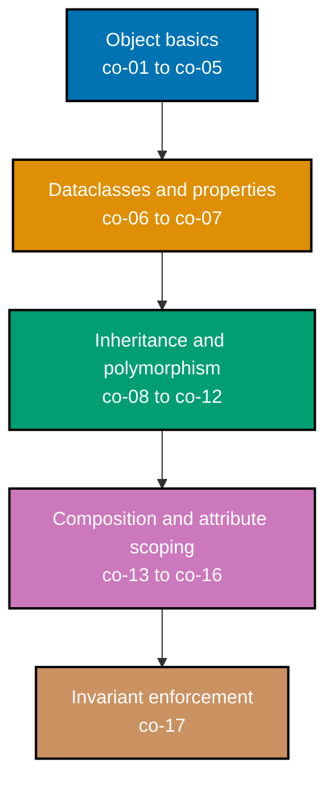

## Prerequisites

- **Prior topics**: [4 · Just Enough Python](../../just-enough-python/learning/overview.md) (classes, functions, modules) -- this topic assumes the one-line class preview from topic 4 and builds the complete, usable slice of Python OOP on top of it.
- **Tools & environment**: a macOS/Linux terminal; **Python 3.10+** (required by `@dataclass(slots=True)` in Example 39) with `pytest` installed in a `venv`; `pyright` and `mypy` for the static-typing verification every example was independently checked against. Every `example.py` in this topic is fully type-annotated and pyright-strict-clean in spirit: the two deliberate exceptions are lines that demonstrate an error a static checker correctly catches (marked `# type: ignore`, explained inline) and one classmethod-factory example (Example 49) that uses a `TypeVar` bound to the base class so the return type tracks the calling subclass instead of needing an ignore comment at all.
- **Assumed knowledge**: reading and writing basic Python, including the one-line class preview from topic 4 -- no prior object-oriented programming background is required. This topic starts from `class Dog: pass` and builds up.

## Why this exists -- the big idea

**The problem before the solution**: once data and the code that changes it drift apart, invariants break silently -- anyone, anywhere in a codebase, can put an object into an invalid state. **Keep this if you forget everything else**: bundle state with the operations that guard it, and expose behavior, not fields -- an object is a small guarantee about what stays true.

**Cross-cutting big ideas**: `taming-state` -- encapsulation contains mutable state behind an invariant, so "the balance never goes negative" becomes a property the class itself enforces, not a rule every caller has to remember. `coupling-vs-cohesion` -- a well-shaped object is cohesive (its fields and methods genuinely belong together) and narrowly coupled to the rest of the system (composition, Examples 65-70, keeps that coupling a runtime choice rather than a class-definition-time commitment).

**Scope note**: this topic covers the **usable slice** of OOP -- enough to model a domain cleanly. SOLID and deeper design patterns are a later, dedicated topic in this journey; nothing here assumes you have read that material first.

## How verification works in this topic

Every one of this topic's 80 worked examples is a complete, self-contained `example.py` colocated under `learning/code/ex-NN-slug/`, runnable in isolation with `python3 example.py` -- its expected output is shown two ways: inline, as a `# => Output: ...` comment directly beneath the `print()` call that produces it, and as a captured, verbatim `python3 example.py` run in this page's **Output** block. Every example also ships a colocated `test_example.py`, verified with `pytest -q` and shown the same way. Nothing on the following pages is a description of what Python "should" do -- every claim was independently run, and every `example.py`/`test_example.py` pair was checked with `pyright` and `mypy` directly, both reporting zero errors and zero warnings across all 80 examples.

## Concepts

Every worked example in this topic's follow-up pages cites the `co-NN` concept it exercises -- this section is the 1:1 reference those citations point back to. Read it in order: each concept builds on the ones before it, from "what is a class" through to "an invariant enforced on every path, everywhere, always."

### co-01 &middot; Class and Instance

A class is a template; instances are objects carrying their own state, built by `__init__` where `self` is the receiver the method acts on. Every attribute you assign onto `self` inside a method becomes part of that one object's private state -- two instances of the same class never share an instance attribute unless you go out of your way to make that happen (co-14 covers the class-level exception).

**Why it matters**: Every other concept in this topic builds on top of a class producing independent instances -- encapsulation, equality, inheritance, and composition all presuppose that `self` inside a method refers to exactly one object's own state, not a shared blob.

**Verify it**: Examples 1-7, 27, and 28 verify this directly: `type(d) is Dog`, independent `name` fields across two `Dog` instances, and `Dog.bark(d) == d.bark()` showing `self` is just the first positional argument, made implicit by the dot-call syntax.

### co-02 &middot; Encapsulation

Bundle state with the methods that guard it and expose behavior rather than raw fields, so the object is a small guarantee about what stays true. A `BankAccount` that only ever changes `_balance` through `deposit`/`withdraw` methods can enforce "balance never goes negative" in one place, instead of trusting every caller everywhere in the codebase to remember the rule.

**Why it matters**: Uncontrolled field access is how invariants silently break: any code path can set `account.balance = -50` if the field is public and unguarded. Routing every mutation through a method turns "stays valid" into an enforceable property of the class itself.

**Verify it**: Examples 15-17 build a `BankAccount` whose `deposit` and `withdraw` methods are the only way to move `_balance`, and reject invalid amounts with `ValueError` rather than silently corrupting state.

### co-03 &middot; Identity vs. Equality

`is` compares object identity (same address); `==` compares value via `__eq__`, and the two answers can differ for distinct objects holding equal data. Two separately constructed `Dog("Rex")` objects are never `is` each other, and are only `==` each other once the class defines what "equal" means (co-05).

**Why it matters**: Conflating `is` and `==` produces two opposite classes of bug: using `is` for value comparison rejects equal-but-distinct objects, while using `==` where identity was intended (checking a sentinel, deduplicating by reference) can silently match unrelated objects that merely compare equal.

**Verify it**: Example 10 shows `a is b` is `True` only when `b` is literally the same reference as `a`; Example 11 shows two independently constructed, otherwise-identical objects compare `==` `False` until the class opts in with `__eq__`.

### co-04 &middot; repr and str

`__repr__` gives an unambiguous developer-facing string (ideally round-trippable); `__str__` gives a readable end-user string; `repr` is the fallback when `str` is absent. `repr(obj)` calls `__repr__` directly; `str(obj)` calls `__str__` if defined, and falls back to `__repr__` when it is not.

**Why it matters**: A good `__repr__` is the single biggest lever for debuggability: every `print()`, traceback, and REPL echo of an object routes through it, and a repr that shows the constructor call needed to reproduce the object (Example 53) turns a debugging session into a copy-paste rather than a guessing game.

**Verify it**: Example 8 defines `__repr__` and checks the exact string it returns; Example 9 defines both `__str__` and `__repr__` and verifies they differ, confirming `str()` prefers `__str__` over the fallback.

### co-05 &middot; eq and hash

`__eq__` defines value equality and `__hash__` must stay consistent with it; defining `__eq__` alone sets `__hash__ = None`, making instances unhashable. The contract is one-directional but strict: two objects that compare equal must hash equal, so a class that overrides equality but wants to live inside a `set` or as a `dict` key must define `__hash__` explicitly too.

**Why it matters**: Sets and dict keys rely on `hash()` to bucket objects before `__eq__` ever runs a comparison. Breaking the eq/hash contract (equal objects with different hashes) produces silent bugs where a `set` holds duplicates it should have deduplicated, or a dict lookup with an equal key never finds the entry stored under another equal key.

**Verify it**: Examples 12, 33, 34, and 35 walk the whole contract: defining `__eq__` alone, adding a consistent `__hash__` so equal objects deduplicate in a `set`, and the `TypeError` that fires when a class defines `__eq__` without `__hash__` and gets used in a `set` anyway.

### co-06 &middot; Dataclass Value Object

`@dataclass` auto-generates `__init__`/`__repr__`/`__eq__`; `frozen` gives immutability + hashability, `slots` drops `__dict__`, `order` adds comparison, `field(default_factory=...)` gives per-instance mutable defaults. Every option is opt-in: a bare `@dataclass` only replaces boilerplate `__init__`/`__repr__`/`__eq__`, and every other behavior (immutability, ordering, memory layout) is a keyword argument away.

**Why it matters**: Hand-writing `__init__`, `__repr__`, and `__eq__` for every small data-holding class is repetitive and error-prone (forgetting to update `__eq__` after adding a field is a real, common bug). `@dataclass` generates all three from the field declarations themselves, so they can never silently drift out of sync with the fields.

**Verify it**: Examples 20-25 build up every option incrementally: the base auto-generated `__init__`, `__repr__`, and `__eq__`, then `field(default=...)`, `field(default_factory=...)`, and `__post_init__` validation.

### co-07 &middot; Properties

`@property` exposes a computed or guarded attribute through attribute syntax; a matching setter enforces invariants on assignment without changing the caller's `obj.attr = x` idiom. Code that reads `rect.area` never needs to know whether `area` is a stored field or a computed expression -- that decision is entirely internal to the class.

**Why it matters**: Starting a class with plain public fields and later needing validation forces every caller to migrate from `obj.attr` to `obj.set_attr(x)` -- a breaking API change. Properties let a class start with, or grow into, validation and derived values while the external attribute-access syntax never changes.

**Verify it**: Examples 29-32 build a `Rectangle` whose `width` is validated on every assignment through a property setter, and whose `area`/`perimeter` are computed properties that always reflect the current `width`/`height`.

### co-08 &middot; Inheritance

A subclass reuses and extends a base class; `super().__init__(...)` chains construction and `isinstance` reflects the resulting type hierarchy. `class Cat(Animal)` inherits every method and field `Animal` defines, and `isinstance(cat, Animal)` is `True` for every `Cat` instance, regardless of how many levels of subclassing separate them.

**Why it matters**: Inheritance is how a family of related types shares common structure and behavior once, in the base class, instead of duplicating it in every sibling. It is also easy to overuse (Example 65 shows exactly that failure mode), which is why co-13 exists as the counterbalancing principle.

**Verify it**: Examples 41, 42, and 46 verify `Cat` inherits `Animal`'s `__init__` fields, that `super().__init__(...)` chains base and subclass construction, and that `isinstance(cat, Animal)` holds across the hierarchy.

### co-09 &middot; Method Overriding

A subclass replaces a base method's behavior, optionally calling `super().method()` to augment rather than fully replace it. Overriding is Python's default: any method a subclass redefines with the same name shadows the base implementation completely, unless the override explicitly opts back in with a `super()` call.

**Why it matters**: Overriding lets each type in a hierarchy answer the same question ("what sound do you make", "what is your area") in its own way, which is the mechanism co-10's polymorphism relies on -- a single call-site can invoke `.speak()` on any `Animal` subclass and get that subclass's own answer.

**Verify it**: Example 43 confirms `Cat.speak()` fully replaces `Animal.speak()`; Example 44 shows a `super().speak()` call inside the override, augmenting rather than discarding the base behavior.

### co-10 &middot; Polymorphism

A single call-site invokes a shared method name and each object dispatches to its own implementation, so new types plug in without editing the call-site. Looping over a `list[Animal]` and calling `.speak()` on each element runs a different method body per element, decided entirely by each object's own runtime type.

**Why it matters**: Polymorphism is what makes "write once, extend forever" possible: a function written against a base type (or, per co-12, against no declared type at all) keeps working correctly the day a brand-new subclass is added, with zero changes to the function itself.

**Verify it**: Example 45 loops a `list[Animal]` holding mixed subclasses and confirms each element's `.speak()` call dispatches to its own class's override, not a single shared implementation.

### co-11 &middot; Abstraction (ABC)

`abc.ABC` + `@abstractmethod` declare an interface contract that cannot be instantiated and forces subclasses to implement the required methods. `Shape(abc.ABC)` with an abstract `area()` cannot be constructed directly (`TypeError`), and neither can any subclass that fails to implement every abstract method.

**Why it matters**: A plain base class with an unimplemented method only fails at the moment that method is actually called, potentially far from where the bug was introduced. An ABC fails at instantiation time instead -- the earliest possible moment -- which is a much tighter feedback loop for a missing implementation.

**Verify it**: Examples 59-64 build a `Shape` ABC, confirm both the ABC and an incomplete subclass reject instantiation, implement two concrete shapes, dispatch to both polymorphically through one function, and register a virtual subclass with `.register()`.

### co-12 &middot; Duck Typing

Compatibility is decided by the methods an object actually has, not by a declared base type; `typing.Protocol` captures that structural contract for static checking. A function that calls `.area()` on its argument works with any object exposing an `.area()` method, whether or not that object's class shares any common ancestor with any other caller.

**Why it matters**: Duck typing decouples a function from any specific inheritance hierarchy: a brand-new, entirely unrelated class satisfies an existing function the moment it implements the right method, with no `class Foo(RequiredBase)` declaration needed anywhere.

**Verify it**: Example 26 shows two unrelated classes both accepted by a function that only calls `.area()`; Example 56 formalizes the same contract with `typing.Protocol` so a static checker can verify it ahead of runtime.

### co-13 &middot; Composition Over Inheritance

Model "has-a" by holding collaborator objects (injected via the constructor) instead of "is-a" subclassing, keeping coupling narrow and behavior swappable. A `Service` that holds a `Logger` object, rather than inheriting from one, can swap in a different `Logger` implementation at construction time with zero change to `Service`'s own code.

**Why it matters**: Inheritance locks in a relationship at class-definition time and often leaks the base class's full interface (Example 65's `Stack(list)` exposes `insert`/`append`, methods a stack was never meant to have). Composition keeps the relationship a runtime choice and exposes only the methods the composing class chooses to forward.

**Verify it**: Examples 65-70 walk the whole refactor: a naive `Stack(list)` leaking the wrong interface, the composition-based fix, a `Service`/`Logger` collaborator, constructor-injected dependencies, and a swappable pricing strategy with zero subclassing.

### co-14 &middot; Class vs. Instance Attributes

Class attributes are shared across all instances; instance attributes are per-object, and a mutable class-level default is a classic shared-state bug. `species: str = "canine"` declared on the class is one shared value every instance reads until an instance explicitly shadows it with its own attribute of the same name.

**Why it matters**: A class-level mutable default (a `list` or `dict` assigned directly on the class body) is one of Python's most common accidental-sharing bugs: every instance that never explicitly reassigns it is silently mutating the _same_ shared object, not an independent copy.

**Verify it**: Examples 13, 14, 50, and 51 show a shared class attribute, an instance shadowing it locally, a class-attribute-based instance counter, and the mutable-class-attribute bug reproduced and then fixed by moving the mutable default into `__init__`.

### co-15 &middot; classmethod and staticmethod

`@classmethod` receives `cls` (alternative constructors, subclass-aware factories); `@staticmethod` is a namespaced function needing neither instance nor class. `Date.from_string(cls, s)` is a `@classmethod` alternative constructor; `Date.is_leap(year)` is a `@staticmethod` -- a plain function that only happens to live inside the class's namespace for organizational purposes.

**Why it matters**: A `@classmethod` factory that calls `cls(...)` instead of the concrete class name automatically returns the _subclass's_ type when called on a subclass -- a plain module-level function or `@staticmethod` cannot do that, because neither one receives the calling class at all.

**Verify it**: Examples 47-49 build a `@classmethod` alternate constructor, a `@staticmethod` leap-year check callable with no instance, and a `@classmethod` factory that returns the correct subclass type when called on a subclass.

### co-16 &middot; Encapsulation Conventions

Python has no true private: `_name` signals "internal" by convention and `__name` triggers name-mangling to `_Class__name`; exposing copies protects internal collections. A single leading underscore is a promise, not an enforcement mechanism -- external code _can_ still reach `obj._balance`, but doing so is a documented violation of the class's contract.

**Why it matters**: Python's "we're all consenting adults" philosophy trades compiler-enforced privacy for convention plus name-mangling: `_name` communicates intent to every reader, and `__name`'s mangling mainly exists to avoid accidental name collisions in subclasses, not to make an attribute truly unreachable.

**Verify it**: Examples 18, 19, and 54 show the single-underscore convention, `__pin`'s name-mangling to `_Class__pin` (and the `AttributeError` from accessing the unmangled name directly), and returning a read-only copy of an internal list so external mutation cannot reach the original.

### co-17 &middot; Invariant Enforcement

Validate in `__init__`, `__post_init__`, and setters on every path so an object can never enter an invalid state from anywhere. An invariant validated only in `__init__` is not actually enforced if a later setter or mutating method can still push the object past the same boundary -- every path that changes state needs the same check.

**Why it matters**: An invariant that holds "most of the time" is not an invariant at all -- it is a bug waiting for the one code path nobody checked. Enforcing the same rule at every entry point (constructor, `__post_init__`, every setter, every mutating method) is what turns "usually true" into "provably always true".

**Verify it**: Examples 16, 17, 25, 30, 52, 71, 77, and 80 enforce invariants across every kind of entry point this topic covers: raising on invalid constructor input, raising on an invalid setter assignment, raising on an illegal state transition, and a property-based test that throws hundreds of random inputs at the same invariant looking for a gap.

## Examples by Level

### Beginner (Examples 1–28)

- [Example 1: Define a Minimal Class](/en/c/learn/fundamentally-strong/software-engineer/object-oriented-programming-essentials/learning/beginner#example-1-define-a-minimal-class)
- [Example 2: Initialize Fields in `__init__`](/en/c/learn/fundamentally-strong/software-engineer/object-oriented-programming-essentials/learning/beginner#example-2-initialize-fields-in-__init__)
- [Example 3: Define an Instance Method](/en/c/learn/fundamentally-strong/software-engineer/object-oriented-programming-essentials/learning/beginner#example-3-define-an-instance-method)
- [Example 4: A Method That Reads Instance State](/en/c/learn/fundamentally-strong/software-engineer/object-oriented-programming-essentials/learning/beginner#example-4-a-method-that-reads-instance-state)
- [Example 5: Multiple Instances Stay Independent](/en/c/learn/fundamentally-strong/software-engineer/object-oriented-programming-essentials/learning/beginner#example-5-multiple-instances-stay-independent)
- [Example 6: A Method That Mutates Instance State](/en/c/learn/fundamentally-strong/software-engineer/object-oriented-programming-essentials/learning/beginner#example-6-a-method-that-mutates-instance-state)
- [Example 7: A Default `__init__` Argument](/en/c/learn/fundamentally-strong/software-engineer/object-oriented-programming-essentials/learning/beginner#example-7-a-default-__init__-argument)
- [Example 8: `__repr__` for Debugging](/en/c/learn/fundamentally-strong/software-engineer/object-oriented-programming-essentials/learning/beginner#example-8-__repr__-for-debugging)
- [Example 9: str vs. repr](/en/c/learn/fundamentally-strong/software-engineer/object-oriented-programming-essentials/learning/beginner#example-9-str-vs-repr)
- [Example 10: Identity with is](/en/c/learn/fundamentally-strong/software-engineer/object-oriented-programming-essentials/learning/beginner#example-10-identity-with-is)
- [Example 11: Default Equality Falls Back to Identity](/en/c/learn/fundamentally-strong/software-engineer/object-oriented-programming-essentials/learning/beginner#example-11-default-equality-falls-back-to-identity)
- [Example 12: Define `__eq__` for Value Comparison](/en/c/learn/fundamentally-strong/software-engineer/object-oriented-programming-essentials/learning/beginner#example-12-define-__eq__-for-value-comparison)
- [Example 13: A Shared Class Attribute](/en/c/learn/fundamentally-strong/software-engineer/object-oriented-programming-essentials/learning/beginner#example-13-a-shared-class-attribute)
- [Example 14: An Instance Attribute Shadows the Class Attribute](/en/c/learn/fundamentally-strong/software-engineer/object-oriented-programming-essentials/learning/beginner#example-14-an-instance-attribute-shadows-the-class-attribute)
- [Example 15: Encapsulate a Bank Balance](/en/c/learn/fundamentally-strong/software-engineer/object-oriented-programming-essentials/learning/beginner#example-15-encapsulate-a-bank-balance)
- [Example 16: Reject a Negative Deposit](/en/c/learn/fundamentally-strong/software-engineer/object-oriented-programming-essentials/learning/beginner#example-16-reject-a-negative-deposit)
- [Example 17: Guard Against Overdrafting on Withdraw](/en/c/learn/fundamentally-strong/software-engineer/object-oriented-programming-essentials/learning/beginner#example-17-guard-against-overdrafting-on-withdraw)
- [Example 18: The Single-Underscore Convention](/en/c/learn/fundamentally-strong/software-engineer/object-oriented-programming-essentials/learning/beginner#example-18-the-single-underscore-convention)
- [Example 19: Name Mangling with a Double-Underscore Attribute](/en/c/learn/fundamentally-strong/software-engineer/object-oriented-programming-essentials/learning/beginner#example-19-name-mangling-with-a-double-underscore-attribute)
- [Example 20: A Basic Dataclass](/en/c/learn/fundamentally-strong/software-engineer/object-oriented-programming-essentials/learning/beginner#example-20-a-basic-dataclass)
- [Example 21: A Dataclass's Auto-Generated `__repr__`](/en/c/learn/fundamentally-strong/software-engineer/object-oriented-programming-essentials/learning/beginner#example-21-a-dataclasss-auto-generated-__repr__)
- [Example 22: A Dataclass's Auto-Generated `__eq__`](/en/c/learn/fundamentally-strong/software-engineer/object-oriented-programming-essentials/learning/beginner#example-22-a-dataclasss-auto-generated-__eq__)
- [Example 23: A Dataclass Field with a Default Value](/en/c/learn/fundamentally-strong/software-engineer/object-oriented-programming-essentials/learning/beginner#example-23-a-dataclass-field-with-a-default-value)
- [Example 24: default_factory for a Mutable Default](/en/c/learn/fundamentally-strong/software-engineer/object-oriented-programming-essentials/learning/beginner#example-24-default_factory-for-a-mutable-default)
- [Example 25: `__post_init__` Validation](/en/c/learn/fundamentally-strong/software-engineer/object-oriented-programming-essentials/learning/beginner#example-25-__post_init__-validation)
- [Example 26: A Duck-Typed area() Preview](/en/c/learn/fundamentally-strong/software-engineer/object-oriented-programming-essentials/learning/beginner#example-26-a-duck-typed-area-preview)
- [Example 27: Objects in a Collection](/en/c/learn/fundamentally-strong/software-engineer/object-oriented-programming-essentials/learning/beginner#example-27-objects-in-a-collection)
- [Example 28: self Is Just an Explicit First Argument](/en/c/learn/fundamentally-strong/software-engineer/object-oriented-programming-essentials/learning/beginner#example-28-self-is-just-an-explicit-first-argument)

### Intermediate (Examples 29–58)

- [Example 29: A Read-Only Property](/en/c/learn/fundamentally-strong/software-engineer/object-oriented-programming-essentials/learning/intermediate#example-29-a-read-only-property)
- [Example 30: A Property Setter That Validates](/en/c/learn/fundamentally-strong/software-engineer/object-oriented-programming-essentials/learning/intermediate#example-30-a-property-setter-that-validates)
- [Example 31: A Property Backed by a Private Field](/en/c/learn/fundamentally-strong/software-engineer/object-oriented-programming-essentials/learning/intermediate#example-31-a-property-backed-by-a-private-field)
- [Example 32: A Computed Property Derived from Two Fields](/en/c/learn/fundamentally-strong/software-engineer/object-oriented-programming-essentials/learning/intermediate#example-32-a-computed-property-derived-from-two-fields)
- [Example 33: A Money Value Object with `__eq__`](/en/c/learn/fundamentally-strong/software-engineer/object-oriented-programming-essentials/learning/intermediate#example-33-a-money-value-object-with-__eq__)
- [Example 34: A Consistent `__hash__` Alongside `__eq__`](/en/c/learn/fundamentally-strong/software-engineer/object-oriented-programming-essentials/learning/intermediate#example-34-a-consistent-__hash__-alongside-__eq__)
- [Example 35: `__eq__` Without `__hash__` Is Unhashable](/en/c/learn/fundamentally-strong/software-engineer/object-oriented-programming-essentials/learning/intermediate#example-35-__eq__-without-__hash__-is-unhashable)
- [Example 36: A Frozen Dataclass Rejects Field Assignment](/en/c/learn/fundamentally-strong/software-engineer/object-oriented-programming-essentials/learning/intermediate#example-36-a-frozen-dataclass-rejects-field-assignment)
- [Example 37: A Frozen Dataclass Is Hashable by Default](/en/c/learn/fundamentally-strong/software-engineer/object-oriented-programming-essentials/learning/intermediate#example-37-a-frozen-dataclass-is-hashable-by-default)
- [Example 38: eq=False Falls Back to Identity Equality](/en/c/learn/fundamentally-strong/software-engineer/object-oriented-programming-essentials/learning/intermediate#example-38-eqfalse-falls-back-to-identity-equality)
- [Example 39: slots=True Drops Per-Instance `__dict__`](/en/c/learn/fundamentally-strong/software-engineer/object-oriented-programming-essentials/learning/intermediate#example-39-slotstrue-drops-per-instance-__dict__)
- [Example 40: order=True Adds Field-Tuple Comparisons](/en/c/learn/fundamentally-strong/software-engineer/object-oriented-programming-essentials/learning/intermediate#example-40-ordertrue-adds-field-tuple-comparisons)
- [Example 41: A Subclass Inherits Fields and Methods](/en/c/learn/fundamentally-strong/software-engineer/object-oriented-programming-essentials/learning/intermediate#example-41-a-subclass-inherits-fields-and-methods)
- [Example 42: Chaining Construction with super().`__init__`()](/en/c/learn/fundamentally-strong/software-engineer/object-oriented-programming-essentials/learning/intermediate#example-42-chaining-construction-with-super__init__)
- [Example 43: Overriding a Method](/en/c/learn/fundamentally-strong/software-engineer/object-oriented-programming-essentials/learning/intermediate#example-43-overriding-a-method)
- [Example 44: Calling super() Inside an Override](/en/c/learn/fundamentally-strong/software-engineer/object-oriented-programming-essentials/learning/intermediate#example-44-calling-super-inside-an-override)
- [Example 45: Polymorphic Dispatch Over a Mixed List](/en/c/learn/fundamentally-strong/software-engineer/object-oriented-programming-essentials/learning/intermediate#example-45-polymorphic-dispatch-over-a-mixed-list)
- [Example 46: isinstance Across a Hierarchy](/en/c/learn/fundamentally-strong/software-engineer/object-oriented-programming-essentials/learning/intermediate#example-46-isinstance-across-a-hierarchy)
- [Example 47: A classmethod Alternative Constructor](/en/c/learn/fundamentally-strong/software-engineer/object-oriented-programming-essentials/learning/intermediate#example-47-a-classmethod-alternative-constructor)
- [Example 48: A staticmethod Namespaced Utility](/en/c/learn/fundamentally-strong/software-engineer/object-oriented-programming-essentials/learning/intermediate#example-48-a-staticmethod-namespaced-utility)
- [Example 49: A classmethod Factory Returns the Subclass Type](/en/c/learn/fundamentally-strong/software-engineer/object-oriented-programming-essentials/learning/intermediate#example-49-a-classmethod-factory-returns-the-subclass-type)
- [Example 50: A Class-Attribute Instance Counter](/en/c/learn/fundamentally-strong/software-engineer/object-oriented-programming-essentials/learning/intermediate#example-50-a-class-attribute-instance-counter)
- [Example 51: The Mutable Class-Attribute Pitfall, Reproduced and Fixed](/en/c/learn/fundamentally-strong/software-engineer/object-oriented-programming-essentials/learning/intermediate#example-51-the-mutable-class-attribute-pitfall-reproduced-and-fixed)
- [Example 52: The Same Invariant Enforced in `__init__` and a Setter](/en/c/learn/fundamentally-strong/software-engineer/object-oriented-programming-essentials/learning/intermediate#example-52-the-same-invariant-enforced-in-__init__-and-a-setter)
- [Example 53: A `__repr__` That Round-Trips Through eval()](/en/c/learn/fundamentally-strong/software-engineer/object-oriented-programming-essentials/learning/intermediate#example-53-a-__repr__-that-round-trips-through-eval)
- [Example 54: Exposing a Read-Only View of an Internal Collection](/en/c/learn/fundamentally-strong/software-engineer/object-oriented-programming-essentials/learning/intermediate#example-54-exposing-a-read-only-view-of-an-internal-collection)
- [Example 55: A Duck-Typed Function Over Mixed Types](/en/c/learn/fundamentally-strong/software-engineer/object-oriented-programming-essentials/learning/intermediate#example-55-a-duck-typed-function-over-mixed-types)
- [Example 56: typing.Protocol Formalizes Duck Typing](/en/c/learn/fundamentally-strong/software-engineer/object-oriented-programming-essentials/learning/intermediate#example-56-typingprotocol-formalizes-duck-typing)
- [Example 57: A Type-Strict `__eq__` Across a Subclass](/en/c/learn/fundamentally-strong/software-engineer/object-oriented-programming-essentials/learning/intermediate#example-57-a-type-strict-__eq__-across-a-subclass)
- [Example 58: A Dataclass Subclassing Another Dataclass](/en/c/learn/fundamentally-strong/software-engineer/object-oriented-programming-essentials/learning/intermediate#example-58-a-dataclass-subclassing-another-dataclass)

### Advanced (Examples 59–80)

- [Example 59: Define an ABC Interface](/en/c/learn/fundamentally-strong/software-engineer/object-oriented-programming-essentials/learning/advanced#example-59-define-an-abc-interface)
- [Example 60: An Incomplete Subclass Also Cannot Be Instantiated](/en/c/learn/fundamentally-strong/software-engineer/object-oriented-programming-essentials/learning/advanced#example-60-an-incomplete-subclass-also-cannot-be-instantiated)
- [Example 61: Two Concrete Implementations of the Same ABC](/en/c/learn/fundamentally-strong/software-engineer/object-oriented-programming-essentials/learning/advanced#example-61-two-concrete-implementations-of-the-same-abc)
- [Example 62: One Call-Site Handles Every Shape Implementation](/en/c/learn/fundamentally-strong/software-engineer/object-oriented-programming-essentials/learning/advanced#example-62-one-call-site-handles-every-shape-implementation)
- [Example 63: An ABC Providing a Concrete Shared Helper](/en/c/learn/fundamentally-strong/software-engineer/object-oriented-programming-essentials/learning/advanced#example-63-an-abc-providing-a-concrete-shared-helper)
- [Example 64: Registering a Virtual Subclass](/en/c/learn/fundamentally-strong/software-engineer/object-oriented-programming-essentials/learning/advanced#example-64-registering-a-virtual-subclass)
- [Example 65: A Naive Stack(list) Leaks the Wrong Interface](/en/c/learn/fundamentally-strong/software-engineer/object-oriented-programming-essentials/learning/advanced#example-65-a-naive-stacklist-leaks-the-wrong-interface)
- [Example 66: Refactoring Stack to Composition](/en/c/learn/fundamentally-strong/software-engineer/object-oriented-programming-essentials/learning/advanced#example-66-refactoring-stack-to-composition)
- [Example 67: A Service Delegates to a Logger Collaborator](/en/c/learn/fundamentally-strong/software-engineer/object-oriented-programming-essentials/learning/advanced#example-67-a-service-delegates-to-a-logger-collaborator)
- [Example 68: Constructor-Injected Dependencies Enable Fakes in Tests](/en/c/learn/fundamentally-strong/software-engineer/object-oriented-programming-essentials/learning/advanced#example-68-constructor-injected-dependencies-enable-fakes-in-tests)
- [Example 69: A Swappable Pricing Strategy via Composition](/en/c/learn/fundamentally-strong/software-engineer/object-oriented-programming-essentials/learning/advanced#example-69-a-swappable-pricing-strategy-via-composition)
- [Example 70: Type the Injected Field Against an Interface, Not a Concrete Class](/en/c/learn/fundamentally-strong/software-engineer/object-oriented-programming-essentials/learning/advanced#example-70-type-the-injected-field-against-an-interface-not-a-concrete-class)
- [Example 71: An Order Enforcing Legal Status Transitions](/en/c/learn/fundamentally-strong/software-engineer/object-oriented-programming-essentials/learning/advanced#example-71-an-order-enforcing-legal-status-transitions)
- [Example 72: A Frozen Money Whose Arithmetic Returns New Instances](/en/c/learn/fundamentally-strong/software-engineer/object-oriented-programming-essentials/learning/advanced#example-72-a-frozen-money-whose-arithmetic-returns-new-instances)
- [Example 73: Value Objects Deduplicate Inside a Set](/en/c/learn/fundamentally-strong/software-engineer/object-oriented-programming-essentials/learning/advanced#example-73-value-objects-deduplicate-inside-a-set)
- [Example 74: Polymorphism via Duck Typing, with No Shared Base Class](/en/c/learn/fundamentally-strong/software-engineer/object-oriented-programming-essentials/learning/advanced#example-74-polymorphism-via-duck-typing-with-no-shared-base-class)
- [Example 75: The Template Method Pattern](/en/c/learn/fundamentally-strong/software-engineer/object-oriented-programming-essentials/learning/advanced#example-75-the-template-method-pattern)
- [Example 76: Splitting a Two-Responsibility Class into Composed Collaborators](/en/c/learn/fundamentally-strong/software-engineer/object-oriented-programming-essentials/learning/advanced#example-76-splitting-a-two-responsibility-class-into-composed-collaborators)
- [Example 77: An Invariant Still Holds After a Composition Refactor](/en/c/learn/fundamentally-strong/software-engineer/object-oriented-programming-essentials/learning/advanced#example-77-an-invariant-still-holds-after-a-composition-refactor)
- [Example 78: Auto-Registering Subclasses with `__init_subclass__`](/en/c/learn/fundamentally-strong/software-engineer/object-oriented-programming-essentials/learning/advanced#example-78-auto-registering-subclasses-with-__init_subclass__)
- [Example 79: A Full Domain Model in One Package](/en/c/learn/fundamentally-strong/software-engineer/object-oriented-programming-essentials/learning/advanced#example-79-a-full-domain-model-in-one-package)
- [Example 80: A Property-Based Test of an Invariant](/en/c/learn/fundamentally-strong/software-engineer/object-oriented-programming-essentials/learning/advanced#example-80-a-property-based-test-of-an-invariant)

---

← Previous: [7 · Data Structures & Algorithms Essentials Drilling](../../data-structures-and-algorithms-essentials/drilling/overview.md) · Next: [Beginner Examples](./beginner.md) →
