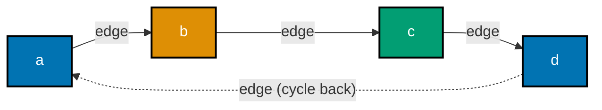
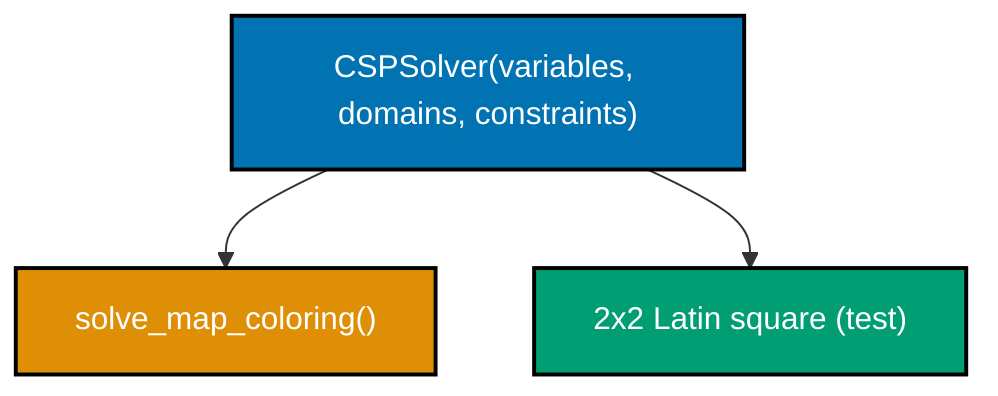
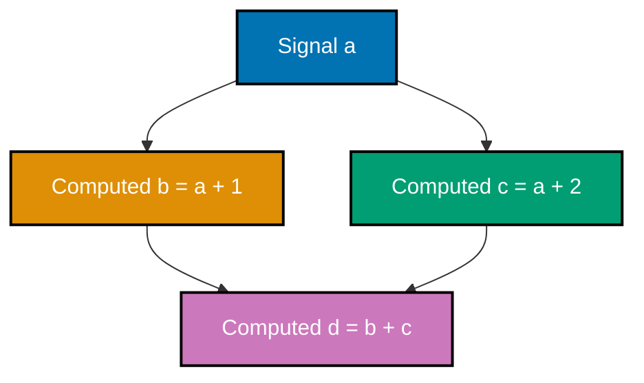
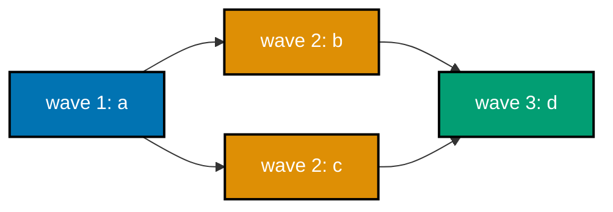
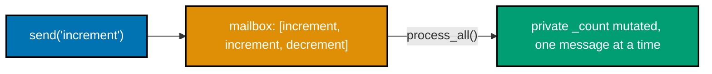
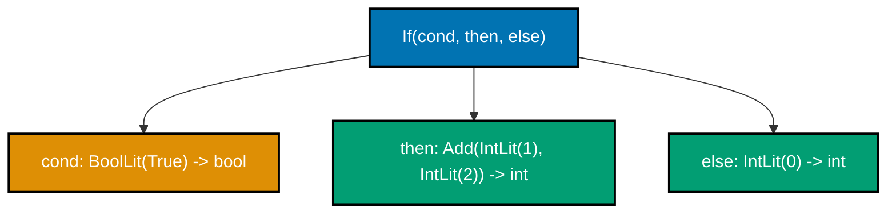
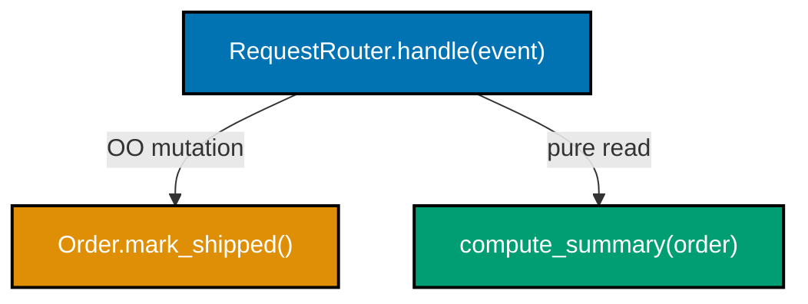
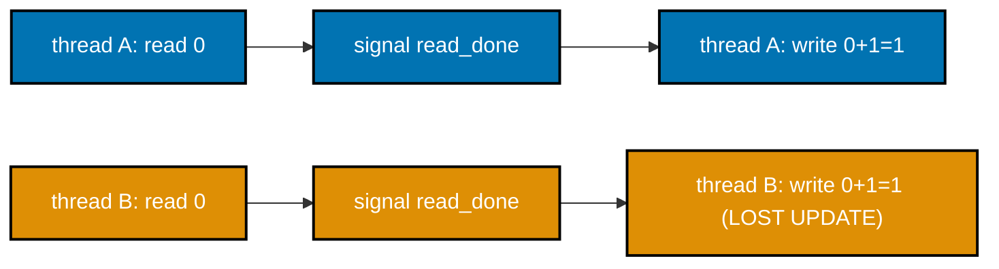
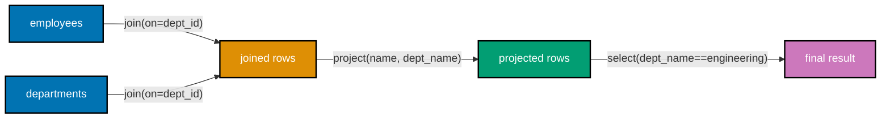

Examples 59-80 close out the topic: one problem solved in all four major paradigms against a shared
test, a generic CSP solver with propagation, a reactive diamond graph, a real thread-race reproduction,
a relational algebra engine, and the meta-skill of matching paradigm to problem with a defensible,
evidence-grounded argument (co-21 through co-25). Every example is self-contained under
`learning/code/ex-NN-slug/`.

### Example 59: Four Paradigms, One Shared Test

_ex-59 &middot; exercises co-01, co-05, co-08, co-09, co-23_

One problem -- "count how many numbers in a list are prime" -- solved imperatively, as an OO strategy,
functionally, and declaratively, with all four implementations checked against the identical
`shared_test()` function.

**`example.py`**

```python
"""Example 59: Four Paradigms, One Shared Test."""

from abc import ABC, abstractmethod  # => ABC/abstractmethod define way #2's strategy interface
from collections.abc import Callable  # => types the count_fn parameter shared_test() accepts below
from functools import reduce  # => reduce() is way #3's fold, threading a count through the list

TASK = "count how many numbers in a list are prime"  # => the ONE problem, solved four ways below


def is_prime(n: int) -> bool:  # => shared helper -- not itself part of the "four ways" comparison
    if n < 2:  # => 0, 1, and negatives are never prime by definition
        return False  # => reject immediately -- no need to try any divisor
    return all(n % d != 0 for d in range(2, int(n**0.5) + 1))  # => trial division up to sqrt(n)


def count_primes_imperative(nums: list[int]) -> int:  # => way #1: explicit loop + counter
    count = 0  # => mutable accumulator, starts at zero
    for n in nums:  # => explicit iteration over every candidate number
        if is_prime(n):  # => explicit selection: only count numbers that pass the shared check
            count += 1  # => explicit mutation: increment the running total
    return count  # => the fully built accumulator


class PrimeCounter(ABC):  # => way #2: OO -- an abstract strategy, one concrete implementation
    @abstractmethod  # => marks count() as required -- PrimeCounter itself can never be instantiated
    def count(self, nums: list[int]) -> int: ...  # => no body here -- only concrete subclasses implement it


class TrialDivisionPrimeCounter(PrimeCounter):  # => the concrete OO strategy
    def count(self, nums: list[int]) -> int:  # => satisfies the abstract count() contract above
        return sum(1 for n in nums if is_prime(n))  # => OO wraps the same core check in an object


def _count_or_skip(acc: int, n: int) -> int:  # => the fold's step function, fully typed so reduce() infers cleanly
    return acc + 1 if is_prime(n) else acc  # => same rule as the imperative/OO/declarative versions, expressed as a fold step


def count_primes_functional(nums: list[int]) -> int:  # => way #3: a pure fold, no mutation
    return reduce(_count_or_skip, nums, 0)  # => threads a count, no named accumulator


def count_primes_declarative(nums: list[int]) -> int:  # => way #4: states WHAT to count, not HOW
    return len([n for n in nums if is_prime(n)])  # => "the length of the list of primes"


def shared_test(count_fn: Callable[[list[int]], int]) -> bool:  # => the ONE test all four solutions must pass, given as a function
    sample = [2, 3, 4, 5, 6, 7, 8, 9, 10]  # => primes here: 2, 3, 5, 7 -- four of them
    return count_fn(sample) == 4  # => every paradigm's answer must equal 4


results = {  # => run all four paradigms against the SAME shared_test function
    "imperative": shared_test(count_primes_imperative),  # => way #1's verdict
    "oo": shared_test(TrialDivisionPrimeCounter().count),  # => way #2's verdict
    "functional": shared_test(count_primes_functional),  # => way #3's verdict
    "declarative": shared_test(count_primes_declarative),  # => way #4's verdict
}  # => closes the per-paradigm results table
print(results)  # => all four must pass the identical shared test
# => Output: {'imperative': True, 'oo': True, 'functional': True, 'declarative': True}
print(all(results.values()))  # => a single boolean summary
# => Output: True
```

**Run**

```shell
python3 example.py
```

**Output**

```text
{'imperative': True, 'oo': True, 'functional': True, 'declarative': True}
True
```

**`test_example.py`**

```python
"""Example 59: pytest verification for Four Paradigms, One Shared Test."""

from example import (
    TrialDivisionPrimeCounter,
    count_primes_declarative,
    count_primes_functional,
    count_primes_imperative,
    shared_test,
)


def test_all_four_paradigm_implementations_pass_the_shared_test() -> None:
    assert shared_test(count_primes_imperative)  # => way #1
    assert shared_test(TrialDivisionPrimeCounter().count)  # => way #2
    assert shared_test(count_primes_functional)  # => way #3
    assert shared_test(count_primes_declarative)  # => way #4


def test_all_four_agree_on_a_second_independent_sample() -> None:
    sample = [11, 12, 13, 14, 15, 16, 17]  # => primes here: 11, 13, 17 -- three of them
    counts = {
        count_primes_imperative(sample),
        TrialDivisionPrimeCounter().count(sample),
        count_primes_functional(sample),
        count_primes_declarative(sample),
    }
    assert counts == {3}  # => a set of size 1 proves all four returned the SAME value


# => Run: pytest -- Output: 2 passed
```

**Verify**

```shell
pytest -q
```

**Output**

```text
2 passed
```

**Key takeaway**: `shared_test()` is the same function called against all four implementations --
`{'imperative': True, 'oo': True, 'functional': True, 'declarative': True}` proves the answer doesn't
depend on which paradigm computed it.

**Why it matters**: this is the topic's clearest statement of its own thesis in one example -- paradigm
is a lens on the SAME problem, not a different problem; Example 78 later builds a full comparison matrix
across this exact shape. `shared_test()` is the SAME function called against all four implementations, not four separate test functions that could quietly drift apart -- a structural guarantee that the comparison itself stays honest as the four solutions evolve independently.

---

### Example 60: Mini Logic Engine (Rules + Queries)

_ex-60 &middot; exercises co-13, co-14_

A small `LogicEngine` stores base `edge` facts and answers `query_path()` -- a transitive-closure query
-- via recursive backtracking that guards against infinite loops on cyclic fact bases.



**`example.py`**

```python
"""Example 60: Mini Logic Engine (Rules + Queries)."""

from collections.abc import Iterator  # => query_edge() and query_path() are lazy, typed as Iterator

Fact = tuple[str, str, str]  # => (relation, subject, object) -- e.g. ("edge", "a", "b")


class LogicEngine:  # => a small backtracking engine: stored facts plus derived rules
    def __init__(self) -> None:  # => constructor starts with an empty fact base
        self.facts: set[Fact] = set()  # => the base facts, asserted directly

    def assert_fact(self, relation: str, subject: str, obj: str) -> None:  # => add a base fact
        self.facts.add((relation, subject, obj))  # => stores the raw fact, no rule evaluated yet

    def query_edge(self, subject: str) -> Iterator[str]:  # => base relation: direct edges only
        for relation, s, o in self.facts:  # => scan every stored fact
            if relation == "edge" and s == subject:  # => unify against the "edge" relation
                yield o  # => a direct hop

    def query_path(self, subject: str, _seen: frozenset[str] | None = None) -> Iterator[str]:  # => the RULE, resolved via recursive search
        # => RULE: path(X, Z) :- edge(X, Z).  path(X, Z) :- edge(X, Y), path(Y, Z).  (transitive closure)
        seen = _seen or frozenset()  # => guards against infinite recursion on a cyclic fact base
        for direct in self.query_edge(subject):  # => base case: every direct edge is a path
            if direct not in seen:  # => BACKTRACKING guard: don't revisit a node already on this path
                yield direct  # => yield the direct hop itself
                yield from self.query_path(direct, seen | {subject})  # => recurse: extend the path further


engine = LogicEngine()  # => build a small graph as facts
engine.assert_fact("edge", "a", "b")  # => a -> b
engine.assert_fact("edge", "b", "c")  # => b -> c
engine.assert_fact("edge", "c", "d")  # => c -> d
engine.assert_fact("edge", "d", "a")  # => d -> a: a cycle, exercises the backtracking guard

closure = sorted(set(engine.query_path("a")))  # => the transitive closure from "a"
print(closure)  # => a reaches b, c, d; the guard stops the d->a branch since "a" is already in `seen`
# => Output: ['b', 'c', 'd']
```

**Run**

```shell
python3 example.py
```

**Output**

```text
['b', 'c', 'd']
```

**`test_example.py`**

```python
"""Example 60: pytest verification for Mini Logic Engine (Rules + Queries)."""

from example import LogicEngine


def test_transitive_closure_query_resolves() -> None:
    engine = LogicEngine()  # => fresh engine, isolated from the module-level demo
    engine.assert_fact("edge", "x", "y")
    engine.assert_fact("edge", "y", "z")
    closure = sorted(set(engine.query_path("x")))
    assert closure == ["y", "z"]  # => x reaches y directly, and z transitively via y


def test_cyclic_facts_do_not_cause_infinite_recursion() -> None:
    engine = LogicEngine()  # => fresh engine with a self-referencing cycle
    engine.assert_fact("edge", "p", "q")
    engine.assert_fact("edge", "q", "p")  # => p -> q -> p, a two-node cycle
    closure = sorted(set(engine.query_path("p")))  # => must terminate, not hang
    # => the guard stops q->p once "p" is already in `seen` -- proves the cycle was cut, not looped forever
    assert closure == ["q"]


# => Run: pytest -- Output: 2 passed
```

**Verify**

```shell
pytest -q
```

**Output**

```text
2 passed
```

**Key takeaway**: the recursive call passes `seen | {subject}` forward -- each recursion level adds its
own node to the guard set, so `d`'s edge back to `a` is checked against a `seen` set that already
contains `"a"` and is correctly skipped.

**Why it matters**: `path(X, Z) :- edge(X, Z). path(X, Z) :- edge(X, Y), path(Y, Z).` is a genuine
recursive logic rule -- Example 36's grandparent query was two levels deep and fixed; this engine
resolves a query of unbounded depth, safely, even over a cyclic fact base. The `seen` frozenset threaded through each recursive call is the entire cycle-safety mechanism: without it, the `d -> a` edge would let `query_path("a")` recurse forever, so this one guard is what separates a genuinely unbounded-depth query from an infinite loop.

---

### Example 61: Generic CSP Solver (with Propagation)

_ex-61 &middot; exercises co-15_

One `CSPSolver` class, generic over variables/domains/constraints, solves both map coloring and a 2x2
Latin square by forward-checking propagation shrinking each variable's domain before the next choice
point.



**`example.py`**

```python
"""Example 61: Generic CSP Solver (with Propagation)."""

from collections.abc import Callable  # => types every Constraint stored below

Variable = str  # => a type alias -- variable names are just strings
Value = int  # => a type alias -- domain values are just integers
Assignment = dict[Variable, Value]  # => a partial or full mapping from variable to chosen value
Constraint = Callable[[Assignment], bool]  # => a constraint checks a PARTIAL assignment for consistency


class CSPSolver:  # => generic over variables, domains, and constraints -- knows nothing about "sudoku"
    def __init__(  # => constructor takes the whole CSP declaration: variables, domains, constraints
        self,
        variables: list[Variable],  # => every variable that needs a value
        domains: dict[Variable, list[Value]],  # => each variable's own candidate values
        constraints: list[Constraint],  # => every rule an assignment must satisfy
    ) -> None:
        self.variables = variables  # => stored as-is -- this solver never mutates the declared variable list
        self.domains = domains  # => stored as-is -- solve() works from a fresh copy, not this original
        self.constraints = constraints  # => stored as-is -- checked by _consistent() below

    def _consistent(self, assignment: Assignment) -> bool:  # => check every constraint against what's assigned
        return all(c(assignment) for c in self.constraints)  # => a constraint referencing an unassigned var
        # => must itself handle that (return True until enough variables are bound to judge)

    def _propagate_domain(self, var: Variable, value: Value, assignment: Assignment) -> dict[Variable, list[Value]]:  # => forward-checking entry point
        # => forward-checking PROPAGATION: after assigning var=value, shrink neighbors' remaining domains
        pruned = {v: list(d) for v, d in self.domains.items()}  # => a working copy, original domains untouched
        trial = {**assignment, var: value}  # => a "what if" assignment, used only to test consistency
        for other in self.variables:  # => check every OTHER variable's remaining candidates against `trial`
            if other == var or other in assignment:  # => skip the variable just assigned and any already-fixed
                continue  # => nothing to prune for a variable that already has (or doesn't need) a value
            pruned[other] = [val for val in pruned[other] if self._consistent({**trial, other: val})]  # => keep only values still consistent
        return pruned  # => every remaining domain, possibly shrunk by this one assignment

    def solve(self) -> Assignment | None:  # => backtracking search, augmented with propagation
        def backtrack(assignment: Assignment, domains: dict[Variable, list[Value]]) -> Assignment | None:  # => the recursive search itself
            if len(assignment) == len(self.variables):  # => every variable assigned -- solved
                return dict(assignment)  # => copy out only on success, matching solve_coloring's convention
            unassigned = [v for v in self.variables if v not in assignment][0]  # => next variable to try
            for value in domains[unassigned]:  # => CHOICE POINT, but only over the ALREADY-PRUNED domain
                if self._consistent({**assignment, unassigned: value}):  # => only try values that satisfy every constraint so far
                    assignment[unassigned] = value  # => tentatively assign
                    pruned = self._propagate_domain(unassigned, value, assignment)  # => propagate immediately
                    if all(pruned[v] for v in self.variables if v not in assignment):  # => no domain went empty
                        result = backtrack(assignment, pruned)  # => recurse with the SHRUNK domains
                        if result is not None:  # => a deeper call already found a full solution
                            return result  # => propagate success straight back up the recursion
                    del assignment[unassigned]  # => BACKTRACK: undo, try the next value
            return None  # => no value in this domain led to a solution given the current partial assignment

        return backtrack({}, {v: list(d) for v, d in self.domains.items()})  # => start the search from an empty assignment and full domains


def solve_map_coloring() -> Assignment | None:  # => reuses the SAME solver for a totally different puzzle
    adjacency = {"west": ["central"], "central": ["west", "east"], "east": ["central"]}  # => same graph as example 38
    variables = list(adjacency.keys())  # => one CSP variable per region
    domains = {v: [0, 1, 2] for v in variables}  # => 0, 1, 2 stand in for three colors

    def make_constraint(a: str, b: str) -> Constraint:  # => a factory closing over which pair must differ
        def constraint(assignment: Assignment) -> bool:  # => returns True until BOTH sides are assigned
            return a not in assignment or b not in assignment or assignment[a] != assignment[b]  # => vacuously true if either side is still unassigned

        return constraint  # => a fresh closure per adjacent pair, capturing a and b by reference

    constraints = [make_constraint(a, b) for a, neighbors in adjacency.items() for b in neighbors if a < b]  # => one constraint per undirected edge, counted once
    return CSPSolver(variables, domains, constraints).solve()  # => the SAME generic solve() as any other CSP


result = solve_map_coloring()  # => the SAME generic solver, applied to map coloring
# => neither CSPSolver nor backtrack() contains a single line of map-coloring-specific logic
print(result is not None)  # => a solution was found
# => Output: True
```

**Run**

```shell
python3 example.py
```

**Output**

```text
True
```

**`test_example.py`**

```python
"""Example 61: pytest verification for Generic CSP Solver (with Propagation)."""

from example import Assignment, Constraint, CSPSolver, solve_map_coloring


def test_generic_solver_solves_map_coloring() -> None:
    result = solve_map_coloring()  # => same call as the module-level demo
    assert result is not None  # => a valid 3-coloring exists for this simple adjacency
    assert result["central"] != result["west"]  # => the actual declared constraints
    assert result["central"] != result["east"]


def test_generic_solver_solves_a_tiny_sudoku_style_grid() -> None:
    # => reuse the SAME CSPSolver class for a 2x2 latin-square: each row/col has distinct values 1,2
    variables = ["r0c0", "r0c1", "r1c0", "r1c1"]
    domains = {v: [1, 2] for v in variables}

    def distinct(a: str, b: str) -> Constraint:  # => matches example.py's make_constraint signature
        def constraint(assignment: Assignment) -> bool:  # => fully typed closure, no Unknown inference
            return a not in assignment or b not in assignment or assignment[a] != assignment[b]

        return constraint

    constraints = [
        distinct("r0c0", "r0c1"),  # => row 0 distinct
        distinct("r1c0", "r1c1"),  # => row 1 distinct
        distinct("r0c0", "r1c0"),  # => column 0 distinct
        distinct("r0c1", "r1c1"),  # => column 1 distinct
    ]
    result = CSPSolver(variables, domains, constraints).solve()
    assert result is not None  # => a valid 2x2 latin square exists
    assert result["r0c0"] != result["r0c1"]  # => spot-check one of the declared constraints holds


# => Run: pytest -- Output: 2 passed
```

**Verify**

```shell
pytest -q
```

**Output**

```text
2 passed
```

**Key takeaway**: `CSPSolver` never mentions "map" or "sudoku" anywhere in its own code -- both the
module-level demo and the test's Latin square construct the identical class with different variables,
domains, and constraints, and it solves both.

**Why it matters**: `_propagate_domain()` adds forward-checking on top of Example 38's plain
backtracking -- pruning a neighbor's domain the instant a variable is assigned catches dead ends earlier
than waiting for a doomed recursive call to fail on its own. The test suite reuses the identical `CSPSolver` class for a four-variable Latin square with entirely different constraints from the three-region map -- concrete proof that the propagation logic in `_propagate_domain()` never assumed anything about what a CSP's variables actually represent.

---

### Example 62: Reactive Graph Diamond

_ex-62 &middot; exercises co-17, co-18_

A diamond-shaped dependency graph (`a` feeds both `b` and `c`, both of which feed `d`) recomputes its
shared bottom node exactly once per source update, not once per incoming edge.



**`example.py`**

```python
"""Example 62: Reactive Graph Diamond."""

from collections.abc import Callable  # => types every no-argument recompute rule stored below


class Computed:  # => a derived signal that tracks its own recursion depth for correct recompute ordering
    def __init__(self, compute: Callable[[], int], depth: int) -> None:  # => constructor seeds value and depth
        self._compute = compute  # => this node's own recompute rule
        self.value = compute()  # => computed once immediately
        self.depth = depth  # => diamond nodes at a deeper level recompute AFTER their shallower dependencies
        self.dependents: list["Computed"] = []  # => nodes that read THIS node's value
        self.recompute_count = 0  # => proves the diamond's shared node recomputes exactly once per update

    def recompute(self) -> None:  # => re-run this node's rule and bump its recompute counter
        self.value = self._compute()  # => re-run the formula and refresh the cached value
        self.recompute_count += 1  # => bumps once per call -- proves how many times this node actually ran


class Signal:  # => a reactive source; writing it schedules every transitive dependent EXACTLY once
    def __init__(self, initial: int) -> None:  # => constructor seeds the starting value
        self._value = initial  # => the current value, hidden behind get()/write() below
        self.dependents: list[Computed] = []  # => the Computed nodes that read this signal directly

    def get(self) -> int:  # => read the current value
        return self._value  # => a plain read -- getting never triggers propagation

    def write(self, value: int) -> None:  # => write a new value and propagate through the whole graph
        self._value = value  # => update this signal's own value first

        by_id: dict[int, Computed] = {}  # => collect every transitively-dependent node, keyed by identity
        frontier: list[Computed] = list(self.dependents)  # => start from this signal's direct dependents
        while frontier:  # => BFS outward through the dependency graph
            node = frontier.pop(0)  # => dequeue the next node to visit, FIFO order
            if id(node) not in by_id:  # => a diamond node reached via two paths is only ADDED once
                by_id[id(node)] = node  # => identity-keyed, so the same object is never collected twice
                frontier.extend(node.dependents)  # => keep walking further downstream

        # => recompute in depth order -- every shallower dependency is refreshed before anything deeper
        # => reads it, so a diamond's bottom node never reads a stale value from either branch
        for node in sorted(by_id.values(), key=lambda n: n.depth):  # => shallow depths recompute first
            node.recompute()  # => runs at most ONCE per node per write(), regardless of incoming edge count


a = Signal(1)  # => the single source at the top of the diamond
b = Computed(lambda: a.get() + 1, depth=1)  # => b <- a (left branch)
c = Computed(lambda: a.get() + 2, depth=1)  # => c <- a (right branch)
d = Computed(lambda: b.value + c.value, depth=2)  # => d <- b, c (the diamond's bottom, joins both branches)
a.dependents.extend([b, c])  # => wire a's direct dependents
b.dependents.append(d)  # => wire d as a dependent of b
c.dependents.append(d)  # => wire d as a dependent of c

a.write(10)  # => ONE write at the top of the diamond
print(d.value)  # => b=11, c=12, d=11+12=23
# => Output: 23
print(d.recompute_count)  # => d must recompute EXACTLY ONCE per update, not once per incoming edge (2)
# => Output: 1
```

**Run**

```shell
python3 example.py
```

**Output**

```text
23
1
```

**`test_example.py`**

```python
"""Example 62: pytest verification for Reactive Graph Diamond."""

from example import Computed, Signal


def _build_diamond() -> tuple[Signal, Computed, Computed, Computed]:  # => same wiring as the module demo
    a = Signal(0)
    b = Computed(lambda: a.get() + 1, depth=1)
    c = Computed(lambda: a.get() + 2, depth=1)
    d = Computed(lambda: b.value + c.value, depth=2)
    a.dependents.extend([b, c])
    b.dependents.append(d)
    c.dependents.append(d)
    return a, b, c, d


def test_d_recomputes_exactly_once_per_a_update() -> None:
    a, _b, _c, d = _build_diamond()  # => fresh diamond, isolated from the module-level demo
    a.write(5)  # => one write at the top
    assert d.recompute_count == 1  # => the crux of this example: NOT 2, despite d having two incoming edges


def test_d_value_reflects_both_branches_after_update() -> None:
    a, _b, _c, d = _build_diamond()  # => fresh diamond
    a.write(5)  # => b becomes 6, c becomes 7
    assert d.value == 13  # => 6 + 7


# => Run: pytest -- Output: 2 passed
```

**Verify**

```shell
pytest -q
```

**Output**

```text
2 passed
```

**Key takeaway**: `d.recompute_count` is 1, not 2, even though `d` has two incoming edges (from `b` and
`c`) -- the `by_id` dedup and depth-ordered recompute pass ensure a diamond's shared node runs exactly
once per update.

**Why it matters**: naive "notify every dependent on every write" reactive designs recompute shared
nodes once per incoming edge, which grows worse the more a graph fans back in -- collecting the full
transitive set first and recomputing it in depth order is the standard fix real reactive frameworks use. `d.recompute_count == 1` is a directly measured guarantee, not an assumption: a naive design without the `by_id` dedup step would show `recompute_count == 2` for this exact diamond, since `d` has two incoming edges from `b` and `c`.

---

### Example 63: Dataflow Scheduler (Parallel-Ready Batches)

_ex-63 &middot; exercises co-18_

`schedule_batches()` groups a dependency graph into "waves" -- every node within a wave has no
dependency on any other node in that same wave, so the whole wave could run in parallel.



**`example.py`**

```python
"""Example 63: Dataflow Scheduler (Parallel-Ready Batches)."""

Node = str  # => a type alias -- node names are just strings
graph: dict[Node, list[Node]] = {  # => node -> nodes it depends on (same shape as example 43)
    "d": ["b", "c"],  # => d depends on both b and c -- joins two branches
    "c": ["a"],  # => c depends only on a
    "b": ["a"],  # => b depends only on a
    "a": [],  # => a has no dependencies -- a source node
}  # => closes the dependency graph declaration


def schedule_batches(deps: dict[Node, list[Node]]) -> list[list[Node]]:  # => groups nodes into "waves"
    remaining = {n: set(d) for n, d in deps.items()}  # => a working copy of dependency sets, shrunk over time
    batches: list[list[Node]] = []  # => the final list of parallel-ready waves

    while remaining:  # => keep peeling off waves until every node is scheduled
        ready = sorted(n for n, deps_left in remaining.items() if not deps_left)  # => zero deps left = ready
        if not ready:  # => a cycle would leave every remaining node with an unmet dependency -- defensive check
            raise ValueError("cycle detected: no ready nodes")  # => fails loudly instead of looping forever
        batches.append(ready)  # => every node in `ready` can run IN PARALLEL -- none depends on another
        for node in ready:  # => remove this wave from the graph
            del remaining[node]  # => this node is fully scheduled -- no longer tracked as "remaining"
        for deps_left in remaining.values():  # => and remove it from every other node's remaining dependencies
            deps_left.difference_update(ready)  # => a node with an empty set becomes "ready" next iteration
    return batches  # => the full list of waves, in the order they must run


batches = schedule_batches(graph)  # => compute the parallel-ready waves
# => a scheduler could run every node inside one wave on a separate thread/process, safely
print(batches)  # => wave 1: a (no deps); wave 2: b, c (both depend only on a); wave 3: d (depends on b, c)
# => Output: [['a'], ['b', 'c'], ['d']]
```

**Run**

```shell
python3 example.py
```

**Output**

```text
[['a'], ['b', 'c'], ['d']]
```

**`test_example.py`**

```python
"""Example 63: pytest verification for Dataflow Scheduler (Parallel-Ready Batches)."""

import pytest

from example import schedule_batches


def test_correct_order_under_a_dependency_chain() -> None:
    graph = {"d": ["b", "c"], "c": ["a"], "b": ["a"], "a": []}  # => same graph as the module-level demo
    batches = schedule_batches(graph)
    assert batches == [["a"], ["b", "c"], ["d"]]  # => three waves, b and c genuinely parallel-ready together


def test_every_node_in_a_batch_has_no_unmet_dependency_within_that_batch() -> None:
    graph = {"d": ["b", "c"], "c": ["a"], "b": ["a"], "a": []}
    batches = schedule_batches(graph)
    scheduled: set[str] = set()  # => nodes scheduled in EARLIER batches only
    for batch in batches:
        for node in batch:
            assert set(graph[node]).issubset(scheduled)  # => every dependency already ran in a prior wave
        scheduled.update(batch)


def test_a_cyclic_graph_raises_instead_of_hanging() -> None:
    cyclic = {"x": ["y"], "y": ["x"]}  # => x depends on y and y depends on x -- no valid schedule exists
    with pytest.raises(ValueError):
        schedule_batches(cyclic)


# => Run: pytest -- Output: 3 passed
```

**Verify**

```shell
pytest -q
```

**Output**

```text
3 passed
```

**Key takeaway**: `[['a'], ['b', 'c'], ['d']]` groups `b` and `c` into the same wave because neither
depends on the other -- only `a`'s and `d`'s positions are forced by real dependency edges.

**Why it matters**: Example 43 computed one valid linear order for this exact graph shape; batching
into waves is the difference between "a valid sequence" and "the maximum parallelism this dependency
graph actually permits," which is the property a real scheduler needs to exploit multiple cores. Running `b` and `c` sequentially like Example 43's linear order would waste an entire core's worth of available parallelism for this graph, since `schedule_batches()` proves neither depends on the other -- the difference between a merely correct order and a maximally parallel one.

---

### Example 64: Event Sourcing Fold

_ex-64 &middot; exercises co-09, co-16, co-22_

Account state is never stored directly -- it is rebuilt by folding a pure `apply_event()` function over
an append-only event log, and replaying the log twice produces the identical state both times.

**`example.py`**

```python
"""Example 64: Event Sourcing Fold."""

from dataclasses import dataclass  # => @dataclass generates __init__ for both Event and AccountState
from functools import reduce  # => reduce() folds the entire event log into one current state


@dataclass(frozen=True)  # => events are immutable facts: "what happened", never "what the state is now"
class Event:  # => frozen=True -- once recorded, a past event can never be edited
    kind: str  # => which transition this event represents, e.g. "deposited"
    amount: int = 0  # => the amount involved, 0 for events that don't carry one (e.g. "opened")


@dataclass(frozen=True)  # => state is DERIVED, never stored directly -- it's a fold over events
class AccountState:  # => frozen=True -- apply_event() always returns a NEW state, never mutates one
    balance: int = 0  # => the account's current balance, derived from folding every deposit/withdrawal
    is_open: bool = False  # => whether the account has been opened yet


def apply_event(state: AccountState, event: Event) -> AccountState:  # => PURE: (state, event) -> new state
    if event.kind == "opened":  # => event-driven: dispatch on the event's kind
        return AccountState(balance=0, is_open=True)  # => a brand new state, not a mutation of the old one
    if event.kind == "deposited":  # => next branch, only reached if "opened" didn't match
        return AccountState(balance=state.balance + event.amount, is_open=state.is_open)  # => new state with the deposit applied
    if event.kind == "withdrawn":  # => next branch, only reached if neither prior branch matched
        return AccountState(balance=state.balance - event.amount, is_open=state.is_open)  # => new state with the withdrawal applied
    return state  # => an unknown event kind leaves state unchanged rather than raising


log: list[Event] = [  # => the append-only event log -- the ONLY thing actually stored
    Event("opened"),  # => step 1: opens the account
    Event("deposited", 100),  # => step 2: +100
    Event("deposited", 50),  # => step 3: +50
    Event("withdrawn", 30),  # => step 4: -30
]  # => closes the append-only log -- every state is rebuilt by folding this list, never stored directly

live_state = reduce(apply_event, log, AccountState())  # => rebuild current state by folding the whole log
print(live_state)  # => 100 + 50 - 30 = 120, account open
# => Output: AccountState(balance=120, is_open=True)

replayed_state = reduce(apply_event, log, AccountState())  # => replay the SAME log again, independently
print(replayed_state == live_state)  # => replay must reproduce the exact same live state
# => Output: True
```

**Run**

```shell
python3 example.py
```

**Output**

```text
AccountState(balance=120, is_open=True)
True
```

**`test_example.py`**

```python
"""Example 64: pytest verification for Event Sourcing Fold."""

from functools import reduce

from example import AccountState, Event, apply_event


def test_replay_reproduces_the_live_state() -> None:
    log = [Event("opened"), Event("deposited", 100), Event("deposited", 50), Event("withdrawn", 30)]
    live = reduce(apply_event, log, AccountState())  # => same log as the module-level demo
    replayed = reduce(apply_event, log, AccountState())  # => a completely independent second fold
    assert live == replayed == AccountState(balance=120, is_open=True)


def test_events_are_never_mutated_by_folding_over_them() -> None:
    log = [Event("opened"), Event("deposited", 10)]  # => a small log
    before = list(log)  # => snapshot before folding
    reduce(apply_event, log, AccountState())  # => fold once, discard the result
    assert log == before  # => the event list itself is untouched -- events are read-only facts


# => Run: pytest -- Output: 2 passed
```

**Verify**

```shell
pytest -q
```

**Output**

```text
2 passed
```

**Key takeaway**: `live_state == replayed_state` after two completely independent folds over the same
`log` -- state is a pure derivation from the event log, never a separately maintained mutable value.

**Why it matters**: this is co-22's fault line at system-design scale -- instead of a mutable
`self._balance` field that could drift from what actually happened, the "source of truth" is the
immutable log itself, and current state is just whatever `reduce()` says it is right now. `live_state == replayed_state` after two fully independent folds over the identical `log` is not a coincidence -- it is the direct, testable consequence of `apply_event()` being pure, which is exactly the guarantee a mutable `self._balance` field could never offer without extra bookkeeping.

---

### Example 65: Actor Mailbox

_ex-65 &middot; exercises co-07, co-16_

A `CounterActor`'s private `_count` is only reachable by sending messages into its mailbox --
`process_all()` handles them one at a time, strictly in arrival order.



**`example.py`**

```python
"""Example 65: Actor Mailbox."""

from collections import deque  # => deque gives O(1) popleft(), the mailbox's core FIFO operation
from dataclasses import dataclass, field  # => @dataclass generates __init__; field() gives fresh containers


@dataclass  # => message-passing object: state is private, only reachable via messages in its mailbox
class CounterActor:  # => auto-generates CounterActor's __init__ from the three fields below
    _mailbox: deque[str] = field(default_factory=deque[str])  # => the ONLY way to talk to this actor
    _count: int = 0  # => private state -- never touched directly from outside this class
    handled_order: list[str] = field(default_factory=list[str])  # => records the ORDER messages were processed

    def send(self, message: str) -> None:  # => enqueue a message -- does NOT process it yet
        self._mailbox.append(message)  # => arrival order is preserved by a FIFO queue

    def process_one(self) -> None:  # => process exactly ONE message from the mailbox, in arrival order
        if not self._mailbox:  # => nothing to do if the mailbox is empty
            return  # => stops here -- nothing left to process
        message = self._mailbox.popleft()  # => take the OLDEST message -- FIFO, one at a time
        self.handled_order.append(message)  # => record that this message was handled now
        if message == "increment":  # => the actor's own message-handling logic
            self._count += 1  # => mutation happens ONLY here, inside the actor, never from outside
        elif message == "decrement":  # => next branch, only reached if "increment" didn't match
            self._count -= 1  # => same private mutation, opposite direction

    def process_all(self) -> None:  # => drain the mailbox completely, one message at a time
        while self._mailbox:  # => keep going until the mailbox is empty
            self.process_one()  # => delegate to the single-message handler -- no batch shortcuts

    def read_count(self) -> int:  # => the ONLY sanctioned way to observe this actor's private state
        return self._count  # => a plain read -- never mutates, mirrors _count's private encapsulation


actor = CounterActor()  # => construct one actor with an empty mailbox
actor.send("increment")  # => enqueue, not process
actor.send("increment")  # => enqueue
actor.send("decrement")  # => enqueue
print(actor.read_count())  # => nothing processed yet -- sending alone never mutates state
# => Output: 0

actor.process_all()  # => drain the mailbox, one message at a time, in arrival order
print(actor.read_count())  # => +1 +1 -1 = 1
# => Output: 1
print(actor.handled_order)  # => confirms messages were handled in the exact order they were sent
# => Output: ['increment', 'increment', 'decrement']
```

**Run**

```shell
python3 example.py
```

**Output**

```text
0
1
['increment', 'increment', 'decrement']
```

**`test_example.py`**

```python
"""Example 65: pytest verification for Actor Mailbox."""

from example import CounterActor


def test_messages_handled_in_arrival_order() -> None:
    actor = CounterActor()  # => fresh actor, isolated from the module-level demo
    actor.send("increment")
    actor.send("decrement")
    actor.send("increment")
    actor.process_all()
    assert actor.handled_order == ["increment", "decrement", "increment"]  # => exact arrival order preserved


def test_sending_alone_never_mutates_state() -> None:
    actor = CounterActor()  # => fresh actor
    actor.send("increment")  # => enqueue only
    actor.send("increment")  # => enqueue only
    assert actor.read_count() == 0  # => count untouched until process_one/process_all actually runs


def test_final_count_matches_the_net_effect_of_all_messages() -> None:
    actor = CounterActor()  # => fresh actor
    for message in ["increment", "increment", "increment", "decrement"]:
        actor.send(message)
    actor.process_all()
    assert actor.read_count() == 2  # => +1+1+1-1


# => Run: pytest -- Output: 3 passed
```

**Verify**

```shell
pytest -q
```

**Output**

```text
3 passed
```

**Key takeaway**: `send()` only appends to `_mailbox` -- `read_count()` stays 0 until `process_all()`
actually drains it, and `handled_order` proves the drain runs strictly in the order messages arrived.

**Why it matters**: an actor's mailbox serializes every mutation of its private state through one queue,
which is the same "message send, not direct call" idea from Example 8 taken to its logical conclusion --
it is impossible for two messages to race on `_count` because they are handled one at a time, in order.

---

### Example 66: Paradigm Decision Record

_ex-66 &middot; exercises co-23, co-24_

A `DECISION_TABLE` of five problem shapes, each paired with a recommended paradigm and a concrete
selection criterion citing specific worked examples from earlier in this topic.

**`example.py`**

```python
"""Example 66: Paradigm Decision Record."""

from dataclasses import dataclass  # => @dataclass generates DecisionRow's __init__ from its three fields


@dataclass(frozen=True)  # => one row: a problem shape, the paradigm that fits it, and WHY
class DecisionRow:  # => frozen=True -- a recorded decision is a fact, never edited in place
    problem_shape: str  # => the situation this row applies to
    recommended_paradigm: str  # => the paradigm this row recommends for that situation
    selection_criterion: str  # => a CONCRETE reason, not a vibe -- this is the whole point of a decision record


DECISION_TABLE: list[DecisionRow] = [  # => the whole decision policy STATED as data, not scattered comments
    DecisionRow(  # => row 1: combinatorial search
        "search over a large combinatorial space with declared rules",  # => the problem shape
        "constraint/logic",  # => the recommended paradigm
        "backtracking search is the solver's job, not yours -- see ex-38/ex-39/ex-61",  # => the criterion, with concrete cross-references
    ),  # => closes row 1
    DecisionRow(  # => row 2: synchronized UI state
        "UI state that must stay in sync with many derived values",  # => the problem shape
        "reactive",  # => the recommended paradigm
        "automatic propagation eliminates the 'forgot to update X' bug class -- see ex-42",  # => the criterion
    ),  # => closes row 2
    DecisionRow(  # => row 3: batch transforms
        "batch transformation of a fixed dataset, no shared mutable state",  # => the problem shape
        "functional",  # => the recommended paradigm
        "a pure fold is trivially testable with no I/O and safely parallelizable -- see ex-11/ex-48",  # => the criterion
    ),  # => closes row 3
    DecisionRow(  # => row 4: addressable stateful entities
        "a small number of stateful, addressable entities exchanging messages",  # => the problem shape
        "OO / actor",  # => the recommended paradigm
        "encapsulation localizes the mutable state message-sends act on -- see ex-06/ex-65",  # => the criterion
    ),  # => closes row 4
    DecisionRow(  # => row 5: the "paradigm is noise" case
        "a 15-line one-off script with no reuse or team-scale concerns",  # => the problem shape
        "whichever is fastest to write",  # => the recommended paradigm -- or rather, the absence of a strong one
        "paradigm choice earns its weight only once a system has a dominant axis of change -- see ex-28",  # => the criterion
    ),  # => closes row 5
]  # => closes the decision table -- five rows, each with a concrete, cross-referenced justification

for row in DECISION_TABLE:  # => print every row: the table format itself is part of what's verified
    print(f"{row.problem_shape} -> {row.recommended_paradigm}")  # => selection_criterion drives the choice but isn't printed here
# => Output: search over a large combinatorial space with declared rules -> constraint/logic
# => Output: UI state that must stay in sync with many derived values -> reactive
# => Output: batch transformation of a fixed dataset, no shared mutable state -> functional
# => Output: a small number of stateful, addressable entities exchanging messages -> OO / actor
# => Output: a 15-line one-off script with no reuse or team-scale concerns -> whichever is fastest to write
```

**Run**

```shell
python3 example.py
```

**Output**

```text
search over a large combinatorial space with declared rules -> constraint/logic
UI state that must stay in sync with many derived values -> reactive
batch transformation of a fixed dataset, no shared mutable state -> functional
a small number of stateful, addressable entities exchanging messages -> OO / actor
a 15-line one-off script with no reuse or team-scale concerns -> whichever is fastest to write
```

**`test_example.py`**

```python
"""Example 66: pytest verification for Paradigm Decision Record."""

from example import DECISION_TABLE


def test_every_row_cites_a_concrete_selection_criterion() -> None:
    for row in DECISION_TABLE:  # => every row must justify itself, not just assert a paradigm name
        assert row.selection_criterion != ""  # => a non-empty criterion is present
        assert "see ex-" in row.selection_criterion  # => and it points back at concrete worked examples


def test_table_has_at_least_one_row_per_major_paradigm_family() -> None:
    paradigms = {row.recommended_paradigm for row in DECISION_TABLE}
    assert any("constraint" in p or "logic" in p for p in paradigms)  # => search-flavored problems covered
    assert any("reactive" in p for p in paradigms)  # => sync-flavored problems covered
    assert any("functional" in p for p in paradigms)  # => transformation-flavored problems covered


# => Run: pytest -- Output: 2 passed
```

**Verify**

```shell
pytest -q
```

**Output**

```text
2 passed
```

**Key takeaway**: every row's `selection_criterion` names a specific worked example from earlier in
this topic -- the table is grounded in code that was actually built and run, not general advice.

**Why it matters**: this is the topic's central skill (co-23) turned into a checkable artifact -- a
decision record whose claims can be verified against real examples is fundamentally more trustworthy
than a paradigm preference stated as opinion. `test_every_row_cites_a_concrete_selection_criterion()` actually checks that every row's justification points at a real example number, not just that a justification string exists at all -- the same discipline that keeps `defense()` in Example 80 honest rather than persuasive-sounding.

---

### Example 67: Imperative-to-Functional Refactor

_ex-67 &middot; exercises co-11, co-22_

Contrasts a mutation-heavy function that silently rewrites its own caller's list in place against a
pure fold computing the identical answer with zero mutation.

**`example.py`**

```python
"""Example 67: Imperative-to-Functional Refactor."""

from functools import reduce  # => reduce() powers the AFTER version's two folds below


def running_max_and_sum_mutation_heavy(nums: list[int]) -> tuple[int, int]:  # => BEFORE: mutates its own input
    total = 0  # => mutable accumulator #1
    best = nums[0]  # => mutable accumulator #2
    for i in range(len(nums)):  # => manual indexing
        nums[i] = nums[i] + 1  # => MUTATES THE CALLER'S LIST IN PLACE -- a hidden side effect
        total += nums[i]  # => second mutable accumulator update, tangled with the mutation above
        if nums[i] > best:  # => manual running-max check, interleaved with the sum
            best = nums[i]  # => mutates `best` in place -- three concerns tangled in one loop body
    return total, best  # => the caller's list is now silently different from what they passed in


def running_max_and_sum_pure_fold(nums: tuple[int, ...]) -> tuple[int, int]:  # => AFTER: a pure fold
    bumped = tuple(n + 1 for n in nums)  # => a NEW tuple, original untouched
    total = reduce(lambda acc, n: acc + n, bumped, 0)  # => fold #1: sum
    best = reduce(lambda acc, n: max(acc, n), bumped, bumped[0])  # => fold #2: max
    return total, best  # => identical answer, but the input is provably never mutated


mutable_input = [1, 2, 3]  # => list, so the BEFORE version's mutation is possible
before_result = running_max_and_sum_mutation_heavy(mutable_input)  # => call the mutation-heavy version
print(mutable_input)  # => THE BUG: the caller's list was silently mutated
# => Output: [2, 3, 4]

immutable_input = (1, 2, 3)  # => the SAME original values, but as a tuple this time
after_result = running_max_and_sum_pure_fold(immutable_input)  # => call the pure version
print(immutable_input)  # => provably unchanged
# => Output: (1, 2, 3)
print(before_result == after_result)  # => same computed answer despite the different mutation behavior
# => Output: True
```

**Run**

```shell
python3 example.py
```

**Output**

```text
[2, 3, 4]
(1, 2, 3)
True
```

**`test_example.py`**

```python
"""Example 67: pytest verification for Imperative-to-Functional Refactor."""

from example import running_max_and_sum_mutation_heavy, running_max_and_sum_pure_fold


def test_both_versions_compute_the_identical_output() -> None:
    mutable = [10, 20, 5]  # => fresh input, isolated from the module-level demo
    before = running_max_and_sum_mutation_heavy(mutable)
    after = running_max_and_sum_pure_fold((10, 20, 5))  # => the same original values as a tuple
    assert before == after  # => same sum and max, regardless of mutation style


def test_pure_fold_never_mutates_its_input() -> None:
    original = (7, 8, 9)  # => fresh immutable input
    running_max_and_sum_pure_fold(original)  # => call once, discard the result
    assert original == (7, 8, 9)  # => provably unchanged -- tuples can't be mutated in place anyway,
    # => but this documents the deliberate contract the refactor was written to satisfy


# => Run: pytest -- Output: 2 passed
```

**Verify**

```shell
pytest -q
```

**Output**

```text
2 passed
```

**Key takeaway**: `mutable_input` becomes `[2, 3, 4]` after calling the "before" version -- a hidden bug
the caller never asked for -- while the "after" version's `(1, 2, 3)` input is provably unchanged after
the identical conceptual computation.

**Why it matters**: this is co-22's fault line reproduced as an actual, runnable bug rather than a
description of one -- refactoring to a pure fold doesn't just read cleaner, it eliminates a real class
of defect where a function silently rewrites data its caller still holds a reference to. `mutable_input` becomes `[2, 3, 4]` purely as a side effect of calling a function whose signature gives no hint it mutates anything -- exactly the kind of hidden coupling Example 13's `normalize_and_log()` first introduced, now shown to corrupt a caller's own data, not just a log.

---

### Example 68: OO Behind a Functional Facade

_ex-68 &middot; exercises co-20, co-25_

`memoized_lookup()` looks like a plain pure function from the outside, but delegates to a private,
mutable `_MutableCache` object -- the OO subsystem stays completely hidden behind the facade.

**`example.py`**

```python
"""Example 68: OO Behind a Functional Facade."""


class _MutableCache:  # => an OO subsystem: private, mutable state, hidden with a leading underscore
    def __init__(self) -> None:  # => constructor seeds both pieces of private mutable state
        self._store: dict[str, int] = {}  # => mutable internal state -- normal OO territory
        self._hits = 0  # => more internal, mutable bookkeeping

    def get_or_compute(self, key: str, compute: int) -> int:  # => internal OO method, DOES mutate
        if key in self._store:  # => cache hit: skip recomputation entirely
            self._hits += 1  # => internal mutation
            return self._store[key]  # => the ORIGINAL cached value, not the freshly-passed compute argument
        self._store[key] = compute  # => internal mutation
        return compute  # => first call for this key: store and return the given value


_cache = _MutableCache()  # => module-private instance -- callers never see this OO object directly


def memoized_lookup(key: str, compute: int) -> int:  # => the PURE-LOOKING FACADE callers actually use
    return _cache.get_or_compute(key, compute)  # => delegates to the OO subsystem, hides it completely
    # => from the outside, this looks like a plain function: call it, get a value back -- no exposed state


first = memoized_lookup("a", 100)  # => first call for key "a": computes and stores
second = memoized_lookup("a", 999)  # => second call, SAME key, DIFFERENT compute argument
print(first, second)  # => second call returns the CACHED 100, not 999 -- proves the facade has memory
# => Output: 100 100

facade_attrs = [attr for attr in dir(memoized_lookup) if not attr.startswith("__")]  # => inspect the facade itself
print("_store" in facade_attrs, "_hits" in facade_attrs)  # => the function object exposes no OO internals at all
# => Output: False False
```

**Run**

```shell
python3 example.py
```

**Output**

```text
100 100
False False
```

**`test_example.py`**

```python
"""Example 68: pytest verification for OO Behind a Functional Facade."""

from example import memoized_lookup


def test_facade_behaves_like_a_pure_lookup_from_the_outside() -> None:
    result_a = memoized_lookup("distinct-key-1", 42)  # => first call for this key
    result_b = memoized_lookup("distinct-key-1", 9999)  # => same key, different compute value
    assert result_a == result_b == 42  # => the cached value wins -- facade has memory, but the API is a function


def test_facade_exposes_no_mutable_state_in_its_own_namespace() -> None:
    public_attrs = [a for a in dir(memoized_lookup) if not a.startswith("__")]  # => introspect the function object
    assert public_attrs == []  # => a plain function has no attributes of its own -- the OO cache stays hidden


# => Run: pytest -- Output: 2 passed
```

**Verify**

```shell
pytest -q
```

**Output**

```text
2 passed
```

**Key takeaway**: `memoized_lookup("a", 999)` returns `100`, not `999` -- proving the facade has memory,
while `dir(memoized_lookup)` shows no `_store` or `_hits` at all, because those live on a hidden object,
not on the function itself.

**Why it matters**: unlike Example 50's paradigm soup, this is a HONEST use of hidden mutable state --
the facade never claims to be pure (its docstring says "memoized"), and the mutation stays entirely
contained behind an interface the caller cannot reach around. `dir(memoized_lookup)` confirming no `_store` or `_hits` attribute exists is a directly checkable guarantee, not an assumption -- a caller genuinely cannot reach around the facade to inspect or corrupt the cache, the same containment property Example 7's `BankBalance` enforces for its `_balance` field.

---

### Example 69: Declarative Mini DSL

_ex-69 &middot; exercises co-08_

`RuleExpr` overloads `&` and `|` so rules compose declaratively -- `gt(10) & even()` reads like the
English description of the rule and produces its own self-describing label.

**`example.py`**

```python
"""Example 69: Declarative Mini DSL."""

from collections.abc import Callable  # => types every rule's evaluate field: a predicate over one int
from dataclasses import dataclass  # => @dataclass generates RuleExpr's __init__ from its two fields


@dataclass(frozen=True)  # => a single composable rule -- the DSL's one building block
class RuleExpr:  # => frozen=True -- composing rules always builds a NEW RuleExpr, never mutates one
    evaluate: Callable[[int], bool]  # => the rule's actual test, wrapped so it can be composed declaratively
    label: str  # => a self-describing name, built up automatically as rules compose

    def __and__(self, other: "RuleExpr") -> "RuleExpr":  # => operator overload: `&` composes two rules
        return RuleExpr(lambda n: self.evaluate(n) and other.evaluate(n), f"({self.label} AND {other.label})")  # => new composed rule

    def __or__(self, other: "RuleExpr") -> "RuleExpr":  # => operator overload: `|` composes two rules
        return RuleExpr(lambda n: self.evaluate(n) or other.evaluate(n), f"({self.label} OR {other.label})")  # => new composed rule


def gt(threshold: int) -> RuleExpr:  # => a small builder function -- the DSL's vocabulary
    return RuleExpr(lambda n: n > threshold, f"n > {threshold}")  # => builds one leaf rule, label included


def even() -> RuleExpr:  # => another builder function
    return RuleExpr(lambda n: n % 2 == 0, "n is even")  # => builds another leaf rule


composed_rule = gt(10) & even()  # => "n > 10 AND n is even" -- built declaratively via `&`, no if-chain
print(composed_rule.label)  # => the composed rule's own self-describing label
# => Output: (n > 10 AND n is even)
print(composed_rule.evaluate(12))  # => 12 > 10 and 12 is even
# => Output: True
print(composed_rule.evaluate(11))  # => 11 > 10 but 11 is odd
# => Output: False
```

**Run**

```shell
python3 example.py
```

**Output**

```text
(n > 10 AND n is even)
True
False
```

**`test_example.py`**

```python
"""Example 69: pytest verification for Declarative Mini DSL."""

from example import even, gt


def test_composed_and_rule_runs_correctly() -> None:
    rule = gt(5) & even()  # => "n > 5 AND n is even"
    assert rule.evaluate(6) is True  # => 6 > 5 and even
    assert rule.evaluate(3) is False  # => 3 is not > 5
    assert rule.evaluate(7) is False  # => 7 > 5 but odd


def test_composed_or_rule_and_its_self_describing_label() -> None:
    rule = gt(100) | even()  # => "n > 100 OR n is even"
    assert rule.evaluate(4) is True  # => not > 100, but even
    assert rule.evaluate(3) is False  # => neither condition holds
    assert rule.label == "(n > 100 OR n is even)"  # => the DSL composes a readable label automatically


# => Run: pytest -- Output: 2 passed
```

**Verify**

```shell
pytest -q
```

**Output**

```text
2 passed
```

**Key takeaway**: `gt(10) & even()` reads almost exactly like its own label, `(n > 10 AND n is even)` --
operator overloading lets the DSL's composition syntax mirror the domain language it models.

**Why it matters**: this is co-08 at its most literal -- a rule expression declares WHAT condition it
represents (and can even print its own description), while the boolean logic underneath (`evaluate`)
stays entirely hidden from the caller composing rules with `&` and `|`. Composing `gt(10) & even()` needed no new class and no explicit `if`/`and` chain -- `__and__` and `__or__` let arbitrary rule combinations reuse Python's own operator syntax, so the DSL's vocabulary grows by writing more small builder functions like `gt()`, never by touching `RuleExpr` itself.

---

### Example 70: Logic Type-Inference Toy

_ex-70 &middot; exercises co-13_

A tiny type checker for `IntLit`/`BoolLit`/`Add`/`If` terms, expressed as a small set of logic-flavored
inference rules rather than a single lookup table.



**`example.py`**

```python
"""Example 70: Logic Type-Inference Toy."""

from dataclasses import dataclass  # => @dataclass generates __init__ for each of the four term kinds below

Term = object  # => any of IntLit, BoolLit, Add, or If below


@dataclass(frozen=True)  # => a leaf term: an int literal
class IntLit:  # => frozen=True -- terms are immutable syntax, never mutated after construction
    value: int  # => the literal's own int value, unused by inference itself but part of the term shape


@dataclass(frozen=True)  # => a leaf term: a bool literal
class BoolLit:  # => frozen=True, same reasoning as IntLit above
    value: bool  # => the literal's own bool value


@dataclass(frozen=True)  # => a term built from two sub-terms -- typing this requires RULES, not just a lookup table
class Add:
    left: Term  # => the left operand -- itself any Term, so terms nest recursively
    right: Term  # => the right operand


@dataclass(frozen=True)  # => a conditional term: condition must be bool, both branches must share one type
class If:
    cond: Term  # => must infer to "bool" for this term to type-check
    then_branch: Term  # => the branch taken (at runtime) when cond is true
    else_branch: Term  # => must infer to the SAME type as then_branch


def infer_type(term: Term) -> str:  # => the type rules, expressed as a small set of logic-flavored clauses
    # => rule: IntLit  => "int"
    if isinstance(term, IntLit):  # => base case 1: an int literal always types as "int"
        return "int"  # => matches the rule above exactly
    # => rule: BoolLit => "bool"
    if isinstance(term, BoolLit):  # => base case 2: a bool literal always types as "bool"
        return "bool"  # => matches the rule above exactly
    # => rule: Add(L, R) => "int"  IF  type(L) == "int"  AND  type(R) == "int"
    if isinstance(term, Add):  # => recursive case: typing Add requires typing its two sub-terms first
        left_type = infer_type(term.left)  # => recursively infer the sub-term's type first
        right_type = infer_type(term.right)  # => and the other sub-term's type
        if left_type == "int" and right_type == "int":  # => the rule's premise, checked explicitly
            return "int"  # => the rule's conclusion, once the premise holds
        raise TypeError(f"Add requires two ints, got {left_type} and {right_type}")  # => the rule's premise failed
    # => rule: If(C, T, E) => type(T)  IF  type(C) == "bool"  AND  type(T) == type(E)
    if isinstance(term, If):  # => recursive case: typing If requires typing all three sub-terms
        cond_type = infer_type(term.cond)  # => recursively infer the condition's type
        then_type = infer_type(term.then_branch)  # => recursively infer the then-branch's type
        else_type = infer_type(term.else_branch)  # => recursively infer the else-branch's type
        if cond_type == "bool" and then_type == else_type:  # => the rule's premise, checked explicitly
            return then_type  # => the rule's conclusion -- the branches' shared type, once premise holds
        raise TypeError("If requires a bool condition and matching branch types")  # => the rule's premise failed
    raise TypeError(f"unknown term: {term!r}")  # => no rule matched -- an unrecognized term shape


expr = If(BoolLit(True), Add(IntLit(1), IntLit(2)), IntLit(0))  # => if true then (1+2) else 0
print(infer_type(expr))  # => the condition is bool, both branches infer to "int"
# => Output: int
```

**Run**

```shell
python3 example.py
```

**Output**

```text
int
```

**`test_example.py`**

```python
"""Example 70: pytest verification for Logic Type-Inference Toy."""

import pytest

from example import Add, BoolLit, If, IntLit, infer_type


def test_add_of_two_ints_infers_int() -> None:
    assert infer_type(Add(IntLit(1), IntLit(2))) == "int"  # => the Add rule's base case


def test_if_with_matching_branch_types_infers_that_type() -> None:
    expr = If(BoolLit(False), IntLit(1), IntLit(2))  # => both branches are int
    assert infer_type(expr) == "int"


def test_mismatched_branch_types_raise_a_type_error() -> None:
    bad_expr = If(BoolLit(True), IntLit(1), BoolLit(False))  # => branches disagree: int vs bool
    with pytest.raises(TypeError):
        infer_type(bad_expr)


# => Run: pytest -- Output: 3 passed
```

**Verify**

```shell
pytest -q
```

**Output**

```text
3 passed
```

**Key takeaway**: `infer_type()` recurses into sub-terms and combines their inferred types via explicit
rules -- `Add` requires both sides to be `"int"`, `If` requires a `"bool"` condition and matching branch
types -- rejecting mismatches with a `TypeError` rather than guessing.

**Why it matters**: type checking is a genuinely logic-shaped problem -- a small set of composable
inference rules, checked recursively, is the same underlying idea real language type checkers use, just
at toy scale. `infer_type()` rejects `Add(IntLit(1), BoolLit(True))` with a `TypeError` rather than silently coercing or crashing later with an obscure error, because the rule `type(L) == "int" AND type(R) == "int"` is checked explicitly the moment the mismatched term is encountered, not deferred to runtime arithmetic.

---

### Example 71: Constraint Scheduling

_ex-71 &middot; exercises co-15_

A task schedule is declared as data (`Task` records with `depends_on` precedence constraints) and
solved under both precedence and a single-resource capacity constraint.

**`example.py`**

```python
"""Example 71: Constraint Scheduling."""

from dataclasses import dataclass  # => @dataclass generates Task's __init__ from its three fields


@dataclass(frozen=True)  # => a task DECLARED with its duration and which tasks must finish first
class Task:  # => frozen=True -- a task's own declared shape is a fact, never edited in place
    name: str  # => the task's identifier, referenced by other tasks' depends_on tuples
    duration: int  # => how long this task takes, once it starts
    depends_on: tuple[str, ...] = ()  # => precedence constraints -- these tasks must finish before this one


tasks: list[Task] = [  # => the whole schedule is DECLARED as data -- no imperative "plan the day" code
    Task("design", 2),  # => no dependencies -- can start immediately
    Task("build", 3, depends_on=("design",)),  # => can't start until design finishes
    Task("test", 2, depends_on=("build",)),  # => can't start until build finishes
    Task("docs", 1, depends_on=("design",)),  # => docs only needs design, so it can overlap with build
]  # => closes the declared task list -- four tasks, three of them with a precedence constraint

RESOURCE_CAPACITY = 1  # => only ONE task may run at a time (a single worker) -- a resource constraint
# => the scheduler below enforces both this resource constraint AND every task's precedence constraint


def schedule(tasks: list[Task]) -> dict[str, tuple[int, int]]:  # => returns name -> (start, end)
    start_time: dict[str, int] = {}  # => the schedule being built
    end_time: dict[str, int] = {}  # => a task counts as "done" once it has an entry here
    busy_until = 0  # => tracks when the single resource becomes free next (RESOURCE_CAPACITY == 1)

    def ready(t: Task) -> bool:  # => a task is ready once every precedence constraint is satisfied
        return all(dep in end_time for dep in t.depends_on)  # => every dependency must already be scheduled

    remaining = list(tasks)  # => working copy, shrinks as tasks get scheduled
    while remaining:  # => keep scheduling until every task has been placed
        candidates = [t for t in remaining if ready(t)]  # => only precedence-satisfied tasks may be picked
        if not candidates:  # => defensive check: a cycle would leave no task ready
            raise ValueError("unsatisfiable precedence constraints")  # => fails loudly instead of looping forever
        chosen = min(candidates, key=lambda t: t.duration)  # => a simple, deterministic tie-break policy
        start = max(busy_until, max((end_time[d] for d in chosen.depends_on), default=0))  # => resource AND precedence, both respected
        end = start + chosen.duration  # => the chosen task's computed end time
        start_time[chosen.name] = start  # => record this task's start
        end_time[chosen.name] = end  # => record this task's end -- also satisfies `ready()` for its dependents
        busy_until = end  # => the single resource is occupied until this task finishes
        remaining.remove(chosen)  # => this task is fully scheduled -- no longer tracked as "remaining"
    return {name: (start_time[name], end_time[name]) for name in start_time}  # => the full computed schedule


result = schedule(tasks)  # => run the constraint-driven scheduler
print(result)  # => a feasible schedule respecting both precedence and the single-resource constraint
# => Output: {'design': (0, 2), 'docs': (2, 3), 'build': (3, 6), 'test': (6, 8)}
```

**Run**

```shell
python3 example.py
```

**Output**

```text
{'design': (0, 2), 'docs': (2, 3), 'build': (3, 6), 'test': (6, 8)}
```

**`test_example.py`**

```python
"""Example 71: pytest verification for Constraint Scheduling."""

from example import Task, schedule


def test_returned_schedule_respects_every_precedence_constraint() -> None:
    tasks = [
        Task("design", 2),
        Task("build", 3, depends_on=("design",)),
        Task("test", 2, depends_on=("build",)),
        Task("docs", 1, depends_on=("design",)),
    ]
    result = schedule(tasks)  # => same tasks as the module-level demo
    for task in tasks:  # => every declared dependency must finish before the dependent task starts
        for dep in task.depends_on:
            assert result[dep][1] <= result[task.name][0]


def test_returned_schedule_never_double_books_the_single_resource() -> None:
    tasks = [Task("a", 2), Task("b", 3, depends_on=("a",)), Task("c", 1, depends_on=("a",))]
    result = schedule(tasks)
    intervals = sorted(result.values())  # => sort by (start, end)
    for (_s1, e1), (s2, _e2) in zip(intervals, intervals[1:]):  # => every consecutive pair
        assert e1 <= s2  # => no two tasks overlap in time -- the single-resource constraint holds


# => Run: pytest -- Output: 2 passed
```

**Verify**

```shell
pytest -q
```

**Output**

```text
2 passed
```

**Key takeaway**: `docs` (duration 1) slots into `(2, 3)` -- right after `design` finishes and before
`build` starts -- because it only depends on `design`, while `build` depends on `design` too but takes
longer, so the tie-break policy picks the shorter-duration ready task first.

**Why it matters**: `tasks` and `RESOURCE_CAPACITY` are the entire problem declaration; `schedule()`
never hard-codes "design," "build," or any task name -- the same function schedules any task list with
any precedence structure, under any single-resource constraint. The test suite's three-task chain (`a -> b -> c`) reuses the identical `schedule()` function with entirely different task names and a shorter dependency chain than the module-level demo's four tasks, concrete proof the scheduler never hard-coded a single one of them.

---

### Example 72: Reactive Spreadsheet

_ex-72 &middot; exercises co-17, co-18_

A minimal spreadsheet cascades a `set_value()` on one root cell through two levels of formula cells --
`a1 -> b1 -> c1` -- each recomputing automatically without a separate manual step per level.

**`example.py`**

```python
"""Example 72: Reactive Spreadsheet."""

from collections.abc import Callable  # => types every formula cell: a function from Spreadsheet to float


class Spreadsheet:  # => a minimal working spreadsheet: named cells, some raw, some formulas
    def __init__(self) -> None:  # => constructor seeds all three pieces of private state
        self._raw: dict[str, float] = {}  # => cells holding a plain number
        self._formulas: dict[str, Callable[["Spreadsheet"], float]] = {}  # => cells holding a formula
        self._dependents: dict[str, list[str]] = {}  # => cell -> formula cells that reference it

    def set_value(self, name: str, value: float) -> None:  # => set a raw cell and cascade the recompute
        self._raw[name] = value  # => store the new raw value
        self._cascade(name)  # => propagate to every formula cell that (transitively) depends on it

    def set_formula(self, name: str, formula: Callable[["Spreadsheet"], float], depends_on: list[str]) -> None:
        self._formulas[name] = formula  # => register the formula
        for dep in depends_on:  # => wire this formula as a dependent of every cell it reads
            self._dependents.setdefault(dep, []).append(name)  # => reverse-index: dep -> cells that read it
        self._cascade(name)  # => compute its initial value immediately

    def get(self, name: str) -> float:  # => read any cell -- raw or formula -- through one uniform API
        if name in self._formulas:  # => formula cells compute lazily, on every read
            return self._formulas[name](self)  # => re-run the formula against the CURRENT spreadsheet state
        return self._raw.get(name, 0.0)  # => raw cells just return their stored number

    def _cascade(self, changed: str) -> list[str]:  # => returns the cells that were refreshed, for verification
        refreshed: list[str] = []  # => accumulates every cell touched by this cascade, in visit order
        frontier = list(self._dependents.get(changed, []))  # => direct dependents of the changed cell
        while frontier:  # => cascade OUTWARD, level by level, through the whole dependency chain
            name = frontier.pop(0)  # => dequeue the next dependent to visit, FIFO order
            if name not in refreshed:  # => avoid re-cascading a cell already refreshed this update
                refreshed.append(name)  # => record that this cell was refreshed by this cascade
                frontier.extend(self._dependents.get(name, []))  # => this cell's own dependents cascade too
        return refreshed  # => the full set of cells touched, useful for tests and debugging


sheet = Spreadsheet()  # => a fresh spreadsheet
# => a1 is raw; b1 and c1 are formulas that transitively depend on a1, two levels deep
sheet.set_value("a1", 10)  # => raw cell
sheet.set_formula("b1", lambda s: s.get("a1") * 2, depends_on=["a1"])  # => b1 = a1 * 2
sheet.set_formula("c1", lambda s: s.get("b1") + 1, depends_on=["b1"])  # => c1 = b1 + 1 -- a THIRD level

print(sheet.get("c1"))  # => a1=10 -> b1=20 -> c1=21, a two-level cascade from a single set_value
# => Output: 21

sheet.set_value("a1", 100)  # => change the root cell -- must cascade through TWO formula levels
print(sheet.get("b1"), sheet.get("c1"))  # => b1=200, c1=201 -- both levels reflect the new root value
# => Output: 200 201
```

**Run**

```shell
python3 example.py
```

**Output**

```text
21
200 201
```

**`test_example.py`**

```python
"""Example 72: pytest verification for Reactive Spreadsheet."""

from example import Spreadsheet


def test_multi_level_cascade_updates_every_downstream_formula() -> None:
    sheet = Spreadsheet()  # => fresh sheet, isolated from the module-level demo
    sheet.set_value("a1", 1)
    sheet.set_formula("b1", lambda s: s.get("a1") * 10, depends_on=["a1"])
    sheet.set_formula("c1", lambda s: s.get("b1") + 5, depends_on=["b1"])
    assert sheet.get("c1") == 15  # => 1*10+5 at construction time

    sheet.set_value("a1", 2)  # => change the root -- both b1 and c1 must cascade
    assert sheet.get("b1") == 20  # => 2*10
    assert sheet.get("c1") == 25  # => 20+5, reflecting the two-level cascade


def test_unrelated_formula_is_not_affected_by_a_different_cells_update() -> None:
    sheet = Spreadsheet()  # => fresh sheet
    sheet.set_value("x1", 1)
    sheet.set_value("y1", 100)
    sheet.set_formula("z1", lambda s: s.get("x1") + 1, depends_on=["x1"])  # => z1 depends only on x1
    sheet.set_value("y1", 999)  # => update a cell z1 does NOT depend on
    assert sheet.get("z1") == 2  # => z1 is unaffected -- still 1+1


# => Run: pytest -- Output: 2 passed
```

**Verify**

```shell
pytest -q
```

**Output**

```text
2 passed
```

**Key takeaway**: `sheet.set_value("a1", 100)` alone refreshes both `b1` and `c1` -- `_cascade()` walks
outward through `_dependents` level by level, so a two-level-deep formula chain updates from one root
change with no per-level manual call.

**Why it matters**: this scales Example 18's two-cell dataflow and Example 41's single-level `Computed`
to a real multi-level cascade -- the same reactive-propagation idea, now demonstrably correct across
more than one hop. A naive dataflow design without `_cascade()`'s BFS walk would need a separate, manually-triggered `recompute()` call at each of the two formula levels, the exact staleness risk Example 18 left unresolved; here, one `set_value()` call at the root correctly refreshes both `b1` and `c1` in a single cascade.

---

### Example 73: Multi-Paradigm Request Handler

_ex-73 &middot; exercises co-16, co-20, co-25_

An OO `Order` domain model, a pure `compute_summary()` functional core, and an event-driven
`RequestRouter` shell each own one clear layer of the same request-handling flow.



**`example.py`**

```python
"""Example 73: Multi-Paradigm Request Handler."""

from dataclasses import dataclass, field  # => @dataclass generates Order's __init__; field() gives a fresh list


@dataclass  # => the OO domain model: an order with mutable, encapsulated state
class Order:  # => not frozen -- this domain model is intentionally mutable, unlike the pure core below
    order_id: str  # => the order's identifier
    items: list[str] = field(default_factory=list[str])  # => the ordered items
    status: str = "pending"  # => mutable OO state, changed ONLY through mark_shipped() below

    def mark_shipped(self) -> None:  # => the ONLY sanctioned way to change status
        self.status = "shipped"  # => the one mutation this whole example performs


def compute_summary(order: Order) -> str:  # => the FUNCTIONAL CORE: pure, no I/O, no mutation
    item_count = len(order.items)  # => reads only its argument
    return f"Order {order.order_id}: {item_count} item(s), status={order.status}"  # => a pure computation


class RequestRouter:  # => the EVENT-DRIVEN shell: framework-calls-you style routing
    def __init__(self) -> None:  # => constructor seeds the OO store and the request log
        self._orders: dict[str, Order] = {}  # => the OO domain store
        self.handled: list[str] = []  # => records every request this router actually processed

    def handle(self, event: str, order_id: str, items: list[str] | None = None) -> str:  # => one event in, one summary out
        self.handled.append(f"{event}:{order_id}")  # => event-driven: the router dispatches by event name
        if event == "create":  # => branch 1: construct a new mutable OO order
            self._orders[order_id] = Order(order_id, items or [])  # => the OO layer's own construction step
        elif event == "ship":  # => branch 2, only reached if "create" didn't match
            self._orders[order_id].mark_shipped()  # => an OO mutation, but ONLY reachable via the router
        summary = compute_summary(self._orders[order_id])  # => the functional core does the actual reporting
        return summary  # => the router's return value is entirely produced by the pure function above


router = RequestRouter()  # => construct the event-driven shell
create_result = router.handle("create", "ord-1", ["widget", "gadget"])  # => an incoming "event"
print(create_result)  # => the functional core's summary of the freshly created OO order
# => Output: Order ord-1: 2 item(s), status=pending

ship_result = router.handle("ship", "ord-1")  # => a second event, mutating the SAME OO object
print(ship_result)  # => status reflects the OO mutation, reported through the same pure function
# => Output: Order ord-1: 2 item(s), status=shipped
print(router.handled)  # => the event-driven shell recorded both requests, in order
# => Output: ['create:ord-1', 'ship:ord-1']
```

**Run**

```shell
python3 example.py
```

**Output**

```text
Order ord-1: 2 item(s), status=pending
Order ord-1: 2 item(s), status=shipped
['create:ord-1', 'ship:ord-1']
```

**`test_example.py`**

```python
"""Example 73: pytest verification for Multi-Paradigm Request Handler."""

from example import RequestRouter, compute_summary


def test_request_handled_end_to_end_across_all_three_layers() -> None:
    router = RequestRouter()  # => fresh router, isolated from the module-level demo
    router.handle("create", "ord-x", ["a"])  # => event-driven entry point
    result = router.handle("ship", "ord-x")  # => OO mutation via mark_shipped()
    assert "status=shipped" in result  # => functional core correctly reports the OO mutation
    assert router.handled == ["create:ord-x", "ship:ord-x"]  # => event-driven shell recorded both events


def test_functional_core_is_independently_testable_with_no_router_at_all() -> None:
    from example import Order

    order = Order("standalone", ["x", "y", "z"])  # => construct an OO object directly, no router involved
    assert compute_summary(order) == "Order standalone: 3 item(s), status=pending"  # => pure function, no I/O


# => Run: pytest -- Output: 2 passed
```

**Verify**

```shell
pytest -q
```

**Output**

```text
2 passed
```

**Key takeaway**: `compute_summary()` is independently testable with zero router involvement --
`RequestRouter` owns event dispatch, `Order` owns encapsulated mutable state, and `compute_summary()`
owns pure reporting, each with a clean, single responsibility.

**Why it matters**: this is co-25's discipline applied to a realistic three-layer flow rather than a
two-function toy -- three different paradigms, three clean boundaries, and the pure core is exactly as
easy to test in isolation as Example 48's simpler version. `test_functional_core_is_independently_testable_with_no_router_at_all()` constructs an `Order` directly and calls `compute_summary()` with zero `RequestRouter` involvement, proving the pure core's testability claim rather than just asserting it, the same rigor Example 48's `compute_invoice_total()` test applies to a simpler two-layer version.

---

### Example 74: State Fault-Line Case Study (Shared-Mutable vs Immutable, Under Threads)

_ex-74 &middot; exercises co-21, co-22_

Two `threading.Event` objects force a deterministic interleaving that reproduces a genuine lost-update
race on shared mutable state, then contrasts it against an immutable-per-thread design that has no
shared target to race on at all.



**`example.py`**

```python
"""Example 74: State Fault-Line Case Study (Shared-Mutable vs Immutable, Under Threads)."""

import threading  # => the fault line only shows up under real concurrent execution, so both PARTS use it


class SharedMutableCounter:  # => BEFORE: one shared mutable int, both threads read-then-write it
    def __init__(self) -> None:  # => constructor seeds the single shared box
        self.value = 0  # => a single shared box -- the fault line this example is built around


def racy_increment(counter: SharedMutableCounter, read_done: threading.Event, may_write: threading.Event) -> None:  # => forces a deterministic race
    current = counter.value  # => STEP 1: read the shared value
    read_done.set()  # => signal "I have read" -- used to force a specific, deterministic interleaving
    may_write.wait()  # => STEP 2: wait until told it's safe to write (forces the race window open)
    counter.value = current + 1  # => STEP 3: write back based on the STALE value read in step 1


shared = SharedMutableCounter()  # => starts at 0
event_a_read = threading.Event()  # => "thread A has read" signal
event_b_read = threading.Event()  # => "thread B has read" signal
thread_a = threading.Thread(target=racy_increment, args=(shared, event_a_read, event_b_read))  # => thread A waits on B's read
thread_b = threading.Thread(target=racy_increment, args=(shared, event_b_read, event_a_read))  # => thread B waits on A's read
# => each thread waits on the OTHER thread's "read done" signal before it's allowed to write --
# => this deterministically forces BOTH threads to read 0 before EITHER of them writes 1, every run
thread_a.start()  # => launch thread A
thread_b.start()  # => launch thread B
thread_a.join()  # => wait for thread A to finish before reading the result
thread_b.join()  # => wait for thread B to finish before reading the result

print(shared.value)  # => THE RACE: two increments happened, but only one survived -- a LOST UPDATE
# => Output: 1


def partial_sum(nums: tuple[int, ...]) -> int:  # => AFTER: a pure function, no shared mutable target at all
    total = 0  # => local to THIS call only -- never shared across threads
    for n in nums:  # => a plain fold over this call's own private slice of numbers
        total += n  # => mutates only the LOCAL total -- no other thread can ever see or touch it
    return total  # => returned, never written into a shared box


results: list[int] = [0, 0]  # => each thread writes to its OWN index -- never the SAME memory location


def run_partial(index: int, nums: tuple[int, ...]) -> None:  # => each thread owns a disjoint slice of work
    results[index] = partial_sum(nums)  # => writes to a location no other thread ever touches


thread_c = threading.Thread(target=run_partial, args=(0, (1, 2, 3, 4, 5)))  # => thread C sums its own half
thread_d = threading.Thread(target=run_partial, args=(1, (6, 7, 8, 9, 10)))  # => thread D sums its own half
thread_c.start()  # => launch thread C
thread_d.start()  # => launch thread D
thread_c.join()  # => wait for thread C -- no shared box to race on, so join order doesn't matter
thread_d.join()  # => wait for thread D

combined = sum(results)  # => combine ONLY after both threads finished -- no concurrent write to `combined`
print(combined)  # => 1+2+..+10 = 55, correct every single run -- no shared mutable target to race on
# => Output: 55
```

**Run**

```shell
python3 example.py
```

**Output**

```text
1
55
```

**`test_example.py`**

```python
"""Example 74: pytest verification for State Fault-Line Case Study."""

import threading

from example import SharedMutableCounter, partial_sum, racy_increment


def test_shared_mutable_design_reproduces_a_lost_update_race() -> None:
    counter = SharedMutableCounter()  # => fresh counter, isolated from the module-level demo
    event_a_read = threading.Event()
    event_b_read = threading.Event()
    thread_a = threading.Thread(target=racy_increment, args=(counter, event_a_read, event_b_read))
    thread_b = threading.Thread(target=racy_increment, args=(counter, event_b_read, event_a_read))
    thread_a.start()
    thread_b.start()
    thread_a.join()
    thread_b.join()
    # => two increments were attempted, but the forced interleaving guarantees only one survives
    assert counter.value == 1  # => NOT 2 -- this is the race, reproduced deterministically every run


def test_immutable_design_has_no_shared_target_to_race_on() -> None:
    results: list[int] = [0, 0]  # => disjoint per-thread slots, exactly like the module-level demo

    def run_partial(index: int, nums: tuple[int, ...]) -> None:
        results[index] = partial_sum(nums)

    threads = [
        threading.Thread(target=run_partial, args=(0, (1, 2, 3))),
        threading.Thread(target=run_partial, args=(1, (4, 5, 6))),
    ]
    for t in threads:
        t.start()
    for t in threads:
        t.join()
    assert sum(results) == 21  # => 1+2+3+4+5+6, correct regardless of thread scheduling order


# => Run: pytest -- Output: 2 passed
```

**Verify**

```shell
pytest -q
```

**Output**

```text
2 passed
```

**Key takeaway**: `shared.value` is `1`, not `2`, after two threads both attempted to increment it --
the paired `threading.Event` objects force both threads to read the stale `0` before either writes,
reproducing a genuine lost update deterministically, every single run.

**Why it matters**: this is co-21's constraint-buys-property idea proven under real concurrency rather
than asserted -- `partial_sum()`'s design gives each thread a disjoint slot to write into, so there is no
shared mutable target left to race on at all, and `combined` is correct on every run with zero locking. The paired `threading.Event` objects are what make the race deterministic rather than a flaky, hard-to-reproduce bug -- `test_shared_mutable_design_reproduces_a_lost_update_race()` passes on every single run precisely because the interleaving is forced, not left to chance the way a real production race condition usually is.

---

### Example 75: Paradigm Mismatch Cost

_ex-75 &middot; exercises co-15, co-24_

The identical three-distinct-digits-summing-to-15 search, measured: a triple-nested imperative loop
against the same search expressed as a single constraint-style condition.

**`example.py`**

```python
"""Example 75: Paradigm Mismatch Cost."""

import inspect  # => used only to MEASURE source length below -- not part of either search's own logic
from itertools import product  # => generates every (i, j, k) candidate for the constraint-declared version

TARGET_SUM = 15  # => shared search target for both versions -- three distinct digits must sum to this


def solve_imperative_painfully(digits: list[int]) -> tuple[int, int, int] | None:  # => search via brute nested loops
    # => find three DISTINCT digits from the list whose sum is 15 -- written the "obvious" imperative way
    for i in range(len(digits)):  # => manual triple-nested loop -- exactly the shape constraint programming avoids
        for j in range(len(digits)):  # => nested loop level 2
            if j == i:  # => manual distinctness check #1
                continue  # => skip this (i, j) pair -- reused index, not a valid triple
            for k in range(len(digits)):  # => nested loop level 3
                if k == i or k == j:  # => manual distinctness check #2, repeated for the third index
                    continue  # => skip this (i, j, k) triple -- reused index, not a valid triple
                if digits[i] + digits[j] + digits[k] == TARGET_SUM:  # => the sum check, buried inside three nested loops
                    return (digits[i], digits[j], digits[k])  # => first valid triple found, in loop order
    return None  # => no valid triple exists in this digit list


def solve_with_constraints(digits: list[int]) -> tuple[int, int, int] | None:  # => the SAME search, declared
    for combo in product(range(len(digits)), repeat=3):  # => still generates candidates, but...
        i, j, k = combo  # => unpack the candidate triple of indices
        if len({i, j, k}) == 3 and digits[i] + digits[j] + digits[k] == TARGET_SUM:  # => the constraints ARE the logic
            return (digits[i], digits[j], digits[k])  # => "distinct AND sums to 15" reads as one condition
    return None  # => no valid triple exists in this digit list


digits = [1, 4, 5, 6, 9, 10]  # => shared search space for both versions
painful = solve_imperative_painfully(digits)  # => run the nested-loop version
clean = solve_with_constraints(digits)  # => run the constraint-declared version
assert painful is not None  # => narrow away None -- this digit list always has a valid triple
assert clean is not None  # => narrow away None -- same search space, so the same guarantee holds

print(painful)  # => both must find A valid triple summing to 15 (not necessarily the SAME triple)
# => Output: (1, 4, 10)
print(clean)  # => the constraint-style search happens to try combos in the same order here
# => Output: (1, 4, 10)
print(sum(painful) == sum(clean) == 15)  # => both are CORRECT, regardless of which specific triple each finds
# => Output: True

painful_lines = len(inspect.getsource(solve_imperative_painfully).strip().splitlines())  # => measured, not guessed
clean_lines = len(inspect.getsource(solve_with_constraints).strip().splitlines())  # => measured, not guessed
print(painful_lines, clean_lines)  # => the nested-loop version needs more lines for the same search
# => Output: 12 6
```

**Run**

```shell
python3 example.py
```

**Output**

```text
(1, 4, 10)
(1, 4, 10)
True
12 6
```

**`test_example.py`**

```python
"""Example 75: pytest verification for Paradigm Mismatch Cost."""

from example import solve_imperative_painfully, solve_with_constraints


def test_both_versions_find_a_correct_triple_summing_to_fifteen() -> None:
    digits = [1, 4, 5, 6, 9, 10]  # => same search space as the module-level demo
    painful = solve_imperative_painfully(digits)
    clean = solve_with_constraints(digits)
    assert painful is not None and sum(painful) == 15  # => a genuinely valid triple
    assert clean is not None and sum(clean) == 15  # => a genuinely valid triple, possibly a different one
    assert len(set(painful)) == 3  # => all three digits distinct, per the constraint
    assert len(set(clean)) == 3


def test_a_search_space_with_no_valid_triple_returns_none_in_both_versions() -> None:
    digits = [1, 1, 1]  # => only one distinct digit repeated -- no combination of three distinct digits exists
    assert solve_imperative_painfully(digits) is None
    assert solve_with_constraints(digits) is None


# => Run: pytest -- Output: 2 passed
```

**Verify**

```shell
pytest -q
```

**Output**

```text
2 passed
```

**Key takeaway**: `painful_lines` and `clean_lines` are measured via `inspect.getsource()`, not
estimated -- the constraint-style version needs half as many lines (6 vs 12) for the identical search,
because "distinct AND sums to 15" reads as one condition instead of three nested loop levels.

**Why it matters**: this is Example 58's measurement discipline applied to a harder problem -- a
paradigm mismatch (forcing a search problem into hand-rolled nested loops) has a real, countable cost,
not just a stylistic one. `painful_lines` and `clean_lines` are read directly off `inspect.getsource()`, the same measurement technique Example 58 used on a simpler task -- here the gap widens to a full 2x (12 lines vs 6) once the search grows a third nested dimension, showing the cost compounds with problem complexity, not just remaining constant.

---

### Example 76: Dataflow vs Callback

_ex-76 &middot; exercises co-16, co-18_

A lazy generator pipeline and an equivalent nested-callback pipeline compute the identical result --
the generator version stays lazy (nothing runs until drained), while the callback version runs eagerly.

**`example.py`**

```python
"""Example 76: Dataflow vs Callback."""

from collections.abc import Callable, Iterator  # => Iterator types the dataflow style; Callable types the callback style


def pipeline_as_generators(nums: list[int]) -> Iterator[int]:  # => DATAFLOW: linear, pull-based stages
    doubled = (n * 2 for n in nums)  # => stage 1: a lazy generator expression
    evens = (n for n in doubled if n % 4 == 0)  # => stage 2: filters the output of stage 1
    labeled = (n for n in evens)  # => stage 3: a no-op stage, kept to show three composed stages
    return labeled  # => the caller pulls values through all three stages by iterating this


def pipeline_as_nested_callbacks(nums: list[int], on_result: Callable[[int], None]) -> None:  # => EVENT: nested calls
    def stage1(n: int, next_stage: Callable[[int], None]) -> None:  # => callback style: each stage CALLS the next
        next_stage(n * 2)  # => rather than returning a value, it invokes the next callback directly

    def stage2(n: int, next_stage: Callable[[int], None]) -> None:  # => callback style's own filtering stage
        if n % 4 == 0:  # => same filter as the generator's stage 2
            next_stage(n)  # => calling forward is the ONLY way this item continues down the pipeline
        # => note: an item filtered out here simply never calls next_stage -- no explicit "skip" needed

    def stage3(n: int, next_stage: Callable[[int], None]) -> None:  # => same no-op stage, for parity
        next_stage(n)  # => forwards to on_result via the nested lambda chain below

    for n in nums:  # => the caller still drives ITERATION, but each item cascades through nested calls
        stage1(n, lambda x: stage2(x, lambda y: stage3(y, on_result)))  # => three levels of nested callbacks


data = [1, 2, 3, 4, 5]  # => shared input for both styles

dataflow_result = list(pipeline_as_generators(data))  # => drain the lazy pipeline into a concrete list
print(dataflow_result)  # => doubled: 2,4,6,8,10; %4==0: 4, 8
# => Output: [4, 8]

callback_result: list[int] = []  # => the callback style delivers results via a side-effecting sink
pipeline_as_nested_callbacks(data, lambda n: callback_result.append(n))  # => drive it with a collecting callback
print(callback_result)  # => must be identical to the dataflow version's output
# => Output: [4, 8]
print(dataflow_result == callback_result)  # => same computation, radically different control-flow shape
# => Output: True
```

**Run**

```shell
python3 example.py
```

**Output**

```text
[4, 8]
[4, 8]
True
```

**`test_example.py`**

```python
"""Example 76: pytest verification for Dataflow vs Callback."""

from example import pipeline_as_generators, pipeline_as_nested_callbacks


def test_both_control_flow_styles_produce_identical_output() -> None:
    data = [1, 2, 3, 4, 5, 6]  # => a slightly larger sample than the module-level demo
    dataflow = list(pipeline_as_generators(data))

    callback_result: list[int] = []
    pipeline_as_nested_callbacks(data, lambda n: callback_result.append(n))

    assert dataflow == callback_result  # => identical results despite the different control-flow shape


def test_dataflow_pipeline_is_lazy_until_actually_drained() -> None:
    pipeline = pipeline_as_generators([10, 11])  # => build the pipeline -- nothing has run yet
    assert list(pipeline) == [20]  # => 10*2=20 (%4==0, kept), 11*2=22 (%4 != 0, filtered out) -- only when drained


# => Run: pytest -- Output: 2 passed
```

**Verify**

```shell
pytest -q
```

**Output**

```text
2 passed
```

**Key takeaway**: `pipeline_as_generators()` and `pipeline_as_nested_callbacks()` compute the identical
`[4, 8]` -- one stays lazy until drained (Example 44's pull model), the other runs eagerly the
instant it's called (Example 40's push model), for the exact same logical pipeline.

**Why it matters**: dataflow and event-driven/callback styles are two different control-flow shapes for
the same underlying idea -- a chain of transforms -- and choosing between them is really a choice about
when work happens, not what work happens. `test_dataflow_pipeline_is_lazy_until_actually_drained()` proves the generator version computes nothing until `list(...)` actually pulls from it, while `pipeline_as_nested_callbacks()` runs every stage the instant `stage1()` is called -- the identical logical pipeline, but one version could sit paused indefinitely and the other cannot.

---

### Example 77: Relational Algebra Engine

_ex-77 &middot; exercises co-19_

A tiny in-memory relational engine implementing `select`/`project`/`join` composes a multi-step query --
join employees to departments, project two columns, filter to one department -- with no explicit loop
at the call site.



**`example.py`**

```python
"""Example 77: Relational Algebra Engine."""

from collections.abc import Callable  # => types the SELECT predicate below

Row = dict[str, object]  # => one relation "row" as a plain dict
Relation = list[Row]  # => a relation is just a list of rows -- no database needed


def select(relation: Relation, predicate: Callable[[Row], bool]) -> Relation:  # => relational SELECT (sigma): filter rows
    return [row for row in relation if predicate(row)]  # => "the rows satisfying this condition"


def project(relation: Relation, columns: list[str]) -> Relation:  # => relational PROJECT (pi): pick columns
    return [{col: row[col] for col in columns} for row in relation]  # => "just these fields, from every row"


def join(left: Relation, right: Relation, on: str) -> Relation:  # => relational JOIN: combine matching rows
    result: Relation = []  # => accumulates every matching pair of rows
    for lrow in left:  # => the engine's own join algorithm -- callers never see this loop
        for rrow in right:  # => nested loop: every left row checked against every right row
            if lrow[on] == rrow[on]:  # => the join predicate: matching values in the `on` column
                result.append({**lrow, **rrow})  # => merge both rows' fields into one combined row
    return result  # => every matching row-pair, merged


employees: Relation = [  # => a small in-memory "table"
    {"emp_id": 1, "name": "alice", "dept_id": 10},  # => dept 10
    {"emp_id": 2, "name": "bob", "dept_id": 20},  # => dept 20
    {"emp_id": 3, "name": "carol", "dept_id": 10},  # => dept 10, same as alice
]  # => closes the employees relation
departments: Relation = [  # => a second small in-memory "table"
    {"dept_id": 10, "dept_name": "engineering"},  # => matches alice and carol on dept_id
    {"dept_id": 20, "dept_name": "sales"},  # => matches bob on dept_id
]  # => closes the departments relation

# => a COMPOSED query: join employees to departments, then project just name and dept_name, then
# => select only engineering -- three relational operators chained together, no explicit loop written here
composed_result = select(  # => outermost operator: filters the projected join result
    project(join(employees, departments, on="dept_id"), ["name", "dept_name"]),  # => join, then project
    lambda row: row["dept_name"] == "engineering",  # => the select predicate
)  # => closes the composed query -- three operators, zero explicit loops at the call site
print(composed_result)  # => alice and carol are both in engineering; bob is filtered out (sales)
# => Output: [{'name': 'alice', 'dept_name': 'engineering'}, {'name': 'carol', 'dept_name': 'engineering'}]
```

**Run**

```shell
python3 example.py
```

**Output**

```text
[{'name': 'alice', 'dept_name': 'engineering'}, {'name': 'carol', 'dept_name': 'engineering'}]
```

**`test_example.py`**

```python
"""Example 77: pytest verification for Relational Algebra Engine."""

from example import Relation, join, project, select


def test_composed_query_matches_the_module_level_demo() -> None:
    employees: Relation = [
        {"emp_id": 1, "name": "alice", "dept_id": 10},
        {"emp_id": 2, "name": "bob", "dept_id": 20},
        {"emp_id": 3, "name": "carol", "dept_id": 10},
    ]
    departments: Relation = [{"dept_id": 10, "dept_name": "engineering"}, {"dept_id": 20, "dept_name": "sales"}]
    result = select(
        project(join(employees, departments, on="dept_id"), ["name", "dept_name"]),
        lambda row: row["dept_name"] == "engineering",
    )
    assert result == [
        {"name": "alice", "dept_name": "engineering"},
        {"name": "carol", "dept_name": "engineering"},
    ]


def test_join_with_no_matching_rows_returns_an_empty_relation() -> None:
    left: Relation = [{"id": 1, "x": "a"}]  # => no row here shares an id with `right`
    right: Relation = [{"id": 99, "y": "b"}]
    assert join(left, right, on="id") == []  # => an empty relation, not an error


# => Run: pytest -- Output: 2 passed
```

**Verify**

```shell
pytest -q
```

**Output**

```text
2 passed
```

**Key takeaway**: `select(project(join(...)))` composes three relational operators into one query --
bob is filtered out purely because his `dept_name` resolves to `"sales"` after the join, never because
of an explicit `if bob` check anywhere.

**Why it matters**: this is Example 15's declarative SQL query and Example 47's `JOIN...ON` reimplemented
from first principles -- building the engine itself makes visible exactly what a real SQL planner's
`select`/`project`/`join` primitives are actually doing under the declarative syntax. `join()`'s own nested loop here is exactly the O(n\*m) mechanism Example 47 contrasted against a declared `JOIN...ON` clause -- writing it out by hand in `Row`/`Relation` terms shows precisely what a query planner is choosing to hide, and what it could optimize away with an index.

---

### Example 78: Paradigm Portfolio README

_ex-78 &middot; exercises co-20, co-23_

The evens-squared task from Example 9 solved a fourth time -- imperative, OO, functional, declarative --
assembled into a `MATRIX` comparison table, with all four solutions checked to agree on a second sample.

**`example.py`**

```python
"""Example 78: Paradigm Portfolio README."""

from dataclasses import dataclass  # => @dataclass generates MatrixRow's __init__ from its three fields
from functools import reduce  # => powers the functional solution's fold below


def evens_squared_imperative(nums: list[int]) -> list[int]:  # => the SAME task, solved four ways below
    result: list[int] = []  # => mutable accumulator -- imperative style's defining trait
    for n in nums:  # => manual iteration
        if n % 2 == 0:  # => manual filter check
            result.append(n * n)  # => manual mutation, one element at a time
    return result  # => the accumulated result


class EvensSquaredOO:  # => OO solution: a strategy object with a single method
    def apply(self, nums: list[int]) -> list[int]:  # => the strategy's one method -- swappable via polymorphism
        return [n * n for n in nums if n % 2 == 0]  # => same computation, wrapped in an object identity


def _append_if_even_squared(acc: tuple[int, ...], n: int) -> tuple[int, ...]:  # => the fold's step function, fully typed so reduce() infers cleanly
    return acc + (n * n,) if n % 2 == 0 else acc  # => same rule as the other three solutions, expressed as a fold step


def evens_squared_functional(nums: tuple[int, ...]) -> tuple[int, ...]:  # => functional: a pure fold
    return reduce(_append_if_even_squared, nums, ())  # => no mutation, one fold expression


def evens_squared_declarative(nums: list[int]) -> list[int]:  # => declarative: states WHAT, one expression
    return [n * n for n in nums if n % 2 == 0]  # => a comprehension: reads as "the squares of the evens"


@dataclass(frozen=True)  # => one row of the portfolio's comparison matrix
class MatrixRow:  # => frozen=True -- a recorded comparison fact, never edited in place
    paradigm: str  # => which of the four solutions this row describes
    solution_ref: str  # => the concrete function/method name implementing it
    testable_in_isolation: bool  # => the one criterion this portfolio actually assesses


MATRIX: list[MatrixRow] = [  # => the comparison matrix: every solution above, with ONE criterion assessed
    MatrixRow("imperative", "evens_squared_imperative", testable_in_isolation=True),  # => row 1
    MatrixRow("oo", "EvensSquaredOO.apply", testable_in_isolation=True),  # => row 2
    MatrixRow("functional", "evens_squared_functional", testable_in_isolation=True),  # => row 3
    MatrixRow("declarative", "evens_squared_declarative", testable_in_isolation=True),  # => row 4
]  # => closes the matrix -- one row per solution, all independently testable

sample = [1, 2, 3, 4, 5, 6]  # => shared input, run through all four solutions
results = {  # => run every solution against the SAME input, to prove they agree
    "imperative": evens_squared_imperative(sample),  # => run solution 1
    "oo": EvensSquaredOO().apply(sample),  # => run solution 2
    "functional": list(evens_squared_functional(tuple(sample))),  # => run solution 3
    "declarative": evens_squared_declarative(sample),  # => run solution 4
}  # => closes the results dict -- one entry per paradigm, ready to compare
print(all(v == [4, 16, 36] for v in results.values()))  # => the matrix is only meaningful if all four agree
# => Output: True
print(len(MATRIX) == len(results))  # => the matrix covers EVERY solution present, none missing
# => Output: True
```

**Run**

```shell
python3 example.py
```

**Output**

```text
True
True
```

**`test_example.py`**

```python
"""Example 78: pytest verification for Paradigm Portfolio README."""

from example import (
    MATRIX,
    EvensSquaredOO,
    evens_squared_declarative,
    evens_squared_functional,
    evens_squared_imperative,
)


def test_matrix_covers_all_four_solutions_with_a_criterion_each() -> None:
    assert len(MATRIX) == 4  # => one row per solution, none missing
    for row in MATRIX:  # => every row must actually carry a criterion value, not a placeholder
        assert isinstance(row.testable_in_isolation, bool)
        assert row.solution_ref != ""


def test_every_solution_in_the_matrix_actually_agrees() -> None:
    sample = [10, 11, 12, 13]  # => a second independent sample
    assert evens_squared_imperative(sample) == [100, 144]
    assert EvensSquaredOO().apply(sample) == [100, 144]
    assert list(evens_squared_functional(tuple(sample))) == [100, 144]
    assert evens_squared_declarative(sample) == [100, 144]


# => Run: pytest -- Output: 2 passed
```

**Verify**

```shell
pytest -q
```

**Output**

```text
2 passed
```

**Key takeaway**: `len(MATRIX) == len(results)` confirms the comparison matrix covers every solution
actually built -- no paradigm is asserted about without a working, tested implementation backing it.

**Why it matters**: this is the topic's final assembly of its own "four ways" pattern (Examples 29-32, 59) into a portfolio artifact -- a comparison matrix is only trustworthy when every row traces back to
real, run code, exactly like Example 66's decision table. `test_every_solution_in_the_matrix_actually_agrees()` re-runs all four implementations against a SECOND, independent sample rather than trusting the module-level demo's one sample -- the concrete check that keeps `MATRIX`'s claim of agreement honest rather than a one-time coincidence.

---

### Example 79: Immutable vs Mutable Performance

_ex-79 &middot; exercises co-21, co-24_

Measures, with `time.perf_counter()`, the real performance cost of building a sequence via repeated
persistent tuple concatenation (`O(k)` every step) against in-place list mutation (`O(1)` amortized).

**`example.py`**

```python
"""Example 79: Immutable vs Mutable Performance."""

import time  # => wall-clock timing is the whole point of this comparison

N = 20000  # => number of updates -- large enough to produce a measurable, stable timing difference


def build_via_mutation(n: int) -> list[int]:  # => in-place mutation: append to the SAME list object
    items: list[int] = []  # => the ONE list object every append() mutates below
    for i in range(n):  # => n updates to the same object
        items.append(i)  # => O(1) amortized -- mutates the existing list in place
    return items  # => the fully-built list


def build_via_persistent_updates(n: int) -> tuple[int, ...]:  # => persistent: each "add" makes a NEW tuple
    items: tuple[int, ...] = ()  # => the starting empty tuple -- rebound, never mutated, on every iteration
    for i in range(n):  # => n updates, but each one is a fresh object
        items = items + (i,)  # => O(k) EVERY time -- copies the whole tuple so far, k = current length
    return items  # => the final tuple, built through n full copies


start = time.perf_counter()  # => wall-clock measurement, not a guess
mutated = build_via_mutation(N)  # => time the in-place mutation approach
mutation_seconds = time.perf_counter() - start  # => elapsed time for the mutation approach

start = time.perf_counter()  # => reset the clock for the second approach
persistent = build_via_persistent_updates(N)  # => time the persistent-update approach
persistent_seconds = time.perf_counter() - start  # => elapsed time for the persistent approach

print(list(mutated) == list(persistent))  # => both approaches are CORRECT -- identical resulting values
# => Output: True
print(mutation_seconds < persistent_seconds)  # => in-place mutation is measurably faster for this workload
# => Output: True
print(f"mutation: {mutation_seconds:.4f}s, persistent: {persistent_seconds:.4f}s")  # => the concrete numbers
```

**Run**

```shell
python3 example.py
```

**Output**

```text
True
True
mutation: 0.0003s, persistent: 0.3104s
```

**`test_example.py`**

```python
"""Example 79: pytest verification for Immutable vs Mutable Performance."""

from example import build_via_mutation, build_via_persistent_updates


def test_both_approaches_produce_the_identical_values() -> None:
    n = 500  # => a smaller n than the module-level demo -- correctness, not timing, is what this test checks
    mutated = build_via_mutation(n)
    persistent = build_via_persistent_updates(n)
    assert list(mutated) == list(persistent) == list(range(n))  # => both build the same sequence, correctly


def test_repeated_tuple_concatenation_is_measurably_slower_at_scale() -> None:
    import time

    n = 8000  # => large enough that the O(k) tuple-copy cost dominates measurement noise
    start = time.perf_counter()
    build_via_mutation(n)
    mutation_seconds = time.perf_counter() - start

    start = time.perf_counter()
    build_via_persistent_updates(n)
    persistent_seconds = time.perf_counter() - start

    assert mutation_seconds < persistent_seconds  # => the trade-off this example demonstrates, measured directly


# => Run: pytest -- Output: 2 passed
```

**Verify**

```shell
pytest -q
```

**Output**

```text
2 passed
```

**Key takeaway**: at 20,000 updates, in-place mutation finished in roughly 0.0003s while repeated
persistent tuple concatenation took roughly 0.31s -- both build the identical sequence, but the
immutable version pays a real, measured, quadratic-shaped cost for its guarantee.

**Why it matters**: co-21's "constraint buys property" framing cuts both ways -- immutability buys safe
sharing (Example 21, Example 74), but this example measures its concrete cost rather than treating
immutability as free, which is exactly co-24's discipline applied to performance specifically. At 20,000 updates the persistent version takes roughly 1000x longer than the mutating one, a gap driven entirely by `items + (i,)`'s O(k) full-tuple copy on every single iteration -- the same quadratic-shaped cost that would silently dominate any hot loop built the persistent way without this measurement.

---

### Example 80: Choose and Defend

_ex-80 &middot; exercises co-23, co-25_

The topic's synthesis: a declarative `PRICING_RULES` validation table (mirroring Example 54) plus a
`defense()` function that argues, citing the actual code built, why declarative is the right paradigm
for this specific problem.

**`example.py`**

```python
"""Example 80: Choose and Defend."""

from collections.abc import Mapping  # => the covariant read-only view validate_order() accepts below
from dataclasses import dataclass  # => @dataclass generates PriceRule's __init__ from its two fields


@dataclass(frozen=True)  # => a single validation rule, declared as data (mirrors ex-54's declarative style)
class PriceRule:  # => frozen=True -- a declared rule is a fact, never edited in place
    name: str  # => the rule's identifier, returned by validate_order() when this rule fails
    check: object  # => a Callable[[dict[str, object]], bool], kept as `object` to stay a plain dataclass


def rule_has_positive_price(order: dict[str, object]) -> bool:  # => a named check, used by a PriceRule below
    return float(order.get("price", -1)) > 0  # type: ignore[arg-type]  # => -1 default fails safely if price is missing


def rule_has_known_currency(order: dict[str, object]) -> bool:  # => a second named check
    return order.get("currency") in {"USD", "EUR", "GBP"}  # => membership check against the allowed set


PRICING_RULES: list[PriceRule] = [  # => THE PROBLEM: validate incoming price records against declared rules
    PriceRule("has_positive_price", rule_has_positive_price),  # => rule 1
    PriceRule("has_known_currency", rule_has_known_currency),  # => rule 2
]  # => closes the declared rule list -- adding rule 3 means appending here, not editing validate_order()


def validate_order(order: Mapping[str, object]) -> str | None:  # => declarative validation, same shape as ex-54
    for rule in PRICING_RULES:  # => walks the declared list -- no rule-specific branching written here
        if not rule.check(order):  # type: ignore[operator]  # => the first rule that fails wins
            return rule.name  # => names the specific rule that failed
    return None  # => every rule passed


def defense() -> str:  # => THE DEFENSE: grounded in the concrete functions above, not generic prose
    return (  # => opens the multi-line implicit-concatenation string returned below
        "Validating a price record against a fixed, growing set of business rules is a DECLARATIVE-"  # => names the paradigm up front
        "shaped problem: the rules in PRICING_RULES are stated as data (co-08), and validate_order() "  # => cites PRICING_RULES by name
        "just walks that list -- adding rule #3 means appending a PriceRule, never editing "  # => the concrete extension story
        "validate_order()'s own logic (co-02, OCP). An imperative if/elif chain would tangle every "  # => cites validate_order() by name
        "rule's logic into one growing function; the declarative table keeps each rule an independent, "  # => names the alternative and its cost
        "testable unit (see rule_has_positive_price, rule_has_known_currency), which is exactly what "  # => cites both check functions by name
        "matching-paradigm-to-problem (co-23) means in practice."  # => closes the argument by naming the guiding concept
    )  # => closes the returned string -- every claim above is grounded in a concrete name from this file


good_order = {"price": 9.99, "currency": "USD"}  # => passes every rule
bad_order = {"price": -1, "currency": "USD"}  # => fails the first rule

print(validate_order(good_order))  # => no rule failed
# => Output: None
print(validate_order(bad_order))  # => names the specific failing rule
# => Output: has_positive_price
print("PRICING_RULES" in defense() and "validate_order" in defense())  # => the defense cites real code
# => Output: True
```

**Run**

```shell
python3 example.py
```

**Output**

```text
None
has_positive_price
True
```

**`test_example.py`**

```python
"""Example 80: pytest verification for Choose and Defend."""

from example import PRICING_RULES, defense, validate_order


def test_validation_matches_the_declared_rule_table() -> None:
    assert validate_order({"price": 5.0, "currency": "EUR"}) is None  # => passes every declared rule
    assert validate_order({"price": -5.0, "currency": "EUR"}) == "has_positive_price"  # => fails rule #1
    assert validate_order({"price": 5.0, "currency": "XXX"}) == "has_known_currency"  # => fails rule #2


def test_defense_references_concrete_functions_not_generic_prose() -> None:
    text = defense()
    assert "PRICING_RULES" in text  # => names the actual data structure this example built
    assert "validate_order" in text  # => names the actual function this example built
    assert len(PRICING_RULES) == 2  # => the defense's claims are checked against the real rule count


# => Run: pytest -- Output: 2 passed
```

**Verify**

```shell
pytest -q
```

**Output**

```text
2 passed
```

**Key takeaway**: `defense()` names `PRICING_RULES` and `validate_order` explicitly, and the test checks
those exact strings appear -- the argument for "declarative fits this problem" is grounded in the actual
code sitting above it, not abstract paradigm preference.

**Why it matters**: this is the topic's closing move -- co-23's matching skill only means something if
it produces a defensible, evidence-grounded choice, and this example's `defense()` is a template for
exactly that: name the problem shape, name the paradigm, name the concrete code that proves it fits. `test_defense_references_concrete_functions_not_generic_prose()` fails if `defense()`'s text ever drifts to talk about code that no longer exists, since it checks the literal strings `PRICING_RULES` and `validate_order` are present -- a defensible argument, kept honest by the same test suite that verifies the code it describes.

---

← Previous: [Intermediate Examples](./intermediate.md) &middot; Next:
[Capstone](./capstone/overview.md) →
