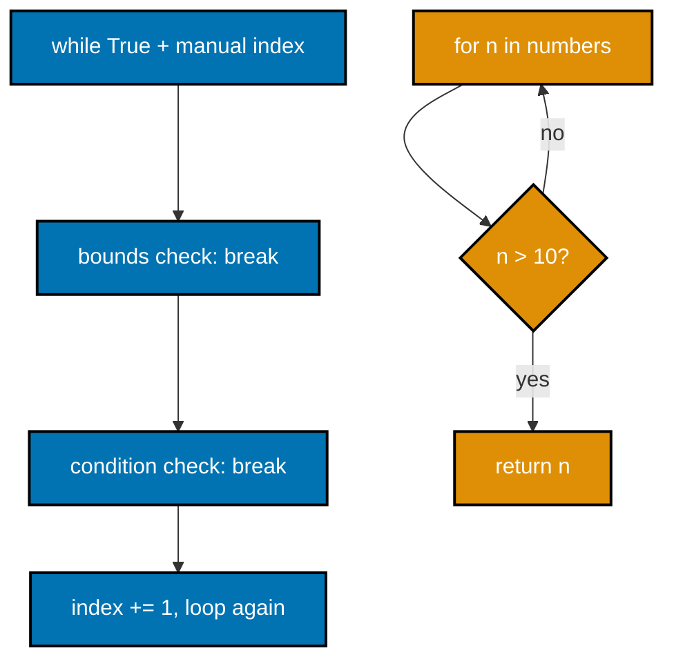
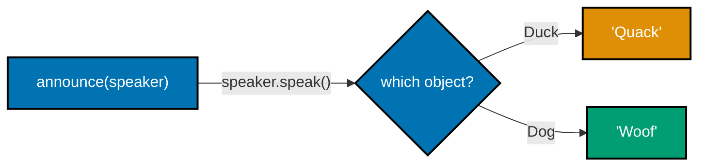
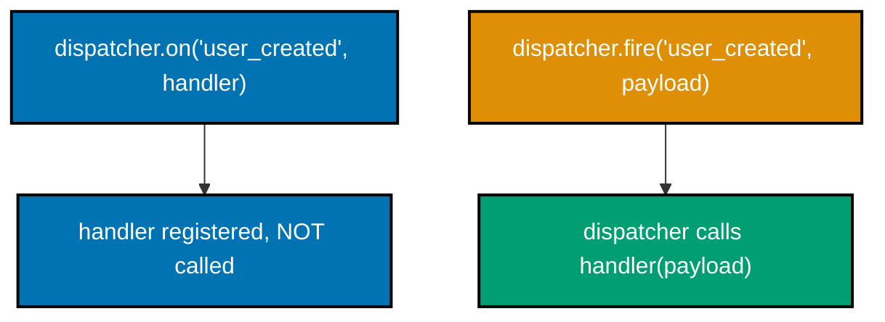
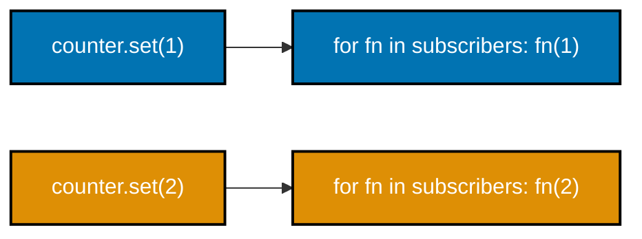
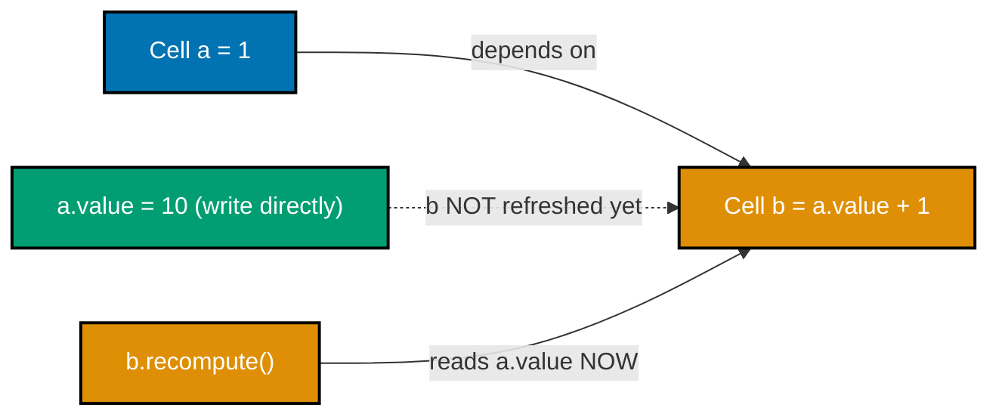
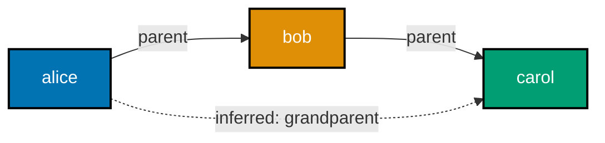
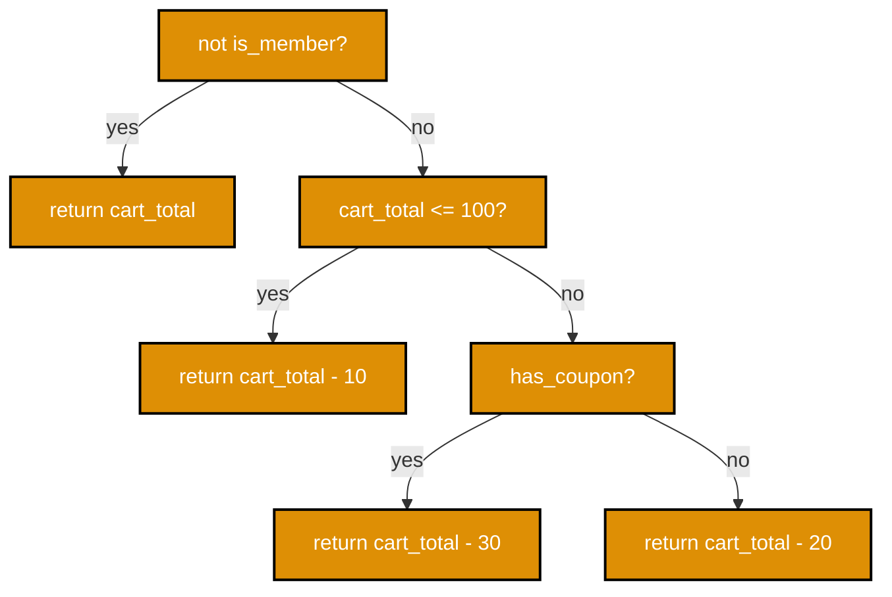
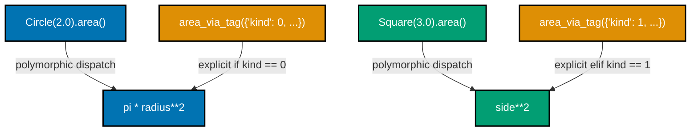

Examples 1-28 cover the imperative/procedural/structured foundation (co-01 to co-04), the OO and
declarative/functional contrast (co-05 to co-12), and a first taste of logic programming, event-driven
callbacks, reactive values, dataflow cells, and multi-paradigm mixing (co-13, co-16 to co-20). Every
example is self-contained under `learning/code/ex-NN-slug/` -- run it yourself with
`python3 example.py` and `pytest -q`.

### Example 1: Imperative Word Count

_ex-01 &middot; exercises co-01, co-04_

The most direct way to count words: a mutable `dict`, an explicit `for` loop, and in-place mutation on
every iteration. Nothing here is a value being computed and handed back -- every step changes the box in
place.

**`example.py`**

```python
"""Example 1: Imperative Word Count."""

text: str = "the cat sat on the mat the cat ran"  # => sample sentence, "the" and "cat" repeat
counts: dict[str, int] = {}  # => mutable box we will update step by step -- the imperative core
for word in text.split():  # => explicit loop: step through every word one at a time
    if word in counts:  # => explicit selection: has this word been seen before?
        counts[word] = counts[word] + 1  # => explicit statement: mutate the box in place
    else:  # => selection's other branch
        counts[word] = 1  # => explicit statement: first sighting, start the box at 1
    # => nothing here is a value being computed and returned -- every step mutates `counts`

print(counts["the"])  # => reads the mutated box after the loop finished
# => Output: 3
print(counts["cat"])  # => reads a second entry from the same mutated box
# => Output: 2
print(len(counts))  # => five distinct words were tallied: the, cat, sat, on, mat, ran = 6
# => Output: 6
```

**Run**

```shell
python3 example.py
```

**Output**

```text
3
2
6
```

**`test_example.py`**

```python
"""Example 1: pytest verification for Imperative Word Count."""

import runpy
from pathlib import Path
from typing import cast


def _run_example() -> dict[str, object]:
    # => runs example.py as __main__ and returns its module namespace for inspection
    path = Path(__file__).parent / "example.py"  # => locate the sibling script
    return runpy.run_path(str(path), run_name="__main__")  # => executes it, returns globals


def test_known_word_counts_match() -> None:
    ns = _run_example()  # => execute the imperative script once
    counts = cast("dict[str, int]", ns["counts"])  # => narrow the untyped namespace lookup
    assert counts["the"] == 3  # => "the" appears three times in the sample sentence
    assert counts["cat"] == 2  # => "cat" appears twice
    assert counts["sat"] == 1  # => every other word appears exactly once
    assert len(counts) == 6  # => six distinct words total


# => Run: pytest -- Output: 1 passed
```

**Verify**

```shell
pytest -q
```

**Output**

```text
1 passed
```

**Key takeaway**: imperative code is a sequence of explicit statements mutating a box in place -- correct,
but the "how" (loop mechanics, mutation order) and the "what" (the final counts) are fused together in
one block.

**Why it matters**: this is the baseline every other example in this topic contrasts against -- co-02
through co-25 are all, in one way or another, a different answer to "must the how and the what live in
the same block of code?" Compared to Example 6's OO version or Example 11's functional fold, the imperative form is the fastest to write for a one-off script but the hardest to test in isolation, since its loop mechanics and its counting logic are fused into one un-splittable block.

---

### Example 2: Procedural Decompose

_ex-02 &middot; exercises co-02_

The same word count, refactored into two named procedures -- `tokenize()` and `tally()` -- so `main()`
shrinks to a readable two-step sequence.

**`example.py`**

```python
"""Example 2: Procedural Decompose."""

import inspect


def tokenize(text: str) -> list[str]:  # => named procedure #1: text -> list of words
    return text.split()  # => the ONLY thing this procedure does -- splitting


def tally(words: list[str]) -> dict[str, int]:  # => named procedure #2: words -> counts
    counts: dict[str, int] = {}  # => local mutable box, scoped to this procedure only
    for word in words:  # => explicit loop, same mechanics as example 1
        counts[word] = counts.get(word, 0) + 1  # => bump the count, default to 0 first time
    return counts  # => hand the finished box back to the caller


def main(text: str) -> dict[str, int]:  # => the orchestrator -- now tiny and readable
    words = tokenize(text)  # => step 1: delegate to tokenize
    return tally(words)  # => step 2: delegate to tally, nothing else happens here


result: dict[str, int] = main("the cat sat on the mat the cat ran")  # => same input as example 1
print(result["the"])  # => identical counts to the inline loop version
# => Output: 3
print(result["cat"])  # => same second count
# => Output: 2

main_body_lines: int = len(inspect.getsource(main).strip().splitlines())  # => count main()'s own lines
print(main_body_lines)  # => main() is 3 lines: def + two delegating calls, no loop logic inline
# => Output: 3
```

**Run**

```shell
python3 example.py
```

**Output**

```text
3
2
3
```

**`test_example.py`**

```python
"""Example 2: pytest verification for Procedural Decompose."""

from example import main, tally, tokenize


def test_output_identical_to_example_one() -> None:
    result: dict[str, int] = main("the cat sat on the mat the cat ran")  # => same sentence as ex-01
    assert result == {"the": 3, "cat": 2, "sat": 1, "on": 1, "mat": 1, "ran": 1}
    # => byte-identical result dict to the inline imperative version


def test_procedures_are_independently_callable() -> None:
    # => procedural abstraction means each named piece works stand-alone, not just glued in main()
    words = tokenize("a a b")  # => call tokenize() in isolation
    assert words == ["a", "a", "b"]  # => tokenize does exactly one job
    assert tally(words) == {"a": 2, "b": 1}  # => tally does exactly one job, given any word list


# => Run: pytest -- Output: 2 passed
```

**Verify**

```shell
pytest -q
```

**Output**

```text
2 passed
```

**Key takeaway**: naming a chunk of imperative logic turns it into an independent, individually
testable unit -- `tokenize()` and `tally()` can each be called and verified on their own.

**Why it matters**: procedural abstraction is the smallest possible step away from pure imperative
code, and it is the seed every later paradigm in this topic builds on -- OO adds state ownership to a
procedure (co-05), functional adds a no-mutation discipline to it (co-09). Measured directly: `tokenize()` and `tally()` can each be unit-tested with a one-line call, while Example 1's inline loop can only be tested by running the entire block and inspecting its side effect on `counts`.

---

### Example 3: Structured Three Constructs

_ex-03 &middot; exercises co-03_

Compares a "goto flag" hack -- a boolean variable standing in for a jump target -- against plain
sequence, selection, and iteration.

**`example.py`**

```python
"""Example 3: Structured Three Constructs."""


def classify_flagged(n: int) -> str:  # => the BEFORE version: a boolean "goto flag" hack
    result = ""  # => mutable accumulator that later code branches decide whether to touch
    done = False  # => the "goto flag" -- a boolean standing in for a jump target
    if n < 0 and not done:  # => every later check must also test `not done` to fake a jump
        result = "negative"  # => sets the outcome
        done = True  # => "jump past the rest" by flipping the flag
    if n == 0 and not done:  # => repeats the same flag-guard boilerplate
        result = "zero"  # => sets the outcome
        done = True  # => flips the flag again
    if n > 0 and not done:  # => and again -- the flag is checked at every single branch
        result = "positive"  # => sets the outcome
        done = True  # => flips the flag one more time, though nothing reads it after this
    return result  # => the flag pattern adds bookkeeping with no structural payoff


def classify_structured(n: int) -> str:  # => the AFTER version: sequence + selection only
    if n < 0:  # => plain selection -- one of structured programming's three constructs, no flag needed
        return "negative"  # => sequence: return is the only "next step" needed
    elif n == 0:  # => selection's next branch, mutually exclusive with the first
        return "zero"  # => sequence
    else:  # => selection's final branch
        return "positive"  # => sequence
    # => no boolean flag anywhere -- each branch's `return` IS the control transfer


for n in (-3, 0, 5):  # => iteration: the third of the three structured constructs
    before = classify_flagged(n)  # => run the flag-based version
    after = classify_structured(n)  # => run the structured version
    print(before == after, after)  # => confirms both versions agree, for every case
# => Output: True negative
# => Output: True zero
# => Output: True positive
```

**Run**

```shell
python3 example.py
```

**Output**

```text
True negative
True zero
True positive
```

**`test_example.py`**

```python
"""Example 3: pytest verification for Structured Three Constructs."""

from example import classify_flagged, classify_structured


def test_structured_version_matches_flagged_version_for_all_cases() -> None:
    for n in (-10, -1, 0, 1, 10):  # => iteration over a spread of representative inputs
        assert classify_structured(n) == classify_flagged(n)  # => both must agree, always


def test_structured_version_uses_no_boolean_flag() -> None:
    import inspect  # => local import: only this test needs source inspection

    source = inspect.getsource(classify_structured)  # => read classify_structured's own source text
    assert "done" not in source  # => the AFTER version never declares a "goto flag" variable


# => Run: pytest -- Output: 2 passed
```

**Verify**

```shell
pytest -q
```

**Output**

```text
2 passed
```

**Key takeaway**: `if`/`elif`/`else` alone replaces an entire "goto flag" pattern -- structured
programming's three constructs need no extra bookkeeping variable to fake a jump.

**Why it matters**: a `goto`-style jump can transfer control from anywhere to anywhere, forcing a
reader to hunt for where control might have jumped in from; structured code's single entry/single exit
blocks are understandable by reading only their own lines. The flag-based version needs a `not done` guard repeated at every branch just to fake the jump structured programming replaces with plain `if`/`elif`/`else` -- three redundant checks for three branches, a cost that only grows as more branches are added.

---

### Example 4: Mutable Variable Box

_ex-04 &middot; exercises co-04_

Contrasts rebinding a name (`x = 20`) against mutating a shared object through an alias
(`alias.append(4)`, visible through `original` too).

**`example.py`**

```python
"""Example 4: Mutable Variable Box."""

x: int = 10  # => x names a box holding 10
print(x)  # => reads the box
# => Output: 10
x = 20  # => reassignment REBINDS the name x to a new value -- the imperative core (co-04)
print(x)  # => the SAME name now reads a different value -- rebinding, not mutation of "10"
# => Output: 20

original: list[int] = [1, 2, 3]  # => a genuinely mutable object: a list
alias: list[int] = original  # => alias is NOT a copy -- both names point at the same box
alias.append(4)  # => this mutates the shared list object in place
print(original)  # => original "sees" the change too, because they share one underlying box
# => Output: [1, 2, 3, 4]
print(original is alias)  # => confirms both names are bound to the identical object
# => Output: True
```

**Run**

```shell
python3 example.py
```

**Output**

```text
10
20
[1, 2, 3, 4]
True
```

**`test_example.py`**

```python
"""Example 4: pytest verification for Mutable Variable Box."""

import example


def test_aliased_list_mutation_is_visible_through_the_original_name() -> None:
    original: list[int] = [1, 2, 3]  # => fresh list, isolated from the module-level demo
    alias: list[int] = original  # => alias shares the same underlying object
    alias.append(99)  # => mutate through the alias
    assert original == [1, 2, 3, 99]  # => the mutation is visible through the original name too
    assert original is alias  # => same object identity, not two equal-but-separate lists


def test_module_level_demo_matches_documented_output() -> None:
    assert example.original == [1, 2, 3, 4]  # => the module-level list after its own append
    assert example.alias is example.original  # => same shared-box guarantee at module scope


# => Run: pytest -- Output: 2 passed
```

**Verify**

```shell
pytest -q
```

**Output**

```text
2 passed
```

**Key takeaway**: reassignment rebinds a name to a new value; mutation changes an object every alias of
it can see -- these are two different operations that both count as "mutable state."

**Why it matters**: aliasing is the mechanism behind an entire class of bugs -- code that mutates an
object through one name can silently affect code that only knows a different name for the same object. Immutable types such as `tuple` (Example 21) sidestep this entire bug class by construction, since there is no mutation method to call through any alias in the first place.

---

### Example 5: Goto-Free Loop

_ex-05 &middot; exercises co-03_

Replaces a `while True` loop with a manual index and two `break` statements with a plain `for` and an
early `return`.



**`example.py`**

```python
"""Example 5: Goto-Free Loop."""


def first_over_ten_hacky(numbers: list[int]) -> int | None:  # => BEFORE: while True + break hack
    i = 0  # => manual index bookkeeping, easy to get wrong
    result: int | None = None  # => mutable box for "have we found it yet"
    while True:  # => an unbounded loop standing in for a goto-style jump target
        if i >= len(numbers):  # => manual bounds check that a for-loop would give for free
            break  # => "jump out" -- the goto-flavored escape hatch
        if numbers[i] > 10:  # => the actual condition we care about
            result = numbers[i]  # => record it
            break  # => a second "jump out" path -- two different reasons to exit the same loop
        i += 1  # => manual index increment, another goto-adjacent footgun
    return result  # => two break statements later, here is the answer


def first_over_ten_clean(numbers: list[int]) -> int | None:  # => AFTER: a plain for + early return
    for n in numbers:  # => a `for` owns its own iteration and bounds -- no manual index
        if n > 10:  # => same condition
            return n  # => a single, obvious exit: return IS the "found it" signal
    return None  # => the natural "ran out without finding it" ending, no flag needed


sample: list[int] = [3, 7, 2, 15, 9, 20]  # => 15 is the first value over 10
print(first_over_ten_hacky(sample))  # => the while-True version's answer
# => Output: 15
print(first_over_ten_clean(sample))  # => the for-loop version's answer -- must match
# => Output: 15
```

**Run**

```shell
python3 example.py
```

**Output**

```text
15
15
```

**`test_example.py`**

```python
"""Example 5: pytest verification for Goto-Free Loop."""

from example import first_over_ten_clean, first_over_ten_hacky


def test_both_versions_agree_on_a_hit() -> None:
    sample = [3, 7, 2, 15, 9, 20]  # => contains a value over 10
    assert first_over_ten_hacky(sample) == first_over_ten_clean(sample) == 15


def test_both_versions_agree_on_a_miss() -> None:
    sample = [1, 2, 3]  # => no value over 10 anywhere
    assert first_over_ten_hacky(sample) is None  # => hacky version returns None on a miss
    assert first_over_ten_clean(sample) is None  # => clean version must also return None


# => Run: pytest -- Output: 2 passed
```

**Verify**

```shell
pytest -q
```

**Output**

```text
2 passed
```

**Key takeaway**: `for` owns its own bounds and iteration; a `while True` with a manual index and
multiple `break` points reproduces the same result with more bookkeeping and more ways to get it wrong.

**Why it matters**: a loop with two different `break` reasons has two different exits to reason about;
a `for` with an early `return` has exactly one obvious exit per condition, which is what "structured"
means in practice. The hacky version also needs a manual index and an explicit bounds check that Python's `for` already provides for free, so the clean version is both shorter and has fewer places to introduce an off-by-one bug.

---

### Example 6: OO Word Count

_ex-06 &middot; exercises co-05, co-06_

The same word count as Example 1, now bundled as a `WordCounter` class -- state and behavior travel
together, and two instances never share state by accident.

**`example.py`**

```python
"""Example 6: OO Word Count."""


class WordCounter:  # => bundles state (the tally) with the behavior that acts on it (co-05)
    def __init__(self) -> None:  # => constructor: every instance starts with its own private tally
        self._tally: dict[str, int] = {}  # => state lives INSIDE the object, not floating in main()

    def add(self, word: str) -> None:  # => behavior #1: mutate this object's own state
        self._tally[word] = self._tally.get(word, 0) + 1  # => bump the count for this instance only

    def result(self) -> dict[str, int]:  # => behavior #2: read this object's own state
        return dict(self._tally)  # => a defensive copy -- callers can't mutate our internal box


counter = WordCounter()  # => construct one instance with its own private tally
for word in "the cat sat on the mat the cat ran".split():  # => same sentence as example 1
    counter.add(word)  # => state and behavior are bundled together -- no separate loop+dict pair

print(counter.result()["the"])  # => read the count back out via the method, not a bare dict access
# => Output: 3
print(counter.result()["cat"])  # => same second count as the imperative version
# => Output: 2

other = WordCounter()  # => a second, independent instance
other.add("solo")  # => mutating `other` never touches `counter`'s state
print(counter.result()["the"], other.result())  # => the two instances stay fully isolated
# => Output: 3 {'solo': 1}
```

**Run**

```shell
python3 example.py
```

**Output**

```text
3
2
3 {'solo': 1}
```

**`test_example.py`**

```python
"""Example 6: pytest verification for OO Word Count."""

from example import WordCounter


def test_count_via_method_matches_imperative_version() -> None:
    counter = WordCounter()  # => fresh instance, isolated from the module-level demo
    for word in "the cat sat on the mat the cat ran".split():
        counter.add(word)  # => behavior bundled with state -- no external dict
    assert counter.result() == {"the": 3, "cat": 2, "sat": 1, "on": 1, "mat": 1, "ran": 1}


def test_two_instances_have_independent_state() -> None:
    a = WordCounter()  # => instance A
    b = WordCounter()  # => instance B, a separate object entirely
    a.add("x")  # => mutate only A
    assert a.result() == {"x": 1}  # => A reflects the mutation
    assert b.result() == {}  # => B is untouched -- proves state is per-instance, not shared


# => Run: pytest -- Output: 2 passed
```

**Verify**

```shell
pytest -q
```

**Output**

```text
2 passed
```

**Key takeaway**: bundling the tally as `self._tally` instead of a bare local dict gives every instance
its own isolated copy, with `add()`/`result()` as the only sanctioned way to touch it.

**Why it matters**: OO's isolation guarantee is what makes co-06 encapsulation possible in the first
place -- an invariant can only be broken through the methods that touch the state, never by accident
from unrelated code. Compare this to Example 1's bare module-level `counts` dict: two callers sharing that dict could corrupt each other's tally, while `counter` and `other` above stay provably independent because each `WordCounter` instance owns its own private `_tally`.

---

### Example 7: Encapsulation Private State

_ex-07 &middot; exercises co-06_

A `BankBalance` class that never lets its `_balance` field be touched directly -- every read or write
goes through a method that can enforce the never-negative invariant.

**`example.py`**

```python
"""Example 7: Encapsulation Private State."""


class BankBalance:  # => the invariant we protect: balance never goes negative
    def __init__(self, opening: int) -> None:  # => constructor establishes the invariant up front
        if opening < 0:  # => guard: reject an invalid starting state immediately
            raise ValueError("opening balance cannot be negative")  # => refuse to construct
        self._balance: int = opening  # => hidden behind a single underscore -- "internal, don't touch"

    def deposit(self, amount: int) -> None:  # => the ONLY sanctioned way to increase the balance
        if amount < 0:  # => guard against a "negative deposit" that would secretly withdraw
            raise ValueError("deposit amount cannot be negative")
        self._balance += amount  # => the sole line that increases _balance

    def withdraw(self, amount: int) -> None:  # => the ONLY sanctioned way to decrease the balance
        if amount > self._balance:  # => guard: this is what keeps the invariant intact
            raise ValueError("insufficient funds")  # => refuse rather than let balance go negative
        self._balance -= amount  # => the sole line that decreases _balance

    def read(self) -> int:  # => the ONLY sanctioned way to observe the balance from outside
        return self._balance  # => callers never touch _balance directly


account = BankBalance(100)  # => open with 100
account.deposit(50)  # => goes through the guarded method
account.withdraw(30)  # => goes through the guarded method
print(account.read())  # => 100 + 50 - 30 = 120
# => Output: 120

try:  # => attempt to violate the invariant via the sanctioned API
    account.withdraw(9999)  # => far more than the current balance
except ValueError as exc:  # => the guard inside withdraw() catches it before _balance is touched
    print(f"blocked: {exc}")  # => the invariant held -- balance is untouched by the rejected call
# => Output: blocked: insufficient funds
print(account.read())  # => confirms the rejected withdrawal never touched _balance
# => Output: 120
```

**Run**

```shell
python3 example.py
```

**Output**

```text
120
blocked: insufficient funds
120
```

**`test_example.py`**

```python
"""Example 7: pytest verification for Encapsulation Private State."""

import pytest

from example import BankBalance


def test_deposit_and_withdraw_change_balance_through_the_api() -> None:
    account = BankBalance(100)  # => fresh account, isolated from the module-level demo
    account.deposit(50)  # => via the sanctioned method
    account.withdraw(30)  # => via the sanctioned method
    assert account.read() == 120  # => 100 + 50 - 30


def test_invariant_holds_after_a_rejected_withdrawal() -> None:
    account = BankBalance(100)  # => fresh account
    with pytest.raises(ValueError):  # => the guard must refuse an over-large withdrawal
        account.withdraw(9999)
    assert account.read() == 100  # => the invariant held -- balance is unchanged by the rejection


# => Run: pytest -- Output: 2 passed
```

**Verify**

```shell
pytest -q
```

**Output**

```text
2 passed
```

**Key takeaway**: `deposit()`/`withdraw()`/`read()` are the only doors into `_balance` -- a rejected
withdrawal proves the invariant survives even a bad call, because the guard runs before any mutation.

**Why it matters**: when every mutation is forced through a small set of methods, those methods become
the only place an invariant can break -- and the only place it needs testing. A bare `dict` with a `balance` key would let any caller write a negative number directly; funneling every change through `deposit()`/`withdraw()` means the never-negative invariant only has two call sites to audit, not every line that ever touches the account.

---

### Example 8: Method Call As Message

_ex-08 &middot; exercises co-07_

Two unrelated classes -- `Duck` and `Dog`, no shared base class -- both "understand" the same `speak()`
message via structural typing (a `Protocol`), and each responds in its own way.



**`example.py`**

```python
"""Example 8: Method Call As Message."""

from typing import Protocol


class Speaker(Protocol):  # => the "message" every speaker must understand: speak()
    def speak(self) -> str: ...  # => the shape of the message, not its implementation


class Duck:  # => one concrete responder to the speak() message
    def speak(self) -> str:  # => Duck's own understanding of "speak"
        return "Quack"  # => Duck-specific reply


class Dog:  # => a second, unrelated (no shared base class) responder
    def speak(self) -> str:  # => Dog's own understanding of "speak"
        return "Woof"  # => Dog-specific reply


def announce(speaker: Speaker) -> str:  # => the caller only knows "send speak() to whatever this is"
    return speaker.speak()  # => this line is the MESSAGE SEND -- it does not know which class replies


animals: list[Speaker] = [Duck(), Dog()]  # => a mixed list -- no shared inheritance needed (structural)
for animal in animals:  # => iterate and send the same message to each
    print(announce(animal))  # => each object DISPATCHES the message to its own implementation
# => Output: Quack
# => Output: Woof
```

**Run**

```shell
python3 example.py
```

**Output**

```text
Quack
Woof
```

**`test_example.py`**

```python
"""Example 8: pytest verification for Method Call As Message."""

from example import Dog, Duck, announce


def test_each_receiver_dispatches_its_own_reply() -> None:
    assert announce(Duck()) == "Quack"  # => Duck answers the message its own way
    assert announce(Dog()) == "Woof"  # => Dog answers the SAME message its own, different way


def test_dispatch_depends_only_on_the_runtime_receiver() -> None:
    speakers = [Duck(), Dog(), Duck()]  # => order matters: proves dispatch is per-object, not fixed
    replies = [announce(s) for s in speakers]  # => the same announce() call site, three receivers
    assert replies == ["Quack", "Woof", "Quack"]  # => each call picked its OWN receiver's reply


# => Run: pytest -- Output: 2 passed
```

**Verify**

```shell
pytest -q
```

**Output**

```text
2 passed
```

**Key takeaway**: `announce()` never checks `isinstance` -- it only calls `speak()` and lets the
receiving object decide how to answer.

**Why it matters**: this is what makes polymorphic dispatch work: the same call site produces different
behavior purely based on which object receives the message at runtime, with zero coupling to concrete
classes. Compare this to Example 27's tag-based dispatch, which needs an explicit `if`/`elif` chain naming every class; here `announce()` never mentions `Duck` or `Dog` at all, so adding a third animal needs zero changes to `announce()` itself.

---

### Example 9: Declarative Comprehension

_ex-09 &middot; exercises co-08_

Contrasts an explicit loop-and-append (`evens_squared_imperative`) against a list comprehension
(`evens_squared_declarative`) computing the identical list.

**`example.py`**

```python
"""Example 9: Declarative Comprehension."""

numbers: list[int] = [1, 2, 3, 4, 5, 6, 7, 8, 9, 10]  # => shared input for both versions


def evens_squared_imperative(nums: list[int]) -> list[int]:  # => HOW: explicit loop + append
    result: list[int] = []  # => mutable accumulator we must remember to build up
    for n in nums:  # => step through every number
        if n % 2 == 0:  # => explicit filter check
            result.append(n * n)  # => explicit transform-and-store step
    return result  # => hand back the accumulator


def evens_squared_declarative(nums: list[int]) -> list[int]:  # => WHAT: state the shape of the result
    return [n * n for n in nums if n % 2 == 0]  # => "the squares of the evens" -- no loop mechanics
    # => filter (if n % 2 == 0) and transform (n * n) read left to right, like the English description


imperative_result = evens_squared_imperative(numbers)  # => run the HOW version
declarative_result = evens_squared_declarative(numbers)  # => run the WHAT version
print(imperative_result)  # => both versions must agree on the values
# => Output: [4, 16, 36, 64, 100]
print(imperative_result == declarative_result)  # => confirms identical lists, same order
# => Output: True
```

**Run**

```shell
python3 example.py
```

**Output**

```text
[4, 16, 36, 64, 100]
True
```

**`test_example.py`**

```python
"""Example 9: pytest verification for Declarative Comprehension."""

from example import evens_squared_declarative, evens_squared_imperative


def test_both_forms_produce_the_identical_list() -> None:
    nums = [1, 2, 3, 4, 5, 6, 7, 8, 9, 10]  # => same input the module-level demo uses
    assert evens_squared_imperative(nums) == evens_squared_declarative(nums) == [4, 16, 36, 64, 100]


def test_both_forms_handle_an_all_odd_input_identically() -> None:
    nums = [1, 3, 5]  # => no evens at all -- edge case
    assert evens_squared_imperative(nums) == evens_squared_declarative(nums) == []


# => Run: pytest -- Output: 2 passed
```

**Verify**

```shell
pytest -q
```

**Output**

```text
2 passed
```

**Key takeaway**: the comprehension states the shape of the result -- "squares of the evens" -- while
the loop spells out the mechanics of building it one append at a time; both compute the same list.

**Why it matters**: declarative code hands the "how" to the language, so a reader only has to verify
the "what" -- there is no accumulator variable to trace. The imperative version needs three separate steps -- initialize `result`, loop, and append -- each a place a bug could hide, while the comprehension is one expression whose correctness depends only on the filter and transform, not on execution order.

---

### Example 10: Imperative vs Declarative Sum

_ex-10 &middot; exercises co-08, co-10_

The same declarative/imperative contrast as Example 9, one level up: summing squares of evens with a
`total` accumulator versus one `sum(...)` expression with no named box at all.

**`example.py`**

```python
"""Example 10: Imperative vs Declarative Sum."""


def sum_of_squares_of_evens_imperative(nums: list[int]) -> int:  # => HOW: explicit accumulator loop
    total = 0  # => mutable running total, starts at zero
    for n in nums:  # => explicit iteration
        if n % 2 == 0:  # => explicit filter check
            total += n * n  # => explicit mutate-in-place accumulation
    return total  # => the final value of the mutated box


def sum_of_squares_of_evens_declarative(nums: list[int]) -> int:  # => WHAT: one expression, no box
    return sum(n * n for n in nums if n % 2 == 0)  # => "the sum of squares of the evens", read as English
    # => sum() consumes a generator expression -- no named accumulator variable exists anywhere


data: list[int] = list(range(1, 11))  # => 1 through 10, same input shape as example 9
how_result = sum_of_squares_of_evens_imperative(data)  # => 2^2+4^2+6^2+8^2+10^2 = 4+16+36+64+100=220
what_result = sum_of_squares_of_evens_declarative(data)  # => must compute the identical integer
print(how_result)  # => the imperative total
# => Output: 220
print(how_result == what_result)  # => confirms both styles agree on the final integer
# => Output: True
```

**Run**

```shell
python3 example.py
```

**Output**

```text
220
True
```

**`test_example.py`**

```python
"""Example 10: pytest verification for Imperative vs Declarative Sum."""

from example import sum_of_squares_of_evens_declarative, sum_of_squares_of_evens_imperative


def test_both_forms_agree_on_one_through_ten() -> None:
    data = list(range(1, 11))  # => same input as the module-level demo
    imp = sum_of_squares_of_evens_imperative(data)  # => HOW version
    dec = sum_of_squares_of_evens_declarative(data)  # => WHAT version
    assert imp == dec == 220  # => 4 + 16 + 36 + 64 + 100


def test_both_forms_agree_on_an_empty_list() -> None:
    assert sum_of_squares_of_evens_imperative([]) == 0  # => empty input, empty-safe accumulator
    assert sum_of_squares_of_evens_declarative([]) == 0  # => sum() of an empty generator is 0


# => Run: pytest -- Output: 2 passed
```

**Verify**

```shell
pytest -q
```

**Output**

```text
2 passed
```

**Key takeaway**: `sum(n * n for n in nums if n % 2 == 0)` is one expression with no named accumulator;
the imperative twin needs a `total` variable and an explicit `+=` to reach the identical number.

**Why it matters**: expressions compose -- they can be embedded, passed, or returned directly -- while a
statement can only be executed for its effect on a named box. `sum(n * n for n in nums if n % 2 == 0)` can be passed directly as an argument to another function or embedded inside a larger expression, whereas the imperative version's `total` variable only exists as a side effect of running its loop to completion.

---

### Example 11: Functional Word Count

_ex-11 &middot; exercises co-09, co-11_

The same word count once more, this time via `collections.Counter` and `functools.reduce`, neither of
which visibly mutates the input list.

**`example.py`**

```python
"""Example 11: Functional Word Count."""

from collections import Counter  # => a value-producing tool, not a mutation-in-place API
from functools import reduce  # => the classic fold: combine a sequence into one value


def tally_via_counter(words: list[str]) -> Counter[str]:  # => builds a NEW value, doesn't mutate `words`
    return Counter(words)  # => one expression -- Counter never modifies its input list


def tally_via_reduce(words: list[str]) -> dict[str, int]:  # => a fold: no loop body visibly mutates state
    def bump(acc: dict[str, int], word: str) -> dict[str, int]:  # => the fold's combining step
        return {**acc, word: acc.get(word, 0) + 1}  # => returns a BRAND NEW dict every call, no mutation
        # => {**acc, ...} copies acc rather than doing acc[word] += 1 in place

    return reduce(bump, words, {})  # => reduce threads a fresh dict through every step, none shared


words: list[str] = str("the cat sat on the mat the cat ran").split()  # => str(...) widens away the literal so split() returns list[str]
before = tuple(words)  # => snapshot of the input, to prove neither function mutates it
counter_result = tally_via_counter(words)  # => value-producing call
reduce_result = tally_via_reduce(words)  # => value-producing call

print(counter_result["the"], reduce_result["the"])  # => both agree with the imperative version's count
# => Output: 3 3
print(words == list(before))  # => the input list is unchanged -- neither function had a visible mutation
# => Output: True
```

**Run**

```shell
python3 example.py
```

**Output**

```text
3 3
True
```

**`test_example.py`**

```python
"""Example 11: pytest verification for Functional Word Count."""

from example import tally_via_counter, tally_via_reduce


def test_both_functional_versions_match_the_imperative_counts() -> None:
    words: list[str] = str("the cat sat on the mat the cat ran").split()  # => identical sentence to ex-01
    expected = {"the": 3, "cat": 2, "sat": 1, "on": 1, "mat": 1, "ran": 1}
    assert dict(tally_via_counter(words)) == expected  # => Counter-based fold matches
    assert tally_via_reduce(words) == expected  # => reduce-based fold matches too


def test_neither_function_mutates_its_input_list() -> None:
    words = ["x", "y", "x"]  # => a small input we snapshot before calling
    before = list(words)  # => defensive copy for comparison
    tally_via_counter(words)  # => call #1, discard result -- only checking for side effects
    tally_via_reduce(words)  # => call #2, discard result -- only checking for side effects
    assert words == before  # => the caller's list is byte-identical to what it was before either call


# => Run: pytest -- Output: 2 passed
```

**Verify**

```shell
pytest -q
```

**Output**

```text
2 passed
```

**Key takeaway**: `Counter(words)` and `reduce(bump, words, {})` both compute the tally as a returned
value -- neither one ever mutates `words`, and `bump` builds a brand-new dict on every step instead of
mutating an accumulator in place.

**Why it matters**: a function that only reads its arguments and returns a new value is trivially safe
to call twice, safe to call from multiple threads, and easy to test in isolation. Contrast this with an imperative tally that mutates a dict in place: calling it twice on the same input would double-count every word, while `tally_via_counter()` and `tally_via_reduce()` can be called any number of times against the same `words` list with no risk of corrupting it.

---

### Example 12: Expression vs Statement

_ex-12 &middot; exercises co-10_

Contrasts a three-step `if`/assign/`return` block against one conditional expression producing the
identical string.

**`example.py`**

```python
"""Example 12: Expression vs Statement."""


def classify_via_statement(n: int) -> str:  # => the STATEMENT form: if/assign, several steps
    if n >= 0:  # => statement #1: a branch that does not itself produce a value
        label = "non-negative"  # => statement #2: assignment, a separate step from the branch
    else:  # => statement #1's else-arm
        label = "negative"  # => statement #2's else-arm
    return label  # => statement #3: a THIRD step to hand the accumulated value back


def classify_via_expression(n: int) -> str:  # => the EXPRESSION form: one value-producing expression
    return "non-negative" if n >= 0 else "negative"  # => the conditional IS the value, no named box


for n in (5, -5, 0):  # => try a spread of representative inputs
    stmt = classify_via_statement(n)  # => run the statement-based version
    expr = classify_via_expression(n)  # => run the expression-based version
    print(stmt == expr, expr)  # => both must compute the identical string for every input
# => Output: True non-negative
# => Output: True negative
# => Output: True non-negative
```

**Run**

```shell
python3 example.py
```

**Output**

```text
True non-negative
True negative
True non-negative
```

**`test_example.py`**

```python
"""Example 12: pytest verification for Expression vs Statement."""

from example import classify_via_expression, classify_via_statement


def test_both_forms_agree_across_a_range_of_inputs() -> None:
    for n in range(-5, 6):  # => sweep every integer from -5 through 5 inclusive
        assert classify_via_statement(n) == classify_via_expression(n)  # => must always match


def test_boundary_value_zero_is_non_negative_in_both_forms() -> None:
    assert classify_via_statement(0) == "non-negative"  # => zero is explicitly non-negative
    assert classify_via_expression(0) == "non-negative"  # => the expression form agrees


# => Run: pytest -- Output: 2 passed
```

**Verify**

```shell
pytest -q
```

**Output**

```text
2 passed
```

**Key takeaway**: `"non-negative" if n >= 0 else "negative"` is a single expression producing a value
directly, while the statement form needs a branch, an assignment, and a return to reach the same value.

**Why it matters**: an expression composes into larger expressions; a statement can only be executed for
its effect -- this is a large part of why declarative code reads as "one flowing computation." The statement form needs three lines and a temporary `label` variable just to produce a value the expression form returns directly on one line, a difference that compounds once dozens of similar classifications appear across a codebase.

---

### Example 13: Pure vs Impure Pair

_ex-13 &middot; exercises co-11_

`normalize()` reads only its argument and returns a value; its twin `normalize_and_log()` does the
identical computation but also appends to a module-level log -- a side effect invisible in its
signature.

**`example.py`**

```python
"""Example 13: Pure vs Impure Pair."""

log: list[str] = []  # => a module-level "side channel" the impure function writes to


def normalize(text: str) -> str:  # => PURE: output depends only on the input, no visible side effect
    return text.strip().lower()  # => reads only its argument, writes to nothing outside itself


def normalize_and_log(text: str) -> str:  # => IMPURE: same math, plus a side effect
    result = text.strip().lower()  # => identical computation to the pure version
    log.append(f"normalized {text!r} -> {result!r}")  # => SIDE EFFECT: mutates state outside this function
    return result  # => same return value as the pure version


sample = "  Hello WORLD  "  # => shared input for both functions
first_call = normalize(sample)  # => call #1 of the pure function
second_call = normalize(sample)  # => call #2, same argument
print(first_call == second_call)  # => referential transparency: same input, same output, every time
# => Output: True
print(log)  # => the pure function never touched `log` -- it is still empty
# => Output: []

normalize_and_log(sample)  # => call the impure twin once
print(len(log))  # => exactly one entry was appended by the ONE impure call
# => Output: 1
```

**Run**

```shell
python3 example.py
```

**Output**

```text
True
[]
1
```

**`test_example.py`**

```python
"""Example 13: pytest verification for Pure vs Impure Pair."""

import example
from example import normalize, normalize_and_log


def test_pure_function_is_referentially_transparent() -> None:
    before = list(example.log)  # => snapshot the side-channel before calling the pure function
    a = normalize("  Foo Bar  ")  # => call #1
    b = normalize("  Foo Bar  ")  # => call #2, identical argument
    assert a == b == "foo bar"  # => same input always yields the same output
    assert example.log == before  # => the pure function left the side channel completely untouched


def test_impure_twin_computes_the_same_value_but_also_logs() -> None:
    before_len = len(example.log)  # => how many log entries exist before this call
    result = normalize_and_log("  Foo Bar  ")  # => same computation as normalize(), plus a side effect
    assert result == "foo bar"  # => the return value matches the pure version
    assert len(example.log) == before_len + 1  # => exactly one new entry was appended


# => Run: pytest -- Output: 2 passed
```

**Verify**

```shell
pytest -q
```

**Output**

```text
2 passed
```

**Key takeaway**: `normalize()` and `normalize_and_log()` compute the identical string, but only the
impure twin leaves a trace outside its own return value.

**Why it matters**: a pure function is referentially transparent -- callable twice with the same
argument, always the same result, touching nothing else -- so it can be reasoned about, tested, and
reused without knowing its calling context. `normalize_and_log()`'s side effect is invisible in its signature -- a caller reading `def normalize_and_log(text: str) -> str` has no way to know it also mutates a module-level list, which is exactly the kind of hidden coupling purity rules out entirely.

---

### Example 14: Higher-Order Map

_ex-14 &middot; exercises co-12_

`apply_all()` takes a function as a plain parameter and calls it once per item -- swapping `double` for
`square` for a `lambda` changes the entire result without changing `apply_all()` itself.

**`example.py`**

```python
"""Example 14: Higher-Order Map."""

from collections.abc import Callable


def apply_all(fn: Callable[[int], int], items: list[int]) -> list[int]:  # => fn is an ORDINARY parameter
    return [fn(item) for item in items]  # => the function passed in gets called once per item
    # => apply_all doesn't know or care WHAT fn does -- it only knows fn's shape: int -> int


def double(n: int) -> int:  # => one possible function-as-value to pass in
    return n * 2  # => doubles its argument


def square(n: int) -> int:  # => a second, unrelated function-as-value
    return n * n  # => squares its argument


numbers: list[int] = [1, 2, 3, 4]  # => shared input list
print(apply_all(double, numbers))  # => passing `double` itself, not calling it, as an argument
# => Output: [2, 4, 6, 8]
print(apply_all(square, numbers))  # => same apply_all, DIFFERENT behavior -- just by swapping the function
# => Output: [1, 4, 9, 16]
print(apply_all(lambda n: n + 100, numbers))  # => a function value can be anonymous too
# => Output: [101, 102, 103, 104]
```

**Run**

```shell
python3 example.py
```

**Output**

```text
[2, 4, 6, 8]
[1, 4, 9, 16]
[101, 102, 103, 104]
```

**`test_example.py`**

```python
"""Example 14: pytest verification for Higher-Order Map."""

from example import apply_all, double, square


def test_apply_all_with_named_functions() -> None:
    numbers = [1, 2, 3, 4]  # => shared sample input
    assert apply_all(double, numbers) == [2, 4, 6, 8]  # => passing double as a value
    assert apply_all(square, numbers) == [1, 4, 9, 16]  # => passing square as a value, same helper


def test_apply_all_with_a_lambda_and_the_identity_function() -> None:
    numbers = [5, 10]  # => small sample input
    assert apply_all(lambda n: n, numbers) == [5, 10]  # => identity: transforms nothing
    assert apply_all(lambda n: -n, numbers) == [-5, -10]  # => a fresh anonymous transform


# => Run: pytest -- Output: 2 passed
```

**Verify**

```shell
pytest -q
```

**Output**

```text
2 passed
```

**Key takeaway**: `fn` in `apply_all(fn, items)` is an ordinary parameter -- passing `double`, `square`,
or a `lambda` changes the whole result without `apply_all`'s own code ever changing.

**Why it matters**: when functions are values, behavior itself becomes a parameter -- the seed that
grows into decorators, callbacks, and strategy objects across the rest of this topic. Without this capability, supporting a new transform like `square` would require either duplicating `apply_all()`'s loop or adding a conditional branch inside it; passing `double`, `square`, or an anonymous `lambda` needs no change to `apply_all()` at all.

---

### Example 15: SQL Declarative Query

_ex-15 &middot; exercises co-08, co-19_

An in-memory SQLite query states "top 3 words by frequency" declaratively via
`GROUP BY ... ORDER BY ... LIMIT` -- SQLite's own query engine decides how to compute it.


**`example.py`**

```python
"""Example 15: SQL Declarative Query."""

import sqlite3


words: list[str] = str("the cat sat on the mat the cat ran").split()  # => str(...) widens away the literal so split() returns list[str]

conn = sqlite3.connect(":memory:")  # => an in-process database -- no file, no server (stdlib only)
conn.execute("CREATE TABLE words (word TEXT)")  # => declare the shape of the data, not how to store it
conn.executemany("INSERT INTO words VALUES (?)", [(w,) for w in words])  # => load every word as a row

# => the query below STATES the desired result -- "top 3 words by frequency" -- SQLite figures out HOW
rows = conn.execute(
    "SELECT word, COUNT(*) AS n FROM words GROUP BY word ORDER BY n DESC, word LIMIT 3"
    # => GROUP BY: partition rows by word. ORDER BY n DESC: highest count first. LIMIT 3: only the top 3
).fetchall()  # => materialize the declared result as concrete rows

print(rows)  # => "the" (3), "cat" (2), then the first single-count word alphabetically
# => Output: [('the', 3), ('cat', 2), ('mat', 1)]

functional_counts = {"the": 3, "cat": 2, "sat": 1, "on": 1, "mat": 1, "ran": 1}  # => from example 11
top_word, top_count = rows[0]  # => unpack the declarative query's #1 row
print(functional_counts[top_word] == top_count)  # => the declarative and functional counts must agree
# => Output: True
conn.close()  # => release the in-memory connection
```

**Run**

```shell
python3 example.py
```

**Output**

```text
[('the', 3), ('cat', 2), ('mat', 1)]
True
```

**`test_example.py`**

```python
"""Example 15: pytest verification for SQL Declarative Query."""

import sqlite3


def top_n_words(words: list[str], n: int) -> list[tuple[str, int]]:  # => reusable helper for the test
    conn = sqlite3.connect(":memory:")  # => fresh in-memory database per call
    conn.execute("CREATE TABLE words (word TEXT)")  # => same schema as the module-level demo
    conn.executemany("INSERT INTO words VALUES (?)", [(w,) for w in words])  # => load all rows
    rows = conn.execute(
        "SELECT word, COUNT(*) AS c FROM words GROUP BY word ORDER BY c DESC, word LIMIT ?",
        (n,),  # => parameterized LIMIT -- avoids string-formatting SQL directly
    ).fetchall()
    conn.close()  # => always release the connection before returning
    return rows  # => list of (word, count) tuples


def test_top_three_matches_the_functional_word_count() -> None:
    words: list[str] = str("the cat sat on the mat the cat ran").split()  # => identical sentence to ex-01/ex-11
    rows = top_n_words(words, 3)  # => query the declarative top-3
    assert rows == [("the", 3), ("cat", 2), ("mat", 1)]  # => ties broken alphabetically


def test_rows_match_a_hand_counted_dict_for_every_word() -> None:
    words: list[str] = str("a b a c b a").split()  # => a: 3, b: 2, c: 1
    rows = top_n_words(words, 3)  # => request all three distinct words
    assert dict(rows) == {"a": 3, "b": 2, "c": 1}  # => every count must match a hand count


# => Run: pytest -- Output: 2 passed
```

**Verify**

```shell
pytest -q
```

**Output**

```text
2 passed
```

**Key takeaway**: the SQL query declares the desired result shape -- grouped, counted, ordered, limited
-- and never spells out a loop; SQLite's own engine decides how to execute it.

**Why it matters**: relational operations compose freely and are optimizable by a query planner exactly
because they are declared as set operations rather than as a specific loop order. Rewriting this as an equivalent Python loop would need a manual dict for grouping, a manual sort by count, and a manual slice for the limit -- three separate mechanical steps the single SQL statement above states as one declared shape.

---

### Example 16: Event-Driven Callback

_ex-16 &middot; exercises co-16_

A minimal `Dispatcher`: register a handler with `on()`, and nothing runs until `fire()` is called later
-- the framework decides when the handler runs, not the caller.



**`example.py`**

```python
"""Example 16: Event-Driven Callback."""

from collections.abc import Callable  # => Callable is the type hint for a plain function used as a callback
from dataclasses import dataclass, field  # => @dataclass auto-generates __init__ for Dispatcher below
# => field(default_factory=dict) gives every Dispatcher instance its own fresh dict, not a shared one


@dataclass
class Dispatcher:  # => a minimal event dispatcher: register handlers, then fire events later
    handlers: dict[str, list[Callable[[dict[str, str]], None]]] = field(default_factory=dict[str, list[Callable[[dict[str, str]], None]]])
    # => maps an event name to a list of callbacks that "answer the phone" when it fires

    def on(self, event: str, handler: Callable[[dict[str, str]], None]) -> None:  # => REGISTER a handler
        self.handlers.setdefault(event, []).append(handler)  # => attach one more listener for this event

    def fire(self, event: str, payload: dict[str, str]) -> None:  # => TRIGGER the event later
        for handler in self.handlers.get(event, []):  # => call every registered handler, in order
            handler(payload)  # => the handler runs with the payload it was given, not before this call


received: list[dict[str, str]] = []  # => where the handler below will record what it was called with


def on_user_created(payload: dict[str, str]) -> None:  # => a plain function used as a callback
    received.append(payload)  # => records the payload -- proves the handler actually ran


dispatcher = Dispatcher()  # => construct with an empty handler map
dispatcher.on("user_created", on_user_created)  # => register BEFORE anything fires -- no event yet
print(received)  # => registering alone runs nothing
# => Output: []

dispatcher.fire("user_created", {"name": "Alice"})  # => NOW the registered handler actually runs
print(received)  # => the handler ran exactly once, with the exact payload passed to fire()
# => Output: [{'name': 'Alice'}]
```

**Run**

```shell
python3 example.py
```

**Output**

```text
[]
[{'name': 'Alice'}]
```

**`test_example.py`**

```python
"""Example 16: pytest verification for Event-Driven Callback."""

from example import Dispatcher


def test_handler_runs_with_the_fired_payload() -> None:
    dispatcher = Dispatcher()  # => fresh dispatcher, isolated from the module-level demo
    seen: list[dict[str, str]] = []  # => local recorder for this test only
    dispatcher.on("ping", lambda payload: seen.append(payload))  # => register a lambda handler
    dispatcher.fire("ping", {"id": "42"})  # => trigger the event
    assert seen == [{"id": "42"}]  # => the handler ran exactly once, with the exact payload


def test_registering_alone_never_runs_the_handler() -> None:
    dispatcher = Dispatcher()  # => fresh dispatcher
    seen: list[dict[str, str]] = []  # => local recorder
    dispatcher.on("ping", lambda payload: seen.append(payload))  # => register only, never fire
    assert seen == []  # => registration is inert until fire() is called


# => Run: pytest -- Output: 2 passed
```

**Verify**

```shell
pytest -q
```

**Output**

```text
2 passed
```

**Key takeaway**: `on()` only registers; `fire()` is the only thing that actually invokes the handler --
registration and invocation are two clearly separate moments in time.

**Why it matters**: in event-driven code, the framework decides when your handler runs, based on events
it observes -- you give up control of the timeline in exchange for not writing the loop that watches
for events yourself. This is the same inversion that GUI frameworks and web servers rely on at scale: `Dispatcher` here has only one event type, but the identical `on()`/`fire()` shape underlies systems dispatching thousands of distinct events per second without the caller ever writing its own event loop.

---

### Example 17: Reactive Counter

_ex-17 &middot; exercises co-17_

`ObservableValue.set()` pushes a new value to every subscriber immediately -- no subscriber ever polls
for changes.



**`example.py`**

```python
"""Example 17: Reactive Counter."""

from collections.abc import Callable  # => Callable types every subscriber function stored below
# => a subscriber's signature is fixed: takes the new int value, returns nothing


class ObservableValue:  # => a minimal reactive primitive: a value that PUSHES updates on change
    def __init__(self, initial: int) -> None:  # => constructor seeds the starting value
        self._value: int = initial  # => the current value, hidden behind the property below
        self._subscribers: list[Callable[[int], None]] = []  # => everyone listening for changes

    def subscribe(self, fn: Callable[[int], None]) -> None:  # => register a listener
        self._subscribers.append(fn)  # => append -- does NOT call fn with the current value yet

    def set(self, new_value: int) -> None:  # => the ONLY way to change the value
        self._value = new_value  # => update the internal box
        for fn in self._subscribers:  # => PUSH: every subscriber is called automatically, right here
            fn(new_value)  # => no subscriber has to poll -- the value pushes the change to them


seen_by_subscriber: list[int] = []  # => where the subscriber below records what it observed
counter = ObservableValue(0)  # => start at 0
counter.subscribe(lambda v: seen_by_subscriber.append(v))  # => register a listener before any change

counter.set(1)  # => triggers the subscriber automatically
counter.set(2)  # => triggers it again
print(seen_by_subscriber)  # => the subscriber saw every update, in order, without polling
# => Output: [1, 2]
```

**Run**

```shell
python3 example.py
```

**Output**

```text
[1, 2]
```

**`test_example.py`**

```python
"""Example 17: pytest verification for Reactive Counter."""

from example import ObservableValue


def test_subscriber_sees_the_new_value_on_set() -> None:
    counter = ObservableValue(0)  # => fresh observable, isolated from the module-level demo
    seen: list[int] = []  # => local recorder for this test only
    counter.subscribe(lambda v: seen.append(v))  # => register a listener
    counter.set(5)  # => trigger it once
    assert seen == [5]  # => the subscriber saw exactly the new value


def test_multiple_subscribers_all_receive_every_update() -> None:
    counter = ObservableValue(0)  # => fresh observable
    first: list[int] = []  # => recorder for subscriber A
    second: list[int] = []  # => recorder for subscriber B
    counter.subscribe(lambda v: first.append(v))  # => register A
    counter.subscribe(lambda v: second.append(v))  # => register B
    counter.set(7)  # => both A and B must be pushed this update
    counter.set(9)  # => and this one too
    assert first == [7, 9]  # => A saw both updates in order
    assert second == [7, 9]  # => B saw both updates in order, independently of A


# => Run: pytest -- Output: 2 passed
```

**Verify**

```shell
pytest -q
```

**Output**

```text
2 passed
```

**Key takeaway**: `set()` calls every subscriber directly, in the same call -- the subscriber's list
fills up with `[1, 2]` without ever polling `counter` for its current value.

**Why it matters**: reactive propagation eliminates "I changed A but forgot to update the thing that
depends on A" by making the dependency wiring itself responsible for keeping listeners current. Compare this to Example 18's `Cell`, where a dependent value stays stale until `recompute()` is called explicitly -- `ObservableValue` instead pushes to every subscriber the instant `set()` runs, so there is no stale-state window to reason about at all.

---

### Example 18: Dataflow Two Cells

_ex-18 &middot; exercises co-18_

A `Cell` defined by how to compute it; writing cell A does not automatically refresh a formula cell B
that depends on it -- `recompute()` must be called explicitly to fire the dataflow edge.



**`example.py`**

```python
"""Example 18: Dataflow Two Cells."""

from collections.abc import Callable


class Cell:  # => a spreadsheet-style cell: either a raw value, or a formula over another cell
    def __init__(self, compute: Callable[[], int]) -> None:  # => every cell is defined by HOW to compute it
        self._compute: Callable[[], int] = compute  # => the recompute rule, called fresh each read
        self.value: int = compute()  # => cache the initial computed value

    def recompute(self) -> None:  # => re-run this cell's rule and refresh its cached value
        self.value = self._compute()  # => the recompute rule reads whatever it currently depends on


a = Cell(lambda: 1)  # => cell A: a plain value with no dependency, starts at 1
b = Cell(lambda: a.value + 1)  # => cell B: a FORMULA over A -- always "A's current value, plus one"

print(a.value, b.value)  # => B was computed once at construction time, from A's starting value
# => Output: 1 2

a.value = 10  # => write directly to A's cached value (simulating "the user edited cell A")
print(a.value, b.value)  # => B has NOT recomputed yet -- nothing pushed the change automatically here
# => Output: 10 2

b.recompute()  # => explicitly recompute B FROM A's now-current value -- the dataflow edge fires
print(a.value, b.value)  # => B now reflects A's new value: 10 + 1 = 11
# => Output: 10 11
```

**Run**

```shell
python3 example.py
```

**Output**

```text
1 2
10 2
10 11
```

**`test_example.py`**

```python
"""Example 18: pytest verification for Dataflow Two Cells."""

from example import Cell


def test_b_recomputes_from_as_new_value() -> None:
    a = Cell(lambda: 5)  # => fresh cell A, isolated from the module-level demo
    b = Cell(lambda: a.value + 1)  # => B depends on A via a formula
    assert b.value == 6  # => 5 + 1 at construction time

    a.value = 100  # => change A directly
    assert b.value == 6  # => B is still stale -- recompute() has not run yet
    b.recompute()  # => fire the dataflow edge explicitly
    assert b.value == 101  # => B now reflects A's new value: 100 + 1


def test_a_cell_with_no_dependency_never_changes_on_its_own() -> None:
    a = Cell(lambda: 42)  # => a plain-value cell
    a.recompute()  # => recomputing a constant rule is a no-op
    assert a.value == 42  # => still the same constant


# => Run: pytest -- Output: 2 passed
```

**Verify**

```shell
pytest -q
```

**Output**

```text
2 passed
```

**Key takeaway**: cell B is defined by its relationship to A (`a.value + 1`), but writing A directly
does not refresh B -- `recompute()` must run for the dependency edge to actually fire.

**Why it matters**: once a computation is expressed as a dependency graph, a scheduler can find
independent nodes, skip unchanged ones, and reorder execution -- but only if something drives the
recompute; Example 41's `Computed` shows the fully automatic version. The gap between `a.value = 10` and `b.recompute()` above is a real staleness window a caller must remember to close by hand, unlike Example 17's push-based `ObservableValue`, which closes that window automatically on every `set()`.

---

### Example 19: Logic Family Facts

_ex-19 &middot; exercises co-13_

A `grandparent` relationship is never stored as a fact -- it is inferred by composing two `parent`
facts inside a comprehension acting as a search.



**`example.py`**

```python
"""Example 19: Logic Family Facts."""

# => FACTS: raw (parent, child) pairs -- nothing here says "grandparent" anywhere
parent_facts: set[tuple[str, str]] = {
    ("alice", "bob"),  # => alice is bob's parent
    ("bob", "carol"),  # => bob is carol's parent
    ("carol", "dave"),  # => carol is dave's parent
}


def query_grandparent(person: str, facts: set[tuple[str, str]]) -> list[str]:  # => the RULE, as a function
    # => grandparent(X, Z) :- parent(X, Y), parent(Y, Z).  -- a rule composed from two facts
    return [
        z  # => the value the query resolves to -- a grandchild name, never a stored fact
        for (x, y1) in facts  # => find every fact where `person` is the parent
        if x == person  # => keep only facts whose parent side matches the query's `person`
        for (y2, z) in facts  # => then find every fact where THAT child is itself a parent
        if y2 == y1  # => keep only facts whose parent side matches the child found above
        # => z is inferred to be a grandchild of `person` -- it is never stored as a fact anywhere
    ]


print(query_grandparent("alice", parent_facts))  # => alice -> bob -> carol: alice is carol's grandparent
# => Output: ['carol']
print(query_grandparent("bob", parent_facts))  # => bob -> carol -> dave: bob is dave's grandparent
# => Output: ['dave']
print(("alice", "carol") in parent_facts)  # => confirms "grandparent" was never a stored fact
# => Output: False
```

**Run**

```shell
python3 example.py
```

**Output**

```text
['carol']
['dave']
False
```

**`test_example.py`**

```python
"""Example 19: pytest verification for Logic Family Facts."""

from example import query_grandparent


def test_grandparent_is_inferred_not_stored() -> None:
    facts = {("alice", "bob"), ("bob", "carol"), ("carol", "dave")}  # => same three facts as the demo
    assert query_grandparent("alice", facts) == ["carol"]  # => inferred via two composed facts
    assert ("alice", "carol") not in facts  # => never directly stored anywhere


def test_a_childless_leaf_has_no_grandchildren() -> None:
    facts = {("alice", "bob"), ("bob", "carol"), ("carol", "dave")}  # => same fact set
    assert query_grandparent("dave", facts) == []  # => dave has no children in these facts at all


# => Run: pytest -- Output: 2 passed
```

**Verify**

```shell
pytest -q
```

**Output**

```text
2 passed
```

**Key takeaway**: `("alice", "carol")` is never in `parent_facts` -- the grandparent relationship exists
only as the result of a query composing two stored facts.

**Why it matters**: in a logic program you state relationships and ask questions; the engine's search
finds answers you never explicitly computed, which is a fundamentally different mental model from
"write the algorithm that finds the answer." Adding a fourth generation to `parent_facts` needs no change at all to `query_grandparent()`'s rule -- the nested comprehension already generalizes to any chain of two hops, which is the practical payoff of separating facts from the rule that searches them.

---

### Example 20: Multi-Paradigm One File

_ex-20 &middot; exercises co-20_

One script mixes a dataclass (OO), a comprehension (declarative), and a generator (dataflow-flavored) --
all agreeing on the same final answer.

**`example.py`**

```python
"""Example 20: Multi-Paradigm One File."""

from dataclasses import dataclass


@dataclass  # => OO: a class bundling state (price, qty) with behavior (subtotal)
class LineItem:
    price: int  # => unit price in cents
    qty: int  # => how many units

    def subtotal(self) -> int:  # => behavior tied to this object's own state
        return self.price * self.qty  # => the OO piece of this pipeline


def even_squares(upper: int):  # => FUNCTIONAL/declarative-flavored: a generator, lazily yields values
    return (n * n for n in range(upper) if n % 2 == 0)  # => a comprehension -- states WHAT, not a loop


items = [LineItem(100, 2), LineItem(50, 3)]  # => OO objects: two line items
subtotals = [item.subtotal() for item in items]  # => comprehension consuming OO objects together
print(subtotals)  # => [100*2, 50*3]
# => Output: [200, 150]

squares_gen = even_squares(6)  # => build the generator -- NOTHING has run yet (lazy)
squares_list = list(squares_gen)  # => draining the generator is what actually runs the computation
print(squares_list)  # => 0, 4, 16 for n in 0, 2, 4
# => Output: [0, 4, 16]

print(sum(subtotals) == 350 and squares_list == [0, 4, 16])  # => all three paradigms agree, one script
# => Output: True
```

**Run**

```shell
python3 example.py
```

**Output**

```text
[200, 150]
[0, 4, 16]
True
```

**`test_example.py`**

```python
"""Example 20: pytest verification for Multi-Paradigm One File."""

from example import LineItem, even_squares


def test_the_oo_class_computes_its_own_subtotal() -> None:
    item = LineItem(price=100, qty=2)  # => construct via the dataclass
    assert item.subtotal() == 200  # => state and behavior bundled on the object


def test_the_comprehension_and_generator_agree_on_values() -> None:
    items = [LineItem(10, 1), LineItem(20, 2)]  # => two OO objects
    subtotals = [item.subtotal() for item in items]  # => a comprehension over OO objects
    assert subtotals == [10, 40]  # => 10*1, 20*2

    squares = list(even_squares(6))  # => draining the generator runs it
    assert squares == [0, 4, 16]  # => 0^2, 2^2, 4^2 for the even numbers below 6


# => Run: pytest -- Output: 2 passed
```

**Verify**

```shell
pytest -q
```

**Output**

```text
2 passed
```

**Key takeaway**: `LineItem` (OO), `[item.subtotal() for item in items]` (declarative), and
`even_squares()` (a lazy generator) coexist in one small script, each solving its own piece.

**Why it matters**: Python doesn't force a single paradigm -- a genuine strength, but the discipline of
choosing one paradigm per boundary (co-25) has to come from the developer, not the language. Without that discipline, a codebase can end up with `LineItem`-style OO objects, ad hoc comprehensions, and lazy generators mixed at random inside the same function, which is a much harder failure mode to read than any single paradigm used consistently.

---

### Example 21: Constraint Buys Property

_ex-21 &middot; exercises co-21_

A `tuple` and a `frozenset` are shared across two function calls with zero risk of one call's use
corrupting what the other sees -- because neither type has any in-place mutation method at all.

**`example.py`**

```python
"""Example 21: Constraint Buys Property."""


def uses_a_tuple(shared: tuple[int, ...]) -> tuple[int, ...]:  # => receives an IMMUTABLE sequence
    # shared.append(99)  # => would be a AttributeError: tuple has no append -- the constraint is enforced
    return shared + (99,)  # => "adding" returns a BRAND NEW tuple -- never touches the original
    # => this is the constraint: no in-place mutation exists on tuple at all


def uses_a_frozenset(shared: frozenset[int]) -> frozenset[int]:  # => receives an IMMUTABLE set
    # shared.add(99)  # => would be an AttributeError: frozenset has no add -- same constraint
    return shared | {99}  # => "adding" returns a BRAND NEW frozenset via union, original untouched
    # => the constraint (no mutation method exists) is what BUYS the property (safe to share freely)


shared_tuple: tuple[int, ...] = (1, 2, 3)  # => one immutable object
shared_frozenset: frozenset[int] = frozenset({1, 2, 3})  # => a second immutable object

result_a = uses_a_tuple(shared_tuple)  # => function A receives the SAME shared object
result_b = uses_a_tuple(shared_tuple)  # => function B (same fn, different call) also receives it
print(shared_tuple)  # => neither call could have mutated it -- no method exists to do so
# => Output: (1, 2, 3)
print(result_a == result_b)  # => both calls independently derived the identical new tuple
# => Output: True

frozen_result = uses_a_frozenset(shared_frozenset)  # => same story for frozenset
print(shared_frozenset, sorted(frozen_result))  # => the original is provably unchanged
# => Output: frozenset({1, 2, 3}) [1, 2, 3, 99]
```

**Run**

```shell
python3 example.py
```

**Output**

```text
(1, 2, 3)
True
frozenset({1, 2, 3}) [1, 2, 3, 99]
```

**`test_example.py`**

```python
"""Example 21: pytest verification for Constraint Buys Property."""

from example import uses_a_frozenset, uses_a_tuple


def test_shared_tuple_is_never_mutated_by_either_call() -> None:
    shared = (1, 2, 3)  # => fresh tuple, isolated from the module-level demo
    uses_a_tuple(shared)  # => call #1, discard the result -- only checking for mutation
    uses_a_tuple(shared)  # => call #2, discard the result
    assert shared == (1, 2, 3)  # => the original tuple is byte-identical to before either call


def test_shared_frozenset_is_never_mutated_and_has_no_mutating_methods() -> None:
    shared = frozenset({1, 2, 3})  # => fresh frozenset
    uses_a_frozenset(shared)  # => call once, discard the result
    assert shared == frozenset({1, 2, 3})  # => unchanged
    assert not hasattr(shared, "add")  # => the constraint: no in-place mutation method exists at all


# => Run: pytest -- Output: 2 passed
```

**Verify**

```shell
pytest -q
```

**Output**

```text
2 passed
```

**Key takeaway**: `tuple` and `frozenset` have no in-place mutation methods at all -- the constraint is
enforced by the type itself, not by convention or discipline.

**Why it matters**: this is the topic's central abstraction for reading every other paradigm: each one
trades a constraint (no mutation) for a guarantee (safe sharing) -- the same trade purity, encapsulation,
and declarative style all make in their own way. Passing a plain mutable `list` to two functions the way `shared_tuple` is passed here would require either defensive copying or careful auditing of every call site; a `tuple` needs neither, because the AttributeError on `.append()` makes the safety guarantee structural, not a matter of discipline.

---

### Example 22: State Fault Line Demo

_ex-22 &middot; exercises co-01, co-22_

A running total kept as a mutable `global` versus the identical total computed via
`functools.reduce` -- both produce 60, but they differ entirely in where the state lives.

**`example.py`**

```python
"""Example 22: State Fault Line Demo."""

from functools import reduce

running_total: int = 0  # => MUTABLE GLOBAL: state lives outside any function, anyone can touch it


def add_mutable(n: int) -> None:  # => mutates the module-level global -- state lives "out there"
    global running_total  # => explicit acknowledgement that this reaches outside the function
    running_total += n  # => the ONLY line in this file that mutates shared state


def total_immutable(nums: list[int]) -> int:  # => an IMMUTABLE FOLD -- state lives only inside the call
    return reduce(lambda acc, n: acc + n, nums, 0)  # => each step's `acc` is a fresh value, never mutated
    # => no global exists here at all -- the running total is just a local parameter that gets replaced


numbers = [10, 20, 30]  # => shared input for both styles
for n in numbers:  # => drive the mutable-global version
    add_mutable(n)  # => each call reaches OUT to touch shared module state
print(running_total)  # => 10 + 20 + 30, accumulated via repeated mutation of a global
# => Output: 60

fold_result = total_immutable(numbers)  # => drive the immutable-fold version, one call, no mutation
print(fold_result)  # => must compute the identical total, with no state living outside the call
# => Output: 60
print(running_total == fold_result)  # => both styles count the same thing -- they differ in WHERE state lives
# => Output: True
```

**Run**

```shell
python3 example.py
```

**Output**

```text
60
60
True
```

**`test_example.py`**

```python
"""Example 22: pytest verification for State Fault Line Demo."""

import example
from example import total_immutable


def test_immutable_fold_needs_no_shared_state_at_all() -> None:
    before = example.running_total  # => snapshot the module global before this test touches anything
    result = total_immutable([1, 2, 3, 4])  # => a completely separate computation via the fold
    assert result == 10  # => 1+2+3+4
    assert example.running_total == before  # => the fold never touched the global -- proves isolation


def test_mutable_global_version_matches_the_immutable_fold() -> None:
    from example import add_mutable

    example.running_total = 0  # => reset the shared global explicitly for this test's own run
    for n in (5, 15):  # => drive the mutable version with a fresh sequence
        add_mutable(n)
    assert example.running_total == 20  # => 5 + 15
    assert example.running_total == total_immutable([5, 15])  # => both styles agree on the same total


# => Run: pytest -- Output: 2 passed
```

**Verify**

```shell
pytest -q
```

**Output**

```text
2 passed
```

**Key takeaway**: `add_mutable()` reaches out to a `global`; `total_immutable()` never declares one at
all -- both compute 60, but only one leaves state sitting outside the call that anyone else could touch.

**Why it matters**: nearly every paradigm distinction in this topic is ultimately a different answer to
"where does mutable state live, and who's allowed to touch it" -- this is the fault line every other
concept runs along. A `global` like `running_total` can be mutated from anywhere in the module, including code added months later that has nothing to do with this computation, while `total_immutable()`'s fold keeps every intermediate value scoped to the single call that produced it.

---

### Example 23: Match-Case Dispatch

_ex-23 &middot; exercises co-08_

`match`/`case` (PEP 634, Python 3.10+) dispatches on a string tag, including an OR-pattern and a
wildcard fallback.

**`example.py`**

```python
"""Example 23: Match-Case Dispatch."""


def handle_command(tag: str) -> str:  # => dispatches on a plain string tag (Python 3.10+, PEP 634)
    match tag:  # => structural pattern matching -- declares the shape of every case up front
        case "start":  # => case #1: an exact literal match
            return "engine started"  # => matched branch returns immediately, no further case checked
        case "stop":  # => case #2: another exact literal match
            return "engine stopped"  # => same shape as the branch above, different literal and result
        case "status" | "ping":  # => case #3: an OR-pattern -- either literal fires this branch
            return "engine idle"  # => one return value covers both "status" and "ping" tags
        case _:  # => the wildcard: catches anything not matched above
            return f"unknown command: {tag}"  # => never reached for the three known tags above


for tag in ("start", "stop", "ping", "explode"):  # => exercise every branch, including the wildcard
    print(handle_command(tag))  # => confirms each case fires for its own tag
# => Output: engine started
# => Output: engine stopped
# => Output: engine idle
# => Output: unknown command: explode
```

**Run**

```shell
python3 example.py
```

**Output**

```text
engine started
engine stopped
engine idle
unknown command: explode
```

**`test_example.py`**

```python
"""Example 23: pytest verification for Match-Case Dispatch."""

from example import handle_command


def test_every_literal_branch_fires() -> None:
    assert handle_command("start") == "engine started"  # => case #1
    assert handle_command("stop") == "engine stopped"  # => case #2


def test_or_pattern_and_wildcard_branch_fire() -> None:
    assert handle_command("status") == "engine idle"  # => the OR-pattern's first alternative
    assert handle_command("ping") == "engine idle"  # => the OR-pattern's second alternative
    assert handle_command("nope") == "unknown command: nope"  # => the wildcard catches everything else


# => Run: pytest -- Output: 2 passed
```

**Verify**

```shell
pytest -q
```

**Output**

```text
2 passed
```

**Key takeaway**: `match`/`case` declares every recognized shape up front, including an OR-pattern for
two literals sharing one branch and a `case _` wildcard that catches anything else.

**Why it matters**: this is a purely declarative dispatch mechanism -- the reader sees every possible
case in one place, rather than reconstructing them from a chain of `if`/`elif` conditions. An equivalent `if`/`elif` chain would need a separate comparison for "status" and "ping" instead of one OR-pattern, and Python's structural matching can additionally destructure the matched value's shape, not just compare it -- a capability Example 52 uses on dataclass variants.

---

### Example 24: Imperative FizzBuzz

_ex-24 &middot; exercises co-01_

The classic FizzBuzz written the direct imperative way: an accumulator list and an `if`/`elif`/`elif`/
`else` chain checked in a specific order.

**`example.py`**

```python
"""Example 24: Imperative FizzBuzz."""


def fizzbuzz_imperative(upper: int) -> list[str]:  # => classic imperative: an accumulator loop
    output: list[str] = []  # => mutable box we build up one iteration at a time
    for n in range(1, upper + 1):  # => explicit iteration, step by step
        if n % 15 == 0:  # => explicit selection, checked in a specific order (15 before 3 or 5 alone)
            output.append("FizzBuzz")  # => explicit mutate-in-place append
        elif n % 3 == 0:  # => next branch, only reached if the first didn't match
            output.append("Fizz")  # => same mutate-in-place append, different literal
        elif n % 5 == 0:  # => next branch, only reached if neither prior branch matched
            output.append("Buzz")  # => same mutate-in-place append, different literal
        else:  # => final branch: no rule applied, use the number itself
            output.append(str(n))  # => str() needed -- append() expects a str, not an int
    return output  # => the fully built accumulator
    # => every value was decided by re-running the same if/elif/elif/else chain, once per number


result = fizzbuzz_imperative(20)  # => classic 1..20 range
print(result)  # => 1,2,Fizz,4,Buzz,Fizz,7,8,Fizz,Buzz,11,Fizz,13,14,FizzBuzz,16,17,Fizz,19,Buzz
# => Output: ['1', '2', 'Fizz', '4', 'Buzz', 'Fizz', '7', '8', 'Fizz', 'Buzz', '11', 'Fizz', '13', '14', 'FizzBuzz', '16', '17', 'Fizz', '19', 'Buzz']
```

**Run**

```shell
python3 example.py
```

**Output**

```text
['1', '2', 'Fizz', '4', 'Buzz', 'Fizz', '7', '8', 'Fizz', 'Buzz', '11', 'Fizz', '13', '14', 'FizzBuzz', '16', '17', 'Fizz', '19', 'Buzz']
```

**`test_example.py`**

```python
"""Example 24: pytest verification for Imperative FizzBuzz."""

from example import fizzbuzz_imperative


def test_1_to_20_matches_the_classic_sequence() -> None:
    result = fizzbuzz_imperative(20)  # => same range as the module-level demo
    assert result[:5] == ["1", "2", "Fizz", "4", "Buzz"]  # => the first five entries
    assert result[14] == "FizzBuzz"  # => index 14 is n=15, divisible by both 3 and 5
    assert len(result) == 20  # => exactly twenty entries produced


def test_multiples_of_fifteen_say_fizzbuzz_not_fizz_or_buzz() -> None:
    result = fizzbuzz_imperative(30)  # => a wider range to catch n=30 too
    assert result[29] == "FizzBuzz"  # => index 29 is n=30
    assert "Fizz" not in [result[14]]  # => n=15 must say FizzBuzz, never just Fizz


# => Run: pytest -- Output: 2 passed
```

**Verify**

```shell
pytest -q
```

**Output**

```text
2 passed
```

**Key takeaway**: the `elif` chain's ORDER matters -- `n % 15 == 0` must be checked before `n % 3 == 0`
or `n % 5 == 0`, or multiples of 15 would wrongly print "Fizz" instead of "FizzBuzz".

**Why it matters**: this is the baseline Example 25 contrasts against a rules-table version of the same
problem -- same output, different relationship between the ordering logic and the code. Adding a new rule -- say, printing "Bazz" for multiples of 7 -- means inserting a new `elif` at the exact right position in the chain, a structural edit whose correctness depends on getting that position right relative to every existing branch.

---

### Example 25: Declarative FizzBuzz

_ex-25 &middot; exercises co-08_

The identical FizzBuzz output, restated as a priority-ordered rules table plus one `next(...)`
expression -- no `if`/`elif` chain anywhere.

**`example.py`**

```python
"""Example 25: Declarative FizzBuzz."""

RULES: list[tuple[int, str]] = [  # => STATES the rules as data: (divisor, label) pairs, ordered by priority
    (15, "FizzBuzz"),  # => checked first -- the more specific rule
    (3, "Fizz"),  # => checked next
    (5, "Buzz"),  # => checked next
]  # => no imperative "if/elif" chain anywhere -- the priority order lives in the list itself


def label_for(n: int) -> str:  # => WHAT: "the first matching rule's label, or the number itself"
    return next((label for divisor, label in RULES if n % divisor == 0), str(n))  # => one expression
    # => next(..., default) reads as "the first rule that fits, falling back to str(n)"


def fizzbuzz_declarative(upper: int) -> list[str]:  # => mapped over the range, no accumulator variable
    return [label_for(n) for n in range(1, upper + 1)]  # => "the label for every n in the range"


# => the imperative example (24) computed this exact literal via its accumulator loop -- repeated
# => here so this example's Output block is self-contained and independently diffable against it, and
# => byte-identical to fizzbuzz_imperative(20)'s result in example 24
imperative_reference: list[str] = ["1", "2", "Fizz", "4", "Buzz", "Fizz", "7", "8", "Fizz", "Buzz", "11", "Fizz", "13", "14", "FizzBuzz", "16", "17", "Fizz", "19", "Buzz"]

declarative_result = fizzbuzz_declarative(20)  # => same 1..20 range as example 24
print(declarative_result)  # => must be byte-identical to the imperative version's output
# => Output: ['1', '2', 'Fizz', '4', 'Buzz', 'Fizz', '7', '8', 'Fizz', 'Buzz', '11', 'Fizz', '13', '14', 'FizzBuzz', '16', '17', 'Fizz', '19', 'Buzz']
print(declarative_result == imperative_reference)  # => confirms both styles agree, value for value
# => Output: True
```

**Run**

```shell
python3 example.py
```

**Output**

```text
['1', '2', 'Fizz', '4', 'Buzz', 'Fizz', '7', '8', 'Fizz', 'Buzz', '11', 'Fizz', '13', '14', 'FizzBuzz', '16', '17', 'Fizz', '19', 'Buzz']
True
```

**`test_example.py`**

```python
"""Example 25: pytest verification for Declarative FizzBuzz."""

from example import fizzbuzz_declarative, imperative_reference


def test_declarative_matches_the_known_imperative_result() -> None:
    assert fizzbuzz_declarative(20) == imperative_reference  # => byte-identical to example 24's output


def test_rule_priority_handles_fifteen_before_three_or_five() -> None:
    result = fizzbuzz_declarative(30)  # => wider range to also cover n=30
    assert result[14] == "FizzBuzz"  # => n=15: both divisors match, priority picks FizzBuzz first
    assert result[29] == "FizzBuzz"  # => n=30: same priority rule applies


# => Run: pytest -- Output: 2 passed
```

**Verify**

```shell
pytest -q
```

**Output**

```text
2 passed
```

**Key takeaway**: `RULES` states the divisor-priority order as data; `label_for()` is one expression
reading "the first matching rule, or the number itself" -- the same priority logic Example 24 encoded as
`elif` order.

**Why it matters**: moving the priority order into data instead of code structure means adding a new
rule (say, `(7, "Bazz")`) requires no restructuring of any conditional chain. Compared to Example 24's hand-ordered `elif` chain, appending `(7, "Bazz")` to `RULES` is a single line with no risk of breaking an existing branch's position, because `next(...)` already walks the list in the order the rules themselves declare.

---

### Example 26: Structured Guard Clauses

_ex-26 &middot; exercises co-03_

Flattens a three-level nested-`if` pyramid into flat early-return guard clauses that all sit at the same
indentation level.



**`example.py`**

```python
"""Example 26: Structured Guard Clauses."""


def discount_nested(is_member: bool, cart_total: int, has_coupon: bool) -> int:  # => BEFORE: a nested pyramid
    if is_member:  # => level 1
        if cart_total > 100:  # => level 2, indented inside level 1
            if has_coupon:  # => level 3, indented inside level 2
                return cart_total - 30  # => three levels deep before reaching the real logic
            else:  # => the has_coupon-False branch, still three levels deep
                return cart_total - 20  # => still three levels deep
        else:  # => the cart_total<=100 branch, back out to two levels deep
            return cart_total - 10  # => two levels deep
    else:  # => the not-a-member branch, back out to one level deep
        return cart_total  # => back at level 1 -- the "no discount" case is buried at the bottom


def discount_guarded(is_member: bool, cart_total: int, has_coupon: bool) -> int:  # => AFTER: early returns
    if not is_member:  # => guard #1: handle the simplest case first and exit immediately
        return cart_total  # => zero nesting for the "no discount" case
    if cart_total <= 100:  # => guard #2: handle the next simplest case, still zero extra nesting
        return cart_total - 10  # => guard #2's result: same value as the nested version's level-2 branch
    if has_coupon:  # => guard #3: only the remaining, most-specific case reaches here
        return cart_total - 30  # => guard #3's result: same value as the nested version's level-3 branch
    return cart_total - 20  # => the final fallthrough case, at the SAME nesting level as every guard


for is_member, total, has_coupon in (  # => exercise every branch of both versions
    (False, 50, False),  # => not a member: both versions must return 50 unchanged
    (True, 50, False),  # => member, cart <= 100: both versions apply the 10-off tier
    (True, 150, False),  # => member, cart > 100, no coupon: both versions apply the 20-off tier
    (True, 150, True),  # => member, cart > 100, with coupon: both versions apply the 30-off tier
):  # => closes the tuple of cases driving both functions through every branch
    nested = discount_nested(is_member, total, has_coupon)  # => run the BEFORE version
    guarded = discount_guarded(is_member, total, has_coupon)  # => run the AFTER version
    print(nested == guarded, guarded)  # => both must agree, for every combination
# => Output: True 50
# => Output: True 40
# => Output: True 130
# => Output: True 120
```

**Run**

```shell
python3 example.py
```

**Output**

```text
True 50
True 40
True 130
True 120
```

**`test_example.py`**

```python
"""Example 26: pytest verification for Structured Guard Clauses."""

from example import discount_guarded, discount_nested


def test_guarded_version_matches_nested_version_for_every_combination() -> None:
    for is_member in (True, False):  # => exhaustive sweep over both booleans
        for total in (0, 50, 100, 101, 200):  # => a spread including the exact boundary value 100
            for has_coupon in (True, False):  # => and both coupon states
                assert discount_nested(is_member, total, has_coupon) == discount_guarded(is_member, total, has_coupon)  # => must agree on every single combination


def test_guarded_version_has_no_nested_if_inside_if() -> None:
    import inspect  # => local import: only this test needs source inspection

    source = inspect.getsource(discount_guarded)  # => read the guarded function's own source
    # => count leading-whitespace "if" lines that start deeper than one indent level (4 spaces)
    deeply_nested = [line for line in source.splitlines() if line.strip().startswith("if ") and line.startswith("        if")]
    assert deeply_nested == []  # => no guard clause is nested inside another guard clause


# => Run: pytest -- Output: 2 passed
```

**Verify**

```shell
pytest -q
```

**Output**

```text
2 passed
```

**Key takeaway**: every guard in `discount_guarded()` sits at the same indentation level and exits
immediately -- no branch of the logic is buried three levels deep the way `discount_nested()` buries its
most specific case.

**Why it matters**: guard clauses are still pure structured programming (sequence + selection), just
arranged so the reader never has to hold three levels of "what if" in their head at once. The nested version buries its most specific rule three indentation levels deep, so a reader must track which of three enclosing conditions is still true to understand the innermost branch; every guard in the flattened version needs only its own single line to be understood correctly.

---

### Example 27: OO vs Procedural Area

_ex-27 &middot; exercises co-02, co-05_

Contrasts an OO hierarchy where each `Shape` subclass knows its own `area()` formula against a single
procedural function dispatching on an external `"kind"` tag.



**`example.py`**

```python
"""Example 27: OO vs Procedural Area."""

from abc import ABC, abstractmethod  # => ABC/abstractmethod force every subclass to define area()
from math import pi  # => needed by Circle's own formula below


class Shape(ABC):  # => OO version: each shape KNOWS how to compute its own area
    @abstractmethod  # => marks area() as required -- Shape itself can never be instantiated directly
    def area(self) -> float:  # => every subclass must supply its own formula
        ...  # => no body here -- only concrete subclasses provide the real implementation


class Circle(Shape):  # => one concrete shape
    def __init__(self, radius: float) -> None:  # => constructor takes the one measurement a circle needs
        self.radius = radius  # => the only piece of state a circle needs

    def area(self) -> float:  # => circle's own formula, no other shape's code is aware of it
        return pi * self.radius**2  # => classic circle-area formula, using this instance's own radius


class Square(Shape):  # => a second, unrelated concrete shape
    def __init__(self, side: float) -> None:  # => constructor takes the one measurement a square needs
        self.side = side  # => the only piece of state a square needs

    def area(self) -> float:  # => square's own formula
        return self.side**2  # => classic square-area formula, using this instance's own side


def area_via_tag(shape: dict[str, float]) -> float:  # => PROCEDURAL version: one function, a tag dict
    kind = shape["kind"]  # => reads a "tag" field to decide which formula to use
    if kind == 0:  # => 0 means circle -- the tag encoding is implicit, external knowledge
        return pi * shape["radius"] ** 2  # => same circle formula, but the caller must pass the right keys
    elif kind == 1:  # => 1 means square
        return shape["side"] ** 2  # => same square formula, gated behind the same external tag convention
    raise ValueError(f"unknown shape kind: {kind}")  # => any other tag is a bug


oo_shapes: list[Shape] = [Circle(2.0), Square(3.0)]  # => OO objects, dispatch via area()
oo_areas = [round(s.area(), 4) for s in oo_shapes]  # => polymorphic calls, no tag anywhere

tagged_shapes: list[dict[str, float]] = [  # => PROCEDURAL objects: plain dicts, no shape-specific class
    {"kind": 0, "radius": 2.0},  # => must match area_via_tag's kind==0 branch's expected keys exactly
    {"kind": 1, "side": 3.0},  # => must match area_via_tag's kind==1 branch's expected keys exactly
]  # => closes the list of tagged dicts driving the procedural version through both shapes
procedural_areas = [round(area_via_tag(s), 4) for s in tagged_shapes]  # => one function, external tag

print(oo_areas)  # => circle area then square area
# => Output: [12.5664, 9.0]
print(oo_areas == procedural_areas)  # => both styles must compute the identical areas
# => Output: True
```

**Run**

```shell
python3 example.py
```

**Output**

```text
[12.5664, 9.0]
True
```

**`test_example.py`**

```python
"""Example 27: pytest verification for OO vs Procedural Area."""

from example import Circle, Square, area_via_tag


def test_oo_and_procedural_agree_on_circle_area() -> None:
    circle = Circle(5.0)  # => OO object
    tagged = {"kind": 0, "radius": 5.0}  # => procedural equivalent, same radius
    assert round(circle.area(), 6) == round(area_via_tag(tagged), 6)  # => must be equal areas


def test_oo_and_procedural_agree_on_square_area() -> None:
    square = Square(4.0)  # => OO object
    tagged = {"kind": 1, "side": 4.0}  # => procedural equivalent, same side
    assert square.area() == area_via_tag(tagged) == 16.0  # => 4 squared, both styles agree exactly


# => Run: pytest -- Output: 2 passed
```

**Verify**

```shell
pytest -q
```

**Output**

```text
2 passed
```

**Key takeaway**: `Circle.area()` and `Square.area()` each carry their own formula; `area_via_tag()`
carries every shape's formula in one function, dispatching on a tag that has no meaning outside that
function's own `if`/`elif` chain.

**Why it matters**: adding a new shape to the OO version means writing one new subclass; adding one to
the procedural version means editing the shared `area_via_tag()` function and hoping every caller
already knows the new tag value. That editing risk is concrete: a caller who constructs `{"kind": 2, ...}` for a shape `area_via_tag()` doesn't yet handle gets a runtime `ValueError`, while a missing OO subclass fails earlier, at the point a new `Shape` is defined without overriding `area()`.

---

### Example 28: Paradigm Is Noise (Tiny Script)

_ex-28 &middot; exercises co-23, co-24_

A genuinely 15-line one-off script, where choosing "the imperative way" versus "the functional way"
would be pure noise -- neither choice changes readability, testability, or risk at this size.

**`example.py`**

```python
"""Example 28: Paradigm Is Noise (Tiny Script).

This is a 15-line one-off: convert a small CSV-ish string to a total. For a script this
short, choosing "the imperative way" versus "the functional way" is genuinely noise -- neither
choice changes readability, testability, or risk in any way that matters at this size. Written
here the fastest way that came to mind: one plain function, no ceremony, no class, no pipeline
of higher-order combinators. See co-23/co-24: paradigm choice earns its weight only once a
system is big enough to have a dominant axis of change -- this script does not qualify.
"""


def total_from_csv(rows: str) -> int:  # => the fastest-to-write shape for a 15-line script
    # => a functional rewrite (sum() + a generator expression) would be exactly as readable here
    total = 0  # => plain accumulator, no ceremony needed at this size
    # => a fold/reduce would compute the identical value, at the cost of one more concept to know
    for line in rows.strip().splitlines():  # => plain loop -- a comprehension would be equally fine here
        # => .strip() drops leading/trailing blank lines; .splitlines() yields one row string per line
        total += int(line.split(",")[1])  # => grab the second column and add it
        # => split(",") turns "apple,3" into ["apple", "3"]; index [1] is the numeric column
    return total  # => done
    # => the loop has already fully drained `rows` before this line ever runs
    # => nothing about this function's shape would change if the CSV had a thousand rows instead of three


sample = "apple,3\nbanana,5\ncherry,2"  # => tiny inline sample data
# => three rows, columns 3 + 5 + 2 -- small enough that no paradigm choice changes anything that matters
print(total_from_csv(sample))  # => 3 + 5 + 2
# => Output: 10
# => at this size, the "how" (loop vs comprehension vs fold) is genuinely noise -- co-23/co-24
```

**Run**

```shell
python3 example.py
```

**Output**

```text
10
```

**`test_example.py`**

```python
"""Example 28: pytest verification for Paradigm Is Noise (Tiny Script)."""

from example import total_from_csv


def test_total_sums_the_second_column() -> None:
    assert total_from_csv("apple,3\nbanana,5\ncherry,2") == 10  # => 3 + 5 + 2


def test_a_single_row_still_works() -> None:
    assert total_from_csv("only,7") == 7  # => trivial one-row edge case


# => Run: pytest -- Output: 2 passed
```

**Verify**

```shell
pytest -q
```

**Output**

```text
2 passed
```

**Key takeaway**: `total_from_csv()` is a plain accumulator loop -- no class, no comprehension pipeline,
no ceremony -- because at 15 lines there is no readability or testability difference to be had from
picking a "better" paradigm.

**Why it matters**: recognizing when paradigm choice is noise, not signal, is itself part of co-23's
skill -- forcing a heavier paradigm onto a trivial script costs more than it buys. A functional rewrite using `sum()` and a generator expression would be exactly as readable at 15 lines, but would also add one more concept (fold semantics) a reader must already know, for zero improvement in testability or correctness at this size.
