Examples 29-58 solve four recurring problems -- word frequency, a turnstile state machine, and a
paradigm-cost measurement -- across all four major paradigms side by side, then go deep on logic
programming (co-13, co-14), constraint programming (co-15), event-driven and reactive systems (co-16,
co-17), dataflow (co-18), relational thinking (co-19), and the discipline of mixing paradigms cleanly at
a boundary (co-25). Every example is self-contained under `learning/code/ex-NN-slug/`.

### Example 29: Four Ways -- Imperative

_ex-29 &middot; exercises co-01_

The first of a four-example set solving one word-frequency task in imperative, OO, functional, and
declarative style -- all four must agree on the identical output dict.

**`example.py`**

```python
"""Example 29: Four Ways -- Imperative."""


def word_frequency_imperative(text: str) -> dict[str, int]:  # => way #1 of 4: loop + dict, mutated in place
    counts: dict[str, int] = {}  # => mutable accumulator
    for word in text.split():  # => explicit iteration
        counts[word] = counts.get(word, 0) + 1  # => explicit mutation, one word at a time
    return counts  # => the final mutated state


sample = "red blue red green blue red"  # => shared sample text for all four "four-ways" examples
result = word_frequency_imperative(sample)  # => run it
print(result)  # => red: 3, blue: 2, green: 1
# => Output: {'red': 3, 'blue': 2, 'green': 1}
```

**Run**

```shell
python3 example.py
```

**Output**

```text
{'red': 3, 'blue': 2, 'green': 1}
```

**`test_example.py`**

```python
"""Example 29: pytest verification for Four Ways -- Imperative."""

from example import word_frequency_imperative


def test_counts_match_the_known_sample() -> None:
    assert word_frequency_imperative("red blue red green blue red") == {
        "red": 3,
        "blue": 2,
        "green": 1,
    }  # => shared expected result across examples 29-32


# => Run: pytest -- Output: 1 passed
```

**Verify**

```shell
pytest -q
```

**Output**

```text
1 passed
```

**Key takeaway**: a mutable `dict` and an explicit loop compute the word frequency in the most direct
way Python offers -- the baseline the next three examples measure themselves against.

**Why it matters**: this same task, solved three more ways over the next three examples, is this
topic's clearest side-by-side demonstration that paradigm choice changes the shape of the code, never
the correctness of the answer. Compare `word_frequency_imperative()`'s three-line loop body to Example 31's one-line `Counter` call: both produce the identical `{'red': 3, 'blue': 2, 'green': 1}`, so any preference between them has to be argued on readability or testability, not correctness.

---

### Example 30: Four Ways -- OO

_ex-30 &middot; exercises co-05_

The same word-frequency task, this time bundled into a `WordFrequencyCounter` class whose `count()`
method returns `self` for chaining.

**`example.py`**

```python
"""Example 30: Four Ways -- OO."""


class WordFrequencyCounter:  # => way #2 of 4: state and behavior bundled in a class
    def __init__(self) -> None:  # => constructor runs once, before count() is ever called
        self._counts: dict[str, int] = {}  # => private state, only this class's methods touch it
        # => starts empty -- every instance gets its own independent dict, never shared

    def count(self, text: str) -> "WordFrequencyCounter":  # => behavior: process text, mutate self
        for word in text.split():  # => same tokenization as example 29
            self._counts[word] = self._counts.get(word, 0) + 1  # => mutate this instance's own state
        return self  # => returning self allows chaining, a common OO idiom

    def result(self) -> dict[str, int]:  # => behavior: read this instance's own state
        return dict(self._counts)  # => defensive copy


sample = "red blue red green blue red"  # => identical sample to example 29
counter = WordFrequencyCounter().count(sample)  # => construct, then chain the count() call
print(counter.result())  # => must match example 29's dict exactly
# => Output: {'red': 3, 'blue': 2, 'green': 1}
```

**Run**

```shell
python3 example.py
```

**Output**

```text
{'red': 3, 'blue': 2, 'green': 1}
```

**`test_example.py`**

```python
"""Example 30: pytest verification for Four Ways -- OO."""

from example import WordFrequencyCounter


def test_oo_counts_match_the_imperative_version() -> None:
    result = WordFrequencyCounter().count("red blue red green blue red").result()
    assert result == {"red": 3, "blue": 2, "green": 1}  # => identical to example 29's result


# => Run: pytest -- Output: 1 passed
```

**Verify**

```shell
pytest -q
```

**Output**

```text
1 passed
```

**Key takeaway**: `WordFrequencyCounter().count(sample)` chains construction and mutation into one
expression, but the tally itself still lives as private state on the instance -- the same isolation
Example 6 demonstrated.

**Why it matters**: the OO version's answer is byte-identical to the imperative version's, confirming
paradigm choice here is a question of code shape and testability, not correctness. The chaining idiom `WordFrequencyCounter().count(sample)` also lets a caller add more input in a second call without re-declaring a fresh dict, a convenience the plain `word_frequency_imperative()` function does not offer without extra parameters.

---

### Example 31: Four Ways -- Functional

_ex-31 &middot; exercises co-09_

The same word frequency computed with `collections.Counter` in one expression -- no accumulator, no
class, no explicit mutation anywhere.

**`example.py`**

```python
"""Example 31: Four Ways -- Functional."""

from collections import Counter  # => way #3 of 4: a value-producing call, no visible mutation

sample = "red blue red green blue red"  # => identical sample to examples 29-30
result = dict(Counter(sample.split()))  # => one expression: tokenize, then fold into counts
print(result)  # => must match examples 29-30's dict exactly
# => Output: {'red': 3, 'blue': 2, 'green': 1}
```

**Run**

```shell
python3 example.py
```

**Output**

```text
{'red': 3, 'blue': 2, 'green': 1}
```

**`test_example.py`**

```python
"""Example 31: pytest verification for Four Ways -- Functional."""

from collections import Counter


def word_frequency_functional(text: str) -> dict[str, int]:  # => reusable helper mirroring example.py
    return dict(Counter(text.split()))  # => value-producing, no mutation of the caller's input


def test_functional_counts_match_the_other_three_ways() -> None:
    assert word_frequency_functional("red blue red green blue red") == {
        "red": 3,
        "blue": 2,
        "green": 1,
    }  # => identical to examples 29-30's result


# => Run: pytest -- Output: 1 passed
```

**Verify**

```shell
pytest -q
```

**Output**

```text
1 passed
```

**Key takeaway**: `dict(Counter(sample.split()))` is the entire computation -- one expression, no
accumulator variable, no class, no visible mutation step.

**Why it matters**: `Counter` is a value-producing tool by design -- it never mutates the list you hand
it, which is exactly co-09's functional-paradigm discipline in a single stdlib call. Where Example 29's loop needs three lines -- initialize, iterate, mutate -- `dict(Counter(sample.split()))` reaches the identical `{'red': 3, 'blue': 2, 'green': 1}` in one expression, with the counting logic hidden entirely inside the stdlib's own C implementation.

---

### Example 32: Four Ways -- Declarative

_ex-32 &middot; exercises co-08, co-19_

The fourth and final version: `GROUP BY word ORDER BY COUNT(*) DESC` states the word-frequency result
declaratively, and SQLite computes it.

**`example.py`**

```python
"""Example 32: Four Ways -- Declarative."""

import sqlite3  # => the standard library's built-in SQL engine -- no external dependency needed

sample = "red blue red green blue red"  # => identical sample to examples 29-31

conn = sqlite3.connect(":memory:")  # => way #4 of 4: state the desired result, let SQLite compute it
conn.execute("CREATE TABLE words (word TEXT)")  # => declare the shape of the data
conn.executemany("INSERT INTO words VALUES (?)", [(w,) for w in sample.split()])  # => load every word
rows = conn.execute(  # => the query IS the algorithm -- no accumulator variable anywhere in this file
    "SELECT word, COUNT(*) FROM words GROUP BY word ORDER BY COUNT(*) DESC"
    # => GROUP BY + COUNT(*) declares "the frequency of each word" -- no loop mechanics anywhere
).fetchall()  # => the query planner decided HOW to group and count; this call only asks for the rows
result = dict(rows)  # => turn the declared result into the same dict shape as examples 29-31
conn.close()  # => release the connection
# => an in-memory connection's data disappears once closed -- nothing to clean up on disk

print(result)  # => must match examples 29-31's dict exactly, across all four paradigms
# => Output: {'red': 3, 'blue': 2, 'green': 1}
```

**Run**

```shell
python3 example.py
```

**Output**

```text
{'red': 3, 'blue': 2, 'green': 1}
```

**`test_example.py`**

```python
"""Example 32: pytest verification for Four Ways -- Declarative."""

import sqlite3


def word_frequency_declarative(text: str) -> dict[str, int]:  # => reusable helper mirroring example.py
    conn = sqlite3.connect(":memory:")  # => fresh in-memory database per call
    conn.execute("CREATE TABLE words (word TEXT)")
    conn.executemany("INSERT INTO words VALUES (?)", [(w,) for w in text.split()])
    rows = conn.execute("SELECT word, COUNT(*) FROM words GROUP BY word ORDER BY COUNT(*) DESC").fetchall()
    conn.close()  # => always release the connection
    return dict(rows)  # => same shape as the other three ways


def test_declarative_counts_match_all_three_other_ways() -> None:
    result = word_frequency_declarative("red blue red green blue red")
    assert result == {"red": 3, "blue": 2, "green": 1}  # => the same dict, all four paradigms agree


# => Run: pytest -- Output: 1 passed
```

**Verify**

```shell
pytest -q
```

**Output**

```text
1 passed
```

**Key takeaway**: four completely different paradigms -- imperative loop, OO class, functional
`Counter`, and declarative SQL -- all compute the byte-identical `{'red': 3, 'blue': 2, 'green': 1}`.

**Why it matters**: this four-example set is a preview of Example 59's fuller version: paradigm choice
does not change what a program computes, only how the computation is expressed and what it costs to
read, test, or extend. Unlike the imperative, OO, and functional versions, this one never states an explicit sort order in Python at all -- `ORDER BY COUNT(*) DESC` hands that decision to SQLite's own query planner, which can pick an index-backed strategy the other three versions have no equivalent hook for.

---

### Example 33: State Machine -- Imperative

_ex-33 &middot; exercises co-04_

A turnstile modeled with a mutable module-level `global` and an `if`/`elif` chain of
"current-state-and-event" transitions.

**`example.py`**

```python
"""Example 33: State Machine -- Imperative."""

state = "locked"  # => MUTABLE GLOBAL: the turnstile's current state lives in one module-level box
events: list[str] = ["coin", "push", "push", "coin", "coin", "push"]  # => a sequence to replay


def handle(event: str) -> None:  # => mutates the global `state` directly, one transition-if at a time
    global state  # => explicit acknowledgement this function reaches outside itself
    if state == "locked" and event == "coin":  # => explicit transition-if #1
        state = "unlocked"  # => mutate in place
    elif state == "locked" and event == "push":  # => explicit transition-if #2
        pass  # => pushing a locked turnstile does nothing -- state stays "locked"
    elif state == "unlocked" and event == "push":  # => explicit transition-if #3
        state = "locked"  # => mutate in place
    elif state == "unlocked" and event == "coin":  # => explicit transition-if #4
        pass  # => an extra coin on an already-unlocked turnstile changes nothing


history: list[str] = [state]  # => record the state after every event, starting with the initial one
for event in events:  # => replay every event against the mutable global
    handle(event)  # => each call may mutate `state`
    history.append(state)  # => record what it became

print(history)  # => locked -> unlocked (coin) -> locked (push) -> ... -> locked -> unlocked
# => Output: ['locked', 'unlocked', 'locked', 'locked', 'unlocked', 'unlocked', 'locked']
```

**Run**

```shell
python3 example.py
```

**Output**

```text
['locked', 'unlocked', 'locked', 'locked', 'unlocked', 'unlocked', 'locked']
```

**`test_example.py`**

```python
"""Example 33: pytest verification for State Machine -- Imperative."""

import example


def test_locked_to_unlocked_to_locked_sequence() -> None:
    # => the module-level demo already replayed coin,push,push,coin,coin,push -- verify its trace
    assert example.history == ["locked", "unlocked", "locked", "locked", "unlocked", "unlocked", "locked"]


def test_pushing_a_locked_turnstile_does_not_unlock_it() -> None:
    example.state = "locked"  # => reset the shared global explicitly for this test's own run
    example.handle("push")  # => push while locked
    assert example.state == "locked"  # => must remain locked -- pushing alone never unlocks


# => Run: pytest -- Output: 2 passed
```

**Verify**

```shell
pytest -q
```

**Output**

```text
2 passed
```

**Key takeaway**: every transition rule is a separate `if`/`elif` branch checking both the current
`state` global and the incoming `event` -- correct, but the state lives outside any single function.

**Why it matters**: this is the baseline Examples 34 and 35 re-solve as an OO State pattern and a pure
fold respectively -- watch where the mutable `global` goes in each version. A bug where some unrelated code mutates `state` directly, bypassing `handle()`'s guarded transitions entirely, would compile and run without any error here -- exactly the risk Example 34's State pattern and Example 35's pure fold both close off structurally.

---

### Example 34: State Machine -- OO (State Pattern)

_ex-34 &middot; exercises co-05_

The identical turnstile, modeled with the State pattern: each state is its own object, and a transition
returns a different state object rather than mutating a shared variable.

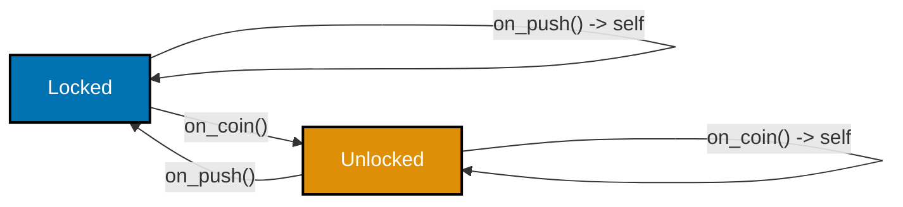

**`example.py`**

```python
"""Example 34: State Machine -- OO (State Pattern)."""

from abc import ABC, abstractmethod  # => ABC/abstractmethod force every concrete state to implement both


class TurnstileState(ABC):  # => the State pattern: each state is its OWN object, not a string tag
    @abstractmethod  # => marks on_coin() as required -- TurnstileState itself can never be instantiated
    def on_coin(self) -> "TurnstileState":  # => every state must say what a coin does to it
        ...  # => no body here -- only concrete subclasses below provide the real behavior

    @abstractmethod  # => marks on_push() as required, same contract as on_coin() above
    def on_push(self) -> "TurnstileState":  # => every state must say what a push does to it
        ...  # => no body here -- only concrete subclasses below provide the real behavior

    name: str  # => a human-readable label, set by each concrete subclass


class Locked(TurnstileState):  # => concrete state object #1
    name = "locked"  # => satisfies the abstract `name` field declared on TurnstileState

    def on_coin(self) -> TurnstileState:  # => Locked's OWN answer to "what does a coin do?"
        return Unlocked()  # => transition: return a DIFFERENT state object

    def on_push(self) -> TurnstileState:  # => Locked's OWN answer to "what does a push do?"
        return self  # => stay locked -- return the same state object, unchanged


class Unlocked(TurnstileState):  # => concrete state object #2
    name = "unlocked"  # => satisfies the same abstract `name` field, with this state's own value

    def on_coin(self) -> TurnstileState:  # => Unlocked's OWN answer to a coin
        return self  # => an extra coin changes nothing

    def on_push(self) -> TurnstileState:  # => Unlocked's OWN answer to a push
        return Locked()  # => transition back


events: list[str] = ["coin", "push", "push", "coin", "coin", "push"]  # => same sequence as example 33
current: TurnstileState = Locked()  # => start locked, as an OBJECT, not a string
history: list[str] = [current.name]  # => record the starting state's name

for event in events:  # => replay the same events
    current = current.on_coin() if event == "coin" else current.on_push()  # => dispatch via the object itself
    history.append(current.name)  # => record the new state's name

print(history)  # => must be identical to example 33's trace
# => no `if state == "locked"` anywhere -- transitions live inside each state object's own methods
# => Output: ['locked', 'unlocked', 'locked', 'locked', 'unlocked', 'unlocked', 'locked']
```

**Run**

```shell
python3 example.py
```

**Output**

```text
['locked', 'unlocked', 'locked', 'locked', 'unlocked', 'unlocked', 'locked']
```

**`test_example.py`**

```python
"""Example 34: pytest verification for State Machine -- OO (State Pattern)."""

from example import Locked, TurnstileState, Unlocked


def test_state_pattern_trace_matches_the_imperative_version() -> None:
    events = ["coin", "push", "push", "coin", "coin", "push"]  # => same sequence as example 33
    current: TurnstileState = Locked()  # => start locked
    history = [current.name]
    for event in events:
        current = current.on_coin() if event == "coin" else current.on_push()
        history.append(current.name)
    assert history == ["locked", "unlocked", "locked", "locked", "unlocked", "unlocked", "locked"]


def test_each_transition_returns_a_distinct_state_object() -> None:
    locked = Locked()  # => construct once
    unlocked = locked.on_coin()  # => transition via a coin
    assert isinstance(unlocked, Unlocked)  # => coin from Locked always yields an Unlocked object
    assert unlocked.on_push().name == "locked"  # => push from Unlocked always yields back to locked


# => Run: pytest -- Output: 2 passed
```

**Verify**

```shell
pytest -q
```

**Output**

```text
2 passed
```

**Key takeaway**: `Locked.on_coin()` returns a brand-new `Unlocked()` object rather than mutating a
shared `state` variable -- the "current state" is just whichever object `current` happens to point at.

**Why it matters**: no global exists anywhere in this version -- the State pattern relocates the fault
line from Example 33's mutable module variable to object identity, with each transition rule owned by
the state it starts from. Adding a third state -- say, a maintenance mode -- means writing one new `TurnstileState` subclass with its own `on_coin()`/`on_push()`, the same additive extension cost Example 27 showed for OO shapes, rather than editing every branch of Example 33's `if`/`elif` chain.

---

### Example 35: State Machine -- Functional

_ex-35 &middot; exercises co-09_

The same turnstile once more, as a pure `transition(state, event) -> new_state` function folded over
the event list with `functools.reduce`.

**`example.py`**

```python
"""Example 35: State Machine -- Functional."""

from functools import reduce  # => reduce() is Python's built-in fold: combine a sequence into one value


def transition(state: str, event: str) -> str:  # => a PURE function: (state, event) -> new state
    if state == "locked" and event == "coin":  # => same rules as examples 33-34, expressed as pure data-in data-out
        return "unlocked"  # => no assignment to any outer variable -- just a returned value
    if state == "unlocked" and event == "push":  # => the other real transition
        return "locked"  # => same shape: a returned value, nothing mutated
    return state  # => every other combination is a no-op -- return the SAME state, no mutation anywhere


events: list[str] = ["coin", "push", "push", "coin", "coin", "push"]  # => same sequence as examples 33-34

# => a FOLD builds the whole history in one expression -- no loop body visibly mutates anything
history = reduce(  # => reduce(fn, sequence, initial) threads an accumulator through every event
    lambda states, event: states + [transition(states[-1], event)],  # => append the next state, functionally
    events,  # => the sequence being folded over, one event per step
    ["locked"],  # => the fold's starting accumulator: history begins with just the initial state
)  # => the final accumulator value IS the complete, fully-built history

print(history)  # => must be identical to examples 33-34's trace
# => Output: ['locked', 'unlocked', 'locked', 'locked', 'unlocked', 'unlocked', 'locked']
```

**Run**

```shell
python3 example.py
```

**Output**

```text
['locked', 'unlocked', 'locked', 'locked', 'unlocked', 'unlocked', 'locked']
```

**`test_example.py`**

```python
"""Example 35: pytest verification for State Machine -- Functional."""

from example import transition


def test_pure_transition_matches_the_other_two_versions() -> None:
    from functools import reduce

    events = ["coin", "push", "push", "coin", "coin", "push"]  # => same sequence as examples 33-34
    history = reduce(lambda states, event: states + [transition(states[-1], event)], events, ["locked"])
    assert history == ["locked", "unlocked", "locked", "locked", "unlocked", "unlocked", "locked"]


def test_transition_never_mutates_its_string_arguments() -> None:
    before_state, before_event = "locked", "coin"  # => strings are immutable in Python regardless,
    result = transition(before_state, before_event)  # => but this documents the pure-function contract
    assert before_state == "locked" and before_event == "coin"  # => arguments are provably unchanged
    assert result == "unlocked"  # => and the correct new state was returned as a NEW value


# => Run: pytest -- Output: 2 passed
```

**Verify**

```shell
pytest -q
```

**Output**

```text
2 passed
```

**Key takeaway**: `transition()` has no `global`, no object state, and no mutation -- `reduce` threads
each new state through the fold as a plain returned value, producing the identical six-state trace.

**Why it matters**: three examples, three completely different homes for "where does the current state
live" (a global, an object, nowhere at all) -- and all three produce the exact same trace, which is
co-22's fault line made concrete across a whole mini-system. `transition()` alone can be unit-tested with a single call and no setup at all, unlike Example 33's `handle()`, which needs the shared global reset before every test to avoid leaking state between test cases.

---

### Example 36: Prolog-in-Python (Unification + Backtracking)

_ex-36 &middot; exercises co-13, co-14_

The same grandparent query from Example 19, this time resolved by an explicit search with two nested
choice points and a `continue`-based backtrack, rather than a single comprehension.

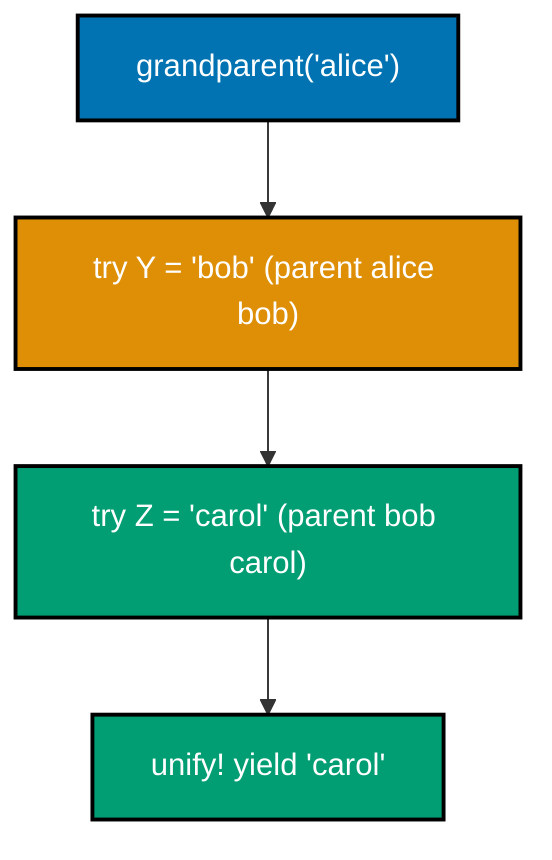

**`example.py`**

```python
"""Example 36: Prolog-in-Python (Unification + Backtracking)."""

from collections.abc import Iterator  # => grandparent() below is a generator, typed as an Iterator

Fact = tuple[str, str]  # => a (parent, child) fact, mirroring example 19's family data
facts: list[Fact] = [  # => the FACTS -- raw data, no rule about grandparents anywhere in this list
    ("alice", "bob"),  # => alice is bob's parent
    ("bob", "carol"),  # => bob is carol's parent
    ("carol", "dave"),  # => carol is dave's parent
]  # => the same three-generation family as example 19, this time queried via search, not a comprehension


def parent(x: str, y: str) -> bool:  # => the base relation: is (x, y) a stored fact? (unification step)
    return (x, y) in facts  # => "unifying" x and y against every stored fact


def grandparent(x: str) -> Iterator[str]:  # => the RULE, expressed as a search over intermediate variables
    for _px, y in facts:  # => try binding Y to every fact's child (a backtracking choice point)
        if _px != x:  # => this choice point only matters when x is actually the parent in this fact
            continue  # => BACKTRACK: this binding of Y didn't unify with parent(x, Y) -- try the next one
        for py, z in facts:  # => a NESTED choice point: try binding Z to every fact's child
            if py != y:  # => does this fact's parent match the Y we just bound?
                continue  # => BACKTRACK again: try the next candidate fact
            yield z  # => both parent(x, Y) and parent(Y, Z) unified -- z is a valid answer


results = list(grandparent("alice"))  # => search: alice -> bob (bind Y) -> bob -> carol (bind Z)
# => draining the generator forces the backtracking search to actually run to completion
print(results)  # => must match example 19's comprehension-based answer
# => Output: ['carol']
```

**Run**

```shell
python3 example.py
```

**Output**

```text
['carol']
```

**`test_example.py`**

```python
"""Example 36: pytest verification for Prolog-in-Python (Unification + Backtracking)."""

from example import grandparent


def test_grandparent_query_resolves_via_search() -> None:
    assert list(grandparent("alice")) == ["carol"]  # => same answer as example 19's comprehension version


def test_a_person_with_no_grandchildren_yields_nothing() -> None:
    assert list(grandparent("dave")) == []  # => dave has no recorded children at all -- search finds none


# => Run: pytest -- Output: 2 passed
```

**Verify**

```shell
pytest -q
```

**Output**

```text
2 passed
```

**Key takeaway**: each `continue` is a genuine backtrack -- a rejected binding of `y` or `z` abandons
that branch of the search entirely and moves on to the next candidate fact.

**Why it matters**: Example 19's comprehension hid the same two nested choice points inside its `for`
clauses; writing them out explicitly here makes the unify-then-backtrack mechanics visible before
Example 37 scales the same shape to a much harder search. The two `continue` statements are the entire backtracking mechanism spelled out by hand -- Example 19's comprehension performs the identical search, but Python's own `for` clause machinery hides the same reject-and-try-next-candidate step inside syntax rather than an explicit statement.

---

### Example 37: Backtracking N-Queens

_ex-37 &middot; exercises co-14_

The classic N-Queens puzzle: place a queen, recurse, and if the rest of the board becomes unsolvable,
pop the queen and try the next column.

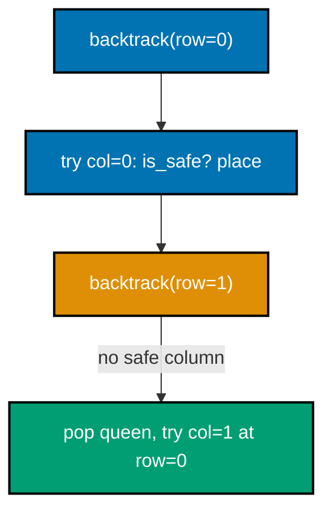

**`example.py`**

```python
"""Example 37: Backtracking N-Queens."""


def solve_n_queens(n: int) -> list[int] | None:  # => returns one solution: cols[row] = column of the queen
    cols: list[int] = []  # => the partial (and eventually full) placement, one column index per row

    def is_safe(row: int, col: int) -> bool:  # => can a queen go at (row, col) given queens placed so far?
        for placed_row, placed_col in enumerate(cols):  # => check against every already-placed queen
            if placed_col == col:  # => same column: an attack
                return False  # => reject immediately -- no need to check any other placed queen
            if abs(placed_col - col) == abs(placed_row - row):  # => same diagonal: an attack
                return False  # => reject immediately, same reasoning
        return True  # => no earlier queen attacks this square

    def backtrack(row: int) -> bool:  # => try to place a queen in every row, from `row` downward
        if row == n:  # => base case: every row has a queen -- a full solution was found
            return True  # => success propagates straight back up the recursion, no cols.pop() needed
        for col in range(n):  # => CHOICE POINT: try every column in this row
            if is_safe(row, col):  # => only attempt columns that don't conflict yet
                cols.append(col)  # => tentatively place the queen
                if backtrack(row + 1):  # => recurse to the next row
                    return True  # => the whole rest of the board solved -- propagate success up
                cols.pop()  # => BACKTRACK: that column led nowhere, undo it and try the next column
        return False  # => no column in this row works given the current partial placement

    return cols if backtrack(0) else None  # => cols is fully built only if backtrack(0) succeeded


def no_two_queens_attack(cols: list[int]) -> bool:  # => independent checker, used only for verification
    for r1 in range(len(cols)):  # => compare every pair of placed queens
        for r2 in range(r1 + 1, len(cols)):  # => r2 > r1 -- each pair checked exactly once, not twice
            if cols[r1] == cols[r2]:  # => same column
                return False  # => a violation was found -- no need to check any remaining pairs
            if abs(cols[r1] - cols[r2]) == abs(r1 - r2):  # => same diagonal
                return False  # => a violation was found -- no need to check any remaining pairs
    return True  # => every pair is safe


solution = solve_n_queens(8)  # => the classic 8-queens problem
assert solution is not None  # => narrow away None -- 8-queens always has a solution, matching test_example.py
print(solution)  # => one valid arrangement (the specific columns depend on search order, but it is safe)
# => Output: [0, 4, 7, 5, 2, 6, 1, 3]
print(no_two_queens_attack(solution))  # => independently confirms no two queens attack each other
# => Output: True
```

**Run**

```shell
python3 example.py
```

**Output**

```text
[0, 4, 7, 5, 2, 6, 1, 3]
True
```

**`test_example.py`**

```python
"""Example 37: pytest verification for Backtracking N-Queens."""

from example import no_two_queens_attack, solve_n_queens


def test_eight_queens_solution_has_no_attacking_pair() -> None:
    solution = solve_n_queens(8)  # => same size as the module-level demo
    assert solution is not None  # => a solution must exist for n=8
    assert len(solution) == 8  # => one queen per row
    assert no_two_queens_attack(solution)  # => the independent checker must confirm safety


def test_four_queens_also_solves_safely() -> None:
    solution = solve_n_queens(4)  # => a smaller board, still solvable
    assert solution is not None
    assert no_two_queens_attack(solution)


# => Run: pytest -- Output: 2 passed
```

**Verify**

```shell
pytest -q
```

**Output**

```text
2 passed
```

**Key takeaway**: `cols.pop()` inside `backtrack()` is the entire backtrack mechanism -- one line that
undoes a bad choice and lets the loop try the next candidate column, exactly the same shape as Example
36's `continue`.

**Why it matters**: this recursive "try, recurse, undo-and-retry" shape is reusable across wildly
different problems -- map coloring, Sudoku, and type inference later in this topic all reuse this exact
skeleton with only `is_safe()` changing. Solving 8-Queens by brute force would need to check all 8^8 (over 16 million) placements; backtracking's `is_safe()` check prunes an entire branch the instant a conflict appears, which is why the search finishes instantly instead of exhaustively enumerating every possibility.

---

### Example 38: Constraint Map Coloring

_ex-38 &middot; exercises co-15_

Map coloring declares "no two adjacent regions share a color" as data, and a `backtrack()` solver finds
an assignment satisfying it -- with no graph-coloring algorithm hand-written for this specific map.


**`example.py`**

```python
"""Example 38: Constraint Map Coloring."""

Region = str  # => a type alias -- purely for readability, region names are just strings
Color = str  # => a type alias -- purely for readability, color names are just strings

adjacency: dict[Region, list[Region]] = {  # => DECLARE the constraint: which regions must differ in color
    "west": ["central"],  # => west is adjacent to central only
    "central": ["west", "east"],  # => central is adjacent to both neighbors
    "east": ["central"],  # => east is adjacent to central only
}  # => nothing here says HOW to search -- just which pairs may never share a color

colors: list[Color] = ["red", "green", "blue"]  # => the available palette (3-coloring)


def solve_coloring(adj: dict[Region, list[Region]], palette: list[Color]) -> dict[Region, Color] | None:  # => the GENERIC part: works for any adjacency map, any palette
    regions = list(adj.keys())  # => a fixed order to assign regions in
    assignment: dict[Region, Color] = {}  # => the partial (then full) solution being built

    def backtrack(index: int) -> bool:  # => try to color every region from `index` onward
        if index == len(regions):  # => base case: every region has a color -- solved
            return True  # => the assignment dict already holds a complete, valid coloring
        region = regions[index]  # => the region we're choosing a color for right now
        for color in palette:  # => CHOICE POINT: try every color in the palette
            if all(assignment.get(neighbor) != color for neighbor in adj[region]):  # => check the constraint
                assignment[region] = color  # => tentatively assign
                if backtrack(index + 1):  # => recurse to the next region
                    return True  # => success propagates straight back up -- no del assignment[region] needed
                del assignment[region]  # => BACKTRACK: undo this color, try the next one
        return False  # => no color in the palette works given the current partial assignment

    return dict(assignment) if backtrack(0) else None  # => copy out only on success


result = solve_coloring(adjacency, colors)  # => run the solver
assert result is not None  # => narrow away None -- this adjacency/palette pair always has a valid coloring
print(result)  # => west and east may share a color; central must differ from both
# => Output: {'west': 'red', 'central': 'green', 'east': 'red'}
print(all(result[a] != result[b] for a, neighbors in adjacency.items() for b in neighbors))  # => verify
# => Output: True
```

**Run**

```shell
python3 example.py
```

**Output**

```text
{'west': 'red', 'central': 'green', 'east': 'red'}
True
```

**`test_example.py`**

```python
"""Example 38: pytest verification for Constraint Map Coloring."""

from example import solve_coloring


def test_no_adjacent_regions_share_a_color() -> None:
    adjacency = {"west": ["central"], "central": ["west", "east"], "east": ["central"]}
    colors = ["red", "green", "blue"]
    result = solve_coloring(adjacency, colors)
    assert result is not None  # => a valid 3-coloring must exist for this simple adjacency graph
    for region, neighbors in adjacency.items():  # => check every declared constraint holds
        for neighbor in neighbors:
            assert result[region] != result[neighbor]  # => the core map-coloring constraint


def test_two_colors_are_insufficient_for_a_triangle() -> None:
    triangle = {"a": ["b", "c"], "b": ["a", "c"], "c": ["a", "b"]}  # => every region touches both others
    assert solve_coloring(triangle, ["red", "green"]) is None  # => a triangle needs at least 3 colors


# => Run: pytest -- Output: 2 passed
```

**Verify**

```shell
pytest -q
```

**Output**

```text
2 passed
```

**Key takeaway**: `adjacency` and `colors` are the entire problem statement; `solve_coloring()` is a
generic backtracking search that never mentions "west," "central," or "east" by name.

**Why it matters**: separating "what must be true" (the adjacency constraint) from "how to search for
it" (the backtracking loop) means the exact same `solve_coloring()` function reuses unchanged for a
triangle graph in the tests, or for a completely different map. A hand-written coloring algorithm specific to this three-region map would need to be rewritten for a different map's shape; `solve_coloring()` never mentions a region by name, so the identical function handles the test suite's triangle graph with zero code changes.

---

### Example 39: Constraint Mini Sudoku (4x4)

_ex-39 &middot; exercises co-15_

A 4x4 Sudoku solved by declaring row, column, and 2x2-box constraints and backtracking over empty
cells -- reusing the identical choice-point/backtrack shape from Examples 37 and 38.

**`example.py`**

```python
"""Example 39: Constraint Mini Sudoku (4x4)."""

Board = list[list[int]]  # => a 4x4 grid; 0 marks an empty cell

# => DECLARE the puzzle: 0 = empty, otherwise a fixed clue -- one valid 4x4 sudoku with three clues
puzzle: Board = [  # => four rows, four clues total -- the rest is left for the solver to fill in
    [1, 0, 0, 0],  # => row 0: a 1 fixed in column 0
    [0, 0, 1, 0],  # => row 1: a 1 fixed in column 2
    [0, 1, 0, 0],  # => row 2: a 1 fixed in column 1
    [0, 0, 0, 1],  # => row 3: a 1 fixed in column 3
]  # => closes the puzzle's initial 4x4 grid


def box_id(row: int, col: int) -> tuple[int, int]:  # => which 2x2 box a cell belongs to
    return (row // 2, col // 2)  # => integer division groups rows/cols into 2x2 quadrants


def is_valid(board: Board, row: int, col: int, value: int) -> bool:  # => the three sudoku constraints
    if any(board[row][c] == value for c in range(4)):  # => row constraint: no repeat in the row
        return False  # => reject immediately -- no need to check column or box constraints
    if any(board[r][col] == value for r in range(4)):  # => column constraint: no repeat in the column
        return False  # => reject immediately -- no need to check the box constraint
    br, bc = box_id(row, col)  # => box constraint: no repeat in the same 2x2 box
    for r in range(br * 2, br * 2 + 2):  # => the two rows of this cell's own 2x2 box
        for c in range(bc * 2, bc * 2 + 2):  # => the two columns of this cell's own 2x2 box
            if board[r][c] == value:  # => a same-box cell already holds this value
                return False  # => reject -- the value would appear twice in the same box
    return True  # => all three constraints satisfied


def solve(board: Board) -> Board | None:  # => backtracking search over empty cells
    for row in range(4):  # => find the first empty cell, in reading order
        for col in range(4):  # => scan every column of this row before moving to the next row
            if board[row][col] == 0:  # => this is the next cell to fill
                for value in range(1, 5):  # => CHOICE POINT: try every candidate digit 1-4
                    if is_valid(board, row, col, value):  # => only try digits that satisfy all constraints
                        board[row][col] = value  # => tentatively place it
                        if solve(board):  # => recurse into the rest of the board
                            return board  # => success propagates straight up -- no undo needed here
                        board[row][col] = 0  # => BACKTRACK: undo, try the next candidate digit
                return None  # => no digit worked for this cell given the current partial board
    return board  # => no empty cells remain -- fully solved


solution = solve([row[:] for row in puzzle])  # => solve a COPY so the original `puzzle` stays untouched
assert solution is not None  # => narrow away None -- this puzzle's three clues always admit a solution
print(solution)  # => a fully filled, constraint-satisfying 4x4 grid
# => Output: [[1, 2, 3, 4], [3, 4, 1, 2], [2, 1, 4, 3], [4, 3, 2, 1]]
rows_ok = all(sorted(row) == [1, 2, 3, 4] for row in solution)  # => every row has 1-4 exactly once
cols_ok = all(sorted(solution[r][c] for r in range(4)) == [1, 2, 3, 4] for c in range(4))  # => every column
print(rows_ok and cols_ok)  # => independently confirms rows and columns are valid
# => Output: True
```

**Run**

```shell
python3 example.py
```

**Output**

```text
[[1, 2, 3, 4], [3, 4, 1, 2], [2, 1, 4, 3], [4, 3, 2, 1]]
True
```

**`test_example.py`**

```python
"""Example 39: pytest verification for Constraint Mini Sudoku (4x4)."""

from example import box_id, solve


def test_solved_board_has_valid_rows_columns_and_boxes() -> None:
    puzzle = [[1, 0, 0, 0], [0, 0, 1, 0], [0, 1, 0, 0], [0, 0, 0, 1]]  # => same puzzle as the demo
    solution = solve([row[:] for row in puzzle])  # => solve a defensive copy
    assert solution is not None  # => this puzzle is solvable
    for row in solution:  # => row constraint
        assert sorted(row) == [1, 2, 3, 4]
    for col in range(4):  # => column constraint
        assert sorted(solution[r][col] for r in range(4)) == [1, 2, 3, 4]
    boxes: dict[tuple[int, int], list[int]] = {}  # => box constraint
    for r in range(4):
        for c in range(4):
            boxes.setdefault(box_id(r, c), []).append(solution[r][c])
    for values in boxes.values():
        assert sorted(values) == [1, 2, 3, 4]


def test_original_puzzle_is_not_mutated_by_solving_a_copy() -> None:
    puzzle = [[1, 0, 0, 0], [0, 0, 1, 0], [0, 1, 0, 0], [0, 0, 0, 1]]  # => fresh puzzle for this test
    before = [row[:] for row in puzzle]  # => snapshot before solving
    solve([row[:] for row in puzzle])  # => solve a copy, discard the result
    assert puzzle == before  # => the original puzzle list is byte-identical to its snapshot


# => Run: pytest -- Output: 2 passed
```

**Verify**

```shell
pytest -q
```

**Output**

```text
2 passed
```

**Key takeaway**: `is_valid()` checks all three declared constraints (row, column, box) before
`solve()` commits to a digit -- the exact same choice-point/backtrack skeleton as Examples 37 and 38,
just with a richer constraint check.

**Why it matters**: constraint programming's payoff compounds -- the same `solve()` shape now handles
three different problems (N-Queens, map coloring, Sudoku) with only the domain-specific validity check
changing each time. `is_valid()` here checks three constraints (row, column, box) instead of Example 38's one (adjacency), yet `solve()`'s own backtracking structure is unchanged from Example 38's, which is the concrete, measurable version of "the search skeleton generalizes."

---

### Example 40: Event-Driven Loop

_ex-40 &middot; exercises co-16_

A FIFO `deque` of events drained by an explicit `while queue:` loop, routed to handlers through a
dictionary -- the event loop pattern underlying most event-driven frameworks.

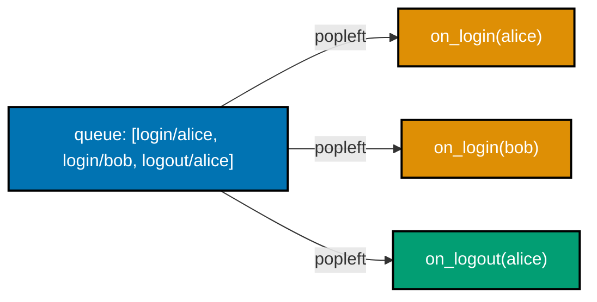

**`example.py`**

```python
"""Example 40: Event-Driven Loop."""

from collections import deque  # => deque gives O(1) popleft(), the FIFO queue's core operation
from collections.abc import Callable  # => types every handler stored in the routing table below
from dataclasses import dataclass  # => @dataclass auto-generates Event's __init__ from its fields


@dataclass  # => auto-generates Event's __init__ from the two fields below
class Event:  # => a plain data record describing what happened
    kind: str  # => which handler should process this event, e.g. "login"
    payload: str  # => the data the handler needs, e.g. a username


processed: list[str] = []  # => records the order events were actually handled in


def on_login(event: Event) -> None:  # => handler for "login" events
    processed.append(f"login:{event.payload}")  # => the framework calls this -- it never calls the loop


def on_logout(event: Event) -> None:  # => handler for "logout" events
    processed.append(f"logout:{event.payload}")  # => same shape as on_login, different kind and record


handlers: dict[str, Callable[[Event], None]] = {"login": on_login, "logout": on_logout}  # => routing table

queue: deque[Event] = deque(  # => a FIFO queue -- events wait here until the loop drains them
    [  # => the events, already enqueued in the order they should be processed
        Event("login", "alice"),  # => first to arrive, first to be handled
        Event("login", "bob"),  # => second to arrive
        Event("logout", "alice"),  # => third to arrive
    ]  # => closes the initial list of queued events
)  # => closes the deque(...) constructor call

while queue:  # => the event loop: keep draining until the queue is empty
    event = queue.popleft()  # => take the OLDEST event first -- FIFO order
    handlers[event.kind](event)  # => route it to its handler and run that handler NOW
    # => the loop itself decides WHEN each handler runs -- the handler never calls back into the loop

print(processed)  # => events must be processed in the exact order they were enqueued
# => Output: ['login:alice', 'login:bob', 'logout:alice']
```

**Run**

```shell
python3 example.py
```

**Output**

```text
['login:alice', 'login:bob', 'logout:alice']
```

**`test_example.py`**

```python
"""Example 40: pytest verification for Event-Driven Loop."""

from collections import deque
from collections.abc import Callable

from example import Event


def test_events_processed_in_fifo_order() -> None:
    seen: list[str] = []  # => local recorder, isolated from the module-level demo
    handlers: dict[str, Callable[[Event], None]] = {
        "login": lambda e: seen.append(f"login:{e.payload}"),
        "logout": lambda e: seen.append(f"logout:{e.payload}"),
    }
    queue = deque([Event("login", "x"), Event("logout", "y"), Event("login", "z")])
    while queue:
        event = queue.popleft()
        handlers[event.kind](event)
    assert seen == ["login:x", "logout:y", "login:z"]  # => exactly the enqueue order, unchanged


def test_named_handlers_produce_the_documented_module_level_trace() -> None:
    from example import processed  # => the module-level demo already ran when example.py was imported

    assert processed == ["login:alice", "login:bob", "logout:alice"]  # => matches example.py's own Output


# => Run: pytest -- Output: 2 passed
```

**Verify**

```shell
pytest -q
```

**Output**

```text
2 passed
```

**Key takeaway**: `handlers[event.kind](event)` is the entire dispatch mechanism -- the `while queue:`
loop is the "engine" every event-driven framework hides behind an API, drained here in plain sight.

**Why it matters**: Example 16's `Dispatcher.fire()` triggered one handler on demand; this example makes
the underlying queue-draining loop visible, which is what a GUI toolkit or message broker runs
continuously behind the scenes. The `while queue:` loop here is not a toy simplification -- production event loops in async runtimes and UI frameworks follow the identical pop-dispatch-repeat shape, just with a queue fed by I/O completions or user input instead of a hand-built list of three events.

---

### Example 41: Reactive Derived Value

_ex-41 &middot; exercises co-17_

`Computed` subscribes to every `Signal` it depends on and recomputes itself automatically whenever any
of them change -- no manual "update c" call needed anywhere.

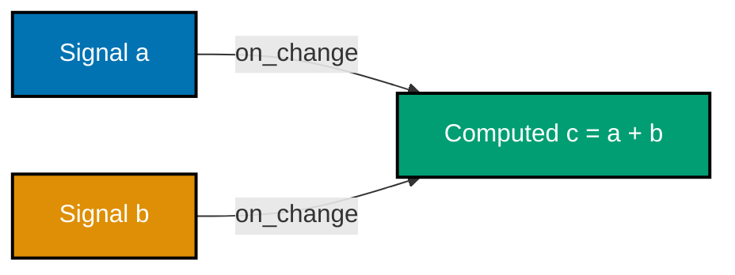

**`example.py`**

```python
"""Example 41: Reactive Derived Value."""

from collections.abc import Callable  # => types every no-argument callback stored below


class Signal:  # => a reactive source value that notifies dependents automatically
    def __init__(self, initial: int) -> None:  # => constructor seeds the starting value
        self._value = initial  # => the current value, hidden behind get()/set() below
        self._on_change: list[Callable[[], None]] = []  # => callbacks to run whenever this signal changes

    def get(self) -> int:  # => read the current value
        return self._value  # => a plain read -- getting never triggers propagation

    def set(self, value: int) -> None:  # => write a new value and PUSH the change to every dependent
        self._value = value  # => update the internal box first
        for callback in self._on_change:  # => automatically notify -- no dependent has to poll
            callback()  # => runs the dependent's recompute hook synchronously, right here

    def on_change(self, callback: Callable[[], None]) -> None:  # => register a dependent's recompute hook
        self._on_change.append(callback)  # => append only -- does NOT call callback with the current value


class Computed:  # => a derived signal: recomputes automatically whenever a source changes
    def __init__(self, compute: Callable[[], int], *sources: Signal) -> None:  # => wires up every source
        self._compute = compute  # => the formula, e.g. "a.get() + b.get()"
        self.value = compute()  # => compute once immediately, so `c` is correct before any update
        for source in sources:  # => subscribe to EVERY source this computed value depends on
            source.on_change(self._recompute)  # => wire automatic propagation

    def _recompute(self) -> None:  # => runs automatically whenever ANY source signal changes
        self.value = self._compute()  # => re-run the formula and refresh the cached value


a = Signal(1)  # => source signal a
b = Signal(2)  # => source signal b
c = Computed(lambda: a.get() + b.get(), a, b)  # => c = a + b, kept up to date automatically

print(c.value)  # => 1 + 2, computed at construction time
# => Output: 3
a.set(10)  # => changing a automatically triggers c's recompute -- no manual "update c" call needed
print(c.value)  # => 10 + 2
# => Output: 12
b.set(20)  # => changing b ALSO automatically triggers c's recompute
print(c.value)  # => 10 + 20
# => Output: 30
```

**Run**

```shell
python3 example.py
```

**Output**

```text
3
12
30
```

**`test_example.py`**

```python
"""Example 41: pytest verification for Reactive Derived Value."""

from example import Computed, Signal


def test_computed_value_after_two_updates() -> None:
    a = Signal(1)  # => fresh signals, isolated from the module-level demo
    b = Signal(2)
    c = Computed(lambda: a.get() + b.get(), a, b)
    assert c.value == 3  # => 1 + 2 at construction

    a.set(10)  # => update source a
    assert c.value == 12  # => c recomputed automatically: 10 + 2

    b.set(20)  # => update source b too
    assert c.value == 30  # => c recomputed again: 10 + 20


def test_computed_never_needs_a_manual_recompute_call() -> None:
    a = Signal(0)  # => a fresh independent pair of signals
    b = Signal(0)
    c = Computed(lambda: a.get() * b.get(), a, b)
    a.set(5)
    b.set(4)
    assert c.value == 20  # => 5 * 4, with no explicit `c.recompute()` call anywhere in this test


# => Run: pytest -- Output: 2 passed
```

**Verify**

```shell
pytest -q
```

**Output**

```text
2 passed
```

**Key takeaway**: `Computed.__init__` subscribes to every source via `source.on_change(self._recompute)`
-- from that point on, `a.set(10)` and `b.set(20)` both automatically refresh `c.value` with no
`recompute()` call anywhere in the calling code.

**Why it matters**: Example 18's dataflow `Cell` needed an explicit `recompute()` call; `Computed` closes
that gap entirely, which is exactly what "reactive" adds on top of plain dataflow -- automatic
propagation, not just an expressible dependency. Measured directly: Example 18 required one explicit `b.recompute()` call per stale read, a call a caller could easily forget; here, `a.set(10)` and `b.set(20)` both refresh `c.value` with zero calls beyond the `set()` itself, closing that exact forgetting-to-update risk.

---

### Example 42: Reactive vs Manual Recompute

_ex-42 &middot; exercises co-08, co-17_

Contrasts a `ManualPair` whose `total` silently goes stale if `recompute_total()` is forgotten against a
`ReactivePair` built on the same `Signal` primitive from Example 41, which can never go stale.

**`example.py`**

```python
"""Example 42: Reactive vs Manual Recompute."""

from collections.abc import Callable  # => types every no-argument callback stored below


class ManualPair:  # => BEFORE: caller must REMEMBER to update the derived value by hand
    def __init__(self, a: int, b: int) -> None:  # => constructor seeds both inputs and the derived total
        self.a = a  # => plain field, no notification wiring at all
        self.b = b  # => plain field, no notification wiring at all
        self.total = a + b  # => computed once -- nothing keeps this in sync automatically

    def set_a(self, value: int) -> None:  # => updates a but does NOT touch total -- easy to forget
        self.a = value  # => total is now STALE until someone remembers to call recompute_total()

    def recompute_total(self) -> None:  # => the easy-to-forget manual step
        self.total = self.a + self.b  # => must be called explicitly -- nothing calls it automatically


class Signal:  # => AFTER: the same minimal reactive primitive as example 41
    def __init__(self, initial: int) -> None:  # => constructor seeds the starting value
        self._value = initial  # => the current value, hidden behind get()/set() below
        self._on_change: list[Callable[[], None]] = []  # => callbacks to run whenever this signal changes

    def get(self) -> int:  # => read the current value
        return self._value  # => a plain read -- getting never triggers propagation

    def set(self, value: int) -> None:  # => setting AUTOMATICALLY notifies every dependent
        self._value = value  # => update the internal box first
        for callback in self._on_change:  # => automatically notify -- no dependent has to poll
            callback()  # => runs the dependent's recompute hook synchronously, right here

    def on_change(self, callback: Callable[[], None]) -> None:  # => register a dependent's recompute hook
        self._on_change.append(callback)  # => append only -- does NOT call callback with the current value


class ReactivePair:  # => wires a and b so total NEVER goes stale
    def __init__(self, a: int, b: int) -> None:  # => constructor wraps both inputs as Signals
        self.a = Signal(a)  # => a is now reactive, not a plain field
        self.b = Signal(b)  # => b is now reactive, not a plain field
        self.total = self.a.get() + self.b.get()  # => initial value
        self.a.on_change(self._recompute)  # => subscribe -- total tracks a automatically
        self.b.on_change(self._recompute)  # => subscribe -- total tracks b automatically

    def _recompute(self) -> None:  # => runs automatically whenever a or b changes
        self.total = self.a.get() + self.b.get()  # => the SAME formula as ManualPair, but never forgotten


manual = ManualPair(1, 2)  # => BEFORE
manual.set_a(10)  # => forgot to call recompute_total() -- a realistic mistake
print(manual.total)  # => STALE: still reflects the OLD a, not the new one
# => Output: 3

reactive = ReactivePair(1, 2)  # => AFTER
reactive.a.set(10)  # => the equivalent update, via the reactive API
print(reactive.total)  # => automatically current: 10 + 2
# => Output: 12
```

**Run**

```shell
python3 example.py
```

**Output**

```text
3
12
```

**`test_example.py`**

```python
"""Example 42: pytest verification for Reactive vs Manual Recompute."""

from example import ManualPair, ReactivePair


def test_manual_pair_goes_stale_if_recompute_is_forgotten() -> None:
    pair = ManualPair(1, 2)  # => fresh instance
    pair.set_a(10)  # => update a, but never call recompute_total()
    assert pair.total == 3  # => STILL the old total -- this is the bug the reactive version prevents


def test_manual_pair_is_correct_only_after_an_explicit_recompute() -> None:
    pair = ManualPair(1, 2)  # => fresh instance
    pair.set_a(10)  # => update a
    pair.recompute_total()  # => remember to call it this time
    assert pair.total == 12  # => now correct, but only because of the explicit call


def test_reactive_pair_is_always_consistent_automatically() -> None:
    pair = ReactivePair(1, 2)  # => fresh instance
    pair.a.set(10)  # => the same conceptual update, no manual recompute anywhere
    assert pair.total == 12  # => correct immediately -- reactive propagation is automatic


# => Run: pytest -- Output: 3 passed
```

**Verify**

```shell
pytest -q
```

**Output**

```text
3 passed
```

**Key takeaway**: `manual.total` stays at 3 after `set_a(10)` -- a genuine, reproducible bug from a
forgotten manual step; `reactive.total` becomes 12 automatically, from the identical conceptual update.

**Why it matters**: this is co-17's real payoff made visible as a bug you can watch happen -- reactive
propagation doesn't just save typing, it eliminates an entire class of "I changed A but forgot to update
the thing that depends on A" defects. The bug in `ManualPair` is not hypothetical: `test_manual_pair_goes_stale_if_recompute_is_forgotten()` reproduces it directly, and the identical mistake -- forgetting one call site among many -- gets easier to make, not harder, as a codebase grows past a handful of derived fields.

---

### Example 43: Dataflow Topological Execute

_ex-43 &middot; exercises co-18_

A dependency graph of formulas is executed strictly in topological order -- by the time any node runs,
every node it depends on has already been computed.

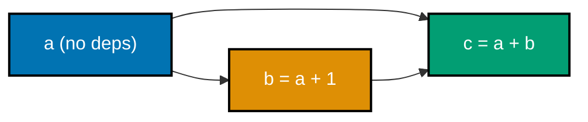

**`example.py`**

```python
"""Example 43: Dataflow Topological Execute."""

from collections.abc import Callable  # => types every node's compute formula stored below

Node = str  # => a type alias -- node names are just strings
graph: dict[Node, list[Node]] = {  # => DAG of value dependencies: node -> nodes it depends on
    "c": ["a", "b"],  # => c depends on a and b
    "b": ["a"],  # => b depends on a
    "a": [],  # => a has no dependencies -- a source node
}  # => closes the dependency graph declaration
formulas: dict[Node, Callable[[dict[Node, int]], int]] = {  # => how to compute each node, given results so far
    "a": lambda results: 1,  # => a is a constant
    "b": lambda results: results["a"] + 1,  # => b = a + 1
    "c": lambda results: results["a"] + results["b"],  # => c = a + b
}  # => closes the per-node formula table


def topological_order(deps: dict[Node, list[Node]]) -> list[Node]:  # => order respecting every dependency
    visited: set[Node] = set()  # => nodes already placed in the order
    order: list[Node] = []  # => the order being built

    def visit(node: Node) -> None:  # => depth-first visit: dependencies before the node itself
        if node in visited:  # => already placed -- nothing to do
            return  # => stops the recursion for this branch -- a node is never appended twice
        visited.add(node)  # => mark BEFORE recursing to guard against revisiting a node mid-traversal
        for dep in deps[node]:  # => every dependency must appear in the order first
            visit(dep)  # => recurse into the dependency
        order.append(node)  # => only append AFTER all dependencies are already in `order`

    for node in deps:  # => make sure every node gets visited, regardless of starting point
        visit(node)  # => already-visited nodes short-circuit immediately via the check above
    return order  # => a valid topological order: every dependency precedes its dependents


order = topological_order(graph)  # => compute the execution order
print(order)  # => a must come before b and c; b must come before c
# => Output: ['a', 'b', 'c']

results: dict[Node, int] = {}  # => accumulate computed values as we execute in order
for node in order:  # => execute strictly in topological order
    results[node] = formulas[node](results)  # => by the time we reach a node, its deps are already computed
print(results)  # => a=1, b=1+1=2, c=1+2=3
# => Output: {'a': 1, 'b': 2, 'c': 3}
```

**Run**

```shell
python3 example.py
```

**Output**

```text
['a', 'b', 'c']
{'a': 1, 'b': 2, 'c': 3}
```

**`test_example.py`**

```python
"""Example 43: pytest verification for Dataflow Topological Execute."""

from collections.abc import Callable

from example import topological_order


def test_order_respects_every_dependency() -> None:
    graph = {"c": ["a", "b"], "b": ["a"], "a": []}  # => same graph as the module-level demo
    order = topological_order(graph)
    assert order.index("a") < order.index("b")  # => a must precede b
    assert order.index("a") < order.index("c")  # => a must precede c
    assert order.index("b") < order.index("c")  # => b must precede c


def test_result_matches_the_documented_formulas() -> None:
    graph = {"c": ["a", "b"], "b": ["a"], "a": []}
    formulas: dict[str, Callable[[dict[str, int]], int]] = {
        "a": lambda r: 1,
        "b": lambda r: r["a"] + 1,
        "c": lambda r: r["a"] + r["b"],
    }
    order = topological_order(graph)
    results: dict[str, int] = {}
    for node in order:
        results[node] = formulas[node](results)
    assert results == {"a": 1, "b": 2, "c": 3}  # => matches example.py's own Output exactly


# => Run: pytest -- Output: 2 passed
```

**Verify**

```shell
pytest -q
```

**Output**

```text
2 passed
```

**Key takeaway**: `topological_order()` produces `['a', 'b', 'c']` purely from the declared edges --
`results[node] = formulas[node](results)` never needs to check "is this dependency ready yet" because
the order already guarantees it.

**Why it matters**: once a computation is expressed as a dependency graph rather than a fixed sequence
of steps, a scheduler can find independent nodes automatically -- Example 63 later batches this exact
graph shape into parallel-ready waves. A hand-ordered sequence of assignments -- compute a, then b, then c -- would need to be re-checked by hand every time a new formula is added; `topological_order()` derives a valid execution order directly from the declared `graph` edges, so the ordering can never drift out of sync with the dependencies.

---

### Example 44: Generator Pull Pipeline

_ex-44 &middot; exercises co-18_

A three-stage `source -> gen_map -> gen_filter` pipeline stays lazy end to end -- `take(pipeline, 3)`
pulls exactly as many source values as needed, and not one more.

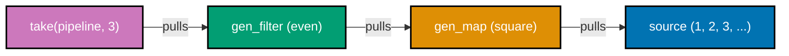

**`example.py`**

```python
"""Example 44: Generator Pull Pipeline."""

from collections.abc import Callable, Iterator  # => every function below is typed as a lazy, pull-based Iterator

computed_log: list[int] = []  # => records every value the source generator actually produced


def source() -> Iterator[int]:  # => an "infinite" source -- would hang if fully consumed eagerly
    n = 0  # => starts at 0, incremented once per pull
    while True:  # => never terminates on its own -- laziness is the only thing that makes this safe
        n += 1  # => the next candidate value
        computed_log.append(n)  # => record that this value was actually generated (proves pull, not push)
        yield n  # => PULL-based: this line only runs when something asks the generator for its next value


def gen_map(it: Iterator[int], fn: Callable[[int], int]) -> Iterator[int]:  # => lazy map: transforms values ONE AT A TIME, on demand
    for value in it:  # => pulling from `it` only happens as this generator itself is pulled from
        yield fn(value)  # => nothing is computed until a consumer asks for the next item


def gen_filter(it: Iterator[int], predicate: Callable[[int], bool]) -> Iterator[int]:  # => lazy filter: same pull-based contract
    for value in it:  # => each pull here triggers exactly one pull upstream
        if predicate(value):  # => only values passing the predicate are ever yielded downstream
            yield value  # => only yield values that pass the predicate


def take(it: Iterator[int], n: int) -> list[int]:  # => the ONLY thing that actually drives the pipeline
    result: list[int] = []  # => the concrete list being built, one pull at a time
    for value in it:  # => pulling n times cascades back through filter -> map -> source
        result.append(value)  # => record this match before checking whether we have enough yet
        if len(result) == n:  # => stop pulling the instant we have enough -- laziness in action
            break  # => no further pulls happen -- the upstream generators simply stay paused
    return result  # => exactly n items, and not one pull more than strictly needed to produce them


pipeline = gen_filter(gen_map(source(), lambda n: n * n), lambda n: n % 2 == 0)  # => squares, then evens only
result = take(pipeline, 3)  # => pull exactly 3 matching items -- nothing more

print(result)  # => squares of 1..: 1,4,9,16,25,36,... ; even ones in order: 4, 16, 36
# => Output: [4, 16, 36]
print(len(computed_log))  # => the source only ran as many times as strictly needed to produce 3 matches
# => Output: 6
```

**Run**

```shell
python3 example.py
```

**Output**

```text
[4, 16, 36]
6
```

**`test_example.py`**

```python
"""Example 44: pytest verification for Generator Pull Pipeline."""

from example import gen_filter, gen_map, source, take


def test_first_three_even_squares() -> None:
    pipeline = gen_filter(gen_map(source(), lambda n: n * n), lambda n: n % 2 == 0)
    assert take(pipeline, 3) == [4, 16, 36]  # => same result as example.py's own Output


def test_pipeline_only_pulls_as_many_source_values_as_strictly_needed() -> None:
    seen: list[int] = []  # => a fresh local counter, isolated from the module-level demo's `computed_log`

    def counting_source():
        n = 0
        while True:
            n += 1
            seen.append(n)
            yield n

    pipeline = gen_filter(gen_map(counting_source(), lambda n: n * n), lambda n: n % 2 == 0)
    take(pipeline, 1)  # => only ask for ONE matching item
    assert seen == [1, 2]  # => n=1 (square 1, odd, rejected), n=2 (square 4, even, accepted) -- then stop


# => Run: pytest -- Output: 2 passed
```

**Verify**

```shell
pytest -q
```

**Output**

```text
2 passed
```

**Key takeaway**: `computed_log` has exactly 6 entries after pulling 3 matches -- the source, an
infinite loop that would hang under eager evaluation, only ever advances as far as `take()` actually
pulls it.

**Why it matters**: this is co-10's expression-vs-statement idea taken to its logical extreme -- nothing
in this pipeline runs until something asks for a value, which is what lets an "infinite" source coexist
safely with a bounded consumer. An eager version of this same pipeline -- building the full mapped-and-filtered list before taking the first three -- would never terminate, because `source()` never stops on its own; the lazy generator chain instead computes exactly 6 values, measured directly via `computed_log`, to answer a request for 3.

---

### Example 45: Inversion of Control

_ex-45 &middot; exercises co-16_

Contrasts calling a function directly (your code drives the loop) against registering a handler with a
framework and letting `framework.run()` drive the identical loop instead.

**`example.py`**

```python
"""Example 45: Inversion of Control."""

from collections.abc import Callable  # => types the row-transforming function used in both styles


def render_report_you_call_library(rows: list[str], formatter: Callable[[str], str]) -> list[str]:  # => plain function -- callers drive it directly
    # => YOU-CALL-LIBRARY: your code drives the loop, YOU decide when to call the library function
    return [formatter(row) for row in rows]  # => your code is in charge of the control flow


class ReportFramework:  # => FRAMEWORK-CALLS-YOU: the framework owns the loop, you just supply a hook
    def __init__(self) -> None:  # => constructor starts with no handler registered yet
        self._on_row: Callable[[str], str] | None = None  # => a slot for YOUR callback

    def register(self, handler: Callable[[str], str]) -> None:  # => you hand the framework your logic
        self._on_row = handler  # => the framework stores it, does not call it yet

    def run(self, rows: list[str]) -> list[str]:  # => the framework owns this loop entirely
        assert self._on_row is not None, "must register a handler first"  # => fail loudly if nothing was registered
        return [self._on_row(row) for row in rows]  # => the FRAMEWORK calls YOUR code, not the other way


rows = ["alice", "bob"]  # => shared sample data
shout: Callable[[str], str] = lambda row: row.upper()  # noqa: E731  # => the same transformation logic in both styles

you_call_result = render_report_you_call_library(rows, shout)  # => your code drives the call
print(you_call_result)  # => both styles must produce identical output
# => Output: ['ALICE', 'BOB']

framework = ReportFramework()  # => construct the framework
framework.register(shout)  # => hand it your handler -- inversion of control: framework decides when to call it
framework_result = framework.run(rows)  # => the framework's run() loop is what actually invokes `shout`
print(framework_result)  # => must be identical to the you-call-library result
# => Output: ['ALICE', 'BOB']
print(you_call_result == framework_result)  # => confirms both control-flow styles agree
# => Output: True
```

**Run**

```shell
python3 example.py
```

**Output**

```text
['ALICE', 'BOB']
['ALICE', 'BOB']
True
```

**`test_example.py`**

```python
"""Example 45: pytest verification for Inversion of Control."""

from collections.abc import Callable

from example import ReportFramework, render_report_you_call_library


def test_you_call_library_and_framework_calls_you_agree() -> None:
    rows = ["x", "y", "z"]  # => fresh sample, isolated from the module-level demo
    handler: Callable[[str], str] = lambda row: row.upper()  # noqa: E731
    direct = render_report_you_call_library(rows, handler)  # => your code drives the loop

    framework = ReportFramework()
    framework.register(handler)  # => hand the SAME handler to the framework
    inverted = framework.run(rows)  # => the framework drives the loop this time

    assert direct == inverted == ["X", "Y", "Z"]  # => identical results, different control-flow owner


def test_framework_invokes_the_registered_handler_not_a_default() -> None:
    framework = ReportFramework()  # => fresh framework instance
    calls: list[str] = []  # => records what the registered handler actually received
    framework.register(lambda row: calls.append(row) or row)  # => a handler with a visible side effect
    framework.run(["p", "q"])  # => the framework is the one that calls it, per row
    assert calls == ["p", "q"]  # => confirms the framework actually invoked OUR handler, in order


# => Run: pytest -- Output: 2 passed
```

**Verify**

```shell
pytest -q
```

**Output**

```text
2 passed
```

**Key takeaway**: `render_report_you_call_library()` and `ReportFramework.run()` produce identical
output from the identical `shout` handler -- the only difference is which side of the call owns the
loop.

**Why it matters**: this is "inversion of control" made concrete -- in event-driven code, the framework
decides when your handler runs, based on events it observes, and you trade away control of the timeline
in exchange for not writing the loop yourself. Both styles above produce the byte-identical `['ALICE', 'BOB']` from the same `shout` handler, so the only real difference inversion of control buys is who owns the loop -- a trade web frameworks, GUI toolkits, and test runners all make deliberately, not by accident.

---

### Example 46: Declarative Config vs Setup

_ex-46 &middot; exercises co-08_

Builds an identical `Server` object two ways: step-by-step mutation after construction versus one call
reading every field from a single declared spec dict.

**`example.py`**

```python
"""Example 46: Declarative Config vs Setup."""

from dataclasses import dataclass, field  # => @dataclass generates __init__; field() gives a fresh list


@dataclass  # => auto-generates Server's __init__ from the three fields below
class Server:  # => the object both styles below must end up constructing, identically
    host: str = "localhost"  # => default value, overridden by both build functions below
    port: int = 8080  # => default value, overridden by both build functions below
    routes: list[str] = field(default_factory=list[str])  # => default: a fresh empty list per instance


def build_via_imperative_setup() -> Server:  # => HOW: step-by-step mutation after construction
    server = Server()  # => start from the defaults
    server.host = "api.example.com"  # => step 1: mutate host
    server.port = 443  # => step 2: mutate port
    server.routes.append("/health")  # => step 3: mutate routes
    server.routes.append("/users")  # => step 4: mutate routes again
    return server  # => the fully-mutated object


DECLARED_SPEC: dict[str, object] = {  # => WHAT: the desired final shape, stated as data up front
    "host": "api.example.com",  # => same value the imperative version reaches via mutation
    "port": 443,  # => same value the imperative version reaches via mutation
    "routes": ["/health", "/users"],  # => same value the imperative version reaches via two .append() calls
}  # => closes the declared spec -- one value, no steps


def build_via_declared_spec(spec: dict[str, object]) -> Server:  # => construct directly FROM the spec
    return Server(host=str(spec["host"]), port=int(spec["port"]), routes=list(spec["routes"]))  # => reads the whole desired shape from spec in one call  # type: ignore[arg-type]
    # => one call, reading the entire desired shape from a single declared value


imperative_server = build_via_imperative_setup()  # => run the step-by-step version
declarative_server = build_via_declared_spec(DECLARED_SPEC)  # => run the declared-spec version

print(imperative_server)  # => both objects must be field-for-field equal
# => Output: Server(host='api.example.com', port=443, routes=['/health', '/users'])
print(imperative_server == declarative_server)  # => dataclasses compare structurally by default
# => Output: True
```

**Run**

```shell
python3 example.py
```

**Output**

```text
Server(host='api.example.com', port=443, routes=['/health', '/users'])
True
```

**`test_example.py`**

```python
"""Example 46: pytest verification for Declarative Config vs Setup."""

from example import Server, build_via_declared_spec, build_via_imperative_setup


def test_both_construction_styles_produce_an_equal_object() -> None:
    imperative = build_via_imperative_setup()  # => step-by-step mutation
    declared = build_via_declared_spec({"host": "api.example.com", "port": 443, "routes": ["/health", "/users"]})
    assert imperative == declared  # => dataclass structural equality


def test_declared_spec_with_different_values_builds_a_different_server() -> None:
    server = build_via_declared_spec({"host": "other.example.com", "port": 80, "routes": []})
    assert server == Server(host="other.example.com", port=80, routes=[])  # => matches the given spec exactly


# => Run: pytest -- Output: 2 passed
```

**Verify**

```shell
pytest -q
```

**Output**

```text
2 passed
```

**Key takeaway**: `build_via_declared_spec()` needs no intermediate assignments -- the entire desired
shape of `Server` is already sitting in `DECLARED_SPEC` before construction even begins.

**Why it matters**: a declared spec can be validated, diffed, or serialized as data before it ever
touches an object -- a sequence of imperative mutations offers none of those properties, because "the
desired shape" only ever exists as a trail of side effects. `DECLARED_SPEC` could be dumped as JSON, checked against a schema, or diffed against yesterday's version without constructing a single `Server`; `build_via_imperative_setup()`'s four mutation steps have no equivalent snapshot to inspect until every one of them has already run.

---

### Example 47: Relational vs Nested-Loop Join

_ex-47 &middot; exercises co-19_

A `JOIN ... ON` query and a hand-written nested loop compute the identical customer/order pairing --
one declares the relationship, the other spells out the matching mechanics.

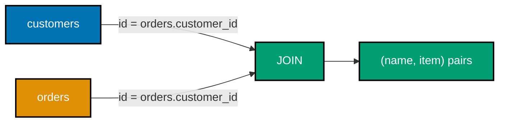

**`example.py`**

```python
"""Example 47: Relational vs Nested-Loop Join."""

import sqlite3  # => the standard library's built-in SQL engine -- no external dependency needed

customers: list[tuple[int, str]] = [(1, "alice"), (2, "bob")]  # => (customer_id, name)
orders: list[tuple[int, int, str]] = [(101, 1, "widget"), (102, 2, "gadget"), (103, 1, "gizmo")]
# => (order_id, customer_id, item)


def join_via_sql(customers: list[tuple[int, str]], orders: list[tuple[int, int, str]]) -> list[tuple[str, str]]:  # => declarative leg
    conn = sqlite3.connect(":memory:")  # => declare tables, state the join, let SQLite compute it
    conn.execute("CREATE TABLE customers (id INTEGER, name TEXT)")  # => declares the shape, no data yet
    conn.execute("CREATE TABLE orders (id INTEGER, customer_id INTEGER, item TEXT)")  # => same, for orders
    conn.executemany("INSERT INTO customers VALUES (?, ?)", customers)  # => load every customer row
    conn.executemany("INSERT INTO orders VALUES (?, ?, ?)", orders)  # => load every order row
    rows = conn.execute(  # => the query IS the join -- no accumulator variable anywhere in this function
        "SELECT customers.name, orders.item FROM customers JOIN orders ON customers.id = orders.customer_id ORDER BY orders.id"
        # => JOIN...ON declares the relationship -- no explicit loop nesting anywhere in this code
    ).fetchall()  # => the query planner decided HOW to match rows; this call only asks for the results
    conn.close()  # => release the in-memory connection
    return rows  # => list of (name, item) pairs


def join_via_nested_loop(customers: list[tuple[int, str]], orders: list[tuple[int, int, str]]) -> list[tuple[str, str]]:  # => imperative leg
    result: list[tuple[str, str]] = []  # => mutable accumulator
    for _order_id, customer_id, item in orders:  # => outer loop: every order, in insertion order
        for cid, name in customers:  # => inner loop: scan every customer looking for a match
            if cid == customer_id:  # => the join condition, written out explicitly as a comparison
                result.append((name, item))  # => explicit accumulation, one matched pair at a time
                break  # => stop scanning customers once this order's match is found
    return result  # => the fully built accumulator


sql_result = join_via_sql(customers, orders)  # => declarative version
loop_result = join_via_nested_loop(customers, orders)  # => imperative version

print(sql_result)  # => both must produce identical (name, item) pairs, in the same order
# => Output: [('alice', 'widget'), ('bob', 'gadget'), ('alice', 'gizmo')]
print(sql_result == loop_result)  # => confirms the declarative and imperative joins agree
# => Output: True
```

**Run**

```shell
python3 example.py
```

**Output**

```text
[('alice', 'widget'), ('bob', 'gadget'), ('alice', 'gizmo')]
True
```

**`test_example.py`**

```python
"""Example 47: pytest verification for Relational vs Nested-Loop Join."""

from example import join_via_nested_loop, join_via_sql


def test_sql_and_nested_loop_joins_produce_identical_rows() -> None:
    customers = [(1, "alice"), (2, "bob")]  # => same fixtures as the module-level demo
    orders = [(101, 1, "widget"), (102, 2, "gadget"), (103, 1, "gizmo")]
    assert join_via_sql(customers, orders) == join_via_nested_loop(customers, orders)


def test_an_order_with_no_matching_customer_is_dropped_by_both_joins() -> None:
    customers = [(1, "alice")]  # => only customer 1 exists
    orders = [(101, 1, "widget"), (102, 99, "orphan")]  # => order 102 references a nonexistent customer
    sql_rows = join_via_sql(customers, orders)  # => an INNER JOIN drops unmatched orders
    loop_rows = join_via_nested_loop(customers, orders)  # => the nested loop's `break` also drops it
    assert sql_rows == loop_rows == [("alice", "widget")]  # => both agree: the orphan order vanishes


# => Run: pytest -- Output: 2 passed
```

**Verify**

```shell
pytest -q
```

**Output**

```text
2 passed
```

**Key takeaway**: `JOIN orders ON customers.id = orders.customer_id` states the relationship once; the
nested loop restates it as an explicit `if cid == customer_id` check inside two levels of iteration --
both produce the identical three-row result.

**Why it matters**: SQLite's query planner is free to choose an index, a hash join, or any other
strategy behind that one `JOIN` clause; the nested loop's performance is locked into exactly the loop
structure written on the page. With a thousand customers and a thousand orders, the nested loop's O(n\*m) scan explores up to a million comparisons no matter what; SQLite can build an index on `customers.id` and turn the same declared `JOIN` into a lookup, without a single line of this file's Python changing.

---

### Example 48: Pure Core, Imperative Shell

_ex-48 &middot; exercises co-11, co-25_

`compute_invoice_total()` is a pure core tested with zero I/O; `print_invoice()` is a thin imperative
shell whose only job is to print the core's result.

**`example.py`**

```python
"""Example 48: Pure Core, Imperative Shell."""


def compute_invoice_total(unit_price: int, quantity: int, discount_pct: int) -> int:  # => the PURE CORE
    subtotal = unit_price * quantity  # => no I/O, no globals, only its own arguments
    discount = subtotal * discount_pct // 100  # => pure arithmetic
    return subtotal - discount  # => deterministic: same inputs always produce the same output
    # => this function can be tested with zero I/O, zero mocks, zero setup -- that is the whole point


def print_invoice(unit_price: int, quantity: int, discount_pct: int) -> None:  # => the IMPERATIVE SHELL
    total = compute_invoice_total(unit_price, quantity, discount_pct)  # => delegate all logic to the core
    print(f"Total: {total}")  # => the ONLY line in this file that performs I/O -- the shell's whole job
    # => the shell contains no business logic of its own -- it just wires the pure core to the outside world


print_invoice(1000, 3, 10)  # => 1000*3=3000, 10% off = 300, total 2700
# => Output: Total: 2700
```

**Run**

```shell
python3 example.py
```

**Output**

```text
Total: 2700
```

**`test_example.py`**

```python
"""Example 48: pytest verification for Pure Core, Imperative Shell."""

from example import compute_invoice_total


def test_core_is_tested_with_zero_io_and_zero_mocks() -> None:
    # => this test never touches print(), a file, or a network call -- proves the core needs no I/O
    assert compute_invoice_total(1000, 3, 10) == 2700  # => 3000 - 300


def test_core_is_deterministic_across_repeated_calls() -> None:
    first = compute_invoice_total(500, 2, 20)  # => call #1
    second = compute_invoice_total(500, 2, 20)  # => call #2, identical arguments
    assert first == second == 800  # => 1000 - 200, same both times -- no hidden state anywhere


# => Run: pytest -- Output: 2 passed
```

**Verify**

```shell
pytest -q
```

**Output**

```text
2 passed
```

**Key takeaway**: `test_core_is_tested_with_zero_io_and_zero_mocks()` genuinely never touches `print()`
-- the entire business logic (`compute_invoice_total`) is testable without a single mock.

**Why it matters**: this is co-25's boundary discipline in its cleanest form -- `print_invoice()` is
purely plumbing, and everything worth getting right lives in a function that has no side effects at all. `test_core_is_tested_with_zero_io_and_zero_mocks()` runs in microseconds and needs no test fixture beyond three integers; a shell-heavy design that mixed the discount math into `print_invoice()` itself would force every test of that math to also capture and parse printed output.

---

### Example 49: Multi-Paradigm Boundary

_ex-49 &middot; exercises co-20, co-25_

A pure functional pipeline hands its result -- an immutable tuple -- to an OO `InventoryService` across
a clean boundary; crossing it never mutates the tuple.

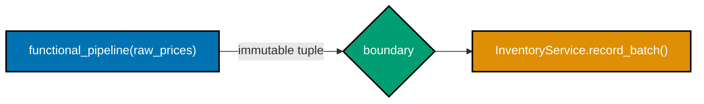

**`example.py`**

```python
"""Example 49: Multi-Paradigm Boundary."""

from dataclasses import dataclass


def functional_pipeline(raw_prices: tuple[int, ...]) -> tuple[int, ...]:  # => a pure functional pipeline
    discounted = tuple(p - (p * 10 // 100) for p in raw_prices)  # => map: apply a 10% discount
    return tuple(p for p in discounted if p > 0)  # => filter: drop non-positive prices
    # => every step returns a NEW immutable tuple -- nothing here is ever mutated in place


@dataclass  # => an OO service the pipeline hands its result to, across a clean boundary
class InventoryService:
    accepted_prices: list[int]

    def record_batch(self, prices: tuple[int, ...]) -> None:  # => the ONLY place mutation happens
        self.accepted_prices.extend(prices)  # => OO-style in-place mutation, but confined to this class


raw_prices = (100, 50, 5, 200)  # => an immutable tuple -- the functional side's input
cleaned = functional_pipeline(raw_prices)  # => pure functional processing, no mutation anywhere yet
print(cleaned)  # => 100->90, 50->45, 5->5 (5*10//100=0 discount, still positive), 200->180; nothing dropped
# => Output: (90, 45, 5, 180)

service = InventoryService(accepted_prices=[])  # => the OO side of the boundary
service.record_batch(cleaned)  # => the boundary: an immutable tuple crosses into a mutable OO object
print(service.accepted_prices)  # => confirms the OO side received exactly the functional side's output
# => Output: [90, 45, 5, 180]
print(cleaned)  # => the tuple itself is STILL untouched -- crossing the boundary never mutated it
# => Output: (90, 45, 5, 180)
```

**Run**

```shell
python3 example.py
```

**Output**

```text
(90, 45, 5, 180)
[90, 45, 5, 180]
(90, 45, 5, 180)
```

**`test_example.py`**

```python
"""Example 49: pytest verification for Multi-Paradigm Boundary."""

from example import InventoryService, functional_pipeline


def test_boundary_passes_only_immutable_data() -> None:
    cleaned = functional_pipeline((100, 50, 5, 200))  # => run the pure side
    assert isinstance(cleaned, tuple)  # => the boundary value itself is immutable

    service = InventoryService(accepted_prices=[])  # => fresh OO service
    service.record_batch(cleaned)  # => cross the boundary
    assert service.accepted_prices == [90, 45, 5, 180]  # => the OO side received the pipeline's output
    assert cleaned == (90, 45, 5, 180)  # => and the tuple itself is provably unchanged after crossing


def test_functional_side_never_mutates_its_own_input_tuple() -> None:
    raw = (10, 20)  # => a small immutable input
    functional_pipeline(raw)  # => call once, discard the result -- only checking for mutation
    assert raw == (10, 20)  # => tuples cannot be mutated in place at all, but this documents the contract


# => Run: pytest -- Output: 2 passed
```

**Verify**

```shell
pytest -q
```

**Output**

```text
2 passed
```

**Key takeaway**: `cleaned` is still `(90, 45, 5, 180)` after `service.record_batch(cleaned)` runs --
the boundary between the functional pipeline and the OO service passes an immutable value, so the OO
side's own mutation (`extend`) can never reach back into the functional side.

**Why it matters**: this is a positive example of co-25's discipline -- one paradigm per boundary, with
the immutability of the crossed value enforcing that the OO side's mutation stays contained on its own
side. Contrast this with Example 50's `MutableBucket`, where the same kind of boundary crossing corrupts the caller's own reference; here `cleaned` stays `(90, 45, 5, 180)` after crossing into `InventoryService`, because a tuple gives `record_batch()` nothing it could mutate even if it tried.

---

### Example 50: Paradigm Soup Anti-Pattern

_ex-50 &middot; exercises co-25_

Reproduces the failure mode Example 49 avoided: a "functional-looking" chain of two functions secretly
mutates a shared `MutableBucket`, corrupting the caller's own reference.

**`example.py`**

```python
"""Example 50: Paradigm Soup Anti-Pattern."""


class MutableBucket:  # => an OO object with mutable state, threaded through a nominally "functional" pipeline
    def __init__(self, items: list[int]) -> None:
        self.items = items  # => a MUTABLE list, not a tuple -- this is the seed of the bug


def add_bonus_functional_looking(bucket: MutableBucket) -> MutableBucket:  # => LOOKS like a pure map step...
    bucket.items.append(999)  # => ...but secretly MUTATES the shared list in place -- paradigm soup
    return bucket  # => returning the SAME mutated object, not a new one, is the tell


def scale_functional_looking(bucket: MutableBucket) -> MutableBucket:  # => a second "map step"
    for i in range(len(bucket.items)):  # => also mutates in place, hidden behind a function-call facade
        bucket.items[i] *= 2  # => in-place scaling
    return bucket  # => same object identity as the input -- no new value was actually created


original = MutableBucket([1, 2, 3])  # => construct the shared mutable object once
step1 = add_bonus_functional_looking(original)  # => "looks like" pipe(original, add_bonus)
step2 = scale_functional_looking(step1)  # => "looks like" pipe(step1, scale) -- chained, functional style

print(step2.items)  # => the visible chained result
# => Output: [2, 4, 6, 1998]
print(original.items)  # => THE BUG: `original` was aliased and mutated by every "pipeline" step
# => Output: [2, 4, 6, 1998]
print(original is step1 is step2)  # => all three names point at the SAME object -- no new values anywhere
# => Output: True
```

**Run**

```shell
python3 example.py
```

**Output**

```text
[2, 4, 6, 1998]
[2, 4, 6, 1998]
True
```

**`test_example.py`**

```python
"""Example 50: pytest verification for Paradigm Soup Anti-Pattern."""

from example import MutableBucket, add_bonus_functional_looking, scale_functional_looking


def test_aliasing_bug_reproduces_original_is_silently_mutated() -> None:
    original = MutableBucket([1, 2, 3])  # => fresh bucket, isolated from the module-level demo
    result = scale_functional_looking(add_bonus_functional_looking(original))  # => a "functional-looking" chain

    assert result.items == [2, 4, 6, 1998]  # => the chained result
    assert original.items == [2, 4, 6, 1998]  # => THE BUG: the "original" reference was mutated too
    assert original is result  # => same object identity -- no new value was ever produced


def test_a_true_immutable_pipeline_would_not_have_this_bug() -> None:
    original: tuple[int, ...] = (1, 2, 3)  # => the honest functional fix: use an immutable tuple instead
    bonus = original + (999,)  # => a genuinely NEW tuple, original untouched
    scaled = tuple(n * 2 for n in bonus)  # => another genuinely NEW tuple
    assert original == (1, 2, 3)  # => the true-functional version never mutates the original at all
    assert scaled == (2, 4, 6, 1998)  # => and still produces the identical final values


# => Run: pytest -- Output: 2 passed
```

**Verify**

```shell
pytest -q
```

**Output**

```text
2 passed
```

**Key takeaway**: `original is step1 is step2` is `True` -- the "pipeline" never produced a single new
value; every step silently mutated the same shared object, so the caller's own `original` reference was
corrupted without their knowledge.

**Why it matters**: this is co-25's warning label made concrete -- code that merely LOOKS functional
(chained calls, no visible loop) can still collect every cost of shared mutable state if the guarantee
"this value can't be mutated" is only cosmetic. The fix in `test_a_true_immutable_pipeline_would_not_have_this_bug()` needs only one change -- swap `MutableBucket`'s `list` for a `tuple`, the same substitution Example 49 makes from the start -- to eliminate the aliasing bug entirely, without touching either function's own logic.

---

### Example 51: Logic vs Imperative Reachability

_ex-51 &middot; exercises co-01, co-13_

A cyclic graph's reachable set is computed two ways: a logic-flavored fixed-point inference and an
explicit BFS -- both must correctly include the cycle's own origin node.

**`example.py`**

```python
"""Example 51: Logic vs Imperative Reachability."""

from collections import deque  # => deque gives O(1) popleft(), the BFS queue's core operation

edges: dict[str, list[str]] = {  # => a directed graph, shared by both approaches below
    "a": ["b", "c"],  # => a points to b and c
    "b": ["d"],  # => b points to d
    "c": [],  # => c has no outgoing edges
    "d": ["a"],  # => a cycle back to "a" -- both approaches must handle this without looping forever
    "e": [],  # => an unreachable, isolated node
}  # => closes the shared graph declaration


def reachable_via_inference(start: str, edges: dict[str, list[str]]) -> set[str]:  # => LOGIC-flavored
    # => rule: reachable(X, Y) :- edge(X, Y).  reachable(X, Z) :- edge(X, Y), reachable(Y, Z).
    known: set[str] = set()  # => the set of facts inferred so far (a fixed-point computation)
    frontier = set(edges.get(start, []))  # => seed with everything directly reachable via one edge
    while frontier - known:  # => keep inferring new facts until nothing new can be derived (fixed point)
        newly_known = frontier - known  # => facts inferred in THIS round that weren't already known
        known |= newly_known  # => add them to the known set
        frontier = known | {y for x in newly_known for y in edges.get(x, [])}  # => derive one more hop
    return known  # => the full set of inferred "reachable" facts


def reachable_via_bfs(start: str, edges: dict[str, list[str]]) -> set[str]:  # => IMPERATIVE: explicit BFS
    visited: set[str] = set()  # => mutable set, built up by explicit traversal
    queue: deque[str] = deque(edges.get(start, []))  # => explicit FIFO work queue
    while queue:  # => explicit loop draining the queue
        node = queue.popleft()  # => explicit dequeue
        if node in visited:  # => explicit cycle guard
            continue  # => skip re-processing an already-visited node -- prevents the cycle from looping forever
        visited.add(node)  # => explicit mutation
        queue.extend(edges.get(node, []))  # => explicit enqueue of newly discovered neighbors
    return visited  # => the fully built set


inference_result = reachable_via_inference("a", edges)  # => run the logic-flavored version
bfs_result = reachable_via_bfs("a", edges)  # => run the imperative version

print(sorted(inference_result))  # => a -> b,c; b -> d; d -> a: the cycle makes "a" reachable from itself too
# => Output: ['a', 'b', 'c', 'd']
print(inference_result == bfs_result)  # => both must compute the identical reachable set
# => Output: True
```

**Run**

```shell
python3 example.py
```

**Output**

```text
['a', 'b', 'c', 'd']
True
```

**`test_example.py`**

```python
"""Example 51: pytest verification for Logic vs Imperative Reachability."""

from example import reachable_via_bfs, reachable_via_inference


def test_both_approaches_agree_on_a_cyclic_graph() -> None:
    edges = {"a": ["b", "c"], "b": ["d"], "c": [], "d": ["a"], "e": []}  # => same graph as the demo
    # => the a->b->d->a cycle makes "a" reachable from itself -- both approaches must agree it's included
    assert reachable_via_inference("a", edges) == reachable_via_bfs("a", edges) == {"a", "b", "c", "d"}


def test_isolated_node_reaches_nothing_in_both_approaches() -> None:
    edges = {"a": ["b", "c"], "b": ["d"], "c": [], "d": ["a"], "e": []}  # => same graph
    assert reachable_via_inference("e", edges) == reachable_via_bfs("e", edges) == set()


# => Run: pytest -- Output: 2 passed
```

**Verify**

```shell
pytest -q
```

**Output**

```text
2 passed
```

**Key takeaway**: because `a -> b -> d -> a` is a cycle, `"a"` itself ends up in its own reachable set --
both the fixed-point inference and the explicit BFS agree on `{'a', 'b', 'c', 'd'}`, including the origin.

**Why it matters**: `reachable_via_inference()` keeps deriving new facts until a fixed point (no new
facts can be inferred) rather than draining an explicit queue -- the same underlying search, described
two different ways. Both approaches must handle the `a -> b -> d -> a` cycle without looping forever -- the BFS version guards with an explicit `if node in visited: continue`, while the inference version's `while frontier - known:` condition naturally stops once no new fact can be derived, a subtler but equally solid termination guarantee.

---

### Example 52: Match-Case ADT Dispatch

_ex-52 &middot; exercises co-08, co-09_

Three frozen dataclasses form a sum type (`Shape = Circle | Rectangle | Triangle`), and `match`/`case`
destructures the active variant's fields directly, with no `isinstance` chain.

**`example.py`**

```python
"""Example 52: Match-Case ADT Dispatch."""

from dataclasses import dataclass  # => @dataclass auto-generates __init__ for each variant below


@dataclass(frozen=True)  # => variant #1 of the sum type
class Circle:  # => frozen=True makes every instance immutable, safe to pattern-match against
    radius: float  # => the one field match/case can destructure below


@dataclass(frozen=True)  # => variant #2 of the sum type
class Rectangle:  # => frozen=True makes every instance immutable, safe to pattern-match against
    width: float  # => one of the two fields match/case can destructure below
    height: float  # => the other field match/case can destructure below


@dataclass(frozen=True)  # => variant #3 of the sum type
class Triangle:  # => frozen=True makes every instance immutable, safe to pattern-match against
    base: float  # => one of the two fields match/case can destructure below
    height: float  # => the other field match/case can destructure below


Shape = Circle | Rectangle | Triangle  # => the SUM TYPE: a value is exactly one of these three variants


def area(shape: Shape) -> float:  # => match/case destructures the ACTIVE variant, no isinstance chain
    match shape:  # => structural pattern matching over a union of dataclasses (PEP 634)
        case Circle(radius=r):  # => matches ONLY if shape is a Circle, binds its field to `r`
            return 3.14159 * r * r  # => classic circle-area formula, using the bound radius
        case Rectangle(width=w, height=h):  # => matches ONLY if shape is a Rectangle
            return w * h  # => classic rectangle-area formula, using the bound width and height
        case Triangle(base=b, height=h):  # => matches ONLY if shape is a Triangle
            return 0.5 * b * h  # => classic triangle-area formula, using the bound base and height
        # => no wildcard case: Shape's three variants are exhaustive, every possibility is handled


shapes: list[Shape] = [Circle(2.0), Rectangle(3.0, 4.0), Triangle(5.0, 6.0)]  # => one of each variant
areas = [round(area(s), 2) for s in shapes]  # => dispatch each shape to its own matching case
print(areas)  # => pi*4, 12, 15
# => Output: [12.57, 12.0, 15.0]
```

**Run**

```shell
python3 example.py
```

**Output**

```text
[12.57, 12.0, 15.0]
```

**`test_example.py`**

```python
"""Example 52: pytest verification for Match-Case ADT Dispatch."""

from example import Circle, Rectangle, Triangle, area


def test_every_variant_is_handled_by_its_own_case() -> None:
    assert round(area(Circle(2.0)), 2) == 12.57  # => circle variant
    assert area(Rectangle(3.0, 4.0)) == 12.0  # => rectangle variant
    assert area(Triangle(5.0, 6.0)) == 15.0  # => triangle variant


def test_dispatch_is_purely_structural_not_by_an_explicit_tag_field() -> None:
    shapes: list[Circle | Rectangle | Triangle] = [Rectangle(1.0, 1.0), Circle(1.0)]  # => mixed order
    areas = [round(area(s), 2) for s in shapes]  # => each dispatched to the correct case regardless of order
    assert areas == [1.0, 3.14]


# => Run: pytest -- Output: 2 passed
```

**Verify**

```shell
pytest -q
```

**Output**

```text
2 passed
```

**Key takeaway**: `case Circle(radius=r):` matches AND destructures in one step -- no `isinstance(shape,
Circle)` check followed by a separate `shape.radius` access anywhere in `area()`.

**Why it matters**: Example 27 dispatched on an explicit `"kind"` tag with meaning known only inside one
function; here the dispatch is purely structural -- the shape of the value itself decides which case
runs, and adding a fourth variant would need a fourth `case`, caught by exhaustiveness tooling if one is
missed.

---

### Example 53: Enum State Tags

_ex-53 &middot; exercises co-04_

A traffic light modeled as a plain `enum.Enum` with a declared `TRANSITIONS` table, instead of raw
strings compared by value.

**`example.py`**

```python
"""Example 53: Enum State Tags."""

from enum import Enum  # => plain enum.Enum, not StrEnum -- keeps this example runnable on Python 3.10+


class LightState(Enum):  # => models states as a closed, named set of tags -- not raw strings
    RED = "red"  # => each member pairs a name with a value
    YELLOW = "yellow"  # => same shape as RED, a distinct named tag
    GREEN = "green"  # => same shape as RED, a distinct named tag


TRANSITIONS: dict[LightState, LightState] = {  # => the full transition table, declared as data
    LightState.RED: LightState.GREEN,  # => red -> green
    LightState.GREEN: LightState.YELLOW,  # => green -> yellow
    LightState.YELLOW: LightState.RED,  # => yellow -> red, completing the cycle
}  # => closes the transition table -- every LightState member has exactly one outgoing edge


def next_state(current: LightState) -> LightState:  # => dispatch a transition by looking up the tag
    return TRANSITIONS[current]  # => a KeyError here would mean an unmodeled state -- fails loudly, not silently


state = LightState.RED  # => start at RED
history = [state]  # => record every state visited
# => the tag never leaks into raw string comparisons anywhere in this file
for _ in range(4):  # => cycle through a full loop and then some, to prove it repeats correctly
    state = next_state(state)  # => rebind to the next tag via the transition table lookup
    history.append(state)  # => record this step before moving to the next iteration

print([s.value for s in history])  # => red -> green -> yellow -> red -> green
# => Output: ['red', 'green', 'yellow', 'red', 'green']
```

**Run**

```shell
python3 example.py
```

**Output**

```text
['red', 'green', 'yellow', 'red', 'green']
```

**`test_example.py`**

```python
"""Example 53: pytest verification for Enum State Tags."""

from example import LightState, next_state


def test_full_transition_cycle_returns_to_the_start() -> None:
    state = LightState.RED  # => start fresh, isolated from the module-level demo
    for _ in range(3):  # => a full red -> green -> yellow -> red cycle
        state = next_state(state)
    assert state == LightState.RED  # => back where we started after exactly three transitions


def test_every_state_has_a_defined_next_state() -> None:
    for member in LightState:  # => iterate every enum member -- proves the table is total, not partial
        assert next_state(member) in LightState  # => must resolve to some valid member, never KeyError


# => Run: pytest -- Output: 2 passed
```

**Verify**

```shell
pytest -q
```

**Output**

```text
2 passed
```

**Key takeaway**: `TRANSITIONS` is total over `LightState` -- every member has a defined next state, so
`next_state()` can never silently accept a typo'd string the way a raw-string comparison could.

**Why it matters**: a closed enum plus a declared transition table is a lightweight version of the State
pattern from Example 34, trading dispatch-via-object-polymorphism for dispatch-via-dictionary-lookup. A raw string like "red" could be misspelled as "Red" or "redd" with no error until runtime; `LightState.RED` fails immediately at the point of the typo, since Python resolves enum member access at attribute-lookup time, not string-comparison time, catching the mistake far earlier than a string-tagged version would.

---

### Example 54: Declarative Validation Rules

_ex-54 &middot; exercises co-08_

A validation policy is stated as a list of `Rule` data records, and `validate()` evaluates them in
order, reporting exactly which declared rule failed.

**`example.py`**

```python
"""Example 54: Declarative Validation Rules."""

from collections.abc import Callable, Mapping  # => types the check function every Rule below carries
from dataclasses import dataclass  # => @dataclass generates Rule's __init__ from its two fields


@dataclass(frozen=True)  # => each rule is a plain DATA record: a name plus a check function
class Rule:  # => frozen=True makes every Rule immutable once constructed
    name: str  # => the label reported when this rule fails
    check: Callable[[Mapping[str, object]], bool]  # => returns True if the input satisfies this rule


RULES: list[Rule] = [  # => the whole validation policy STATED as a list of data, not a chain of ifs
    Rule("has_email", lambda data: "email" in data),  # => rule #1: the key must be present at all
    Rule("email_has_at_sign", lambda data: "@" in str(data.get("email", ""))),  # => rule #2: crude shape check
    Rule("age_is_non_negative", lambda data: int(data.get("age", 0)) >= 0),  # => rule #3: a range constraint  # type: ignore[call-overload]
]  # => closes the declared policy -- adding a rule means appending one more line here


def validate(data: Mapping[str, object]) -> str | None:  # => evaluate the rule list declaratively
    for rule in RULES:  # => walk the declared rules in order
        if not rule.check(data):  # => the first rule that fails IS the answer
            return rule.name  # => report exactly which declared rule was violated
    return None  # => every declared rule passed


good_input = {"email": "a@example.com", "age": 30}  # => passes every rule
bad_input = {"email": "not-an-email", "age": 30}  # => fails the second rule specifically

print(validate(good_input))  # => no rule failed
# => Output: None
print(validate(bad_input))  # => names the exact failing rule
# => Output: email_has_at_sign
```

**Run**

```shell
python3 example.py
```

**Output**

```text
None
email_has_at_sign
```

**`test_example.py`**

```python
"""Example 54: pytest verification for Declarative Validation Rules."""

from example import validate


def test_input_satisfying_every_rule_passes() -> None:
    assert validate({"email": "a@example.com", "age": 30}) is None  # => no declared rule was violated


def test_bad_input_is_flagged_with_the_specific_failing_rule() -> None:
    assert validate({"email": "not-an-email", "age": 30}) == "email_has_at_sign"  # => names the exact rule
    assert validate({"age": 30}) == "has_email"  # => a different missing-field failure names a different rule


# => Run: pytest -- Output: 2 passed
```

**Verify**

```shell
pytest -q
```

**Output**

```text
2 passed
```

**Key takeaway**: `RULES` is a plain list of `Rule(name, check)` records -- adding, removing, or
reordering a validation rule never touches `validate()`'s own logic at all.

**Why it matters**: this is co-08's declarative style scaled to a real validation policy -- the policy
itself is data that could be logged, tested per-rule, or even loaded from configuration, none of which a
hard-coded `if`/`elif` chain of checks offers as naturally. Each `Rule` in `RULES` can also be unit-tested in isolation by calling its own `check` lambda directly, without invoking `validate()` at all -- a granularity an equivalent `if`/`elif` chain does not offer, since its individual conditions are not separately addressable values.

---

### Example 55: Event Bus Pub/Sub

_ex-55 &middot; exercises co-16, co-17_

A typed `EventBus` notifies every subscriber to a topic, independently -- two subscribers to the same
`"order.created"` topic each receive their own copy of the published payload.

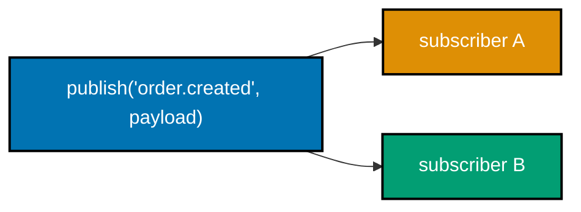

**`example.py`**

```python
"""Example 55: Event Bus Pub/Sub."""

from collections.abc import Callable  # => types every subscriber handler stored below
from dataclasses import dataclass, field  # => @dataclass generates __init__; field() gives a fresh dict
from typing import TypeVar  # => used to declare the generic payload type below

T = TypeVar("T")  # => generic payload type, so the bus is reusable for any event shape


@dataclass  # => auto-generates EventBus's __init__ from the field below
class EventBus:  # => a TYPED publish/subscribe bus: multiple subscribers per topic
    _subscribers: dict[str, list[Callable[[object], None]]] = field(default_factory=dict[str, list[Callable[[object], None]]])  # => topic -> handlers, one fresh dict per instance

    def subscribe(self, topic: str, handler: Callable[[object], None]) -> None:  # => register a subscriber
        self._subscribers.setdefault(topic, []).append(handler)  # => topics may have MANY subscribers

    def publish(self, topic: str, payload: object) -> None:  # => notify every subscriber to this topic
        for handler in self._subscribers.get(topic, []):  # => every registered handler gets a turn
            handler(payload)  # => called with the exact payload passed to publish()


bus = EventBus()  # => construct a fresh bus
seen_by_a: list[object] = []  # => subscriber A's own recorder
seen_by_b: list[object] = []  # => subscriber B's own, independent recorder

bus.subscribe("order.created", lambda payload: seen_by_a.append(payload))  # => subscriber A
bus.subscribe("order.created", lambda payload: seen_by_b.append(payload))  # => subscriber B, same topic

bus.publish("order.created", {"id": 1})  # => BOTH subscribers must be notified once each
print(seen_by_a)  # => A saw the payload
# => Output: [{'id': 1}]
print(seen_by_b)  # => B saw the SAME payload, independently
# => Output: [{'id': 1}]
```

**Run**

```shell
python3 example.py
```

**Output**

```text
[{'id': 1}]
[{'id': 1}]
```

**`test_example.py`**

```python
"""Example 55: pytest verification for Event Bus Pub/Sub."""

from example import EventBus


def test_all_subscribers_notified_exactly_once_each() -> None:
    bus = EventBus()  # => fresh bus, isolated from the module-level demo
    counts = {"a": 0, "b": 0, "c": 0}  # => local recorder for three subscribers
    bus.subscribe("topic", lambda payload: counts.__setitem__("a", counts["a"] + 1))
    bus.subscribe("topic", lambda payload: counts.__setitem__("b", counts["b"] + 1))
    bus.subscribe("topic", lambda payload: counts.__setitem__("c", counts["c"] + 1))
    bus.publish("topic", {"x": 1})  # => publish exactly once
    assert counts == {"a": 1, "b": 1, "c": 1}  # => every subscriber fired exactly once


def test_subscribers_on_a_different_topic_are_not_notified() -> None:
    bus = EventBus()  # => fresh bus
    seen: list[object] = []  # => local recorder
    bus.subscribe("topic.a", lambda payload: seen.append(payload))  # => subscribed to topic.a only
    bus.publish("topic.b", {"unrelated": True})  # => publish to a DIFFERENT topic
    assert seen == []  # => the topic.a subscriber was never called


# => Run: pytest -- Output: 2 passed
```

**Verify**

```shell
pytest -q
```

**Output**

```text
2 passed
```

**Key takeaway**: `seen_by_a` and `seen_by_b` both end up holding `[{'id': 1}]` after one `publish()`
call -- pub/sub fans a single event out to every interested party, each of whom reacts independently.

**Why it matters**: Example 16's `Dispatcher` supported multiple handlers per event too, but naming it
as a "bus" with named topics is the pattern most real message queues and GUI event systems are built
on, one level up from a single dispatcher. `seen_by_a` and `seen_by_b` each independently hold the identical `[{'id': 1}]` after one `publish()` call, proving the bus fans out to every registered subscriber rather than picking just one -- the structural guarantee that distinguishes pub/sub from Example 16's single-topic dispatch.

---

### Example 56: Reactive Debounce

_ex-56 &middot; exercises co-17_

A `DebouncedStream` collapses a burst of rapid `push()` calls into just the last value, delivered only
when `flush()` fires.

**`example.py`**

```python
"""Example 56: Reactive Debounce."""

from collections.abc import Callable  # => types every downstream subscriber callback stored below


class DebouncedStream:  # => a stream operator: collapses a burst of pushes into just the LAST value
    def __init__(self) -> None:  # => constructor starts with no pending value and no subscribers
        self._pending: int | None = None  # => the most recent value pushed during the current burst
        self._downstream: list[Callable[[int], None]] = []  # => subscribers who only want the final value

    def subscribe(self, fn: Callable[[int], None]) -> None:  # => register a downstream listener
        self._downstream.append(fn)  # => append only -- does NOT call fn with anything yet

    def push(self, value: int) -> None:  # => called for every value in a burst -- does NOT notify yet
        self._pending = value  # => overwrite: only the latest value survives a burst

    def flush(self) -> None:  # => simulates "the debounce timer fired" -- deliver the last pending value
        if self._pending is not None:  # => only deliver if something was actually pushed since last flush
            for fn in self._downstream:  # => notify every subscriber with the FINAL value only
                fn(self._pending)  # => intermediate values 1 and 2 are never delivered to anyone
            self._pending = None  # => reset for the next burst


delivered: list[int] = []  # => records what downstream actually received
stream = DebouncedStream()  # => construct
stream.subscribe(lambda v: delivered.append(v))  # => subscribe once

stream.push(1)  # => burst: three rapid pushes
stream.push(2)  # => intermediate values during a burst are NEVER delivered on their own
stream.push(3)  # => only the last one, 3, matters
print(delivered)  # => nothing delivered yet -- the burst hasn't been flushed
# => Output: []

stream.flush()  # => the debounce timer "fires" -- only the LAST pushed value (3) reaches downstream
print(delivered)  # => exactly one delivery, and it is the final value of the burst
# => Output: [3]
```

**Run**

```shell
python3 example.py
```

**Output**

```text
[]
[3]
```

**`test_example.py`**

```python
"""Example 56: pytest verification for Reactive Debounce."""

from example import DebouncedStream


def test_only_the_final_value_of_a_burst_is_delivered() -> None:
    stream = DebouncedStream()  # => fresh stream, isolated from the module-level demo
    delivered: list[int] = []  # => local recorder
    stream.subscribe(lambda v: delivered.append(v))
    for v in (10, 20, 30, 40):  # => a burst of four rapid pushes
        stream.push(v)
    assert delivered == []  # => nothing delivered mid-burst
    stream.flush()  # => the burst ends
    assert delivered == [40]  # => only the final value survives


def test_a_second_burst_after_flush_delivers_its_own_final_value() -> None:
    stream = DebouncedStream()  # => fresh stream
    delivered: list[int] = []  # => local recorder
    stream.subscribe(lambda v: delivered.append(v))
    stream.push(1)
    stream.flush()  # => first burst delivers 1
    stream.push(99)
    stream.push(100)
    stream.flush()  # => second burst delivers only its own final value
    assert delivered == [1, 100]  # => two independent flushes, each keeping only its burst's last value


# => Run: pytest -- Output: 2 passed
```

**Verify**

```shell
pytest -q
```

**Output**

```text
2 passed
```

**Key takeaway**: `delivered` is empty after three `push()` calls and gains exactly one entry -- `3` --
after `flush()`; the intermediate `1` and `2` never reach a subscriber at all.

**Why it matters**: debouncing is a stream OPERATOR, not just a primitive value -- it demonstrates that
reactive systems compose (a raw `Signal` from Example 17 could sit behind this debounce, and a
`Computed` from Example 41 could sit downstream of it). `delivered` stays empty through all three `push()` calls and gains exactly the value `3`, not `1` or `2`, once `flush()` runs -- a measurable guarantee that a naive push-through-immediately reactive design (like Example 17's `ObservableValue`) would violate by delivering all three intermediate values.

---

### Example 57: Dataflow Memoized Nodes

_ex-57 &middot; exercises co-18_

A `Node` caches its computed value and tracks a `_dirty` flag, so invalidating an unrelated subtree
never triggers a wasted recompute of an unchanged node.

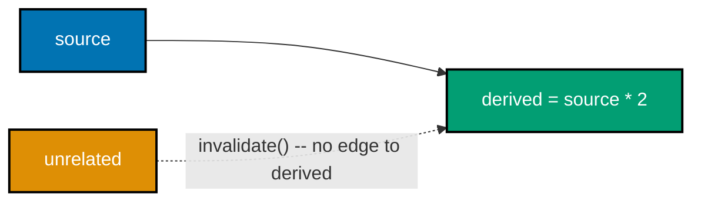

**`example.py`**

```python
"""Example 57: Dataflow Memoized Nodes."""

from collections.abc import Callable


class Node:  # => a dataflow graph node that caches its output and tracks whether it's stale
    def __init__(self, compute: Callable[[], int], *deps: "Node") -> None:
        self._compute = compute  # => this node's own recompute rule
        self._deps = deps  # => the nodes this node depends on
        self._dirty = True  # => starts dirty -- nothing has been computed yet
        self._cache: int | None = None  # => the memoized result, once computed
        self.compute_count = 0  # => counts ACTUAL recomputations -- proves memoization is working

    def invalidate(self) -> None:  # => mark this node (and implicitly its dependents) as needing recompute
        self._dirty = True  # => the cache is no longer trustworthy

    def value(self) -> int:  # => read the node's value, recomputing ONLY if dirty
        if self._dirty:  # => only recompute when something actually changed
            self._cache = self._compute()  # => run the rule
            self.compute_count += 1  # => record that a real recomputation happened
            self._dirty = False  # => the cache is fresh again
        return self._cache  # type: ignore[return-value]  # => guaranteed set after the branch above


source = Node(lambda: 5)  # => a source node with no dependencies
unrelated = Node(lambda: 100)  # => a SECOND, unrelated source node -- its own subtree
derived = Node(lambda: source.value() * 2, source)  # => depends only on `source`, NOT on `unrelated`

print(derived.value(), derived.compute_count)  # => first read: computes once
# => Output: 10 1
print(derived.value(), derived.compute_count)  # => second read: cache hit, no recompute
# => Output: 10 1

unrelated.invalidate()  # => invalidate the UNRELATED subtree only
print(derived.value(), derived.compute_count)  # => derived's own cache is untouched -- still 1, not 2
# => Output: 10 1
```

**Run**

```shell
python3 example.py
```

**Output**

```text
10 1
10 1
10 1
```

**`test_example.py`**

```python
"""Example 57: pytest verification for Dataflow Memoized Nodes."""

from example import Node


def test_repeated_reads_do_not_recompute_an_unchanged_node() -> None:
    node = Node(lambda: 42)  # => fresh node, isolated from the module-level demo
    node.value()  # => first read: real computation
    node.value()  # => second read: should be a cache hit
    node.value()  # => third read: should also be a cache hit
    assert node.compute_count == 1  # => exactly one real recomputation across three reads


def test_invalidating_an_unrelated_subtree_never_recomputes_this_node() -> None:
    source = Node(lambda: 5)  # => fresh source
    other = Node(lambda: 1)  # => a completely separate, unrelated node
    derived = Node(lambda: source.value() + 1, source)  # => depends only on `source`
    derived.value()  # => compute once
    other.invalidate()  # => invalidate the unrelated node
    derived.value()  # => read again
    assert derived.compute_count == 1  # => still just one recompute -- the unchanged subtree was skipped


# => Run: pytest -- Output: 2 passed
```

**Verify**

```shell
pytest -q
```

**Output**

```text
2 passed
```

**Key takeaway**: `derived.compute_count` stays at 1 across three reads and one unrelated invalidation --
memoization skips recomputation entirely when nothing this node actually depends on has changed.

**Why it matters**: this is co-18's payoff stated as a measured guarantee rather than a claim --
expressing a computation as an explicit dependency graph lets a scheduler skip work with confidence,
because "unrelated" is a structural fact the graph itself can prove. `derived.compute_count` staying at
exactly 1 across three reads and one unrelated invalidation is a directly measured number, not an
assumption -- without the explicit `_deps` graph recording that `derived` only depends on `source`, a
scheduler would have no structural basis for skipping the recompute safely.

---

### Example 58: Paradigm Cost Table

_ex-58 &middot; exercises co-23, co-24_

Measures -- not guesses -- the cost difference between the imperative and declarative versions of
Example 9's task, via `inspect.getsource()` line counts and `__code__.co_nlocals` local-name counts.

**`example.py`**

```python
"""Example 58: Paradigm Cost Table."""

import inspect  # => inspect.getsource() reads a function's own source text, used by count_lines() below
from collections.abc import Callable  # => types the plain-function argument shared by both metric helpers below


def evens_squared_imperative(nums: list[int]) -> list[int]:  # => same task as example 9, measured here
    result: list[int] = []  # => mutable accumulator -- one extra local name declarative avoids
    for n in nums:  # => explicit iteration over every input number
        if n % 2 == 0:  # => explicit selection: keep only even numbers
            result.append(n * n)  # => explicit mutate-in-place append of the squared value
    return result  # => the fully built accumulator


def evens_squared_declarative(nums: list[int]) -> list[int]:  # => the declarative twin, measured here too
    return [n * n for n in nums if n % 2 == 0]  # => the same result, no named accumulator anywhere


def count_lines(fn: Callable[..., object]) -> int:  # => a concrete, reproducible metric: physical lines of the function's body
    return len(inspect.getsource(fn).strip().splitlines())  # => counts every line, def line included


def count_local_names(fn: Callable[..., object]) -> int:  # => a second concrete metric: how many local variable names the body binds
    code = fn.__code__  # => plain functions always carry __code__, pyright resolves it on Callable[..., object]
    return code.co_nlocals - len(code.co_varnames[: code.co_argcount])  # => locals minus params
    # => co_nlocals counts every local slot; subtracting the parameters leaves ONLY the names the body itself
    # => introduces -- both versions need the loop variable `n`, but only imperative ALSO needs a separate
    # => named accumulator (`result`) to collect results across iterations, one extra name declarative avoids


rows: list[tuple[str, int, int]] = [  # => the comparison table, built from ACTUAL measurements, not opinion
    ("imperative", count_lines(evens_squared_imperative), count_local_names(evens_squared_imperative)),  # => row 1
    ("declarative", count_lines(evens_squared_declarative), count_local_names(evens_squared_declarative)),  # => row 2
]  # => closes the measured comparison table

for name, lines, local_names in rows:  # => print the table, one row per paradigm
    print(f"{name}: lines={lines} local_names={local_names}")  # => the measured numbers, not an opinion
# => Output: imperative: lines=6 local_names=2
# => Output: declarative: lines=2 local_names=1

same_result = evens_squared_imperative([1, 2, 3, 4]) == evens_squared_declarative([1, 2, 3, 4])  # => equivalence check
print(same_result)  # => the cost comparison is only meaningful because both versions are provably equivalent
# => Output: True
```

**Run**

```shell
python3 example.py
```

**Output**

```text
imperative: lines=6 local_names=2
declarative: lines=2 local_names=1
True
```

**`test_example.py`**

```python
"""Example 58: pytest verification for Paradigm Cost Table."""

from example import count_lines, count_local_names, evens_squared_declarative, evens_squared_imperative


def test_declarative_version_measures_fewer_lines_and_local_names() -> None:
    imperative_lines = count_lines(evens_squared_imperative)  # => real measurement, not a guess
    declarative_lines = count_lines(evens_squared_declarative)  # => real measurement of the other version
    assert declarative_lines < imperative_lines  # => the concrete metric this example's claim rests on

    imperative_names = count_local_names(evens_squared_imperative)
    declarative_names = count_local_names(evens_squared_declarative)
    assert declarative_names < imperative_names  # => declarative never introduces a named accumulator


def test_both_measured_versions_are_still_behaviorally_equivalent() -> None:
    nums = [1, 2, 3, 4, 5, 6]  # => a cost comparison is meaningless if the versions disagree
    assert evens_squared_imperative(nums) == evens_squared_declarative(nums) == [4, 16, 36]


# => Run: pytest -- Output: 2 passed
```

**Verify**

```shell
pytest -q
```

**Output**

```text
2 passed
```

**Key takeaway**: `count_lines()` and `count_local_names()` are real introspection, not opinion --
`evens_squared_declarative` measures fewer lines (2 vs 6) and one fewer local name than its imperative
twin, for the identical result.

**Why it matters**: co-24's cost/benefit framing only means something when the cost is measured, not
asserted -- this example is the topic's methodology demonstrated on the smallest possible case before
Example 66's fuller decision table applies the same discipline more broadly. The measured numbers here --
6 lines and 2 local names for the imperative version versus 2 lines and 1 local name for the declarative
one -- are read directly off `inspect.getsource()` and `__code__.co_nlocals`, not estimated, which is
exactly the discipline co-24 asks for before declaring one paradigm "better" than another.
