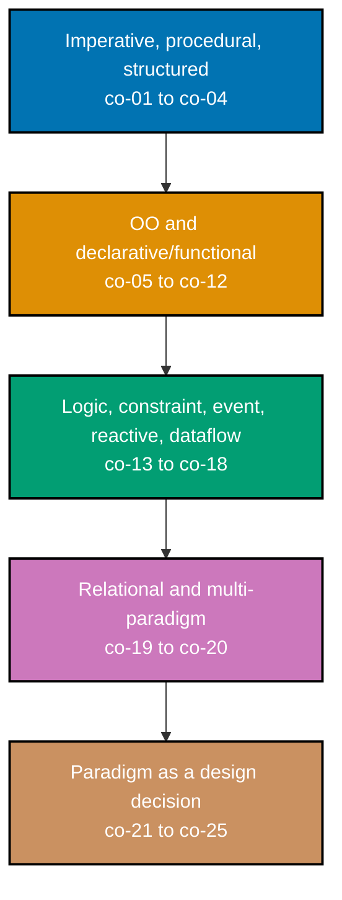

## Prerequisites

- **Prior topics**: [4 · Just Enough Python](../../just-enough-python/learning/overview.md) covers the
  base language syntax used throughout; [8 · Object-Oriented Programming Essentials](../../object-oriented-programming-essentials/learning/overview.md)
  covers the OO mechanics this topic's OO examples assume. Topic 21, Object-Oriented Design & Patterns,
  deepens the OO paradigm specifically and is a natural companion read, though this topic does not
  require it. Functional style is cross-referenced forward to a dedicated deep-dive topic, Functional
  Programming, later in this journey -- nothing here requires reading that first.
- **Tools & environment**: a macOS/Linux terminal; **Python 3.13.12**; `pytest` (9.1.1) installed for
  running every example's locking test. Every `example.py` in this topic is fully type-annotated
  (PEP 484): parameters, return types, and non-obvious local variables all carry explicit type hints.
  Illustrative snippets in other languages, where the topic calls for one, are shown read-only -- no
  extra toolchain is required to follow them.
- **Assumed knowledge**: comfortable writing Python in both procedural and OO styles; can read a small
  snippet in an unfamiliar language with explanation.

## Why this exists -- the big idea

**The problem before the solution**: most engineers default to one paradigm and bend every problem to
it -- the wrong paradigm makes easy problems hard and hides the shape the problem actually has. **Keep
this if you forget everything else**: a paradigm is a set of _constraints that buy a property_ (purity
buys reasoning, objects buy encapsulation, logic buys search) -- match the problem's grain, don't fight
it.

**Cross-cutting big ideas**: `abstraction-and-its-cost` -- each paradigm is a lens with a bill attached;
choosing one always trades something away. `taming-state` -- paradigms differ most in how they treat
mutable state (co-22 is the real fault line running under every other concept below).

**Scope note**: this topic is a **survey** of the major paradigms and how to choose among them, anchored
in Python with other languages shown illustratively. It teaches fluency in _matching paradigm to
problem_, not mastery of any single paradigm in depth -- functional programming gets its own deep topic
later in this journey, and the concurrency-oriented paradigms (CSP, actors) deepen in a later pass.

## How verification works in this topic

Every one of this topic's 80 worked examples is a complete, self-contained `example.py` colocated under
`learning/code/ex-NN-slug/`, runnable in isolation with `python3 example.py` -- its expected output is
shown two ways: inline, as a `# => Output: ...` comment directly beneath the `print()` call that
produces it, and as a captured, verbatim `python3 example.py` run in this page's **Output** block. Every
example also ships a colocated `test_example.py`, verified with `pytest -q` and shown the same way.
Nothing on the following pages is a description of what Python "should" do -- every claim was
independently run against Python 3.13.12, and every code/test pair is fully type-annotated by hand.

## Concepts

Every worked example in this topic's follow-up pages cites the `co-NN` concept it exercises -- this
section is the 1:1 reference those citations point back to. Read it in order: the imperative/procedural
foundation first, then the OO and declarative/functional contrast, then the less-common paradigms
(logic, constraint, event-driven, reactive, dataflow), then relational thinking and multi-paradigm
languages, and finally the meta-skills that tie the whole topic together -- treating paradigm choice
itself as a design decision with real trade-offs.

### co-01: Imperative Programming

Computation as explicit statements that change state step by step -- a loop that mutates a counter, an
assignment that overwrites a variable, a sequence of commands executed in order. This is the mental
model most developers reach for by default, because most mainstream languages start here.

**Why it matters**: imperative code maps directly onto how a CPU actually executes instructions, which
makes it predictable and easy to trace one step at a time -- but that same step-by-step transparency is
also its cost: nothing stops the next statement from silently depending on state three statements
earlier, which is exactly the property every other paradigm below trades away something to avoid.

**Verify it**: Example 1 counts words with an explicit mutating loop; Example 24 is classic imperative
FizzBuzz; Example 29 is the imperative leg of a four-paradigm word-frequency comparison; Example 33
models a turnstile as an explicit mutable state variable; Example 51 contrasts imperative BFS against a
logic-flavored reachability query; Example 59 includes an imperative solution among four paradigms
tested against one shared assertion.

### co-02: Procedural Abstraction

Grouping steps into named, reusable procedures/functions -- the first move away from one giant block of
imperative code, without changing the underlying execution model at all. `tokenize()` and `tally()` are
still just as imperative internally; what changed is that they now have names and can be called
independently.

**Why it matters**: a procedure gives a chunk of imperative logic a name, a boundary, and an independent
test surface -- `main()` shrinks to a readable sequence of calls instead of one long tangle, and each
named piece can be understood and verified on its own.

**Verify it**: Example 2 refactors an inline loop into named `tokenize()`/`tally()` procedures; Example
27 contrasts a procedural, tag-dispatching `area_via_tag()` function against an OO class hierarchy doing
the same job.

### co-03: Structured Programming

Sequence, selection, and iteration -- the three control-flow constructs the Böhm-Jacopini theorem
proves are sufficient to express any computable function, and that Dijkstra's "Go To Statement
Considered Harmful" championed as a discipline -- replacing arbitrary `goto`-style jumps (in Python, a
boolean "flag" variable standing in for a jump target, or a `while True` loop with scattered
`break`s). Structured programming is the historical first constraint this topic's whole "constraint
buys a property" theme (co-21) is built on.

**Why it matters**: a `goto`-shaped jump can transfer control from anywhere to anywhere, so understanding
one line of code can require understanding the entire program; sequence, selection, and iteration each
have exactly one entry and one exit, so a reader can understand a block of code by reading its own
lines, never needing to hunt for where control might have jumped in from.

**Verify it**: Example 3 replaces a boolean "goto flag" with plain `if`/`elif`/`else`; Example 5 replaces
a `while True` + manual index + double `break` with a clean `for` and early `return`; Example 26 flattens
a three-level nested-`if` pyramid into flat early-return guard clauses.

### co-04: Mutable State and Assignment

Variables as boxes that assignment rebinds -- the imperative core. Reassigning a name (`x = 20`) is
distinct from mutating a shared object through an alias (`alias.append(4)`, visible through `original`
too) -- both are "mutable state," but they behave differently, and conflating them is a classic bug
source.

**Why it matters**: an aliased mutable object can be changed by code that has no visible connection to
the code reading it -- two names, one box, and a mutation through either name is visible through both.
Every later paradigm's relationship to state (co-22) is ultimately a stance on how much of this
aliasing-and-rebinding machinery to allow.

**Verify it**: Example 1's `dict` is mutated in place across the whole word-count loop; Example 4
demonstrates rebinding versus aliased-list mutation directly; Example 33 models a turnstile as a mutable
`global`; Example 53 models states with a plain `enum.Enum` and dispatches transitions on it.

### co-05: Object-Oriented Paradigm

Bundling state and the behavior that acts on it into objects -- a `WordCounter` class holds its own
tally and exposes `add()`/`result()` methods, instead of a bare `dict` and a separate loop living in
`main()`. Each instance owns an independent copy of that state.

**Why it matters**: bundling state with behavior means every method on a class has guaranteed access to
that instance's own data without needing it passed in separately, and two instances of the same class
never share state by accident -- the isolation this buys is what makes co-06 encapsulation possible in
the first place.

**Verify it**: Example 6 builds a `WordCounter` class holding its own tally; Example 27 contrasts an OO
class hierarchy against a tag-dispatching function computing the same shape areas; Example 30 is the OO
leg of the four-paradigm word-frequency comparison; Example 34 models the turnstile as State-pattern
objects; Example 59 includes an OO solution among four paradigms tested against one shared assertion.

### co-06: Encapsulation as State Containment

Objects localize mutable state behind an interface -- a `BankBalance`'s `_balance` field is never
touched directly; every read or write goes through `deposit()`, `withdraw()`, or `read()`, each of which
can enforce an invariant (balance never goes negative) that direct field access could silently violate.

**Why it matters**: when every mutation of an object's state is forced through a small set of methods,
those methods become the ONLY place an invariant can be broken -- which means they're also the only
place that invariant needs to be checked, tested, and trusted. Direct field access scatters that
responsibility across every caller instead.

**Verify it**: Example 6's `WordCounter` hides its tally behind `add()`/`result()`; Example 7's
`BankBalance` guards a never-negative invariant behind `deposit()`/`withdraw()`, and a rejected
withdrawal is shown to leave the invariant intact.

### co-07: Message-Passing vs Method Call

OO's original conceptual model: objects send each other messages, and each receiver decides for itself
how to respond -- a Python method call (`speaker.speak()`) is a concrete stand-in for that idea. Two
unrelated classes (`Duck`, `Dog`, no shared base class) can both "understand" the same message shape via
structural typing (a `Protocol`), and each responds in its own way.

**Why it matters**: the caller (`announce()`) never needs to know which concrete class it's talking to --
it only needs to know the message shape. This is what makes polymorphic dispatch work: the same call
site produces different behavior depending purely on which object receives the message at runtime.

**Verify it**: Example 8 sends the same `speak()` message to a `Duck` and a `Dog`, structurally typed via
a `Protocol`; Example 65's actor processes messages from its own private mailbox, one at a time, in
arrival order.

### co-08: Declarative vs Imperative

Describing _what_ result is wanted versus _how_ to compute it step by step -- a list comprehension
states "the squares of the evens" as one expression; the equivalent `for` loop spells out the mechanics
of building that same list one append at a time. Both are correct; they differ in what the reader has to
track.

**Why it matters**: declarative code hands the "how" to the language or engine, which means the reader
only has to verify the "what" -- there is no accumulator variable to trace, no loop index to get wrong.
The cost is that the "how" becomes opaque; you trust the engine (a list comprehension, a SQL planner, a
rule table) to do it correctly and efficiently.

**Verify it**: Example 9 contrasts a comprehension against an equivalent loop; Example 15 states a
"top-3 words" query declaratively in SQL; Example 23 dispatches on a command tag via `match`/`case`
(PEP 634); Example 25 states FizzBuzz as a rules table instead of an `if`/`elif` chain; Example 46
constructs an object from a declared data spec instead of step-by-step imperative setup; Example 54
evaluates a list of declared validation rules; Example 69 builds a tiny declarative rule DSL.

### co-09: Functional Paradigm Overview

Pure functions and immutability as a paradigm -- computing a result without mutating anything, using
`collections.Counter` or `functools.reduce` instead of a loop that mutates a `dict` in place. This topic
introduces the functional lens through contrast; a later topic in this journey, Functional Programming,
goes far deeper into it.

**Why it matters**: a function that only reads its arguments and returns a new value, never mutating
anything the caller can observe, is trivially safe to call twice, safe to call from multiple threads, and
easy to test in isolation -- no setup beyond the arguments themselves is ever needed.

**Verify it**: Example 11 counts words via `Counter`/`reduce` with no visible mutation; Example 31 is the
functional leg of the four-paradigm word-frequency comparison; Example 35 folds the turnstile's
transitions as a pure `(state, event) -> state` function; Example 59 includes a functional solution among
four paradigms tested against one shared assertion; Example 64 rebuilds state by folding an event log.

### co-10: Expressions vs Statements

Declarative and functional styles lean on value-producing expressions rather than statements that merely
have an effect -- `"pos" if n >= 0 else "neg"` produces a value directly; the equivalent `if`/assign
block is three separate statements (branch, assign, return) to reach the same value.

**Why it matters**: an expression composes -- it can be passed as an argument, embedded in a larger
expression, or returned directly -- while a statement can only be executed for its effect. Threading
values through expressions rather than intermediate assigned variables is a large part of what makes
declarative code read as "one flowing computation" rather than "a sequence of steps."

**Verify it**: Example 9 contrasts a comprehension expression against a loop-and-append statement
sequence; Example 12 contrasts a conditional expression against an `if`/assign block; Example 44's lazy
generator pipeline is built entirely from composed expressions, pulled on demand.

### co-11: Pure vs Impure

The side-effect boundary that separates reasoning-friendly code from I/O -- `normalize(text)` reads only
its argument and returns a value; its twin `normalize_and_log` does the identical computation but also
appends to a module-level log, an effect invisible in its return type.

**Why it matters**: a pure function is _referentially transparent_ -- calling it twice with the same
argument always produces the same result and touches nothing else, so it can be reasoned about, tested,
cached, and reused without ever needing to know its calling context. An impure twin can do the identical
math while still being unsafe to call twice without side effects piling up.

**Verify it**: Example 13 contrasts a pure `normalize()` against an impure `normalize_and_log()`;
Example 48 splits a task into a pure core and an imperative shell, and tests the core with zero I/O;
Example 67 refactors a mutation-heavy routine into a pure fold that never touches its input.

### co-12: First-Class and Higher-Order Functions

Functions as ordinary values -- passed as arguments, returned from other functions, stored in data
structures. `apply_all(fn, items)` takes `fn` as a plain parameter and calls it once per item, without
knowing or caring what `fn` actually does.

**Why it matters**: when functions are values, behavior itself becomes a parameter -- the same
`apply_all` helper can double every item, square every item, or apply an arbitrary lambda, all without
`apply_all`'s own code changing at all. This is the seed that grows into decorators, callbacks, and
strategy objects across the rest of this topic.

**Verify it**: Example 14 passes `double`, `square`, and an anonymous `lambda` into the same
`apply_all()` helper, producing three different results from identical calling code.

### co-13: Logic Programming

Facts plus rules plus a query the engine resolves by search -- `parent` facts stored as data, a
`grandparent` rule that composes two `parent` facts, and a query that the engine searches for an answer
to, rather than a value computed by a hand-written traversal.

**Why it matters**: in a logic program, you state relationships (facts and rules) and ask questions; the
engine's search finds answers you never explicitly computed -- "who is Alice's grandchild" was never
stored anywhere, yet the query resolves it. This is a fundamentally different mental model from "write
the algorithm that finds the answer."

**Verify it**: Example 19 infers a grandparent relationship via a comprehension over two composed facts;
Example 36 solves the same query via an explicit unification-and-backtracking search; Example 51
contrasts a logic-flavored fixed-point inference against imperative BFS reachability; Example 60 builds a
small backtracking engine resolving a transitive-closure query; Example 70 expresses simple type rules as
logic clauses and infers a term's type.

### co-14: Unification and Backtracking

The matching-and-retry mechanics under a logic engine: try a candidate binding, recurse deeper, and if
that path fails, undo (backtrack) and try the next candidate. N-Queens' `is_safe()`/`backtrack()` pair is
this mechanism made concrete and visible: place a queen, recurse, and if the rest of the board can't be
solved, pop the queen and try the next column.

**Why it matters**: backtracking search explores a combinatorial space without the programmer having to
hand-write every branch of that exploration -- the recursive "try, recurse, undo-and-retry" shape is
reusable across wildly different problems (family trees, N-Queens, Sudoku, type inference) with only the
"is this choice valid" check changing.

**Verify it**: Example 36's engine unifies against `parent` facts and backtracks on a failed binding;
Example 37 solves 8-Queens via explicit backtracking; Example 60's mini logic engine backtracks around a
cyclic fact base without infinite recursion.

### co-15: Constraint Programming

Declare the constraints and let a solver search the feasible space -- map coloring states "no two
adjacent regions share a color" as a constraint, not as a hand-written graph-coloring algorithm; a
generic `CSPSolver` then finds an assignment satisfying every declared constraint, reused unchanged
across two entirely different puzzles.

**Why it matters**: separating "what must be true" (the constraints) from "how to search for it" (the
solver) means the same solver works for map coloring, Sudoku, and scheduling without being rewritten --
only the variables, domains, and constraints change. This is constraint programming's central trade: pay
for a general solver once, reuse it across many declared problems.

**Verify it**: Example 38 declares map-coloring adjacency constraints and backtracks a 3-coloring;
Example 39 solves a 4x4 Sudoku from declared row/column/box constraints; Example 61 builds one generic
`CSPSolver` (with forward-checking propagation) and reuses it for both map coloring and a Latin-square
puzzle; Example 71 schedules tasks under precedence and single-resource constraints; Example 75 contrasts
a painful nested-loop search against the same search expressed with constraints.

### co-16: Event-Driven Paradigm

Handlers respond to events; the framework (or dispatcher) calls you, rather than you calling it --
`Dispatcher.on("user_created", handler)` registers a callback that only runs later, when `fire()` is
called. This inversion of control is the defining shape of GUI toolkits, web servers, and message
queues.

**Why it matters**: in you-call-library code, your code decides exactly when things happen; in
event-driven code, the framework decides when your handler runs, based on events it observes -- you give
up control of the timeline in exchange for not having to write the loop that watches for events
yourself.

**Verify it**: Example 16 registers a handler and fires an event through a tiny `Dispatcher`; Example 40
drains a FIFO event queue to routed handlers; Example 45 contrasts you-call-library control flow against
framework-calls-you control flow, same task, same result; Example 55 builds a typed publish/subscribe bus
notifying multiple independent subscribers; Example 65's actor is itself an event-driven mailbox
processor; Example 73's request handler is event-driven at its outer layer.

### co-17: Reactive Programming

Model data as streams and propagate change automatically to dependents -- `Signal.set()` pushes a new
value to every registered subscriber immediately, with no subscriber ever polling for changes.
`Computed` values recompute themselves the instant a source they depend on changes.

**Why it matters**: reactive propagation eliminates an entire bug class -- "I changed A but forgot to
also update the thing that depends on A" -- by making the dependency wiring itself responsible for
keeping derived values current, automatically, every time.

**Verify it**: Example 17's `ObservableValue` pushes updates to subscribers on `set()`; Example 41's
`Computed` recomputes automatically when either source signal changes; Example 42 contrasts a
manually-maintained derived value (which goes stale) against the same thing done reactively; Example 56
debounces a burst of pushes to only the final value; Example 62 recomputes a diamond-shaped dependency
graph's shared node exactly once per update; Example 72 cascades a formula recompute through a two-level
spreadsheet.

### co-18: Dataflow Programming

Computation as a graph of value dependencies, recomputed on change -- cell `B = A + 1` is defined by ITS
relationship to `A`, not by a sequence of steps; a topological scheduler groups nodes into
parallel-ready "waves" purely from their declared dependency edges.

**Why it matters**: once a computation is expressed as a dependency graph rather than an ordered
sequence of steps, a scheduler can find independent nodes and run them in parallel, skip recomputing
nodes whose inputs never changed (memoization), and reorder execution freely as long as every edge is
respected -- properties a fixed, hand-written sequence of steps doesn't give you for free.

**Verify it**: Example 18 wires two cells where writing one requires an explicit `recompute()` of the
other; Example 43 executes a DAG of transforms in topological order; Example 44's lazy generator pipeline
only computes values actually pulled; Example 57 memoizes dataflow nodes, skipping recompute on an
unchanged subtree; Example 63 groups a dependency graph into parallel-ready batches; Example 76 contrasts
a dataflow-shaped generator pipeline against the same computation as nested callbacks.

### co-19: Relational/Set-Based Thinking

SQL/relational algebra as a declarative, set-oriented paradigm -- `GROUP BY ... ORDER BY ... LIMIT`
states the shape of the desired result set; a hand-written nested loop computing the equivalent join
spells out the mechanics SQL's query planner handles for you.

**Why it matters**: relational operations (select, project, join) compose freely and are optimizable by
a query planner precisely because they're declared as set operations rather than as a specific loop
order -- the same declared query can run efficiently regardless of dataset size, while a hand-written
nested loop's performance is locked into the loop structure you wrote.

**Verify it**: Example 15 states a top-3-words query in SQL; Example 32 is the declarative/relational leg
of the four-paradigm word-frequency comparison; Example 47 contrasts a SQL `JOIN` against an equivalent
hand-written nested loop; Example 77 builds a tiny in-memory relational engine (select/project/join) and
composes a multi-step query with it.

### co-20: Multi-Paradigm Languages

Languages like Python that blend several paradigms deliberately, letting a developer choose the right
tool per boundary -- a single script mixing a class (OO), a comprehension (declarative), and a generator
(dataflow-flavored), all agreeing on the same answer.

**Why it matters**: Python doesn't force a single paradigm, which is a genuine strength -- but it also
means the discipline of choosing ONE paradigm per boundary (co-25) has to come from the developer, not
the language. A multi-paradigm language makes both good judgment and paradigm soup equally easy to
write.

**Verify it**: Example 20 mixes a class, a comprehension, and a generator in one script; Example 49 wires
a functional pipeline into an OO service across a clean boundary; Example 68 wraps an OO subsystem behind
a pure functional facade; Example 73's request handler blends event-driven, functional, and OO layers;
Example 78 assembles solutions across all four major paradigms into one comparison matrix.

### co-21: Paradigm as Constraint Buys Property

Each paradigm trades a constraint for a guarantee -- a `tuple`/`frozenset` gives up in-place mutation
entirely, and in exchange buys safe, fearless sharing: two functions can both receive the same immutable
object with zero risk that one function's use corrupts what the other sees.

**Why it matters**: this is the topic's central abstraction for understanding EVERY paradigm at once --
purity buys reasoning, immutability buys safe sharing, encapsulation buys change isolation, declarative
style buys optimizability. Naming the specific constraint and the specific property it buys is what
turns "which paradigm should I use" from a taste question into an engineering question.

**Verify it**: Example 21 shares a frozen `tuple`/`frozenset` across two functions and confirms neither
can mutate it; Example 74's immutable per-thread design has no shared mutable target to race on, unlike
its shared-mutable twin; Example 79 measures the concrete performance trade-off of persistent immutable
updates versus in-place mutation.

### co-22: State as the Fault Line

Paradigms differ most in how they treat mutable shared state -- a running total kept as a mutable
`global` versus the identical total computed as an immutable `functools.reduce` fold. Both produce the
same number; they differ entirely in WHERE that state lives and who else can see or touch it while it's
being computed.

**Why it matters**: nearly every paradigm distinction in this topic -- OO's encapsulated instance state,
functional programming's insistence on no shared mutable state, reactive programming's automatic
propagation instead of manual mutation -- is ultimately a different answer to "where does mutable state
live, and who's allowed to touch it." This is the fault line every other concept in this topic runs
along.

**Verify it**: Example 22 contrasts a mutable-global running total against an immutable fold computing
the identical number; Example 64 rebuilds state by folding an append-only, never-mutated event log;
Example 74 reproduces a real data race from shared mutable state under two threads, and shows the
immutable-design twin has no such race to reproduce.

### co-23: Matching Paradigm to Problem

Choosing the paradigm whose grain fits the problem's shape -- a search-and-satisfy problem fits
constraint programming; a UI that must stay synchronized fits reactive programming; a batch
transformation with no shared state fits functional programming. This is the topic's stated goal:
fluency in matching, not loyalty to one paradigm.

**Why it matters**: forcing a search problem into hand-written imperative loops, or forcing a UI's
synchronization problem into manual imperative updates, doesn't just cost more code -- it actively hides
the structure the problem already has. Recognizing the shape of a problem and reaching for the paradigm
built for that shape is the durable skill this whole topic exists to build.

**Verify it**: Example 28 recognizes when paradigm choice is pure noise, for a 15-line one-off script;
Example 58 measures concrete lines/testability differences across paradigm choices for one task; Example
59 solves one problem in all four major paradigms against a single shared test; Example 66 builds a
decision table mapping problem shapes to paradigms with concrete reasoning; Example 78 assembles a
comparison matrix across every paradigm solution built in this topic; Example 80 picks and defends a
paradigm for a stated real problem, grounded in the actual code.

### co-24: Paradigm Cost and Tradeoff

Every lens has a bill: readability, testability, change-cost -- a comprehension is fewer lines than the
equivalent loop but hides the "how"; a constraint solver reuses the same engine across problems but costs
more to write the first time than one hand-rolled special case would.

**Why it matters**: naming a paradigm's benefit without naming its cost is marketing, not engineering --
every example in this topic that contrasts two paradigms solving the identical problem is really asking
"which cost am I willing to pay here, and which benefit do I actually need?"

**Verify it**: Example 28 notes explicitly that paradigm choice is sometimes not worth its own cost;
Example 58 measures lines-of-code and local-variable-count trade-offs directly; Example 66's decision
table cites concrete selection criteria, not vibes; Example 75 contrasts painful-but-familiar imperative
search against a cleaner but less-familiar constraint-based search; Example 79 measures a concrete
performance cost of immutability at scale.

### co-25: Mixing Paradigms at Boundaries

Choose one paradigm per boundary, not freely per line -- a functional pipeline handing its result to an
OO service is fine as long as the boundary itself passes only immutable data; a "functional-looking"
pipeline secretly threading a mutable object through every step collects the costs of both paradigms and
the benefits of neither.

**Why it matters**: multi-paradigm code is not the same thing as paradigm soup. The difference is
discipline at the boundary: know which side of a function call is "the functional part" and which is "the
OO part," and never let a paradigm's guarantee (like "this value can't be mutated") get silently violated
by code that only LOOKS like it respects that guarantee.

**Verify it**: Example 48 splits a pure core from an imperative shell with a clean, explicit boundary;
Example 49 crosses a functional-to-OO boundary passing only immutable data; Example 50 reproduces the
paradigm-soup failure mode directly -- a mutable object aliased and silently corrupted through a
"functional-looking" chain; Example 68 wraps OO internals behind a pure-looking facade; Example 73 mixes
three paradigms across explicit boundaries in one request handler; Example 80's final defense argues
which paradigm fits a stated problem, grounded in this topic's own code.

## Examples by Level

### Beginner (Examples 1–28)

- [Example 1: Imperative Word Count](/en/c/learn/fundamentally-strong/software-engineer/programming-paradigms/learning/beginner#example-1-imperative-word-count)
- [Example 2: Procedural Decompose](/en/c/learn/fundamentally-strong/software-engineer/programming-paradigms/learning/beginner#example-2-procedural-decompose)
- [Example 3: Structured Three Constructs](/en/c/learn/fundamentally-strong/software-engineer/programming-paradigms/learning/beginner#example-3-structured-three-constructs)
- [Example 4: Mutable Variable Box](/en/c/learn/fundamentally-strong/software-engineer/programming-paradigms/learning/beginner#example-4-mutable-variable-box)
- [Example 5: Goto-Free Loop](/en/c/learn/fundamentally-strong/software-engineer/programming-paradigms/learning/beginner#example-5-goto-free-loop)
- [Example 6: OO Word Count](/en/c/learn/fundamentally-strong/software-engineer/programming-paradigms/learning/beginner#example-6-oo-word-count)
- [Example 7: Encapsulation Private State](/en/c/learn/fundamentally-strong/software-engineer/programming-paradigms/learning/beginner#example-7-encapsulation-private-state)
- [Example 8: Method Call As Message](/en/c/learn/fundamentally-strong/software-engineer/programming-paradigms/learning/beginner#example-8-method-call-as-message)
- [Example 9: Declarative Comprehension](/en/c/learn/fundamentally-strong/software-engineer/programming-paradigms/learning/beginner#example-9-declarative-comprehension)
- [Example 10: Imperative vs Declarative Sum](/en/c/learn/fundamentally-strong/software-engineer/programming-paradigms/learning/beginner#example-10-imperative-vs-declarative-sum)
- [Example 11: Functional Word Count](/en/c/learn/fundamentally-strong/software-engineer/programming-paradigms/learning/beginner#example-11-functional-word-count)
- [Example 12: Expression vs Statement](/en/c/learn/fundamentally-strong/software-engineer/programming-paradigms/learning/beginner#example-12-expression-vs-statement)
- [Example 13: Pure vs Impure Pair](/en/c/learn/fundamentally-strong/software-engineer/programming-paradigms/learning/beginner#example-13-pure-vs-impure-pair)
- [Example 14: Higher-Order Map](/en/c/learn/fundamentally-strong/software-engineer/programming-paradigms/learning/beginner#example-14-higher-order-map)
- [Example 15: SQL Declarative Query](/en/c/learn/fundamentally-strong/software-engineer/programming-paradigms/learning/beginner#example-15-sql-declarative-query)
- [Example 16: Event-Driven Callback](/en/c/learn/fundamentally-strong/software-engineer/programming-paradigms/learning/beginner#example-16-event-driven-callback)
- [Example 17: Reactive Counter](/en/c/learn/fundamentally-strong/software-engineer/programming-paradigms/learning/beginner#example-17-reactive-counter)
- [Example 18: Dataflow Two Cells](/en/c/learn/fundamentally-strong/software-engineer/programming-paradigms/learning/beginner#example-18-dataflow-two-cells)
- [Example 19: Logic Family Facts](/en/c/learn/fundamentally-strong/software-engineer/programming-paradigms/learning/beginner#example-19-logic-family-facts)
- [Example 20: Multi-Paradigm One File](/en/c/learn/fundamentally-strong/software-engineer/programming-paradigms/learning/beginner#example-20-multi-paradigm-one-file)
- [Example 21: Constraint Buys Property](/en/c/learn/fundamentally-strong/software-engineer/programming-paradigms/learning/beginner#example-21-constraint-buys-property)
- [Example 22: State Fault Line Demo](/en/c/learn/fundamentally-strong/software-engineer/programming-paradigms/learning/beginner#example-22-state-fault-line-demo)
- [Example 23: Match-Case Dispatch](/en/c/learn/fundamentally-strong/software-engineer/programming-paradigms/learning/beginner#example-23-match-case-dispatch)
- [Example 24: Imperative FizzBuzz](/en/c/learn/fundamentally-strong/software-engineer/programming-paradigms/learning/beginner#example-24-imperative-fizzbuzz)
- [Example 25: Declarative FizzBuzz](/en/c/learn/fundamentally-strong/software-engineer/programming-paradigms/learning/beginner#example-25-declarative-fizzbuzz)
- [Example 26: Structured Guard Clauses](/en/c/learn/fundamentally-strong/software-engineer/programming-paradigms/learning/beginner#example-26-structured-guard-clauses)
- [Example 27: OO vs Procedural Area](/en/c/learn/fundamentally-strong/software-engineer/programming-paradigms/learning/beginner#example-27-oo-vs-procedural-area)
- [Example 28: Paradigm Is Noise (Tiny Script)](/en/c/learn/fundamentally-strong/software-engineer/programming-paradigms/learning/beginner#example-28-paradigm-is-noise-tiny-script)

### Intermediate (Examples 29–58)

- [Example 29: Four Ways -- Imperative](/en/c/learn/fundamentally-strong/software-engineer/programming-paradigms/learning/intermediate#example-29-four-ways----imperative)
- [Example 30: Four Ways -- OO](/en/c/learn/fundamentally-strong/software-engineer/programming-paradigms/learning/intermediate#example-30-four-ways----oo)
- [Example 31: Four Ways -- Functional](/en/c/learn/fundamentally-strong/software-engineer/programming-paradigms/learning/intermediate#example-31-four-ways----functional)
- [Example 32: Four Ways -- Declarative](/en/c/learn/fundamentally-strong/software-engineer/programming-paradigms/learning/intermediate#example-32-four-ways----declarative)
- [Example 33: State Machine -- Imperative](/en/c/learn/fundamentally-strong/software-engineer/programming-paradigms/learning/intermediate#example-33-state-machine----imperative)
- [Example 34: State Machine -- OO (State Pattern)](/en/c/learn/fundamentally-strong/software-engineer/programming-paradigms/learning/intermediate#example-34-state-machine----oo-state-pattern)
- [Example 35: State Machine -- Functional](/en/c/learn/fundamentally-strong/software-engineer/programming-paradigms/learning/intermediate#example-35-state-machine----functional)
- [Example 36: Prolog-in-Python (Unification + Backtracking)](/en/c/learn/fundamentally-strong/software-engineer/programming-paradigms/learning/intermediate#example-36-prolog-in-python-unification--backtracking)
- [Example 37: Backtracking N-Queens](/en/c/learn/fundamentally-strong/software-engineer/programming-paradigms/learning/intermediate#example-37-backtracking-n-queens)
- [Example 38: Constraint Map Coloring](/en/c/learn/fundamentally-strong/software-engineer/programming-paradigms/learning/intermediate#example-38-constraint-map-coloring)
- [Example 39: Constraint Mini Sudoku (4x4)](/en/c/learn/fundamentally-strong/software-engineer/programming-paradigms/learning/intermediate#example-39-constraint-mini-sudoku-4x4)
- [Example 40: Event-Driven Loop](/en/c/learn/fundamentally-strong/software-engineer/programming-paradigms/learning/intermediate#example-40-event-driven-loop)
- [Example 41: Reactive Derived Value](/en/c/learn/fundamentally-strong/software-engineer/programming-paradigms/learning/intermediate#example-41-reactive-derived-value)
- [Example 42: Reactive vs Manual Recompute](/en/c/learn/fundamentally-strong/software-engineer/programming-paradigms/learning/intermediate#example-42-reactive-vs-manual-recompute)
- [Example 43: Dataflow Topological Execute](/en/c/learn/fundamentally-strong/software-engineer/programming-paradigms/learning/intermediate#example-43-dataflow-topological-execute)
- [Example 44: Generator Pull Pipeline](/en/c/learn/fundamentally-strong/software-engineer/programming-paradigms/learning/intermediate#example-44-generator-pull-pipeline)
- [Example 45: Inversion of Control](/en/c/learn/fundamentally-strong/software-engineer/programming-paradigms/learning/intermediate#example-45-inversion-of-control)
- [Example 46: Declarative Config vs Setup](/en/c/learn/fundamentally-strong/software-engineer/programming-paradigms/learning/intermediate#example-46-declarative-config-vs-setup)
- [Example 47: Relational vs Nested-Loop Join](/en/c/learn/fundamentally-strong/software-engineer/programming-paradigms/learning/intermediate#example-47-relational-vs-nested-loop-join)
- [Example 48: Pure Core, Imperative Shell](/en/c/learn/fundamentally-strong/software-engineer/programming-paradigms/learning/intermediate#example-48-pure-core-imperative-shell)
- [Example 49: Multi-Paradigm Boundary](/en/c/learn/fundamentally-strong/software-engineer/programming-paradigms/learning/intermediate#example-49-multi-paradigm-boundary)
- [Example 50: Paradigm Soup Anti-Pattern](/en/c/learn/fundamentally-strong/software-engineer/programming-paradigms/learning/intermediate#example-50-paradigm-soup-anti-pattern)
- [Example 51: Logic vs Imperative Reachability](/en/c/learn/fundamentally-strong/software-engineer/programming-paradigms/learning/intermediate#example-51-logic-vs-imperative-reachability)
- [Example 52: Match-Case ADT Dispatch](/en/c/learn/fundamentally-strong/software-engineer/programming-paradigms/learning/intermediate#example-52-match-case-adt-dispatch)
- [Example 53: Enum State Tags](/en/c/learn/fundamentally-strong/software-engineer/programming-paradigms/learning/intermediate#example-53-enum-state-tags)
- [Example 54: Declarative Validation Rules](/en/c/learn/fundamentally-strong/software-engineer/programming-paradigms/learning/intermediate#example-54-declarative-validation-rules)
- [Example 55: Event Bus Pub/Sub](/en/c/learn/fundamentally-strong/software-engineer/programming-paradigms/learning/intermediate#example-55-event-bus-pubsub)
- [Example 56: Reactive Debounce](/en/c/learn/fundamentally-strong/software-engineer/programming-paradigms/learning/intermediate#example-56-reactive-debounce)
- [Example 57: Dataflow Memoized Nodes](/en/c/learn/fundamentally-strong/software-engineer/programming-paradigms/learning/intermediate#example-57-dataflow-memoized-nodes)
- [Example 58: Paradigm Cost Table](/en/c/learn/fundamentally-strong/software-engineer/programming-paradigms/learning/intermediate#example-58-paradigm-cost-table)

### Advanced (Examples 59–80)

- [Example 59: Four Paradigms, One Shared Test](/en/c/learn/fundamentally-strong/software-engineer/programming-paradigms/learning/advanced#example-59-four-paradigms-one-shared-test)
- [Example 60: Mini Logic Engine (Rules + Queries)](/en/c/learn/fundamentally-strong/software-engineer/programming-paradigms/learning/advanced#example-60-mini-logic-engine-rules--queries)
- [Example 61: Generic CSP Solver (with Propagation)](/en/c/learn/fundamentally-strong/software-engineer/programming-paradigms/learning/advanced#example-61-generic-csp-solver-with-propagation)
- [Example 62: Reactive Graph Diamond](/en/c/learn/fundamentally-strong/software-engineer/programming-paradigms/learning/advanced#example-62-reactive-graph-diamond)
- [Example 63: Dataflow Scheduler (Parallel-Ready Batches)](/en/c/learn/fundamentally-strong/software-engineer/programming-paradigms/learning/advanced#example-63-dataflow-scheduler-parallel-ready-batches)
- [Example 64: Event Sourcing Fold](/en/c/learn/fundamentally-strong/software-engineer/programming-paradigms/learning/advanced#example-64-event-sourcing-fold)
- [Example 65: Actor Mailbox](/en/c/learn/fundamentally-strong/software-engineer/programming-paradigms/learning/advanced#example-65-actor-mailbox)
- [Example 66: Paradigm Decision Record](/en/c/learn/fundamentally-strong/software-engineer/programming-paradigms/learning/advanced#example-66-paradigm-decision-record)
- [Example 67: Imperative-to-Functional Refactor](/en/c/learn/fundamentally-strong/software-engineer/programming-paradigms/learning/advanced#example-67-imperative-to-functional-refactor)
- [Example 68: OO Behind a Functional Facade](/en/c/learn/fundamentally-strong/software-engineer/programming-paradigms/learning/advanced#example-68-oo-behind-a-functional-facade)
- [Example 69: Declarative Mini DSL](/en/c/learn/fundamentally-strong/software-engineer/programming-paradigms/learning/advanced#example-69-declarative-mini-dsl)
- [Example 70: Logic Type-Inference Toy](/en/c/learn/fundamentally-strong/software-engineer/programming-paradigms/learning/advanced#example-70-logic-type-inference-toy)
- [Example 71: Constraint Scheduling](/en/c/learn/fundamentally-strong/software-engineer/programming-paradigms/learning/advanced#example-71-constraint-scheduling)
- [Example 72: Reactive Spreadsheet](/en/c/learn/fundamentally-strong/software-engineer/programming-paradigms/learning/advanced#example-72-reactive-spreadsheet)
- [Example 73: Multi-Paradigm Request Handler](/en/c/learn/fundamentally-strong/software-engineer/programming-paradigms/learning/advanced#example-73-multi-paradigm-request-handler)
- [Example 74: State Fault-Line Case Study (Shared-Mutable vs Immutable, Under Threads)](/en/c/learn/fundamentally-strong/software-engineer/programming-paradigms/learning/advanced#example-74-state-fault-line-case-study-shared-mutable-vs-immutable-under-threads)
- [Example 75: Paradigm Mismatch Cost](/en/c/learn/fundamentally-strong/software-engineer/programming-paradigms/learning/advanced#example-75-paradigm-mismatch-cost)
- [Example 76: Dataflow vs Callback](/en/c/learn/fundamentally-strong/software-engineer/programming-paradigms/learning/advanced#example-76-dataflow-vs-callback)
- [Example 77: Relational Algebra Engine](/en/c/learn/fundamentally-strong/software-engineer/programming-paradigms/learning/advanced#example-77-relational-algebra-engine)
- [Example 78: Paradigm Portfolio README](/en/c/learn/fundamentally-strong/software-engineer/programming-paradigms/learning/advanced#example-78-paradigm-portfolio-readme)
- [Example 79: Immutable vs Mutable Performance](/en/c/learn/fundamentally-strong/software-engineer/programming-paradigms/learning/advanced#example-79-immutable-vs-mutable-performance)
- [Example 80: Choose and Defend](/en/c/learn/fundamentally-strong/software-engineer/programming-paradigms/learning/advanced#example-80-choose-and-defend)
