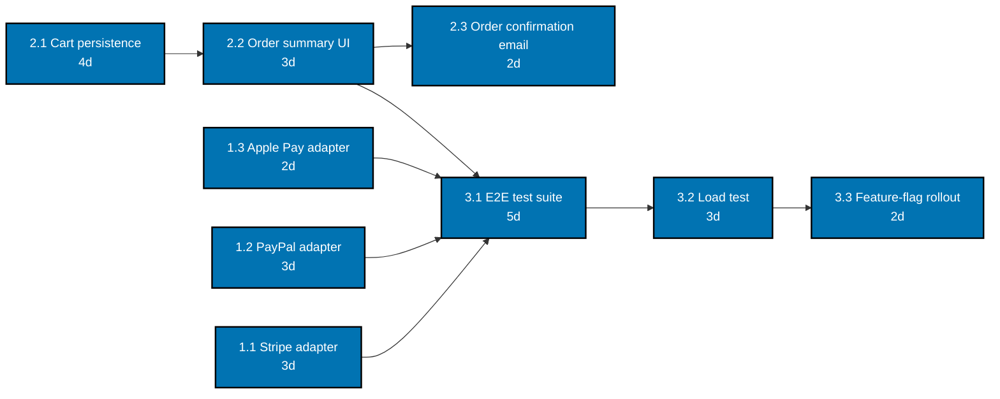

> Aurora Checkout Redesign -- dependency graph -- exercises co-04.

Every edge is a genuine finish-to-start "must finish before" relation: the three payment adapters and
the order-summary UI all feed the end-to-end test suite; the test suite feeds the load test; the load
test feeds the rollout plan; the order-confirmation email depends only on the order-summary UI.
