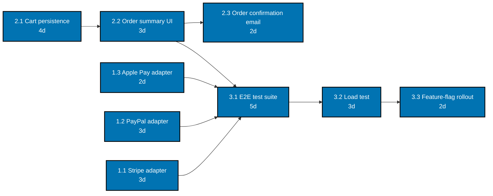

Scenarios 1-8 establish the framing every later scenario in this topic builds on: naming the
triple-constraint trade-off, choosing a methodology, decomposing work into a WBS, drawing the
dependency graph, and reading the resulting critical path, estimation, and metrics off of it.
Scenarios 3 through 7 and 9, 14, 15, 16, 22, 24, and 25 (later in this topic) follow one running
example -- the **Aurora Checkout Redesign** -- so the same work breakdown, schedule, and estimate
keep compounding into a larger, internally consistent picture, the same way a real project's
planning artifacts build on each other. Every artifact below also lives, standalone, under
`learning/artifacts/`.

---

### Worked Scenario 1: Triple-Constraint Trade-off

**Context**: Exercises co-01. Six weeks before a contractually fixed holiday-season launch date,
Finance asks the Aurora Checkout Redesign team to add three additional payment providers (Stripe,
PayPal, Apple Pay) to the original scope, with no discussion of budget at all.

The launch date is genuinely fixed -- it is tied to the holiday shopping season and cannot move.
The original core scope (the checkout-flow redesign itself) is also fixed -- it is the reason the
project exists. That leaves only one constraint free to absorb the new request: cost. The team
works through two options. Option A treats the added providers as in-scope work that fits inside
the existing team by quietly asking engineers to work unpaid overtime -- rejected immediately,
because it does not actually name a real trade, it just hides the cost inside people's personal
time. Option B brings in two contractor engineers for six weeks specifically to build the three
provider adapters in parallel with the core redesign -- a real, budgeted absorption of the new
scope into cost, with the date and the original scope both staying exactly as promised.

**Decision artifact**:

> **Trade-off memo -- Aurora Checkout Redesign payment-provider request**
>
> - **Fixed**: launch date (November 15, contractual, tied to the holiday shopping season); original
>   core scope (checkout-flow redesign).
> - **Absorbs the change**: cost. Two contractor engineers added for six weeks (~$54,000) to build
>   the Stripe, PayPal, and Apple Pay provider adapters in parallel with the core redesign, without
>   moving the date or cutting any already-committed scope.
> - **Alternative considered and rejected**: dropping one of the three providers to stay within the
>   existing headcount. Rejected because Finance's own data ranks all three as top-five revenue
>   drivers for the holiday quarter -- dropping any one of them defeats the purpose of the request.

**Verify**: the memo names exactly two constraints as fixed (date, original scope) and states, in
one sentence, what the third absorbs (cost: $54,000 over six weeks) -- satisfying co-01's rule.

**Key takeaway**: A trade-off memo is not complete until it names the two constraints staying fixed
and the specific number or date the third one absorbs -- "we'll figure it out" is not a trade-off.

**Why It Matters**: The alternative to this memo is not "no trade-off happens" -- it is "the
trade-off happens anyway, just silently, usually as scope quietly cut from a different feature or
quality quietly cut from testing." Writing the memo turns an inevitable trade into a chosen, visible,
and reviewable one, which is the entire point of naming the triangle in the first place.

---

### Worked Scenario 2: Pick a Delivery Methodology

**Context**: Exercises co-02. Three genuinely different teams ask "which methodology should we use,"
and the honest answer is different for each, driven by one property of the work itself.

**Decision artifact**:

| Context                                                                                               | Methodology | Driving context property                                                                                                                         |
| ----------------------------------------------------------------------------------------------------- | ----------- | ------------------------------------------------------------------------------------------------------------------------------------------------ |
| Infusion-pump firmware, FDA design-controlled, requirements locked by regulation before coding starts | Waterfall   | Cost of course-correction after the fact is enormous (a physical device recall), and requirements are stable and externally mandated up front.   |
| A subscription-box startup's personalization engine, still finding product-market fit                 | Scrum       | High rate of requirement change, driven by ongoing user feedback, with an engaged product owner able to reprioritize every sprint.               |
| An internal IT helpdesk fielding unpredictable incoming tickets                                       | Kanban      | Work arrives continuously and unpredictably, with no natural iteration boundary; flow and WIP limits matter more than sprint-shaped commitments. |

**Verify**: every row cites the specific context property (cost of course-correction, rate of
requirement change, unpredictability of work arrival) that drives the methodology choice -- not a
blanket "Scrum is the default," satisfying co-02's rule.

**Key takeaway**: The methodology follows the shape of the work; three genuinely different shapes of
work produce three genuinely different, defensible answers.

**Why It Matters**: A team that picks a methodology by fashion instead of by fit pays the ceremony
cost of that methodology (co-15) without collecting the benefit it was designed to produce -- Scrum's
reprioritization cadence is wasted on a customer who cannot reprioritize, and waterfall's
lock-the-plan discipline actively fights a product still searching for fit.

---

### Worked Scenario 3: Decompose a Feature into a WBS

**Context**: Exercises co-03. The Aurora Checkout Redesign's three committed deliverables --
payment integration, cart-and-order flow, and launch quality -- need decomposing into work packages
small enough for one person or pair to estimate and own.

**Decision artifact**:

```text
Checkout Redesign
1.0 Payment Integration
  1.1 Stripe provider adapter
  1.2 PayPal provider adapter
  1.3 Apple Pay provider adapter
2.0 Cart and Order Flow
  2.1 Cart persistence rework
  2.2 Order summary UI
  2.3 Order confirmation email
3.0 Quality and Launch
  3.1 Checkout end-to-end test suite
  3.2 Load test at 3x peak traffic
  3.3 Feature-flag rollout plan
```

Full artifact: **[`learning/artifacts/ex-03-wbs-decompose.md`](./artifacts/ex-03-wbs-decompose.md)**.

**Verify**: every one of the nine leaves is independently estimable (a team member could size it
without decomposing it further) and independently assignable (one name or one pair owns it end to
end) -- satisfying co-03's rule. None of the nine spans more than one owner or one clear skill area.

**Key takeaway**: Three deliverables, three branches, nine assignable leaves -- a WBS this shallow is
already enough structure to estimate and schedule against, which is exactly what Scenarios 4-9 do
with it.

**Why It Matters**: A leaf like "backend work," spanning three unrelated services with no single
owner, hides how fuzzy the team's understanding of the task still is. Forcing every leaf through the
independently-estimable-and-assignable test surfaces that fuzziness while it is still cheap to fix,
instead of during the sprint when the ambiguity turns into a stalled task.

---

### Worked Scenario 4: Draw the Dependency Graph

**Context**: Exercises co-04. The nine WBS leaves from Scenario 3 do not all start at once -- some
finish-to-start precedence relations exist, and the team needs those relations visible before it can
schedule anything.

**Decision artifact**:



_Diagram: every arrow is a real "must finish before" relation -- the three payment adapters and the
order-summary UI all feed into the end-to-end test suite, which feeds the load test, which feeds the
rollout plan; the order-confirmation email depends only on the order-summary UI finishing._

**Verify**: every edge encodes a genuine precedence relation -- the E2E suite cannot meaningfully run
before the payment adapters and the order-summary UI exist, the load test cannot run before the E2E
suite passes, and the rollout plan should not start before the load test confirms capacity --
satisfying co-04's rule. No edge connects two tasks with no real "must finish before" relationship.

**Key takeaway**: Drawing the graph is what makes the project's real shape visible -- three
independent branches converging on a shared, sequential launch-quality chain.

**Why It Matters**: Without this graph, "start the load test whenever it's convenient" looks like a
scheduling choice; with the graph drawn, it is visibly a hard precedence violation the moment someone
tries to schedule it before the E2E suite passes. Scenario 5 uses this exact graph to compute the
critical path. Skipping this step and sequencing work by intuition or team assignment instead of by
dependency is exactly how a project ends up staffing the wrong branch first while the true bottleneck
sits unstarted.

---

### Worked Scenario 5: Identify the Critical Path

**Context**: Exercises co-04. With Scenario 4's dependency graph and durations in hand, the team
needs the one number that actually bounds the launch date: the critical path.

**Decision artifact**: Every path from start to the final task, summed:

| Path                            | Sum (days)         |
| ------------------------------- | ------------------ |
| 2.1 -> 2.2 -> 3.1 -> 3.2 -> 3.3 | 4+3+5+3+2 = **17** |
| 1.1 -> 3.1 -> 3.2 -> 3.3        | 3+5+3+2 = 13       |
| 1.2 -> 3.1 -> 3.2 -> 3.3        | 3+5+3+2 = 13       |
| 1.3 -> 3.1 -> 3.2 -> 3.3        | 2+5+3+2 = 12       |
| 2.1 -> 2.2 -> 2.3               | 4+3+2 = 9          |

The longest path -- **2.1 Cart persistence rework -> 2.2 Order summary UI -> 3.1 E2E test suite ->
3.2 Load test -> 3.3 Feature-flag rollout, 17 working days** -- is the critical path. Every task on
it has zero slack: a one-day delay to cart persistence rework is a one-day delay to launch, full
stop. The three payment adapters (13, 13, and 12 days on their own branches) and the confirmation
email (9 days) all carry slack -- they can run a few days behind their own branch without moving the
project's finish date, as long as they still land before the E2E suite needs them.

**Verify**: the marked path (2.1-2.2-3.1-3.2-3.3) is the longest of the five computed paths, and
recomputing any one task's duration by one day changes the total by exactly one day only for tasks
on this path -- satisfying co-04's zero-slack rule.

**Key takeaway**: 17 working days, not 13 or 12, is what actually bounds the Aurora launch date --
and it runs through cart persistence and the order-summary UI, not through any of the three payment
adapters most people would guess first.

**Why It Matters**: Staffing up the payment-adapter work first (the intuitive "there are three of
them, they must be the bottleneck" guess) would spend budget without moving the finish date at all.
Scenario 22 later shows exactly what happens, and what the honest recovery options are, when the
critical path itself starts slipping.

---

### Worked Scenario 6: Story-Point Estimate Against a Reference

**Context**: Exercises co-05. The Aurora team needs to size its engineering backlog for
sprint planning -- a separate, more granular estimation pass than the day-level durations Scenario 5
used for the overall schedule, run the way any Scrum-flavored backlog would be sized.

The team calibrates against a reference story it already understands well: the PayPal adapter (1.2),
sized at 5 points because the team built a near-identical Stripe integration on a prior project. Every
other backlog item is then sized relative to that anchor, not in hours.

**Decision artifact**:

| Backlog item                   | Points | Reasoning relative to the reference (1.2 PayPal adapter = 5)     |
| ------------------------------ | ------ | ---------------------------------------------------------------- |
| 1.1 Stripe adapter             | 5      | Same shape of work as the reference story.                       |
| 1.2 PayPal adapter (reference) | 5      | The reference story itself.                                      |
| 1.3 Apple Pay adapter          | 3      | Smaller -- reuses the adapter interface the first two establish. |
| 2.1 Cart persistence rework    | 8      | Bigger -- touches shared state across the whole checkout flow.   |
| 2.2 Order summary UI           | 3      | Similar size to the smaller adapter story.                       |
| 2.3 Order confirmation email   | 2      | Smallest item in the backlog.                                    |
| 3.1 Checkout E2E test suite    | 8      | Bigger -- spans all three payment paths.                         |
| 3.2 Load test                  | 5      | Same rough size as an adapter story.                             |
| 3.3 Feature-flag rollout plan  | 2      | Small, well-understood mechanism.                                |
| **Total**                      | **41** |                                                                  |

**Verify**: every estimate is stated relative to the 1.2 reference story ("same shape as," "bigger
than," "smaller than") rather than as an hour count -- satisfying co-05's rule.

**Key takeaway**: Forty-one points is not a duration -- it is a relative-size total the team will
turn into an actual forecast only once it has real velocity data, which is exactly what Scenario 7
does next.

**Why It Matters**: Note this backlog runs alongside, not instead of, Scenario 5's day-level critical
path: the WBS/critical path view is what the team commits to stakeholders as a schedule, while the
pointed backlog is what the team uses internally to plan sprints -- a common and honest hybrid (co-02)
between project-level scheduling and Scrum-flavored execution.

---

### Worked Scenario 7: Velocity-Based Completion Forecast

**Context**: Exercises co-05. With the 41-point backlog from Scenario 6 sized, the Aurora team needs
an honest forecast of how many sprints the work will take.

**Decision artifact**:

| Sprint      | Velocity (points completed)                             |
| ----------- | ------------------------------------------------------- |
| N-3         | 14                                                      |
| N-2         | 17                                                      |
| N-1         | 15                                                      |
| **Average** | **15.3, rounded down to 15 points/sprint for planning** |

Forecast: 41 remaining points / 15 points per sprint = 2.73, rounded up to **3 sprints**.

**Verify**: the forecast divides the 41-point backlog by the three-sprint average velocity (15,
not the single best sprint's 17 or the single worst sprint's 14) -- satisfying co-05's rule that a
forecast must use an average of at least three sprints, not one sprint's number.

**Key takeaway**: Three sprints, not two -- using the best single sprint's velocity (17) would have
produced an overly optimistic two-sprint forecast the team could not actually hit.

**Why It Matters**: This three-sprint number is exactly what Scenario 9's sprint plan and Scenario
25's full delivery plan build against -- a forecast that quietly used the best sprint instead of the
average would have set the whole downstream plan up to look "late" the moment reality reverted to the
mean. Averaging trades a little responsiveness to a genuinely improving team for protection against
exactly this kind of one-off overcommitment, which is the safer default when a forecast feeds a
customer-facing date.

---

### Worked Scenario 8: Map Metrics to Decisions

**Context**: Exercises co-09. Before wiring up any dashboard, the team writes down, for each metric
it is considering, the exact decision that metric is supposed to inform -- a metric that fails this
test does not make the dashboard.

**Decision artifact**:

| Metric     | What it measures                                         | Decision it informs                                                                                                                                                                             |
| ---------- | -------------------------------------------------------- | ----------------------------------------------------------------------------------------------------------------------------------------------------------------------------------------------- |
| Burndown   | Remaining sprint work, tracked day by day.               | If burndown flatlines for two or more days mid-sprint, investigate a blocker today -- do not wait for sprint review.                                                                            |
| Cycle time | Elapsed time from a task starting work to finishing.     | If cycle time on one workflow stage trends upward for three consecutive weeks, add capacity to that stage or lower its WIP limit.                                                               |
| Lead time  | Elapsed time from a request's arrival to its completion. | If lead time consistently exceeds the SLA already committed to stakeholders, renegotiate the SLA or restructure the queue's prioritization policy -- do not just apologize sprint after sprint. |

**Verify**: every row states a concrete "when this metric shows X, we do Y" decision, not just a
definition of what the metric measures -- satisfying co-09's rule.

**Key takeaway**: All three metrics survive the test because each names a specific trigger and a
specific response; a metric that only produces "interesting to look at" gets cut before it ever
reaches the dashboard.

**Why It Matters**: A dashboard with ten metrics and three actual decisions attached to them is worse
than a dashboard with three metrics and three decisions -- the extra seven cost attention and
reporting effort while returning nothing. This decision-mapping discipline is what keeps a metrics
plan (Scenario 25, and the capstone) from becoming decoration.

---

← Previous: [Overview](./overview.md) · Next: [Intermediate Scenarios](./intermediate.md) →
