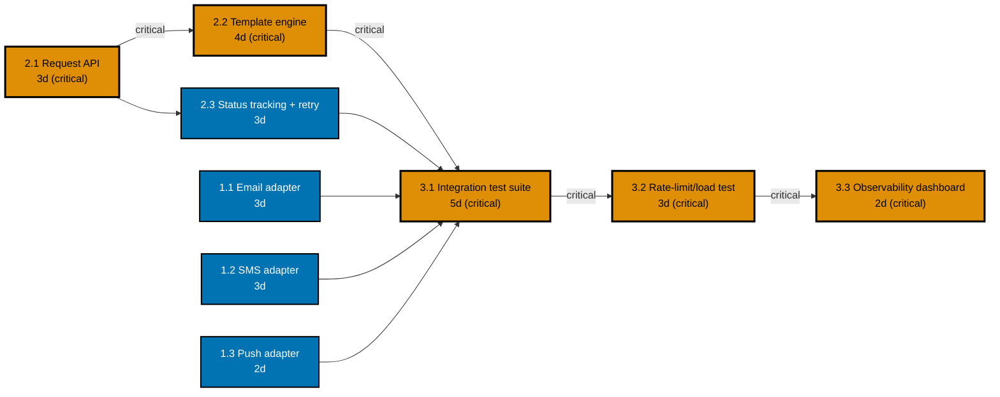

> Nimbus Notification Service -- full delivery plan. A 4-person team, three 2-week sprints (30
> working days), building a multi-channel (email, SMS, push) notification service.

## 1. Work breakdown structure

```text
Nimbus Notification Service
1.0 Delivery Channels
  1.1 Email channel adapter
  1.2 SMS channel adapter
  1.3 Push channel adapter
2.0 Core Service
  2.1 Notification request API and validation
  2.2 Template rendering engine
  2.3 Delivery-status tracking and retry queue
3.0 Launch Readiness
  3.1 Integration test suite (all three channels)
  3.2 Rate-limit and load test
  3.3 Observability dashboard and alerting
```

Every leaf is independently estimable and independently assignable: each is a single, coherent piece
of work one engineer or pair can size and own end to end, with no leaf spanning more than one clear
skill area.

## 2. Dependency graph and critical path



_Diagram: nine tasks and every genuine "must finish before" relation between them. The five
orange, thicker-stroked nodes and the edges labelled "critical" trace the critical path; every other
node and edge carries slack relative to it._

**Every path, summed**:

| Path                                           | Sum (days)         |
| ---------------------------------------------- | ------------------ |
| **2.1 -> 2.2 -> 3.1 -> 3.2 -> 3.3 (critical)** | 3+4+5+3+2 = **17** |
| 2.1 -> 2.3 -> 3.1 -> 3.2 -> 3.3                | 3+3+5+3+2 = 16     |
| 1.1 -> 3.1 -> 3.2 -> 3.3                       | 3+5+3+2 = 13       |
| 1.2 -> 3.1 -> 3.2 -> 3.3                       | 3+5+3+2 = 13       |
| 1.3 -> 3.1 -> 3.2 -> 3.3                       | 2+5+3+2 = 12       |

**Critical path**: 2.1 Notification request API -> 2.2 Template rendering engine -> 3.1 Integration
test suite -> 3.2 Rate-limit/load test -> 3.3 Observability dashboard, **17 working days, zero
slack**. Every other path carries slack relative to this one.

## 3. Velocity estimate

Reference story: **1.2 SMS channel adapter = 5 points** (the team has shipped a near-identical
provider integration before).

| Backlog item                                 | Points | Reasoning relative to the reference (1.2 = 5)                    |
| -------------------------------------------- | ------ | ---------------------------------------------------------------- |
| 1.1 Email channel adapter                    | 5      | Same shape of work as the reference story.                       |
| 1.2 SMS channel adapter (reference)          | 5      | The reference story itself.                                      |
| 1.3 Push channel adapter                     | 3      | Smaller -- reuses the adapter interface the first two establish. |
| 2.1 Notification request API and validation  | 5      | Same rough size as an adapter story.                             |
| 2.2 Template rendering engine                | 8      | Bigger -- the most structurally novel piece of the service.      |
| 2.3 Delivery-status tracking and retry queue | 5      | Same rough size as an adapter story.                             |
| 3.1 Integration test suite                   | 8      | Bigger -- spans all three channels plus the retry queue.         |
| 3.2 Rate-limit and load test                 | 5      | Same rough size as an adapter story.                             |
| 3.3 Observability dashboard and alerting     | 3      | Smaller, well-understood mechanism.                              |
| **Total**                                    | **47** |                                                                  |

Past three sprints' velocity (this team, unrelated smaller work): 16, 14, 18. **Average: 16
points/sprint.**

**Forecast**: 47 remaining points / 16 points per sprint = 2.94, rounded up to **3 sprints**.

## 4. Sprint and backlog plan

| Sprint   | Committed items                                                                               | Points | Dependency check                                                                                                                                                 |
| -------- | --------------------------------------------------------------------------------------------- | ------ | ---------------------------------------------------------------------------------------------------------------------------------------------------------------- |
| Sprint 1 | 2.1 Request API (5), 1.1 Email adapter (5), 1.2 SMS adapter (5)                               | 15     | None of the three has an unmet prerequisite.                                                                                                                     |
| Sprint 2 | 1.3 Push adapter (3), 2.2 Template engine (8), 2.3 Status tracking + retry (5)                | 16     | 2.2 and 2.3 both depend on 2.1, which finished in Sprint 1; 1.3 has no prerequisite.                                                                             |
| Sprint 3 | 3.1 Integration test suite (8), 3.2 Rate-limit/load test (5), 3.3 Observability dashboard (3) | 16     | 3.1 depends on every channel adapter (1.1-1.3) and both core-service pieces (2.2, 2.3), all complete by end of Sprint 2; 3.2 depends on 3.1; 3.3 depends on 3.2. |

**Total**: 15 + 16 + 16 = 47 points across 3 sprints, matching the forecast exactly. No sprint
exceeds the 16-point velocity ceiling, and no committed task precedes a dependency not scheduled in
an earlier sprint.

## 5. Risk register

| #   | Risk                                                                                                                  | Likelihood (1-5) | Impact (1-5) | Score | Mitigation                                                                                                                                  | Owner               |
| --- | --------------------------------------------------------------------------------------------------------------------- | ---------------- | ------------ | ----- | ------------------------------------------------------------------------------------------------------------------------------------------- | ------------------- |
| 1   | SMS provider sandbox rate limits block Sprint 3's load test                                                           | 3                | 4            | 12    | Request a temporary rate-limit increase from the vendor two weeks before the load-test sprint starts.                                       | SRE                 |
| 2   | Retry-queue logic risks duplicate notification delivery under a provider timeout                                      | 3                | 5            | 15    | Assign an idempotency key to every notification request; test duplicate-delivery prevention explicitly in the integration suite.            | Backend lead        |
| 3   | Push-notification payload size limits differ by platform (iOS/Android) and could silently truncate rendered templates | 4                | 3            | 12    | The template rendering engine enforces a hard payload-size check before send and fails loudly rather than truncating silently.              | Platform lead       |
| 4   | The team's only observability engineer is shared 50% with another project                                             | 4                | 4            | 16    | Front-load the observability-dashboard design during Sprint 2 planning (not left to the Sprint 3 crunch); pair a second engineer as backup. | Engineering manager |
| 5   | Product's notification-volume estimate is a guess, not a measurement                                                  | 3                | 3            | 9     | Instrument the request API from Sprint 1 onward to start collecting real volume data before the load-test sprint needs it.                  | Backend lead        |

**Top three by score, actively worked**: #4 (16, observability capacity), #2 (15, duplicate
delivery), and #1/#3 (tied at 12; #3 ranked first between the two because a silent payload
truncation is a customer-visible defect if it ships, while the rate-limit risk (#1) has an
external, requestable escalation path already in motion).

## 6. Metrics plan

| Metric                              | What it measures                                                            | Decision it informs                                                                                                                                                                                                                       |
| ----------------------------------- | --------------------------------------------------------------------------- | ----------------------------------------------------------------------------------------------------------------------------------------------------------------------------------------------------------------------------------------- |
| Burndown (per sprint)               | Remaining sprint points, tracked day by day.                                | If burndown flatlines for two or more consecutive days mid-sprint, investigate a blocker that same day -- do not wait for sprint review.                                                                                                  |
| Cycle time (Integration Test stage) | Elapsed time from a task entering the integration-test stage to leaving it. | If cycle time on this stage trends upward for two consecutive sprints, add QA capacity or lower that stage's WIP limit -- this stage is the most novel, highest-point work in the backlog (3.1, 8 points) and the most likely bottleneck. |

## 7. Internal consistency

- **Schedule**: 3 two-week sprints = 30 working days. The 17-day critical path fits comfortably
  inside that window, leaving slack for the risk register's contingencies (notably risk #1's
  vendor-dependent rate-limit escalation and risk #4's shared-engineer constraint) without requiring
  any crashing or fast-tracking moves at plan time.
- **Estimate and plan alignment**: the 3-sprint velocity forecast and the 3-sprint backlog plan match
  exactly -- 47 points, 47 points, no leftover work and no artificially compressed sprint.
- **Risk coverage**: every top-ranked risk by score has a mitigation already assigned to an owner and
  scheduled against a specific sprint (risk #4's mitigation is explicitly scheduled into Sprint 2
  planning; risk #5's mitigation begins in Sprint 1).
- **Metrics coverage**: both metrics in the plan name a concrete "when this shows X, we do Y"
  decision rule; neither is present merely because it is easy to chart.

This plan is executable without hand-waving: a reader could hand it to a real 4-person team, and the
team would know exactly what to build, in what order, by which sprint, and what to watch for.
