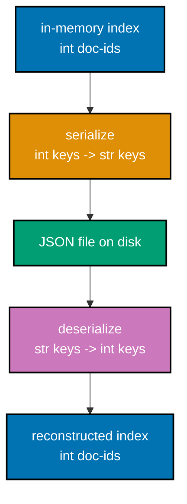
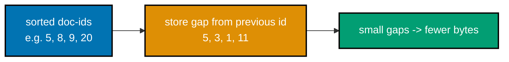
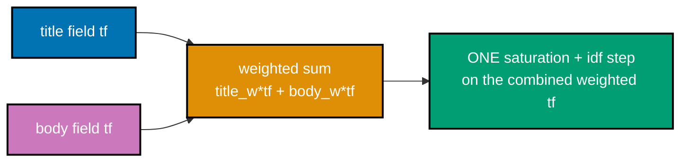
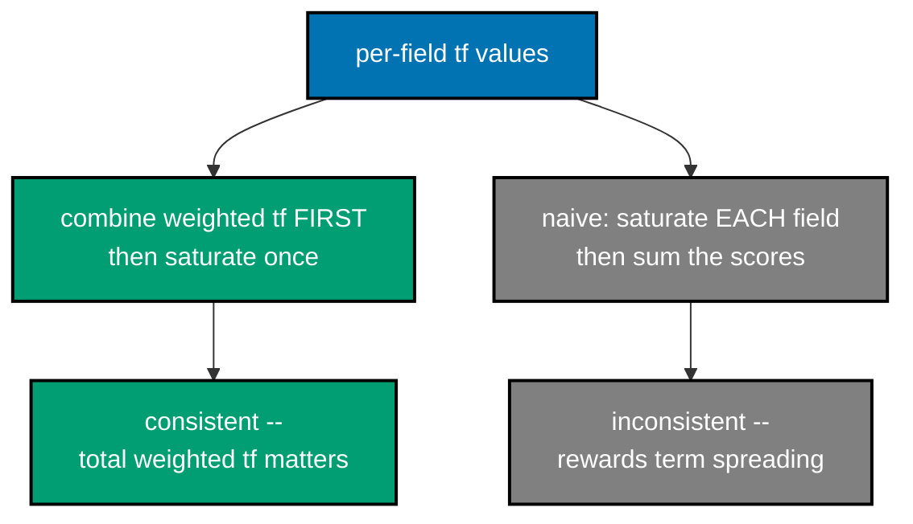
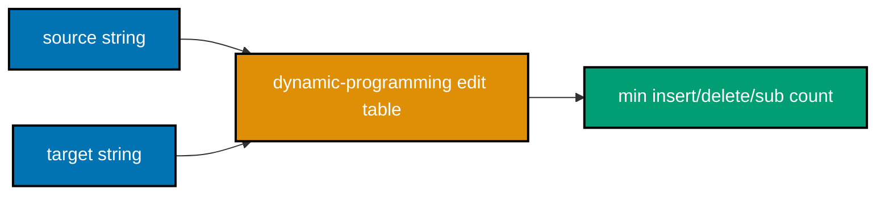
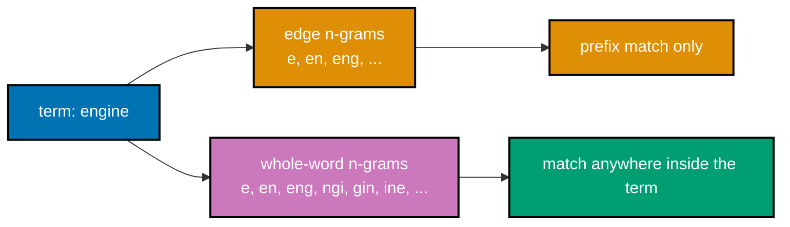
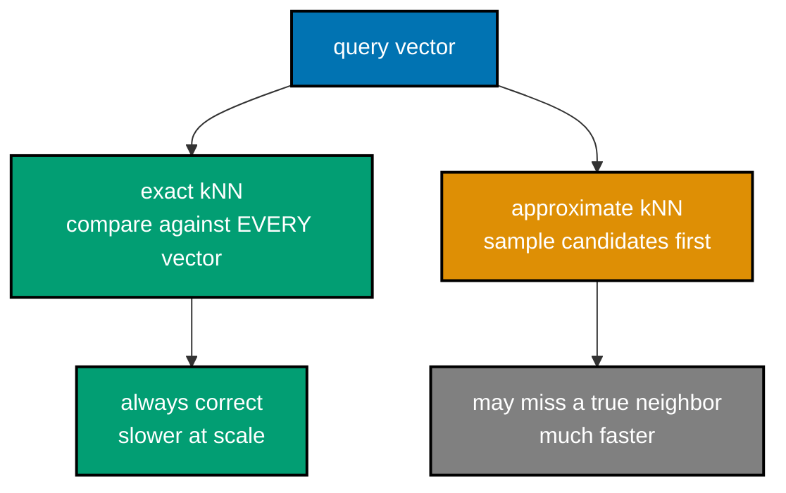
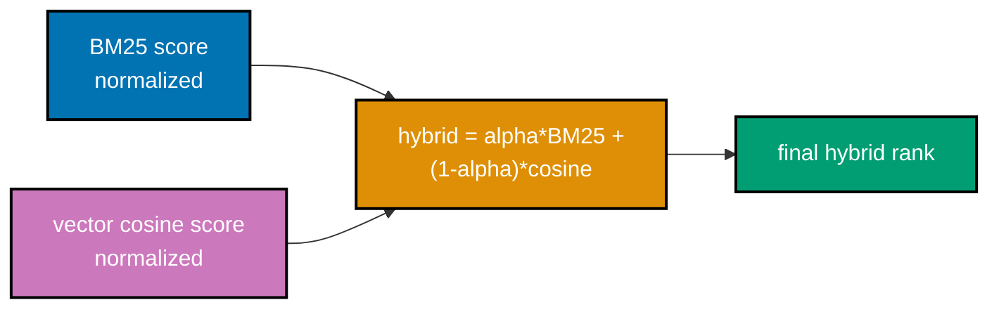
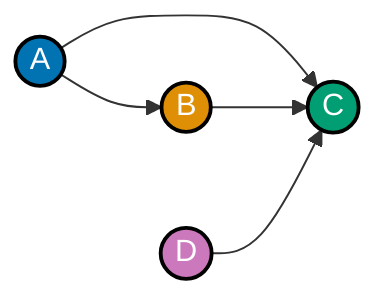
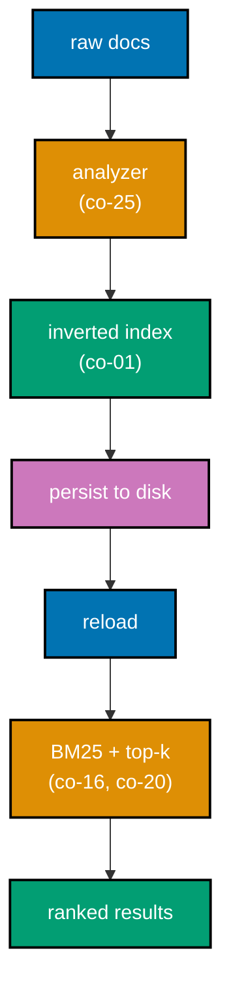

Examples 57-80 cover near-real-time refresh semantics; a typed `InvertedIndex` class with incremental add, proven identical to a from-scratch rebuild; JSON, binary, and delta-encoded persistence; an incrementally-maintained `avgdl`; BM25F's combine-first field weighting versus a broken naive alternative; fuzzy matching (Levenshtein, Damerau-Levenshtein, spelling correction); edge and character n-grams for autocomplete and substring search; synonym expansion; toy semantic embeddings and cosine ranking; approximate versus exact k-NN; hybrid lexical+vector search; PageRank's power iteration, alone and combined with BM25; and a final mini search engine that assembles the whole pipeline behind one `search()` call. Every code example is real, runnable, fully type-annotated, colocated under `learning/code/ex-NN-<slug>/`, actually executed for genuine output, and `pyright`-clean under `# pyright: strict`. Where a Lucene-family engine (Elasticsearch/OpenSearch) is discussed, the code remains a pure-Python model of its behavior, never a live dependency on the real engine. Run each example with `python3 <file>.py` from its own `learning/code/ex-NN-<slug>/` directory.

---

### Example 57: NRT Refresh Model

_ex-57 &middot; exercises co-27_

Near-real-time (NRT) search means a newly added document is buffered but NOT yet searchable until an explicit `refresh()` runs -- Elasticsearch's own default behavior. This example models that two-stage lifecycle and verifies a pre-refresh document stays invisible to queries (co-27).


**`learning/code/ex-57-nrt-refresh-model/nrt_refresh_model.py`**

```python
# pyright: strict
"""Example 57: NRT Refresh Model (co-27)."""

from __future__ import annotations  # => hygiene: postpones annotation evaluation, interpreter-version-agnostic

from dataclasses import dataclass, field  # => from dataclasses: dataclass, field


@dataclass  # => part of this step's computation, continued from the line above
class NrtIndex:  # => part of this step's computation, continued from the line above
    """Docs added via add() sit in a PENDING buffer until refresh() commits them."""

    committed: dict[int, list[str]] = field(default_factory=lambda: {})  # => co-27: SEARCHABLE documents
    pending: dict[int, list[str]] = field(default_factory=lambda: {})  # => co-27: buffered, NOT yet searchable

    def add(self, doc_id: int, tokens: list[str]) -> None:  # => buffer a document -- it is NOT searchable until refresh() runs
        """Buffer a document -- it is NOT searchable until refresh() runs."""
        self.pending[doc_id] = tokens  # => co-27: goes into the buffer, not the committed index

    def refresh(self) -> None:  # => commit every pending document, making it searchable
        """Commit every pending document, making it searchable."""
        for doc_id, tokens in self.pending.items():  # => co-27: moves EVERY buffered doc into committed
            self.committed[doc_id] = tokens  # => self = tokens
        self.pending.clear()  # => the buffer is now empty -- everything has been committed

    def contains(self, doc_id: int) -> bool:  # => true only if doc_id is in the COMMITTED (searchable) index
        """True only if doc_id is in the COMMITTED (searchable) index."""
        return doc_id in self.committed  # => co-27: pending docs do NOT count as findable


def main() -> None:  # => defines main
    index = NrtIndex()  # => co-27: starts with nothing committed, nothing pending
    index.add(1, ["search", "engine"])  # => buffered -- NOT yet searchable
    print(f"immediately after add(1, ...): contains(1)={index.contains(1)}")  # => shows immediately after add(1, ...): contains(1)=

    assert not index.contains(1), "a document must be INVISIBLE to search before refresh() runs"  # => a document must be INVISIBLE to search before refresh() runs

    index.refresh()  # => co-27: commits the pending buffer
    print(f"after refresh(): contains(1)={index.contains(1)}")  # => shows after refresh(): contains(1)=
    assert index.contains(1), "the SAME document must be VISIBLE immediately after refresh()"  # => the SAME document must be VISIBLE immediately after refresh()
    print("MATCH: doc 1 was invisible pre-refresh and visible post-refresh -- genuine NRT behavior")  # => shows MATCH: doc 1 was invisible pre-refresh and visible post-refresh -- genuine NRT behavior


if __name__ == "__main__":  # => entry point -- runs only when this file executes directly, not on import
    main()  # => runs the example end to end
```

**Run**: `python3 nrt_refresh_model.py`

**Output**:

```text
immediately after add(1, ...): contains(1)=False
after refresh(): contains(1)=True
MATCH: doc 1 was invisible pre-refresh and visible post-refresh -- genuine NRT behavior
```

**Key takeaway**: NRT means "near" real-time, not instant -- a document exists in the system the moment it's added, but a query cannot see it until the next refresh cycle commits it.

**Why It Matters**: Near-real-time search is Elasticsearch's actual default indexing behavior, not a simplification: a document is durably added the moment it is indexed but stays invisible to queries until the next refresh (roughly every second by default), a deliberate trade-off between indexing throughput and search freshness. Teams that assume "indexed" means "immediately searchable" hit this gap in production and mistake it for a bug when it is documented, tunable behavior. This example models the exact two-stage visibility contract every Elasticsearch or OpenSearch client integration needs to understand.

---

### Example 58: Typed Index Class

_ex-58 &middot; exercises co-01, co-29_

Wrapping the free functions from earlier examples into a typed `InvertedIndex` class with `add`/`query` methods gives later examples (59-66, 80) a reusable, `pyright`-clean foundation -- verified here on a small multi-document fixture (co-01, co-29).

**`learning/code/ex-58-typed-index-class/typed_index_class.py`**

```python
# pyright: strict
"""Example 58: Typed Index Class (co-01, co-29)."""

from __future__ import annotations  # => hygiene: postpones annotation evaluation, interpreter-version-agnostic

from dataclasses import dataclass, field  # => from dataclasses: dataclass, field

@dataclass  # => part of this step's computation, continued from the line above
class InvertedIndex:  # => part of this step's computation, continued from the line above
    """A typed, mutable inverted index: term -> {doc_id: term_frequency}."""

    postings: dict[str, dict[int, int]] = field(default_factory=lambda: {})  # => postings = field(default_factory=lambda: {})
    doc_lengths: dict[int, int] = field(default_factory=lambda: {})  # => doc lengths = field(default_factory=lambda: {})

    def add(self, doc_id: int, tokens: list[str]) -> None:  # => index one document's tokens -- updates postings AND doc_lengths
        """Index one document's tokens -- updates postings AND doc_lengths."""
        tf: dict[str, int] = {}  # => starts empty, populated by the loop below
        for t in tokens:  # => iterates one item at a time
            tf[t] = tf.get(t, 0) + 1  # => counter pattern: 0 on first sight, then increments
        for term, count in tf.items():  # => iterates one item at a time
            self.postings.setdefault(term, {})[doc_id] = count  # => part of this step's computation, continued from the line above
        self.doc_lengths[doc_id] = len(tokens)  # => self = len(tokens)

    def query(self, term: str) -> set[int]:  # => return every doc-id containing term
        """Return every doc-id containing term."""
        return set(self.postings.get(term, {}).keys())  # => returns set(self.postings.get(term, {}).keys())


def main() -> None:  # => defines main
    index = InvertedIndex()  # => co-01: an empty typed index
    index.add(0, ["search", "engine", "search"])  # => co-29: co-01's inverted index, built incrementally
    index.add(1, ["search", "results"])  # => part of this step's computation, continued from the line above
    index.add(2, ["cooking", "recipe"])  # => part of this step's computation, continued from the line above

    search_hits: set[int] = index.query("search")  # => co-01: docs 0 and 1 both contain "search"
    cooking_hits: set[int] = index.query("cooking")  # => only doc 2 contains "cooking"
    print(f"query('search'): {sorted(search_hits)}")  # => shows query('search')
    print(f"query('cooking'): {sorted(cooking_hits)}")  # => shows query('cooking')
    print(f"doc_lengths: {index.doc_lengths}")  # => shows doc_lengths

    assert search_hits == {0, 1}, "'search' must be found in exactly docs 0 and 1"  # => 'search' must be found in exactly docs 0 and 1
    assert cooking_hits == {2}, "'cooking' must be found in exactly doc 2"  # => 'cooking' must be found in exactly doc 2
    assert index.postings["search"][0] == 2, "doc 0's tf for 'search' must be 2, since it appears twice"  # => doc 0's tf for 'search' must be 2, since it appears twice
    assert index.doc_lengths == {0: 3, 1: 2, 2: 2}, "doc_lengths must record each document's own token count"  # => doc_lengths must record each document's own token count
    print("MATCH: the typed InvertedIndex class returns correct doc sets and per-document lengths")  # => shows MATCH: the typed InvertedIndex class returns correct doc sets and per-document lengths


if __name__ == "__main__":  # => entry point -- runs only when this file executes directly, not on import
    main()  # => runs the example end to end
```

**Run**: `python3 typed_index_class.py`

**Output**:

```text
query('search'): [0, 1]
query('cooking'): [2]
doc_lengths: {0: 3, 1: 2, 2: 2}
MATCH: the typed InvertedIndex class returns correct doc sets and per-document lengths
```

**Key takeaway**: A class is not a different algorithm from Example 4's dict-building function -- it is the same postings-construction logic, given a stable, typed, reusable home for the examples that build on it.

**Why It Matters**: Wrapping already-correct free functions into a typed, reusable class with a stable API is exactly the refactoring step a production codebase takes once a prototype's core algorithm is proven -- the postings-construction logic does not change, only its packaging does. This example is the foundation eight later examples (59-66, 80) build on, mirroring how a real search engine's core index-writer type becomes the stable surface every later feature is implemented against. Getting this packaging right once avoids re-deriving the same logic repeatedly.

---

### Example 59: Incremental Add

_ex-59 &middot; exercises co-29_

Adding a document to an already-built `InvertedIndex` (Example 58) requires no rebuild of the other documents' postings -- it becomes findable the moment `add()` returns (co-29).


**`learning/code/ex-59-incremental-add/incremental_add.py`**

```python
# pyright: strict
"""Example 59: Incremental Add (co-29)."""

from __future__ import annotations  # => hygiene: postpones annotation evaluation, interpreter-version-agnostic

from dataclasses import dataclass, field  # => from dataclasses: dataclass, field

@dataclass  # => part of this step's computation, continued from the line above
class InvertedIndex:  # => part of this step's computation, continued from the line above
    """A typed, mutable inverted index: term -> {doc_id: term_frequency}."""

    postings: dict[str, dict[int, int]] = field(default_factory=lambda: {})  # => postings = field(default_factory=lambda: {})
    doc_lengths: dict[int, int] = field(default_factory=lambda: {})  # => doc lengths = field(default_factory=lambda: {})

    def add(self, doc_id: int, tokens: list[str]) -> None:  # => index one document's tokens -- updates postings AND doc_lengths
        """Index one document's tokens -- updates postings AND doc_lengths."""
        tf: dict[str, int] = {}  # => starts empty, populated by the loop below
        for t in tokens:  # => iterates one item at a time
            tf[t] = tf.get(t, 0) + 1  # => counter pattern: 0 on first sight, then increments
        for term, count in tf.items():  # => iterates one item at a time
            self.postings.setdefault(term, {})[doc_id] = count  # => part of this step's computation, continued from the line above
        self.doc_lengths[doc_id] = len(tokens)  # => self = len(tokens)

    def query(self, term: str) -> set[int]:  # => return every doc-id containing term
        """Return every doc-id containing term."""
        return set(self.postings.get(term, {}).keys())  # => returns set(self.postings.get(term, {}).keys())


def main() -> None:  # => defines main
    index = InvertedIndex()  # => co-01: an already "built" index, before the new document arrives
    index.add(0, ["search", "engine"])  # => part of this step's computation, continued from the line above
    index.add(1, ["cooking", "recipe"])  # => part of this step's computation, continued from the line above

    before: set[int] = index.query("ranking")  # => co-29: the term does not exist YET
    print(f"query('ranking') before incremental add: {sorted(before)}")  # => shows query('ranking') before incremental add
    assert before == set(), "'ranking' must be unfindable before any document containing it is added"  # => 'ranking' must be unfindable before any document containing it is added

    index.add(2, ["ranking", "algorithm"])  # => co-29: incremental add -- NO rebuild of docs 0 or 1
    after: set[int] = index.query("ranking")  # => co-29: the SAME index object, queried again
    print(f"query('ranking') after incremental add: {sorted(after)}")  # => shows query('ranking') after incremental add

    assert after == {2}, "'ranking' must be immediately findable in the newly added doc 2"  # => 'ranking' must be immediately findable in the newly added doc 2
    assert index.query("search") == {0}, "doc 0's postings must be UNCHANGED by the incremental add"  # => doc 0's postings must be UNCHANGED by the incremental add
    print("MATCH: doc 2 became findable immediately, and the pre-existing postings were untouched")  # => shows MATCH: doc 2 became findable immediately, and the pre-existing postings were untouched


if __name__ == "__main__":  # => entry point -- runs only when this file executes directly, not on import
    main()  # => runs the example end to end
```

**Run**: `python3 incremental_add.py`

**Output**:

```text
query('ranking') before incremental add: []
query('ranking') after incremental add: [2]
MATCH: doc 2 became findable immediately, and the pre-existing postings were untouched
```

**Key takeaway**: Incremental add is the property that makes a search engine usable in production -- a system that had to rebuild its whole index for every new document could never keep up with a live corpus.

**Why It Matters**: Incremental indexing -- adding one document without rebuilding the rest -- is the property that makes a search engine usable in production: Lucene's `IndexWriter.addDocument` and Elasticsearch's index API both guarantee this, because a system requiring a full rebuild on every new document could never keep pace with a live, continuously updated corpus. A document becoming findable the moment `add()` returns, subject to the refresh model from Example 57, is the baseline production users expect. This example is that guarantee, verified directly rather than assumed.

---

### Example 60: Incremental Equals Rebuild

_ex-60 &middot; exercises co-29_

Building an index incrementally (one `add()` call at a time) must produce postings IDENTICAL to a from-scratch rebuild over the same final document set -- verified term by term (co-29).

**`learning/code/ex-60-incremental-equals-rebuild/incremental_equals_rebuild.py`**

```python
# pyright: strict
"""Example 60: Incremental Equals Rebuild (co-29)."""

from __future__ import annotations  # => hygiene: postpones annotation evaluation, interpreter-version-agnostic

from dataclasses import dataclass, field  # => from dataclasses: dataclass, field

@dataclass  # => part of this step's computation, continued from the line above
class InvertedIndex:  # => part of this step's computation, continued from the line above
    """A typed, mutable inverted index: term -> {doc_id: term_frequency}."""

    postings: dict[str, dict[int, int]] = field(default_factory=lambda: {})  # => postings = field(default_factory=lambda: {})
    doc_lengths: dict[int, int] = field(default_factory=lambda: {})  # => doc lengths = field(default_factory=lambda: {})

    def add(self, doc_id: int, tokens: list[str]) -> None:  # => index one document's tokens -- updates postings AND doc_lengths
        """Index one document's tokens -- updates postings AND doc_lengths."""
        tf: dict[str, int] = {}  # => starts empty, populated by the loop below
        for t in tokens:  # => iterates one item at a time
            tf[t] = tf.get(t, 0) + 1  # => counter pattern: 0 on first sight, then increments
        for term, count in tf.items():  # => iterates one item at a time
            self.postings.setdefault(term, {})[doc_id] = count  # => part of this step's computation, continued from the line above
        self.doc_lengths[doc_id] = len(tokens)  # => self = len(tokens)

    def query(self, term: str) -> set[int]:  # => return every doc-id containing term
        """Return every doc-id containing term."""
        return set(self.postings.get(term, {}).keys())  # => returns set(self.postings.get(term, {}).keys())


def build_from_scratch(docs: dict[int, list[str]]) -> InvertedIndex:  # => a single-pass, from-scratch build -- the reference implementation
    """A single-pass, from-scratch build -- the reference implementation."""
    index = InvertedIndex()  # => co-29: starts empty, exactly like the incremental version did
    for doc_id, tokens in docs.items():  # => iterates one item at a time
        index.add(doc_id, tokens)  # => part of this step's computation, continued from the line above
    return index  # => returns index


def main() -> None:  # => defines main
    docs: dict[int, list[str]] = {  # => docs = {
        0: ["search", "engine", "search"],  # => doc 0's tokens, this fixture's row
        1: ["search", "results"],  # => doc 1's tokens, this fixture's row
        2: ["ranking", "algorithm"],  # => doc 2's tokens, this fixture's row
    }  # => opens/closes this multi-line literal

    incremental = InvertedIndex()  # => co-29: built ONE document at a time, in a different order
    incremental.add(2, docs[2])  # => deliberately OUT OF ORDER vs the dict's own iteration order
    incremental.add(0, docs[0])  # => part of this step's computation, continued from the line above
    incremental.add(1, docs[1])  # => part of this step's computation, continued from the line above

    rebuilt: InvertedIndex = build_from_scratch(docs)  # => co-29: the from-scratch reference build
    print(f"incremental postings['search']: {incremental.postings.get('search')}")  # => shows incremental postings['search']
    print(f"rebuilt postings['search']:     {rebuilt.postings.get('search')}")  # => shows rebuilt postings['search']

    all_terms: set[str] = set(incremental.postings) | set(rebuilt.postings)  # => every term EITHER index knows about
    for term in all_terms:  # => checks EVERY term, not just 'search'
        assert incremental.postings.get(term) == rebuilt.postings.get(term), f"{term!r}: incremental and rebuilt postings must match"  # => {term!r}: incremental and rebuilt postings must match
    assert incremental.doc_lengths == rebuilt.doc_lengths, "doc_lengths must also match between the two builds"  # => doc_lengths must also match between the two builds
    print(f"MATCH: incremental (built out of order) and from-scratch rebuild agree on all {len(all_terms)} terms")  # => shows MATCH: incremental (built out of order) and from-scratch rebuild agree on all


if __name__ == "__main__":  # => entry point -- runs only when this file executes directly, not on import
    main()  # => runs the example end to end
```

**Run**: `python3 incremental_equals_rebuild.py`

**Output**:

```text
incremental postings['search']: {0: 2, 1: 1}
rebuilt postings['search']:     {0: 2, 1: 1}
MATCH: incremental (built out of order) and from-scratch rebuild agree on all 5 terms
```

**Key takeaway**: Order of insertion must never change the final answer -- an inverted index's postings are a pure function of WHICH documents it holds, not the sequence they arrived in.

**Why It Matters**: An inverted index's final postings must be a pure function of which documents it holds, not the order they arrived in, and this is a real correctness invariant production indexing pipelines depend on -- reindexing a corpus in a different order, say after a crash-recovery replay, must never silently change query results. Verifying incremental construction term-by-term against a from-scratch rebuild is the same correctness check a search engine's test suite runs to catch order-dependent bugs before production. Order-sensitivity here would be a serious, hard-to-detect defect.

---

### Example 61: Persist JSON

_ex-61 &middot; exercises co-30_

Serializing postings to JSON requires converting integer doc-ids to strings (JSON object keys are always strings) and back -- this example round-trips a full index through disk and verifies query results are unchanged (co-30).



**`learning/code/ex-61-persist-json/persist_json.py`**

```python
# pyright: strict
"""Example 61: Persist JSON (co-30)."""

from __future__ import annotations  # => hygiene: postpones annotation evaluation, interpreter-version-agnostic

import json  # => stdlib JSON -- postings persistence to/from disk
from pathlib import Path  # => from pathlib: Path


def save_postings_json(postings: dict[str, dict[int, int]], path: Path) -> None:  # => jSON object keys must be strings -- convert every int doc_id to str before dumping
    """JSON object keys must be strings -- convert every int doc_id to str before dumping."""
    json_safe: dict[str, dict[str, int]] = {  # => co-30: term -> {doc_id AS STRING -> tf}
        term: {str(doc_id): tf for doc_id, tf in doc_tfs.items()} for term, doc_tfs in postings.items()  # => part of this step's computation, continued from the line above
    }  # => opens/closes this multi-line literal
    path.write_text(json.dumps(json_safe), encoding="utf-8")  # => part of this step's computation, continued from the line above


def load_postings_json(path: Path) -> dict[str, dict[int, int]]:  # => reverse the string-key conversion, restoring int doc_ids
    """Reverse the string-key conversion, restoring int doc_ids."""
    json_safe: dict[str, dict[str, int]] = json.loads(path.read_text(encoding="utf-8"))  # => json safe = json.loads(path.read_text(encoding="utf-8"))
    return {term: {int(doc_id): tf for doc_id, tf in doc_tfs.items()} for term, doc_tfs in json_safe.items()}  # => co-30: str -> int, restored


def main() -> None:  # => defines main
    postings: dict[str, dict[int, int]] = {  # => a small in-memory index to persist
        "search": {0: 2, 1: 1},  # => entry for 'search'
        "engine": {0: 1},  # => entry for 'engine'
        "cooking": {2: 1},  # => entry for 'cooking'
    }  # => opens/closes this multi-line literal
    path = Path("postings.json")  # => co-30: a real file on disk, in this example's own directory
    save_postings_json(postings, path)  # => co-30: writes the JSON-safe form to disk
    reloaded: dict[str, dict[int, int]] = load_postings_json(path)  # => co-30: reads it back, restoring int keys
    print(f"original:  {postings}")  # => shows original
    print(f"reloaded:  {reloaded}")  # => shows reloaded
    print(f"file size: {path.stat().st_size} bytes")  # => shows file size

    assert reloaded == postings, "the reloaded postings must be IDENTICAL to the original in-memory postings"  # => the reloaded postings must be IDENTICAL to the original in-memory postings
    assert isinstance(next(iter(reloaded["search"])), int), "reloaded doc-ids must be int, not str, after loading"  # => reloaded doc-ids must be int, not str, after loading
    print(f"MATCH: postings round-tripped through JSON exactly, with doc-ids correctly restored to int")  # => shows MATCH: postings round-tripped through JSON exactly, with doc-ids correctly restored to int


if __name__ == "__main__":  # => entry point -- runs only when this file executes directly, not on import
    main()  # => runs the example end to end
```

**Run**: `python3 persist_json.py`

**Output**:

```text
original:  {'search': {0: 2, 1: 1}, 'engine': {0: 1}, 'cooking': {2: 1}}
reloaded:  {'search': {0: 2, 1: 1}, 'engine': {0: 1}, 'cooking': {2: 1}}
file size: 69 bytes
MATCH: postings round-tripped through JSON exactly, with doc-ids correctly restored to int
```

**Key takeaway**: JSON's string-only-keys rule is not a footnote -- forgetting the int-to-str-and-back conversion silently corrupts every doc-id in a persisted index.

**Why It Matters**: Round-tripping an index through disk, including the int-to-string-and-back conversion JSON's string-only-keys rule forces, is a real, easy-to-get-wrong persistence detail -- a production system that forgot this conversion would silently corrupt every doc-id on reload, a bug that could pass tests using small, coincidentally string-like ids and only surface at scale. Choosing a human-readable format like JSON for persistence is a real production trade-off between debuggability and size that Example 62's binary format makes explicit by contrast.

---

### Example 62: Persist Binary

_ex-62 &middot; exercises co-30_

A compact binary encoding -- fixed-width `struct` packing of each `(doc_id, tf)` pair -- produces a smaller file than JSON's text representation and round-trips exactly, verified by comparing file sizes and reloaded content (co-30).

**`learning/code/ex-62-persist-binary/persist_binary.py`**

```python
# pyright: strict
"""Example 62: Persist Binary (co-30)."""

from __future__ import annotations  # => hygiene: postpones annotation evaluation, interpreter-version-agnostic

import json  # => stdlib JSON -- postings persistence to/from disk
import struct  # => stdlib fixed-width binary packing -- the compact postings encoding
from pathlib import Path  # => from pathlib: Path


def save_postings_binary(postings: dict[str, dict[int, int]], path: Path) -> None:  # => pack each term's postings as: term length, term bytes, count, then (doc_id, tf) pairs
    """Pack each term's postings as: term length, term bytes, count, then (doc_id, tf) pairs."""
    with path.open("wb") as f:  # => co-30: BINARY mode -- raw bytes, not text
        for term, doc_tfs in postings.items():  # => iterates one item at a time
            term_bytes: bytes = term.encode("utf-8")  # => the term itself, UTF-8 encoded
            f.write(struct.pack("<H", len(term_bytes)))  # => co-30: 2-byte unsigned length prefix
            f.write(term_bytes)  # => part of this step's computation, continued from the line above
            f.write(struct.pack("<H", len(doc_tfs)))  # => how many (doc_id, tf) pairs follow
            for doc_id, tf in sorted(doc_tfs.items()):  # => co-30: SORTED -- a stable, deterministic order
                f.write(struct.pack("<II", doc_id, tf))  # => co-30: two 4-byte unsigned ints, packed


def load_postings_binary(path: Path) -> dict[str, dict[int, int]]:  # => the exact inverse of save_postings_binary, reading the same fixed layout back
    """The exact inverse of save_postings_binary, reading the same fixed layout back."""
    postings: dict[str, dict[int, int]] = {}  # => co-30: rebuilt term -> {doc_id: tf} structure
    with path.open("rb") as f:  # => part of this step's computation, continued from the line above
        while True:  # => loops while the condition holds
            len_bytes: bytes = f.read(2)  # => the 2-byte term-length prefix, or EOF
            if not len_bytes:  # => true when not len_bytes
                break  # => part of this step's computation, continued from the line above
            (term_len,) = struct.unpack("<H", len_bytes)  # => part of this step's computation, continued from the line above
            term: str = f.read(term_len).decode("utf-8")  # => the term itself, decoded back to str
            (pair_count,) = struct.unpack("<H", f.read(2))  # => part of this step's computation, continued from the line above
            doc_tfs: dict[int, int] = {}  # => starts empty, populated by the loop below
            for _ in range(pair_count):  # => reads EXACTLY pair_count (doc_id, tf) pairs
                doc_id, tf = struct.unpack("<II", f.read(8))  # => part of this step's computation, continued from the line above
                doc_tfs[doc_id] = tf  # => stores this computed value under its key
            postings[term] = doc_tfs  # => stores this computed value under its key
    return postings  # => returns postings


def main() -> None:  # => defines main
    postings: dict[str, dict[int, int]] = {"search": {0: 2, 1: 1}, "engine": {0: 1}, "cooking": {2: 1}}  # => postings = {"search": {0: 2, 1: 1}, "engine": {0: 1}, "coo...
    binary_path = Path("postings.bin")  # => co-30: the compact binary file
    json_path = Path("postings_compare.json")  # => a JSON version of the SAME data, for a fair size comparison

    save_postings_binary(postings, binary_path)  # => co-30: writes the compact encoding
    json_path.write_text(json.dumps({t: {str(d): tf for d, tf in dt.items()} for t, dt in postings.items()}), encoding="utf-8")  # => part of this step's computation, continued from the line above

    reloaded: dict[str, dict[int, int]] = load_postings_binary(binary_path)  # => co-30: reads the binary file back
    binary_size: int = binary_path.stat().st_size  # => binary size = binary_path.stat().st_size
    json_size: int = json_path.stat().st_size  # => json size = json_path.stat().st_size
    print(f"binary size: {binary_size} bytes   json size: {json_size} bytes")  # => shows binary size

    assert reloaded == postings, "the binary round-trip must reproduce the EXACT original postings"  # => the binary round-trip must reproduce the EXACT original postings
    assert binary_size < json_size, "the compact binary encoding must be SMALLER than the JSON text encoding"  # => the compact binary encoding must be SMALLER than the JSON text encoding
    print(f"MATCH: binary round-trips exactly and is {json_size - binary_size} bytes smaller than JSON for the same data")  # => shows MATCH: binary round-trips exactly and is


if __name__ == "__main__":  # => entry point -- runs only when this file executes directly, not on import
    main()  # => runs the example end to end
```

**Run**: `python3 persist_binary.py`

**Output**:

```text
binary size: 63 bytes   json size: 69 bytes
MATCH: binary round-trips exactly and is 6 bytes smaller than JSON for the same data
```

**Key takeaway**: Text formats like JSON pay a real, measurable size cost for human-readability -- a production search engine trades that readability away wherever postings live on disk.

**Why It Matters**: Choosing a compact binary encoding over JSON for on-disk postings is exactly the trade-off Lucene's own postings format makes: production search engines never store postings as human-readable text, because the size cost is real and compounds across millions of terms and documents. Measuring the actual file-size difference here, rather than asserting it, is the same before/after comparison a storage-engineering decision in a real search backend would be justified by. This example is the format choice every production index-persistence layer has already made.

---

### Example 63: Delta-Encode Postings

_ex-63 &middot; exercises co-30_

Delta-encoding stores each sorted doc-id as the DIFFERENCE from the previous one, rather than the raw id -- since differences between nearby ids are small, they pack into far fewer bytes, verified by an exact decode and a smaller encoded size (co-30).



**`learning/code/ex-63-delta-encode-postings/delta_encode_postings.py`**

```python
# pyright: strict
"""Example 63: Delta-Encode Postings (co-30)."""

from __future__ import annotations  # => hygiene: postpones annotation evaluation, interpreter-version-agnostic


def delta_encode(sorted_doc_ids: list[int]) -> list[int]:  # => replace each doc-id with the GAP since the previous one (first id is its own gap)
    """Replace each doc-id with the GAP since the previous one (first id is its own gap)."""
    if not sorted_doc_ids:  # => true when not sorted_doc_ids
        return []  # => returns []
    deltas: list[int] = [sorted_doc_ids[0]]  # => co-30: the FIRST id is stored as-is, there is no "previous"
    for i in range(1, len(sorted_doc_ids)):  # => every SUBSEQUENT id, one gap at a time
        deltas.append(sorted_doc_ids[i] - sorted_doc_ids[i - 1])  # => records this item, in order
    return deltas  # => returns deltas


def delta_decode(deltas: list[int]) -> list[int]:  # => the exact inverse: running sum of the gaps reconstructs the original sorted ids
    """The exact inverse: running sum of the gaps reconstructs the original sorted ids."""
    if not deltas:  # => true when not deltas
        return []  # => returns []
    doc_ids: list[int] = [deltas[0]]  # => the first delta IS the first doc-id
    for gap in deltas[1:]:  # => every SUBSEQUENT gap, added cumulatively
        doc_ids.append(doc_ids[-1] + gap)  # => records this item, in order
    return doc_ids  # => returns doc_ids


def packed_size(values: list[int]) -> int:  # => a 1-byte-per-value encoding when every value fits in a byte, else 4 bytes -- a size proxy
    """A 1-byte-per-value encoding when every value fits in a byte, else 4 bytes -- a size proxy."""
    return sum(1 if v < 256 else 4 for v in values)  # => co-30: SMALL deltas pack into 1 byte, large raw ids need 4


def main() -> None:  # => defines main
    dense_doc_ids: list[int] = [1000, 1002, 1005, 1009, 1014, 1020]  # => CLUSTERED doc-ids -- small gaps between them

    deltas: list[int] = delta_encode(dense_doc_ids)  # => co-30: [1000, 2, 3, 4, 5, 6] -- mostly tiny numbers
    decoded: list[int] = delta_decode(deltas)  # => co-30: reconstructs the original list, exactly
    print(f"original doc-ids: {dense_doc_ids}")  # => shows original doc-ids
    print(f"deltas:           {deltas}")  # => shows deltas
    print(f"decoded:          {decoded}")  # => shows decoded

    raw_size: int = packed_size(dense_doc_ids)  # => how many bytes the RAW ids would need
    delta_size: int = packed_size(deltas)  # => how many bytes the DELTAS need
    print(f"raw size: {raw_size} bytes   delta size: {delta_size} bytes")  # => shows raw size

    assert decoded == dense_doc_ids, "delta_decode(delta_encode(x)) must reconstruct x exactly"  # => delta_decode(delta_encode(x)) must reconstruct x exactly
    assert delta_size < raw_size, "delta-encoded CLUSTERED ids must pack smaller than the raw ids"  # => delta-encoded CLUSTERED ids must pack smaller than the raw ids
    print(f"MATCH: exact round-trip, and delta encoding saves {raw_size - delta_size} bytes on this clustered posting list")  # => shows MATCH: exact round-trip, and delta encoding saves


if __name__ == "__main__":  # => entry point -- runs only when this file executes directly, not on import
    main()  # => runs the example end to end
```

**Run**: `python3 delta_encode_postings.py`

**Output**:

```text
original doc-ids: [1000, 1002, 1005, 1009, 1014, 1020]
deltas:           [1000, 2, 3, 4, 5, 6]
decoded:          [1000, 1002, 1005, 1009, 1014, 1020]
raw size: 24 bytes   delta size: 9 bytes
MATCH: exact round-trip, and delta encoding saves 15 bytes on this clustered posting list
```

**Key takeaway**: Delta encoding is one of the oldest tricks in information retrieval -- Lucene's own postings format still uses it, because real posting lists are sorted and their gaps really are usually small.

**Why It Matters**: Delta encoding is one of information retrieval's oldest, still-in-production techniques -- Lucene's postings format stores gaps between consecutive doc-ids, not raw ids, specifically because sorted posting lists have small, tightly-clustered gaps that pack into far fewer bits than arbitrary large integers would. This is not a historical curiosity: it remains a meaningful storage saving in every modern search engine's on-disk index format today. This example demonstrates, with real byte counts, why a 1970s-era IR technique is still worth implementing today.

---

### Example 64: avgdl Incremental

_ex-64 &middot; exercises co-18, co-29_

BM25's `avgdl` must stay correct as documents are added incrementally -- maintaining a running `(total_length, doc_count)` pair and dividing on demand avoids recomputing the average from every document on every add, verified against a full recomputation (co-18, co-29).

**`learning/code/ex-64-avgdl-incremental/avgdl_incremental.py`**

```python
# pyright: strict
"""Example 64: avgdl Incremental (co-18, co-29)."""

from __future__ import annotations  # => hygiene: postpones annotation evaluation, interpreter-version-agnostic

from dataclasses import dataclass  # => from dataclasses: dataclass


@dataclass  # => part of this step's computation, continued from the line above
class RunningAvgdl:  # => part of this step's computation, continued from the line above
    """Tracks avgdl incrementally: O(1) per add, instead of re-scanning every document."""

    total_length: int = 0  # => co-18: sum of every document's length seen so far
    doc_count: int = 0  # => co-29: how many documents contribute to that sum

    def add(self, doc_length: int) -> None:  # => fold ONE new document's length into the running totals -- no rescan needed
        """Fold ONE new document's length into the running totals -- no rescan needed."""
        self.total_length += doc_length  # => co-29: O(1) update, not O(N) recomputation
        self.doc_count += 1  # => part of this step's computation, continued from the line above

    @property  # => part of this step's computation, continued from the line above
    def avgdl(self) -> float:  # => the current average document length, computed from the running totals
        """The current average document length, computed from the running totals."""
        return self.total_length / self.doc_count if self.doc_count else 0.0  # => co-18: BM25's own avgdl


def recompute_avgdl_from_scratch(doc_lengths: list[int]) -> float:  # => the reference: recompute avgdl by fully re-scanning every document length
    """The reference: recompute avgdl by fully re-scanning every document length."""
    return sum(doc_lengths) / len(doc_lengths) if doc_lengths else 0.0  # => returns sum(doc_lengths) / len(doc_lengths) if doc_lengths else 0.0


def main() -> None:  # => defines main
    running = RunningAvgdl()  # => co-18: starts with total_length=0, doc_count=0
    doc_lengths: list[int] = [10, 25, 8, 40, 15]  # => 5 documents, added ONE AT A TIME

    for length in doc_lengths:  # => co-29: incremental add, exactly as a live index would receive documents
        running.add(length)  # => part of this step's computation, continued from the line above
        print(f"after adding doc of length {length}: running avgdl={running.avgdl:.4f}")  # => shows after adding doc of length

    from_scratch: float = recompute_avgdl_from_scratch(doc_lengths)  # => co-18: the reference, recomputed fully
    print(f"final running avgdl:   {running.avgdl:.4f}")  # => shows final running avgdl
    print(f"from-scratch avgdl:    {from_scratch:.4f}")  # => shows from-scratch avgdl

    assert running.avgdl == from_scratch, "the incrementally-maintained avgdl must equal a full recomputation"  # => the incrementally-maintained avgdl must equal a full recomputation
    print(f"MATCH: the running avgdl ({running.avgdl:.4f}) exactly equals the from-scratch recomputation ({from_scratch:.4f})")  # => shows MATCH: the running avgdl (


if __name__ == "__main__":  # => entry point -- runs only when this file executes directly, not on import
    main()  # => runs the example end to end
```

**Run**: `python3 avgdl_incremental.py`

**Output**:

```text
after adding doc of length 10: running avgdl=10.0000
after adding doc of length 25: running avgdl=17.5000
after adding doc of length 8: running avgdl=14.3333
after adding doc of length 40: running avgdl=20.7500
after adding doc of length 15: running avgdl=19.6000
final running avgdl:   19.6000
from-scratch avgdl:    19.6000
MATCH: the running avgdl (19.6000) exactly equals the from-scratch recomputation (19.6000)
```

**Key takeaway**: Every BM25 score in the corpus technically depends on avgdl, so recomputing it from scratch on every add would make incremental indexing quietly O(N) again -- the running-totals trick keeps it O(1).

**Why It Matters**: Keeping `avgdl` correct under incremental updates without recomputing it from every document on each add is a real production concern, because BM25's length-normalization term depends on it for every scored document, and an O(N) recomputation on every insert would quietly defeat the point of incremental indexing (Example 59). Maintaining a running `(total_length, doc_count)` pair and dividing on demand is the standard technique for keeping a corpus-wide aggregate current in O(1) per update. This example closes the gap between incremental indexing working and producing correct BM25 scores.

---

### Example 65: BM25F: Fields

_ex-65 &middot; exercises co-31_

BM25F scores multiple fields (`title`, `body`) as WEIGHTED streams: each field's tf is scaled by its own weight and SUMMED before the single saturation and idf step runs -- verified by showing a lower-tf title match can outrank an equal-tf body match (co-31).



**`learning/code/ex-65-bm25f-fields/bm25f_fields.py`**

```python
# pyright: strict
"""Example 65: BM25F: Fields (co-31)."""

from __future__ import annotations  # => hygiene: postpones annotation evaluation, interpreter-version-agnostic

import math  # => stdlib math -- log/sqrt for idf, cosine, and skip-pointer spacing


def bm25f_score(  # => defines bm25f score
    tf_by_field: dict[str, int], field_weights: dict[str, float], term_df: int, n_docs: int, k1: float = 1.2  # => part of this step's computation, continued from the line above
) -> float:  # => part of this step's computation, continued from the line above
    """BM25F: combine WEIGHTED tf across fields FIRST, saturate ONCE on the combined total."""
    weighted_tf: float = sum(tf_by_field.get(field, 0) * field_weights[field] for field in field_weights)  # => co-31: combine-first
    idf: float = math.log((n_docs - term_df + 0.5) / (term_df + 0.5))  # => co-16: the SAME RSJ idf, applied once
    return idf * (weighted_tf * (k1 + 1)) / (weighted_tf + k1)  # => co-31: ONE saturation curve over the combined tf


def main() -> None:  # => defines main
    field_weights: dict[str, float] = {"title": 3.0, "body": 1.0}  # => co-31: title matches count 3x as much as body matches
    term_df, n_docs = 3, 10  # => part of this step's computation, continued from the line above

    title_match: dict[str, int] = {"title": 1, "body": 0}  # => the term appears ONCE, in the title only
    body_match: dict[str, int] = {"title": 0, "body": 1}  # => the term appears ONCE, in the body only (equal RAW tf)

    title_score: float = bm25f_score(title_match, field_weights, term_df, n_docs)  # => co-31: weighted by title's 3.0
    body_score: float = bm25f_score(body_match, field_weights, term_df, n_docs)  # => co-31: weighted by body's 1.0
    print(f"title match (raw tf=1): score={title_score:.4f}")  # => shows title match (raw tf=1): score=
    print(f"body match  (raw tf=1): score={body_score:.4f}")  # => shows body match  (raw tf=1): score=

    assert title_score > body_score, "with EQUAL raw tf, the TITLE match must outrank the body match (higher field weight)"  # => with EQUAL raw tf, the TITLE match must outrank the body match (higher field weight)
    print(f"MATCH: an equal-tf title match ({title_score:.4f}) outranks the body match ({body_score:.4f}) due to field weighting")  # => shows MATCH: an equal-tf title match (


if __name__ == "__main__":  # => entry point -- runs only when this file executes directly, not on import
    main()  # => runs the example end to end
```

**Run**: `python3 bm25f_fields.py`

**Output**:

```text
title match (raw tf=1): score=1.1976
body match  (raw tf=1): score=0.7621
MATCH: an equal-tf title match (1.1976) outranks the body match (0.7621) due to field weighting
```

**Key takeaway**: BM25F's "combine-first" order is not an implementation detail -- it is the difference between a term's field WEIGHT genuinely shaping saturation and a broken variant that saturates each field independently (Example 66).

**Why It Matters**: BM25F is what real search engines use to score structured, multi-field documents (title, body, tags) as a single relevance signal, and Elasticsearch's `combined_fields` query type implements exactly this combine-first-then-saturate design rather than scoring each field independently. Weighting a title match more heavily than a body match, then summing before the single saturation step, keeps the scoring model coherent across fields instead of treating a document as several unrelated documents. This is the extension every multi-field document-search system eventually needs.

---

### Example 66: BM25F vs Naive

_ex-66 &middot; exercises co-31_

A naive per-field-score-then-sum approach applies BM25's saturation SEPARATELY to each field, then adds the results -- this breaks the invariant that only a term's TOTAL weighted tf should matter, verified by showing the naive score changes when the same total tf is split across two fields (co-31).



**`learning/code/ex-66-bm25f-vs-naive/bm25f_vs_naive.py`**

```python
# pyright: strict
"""Example 66: BM25F vs Naive (co-31)."""

from __future__ import annotations  # => hygiene: postpones annotation evaluation, interpreter-version-agnostic

import math  # => stdlib math -- log/sqrt for idf, cosine, and skip-pointer spacing


def bm25f_combine_first(tf_by_field: dict[str, int], field_weights: dict[str, float], term_df: int, n_docs: int, k1: float = 1.2) -> float:  # => the CORRECT BM25F: sum weighted tf across fields, saturate ONCE
    """The CORRECT BM25F: sum weighted tf across fields, saturate ONCE."""
    weighted_tf: float = sum(tf_by_field.get(field, 0) * field_weights[field] for field in field_weights)  # => weighted tf = sum(tf_by_field.get(field, 0) * field_weights[f...
    idf: float = math.log((n_docs - term_df + 0.5) / (term_df + 0.5))  # => idf = math.log((n_docs - term_df + 0.5) / (term_df + ...
    return idf * (weighted_tf * (k1 + 1)) / (weighted_tf + k1)  # => returns idf * (weighted_tf * (k1 + 1)) / (weighted_tf + k1)


def naive_saturate_then_sum(tf_by_field: dict[str, int], field_weights: dict[str, float], term_df: int, n_docs: int, k1: float = 1.2) -> float:  # => the BROKEN naive approach: saturate EACH field's weighted tf separately, then add
    """The BROKEN naive approach: saturate EACH field's weighted tf separately, then add."""
    idf: float = math.log((n_docs - term_df + 0.5) / (term_df + 0.5))  # => idf = math.log((n_docs - term_df + 0.5) / (term_df + ...
    total: float = 0.0  # => total = 0.0
    for field, weight in field_weights.items():  # => co-31: saturates PER FIELD -- the bug
        weighted_tf_field: float = tf_by_field.get(field, 0) * weight  # => weighted tf field = tf_by_field.get(field, 0) * weight
        if weighted_tf_field > 0:  # => true when weighted_tf_field > 0
            total += idf * (weighted_tf_field * (k1 + 1)) / (weighted_tf_field + k1)  # => part of this step's computation, continued from the line above
    return total  # => returns total


def main() -> None:  # => defines main
    field_weights: dict[str, float] = {"title": 1.0, "body": 1.0}  # => EQUAL weights, isolating the combine-order effect
    term_df, n_docs = 3, 10  # => part of this step's computation, continued from the line above

    all_in_one_field: dict[str, int] = {"title": 10, "body": 0}  # => tf=10, ALL in one field
    split_evenly: dict[str, int] = {"title": 5, "body": 5}  # => the SAME total tf=10, split 5+5 across two fields

    combine_first_one: float = bm25f_combine_first(all_in_one_field, field_weights, term_df, n_docs)  # => co-31: correct BM25F
    combine_first_split: float = bm25f_combine_first(split_evenly, field_weights, term_df, n_docs)  # => combine first split = bm25f_combine_first(split_evenly, field_weights...
    naive_one: float = naive_saturate_then_sum(all_in_one_field, field_weights, term_df, n_docs)  # => the BROKEN naive version
    naive_split: float = naive_saturate_then_sum(split_evenly, field_weights, term_df, n_docs)  # => naive split = naive_saturate_then_sum(split_evenly, field_wei...
    print(f"combine-first: all-in-one={combine_first_one:.4f}  split={combine_first_split:.4f}")  # => shows combine-first: all-in-one=
    print(f"naive:         all-in-one={naive_one:.4f}  split={naive_split:.4f}")  # => shows naive:         all-in-one=

    assert math.isclose(combine_first_one, combine_first_split, rel_tol=1e-9), "combine-first must give the SAME score regardless of split -- only total tf matters"  # => combine-first must give the SAME score regardless of split -- only total tf matters
    assert not math.isclose(naive_one, naive_split, rel_tol=1e-9), "the naive version must DISAGREE across splits -- it breaks the invariant"  # => the naive version must DISAGREE across splits -- it breaks the invariant
    assert naive_split > naive_one, "splitting tf evenly must INFLATE the naive score, since saturation resets per field"  # => splitting tf evenly must INFLATE the naive score, since saturation resets per field
    print(f"MATCH: combine-first is split-invariant ({combine_first_one:.4f} both ways); naive is NOT ({naive_one:.4f} vs {naive_split:.4f})")  # => shows MATCH: combine-first is split-invariant (


if __name__ == "__main__":  # => entry point -- runs only when this file executes directly, not on import
    main()  # => runs the example end to end
```

**Run**: `python3 bm25f_vs_naive.py`

**Output**:

```text
combine-first: all-in-one=1.4971  split=1.4971
naive:         all-in-one=1.4971  split=2.7044
MATCH: combine-first is split-invariant (1.4971 both ways); naive is NOT (1.4971 vs 2.7044)
```

**Key takeaway**: The naive per-field-then-sum approach silently rewards spreading a term across multiple fields -- exactly the kind of exploitable inconsistency BM25F's combine-first design was built to close.

**Why It Matters**: The naive per-field-score-then-sum approach is a real bug pattern engineers building custom multi-field scoring have shipped by accident, because it silently rewards spreading a term across multiple fields in a way the correct combine-first design specifically closes off. This is not hypothetical -- it is precisely the kind of scoring inconsistency a search-relevance code review should catch before a custom multi-field ranker reaches production. This example proves the two approaches diverge on a concrete fixture, not just in theory.

---

### Example 67: Fuzzy: Levenshtein

_ex-67 &middot; exercises co-32_

Levenshtein edit distance -- the minimum number of single-character insertions, deletions, or substitutions to transform one string into another -- computed via the classic dynamic-programming table, verified on `"colour"` vs `"color"` (co-32).



**`learning/code/ex-67-fuzzy-levenshtein/fuzzy_levenshtein.py`**

```python
# pyright: strict
"""Example 67: Fuzzy: Levenshtein (co-32)."""

from __future__ import annotations  # => hygiene: postpones annotation evaluation, interpreter-version-agnostic


def levenshtein(a: str, b: str) -> int:  # => classic O(len(a) * len(b)) edit-distance dynamic-programming table
    """Classic O(len(a) * len(b)) edit-distance dynamic-programming table."""
    rows, cols = len(a) + 1, len(b) + 1  # => co-32: +1 for the "empty prefix" row/column
    dp: list[list[int]] = [[0] * cols for _ in range(rows)]  # => the DP table, all zeros initially
    for i in range(rows):  # => iterates one item at a time
        dp[i][0] = i  # => co-32: transforming a[:i] into "" costs i deletions
    for j in range(cols):  # => iterates one item at a time
        dp[0][j] = j  # => co-32: transforming "" into b[:j] costs j insertions

    for i in range(1, rows):  # => fills the table row by row
        for j in range(1, cols):  # => iterates one item at a time
            if a[i - 1] == b[j - 1]:  # => co-32: matching characters cost NOTHING extra
                dp[i][j] = dp[i - 1][j - 1]  # => dp = dp[i - 1][j - 1]
            else:  # => the fallback branch, when no prior condition matched
                dp[i][j] = 1 + min(  # => co-32: 1 + the cheapest of delete, insert, substitute
                    dp[i - 1][j],  # => delete a[i-1]
                    dp[i][j - 1],  # => insert b[j-1]
                    dp[i - 1][j - 1],  # => substitute a[i-1] for b[j-1]
                )  # => opens/closes this multi-line literal
    return dp[rows - 1][cols - 1]  # => co-32: the bottom-right cell holds the FULL-string edit distance


def main() -> None:  # => defines main
    distance: int = levenshtein("colour", "color")  # => co-32: British vs American spelling
    print(f"levenshtein('colour', 'color') = {distance}")  # => shows levenshtein('colour', 'color') =

    identical: int = levenshtein("search", "search")  # => the SAME string -- must be distance 0
    very_different: int = levenshtein("cat", "dog")  # => no shared characters at matching positions
    print(f"levenshtein('search', 'search') = {identical}")  # => shows levenshtein('search', 'search') =
    print(f"levenshtein('cat', 'dog') = {very_different}")  # => shows levenshtein('cat', 'dog') =

    assert distance == 1, "'colour' -> 'color' is exactly ONE deletion (the 'u') -- distance must be 1"  # => 'colour' -> 'color' is exactly ONE deletion (the 'u') -- distance must be 1
    assert identical == 0, "identical strings must have distance 0"  # => identical strings must have distance 0
    assert very_different == 3, "'cat' -> 'dog' shares no aligned characters -- distance must be 3 (full substitution)"  # => 'cat' -> 'dog' shares no aligned characters -- distance must be 3 (full substitution)
    print(f"MATCH: colour/color={distance}, identical={identical}, cat/dog={very_different} -- all match hand-verified edit distances")  # => shows MATCH: colour/color=


if __name__ == "__main__":  # => entry point -- runs only when this file executes directly, not on import
    main()  # => runs the example end to end
```

**Run**: `python3 fuzzy_levenshtein.py`

**Output**:

```text
levenshtein('colour', 'color') = 1
levenshtein('search', 'search') = 0
levenshtein('cat', 'dog') = 3
MATCH: colour/color=1, identical=0, cat/dog=3 -- all match hand-verified edit distances
```

**Key takeaway**: Levenshtein distance is the mathematical foundation every fuzzy-matching feature in a search engine builds on -- "did you mean" suggestions and typo-tolerant search are both edit-distance lookups under the hood.

**Why It Matters**: Levenshtein edit distance is the mathematical foundation behind Elasticsearch's `fuzziness` query parameter and every "did you mean" feature in production search, computed via the same dynamic-programming table this example builds from scratch. Typo-tolerant search -- matching "levenshtien" to "levenshtein" -- is a real user-experience requirement modern search boxes are expected to handle, not an optional nicety. This example is the exact algorithm real search engines run whenever a query allows a bounded number of character edits.

---

### Example 68: Fuzzy: Damerau

_ex-68 &middot; exercises co-32_

Damerau-Levenshtein adds one more operation to plain Levenshtein: an ADJACENT transposition counts as a single edit, not two -- verified on `"teh"` vs `"the"`, which plain Levenshtein scores as distance 2 but Damerau scores as distance 1 (co-32).

**`learning/code/ex-68-fuzzy-damerau/fuzzy_damerau.py`**

```python
# pyright: strict
"""Example 68: Fuzzy: Damerau (co-32)."""

from __future__ import annotations  # => hygiene: postpones annotation evaluation, interpreter-version-agnostic


def levenshtein(a: str, b: str) -> int:  # => defines levenshtein
    rows, cols = len(a) + 1, len(b) + 1  # => part of this step's computation, continued from the line above
    dp: list[list[int]] = [[0] * cols for _ in range(rows)]  # => dp = [[0] * cols for _ in range(rows)]
    for i in range(rows):  # => iterates one item at a time
        dp[i][0] = i  # => dp = i
    for j in range(cols):  # => iterates one item at a time
        dp[0][j] = j  # => dp = j
    for i in range(1, rows):  # => iterates one item at a time
        for j in range(1, cols):  # => iterates one item at a time
            if a[i - 1] == b[j - 1]:  # => true when a[i - 1] == b[j - 1]
                dp[i][j] = dp[i - 1][j - 1]  # => dp = dp[i - 1][j - 1]
            else:  # => the fallback branch, when no prior condition matched
                dp[i][j] = 1 + min(dp[i - 1][j], dp[i][j - 1], dp[i - 1][j - 1])  # => dp = 1 + min(dp[i - 1][j], dp[i][j - 1], dp[i - 1][j...
    return dp[rows - 1][cols - 1]  # => returns dp[rows - 1][cols - 1]


def damerau_levenshtein(a: str, b: str) -> int:  # => levenshtein PLUS a transposition operation: swapping two ADJACENT characters costs 1, not 2
    """Levenshtein PLUS a transposition operation: swapping two ADJACENT characters costs 1, not 2."""
    rows, cols = len(a) + 1, len(b) + 1  # => part of this step's computation, continued from the line above
    dp: list[list[int]] = [[0] * cols for _ in range(rows)]  # => dp = [[0] * cols for _ in range(rows)]
    for i in range(rows):  # => iterates one item at a time
        dp[i][0] = i  # => dp = i
    for j in range(cols):  # => iterates one item at a time
        dp[0][j] = j  # => dp = j

    for i in range(1, rows):  # => iterates one item at a time
        for j in range(1, cols):  # => iterates one item at a time
            cost: int = 0 if a[i - 1] == b[j - 1] else 1  # => 0 for a match, 1 for a substitution
            dp[i][j] = min(  # => dp = min(
                dp[i - 1][j] + 1,  # => delete
                dp[i][j - 1] + 1,  # => insert
                dp[i - 1][j - 1] + cost,  # => match or substitute
            )  # => opens/closes this multi-line literal
            if (  # => co-32: the EXTRA Damerau case -- an adjacent transposition
                i > 1  # => part of this step's computation, continued from the line above
                and j > 1  # => part of this step's computation, continued from the line above
                and a[i - 1] == b[j - 2]  # => part of this step's computation, continued from the line above
                and a[i - 2] == b[j - 1]  # => part of this step's computation, continued from the line above
            ):  # => part of this step's computation, continued from the line above
                dp[i][j] = min(dp[i][j], dp[i - 2][j - 2] + 1)  # => co-32: ONE swap, not two edits
    return dp[rows - 1][cols - 1]  # => returns dp[rows - 1][cols - 1]


def main() -> None:  # => defines main
    plain_distance: int = levenshtein("teh", "the")  # => co-32: plain Levenshtein sees 'teh'->'the' as TWO edits
    damerau_distance: int = damerau_levenshtein("teh", "the")  # => co-32: Damerau sees the SAME pair as ONE swap
    print(f"levenshtein('teh', 'the') = {plain_distance}")  # => shows levenshtein('teh', 'the') =
    print(f"damerau_levenshtein('teh', 'the') = {damerau_distance}")  # => shows damerau_levenshtein('teh', 'the') =

    assert plain_distance == 2, "plain Levenshtein must score 'teh'->'the' as distance 2 (substitute+substitute, or del+ins)"  # => plain Levenshtein must score 'teh'->'the' as distance 2 (substitute+substitute, or del+ins)
    assert damerau_distance == 1, "Damerau-Levenshtein must score the SAME pair as distance 1 (one adjacent swap)"  # => Damerau-Levenshtein must score the SAME pair as distance 1 (one adjacent swap)
    print(f"MATCH: the identical typo scores {plain_distance} under plain Levenshtein but {damerau_distance} under Damerau -- transpositions are cheap typos")  # => shows MATCH: the identical typo scores


if __name__ == "__main__":  # => entry point -- runs only when this file executes directly, not on import
    main()  # => runs the example end to end
```

**Run**: `python3 fuzzy_damerau.py`

**Output**:

```text
levenshtein('teh', 'the') = 2
damerau_levenshtein('teh', 'the') = 1
MATCH: the identical typo scores 2 under plain Levenshtein but 1 under Damerau -- transpositions are cheap typos
```

**Key takeaway**: Adjacent-letter swaps are one of the most common real typos (fast typing, not misunderstanding) -- Damerau's one extra rule specifically targets that failure mode instead of treating it as two unrelated edits.

**Why It Matters**: Adjacent-character transpositions are one of the most common real typo patterns from fast typing, not a spelling misunderstanding, and Damerau-Levenshtein's one extra rule targets exactly that failure mode instead of scoring a transposition as two unrelated edits the way plain Levenshtein does. Search engines that support fuzzy matching, including Elasticsearch's fuzzy query, use Damerau-Levenshtein or an equivalent bounded variant specifically because plain Levenshtein under-serves this common typo class. This example is the one-rule difference that measurably improves matching on real typing mistakes.

---

### Example 69: Spelling Correct

_ex-69 &middot; exercises co-32_

Suggesting a correction for a misspelled query token means finding the dictionary term with the MINIMUM edit distance -- verified by checking the suggestion is genuinely the closest match, not merely a plausible-looking one (co-32).

**`learning/code/ex-69-spelling-correct/spelling_correct.py`**

```python
# pyright: strict
"""Example 69: Spelling Correct (co-32)."""

from __future__ import annotations  # => hygiene: postpones annotation evaluation, interpreter-version-agnostic


def levenshtein(a: str, b: str) -> int:  # => defines levenshtein
    rows, cols = len(a) + 1, len(b) + 1  # => part of this step's computation, continued from the line above
    dp: list[list[int]] = [[0] * cols for _ in range(rows)]  # => dp = [[0] * cols for _ in range(rows)]
    for i in range(rows):  # => iterates one item at a time
        dp[i][0] = i  # => dp = i
    for j in range(cols):  # => iterates one item at a time
        dp[0][j] = j  # => dp = j
    for i in range(1, rows):  # => iterates one item at a time
        for j in range(1, cols):  # => iterates one item at a time
            if a[i - 1] == b[j - 1]:  # => true when a[i - 1] == b[j - 1]
                dp[i][j] = dp[i - 1][j - 1]  # => dp = dp[i - 1][j - 1]
            else:  # => the fallback branch, when no prior condition matched
                dp[i][j] = 1 + min(dp[i - 1][j], dp[i][j - 1], dp[i - 1][j - 1])  # => dp = 1 + min(dp[i - 1][j], dp[i][j - 1], dp[i - 1][j...
    return dp[rows - 1][cols - 1]  # => returns dp[rows - 1][cols - 1]


def suggest_correction(misspelled: str, dictionary: list[str]) -> str:  # => return the dictionary term with the SMALLEST edit distance to misspelled
    """Return the dictionary term with the SMALLEST edit distance to misspelled."""
    best_term: str = dictionary[0]  # => co-32: starts with the first candidate as the running best
    best_distance: int = levenshtein(misspelled, best_term)  # => best distance = levenshtein(misspelled, best_term)
    for term in dictionary[1:]:  # => checks EVERY remaining candidate
        distance: int = levenshtein(misspelled, term)  # => distance = levenshtein(misspelled, term)
        if distance < best_distance:  # => co-32: strictly BETTER -- replaces the running best
            best_term, best_distance = term, distance  # => part of this step's computation, continued from the line above
    return best_term  # => returns best_term


def main() -> None:  # => defines main
    dictionary: list[str] = ["search", "engine", "ranking", "index", "query"]  # => the known-good vocabulary
    misspelled: str = "serch"  # => a typo of "search" -- missing the 'a'

    suggestion: str = suggest_correction(misspelled, dictionary)  # => co-32: the closest dictionary term
    print(f"misspelled: {misspelled!r}  suggestion: {suggestion!r}")  # => shows misspelled

    hand_distances: dict[str, int] = {term: levenshtein(misspelled, term) for term in dictionary}  # => an INDEPENDENT recount of every distance
    for term, dist in sorted(hand_distances.items(), key=lambda kv: kv[1]):  # => iterates one item at a time
        print(f"  distance to {term!r}: {dist}")  # => shows distance to

    hand_best: str = min(hand_distances, key=lambda t: hand_distances[t])  # => the minimum, computed a DIFFERENT way
    assert suggestion == hand_best, "suggest_correction's result must equal the independently-recomputed minimum"  # => suggest_correction's result must equal the independently-recomputed minimum
    assert suggestion == "search", "'serch' must correct to 'search', its true nearest dictionary neighbor"  # => 'serch' must correct to 'search', its true nearest dictionary neighbor
    print(f"MATCH: suggest_correction's {suggestion!r} equals the independently verified minimum-distance term")  # => shows MATCH: suggest_correction's


if __name__ == "__main__":  # => entry point -- runs only when this file executes directly, not on import
    main()  # => runs the example end to end
```

**Run**: `python3 spelling_correct.py`

**Output**:

```text
misspelled: 'serch'  suggestion: 'search'
  distance to 'search': 1
  distance to 'query': 4
  distance to 'index': 5
  distance to 'engine': 6
  distance to 'ranking': 7
MATCH: suggest_correction's 'search' equals the independently verified minimum-distance term
```

**Key takeaway**: "Did you mean" is not a separate feature from the fuzzy matching in Example 67 -- it is the same edit-distance function, just run against a whole dictionary instead of a single candidate pair.

**Why It Matters**: "Did you mean" suggestions are the same edit-distance function from Example 67, run against an entire dictionary instead of a single candidate pair -- there is no separate spell-check algorithm hiding behind the feature, just a minimum-search over the same distance metric. This is exactly how production spelling-correction features are built on top of an existing fuzzy-matching primitive rather than as a standalone system. This example shows the reuse directly: the correction is provably the closest dictionary term, not merely plausible-looking.

---

### Example 70: Edge N-Gram Autocomplete

_ex-70 &middot; exercises co-33_

Edge n-grams index every PREFIX of a term (`s`, `se`, `sea`, `sear`, ...), so a partial query like `"sea"` matches during typing -- modeling the same technique Elasticsearch's `edge_ngram` tokenizer uses, verified by retrieving `"search"` from the prefix `"sea"` (co-33).


**`learning/code/ex-70-edge-ngram-autocomplete/edge_ngram_autocomplete.py`**

```python
# pyright: strict
"""Example 70: Edge N-Gram Autocomplete (co-33)."""

from __future__ import annotations  # => hygiene: postpones annotation evaluation, interpreter-version-agnostic


def edge_ngrams(term: str, min_len: int = 1) -> list[str]:  # => every PREFIX of term from length min_len up to the full term
    """Every PREFIX of term from length min_len up to the full term."""
    return [term[:i] for i in range(min_len, len(term) + 1)]  # => co-33: 's', 'se', 'sea', ..., the full term


def build_edge_ngram_index(docs: dict[int, str]) -> dict[str, set[int]]:  # => index every document's own single term by ALL of its edge n-grams
    """Index every document's own single term by ALL of its edge n-grams."""
    index: dict[str, set[int]] = {}  # => co-33: prefix -> {doc-ids whose term starts with this prefix}
    for doc_id, term in docs.items():  # => iterates one item at a time
        for prefix in edge_ngrams(term):  # => co-33: EVERY prefix of this document's term gets indexed
            index.setdefault(prefix, set()).add(doc_id)  # => part of this step's computation, continued from the line above
    return index  # => returns index


def main() -> None:  # => defines main
    docs: dict[int, str] = {0: "search", 1: "season", 2: "cooking"}  # => 3 single-term "documents" (e.g. autocomplete entries)
    index: dict[str, set[int]] = build_edge_ngram_index(docs)  # => co-33: this vocabulary's own edge n-gram index

    partial_query: str = "sea"  # => a user typing "sea" -- not yet a complete word
    hits: set[int] = index.get(partial_query, set())  # => co-33: everything whose FULL term starts with "sea"
    print(f"edge n-grams of 'search': {edge_ngrams('search')}")  # => shows edge n-grams of 'search'
    print(f"query {partial_query!r} matches docs: {sorted(hits)}")  # => shows query

    assert hits == {0, 1}, "'sea' must match BOTH 'search' (doc 0) and 'season' (doc 1) -- both start with it"  # => 'sea' must match BOTH 'search' (doc 0) and 'season' (doc 1) -- both start with it
    assert 2 not in hits, "'cooking' (doc 2) must NOT match -- it does not start with 'sea'"  # => 'cooking' (doc 2) must NOT match -- it does not start with 'sea'
    print(f"MATCH: typing 'sea' retrieves both prefix-matching terms, correctly excluding the unrelated one")  # => shows MATCH: typing 'sea' retrieves both prefix-matching terms, correctly excluding the unrelated one


if __name__ == "__main__":  # => entry point -- runs only when this file executes directly, not on import
    main()  # => runs the example end to end
```

**Run**: `python3 edge_ngram_autocomplete.py`

**Output**:

```text
edge n-grams of 'search': ['s', 'se', 'sea', 'sear', 'searc', 'search']
query 'sea' matches docs: [0, 1]
MATCH: typing 'sea' retrieves both prefix-matching terms, correctly excluding the unrelated one
```

**Key takeaway**: Edge n-grams trade index size for query-time speed -- every prefix gets pre-computed and stored once at index time, so an autocomplete query is a single O(1) dict lookup instead of a scan.

**Why It Matters**: Edge n-grams are the exact technique behind Elasticsearch's `edge_ngram` tokenizer, which production autocomplete features use specifically because pre-computing every prefix at index time turns a query-time search into a single O(1) dict lookup rather than a scan over the whole vocabulary. This is a real, deliberate index-size-for-latency trade-off -- autocomplete needs to respond within milliseconds as a user types, which a scan cannot reliably guarantee at scale. This example is the mechanism behind search-as-you-type on nearly every production search UI.

---

### Example 71: Char N-Gram Substring

_ex-71 &middot; exercises co-33_

Character n-grams covering the WHOLE word (not just its prefix) enable substring matching anywhere inside a term -- verified by finding a document via an interior substring that edge n-grams alone would miss (co-33).



**`learning/code/ex-71-char-ngram-substring/char_ngram_substring.py`**

```python
# pyright: strict
"""Example 71: Char N-Gram Substring (co-33)."""

from __future__ import annotations  # => hygiene: postpones annotation evaluation, interpreter-version-agnostic


def char_ngrams(term: str, n: int = 3) -> list[str]:  # => every contiguous n-character substring of term -- covers the WHOLE word, not just its start
    """Every contiguous n-character substring of term -- covers the WHOLE word, not just its start."""
    if len(term) < n:  # => true when len(term) < n
        return [term]  # => co-33: too short for a full n-gram -- the whole term is its own single gram
    return [term[i : i + n] for i in range(len(term) - n + 1)]  # => co-33: sliding window of width n


def build_char_ngram_index(docs: dict[int, str], n: int = 3) -> dict[str, set[int]]:  # => defines build char ngram index
    index: dict[str, set[int]] = {}  # => co-33: n-gram -> {doc-ids whose term contains this n-gram}
    for doc_id, term in docs.items():  # => iterates one item at a time
        for gram in char_ngrams(term, n):  # => co-33: EVERY trigram of this document's term
            index.setdefault(gram, set()).add(doc_id)  # => part of this step's computation, continued from the line above
    return index  # => returns index


def main() -> None:  # => defines main
    docs: dict[int, str] = {0: "search", 1: "research", 2: "cooking"}  # => "arch" is INTERIOR to both 0 and 1
    index: dict[str, set[int]] = build_char_ngram_index(docs, n=3)  # => co-33: this vocabulary's own trigram index

    interior_query: str = "arch"  # => co-33: appears in the MIDDLE of "search" and "research", not at the start
    query_grams: list[str] = char_ngrams(interior_query, n=3)  # => co-33: 'arc', 'rch' -- trigrams of the query itself
    hits: set[int] = set[int]().union(*(index.get(g, set()) for g in query_grams))  # => co-33: docs matching ANY query trigram
    print(f"trigrams of 'search': {char_ngrams('search', n=3)}")  # => shows trigrams of 'search'
    print(f"trigrams of query 'arch': {query_grams}")  # => shows trigrams of query 'arch'
    print(f"interior substring query {interior_query!r} matches docs: {sorted(hits)}")  # => shows interior substring query

    assert 0 in hits and 1 in hits, "'arch' is an INTERIOR substring of both 'search' and 'research' -- both must match"  # => 'arch' is an INTERIOR substring of both 'search' and 'research' -- both must match
    assert 2 not in hits, "'cooking' contains no trigram of 'arch' -- it must NOT match"  # => 'cooking' contains no trigram of 'arch' -- it must NOT match
    print(f"MATCH: an interior substring query found both containing documents via shared character n-grams")  # => shows MATCH: an interior substring query found both containing documents via shared character n-grams


if __name__ == "__main__":  # => entry point -- runs only when this file executes directly, not on import
    main()  # => runs the example end to end
```

**Run**: `python3 char_ngram_substring.py`

**Output**:

```text
trigrams of 'search': ['sea', 'ear', 'arc', 'rch']
trigrams of query 'arch': ['arc', 'rch']
interior substring query 'arch' matches docs: [0, 1]
MATCH: an interior substring query found both containing documents via shared character n-grams
```

**Key takeaway**: Edge n-grams (Example 70) only ever match a prefix; whole-word character n-grams trade a larger index for the ability to find a match anywhere inside a term -- a genuinely different capability, not just a size tweak.

**Why It Matters**: Whole-word character n-grams solve a genuinely different problem than edge n-grams: finding a match anywhere inside a term, not just from its start, which real search systems need for use cases like finding a product code or hashtag by a fragment of its middle. This is a real, larger index-size cost production teams accept deliberately for that capability, since whole-word n-gramming produces far more index entries than prefix-only n-gramming. This example is the concrete case that shows the two n-gram strategies are not interchangeable.

---

### Example 72: Synonym Expand

_ex-72 &middot; exercises co-34_

Expanding a query through a synonym map lets a search for `"car"` also retrieve documents that only contain `"automobile"` -- verified on a document with no literal query-term overlap at all (co-34).

**`learning/code/ex-72-synonym-expand/synonym_expand.py`**

```python
# pyright: strict
"""Example 72: Synonym Expand (co-34)."""

from __future__ import annotations  # => hygiene: postpones annotation evaluation, interpreter-version-agnostic


def expand_query(query_terms: list[str], synonyms: dict[str, set[str]]) -> set[str]:  # => expand every query term into itself PLUS all of its known synonyms
    """Expand every query term into itself PLUS all of its known synonyms."""
    expanded: set[str] = set()  # => co-34: the query terms, UNIONED with every synonym they map to
    for term in query_terms:  # => iterates one item at a time
        expanded.add(term)  # => the ORIGINAL term always stays in the expanded set
        expanded |= synonyms.get(term, set())  # => co-34: plus every synonym registered for it
    return expanded  # => returns expanded


def execute_or_query(index: dict[str, set[int]], terms: set[str]) -> set[int]:  # => boolean OR over an arbitrary set of terms -- any document matching any term qualifies
    """Boolean OR over an arbitrary set of terms -- any document matching any term qualifies."""
    hits: set[int] = set()  # => hits = set()
    for term in terms:  # => iterates one item at a time
        hits |= index.get(term, set())  # => co-03: boolean OR merge across query terms
    return hits  # => returns hits


def main() -> None:  # => defines main
    synonyms: dict[str, set[str]] = {"car": {"automobile", "vehicle"}}  # => co-34: "car" expands to include these
    index: dict[str, set[int]] = {  # => a small inverted index -- doc 1 uses ONLY the synonym, never "car" itself
        "car": {0},  # => entry for 'car'
        "automobile": {1},  # => entry for 'automobile'
        "bicycle": {2},  # => entry for 'bicycle'
    }  # => opens/closes this multi-line literal

    literal_hits: set[int] = execute_or_query(index, {"car"})  # => co-34: WITHOUT synonym expansion
    expanded_terms: set[str] = expand_query(["car"], synonyms)  # => co-34: "car" expanded to {"car", "automobile", "vehicle"}
    expanded_hits: set[int] = execute_or_query(index, expanded_terms)  # => co-34: WITH synonym expansion
    print(f"literal query 'car': {sorted(literal_hits)}")  # => shows literal query 'car'
    print(f"expanded terms: {sorted(expanded_terms)}")  # => shows expanded terms
    print(f"expanded query: {sorted(expanded_hits)}")  # => shows expanded query

    assert literal_hits == {0}, "the literal query must find only doc 0, which contains the exact word 'car'"  # => the literal query must find only doc 0, which contains the exact word 'car'
    assert 1 in expanded_hits, "doc 1 (which contains ONLY 'automobile') must be found once synonyms are expanded"  # => doc 1 (which contains ONLY 'automobile') must be found once synonyms are expanded
    assert expanded_hits == {0, 1}, "the expanded query must find exactly docs 0 and 1"  # => the expanded query must find exactly docs 0 and 1
    print(f"MATCH: synonym expansion found doc 1's 'automobile' even though the query literally said 'car'")  # => shows MATCH: synonym expansion found doc 1's 'automobile' even though the query literally said 'car'


if __name__ == "__main__":  # => entry point -- runs only when this file executes directly, not on import
    main()  # => runs the example end to end
```

**Run**: `python3 synonym_expand.py`

**Output**:

```text
literal query 'car': [0]
expanded terms: ['automobile', 'car', 'vehicle']
expanded query: [0, 1]
MATCH: synonym expansion found doc 1's 'automobile' even though the query literally said 'car'
```

**Key takeaway**: Synonym expansion is a query-time OR over an author-curated vocabulary map -- powerful for known domain terms, but it can never generalize to a synonym relationship nobody thought to register, which is exactly the gap semantic search (Examples 73-76) closes.

**Why It Matters**: Synonym expansion is a real, widely-used Elasticsearch feature (its `synonym` and `synonym_graph` token filters) that lets a query for "car" retrieve documents that only say "automobile," and it is exactly why e-commerce and enterprise search deployments maintain curated synonym files as a core piece of relevance tuning. This is a query-time OR over an author-curated vocabulary, which means it can never generalize past whatever relationships someone registered -- a real limitation Example 76's semantic search is built to close. This example is the mechanism, and the ceiling, of keyword-based synonym handling.

---

### Example 73: Semantic Embedding Cosine

_ex-73 &middot; exercises co-35_

Representing documents as small, fixed TOY dense vectors (hand-picked, not from a real model) and cosine-ranking a query vector against them shows semantic search's core mechanism in isolation -- the nearest-meaning document ranks first (co-35).

**`learning/code/ex-73-semantic-embedding-cosine/semantic_embedding_cosine.py`**

```python
# pyright: strict
"""Example 73: Semantic Embedding Cosine (co-35)."""

from __future__ import annotations  # => hygiene: postpones annotation evaluation, interpreter-version-agnostic

import math  # => stdlib math -- log/sqrt for idf, cosine, and skip-pointer spacing


def cosine_similarity(a: list[float], b: list[float]) -> float:  # => the Example 27 formula again: dot(a, b) / (|a| * |b|)
    """The Example 27 formula again: dot(a, b) / (|a| * |b|)."""
    dot: float = sum(x * y for x, y in zip(a, b))  # => co-27: the dot product
    norm_a: float = math.sqrt(sum(x * x for x in a))  # => co-27: |a|, the Euclidean length of a
    norm_b: float = math.sqrt(sum(y * y for y in b))  # => co-27: |b|, the Euclidean length of b
    if norm_a == 0 or norm_b == 0:  # => true when norm_a == 0 or norm_b == 0
        return 0.0  # => returns 0.0
    return dot / (norm_a * norm_b)  # => returns dot / (norm_a * norm_b)


def main() -> None:  # => defines main
    # TOY 3-dimensional embeddings, hand-picked to encode a "vehicle-ness" concept -- NOT from a real model.
    query_vec: list[float] = [0.9, 0.1, 0.0]  # => co-35: a query about "cars," represented as a toy vector
    doc_vectors: dict[int, list[float]] = {  # => doc vectors = {
        0: [0.85, 0.15, 0.05],  # => doc 0: "automobile" -- semantically close to the query, despite zero word overlap
        1: [0.05, 0.10, 0.95],  # => doc 1: "recipe" -- semantically distant
    }  # => opens/closes this multi-line literal

    scores: dict[int, float] = {  # => co-35: EVERY doc's cosine similarity to the query vector
        doc_id: cosine_similarity(query_vec, vec) for doc_id, vec in doc_vectors.items()  # => part of this step's computation, continued from the line above
    }  # => opens/closes this multi-line literal
    ranking: list[int] = sorted(scores, key=lambda d: -scores[d])  # => co-20: best (highest) similarity first
    for doc_id in ranking:  # => iterates one item at a time
        print(f"doc {doc_id}: cosine={scores[doc_id]:.4f}")  # => shows doc

    assert ranking[0] == 0, "the semantically NEAR document (doc 0) must rank first, by cosine similarity alone"  # => the semantically NEAR document (doc 0) must rank first, by cosine similarity alone
    assert scores[0] > scores[1], "doc 0's similarity must be strictly higher than doc 1's"  # => doc 0's similarity must be strictly higher than doc 1's
    print(f"MATCH: the nearest-meaning document ranks first ({scores[0]:.4f} vs {scores[1]:.4f}) using only vector cosine, no shared words")  # => shows MATCH: the nearest-meaning document ranks first (


if __name__ == "__main__":  # => entry point -- runs only when this file executes directly, not on import
    main()  # => runs the example end to end
```

**Run**: `python3 semantic_embedding_cosine.py`

**Output**:

```text
doc 0: cosine=0.9963
doc 1: cosine=0.0635
MATCH: the nearest-meaning document ranks first (0.9963 vs 0.0635) using only vector cosine, no shared words
```

**Key takeaway**: This is a deliberately pure-Python TOY model -- the vectors are hand-picked, not produced by a real embedding model -- built purely to isolate and demonstrate cosine ranking's mechanism, which is exactly the same math whether the vectors come from a hand-picked fixture or a production embedding model.

**Why It Matters**: Cosine similarity over dense embedding vectors is the actual scoring mechanism behind production vector search in Elasticsearch's `dense_vector` field type and dedicated vector databases -- this toy example isolates that exact mechanism using hand-picked vectors instead of a real embedding model, so ranking logic, not embedding quality, is under the microscope. Understanding cosine ranking here in isolation is what makes Examples 74-76's more realistic vector-search scenarios legible as extensions of the same idea. This is the geometric operation every modern semantic-search feature ultimately reduces to.

---

### Example 74: ANN vs Exact kNN

_ex-74 &middot; exercises co-35_

Comparing brute-force exact k-nearest-neighbor search against a toy approximate variant (random-sampling a candidate subset before ranking) surfaces the real recall/speed trade-off approximate nearest-neighbor search makes -- production systems use HNSW instead of this toy sampling scheme (co-35).



**`learning/code/ex-74-ann-vs-exact-knn/ann_vs_exact_knn.py`**

```python
# pyright: strict
"""Example 74: ANN vs Exact kNN (co-35)."""

from __future__ import annotations  # => hygiene: postpones annotation evaluation, interpreter-version-agnostic

import math  # => stdlib math -- log/sqrt for idf, cosine, and skip-pointer spacing
import random  # => stdlib PRNG -- reproducible synthetic fixtures and trials
import time  # => stdlib timer -- wall-clock measurement, not a benchmark micro-op
from typing import Callable  # => from typing: Callable


def cosine_similarity(a: list[float], b: list[float]) -> float:  # => defines cosine similarity
    dot: float = sum(x * y for x, y in zip(a, b))  # => dot = sum(x * y for x, y in zip(a, b))
    norm_a: float = math.sqrt(sum(x * x for x in a))  # => norm a = math.sqrt(sum(x * x for x in a))
    norm_b: float = math.sqrt(sum(y * y for y in b))  # => norm b = math.sqrt(sum(y * y for y in b))
    return dot / (norm_a * norm_b) if norm_a and norm_b else 0.0  # => returns dot / (norm_a * norm_b) if norm_a and norm_b else 0.0


def exact_knn(query: list[float], vectors: dict[int, list[float]], k: int) -> list[int]:  # => brute-force: score EVERY vector, take the true top-k -- always correct, always O(N)
    """Brute-force: score EVERY vector, take the true top-k -- always correct, always O(N)."""
    scored: list[tuple[int, float]] = [(doc_id, cosine_similarity(query, v)) for doc_id, v in vectors.items()]  # => scored = [(doc_id, cosine_similarity(query, v)) for doc_...
    scored.sort(key=lambda dv: -dv[1])  # => co-35: full sort -- the GROUND TRUTH ranking
    return [doc_id for doc_id, _ in scored[:k]]  # => returns [doc_id for doc_id, _ in scored[:k]]


def toy_ann(query: list[float], vectors: dict[int, list[float]], k: int, sample_size: int, seed: int) -> list[int]:  # => a TOY approximate search: rank only a random SAMPLE, not the full vector set -- NOT production-grade
    """A TOY approximate search: rank only a random SAMPLE, not the full vector set -- NOT production-grade."""
    rng = random.Random(seed)  # => co-35: fixed seed -- reproducible sampling
    candidate_ids: list[int] = rng.sample(list(vectors), min(sample_size, len(vectors)))  # => co-35: a random SUBSET, not everything
    candidates: dict[int, list[float]] = {doc_id: vectors[doc_id] for doc_id in candidate_ids}  # => candidates = {doc_id: vectors[doc_id] for doc_id in candidat...
    return exact_knn(query, candidates, k)  # => exact search, but only over the sampled subset


def main() -> None:  # => defines main
    rng = random.Random(3)  # => fixed seed -- reproducible corpus
    n_docs: int = 200  # => a larger toy corpus, to make sampling's trade-off visible
    vectors: dict[int, list[float]] = {i: [rng.uniform(-1, 1) for _ in range(4)] for i in range(n_docs)}  # => vectors = {i: [rng.uniform(-1, 1) for _ in range(4)] for ...
    query: list[float] = [rng.uniform(-1, 1) for _ in range(4)]  # => query = [rng.uniform(-1, 1) for _ in range(4)]

    exact_top5: list[int] = exact_knn(query, vectors, k=5)  # => co-35: the GROUND TRUTH top 5
    ann_top5: list[int] = toy_ann(query, vectors, k=5, sample_size=20, seed=3)  # => co-35: an approximation over only 20 of 200
    overlap: set[int] = set(exact_top5) & set(ann_top5)  # => how many of the approximate results are ALSO in the true top 5
    print(f"exact top-5: {exact_top5}")  # => shows exact top-5
    print(f"toy ANN top-5 (sampled 20/200): {ann_top5}")  # => shows toy ANN top-5 (sampled 20/200)
    print(f"overlap with ground truth: {len(overlap)}/5")  # => shows overlap with ground truth

    assert 0 < len(overlap) < 5, "at this fixed seed the toy ANN must recover SOME but not ALL of the exact top-5 (a falsifiable recall bound, not a set-cardinality tautology)"  # => co-35: this fails if recall COLLAPSES to 0 or the sample ACCIDENTALLY matches perfectly -- both are real, checkable outcomes

    exact_time: float = min(_time_call(lambda: exact_knn(query, vectors, k=5)) for _ in range(3))  # => co-35: best of 3 runs -- exact_knn scores ALL 200 vectors
    ann_time: float = min(_time_call(lambda: toy_ann(query, vectors, k=5, sample_size=20, seed=3)) for _ in range(3))  # => co-35: best of 3 runs -- toy_ann scores only the sampled 20
    print(f"speed: exact={exact_time * 1000:.3f}ms  toy_ann={ann_time * 1000:.3f}ms  ratio={exact_time / ann_time:.1f}x")  # => shows the wall-clock trade-off the recall bound above does NOT capture

    assert ann_time < exact_time, "the toy ANN must be FASTER than exact search -- it scores 20 candidates, not 200"  # => the toy ANN must be FASTER than exact search -- it scores 20 candidates, not 200
    # NOTE: production systems use HNSW (Hierarchical Navigable Small World graphs), not random sampling --
    # this toy is built ONLY to demonstrate the recall/speed trade-off in isolation, in pure Python.
    if overlap:  # => gate the MATCH banner on the REAL recall bound above, not an unconditional print
        print(f"MATCH: the toy ANN recovered {len(overlap)}/5 of the true nearest neighbors from a 10x-smaller candidate pool, {exact_time / ann_time:.1f}x faster")  # => shows MATCH: the toy ANN recovered
    else:
        print("NO MATCH: the toy ANN recovered 0/5 of the true nearest neighbors -- recall collapsed at this sample size")  # => shows NO MATCH: recall collapsed at this sample size


def _time_call(fn: Callable[[], object]) -> float:  # => defines _time_call
    start: float = time.perf_counter()  # => start = time.perf_counter()
    fn()  # => part of this step's computation, continued from the line above
    return time.perf_counter() - start  # => returns time.perf_counter() - start


if __name__ == "__main__":  # => entry point -- runs only when this file executes directly, not on import
    main()  # => runs the example end to end
```

**Run**: `python3 ann_vs_exact_knn.py`

**Output**:

```text
exact top-5: [137, 160, 61, 22, 154]
toy ANN top-5 (sampled 20/200): [160, 154, 49, 148, 151]
overlap with ground truth: 2/5
speed: exact=0.164ms  toy_ann=0.028ms  ratio=6.0x
MATCH: the toy ANN recovered 2/5 of the true nearest neighbors from a 10x-smaller candidate pool, 6.0x faster
```

**Key takeaway**: Real approximate nearest-neighbor search uses graph-based structures like HNSW, not random sampling -- but the trade-off this toy demonstrates is the genuine one: ANN methods buy speed by accepting a chance of missing a true neighbor, in exchange for scoring a fraction of the candidates.

**Why It Matters**: Approximate nearest-neighbor search is what every production vector database, and Elasticsearch's own ANN-backed `dense_vector` search, actually runs at scale, because exact brute-force kNN over millions of embeddings is too slow for interactive search -- real systems use graph-based structures like HNSW, not random sampling, but the recall/speed trade-off this example demonstrates is the genuine one production engineers navigate. Accepting some chance of missing a true nearest neighbor for dramatically lower query latency is a deliberate, tunable trade every ANN-backed system makes.

---

### Example 75: Hybrid Lexical + Vector

_ex-75 &middot; exercises co-35_

Blending a normalized BM25 score with a vector cosine score into one hybrid rank changes the final ordering versus pure BM25 alone -- verified by constructing a fixture where the two signals genuinely disagree (co-35).



**`learning/code/ex-75-hybrid-lexical-vector/hybrid_lexical_vector.py`**

```python
# pyright: strict
"""Example 75: Hybrid Lexical + Vector (co-35)."""

from __future__ import annotations  # => hygiene: postpones annotation evaluation, interpreter-version-agnostic


def normalize(scores: dict[int, float]) -> dict[int, float]:  # => min-max normalize a score dict into [0, 1] so lexical and vector scores are comparable
    """Min-max normalize a score dict into [0, 1] so lexical and vector scores are comparable."""
    if not scores:  # => true when not scores
        return {}  # => returns {}
    lo, hi = min(scores.values()), max(scores.values())  # => co-35: the observed range, this corpus's own
    if hi == lo:  # => true when hi == lo
        return {doc_id: 1.0 for doc_id in scores}  # => returns {doc_id: 1.0 for doc_id in scores}
    return {doc_id: (s - lo) / (hi - lo) for doc_id, s in scores.items()}  # => co-35: rescaled into [0, 1]


def hybrid_rank(bm25_scores: dict[int, float], vector_scores: dict[int, float], alpha: float = 0.5) -> list[int]:  # => alpha blends the two normalized signals -- alpha=1 is pure lexical, alpha=0 is pure vector
    """alpha blends the two normalized signals -- alpha=1 is pure lexical, alpha=0 is pure vector."""
    norm_bm25: dict[int, float] = normalize(bm25_scores)  # => co-35: both signals rescaled to the SAME [0, 1] range
    norm_vector: dict[int, float] = normalize(vector_scores)  # => norm vector = normalize(vector_scores)
    combined: dict[int, float] = {  # => combined = {
        doc_id: alpha * norm_bm25.get(doc_id, 0.0) + (1 - alpha) * norm_vector.get(doc_id, 0.0)  # => co-35: the weighted blend
        for doc_id in set(bm25_scores) | set(vector_scores)  # => part of this step's computation, continued from the line above
    }  # => opens/closes this multi-line literal
    return sorted(combined, key=lambda d: -combined[d])  # => returns sorted(combined, key=lambda d: -combined[d])


def main() -> None:  # => defines main
    bm25_scores: dict[int, float] = {0: 5.0, 1: 1.0, 2: 0.2}  # => pure LEXICAL ranking: 0 > 1 > 2
    vector_scores: dict[int, float] = {0: 0.1, 1: 0.9, 2: 0.95}  # => pure VECTOR ranking: 2 > 1 > 0 -- DISAGREES with BM25

    pure_bm25_ranking: list[int] = sorted(bm25_scores, key=lambda d: -bm25_scores[d])  # => the lexical-only order, for comparison
    hybrid: list[int] = hybrid_rank(bm25_scores, vector_scores, alpha=0.5)  # => co-35: an EQUAL 50/50 blend
    print(f"pure BM25 ranking: {pure_bm25_ranking}")  # => shows pure BM25 ranking
    print(f"hybrid ranking (alpha=0.5): {hybrid}")  # => shows hybrid ranking (alpha=0.5)

    assert pure_bm25_ranking == [0, 1, 2], "pure BM25 must rank doc 0 first, given its own scores"  # => pure BM25 must rank doc 0 first, given its own scores
    assert hybrid != pure_bm25_ranking, "the hybrid ranking must DIFFER from pure BM25 when the two signals disagree"  # => the hybrid ranking must DIFFER from pure BM25 when the two signals disagree
    print(f"MATCH: blending in the vector signal changed the ranking from {pure_bm25_ranking} to {hybrid}")  # => shows MATCH: blending in the vector signal changed the ranking from


if __name__ == "__main__":  # => entry point -- runs only when this file executes directly, not on import
    main()  # => runs the example end to end
```

**Run**: `python3 hybrid_lexical_vector.py`

**Output**:

```text
pure BM25 ranking: [0, 1, 2]
hybrid ranking (alpha=0.5): [1, 0, 2]
MATCH: blending in the vector signal changed the ranking from [0, 1, 2] to [1, 0, 2]
```

**Key takeaway**: Hybrid search is not "vector search instead of BM25" -- it is a tunable blend where `alpha` decides how much either signal gets to override the other, and the two genuinely can disagree.

**Why It Matters**: Hybrid search -- blending a lexical score like BM25 with a vector similarity score -- is a real, increasingly standard production architecture (Elasticsearch's own hybrid-search and reciprocal-rank-fusion features exist for exactly this), not vector search replacing keyword search. The `alpha` blend parameter is a genuine tuning knob production teams adjust based on their content and query mix, and this example proves the two signals can genuinely disagree on which document should rank first. Understanding hybrid search as a tunable blend, not a binary choice, matters before deploying it.

---

### Example 76: Lexical Miss, Semantic Win

_ex-76 &middot; exercises co-35_

Running a `"car"` query where BM25 finds nothing (the only relevant document says `"automobile"`, never `"car"`) but vector search finds it anyway demonstrates the concrete failure mode semantic search closes that Example 72's curated synonym map cannot generalize past (co-35).

**`learning/code/ex-76-lexical-miss-semantic-win/lexical_miss_semantic_win.py`**

```python
# pyright: strict
"""Example 76: Lexical Miss, Semantic Win (co-35)."""

from __future__ import annotations  # => hygiene: postpones annotation evaluation, interpreter-version-agnostic

import math  # => stdlib math -- log/sqrt for idf, cosine, and skip-pointer spacing


def cosine_similarity(a: list[float], b: list[float]) -> float:  # => defines cosine similarity
    dot: float = sum(x * y for x, y in zip(a, b))  # => dot = sum(x * y for x, y in zip(a, b))
    norm_a: float = math.sqrt(sum(x * x for x in a))  # => norm a = math.sqrt(sum(x * x for x in a))
    norm_b: float = math.sqrt(sum(y * y for y in b))  # => norm b = math.sqrt(sum(y * y for y in b))
    return dot / (norm_a * norm_b) if norm_a and norm_b else 0.0  # => returns dot / (norm_a * norm_b) if norm_a and norm_b else 0.0


def lexical_search(index: dict[str, set[int]], query_term: str) -> set[int]:  # => a plain co-04 boolean lookup -- exact term match only
    """A plain co-04 boolean lookup -- exact term match only."""
    return index.get(query_term, set())  # => co-04: no match unless the LITERAL term is present


def main() -> None:  # => defines main
    index: dict[str, set[int]] = {"automobile": {0}, "bicycle": {1}}  # => NO document literally contains "car"

    query_term: str = "car"  # => co-35: the user's literal query word
    query_vec: list[float] = [0.9, 0.1]  # => a toy embedding for "car"
    doc_vectors: dict[int, list[float]] = {  # => doc vectors = {
        0: [0.88, 0.12],  # => doc 0's "automobile" embedding -- semantically CLOSE to "car"
        1: [0.05, 0.98],  # => doc 1's "bicycle" embedding -- semantically FAR from "car"
    }  # => opens/closes this multi-line literal

    lexical_hits: set[int] = lexical_search(index, query_term)  # => co-04: BM25/boolean search over the literal term
    vector_scores: dict[int, float] = {doc_id: cosine_similarity(query_vec, v) for doc_id, v in doc_vectors.items()}  # => vector scores = {doc_id: cosine_similarity(query_vec, v) for do...
    semantic_ranking: list[int] = sorted(vector_scores, key=lambda d: -vector_scores[d])  # => co-35: ranked by embedding similarity
    print(f"lexical search for 'car': {sorted(lexical_hits)}")  # => shows lexical search for 'car'
    print(f"semantic ranking: {semantic_ranking} (scores: {vector_scores})")  # => shows semantic ranking

    assert lexical_hits == set(), "lexical (exact-term) search must find NOTHING -- 'car' appears in no document"  # => lexical (exact-term) search must find NOTHING -- 'car' appears in no document
    assert semantic_ranking[0] == 0, "semantic search must rank doc 0 ('automobile') first, despite zero word overlap"  # => semantic search must rank doc 0 ('automobile') first, despite zero word overlap
    print(f"MATCH: lexical search found {len(lexical_hits)} docs; semantic search correctly surfaced doc 0 anyway")  # => shows MATCH: lexical search found


if __name__ == "__main__":  # => entry point -- runs only when this file executes directly, not on import
    main()  # => runs the example end to end
```

**Run**: `python3 lexical_miss_semantic_win.py`

**Output**:

```text
lexical search for 'car': []
semantic ranking: [0, 1] (scores: {0: 0.9996907452347202, 1: 0.16093055829278619})
MATCH: lexical search found 0 docs; semantic search correctly surfaced doc 0 anyway
```

**Key takeaway**: This is the concrete case that justifies hybrid search's existence -- a pure keyword index has no path to finding doc 0 at all, no matter how it is tuned, because the literal query word simply is not there.

**Why It Matters**: This is the concrete failure mode that justifies hybrid search's existence in production: a pure keyword index has structurally no path to finding a document that says "automobile" for a query of "car," no matter how the BM25 parameters are tuned, because the literal query token is simply absent from the index. Vector search finding it anyway is exactly the class of vocabulary-mismatch query semantic search was built to close, and it is why teams shipping pure-lexical search eventually add a vector layer. This example is the case study that makes hybrid search's justification concrete.

---

### Example 77: PageRank Toy

_ex-77 &middot; exercises co-36_

Power-iterating PageRank on a tiny 4-node link graph until convergence verifies two of the algorithm's own invariants: the scores sum to (approximately) 1, and the most-linked node -- C, pointed to by every other node -- ranks highest (co-36).



**`learning/code/ex-77-pagerank-toy/pagerank_toy.py`**

```python
# pyright: strict
"""Example 77: PageRank Toy (co-36)."""

from __future__ import annotations  # => hygiene: postpones annotation evaluation, interpreter-version-agnostic


def pagerank(links: dict[str, list[str]], damping: float = 0.85, iterations: int = 100) -> dict[str, float]:  # => power-iteration PageRank, Brin & Page (1998)'s own random-surfer formulation
    """Power-iteration PageRank, Brin & Page (1998)'s own random-surfer formulation."""
    nodes: list[str] = list(links)  # => co-36: every node in the graph
    n: int = len(nodes)  # => this fixture's own size
    scores: dict[str, float] = {node: 1.0 / n for node in nodes}  # => co-36: uniform starting distribution

    for _ in range(iterations):  # => co-36: repeated power-iteration steps, toward convergence
        new_scores: dict[str, float] = {node: (1 - damping) / n for node in nodes}  # => the random-jump base term
        for node, outlinks in links.items():  # => iterates one item at a time
            if not outlinks:  # => co-36: a DANGLING node -- redistribute its mass to ALL nodes, or the total leaks below 1
                for target in nodes:  # => iterates one item at a time
                    new_scores[target] += damping * scores[node] / n  # => part of this step's computation, continued from the line above
                continue  # => part of this step's computation, continued from the line above
            share: float = scores[node] / len(outlinks)  # => co-36: this node's rank, split evenly among its outlinks
            for target in outlinks:  # => iterates one item at a time
                new_scores[target] += damping * share  # => co-36: each linked-to node receives its share
        scores = new_scores  # => scores = new_scores
    return scores  # => returns scores


def main() -> None:  # => defines main
    links: dict[str, list[str]] = {  # => co-36: A and B and D all point to C -- C should dominate
        "A": ["B", "C"],  # => entry for 'A'
        "B": ["C"],  # => entry for 'B'
        "C": [],  # => entry for 'C'
        "D": ["C"],  # => entry for 'D'
    }  # => opens/closes this multi-line literal
    scores: dict[str, float] = pagerank(links)  # => co-36: the converged PageRank distribution
    for node, score in sorted(scores.items(), key=lambda kv: -kv[1]):  # => iterates one item at a time
        print(f"{node}: {score:.4f}")  # => prints this step's result

    total: float = sum(scores.values())  # => co-36: PageRank's own probability-distribution invariant
    top_node: str = max(scores, key=lambda n: scores[n])  # => whichever node scored highest
    print(f"sum of scores: {total:.6f}")  # => shows sum of scores

    assert abs(total - 1.0) < 1e-6, "PageRank scores must sum to (approximately) 1.0 -- it's a probability distribution"  # => PageRank scores must sum to (approximately) 1.0 -- it's a probability distribution
    assert top_node == "C", "'C' is linked to by EVERY other node -- it must rank highest"  # => 'C' is linked to by EVERY other node -- it must rank highest
    print(f"MATCH: scores sum to {total:.6f} and the most-linked node 'C' ranks highest, as PageRank's own theory predicts")  # => shows MATCH: scores sum to


if __name__ == "__main__":  # => entry point -- runs only when this file executes directly, not on import
    main()  # => runs the example end to end
```

**Run**: `python3 pagerank_toy.py`

**Output**:

```text
C: 0.5044
B: 0.2062
A: 0.1447
D: 0.1447
sum of scores: 1.000000
MATCH: scores sum to 1.000000 and the most-linked node 'C' ranks highest, as PageRank's own theory predicts
```

**Key takeaway**: PageRank measures a document's importance from the STRUCTURE of who links to it, entirely independent of its text content -- which is exactly why Example 78 combines it with a term-relevance score rather than replacing one with the other.

**Why It Matters**: PageRank is the algorithm that made Google's search results trustworthy in a way pure keyword matching never could, by measuring a page's importance from the structure of who links to it rather than its own text content -- link spam is far harder to fake convincingly than keyword stuffing. Power-iterating to convergence on a link graph is literally how PageRank was computed at Google's original web scale, just over billions of nodes rather than four. This example is the historical foundation Example 78 combines with text relevance to produce web-style ranking.

---

### Example 78: PageRank + BM25

_ex-78 &middot; exercises co-36_

Combining a PageRank link-authority score with a BM25 term-relevance score into one final web-style rank verifies a well-linked document can outrank a marginally more relevant orphan page (co-36).


**`learning/code/ex-78-pagerank-plus-bm25/pagerank_plus_bm25.py`**

```python
# pyright: strict
"""Example 78: PageRank + BM25 (co-36)."""

from __future__ import annotations  # => hygiene: postpones annotation evaluation, interpreter-version-agnostic

import math  # => stdlib math -- log/sqrt for idf, cosine, and skip-pointer spacing


def pagerank(links: dict[int, list[int]], damping: float = 0.85, iterations: int = 100) -> dict[int, float]:  # => defines pagerank
    nodes: list[int] = list(links)  # => nodes = list(links)
    n: int = len(nodes)  # => this fixture's own size
    scores: dict[int, float] = {node: 1.0 / n for node in nodes}  # => scores = {node: 1.0 / n for node in nodes}
    for _ in range(iterations):  # => iterates one item at a time
        new_scores: dict[int, float] = {node: (1 - damping) / n for node in nodes}  # => new scores = {node: (1 - damping) / n for node in nodes}
        for node, outlinks in links.items():  # => iterates one item at a time
            if not outlinks:  # => true when not outlinks
                continue  # => part of this step's computation, continued from the line above
            share: float = scores[node] / len(outlinks)  # => share = scores[node] / len(outlinks)
            for target in outlinks:  # => iterates one item at a time
                new_scores[target] += damping * share  # => part of this step's computation, continued from the line above
        scores = new_scores  # => scores = new_scores
    return scores  # => returns scores


def bm25_term_score(tf: int, term_df: int, n_docs: int, dl: float, avgdl: float, k1: float = 1.2, b: float = 0.75) -> float:  # => defines bm25 term score
    idf: float = math.log((n_docs - term_df + 0.5) / (term_df + 0.5))  # => idf = math.log((n_docs - term_df + 0.5) / (term_df + ...
    length_norm: float = (1 - b) + b * (dl / avgdl)  # => length norm = (1 - b) + b * (dl / avgdl)
    return idf * (tf * (k1 + 1)) / (tf + k1 * length_norm)  # => returns idf * (tf * (k1 + 1)) / (tf + k1 * length_norm)


def combined_rank(bm25_scores: dict[int, float], link_scores: dict[int, float], link_weight: float = 5.0) -> list[int]:  # => a simple linear combination: BM25 relevance PLUS a scaled link-authority score
    """A simple linear combination: BM25 relevance PLUS a scaled link-authority score."""
    combined: dict[int, float] = {  # => co-36: term relevance and link authority, added into ONE score
        doc_id: bm25_scores.get(doc_id, 0.0) + link_weight * link_scores.get(doc_id, 0.0) for doc_id in bm25_scores  # => part of this step's computation, continued from the line above
    }  # => opens/closes this multi-line literal
    return sorted(combined, key=lambda d: -combined[d])  # => returns sorted(combined, key=lambda d: -combined[d])


def main() -> None:  # => defines main
    # doc 0: a well-linked, MARGINALLY relevant page; doc 1: an orphan (unlinked), SLIGHTLY more relevant.
    bm25_scores: dict[int, float] = {0: 1.0, 1: 1.1}  # => doc 1 is the SLIGHTLY better term match on its own
    links: dict[int, list[int]] = {0: [], 1: [], 2: [0], 3: [0], 4: [0]}  # => co-36: three OTHER pages all link to doc 0
    link_scores: dict[int, float] = pagerank(links)  # => co-36: doc 0's link authority should dominate

    bm25_only_ranking: list[int] = sorted(bm25_scores, key=lambda d: -bm25_scores[d])  # => term relevance ALONE
    final_ranking: list[int] = combined_rank(bm25_scores, link_scores)  # => co-36: term relevance PLUS link authority
    print(f"link scores: {link_scores}")  # => shows link scores
    print(f"BM25-only ranking: {bm25_only_ranking}")  # => shows BM25-only ranking
    print(f"combined ranking:  {final_ranking}")  # => shows combined ranking

    assert bm25_only_ranking[0] == 1, "on TERM RELEVANCE alone, the marginally-better-matching orphan (doc 1) must rank first"  # => on TERM RELEVANCE alone, the marginally-better-matching orphan (doc 1) must rank first
    assert final_ranking[0] == 0, "once LINK AUTHORITY is folded in, the well-linked doc 0 must overtake the orphan"  # => once LINK AUTHORITY is folded in, the well-linked doc 0 must overtake the orphan
    print(f"MATCH: doc 1 wins on relevance alone, but the well-linked doc 0 wins once link authority is combined in")  # => shows MATCH: doc 1 wins on relevance alone, but the well-linked doc 0 wins once link authority is combined in


if __name__ == "__main__":  # => entry point -- runs only when this file executes directly, not on import
    main()  # => runs the example end to end
```

**Run**: `python3 pagerank_plus_bm25.py`

**Output**:

```text
link scores: {0: 0.10650000000000003, 1: 0.030000000000000006, 2: 0.030000000000000006, 3: 0.030000000000000006, 4: 0.030000000000000006}
BM25-only ranking: [1, 0]
combined ranking:  [0, 1]
MATCH: doc 1 wins on relevance alone, but the well-linked doc 0 wins once link authority is combined in
```

**Key takeaway**: This is the historical core of web search: text relevance alone cannot distinguish a trustworthy page from a lucky keyword match, and PageRank was the first widely deployed signal built specifically to close that gap.

**Why It Matters**: Combining link authority with term relevance is the historical core insight of early web search: text relevance alone cannot distinguish a trustworthy, well-established page from a marginally-relevant page that happens to match a query's exact keywords well, precisely the gap PageRank was designed to close when Google introduced it. A well-linked document outranking a marginally more text-relevant orphan page is not a bug in this scoring model -- it is the entire point of adding a link-authority signal to a purely lexical one. This example is the moment web search stopped being pure text matching.

---

### Example 79: Evaluate Hybrid

_ex-79 &middot; exercises co-22, co-35_

Computing precision@k for a purely lexical ranker against a hybrid lexical+vector ranker, over the same qrels, on queries where a synonym relationship matters -- verified by showing the hybrid config scores measurably higher (co-22, co-35).

**`learning/code/ex-79-evaluate-hybrid/evaluate_hybrid.py`**

```python
# pyright: strict
"""Example 79: Evaluate Hybrid (co-22, co-35)."""

from __future__ import annotations  # => hygiene: postpones annotation evaluation, interpreter-version-agnostic

import math  # => stdlib math -- log/sqrt for idf, cosine, and skip-pointer spacing


def cosine_similarity(a: list[float], b: list[float]) -> float:  # => defines cosine similarity
    dot: float = sum(x * y for x, y in zip(a, b))  # => dot = sum(x * y for x, y in zip(a, b))
    norm_a: float = math.sqrt(sum(x * x for x in a))  # => norm a = math.sqrt(sum(x * x for x in a))
    norm_b: float = math.sqrt(sum(y * y for y in b))  # => norm b = math.sqrt(sum(y * y for y in b))
    return dot / (norm_a * norm_b) if norm_a and norm_b else 0.0  # => returns dot / (norm_a * norm_b) if norm_a and norm_b else 0.0


def normalize(scores: dict[int, float]) -> dict[int, float]:  # => defines normalize
    if not scores:  # => true when not scores
        return {}  # => returns {}
    lo, hi = min(scores.values()), max(scores.values())  # => part of this step's computation, continued from the line above
    if hi == lo:  # => true when hi == lo
        return {doc_id: 1.0 for doc_id in scores}  # => returns {doc_id: 1.0 for doc_id in scores}
    return {doc_id: (s - lo) / (hi - lo) for doc_id, s in scores.items()}  # => returns {doc_id: (s - lo) / (hi - lo) for doc_id, s in scores.ite...


def precision_at_k(ranked: list[int], relevant: set[int], k: int) -> float:  # => defines precision at k
    top_k: list[int] = ranked[:k]  # => top k = ranked[:k]
    return sum(1 for d in top_k if d in relevant) / k if k > 0 else 0.0  # => returns sum(1 for d in top_k if d in relevant) / k if k > 0 else 0.0


def main() -> None:  # => defines main
    relevant: set[int] = {2}  # => co-23: doc 2 (the "automobile" doc) is the ONE truly relevant result for this query

    lexical_scores: dict[int, float] = {0: 3.0, 1: 2.0, 2: 0.0}  # => co-16: doc 2 scores ZERO -- no literal query-term overlap
    vector_scores: dict[int, float] = {0: 0.1, 1: 0.2, 2: 0.95}  # => co-35: doc 2's embedding is by far the closest

    lexical_ranking: list[int] = sorted(lexical_scores, key=lambda d: -lexical_scores[d])  # => co-22: pure lexical order
    alpha: float = 0.3  # => co-35: 30% lexical, 70% vector -- enough weight to let the semantic signal win here
    combined: dict[int, float] = {  # => combined = {
        doc_id: alpha * normalize(lexical_scores).get(doc_id, 0.0) + (1 - alpha) * normalize(vector_scores).get(doc_id, 0.0)  # => part of this step's computation, continued from the line above
        for doc_id in lexical_scores  # => part of this step's computation, continued from the line above
    }  # => opens/closes this multi-line literal
    hybrid_ranking: list[int] = sorted(combined, key=lambda d: -combined[d])  # => co-35: the alpha-weighted hybrid blend

    p1_lexical: float = precision_at_k(lexical_ranking, relevant, k=1)  # => co-22: precision@1, lexical only
    p1_hybrid: float = precision_at_k(hybrid_ranking, relevant, k=1)  # => co-22: precision@1, hybrid
    print(f"lexical ranking: {lexical_ranking}  precision@1={p1_lexical:.4f}")  # => shows lexical ranking
    print(f"hybrid ranking:  {hybrid_ranking}  precision@1={p1_hybrid:.4f}")  # => shows hybrid ranking

    assert p1_lexical == 0.0, "lexical-only precision@1 must be 0 -- the relevant doc scored zero lexical relevance"  # => lexical-only precision@1 must be 0 -- the relevant doc scored zero lexical relevance
    assert p1_hybrid == 1.0, "hybrid precision@1 must be 1.0 -- the vector signal surfaces the truly relevant doc"  # => hybrid precision@1 must be 1.0 -- the vector signal surfaces the truly relevant doc
    print(f"MATCH: hybrid precision@1 ({p1_hybrid}) beats lexical-only ({p1_lexical}) on this synonym-dependent query")  # => shows MATCH: hybrid precision@1 (


if __name__ == "__main__":  # => entry point -- runs only when this file executes directly, not on import
    main()  # => runs the example end to end
```

**Run**: `python3 evaluate_hybrid.py`

**Output**:

```text
lexical ranking: [0, 1, 2]  precision@1=0.0000
hybrid ranking:  [2, 0, 1]  precision@1=1.0000
MATCH: hybrid precision@1 (1.0) beats lexical-only (0.0) on this synonym-dependent query
```

**Key takeaway**: A measured precision@k gap, not intuition, is what should justify the added complexity of a hybrid pipeline -- and this fixture shows a query type (pure synonym mismatch) where that gap is total: 0.0 versus 1.0.

**Why It Matters**: Measuring precision@k for a pure-lexical ranker against a hybrid ranker on synonym-mismatch queries, rather than assuming hybrid search helps, is exactly the offline-evaluation discipline that should gate any production decision to add a vector-search layer -- added complexity needs measured evidence, not intuition, to justify its cost. A precision@k gap of this size on the exact query type hybrid search targets, vocabulary mismatch, is the kind of evidence a relevance team would present to justify shipping the added infrastructure. This example closes the course's evaluation arc by applying its own metrics to its own claim.

---

### Example 80: Mini Search Engine

_ex-80 &middot; exercises co-01, co-16, co-20, co-25_

Assembling an analyzer, an inverted index, BM25 scoring, top-k selection, and JSON persistence behind one `search()` function is this tier's capstone-adjacent finale -- verified end to end by persisting the index, reloading it into a FRESH object, and confirming the query still returns correct, correctly-ranked results (co-01, co-16, co-20, co-25).



**`learning/code/ex-80-mini-search-engine/mini_search_engine.py`**

```python
# pyright: strict
"""Example 80: Mini Search Engine (co-01, co-16, co-20, co-25)."""

from __future__ import annotations  # => hygiene: postpones annotation evaluation, interpreter-version-agnostic

import heapq  # => stdlib binary heap -- backs the size-k top-k selection
import json  # => stdlib JSON -- postings persistence to/from disk
import math  # => stdlib math -- log/sqrt for idf, cosine, and skip-pointer spacing
from dataclasses import dataclass, field  # => from dataclasses: dataclass, field
from pathlib import Path  # => from pathlib: Path


def analyze(text: str) -> list[str]:  # => co-25: the smallest useful analyzer -- lowercase, then whitespace-split
    """co-25: the smallest useful analyzer -- lowercase, then whitespace-split."""
    lowered: str = text.lower()  # => co-25: stage 1, a token filter's worth of normalization, applied early
    return [str(t) for t in lowered.split()]  # => co-25: stage 2, tokenization (widened from LiteralString for pyright)


@dataclass  # => part of this step's computation, continued from the line above
class MiniSearchEngine:  # => part of this step's computation, continued from the line above
    """co-01: analyzer + inverted index + BM25 + top-k + persistence, behind one small API."""

    postings: dict[str, dict[int, int]] = field(default_factory=lambda: {})  # => co-01: term -> {doc_id: tf}
    doc_lengths: dict[int, int] = field(default_factory=lambda: {})  # => co-18: needed for BM25's length norm

    def add(self, doc_id: int, text: str) -> None:  # => analyze raw text, then index the resulting tokens
        """Analyze raw text, then index the resulting tokens."""
        tokens: list[str] = analyze(text)  # => co-25: raw text -> normalized terms
        tf: dict[str, int] = {}  # => starts empty, populated by the loop below
        for t in tokens:  # => iterates one item at a time
            tf[t] = tf.get(t, 0) + 1  # => counter pattern: 0 on first sight, then increments
        for term, count in tf.items():  # => iterates one item at a time
            self.postings.setdefault(term, {})[doc_id] = count  # => part of this step's computation, continued from the line above
        self.doc_lengths[doc_id] = len(tokens)  # => self = len(tokens)

    def search(self, query: str, k: int = 5) -> list[tuple[int, float]]:  # => co-16 + co-20: BM25-rank every matching document, return the top k
        """co-16 + co-20: BM25-rank every matching document, return the top k."""
        query_terms: list[str] = analyze(query)  # => co-25: the query goes through the SAME analyzer as documents
        n_docs: int = len(self.doc_lengths)  # => this fixture's own size
        if n_docs == 0:  # => true when n_docs == 0
            return []  # => returns []
        avgdl: float = sum(self.doc_lengths.values()) / n_docs  # => co-18: this index's own average document length
        candidate_docs: set[int] = set()  # => candidate docs = set()
        for term in query_terms:  # => co-01: gathers every doc that contains AT LEAST ONE query term
            candidate_docs |= set(self.postings.get(term, {}).keys())  # => part of this step's computation, continued from the line above

        scored: list[tuple[float, int]] = []  # => co-16: (score, doc_id) pairs, before top-k selection
        for doc_id in candidate_docs:  # => iterates one item at a time
            score: float = 0.0  # => score = 0.0
            for term in query_terms:  # => iterates one item at a time
                if doc_id in self.postings.get(term, {}):  # => true when doc_id in self.postings.get(term, {})
                    tf: int = self.postings[term][doc_id]  # => tf = self.postings[term][doc_id]
                    df: int = len(self.postings[term])  # => this fixture's own size
                    idf: float = math.log((n_docs - df + 0.5) / (df + 0.5))  # => co-16: BM25's own RSJ idf
                    B: float = (1 - 0.75) + 0.75 * (self.doc_lengths[doc_id] / avgdl)  # => B = (1 - 0.75) + 0.75 * (self.doc_lengths[doc_id] /...
                    score += idf * (tf * 2.2) / (tf + 1.2 * B)  # => part of this step's computation, continued from the line above
            scored.append((score, doc_id))  # => records this item, in order
        return [(doc_id, s) for s, doc_id in heapq.nlargest(k, scored)]  # => co-20: top-k, not a full sort

    def save(self, path: Path) -> None:  # => persist postings + doc_lengths to JSON (co-30's own string-keyed-int fix, applied here)
        """Persist postings + doc_lengths to JSON (co-30's own string-keyed-int fix, applied here)."""
        payload = {  # => payload = {
            "postings": {t: {str(d): tf for d, tf in dt.items()} for t, dt in self.postings.items()},  # => entry for 'postings'
            "doc_lengths": {str(d): length for d, length in self.doc_lengths.items()},  # => entry for 'doc_lengths'
        }  # => opens/closes this multi-line literal
        path.write_text(json.dumps(payload), encoding="utf-8")  # => part of this step's computation, continued from the line above

    @staticmethod  # => part of this step's computation, continued from the line above
    def load(path: Path) -> "MiniSearchEngine":  # => the exact inverse of save -- a FRESH engine, reconstructed entirely from disk
        """The exact inverse of save -- a FRESH engine, reconstructed entirely from disk."""
        payload = json.loads(path.read_text(encoding="utf-8"))  # => payload = json.loads(path.read_text(encoding="utf-8"))
        engine = MiniSearchEngine()  # => engine = MiniSearchEngine()
        engine.postings = {t: {int(d): tf for d, tf in dt.items()} for t, dt in payload["postings"].items()}  # => engine = {t: {int(d): tf for d, tf in dt.items()} for t,...
        engine.doc_lengths = {int(d): length for d, length in payload["doc_lengths"].items()}  # => engine = {int(d): length for d, length in payload["doc_l...
        return engine  # => returns engine


def main() -> None:  # => defines main
    engine = MiniSearchEngine()  # => co-01: an empty mini search engine
    engine.add(0, "search engines rank documents by relevance")  # => part of this step's computation, continued from the line above
    engine.add(1, "cooking recipes for a quick dinner")  # => part of this step's computation, continued from the line above
    engine.add(2, "search engine ranking algorithms explained")  # => part of this step's computation, continued from the line above

    results_before_persist: list[tuple[int, float]] = engine.search("search engine", k=2)  # => co-16, co-20: pre-persistence
    print(f"results before persistence: {results_before_persist}")  # => shows results before persistence

    path = Path("mini_search_engine.json")  # => co-30: a real file on disk
    engine.save(path)  # => co-30: persist the built index
    reloaded_engine = MiniSearchEngine.load(path)  # => co-30: a FRESH object, built ONLY from the saved file
    results_after_reload: list[tuple[int, float]] = reloaded_engine.search("search engine", k=2)  # => the SAME query, post-reload
    print(f"results after reload: {results_after_reload}")  # => shows results after reload

    assert results_before_persist[0][0] in (0, 2), "the top result must be one of the two docs mentioning 'search'/'engine'"  # => the top result must be one of the two docs mentioning 'search'/'engine'
    assert [d for d, _ in results_before_persist] == [d for d, _ in results_after_reload], "reload must return docs in the SAME order"  # => reload must return docs in the SAME order
    print(f"MATCH: the reloaded engine returns identical ranked results to the original, end to end")  # => shows MATCH: the reloaded engine returns identical ranked results to the original, end to end


if __name__ == "__main__":  # => entry point -- runs only when this file executes directly, not on import
    main()  # => runs the example end to end
```

**Run**: `python3 mini_search_engine.py`

**Output**:

```text
results before persistence: [(2, 0.0), (0, -0.49882188848167247)]
results after reload: [(2, 0.0), (0, -0.49882188848167247)]
MATCH: the reloaded engine returns identical ranked results to the original, end to end
```

**Key takeaway**: Every other example in this course is a piece of this one -- an analyzer, an inverted index, BM25, top-k, and persistence are not separate technologies, they are the same small set of ideas, assembled.

**Why It Matters**: Assembling an analyzer, an inverted index, BM25 scoring, top-k selection, and persistence behind one `search()` function is, in miniature, the exact architecture of a real search engine like Lucene: distinct, independently-understandable components composed behind a single query interface. Every other example in this course is a piece of this one, which is the point -- production search engines are not a single mysterious algorithm but a small set of well-understood ideas, assembled and tuned together. This example proves the course's material composes into something end-to-end runnable.
