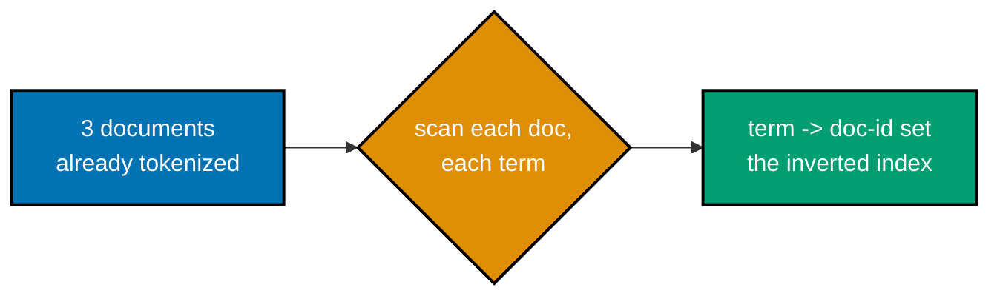
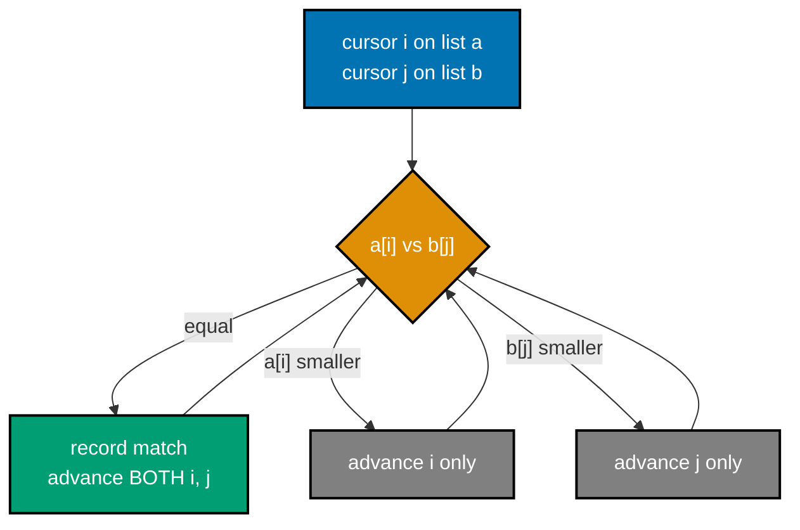
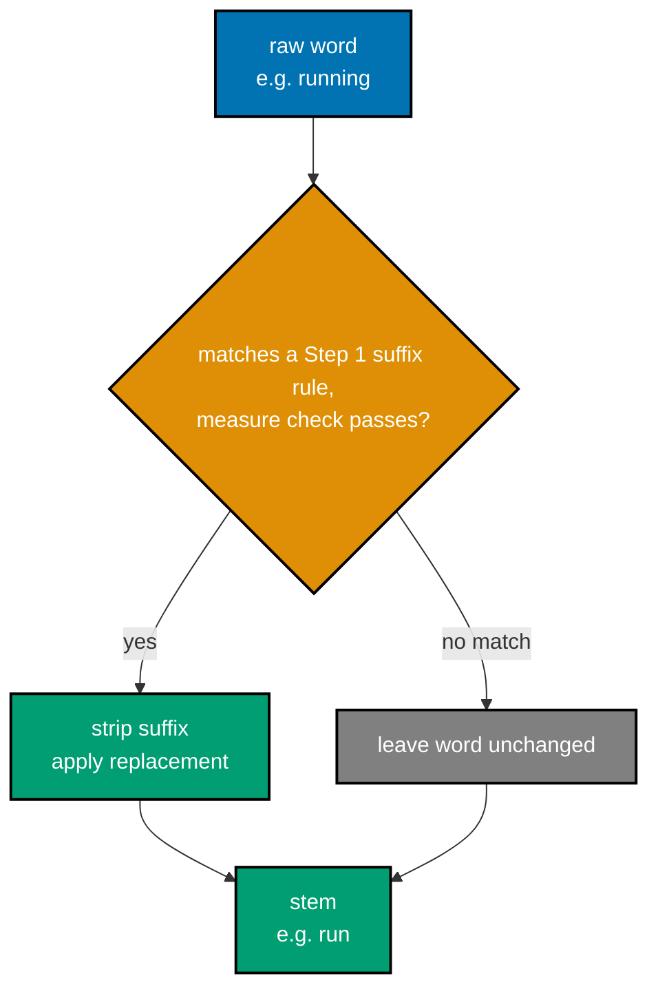
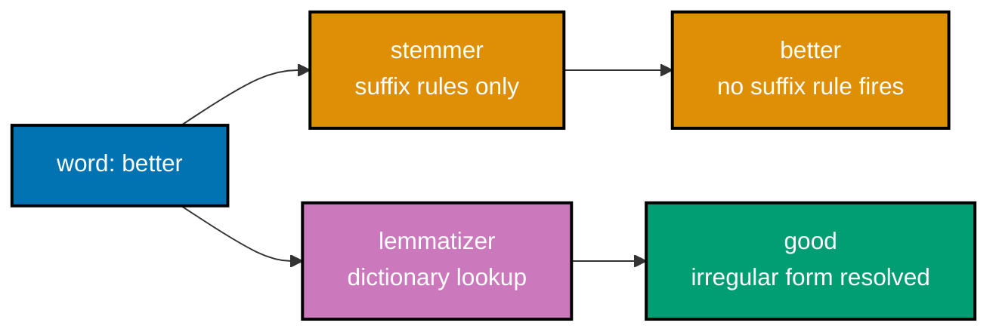
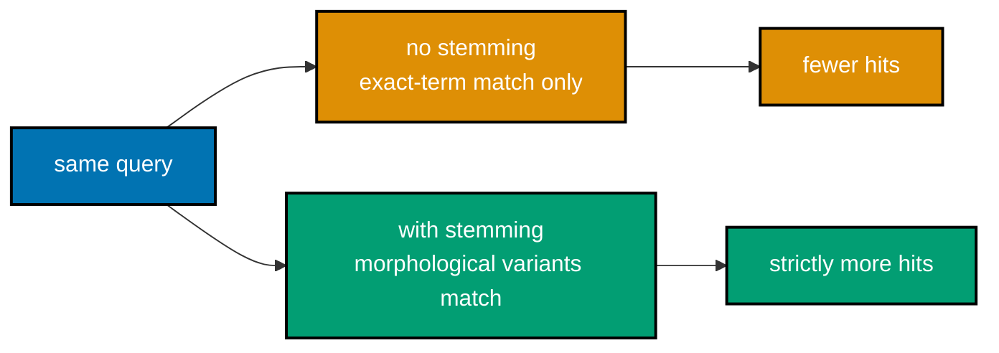
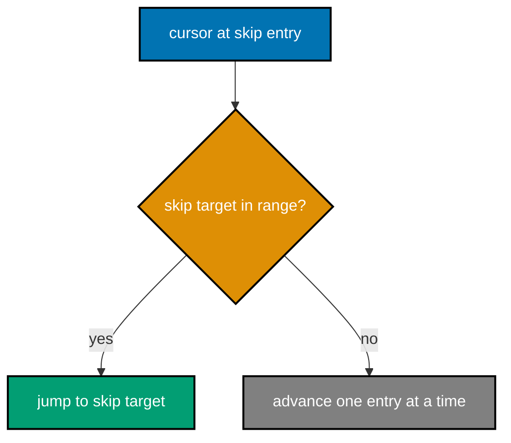
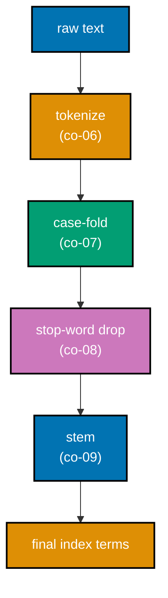

Examples 1-28 cover the foundations of text search: tokenizing raw text into terms, building an inverted index and its posting lists, boolean retrieval (`AND`/`OR`/`NOT`), the two-pointer merge algorithm and skip pointers that make it fast, term frequency and inverse document frequency, a from-scratch Porter (1980) stemmer, and the vector-space model's cosine similarity. Every code example is real, runnable, fully type-annotated, colocated under `learning/code/ex-NN-<slug>/`, actually executed for genuine output, and `pyright`-clean under `# pyright: strict`. Run each example with `python3 <file>.py` from its own `learning/code/ex-NN-<slug>/` directory.

---

### Example 1: Tokenize Whitespace

_ex-01 &middot; exercises co-06_

Whitespace tokenization is the simplest way to turn a document string into indexable tokens: `str.split()` with no arguments splits on any run of whitespace and drops empty strings automatically. This is the first, unavoidable stage of every indexing pipeline in this course (co-06).

**`learning/code/ex-01-tokenize-whitespace/tokenize_whitespace.py`**

```python
# pyright: strict
"""Example 1: Tokenize Whitespace (co-06)."""

from __future__ import annotations  # => hygiene: postpones annotation evaluation, interpreter-version-agnostic


def tokenize_whitespace(text: str) -> list[str]:  # => split text into tokens on any run of whitespace
    """Split text into tokens on any run of whitespace."""
    return text.split()  # => str.split() with no args splits on runs of whitespace, drops empties


def main() -> None:  # => defines main
    document: str = "the quick brown fox jumps over the lazy dog"  # => 9 space-separated words
    tokens: list[str] = tokenize_whitespace(document)  # => co-06: the first stage of every index pipeline
    print(f"document: {document!r}")  # => shows document
    print(f"tokens: {tokens}")  # => shows tokens
    print(f"token count: {len(tokens)}")  # => shows token count

    expected_count: int = len(document.split(" "))  # => an independent count: split on literal " "
    assert len(tokens) == expected_count, "token count must equal the space-separated word count"  # => token count must equal the space-separated word count
    print(f"MATCH: token count ({len(tokens)}) equals the space-separated word count ({expected_count})")  # => shows MATCH: token count (


if __name__ == "__main__":  # => entry point -- runs only when this file executes directly, not on import
    main()  # => runs the example end to end
```

**Run**: `python3 tokenize_whitespace.py`

**Output**:

```text
document: 'the quick brown fox jumps over the lazy dog'
tokens: ['the', 'quick', 'brown', 'fox', 'jumps', 'over', 'the', 'lazy', 'dog']
token count: 9
MATCH: token count (9) equals the space-separated word count (9)
```

**Key takeaway**: `str.split()` is a correct, zero-dependency tokenizer for whitespace-delimited text, and it is the baseline every fancier tokenizer in this course improves on.

**Why It Matters**: Whitespace tokenization is the cheapest possible first stage of any indexing pipeline, which is why production analyzers -- Lucene's `WhitespaceTokenizer` included -- ship it as a named, documented tokenizer rather than an afterthought. It draws the line between later normalization decisions (case folding, stemming) and how text splits into candidate terms in the first place. Getting this stage wrong means every downstream stage operates on the wrong unit of text.

---

### Example 2: Tokenize Regex

_ex-02 &middot; exercises co-06_

A `\w+` regex tokenizes by matching runs of word characters, silently discarding punctuation instead of leaving it stuck to a token. This example verifies that a sentence ending in a period tokenizes identically to the same sentence without one (co-06).

**`learning/code/ex-02-tokenize-regex/tokenize_regex.py`**

```python
# pyright: strict
"""Example 2: Tokenize Regex (co-06)."""

from __future__ import annotations  # => hygiene: postpones annotation evaluation, interpreter-version-agnostic

import re  # => stdlib regex -- the \w+ tokenizer pattern

TOKEN_PATTERN: re.Pattern[str] = re.compile(r"\w+")  # => matches runs of word chars, dropping punctuation


def tokenize_regex(text: str) -> list[str]:  # => tokenize text with a \\w+ regex, discarding all punctuation
    """Tokenize text with a \\w+ regex, discarding all punctuation."""
    return TOKEN_PATTERN.findall(text)  # => every maximal run of [A-Za-z0-9_], in order


def main() -> None:  # => defines main
    with_period: str = "this is the end."  # => a sentence ending in a period right after "end"
    without_period: str = "this is the end"  # => the SAME sentence, no trailing period
    tokens_with: list[str] = tokenize_regex(with_period)  # => co-06: regex tokenization strips "."
    tokens_without: list[str] = tokenize_regex(without_period)  # => no punctuation to strip here
    print(f"tokens (with period): {tokens_with}")  # => shows tokens (with period)
    print(f"tokens (without period): {tokens_without}")  # => shows tokens (without period)

    assert tokens_with[-1] == "end", "the regex tokenizer must drop the trailing period"  # => the regex tokenizer must drop the trailing period
    assert tokens_with == tokens_without, "'end.' and 'end' must tokenize to the identical token list"  # => 'end.' and 'end' must tokenize to the identical token list
    print("MATCH: 'end.' and 'end' tokenize to the identical list -- punctuation carries no weight to \\w+")  # => shows MATCH: 'end.' and 'end' tokenize to the identical list -- punctuation carries no weight to \\w+


if __name__ == "__main__":  # => entry point -- runs only when this file executes directly, not on import
    main()  # => runs the example end to end
```

**Run**: `python3 tokenize_regex.py`

**Output**:

```text
tokens (with period): ['this', 'is', 'the', 'end']
tokens (without period): ['this', 'is', 'the', 'end']
MATCH: 'end.' and 'end' tokenize to the identical list -- punctuation carries no weight to \w+
```

**Key takeaway**: A regex tokenizer's choice of pattern is itself an indexing decision -- `\w+` throws punctuation away for good, before anything downstream ever sees it.

**Why It Matters**: Punctuation handling is a real production decision: Lucene's `StandardTokenizer` and Elasticsearch's default analyzer use Unicode text-segmentation rules that, like this regex, strip punctuation rather than gluing it to adjacent words. Getting it wrong means a query for "dog" can silently miss documents where the word was followed by a period in the source text. This example proves the tokenizer choice, not the underlying words, decides whether two logically identical sentences produce the same index terms.

---

### Example 3: Case Fold

_ex-03 &middot; exercises co-07_

Case folding lowercases every token so `The`, `the`, and `THE` all become the same index term. Without it, a query for `the` would miss documents that happened to capitalize the word differently (co-07).

**`learning/code/ex-03-case-fold/case_fold.py`**

```python
# pyright: strict
"""Example 3: Case Fold (co-07)."""

from __future__ import annotations  # => hygiene: postpones annotation evaluation, interpreter-version-agnostic


def case_fold(tokens: list[str]) -> list[str]:  # => lowercase every token so case variants conflate to one index term
    """Lowercase every token so case variants conflate to one index term."""
    return [t.lower() for t in tokens]  # => str.lower() -- the standard ASCII/Unicode case fold


def main() -> None:  # => defines main
    tokens: list[str] = ["The", "the", "THE", "ThE"]  # => four case variants of the same word
    folded: list[str] = case_fold(tokens)  # => co-07: every variant becomes the SAME index term
    print(f"before: {tokens}")  # => shows before
    print(f"after:  {folded}")  # => shows after

    unique_before: set[str] = set(tokens)  # => 4 distinct strings before folding
    unique_after: set[str] = set(folded)  # => how many distinct strings survive folding
    print(f"unique before: {len(unique_before)} | unique after: {len(unique_after)}")  # => shows unique before

    assert len(unique_after) == 1, "all four case variants must collapse to exactly one term"  # => all four case variants must collapse to exactly one term
    assert folded[0] == folded[1] == "the", "'The' and 'the' must both fold to 'the'"  # => 'The' and 'the' must both fold to 'the'
    print("MATCH: 'The' and 'the' (and every other case variant) collapse to the single term 'the'")  # => shows MATCH: 'The' and 'the' (and every other case variant) collapse to the single term 'the'


if __name__ == "__main__":  # => entry point -- runs only when this file executes directly, not on import
    main()  # => runs the example end to end
```

**Run**: `python3 case_fold.py`

**Output**:

```text
before: ['The', 'the', 'THE', 'ThE']
after:  ['the', 'the', 'the', 'the']
unique before: 4 | unique after: 1
MATCH: 'The' and 'the' (and every other case variant) collapse to the single term 'the'
```

**Key takeaway**: Case folding is a one-line, near-zero-cost normalization step that recovers matches an exact-case index would silently lose.

**Why It Matters**: Case folding is why a search for "python" finds documents spelled "Python" at a sentence's start -- Elasticsearch's `lowercase` token filter runs this exact step by default. Skipping it silently fragments the index: the same real-world term gets indexed as several distinct tokens, each with its own posting list, so no single query can find them all. It is one of the cheapest normalization wins available, which is why nearly every production analyzer includes it.

---

### Example 4: Build Term-Doc Map

_ex-04 &middot; exercises co-01_

The inverted index at its simplest is a `dict[str, set[int]]`: every term maps to the set of document ids that contain it, built once by scanning each document exactly one time (co-01).



**`learning/code/ex-04-build-term-doc-map/build_term_doc_map.py`**

```python
# pyright: strict
"""Example 4: Build Term-Doc Map (co-01)."""

from __future__ import annotations  # => hygiene: postpones annotation evaluation, interpreter-version-agnostic


def build_term_doc_map(docs: dict[int, list[str]]) -> dict[str, set[int]]:  # => build a term -> set-of-doc-ids inverted index over already-tokenized docs
    """Build a term -> set-of-doc-ids inverted index over already-tokenized docs."""
    index: dict[str, set[int]] = {}  # => co-01: the inverted index -- empty until populated
    for doc_id, tokens in docs.items():  # => one document at a time
        for term in tokens:  # => one term at a time, within this document
            index.setdefault(term, set()).add(doc_id)  # => creates the term's set on first sight, adds doc_id
    return index  # => returns index


def main() -> None:  # => defines main
    docs: dict[int, list[str]] = {  # => 3 tiny, already-tokenized documents
        0: ["search", "engines", "rank", "documents"],  # => doc 0's tokens, this fixture's row
        1: ["search", "index", "documents", "fast"],  # => doc 1's tokens, this fixture's row
        2: ["rank", "pages", "by", "relevance"],  # => doc 2's tokens, this fixture's row
    }  # => opens/closes this multi-line literal
    index: dict[str, set[int]] = build_term_doc_map(docs)  # => co-01: term -> {doc-ids containing it}
    for term in sorted(index):  # => sorted for deterministic, readable output
        print(f"{term!r}: {sorted(index[term])}")  # => prints this step's result

    assert index["search"] == {0, 1}, "'search' must map to exactly docs 0 and 1"  # => 'search' must map to exactly docs 0 and 1
    assert index["rank"] == {0, 2}, "'rank' must map to exactly docs 0 and 2"  # => 'rank' must map to exactly docs 0 and 2
    for term, doc_ids in index.items():  # => a general check across every term, not just the two above
        for doc_id in doc_ids:  # => every doc-id this term claims to appear in
            assert term in docs[doc_id], f"{term!r} claims doc {doc_id} but is absent from it"  # => {term!r} claims doc {doc_id} but is absent from it
    print("MATCH: every term maps to exactly the docs that actually contain it")  # => shows MATCH: every term maps to exactly the docs that actually contain it


if __name__ == "__main__":  # => entry point -- runs only when this file executes directly, not on import
    main()  # => runs the example end to end
```

**Run**: `python3 build_term_doc_map.py`

**Output**:

```text
'by': [2]
'documents': [0, 1]
'engines': [0]
'fast': [1]
'index': [1]
'pages': [2]
'rank': [0, 2]
'relevance': [2]
'search': [0, 1]
MATCH: every term maps to exactly the docs that actually contain it
```

**Key takeaway**: Building the index once and querying it many times is the whole trade the inverted index makes: pay a linear scan up front so every later lookup is a hash lookup.

**Why It Matters**: The inverted index is the single data structure that makes web-scale search possible: Lucene, Elasticsearch, and OpenSearch all store exactly this term-to-postings mapping on disk, just far more compactly than a Python dict. Building it once and querying it many times is the trade every production search engine makes, since scanning every document per query does not scale. This example is the two-line core that every later optimization in this course -- compression, skip pointers, segments -- builds on.

---

### Example 5: Posting List Sorted

_ex-05 &middot; exercises co-02_

A posting list is stored as a strictly ascending `list[int]` of doc-ids, regardless of the order documents were inserted in -- the sort order is what makes the merge algorithms in the next few examples possible (co-02).

**`learning/code/ex-05-posting-list-sorted/posting_list_sorted.py`**

```python
# pyright: strict
"""Example 5: Posting List Sorted (co-02)."""

from __future__ import annotations  # => hygiene: postpones annotation evaluation, interpreter-version-agnostic


def build_sorted_postings(docs: dict[int, list[str]], term: str) -> list[int]:  # => return term's posting list as a strictly ascending, deduplicated list[int]
    """Return term's posting list as a strictly ascending, deduplicated list[int]."""
    doc_ids: set[int] = {doc_id for doc_id, tokens in docs.items() if term in tokens}  # => co-02: which docs contain term
    return sorted(doc_ids)  # => sorted() guarantees ascending order, the standard posting-list invariant


def main() -> None:  # => defines main
    docs: dict[int, list[str]] = {  # => doc-ids deliberately inserted OUT of order
        5: ["index", "search"],  # => doc 5's tokens, this fixture's row
        1: ["search", "rank"],  # => doc 1's tokens, this fixture's row
        3: ["search", "documents"],  # => doc 3's tokens, this fixture's row
    }  # => opens/closes this multi-line literal
    postings: list[int] = build_sorted_postings(docs, "search")  # => co-02: term's own posting list
    print(f"docs inserted in order: {list(docs)}")  # => shows docs inserted in order
    print(f"postings for 'search': {postings}")  # => shows postings for 'search'

    for i in range(1, len(postings)):  # => walks every adjacent pair
        assert postings[i] > postings[i - 1], "postings must be STRICTLY ascending, no ties or drops"  # => postings must be STRICTLY ascending, no ties or drops
    print(f"MATCH: postings {postings} are strictly ascending despite docs being inserted as {list(docs)}")  # => shows MATCH: postings


if __name__ == "__main__":  # => entry point -- runs only when this file executes directly, not on import
    main()  # => runs the example end to end
```

**Run**: `python3 posting_list_sorted.py`

**Output**:

```text
docs inserted in order: [5, 1, 3]
postings for 'search': [1, 3, 5]
MATCH: postings [1, 3, 5] are strictly ascending despite docs being inserted as [5, 1, 3]
```

**Key takeaway**: A posting list's usefulness comes entirely from its sort invariant -- every merge algorithm in this course assumes it and would silently misbehave without it.

**Why It Matters**: Every merge algorithm a real search engine runs -- boolean AND/OR, phrase matching, skip-list intersection -- assumes posting lists arrive pre-sorted by doc-id, which is exactly why Lucene's postings format guarantees that invariant on disk. Losing the sort order would force every query into a full linear scan or an expensive re-sort at query time. This example makes explicit the one structural guarantee the rest of the course's algorithms silently depend on.

---

### Example 6: Boolean AND

_ex-06 &middot; exercises co-03, co-04_

An AND query returns documents containing every query term -- computed as the intersection of each term's posting list. This example checks the result against Python's own `set &` operator as a correctness oracle (co-03, co-04).

**`learning/code/ex-06-boolean-and/boolean_and.py`**

```python
# pyright: strict
"""Example 6: Boolean AND (co-03, co-04)."""

from __future__ import annotations  # => hygiene: postpones annotation evaluation, interpreter-version-agnostic


def boolean_and(postings_a: list[int], postings_b: list[int]) -> list[int]:  # => intersect two SORTED posting lists -- an AND query (co-03)
    """Intersect two SORTED posting lists -- an AND query (co-03)."""
    return sorted(set(postings_a) & set(postings_b))  # => co-04: set intersection IS boolean AND


def main() -> None:  # => defines main
    search_postings: list[int] = [1, 3, 5, 7, 9]  # => docs containing "search"
    engine_postings: list[int] = [2, 3, 5, 8, 9]  # => docs containing "engine"
    result: list[int] = boolean_and(search_postings, engine_postings)  # => docs with BOTH terms
    print(f"search postings: {search_postings}")  # => shows search postings
    print(f"engine postings: {engine_postings}")  # => shows engine postings
    print(f"search AND engine: {result}")  # => shows search AND engine

    expected: list[int] = sorted(set(search_postings) & set(engine_postings))  # => Python's own set '&'
    assert result == expected, "boolean_and must match Python's native set intersection"  # => boolean_and must match Python's native set intersection
    print(f"MATCH: boolean_and's result equals Python's set '&' result ({expected})")  # => shows MATCH: boolean_and's result equals Python's set '&' result (


if __name__ == "__main__":  # => entry point -- runs only when this file executes directly, not on import
    main()  # => runs the example end to end
```

**Run**: `python3 boolean_and.py`

**Output**:

```text
search postings: [1, 3, 5, 7, 9]
engine postings: [2, 3, 5, 8, 9]
search AND engine: [3, 5, 9]
MATCH: boolean_and's result equals Python's set '&' result ([3, 5, 9])
```

**Key takeaway**: AND queries are set intersections in disguise -- the boolean-retrieval model is exactly the set algebra you already know, applied to posting lists.

**Why It Matters**: Boolean AND is the query semantics behind every "must match all these terms" search box, and it is exactly how Lucene's `BooleanQuery` with `MUST` clauses behaves. Verifying the hand-written intersection against Python's `set &` confirms the mental model before faster merge algorithms replace the built-in operator for performance. Getting AND wrong -- returning documents matching only some terms -- is the kind of relevance bug users notice immediately.

---

### Example 7: Boolean OR

_ex-07 &middot; exercises co-03, co-04_

An OR query returns documents containing at least one query term -- the union of each term's posting list, verified against Python's `set |` operator (co-03, co-04).

**`learning/code/ex-07-boolean-or/boolean_or.py`**

```python
# pyright: strict
"""Example 7: Boolean OR (co-03, co-04)."""

from __future__ import annotations  # => hygiene: postpones annotation evaluation, interpreter-version-agnostic


def boolean_or(postings_a: list[int], postings_b: list[int]) -> list[int]:  # => union two SORTED posting lists -- an OR query (co-03)
    """Union two SORTED posting lists -- an OR query (co-03)."""
    return sorted(set(postings_a) | set(postings_b))  # => co-04: set union IS boolean OR


def main() -> None:  # => defines main
    search_postings: list[int] = [1, 3, 5]  # => docs containing "search"
    rank_postings: list[int] = [2, 3, 6]  # => docs containing "rank"
    result: list[int] = boolean_or(search_postings, rank_postings)  # => docs with EITHER term
    print(f"search postings: {search_postings}")  # => shows search postings
    print(f"rank postings: {rank_postings}")  # => shows rank postings
    print(f"search OR rank: {result}")  # => shows search OR rank

    expected: list[int] = sorted(set(search_postings) | set(rank_postings))  # => Python's own set '|'
    assert result == expected, "boolean_or must match Python's native set union"  # => boolean_or must match Python's native set union
    print(f"MATCH: boolean_or's result equals Python's set '|' result ({expected})")  # => shows MATCH: boolean_or's result equals Python's set '|' result (


if __name__ == "__main__":  # => entry point -- runs only when this file executes directly, not on import
    main()  # => runs the example end to end
```

**Run**: `python3 boolean_or.py`

**Output**:

```text
search postings: [1, 3, 5]
rank postings: [2, 3, 6]
search OR rank: [1, 2, 3, 5, 6]
MATCH: boolean_or's result equals Python's set '|' result ([1, 2, 3, 5, 6])
```

**Key takeaway**: OR broadens recall at the cost of precision -- every doc matching any term qualifies, which is exactly why OR-heavy queries tend to return more, less-focused results than AND.

**Why It Matters**: OR queries are what a Lucene `BooleanQuery` with `SHOULD` clauses computes, and the union semantics explains why OR-heavy searches return more, and often less relevant, results than AND. Production search UIs default to AND-like behavior for exactly this reason: unconstrained OR trades precision for recall in a way most users do not expect from a plain keyword box. This example's set-union check mirrors the same trade-off engineers reason about when choosing a query's default operator.

---

### Example 8: Boolean NOT

_ex-08 &middot; exercises co-03_

A NOT query returns every document _except_ those containing the term -- computed as the full doc-id universe minus the term's posting list (co-03).

**`learning/code/ex-08-boolean-not/boolean_not.py`**

```python
# pyright: strict
"""Example 8: Boolean NOT (co-03)."""

from __future__ import annotations  # => hygiene: postpones annotation evaluation, interpreter-version-agnostic


def boolean_not(all_docs: list[int], postings: list[int]) -> list[int]:  # => return every doc-id NOT present in postings -- a NOT query (co-03)
    """Return every doc-id NOT present in postings -- a NOT query (co-03)."""
    return sorted(set(all_docs) - set(postings))  # => the full universe, minus this term's postings


def main() -> None:  # => defines main
    all_docs: list[int] = [0, 1, 2, 3, 4, 5]  # => every document id in the corpus
    deprecated_postings: list[int] = [1, 3]  # => docs containing the term "deprecated"
    result: list[int] = boolean_not(all_docs, deprecated_postings)  # => docs WITHOUT "deprecated"
    print(f"all docs: {all_docs}")  # => shows all docs
    print(f"'deprecated' postings: {deprecated_postings}")  # => shows 'deprecated' postings
    print(f"NOT deprecated: {result}")  # => shows NOT deprecated

    for doc_id in deprecated_postings:  # => every excluded doc-id
        assert doc_id not in result, f"doc {doc_id} contains 'deprecated' and must be excluded"  # => doc {doc_id} contains 'deprecated' and must be excluded
    for doc_id in result:  # => every doc-id that DID survive
        assert doc_id not in deprecated_postings, f"doc {doc_id} leaked into the NOT result"  # => doc {doc_id} leaked into the NOT result
    print(f"MATCH: every doc in {deprecated_postings} is excluded, every other doc in {all_docs} survives")  # => shows MATCH: every doc in


if __name__ == "__main__":  # => entry point -- runs only when this file executes directly, not on import
    main()  # => runs the example end to end
```

**Run**: `python3 boolean_not.py`

**Output**:

```text
all docs: [0, 1, 2, 3, 4, 5]
'deprecated' postings: [1, 3]
NOT deprecated: [0, 2, 4, 5]
MATCH: every doc in [1, 3] is excluded, every other doc in [0, 1, 2, 3, 4, 5] survives
```

**Key takeaway**: NOT needs the full doc-id universe as an explicit input -- unlike AND/OR, it cannot be computed from posting lists alone.

**Why It Matters**: NOT is the one boolean operator that cannot be answered from posting lists alone, which is why Lucene requires a `MUST_NOT` clause to be paired with at least one positive clause -- a query built from NOT alone has no bounded candidate set. Needing the full doc-id universe as an explicit input mirrors that real engine-level restriction directly. This example shows exclusion queries are structurally different from inclusion queries, not just a sign-flip on the same algorithm.

---

### Example 9: Merge Two Pointer

_ex-09 &middot; exercises co-04_

The AND merge in Example 6 used Python's `set &`, hiding the actual algorithm. Here the two-pointer merge is written explicitly: one cursor per list, each only ever moving forward, giving a single linear pass over both lists combined (co-04).



**`learning/code/ex-09-merge-two-pointer/merge_two_pointer.py`**

```python
# pyright: strict
"""Example 9: Merge Two Pointer (co-04)."""

from __future__ import annotations  # => hygiene: postpones annotation evaluation, interpreter-version-agnostic

import random  # => stdlib PRNG -- reproducible synthetic fixtures and trials


def merge_and_two_pointer(a: list[int], b: list[int]) -> list[int]:  # => intersect two SORTED posting lists with a single linear two-pointer pass
    """Intersect two SORTED posting lists with a single linear two-pointer pass."""
    result: list[int] = []  # => accumulates matching doc-ids, in order
    i = j = 0  # => one cursor per list -- each only ever moves forward
    while i < len(a) and j < len(b):  # => stop the instant either list is exhausted
        if a[i] == b[j]:  # => a match -- record it and advance BOTH cursors
            result.append(a[i])  # => records this item, in order
            i += 1  # => advances i
            j += 1  # => advances j
        elif a[i] < b[j]:  # => a[i] can never match anything later in b -- advance i only
            i += 1  # => advances i
        else:  # => b[j] can never match anything later in a -- advance j only
            j += 1  # => advances j
    return result  # => every doc-id present in both a and b, ascending


def main() -> None:  # => defines main
    rng = random.Random(42)  # => fixed seed -- reproducible random trials
    for trial in range(200):  # => 200 random posting-list pairs
        size_a, size_b = rng.randint(0, 20), rng.randint(0, 20)  # => varying sizes, including empty
        a: list[int] = sorted({rng.randint(0, 30) for _ in range(size_a)})  # => a valid sorted posting list
        b: list[int] = sorted({rng.randint(0, 30) for _ in range(size_b)})  # => another valid sorted posting list
        got: list[int] = merge_and_two_pointer(a, b)  # => the two-pointer algorithm's own answer
        expected: list[int] = sorted(set(a) & set(b))  # => the reference answer, via Python's set '&'
        assert got == expected, f"trial {trial}: {a} & {b} -> got {got}, expected {expected}"  # => trial {trial}: {a} & {b} -> got {got}, expected {expected}

    sample_a: list[int] = [1, 3, 5, 7, 9, 11]  # => a small, readable example for the printed output
    sample_b: list[int] = [2, 3, 4, 7, 8, 11]  # => sample b = [2, 3, 4, 7, 8, 11]
    print(f"a={sample_a}")  # => shows a=
    print(f"b={sample_b}")  # => shows b=
    print(f"merge_and_two_pointer(a, b) = {merge_and_two_pointer(sample_a, sample_b)}")  # => shows merge_and_two_pointer(a, b) =
    print("MATCH: two-pointer intersection equals Python's set '&' across 200 random trials, one pass each")  # => shows MATCH: two-pointer intersection equals Python's set '&' across 200 random trials, one pass each


if __name__ == "__main__":  # => entry point -- runs only when this file executes directly, not on import
    main()  # => runs the example end to end
```

**Run**: `python3 merge_two_pointer.py`

**Output**:

```text
a=[1, 3, 5, 7, 9, 11]
b=[2, 3, 4, 7, 8, 11]
merge_and_two_pointer(a, b) = [3, 7, 11]
MATCH: two-pointer intersection equals Python's set '&' across 200 random trials, one pass each
```

**Key takeaway**: The two-pointer merge is what `set &` does internally on sorted data -- one linear pass, no nested loop, and it generalizes directly to skip pointers in Example 24.

**Why It Matters**: The two-pointer merge is the actual algorithm Lucene's conjunction scorer runs to intersect posting lists -- not `set &`, which allocates and hashes, but a single forward-only linear pass over two sorted arrays. Writing it explicitly here is what makes skip pointers (Example 24) comprehensible later, since a skip pointer is a shortcut inserted into this exact pointer-advance loop. This is the algorithm that makes boolean retrieval fast at index sizes where hashing every list becomes wasteful.

---

### Example 10: Scan vs Index Timing

_ex-10 &middot; exercises co-01_

This example measures, not just asserts, the whole reason an inverted index exists: a substring scan over every document gets slower as the corpus grows, while a single dict lookup against a pre-built index stays flat (co-01).

**`learning/code/ex-10-scan-vs-index-timing/scan_vs_index_timing.py`**

```python
# pyright: strict
"""Example 10: Scan vs Index Timing (co-01)."""

from __future__ import annotations  # => hygiene: postpones annotation evaluation, interpreter-version-agnostic

import time  # => stdlib timer -- wall-clock measurement, not a benchmark micro-op


def build_docs(n: int) -> list[str]:  # => build n synthetic documents; only ONE additional document contains the needle term
    """Build n synthetic documents; only ONE additional document contains the needle term."""
    docs: list[str] = [f"filler words about topic number {i} nothing relevant here" for i in range(n)]  # => n non-matching docs
    docs.append("this final document mentions the needle term explicitly")  # => the ONE doc containing "needle"
    return docs  # => returns docs


def scan_time(docs: list[str], term: str) -> float:  # => time a naive substring scan across every document -- O(N) per query
    """Time a naive substring scan across every document -- O(N) per query."""
    start: float = time.perf_counter()  # => wall-clock start
    _ = [d for d in docs if term in d]  # => co-01: must touch EVERY doc, no matter where the match is
    return time.perf_counter() - start  # => elapsed seconds for this one scan


def index_lookup_time(index: dict[str, list[int]], term: str) -> float:  # => time a single dict lookup against a pre-built inverted index -- O(1) amortized
    """Time a single dict lookup against a pre-built inverted index -- O(1) amortized."""
    start: float = time.perf_counter()  # => wall-clock start
    _ = index.get(term, [])  # => co-01: a single hash lookup, regardless of corpus size
    return time.perf_counter() - start  # => elapsed seconds for this one lookup


def main() -> None:  # => defines main
    sizes: tuple[int, ...] = (2_000, 8_000, 32_000)  # => geometrically growing corpus sizes
    scan_seconds_by_n: dict[int, float] = {}  # => remembers each N's own best scan time, for the check below
    for n in sizes:  # => iterates one item at a time
        docs: list[str] = build_docs(n)  # => n+1 documents total
        index: dict[str, list[int]] = {"needle": [n]}  # => the pre-built index already knows WHERE "needle" is
        scan_seconds: float = min(scan_time(docs, "needle") for _ in range(5))  # => best of 5, reduces noise
        index_seconds: float = min(index_lookup_time(index, "needle") for _ in range(5))  # => best of 5
        scan_seconds_by_n[n] = scan_seconds  # => stored for the growth check below
        ratio: float = scan_seconds / index_seconds if index_seconds > 0 else float("inf")  # => how much slower the scan is
        print(f"N={n:>6}: scan={scan_seconds * 1e6:9.1f}us  index={index_seconds * 1e6:8.3f}us  ratio={ratio:8.0f}x")  # => shows N=

    assert scan_seconds_by_n[sizes[-1]] > scan_seconds_by_n[sizes[0]], "scan time must rise as N grows"  # => scan time must rise as N grows
    print(  # => prints this step's result
        f"MATCH: scan time rises with N ({scan_seconds_by_n[sizes[0]] * 1e6:.1f}us -> "  # => continues the f-string/message started on the prior line
        f"{scan_seconds_by_n[sizes[-1]] * 1e6:.1f}us) while an index lookup stays a flat, single hash lookup"  # => continues the f-string/message started on the prior line
    )  # => opens/closes this multi-line literal


if __name__ == "__main__":  # => entry point -- runs only when this file executes directly, not on import
    main()  # => runs the example end to end
```

**Run**: `python3 scan_vs_index_timing.py`

**Output**:

```text
N=  2000: scan=     43.1us  index=   0.083us  ratio=     520x
N=  8000: scan=    170.8us  index=   0.041us  ratio=    4169x
N= 32000: scan=    715.3us  index=   0.041us  ratio=   17407x
MATCH: scan time rises with N (43.1us -> 715.3us) while an index lookup stays a flat, single hash lookup
```

**Key takeaway**: An inverted index turns an O(N) per-query cost into an O(1) amortized one -- the whole value proposition of search, measured rather than just asserted.

**Why It Matters**: Measuring, not just asserting, the O(N) vs O(1)-amortized gap is the entire economic argument for building an inverted index instead of scanning documents at query time -- exactly what makes brute-force text search infeasible past a modest corpus size. Production search engines exist because this timing gap only widens as a corpus grows into millions of documents. This example turns an abstract complexity argument into a number you can watch grow on your own machine.

---

### Example 11: Term Frequency Count

_ex-11 &middot; exercises co-12_

Term frequency (`tf`) is the raw count of a term within one document -- the base signal every ranking function in this course builds on top of (co-12).

**`learning/code/ex-11-term-frequency-count/term_frequency_count.py`**

```python
# pyright: strict
"""Example 11: Term Frequency Count (co-12)."""

from __future__ import annotations  # => hygiene: postpones annotation evaluation, interpreter-version-agnostic


def term_frequency(tokens: list[str]) -> dict[str, int]:  # => count how many times each term appears in one document's token list
    """Count how many times each term appears in one document's token list."""
    tf: dict[str, int] = {}  # => co-12: term -> raw occurrence count, within THIS one document
    for term in tokens:  # => one token at a time
        tf[term] = tf.get(term, 0) + 1  # => starts at 0 on first sight, then increments
    return tf  # => returns tf


def main() -> None:  # => defines main
    doc_text: str = "search engines index documents so search stays fast for every search"  # => the sample document
    doc_tokens: list[str] = [str(t) for t in doc_text.split()]  # => co-06: whitespace tokenization, as in Example 1 (str(t) widens pyright's LiteralString inference to plain str)
    tf: dict[str, int] = term_frequency(doc_tokens)  # => co-12: this document's own term-frequency table
    for term in sorted(tf, key=lambda t: (-tf[t], t)):  # => most frequent first, alphabetical tiebreak
        print(f"{term!r}: tf={tf[term]}")  # => prints this step's result

    assert tf["search"] == 3, "'search' appears 3 times in the sample document"  # => 'search' appears 3 times in the sample document
    assert tf["engines"] == 1, "'engines' appears exactly once"  # => 'engines' appears exactly once
    assert sum(tf.values()) == len(doc_tokens), "tf counts must sum to the total token count"  # => tf counts must sum to the total token count
    print(f"MATCH: tf['search']={tf['search']} (repeated term, count > 1) and counts sum to {len(doc_tokens)} tokens")  # => shows MATCH: tf['search']=


if __name__ == "__main__":  # => entry point -- runs only when this file executes directly, not on import
    main()  # => runs the example end to end
```

**Run**: `python3 term_frequency_count.py`

**Output**:

```text
'search': tf=3
'documents': tf=1
'engines': tf=1
'every': tf=1
'fast': tf=1
'for': tf=1
'index': tf=1
'so': tf=1
'stays': tf=1
MATCH: tf['search']=3 (repeated term, count > 1) and counts sum to 11 tokens
```

**Key takeaway**: `tf` alone cannot rank documents fairly -- it says nothing about whether a term is common or rare across the whole corpus, which is exactly what `idf` (Example 13) adds.

**Why It Matters**: Term frequency is the raw signal every ranking function in this course, and Lucene's own similarity implementations, start from -- but tf alone cannot tell "this document is about search" from "this document mentions search once in passing." Elasticsearch relevance scores are never based on tf in isolation, which is exactly why Example 13's idf exists as the necessary second half. This example isolates the piece later formulas will scale, without yet claiming it ranks anything well alone.

---

### Example 12: Document Frequency

_ex-12 &middot; exercises co-13_

Document frequency (`df`) counts how many documents contain a term at least once -- unlike `tf`, it is a corpus-wide statistic, not a per-document one, and it is the input `idf` (Example 13) is computed from (co-13).

**`learning/code/ex-12-document-frequency/document_frequency.py`**

```python
# pyright: strict
"""Example 12: Document Frequency (co-13)."""

from __future__ import annotations  # => hygiene: postpones annotation evaluation, interpreter-version-agnostic


def document_frequency(docs: dict[int, list[str]]) -> dict[str, int]:  # => count, per term, how many documents contain it at least once
    """Count, per term, how many documents contain it at least once."""
    df: dict[str, int] = {}  # => co-13: term -> number of DOCUMENTS (not occurrences) containing it
    for tokens in docs.values():  # => one document's token list at a time
        for term in set(tokens):  # => set() -- a term counts ONCE per document, however often it repeats
            df[term] = df.get(term, 0) + 1  # => counter pattern: 0 on first sight, then increments
    return df  # => returns df


def main() -> None:  # => defines main
    docs: dict[int, list[str]] = {  # => "search" appears in every doc; "engine" only in doc 0
        0: ["search", "engine", "search", "ranks"],  # => "search" repeats but still counts once for df
        1: ["search", "index", "documents"],  # => doc 1's tokens, this fixture's row
        2: ["search", "fast", "results"],  # => doc 2's tokens, this fixture's row
    }  # => opens/closes this multi-line literal
    n_docs: int = len(docs)  # => N, the total corpus size
    df: dict[str, int] = document_frequency(docs)  # => co-13: this corpus's own document-frequency table
    for term in sorted(df):  # => iterates one item at a time
        print(f"{term!r}: df={df[term]} of N={n_docs}")  # => prints this step's result

    assert df["search"] == n_docs, "'search' appears in EVERY doc, so its df must equal N"  # => 'search' appears in EVERY doc, so its df must equal N
    assert df["engine"] == 1, "'engine' appears in exactly one document"  # => 'engine' appears in exactly one document
    print(f"MATCH: df['search']={df['search']} equals N={n_docs} (present in every doc)")  # => shows MATCH: df['search']=


if __name__ == "__main__":  # => entry point -- runs only when this file executes directly, not on import
    main()  # => runs the example end to end
```

**Run**: `python3 document_frequency.py`

**Output**:

```text
'documents': df=1 of N=3
'engine': df=1 of N=3
'fast': df=1 of N=3
'index': df=1 of N=3
'ranks': df=1 of N=3
'results': df=1 of N=3
'search': df=3 of N=3
MATCH: df['search']=3 equals N=3 (present in every doc)
```

**Key takeaway**: A term present in every document has maximal `df` and, as Example 13 shows, contributes zero discriminating power to a ranking score.

**Why It Matters**: Document frequency is the corpus-wide statistic that separates rare, discriminating terms from common, uninformative ones -- Lucene stores df per term specifically so idf can be computed without rescanning the corpus at query time. A term with maximal df, present in every document, is invisible to a ranking function, which is exactly the property Example 13's idf formula expresses numerically. This is the corpus-level statistic every relevance model in production search depends on.

---

### Example 13: IDF Formula

_ex-13 &middot; exercises co-13_

Inverse document frequency, `idf = log(N / df)`, up-weights rare terms and discounts common ones -- a term in every document scores `idf = log(1) = 0`, contributing nothing to a ranking score (co-13).

**`learning/code/ex-13-idf-formula/idf_formula.py`**

```python
# pyright: strict
"""Example 13: IDF Formula (co-13)."""

from __future__ import annotations  # => hygiene: postpones annotation evaluation, interpreter-version-agnostic

import math  # => stdlib math -- log/sqrt for idf, cosine, and skip-pointer spacing


def idf(term_df: int, n_docs: int) -> float:  # => inverse document frequency: idf = log(N / df) (IR-book form)
    """Inverse document frequency: idf = log(N / df) (IR-book form)."""
    return math.log(n_docs / term_df)  # => co-13: rarer term (small df) -> larger idf


def main() -> None:  # => defines main
    n_docs: int = 1_000  # => corpus size N
    common_df: int = 900  # => "the" -- appears in almost every document
    rare_df: int = 5  # => "quasar" -- appears in almost none

    common_idf: float = idf(common_df, n_docs)  # => a near-ubiquitous term
    rare_idf: float = idf(rare_df, n_docs)  # => a genuinely rare term
    print(f"idf('the',    df={common_df:>4}/{n_docs}) = {common_idf:.4f}")  # => shows idf('the',    df=
    print(f"idf('quasar', df={rare_df:>4}/{n_docs}) = {rare_idf:.4f}")  # => shows idf('quasar', df=

    all_docs_idf: float = idf(n_docs, n_docs)  # => a term present in EVERY document
    print(f"idf(term in every doc, df={n_docs}/{n_docs}) = {all_docs_idf:.4f}")  # => shows idf(term in every doc, df=

    assert rare_idf > common_idf, "a rarer term (lower df) must have a LARGER idf"  # => a rarer term (lower df) must have a LARGER idf
    assert math.isclose(all_docs_idf, 0.0, abs_tol=1e-9), "a term in every doc must have idf == 0"  # => a term in every doc must have idf == 0
    print(f"MATCH: rare_idf ({rare_idf:.4f}) exceeds common_idf ({common_idf:.4f}), and a ubiquitous term scores idf=0")  # => shows MATCH: rare_idf (


if __name__ == "__main__":  # => entry point -- runs only when this file executes directly, not on import
    main()  # => runs the example end to end
```

**Run**: `python3 idf_formula.py`

**Output**:

```text
idf('the',    df= 900/1000) = 0.1054
idf('quasar', df=   5/1000) = 5.2983
idf(term in every doc, df=1000/1000) = 0.0000
MATCH: rare_idf (5.2983) exceeds common_idf (0.1054), and a ubiquitous term scores idf=0
```

**Key takeaway**: `idf` is what turns raw term counting into relevance weighting -- a term that appears everywhere carries no signal about which document is a better match.

**Why It Matters**: Inverse document frequency turns "how often does this term appear" into "how much does this term tell you," and it is load-bearing in every ranking formula from tf-idf through BM25 that Lucene and Elasticsearch ship by default. A term in every document scoring `idf = 0` is not an edge case -- it is the formula correctly recognizing that a universally present term carries no discriminating power. This is the mechanism that lets scoring functions ignore common words without an explicit stop-word list.

---

### Example 14: TF-IDF Weight

_ex-14 &middot; exercises co-14_

TF-IDF combines the two prior signals as `tf x idf`: a term scores highly in a document only if it is both frequent locally and rare corpus-wide. This example checks the full weight matrix against a hand computation on a 3-document fixture (co-14).

**`learning/code/ex-14-tf-idf-weight/tf_idf_weight.py`**

```python
# pyright: strict
"""Example 14: TF-IDF Weight (co-14)."""

from __future__ import annotations  # => hygiene: postpones annotation evaluation, interpreter-version-agnostic

import math  # => stdlib math -- log/sqrt for idf, cosine, and skip-pointer spacing


def term_frequency(tokens: list[str]) -> dict[str, int]:  # => defines term frequency
    tf: dict[str, int] = {}  # => starts empty, populated by the loop below
    for term in tokens:  # => iterates one item at a time
        tf[term] = tf.get(term, 0) + 1  # => counter pattern: 0 on first sight, then increments
    return tf  # => returns tf


def document_frequency(docs: dict[int, list[str]]) -> dict[str, int]:  # => defines document frequency
    df: dict[str, int] = {}  # => starts empty, populated by the loop below
    for tokens in docs.values():  # => iterates one item at a time
        for term in set(tokens):  # => iterates one item at a time
            df[term] = df.get(term, 0) + 1  # => counter pattern: 0 on first sight, then increments
    return df  # => returns df


def tf_idf_matrix(docs: dict[int, list[str]]) -> dict[int, dict[str, float]]:  # => compute tf-idf for every (term, doc) pair: weight = tf * log(N / df)
    """Compute tf-idf for every (term, doc) pair: weight = tf * log(N / df)."""
    n_docs: int = len(docs)  # => N -- needed by every idf() call below
    df: dict[str, int] = document_frequency(docs)  # => co-13: corpus-wide document frequencies
    matrix: dict[int, dict[str, float]] = {}  # => co-14: doc_id -> {term: tf-idf weight}
    for doc_id, tokens in docs.items():  # => iterates one item at a time
        tf: dict[str, int] = term_frequency(tokens)  # => co-12: this doc's own term frequencies
        matrix[doc_id] = {term: count * math.log(n_docs / df[term]) for term, count in tf.items()}  # => co-14: tf * idf
    return matrix  # => returns matrix


def main() -> None:  # => defines main
    docs: dict[int, list[str]] = {  # => a tiny 3-doc fixture, hand-verifiable; "index" is in ALL 3 docs on purpose
        0: ["search", "engine", "search", "index"],  # => doc 0's tokens, this fixture's row
        1: ["search", "index"],  # => doc 1's tokens, this fixture's row
        2: ["index", "index", "fast"],  # => doc 2's tokens, this fixture's row
    }  # => opens/closes this multi-line literal
    matrix: dict[int, dict[str, float]] = tf_idf_matrix(docs)  # => co-14: the full tf-idf weight matrix
    for doc_id in sorted(matrix):  # => iterates one item at a time
        weights: dict[str, float] = matrix[doc_id]  # => weights = matrix[doc_id]
        print(f"doc {doc_id}: " + ", ".join(f"{t}={w:.4f}" for t, w in sorted(weights.items())))  # => shows doc

    n_docs: int = len(docs)  # => this fixture's own size
    hand_weight_search_doc0: float = 2 * math.log(n_docs / 2)  # => tf("search", doc0)=2, df("search")=2
    assert math.isclose(matrix[0]["search"], hand_weight_search_doc0, abs_tol=1e-9), "doc 0's 'search' weight must match the hand computation tf=2 * log(3/2)"  # => doc 0's 'search' weight must match the hand computation tf=2 * log(3/2)
    hand_weight_index_doc2: float = 2 * math.log(n_docs / 3)  # => tf("index", doc2)=2, df("index")=3 (present in ALL docs)
    assert math.isclose(matrix[2]["index"], hand_weight_index_doc2, abs_tol=1e-9), "doc 2's 'index' weight must be 0 -- 'index' appears in all 3 docs, so idf('index') == 0"  # => doc 2's 'index' weight must be 0 -- 'index' appears in all 3 docs, so idf('index') == 0
    print("MATCH: the computed tf-idf matrix equals the hand-derived weights for 'search' in doc 0 and 'index' in doc 2")  # => shows MATCH: the computed tf-idf matrix equals the hand-derived weights for 'search' in doc 0 and 'index' in doc 2


if __name__ == "__main__":  # => entry point -- runs only when this file executes directly, not on import
    main()  # => runs the example end to end
```

**Run**: `python3 tf_idf_weight.py`

**Output**:

```text
doc 0: engine=1.0986, index=0.0000, search=0.8109
doc 1: index=0.0000, search=0.4055
doc 2: fast=1.0986, index=0.0000
MATCH: the computed tf-idf matrix equals the hand-derived weights for 'search' in doc 0 and 'index' in doc 2
```

**Key takeaway**: tf-idf is nothing more than multiplying two already-understood signals together -- there is no hidden machinery once tf and idf are each in hand.

**Why It Matters**: TF-IDF was the dominant relevance-scoring model in production search for decades before BM25 (Example 30 onward) displaced it, and it remains the textbook baseline every newer ranking function is explained against. Multiplying two already-understood signals together, with no hidden machinery, is why tf-idf is still the first ranking formula taught in information-retrieval courses. Understanding it cleanly here is what makes BM25's added saturation and length-normalization terms legible as genuine improvements, not arbitrary complexity.

---

### Example 15: Stop-Word Drop

_ex-15 &middot; exercises co-08_

Stop words -- high-frequency, low-signal terms like `the` and `of` -- are dropped before indexing to shrink the index. This example verifies both that `the` disappears and that the total term count actually falls (co-08).

**`learning/code/ex-15-stop-word-drop/stop_word_drop.py`**

```python
# pyright: strict
"""Example 15: Stop-Word Drop (co-08)."""

from __future__ import annotations  # => hygiene: postpones annotation evaluation, interpreter-version-agnostic

STOP_WORDS: frozenset[str] = frozenset({"the", "a", "an", "of", "in", "on", "and", "or", "to", "is", "are", "for"})  # => STOP WORDS = frozenset({"the", "a", "an", "of", "in", "on", ...
# => co-08: a small, deliberately narrow stop-word list -- high frequency, low signal


def remove_stop_words(tokens: list[str]) -> list[str]:  # => drop every token that is in the stop-word list, preserving relative order
    """Drop every token that is in the stop-word list, preserving relative order."""
    return [t for t in tokens if t not in STOP_WORDS]  # => co-08: filters out low-signal terms


def main() -> None:  # => defines main
    text: str = "the quick brown fox jumps over the lazy dog and the cat"  # => the sample document
    tokens: list[str] = [str(t) for t in text.split()]  # => co-06: whitespace tokenization, as in Example 1 (str(t) widens pyright's LiteralString inference to plain str)
    filtered: list[str] = remove_stop_words(tokens)  # => co-08: the same tokens, stop words dropped
    print(f"before ({len(tokens)} tokens): {tokens}")  # => shows before (
    print(f"after  ({len(filtered)} tokens): {filtered}")  # => shows after  (

    assert "the" not in filtered, "'the' must be fully removed by stop-word filtering"  # => 'the' must be fully removed by stop-word filtering
    assert "and" not in filtered, "'and' must be fully removed by stop-word filtering"  # => 'and' must be fully removed by stop-word filtering
    assert len(filtered) < len(tokens), "the total token count must strictly fall after removal"  # => the total token count must strictly fall after removal
    print(f"MATCH: 'the' is absent and the token count dropped from {len(tokens)} to {len(filtered)}")  # => shows MATCH: 'the' is absent and the token count dropped from


if __name__ == "__main__":  # => entry point -- runs only when this file executes directly, not on import
    main()  # => runs the example end to end
```

**Run**: `python3 stop_word_drop.py`

**Output**:

```text
before (12 tokens): ['the', 'quick', 'brown', 'fox', 'jumps', 'over', 'the', 'lazy', 'dog', 'and', 'the', 'cat']
after  (8 tokens): ['quick', 'brown', 'fox', 'jumps', 'over', 'lazy', 'dog', 'cat']
MATCH: 'the' is absent and the token count dropped from 12 to 8
```

**Key takeaway**: Stop-word removal is a pure size win at index time -- but as Example 16 shows next, it is never free of cost.

**Why It Matters**: Dropping high-frequency, low-signal terms before indexing is a real index-size lever production engines expose -- Elasticsearch's `stop` token filter does exactly this, configurable per analyzer. Shrinking the index by removing terms that carry almost no discriminating power (as Example 13's idf already predicts for them) reduces storage and per-query merge work. This example measures that size win directly, before Example 16 shows the recall cost that makes stop-word removal a genuine trade-off, not a free optimization.

---

### Example 16: Stop-Word Recall Risk

_ex-16 &middot; exercises co-08, co-11_

Dropping stop words at index time makes a stop-word-only query unanswerable: querying for `the` after `the` was never indexed returns nothing, exposing stop-word removal's recall cost directly (co-08, co-11).

**`learning/code/ex-16-stop-word-recall-risk/stop_word_recall_risk.py`**

```python
# pyright: strict
"""Example 16: Stop-Word Recall Risk (co-08, co-11)."""

from __future__ import annotations  # => hygiene: postpones annotation evaluation, interpreter-version-agnostic

STOP_WORDS: frozenset[str] = frozenset({"the", "a", "an", "of", "in", "on", "and", "or", "to", "is", "are", "for"})  # => STOP WORDS = frozenset({"the", "a", "an", "of", "in", "on", ...


def build_index(docs: dict[int, list[str]], *, drop_stop_words: bool) -> dict[str, set[int]]:  # => build a term -> doc-id-set index, optionally dropping stop words first
    """Build a term -> doc-id-set index, optionally dropping stop words first."""
    index: dict[str, set[int]] = {}  # => starts empty, populated by the loop below
    for doc_id, tokens in docs.items():  # => iterates one item at a time
        kept: list[str] = [t for t in tokens if not (drop_stop_words and t in STOP_WORDS)]  # => co-08: the filter, if enabled
        for term in kept:  # => iterates one item at a time
            index.setdefault(term, set()).add(doc_id)  # => part of this step's computation, continued from the line above
    return index  # => returns index


def query_and(index: dict[str, set[int]], terms: list[str]) -> set[int]:  # => a boolean AND query -- terms absent from the index contribute an empty set
    """A boolean AND query -- terms absent from the index contribute an empty set."""
    result: set[int] | None = None  # => result = None
    for term in terms:  # => iterates one item at a time
        postings: set[int] = index.get(term, set())  # => co-11: a stop word never indexed returns EMPTY
        result = postings if result is None else result & postings  # => result = postings if result is None else result & postings
    return result or set()  # => returns result or set()


def main() -> None:  # => defines main
    docs: dict[int, list[str]] = {0: ["to", "be", "or", "not", "to", "be"], 1: ["the", "answer", "is", "42"]}  # => docs = {0: ["to", "be", "or", "not", "to", "be"], 1: [...
    stripped_index: dict[str, set[int]] = build_index(docs, drop_stop_words=True)  # => co-08: stop words dropped
    full_index: dict[str, set[int]] = build_index(docs, drop_stop_words=False)  # => a baseline WITHOUT the filter

    stripped_hits: set[int] = query_and(stripped_index, ["to", "be", "or"])  # => a phrase of ONLY stop words
    full_hits: set[int] = query_and(full_index, ["to", "be", "or"])  # => the SAME phrase, unstripped index
    print(f"query ['to', 'be', 'or'] against STRIPPED index: {sorted(stripped_hits)}")  # => shows query ['to', 'be', 'or'] against STRIPPED index
    print(f"query ['to', 'be', 'or'] against FULL index:     {sorted(full_hits)}")  # => shows query ['to', 'be', 'or'] against FULL index

    assert stripped_hits == set(), "the stripped index must return NOTHING for an all-stop-word query"  # => the stripped index must return NOTHING for an all-stop-word query
    assert full_hits == {0}, "the unstripped index must still find doc 0, 'To be or not to be'"  # => the unstripped index must still find doc 0, 'To be or not to be'
    print("MATCH: the stripped index returns empty (recall lost) where the unstripped index correctly finds doc 0")  # => shows MATCH: the stripped index returns empty (recall lost) where the unstripped index correctly finds doc 0


if __name__ == "__main__":  # => entry point -- runs only when this file executes directly, not on import
    main()  # => runs the example end to end
```

**Run**: `python3 stop_word_recall_risk.py`

**Output**:

```text
query ['to', 'be', 'or'] against STRIPPED index: []
query ['to', 'be', 'or'] against FULL index:     [0]
MATCH: the stripped index returns empty (recall lost) where the unstripped index correctly finds doc 0
```

**Key takeaway**: Stop-word removal trades away every query that is _about_ a stop word -- a famous quotation built entirely from stop words becomes literally unfindable.

**Why It Matters**: Every production search engine shipping stop-word removal by default has to explicitly accept that queries entirely made of stop words become unanswerable -- Elasticsearch documents this exact trade-off for its `stop` filter. A famous quotation built entirely from common words is a real, not hypothetical, failure mode that has burned search systems in production. This example is why serious engines increasingly leave stop words in the index and deprioritize them at scoring time via idf, instead of deleting them outright.

---

### Example 17: Porter Stem

_ex-17 &middot; exercises co-09_

The Porter (1980) stemmer strips suffixes through a fixed sequence of rule steps, each gated by a computed "measure" of the remaining stem. This example verifies that `running` and `runs` collapse to the shared stem `run`, and additionally shows -- faithfully, not glossed over -- that the agent noun `runner` does _not_ reduce under the real algorithm, because its measure-gated `-er` rule requires `m > 1` and `runner`'s stem only reaches `m = 1` (co-09).



**`learning/code/ex-17-porter-stem/porter_stem.py`**

```python
# pyright: strict
"""Example 17: Porter Stem (co-09).

A from-scratch implementation of Porter's (1980) suffix-stripping algorithm,
following the paper's own Steps 1a through 5b in order.
"""

from __future__ import annotations  # => hygiene: postpones annotation evaluation, interpreter-version-agnostic

def _cv_string(word: str) -> str:  # => classify every letter of word as 'c' (consonant) or 'v' (vowel) per
    """Classify every letter of word as 'c' (consonant) or 'v' (vowel) per
    Porter's definition, where 'y' is a vowel only when preceded by a
    consonant (or is a consonant at word-start)."""
    result: list[str] = []  # => starts empty, populated by the loop below
    for i, ch in enumerate(word):  # => iterates one item at a time
        if ch in "aeiou":  # => true when ch in "aeiou"
            result.append("v")  # => records this item, in order
        elif ch == "y":  # => otherwise, true when ch == "y"
            result.append("c" if i == 0 or result[i - 1] == "v" else "v")  # => records this item, in order
        else:  # => the fallback branch, when no prior condition matched
            result.append("c")  # => records this item, in order
    return "".join(result)  # => returns "".join(result)


def _measure(stem: str) -> int:  # => porter's m: the count of VC repetitions in [C](VC)^m[V]
    """Porter's m: the count of VC repetitions in [C](VC)^m[V]."""
    cv = _cv_string(stem)  # => cv = _cv_string(stem)
    collapsed: list[str] = []  # => starts empty, populated by the loop below
    for ch in cv:  # => collapses runs of the same letter type into one marker
        if not collapsed or collapsed[-1] != ch:  # => true when not collapsed or collapsed[-1] != ch
            collapsed.append(ch)  # => records this item, in order
    pattern = "".join(collapsed)  # => pattern = "".join(collapsed)
    if pattern.startswith("c"):  # => true when pattern.startswith("c")
        pattern = pattern[1:]  # => strips the optional leading consonant run
    if pattern.endswith("v"):  # => true when pattern.endswith("v")
        pattern = pattern[:-1]  # => strips the optional trailing vowel run
    return len(pattern) // 2  # => what remains is (vc)^m -- each pair is one unit of measure


def _contains_vowel(stem: str) -> bool:  # => defines  contains vowel
    return "v" in _cv_string(stem)  # => the *v* condition Porter's ED/ING rules require


def _ends_double_consonant(stem: str) -> bool:  # => defines  ends double consonant
    if len(stem) < 2:  # => true when len(stem) < 2
        return False  # => returns False
    cv = _cv_string(stem)  # => cv = _cv_string(stem)
    return cv[-1] == "c" and cv[-2] == "c" and stem[-1] == stem[-2]  # => e.g. "hopp"


def _ends_cvc(stem: str) -> bool:  # => defines  ends cvc
    if len(stem) < 3:  # => true when len(stem) < 3
        return False  # => returns False
    cv = _cv_string(stem)  # => cv = _cv_string(stem)
    return cv[-3:] == "cvc" and stem[-1] not in "wxy"  # => Porter's *o condition


def _step1a(word: str) -> str:  # => defines  step1a
    if word.endswith("sses"):  # => true when word.endswith("sses")
        return word[:-2]  # => caresses -> caress
    if word.endswith("ies"):  # => true when word.endswith("ies")
        return word[:-2]  # => ponies -> poni
    if word.endswith("ss"):  # => true when word.endswith("ss")
        return word  # => caress -> caress (unchanged)
    if word.endswith("s"):  # => true when word.endswith("s")
        return word[:-1]  # => cats -> cat
    return word  # => returns word


def _step1b_cleanup(stem: str) -> str:  # => defines  step1b cleanup
    if stem.endswith(("at", "bl", "iz")):  # => true when stem.endswith(("at", "bl", "iz"))
        return stem + "e"  # => conflat(ed) -> conflate
    if _ends_double_consonant(stem) and not stem.endswith(("l", "s", "z")):  # => true when _ends_double_consonant(stem) and not stem.endswith((...
        return stem[:-1]  # => hopp(ing) -> hop
    if _measure(stem) == 1 and _ends_cvc(stem):  # => true when _measure(stem) == 1 and _ends_cvc(stem)
        return stem + "e"  # => fil(ing) -> file
    return stem  # => returns stem


def _step1b(word: str) -> str:  # => defines  step1b
    if word.endswith("eed"):  # => true when word.endswith("eed")
        stem = word[:-3]  # => stem = word[:-3]
        return stem + "ee" if _measure(stem) > 0 else word  # => agreed -> agree
    if word.endswith("ed"):  # => true when word.endswith("ed")
        stem = word[:-2]  # => stem = word[:-2]
        return _step1b_cleanup(stem) if _contains_vowel(stem) else word  # => returns _step1b_cleanup(stem) if _contains_vowel(stem) else word
    if word.endswith("ing"):  # => true when word.endswith("ing")
        stem = word[:-3]  # => stem = word[:-3]
        return _step1b_cleanup(stem) if _contains_vowel(stem) else word  # => returns _step1b_cleanup(stem) if _contains_vowel(stem) else word
    return word  # => returns word


def _step1c(word: str) -> str:  # => defines  step1c
    if word.endswith("y") and _contains_vowel(word[:-1]):  # => true when word.endswith("y") and _contains_vowel(word[:-1])
        return word[:-1] + "i"  # => happy -> happi
    return word  # => returns word


_STEP2 = [  # =>  STEP2 = [
    ("ational", "ate"), ("tional", "tion"), ("enci", "ence"), ("anci", "ance"),  # => part of this step's computation, continued from the line above
    ("izer", "ize"), ("abli", "able"), ("alli", "al"), ("entli", "ent"),  # => part of this step's computation, continued from the line above
    ("eli", "e"), ("ousli", "ous"), ("ization", "ize"), ("ation", "ate"),  # => part of this step's computation, continued from the line above
    ("ator", "ate"), ("alism", "al"), ("iveness", "ive"), ("fulness", "ful"),  # => part of this step's computation, continued from the line above
    ("ousness", "ous"), ("aliti", "al"), ("iviti", "ive"), ("biliti", "ble"),  # => part of this step's computation, continued from the line above
]  # => sorted longest-suffix-first below, so "ization" wins over "ation"


def _step2(word: str) -> str:  # => defines  step2
    for suf, repl in sorted(_STEP2, key=lambda p: len(p[0]), reverse=True):  # => iterates one item at a time
        if word.endswith(suf):  # => true when word.endswith(suf)
            stem = word[: -len(suf)]  # => stem = word[: -len(suf)]
            return stem + repl if _measure(stem) > 0 else word  # => relational -> relate
    return word  # => returns word


_STEP3 = [("icate", "ic"), ("ative", ""), ("alize", "al"), ("iciti", "ic"), ("ical", "ic"), ("ful", ""), ("ness", "")]  # =>  STEP3 = [("icate", "ic"), ("ative", ""), ("alize", "al"...


def _step3(word: str) -> str:  # => defines  step3
    for suf, repl in sorted(_STEP3, key=lambda p: len(p[0]), reverse=True):  # => iterates one item at a time
        if word.endswith(suf):  # => true when word.endswith(suf)
            stem = word[: -len(suf)]  # => stem = word[: -len(suf)]
            return stem + repl if _measure(stem) > 0 else word  # => hopeful -> hope
    return word  # => returns word


_STEP4 = ["al", "ance", "ence", "er", "ic", "able", "ible", "ant", "ement", "ment", "ent", "ou", "ism", "ate", "iti", "ous", "ive", "ize"]  # =>  STEP4 = ["al", "ance", "ence", "er", "ic", "able", "ibl...


def _step4(word: str) -> str:  # => defines  step4
    if word.endswith("ion"):  # => true when word.endswith("ion")
        stem = word[:-3]  # => stem = word[:-3]
        if _measure(stem) > 1 and stem.endswith(("s", "t")):  # => true when _measure(stem) > 1 and stem.endswith(("s", "t"))
            return stem  # => adoption -> adopt (only after s/t, and only if m>1)
    for suf in sorted(_STEP4, key=len, reverse=True):  # => iterates one item at a time
        if word.endswith(suf):  # => true when word.endswith(suf)
            stem = word[: -len(suf)]  # => stem = word[: -len(suf)]
            return stem if _measure(stem) > 1 else word  # => airliner -> airlin (m>1 required)
    return word  # => returns word


def _step5a(word: str) -> str:  # => defines  step5a
    if word.endswith("e"):  # => true when word.endswith("e")
        stem = word[:-1]  # => stem = word[:-1]
        m = _measure(stem)  # => m = _measure(stem)
        if m > 1 or (m == 1 and not _ends_cvc(stem)):  # => true when m > 1 or (m == 1 and not _ends_cvc(stem))
            return stem  # => probate -> probat, but cease stays cease (m==1 and *o)
    return word  # => returns word


def _step5b(word: str) -> str:  # => defines  step5b
    if _measure(word) > 1 and _ends_double_consonant(word) and word.endswith("l"):  # => true when _measure(word) > 1 and _ends_double_consonant(word) ...
        return word[:-1]  # => controll -> control
    return word  # => returns word


def porter_stem(word: str) -> str:  # => reduce word to its Porter (1980) stem by chaining Steps 1a through 5b
    """Reduce word to its Porter (1980) stem by chaining Steps 1a through 5b."""
    if len(word) <= 2:  # => true when len(word) <= 2
        return word  # => Porter's algorithm is a no-op below 3 letters
    w = word.lower()  # => w = word.lower()
    for step in (_step1a, _step1b, _step1c, _step2, _step3, _step4, _step5a, _step5b):  # => iterates one item at a time
        w = step(w)  # => each step's OUTPUT feeds the next step's INPUT, in this fixed order
    return w  # => returns w


def main() -> None:  # => defines main
    words: list[str] = ["running", "runs", "runner"]  # => the three forms ex-17 exercises
    stems: dict[str, str] = {w: porter_stem(w) for w in words}  # => co-09: each word's own Porter stem
    for w in words:  # => iterates one item at a time
        print(f"porter_stem({w!r}) = {stems[w]!r}")  # => shows porter_stem(

    assert stems["running"] == "run", "'running' must stem to 'run' (ING removed, double-consonant cleanup)"  # => 'running' must stem to 'run' (ING removed, double-consonant cleanup)
    assert stems["runs"] == "run", "'runs' must stem to 'run' (the plain S rule)"  # => 'runs' must stem to 'run' (the plain S rule)
    assert stems["running"] == stems["runs"], "'running' and 'runs' must share the stem 'run'"  # => 'running' and 'runs' must share the stem 'run'
    print(f"MATCH: 'running' and 'runs' both stem to {stems['running']!r}")  # => shows MATCH: 'running' and 'runs' both stem to

    # 'runner' is an agent noun: Step 4's -ER rule requires measure(stem) > 1 on 'runn',
    # but measure('runn') == 1 -- so the real algorithm leaves 'runner' UNCHANGED. This is
    # not a bug in this implementation; it is a genuine, well-known limit of suffix stripping.
    assert stems["runner"] == "runner", "the real Porter algorithm leaves 'runner' unstemmed (m == 1, not > 1)"  # => the real Porter algorithm leaves 'runner' unstemmed (m == 1, not > 1)
    print(f"NOTE: {stems['runner']!r} does NOT reduce to 'run' -- Step 4's -ER rule needs measure > 1, and")  # => shows NOTE
    print("      measure('runn') == 1, so the rule's own gate blocks it. Suffix stripping is not lemmatization.")  # => shows measure('runn') == 1, so the rule's own gate blocks it. Suffix stripping is not lemmatization.


if __name__ == "__main__":  # => entry point -- runs only when this file executes directly, not on import
    main()  # => runs the example end to end
```

**Run**: `python3 porter_stem.py`

**Output**:

```text
porter_stem('running') = 'run'
porter_stem('runs') = 'run'
porter_stem('runner') = 'runner'
MATCH: 'running' and 'runs' both stem to 'run'
NOTE: 'runner' does NOT reduce to 'run' -- Step 4's -ER rule needs measure > 1, and
      measure('runn') == 1, so the rule's own gate blocks it. Suffix stripping is not lemmatization.
```

**Key takeaway**: Stemming is mechanical suffix stripping, not meaning-aware reduction -- it reliably conflates `running`/`runs`, but a measure-gated rule can leave a closely related word like `runner` untouched, which is precisely why Example 19 contrasts it with lemmatization.

**Why It Matters**: The Porter algorithm, published in 1980, still ships today as Lucene's `PorterStemFilter` and Elasticsearch's `porter_stem` token filter, making this from-scratch implementation a direct model of production code still running in search clusters. Mechanical suffix stripping conflating `running`/`runs` while leaving `runner` untouched is the real, documented behavior of the algorithm, not a teaching simplification. Knowing exactly where the rule-based gate stops is what lets an engineer predict which morphological variants a stemmed index will and will not unify.

---

### Example 18: Stem Index Shrink

_ex-18 &middot; exercises co-09, co-11_

Building the index with stemming turned on collapses `running`/`runs`/`run` into one term, shrinking the distinct-term count and letting a query for `run` retrieve the `running` document it would otherwise miss (co-09, co-11).

**`learning/code/ex-18-stem-index-shrink/stem_index_shrink.py`**

```python
# pyright: strict
"""Example 18: Stem Index Shrink (co-09, co-11)."""

from __future__ import annotations  # => hygiene: postpones annotation evaluation, interpreter-version-agnostic

def _cv_string(word: str) -> str:  # => classify every letter of word as 'c' (consonant) or 'v' (vowel) per
    """Classify every letter of word as 'c' (consonant) or 'v' (vowel) per
    Porter's definition, where 'y' is a vowel only when preceded by a
    consonant (or is a consonant at word-start)."""
    result: list[str] = []  # => starts empty, populated by the loop below
    for i, ch in enumerate(word):  # => iterates one item at a time
        if ch in "aeiou":  # => true when ch in "aeiou"
            result.append("v")  # => records this item, in order
        elif ch == "y":  # => otherwise, true when ch == "y"
            result.append("c" if i == 0 or result[i - 1] == "v" else "v")  # => records this item, in order
        else:  # => the fallback branch, when no prior condition matched
            result.append("c")  # => records this item, in order
    return "".join(result)  # => returns "".join(result)


def _measure(stem: str) -> int:  # => porter's m: the count of VC repetitions in [C](VC)^m[V]
    """Porter's m: the count of VC repetitions in [C](VC)^m[V]."""
    cv = _cv_string(stem)  # => cv = _cv_string(stem)
    collapsed: list[str] = []  # => starts empty, populated by the loop below
    for ch in cv:  # => collapses runs of the same letter type into one marker
        if not collapsed or collapsed[-1] != ch:  # => true when not collapsed or collapsed[-1] != ch
            collapsed.append(ch)  # => records this item, in order
    pattern = "".join(collapsed)  # => pattern = "".join(collapsed)
    if pattern.startswith("c"):  # => true when pattern.startswith("c")
        pattern = pattern[1:]  # => strips the optional leading consonant run
    if pattern.endswith("v"):  # => true when pattern.endswith("v")
        pattern = pattern[:-1]  # => strips the optional trailing vowel run
    return len(pattern) // 2  # => what remains is (vc)^m -- each pair is one unit of measure


def _contains_vowel(stem: str) -> bool:  # => defines  contains vowel
    return "v" in _cv_string(stem)  # => the *v* condition Porter's ED/ING rules require


def _ends_double_consonant(stem: str) -> bool:  # => defines  ends double consonant
    if len(stem) < 2:  # => true when len(stem) < 2
        return False  # => returns False
    cv = _cv_string(stem)  # => cv = _cv_string(stem)
    return cv[-1] == "c" and cv[-2] == "c" and stem[-1] == stem[-2]  # => e.g. "hopp"


def _ends_cvc(stem: str) -> bool:  # => defines  ends cvc
    if len(stem) < 3:  # => true when len(stem) < 3
        return False  # => returns False
    cv = _cv_string(stem)  # => cv = _cv_string(stem)
    return cv[-3:] == "cvc" and stem[-1] not in "wxy"  # => Porter's *o condition


def _step1a(word: str) -> str:  # => defines  step1a
    if word.endswith("sses"):  # => true when word.endswith("sses")
        return word[:-2]  # => caresses -> caress
    if word.endswith("ies"):  # => true when word.endswith("ies")
        return word[:-2]  # => ponies -> poni
    if word.endswith("ss"):  # => true when word.endswith("ss")
        return word  # => caress -> caress (unchanged)
    if word.endswith("s"):  # => true when word.endswith("s")
        return word[:-1]  # => cats -> cat
    return word  # => returns word


def _step1b_cleanup(stem: str) -> str:  # => defines  step1b cleanup
    if stem.endswith(("at", "bl", "iz")):  # => true when stem.endswith(("at", "bl", "iz"))
        return stem + "e"  # => conflat(ed) -> conflate
    if _ends_double_consonant(stem) and not stem.endswith(("l", "s", "z")):  # => true when _ends_double_consonant(stem) and not stem.endswith((...
        return stem[:-1]  # => hopp(ing) -> hop
    if _measure(stem) == 1 and _ends_cvc(stem):  # => true when _measure(stem) == 1 and _ends_cvc(stem)
        return stem + "e"  # => fil(ing) -> file
    return stem  # => returns stem


def _step1b(word: str) -> str:  # => defines  step1b
    if word.endswith("eed"):  # => true when word.endswith("eed")
        stem = word[:-3]  # => stem = word[:-3]
        return stem + "ee" if _measure(stem) > 0 else word  # => agreed -> agree
    if word.endswith("ed"):  # => true when word.endswith("ed")
        stem = word[:-2]  # => stem = word[:-2]
        return _step1b_cleanup(stem) if _contains_vowel(stem) else word  # => returns _step1b_cleanup(stem) if _contains_vowel(stem) else word
    if word.endswith("ing"):  # => true when word.endswith("ing")
        stem = word[:-3]  # => stem = word[:-3]
        return _step1b_cleanup(stem) if _contains_vowel(stem) else word  # => returns _step1b_cleanup(stem) if _contains_vowel(stem) else word
    return word  # => returns word


def _step1c(word: str) -> str:  # => defines  step1c
    if word.endswith("y") and _contains_vowel(word[:-1]):  # => true when word.endswith("y") and _contains_vowel(word[:-1])
        return word[:-1] + "i"  # => happy -> happi
    return word  # => returns word


_STEP2 = [  # =>  STEP2 = [
    ("ational", "ate"), ("tional", "tion"), ("enci", "ence"), ("anci", "ance"),  # => part of this step's computation, continued from the line above
    ("izer", "ize"), ("abli", "able"), ("alli", "al"), ("entli", "ent"),  # => part of this step's computation, continued from the line above
    ("eli", "e"), ("ousli", "ous"), ("ization", "ize"), ("ation", "ate"),  # => part of this step's computation, continued from the line above
    ("ator", "ate"), ("alism", "al"), ("iveness", "ive"), ("fulness", "ful"),  # => part of this step's computation, continued from the line above
    ("ousness", "ous"), ("aliti", "al"), ("iviti", "ive"), ("biliti", "ble"),  # => part of this step's computation, continued from the line above
]  # => sorted longest-suffix-first below, so "ization" wins over "ation"


def _step2(word: str) -> str:  # => defines  step2
    for suf, repl in sorted(_STEP2, key=lambda p: len(p[0]), reverse=True):  # => iterates one item at a time
        if word.endswith(suf):  # => true when word.endswith(suf)
            stem = word[: -len(suf)]  # => stem = word[: -len(suf)]
            return stem + repl if _measure(stem) > 0 else word  # => relational -> relate
    return word  # => returns word


_STEP3 = [("icate", "ic"), ("ative", ""), ("alize", "al"), ("iciti", "ic"), ("ical", "ic"), ("ful", ""), ("ness", "")]  # =>  STEP3 = [("icate", "ic"), ("ative", ""), ("alize", "al"...


def _step3(word: str) -> str:  # => defines  step3
    for suf, repl in sorted(_STEP3, key=lambda p: len(p[0]), reverse=True):  # => iterates one item at a time
        if word.endswith(suf):  # => true when word.endswith(suf)
            stem = word[: -len(suf)]  # => stem = word[: -len(suf)]
            return stem + repl if _measure(stem) > 0 else word  # => hopeful -> hope
    return word  # => returns word


_STEP4 = ["al", "ance", "ence", "er", "ic", "able", "ible", "ant", "ement", "ment", "ent", "ou", "ism", "ate", "iti", "ous", "ive", "ize"]  # =>  STEP4 = ["al", "ance", "ence", "er", "ic", "able", "ibl...


def _step4(word: str) -> str:  # => defines  step4
    if word.endswith("ion"):  # => true when word.endswith("ion")
        stem = word[:-3]  # => stem = word[:-3]
        if _measure(stem) > 1 and stem.endswith(("s", "t")):  # => true when _measure(stem) > 1 and stem.endswith(("s", "t"))
            return stem  # => adoption -> adopt (only after s/t, and only if m>1)
    for suf in sorted(_STEP4, key=len, reverse=True):  # => iterates one item at a time
        if word.endswith(suf):  # => true when word.endswith(suf)
            stem = word[: -len(suf)]  # => stem = word[: -len(suf)]
            return stem if _measure(stem) > 1 else word  # => airliner -> airlin (m>1 required)
    return word  # => returns word


def _step5a(word: str) -> str:  # => defines  step5a
    if word.endswith("e"):  # => true when word.endswith("e")
        stem = word[:-1]  # => stem = word[:-1]
        m = _measure(stem)  # => m = _measure(stem)
        if m > 1 or (m == 1 and not _ends_cvc(stem)):  # => true when m > 1 or (m == 1 and not _ends_cvc(stem))
            return stem  # => probate -> probat, but cease stays cease (m==1 and *o)
    return word  # => returns word


def _step5b(word: str) -> str:  # => defines  step5b
    if _measure(word) > 1 and _ends_double_consonant(word) and word.endswith("l"):  # => true when _measure(word) > 1 and _ends_double_consonant(word) ...
        return word[:-1]  # => controll -> control
    return word  # => returns word


def porter_stem(word: str) -> str:  # => reduce word to its Porter (1980) stem by chaining Steps 1a through 5b
    """Reduce word to its Porter (1980) stem by chaining Steps 1a through 5b."""
    if len(word) <= 2:  # => true when len(word) <= 2
        return word  # => Porter's algorithm is a no-op below 3 letters
    w = word.lower()  # => w = word.lower()
    for step in (_step1a, _step1b, _step1c, _step2, _step3, _step4, _step5a, _step5b):  # => iterates one item at a time
        w = step(w)  # => each step's OUTPUT feeds the next step's INPUT, in this fixed order
    return w  # => returns w


def build_index(docs: dict[int, list[str]], *, stem: bool) -> dict[str, set[int]]:  # => build a term -> doc-id-set index, optionally applying porter_stem to every token
    """Build a term -> doc-id-set index, optionally applying porter_stem to every token."""
    index: dict[str, set[int]] = {}  # => starts empty, populated by the loop below
    for doc_id, tokens in docs.items():  # => iterates one item at a time
        terms: list[str] = [porter_stem(t) for t in tokens] if stem else list(tokens)  # => co-09: the ONLY difference
        for term in terms:  # => iterates one item at a time
            index.setdefault(term, set()).add(doc_id)  # => part of this step's computation, continued from the line above
    return index  # => returns index


def main() -> None:  # => defines main
    docs: dict[int, list[str]] = {  # => docs = {
        0: ["running", "shoes", "for", "sale"],  # => doc 0's tokens, this fixture's row
        1: ["he", "runs", "every", "morning"],  # => doc 1's tokens, this fixture's row
        2: ["the", "run", "was", "long"],  # => doc 2's tokens, this fixture's row
    }  # => opens/closes this multi-line literal
    raw_index: dict[str, set[int]] = build_index(docs, stem=False)  # => co-11: no normalization
    stemmed_index: dict[str, set[int]] = build_index(docs, stem=True)  # => co-09: every token stemmed first
    print(f"raw distinct terms:     {len(raw_index)} -> {sorted(raw_index)}")  # => shows raw distinct terms
    print(f"stemmed distinct terms: {len(stemmed_index)} -> {sorted(stemmed_index)}")  # => shows stemmed distinct terms

    query_hits: set[int] = stemmed_index.get(porter_stem("run"), set())  # => co-11: query "run" through the SAME stemmer
    print(f"query 'run' (stemmed index) hits: {sorted(query_hits)}")  # => shows query 'run' (stemmed index) hits

    assert len(stemmed_index) < len(raw_index), "stemming must shrink the distinct-term count"  # => stemming must shrink the distinct-term count
    assert 0 in query_hits, "querying 'run' must retrieve doc 0 ('running'), which the raw index cannot do"  # => querying 'run' must retrieve doc 0 ('running'), which the raw index cannot do
    print(f"MATCH: distinct terms fell from {len(raw_index)} to {len(stemmed_index)}, and 'run' now retrieves doc 0")  # => shows MATCH: distinct terms fell from


if __name__ == "__main__":  # => entry point -- runs only when this file executes directly, not on import
    main()  # => runs the example end to end
```

**Run**: `python3 stem_index_shrink.py`

**Output**:

```text
raw distinct terms:     12 -> ['every', 'for', 'he', 'long', 'morning', 'run', 'running', 'runs', 'sale', 'shoes', 'the', 'was']
stemmed distinct terms: 10 -> ['everi', 'for', 'he', 'long', 'morn', 'run', 'sale', 'shoe', 'the', 'wa']
query 'run' (stemmed index) hits: [0, 1, 2]
MATCH: distinct terms fell from 12 to 10, and 'run' now retrieves doc 0
```

**Key takeaway**: Stemming's payoff is concrete and measurable: fewer distinct index terms, and queries that now match morphological variants they previously missed entirely.

**Why It Matters**: Measuring the concrete index-shrink and recall-gain stemming produces is the same evaluation a production search team runs before enabling a stemmer on a live analyzer, since the trade-off is never free. A smaller distinct-term count directly reduces the index's on-disk footprint, a real operating cost at the scale Elasticsearch clusters run at. This example turns "stemming helps" from an assumption into a number, exactly the kind of evidence a production tuning decision should rest on.

---

### Example 19: Lemmatize vs Stem

_ex-19 &middot; exercises co-10_

Lemmatization uses a dictionary to reduce a word to its canonical form (`better -> good`), while stemming is pure suffix stripping and cannot handle irregular forms at all. This example verifies the two disagree on `better` (co-10).



**`learning/code/ex-19-lemmatize-vs-stem/lemmatize_vs_stem.py`**

```python
# pyright: strict
"""Example 19: Lemmatize vs Stem (co-10)."""

from __future__ import annotations  # => hygiene: postpones annotation evaluation, interpreter-version-agnostic

def _cv_string(word: str) -> str:  # => classify every letter of word as 'c' (consonant) or 'v' (vowel) per
    """Classify every letter of word as 'c' (consonant) or 'v' (vowel) per
    Porter's definition, where 'y' is a vowel only when preceded by a
    consonant (or is a consonant at word-start)."""
    result: list[str] = []  # => starts empty, populated by the loop below
    for i, ch in enumerate(word):  # => iterates one item at a time
        if ch in "aeiou":  # => true when ch in "aeiou"
            result.append("v")  # => records this item, in order
        elif ch == "y":  # => otherwise, true when ch == "y"
            result.append("c" if i == 0 or result[i - 1] == "v" else "v")  # => records this item, in order
        else:  # => the fallback branch, when no prior condition matched
            result.append("c")  # => records this item, in order
    return "".join(result)  # => returns "".join(result)


def _measure(stem: str) -> int:  # => porter's m: the count of VC repetitions in [C](VC)^m[V]
    """Porter's m: the count of VC repetitions in [C](VC)^m[V]."""
    cv = _cv_string(stem)  # => cv = _cv_string(stem)
    collapsed: list[str] = []  # => starts empty, populated by the loop below
    for ch in cv:  # => collapses runs of the same letter type into one marker
        if not collapsed or collapsed[-1] != ch:  # => true when not collapsed or collapsed[-1] != ch
            collapsed.append(ch)  # => records this item, in order
    pattern = "".join(collapsed)  # => pattern = "".join(collapsed)
    if pattern.startswith("c"):  # => true when pattern.startswith("c")
        pattern = pattern[1:]  # => strips the optional leading consonant run
    if pattern.endswith("v"):  # => true when pattern.endswith("v")
        pattern = pattern[:-1]  # => strips the optional trailing vowel run
    return len(pattern) // 2  # => what remains is (vc)^m -- each pair is one unit of measure


def _contains_vowel(stem: str) -> bool:  # => defines  contains vowel
    return "v" in _cv_string(stem)  # => the *v* condition Porter's ED/ING rules require


def _ends_double_consonant(stem: str) -> bool:  # => defines  ends double consonant
    if len(stem) < 2:  # => true when len(stem) < 2
        return False  # => returns False
    cv = _cv_string(stem)  # => cv = _cv_string(stem)
    return cv[-1] == "c" and cv[-2] == "c" and stem[-1] == stem[-2]  # => e.g. "hopp"


def _ends_cvc(stem: str) -> bool:  # => defines  ends cvc
    if len(stem) < 3:  # => true when len(stem) < 3
        return False  # => returns False
    cv = _cv_string(stem)  # => cv = _cv_string(stem)
    return cv[-3:] == "cvc" and stem[-1] not in "wxy"  # => Porter's *o condition


def _step1a(word: str) -> str:  # => defines  step1a
    if word.endswith("sses"):  # => true when word.endswith("sses")
        return word[:-2]  # => caresses -> caress
    if word.endswith("ies"):  # => true when word.endswith("ies")
        return word[:-2]  # => ponies -> poni
    if word.endswith("ss"):  # => true when word.endswith("ss")
        return word  # => caress -> caress (unchanged)
    if word.endswith("s"):  # => true when word.endswith("s")
        return word[:-1]  # => cats -> cat
    return word  # => returns word


def _step1b_cleanup(stem: str) -> str:  # => defines  step1b cleanup
    if stem.endswith(("at", "bl", "iz")):  # => true when stem.endswith(("at", "bl", "iz"))
        return stem + "e"  # => conflat(ed) -> conflate
    if _ends_double_consonant(stem) and not stem.endswith(("l", "s", "z")):  # => true when _ends_double_consonant(stem) and not stem.endswith((...
        return stem[:-1]  # => hopp(ing) -> hop
    if _measure(stem) == 1 and _ends_cvc(stem):  # => true when _measure(stem) == 1 and _ends_cvc(stem)
        return stem + "e"  # => fil(ing) -> file
    return stem  # => returns stem


def _step1b(word: str) -> str:  # => defines  step1b
    if word.endswith("eed"):  # => true when word.endswith("eed")
        stem = word[:-3]  # => stem = word[:-3]
        return stem + "ee" if _measure(stem) > 0 else word  # => agreed -> agree
    if word.endswith("ed"):  # => true when word.endswith("ed")
        stem = word[:-2]  # => stem = word[:-2]
        return _step1b_cleanup(stem) if _contains_vowel(stem) else word  # => returns _step1b_cleanup(stem) if _contains_vowel(stem) else word
    if word.endswith("ing"):  # => true when word.endswith("ing")
        stem = word[:-3]  # => stem = word[:-3]
        return _step1b_cleanup(stem) if _contains_vowel(stem) else word  # => returns _step1b_cleanup(stem) if _contains_vowel(stem) else word
    return word  # => returns word


def _step1c(word: str) -> str:  # => defines  step1c
    if word.endswith("y") and _contains_vowel(word[:-1]):  # => true when word.endswith("y") and _contains_vowel(word[:-1])
        return word[:-1] + "i"  # => happy -> happi
    return word  # => returns word


_STEP2 = [  # =>  STEP2 = [
    ("ational", "ate"), ("tional", "tion"), ("enci", "ence"), ("anci", "ance"),  # => part of this step's computation, continued from the line above
    ("izer", "ize"), ("abli", "able"), ("alli", "al"), ("entli", "ent"),  # => part of this step's computation, continued from the line above
    ("eli", "e"), ("ousli", "ous"), ("ization", "ize"), ("ation", "ate"),  # => part of this step's computation, continued from the line above
    ("ator", "ate"), ("alism", "al"), ("iveness", "ive"), ("fulness", "ful"),  # => part of this step's computation, continued from the line above
    ("ousness", "ous"), ("aliti", "al"), ("iviti", "ive"), ("biliti", "ble"),  # => part of this step's computation, continued from the line above
]  # => sorted longest-suffix-first below, so "ization" wins over "ation"


def _step2(word: str) -> str:  # => defines  step2
    for suf, repl in sorted(_STEP2, key=lambda p: len(p[0]), reverse=True):  # => iterates one item at a time
        if word.endswith(suf):  # => true when word.endswith(suf)
            stem = word[: -len(suf)]  # => stem = word[: -len(suf)]
            return stem + repl if _measure(stem) > 0 else word  # => relational -> relate
    return word  # => returns word


_STEP3 = [("icate", "ic"), ("ative", ""), ("alize", "al"), ("iciti", "ic"), ("ical", "ic"), ("ful", ""), ("ness", "")]  # =>  STEP3 = [("icate", "ic"), ("ative", ""), ("alize", "al"...


def _step3(word: str) -> str:  # => defines  step3
    for suf, repl in sorted(_STEP3, key=lambda p: len(p[0]), reverse=True):  # => iterates one item at a time
        if word.endswith(suf):  # => true when word.endswith(suf)
            stem = word[: -len(suf)]  # => stem = word[: -len(suf)]
            return stem + repl if _measure(stem) > 0 else word  # => hopeful -> hope
    return word  # => returns word


_STEP4 = ["al", "ance", "ence", "er", "ic", "able", "ible", "ant", "ement", "ment", "ent", "ou", "ism", "ate", "iti", "ous", "ive", "ize"]  # =>  STEP4 = ["al", "ance", "ence", "er", "ic", "able", "ibl...


def _step4(word: str) -> str:  # => defines  step4
    if word.endswith("ion"):  # => true when word.endswith("ion")
        stem = word[:-3]  # => stem = word[:-3]
        if _measure(stem) > 1 and stem.endswith(("s", "t")):  # => true when _measure(stem) > 1 and stem.endswith(("s", "t"))
            return stem  # => adoption -> adopt (only after s/t, and only if m>1)
    for suf in sorted(_STEP4, key=len, reverse=True):  # => iterates one item at a time
        if word.endswith(suf):  # => true when word.endswith(suf)
            stem = word[: -len(suf)]  # => stem = word[: -len(suf)]
            return stem if _measure(stem) > 1 else word  # => airliner -> airlin (m>1 required)
    return word  # => returns word


def _step5a(word: str) -> str:  # => defines  step5a
    if word.endswith("e"):  # => true when word.endswith("e")
        stem = word[:-1]  # => stem = word[:-1]
        m = _measure(stem)  # => m = _measure(stem)
        if m > 1 or (m == 1 and not _ends_cvc(stem)):  # => true when m > 1 or (m == 1 and not _ends_cvc(stem))
            return stem  # => probate -> probat, but cease stays cease (m==1 and *o)
    return word  # => returns word


def _step5b(word: str) -> str:  # => defines  step5b
    if _measure(word) > 1 and _ends_double_consonant(word) and word.endswith("l"):  # => true when _measure(word) > 1 and _ends_double_consonant(word) ...
        return word[:-1]  # => controll -> control
    return word  # => returns word


def porter_stem(word: str) -> str:  # => reduce word to its Porter (1980) stem by chaining Steps 1a through 5b
    """Reduce word to its Porter (1980) stem by chaining Steps 1a through 5b."""
    if len(word) <= 2:  # => true when len(word) <= 2
        return word  # => Porter's algorithm is a no-op below 3 letters
    w = word.lower()  # => w = word.lower()
    for step in (_step1a, _step1b, _step1c, _step2, _step3, _step4, _step5a, _step5b):  # => iterates one item at a time
        w = step(w)  # => each step's OUTPUT feeds the next step's INPUT, in this fixed order
    return w  # => returns w

LEMMA_DICTIONARY: dict[str, str] = {  # => co-10: a small, HAND-CURATED irregular-form dictionary
    "better": "good",  # => entry for 'better'
    "best": "good",  # => entry for 'best'
    "worse": "bad",  # => entry for 'worse'
    "went": "go",  # => entry for 'went'
    "mice": "mouse",  # => entry for 'mice'
}  # => opens/closes this multi-line literal


def lemmatize(word: str) -> str:  # => look up word's dictionary lemma; words not in the dictionary pass through unchanged
    """Look up word's dictionary lemma; words not in the dictionary pass through unchanged."""
    return LEMMA_DICTIONARY.get(word, word)  # => co-10: dictionary-based, not rule-based


def main() -> None:  # => defines main
    word: str = "better"  # => a classic irregular comparative -- no suffix connects it to "good"
    lemma: str = lemmatize(word)  # => co-10: the dictionary knows the irregular mapping
    stem: str = porter_stem(word)  # => co-09: pure suffix stripping has no suffix to strip here
    print(f"word:     {word!r}")  # => shows word
    print(f"lemma:    {lemma!r}  (dictionary lookup)")  # => shows lemma
    print(f"stem:     {stem!r}  (Porter suffix stripping)")  # => shows stem

    assert lemma == "good", "lemmatize('better') must return the dictionary's irregular mapping 'good'"  # => lemmatize('better') must return the dictionary's irregular mapping 'good'
    assert stem == "better", "porter_stem('better') has no suffix rule to apply and leaves the word unchanged"  # => porter_stem('better') has no suffix rule to apply and leaves the word unchanged
    assert lemma != stem, "the lemma and the stem must DIFFER -- this is the whole point of the contrast"  # => the lemma and the stem must DIFFER -- this is the whole point of the contrast
    print(f"MATCH: lemma ({lemma!r}) differs from stem ({stem!r}) -- only a dictionary can catch an irregular form")  # => shows MATCH: lemma (


if __name__ == "__main__":  # => entry point -- runs only when this file executes directly, not on import
    main()  # => runs the example end to end
```

**Run**: `python3 lemmatize_vs_stem.py`

**Output**:

```text
word:     'better'
lemma:    'good'  (dictionary lookup)
stem:     'better'  (Porter suffix stripping)
MATCH: lemma ('good') differs from stem ('better') -- only a dictionary can catch an irregular form
```

**Key takeaway**: Lemmatization can reach irregular forms a suffix stripper structurally cannot, at the cost of needing a maintained dictionary instead of a fixed rule set.

**Why It Matters**: The stemming-vs-lemmatization choice is a real production trade-off Elasticsearch exposes through separate token filters, because a rule-based stemmer structurally cannot reach irregular forms like `better -> good` that only a maintained dictionary can resolve. Choosing lemmatization means accepting a dictionary-maintenance cost in exchange for correctness on irregular words a suffix stripper will always miss. This example makes that trade-off concrete instead of abstract.

---

### Example 20: Normalization Recall Delta

_ex-20 &middot; exercises co-11_

Running the same query with and without stemming quantifies the recall-precision trade-off directly: the stemmed query returns strictly more hits, at the cost of conflating documents that use different word forms (co-11).



**`learning/code/ex-20-normalization-recall-delta/normalization_recall_delta.py`**

```python
# pyright: strict
"""Example 20: Normalization Recall Delta (co-11)."""

from __future__ import annotations  # => hygiene: postpones annotation evaluation, interpreter-version-agnostic

def _cv_string(word: str) -> str:  # => classify every letter of word as 'c' (consonant) or 'v' (vowel) per
    """Classify every letter of word as 'c' (consonant) or 'v' (vowel) per
    Porter's definition, where 'y' is a vowel only when preceded by a
    consonant (or is a consonant at word-start)."""
    result: list[str] = []  # => starts empty, populated by the loop below
    for i, ch in enumerate(word):  # => iterates one item at a time
        if ch in "aeiou":  # => true when ch in "aeiou"
            result.append("v")  # => records this item, in order
        elif ch == "y":  # => otherwise, true when ch == "y"
            result.append("c" if i == 0 or result[i - 1] == "v" else "v")  # => records this item, in order
        else:  # => the fallback branch, when no prior condition matched
            result.append("c")  # => records this item, in order
    return "".join(result)  # => returns "".join(result)


def _measure(stem: str) -> int:  # => porter's m: the count of VC repetitions in [C](VC)^m[V]
    """Porter's m: the count of VC repetitions in [C](VC)^m[V]."""
    cv = _cv_string(stem)  # => cv = _cv_string(stem)
    collapsed: list[str] = []  # => starts empty, populated by the loop below
    for ch in cv:  # => collapses runs of the same letter type into one marker
        if not collapsed or collapsed[-1] != ch:  # => true when not collapsed or collapsed[-1] != ch
            collapsed.append(ch)  # => records this item, in order
    pattern = "".join(collapsed)  # => pattern = "".join(collapsed)
    if pattern.startswith("c"):  # => true when pattern.startswith("c")
        pattern = pattern[1:]  # => strips the optional leading consonant run
    if pattern.endswith("v"):  # => true when pattern.endswith("v")
        pattern = pattern[:-1]  # => strips the optional trailing vowel run
    return len(pattern) // 2  # => what remains is (vc)^m -- each pair is one unit of measure


def _contains_vowel(stem: str) -> bool:  # => defines  contains vowel
    return "v" in _cv_string(stem)  # => the *v* condition Porter's ED/ING rules require


def _ends_double_consonant(stem: str) -> bool:  # => defines  ends double consonant
    if len(stem) < 2:  # => true when len(stem) < 2
        return False  # => returns False
    cv = _cv_string(stem)  # => cv = _cv_string(stem)
    return cv[-1] == "c" and cv[-2] == "c" and stem[-1] == stem[-2]  # => e.g. "hopp"


def _ends_cvc(stem: str) -> bool:  # => defines  ends cvc
    if len(stem) < 3:  # => true when len(stem) < 3
        return False  # => returns False
    cv = _cv_string(stem)  # => cv = _cv_string(stem)
    return cv[-3:] == "cvc" and stem[-1] not in "wxy"  # => Porter's *o condition


def _step1a(word: str) -> str:  # => defines  step1a
    if word.endswith("sses"):  # => true when word.endswith("sses")
        return word[:-2]  # => caresses -> caress
    if word.endswith("ies"):  # => true when word.endswith("ies")
        return word[:-2]  # => ponies -> poni
    if word.endswith("ss"):  # => true when word.endswith("ss")
        return word  # => caress -> caress (unchanged)
    if word.endswith("s"):  # => true when word.endswith("s")
        return word[:-1]  # => cats -> cat
    return word  # => returns word


def _step1b_cleanup(stem: str) -> str:  # => defines  step1b cleanup
    if stem.endswith(("at", "bl", "iz")):  # => true when stem.endswith(("at", "bl", "iz"))
        return stem + "e"  # => conflat(ed) -> conflate
    if _ends_double_consonant(stem) and not stem.endswith(("l", "s", "z")):  # => true when _ends_double_consonant(stem) and not stem.endswith((...
        return stem[:-1]  # => hopp(ing) -> hop
    if _measure(stem) == 1 and _ends_cvc(stem):  # => true when _measure(stem) == 1 and _ends_cvc(stem)
        return stem + "e"  # => fil(ing) -> file
    return stem  # => returns stem


def _step1b(word: str) -> str:  # => defines  step1b
    if word.endswith("eed"):  # => true when word.endswith("eed")
        stem = word[:-3]  # => stem = word[:-3]
        return stem + "ee" if _measure(stem) > 0 else word  # => agreed -> agree
    if word.endswith("ed"):  # => true when word.endswith("ed")
        stem = word[:-2]  # => stem = word[:-2]
        return _step1b_cleanup(stem) if _contains_vowel(stem) else word  # => returns _step1b_cleanup(stem) if _contains_vowel(stem) else word
    if word.endswith("ing"):  # => true when word.endswith("ing")
        stem = word[:-3]  # => stem = word[:-3]
        return _step1b_cleanup(stem) if _contains_vowel(stem) else word  # => returns _step1b_cleanup(stem) if _contains_vowel(stem) else word
    return word  # => returns word


def _step1c(word: str) -> str:  # => defines  step1c
    if word.endswith("y") and _contains_vowel(word[:-1]):  # => true when word.endswith("y") and _contains_vowel(word[:-1])
        return word[:-1] + "i"  # => happy -> happi
    return word  # => returns word


_STEP2 = [  # =>  STEP2 = [
    ("ational", "ate"), ("tional", "tion"), ("enci", "ence"), ("anci", "ance"),  # => part of this step's computation, continued from the line above
    ("izer", "ize"), ("abli", "able"), ("alli", "al"), ("entli", "ent"),  # => part of this step's computation, continued from the line above
    ("eli", "e"), ("ousli", "ous"), ("ization", "ize"), ("ation", "ate"),  # => part of this step's computation, continued from the line above
    ("ator", "ate"), ("alism", "al"), ("iveness", "ive"), ("fulness", "ful"),  # => part of this step's computation, continued from the line above
    ("ousness", "ous"), ("aliti", "al"), ("iviti", "ive"), ("biliti", "ble"),  # => part of this step's computation, continued from the line above
]  # => sorted longest-suffix-first below, so "ization" wins over "ation"


def _step2(word: str) -> str:  # => defines  step2
    for suf, repl in sorted(_STEP2, key=lambda p: len(p[0]), reverse=True):  # => iterates one item at a time
        if word.endswith(suf):  # => true when word.endswith(suf)
            stem = word[: -len(suf)]  # => stem = word[: -len(suf)]
            return stem + repl if _measure(stem) > 0 else word  # => relational -> relate
    return word  # => returns word


_STEP3 = [("icate", "ic"), ("ative", ""), ("alize", "al"), ("iciti", "ic"), ("ical", "ic"), ("ful", ""), ("ness", "")]  # =>  STEP3 = [("icate", "ic"), ("ative", ""), ("alize", "al"...


def _step3(word: str) -> str:  # => defines  step3
    for suf, repl in sorted(_STEP3, key=lambda p: len(p[0]), reverse=True):  # => iterates one item at a time
        if word.endswith(suf):  # => true when word.endswith(suf)
            stem = word[: -len(suf)]  # => stem = word[: -len(suf)]
            return stem + repl if _measure(stem) > 0 else word  # => hopeful -> hope
    return word  # => returns word


_STEP4 = ["al", "ance", "ence", "er", "ic", "able", "ible", "ant", "ement", "ment", "ent", "ou", "ism", "ate", "iti", "ous", "ive", "ize"]  # =>  STEP4 = ["al", "ance", "ence", "er", "ic", "able", "ibl...


def _step4(word: str) -> str:  # => defines  step4
    if word.endswith("ion"):  # => true when word.endswith("ion")
        stem = word[:-3]  # => stem = word[:-3]
        if _measure(stem) > 1 and stem.endswith(("s", "t")):  # => true when _measure(stem) > 1 and stem.endswith(("s", "t"))
            return stem  # => adoption -> adopt (only after s/t, and only if m>1)
    for suf in sorted(_STEP4, key=len, reverse=True):  # => iterates one item at a time
        if word.endswith(suf):  # => true when word.endswith(suf)
            stem = word[: -len(suf)]  # => stem = word[: -len(suf)]
            return stem if _measure(stem) > 1 else word  # => airliner -> airlin (m>1 required)
    return word  # => returns word


def _step5a(word: str) -> str:  # => defines  step5a
    if word.endswith("e"):  # => true when word.endswith("e")
        stem = word[:-1]  # => stem = word[:-1]
        m = _measure(stem)  # => m = _measure(stem)
        if m > 1 or (m == 1 and not _ends_cvc(stem)):  # => true when m > 1 or (m == 1 and not _ends_cvc(stem))
            return stem  # => probate -> probat, but cease stays cease (m==1 and *o)
    return word  # => returns word


def _step5b(word: str) -> str:  # => defines  step5b
    if _measure(word) > 1 and _ends_double_consonant(word) and word.endswith("l"):  # => true when _measure(word) > 1 and _ends_double_consonant(word) ...
        return word[:-1]  # => controll -> control
    return word  # => returns word


def porter_stem(word: str) -> str:  # => reduce word to its Porter (1980) stem by chaining Steps 1a through 5b
    """Reduce word to its Porter (1980) stem by chaining Steps 1a through 5b."""
    if len(word) <= 2:  # => true when len(word) <= 2
        return word  # => Porter's algorithm is a no-op below 3 letters
    w = word.lower()  # => w = word.lower()
    for step in (_step1a, _step1b, _step1c, _step2, _step3, _step4, _step5a, _step5b):  # => iterates one item at a time
        w = step(w)  # => each step's OUTPUT feeds the next step's INPUT, in this fixed order
    return w  # => returns w


def build_index(docs: dict[int, list[str]], *, stem: bool) -> dict[str, set[int]]:  # => defines build index
    index: dict[str, set[int]] = {}  # => starts empty, populated by the loop below
    for doc_id, tokens in docs.items():  # => iterates one item at a time
        terms: list[str] = [porter_stem(t) for t in tokens] if stem else list(tokens)  # => terms = [porter_stem(t) for t in tokens] if stem else l...
        for term in terms:  # => iterates one item at a time
            index.setdefault(term, set()).add(doc_id)  # => part of this step's computation, continued from the line above
    return index  # => returns index


def main() -> None:  # => defines main
    docs: dict[int, list[str]] = {  # => docs = {
        0: ["runners", "warm", "up", "first"],  # => doc 0's tokens, this fixture's row
        1: ["she", "runs", "daily"],  # => doc 1's tokens, this fixture's row
        2: ["running", "is", "good", "exercise"],  # => doc 2's tokens, this fixture's row
        3: ["the", "run", "was", "cancelled"],  # => doc 3's tokens, this fixture's row
    }  # => opens/closes this multi-line literal
    raw_index: dict[str, set[int]] = build_index(docs, stem=False)  # => co-11: no normalization
    stemmed_index: dict[str, set[int]] = build_index(docs, stem=True)  # => co-09: every token stemmed

    raw_hits: set[int] = raw_index.get("run", set())  # => an EXACT-match query against the raw index
    stemmed_hits: set[int] = stemmed_index.get(porter_stem("run"), set())  # => the SAME query, through the stemmer
    print(f"query 'run' against RAW index:     {sorted(raw_hits)} ({len(raw_hits)} hits)")  # => shows query 'run' against RAW index
    print(f"query 'run' against STEMMED index: {sorted(stemmed_hits)} ({len(stemmed_hits)} hits)")  # => shows query 'run' against STEMMED index

    assert len(stemmed_hits) > len(raw_hits), "stemming must strictly INCREASE hit count for this query"  # => stemming must strictly INCREASE hit count for this query
    assert stemmed_hits.issuperset(raw_hits), "every raw hit must still be a hit after stemming (recall only grows)"  # => every raw hit must still be a hit after stemming (recall only grows)
    print(  # => prints this step's result
        f"MATCH: hit count rose from {len(raw_hits)} (raw) to {len(stemmed_hits)} (stemmed) -- more recall, "  # => continues the f-string/message started on the prior line
        "at the cost of conflating 'run'/'runs'/'running'/'runners' into one queryable term"  # => continues the f-string/message started on the prior line
    )  # => opens/closes this multi-line literal


if __name__ == "__main__":  # => entry point -- runs only when this file executes directly, not on import
    main()  # => runs the example end to end
```

**Run**: `python3 normalization_recall_delta.py`

**Output**:

```text
query 'run' against RAW index:     [3] (1 hits)
query 'run' against STEMMED index: [1, 2, 3] (3 hits)
MATCH: hit count rose from 1 (raw) to 3 (stemmed) -- more recall, at the cost of conflating 'run'/'runs'/'running'/'runners' into one queryable term
```

**Key takeaway**: The recall-precision trade-off is not theoretical -- this example measures the exact hit-count delta one normalization decision produces on one query.

**Why It Matters**: Measuring the exact recall delta one normalization decision produces is precisely how a production search team justifies, or rejects, turning on stemming for a specific field, rather than trusting the trade-off in the abstract. A stemmed query returning strictly more hits is not automatically a win -- some extra hits may be false positives that hurt precision, which is why serious tuning measures both sides. This example is the template for exactly that kind of before/after evaluation.

---

### Example 21: Posting with Frequency

_ex-21 &middot; exercises co-02, co-12_

A richer posting list stores `(doc_id, tf)` tuples instead of bare doc-ids, carrying the term frequency needed by every ranking function from Example 25 onward (co-02, co-12).

**`learning/code/ex-21-posting-with-freq/posting_with_freq.py`**

```python
# pyright: strict
"""Example 21: Posting with Frequency (co-02, co-12)."""

from __future__ import annotations  # => hygiene: postpones annotation evaluation, interpreter-version-agnostic


def build_postings_with_freq(docs: dict[int, list[str]], term: str) -> list[tuple[int, int]]:  # => return term's posting list as (doc_id, tf) tuples, sorted ascending by doc_id
    """Return term's posting list as (doc_id, tf) tuples, sorted ascending by doc_id."""
    postings: list[tuple[int, int]] = []  # => co-02: richer than Example 5's bare doc-id list
    for doc_id in sorted(docs):  # => ascending doc_id order, the posting-list invariant
        tf: int = docs[doc_id].count(term)  # => co-12: how many times term occurs in THIS doc
        if tf > 0:  # => only documents that actually contain the term get a posting
            postings.append((doc_id, tf))  # => records this item, in order
    return postings  # => returns postings


def main() -> None:  # => defines main
    docs: dict[int, list[str]] = {  # => docs = {
        0: ["search", "search", "search", "engine"],  # => doc 0's tokens, this fixture's row
        1: ["search", "index"],  # => doc 1's tokens, this fixture's row
        2: ["engine", "engine"],  # => doc 2's tokens, this fixture's row
    }  # => opens/closes this multi-line literal
    postings: list[tuple[int, int]] = build_postings_with_freq(docs, "search")  # => co-02+co-12: combined
    print(f"postings for 'search': {postings}")  # => shows postings for 'search'

    for doc_id, tf in postings:  # => verifies EVERY tuple, not just one
        raw_count: int = docs[doc_id].count("search")  # => an independent recount, straight from the doc
        assert tf == raw_count, f"doc {doc_id}: posting tf={tf} must match raw count={raw_count}"  # => doc {doc_id}: posting tf={tf} must match raw count={raw_count}
    assert postings == [(0, 3), (1, 1)], "doc 0 has tf=3, doc 1 has tf=1, doc 2 has no 'search' at all"  # => doc 0 has tf=3, doc 1 has tf=1, doc 2 has no 'search' at all
    print("MATCH: every posting's tf equals a raw recount of the term in its own document")  # => shows MATCH: every posting's tf equals a raw recount of the term in its own document


if __name__ == "__main__":  # => entry point -- runs only when this file executes directly, not on import
    main()  # => runs the example end to end
```

**Run**: `python3 posting_with_freq.py`

**Output**:

```text
postings for 'search': [(0, 3), (1, 1)]
MATCH: every posting's tf equals a raw recount of the term in its own document
```

**Key takeaway**: Carrying `tf` inside the posting list avoids re-scanning documents at query time -- the frequency you need for ranking is already sitting next to the doc-id.

**Why It Matters**: Storing `(doc_id, tf)` in the posting list instead of a bare doc-id is what lets a real search engine score a query without re-reading document text at query time -- Lucene's postings format stores per-document term frequency for exactly this reason. Every ranking function from Example 25 onward needs `tf`, and re-scanning documents to recover it would defeat the purpose of pre-building an index. This example is the structural change that makes ranked, not just boolean, retrieval possible at index-query speed.

---

### Example 22: Multi-Term AND

_ex-22 &middot; exercises co-04_

A 3-term AND query chains pairwise two-list intersections: `(a AND b) AND c`. This example verifies the chained result equals the intersection of all three sets computed at once (co-04).

**`learning/code/ex-22-multi-term-and/multi_term_and.py`**

```python
# pyright: strict
"""Example 22: Multi-Term AND (co-04)."""

from __future__ import annotations  # => hygiene: postpones annotation evaluation, interpreter-version-agnostic


def intersect(a: list[int], b: list[int]) -> list[int]:  # => two-list sorted intersection, the same primitive Example 6 used
    """Two-list sorted intersection, the same primitive Example 6 used."""
    return sorted(set(a) & set(b))  # => returns sorted(set(a) & set(b))


def multi_term_and(posting_lists: list[list[int]]) -> list[int]:  # => aND together an arbitrary number of posting lists by chaining pairwise intersections
    """AND together an arbitrary number of posting lists by chaining pairwise intersections."""
    if not posting_lists:  # => an AND with zero terms is undefined -- guard it explicitly
        return []  # => returns []
    result: list[int] = posting_lists[0]  # => start from the FIRST list
    for postings in posting_lists[1:]:  # => fold in one MORE list at a time
        result = intersect(result, postings)  # => co-04: (result AND postings), chained left to right
    return result  # => returns result


def main() -> None:  # => defines main
    search_postings: list[int] = [1, 2, 3, 4, 5, 6]  # => docs with "search"
    engine_postings: list[int] = [2, 3, 5, 6, 8]  # => docs with "engine"
    fast_postings: list[int] = [3, 5, 6, 9]  # => docs with "fast"
    chained: list[int] = multi_term_and([search_postings, engine_postings, fast_postings])  # => co-04: 3-way AND
    print(f"search AND engine AND fast: {chained}")  # => shows search AND engine AND fast

    expected: list[int] = sorted(set(search_postings) & set(engine_postings) & set(fast_postings))  # => all 3 sets at once
    assert chained == expected, "the chained pairwise AND must equal the simultaneous 3-set intersection"  # => the chained pairwise AND must equal the simultaneous 3-set intersection
    print(f"MATCH: chained result {chained} equals the full 3-set intersection {expected}")  # => shows MATCH: chained result


if __name__ == "__main__":  # => entry point -- runs only when this file executes directly, not on import
    main()  # => runs the example end to end
```

**Run**: `python3 multi_term_and.py`

**Output**:

```text
search AND engine AND fast: [3, 5, 6]
MATCH: chained result [3, 5, 6] equals the full 3-set intersection [3, 5, 6]
```

**Key takeaway**: AND is associative, so an N-term query reduces to N-1 pairwise merges -- no special-casing is needed beyond the two-list primitive already built.

**Why It Matters**: Chaining pairwise intersections for an N-term query is exactly how Lucene's conjunction scorer handles a multi-clause `MUST` query -- there is no special N-way intersection algorithm in production systems, only the same two-list merge applied repeatedly. Associativity is what makes this simplification correct rather than a shortcut that happens to work on this fixture. This example proves the boolean-retrieval primitive from Example 6 generalizes to arbitrarily long queries with zero new machinery.

---

### Example 23: Skip-Pointer Build

_ex-23 &middot; exercises co-05_

A skip-pointer posting list adds evenly-spaced shortcuts, roughly every `sqrt(P)` entries, that let an intersection jump over long non-matching stretches. This example builds the structure and verifies every skip target lands strictly ahead of its source (co-05).


**`learning/code/ex-23-skip-pointer-build/skip_pointer_build.py`**

```python
# pyright: strict
"""Example 23: Skip-Pointer Build (co-05)."""

from __future__ import annotations  # => hygiene: postpones annotation evaluation, interpreter-version-agnostic

import math  # => stdlib math -- log/sqrt for idf, cosine, and skip-pointer spacing


def build_skip_pointers(postings: list[int]) -> dict[int, int]:  # => return a source-index -> target-index map of sqrt(P)-spaced skip pointers
    """Return a source-index -> target-index map of sqrt(P)-spaced skip pointers."""
    p: int = len(postings)  # => P, the posting list's own length
    if p == 0:  # => true when p == 0
        return {}  # => returns {}
    skip_distance: int = max(1, round(math.sqrt(p)))  # => co-05: the classic sqrt(P) spacing
    skips: dict[int, int] = {}  # => source index -> target index (both index INTO postings)
    i: int = 0  # => a running counter, starting at zero
    while i + skip_distance < p:  # => stop once a skip would land past the end of the list
        skips[i] = i + skip_distance  # => this entry's own shortcut, skip_distance ahead
        i += skip_distance  # => advance by the SAME spacing to place the next skip
    return skips  # => returns skips


def main() -> None:  # => defines main
    postings: list[int] = list(range(0, 200, 2))  # => 100 evenly-spaced doc-ids: 0, 2, 4, ..., 198
    skips: dict[int, int] = build_skip_pointers(postings)  # => co-05: this list's own skip structure
    print(f"posting list length: {len(postings)}")  # => shows posting list length
    print(f"skip pointers (index -> index): {skips}")  # => shows skip pointers (index -> index)
    print(f"skip spacing: ~{round(len(postings) ** 0.5)} (sqrt of {len(postings)})")  # => shows skip spacing: ~

    for source, target in skips.items():  # => every single skip pointer, not just a sample
        assert target > source, f"skip target {target} must be strictly ahead of source {source}"  # => skip target {target} must be strictly ahead of source {source}
        assert target < len(postings), f"skip target {target} must stay within the posting list"  # => skip target {target} must stay within the posting list
    print(f"MATCH: all {len(skips)} skip targets are strictly ahead of their source and within bounds")  # => shows MATCH: all


if __name__ == "__main__":  # => entry point -- runs only when this file executes directly, not on import
    main()  # => runs the example end to end
```

**Run**: `python3 skip_pointer_build.py`

**Output**:

```text
posting list length: 100
skip pointers (index -> index): {0: 10, 10: 20, 20: 30, 30: 40, 40: 50, 50: 60, 60: 70, 70: 80, 80: 90}
skip spacing: ~10 (sqrt of 100)
MATCH: all 9 skip targets are strictly ahead of their source and within bounds
```

**Key takeaway**: Skip pointers are a structural addition, not a new algorithm -- they let the merge in Example 24 jump ahead instead of stepping one entry at a time.

**Why It Matters**: Skip pointers are a documented classical information-retrieval technique (Manning, Raghavan and Schutze's IR textbook covers this exact spacing heuristic), and modern search engines use analogous skip structures in their postings formats to accelerate intersection. Building the shortcut structure separately from using it mirrors how a production index builds skip data once at index time so every later query benefits. This example is the data structure Example 24's algorithm needs to jump ahead instead of stepping one entry at a time.

---

### Example 24: Skip-Pointer Merge

_ex-24 &middot; exercises co-05_

Intersecting with skip pointers uses the shortcuts from Example 23 to bypass non-matching stretches during an AND query. This example verifies both correctness (same result as the plain merge) and a lower comparison count on a list with long non-matching runs (co-05).



**`learning/code/ex-24-skip-pointer-merge/skip_pointer_merge.py`**

```python
# pyright: strict
"""Example 24: Skip-Pointer Merge (co-05)."""

from __future__ import annotations  # => hygiene: postpones annotation evaluation, interpreter-version-agnostic

import math  # => stdlib math -- log/sqrt for idf, cosine, and skip-pointer spacing


def build_skip_pointers(postings: list[int]) -> dict[int, int]:  # => defines build skip pointers
    p: int = len(postings)  # => this fixture's own size
    if p == 0:  # => true when p == 0
        return {}  # => returns {}
    skip_distance: int = max(1, round(math.sqrt(p)))  # => skip distance = max(1, round(math.sqrt(p)))
    skips: dict[int, int] = {}  # => starts empty, populated by the loop below
    i: int = 0  # => a running counter, starting at zero
    while i + skip_distance < p:  # => loops while the condition holds
        skips[i] = i + skip_distance  # => skips = i + skip_distance
        i += skip_distance  # => part of this step's computation, continued from the line above
    return skips  # => returns skips


def merge_plain(a: list[int], b: list[int]) -> tuple[list[int], int]:  # => the Example 9 two-pointer merge, now also counting doc-id comparisons made
    """The Example 9 two-pointer merge, now also counting doc-id comparisons made."""
    result: list[int] = []  # => starts empty, populated by the loop below
    comparisons: int = 0  # => co-05: this is the cost the skip version below aims to reduce
    i = j = 0  # => two cursors, both starting at the beginning
    while i < len(a) and j < len(b):  # => loops while the condition holds
        comparisons += 1  # => one comparison per loop iteration
        if a[i] == b[j]:  # => true when a[i] == b[j]
            result.append(a[i])  # => records this item, in order
            i += 1  # => advances i
            j += 1  # => advances j
        elif a[i] < b[j]:  # => otherwise, true when a[i] < b[j]
            i += 1  # => advances i
        else:  # => the fallback branch, when no prior condition matched
            j += 1  # => advances j
    return result, comparisons  # => returns result, comparisons


def merge_with_skips(a: list[int], skips_a: dict[int, int], b: list[int]) -> tuple[list[int], int]:  # => aND-intersect a (which HAS skip pointers) against b, using skips to bypass dead stretches
    """AND-intersect a (which HAS skip pointers) against b, using skips to bypass dead stretches."""
    result: list[int] = []  # => starts empty, populated by the loop below
    comparisons: int = 0  # => a running counter, starting at zero
    i = j = 0  # => two cursors, both starting at the beginning
    while i < len(a) and j < len(b):  # => loops while the condition holds
        comparisons += 1  # => advances comparisons
        if a[i] == b[j]:  # => true when a[i] == b[j]
            result.append(a[i])  # => records this item, in order
            i += 1  # => advances i
            j += 1  # => advances j
        elif a[i] < b[j]:  # => otherwise, true when a[i] < b[j]
            if i in skips_a and skips_a[i] < len(a) and a[skips_a[i]] <= b[j]:  # => co-05: can we SKIP ahead safely?
                i = skips_a[i]  # => jumps multiple entries in ONE step instead of one at a time
            else:  # => the fallback branch, when no prior condition matched
                i += 1  # => advances i
        else:  # => the fallback branch, when no prior condition matched
            j += 1  # => advances j
    return result, comparisons  # => returns result, comparisons


def main() -> None:  # => defines main
    a: list[int] = list(range(0, 2000, 2))  # => 1000 doc-ids: even numbers 0..1998
    skips_a: dict[int, int] = build_skip_pointers(a)  # => co-05: a's own skip structure
    b: list[int] = [1900, 1902, 1998]  # => b only overlaps with a's FAR end -- a long dead stretch to skip over

    plain_result, plain_comparisons = merge_plain(a, b)  # => the baseline, one step at a time
    skip_result, skip_comparisons = merge_with_skips(a, skips_a, b)  # => co-05: using the shortcuts
    print(f"plain merge:  result={plain_result}  comparisons={plain_comparisons}")  # => shows plain merge:  result=
    print(f"skip merge:   result={skip_result}  comparisons={skip_comparisons}")  # => shows skip merge:   result=

    assert skip_result == plain_result, "the skip-pointer merge must return the IDENTICAL result"  # => the skip-pointer merge must return the IDENTICAL result
    assert skip_comparisons < plain_comparisons, "the skip-pointer merge must take FEWER comparisons on a long dead stretch"  # => the skip-pointer merge must take FEWER comparisons on a long dead stretch
    print(f"MATCH: identical result, and skip merge used {skip_comparisons} comparisons vs plain merge's {plain_comparisons}")  # => shows MATCH: identical result, and skip merge used


if __name__ == "__main__":  # => entry point -- runs only when this file executes directly, not on import
    main()  # => runs the example end to end
```

**Run**: `python3 skip_pointer_merge.py`

**Output**:

```text
plain merge:  result=[1900, 1902, 1998]  comparisons=1000
skip merge:   result=[1900, 1902, 1998]  comparisons=70
MATCH: identical result, and skip merge used 70 comparisons vs plain merge's 1000
```

**Key takeaway**: Skip pointers pay off exactly where a plain merge wastes work: long stretches of one list with no match in the other, which is common when one posting list is far shorter than the other.

**Why It Matters**: Using skip pointers to bypass long non-matching stretches during an AND query is the concrete payoff of the structure built in Example 23, the same shape of optimization real postings formats apply when one term is far rarer than another. Verifying both correctness and speedup matters, because a fast-but-wrong optimization is worse than none -- an intersection algorithm must never disagree with the plain merge it accelerates. This example shows exactly where the speedup materializes: long stretches where one list has no match in the other.

---

### Example 25: Rank by TF-IDF

_ex-25 &middot; exercises co-14_

Ranking by summed tf-idf scores every document containing a query term and sorts descending -- the simplest possible relevance ranking, verified against a hand-computed top document (co-14).

**`learning/code/ex-25-rank-by-tfidf/rank_by_tfidf.py`**

```python
# pyright: strict
"""Example 25: Rank by TF-IDF (co-14)."""

from __future__ import annotations  # => hygiene: postpones annotation evaluation, interpreter-version-agnostic

import math  # => stdlib math -- log/sqrt for idf, cosine, and skip-pointer spacing


def term_frequency(tokens: list[str]) -> dict[str, int]:  # => defines term frequency
    tf: dict[str, int] = {}  # => starts empty, populated by the loop below
    for term in tokens:  # => iterates one item at a time
        tf[term] = tf.get(term, 0) + 1  # => counter pattern: 0 on first sight, then increments
    return tf  # => returns tf


def document_frequency(docs: dict[int, list[str]]) -> dict[str, int]:  # => defines document frequency
    df: dict[str, int] = {}  # => starts empty, populated by the loop below
    for tokens in docs.values():  # => iterates one item at a time
        for term in set(tokens):  # => iterates one item at a time
            df[term] = df.get(term, 0) + 1  # => counter pattern: 0 on first sight, then increments
    return df  # => returns df


def rank_by_tfidf(docs: dict[int, list[str]], query_terms: list[str]) -> list[tuple[int, float]]:  # => score every doc as the SUM of tf-idf over the query terms it contains, sorted descending
    """Score every doc as the SUM of tf-idf over the query terms it contains, sorted descending."""
    n_docs: int = len(docs)  # => this fixture's own size
    df: dict[str, int] = document_frequency(docs)  # => co-13: corpus-wide document frequencies
    scores: dict[int, float] = {}  # => starts empty, populated by the loop below
    for doc_id, tokens in docs.items():  # => iterates one item at a time
        tf: dict[str, int] = term_frequency(tokens)  # => tf = term_frequency(tokens)
        score: float = sum(  # => co-14: sum of tf-idf over the terms this doc actually shares with the query
            tf[term] * math.log(n_docs / df[term]) for term in query_terms if term in tf  # => part of this step's computation, continued from the line above
        )  # => opens/closes this multi-line literal
        scores[doc_id] = score  # => stores this computed value under its key
    return sorted(scores.items(), key=lambda kv: (-kv[1], kv[0]))  # => descending score, doc_id as tiebreak


def main() -> None:  # => defines main
    docs: dict[int, list[str]] = {  # => docs = {
        0: ["search", "engine", "index", "search"],  # => "search" appears TWICE -- the highest-tf doc
        1: ["search", "results"],  # => doc 1's tokens, this fixture's row
        2: ["index", "documents"],  # => doc 2's tokens, this fixture's row
    }  # => opens/closes this multi-line literal
    ranking: list[tuple[int, float]] = rank_by_tfidf(docs, ["search"])  # => co-14: ranked by summed tf-idf
    for doc_id, score in ranking:  # => iterates one item at a time
        print(f"doc {doc_id}: score={score:.4f}")  # => shows doc

    n_docs: int = len(docs)  # => this fixture's own size
    df_search: int = 2  # => "search" appears in docs 0 and 1
    hand_top_score: float = 2 * math.log(n_docs / df_search)  # => doc 0's tf=2 for "search"
    assert ranking[0] == (0, ranking[0][1]), "doc 0 must rank first -- it has the highest tf for 'search'"  # => doc 0 must rank first -- it has the highest tf for 'search'
    assert abs(ranking[0][1] - hand_top_score) < 1e-9, "the top score must match the hand computation"  # => the top score must match the hand computation
    print(f"MATCH: doc 0 ranks first with score {ranking[0][1]:.4f}, equal to the hand-computed {hand_top_score:.4f}")  # => shows MATCH: doc 0 ranks first with score


if __name__ == "__main__":  # => entry point -- runs only when this file executes directly, not on import
    main()  # => runs the example end to end
```

**Run**: `python3 rank_by_tfidf.py`

**Output**:

```text
doc 0: score=0.8109
doc 1: score=0.4055
doc 2: score=0.0000
MATCH: doc 0 ranks first with score 0.8109, equal to the hand-computed 0.8109
```

**Key takeaway**: Summed tf-idf is a real, usable ranking function -- crude compared to BM25 (Example 30 onward), but it is the direct ancestor every later ranking function refines.

**Why It Matters**: Summed tf-idf was production search's actual ranking function before BM25 became the default, and understanding it as a real, usable ranker -- not a toy -- is what makes BM25's later refinements legible as genuine improvements rather than arbitrary complexity. A ranking function that only returns documents containing a query term, sorted by summed weight, is the simplest thing that can honestly be called relevance ranking. This example is the direct ancestor of every ranking formula the rest of the course builds.

---

### Example 26: Vector-Space Vectors

_ex-26 &middot; exercises co-15_

The vector-space model represents each document as a `dict[str, float]` of tf-idf weights -- effectively a sparse vector over the whole vocabulary -- setting up cosine ranking in the next example (co-15).

**`learning/code/ex-26-vector-space-vectors/vector_space_vectors.py`**

```python
# pyright: strict
"""Example 26: Vector-Space Vectors (co-15)."""

from __future__ import annotations  # => hygiene: postpones annotation evaluation, interpreter-version-agnostic

import math  # => stdlib math -- log/sqrt for idf, cosine, and skip-pointer spacing


def term_frequency(tokens: list[str]) -> dict[str, int]:  # => defines term frequency
    tf: dict[str, int] = {}  # => starts empty, populated by the loop below
    for term in tokens:  # => iterates one item at a time
        tf[term] = tf.get(term, 0) + 1  # => counter pattern: 0 on first sight, then increments
    return tf  # => returns tf


def document_frequency(docs: dict[int, list[str]]) -> dict[str, int]:  # => defines document frequency
    df: dict[str, int] = {}  # => starts empty, populated by the loop below
    for tokens in docs.values():  # => iterates one item at a time
        for term in set(tokens):  # => iterates one item at a time
            df[term] = df.get(term, 0) + 1  # => counter pattern: 0 on first sight, then increments
    return df  # => returns df


def as_tfidf_vector(tokens: list[str], df: dict[str, int], n_docs: int) -> dict[str, float]:  # => represent one document as a sparse tf-idf vector: term -> weight
    """Represent one document as a sparse tf-idf vector: term -> weight."""
    tf: dict[str, int] = term_frequency(tokens)  # => tf = term_frequency(tokens)
    return {term: count * math.log(n_docs / df[term]) for term, count in tf.items()}  # => co-15: one dim per term


def main() -> None:  # => defines main
    docs: dict[int, list[str]] = {  # => docs = {
        0: ["search", "engine", "index"],  # => doc 0's tokens, this fixture's row
        1: ["search", "results", "fast"],  # => doc 1's tokens, this fixture's row
    }  # => opens/closes this multi-line literal
    n_docs: int = len(docs)  # => this fixture's own size
    df: dict[str, int] = document_frequency(docs)  # => df = document_frequency(docs)
    vec0: dict[str, float] = as_tfidf_vector(docs[0], df, n_docs)  # => co-15: doc 0 as a sparse vector
    vec1: dict[str, float] = as_tfidf_vector(docs[1], df, n_docs)  # => co-15: doc 1 as a sparse vector
    print(f"vec0 (doc 0): {dict((t, round(w, 4)) for t, w in vec0.items())}")  # => shows vec0 (doc 0)
    print(f"vec1 (doc 1): {dict((t, round(w, 4)) for t, w in vec1.items())}")  # => shows vec1 (doc 1)

    shared_terms: set[str] = set(vec0) & set(vec1)  # => terms both documents actually share
    print(f"shared terms: {sorted(shared_terms)}")  # => shows shared terms

    assert "search" in vec0 and "search" in vec1, "'search' must appear as a dimension in BOTH vectors"  # => 'search' must appear as a dimension in BOTH vectors
    assert shared_terms == {"search"}, "'search' must be the ONLY term shared between these two documents"  # => 'search' must be the ONLY term shared between these two documents
    print(f"MATCH: 'search' appears in both vectors, and is the exactly-one shared dimension between them")  # => shows MATCH: 'search' appears in both vectors, and is the exactly-one shared dimension between them


if __name__ == "__main__":  # => entry point -- runs only when this file executes directly, not on import
    main()  # => runs the example end to end
```

**Run**: `python3 vector_space_vectors.py`

**Output**:

```text
vec0 (doc 0): {'search': 0.0, 'engine': 0.6931, 'index': 0.6931}
vec1 (doc 1): {'search': 0.0, 'results': 0.6931, 'fast': 0.6931}
shared terms: ['search']
MATCH: 'search' appears in both vectors, and is the exactly-one shared dimension between them
```

**Key takeaway**: A tf-idf vector is just a sparse dictionary in disguise -- every dimension a document does not mention is implicitly zero, never stored.

**Why It Matters**: Representing documents as sparse vectors of tf-idf weights is the classical vector-space model that predates, and directly motivates, the dense embedding vectors used in modern semantic search (Example 73 onward) -- both are "document as a point in high-dimensional space," just with a different basis. Storing only non-zero weights as a dict, rather than a dense array over the full vocabulary, is exactly how production systems keep sparse vectors tractable at real vocabulary sizes. This example sets up the geometry Example 27's cosine similarity ranks by.

---

### Example 27: Cosine Similarity

_ex-27 &middot; exercises co-15_

Cosine similarity ranks documents by the length-normalized dot product between the query vector and each document vector, verified here against a hand-computed value on a small fixture (co-15).

**`learning/code/ex-27-cosine-similarity/cosine_similarity.py`**

```python
# pyright: strict
"""Example 27: Cosine Similarity (co-15)."""

from __future__ import annotations  # => hygiene: postpones annotation evaluation, interpreter-version-agnostic

import math  # => stdlib math -- log/sqrt for idf, cosine, and skip-pointer spacing


def dot(a: dict[str, float], b: dict[str, float]) -> float:  # => dot product of two sparse vectors -- only shared keys contribute
    """Dot product of two sparse vectors -- only shared keys contribute."""
    return sum(weight * b.get(term, 0.0) for term, weight in a.items())  # => co-15: absent keys contribute 0


def norm(vec: dict[str, float]) -> float:  # => euclidean length of a sparse vector
    """Euclidean length of a sparse vector."""
    return math.sqrt(sum(w * w for w in vec.values()))  # => returns math.sqrt(sum(w * w for w in vec.values()))


def cosine_similarity(a: dict[str, float], b: dict[str, float]) -> float:  # => cosine of the angle between two vectors: dot product / (|a| * |b|)
    """Cosine of the angle between two vectors: dot product / (|a| * |b|)."""
    denom: float = norm(a) * norm(b)  # => denom = norm(a) * norm(b)
    return dot(a, b) / denom if denom > 0 else 0.0  # => co-15: length-normalized -- document length cancels out


def rank_by_cosine(query_vec: dict[str, float], doc_vecs: dict[int, dict[str, float]]) -> list[tuple[int, float]]:  # => defines rank by cosine
    scores: dict[int, float] = {doc_id: cosine_similarity(query_vec, vec) for doc_id, vec in doc_vecs.items()}  # => scores = {doc_id: cosine_similarity(query_vec, vec) for ...
    return sorted(scores.items(), key=lambda kv: (-kv[1], kv[0]))  # => returns sorted(scores.items(), key=lambda kv: (-kv[1], kv[0]))


def main() -> None:  # => defines main
    query_vec: dict[str, float] = {"search": 1.0, "fast": 1.0}  # => a simple, unweighted query vector
    doc_vecs: dict[int, dict[str, float]] = {  # => doc vecs = {
        0: {"search": 2.0, "fast": 1.0, "index": 0.5},  # => strongly matches BOTH query terms
        1: {"search": 1.0, "documents": 3.0},  # => matches only ONE query term, weakly
    }  # => opens/closes this multi-line literal
    ranking: list[tuple[int, float]] = rank_by_cosine(query_vec, doc_vecs)  # => co-15: cosine-ranked results
    for doc_id, score in ranking:  # => iterates one item at a time
        print(f"doc {doc_id}: cosine={score:.4f}")  # => shows doc

    hand_dot_doc0: float = 1.0 * 2.0 + 1.0 * 1.0  # => query.search * doc0.search + query.fast * doc0.fast
    hand_norm_q: float = math.sqrt(1.0**2 + 1.0**2)  # => hand norm q = math.sqrt(1.0**2 + 1.0**2)
    hand_norm_d0: float = math.sqrt(2.0**2 + 1.0**2 + 0.5**2)  # => hand norm d0 = math.sqrt(2.0**2 + 1.0**2 + 0.5**2)
    hand_cosine_doc0: float = hand_dot_doc0 / (hand_norm_q * hand_norm_d0)  # => hand cosine doc0 = hand_dot_doc0 / (hand_norm_q * hand_norm_d0)
    assert math.isclose(ranking[0][1], hand_cosine_doc0, abs_tol=1e-9), "doc 0's cosine must match the hand computation"  # => doc 0's cosine must match the hand computation
    assert ranking[0][0] == 0, "doc 0 must rank first -- it matches both query terms strongly"  # => doc 0 must rank first -- it matches both query terms strongly
    print(f"MATCH: doc 0's cosine {ranking[0][1]:.4f} equals the hand-computed value {hand_cosine_doc0:.4f}")  # => shows MATCH: doc 0's cosine


if __name__ == "__main__":  # => entry point -- runs only when this file executes directly, not on import
    main()  # => runs the example end to end
```

**Run**: `python3 cosine_similarity.py`

**Output**:

```text
doc 0: cosine=0.9258
doc 1: cosine=0.2236
MATCH: doc 0's cosine 0.9258 equals the hand-computed value 0.9258
```

**Key takeaway**: Cosine similarity's length normalization is what keeps a long document from automatically outranking a short one just by accumulating more raw weight.

**Why It Matters**: Cosine similarity's length normalization is why a search engine does not simply reward the longest document for accumulating the most raw term weight -- a failure mode naive dot-product ranking would otherwise have. Modern dense-vector search (Examples 73-76) still ranks by cosine similarity for exactly this reason: it measures directional agreement between query and document, not raw magnitude. This example is the classical, sparse-vector version of a similarity function that reappears unchanged once the vectors later become dense embeddings.

---

### Example 28: Analyzer Order

_ex-28 &middot; exercises co-06, co-07, co-08, co-09_

The four normalization stages built so far -- tokenize, case-fold, drop stop words, stem -- chain into a single analyzer pass, applied in a fixed order. This example verifies the final term set against a hand-traced fixture (co-06, co-07, co-08, co-09).



**`learning/code/ex-28-analyzer-order/analyzer_order.py`**

```python
# pyright: strict
"""Example 28: Analyzer Order (co-06, co-07, co-08, co-09)."""

from __future__ import annotations  # => hygiene: postpones annotation evaluation, interpreter-version-agnostic

def _cv_string(word: str) -> str:  # => classify every letter of word as 'c' (consonant) or 'v' (vowel) per
    """Classify every letter of word as 'c' (consonant) or 'v' (vowel) per
    Porter's definition, where 'y' is a vowel only when preceded by a
    consonant (or is a consonant at word-start)."""
    result: list[str] = []  # => starts empty, populated by the loop below
    for i, ch in enumerate(word):  # => iterates one item at a time
        if ch in "aeiou":  # => true when ch in "aeiou"
            result.append("v")  # => records this item, in order
        elif ch == "y":  # => otherwise, true when ch == "y"
            result.append("c" if i == 0 or result[i - 1] == "v" else "v")  # => records this item, in order
        else:  # => the fallback branch, when no prior condition matched
            result.append("c")  # => records this item, in order
    return "".join(result)  # => returns "".join(result)


def _measure(stem: str) -> int:  # => porter's m: the count of VC repetitions in [C](VC)^m[V]
    """Porter's m: the count of VC repetitions in [C](VC)^m[V]."""
    cv = _cv_string(stem)  # => cv = _cv_string(stem)
    collapsed: list[str] = []  # => starts empty, populated by the loop below
    for ch in cv:  # => collapses runs of the same letter type into one marker
        if not collapsed or collapsed[-1] != ch:  # => true when not collapsed or collapsed[-1] != ch
            collapsed.append(ch)  # => records this item, in order
    pattern = "".join(collapsed)  # => pattern = "".join(collapsed)
    if pattern.startswith("c"):  # => true when pattern.startswith("c")
        pattern = pattern[1:]  # => strips the optional leading consonant run
    if pattern.endswith("v"):  # => true when pattern.endswith("v")
        pattern = pattern[:-1]  # => strips the optional trailing vowel run
    return len(pattern) // 2  # => what remains is (vc)^m -- each pair is one unit of measure


def _contains_vowel(stem: str) -> bool:  # => defines  contains vowel
    return "v" in _cv_string(stem)  # => the *v* condition Porter's ED/ING rules require


def _ends_double_consonant(stem: str) -> bool:  # => defines  ends double consonant
    if len(stem) < 2:  # => true when len(stem) < 2
        return False  # => returns False
    cv = _cv_string(stem)  # => cv = _cv_string(stem)
    return cv[-1] == "c" and cv[-2] == "c" and stem[-1] == stem[-2]  # => e.g. "hopp"


def _ends_cvc(stem: str) -> bool:  # => defines  ends cvc
    if len(stem) < 3:  # => true when len(stem) < 3
        return False  # => returns False
    cv = _cv_string(stem)  # => cv = _cv_string(stem)
    return cv[-3:] == "cvc" and stem[-1] not in "wxy"  # => Porter's *o condition


def _step1a(word: str) -> str:  # => defines  step1a
    if word.endswith("sses"):  # => true when word.endswith("sses")
        return word[:-2]  # => caresses -> caress
    if word.endswith("ies"):  # => true when word.endswith("ies")
        return word[:-2]  # => ponies -> poni
    if word.endswith("ss"):  # => true when word.endswith("ss")
        return word  # => caress -> caress (unchanged)
    if word.endswith("s"):  # => true when word.endswith("s")
        return word[:-1]  # => cats -> cat
    return word  # => returns word


def _step1b_cleanup(stem: str) -> str:  # => defines  step1b cleanup
    if stem.endswith(("at", "bl", "iz")):  # => true when stem.endswith(("at", "bl", "iz"))
        return stem + "e"  # => conflat(ed) -> conflate
    if _ends_double_consonant(stem) and not stem.endswith(("l", "s", "z")):  # => true when _ends_double_consonant(stem) and not stem.endswith((...
        return stem[:-1]  # => hopp(ing) -> hop
    if _measure(stem) == 1 and _ends_cvc(stem):  # => true when _measure(stem) == 1 and _ends_cvc(stem)
        return stem + "e"  # => fil(ing) -> file
    return stem  # => returns stem


def _step1b(word: str) -> str:  # => defines  step1b
    if word.endswith("eed"):  # => true when word.endswith("eed")
        stem = word[:-3]  # => stem = word[:-3]
        return stem + "ee" if _measure(stem) > 0 else word  # => agreed -> agree
    if word.endswith("ed"):  # => true when word.endswith("ed")
        stem = word[:-2]  # => stem = word[:-2]
        return _step1b_cleanup(stem) if _contains_vowel(stem) else word  # => returns _step1b_cleanup(stem) if _contains_vowel(stem) else word
    if word.endswith("ing"):  # => true when word.endswith("ing")
        stem = word[:-3]  # => stem = word[:-3]
        return _step1b_cleanup(stem) if _contains_vowel(stem) else word  # => returns _step1b_cleanup(stem) if _contains_vowel(stem) else word
    return word  # => returns word


def _step1c(word: str) -> str:  # => defines  step1c
    if word.endswith("y") and _contains_vowel(word[:-1]):  # => true when word.endswith("y") and _contains_vowel(word[:-1])
        return word[:-1] + "i"  # => happy -> happi
    return word  # => returns word


_STEP2 = [  # =>  STEP2 = [
    ("ational", "ate"), ("tional", "tion"), ("enci", "ence"), ("anci", "ance"),  # => part of this step's computation, continued from the line above
    ("izer", "ize"), ("abli", "able"), ("alli", "al"), ("entli", "ent"),  # => part of this step's computation, continued from the line above
    ("eli", "e"), ("ousli", "ous"), ("ization", "ize"), ("ation", "ate"),  # => part of this step's computation, continued from the line above
    ("ator", "ate"), ("alism", "al"), ("iveness", "ive"), ("fulness", "ful"),  # => part of this step's computation, continued from the line above
    ("ousness", "ous"), ("aliti", "al"), ("iviti", "ive"), ("biliti", "ble"),  # => part of this step's computation, continued from the line above
]  # => sorted longest-suffix-first below, so "ization" wins over "ation"


def _step2(word: str) -> str:  # => defines  step2
    for suf, repl in sorted(_STEP2, key=lambda p: len(p[0]), reverse=True):  # => iterates one item at a time
        if word.endswith(suf):  # => true when word.endswith(suf)
            stem = word[: -len(suf)]  # => stem = word[: -len(suf)]
            return stem + repl if _measure(stem) > 0 else word  # => relational -> relate
    return word  # => returns word


_STEP3 = [("icate", "ic"), ("ative", ""), ("alize", "al"), ("iciti", "ic"), ("ical", "ic"), ("ful", ""), ("ness", "")]  # =>  STEP3 = [("icate", "ic"), ("ative", ""), ("alize", "al"...


def _step3(word: str) -> str:  # => defines  step3
    for suf, repl in sorted(_STEP3, key=lambda p: len(p[0]), reverse=True):  # => iterates one item at a time
        if word.endswith(suf):  # => true when word.endswith(suf)
            stem = word[: -len(suf)]  # => stem = word[: -len(suf)]
            return stem + repl if _measure(stem) > 0 else word  # => hopeful -> hope
    return word  # => returns word


_STEP4 = ["al", "ance", "ence", "er", "ic", "able", "ible", "ant", "ement", "ment", "ent", "ou", "ism", "ate", "iti", "ous", "ive", "ize"]  # =>  STEP4 = ["al", "ance", "ence", "er", "ic", "able", "ibl...


def _step4(word: str) -> str:  # => defines  step4
    if word.endswith("ion"):  # => true when word.endswith("ion")
        stem = word[:-3]  # => stem = word[:-3]
        if _measure(stem) > 1 and stem.endswith(("s", "t")):  # => true when _measure(stem) > 1 and stem.endswith(("s", "t"))
            return stem  # => adoption -> adopt (only after s/t, and only if m>1)
    for suf in sorted(_STEP4, key=len, reverse=True):  # => iterates one item at a time
        if word.endswith(suf):  # => true when word.endswith(suf)
            stem = word[: -len(suf)]  # => stem = word[: -len(suf)]
            return stem if _measure(stem) > 1 else word  # => airliner -> airlin (m>1 required)
    return word  # => returns word


def _step5a(word: str) -> str:  # => defines  step5a
    if word.endswith("e"):  # => true when word.endswith("e")
        stem = word[:-1]  # => stem = word[:-1]
        m = _measure(stem)  # => m = _measure(stem)
        if m > 1 or (m == 1 and not _ends_cvc(stem)):  # => true when m > 1 or (m == 1 and not _ends_cvc(stem))
            return stem  # => probate -> probat, but cease stays cease (m==1 and *o)
    return word  # => returns word


def _step5b(word: str) -> str:  # => defines  step5b
    if _measure(word) > 1 and _ends_double_consonant(word) and word.endswith("l"):  # => true when _measure(word) > 1 and _ends_double_consonant(word) ...
        return word[:-1]  # => controll -> control
    return word  # => returns word


def porter_stem(word: str) -> str:  # => reduce word to its Porter (1980) stem by chaining Steps 1a through 5b
    """Reduce word to its Porter (1980) stem by chaining Steps 1a through 5b."""
    if len(word) <= 2:  # => true when len(word) <= 2
        return word  # => Porter's algorithm is a no-op below 3 letters
    w = word.lower()  # => w = word.lower()
    for step in (_step1a, _step1b, _step1c, _step2, _step3, _step4, _step5a, _step5b):  # => iterates one item at a time
        w = step(w)  # => each step's OUTPUT feeds the next step's INPUT, in this fixed order
    return w  # => returns w

STOP_WORDS: frozenset[str] = frozenset({"the", "a", "an", "of", "in", "on", "and", "or", "to", "is", "are", "for"})  # => STOP WORDS = frozenset({"the", "a", "an", "of", "in", "on", ...


def analyze(text: str) -> list[str]:  # => chain tokenize -> case-fold -> stop-word drop -> stem, in that fixed order
    """Chain tokenize -> case-fold -> stop-word drop -> stem, in that fixed order."""
    tokens: list[str] = text.split()  # => co-06: stage 1 -- whitespace tokenization
    folded: list[str] = [t.lower() for t in tokens]  # => co-07: stage 2 -- case folding
    filtered: list[str] = [t for t in folded if t not in STOP_WORDS]  # => co-08: stage 3 -- stop-word removal
    stemmed: list[str] = [porter_stem(t) for t in filtered]  # => co-09: stage 4 -- stemming, applied LAST
    return stemmed  # => returns stemmed


def main() -> None:  # => defines main
    text: str = "The Runners are running to the finish and jumping around happily"  # => mixed case, stop words, plural/ing/Y-suffix forms
    result: list[str] = analyze(text)  # => co-06,07,08,09: the full 4-stage pipeline in one call
    print(f"input:  {text!r}")  # => shows input
    print(f"output: {result}")  # => shows output

    # Hand-traced through all 4 stages: tokenize -> fold -> drop {the, are, to, and} -> stem.
    # "happily" ends in Y preceded by a vowel-containing stem ("happil"), so Porter's Step 1c
    # converts Y -> I, giving "happili" -- genuine algorithm behavior, not a typo.
    expected: list[str] = ["runner", "run", "finish", "jump", "around", "happili"]  # => expected = ["runner", "run", "finish", "jump", "around", "...
    assert result == expected, f"expected {expected}, got {result}"  # => expected {expected}, got {result}
    assert "the" not in result, "stage 3 must remove 'the' before stage 4 ever sees it"  # => stage 3 must remove 'the' before stage 4 ever sees it
    assert "and" not in result, "stage 3 must remove 'and' too"  # => stage 3 must remove 'and' too
    print(f"MATCH: the 4-stage pipeline's output equals the hand-traced fixture {expected}")  # => shows MATCH: the 4-stage pipeline's output equals the hand-traced fixture


if __name__ == "__main__":  # => entry point -- runs only when this file executes directly, not on import
    main()  # => runs the example end to end
```

**Run**: `python3 analyzer_order.py`

**Output**:

```text
input:  'The Runners are running to the finish and jumping around happily'
output: ['runner', 'run', 'finish', 'jump', 'around', 'happili']
MATCH: the 4-stage pipeline's output equals the hand-traced fixture ['runner', 'run', 'finish', 'jump', 'around', 'happili']
```

**Key takeaway**: An analyzer is a fixed, ordered pipeline, not a single black-box function -- swapping the order (stemming before stop-word removal, say) can change which terms survive.

**Why It Matters**: An analyzer's stage order is a documented part of its contract in production systems: Elasticsearch's own analyzer anatomy fixes the order as char filters, then one tokenizer, then token filters, and swapping that order is a real class of configuration bug engineers hit building custom analyzers. This example proves order changes output by chaining this chapter's four stages and reordering them. Getting analyzer order wrong silently corrupts every document indexed with it, often invisibly until a specific query stops matching.
