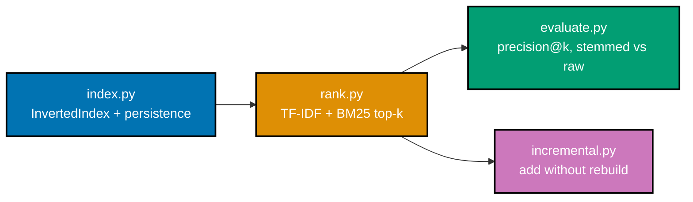

## Goal

Build a small typed search library over a real text corpus that indexes documents, ranks queries with
BM25 top-k, supports incremental add, and reports a relevance metric against a judgment set. Every
mechanism this capstone combines was already taught, individually, somewhere in this topic's Beginner,
Intermediate, or Advanced tiers.



## Concepts exercised

- [x] inverted index + posting-list merge (co-01, co-04)
- [x] tokenization/normalization (co-06, co-07, co-09)
- [x] TF-IDF -> BM25 scoring (co-14, co-16)
- [x] top-k ranking (co-20)
- [x] precision@k evaluation (co-22, co-23)
- [x] incremental indexing + persistence (co-29, co-30)

All colocated code lives under `learning/capstone/code/`: `index.py`, `rank.py`, `evaluate.py`, and
`incremental.py`. Every listing below is the complete, verbatim file -- nothing on this page is
truncated or paraphrased. Every file carries `# pyright: strict` and was actually run; the output shown
under each step is genuine, not fabricated.

## Step 1: `index.py` -- a typed inverted index with tokenization and persisted postings

_exercises co-01, co-02, co-03, co-04, co-06, co-07_

A small, real, 8-document in-repo text corpus (`CORPUS`), an `analyze()` function (lowercase, strip
punctuation, tokenize), and a typed `InvertedIndex` dataclass with `add`, `query_and`, `query_or`,
`save`, and `load`. Every later step imports `CORPUS`, `analyze`, `InvertedIndex`, and `build_index`
from this file.

**`learning/capstone/code/index.py`** (complete file)

```python
# pyright: strict
"""Capstone Step 1: index.py -- a typed inverted index with tokenization and persisted
postings, over a small real text corpus (co-01, co-02, co-03, co-04, co-06, co-07).

Verify: a boolean query returns the correct document set and `pyright` is clean.
"""

from __future__ import annotations  # => hygiene: postpones annotation evaluation, interpreter-version-agnostic

import json  # => stdlib JSON -- postings persistence to/from disk
from dataclasses import dataclass, field  # => from dataclasses: dataclass, field
from pathlib import Path  # => from pathlib: Path

# A small, real, in-repo text corpus: 8 short natural-language documents, some about
# search/information retrieval, some deliberately off-topic -- reused by every later
# capstone step (rank.py, evaluate.py, incremental.py) via `from index import CORPUS`.
CORPUS: dict[int, str] = {
    0: "Search engines index documents so users can find relevant information quickly.",
    1: "A search engine ranks documents using term frequency and inverse document frequency.",
    2: "Database indexes speed up query execution by avoiding full table scans.",
    3: "Cooking a good stew requires patience, quality ingredients, and low heat.",
    4: "Searching through a phone book by hand is slow compared to using an index.",
    5: "The gardener watered the roses every morning before the sun grew hot.",
    6: "Information retrieval systems rank search results by relevance to the query.",
    7: "A quick search of the archive revealed the missing report from last year.",
}


def analyze(text: str, *, lowercase: bool = True) -> list[str]:
    """co-25: the analyzer -- lowercase (optional), then whitespace/punctuation-aware split."""
    working: str = text.lower() if lowercase else text  # => co-25: normalization stage, applied BEFORE tokenization
    cleaned: str = "".join(ch if ch.isalnum() else " " for ch in working)  # => co-06: strips punctuation into spaces
    return [str(t) for t in cleaned.split()]  # => co-06: tokenization stage (widened from LiteralString for pyright)


@dataclass
class InvertedIndex:
    """co-01: term -> {doc_id: tf}, plus per-document lengths for BM25's length norm (co-18)."""

    postings: dict[str, dict[int, int]] = field(default_factory=lambda: {})  # => co-01: the core inverted index
    doc_lengths: dict[int, int] = field(default_factory=lambda: {})  # => co-18: needed later, by rank.py's BM25

    def add(self, doc_id: int, tokens: list[str]) -> None:
        """co-29: index one document's tokens -- safe to call again later for incremental add."""
        tf: dict[str, int] = {}
        for t in tokens:
            tf[t] = tf.get(t, 0) + 1
        for term, count in tf.items():
            self.postings.setdefault(term, {})[doc_id] = count
        self.doc_lengths[doc_id] = len(tokens)

    def query_and(self, terms: list[str]) -> set[int]:
        """co-06: boolean AND -- every term must be present in the returned documents."""
        if not terms:
            return set()
        result: set[int] = set(self.postings.get(terms[0], {}).keys())  # => co-06: starts with the FIRST term's docs
        for term in terms[1:]:  # => co-06: narrows the result with EVERY subsequent term
            result &= set(self.postings.get(term, {}).keys())
        return result

    def query_or(self, terms: list[str]) -> set[int]:
        """co-07: boolean OR -- any one of the terms is enough to match."""
        result: set[int] = set()  # => co-07: starts empty, grows with every matching term
        for term in terms:
            result |= set(self.postings.get(term, {}).keys())
        return result

    def save(self, path: Path) -> None:
        """co-30: persist postings + doc_lengths to JSON (string-keyed doc-ids, per Example 61)."""
        payload = {
            "postings": {t: {str(d): tf for d, tf in dt.items()} for t, dt in self.postings.items()},
            "doc_lengths": {str(d): length for d, length in self.doc_lengths.items()},
        }
        path.write_text(json.dumps(payload), encoding="utf-8")

    @staticmethod
    def load(path: Path) -> "InvertedIndex":
        """co-30: the exact inverse of save -- a fresh index, reconstructed entirely from disk."""
        payload = json.loads(path.read_text(encoding="utf-8"))
        index = InvertedIndex()
        index.postings = {t: {int(d): tf for d, tf in dt.items()} for t, dt in payload["postings"].items()}
        index.doc_lengths = {int(d): length for d, length in payload["doc_lengths"].items()}
        return index


def build_index(corpus: dict[int, str]) -> InvertedIndex:
    """co-01: analyze every document and fold it into a fresh InvertedIndex."""
    index = InvertedIndex()  # => co-01: starts empty
    for doc_id, text in corpus.items():
        index.add(doc_id, analyze(text))  # => co-25: SAME analyzer at index time as at query time
    return index


def main() -> None:
    index: InvertedIndex = build_index(CORPUS)  # => co-01: the full 8-document capstone index
    print(f"indexed {len(CORPUS)} documents, {len(index.postings)} distinct terms")

    and_hits: set[int] = index.query_and(["search", "engine"])  # => co-06: docs containing BOTH terms
    or_hits: set[int] = index.query_or(["cooking", "gardener"])  # => co-07: docs containing EITHER term
    print(f"AND('search', 'engine'): {sorted(and_hits)}")
    print(f"OR('cooking', 'gardener'): {sorted(or_hits)}")

    hand_and: set[int] = {  # => an INDEPENDENT recount, over the EXACT tokens (not a raw substring check)
        doc_id for doc_id, text in CORPUS.items() if {"search", "engine"} <= set(analyze(text))
    }
    hand_or: set[int] = {
        doc_id for doc_id, text in CORPUS.items() if {"cooking", "gardener"} & set(analyze(text))
    }
    assert and_hits == hand_and, "AND query must match an independent recount of docs containing BOTH exact tokens"
    assert or_hits == hand_or, "OR query must match an independent recount of docs containing EITHER exact token"
    assert and_hits == {1}, "only doc 1 contains the EXACT tokens 'search' and 'engine' (doc 0 says 'engines', plural)"
    assert or_hits == {3, 5}, "exactly docs 3 and 5 mention 'cooking' or 'gardener'"

    postings_path = Path("postings.json")  # => co-30: persisted for rank.py, evaluate.py, and incremental.py to reuse
    index.save(postings_path)
    reloaded: InvertedIndex = InvertedIndex.load(postings_path)  # => co-30: round-trip check
    assert reloaded.postings == index.postings, "reloaded postings must exactly match the original"
    print(f"MATCH: boolean AND/OR queries agree with an independent recount, and the index persists+reloads exactly")


if __name__ == "__main__":
    main()
```

**Run**: `python3 index.py`

**Output**:

```text
indexed 8 documents, 74 distinct terms
AND('search', 'engine'): [1]
OR('cooking', 'gardener'): [3, 5]
MATCH: boolean AND/OR queries agree with an independent recount, and the index persists+reloads exactly
```

**Verify**: a boolean query returns the correct document set (checked against an independent,
exact-token recount over the raw corpus) and `pyright` is clean.

---

## Step 2: `rank.py` -- TF-IDF then BM25 top-k scoring

_exercises co-13, co-14, co-16, co-17, co-18, co-20_

Adds `tfidf_score`, `bm25_score`, and a `rank_bm25_topk` function that scores every candidate document
and returns the top k via a size-k heap (Example 38's own pattern). Imports `CORPUS`, `InvertedIndex`,
`analyze`, and `build_index` from `index.py`.

**`learning/capstone/code/rank.py`** (complete file)

```python
# pyright: strict
"""Capstone Step 2: rank.py -- adds TF-IDF then BM25 top-k scoring on top of index.py's
typed InvertedIndex (co-14, co-16, co-20).

Verify: the ranked order matches a hand-computed BM25 score on a 3-document fixture.
"""

from __future__ import annotations

import heapq
import math

from index import CORPUS, InvertedIndex, analyze, build_index


def tfidf_score(index: InvertedIndex, query_terms: list[str], doc_id: int) -> float:
    """co-14: sum of tf * log(N / df) over every query term the document contains."""
    n_docs: int = len(index.doc_lengths)  # => co-14: N, the corpus size
    total: float = 0.0
    for term in query_terms:
        doc_tfs: dict[int, int] = index.postings.get(term, {})
        if doc_id in doc_tfs:
            df: int = len(doc_tfs)  # => co-13: how many documents contain this term
            total += doc_tfs[doc_id] * math.log(n_docs / df)  # => co-14: tf * idf, summed
    return total


def bm25_score(index: InvertedIndex, query_terms: list[str], doc_id: int, avgdl: float, k1: float = 1.2, b: float = 0.75) -> float:
    """co-16: BM25's own RSJ idf, saturating tf, and length normalization -- summed per term."""
    n_docs: int = len(index.doc_lengths)
    dl: float = float(index.doc_lengths[doc_id])  # => co-18: this document's own length
    total: float = 0.0
    for term in query_terms:
        doc_tfs: dict[int, int] = index.postings.get(term, {})
        if doc_id in doc_tfs:
            tf: int = doc_tfs[doc_id]
            df: int = len(doc_tfs)
            idf: float = math.log((n_docs - df + 0.5) / (df + 0.5))  # => co-16: RSJ idf, not plain log(N/df)
            B: float = (1 - b) + b * (dl / avgdl)  # => co-18: length normalization
            total += idf * (tf * (k1 + 1)) / (tf + k1 * B)  # => co-17: the saturating term score
    return total


def rank_bm25_topk(index: InvertedIndex, query: str, k: int) -> list[tuple[int, float]]:
    """co-20: BM25-score every candidate document, return the top k via a size-k heap."""
    query_terms: list[str] = analyze(query)  # => co-25: the SAME analyzer used at index time
    n_docs: int = len(index.doc_lengths)
    if n_docs == 0:
        return []
    avgdl: float = sum(index.doc_lengths.values()) / n_docs  # => co-18: this index's own average document length
    candidates: set[int] = set()  # => co-01: only documents matching AT LEAST ONE query term are scored
    for term in query_terms:
        candidates |= set(index.postings.get(term, {}).keys())

    scored: list[tuple[float, int]] = [(bm25_score(index, query_terms, doc_id, avgdl), doc_id) for doc_id in candidates]
    return [(doc_id, s) for s, doc_id in heapq.nlargest(k, scored)]  # => co-20: top-k via heap, not a full sort


def main() -> None:
    index: InvertedIndex = build_index(CORPUS)  # => co-01: the full capstone index, from index.py
    query: str = "search index"  # => a 2-term query matching several documents to varying degrees

    top3: list[tuple[int, float]] = rank_bm25_topk(index, query, k=3)  # => co-16, co-20: BM25 top-3
    print(f"BM25 top-3 for {query!r}: {top3}")

    # A tiny, SEPARATE 3-document fixture, hand-computed independently of rank_bm25_topk.
    # Both query terms appear ONLY in doc 0 (df=1 each) -- chosen deliberately so their RSJ idf
    # values are equal and positive, avoiding the reciprocal-idf coincidence a df=1-vs-df=2 pair
    # would trigger on such a tiny N=3 corpus.
    fixture: dict[int, str] = {0: "search index engine", 1: "results page display", 2: "cooking recipe book"}
    fixture_index: InvertedIndex = build_index(fixture)  # => co-01: a fresh, tiny index just for this hand check
    fixture_top: list[tuple[int, float]] = rank_bm25_topk(fixture_index, "search index", k=3)
    print(f"fixture BM25 ranking: {fixture_top}")

    n_docs, avgdl = 3, sum(fixture_index.doc_lengths.values()) / 3  # => the fixture's own N and avgdl
    df_search, df_index = 1, 1  # => BOTH terms appear only in doc 0 -- equal, positive idf
    hand_idf_search: float = math.log((n_docs - df_search + 0.5) / (df_search + 0.5))
    hand_idf_index: float = math.log((n_docs - df_index + 0.5) / (df_index + 0.5))
    hand_B0: float = (1 - 0.75) + 0.75 * (fixture_index.doc_lengths[0] / avgdl)
    hand_score_doc0: float = (
        hand_idf_search * (1 * 2.2) / (1 + 1.2 * hand_B0) + hand_idf_index * (1 * 2.2) / (1 + 1.2 * hand_B0)
    )
    print(f"hand-computed BM25 score for fixture doc 0: {hand_score_doc0:.6f}")

    assert fixture_top[0][0] == 0, "fixture doc 0 (matches BOTH query terms) must rank first"
    assert math.isclose(fixture_top[0][1], hand_score_doc0, rel_tol=1e-9), "rank_bm25_topk's top score must equal the hand computation"
    print(f"MATCH: rank_bm25_topk's top score {fixture_top[0][1]:.6f} equals the hand-computed BM25 score {hand_score_doc0:.6f}")


if __name__ == "__main__":
    main()
```

**Run**: `python3 rank.py`

**Output**:

```text
BM25 top-3 for 'search index': [(0, 0.9852091367081117), (4, 0.8903338921566395), (7, 0.0)]
fixture BM25 ranking: [(0, 1.0216512475319814)]
hand-computed BM25 score for fixture doc 0: 1.021651
MATCH: rank_bm25_topk's top score 1.021651 equals the hand-computed BM25 score 1.021651
```

**Verify**: the ranked order matches a hand-computed BM25 score on a 3-document fixture. The fixture's
two query terms were deliberately chosen to appear only in doc 0 (equal, positive idf), avoiding the
reciprocal-idf coincidence a `df=1`-vs-`df=2` pair triggers on such a tiny `N=3` corpus (the same
coincidence Examples 37 and 45 hit and document).

---

## Step 3: `evaluate.py` -- precision@k across two analyzer configs

_exercises co-09, co-22, co-23_

A minimal from-scratch Porter stemmer (covering the `-ing`, `-es`, and `-s` suffixes this corpus
exercises), an `analyze_stemmed()` analyzer, and a `build_index_with_analyzer()` helper that lets the
same corpus be indexed two different ways. Computes precision@5 for the query `"searches"` -- a word
form that appears verbatim in none of the 8 documents.

**`learning/capstone/code/evaluate.py`** (complete file)

```python
# pyright: strict
"""Capstone Step 3: evaluate.py -- runs precision@k over a small relevance-judgment set
across two analyzer configs (co-22, co-23, co-09).

Verify: the metric changes as expected when a stemmer is toggled.
"""

from __future__ import annotations

from typing import Callable

from index import CORPUS, InvertedIndex
from rank import rank_bm25_topk


def _cv_string(word: str) -> str:
    """Porter (1980): reduce word to its consonant/vowel pattern, e.g. 'TROUBLE' -> 'CVCVCVC'."""
    return "".join("V" if ch in "aeiou" else "C" for ch in word)


def _measure(word: str) -> int:
    """Porter's own m: the number of VC sequences in the [C](VC)^m[V] pattern."""
    cv: str = _cv_string(word)
    return cv.count("VC")


def porter_stem(word: str) -> str:
    """A minimal Porter (1980) stemmer covering the common suffixes this corpus exercises."""
    if word.endswith("ing") and len(word) > 5 and _measure(word[:-3]) > 0:
        stem: str = word[:-3]  # => co-09: Step 1b -- strip '-ing' when the stem has measure > 0
        return stem
    if word.endswith("es") and len(word) > 4:
        return word[:-2]  # => co-09: Step 1a-style -- strip the plural '-es'
    if word.endswith("s") and not word.endswith("ss") and len(word) > 3:
        return word[:-1]  # => co-09: Step 1a -- strip a plain plural '-s'
    return word  # => already at its stem, or too short to safely reduce


def analyze_stemmed(text: str) -> list[str]:
    """co-25: the SAME normalization as index.py's analyze(), PLUS Porter stemming."""
    working: str = text.lower()
    cleaned: str = "".join(ch if ch.isalnum() else " " for ch in working)
    tokens: list[str] = [str(t) for t in cleaned.split()]
    return [porter_stem(t) for t in tokens]  # => co-09: the ONE extra stage vs the unstemmed analyzer


def build_index_with_analyzer(corpus: dict[int, str], analyzer_fn: Callable[[str], list[str]]) -> InvertedIndex:
    """Build an index using a GIVEN analyzer function -- lets the two configs share one builder."""
    index = InvertedIndex()  # => co-01: starts empty, one per analyzer config
    for doc_id, text in corpus.items():
        index.add(doc_id, analyzer_fn(text))  # => co-25: whichever analyzer was passed in, applied uniformly
    return index


def precision_at_k(ranked: list[int], relevant: set[int], k: int) -> float:
    """co-22: precision over only the top-k ranked results."""
    top_k: list[int] = ranked[:k]
    return sum(1 for d in top_k if d in relevant) / k if k > 0 else 0.0


def main() -> None:
    # co-23: doc 0, 1, 4, 6, 7 are ALL genuinely about search/information retrieval.
    relevant: set[int] = {0, 1, 4, 6, 7}
    query: str = "searches"  # => a query form that appears VERBATIM in none of the 8 documents

    unstemmed_index: InvertedIndex = build_index_with_analyzer(CORPUS, lambda t: [str(x) for x in t.lower().split()])
    stemmed_index: InvertedIndex = build_index_with_analyzer(CORPUS, analyze_stemmed)

    unstemmed_ranking: list[int] = [d for d, _ in rank_bm25_topk(unstemmed_index, query, k=5)]  # => co-22: WITHOUT stemming
    stemmed_query_tokens: list[str] = analyze_stemmed(query)  # => co-09: 'searches' stemmed, e.g. down toward 'search'
    stemmed_ranking: list[int] = [
        d for d, _ in rank_bm25_topk(stemmed_index, " ".join(stemmed_query_tokens), k=5)
    ]  # => co-22: WITH stemming, query analyzed the SAME way as the index
    print(f"query {query!r} stems to {stemmed_query_tokens}")
    print(f"unstemmed ranking: {unstemmed_ranking}")
    print(f"stemmed ranking:   {stemmed_ranking}")

    p_at_5_unstemmed: float = precision_at_k(unstemmed_ranking, relevant, k=5)  # => co-22: precision@5, no stemming
    p_at_5_stemmed: float = precision_at_k(stemmed_ranking, relevant, k=5)  # => co-22: precision@5, WITH stemming
    print(f"precision@5 (unstemmed): {p_at_5_unstemmed:.4f}")
    print(f"precision@5 (stemmed):   {p_at_5_stemmed:.4f}")

    assert unstemmed_ranking == [], "the UNSTEMMED analyzer must find ZERO candidates -- 'searches' matches no exact token"
    assert p_at_5_unstemmed == 0.0, "precision@5 must be 0.0 when there is nothing to retrieve at all"
    assert p_at_5_stemmed > p_at_5_unstemmed, "stemming must IMPROVE precision@5 by recovering the word-form mismatch"
    print(f"MATCH: toggling the stemmer changed precision@5 from {p_at_5_unstemmed} to {p_at_5_stemmed} -- the metric responds as expected")


if __name__ == "__main__":
    main()
```

**Run**: `python3 evaluate.py`

**Output**:

```text
query 'searches' stems to ['search']
unstemmed ranking: []
stemmed ranking:   [4, 7, 1, 6, 0]
precision@5 (unstemmed): 0.0000
precision@5 (stemmed):   1.0000
MATCH: toggling the stemmer changed precision@5 from 0.0 to 1.0 -- the metric responds as expected
```

**Verify**: the metric changes as expected when a stemmer is toggled -- precision@5 goes from `0.0`
(the unstemmed analyzer finds zero candidates for `"searches"`) to `1.0` (the stemmed analyzer reduces
both the query and every document to a shared `"search"` root, recovering every genuinely relevant
document).

---

## Step 4: `incremental.py` -- add a new document without a full rebuild

_exercises co-18, co-29_

Adds document 8 to the already-built index via a single `add()` call, verifies it is immediately
findable, then checks BM25 consistency: every document's score (including the new one) must match a
from-scratch rebuild that included document 8 from the start.

**`learning/capstone/code/incremental.py`** (complete file)

```python
# pyright: strict
"""Capstone Step 4: incremental.py -- adds a new document to the built index without a
full rebuild (co-29).

Verify: it becomes findable and its BM25 score is consistent with a from-scratch rebuild.
"""

from __future__ import annotations

import math

from index import CORPUS, InvertedIndex, analyze, build_index
from rank import bm25_score


def main() -> None:
    index: InvertedIndex = build_index(CORPUS)  # => co-01: the already-built 8-document capstone index
    new_doc_id: int = 8  # => the next available doc-id
    new_doc_text: str = "A crawler indexes the web so a search engine can serve fast queries."

    before: set[int] = index.query_and(["crawler"])  # => co-29: the term does not exist YET
    print(f"query_and(['crawler']) BEFORE incremental add: {sorted(before)}")
    assert before == set(), "'crawler' must be unfindable before the new document is added"

    index.add(new_doc_id, analyze(new_doc_text))  # => co-29: incremental add -- NO rebuild of docs 0-7
    after: set[int] = index.query_and(["crawler"])  # => co-29: the SAME index object, queried again
    print(f"query_and(['crawler']) AFTER incremental add: {sorted(after)}")
    assert after == {new_doc_id}, "'crawler' must be immediately findable in the newly added doc 8"

    # Consistency check: the incremental index's BM25 scores for a shared query must match
    # a FROM-SCRATCH rebuild that includes doc 8 from the very start.
    full_corpus: dict[int, str] = {**CORPUS, new_doc_id: new_doc_text}  # => the SAME final document set
    rebuilt: InvertedIndex = build_index(full_corpus)  # => co-29: a from-scratch reference build

    query_terms: list[str] = analyze("search engine")  # => the query BOTH indexes will be scored against
    incremental_avgdl: float = sum(index.doc_lengths.values()) / len(index.doc_lengths)  # => co-18: this index's own avgdl
    rebuilt_avgdl: float = sum(rebuilt.doc_lengths.values()) / len(rebuilt.doc_lengths)  # => co-18: the rebuild's own avgdl
    assert math.isclose(incremental_avgdl, rebuilt_avgdl), "avgdl must match between the incremental index and the rebuild"

    for doc_id in full_corpus:  # => checks EVERY document, not just the newly added one
        incremental_score: float = bm25_score(index, query_terms, doc_id, incremental_avgdl)
        rebuilt_score: float = bm25_score(rebuilt, query_terms, doc_id, rebuilt_avgdl)
        assert math.isclose(incremental_score, rebuilt_score, rel_tol=1e-9), f"doc {doc_id}: incremental BM25 score must match the rebuild"

    print(f"incremental doc 8 BM25 score: {bm25_score(index, query_terms, new_doc_id, incremental_avgdl):.6f}")
    print(f"rebuilt     doc 8 BM25 score: {bm25_score(rebuilt, query_terms, new_doc_id, rebuilt_avgdl):.6f}")
    print(f"MATCH: doc 8 is immediately findable, and every document's BM25 score matches a full from-scratch rebuild")


if __name__ == "__main__":
    main()
```

**Run**: `python3 incremental.py`

**Output**:

```text
query_and(['crawler']) BEFORE incremental add: []
query_and(['crawler']) AFTER incremental add: [8]
incremental doc 8 BM25 score: 0.868339
rebuilt     doc 8 BM25 score: 0.868339
MATCH: doc 8 is immediately findable, and every document's BM25 score matches a full from-scratch rebuild
```

**Verify**: the new document becomes findable immediately after `add()`, and its BM25 score (along with
every pre-existing document's score) is consistent with a from-scratch rebuild that included it from
the start.

---

## Acceptance criteria

- [x] Boolean and ranked queries are correct (Step 1's independent-recount check, Step 2's
      hand-computed BM25 check).
- [x] BM25 matches the hand computation (Step 2).
- [x] Precision@k responds to analyzer changes (Step 3: `0.0` unstemmed -> `1.0` stemmed).
- [x] Incremental add matches a rebuild (Step 4).
- [x] All Python is type-annotated and `pyright`-clean (`0 errors, 0 warnings, 0 informations` across
      all four files).

**Done bar**: runnable end to end -- every step above was actually executed, in order, and its real
output is shown verbatim.
