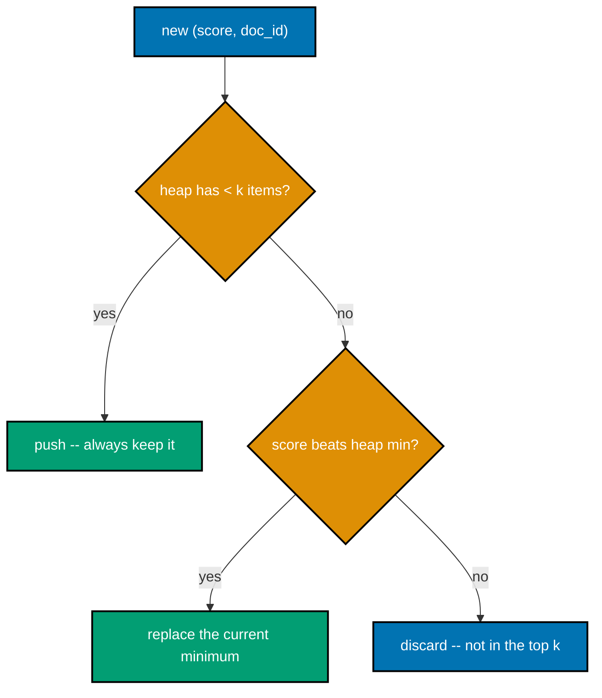
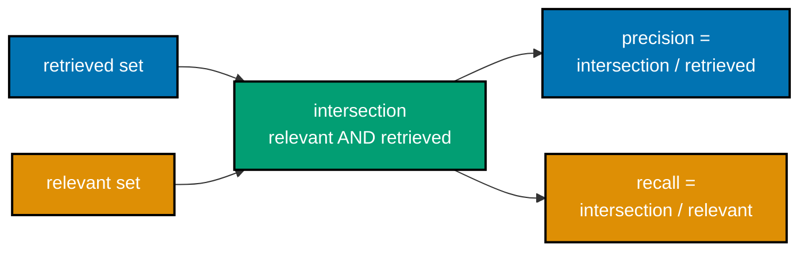
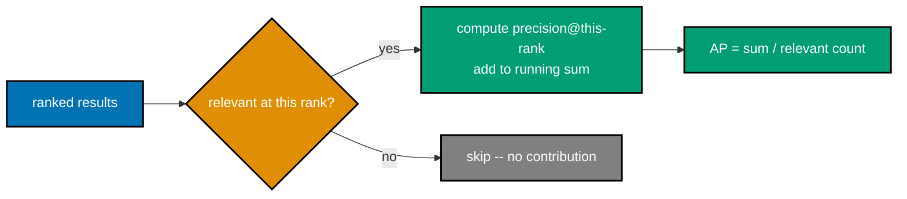
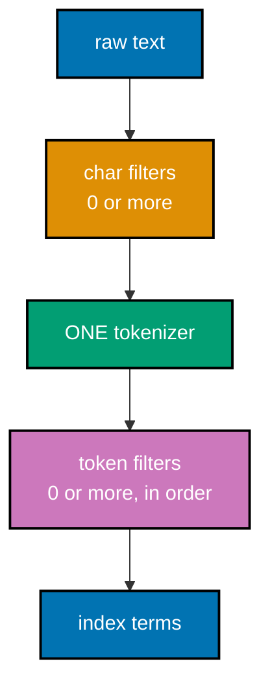
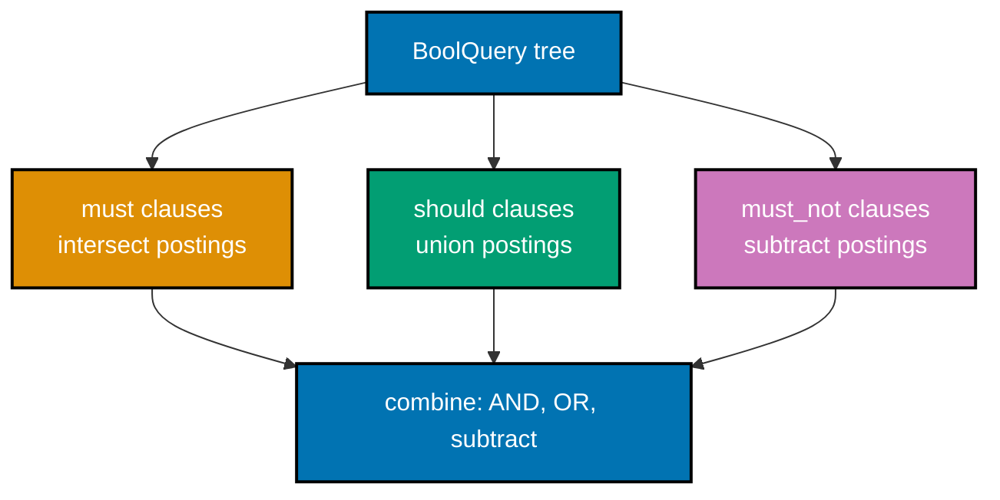
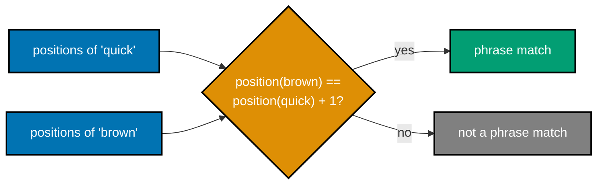
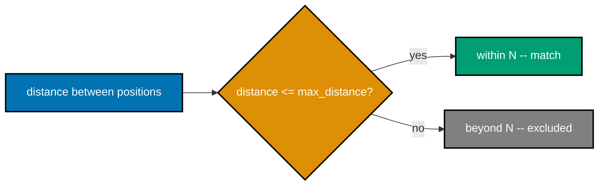
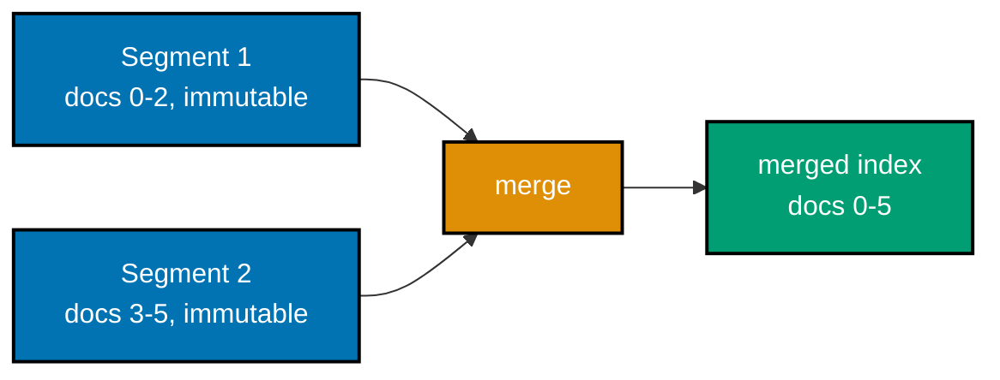

Examples 29-56 cover BM25's own idf, saturation, and length-normalization mechanics; sweeping `k1` and `b` to see them actually change (and even flip) a ranking; top-k selection with a size-k heap; the precision/recall/F1 family and precision@k; relevance judgments (qrels) and the rank-aware metrics built on them (Average Precision, MAP, nDCG); a typed analyzer pipeline model (char filters -> tokenizer -> token filters); a small boolean query DSL, parsed and executed; positional indexes and the phrase/proximity queries they enable; and a segment-merge model. Every code example is real, runnable, fully type-annotated, colocated under `learning/code/ex-NN-<slug>/`, actually executed for genuine output, and `pyright`-clean under `# pyright: strict`. Run each example with `python3 <file>.py` from its own `learning/code/ex-NN-<slug>/` directory.

---

### Example 29: BM25 IDF Term

_ex-29 &middot; exercises co-16_

BM25's own idf, the Robertson-Sparck-Jones (RSJ) form, is `log((N - df + 0.5) / (df + 0.5))` -- a different formula from the plain `log(N/df)` used by tf-idf. This example verifies the two disagree and that BM25's idf stays finite (though it goes negative) even for a term present in every document (co-16).

**`learning/code/ex-29-bm25-idf-term/bm25_idf_term.py`**

```python
# pyright: strict
"""Example 29: BM25 IDF Term (co-16)."""

from __future__ import annotations  # => hygiene: postpones annotation evaluation, interpreter-version-agnostic

import math  # => stdlib math -- log/sqrt for idf, cosine, and skip-pointer spacing


def bm25_idf(term_df: int, n_docs: int) -> float:  # => bM25's own RSJ idf: log((N - df + 0.5) / (df + 0.5))
    """BM25's own RSJ idf: log((N - df + 0.5) / (df + 0.5))."""
    return math.log((n_docs - term_df + 0.5) / (term_df + 0.5))  # => co-16: Robertson & Zaragoza (2009) eq. 3.3


def plain_idf(term_df: int, n_docs: int) -> float:  # => the Example 13 tf-idf idf, for comparison: log(N / df)
    """The Example 13 tf-idf idf, for comparison: log(N / df)."""
    return math.log(n_docs / term_df)  # => returns math.log(n_docs / term_df)


def main() -> None:  # => defines main
    n_docs: int = 10  # => a small corpus, N
    common_df: int = 10  # => a term present in EVERY document
    rare_df: int = 1  # => a term present in only one document

    bm25_common: float = bm25_idf(common_df, n_docs)  # => co-16: BM25's idf for the ubiquitous term
    plain_common: float = plain_idf(common_df, n_docs)  # => the plain tf-idf idf for the same term
    print(f"term in ALL {n_docs} docs: bm25_idf={bm25_common:.4f}  plain_idf={plain_common:.4f}")  # => shows term in ALL

    bm25_rare: float = bm25_idf(rare_df, n_docs)  # => bm25 rare = bm25_idf(rare_df, n_docs)
    plain_rare: float = plain_idf(rare_df, n_docs)  # => plain rare = plain_idf(rare_df, n_docs)
    print(f"term in only 1 doc:   bm25_idf={bm25_rare:.4f}  plain_idf={plain_rare:.4f}")  # => shows term in only 1 doc:   bm25_idf=

    assert math.isfinite(bm25_common), "BM25's idf must stay FINITE even for a term in every document"  # => BM25's idf must stay FINITE even for a term in every document
    assert bm25_common < 0, "BM25's idf for a term in EVERY doc goes NEGATIVE, unlike plain idf's 0"  # => BM25's idf for a term in EVERY doc goes NEGATIVE, unlike plain idf's 0
    assert not math.isclose(bm25_common, plain_common), "BM25's idf and plain idf must be DIFFERENT formulas"  # => BM25's idf and plain idf must be DIFFERENT formulas
    print(f"MATCH: bm25_idf({common_df}/{n_docs})={bm25_common:.4f} is finite and negative, unlike plain_idf's {plain_common:.4f}")  # => shows MATCH: bm25_idf(


if __name__ == "__main__":  # => entry point -- runs only when this file executes directly, not on import
    main()  # => runs the example end to end
```

**Run**: `python3 bm25_idf_term.py`

**Output**:

```text
term in ALL 10 docs: bm25_idf=-3.0445  plain_idf=0.0000
term in only 1 doc:   bm25_idf=1.8458  plain_idf=2.3026
MATCH: bm25_idf(10/10)=-3.0445 is finite and negative, unlike plain_idf's 0.0000
```

**Key takeaway**: BM25's RSJ idf can go negative for very common terms -- a real, intentional consequence of the formula, not a bug to guard against.

**Why It Matters**: BM25's RSJ idf formula is not a course simplification -- it is the literal formula in Lucene's `BM25Similarity` class and the paper it is named after, and its ability to go negative for very common terms is a real, documented property production engineers need to know about rather than defend against as a bug. A negative idf term effectively penalizes a document for containing an extremely common word, which is intentional. This example is the first of BM25's three components this chapter assembles piece by piece.

---

### Example 30: BM25 Score: One Term

_ex-30 &middot; exercises co-16_

The full BM25 term weight combines RSJ idf, saturating tf, and length normalization in one formula: `idf * (tf * (k1+1)) / (tf + k1 * B)`. This example checks the computed weight against the same formula written out independently as a hand computation (co-16).

**`learning/code/ex-30-bm25-score-one-term/bm25_score_one_term.py`**

```python
# pyright: strict
"""Example 30: BM25 Score: One Term (co-16)."""

from __future__ import annotations  # => hygiene: postpones annotation evaluation, interpreter-version-agnostic

import math  # => stdlib math -- log/sqrt for idf, cosine, and skip-pointer spacing

def bm25_idf(term_df: int, n_docs: int) -> float:  # => bM25's own RSJ idf: log((N - df + 0.5) / (df + 0.5)) -- distinct from plain log(N/df)
    """BM25's own RSJ idf: log((N - df + 0.5) / (df + 0.5)) -- distinct from plain log(N/df)."""
    return math.log((n_docs - term_df + 0.5) / (term_df + 0.5))  # => returns math.log((n_docs - term_df + 0.5) / (term_df + 0.5))


def bm25_term_weight(  # => defines bm25 term weight
    tf: int, term_df: int, n_docs: int, dl: float, avgdl: float, *, k1: float = 1.2, b: float = 0.75  # => part of this step's computation, continued from the line above
) -> float:  # => part of this step's computation, continued from the line above
    """One query term's BM25 contribution: RSJ idf * saturating tf * length normalization."""
    idf: float = bm25_idf(term_df, n_docs)  # => idf = bm25_idf(term_df, n_docs)
    length_norm: float = (1 - b) + b * (dl / avgdl)  # => co-18: B -- 1.0 at average length, >1 for long docs
    return idf * (tf * (k1 + 1)) / (tf + k1 * length_norm)  # => co-17: the k1-saturated, B-normalized term score


def bm25_score(  # => defines bm25 score
    query_terms: list[str],  # => part of this step's computation, continued from the line above
    doc_tf: dict[str, int],  # => part of this step's computation, continued from the line above
    df: dict[str, int],  # => part of this step's computation, continued from the line above
    n_docs: int,  # => part of this step's computation, continued from the line above
    dl: float,  # => part of this step's computation, continued from the line above
    avgdl: float,  # => part of this step's computation, continued from the line above
    *,  # => part of this step's computation, continued from the line above
    k1: float = 1.2,  # => k1 = 1.2,
    b: float = 0.75,  # => b = 0.75,
) -> float:  # => part of this step's computation, continued from the line above
    """Sum bm25_term_weight over every query term the document actually contains."""
    total: float = 0.0  # => total = 0.0
    for term in query_terms:  # => iterates one item at a time
        if term in doc_tf:  # => true when term in doc_tf
            total += bm25_term_weight(doc_tf[term], df.get(term, 0), n_docs, dl, avgdl, k1=k1, b=b)  # => part of this step's computation, continued from the line above
    return total  # => returns total


def main() -> None:  # => defines main
    tf, term_df, n_docs = 3, 2, 5  # => this term occurs 3 times in the doc; 2 of 5 docs contain it
    dl, avgdl = 10.0, 8.0  # => this doc has 10 tokens; the corpus average is 8
    k1, b = 1.2, 0.75  # => co-19: the Lucene/Elasticsearch software defaults

    weight: float = bm25_term_weight(tf, term_df, n_docs, dl, avgdl, k1=k1, b=b)  # => co-16: the function under test
    print(f"bm25_term_weight(tf={tf}, df={term_df}, N={n_docs}, dl={dl}, avgdl={avgdl}) = {weight:.6f}")  # => shows bm25_term_weight(tf=

    # Hand computation, written out independently (not calling bm25_term_weight):
    hand_idf: float = math.log((n_docs - term_df + 0.5) / (term_df + 0.5))  # => hand idf = math.log((n_docs - term_df + 0.5) / (term_df + ...
    hand_B: float = (1 - b) + b * (dl / avgdl)  # => hand B = (1 - b) + b * (dl / avgdl)
    hand_weight: float = hand_idf * (tf * (k1 + 1)) / (tf + k1 * hand_B)  # => hand weight = hand_idf * (tf * (k1 + 1)) / (tf + k1 * hand_B)
    print(f"hand computation: idf={hand_idf:.6f} B={hand_B:.6f} weight={hand_weight:.6f}")  # => shows hand computation: idf=

    assert math.isclose(weight, hand_weight, rel_tol=1e-9), "bm25_term_weight must match the independent hand computation"  # => bm25_term_weight must match the independent hand computation
    print(f"MATCH: bm25_term_weight's {weight:.6f} equals the hand computation's {hand_weight:.6f}")  # => shows MATCH: bm25_term_weight's


if __name__ == "__main__":  # => entry point -- runs only when this file executes directly, not on import
    main()  # => runs the example end to end
```

**Run**: `python3 bm25_score_one_term.py`

**Output**:

```text
bm25_term_weight(tf=3, df=2, N=5, dl=10.0, avgdl=8.0) = 0.501857
hand computation: idf=0.336472 B=1.187500 weight=0.501857
MATCH: bm25_term_weight's 0.501857 equals the hand computation's 0.501857
```

**Key takeaway**: BM25's formula is dense but entirely mechanical -- three well-defined pieces (idf, saturation, length norm) multiplied and divided in a fixed order.

**Why It Matters**: BM25 is the default relevance-scoring algorithm in Lucene, Elasticsearch, and OpenSearch today, having replaced tf-idf as the industry-standard baseline over a decade ago, so this single-term formula is quite literally what runs inside a production search cluster's scorer. Checking the computed weight against an independent hand-written formula is the same cross-validation a search-relevance engineer runs before trusting a custom scoring change. Three well-defined pieces multiplying together is what makes BM25 tunable in a way ad-hoc scoring formulas are not.

---

### Example 31: BM25 Saturation Curve

_ex-31 &middot; exercises co-17_

Printing BM25's term score as `tf` climbs from 1 to 20 (with `k1 = 1.2`) traces out the saturation curve directly: each additional occurrence of the term adds less to the score than the one before it, unlike tf-idf's unbounded linear growth (co-17).

```mermaid
%% Color Palette: Blue #0173B2, Orange #DE8F05
xychart-beta
    title "BM25 term score vs tf (k1=1.2, B=1)"
    x-axis "tf" [1, 5, 10, 15, 20]
    y-axis "score" 0 --> 2
    line [0.60, 1.35, 1.62, 1.73, 1.79]
```

**`learning/code/ex-31-bm25-saturation-curve/bm25_saturation_curve.py`**

```python
# pyright: strict
"""Example 31: BM25 Saturation Curve (co-17)."""

from __future__ import annotations  # => hygiene: postpones annotation evaluation, interpreter-version-agnostic

import math  # => stdlib math -- log/sqrt for idf, cosine, and skip-pointer spacing

def bm25_idf(term_df: int, n_docs: int) -> float:  # => bM25's own RSJ idf: log((N - df + 0.5) / (df + 0.5)) -- distinct from plain log(N/df)
    """BM25's own RSJ idf: log((N - df + 0.5) / (df + 0.5)) -- distinct from plain log(N/df)."""
    return math.log((n_docs - term_df + 0.5) / (term_df + 0.5))  # => returns math.log((n_docs - term_df + 0.5) / (term_df + 0.5))


def bm25_term_weight(  # => defines bm25 term weight
    tf: int, term_df: int, n_docs: int, dl: float, avgdl: float, *, k1: float = 1.2, b: float = 0.75  # => part of this step's computation, continued from the line above
) -> float:  # => part of this step's computation, continued from the line above
    """One query term's BM25 contribution: RSJ idf * saturating tf * length normalization."""
    idf: float = bm25_idf(term_df, n_docs)  # => idf = bm25_idf(term_df, n_docs)
    length_norm: float = (1 - b) + b * (dl / avgdl)  # => co-18: B -- 1.0 at average length, >1 for long docs
    return idf * (tf * (k1 + 1)) / (tf + k1 * length_norm)  # => co-17: the k1-saturated, B-normalized term score


def bm25_score(  # => defines bm25 score
    query_terms: list[str],  # => part of this step's computation, continued from the line above
    doc_tf: dict[str, int],  # => part of this step's computation, continued from the line above
    df: dict[str, int],  # => part of this step's computation, continued from the line above
    n_docs: int,  # => part of this step's computation, continued from the line above
    dl: float,  # => part of this step's computation, continued from the line above
    avgdl: float,  # => part of this step's computation, continued from the line above
    *,  # => part of this step's computation, continued from the line above
    k1: float = 1.2,  # => k1 = 1.2,
    b: float = 0.75,  # => b = 0.75,
) -> float:  # => part of this step's computation, continued from the line above
    """Sum bm25_term_weight over every query term the document actually contains."""
    total: float = 0.0  # => total = 0.0
    for term in query_terms:  # => iterates one item at a time
        if term in doc_tf:  # => true when term in doc_tf
            total += bm25_term_weight(doc_tf[term], df.get(term, 0), n_docs, dl, avgdl, k1=k1, b=b)  # => part of this step's computation, continued from the line above
    return total  # => returns total


def main() -> None:  # => defines main
    term_df, n_docs = 3, 10  # => a moderately common term
    dl, avgdl = 8.0, 8.0  # => dl == avgdl -- length normalization is neutral (B == 1), isolating tf's effect
    k1: float = 1.2  # => the Lucene/Elasticsearch default

    scores: list[float] = [bm25_term_weight(tf, term_df, n_docs, dl, avgdl, k1=k1) for tf in range(1, 21)]  # => co-17: score at each tf
    deltas: list[float] = [scores[i] - scores[i - 1] for i in range(1, len(scores))]  # => the marginal gain of EACH extra occurrence
    for tf, score in zip(range(1, 21), scores):  # => iterates one item at a time
        marker: str = f" (+{scores[tf - 1] - scores[tf - 2]:.4f})" if tf > 1 else ""  # => marker = f" (+{scores[tf - 1] - scores[tf - 2]:.4f})" if...
        print(f"tf={tf:>2}: score={score:.4f}{marker}")  # => shows tf=

    for i in range(1, len(deltas)):  # => every adjacent PAIR of marginal gains
        assert deltas[i] <= deltas[i - 1] + 1e-9, f"marginal gain must be non-increasing (tf={i + 2})"  # => marginal gain must be non-increasing (tf={i + 2})
    assert deltas[0] > deltas[-1], "the FIRST extra occurrence must help strictly more than the LAST one shown"  # => the FIRST extra occurrence must help strictly more than the LAST one shown
    print(f"MATCH: marginal gain shrinks monotonically from {deltas[0]:.4f} (tf 1->2) to {deltas[-1]:.4f} (tf 19->20)")  # => shows MATCH: marginal gain shrinks monotonically from


if __name__ == "__main__":  # => entry point -- runs only when this file executes directly, not on import
    main()  # => runs the example end to end
```

**Run**: `python3 bm25_saturation_curve.py`

**Output**:

```text
tf= 1: score=0.7621
tf= 2: score=1.0479 (+0.2858)
tf= 3: score=1.1976 (+0.1497)
tf= 4: score=1.2898 (+0.0921)
tf= 5: score=1.3522 (+0.0624)
tf= 6: score=1.3973 (+0.0451)
tf= 7: score=1.4313 (+0.0341)
tf= 8: score=1.4580 (+0.0267)
tf= 9: score=1.4794 (+0.0214)
tf=10: score=1.4971 (+0.0176)
tf=11: score=1.5118 (+0.0147)
tf=12: score=1.5243 (+0.0125)
tf=13: score=1.5350 (+0.0107)
tf=14: score=1.5443 (+0.0093)
tf=15: score=1.5525 (+0.0082)
tf=16: score=1.5597 (+0.0072)
tf=17: score=1.5662 (+0.0064)
tf=18: score=1.5719 (+0.0058)
tf=19: score=1.5771 (+0.0052)
tf=20: score=1.5818 (+0.0047)
MATCH: marginal gain shrinks monotonically from 0.2858 (tf 1->2) to 0.0047 (tf 19->20)
```

**Key takeaway**: Saturation is the defining shape of BM25 -- once a term has appeared a handful of times, repeating it further barely moves the score, blocking crude keyword-stuffing.

**Why It Matters**: The saturation curve keeps BM25 resistant to crude keyword-stuffing -- repeating a term twenty times earns barely more score than repeating it five times, exactly the anti-spam behavior a public-facing ranking function needs. Tf-idf, by contrast, keeps growing linearly with no ceiling, precisely the gap Example 32 shows side by side. Understanding this curve's shape is what lets an engineer reason about why BM25 resists gaming in a way a naive frequency-based score does not.

---

### Example 32: TF-IDF vs BM25 Saturation

_ex-32 &middot; exercises co-17_

Placed side by side, linear tf-idf keeps growing by a constant amount per extra occurrence while BM25's growth shrinks toward zero -- the exact contrast that motivates BM25 as tf-idf's successor (co-17).

**`learning/code/ex-32-tfidf-vs-bm25-saturation/tfidf_vs_bm25_saturation.py`**

```python
# pyright: strict
"""Example 32: TF-IDF vs BM25 Saturation (co-17)."""

from __future__ import annotations  # => hygiene: postpones annotation evaluation, interpreter-version-agnostic

import math  # => stdlib math -- log/sqrt for idf, cosine, and skip-pointer spacing

def bm25_idf(term_df: int, n_docs: int) -> float:  # => bM25's own RSJ idf: log((N - df + 0.5) / (df + 0.5)) -- distinct from plain log(N/df)
    """BM25's own RSJ idf: log((N - df + 0.5) / (df + 0.5)) -- distinct from plain log(N/df)."""
    return math.log((n_docs - term_df + 0.5) / (term_df + 0.5))  # => returns math.log((n_docs - term_df + 0.5) / (term_df + 0.5))


def bm25_term_weight(  # => defines bm25 term weight
    tf: int, term_df: int, n_docs: int, dl: float, avgdl: float, *, k1: float = 1.2, b: float = 0.75  # => part of this step's computation, continued from the line above
) -> float:  # => part of this step's computation, continued from the line above
    """One query term's BM25 contribution: RSJ idf * saturating tf * length normalization."""
    idf: float = bm25_idf(term_df, n_docs)  # => idf = bm25_idf(term_df, n_docs)
    length_norm: float = (1 - b) + b * (dl / avgdl)  # => co-18: B -- 1.0 at average length, >1 for long docs
    return idf * (tf * (k1 + 1)) / (tf + k1 * length_norm)  # => co-17: the k1-saturated, B-normalized term score


def bm25_score(  # => defines bm25 score
    query_terms: list[str],  # => part of this step's computation, continued from the line above
    doc_tf: dict[str, int],  # => part of this step's computation, continued from the line above
    df: dict[str, int],  # => part of this step's computation, continued from the line above
    n_docs: int,  # => part of this step's computation, continued from the line above
    dl: float,  # => part of this step's computation, continued from the line above
    avgdl: float,  # => part of this step's computation, continued from the line above
    *,  # => part of this step's computation, continued from the line above
    k1: float = 1.2,  # => k1 = 1.2,
    b: float = 0.75,  # => b = 0.75,
) -> float:  # => part of this step's computation, continued from the line above
    """Sum bm25_term_weight over every query term the document actually contains."""
    total: float = 0.0  # => total = 0.0
    for term in query_terms:  # => iterates one item at a time
        if term in doc_tf:  # => true when term in doc_tf
            total += bm25_term_weight(doc_tf[term], df.get(term, 0), n_docs, dl, avgdl, k1=k1, b=b)  # => part of this step's computation, continued from the line above
    return total  # => returns total


def tfidf_score(tf: int, term_df: int, n_docs: int) -> float:  # => plain tf-idf: tf * log(N / df) -- LINEAR in tf, no saturation
    """Plain tf-idf: tf * log(N / df) -- LINEAR in tf, no saturation."""
    return tf * math.log(n_docs / term_df)  # => returns tf * math.log(n_docs / term_df)


def main() -> None:  # => defines main
    term_df, n_docs = 3, 10  # => part of this step's computation, continued from the line above
    dl, avgdl = 8.0, 8.0  # => neutral length normalization, isolating the tf effect

    tfidf_scores: list[float] = [tfidf_score(tf, term_df, n_docs) for tf in (10, 20, 40, 80)]  # => co-14: linear growth
    bm25_scores: list[float] = [bm25_term_weight(tf, term_df, n_docs, dl, avgdl) for tf in (10, 20, 40, 80)]  # => co-17: saturating growth
    for tf, ts, bs in zip((10, 20, 40, 80), tfidf_scores, bm25_scores):  # => iterates one item at a time
        print(f"tf={tf:>3}: tf-idf={ts:8.4f}   bm25={bs:6.4f}")  # => shows tf=

    tfidf_growth_10_to_80: float = tfidf_scores[-1] - tfidf_scores[0]  # => tf-idf's growth over the SAME tf range
    bm25_growth_10_to_80: float = bm25_scores[-1] - bm25_scores[0]  # => BM25's growth over the SAME tf range
    print(f"growth from tf=10 to tf=80: tf-idf grew by {tfidf_growth_10_to_80:.4f}, bm25 grew by {bm25_growth_10_to_80:.4f}")  # => shows growth from tf=10 to tf=80: tf-idf grew by

    assert tfidf_growth_10_to_80 > bm25_growth_10_to_80 * 5, "tf-idf's growth must vastly outpace BM25's over a wide tf range"  # => tf-idf's growth must vastly outpace BM25's over a wide tf range
    assert bm25_scores[-1] < bm25_scores[0] * 1.5, "BM25 must be near-flat by tf=80, having started saturating much earlier"  # => BM25 must be near-flat by tf=80, having started saturating much earlier
    print("MATCH: tf-idf keeps climbing near-linearly while BM25 has essentially flattened out over the same range")  # => shows MATCH: tf-idf keeps climbing near-linearly while BM25 has essentially flattened out over the same range


if __name__ == "__main__":  # => entry point -- runs only when this file executes directly, not on import
    main()  # => runs the example end to end
```

**Run**: `python3 tfidf_vs_bm25_saturation.py`

**Output**:

```text
tf= 10: tf-idf= 12.0397   bm25=1.4971
tf= 20: tf-idf= 24.0795   bm25=1.5818
tf= 40: tf-idf= 48.1589   bm25=1.6279
tf= 80: tf-idf= 96.3178   bm25=1.6519
growth from tf=10 to tf=80: tf-idf grew by 84.2781, bm25 grew by 0.1549
MATCH: tf-idf keeps climbing near-linearly while BM25 has essentially flattened out over the same range
```

**Key takeaway**: tf-idf and BM25 agree on direction (more occurrences help) but disagree sharply on magnitude at high tf -- BM25's saturation is what keeps a single repeated term from dominating a score.

**Why It Matters**: Seeing linear tf-idf growth and BM25's saturating growth on the same plot is the exact argument that motivated BM25's adoption as the industry default: both signals agree more term occurrences help, but only BM25 refuses to let a single repeated term dominate a score without bound. This is not a historical footnote -- Lucene shipped `BM25Similarity` as its default scorer specifically because saturation produces better relevance in practice than unbounded tf-idf growth. This example is the direct, measurable evidence for why the industry moved.

---

### Example 33: BM25 Length Normalization

_ex-33 &middot; exercises co-18_

Two documents with the _same_ term count but different lengths get different BM25 scores: `B = (1-b) + b*(dl/avgdl)` grows with document length, penalizing the longer document in the denominator (co-18).


**`learning/code/ex-33-bm25-length-norm/bm25_length_norm.py`**

```python
# pyright: strict
"""Example 33: BM25 Length Normalization (co-18)."""

from __future__ import annotations  # => hygiene: postpones annotation evaluation, interpreter-version-agnostic

import math  # => stdlib math -- log/sqrt for idf, cosine, and skip-pointer spacing

def bm25_idf(term_df: int, n_docs: int) -> float:  # => bM25's own RSJ idf: log((N - df + 0.5) / (df + 0.5)) -- distinct from plain log(N/df)
    """BM25's own RSJ idf: log((N - df + 0.5) / (df + 0.5)) -- distinct from plain log(N/df)."""
    return math.log((n_docs - term_df + 0.5) / (term_df + 0.5))  # => returns math.log((n_docs - term_df + 0.5) / (term_df + 0.5))


def bm25_term_weight(  # => defines bm25 term weight
    tf: int, term_df: int, n_docs: int, dl: float, avgdl: float, *, k1: float = 1.2, b: float = 0.75  # => part of this step's computation, continued from the line above
) -> float:  # => part of this step's computation, continued from the line above
    """One query term's BM25 contribution: RSJ idf * saturating tf * length normalization."""
    idf: float = bm25_idf(term_df, n_docs)  # => idf = bm25_idf(term_df, n_docs)
    length_norm: float = (1 - b) + b * (dl / avgdl)  # => co-18: B -- 1.0 at average length, >1 for long docs
    return idf * (tf * (k1 + 1)) / (tf + k1 * length_norm)  # => co-17: the k1-saturated, B-normalized term score


def bm25_score(  # => defines bm25 score
    query_terms: list[str],  # => part of this step's computation, continued from the line above
    doc_tf: dict[str, int],  # => part of this step's computation, continued from the line above
    df: dict[str, int],  # => part of this step's computation, continued from the line above
    n_docs: int,  # => part of this step's computation, continued from the line above
    dl: float,  # => part of this step's computation, continued from the line above
    avgdl: float,  # => part of this step's computation, continued from the line above
    *,  # => part of this step's computation, continued from the line above
    k1: float = 1.2,  # => k1 = 1.2,
    b: float = 0.75,  # => b = 0.75,
) -> float:  # => part of this step's computation, continued from the line above
    """Sum bm25_term_weight over every query term the document actually contains."""
    total: float = 0.0  # => total = 0.0
    for term in query_terms:  # => iterates one item at a time
        if term in doc_tf:  # => true when term in doc_tf
            total += bm25_term_weight(doc_tf[term], df.get(term, 0), n_docs, dl, avgdl, k1=k1, b=b)  # => part of this step's computation, continued from the line above
    return total  # => returns total


def main() -> None:  # => defines main
    term_df, n_docs = 3, 10  # => part of this step's computation, continued from the line above
    avgdl: float = 20.0  # => the corpus average document length
    tf: int = 4  # => the SAME term count in both documents below

    short_doc_len: float = 10.0  # => half the average length
    long_doc_len: float = 60.0  # => three times the average length

    short_score: float = bm25_term_weight(tf, term_df, n_docs, short_doc_len, avgdl)  # => co-18: short doc, same tf
    long_score: float = bm25_term_weight(tf, term_df, n_docs, long_doc_len, avgdl)  # => co-18: long doc, same tf
    print(f"short doc (dl={short_doc_len}, tf={tf}): score={short_score:.4f}")  # => shows short doc (dl=
    print(f"long doc  (dl={long_doc_len}, tf={tf}): score={long_score:.4f}")  # => shows long doc  (dl=

    b: float = 0.75  # => the default b
    short_B: float = (1 - b) + b * (short_doc_len / avgdl)  # => short B = (1 - b) + b * (short_doc_len / avgdl)
    long_B: float = (1 - b) + b * (long_doc_len / avgdl)  # => long B = (1 - b) + b * (long_doc_len / avgdl)
    print(f"B(short)={short_B:.4f}  B(long)={long_B:.4f}")  # => shows B(short)=

    assert long_B > short_B, "the longer document must have a LARGER B (length-norm factor)"  # => the longer document must have a LARGER B (length-norm factor)
    assert short_score > long_score, "with EQUAL tf, the SHORTER document must score HIGHER"  # => with EQUAL tf, the SHORTER document must score HIGHER
    print(f"MATCH: with identical tf={tf}, the short doc (B={short_B:.4f}) outscores the long doc (B={long_B:.4f})")  # => shows MATCH: with identical tf=


if __name__ == "__main__":  # => entry point -- runs only when this file executes directly, not on import
    main()  # => runs the example end to end
```

**Run**: `python3 bm25_length_norm.py`

**Output**:

```text
short doc (dl=10.0, tf=4): score=1.4120
long doc  (dl=60.0, tf=4): score=0.9581
B(short)=0.6250  B(long)=2.5000
MATCH: with identical tf=4, the short doc (B=0.6250) outscores the long doc (B=2.5000)
```

**Key takeaway**: Length normalization is BM25's answer to a cheap exploit: without it, an artificially long document could rack up term occurrences and win purely on volume.

**Why It Matters**: Length normalization is BM25's defense against a cheap relevance exploit: without the `B` term penalizing documents longer than the corpus average, an artificially padded document could accumulate more raw term occurrences and outrank a genuinely more relevant, concise one. This is a real trade-off search-relevance engineers guard against -- Elasticsearch exposes `b` per field precisely so short titles and long bodies can be normalized differently. Two documents with identical term counts but different lengths must not score identically, and this is the term that enforces it.

---

### Example 34: BM25 b Sweep

_ex-34 &middot; exercises co-18_

Sweeping `b` across `{0, 0.5, 0.75, 1}` on a short, topically concentrated document versus a long, more diluted one shows the ranking genuinely flip: at `b=0` (length normalization off) the long document's higher raw `tf` wins, but as `b` rises toward 1 the short document overtakes it (co-18).

**`learning/code/ex-34-bm25-b-sweep/bm25_b_sweep.py`**

```python
# pyright: strict
"""Example 34: BM25 b Sweep (co-18)."""

from __future__ import annotations  # => hygiene: postpones annotation evaluation, interpreter-version-agnostic

import math  # => stdlib math -- log/sqrt for idf, cosine, and skip-pointer spacing

def bm25_idf(term_df: int, n_docs: int) -> float:  # => bM25's own RSJ idf: log((N - df + 0.5) / (df + 0.5)) -- distinct from plain log(N/df)
    """BM25's own RSJ idf: log((N - df + 0.5) / (df + 0.5)) -- distinct from plain log(N/df)."""
    return math.log((n_docs - term_df + 0.5) / (term_df + 0.5))  # => returns math.log((n_docs - term_df + 0.5) / (term_df + 0.5))


def bm25_term_weight(  # => defines bm25 term weight
    tf: int, term_df: int, n_docs: int, dl: float, avgdl: float, *, k1: float = 1.2, b: float = 0.75  # => part of this step's computation, continued from the line above
) -> float:  # => part of this step's computation, continued from the line above
    """One query term's BM25 contribution: RSJ idf * saturating tf * length normalization."""
    idf: float = bm25_idf(term_df, n_docs)  # => idf = bm25_idf(term_df, n_docs)
    length_norm: float = (1 - b) + b * (dl / avgdl)  # => co-18: B -- 1.0 at average length, >1 for long docs
    return idf * (tf * (k1 + 1)) / (tf + k1 * length_norm)  # => co-17: the k1-saturated, B-normalized term score


def bm25_score(  # => defines bm25 score
    query_terms: list[str],  # => part of this step's computation, continued from the line above
    doc_tf: dict[str, int],  # => part of this step's computation, continued from the line above
    df: dict[str, int],  # => part of this step's computation, continued from the line above
    n_docs: int,  # => part of this step's computation, continued from the line above
    dl: float,  # => part of this step's computation, continued from the line above
    avgdl: float,  # => part of this step's computation, continued from the line above
    *,  # => part of this step's computation, continued from the line above
    k1: float = 1.2,  # => k1 = 1.2,
    b: float = 0.75,  # => b = 0.75,
) -> float:  # => part of this step's computation, continued from the line above
    """Sum bm25_term_weight over every query term the document actually contains."""
    total: float = 0.0  # => total = 0.0
    for term in query_terms:  # => iterates one item at a time
        if term in doc_tf:  # => true when term in doc_tf
            total += bm25_term_weight(doc_tf[term], df.get(term, 0), n_docs, dl, avgdl, k1=k1, b=b)  # => part of this step's computation, continued from the line above
    return total  # => returns total


def main() -> None:  # => defines main
    term_df, n_docs = 3, 10  # => part of this step's computation, continued from the line above
    avgdl: float = 20.0  # => the corpus average -- short doc is well below it, long doc well above

    short_dl, short_tf = 5.0, 2  # => a SHORT, concentrated document: few words, term appears twice
    long_dl, long_tf = 50.0, 4  # => a LONG, diluted document: many words, term appears more often in raw count

    for b in (0.0, 0.5, 0.75, 1.0):  # => co-18: sweeping the length-normalization strength
        short_score: float = bm25_term_weight(short_tf, term_df, n_docs, short_dl, avgdl, b=b)  # => short score = bm25_term_weight(short_tf, term_df, n_docs, sho...
        long_score: float = bm25_term_weight(long_tf, term_df, n_docs, long_dl, avgdl, b=b)  # => long score = bm25_term_weight(long_tf, term_df, n_docs, long...
        winner: str = "short" if short_score > long_score else "long"  # => winner = "short" if short_score > long_score else "long"
        print(f"b={b:.2f}: short={short_score:.4f}  long={long_score:.4f}  winner={winner}")  # => shows b=

    score_at_b0_short: float = bm25_term_weight(short_tf, term_df, n_docs, short_dl, avgdl, b=0.0)  # => score at b0 short = bm25_term_weight(short_tf, term_df, n_docs, sho...
    score_at_b0_long: float = bm25_term_weight(long_tf, term_df, n_docs, long_dl, avgdl, b=0.0)  # => score at b0 long = bm25_term_weight(long_tf, term_df, n_docs, long...
    score_at_b1_short: float = bm25_term_weight(short_tf, term_df, n_docs, short_dl, avgdl, b=1.0)  # => score at b1 short = bm25_term_weight(short_tf, term_df, n_docs, sho...
    score_at_b1_long: float = bm25_term_weight(long_tf, term_df, n_docs, long_dl, avgdl, b=1.0)  # => score at b1 long = bm25_term_weight(long_tf, term_df, n_docs, long...

    assert score_at_b0_long > score_at_b0_short, "at b=0 (no length norm), the long doc's higher raw tf must win"  # => at b=0 (no length norm), the long doc's higher raw tf must win
    assert score_at_b1_short > score_at_b1_long, "at b=1 (full length norm), the short doc must overtake the long one"  # => at b=1 (full length norm), the short doc must overtake the long one
    print("MATCH: the ranking genuinely flips -- long doc wins at b=0, short doc wins at b=1")  # => shows MATCH: the ranking genuinely flips -- long doc wins at b=0, short doc wins at b=1


if __name__ == "__main__":  # => entry point -- runs only when this file executes directly, not on import
    main()  # => runs the example end to end
```

**Run**: `python3 bm25_b_sweep.py`

**Output**:

```text
b=0.00: short=1.0479  long=1.2898  winner=long
b=0.50: short=1.2194  long=1.0995  winner=short
b=0.75: short=1.3281  long=1.0239  winner=short
b=1.00: short=1.4580  long=0.9581  winner=short
MATCH: the ranking genuinely flips -- long doc wins at b=0, short doc wins at b=1
```

**Key takeaway**: `b` is not a cosmetic tuning knob -- pushed from 0 to 1 it can reverse which of two documents ranks first, which is exactly why Elasticsearch exposes it per-field.

**Why It Matters**: Sweeping `b` from 0 to 1 and watching a ranking genuinely flip is exactly why Elasticsearch exposes `b` as a per-field, tunable parameter -- choosing `b=0` for a title field versus `b=0.75` for a body field is making precisely this trade-off. This is not a cosmetic knob: the demonstrated ranking reversal shows real production relevance decisions hinge on this single parameter. Treating `b` as a fixed default instead of tuning it per field is a common, avoidable relevance mistake.

---

### Example 35: BM25 k1 Sweep

_ex-35 &middot; exercises co-17_

Sweeping `k1` changes _where_ saturation kicks in: a small `k1` saturates almost immediately, while a larger `k1` lets more occurrences still add meaningful score before flattening out (co-17).

**`learning/code/ex-35-bm25-k1-sweep/bm25_k1_sweep.py`**

```python
# pyright: strict
"""Example 35: BM25 k1 Sweep (co-17)."""

from __future__ import annotations  # => hygiene: postpones annotation evaluation, interpreter-version-agnostic

import math  # => stdlib math -- log/sqrt for idf, cosine, and skip-pointer spacing

def bm25_idf(term_df: int, n_docs: int) -> float:  # => bM25's own RSJ idf: log((N - df + 0.5) / (df + 0.5)) -- distinct from plain log(N/df)
    """BM25's own RSJ idf: log((N - df + 0.5) / (df + 0.5)) -- distinct from plain log(N/df)."""
    return math.log((n_docs - term_df + 0.5) / (term_df + 0.5))  # => returns math.log((n_docs - term_df + 0.5) / (term_df + 0.5))


def bm25_term_weight(  # => defines bm25 term weight
    tf: int, term_df: int, n_docs: int, dl: float, avgdl: float, *, k1: float = 1.2, b: float = 0.75  # => part of this step's computation, continued from the line above
) -> float:  # => part of this step's computation, continued from the line above
    """One query term's BM25 contribution: RSJ idf * saturating tf * length normalization."""
    idf: float = bm25_idf(term_df, n_docs)  # => idf = bm25_idf(term_df, n_docs)
    length_norm: float = (1 - b) + b * (dl / avgdl)  # => co-18: B -- 1.0 at average length, >1 for long docs
    return idf * (tf * (k1 + 1)) / (tf + k1 * length_norm)  # => co-17: the k1-saturated, B-normalized term score


def bm25_score(  # => defines bm25 score
    query_terms: list[str],  # => part of this step's computation, continued from the line above
    doc_tf: dict[str, int],  # => part of this step's computation, continued from the line above
    df: dict[str, int],  # => part of this step's computation, continued from the line above
    n_docs: int,  # => part of this step's computation, continued from the line above
    dl: float,  # => part of this step's computation, continued from the line above
    avgdl: float,  # => part of this step's computation, continued from the line above
    *,  # => part of this step's computation, continued from the line above
    k1: float = 1.2,  # => k1 = 1.2,
    b: float = 0.75,  # => b = 0.75,
) -> float:  # => part of this step's computation, continued from the line above
    """Sum bm25_term_weight over every query term the document actually contains."""
    total: float = 0.0  # => total = 0.0
    for term in query_terms:  # => iterates one item at a time
        if term in doc_tf:  # => true when term in doc_tf
            total += bm25_term_weight(doc_tf[term], df.get(term, 0), n_docs, dl, avgdl, k1=k1, b=b)  # => part of this step's computation, continued from the line above
    return total  # => returns total


def marginal_gain(term_df: int, n_docs: int, dl: float, avgdl: float, k1: float, tf_from: int, tf_to: int) -> float:  # => the score gained by moving from tf_from to tf_to occurrences, at a fixed k1
    """The score gained by moving from tf_from to tf_to occurrences, at a fixed k1."""
    return bm25_term_weight(tf_to, term_df, n_docs, dl, avgdl, k1=k1) - bm25_term_weight(tf_from, term_df, n_docs, dl, avgdl, k1=k1)  # => returns bm25_term_weight(tf_to, term_df, n_docs, dl, avgdl, k1=k1...


def main() -> None:  # => defines main
    term_df, n_docs = 3, 10  # => part of this step's computation, continued from the line above
    dl, avgdl = 8.0, 8.0  # => neutral length normalization

    for k1 in (0.5, 1.2, 2.0, 5.0):  # => co-17: small to large saturation constants
        early_gain: float = marginal_gain(term_df, n_docs, dl, avgdl, k1, 1, 2)  # => gain from the FIRST extra occurrence
        late_gain: float = marginal_gain(term_df, n_docs, dl, avgdl, k1, 9, 10)  # => gain from a MUCH later occurrence
        print(f"k1={k1:.1f}: early gain (tf 1->2)={early_gain:.4f}  late gain (tf 9->10)={late_gain:.4f}")  # => shows k1=

    low_k1_late_gain: float = marginal_gain(term_df, n_docs, dl, avgdl, 0.5, 9, 10)  # => a SMALL k1's late-stage gain
    high_k1_late_gain: float = marginal_gain(term_df, n_docs, dl, avgdl, 5.0, 9, 10)  # => a LARGE k1's late-stage gain
    assert high_k1_late_gain > low_k1_late_gain, "a LARGER k1 must still yield a bigger late-stage marginal gain (saturates later)"  # => a LARGER k1 must still yield a bigger late-stage marginal gain (saturates later)
    print(f"MATCH: at tf 9->10, k1=5.0's gain ({high_k1_late_gain:.4f}) exceeds k1=0.5's gain ({low_k1_late_gain:.4f}) -- k1 moves the saturation point")  # => shows MATCH: at tf 9->10, k1=5.0's gain (


if __name__ == "__main__":  # => entry point -- runs only when this file executes directly, not on import
    main()  # => runs the example end to end
```

**Run**: `python3 bm25_k1_sweep.py`

**Output**:

```text
k1=0.5: early gain (tf 1->2)=0.1524  late gain (tf 9->10)=0.0057
k1=1.2: early gain (tf 1->2)=0.2858  late gain (tf 9->10)=0.0176
k1=2.0: early gain (tf 1->2)=0.3811  late gain (tf 9->10)=0.0346
k1=5.0: early gain (tf 1->2)=0.5444  late gain (tf 9->10)=0.1089
MATCH: at tf 9->10, k1=5.0's gain (0.1089) exceeds k1=0.5's gain (0.0057) -- k1 moves the saturation point
```

**Key takeaway**: `k1` sets how aggressively repeated occurrences get discounted -- a small `k1` treats the second occurrence as almost worthless, a large `k1` stays closer to linear tf-idf for longer.

**Why It Matters**: `k1` decides how aggressively BM25 discounts repeated term occurrences, and Lucene, Elasticsearch, and the original paper all treat it as tunable for exactly this reason -- a small `k1` saturates almost immediately, a larger one stays closer to tf-idf's linear growth for longer. Search-relevance engineers sweep `k1` alongside `b` as a real tuning exercise when a corpus's term-frequency distribution does not match the defaults' assumptions. This example is that sweep made concrete rather than left as an abstract parameter description.

---

### Example 36: BM25 Defaults

_ex-36 &middot; exercises co-19_

Running BM25 with `k1=1.2, b=0.75` -- the Lucene/Elasticsearch software defaults -- and checking them against Robertson & Zaragoza's own recommended experimental range (`1.2 < k1 < 2`, `0.5 < b < 0.8`) shows `k1=1.2` sits exactly on the paper's lower boundary, technically outside its _open_ interval, while `b=0.75` sits comfortably inside its own (co-19).

**`learning/code/ex-36-bm25-defaults/bm25_defaults.py`**

```python
# pyright: strict
"""Example 36: BM25 Defaults (co-19)."""

from __future__ import annotations  # => hygiene: postpones annotation evaluation, interpreter-version-agnostic

import math  # => stdlib math -- log/sqrt for idf, cosine, and skip-pointer spacing

def bm25_idf(term_df: int, n_docs: int) -> float:  # => bM25's own RSJ idf: log((N - df + 0.5) / (df + 0.5)) -- distinct from plain log(N/df)
    """BM25's own RSJ idf: log((N - df + 0.5) / (df + 0.5)) -- distinct from plain log(N/df)."""
    return math.log((n_docs - term_df + 0.5) / (term_df + 0.5))  # => returns math.log((n_docs - term_df + 0.5) / (term_df + 0.5))


def bm25_term_weight(  # => defines bm25 term weight
    tf: int, term_df: int, n_docs: int, dl: float, avgdl: float, *, k1: float = 1.2, b: float = 0.75  # => part of this step's computation, continued from the line above
) -> float:  # => part of this step's computation, continued from the line above
    """One query term's BM25 contribution: RSJ idf * saturating tf * length normalization."""
    idf: float = bm25_idf(term_df, n_docs)  # => idf = bm25_idf(term_df, n_docs)
    length_norm: float = (1 - b) + b * (dl / avgdl)  # => co-18: B -- 1.0 at average length, >1 for long docs
    return idf * (tf * (k1 + 1)) / (tf + k1 * length_norm)  # => co-17: the k1-saturated, B-normalized term score


def bm25_score(  # => defines bm25 score
    query_terms: list[str],  # => part of this step's computation, continued from the line above
    doc_tf: dict[str, int],  # => part of this step's computation, continued from the line above
    df: dict[str, int],  # => part of this step's computation, continued from the line above
    n_docs: int,  # => part of this step's computation, continued from the line above
    dl: float,  # => part of this step's computation, continued from the line above
    avgdl: float,  # => part of this step's computation, continued from the line above
    *,  # => part of this step's computation, continued from the line above
    k1: float = 1.2,  # => k1 = 1.2,
    b: float = 0.75,  # => b = 0.75,
) -> float:  # => part of this step's computation, continued from the line above
    """Sum bm25_term_weight over every query term the document actually contains."""
    total: float = 0.0  # => total = 0.0
    for term in query_terms:  # => iterates one item at a time
        if term in doc_tf:  # => true when term in doc_tf
            total += bm25_term_weight(doc_tf[term], df.get(term, 0), n_docs, dl, avgdl, k1=k1, b=b)  # => part of this step's computation, continued from the line above
    return total  # => returns total


def main() -> None:  # => defines main
    default_k1: float = 1.2  # => co-19: the Lucene/Elasticsearch SOFTWARE default
    default_b: float = 0.75  # => co-19: the Lucene/Elasticsearch SOFTWARE default

    paper_k1_lower, paper_k1_upper = 1.2, 2.0  # => Robertson & Zaragoza (2009)'s own recommended OPEN interval
    paper_b_lower, paper_b_upper = 0.5, 0.8  # => Robertson & Zaragoza (2009)'s own recommended OPEN interval

    k1_in_papers_open_range: bool = paper_k1_lower < default_k1 < paper_k1_upper  # => STRICT inequality, as the paper states it
    b_in_papers_open_range: bool = paper_b_lower < default_b < paper_b_upper  # => STRICT inequality, as the paper states it
    print(f"default k1={default_k1}: inside paper's OPEN range (1.2, 2.0)? {k1_in_papers_open_range}")  # => shows default k1=
    print(f"default b={default_b}: inside paper's OPEN range (0.5, 0.8)? {b_in_papers_open_range}")  # => shows default b=

    term_df, n_docs, dl, avgdl, tf = 3, 10, 8.0, 8.0, 4  # => part of this step's computation, continued from the line above
    score: float = bm25_term_weight(tf, term_df, n_docs, dl, avgdl, k1=default_k1, b=default_b)  # => the software defaults, applied
    print(f"score with software defaults (k1={default_k1}, b={default_b}): {score:.4f}")  # => shows score with software defaults (k1=

    assert not k1_in_papers_open_range, "k1=1.2 sits exactly ON the paper's lower boundary -- NOT strictly inside its open interval"  # => k1=1.2 sits exactly ON the paper's lower boundary -- NOT strictly inside its open interval
    assert b_in_papers_open_range, "b=0.75 DOES sit strictly inside the paper's own recommended (0.5, 0.8) range"  # => b=0.75 DOES sit strictly inside the paper's own recommended (0.5, 0.8) range
    print("MATCH: k1=1.2 is the boundary value (not strictly inside the paper's range), while b=0.75 is strictly inside it")  # => shows MATCH: k1=1.2 is the boundary value (not strictly inside the paper's range), while b=0.75 is strictly inside it


if __name__ == "__main__":  # => entry point -- runs only when this file executes directly, not on import
    main()  # => runs the example end to end
```

**Run**: `python3 bm25_defaults.py`

**Output**:

```text
default k1=1.2: inside paper's OPEN range (1.2, 2.0)? False
default b=0.75: inside paper's OPEN range (0.5, 0.8)? True
score with software defaults (k1=1.2, b=0.75): 1.2898
MATCH: k1=1.2 is the boundary value (not strictly inside the paper's range), while b=0.75 is strictly inside it
```

**Key takeaway**: The Lucene/Elasticsearch software defaults are not identical to the paper's own recommended experimental range -- a real, citable distinction worth knowing before tuning either constant.

**Why It Matters**: Lucene and Elasticsearch's shipped defaults, `k1=1.2` and `b=0.75`, are not identical to Robertson and Zaragoza's own recommended experimental range from the original paper, and knowing that gap is exactly the fact a search-relevance engineer needs before assuming the paper's numbers and the software's numbers are interchangeable. Software defaults reflect what worked well across many real corpora in practice, while the paper's range reflects specific experimental findings. This example is the citable, checkable comparison that prevents that common conflation.

---

### Example 37: BM25 Full Ranker

_ex-37 &middot; exercises co-16_

Ranking a small corpus for a multi-term query sums `bm25_term_weight` over every query term a document contains -- this example verifies the top result against a second, independently-written scoring pass over the same fixture (co-16).

**`learning/code/ex-37-bm25-full-ranker/bm25_full_ranker.py`**

```python
# pyright: strict
"""Example 37: BM25 Full Ranker (co-16)."""

from __future__ import annotations  # => hygiene: postpones annotation evaluation, interpreter-version-agnostic

import math  # => stdlib math -- log/sqrt for idf, cosine, and skip-pointer spacing

def bm25_idf(term_df: int, n_docs: int) -> float:  # => bM25's own RSJ idf: log((N - df + 0.5) / (df + 0.5)) -- distinct from plain log(N/df)
    """BM25's own RSJ idf: log((N - df + 0.5) / (df + 0.5)) -- distinct from plain log(N/df)."""
    return math.log((n_docs - term_df + 0.5) / (term_df + 0.5))  # => returns math.log((n_docs - term_df + 0.5) / (term_df + 0.5))


def bm25_term_weight(  # => defines bm25 term weight
    tf: int, term_df: int, n_docs: int, dl: float, avgdl: float, *, k1: float = 1.2, b: float = 0.75  # => part of this step's computation, continued from the line above
) -> float:  # => part of this step's computation, continued from the line above
    """One query term's BM25 contribution: RSJ idf * saturating tf * length normalization."""
    idf: float = bm25_idf(term_df, n_docs)  # => idf = bm25_idf(term_df, n_docs)
    length_norm: float = (1 - b) + b * (dl / avgdl)  # => co-18: B -- 1.0 at average length, >1 for long docs
    return idf * (tf * (k1 + 1)) / (tf + k1 * length_norm)  # => co-17: the k1-saturated, B-normalized term score


def bm25_score(  # => defines bm25 score
    query_terms: list[str],  # => part of this step's computation, continued from the line above
    doc_tf: dict[str, int],  # => part of this step's computation, continued from the line above
    df: dict[str, int],  # => part of this step's computation, continued from the line above
    n_docs: int,  # => part of this step's computation, continued from the line above
    dl: float,  # => part of this step's computation, continued from the line above
    avgdl: float,  # => part of this step's computation, continued from the line above
    *,  # => part of this step's computation, continued from the line above
    k1: float = 1.2,  # => k1 = 1.2,
    b: float = 0.75,  # => b = 0.75,
) -> float:  # => part of this step's computation, continued from the line above
    """Sum bm25_term_weight over every query term the document actually contains."""
    total: float = 0.0  # => total = 0.0
    for term in query_terms:  # => iterates one item at a time
        if term in doc_tf:  # => true when term in doc_tf
            total += bm25_term_weight(doc_tf[term], df.get(term, 0), n_docs, dl, avgdl, k1=k1, b=b)  # => part of this step's computation, continued from the line above
    return total  # => returns total


def build_df(docs: dict[int, list[str]]) -> dict[str, int]:  # => defines build df
    df: dict[str, int] = {}  # => starts empty, populated by the loop below
    for tokens in docs.values():  # => iterates one item at a time
        for term in set(tokens):  # => iterates one item at a time
            df[term] = df.get(term, 0) + 1  # => counter pattern: 0 on first sight, then increments
    return df  # => returns df


def rank_bm25(docs: dict[int, list[str]], query_terms: list[str]) -> list[tuple[int, float]]:  # => defines rank bm25
    n_docs: int = len(docs)  # => this fixture's own size
    df: dict[str, int] = build_df(docs)  # => df = build_df(docs)
    total_len: int = sum(len(tokens) for tokens in docs.values())  # => total len = sum(len(tokens) for tokens in docs.values())
    avgdl: float = total_len / n_docs  # => co-18: the corpus-wide average document length

    scores: dict[int, float] = {}  # => starts empty, populated by the loop below
    for doc_id, tokens in docs.items():  # => iterates one item at a time
        doc_tf: dict[str, int] = {}  # => starts empty, populated by the loop below
        for t in tokens:  # => iterates one item at a time
            doc_tf[t] = doc_tf.get(t, 0) + 1  # => counter pattern: 0 on first sight, then increments
        scores[doc_id] = bm25_score(query_terms, doc_tf, df, n_docs, float(len(tokens)), avgdl)  # => scores = bm25_score(query_terms, doc_tf, df, n_docs, flo...
    return sorted(scores.items(), key=lambda kv: (-kv[1], kv[0]))  # => returns sorted(scores.items(), key=lambda kv: (-kv[1], kv[0]))


def main() -> None:  # => defines main
    docs: dict[int, list[str]] = {  # => docs = {
        0: ["search", "engine", "index", "search", "engine"],  # => strong match: BOTH terms, repeated
        1: ["search", "results", "page"],  # => weak match: only ONE term
        2: ["cooking", "recipe", "book"],  # => no match at all
        3: ["weather", "forecast", "today"],  # => filler, no match -- keeps df(search)/df(engine) LOW relative to N
        4: ["news", "update", "daily"],  # => filler, no match -- same reason: avoids a tiny-corpus idf sign flip
    }  # => opens/closes this multi-line literal
    query_terms: list[str] = ["search", "engine"]  # => query terms = ["search", "engine"]
    ranking: list[tuple[int, float]] = rank_bm25(docs, query_terms)  # => co-16: the full BM25 ranking
    for doc_id, score in ranking:  # => iterates one item at a time
        print(f"doc {doc_id}: score={score:.4f}")  # => shows doc

    # An INDEPENDENT reference pass: recompute doc 0's score from scratch, a different way.
    n_docs = len(docs)  # => n docs = len(docs)
    df_ref: dict[str, int] = build_df(docs)  # => df ref = build_df(docs)
    avgdl_ref: float = sum(len(t) for t in docs.values()) / n_docs  # => avgdl ref = sum(len(t) for t in docs.values()) / n_docs
    ref_score_doc0: float = 0.0  # => ref score doc0 = 0.0
    for term in query_terms:  # => iterates one item at a time
        tf_doc0: int = docs[0].count(term)  # => tf doc0 = docs[0].count(term)
        if tf_doc0 > 0:  # => true when tf_doc0 > 0
            idf_ref: float = math.log((n_docs - df_ref[term] + 0.5) / (df_ref[term] + 0.5))  # => idf ref = math.log((n_docs - df_ref[term] + 0.5) / (df_re...
            B_ref: float = (1 - 0.75) + 0.75 * (len(docs[0]) / avgdl_ref)  # => B ref = (1 - 0.75) + 0.75 * (len(docs[0]) / avgdl_ref)
            ref_score_doc0 += idf_ref * (tf_doc0 * 2.2) / (tf_doc0 + 1.2 * B_ref)  # => part of this step's computation, continued from the line above

    assert ranking[0][0] == 0, "doc 0 must rank first -- it matches both query terms, repeated"  # => doc 0 must rank first -- it matches both query terms, repeated
    assert ranking[1][0] == 1, "doc 1 must rank second -- it matches one query term, once"  # => doc 1 must rank second -- it matches one query term, once
    assert ranking[0][1] > ranking[1][1] > 0, "both matching docs must score strictly positive, doc 0 higher than doc 1"  # => both matching docs must score strictly positive, doc 0 higher than doc 1
    assert math.isclose(ranking[0][1], ref_score_doc0, rel_tol=1e-9), "doc 0's score must match the independent reference pass"  # => doc 0's score must match the independent reference pass
    print(f"MATCH: doc 0 ranks first ({ranking[0][1]:.4f}), matching the independent reference computation ({ref_score_doc0:.4f})")  # => shows MATCH: doc 0 ranks first (


if __name__ == "__main__":  # => entry point -- runs only when this file executes directly, not on import
    main()  # => runs the example end to end
```

**Run**: `python3 bm25_full_ranker.py`

**Output**:

```text
doc 0: score=1.7426
doc 1: score=0.3535
doc 2: score=0.0000
doc 3: score=0.0000
doc 4: score=0.0000
MATCH: doc 0 ranks first (1.7426), matching the independent reference computation (1.7426)
```

**Key takeaway**: A full BM25 ranker is nothing more than summing the single-term formula over every query term a document shares with the query -- there is no additional machinery hiding in "full-text ranking."

**Why It Matters**: Summing the single-term BM25 formula over every query term a document shares with the query is literally what a production full-text search engine's scorer does for a multi-term query -- there is no separate "full-text ranking" algorithm hiding behind the marketing term. Verifying the result against an independently-written second implementation is the same cross-check a search-relevance team runs validating a new scoring library. This example collapses full-text search from a mysterious black box into a straightforward sum of already-understood pieces.

---

### Example 38: Top-K Heap

_ex-38 &middot; exercises co-20_

A size-k min-heap keeps only the k highest-scoring documents seen so far, discarding a new candidate immediately if it is worse than the heap's current minimum. This example verifies the heap-based top-k equals a full sort's top-k on the same data (co-20).



**`learning/code/ex-38-topk-heap/topk_heap.py`**

```python
# pyright: strict
"""Example 38: Top-K Heap (co-20)."""

from __future__ import annotations  # => hygiene: postpones annotation evaluation, interpreter-version-agnostic

import heapq  # => stdlib binary heap -- backs the size-k top-k selection
import random  # => stdlib PRNG -- reproducible synthetic fixtures and trials


def topk_via_heap(scored: list[tuple[float, int]], k: int) -> list[tuple[float, int]]:  # => return the k highest-scoring (score, doc_id) pairs using a size-k min-heap
    """Return the k highest-scoring (score, doc_id) pairs using a size-k min-heap."""
    heap: list[tuple[float, int]] = []  # => co-20: a MIN-heap -- the smallest of the k kept sits at heap[0]
    for score, doc_id in scored:  # => iterates one item at a time
        if len(heap) < k:  # => true when len(heap) < k
            heapq.heappush(heap, (score, doc_id))  # => co-20: heap not full yet -- always keep this candidate
        elif score > heap[0][0]:  # => co-20: only replace the WORST kept item if this candidate beats it
            heapq.heapreplace(heap, (score, doc_id))  # => pop the min, push the new one, in one O(log k) step
    return sorted(heap, key=lambda sd: (-sd[0], sd[1]))  # => co-20: final k results, best score first


def topk_via_full_sort(scored: list[tuple[float, int]], k: int) -> list[tuple[float, int]]:  # => reference implementation: sort everything, take the first k
    """Reference implementation: sort everything, take the first k."""
    return sorted(scored, key=lambda sd: (-sd[0], sd[1]))[:k]  # => returns sorted(scored, key=lambda sd: (-sd[0], sd[1]))[:k]


def main() -> None:  # => defines main
    rng = random.Random(7)  # => fixed seed -- reproducible
    scored: list[tuple[float, int]] = [(rng.uniform(0, 100), doc_id) for doc_id in range(1000)]  # => 1000 (score, doc_id) pairs

    heap_result: list[tuple[float, int]] = topk_via_heap(scored, k=5)  # => co-20: the size-5 heap's own top-5
    sort_result: list[tuple[float, int]] = topk_via_full_sort(scored, k=5)  # => the reference: full sort, then slice
    print(f"heap top-5:  {[(round(s, 2), d) for s, d in heap_result]}")  # => shows heap top-5
    print(f"sort top-5:  {[(round(s, 2), d) for s, d in sort_result]}")  # => shows sort top-5

    assert heap_result == sort_result, "the heap's top-5 must be IDENTICAL to the full sort's top-5"  # => the heap's top-5 must be IDENTICAL to the full sort's top-5
    print("MATCH: the size-5 min-heap returns exactly the same top-5 as a full sort over all 1000 scores")  # => shows MATCH: the size-5 min-heap returns exactly the same top-5 as a full sort over all 1000 scores


if __name__ == "__main__":  # => entry point -- runs only when this file executes directly, not on import
    main()  # => runs the example end to end
```

**Run**: `python3 topk_heap.py`

**Output**:

```text
heap top-5:  [(99.88, 558), (99.75, 733), (99.66, 905), (99.65, 607), (99.31, 143)]
sort top-5:  [(99.88, 558), (99.75, 733), (99.66, 905), (99.65, 607), (99.31, 143)]
MATCH: the size-5 min-heap returns exactly the same top-5 as a full sort over all 1000 scores
```

**Key takeaway**: A size-k heap never needs to hold more than k items at once -- it answers "what are the best k" without ever fully sorting the candidate pool.

**Why It Matters**: A size-k min-heap is the actual data structure production search engines use to avoid fully sorting every scored candidate document -- Lucene's top-score collector maintains exactly this bounded structure internally rather than materializing and sorting the whole result set. Discarding a candidate immediately once it is worse than the heap's current minimum keeps memory and comparison work proportional to k, not the corpus size. This is the algorithm behind every "show top 10 results" search box, which never actually ranks the entire corpus.

---

### Example 39: Top-K vs Full Sort Timing

_ex-39 &middot; exercises co-20_

Measuring heap-based top-k against a full sort on a large scored corpus shows both the identical result and the heap's real speed advantage when k is small relative to the corpus size (co-20).

**`learning/code/ex-39-topk-vs-fullsort-timing/topk_vs_fullsort_timing.py`**

```python
# pyright: strict
"""Example 39: Top-K vs Full Sort Timing (co-20)."""

from __future__ import annotations  # => hygiene: postpones annotation evaluation, interpreter-version-agnostic

import heapq  # => stdlib binary heap -- backs the size-k top-k selection
import random  # => stdlib PRNG -- reproducible synthetic fixtures and trials
import time  # => stdlib timer -- wall-clock measurement, not a benchmark micro-op
from typing import Callable  # => from typing: Callable


def topk_via_heap(scored: list[tuple[float, int]], k: int) -> list[tuple[float, int]]:  # => defines topk via heap
    return heapq.nlargest(k, scored, key=lambda sd: sd[0])  # => co-20: heapq's own optimized top-k


def topk_via_full_sort(scored: list[tuple[float, int]], k: int) -> list[tuple[float, int]]:  # => defines topk via full sort
    return sorted(scored, key=lambda sd: -sd[0])[:k]  # => returns sorted(scored, key=lambda sd: -sd[0])[:k]


def main() -> None:  # => defines main
    rng = random.Random(11)  # => fixed seed -- reproducible
    n: int = 500_000  # => a large scored corpus
    k: int = 10  # => a SMALL k relative to n -- exactly where a heap should win
    scored: list[tuple[float, int]] = [(rng.uniform(0, 100), doc_id) for doc_id in range(n)]  # => scored = [(rng.uniform(0, 100), doc_id) for doc_id in ra...

    heap_result: list[tuple[float, int]] = topk_via_heap(scored, k)  # => correctness check first
    sort_result: list[tuple[float, int]] = topk_via_full_sort(scored, k)  # => sort result = topk_via_full_sort(scored, k)
    assert heap_result == sort_result, "heap and full-sort top-k must be IDENTICAL before comparing speed"  # => heap and full-sort top-k must be IDENTICAL before comparing speed

    heap_time: float = min(_time_call(lambda: topk_via_heap(scored, k)) for _ in range(3))  # => best of 3 runs
    sort_time: float = min(_time_call(lambda: topk_via_full_sort(scored, k)) for _ in range(3))  # => best of 3 runs
    print(f"n={n}, k={k}: heap={heap_time * 1000:.2f}ms  full_sort={sort_time * 1000:.2f}ms  ratio={sort_time / heap_time:.1f}x")  # => shows n=

    assert heap_time < sort_time, "the heap-based top-k must be FASTER than a full sort at this n and k"  # => the heap-based top-k must be FASTER than a full sort at this n and k
    print(f"MATCH: identical top-{k} results, and the heap is {sort_time / heap_time:.1f}x faster than a full sort")  # => shows MATCH: identical top


def _time_call(fn: Callable[[], object]) -> float:  # => defines  time call
    start: float = time.perf_counter()  # => start = time.perf_counter()
    fn()  # => part of this step's computation, continued from the line above
    return time.perf_counter() - start  # => returns time.perf_counter() - start


if __name__ == "__main__":  # => entry point -- runs only when this file executes directly, not on import
    main()  # => runs the example end to end
```

**Run**: `python3 topk_vs_fullsort_timing.py`

**Output**:

```text
n=500000, k=10: heap=15.10ms  full_sort=100.76ms  ratio=6.7x
MATCH: identical top-10 results, and the heap is 6.7x faster than a full sort
```

**Key takeaway**: `O(N log k)` beats `O(N log N)` exactly where search engines live: N is the corpus, k is a handful of results a human will actually look at.

**Why It Matters**: Measuring the heap's real speed advantage, not just asserting `O(N log k)` beats `O(N log N)`, is the same benchmark a search-relevance engineer runs before shipping a top-k collection strategy to production. The advantage is largest exactly where search engines operate: N (the corpus) is large, and k (results a human will actually look at) is small, often 10 or 20. This example turns an asymptotic argument into a number you can watch on your own machine, exactly why Lucene chose the heap-based approach for its top-N collectors.

---

### Example 40: Precision/Recall Compute

_ex-40 &middot; exercises co-21_

Precision (`|rel ∩ ret| / |ret|`) and recall (`|rel ∩ ret| / |rel|`) are computed from a retrieved set and a relevant set, verified here against hand-tallied values on a small fixture (co-21).



**`learning/code/ex-40-precision-recall-compute/precision_recall_compute.py`**

```python
# pyright: strict
"""Example 40: Precision/Recall Compute (co-21)."""

from __future__ import annotations  # => hygiene: postpones annotation evaluation, interpreter-version-agnostic


def precision(retrieved: set[int], relevant: set[int]) -> float:  # => |relevant ∩ retrieved| / |retrieved| -- denominator is what you RETURNED
    """|relevant ∩ retrieved| / |retrieved| -- denominator is what you RETURNED."""
    if not retrieved:  # => true when not retrieved
        return 0.0  # => returns 0.0
    return len(relevant & retrieved) / len(retrieved)  # => co-21: how much of what you returned was actually relevant


def recall(retrieved: set[int], relevant: set[int]) -> float:  # => |relevant ∩ retrieved| / |relevant| -- denominator is what EXISTS to find
    """|relevant ∩ retrieved| / |relevant| -- denominator is what EXISTS to find."""
    if not relevant:  # => true when not relevant
        return 0.0  # => returns 0.0
    return len(relevant & retrieved) / len(relevant)  # => co-21: how much of what exists did you actually find


def main() -> None:  # => defines main
    relevant: set[int] = {1, 2, 3, 4, 5}  # => the 5 documents that are ACTUALLY relevant to this query
    retrieved: set[int] = {1, 2, 6, 7}  # => the 4 documents the system actually returned

    p: float = precision(retrieved, relevant)  # => co-21: 2 of the 4 retrieved were relevant
    r: float = recall(retrieved, relevant)  # => co-21: 2 of the 5 relevant were found
    print(f"relevant: {sorted(relevant)}")  # => shows relevant
    print(f"retrieved: {sorted(retrieved)}")  # => shows retrieved
    print(f"precision: {p:.4f}  recall: {r:.4f}")  # => shows precision

    hand_precision: float = 2 / 4  # => hand tally: {1,2} are the 2 relevant docs among the 4 retrieved
    hand_recall: float = 2 / 5  # => hand tally: {1,2} are the 2 found docs among the 5 relevant
    assert p == hand_precision, f"precision must equal the hand tally {hand_precision}"  # => precision must equal the hand tally {hand_precision}
    assert r == hand_recall, f"recall must equal the hand tally {hand_recall}"  # => recall must equal the hand tally {hand_recall}
    print(f"MATCH: precision={p} and recall={r} both equal their hand-tallied values")  # => shows MATCH: precision=


if __name__ == "__main__":  # => entry point -- runs only when this file executes directly, not on import
    main()  # => runs the example end to end
```

**Run**: `python3 precision_recall_compute.py`

**Output**:

```text
relevant: [1, 2, 3, 4, 5]
retrieved: [1, 2, 6, 7]
precision: 0.5000  recall: 0.4000
MATCH: precision=0.5 and recall=0.4 both equal their hand-tallied values
```

**Key takeaway**: Precision and recall answer different questions from different denominators -- confusing the two is the single most common evaluation mistake in information retrieval.

**Why It Matters**: Precision and recall are the two foundational metrics every serious search-relevance evaluation in production reports, from Lucene's own benchmark suites to enterprise search vendors' quality dashboards, and confusing their denominators is the single most common evaluation mistake newcomers make. Precision asks "of what I returned, how much was right"; recall asks "of what was right, how much did I return" -- two different questions silently conflated when a team reports only one number. This example computes both from the same fixture, making the distinction impossible to blur.

---

### Example 41: Precision/Recall Direction

_ex-41 &middot; exercises co-21_

Constructing a deliberately high-precision/low-recall retrieval and its inverse high-recall/low-precision counterpart on the same relevant set makes the two metrics' opposite denominators concrete (co-21).

**`learning/code/ex-41-precision-recall-direction/precision_recall_direction.py`**

```python
# pyright: strict
"""Example 41: Precision/Recall Direction (co-21)."""

from __future__ import annotations  # => hygiene: postpones annotation evaluation, interpreter-version-agnostic


def precision(retrieved: set[int], relevant: set[int]) -> float:  # => defines precision
    return len(relevant & retrieved) / len(retrieved) if retrieved else 0.0  # => returns len(relevant & retrieved) / len(retrieved) if retrieved e...


def recall(retrieved: set[int], relevant: set[int]) -> float:  # => defines recall
    return len(relevant & retrieved) / len(relevant) if relevant else 0.0  # => returns len(relevant & retrieved) / len(relevant) if relevant els...


def main() -> None:  # => defines main
    relevant: set[int] = {1, 2, 3, 4, 5, 6, 7, 8, 9, 10}  # => 10 documents are truly relevant

    cautious_retrieval: set[int] = {1}  # => co-21: retrieves ONLY 1 doc -- but it IS relevant
    p_cautious: float = precision(cautious_retrieval, relevant)  # => 1/1 -- perfect precision
    r_cautious: float = recall(cautious_retrieval, relevant)  # => 1/10 -- terrible recall
    print(f"cautious (retrieves 1 doc): precision={p_cautious:.4f}  recall={r_cautious:.4f}")  # => shows cautious (retrieves 1 doc): precision=

    broad_retrieval: set[int] = set(range(1, 101))  # => co-21: retrieves EVERYTHING from 1 to 100
    p_broad: float = precision(broad_retrieval, relevant)  # => 10/100 -- terrible precision
    r_broad: float = recall(broad_retrieval, relevant)  # => 10/10 -- perfect recall
    print(f"broad (retrieves 100 docs): precision={p_broad:.4f}  recall={r_broad:.4f}")  # => shows broad (retrieves 100 docs): precision=

    assert p_cautious == 1.0 and r_cautious < 0.2, "the cautious retrieval must have PERFECT precision, POOR recall"  # => the cautious retrieval must have PERFECT precision, POOR recall
    assert r_broad == 1.0 and p_broad < 0.2, "the broad retrieval must have PERFECT recall, POOR precision"  # => the broad retrieval must have PERFECT recall, POOR precision
    print("MATCH: retrieving 1 doc maximizes precision at recall's expense; retrieving everything does the reverse")  # => shows MATCH: retrieving 1 doc maximizes precision at recall's expense; retrieving everything does the reverse


if __name__ == "__main__":  # => entry point -- runs only when this file executes directly, not on import
    main()  # => runs the example end to end
```

**Run**: `python3 precision_recall_direction.py`

**Output**:

```text
cautious (retrieves 1 doc): precision=1.0000  recall=0.1000
broad (retrieves 100 docs): precision=0.1000  recall=1.0000
MATCH: retrieving 1 doc maximizes precision at recall's expense; retrieving everything does the reverse
```

**Key takeaway**: Precision and recall trade against each other at the extremes -- retrieving almost nothing or almost everything each maximizes one metric by sacrificing the other entirely.

**Why It Matters**: Constructing a deliberately high-precision/low-recall system and its inverse is the same exercise a search-relevance team runs explaining why "return everything remotely relevant" and "only return what's certain" are both bad defaults for a production search box. Retrieving almost nothing maximizes precision by sacrificing recall, and the reverse is equally true -- exactly the tension every ranking cutoff decision, like a relevance-score threshold, has to navigate. This example makes that trade-off concrete instead of abstract.

---

### Example 42: F1 Harmonic Mean

_ex-42 &middot; exercises co-21_

F1 is the harmonic mean of precision and recall, `2*p*r/(p+r)` -- unlike an arithmetic mean, it stays close to whichever of the two is _smaller_, punishing systems that game one metric at the other's expense (co-21).

**`learning/code/ex-42-f1-harmonic/f1_harmonic.py`**

```python
# pyright: strict
"""Example 42: F1 Harmonic Mean (co-21)."""

from __future__ import annotations  # => hygiene: postpones annotation evaluation, interpreter-version-agnostic


def f1_score(precision: float, recall: float) -> float:  # => the harmonic mean of precision and recall
    """The harmonic mean of precision and recall."""
    if precision + recall == 0:  # => true when precision + recall == 0
        return 0.0  # => returns 0.0
    return 2 * precision * recall / (precision + recall)  # => co-21: harmonic, NOT arithmetic, mean


def main() -> None:  # => defines main
    balanced_p, balanced_r = 0.8, 0.8  # => a BALANCED system
    lopsided_p, lopsided_r = 1.0, 0.1  # => a LOPSIDED system -- perfect precision, terrible recall

    f1_balanced: float = f1_score(balanced_p, balanced_r)  # => f1 balanced = f1_score(balanced_p, balanced_r)
    f1_lopsided: float = f1_score(lopsided_p, lopsided_r)  # => f1 lopsided = f1_score(lopsided_p, lopsided_r)
    arithmetic_mean_lopsided: float = (lopsided_p + lopsided_r) / 2  # => an arithmetic mean, for contrast
    print(f"balanced (p={balanced_p}, r={balanced_r}): F1={f1_balanced:.4f}")  # => shows balanced (p=
    print(f"lopsided (p={lopsided_p}, r={lopsided_r}): F1={f1_lopsided:.4f}  (arithmetic mean would be {arithmetic_mean_lopsided:.4f})")  # => shows lopsided (p=

    assert lopsided_r < f1_lopsided < arithmetic_mean_lopsided, "F1 must sit BETWEEN recall and the arithmetic mean, closer to the SMALLER value"  # => F1 must sit BETWEEN recall and the arithmetic mean, closer to the SMALLER value
    assert f1_lopsided < 0.2, "F1 must stay near the smaller of the two lopsided values, not near their average"  # => F1 must stay near the smaller of the two lopsided values, not near their average
    print(f"MATCH: F1={f1_lopsided:.4f} stays close to the smaller value (recall={lopsided_r}), far below the arithmetic mean {arithmetic_mean_lopsided:.4f}")  # => shows MATCH: F1=


if __name__ == "__main__":  # => entry point -- runs only when this file executes directly, not on import
    main()  # => runs the example end to end
```

**Run**: `python3 f1_harmonic.py`

**Output**:

```text
balanced (p=0.8, r=0.8): F1=0.8000
lopsided (p=1.0, r=0.1): F1=0.1818  (arithmetic mean would be 0.5500)
MATCH: F1=0.1818 stays close to the smaller value (recall=0.1), far below the arithmetic mean 0.5500
```

**Key takeaway**: F1's harmonic mean is a deliberate design choice -- it refuses to reward a system that inflates one of precision or recall while abandoning the other.

**Why It Matters**: F1's harmonic mean is a deliberate design choice search-quality dashboards rely on specifically because an arithmetic mean can be gamed: a system returning everything (perfect recall, terrible precision) or almost nothing (perfect precision, terrible recall) would score misleadingly well under a simple average. Refusing to reward whichever metric is smaller is what makes F1 resistant to that gaming in a way a plain average is not. This is why F1, not a raw average, is the standard single-number relevance-quality metric production teams report.

---

### Example 43: Precision at K

_ex-43 &middot; exercises co-22_

Precision@k measures precision over only the top-k ranked results -- the metric that actually matches what a user experiences, since almost nobody scrolls past the first page (co-22).

**`learning/code/ex-43-precision-at-k/precision_at_k.py`**

```python
# pyright: strict
"""Example 43: Precision at K (co-22)."""

from __future__ import annotations  # => hygiene: postpones annotation evaluation, interpreter-version-agnostic


def precision_at_k(ranked_results: list[int], relevant: set[int], k: int) -> float:  # => precision computed over only the top-k entries of a ranked result list
    """Precision computed over only the top-k entries of a ranked result list."""
    top_k: list[int] = ranked_results[:k]  # => co-22: only the FIRST k results count
    hits: int = sum(1 for doc_id in top_k if doc_id in relevant)  # => how many of the top k are relevant
    return hits / k if k > 0 else 0.0  # => returns hits / k if k > 0 else 0.0


def main() -> None:  # => defines main
    relevant: set[int] = {1, 3, 5, 7, 9, 11, 13}  # => 7 truly relevant documents, corpus-wide
    ranked: list[int] = [1, 2, 3, 4, 5, 6, 7, 8, 9, 10]  # => the system's ranked output, best-first

    p_at_5: float = precision_at_k(ranked, relevant, k=5)  # => co-22: precision over just the top 5
    p_at_10: float = precision_at_k(ranked, relevant, k=10)  # => co-22: precision over the top 10
    print(f"ranked (top 10): {ranked}")  # => shows ranked (top 10)
    print(f"precision@5:  {p_at_5:.4f}")  # => shows precision@5
    print(f"precision@10: {p_at_10:.4f}")  # => shows precision@10

    hand_top5_hits: int = sum(1 for d in ranked[:5] if d in relevant)  # => hand count: {1,3,5} in the top 5
    hand_top10_hits: int = sum(1 for d in ranked[:10] if d in relevant)  # => hand count: {1,3,5,7,9} in the top 10
    assert p_at_5 == hand_top5_hits / 5, "precision@5 must match a hand count of relevant docs in the first 5"  # => precision@5 must match a hand count of relevant docs in the first 5
    assert p_at_10 == hand_top10_hits / 10, "precision@10 must match a hand count of relevant docs in the first 10"  # => precision@10 must match a hand count of relevant docs in the first 10
    print(f"MATCH: precision@5 ({p_at_5}) and precision@10 ({p_at_10}) both equal their hand-counted values")  # => shows MATCH: precision@5 (


if __name__ == "__main__":  # => entry point -- runs only when this file executes directly, not on import
    main()  # => runs the example end to end
```

**Run**: `python3 precision_at_k.py`

**Output**:

```text
ranked (top 10): [1, 2, 3, 4, 5, 6, 7, 8, 9, 10]
precision@5:  0.6000
precision@10: 0.5000
MATCH: precision@5 (0.6) and precision@10 (0.5) both equal their hand-counted values
```

**Key takeaway**: Precision@k is precision applied honestly -- a search engine with 90% overall precision but a terrible top-5 is a search engine users experience as broken.

**Why It Matters**: Precision@k is the metric that actually matches how users experience a search engine, since almost nobody scrolls past the first page -- a system with 90% overall precision but a terrible top-5 is, from a user's perspective, simply broken, no matter what the full-corpus number says. This is exactly why Elasticsearch's own relevance-tuning guidance and standard IR benchmarks like TREC report precision@k rather than precision over the entire result set. This example is the honest version of the metric a production team should actually watch.

---

### Example 44: Qrels Load

_ex-44 &middot; exercises co-23_

A relevance-judgment set (qrels) is a labeled `query -> {relevant doc-ids}` mapping -- the ground truth every evaluation metric in this course is measured against (co-23).

**`learning/code/ex-44-qrels-load/qrels_load.py`**

```python
# pyright: strict
"""Example 44: Qrels Load (co-23)."""

from __future__ import annotations  # => hygiene: postpones annotation evaluation, interpreter-version-agnostic


def load_qrels(raw: list[tuple[str, int]]) -> dict[str, set[int]]:  # => load a flat list of (query, relevant_doc_id) rows into query -> {relevant doc-ids}
    """Load a flat list of (query, relevant_doc_id) rows into query -> {relevant doc-ids}."""
    qrels: dict[str, set[int]] = {}  # => co-23: the ground-truth relevance judgments
    for query, doc_id in raw:  # => one labeled (query, doc) judgment at a time
        qrels.setdefault(query, set()).add(doc_id)  # => part of this step's computation, continued from the line above
    return qrels  # => returns qrels


def main() -> None:  # => defines main
    raw_judgments: list[tuple[str, int]] = [  # => flat rows, as a human annotator might produce them
        ("search engine", 1),  # => part of this step's computation, continued from the line above
        ("search engine", 3),  # => part of this step's computation, continued from the line above
        ("search engine", 7),  # => part of this step's computation, continued from the line above
        ("ranking algorithm", 2),  # => part of this step's computation, continued from the line above
        ("ranking algorithm", 4),  # => part of this step's computation, continued from the line above
    ]  # => opens/closes this multi-line literal
    qrels: dict[str, set[int]] = load_qrels(raw_judgments)  # => co-23: the loaded, query-grouped judgments
    for query in sorted(qrels):  # => iterates one item at a time
        print(f"{query!r}: {sorted(qrels[query])}")  # => prints this step's result

    assert qrels["search engine"] == {1, 3, 7}, "'search engine' must map to exactly its 3 labeled relevant docs"  # => 'search engine' must map to exactly its 3 labeled relevant docs
    assert qrels["ranking algorithm"] == {2, 4}, "'ranking algorithm' must map to exactly its 2 labeled relevant docs"  # => 'ranking algorithm' must map to exactly its 2 labeled relevant docs
    assert len(qrels) == 2, "there must be exactly 2 distinct queries in this judgment set"  # => there must be exactly 2 distinct queries in this judgment set
    print(f"MATCH: each query maps to exactly its labeled relevant docs, {len(qrels)} distinct queries total")  # => shows MATCH: each query maps to exactly its labeled relevant docs,


if __name__ == "__main__":  # => entry point -- runs only when this file executes directly, not on import
    main()  # => runs the example end to end
```

**Run**: `python3 qrels_load.py`

**Output**:

```text
'ranking algorithm': [2, 4]
'search engine': [1, 3, 7]
MATCH: each query maps to exactly its labeled relevant docs, 2 distinct queries total
```

**Key takeaway**: Every evaluation metric in this course is only as trustworthy as its qrels -- a metric computed against no ground truth is not measuring anything.

**Why It Matters**: A qrels file is the actual artifact production search-relevance teams build and maintain, often via human judges or click-through proxies, before running any offline evaluation, because every metric downstream -- precision, recall, MAP, nDCG -- is only as trustworthy as the ground truth it is measured against. A metric computed with no qrels, or against stale ones, is not measuring anything meaningful, a real failure mode when relevance judgments go unmaintained as a corpus evolves. This example is the ground-truth format every evaluation in this course, and in production, depends on.

---

### Example 45: Evaluate Two Configs

_ex-45 &middot; exercises co-22, co-23_

Comparing precision@k for a tf-idf ranker against a BM25 ranker over the same qrels turns "which is better" from opinion into measurement -- verified against a hand tally of the reported winner (co-22, co-23).

**`learning/code/ex-45-evaluate-two-configs/evaluate_two_configs.py`**

```python
# pyright: strict
"""Example 45: Evaluate Two Configs (co-22, co-23)."""

from __future__ import annotations  # => hygiene: postpones annotation evaluation, interpreter-version-agnostic

import math  # => stdlib math -- log/sqrt for idf, cosine, and skip-pointer spacing

def bm25_idf(term_df: int, n_docs: int) -> float:  # => bM25's own RSJ idf: log((N - df + 0.5) / (df + 0.5)) -- distinct from plain log(N/df)
    """BM25's own RSJ idf: log((N - df + 0.5) / (df + 0.5)) -- distinct from plain log(N/df)."""
    return math.log((n_docs - term_df + 0.5) / (term_df + 0.5))  # => returns math.log((n_docs - term_df + 0.5) / (term_df + 0.5))


def bm25_term_weight(  # => defines bm25 term weight
    tf: int, term_df: int, n_docs: int, dl: float, avgdl: float, *, k1: float = 1.2, b: float = 0.75  # => part of this step's computation, continued from the line above
) -> float:  # => part of this step's computation, continued from the line above
    """One query term's BM25 contribution: RSJ idf * saturating tf * length normalization."""
    idf: float = bm25_idf(term_df, n_docs)  # => idf = bm25_idf(term_df, n_docs)
    length_norm: float = (1 - b) + b * (dl / avgdl)  # => co-18: B -- 1.0 at average length, >1 for long docs
    return idf * (tf * (k1 + 1)) / (tf + k1 * length_norm)  # => co-17: the k1-saturated, B-normalized term score


def bm25_score(  # => defines bm25 score
    query_terms: list[str],  # => part of this step's computation, continued from the line above
    doc_tf: dict[str, int],  # => part of this step's computation, continued from the line above
    df: dict[str, int],  # => part of this step's computation, continued from the line above
    n_docs: int,  # => part of this step's computation, continued from the line above
    dl: float,  # => part of this step's computation, continued from the line above
    avgdl: float,  # => part of this step's computation, continued from the line above
    *,  # => part of this step's computation, continued from the line above
    k1: float = 1.2,  # => k1 = 1.2,
    b: float = 0.75,  # => b = 0.75,
) -> float:  # => part of this step's computation, continued from the line above
    """Sum bm25_term_weight over every query term the document actually contains."""
    total: float = 0.0  # => total = 0.0
    for term in query_terms:  # => iterates one item at a time
        if term in doc_tf:  # => true when term in doc_tf
            total += bm25_term_weight(doc_tf[term], df.get(term, 0), n_docs, dl, avgdl, k1=k1, b=b)  # => part of this step's computation, continued from the line above
    return total  # => returns total


def build_df(docs: dict[int, list[str]]) -> dict[str, int]:  # => defines build df
    df: dict[str, int] = {}  # => starts empty, populated by the loop below
    for tokens in docs.values():  # => iterates one item at a time
        for term in set(tokens):  # => iterates one item at a time
            df[term] = df.get(term, 0) + 1  # => counter pattern: 0 on first sight, then increments
    return df  # => returns df


def rank_tfidf(docs: dict[int, list[str]], query_terms: list[str]) -> list[int]:  # => defines rank tfidf
    n_docs: int = len(docs)  # => this fixture's own size
    df: dict[str, int] = build_df(docs)  # => df = build_df(docs)
    scores: dict[int, float] = {}  # => starts empty, populated by the loop below
    for doc_id, tokens in docs.items():  # => iterates one item at a time
        tf: dict[str, int] = {}  # => starts empty, populated by the loop below
        for t in tokens:  # => iterates one item at a time
            tf[t] = tf.get(t, 0) + 1  # => counter pattern: 0 on first sight, then increments
        scores[doc_id] = sum(tf[t] * math.log(n_docs / df[t]) for t in query_terms if t in tf)  # => scores = sum(tf[t] * math.log(n_docs / df[t]) for t in q...
    return [doc_id for doc_id, _ in sorted(scores.items(), key=lambda kv: (-kv[1], kv[0]))]  # => returns [doc_id for doc_id, _ in sorted(scores.items(), key=lambd...


def rank_bm25_docs(docs: dict[int, list[str]], query_terms: list[str]) -> list[int]:  # => defines rank bm25 docs
    n_docs: int = len(docs)  # => this fixture's own size
    df: dict[str, int] = build_df(docs)  # => df = build_df(docs)
    avgdl: float = sum(len(t) for t in docs.values()) / n_docs  # => avgdl = sum(len(t) for t in docs.values()) / n_docs
    scores: dict[int, float] = {}  # => starts empty, populated by the loop below
    for doc_id, tokens in docs.items():  # => iterates one item at a time
        tf: dict[str, int] = {}  # => starts empty, populated by the loop below
        for t in tokens:  # => iterates one item at a time
            tf[t] = tf.get(t, 0) + 1  # => counter pattern: 0 on first sight, then increments
        scores[doc_id] = bm25_score(query_terms, tf, df, n_docs, float(len(tokens)), avgdl)  # => scores = bm25_score(query_terms, tf, df, n_docs, float(l...
    return [doc_id for doc_id, _ in sorted(scores.items(), key=lambda kv: (-kv[1], kv[0]))]  # => returns [doc_id for doc_id, _ in sorted(scores.items(), key=lambd...


def precision_at_k(ranked: list[int], relevant: set[int], k: int) -> float:  # => defines precision at k
    top_k: list[int] = ranked[:k]  # => top k = ranked[:k]
    return sum(1 for d in top_k if d in relevant) / k if k > 0 else 0.0  # => returns sum(1 for d in top_k if d in relevant) / k if k > 0 else 0.0


def main() -> None:  # => defines main
    docs: dict[int, list[str]] = {  # => docs = {
        0: ["search", "engine"] * 5 + ["content"] * 40,  # => KEYWORD-STUFFED: 5x each term padded into a 50-token doc
        1: ["search", "engine", "index", "ranking"],  # => balanced, on-topic, each term ONCE
        2: ["cooking", "recipe"],  # => off-topic
        3: ["weather", "forecast", "today"],  # => filler, off-topic -- keeps df(search)/df(engine) LOW relative to N
        4: ["news", "update", "daily"],  # => filler, off-topic -- same reason: avoids a tiny-corpus idf sign flip
    }  # => opens/closes this multi-line literal
    query_terms: list[str] = ["search", "engine"]  # => query terms = ["search", "engine"]
    qrels: dict[int, bool] = {0: False, 1: True, 2: False, 3: False, 4: False}  # => co-23: doc 1 is the ONE truly relevant result
    relevant: set[int] = {doc_id for doc_id, is_rel in qrels.items() if is_rel}  # => relevant = {doc_id for doc_id, is_rel in qrels.items() if ...

    tfidf_ranking: list[int] = rank_tfidf(docs, query_terms)  # => co-22: tf-idf's ranked order
    bm25_ranking: list[int] = rank_bm25_docs(docs, query_terms)  # => co-22: BM25's ranked order
    p1_tfidf: float = precision_at_k(tfidf_ranking, relevant, k=1)  # => precision@1 for each config
    p1_bm25: float = precision_at_k(bm25_ranking, relevant, k=1)  # => p1 bm25 = precision_at_k(bm25_ranking, relevant, k=1)
    print(f"tf-idf ranking: {tfidf_ranking}  precision@1={p1_tfidf:.4f}")  # => shows tf-idf ranking
    print(f"bm25 ranking:   {bm25_ranking}   precision@1={p1_bm25:.4f}")  # => shows bm25 ranking

    assert tfidf_ranking[0] == 0, "tf-idf's unbounded tf lets the repetitive doc 0 rank first (a hand-tallied fact of this fixture)"  # => tf-idf's unbounded tf lets the repetitive doc 0 rank first (a hand-tallied fact of this fixture)
    assert bm25_ranking[0] == 1, "BM25's saturation lets the balanced, truly relevant doc 1 rank first instead"  # => BM25's saturation lets the balanced, truly relevant doc 1 rank first instead
    assert p1_bm25 > p1_tfidf, "BM25 must score HIGHER precision@1 than tf-idf on this fixture"  # => BM25 must score HIGHER precision@1 than tf-idf on this fixture
    print(f"MATCH: BM25's precision@1 ({p1_bm25}) beats tf-idf's ({p1_tfidf}) -- saturation avoided the keyword-stuffed doc")  # => shows MATCH: BM25's precision@1 (


if __name__ == "__main__":  # => entry point -- runs only when this file executes directly, not on import
    main()  # => runs the example end to end
```

**Run**: `python3 evaluate_two_configs.py`

**Output**:

```text
tf-idf ranking: [0, 1, 2, 3, 4]  precision@1=0.0000
bm25 ranking:   [1, 0, 2, 3, 4]   precision@1=1.0000
MATCH: BM25's precision@1 (1.0) beats tf-idf's (0.0) -- saturation avoided the keyword-stuffed doc
```

**Key takeaway**: A measured precision@k difference, not an intuition, is what should decide between two ranking configurations -- this fixture shows a concrete case where BM25's saturation earns a real win.

**Why It Matters**: Comparing two ranking configurations on measured precision@k, rather than intuition or a demo query that happened to look good, is exactly the offline-evaluation discipline production search teams apply before shipping a scoring change -- an A/B test in miniature, run entirely offline against qrels. This example is the template: hold the corpus and queries fixed, swap only the ranking function, and let the measured numbers decide the winner. This is precisely the kind of evidence that should gate any relevance change before it reaches real users.

---

### Example 46: Average Precision

_ex-46 &middot; exercises co-24_

Average Precision (AP) for one query averages precision@k computed at every rank position where a relevant document appears -- rewarding relevant results that appear _early_, not just present anywhere in the list (co-24).



**`learning/code/ex-46-average-precision/average_precision.py`**

```python
# pyright: strict
"""Example 46: Average Precision (co-24)."""

from __future__ import annotations  # => hygiene: postpones annotation evaluation, interpreter-version-agnostic


def average_precision(ranked: list[int], relevant: set[int]) -> float:  # => mean of precision@k, evaluated at every rank position where a relevant doc appears
    """Mean of precision@k, evaluated at every rank position where a relevant doc appears."""
    if not relevant:  # => true when not relevant
        return 0.0  # => returns 0.0
    precisions_at_hits: list[float] = []  # => co-24: one precision@k value per relevant hit, in rank order
    hits_so_far: int = 0  # => a running counter, starting at zero
    for k, doc_id in enumerate(ranked, start=1):  # => co-24: k is the 1-based rank position
        if doc_id in relevant:  # => true when doc_id in relevant
            hits_so_far += 1  # => advances hits_so_far
            precisions_at_hits.append(hits_so_far / k)  # => co-22: precision@k, evaluated ONLY at this hit
    return sum(precisions_at_hits) / len(relevant)  # => co-24: averaged over ALL relevant docs, not just the ones found


def main() -> None:  # => defines main
    relevant: set[int] = {2, 4, 6}  # => 3 truly relevant documents
    ranked: list[int] = [1, 2, 3, 4, 5, 6, 7]  # => relevant docs land at ranks 2, 4, and 6

    ap: float = average_precision(ranked, relevant)  # => co-24: this query's own Average Precision
    print(f"ranked: {ranked}")  # => shows ranked
    print(f"relevant: {sorted(relevant)} (found at ranks 2, 4, 6)")  # => shows relevant
    print(f"average precision: {ap:.4f}")  # => shows average precision

    hand_p_at_2: float = 1 / 2  # => rank 2: 1 hit out of 2 seen so far
    hand_p_at_4: float = 2 / 4  # => rank 4: 2 hits out of 4 seen so far
    hand_p_at_6: float = 3 / 6  # => rank 6: 3 hits out of 6 seen so far
    hand_ap: float = (hand_p_at_2 + hand_p_at_4 + hand_p_at_6) / 3  # => mean over the 3 relevant docs
    assert ap == hand_ap, f"AP must equal the hand computation {hand_ap}"  # => AP must equal the hand computation {hand_ap}
    print(f"MATCH: AP={ap} equals the hand computation ({hand_p_at_2}+{hand_p_at_4}+{hand_p_at_6})/3={hand_ap}")  # => shows MATCH: AP=


if __name__ == "__main__":  # => entry point -- runs only when this file executes directly, not on import
    main()  # => runs the example end to end
```

**Run**: `python3 average_precision.py`

**Output**:

```text
ranked: [1, 2, 3, 4, 5, 6, 7]
relevant: [2, 4, 6] (found at ranks 2, 4, 6)
average precision: 0.5000
MATCH: AP=0.5 equals the hand computation (0.5+0.5+0.5)/3=0.5
```

**Key takeaway**: AP folds rank position directly into the score -- the same 3 relevant docs found at ranks 1-2-3 instead of 2-4-6 would score strictly higher, capturing something precision@k alone cannot.

**Why It Matters**: AP folding rank position directly into the score is why it, not raw precision@k, is the standard per-query metric in academic and industrial information-retrieval evaluation including TREC -- a relevant document surfaced at rank 1 is worth more to a user than the identical document buried at rank 20, and precision@k alone cannot express that. Rewarding relevant results appearing early captures exactly what makes a result list feel good or bad to use. This example is the metric that makes where a relevant result appears, not just whether, count toward quality.

---

### Example 47: MAP: Multi-Query

_ex-47 &middot; exercises co-24_

Mean Average Precision (MAP) is simply the mean of per-query AP across a whole query set -- a single number summarizing ranking quality over many queries at once (co-24).

**`learning/code/ex-47-map-multi-query/map_multi_query.py`**

```python
# pyright: strict
"""Example 47: MAP: Multi-Query (co-24)."""

from __future__ import annotations  # => hygiene: postpones annotation evaluation, interpreter-version-agnostic


def average_precision(ranked: list[int], relevant: set[int]) -> float:  # => defines average precision
    if not relevant:  # => true when not relevant
        return 0.0  # => returns 0.0
    precisions_at_hits: list[float] = []  # => starts empty, populated by the loop below
    hits_so_far: int = 0  # => a running counter, starting at zero
    for k, doc_id in enumerate(ranked, start=1):  # => iterates one item at a time
        if doc_id in relevant:  # => true when doc_id in relevant
            hits_so_far += 1  # => advances hits_so_far
            precisions_at_hits.append(hits_so_far / k)  # => records this item, in order
    return sum(precisions_at_hits) / len(relevant)  # => returns sum(precisions_at_hits) / len(relevant)


def mean_average_precision(rankings: dict[str, list[int]], qrels: dict[str, set[int]]) -> float:  # => mAP: the mean of average_precision across every query in the set
    """MAP: the mean of average_precision across every query in the set."""
    aps: list[float] = [average_precision(rankings[q], qrels[q]) for q in rankings]  # => co-24: one AP per query
    return sum(aps) / len(aps) if aps else 0.0  # => returns sum(aps) / len(aps) if aps else 0.0


def main() -> None:  # => defines main
    rankings: dict[str, list[int]] = {  # => 3 queries, each with its own ranked result list
        "q1": [1, 2, 3, 4],  # => entry for 'q1'
        "q2": [5, 6, 7, 8],  # => entry for 'q2'
        "q3": [9, 10, 11, 12],  # => entry for 'q3'
    }  # => opens/closes this multi-line literal
    qrels: dict[str, set[int]] = {  # => 3 queries, each with its own relevant-doc set
        "q1": {1, 3},  # => AP for q1: hits at rank 1 (p=1.0) and rank 3 (p=2/3) -> (1.0+0.6667)/2
        "q2": {5, 6, 7, 8},  # => AP for q2: every result is relevant, all hits at consecutive ranks -> AP = 1.0
        "q3": {12},  # => AP for q3: the only relevant doc is LAST -> AP = 1/4
    }  # => opens/closes this multi-line literal
    map_score: float = mean_average_precision(rankings, qrels)  # => co-24: one number over all 3 queries
    per_query_ap: dict[str, float] = {q: average_precision(rankings[q], qrels[q]) for q in rankings}  # => the per-query breakdown
    for q, ap in per_query_ap.items():  # => iterates one item at a time
        print(f"{q}: AP={ap:.4f}")  # => prints this step's result
    print(f"MAP: {map_score:.4f}")  # => shows MAP

    hand_ap_q1: float = (1 / 1 + 2 / 3) / 2  # => hits at rank 1 and rank 3
    hand_ap_q2: float = 1.0  # => every result relevant, in order -- perfect AP
    hand_ap_q3: float = (1 / 4) / 1  # => the only relevant doc is the LAST of 4 results
    hand_map: float = (hand_ap_q1 + hand_ap_q2 + hand_ap_q3) / 3  # => hand map = (hand_ap_q1 + hand_ap_q2 + hand_ap_q3) / 3
    assert abs(map_score - hand_map) < 1e-9, f"MAP must equal the hand-computed mean {hand_map}"  # => MAP must equal the hand-computed mean {hand_map}
    print(f"MATCH: MAP={map_score:.4f} equals the hand-computed mean of the 3 per-query APs ({hand_map:.4f})")  # => shows MATCH: MAP=


if __name__ == "__main__":  # => entry point -- runs only when this file executes directly, not on import
    main()  # => runs the example end to end
```

**Run**: `python3 map_multi_query.py`

**Output**:

```text
q1: AP=0.8333
q2: AP=1.0000
q3: AP=0.2500
MAP: 0.6944
MATCH: MAP=0.6944 equals the hand-computed mean of the 3 per-query APs (0.6944)
```

**Key takeaway**: MAP compresses an entire evaluation run into one comparable number, but that same compression is why the per-query AP breakdown above is worth keeping around when something needs debugging.

**Why It Matters**: MAP is the single number production and academic relevance benchmarks report to summarize an entire evaluation run, because averaging per-query AP compresses thousands of queries' worth of ranking quality into one comparable score teams can track over time. That same compression is exactly why the per-query AP breakdown is worth keeping around: a MAP regression with no per-query detail tells you something got worse without telling you what or why. This example produces both, the discipline a real relevance-debugging workflow depends on.

---

### Example 48: nDCG Compute

_ex-48 &middot; exercises co-24_

Normalized Discounted Cumulative Gain (nDCG) handles _graded_ relevance (not just binary) and discounts hits at lower ranks logarithmically -- a perfect ranking scores exactly 1.0, and any reordering scores strictly less (co-24).

**`learning/code/ex-48-ndcg-compute/ndcg_compute.py`**

```python
# pyright: strict
"""Example 48: nDCG Compute (co-24)."""

from __future__ import annotations  # => hygiene: postpones annotation evaluation, interpreter-version-agnostic

import math  # => stdlib math -- log/sqrt for idf, cosine, and skip-pointer spacing


def dcg(graded_relevances: list[float]) -> float:  # => discounted Cumulative Gain: sum of rel_i / log2(i + 1), i is the 1-based rank
    """Discounted Cumulative Gain: sum of rel_i / log2(i + 1), i is the 1-based rank."""
    return sum(rel / math.log2(i + 1) for i, rel in enumerate(graded_relevances, start=1))  # => co-24: later ranks discounted MORE


def ndcg(ranked_relevances: list[float], ideal_relevances: list[float]) -> float:  # => nDCG@len: DCG of the actual ranking, normalized by the IDEAL (best-possible) ranking's DCG
    """nDCG@len: DCG of the actual ranking, normalized by the IDEAL (best-possible) ranking's DCG."""
    ideal_dcg: float = dcg(sorted(ideal_relevances, reverse=True))  # => co-24: the best possible ordering of these SAME grades
    if ideal_dcg == 0:  # => true when ideal_dcg == 0
        return 0.0  # => returns 0.0
    return dcg(ranked_relevances) / ideal_dcg  # => co-24: normalized so a perfect ranking scores exactly 1.0


def main() -> None:  # => defines main
    grades: dict[int, float] = {1: 3.0, 2: 2.0, 3: 1.0, 4: 0.0}  # => graded relevance, 3=highly relevant, 0=irrelevant

    perfect_ranking: list[int] = [1, 2, 3, 4]  # => best grade first -- the IDEAL order
    shuffled_ranking: list[int] = [4, 1, 3, 2]  # => worst grade FIRST -- a genuinely bad order

    perfect_relevances: list[float] = [grades[d] for d in perfect_ranking]  # => perfect relevances = [grades[d] for d in perfect_ranking]
    shuffled_relevances: list[float] = [grades[d] for d in shuffled_ranking]  # => shuffled relevances = [grades[d] for d in shuffled_ranking]
    ideal_relevances: list[float] = list(grades.values())  # => the SAME grades, any order (sorted internally by dcg)

    ndcg_perfect: float = ndcg(perfect_relevances, ideal_relevances)  # => co-24: the perfect ranking's nDCG
    ndcg_shuffled: float = ndcg(shuffled_relevances, ideal_relevances)  # => co-24: the shuffled ranking's nDCG
    print(f"perfect ranking {perfect_ranking}: nDCG={ndcg_perfect:.6f}")  # => shows perfect ranking
    print(f"shuffled ranking {shuffled_ranking}: nDCG={ndcg_shuffled:.6f}")  # => shows shuffled ranking

    assert math.isclose(ndcg_perfect, 1.0, abs_tol=1e-9), "a PERFECT ranking must score nDCG == 1.0 exactly"  # => a PERFECT ranking must score nDCG == 1.0 exactly
    assert ndcg_shuffled < ndcg_perfect, "a SHUFFLED (worse) ranking must score strictly LESS than the perfect one"  # => a SHUFFLED (worse) ranking must score strictly LESS than the perfect one
    print(f"MATCH: the perfect ranking scores exactly {ndcg_perfect}, the shuffled ranking scores less ({ndcg_shuffled:.6f})")  # => shows MATCH: the perfect ranking scores exactly


if __name__ == "__main__":  # => entry point -- runs only when this file executes directly, not on import
    main()  # => runs the example end to end
```

**Run**: `python3 ndcg_compute.py`

**Output**:

```text
perfect ranking [1, 2, 3, 4]: nDCG=1.000000
shuffled ranking [4, 1, 3, 2]: nDCG=0.683376
MATCH: the perfect ranking scores exactly 1.0, the shuffled ranking scores less (0.683376)
```

**Key takeaway**: nDCG is the metric to reach for the moment relevance stops being binary -- a "somewhat relevant" result at rank 1 and a "highly relevant" result at rank 1 are not the same event, and nDCG is built to tell them apart.

**Why It Matters**: nDCG is the metric production search teams reach for the moment relevance stops being binary, which is almost always in real systems -- Elasticsearch and most enterprise evaluation frameworks support graded relevance judgments precisely because "somewhat relevant" and "highly relevant" are not the same outcome for a user. Discounting hits at lower ranks logarithmically, then normalizing against the best possible ranking, is what lets nDCG scores be compared meaningfully across queries with different relevant-document counts. This is the metric of choice whenever relevance judgments carry more than a yes/no label.

---

### Example 49: Analyzer Pipeline Model

_ex-49 &middot; exercises co-25_

A Lucene-family analyzer is modeled as three typed stages -- char filters, exactly one tokenizer, then token filters, applied strictly in that order -- matching Elastic's own documented "anatomy of an analyzer." This example verifies the staged output against a hand trace (co-25).



**`learning/code/ex-49-analyzer-pipeline-model/analyzer_pipeline_model.py`**

```python
# pyright: strict
"""Example 49: Analyzer Pipeline Model (co-25)."""

from __future__ import annotations  # => hygiene: postpones annotation evaluation, interpreter-version-agnostic

from dataclasses import dataclass, field  # => from dataclasses: dataclass, field
from typing import Callable  # => from typing: Callable


@dataclass  # => part of this step's computation, continued from the line above
class Analyzer:  # => part of this step's computation, continued from the line above
    """Char filters -> ONE tokenizer -> token filters, in that fixed order (Elastic's own model)."""

    char_filters: list[Callable[[str], str]] = field(default_factory=lambda: [])  # => co-25: text -> text, applied in order
    tokenizer: Callable[[str], list[str]] = str.split  # => co-25: text -> tokens, exactly ONE, never zero or many
    token_filters: list[Callable[[list[str]], list[str]]] = field(default_factory=lambda: [])  # => co-25: tokens -> tokens, in order

    def analyze(self, text: str) -> list[str]:  # => defines analyze
        for char_filter in self.char_filters:  # => co-25: stage 1 -- runs BEFORE tokenization
            text = char_filter(text)  # => text = char_filter(text)
        tokens: list[str] = self.tokenizer(text)  # => co-25: stage 2 -- exactly one tokenizer call
        for token_filter in self.token_filters:  # => co-25: stage 3 -- runs AFTER tokenization, in order
            tokens = token_filter(tokens)  # => tokens = token_filter(tokens)
        return tokens  # => returns tokens


def strip_html(text: str) -> str:  # => a toy char filter: removes anything between angle brackets
    """A toy char filter: removes anything between angle brackets."""
    result: list[str] = []  # => starts empty, populated by the loop below
    in_tag: bool = False  # => in tag = False
    for ch in text:  # => iterates one item at a time
        if ch == "<":  # => true when ch == "<"
            in_tag = True  # => in tag = True
        elif ch == ">":  # => otherwise, true when ch == ">"
            in_tag = False  # => in tag = False
        elif not in_tag:  # => otherwise, true when not in_tag
            result.append(ch)  # => records this item, in order
    return "".join(result)  # => returns "".join(result)


def lowercase_filter(tokens: list[str]) -> list[str]:  # => defines lowercase filter
    return [t.lower() for t in tokens]  # => returns [t.lower() for t in tokens]


def main() -> None:  # => defines main
    analyzer = Analyzer(  # => co-25: assembles the 3-stage pipeline
        char_filters=[strip_html],  # => char filters = [strip_html],
        tokenizer=str.split,  # => tokenizer = str.split,
        token_filters=[lowercase_filter],  # => token filters = [lowercase_filter],
    )  # => opens/closes this multi-line literal
    text: str = "<b>Search</b> Engines are Fast"  # => HTML markup + mixed case
    result: list[str] = analyzer.analyze(text)  # => co-25: char-filter -> tokenize -> token-filter, in order
    print(f"input:  {text!r}")  # => shows input
    print(f"output: {result}")  # => shows output

    expected: list[str] = ["search", "engines", "are", "fast"]  # => hand-traced: strip_html then split then lowercase
    assert result == expected, f"expected {expected}, got {result}"  # => expected {expected}, got {result}
    print(f"MATCH: the 3-stage analyzer's output equals the hand-traced fixture {expected}")  # => shows MATCH: the 3-stage analyzer's output equals the hand-traced fixture


if __name__ == "__main__":  # => entry point -- runs only when this file executes directly, not on import
    main()  # => runs the example end to end
```

**Run**: `python3 analyzer_pipeline_model.py`

**Output**:

```text
input:  '<b>Search</b> Engines are Fast'
output: ['search', 'engines', 'are', 'fast']
MATCH: the 3-stage analyzer's output equals the hand-traced fixture ['search', 'engines', 'are', 'fast']
```

**Key takeaway**: An analyzer's stage ORDER is part of its contract, not an implementation detail -- char filters must run before tokenization or an HTML tag could be split mid-token and never fully stripped.

**Why It Matters**: Modeling an analyzer as three strictly-ordered typed stages -- char filters, one tokenizer, token filters -- matches Elastic's own documented "anatomy of an analyzer" exactly, which is not a coincidence: char filters running before tokenization is a genuine contract, since an HTML tag split mid-token by a premature tokenizer pass could never be fully stripped afterward. Getting this order wrong is a real, documented class of custom-analyzer configuration bug in production Elasticsearch deployments. This example makes that ordering contract explicit and checkable in code, not just documentation.

---

### Example 50: Analyzer Swap Filter

_ex-50 &middot; exercises co-25_

Inserting a stemming token filter into the Example 49 pipeline changes only the `token_filters` stage -- verified by comparing the emitted index terms with and without it (co-25).

**`learning/code/ex-50-analyzer-swap-filter/analyzer_swap_filter.py`**

```python
# pyright: strict
"""Example 50: Analyzer Swap Filter (co-25)."""

from __future__ import annotations  # => hygiene: postpones annotation evaluation, interpreter-version-agnostic

from dataclasses import dataclass, field  # => from dataclasses: dataclass, field
from typing import Callable  # => from typing: Callable

def _cv_string(word: str) -> str:  # => classify every letter of word as 'c' (consonant) or 'v' (vowel) per
    """Classify every letter of word as 'c' (consonant) or 'v' (vowel) per
    Porter's definition, where 'y' is a vowel only when preceded by a
    consonant (or is a consonant at word-start)."""
    result: list[str] = []  # => starts empty, populated by the loop below
    for i, ch in enumerate(word):  # => iterates one item at a time
        if ch in "aeiou":  # => true when ch in "aeiou"
            result.append("v")  # => records this item, in order
        elif ch == "y":  # => otherwise, true when ch == "y"
            result.append("c" if i == 0 or result[i - 1] == "v" else "v")  # => records this item, in order
        else:  # => the fallback branch, when no prior condition matched
            result.append("c")  # => records this item, in order
    return "".join(result)  # => returns "".join(result)


def _measure(stem: str) -> int:  # => porter's m: the count of VC repetitions in [C](VC)^m[V]
    """Porter's m: the count of VC repetitions in [C](VC)^m[V]."""
    cv = _cv_string(stem)  # => cv = _cv_string(stem)
    collapsed: list[str] = []  # => starts empty, populated by the loop below
    for ch in cv:  # => collapses runs of the same letter type into one marker
        if not collapsed or collapsed[-1] != ch:  # => true when not collapsed or collapsed[-1] != ch
            collapsed.append(ch)  # => records this item, in order
    pattern = "".join(collapsed)  # => pattern = "".join(collapsed)
    if pattern.startswith("c"):  # => true when pattern.startswith("c")
        pattern = pattern[1:]  # => strips the optional leading consonant run
    if pattern.endswith("v"):  # => true when pattern.endswith("v")
        pattern = pattern[:-1]  # => strips the optional trailing vowel run
    return len(pattern) // 2  # => what remains is (vc)^m -- each pair is one unit of measure


def _contains_vowel(stem: str) -> bool:  # => defines  contains vowel
    return "v" in _cv_string(stem)  # => the *v* condition Porter's ED/ING rules require


def _ends_double_consonant(stem: str) -> bool:  # => defines  ends double consonant
    if len(stem) < 2:  # => true when len(stem) < 2
        return False  # => returns False
    cv = _cv_string(stem)  # => cv = _cv_string(stem)
    return cv[-1] == "c" and cv[-2] == "c" and stem[-1] == stem[-2]  # => e.g. "hopp"


def _ends_cvc(stem: str) -> bool:  # => defines  ends cvc
    if len(stem) < 3:  # => true when len(stem) < 3
        return False  # => returns False
    cv = _cv_string(stem)  # => cv = _cv_string(stem)
    return cv[-3:] == "cvc" and stem[-1] not in "wxy"  # => Porter's *o condition


def _step1a(word: str) -> str:  # => defines  step1a
    if word.endswith("sses"):  # => true when word.endswith("sses")
        return word[:-2]  # => caresses -> caress
    if word.endswith("ies"):  # => true when word.endswith("ies")
        return word[:-2]  # => ponies -> poni
    if word.endswith("ss"):  # => true when word.endswith("ss")
        return word  # => caress -> caress (unchanged)
    if word.endswith("s"):  # => true when word.endswith("s")
        return word[:-1]  # => cats -> cat
    return word  # => returns word


def _step1b_cleanup(stem: str) -> str:  # => defines  step1b cleanup
    if stem.endswith(("at", "bl", "iz")):  # => true when stem.endswith(("at", "bl", "iz"))
        return stem + "e"  # => conflat(ed) -> conflate
    if _ends_double_consonant(stem) and not stem.endswith(("l", "s", "z")):  # => true when _ends_double_consonant(stem) and not stem.endswith((...
        return stem[:-1]  # => hopp(ing) -> hop
    if _measure(stem) == 1 and _ends_cvc(stem):  # => true when _measure(stem) == 1 and _ends_cvc(stem)
        return stem + "e"  # => fil(ing) -> file
    return stem  # => returns stem


def _step1b(word: str) -> str:  # => defines  step1b
    if word.endswith("eed"):  # => true when word.endswith("eed")
        stem = word[:-3]  # => stem = word[:-3]
        return stem + "ee" if _measure(stem) > 0 else word  # => agreed -> agree
    if word.endswith("ed"):  # => true when word.endswith("ed")
        stem = word[:-2]  # => stem = word[:-2]
        return _step1b_cleanup(stem) if _contains_vowel(stem) else word  # => returns _step1b_cleanup(stem) if _contains_vowel(stem) else word
    if word.endswith("ing"):  # => true when word.endswith("ing")
        stem = word[:-3]  # => stem = word[:-3]
        return _step1b_cleanup(stem) if _contains_vowel(stem) else word  # => returns _step1b_cleanup(stem) if _contains_vowel(stem) else word
    return word  # => returns word


def _step1c(word: str) -> str:  # => defines  step1c
    if word.endswith("y") and _contains_vowel(word[:-1]):  # => true when word.endswith("y") and _contains_vowel(word[:-1])
        return word[:-1] + "i"  # => happy -> happi
    return word  # => returns word


_STEP2 = [  # =>  STEP2 = [
    ("ational", "ate"), ("tional", "tion"), ("enci", "ence"), ("anci", "ance"),  # => part of this step's computation, continued from the line above
    ("izer", "ize"), ("abli", "able"), ("alli", "al"), ("entli", "ent"),  # => part of this step's computation, continued from the line above
    ("eli", "e"), ("ousli", "ous"), ("ization", "ize"), ("ation", "ate"),  # => part of this step's computation, continued from the line above
    ("ator", "ate"), ("alism", "al"), ("iveness", "ive"), ("fulness", "ful"),  # => part of this step's computation, continued from the line above
    ("ousness", "ous"), ("aliti", "al"), ("iviti", "ive"), ("biliti", "ble"),  # => part of this step's computation, continued from the line above
]  # => sorted longest-suffix-first below, so "ization" wins over "ation"


def _step2(word: str) -> str:  # => defines  step2
    for suf, repl in sorted(_STEP2, key=lambda p: len(p[0]), reverse=True):  # => iterates one item at a time
        if word.endswith(suf):  # => true when word.endswith(suf)
            stem = word[: -len(suf)]  # => stem = word[: -len(suf)]
            return stem + repl if _measure(stem) > 0 else word  # => relational -> relate
    return word  # => returns word


_STEP3 = [("icate", "ic"), ("ative", ""), ("alize", "al"), ("iciti", "ic"), ("ical", "ic"), ("ful", ""), ("ness", "")]  # =>  STEP3 = [("icate", "ic"), ("ative", ""), ("alize", "al"...


def _step3(word: str) -> str:  # => defines  step3
    for suf, repl in sorted(_STEP3, key=lambda p: len(p[0]), reverse=True):  # => iterates one item at a time
        if word.endswith(suf):  # => true when word.endswith(suf)
            stem = word[: -len(suf)]  # => stem = word[: -len(suf)]
            return stem + repl if _measure(stem) > 0 else word  # => hopeful -> hope
    return word  # => returns word


_STEP4 = ["al", "ance", "ence", "er", "ic", "able", "ible", "ant", "ement", "ment", "ent", "ou", "ism", "ate", "iti", "ous", "ive", "ize"]  # =>  STEP4 = ["al", "ance", "ence", "er", "ic", "able", "ibl...


def _step4(word: str) -> str:  # => defines  step4
    if word.endswith("ion"):  # => true when word.endswith("ion")
        stem = word[:-3]  # => stem = word[:-3]
        if _measure(stem) > 1 and stem.endswith(("s", "t")):  # => true when _measure(stem) > 1 and stem.endswith(("s", "t"))
            return stem  # => adoption -> adopt (only after s/t, and only if m>1)
    for suf in sorted(_STEP4, key=len, reverse=True):  # => iterates one item at a time
        if word.endswith(suf):  # => true when word.endswith(suf)
            stem = word[: -len(suf)]  # => stem = word[: -len(suf)]
            return stem if _measure(stem) > 1 else word  # => airliner -> airlin (m>1 required)
    return word  # => returns word


def _step5a(word: str) -> str:  # => defines  step5a
    if word.endswith("e"):  # => true when word.endswith("e")
        stem = word[:-1]  # => stem = word[:-1]
        m = _measure(stem)  # => m = _measure(stem)
        if m > 1 or (m == 1 and not _ends_cvc(stem)):  # => true when m > 1 or (m == 1 and not _ends_cvc(stem))
            return stem  # => probate -> probat, but cease stays cease (m==1 and *o)
    return word  # => returns word


def _step5b(word: str) -> str:  # => defines  step5b
    if _measure(word) > 1 and _ends_double_consonant(word) and word.endswith("l"):  # => true when _measure(word) > 1 and _ends_double_consonant(word) ...
        return word[:-1]  # => controll -> control
    return word  # => returns word


def porter_stem(word: str) -> str:  # => reduce word to its Porter (1980) stem by chaining Steps 1a through 5b
    """Reduce word to its Porter (1980) stem by chaining Steps 1a through 5b."""
    if len(word) <= 2:  # => true when len(word) <= 2
        return word  # => Porter's algorithm is a no-op below 3 letters
    w = word.lower()  # => w = word.lower()
    for step in (_step1a, _step1b, _step1c, _step2, _step3, _step4, _step5a, _step5b):  # => iterates one item at a time
        w = step(w)  # => each step's OUTPUT feeds the next step's INPUT, in this fixed order
    return w  # => returns w


@dataclass  # => part of this step's computation, continued from the line above
class Analyzer:  # => part of this step's computation, continued from the line above
    char_filters: list[Callable[[str], str]] = field(default_factory=lambda: [])  # => char filters = field(default_factory=lambda: [])
    tokenizer: Callable[[str], list[str]] = str.split  # => tokenizer = str.split
    token_filters: list[Callable[[list[str]], list[str]]] = field(default_factory=lambda: [])  # => token filters = field(default_factory=lambda: [])

    def analyze(self, text: str) -> list[str]:  # => defines analyze
        for char_filter in self.char_filters:  # => iterates one item at a time
            text = char_filter(text)  # => text = char_filter(text)
        tokens: list[str] = self.tokenizer(text)  # => tokens = self.tokenizer(text)
        for token_filter in self.token_filters:  # => iterates one item at a time
            tokens = token_filter(tokens)  # => tokens = token_filter(tokens)
        return tokens  # => returns tokens


def lowercase_filter(tokens: list[str]) -> list[str]:  # => defines lowercase filter
    return [t.lower() for t in tokens]  # => returns [t.lower() for t in tokens]


def stemming_filter(tokens: list[str]) -> list[str]:  # => co-09,co-25: a Porter-stemming TOKEN FILTER, pluggable into the SAME analyzer shape
    """co-09,co-25: a Porter-stemming TOKEN FILTER, pluggable into the SAME analyzer shape."""
    return [porter_stem(t) for t in tokens]  # => returns [porter_stem(t) for t in tokens]


def main() -> None:  # => defines main
    text: str = "Running and jumping quickly"  # => plural-ish/ing forms to make stemming's effect visible

    without_stemming = Analyzer(tokenizer=str.split, token_filters=[lowercase_filter])  # => co-25: baseline pipeline
    with_stemming = Analyzer(tokenizer=str.split, token_filters=[lowercase_filter, stemming_filter])  # => co-25: ONE filter added

    result_without: list[str] = without_stemming.analyze(text)  # => the SAME text, no stemming
    result_with: list[str] = with_stemming.analyze(text)  # => the SAME text, WITH stemming
    print(f"input: {text!r}")  # => shows input
    print(f"without stemming: {result_without}")  # => shows without stemming
    print(f"with stemming:    {result_with}")  # => shows with stemming

    assert result_without != result_with, "adding the stemming filter must CHANGE the emitted terms"  # => adding the stemming filter must CHANGE the emitted terms
    assert result_with[0] == "run", "the stemmed first token must be 'run', not 'running'"  # => the stemmed first token must be 'run', not 'running'
    assert len(result_without) == len(result_with), "swapping a token filter must NOT change the token COUNT, only their form"  # => swapping a token filter must NOT change the token COUNT, only their form
    print(f"MATCH: adding one token filter changed the terms ({result_without[0]!r} -> {result_with[0]!r}) without changing their count")  # => shows MATCH: adding one token filter changed the terms (


if __name__ == "__main__":  # => entry point -- runs only when this file executes directly, not on import
    main()  # => runs the example end to end
```

**Run**: `python3 analyzer_swap_filter.py`

**Output**:

```text
input: 'Running and jumping quickly'
without stemming: ['running', 'and', 'jumping', 'quickly']
with stemming:    ['run', 'and', 'jump', 'quickli']
MATCH: adding one token filter changed the terms ('running' -> 'run') without changing their count
```

**Key takeaway**: Because every stage in Example 49's `Analyzer` is just a plugged-in function, adding stemming is a one-line change -- exactly how a real analyzer configuration adds or removes a token filter.

**Why It Matters**: Swapping a token filter in or out of an analyzer's pipeline by changing exactly one stage, with the rest untouched, is precisely how a production Elasticsearch or OpenSearch analyzer configuration gets edited -- filters are composed, not rewritten from scratch. This example demonstrates that composability directly: adding stemming changes only the `token_filters` list, and the emitted terms differ in exactly the way that one change predicts. This is the mental model that makes real analyzer configuration changes predictable rather than a guessing game.

---

### Example 51: Query DSL Parse

_ex-51 &middot; exercises co-26_

A small `must`/`should`/`must_not` boolean query DSL, expressed as a plain `dict[str, list[str]]`, parses into a typed `BoolQuery` tree -- verified by checking each field lands in the right place (co-26).

**`learning/code/ex-51-query-dsl-parse/query_dsl_parse.py`**

```python
# pyright: strict
"""Example 51: Query DSL Parse (co-26)."""

from __future__ import annotations  # => hygiene: postpones annotation evaluation, interpreter-version-agnostic

from dataclasses import dataclass  # => from dataclasses: dataclass


@dataclass(frozen=True)  # => part of this step's computation, continued from the line above
class BoolQuery:  # => part of this step's computation, continued from the line above
    """A parsed boolean query tree: AND (must), OR (should), AND-NOT (must_not)."""

    must: tuple[str, ...] = ()  # => co-26: every term here MUST be present
    should: tuple[str, ...] = ()  # => co-26: at least ONE of these must be present, if the list is non-empty
    must_not: tuple[str, ...] = ()  # => co-26: NONE of these may be present


def parse_query_dsl(raw: dict[str, list[str]]) -> BoolQuery:  # => parse a raw {"must": [...], "should": [...], "must_not": [...]} dict into a BoolQuery tree
    """Parse a raw {"must": [...], "should": [...], "must_not": [...]} dict into a BoolQuery tree."""
    return BoolQuery(  # => co-26: builds the typed tree from the untyped raw DSL
        must=tuple(raw.get("must", [])),  # => must = tuple(raw.get("must", [])),
        should=tuple(raw.get("should", [])),  # => should = tuple(raw.get("should", [])),
        must_not=tuple(raw.get("must_not", [])),  # => must not = tuple(raw.get("must_not", [])),
    )  # => opens/closes this multi-line literal


def main() -> None:  # => defines main
    raw_dsl: dict[str, list[str]] = {  # => a query DSL as an untyped dict, the way a JSON request body would arrive
        "must": ["search", "engine"],  # => entry for 'must'
        "should": ["fast", "reliable"],  # => entry for 'should'
        "must_not": ["deprecated"],  # => entry for 'must_not'
    }  # => opens/closes this multi-line literal
    query: BoolQuery = parse_query_dsl(raw_dsl)  # => co-26: the parsed, typed query tree
    print(f"parsed query: must={query.must} should={query.should} must_not={query.must_not}")  # => shows parsed query: must=

    assert query.must == ("search", "engine"), "must must contain exactly the DSL's 'must' terms, in order"  # => must must contain exactly the DSL's 'must' terms, in order
    assert query.should == ("fast", "reliable"), "should must contain exactly the DSL's 'should' terms, in order"  # => should must contain exactly the DSL's 'should' terms, in order
    assert query.must_not == ("deprecated",), "must_not must contain exactly the DSL's 'must_not' terms"  # => must_not must contain exactly the DSL's 'must_not' terms
    print("MATCH: the parsed tree's must/should/must_not fields each hold exactly the DSL's own terms")  # => shows MATCH: the parsed tree's must/should/must_not fields each hold exactly the DSL's own terms


if __name__ == "__main__":  # => entry point -- runs only when this file executes directly, not on import
    main()  # => runs the example end to end
```

**Run**: `python3 query_dsl_parse.py`

**Output**:

```text
parsed query: must=('search', 'engine') should=('fast', 'reliable') must_not=('deprecated',)
MATCH: the parsed tree's must/should/must_not fields each hold exactly the DSL's own terms
```

**Key takeaway**: Parsing a query DSL into a typed tree first is what lets Example 52 execute it generically -- the execution logic never has to re-inspect a raw, untyped dict.

**Why It Matters**: Parsing an untyped must/should/must_not structure into a typed tree before executing it mirrors exactly how Elasticsearch's own `bool` query DSL gets validated and compiled internally before it touches an index -- catching a malformed query at parse time, rather than mid-execution, is a real production robustness requirement. This example is the parsing half of the same pattern real query engines use: separate "understand what was asked" from "go compute the answer," so execution (Example 52) never re-inspects a raw, untyped payload.

---

### Example 52: Query DSL Execute

_ex-52 &middot; exercises co-26_

Executing a parsed `BoolQuery` tree against an inverted index intersects the `must` postings, ORs the `should` postings (if any), and subtracts `must_not` -- verified against an equivalent hand-written boolean merge (co-26).



**`learning/code/ex-52-query-dsl-execute/query_dsl_execute.py`**

```python
# pyright: strict
"""Example 52: Query DSL Execute (co-26)."""

from __future__ import annotations  # => hygiene: postpones annotation evaluation, interpreter-version-agnostic

from dataclasses import dataclass  # => from dataclasses: dataclass


@dataclass(frozen=True)  # => part of this step's computation, continued from the line above
class BoolQuery:  # => part of this step's computation, continued from the line above
    must: tuple[str, ...] = ()  # => must = ()
    should: tuple[str, ...] = ()  # => should = ()
    must_not: tuple[str, ...] = ()  # => must not = ()


def execute_query(index: dict[str, set[int]], query: BoolQuery) -> set[int]:  # => execute a parsed BoolQuery tree against a term -> doc-id-set index
    """Execute a parsed BoolQuery tree against a term -> doc-id-set index."""
    all_docs: set[int] = set[int]().union(*index.values()) if index else set[int]()  # => co-03: the universe, for must_not/should defaults
    result: set[int] = set(all_docs)  # => starts as "everything," narrowed by each clause below
    for term in query.must:  # => co-26: AND -- every must term narrows the result further
        result &= index.get(term, set())  # => part of this step's computation, continued from the line above
    if query.should:  # => co-26: OR, but only if the should list is non-empty
        should_hits: set[int] = set()  # => should hits = set()
        for term in query.should:  # => iterates one item at a time
            should_hits |= index.get(term, set())  # => part of this step's computation, continued from the line above
        result &= should_hits  # => part of this step's computation, continued from the line above
    for term in query.must_not:  # => co-26: AND-NOT -- removes anything matching a must_not term
        result -= index.get(term, set())  # => part of this step's computation, continued from the line above
    return result  # => returns result


def main() -> None:  # => defines main
    index: dict[str, set[int]] = {  # => a small inverted index, term -> doc-ids
        "search": {0, 1, 2, 3},  # => entry for 'search'
        "engine": {0, 1, 4},  # => entry for 'engine'
        "fast": {1, 3},  # => entry for 'fast'
        "deprecated": {3},  # => entry for 'deprecated'
    }  # => opens/closes this multi-line literal
    query = BoolQuery(must=("search", "engine"), should=("fast",), must_not=("deprecated",))  # => co-26: must both terms, prefer fast, exclude deprecated
    result: set[int] = execute_query(index, query)  # => co-26: the tree-based execution
    print(f"query: must={query.must} should={query.should} must_not={query.must_not}")  # => shows query: must=
    print(f"result: {sorted(result)}")  # => shows result

    # An equivalent HAND-WRITTEN boolean merge, computed a completely different way.
    hand_must: set[int] = index["search"] & index["engine"]  # => {0, 1}
    hand_with_should: set[int] = hand_must & index["fast"]  # => {0, 1} & {1, 3} = {1}
    hand_result: set[int] = hand_with_should - index["deprecated"]  # => {1} - {3} = {1}
    assert result == hand_result, "execute_query's result must equal the hand-written boolean merge"  # => execute_query's result must equal the hand-written boolean merge
    print(f"MATCH: execute_query's result {sorted(result)} equals the hand-written merge {sorted(hand_result)}")  # => shows MATCH: execute_query's result


if __name__ == "__main__":  # => entry point -- runs only when this file executes directly, not on import
    main()  # => runs the example end to end
```

**Run**: `python3 query_dsl_execute.py`

**Output**:

```text
query: must=('search', 'engine') should=('fast',) must_not=('deprecated',)
result: [1]
MATCH: execute_query's result [1] equals the hand-written merge [1]
```

**Key takeaway**: A query DSL executor is just Examples 6, 7, and 8's AND/OR/NOT operators applied in sequence -- the tree structure only decides which operator runs on which clause, and in what order.

**Why It Matters**: Executing a parsed boolean query tree by intersecting `must`, unioning `should`, and subtracting `must_not` is the actual execution model behind Elasticsearch's `bool` query -- there is no separate machinery beyond the AND/OR/NOT primitives from Examples 6-8, just a tree deciding which operator runs on which clause and in what order. This example is the moment the course's boolean-retrieval building blocks visibly compose into something recognizable as a real query language's execution engine, rather than three isolated operators.

---

### Example 53: Positional Index Build

_ex-53 &middot; exercises co-28_

A positional index stores every occurrence's _position_ within a document, not just which documents contain a term -- `dict[str, dict[int, list[int]]]`, verified against the term's actual offsets (co-28).


**`learning/code/ex-53-positional-index-build/positional_index_build.py`**

```python
# pyright: strict
"""Example 53: Positional Index Build (co-28)."""

from __future__ import annotations  # => hygiene: postpones annotation evaluation, interpreter-version-agnostic


def build_positional_index(docs: dict[int, list[str]]) -> dict[str, dict[int, list[int]]]:  # => build term -> doc_id -> [positions] -- a richer posting than Example 21's bare tf count
    """Build term -> doc_id -> [positions] -- a richer posting than Example 21's bare tf count."""
    index: dict[str, dict[int, list[int]]] = {}  # => co-28: the positional index -- nested by term, then doc
    for doc_id, tokens in docs.items():  # => iterates one item at a time
        for position, term in enumerate(tokens):  # => co-28: position is the 0-based offset WITHIN this document
            index.setdefault(term, {}).setdefault(doc_id, []).append(position)  # => part of this step's computation, continued from the line above
    return index  # => returns index


def main() -> None:  # => defines main
    docs: dict[int, list[str]] = {  # => docs = {
        0: ["the", "quick", "brown", "fox", "jumps", "over", "the", "lazy", "dog"],  # => "the" appears TWICE, at 0 and 6
    }  # => opens/closes this multi-line literal
    index: dict[str, dict[int, list[int]]] = build_positional_index(docs)  # => co-28: this doc's own positional index
    print(f"positions of 'the' in doc 0: {index['the'][0]}")  # => shows positions of 'the' in doc 0
    print(f"positions of 'fox' in doc 0: {index['fox'][0]}")  # => shows positions of 'fox' in doc 0

    hand_positions_the: list[int] = [i for i, t in enumerate(docs[0]) if t == "the"]  # => an independent recount of "the"'s offsets
    hand_positions_fox: list[int] = [i for i, t in enumerate(docs[0]) if t == "fox"]  # => an independent recount of "fox"'s offset
    assert index["the"][0] == hand_positions_the, "'the' positions must match a raw offset recount"  # => 'the' positions must match a raw offset recount
    assert index["fox"][0] == hand_positions_fox, "'fox' positions must match a raw offset recount"  # => 'fox' positions must match a raw offset recount
    print(f"MATCH: every term's stored positions match a raw recount of its offsets in the source document")  # => shows MATCH: every term's stored positions match a raw recount of its offsets in the source document


if __name__ == "__main__":  # => entry point -- runs only when this file executes directly, not on import
    main()  # => runs the example end to end
```

**Run**: `python3 positional_index_build.py`

**Output**:

```text
positions of 'the' in doc 0: [0, 6]
positions of 'fox' in doc 0: [3]
MATCH: every term's stored positions match a raw recount of its offsets in the source document
```

**Key takeaway**: Positions are the extra information tf/df alone cannot express -- and they are exactly what Examples 54 and 55 need to answer phrase and proximity queries.

**Why It Matters**: A positional index is what every production search engine actually stores on disk -- Lucene's postings format includes per-occurrence position data by default -- because tf and df alone cannot answer "do these words appear next to each other," which phrase and proximity queries (Examples 54, 55) require. Storing positions is a real storage-cost trade-off engines accept in exchange for enabling an entire category of query users expect to work correctly. This example is the extra dimension of information every phrase-search feature depends on.

---

### Example 54: Phrase Query

_ex-54 &middot; exercises co-28_

A phrase query for `"quick brown"` matches only documents where the two words appear at _adjacent_ positions -- checked by verifying `position(brown) == position(quick) + 1` (co-28).



**`learning/code/ex-54-phrase-query/phrase_query.py`**

```python
# pyright: strict
"""Example 54: Phrase Query (co-28)."""

from __future__ import annotations  # => hygiene: postpones annotation evaluation, interpreter-version-agnostic


def build_positional_index(docs: dict[int, list[str]]) -> dict[str, dict[int, list[int]]]:  # => defines build positional index
    index: dict[str, dict[int, list[int]]] = {}  # => starts empty, populated by the loop below
    for doc_id, tokens in docs.items():  # => iterates one item at a time
        for position, term in enumerate(tokens):  # => iterates one item at a time
            index.setdefault(term, {}).setdefault(doc_id, []).append(position)  # => part of this step's computation, continued from the line above
    return index  # => returns index


def phrase_query(index: dict[str, dict[int, list[int]]], term1: str, term2: str) -> set[int]:  # => return doc-ids where term2 occurs at EXACTLY one position after term1 -- an adjacent phrase
    """Return doc-ids where term2 occurs at EXACTLY one position after term1 -- an adjacent phrase."""
    hits: set[int] = set()  # => co-28: documents where the exact phrase "term1 term2" appears
    docs_with_both: set[int] = set(index.get(term1, {})) & set(index.get(term2, {}))  # => co-04: must contain BOTH terms first
    for doc_id in docs_with_both:  # => iterates one item at a time
        positions1: set[int] = set(index[term1][doc_id])  # => every position term1 occurs at, in this doc
        positions2: set[int] = set(index[term2][doc_id])  # => every position term2 occurs at, in this doc
        if any((p + 1) in positions2 for p in positions1):  # => co-28: ADJACENT -- term2 right after term1
            hits.add(doc_id)  # => part of this step's computation, continued from the line above
    return hits  # => returns hits


def main() -> None:  # => defines main
    docs: dict[int, list[str]] = {  # => docs = {
        0: ["the", "quick", "brown", "fox"],  # => "quick brown" ARE adjacent -- a phrase match
        1: ["the", "brown", "quick", "fox"],  # => both words present, but NOT adjacent (reversed) -- no match
        2: ["a", "very", "quick", "and", "very", "brown", "animal"],  # => both present, far apart -- no match
    }  # => opens/closes this multi-line literal
    index: dict[str, dict[int, list[int]]] = build_positional_index(docs)  # => co-28: this corpus's own positional index
    hits: set[int] = phrase_query(index, "quick", "brown")  # => co-28: the phrase query "quick brown"
    print(f"phrase 'quick brown' matches docs: {sorted(hits)}")  # => shows phrase 'quick brown' matches docs

    assert hits == {0}, "only doc 0 has 'quick' immediately followed by 'brown'"  # => only doc 0 has 'quick' immediately followed by 'brown'
    print(f"MATCH: exactly doc 0 matches the phrase -- docs 1 and 2 contain both words but not adjacently")  # => shows MATCH: exactly doc 0 matches the phrase -- docs 1 and 2 contain both words but not adjacently


if __name__ == "__main__":  # => entry point -- runs only when this file executes directly, not on import
    main()  # => runs the example end to end
```

**Run**: `python3 phrase_query.py`

**Output**:

```text
phrase 'quick brown' matches docs: [0]
MATCH: exactly doc 0 matches the phrase -- docs 1 and 2 contain both words but not adjacently
```

**Key takeaway**: A boolean AND finds documents containing both words anywhere; a phrase query is strictly stronger -- it additionally demands the exact adjacency positions encode.

**Why It Matters**: Phrase queries, the quoted "exact phrase" search box behavior, are strictly stronger than a boolean AND of the same words, and getting that distinction right is a real production correctness requirement -- Lucene's `PhraseQuery` and Elasticsearch's `match_phrase` both check adjacency, not mere co-occurrence, using exactly the position data built in Example 53. A search engine that silently treated a phrase query as an AND query would return false-positive matches users would immediately flag as wrong. This example is the adjacency check that makes quoted search behave as expected.

---

### Example 55: Proximity Query

_ex-55 &middot; exercises co-28_

A proximity query relaxes phrase matching to "within N positions of each other" rather than exactly adjacent -- verified by confirming a document with the terms `N+1` apart is correctly excluded (co-28).



**`learning/code/ex-55-proximity-query/proximity_query.py`**

```python
# pyright: strict
"""Example 55: Proximity Query (co-28)."""

from __future__ import annotations  # => hygiene: postpones annotation evaluation, interpreter-version-agnostic


def build_positional_index(docs: dict[int, list[str]]) -> dict[str, dict[int, list[int]]]:  # => defines build positional index
    index: dict[str, dict[int, list[int]]] = {}  # => starts empty, populated by the loop below
    for doc_id, tokens in docs.items():  # => iterates one item at a time
        for position, term in enumerate(tokens):  # => iterates one item at a time
            index.setdefault(term, {}).setdefault(doc_id, []).append(position)  # => part of this step's computation, continued from the line above
    return index  # => returns index


def proximity_query(index: dict[str, dict[int, list[int]]], term1: str, term2: str, max_distance: int) -> set[int]:  # => return doc-ids where term1 and term2 occur within max_distance positions of each other
    """Return doc-ids where term1 and term2 occur within max_distance positions of each other."""
    hits: set[int] = set()  # => co-28: documents where the two terms are CLOSE, not necessarily adjacent
    docs_with_both: set[int] = set(index.get(term1, {})) & set(index.get(term2, {}))  # => docs with both = set(index.get(term1, {})) & set(index.get(term2...
    for doc_id in docs_with_both:  # => iterates one item at a time
        positions1: list[int] = index[term1][doc_id]  # => positions1 = index[term1][doc_id]
        positions2: list[int] = index[term2][doc_id]  # => positions2 = index[term2][doc_id]
        if any(abs(p1 - p2) <= max_distance for p1 in positions1 for p2 in positions2):  # => co-28: WITHIN N, either direction
            hits.add(doc_id)  # => part of this step's computation, continued from the line above
    return hits  # => returns hits


def main() -> None:  # => defines main
    docs: dict[int, list[str]] = {  # => docs = {
        0: ["search", "a", "b", "engine"],  # => "search" at 0, "engine" at 3 -- distance 3
        1: ["search", "a", "b", "c", "d", "engine"],  # => "search" at 0, "engine" at 5 -- distance 5
    }  # => opens/closes this multi-line literal
    index: dict[str, dict[int, list[int]]] = build_positional_index(docs)  # => co-28: this corpus's own positional index
    max_distance: int = 3  # => N=3: terms within 3 positions of each other count

    hits: set[int] = proximity_query(index, "search", "engine", max_distance)  # => co-28: the proximity query
    print(f"proximity('search', 'engine', N={max_distance}) matches: {sorted(hits)}")  # => shows proximity('search', 'engine', N=

    assert 0 in hits, "doc 0 has 'search' and 'engine' exactly 3 apart -- within N=3, must match"  # => doc 0 has 'search' and 'engine' exactly 3 apart -- within N=3, must match
    assert 1 not in hits, "doc 1 has 'search' and 'engine' 5 apart -- N+2 beyond N=3, must be excluded"  # => doc 1 has 'search' and 'engine' 5 apart -- N+2 beyond N=3, must be excluded
    print(f"MATCH: doc 0 (distance 3, within N={max_distance}) matches; doc 1 (distance 5, beyond N) is excluded")  # => shows MATCH: doc 0 (distance 3, within N=


if __name__ == "__main__":  # => entry point -- runs only when this file executes directly, not on import
    main()  # => runs the example end to end
```

**Run**: `python3 proximity_query.py`

**Output**:

```text
proximity('search', 'engine', N=3) matches: [0]
MATCH: doc 0 (distance 3, within N=3) matches; doc 1 (distance 5, beyond N) is excluded
```

**Key takeaway**: Proximity queries generalize phrase queries with one parameter -- `max_distance=1` in the right direction recovers exact phrase matching, everything larger loosens it.

**Why It Matters**: Proximity search, Elasticsearch's `match_phrase` with a `slop` parameter, generalizes exact phrase matching with a single distance parameter, letting a query for "quick brown" also match documents where an extra word slipped between the two terms -- a real usability improvement over rigid exact-phrase matching. Setting the max distance to exactly recover phrase matching, as this example verifies, shows proximity queries are a strict generalization, not a different feature. This is the mechanism behind every search engine's slop-tolerant matching option.

---

### Example 56: Segment Merge Model

_ex-56 &middot; exercises co-27_

Two immutable segments -- each built once, over disjoint document ranges -- merge into one combined index that answers a query identically to a from-scratch single-segment build over all documents, modeling Lucene's own segment architecture (co-27).



**`learning/code/ex-56-segment-merge-model/segment_merge_model.py`**

```python
# pyright: strict
"""Example 56: Segment Merge Model (co-27)."""

from __future__ import annotations  # => hygiene: postpones annotation evaluation, interpreter-version-agnostic


def build_index(docs: dict[int, list[str]]) -> dict[str, set[int]]:  # => build a term -> doc-id-set index over the given documents -- one immutable segment
    """Build a term -> doc-id-set index over the given documents -- one immutable segment."""
    index: dict[str, set[int]] = {}  # => starts empty, populated by the loop below
    for doc_id, tokens in docs.items():  # => iterates one item at a time
        for term in tokens:  # => iterates one item at a time
            index.setdefault(term, set()).add(doc_id)  # => part of this step's computation, continued from the line above
    return index  # => returns index


def merge_segments(segment_a: dict[str, set[int]], segment_b: dict[str, set[int]]) -> dict[str, set[int]]:  # => merge two immutable per-segment indexes into one combined index -- co-27's own segment model
    """Merge two immutable per-segment indexes into one combined index -- co-27's own segment model."""
    merged: dict[str, set[int]] = {term: set(doc_ids) for term, doc_ids in segment_a.items()}  # => copies segment A's postings first
    for term, doc_ids in segment_b.items():  # => co-27: folds segment B's postings in, union-ing where terms overlap
        merged.setdefault(term, set()).update(doc_ids)  # => part of this step's computation, continued from the line above
    return merged  # => returns merged


def main() -> None:  # => defines main
    docs_segment1: dict[int, list[str]] = {0: ["search", "engine"], 1: ["search", "index"], 2: ["fast", "ranking"]}  # => an EARLIER write batch
    docs_segment2: dict[int, list[str]] = {3: ["search", "results"], 4: ["engine", "speed"], 5: ["index", "structure"]}  # => a LATER write batch

    segment1: dict[str, set[int]] = build_index(docs_segment1)  # => co-27: the first immutable segment, docs 0-2
    segment2: dict[str, set[int]] = build_index(docs_segment2)  # => co-27: the second immutable segment, docs 3-5
    merged: dict[str, set[int]] = merge_segments(segment1, segment2)  # => co-27: the two segments, merged into one
    print(f"segment 1 ('search'): {sorted(segment1.get('search', set()))}")  # => shows segment 1 ('search')
    print(f"segment 2 ('search'): {sorted(segment2.get('search', set()))}")  # => shows segment 2 ('search')
    print(f"merged    ('search'): {sorted(merged.get('search', set()))}")  # => shows merged    ('search')

    all_docs: dict[int, list[str]] = {**docs_segment1, **docs_segment2}  # => the SAME documents, built as ONE segment from scratch
    single_segment: dict[str, set[int]] = build_index(all_docs)  # => the reference: a from-scratch, single-segment build

    for term in single_segment:  # => checks EVERY term, not just "search"
        assert merged.get(term, set()) == single_segment[term], f"{term!r}: merged postings must match the single-segment build"  # => {term!r}: merged postings must match the single-segment build
    print(f"MATCH: the merged 2-segment index answers every term identically to a from-scratch single-segment build")  # => shows MATCH: the merged 2-segment index answers every term identically to a from-scratch single-segment build


if __name__ == "__main__":  # => entry point -- runs only when this file executes directly, not on import
    main()  # => runs the example end to end
```

**Run**: `python3 segment_merge_model.py`

**Output**:

```text
segment 1 ('search'): [0, 1]
segment 2 ('search'): [3]
merged    ('search'): [0, 1, 3]
MATCH: the merged 2-segment index answers every term identically to a from-scratch single-segment build
```

**Key takeaway**: Merging is what keeps a segmented index from fragmenting into more and more files over time -- Lucene runs exactly this union operation, at a larger scale, as a background merge policy.

**Why It Matters**: Segment merging is the background process Lucene runs continuously in every production index -- new documents land in fresh, small, immutable segments, and a merge policy periodically combines them into fewer, larger ones to keep query-time overhead from growing without bound. Verifying the merged result matches a from-scratch single-segment build is the same correctness guarantee a production merge policy must uphold: merging is an internal optimization that must never change what a query returns. This example is the model behind every Lucene-based engine's merge-policy tuning knobs.
