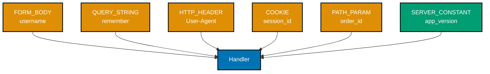
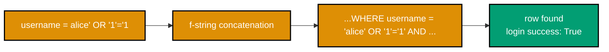
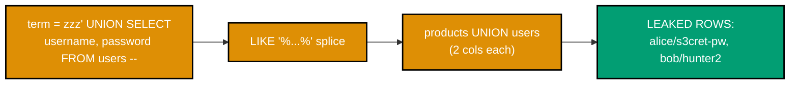
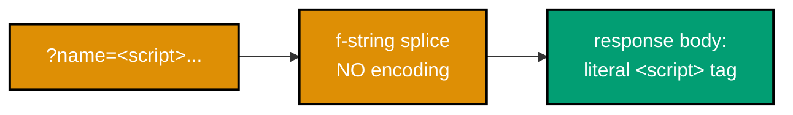
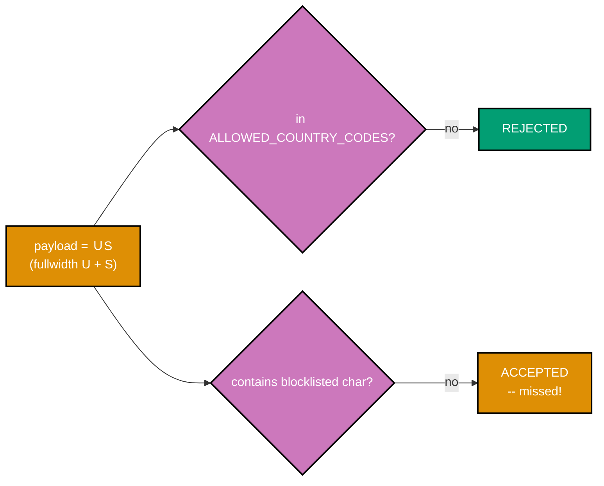
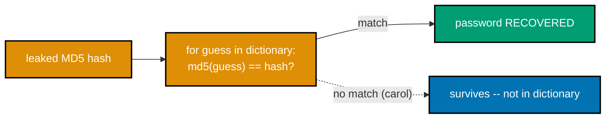
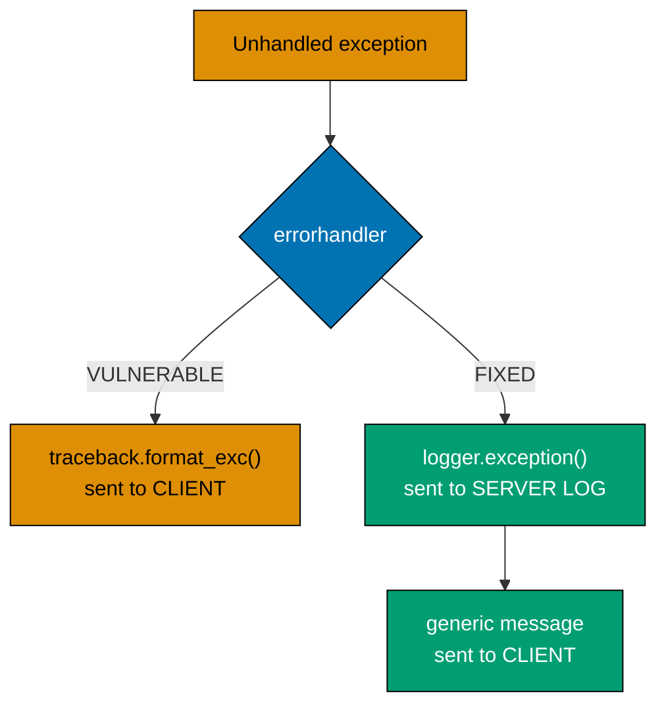
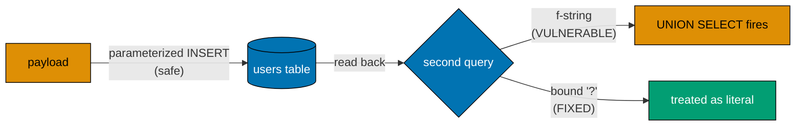

Examples 1-27 cover the everyday security a developer applies to the software they just learned to
build: mapping trust boundaries and the OWASP Top 10:2025 risk vocabulary, then a live exploit-and-fix
pair for each of the classic injection and output-encoding bugs (SQL injection, command injection, path
traversal, reflected and stored XSS), allow-list validation at the boundary, the password-storage
evolution from plaintext through MD5 to argon2id and bcrypt with salting and timing-safe comparison,
secure cookie flags, secret hygiene, security headers, a first `pip-audit` run and CVE remediation, safe
error messages, and second-order/ORM-fragment SQL injection. Every script below is a complete,
self-contained, fully type-annotated file (DD-39) under `learning/code/ex-NN-*/`, run for real against
**Python 3.13.12** with **Flask 3.1.3**. Every `**Output**` block is a genuine, captured transcript --
where an example demonstrates an attack, the attack is run for real against a small, throwaway, local
Flask + SQLite app on `127.0.0.1` and shown succeeding, before the fix is applied and the exact same
attack is re-run and shown failing.

---

### Example 1: Trust-Boundary Map -- Tainted Input

_ex-01 &middot; exercises co-01_

Before fixing any vulnerability, name every place untrusted data crosses into a handler. This example
enumerates a representative login handler's inputs (query, form, header, cookie, path) and marks each
one attacker-controlled or not -- the mapping exercise every later exploit in this tier builds on.



```python
# learning/code/ex-01-trust-boundary-map-tainted-input/trust_map.py
"""Example 1: Trust-Boundary Map -- Tainted Input."""

from __future__ import annotations
# => __future__ import: lets `list[tuple[...]]` below work identically on every
# => supported interpreter version -- DD-39 hygiene, unrelated to tainting itself

from typing import NamedTuple  # => co-01: a typed tuple beats a bare dict -- fields are named AND typed


class TaintedEntryPoint(NamedTuple):  # => co-01: one row of the trust-boundary map this example builds
    name: str  # => the variable name as it appears in the handler
    source: str  # => co-01: WHERE this value crosses into the code (query, form, header, cookie, path)
    attacker_controlled: bool  # => co-01: the single fact every downstream validation decision depends on


# ex-01: a small Flask-shaped login handler, expressed as literal STRINGS rather
# than a running server -- this example's whole job is the taint MAP, not a live request
HANDLER_SOURCE: list[str] = [  # => co-01: the handler this map describes, as literal source text
    "@app.route('/login', methods=['POST'])",  # => the route decorator -- not itself an entry point
    "def login() -> Response:",  # => the handler signature -- not itself an entry point
    "    username = request.form['username']",  # => co-01: FORM_BODY -- attacker chooses this string
    "    remember = request.args.get('remember')",  # => co-01: QUERY_STRING -- attacker chooses this
    "    ua = request.headers.get('User-Agent')",  # => co-01: HTTP_HEADER -- attacker chooses this
    "    sid = request.cookies.get('sid')",  # => co-01: COOKIE -- attacker can forge/replay this
    "    oid = request.view_args['order_id']",  # => co-01: PATH_PARAM -- attacker chooses this
    "    app_version = '2026.07'",  # => co-01: SERVER_CONSTANT -- developer-written, NOT attacker input
]

# ex-01: the map itself -- one row per boundary crossing, in the SAME order as the
# handler source above, so a reader can match each row to the line it describes
TRUST_MAP: list[TaintedEntryPoint] = [  # => co-01: 5 attacker-controlled rows, 1 server-controlled row
    TaintedEntryPoint("username", "FORM_BODY", True),  # => co-01: POST body field -- fully attacker-chosen
    TaintedEntryPoint("remember", "QUERY_STRING", True),  # => co-01: URL query param -- fully attacker-chosen
    TaintedEntryPoint("user_agent", "HTTP_HEADER", True),  # => co-01: request header -- fully attacker-chosen
    TaintedEntryPoint("session_id", "COOKIE", True),  # => co-01: cookie value -- attacker can send ANY value
    TaintedEntryPoint("order_id", "PATH_PARAM", True),  # => co-01: URL path segment -- fully attacker-chosen
    TaintedEntryPoint("app_version", "SERVER_CONSTANT", False),  # => co-01: literal in source -- never tainted
]


def render_trust_map(entries: list[TaintedEntryPoint]) -> str:  # => co-01: reader-facing report, one line per entry
    """Format the trust map as a reader-facing table."""
    header = f"{'ENTRY POINT':<14} | {'SOURCE':<15} | ATTACKER-CONTROLLED"  # => co-01: column header row
    rows = [header, "-" * 55]  # => co-01: header plus a cosmetic separator, both fixed report lines
    for e in entries:  # => co-01: one row per tainted-or-not entry point, in TRUST_MAP order
        verdict = "YES" if e.attacker_controlled else "no"  # => co-01: the verdict this map exists to state
        rows.append(f"{e.name:<14} | {e.source:<15} | {verdict}")  # => co-01: one fully-formed report row
    return "\n".join(rows)  # => co-01: joined into the final printable report string


if __name__ == "__main__":
    print("Handler under review:")  # => co-01: names WHAT this map describes before describing it
    for line in HANDLER_SOURCE:  # => co-01: prints the literal handler source, for reader context
        print(line)  # => co-01: one printed source line per HANDLER_SOURCE entry
    print()  # => co-01: blank separator line between the handler and its trust map
    print(render_trust_map(TRUST_MAP))  # => co-01: prints all 6 rows -- 5 tainted, 1 not
    tainted = sum(1 for e in TRUST_MAP if e.attacker_controlled)  # => co-01: counts the YES rows -- 5
    print(f"\n{tainted} of {len(TRUST_MAP)} entry points are attacker-controlled.")  # => co-01: "5 of 6..."
```

**Run**: `python3 trust_map.py`

**Output**:

```text
Handler under review:
@app.route('/login', methods=['POST'])
def login() -> Response:
    username = request.form['username']
    remember = request.args.get('remember')
    ua = request.headers.get('User-Agent')
    sid = request.cookies.get('sid')
    oid = request.view_args['order_id']
    app_version = '2026.07'

ENTRY POINT    | SOURCE          | ATTACKER-CONTROLLED
-------------------------------------------------------
username       | FORM_BODY       | YES
remember       | QUERY_STRING    | YES
user_agent     | HTTP_HEADER     | YES
session_id     | COOKIE          | YES
order_id       | PATH_PARAM      | YES
app_version    | SERVER_CONSTANT | no

5 of 6 entry points are attacker-controlled.
```

**Key takeaway**: 5 of this handler's 6 inputs -- everything except the hardcoded `app_version` string
-- cross a trust boundary and must be validated; only a value the developer wrote is exempt by default.

**Why it matters**: Every later exploit in this tier is a variation on one of these five rows going
unvalidated -- the form field becomes a SQL-injection payload (Example 3), the header becomes an
XSS payload (Example 8), the cookie becomes a session-hijack vector. Building the map first, before
writing a single line of defense, is what turns "harden this app" from a vague instruction into a
concrete checklist: one validation decision per tainted row, made explicitly rather than assumed away.

---

### Example 2: OWASP Top 10 Mapping Exercise

_ex-02 &middot; exercises co-02_

Five concrete bugs, seeded into a small sample app, each get tagged with their OWASP Top 10:2025
category id. An independent grader (built without looking at the tags) confirms every id/name pair is
real and internally consistent before printing the map -- the shared vocabulary the rest of this topic
uses to name what kind of risk each exploit is.

```python
# learning/code/ex-02-owasp-top-10-mapping-exercise/owasp_map.py
"""Example 2: OWASP Top 10 Mapping Exercise."""  # => co-02: module docstring, shown in help(module)

from __future__ import annotations  # => co-02: DD-39 hygiene for the `list[SeededBug]` annotation below

from typing import NamedTuple  # => co-02: a typed tuple names each field instead of a bare 3-tuple


class SeededBug(NamedTuple):  # => co-02: one seeded bug, its own OWASP category, and why
    description: str  # => a one-line description of the concrete bug found in the sample app
    owasp_id: str  # => co-02: the OWASP Top 10:2025 category id this bug maps to (e.g. "A05")
    owasp_name: str  # => co-02: the human-readable category name for owasp_id
    reason: str  # => co-02: WHY this bug maps to that category, not a different one


# ex-02: five bugs seeded into a small sample app, each mapped to its OWASP
# Top 10:2025 category -- the shared risk vocabulary this whole topic is organized around
SEEDED_BUGS: list[SeededBug] = [  # => co-02: 5 rows, each independently verified below by an assert
    SeededBug(  # => bug #1: injection
        "login query built with an f-string: f\"SELECT ... WHERE user='{u}'\"",  # => the bug itself
        "A05", "Injection",  # => co-02: untrusted input becomes part of the SQL command
        "attacker input changes the STRUCTURE of a command, the textbook injection pattern",  # => why
    ),  # => end bug #1
    SeededBug(  # => bug #2: misconfiguration
        "Flask app runs with debug=True and the interactive debugger reachable in prod",  # => the bug
        "A02", "Security Misconfiguration",  # => co-02: an insecure DEFAULT, not a coding mistake
        "the framework's own default (debug mode) is left on where it should be off",  # => why
    ),  # => end bug #2
    SeededBug(  # => bug #3: supply chain
        "requirements.txt pins Flask==0.12.2, a version with a public disclosed CVE",  # => the bug
        "A03", "Software Supply Chain Failures",  # => co-02: risk lives in a THIRD-PARTY dependency
        "the vulnerable code is not the app's own -- it is an unpatched dependency",  # => why
    ),  # => end bug #3
    SeededBug(  # => bug #4: crypto failure
        "passwords stored as unsalted hashlib.md5(password).hexdigest()",  # => the bug
        "A04", "Cryptographic Failures",  # => co-02: a weak/misused cryptographic primitive
        "MD5 is a fast, unsalted hash -- exactly the cryptographic failure this category names",  # => why
    ),  # => end bug #4
    SeededBug(  # => bug #5: access control
        "GET /orders/<id> returns ANY order for ANY logged-in user, no ownership check",  # => the bug
        "A01", "Broken Access Control",  # => co-02: a missing authorization check, not authentication
        "the user IS authenticated -- the missing check is WHOSE data they may read",  # => why
    ),  # => end bug #5
]  # => co-02: end of the 5-row seeded-bug table

# ex-02: an independent grader, built WITHOUT looking at SEEDED_BUGS above, used
# only to verify each row's tag is internally consistent (id and name actually match)
VALID_CATEGORIES: dict[str, str] = {  # => co-02: the closed OWASP Top 10:2025 vocabulary, id -> name
    "A01": "Broken Access Control",  # => co-02: valid id/name pair #1
    "A02": "Security Misconfiguration",  # => co-02: valid id/name pair #2
    "A03": "Software Supply Chain Failures",  # => co-02: valid id/name pair #3
    "A04": "Cryptographic Failures",  # => co-02: valid id/name pair #4
    "A05": "Injection",  # => co-02: valid id/name pair #5
}  # => co-02: end of the closed vocabulary dict


def verify_tags(bugs: list[SeededBug]) -> None:  # => co-02: raises if any row's id/name pair is inconsistent
    """Confirm every bug's owasp_id and owasp_name are a REAL, matching OWASP Top 10:2025 pair."""  # => doc
    for bug in bugs:  # => co-02: checked independently, one bug at a time
        assert bug.owasp_id in VALID_CATEGORIES, f"unknown id {bug.owasp_id!r}"  # => co-02: id must exist
        assert VALID_CATEGORIES[bug.owasp_id] == bug.owasp_name, "id/name mismatch"  # => co-02: names agree


if __name__ == "__main__":  # => co-02: entry point -- verify, then print each tagged bug
    verify_tags(SEEDED_BUGS)  # => co-02: raises AssertionError immediately if any tag is wrong -- none are
    for i, bug in enumerate(SEEDED_BUGS, start=1):  # => co-02: one printed block per seeded bug
        print(f"Bug {i}: {bug.description}")  # => co-02: the concrete symptom found in the sample app
        print(f"  -> {bug.owasp_id} {bug.owasp_name}")  # => co-02: the category id this bug is tagged with
        print(f"     because: {bug.reason}")  # => co-02: the justification a reviewer can check
    print(f"\nAll {len(SEEDED_BUGS)} bugs verified against {len(VALID_CATEGORIES)} OWASP categories.")  # => co-02: summary
```

**Run**: `python3 owasp_map.py`

**Output**:

```text
Bug 1: login query built with an f-string: f"SELECT ... WHERE user='{u}'"
  -> A05 Injection
     because: attacker input changes the STRUCTURE of a command, the textbook injection pattern
Bug 2: Flask app runs with debug=True and the interactive debugger reachable in prod
  -> A02 Security Misconfiguration
     because: the framework's own default (debug mode) is left on where it should be off
Bug 3: requirements.txt pins Flask==0.12.2, a version with a public disclosed CVE
  -> A03 Software Supply Chain Failures
     because: the vulnerable code is not the app's own -- it is an unpatched dependency
Bug 4: passwords stored as unsalted hashlib.md5(password).hexdigest()
  -> A04 Cryptographic Failures
     because: MD5 is a fast, unsalted hash -- exactly the cryptographic failure this category names
Bug 5: GET /orders/<id> returns ANY order for ANY logged-in user, no ownership check
  -> A01 Broken Access Control
     because: the user IS authenticated -- the missing check is WHOSE data they may read

All 5 bugs verified against 5 OWASP categories.
```

**Key takeaway**: Each seeded bug maps to exactly one OWASP Top 10:2025 category, and the mapping is
mechanically checkable -- `verify_tags` would raise the moment a bug's id and name pair disagreed.

**Why it matters**: OWASP's Top 10 is a shared vocabulary, not a checklist to memorize -- once a bug is
correctly tagged `A05 Injection` versus `A01 Broken Access Control`, a team knows immediately which
category of fix applies (parameterize a query, versus add an ownership check) and can prioritize by
category the way the rest of the industry does, instead of inventing an ad hoc severity label per bug.

---

### Example 3: SQL Injection -- Live Exploit

_ex-03 &middot; exercises co-03, co-01_

A login handler builds its SQL query with an f-string. The classic `' OR '1'='1` payload closes the
quoted username early and appends an always-true clause -- the attacker logs in with no valid password
at all, and the printed query text shows exactly how the string was rewritten.



```python
# learning/code/ex-03-sql-injection-live-exploit/naive_login.py
"""Example 3: SQL Injection -- Live Exploit."""  # => co-03: module docstring

from __future__ import annotations  # => co-03/co-01: DD-39 hygiene, unrelated to the exploit itself

import sqlite3  # => co-03: stdlib DB driver -- the naive query below is built with plain f-strings


def seed_database(conn: sqlite3.Connection) -> None:  # => co-03: one legit user, one real password
    """Create a users table with exactly one legitimate account."""  # => co-03: doc
    conn.execute("CREATE TABLE users (username TEXT, password TEXT)")  # => co-01: the trust boundary is the query below, not this schema
    conn.execute("INSERT INTO users VALUES ('alice', 's3cret-pw')")  # => co-03: the ONLY valid credential pair
    conn.commit()  # => co-03: persists the seed row before any login attempt runs


# ex-03: username and password arrive as TAINTED strings (co-01) and are dropped
# straight into an f-string -- the textbook SQL-injection shape this example exploits
def naive_login(conn: sqlite3.Connection, username: str, password: str) -> bool:  # => co-03: the vulnerable handler
    """Log in by building the SQL query with an f-string -- VULNERABLE, do not copy."""  # => co-03: doc
    query = (  # => co-03: the exact query string sent to SQLite -- built by STRING CONCATENATION
        f"SELECT username FROM users WHERE username = '{username}' "  # => co-01: username is tainted input
        f"AND password = '{password}'"  # => co-01: password is tainted input, concatenated the same way
    )  # => co-03: end of the concatenated query string
    print(f"QUERY: {query}")  # => co-03: prints the ACTUAL query sent -- shows the attacker's rewrite
    row = conn.execute(query).fetchone()  # => co-03: executes the attacker-controlled query as-is
    return row is not None  # => co-03: True means "logged in" -- a single matching row was found


if __name__ == "__main__":  # => co-03: entry point -- runs a legit login, then the injection attack
    conn = sqlite3.connect(":memory:")  # => co-03: throwaway in-process DB, self-contained per-run
    seed_database(conn)  # => co-03: creates and seeds the one legitimate 'alice' account

    print("=== Legitimate login (correct password) ===")  # => co-03: sanity check -- the app works normally
    ok = naive_login(conn, "alice", "s3cret-pw")  # => co-03: correct username AND correct password
    print(f"login success: {ok}")  # => co-03: True -- proves the handler works for real users first

    print("\n=== Attacker payload: ' OR '1'='1 ===")  # => co-03: the classic tautology-injection payload
    payload_username = "alice' OR '1'='1"  # => co-03: closes the quote early, then adds an ALWAYS-TRUE clause
    exploited = naive_login(conn, payload_username, "totally-wrong-password")  # => co-01: attacker controls both fields
    print(f"login success: {exploited}")  # => co-03: True -- login succeeds with NO valid password at all
```

**Run**: `python3 naive_login.py`

**Output**:

```text
=== Legitimate login (correct password) ===
QUERY: SELECT username FROM users WHERE username = 'alice' AND password = 's3cret-pw'
login success: True

=== Attacker payload: ' OR '1'='1 ===
QUERY: SELECT username FROM users WHERE username = 'alice' OR '1'='1' AND password = 'totally-wrong-password'
login success: True
```

**Key takeaway**: The printed query proves the rewrite -- `AND password = '...'` is still checked, but
`OR '1'='1'` makes the whole `WHERE` clause true regardless, so `login success: True` with zero correct
credentials.

**Why it matters**: This is the textbook SQL-injection shape, and it generalizes far beyond login forms
-- any place a query is assembled with `f"...{tainted}..."` instead of a placeholder has the exact same
failure mode. Example 4 fixes this same handler with bound parameters, and the same underlying mistake
recurs later in this tier as UNION-based data exfiltration (Example 5) and second-order injection
(Example 26) -- one root cause, several different attacker goals.

---

### Example 4: SQL Injection -- Parameterized Fix

_ex-04 &middot; exercises co-03_

The same login handler, rewritten to bind `username` and `password` as query parameters instead of
splicing them into the query text. The exact same `' OR '1'='1` payload from Example 3 is replayed here
-- this time it is rejected, because the database now treats it as an inert literal string.

```python
# learning/code/ex-04-sql-injection-parameterized-fix/parameterized_login.py
"""Example 4: SQL Injection -- Parameterized Fix."""  # => co-03: module docstring

from __future__ import annotations  # => co-03: DD-39 hygiene, unrelated to the fix itself

import sqlite3  # => co-03: same stdlib driver as Example 3 -- ONLY the query-building style changes


def seed_database(conn: sqlite3.Connection) -> None:  # => co-03: identical seed data to Example 3
    """Create a users table with exactly one legitimate account."""  # => co-03: doc
    conn.execute("CREATE TABLE users (username TEXT, password TEXT)")  # => co-03: same schema as Example 3
    conn.execute("INSERT INTO users VALUES ('alice', 's3cret-pw')")  # => co-03: the SAME only valid pair
    conn.commit()  # => co-03: persists the seed row before any login attempt runs


# ex-04: the FIX -- username and password are passed as a SEPARATE parameter
# tuple, never concatenated into the query text itself, closing the co-03 boundary
def parameterized_login(conn: sqlite3.Connection, username: str, password: str) -> bool:  # => co-03: the fixed handler
    """Log in using a bound `?` placeholder query -- SQL text and data travel separately."""  # => doc
    query = "SELECT username FROM users WHERE username = ? AND password = ?"  # => co-03: NO f-string, ever
    print(f"QUERY: {query}  PARAMS: {(username, password)!r}")  # => co-03: shows text and data are SEPARATE
    row = conn.execute(query, (username, password)).fetchone()  # => co-03: driver binds params, never text-splices
    return row is not None  # => co-03: True means "logged in" -- a single matching row was found


if __name__ == "__main__":  # => co-03: entry point -- re-runs BOTH Example 3 scenarios against the fix
    conn = sqlite3.connect(":memory:")  # => co-03: throwaway in-process DB, self-contained per-run
    seed_database(conn)  # => co-03: creates and seeds the one legitimate 'alice' account

    print("=== Legitimate login (correct password) ===")  # => co-03: the fix must NOT break real logins
    ok = parameterized_login(conn, "alice", "s3cret-pw")  # => co-03: correct username AND correct password
    print(f"login success: {ok}")  # => co-03: True -- the fix still authenticates real users

    print("\n=== Same attacker payload as Example 3: ' OR '1'='1 ===")  # => co-03: THE SAME payload, unchanged
    payload_username = "alice' OR '1'='1"  # => co-03: identical string to Example 3's exploit
    blocked = parameterized_login(conn, payload_username, "totally-wrong-password")  # => co-01: attacker input, now inert
    print(f"login success: {blocked}")  # => co-03: False -- the payload is now just a literal, non-matching string
```

**Run**: `python3 parameterized_login.py`

**Output**:

```text
=== Legitimate login (correct password) ===
QUERY: SELECT username FROM users WHERE username = ? AND password = ?  PARAMS: ('alice', 's3cret-pw')
login success: True

=== Same attacker payload as Example 3: ' OR '1'='1 ===
QUERY: SELECT username FROM users WHERE username = ? AND password = ?  PARAMS: ("alice' OR '1'='1", 'totally-wrong-password')
login success: False
```

**Key takeaway**: The query TEXT never changes (`= ? AND password = ?`) regardless of what the
attacker sends -- the payload string travels as opaque data in the params tuple, so `login success:
False` even though it is the identical string that bypassed Example 3.

**Why it matters**: Binding parameters is not "more careful string escaping" -- it is a structurally
different mechanism where the database driver keeps SQL syntax and data on two separate channels, so no
string content the caller supplies can ever be reinterpreted as SQL. This is why parameterized queries,
not blocklist-based escaping, are the actual fix OWASP recommends for co-03 across every SQL driver.

---

### Example 5: SQL Injection -- UNION Data Exfiltration

_ex-05 &middot; exercises co-03_

A naive product-search handler leaks an entirely different, sensitive table. Because the vulnerable
query and the `users` table both select two columns, a `UNION SELECT username, password FROM users`
payload is syntactically legal and returns secret rows disguised as search results.



```python
# learning/code/ex-05-sql-injection-union-data-exfil/union_search.py
"""Example 5: SQL Injection -- UNION Data Exfiltration."""  # => co-03: module docstring

from __future__ import annotations  # => co-03: DD-39 hygiene, unrelated to the exploit itself

import sqlite3  # => co-03: stdlib DB driver -- both the vulnerable AND fixed search reuse this schema


def seed_database(conn: sqlite3.Connection) -> None:  # => co-03: TWO tables -- one public, one secret
    """Create a public products table and a separate, sensitive users table."""  # => co-03: doc
    conn.execute("CREATE TABLE products (name TEXT, price TEXT)")  # => co-03: the table the search UI exposes
    conn.execute("INSERT INTO products VALUES ('Widget', '9.99')")  # => co-03: public row #1
    conn.execute("INSERT INTO products VALUES ('Gadget', '19.99')")  # => co-03: public row #2
    conn.execute("CREATE TABLE users (username TEXT, password TEXT)")  # => co-01: the table NEVER meant to be exposed
    conn.execute("INSERT INTO users VALUES ('alice', 's3cret-pw')")  # => co-01: secret row #1 -- the exfil target
    conn.execute("INSERT INTO users VALUES ('bob', 'hunter2')")  # => co-01: secret row #2 -- the exfil target
    conn.commit()  # => co-03: persists all four rows before any search runs


# ex-05: a search box concatenates the search term straight into a LIKE clause --
# same column COUNT (2) in both tables is what makes a UNION SELECT syntactically legal
def naive_search(conn: sqlite3.Connection, term: str) -> list[tuple[str, str]]:  # => co-03: the vulnerable handler
    """Search products by name -- VULNERABLE, builds the query with an f-string."""  # => co-03: doc
    query = f"SELECT name, price FROM products WHERE name LIKE '%{term}%'"  # => co-01: term is tainted input
    print(f"QUERY: {query}")  # => co-03: prints the ACTUAL query -- shows the UNION splice landing inside LIKE
    return conn.execute(query).fetchall()  # => co-03: executes the attacker-controlled query as-is


def parameterized_search(conn: sqlite3.Connection, term: str) -> list[tuple[str, str]]:  # => co-03: the FIXED handler
    """Search products by name -- FIXED, the LIKE pattern is a bound parameter."""  # => co-03: doc
    like_pattern = f"%{term}%"  # => co-03: the wildcard wrapping happens in PYTHON, not in SQL text
    query = "SELECT name, price FROM products WHERE name LIKE ?"  # => co-03: NO f-string in the query text
    print(f"QUERY: {query}  PARAM: {like_pattern!r}")  # => co-03: shows the whole payload travels as ONE opaque value
    return conn.execute(query, (like_pattern,)).fetchall()  # => co-03: driver binds it -- can never become SQL syntax


UNION_PAYLOAD = "zzz' UNION SELECT username, password FROM users -- "  # => co-01: closes LIKE, unions in the secret table


if __name__ == "__main__":  # => co-03: entry point -- normal search, then the exploit, then the fix
    conn = sqlite3.connect(":memory:")  # => co-03: throwaway in-process DB, self-contained per-run
    seed_database(conn)  # => co-03: creates products + the secret users table

    print("=== VULNERABLE: normal search ===")  # => co-03: sanity check -- the naive search works normally
    print(naive_search(conn, "Widget"))  # => co-03: [('Widget', '9.99')] -- correct, unremarkable result

    print("\n=== VULNERABLE: UNION SELECT exfiltration ===")  # => co-03: the attack
    leaked = naive_search(conn, UNION_PAYLOAD)  # => co-01: attacker-supplied search term carries the UNION
    print(f"LEAKED ROWS: {leaked}")  # => co-03: the users table's usernames AND passwords, printed verbatim

    print("\n=== FIXED: same payload against the parameterized search ===")  # => co-03: re-run against the fix
    safe_result = parameterized_search(conn, UNION_PAYLOAD)  # => co-01: the SAME string, now inert
    print(f"RESULT: {safe_result}")  # => co-03: [] -- no product NAME literally contains the whole payload text
```

**Run**: `python3 union_search.py`

**Output**:

```text
=== VULNERABLE: normal search ===
QUERY: SELECT name, price FROM products WHERE name LIKE '%Widget%'
[('Widget', '9.99')]

=== VULNERABLE: UNION SELECT exfiltration ===
QUERY: SELECT name, price FROM products WHERE name LIKE '%zzz' UNION SELECT username, password FROM users -- %'
LEAKED ROWS: [('alice', 's3cret-pw'), ('bob', 'hunter2')]

=== FIXED: same payload against the parameterized search ===
QUERY: SELECT name, price FROM products WHERE name LIKE ?  PARAM: "%zzz' UNION SELECT username, password FROM users -- %"
RESULT: []
```

**Key takeaway**: `LEAKED ROWS` contains both usernames and plaintext passwords from a table the search
feature never intended to expose; against the parameterized version the identical payload string
matches zero product names, so `RESULT: []`.

**Why it matters**: UNION-based exfiltration shows why SQL injection is not just an authentication
bypass -- it is arbitrary read access to the entire database through any injectable query, including
ones that look as innocuous as a product search box. The column-count requirement (`UNION SELECT` needs
matching column counts) is the only real constraint on an attacker, and larger schemas make it trivial
to find some other table with a matching shape to pivot through.

---

### Example 6: Command Injection -- Live

_ex-06 &middot; exercises co-04, co-01_

A ping utility hands a concatenated string to `os.system()`, which always runs its argument through a
real shell. A `;`-chained payload appends a second command that creates a marker file -- proof the
injected command actually ran -- and `subprocess.run([...], shell=False)` closes the same hole.


```python
# learning/code/ex-06-command-injection-live/ping_host.py
"""Example 6: Command Injection -- Live."""  # => co-04: module docstring

from __future__ import annotations  # => co-04: DD-39 hygiene, unrelated to the exploit itself

import os  # => co-04: os.system() below hands the WHOLE string to a real shell
import subprocess  # => co-04: subprocess.run([...]) below is the fix -- no shell involved
from pathlib import Path  # => co-04: used to prove/erase the marker file the injected command creates

MARKER = Path("injected_marker.txt")  # => co-01: the file an injected command will create if it RUNS


def naive_ping(host: str) -> int:  # => co-04: the vulnerable handler -- host is tainted (co-01)
    """Ping a host by handing a concatenated string straight to a shell -- VULNERABLE."""  # => co-04: doc
    command = "ping -c 1 " + host  # => co-01: string concatenation -- host is spliced straight into shell text
    print(f"COMMAND: {command}")  # => co-04: prints the ACTUAL shell command -- shows the ';' surviving intact
    return os.system(command)  # => co-04: os.system() ALWAYS runs its argument through /bin/sh -c


def safe_ping(host: str) -> int:  # => co-04: the FIXED handler -- same tainted host, different execution path
    """Ping a host using an argv list -- FIXED, no shell is ever spawned."""  # => co-04: doc
    args = ["ping", "-c", "1", host]  # => co-04: host is ONE array element, never concatenated into command text
    print(f"ARGV: {args!r}")  # => co-04: prints the literal argv -- 'host' is a single opaque argument
    result = subprocess.run(args, shell=False, capture_output=True, text=True)  # => co-04: shell=False -- NO shell parses this
    print(f"STDERR: {result.stderr.strip()}")  # => co-04: ping itself rejects the whole string as an invalid hostname
    return result.returncode  # => co-04: nonzero -- ping failed to resolve the payload as one literal hostname


if __name__ == "__main__":  # => co-04: entry point -- legit ping, injection via os.system, then the fix
    MARKER.unlink(missing_ok=True)  # => co-04: ensure a clean slate -- no leftover marker from a prior run

    print("=== VULNERABLE: legitimate ping ===")  # => co-04: sanity check -- the naive handler works normally
    naive_ping("127.0.0.1")  # => co-04: a real, well-formed hostname -- no shell metacharacters

    print("\n=== VULNERABLE: injected payload ===")  # => co-04: the attack
    payload = "127.0.0.1; touch injected_marker.txt"  # => co-01: ';' chains a SECOND command onto the ping
    naive_ping(payload)  # => co-04: os.system() runs BOTH commands -- ping, then the injected touch
    print(f"marker created by injected command: {MARKER.exists()}")  # => co-04: True -- the injected command RAN

    MARKER.unlink(missing_ok=True)  # => co-04: reset the marker before testing the fix with the SAME payload
    print("\n=== FIXED: same payload against subprocess.run(shell=False) ===")  # => co-04: re-run against the fix
    safe_ping(payload)  # => co-01: the SAME string, now treated as one opaque hostname argument
    print(f"marker created by injected command: {MARKER.exists()}")  # => co-04: False -- no shell ever parsed the ';'
```

**Run**: `python3 -u ping_host.py`

**Output**:

```text
=== VULNERABLE: legitimate ping ===
COMMAND: ping -c 1 127.0.0.1
PING 127.0.0.1 (127.0.0.1): 56 data bytes
64 bytes from 127.0.0.1: icmp_seq=0 ttl=64 time=0.069 ms

--- 127.0.0.1 ping statistics ---
1 packets transmitted, 1 packets received, 0.0% packet loss
round-trip min/avg/max/stddev = 0.069/0.069/0.069/nan ms

=== VULNERABLE: injected payload ===
COMMAND: ping -c 1 127.0.0.1; touch injected_marker.txt
PING 127.0.0.1 (127.0.0.1): 56 data bytes
64 bytes from 127.0.0.1: icmp_seq=0 ttl=64 time=0.052 ms

--- 127.0.0.1 ping statistics ---
1 packets transmitted, 1 packets received, 0.0% packet loss
round-trip min/avg/max/stddev = 0.052/0.052/0.052/0.000 ms
marker created by injected command: True

=== FIXED: same payload against subprocess.run(shell=False) ===
ARGV: ['ping', '-c', '1', '127.0.0.1; touch injected_marker.txt']
STDERR: ping: cannot resolve 127.0.0.1; touch injected_marker.txt: Unknown host
marker created by injected command: False
```

**Key takeaway**: `marker created by injected command: True` proves the shell ran a SECOND command the
developer never intended; against `subprocess.run([...], shell=False)`, the identical payload string
becomes one literal (and invalid) hostname, `ping` itself rejects it, and no marker is ever created.

**Why it matters**: `os.system()` and `subprocess.run(..., shell=True)` both hand their argument to a
real shell, which treats `;`, `&&`, `|`, backticks, and `$()` as syntax, not data -- there is no escaping
scheme that reliably closes every one of those metacharacters. An argv list removes the shell from the
equation entirely: the OS execs the program directly with each list element as one opaque argument, so
"parsing" untrusted shell syntax is a category of bug that structurally cannot happen.

---

### Example 7: Path Traversal -- File Read

_ex-07 &middot; exercises co-05, co-01_

A download handler naively joins a base directory with an attacker-supplied filename. A `../` payload
walks up one level and reads a secret file outside the intended sandbox; `os.path.realpath` plus a
prefix check on the RESOLVED path -- not the raw string -- closes the same hole.


```python
# learning/code/ex-07-path-traversal-file-read/download_file.py
"""Example 7: Path Traversal -- File Read."""  # => co-05: module docstring

from __future__ import annotations  # => co-05: DD-39 hygiene, unrelated to the exploit itself

import os  # => co-05: os.path.join/realpath below are the whole mechanism this example turns on
import tempfile  # => co-05: builds a throwaway sandbox directory, self-contained per-run
from pathlib import Path  # => co-05: typed, ergonomic file writes for the sandbox setup


def build_sandbox(root: Path) -> tuple[Path, Path]:  # => co-05: returns (public download dir, secret file OUTSIDE it)
    """Create a downloads/ dir with a public file, plus a secret file one level ABOVE it."""  # => co-05: doc
    downloads = root / "downloads"  # => co-05: the intended, sandboxed root every download SHOULD stay inside
    downloads.mkdir()  # => co-05: creates the public-facing directory
    (downloads / "report.txt").write_text("Q3 sales report -- public\n")  # => co-05: a legitimate, in-bounds file
    secret = root / "secret_config.txt"  # => co-01: lives OUTSIDE downloads/ -- never meant to be served
    secret.write_text("DB_PASSWORD=super-secret-value\n")  # => co-01: the out-of-root file this exploit targets
    return downloads, secret  # => co-05: (sandboxed dir, off-limits file) -- used by both handlers below


def naive_download(base_dir: Path, filename: str) -> str:  # => co-05: the vulnerable handler -- filename is tainted
    """Read a file under base_dir by naive path joining -- VULNERABLE, do not copy."""  # => co-05: doc
    path = os.path.join(base_dir, filename)  # => co-01: '../' sequences in filename are NOT stripped here
    print(f"OPENING: {path}")  # => co-05: prints the ACTUAL path opened -- shows the traversal landing outside base_dir
    return Path(path).read_text()  # => co-05: reads WHATEVER path results, in or out of base_dir


def safe_download(base_dir: Path, filename: str) -> str:  # => co-05: the FIXED handler -- same tainted filename
    """Read a file under base_dir, canonicalizing and enforcing a root prefix -- FIXED."""  # => co-05: doc
    candidate = os.path.realpath(os.path.join(base_dir, filename))  # => co-05: resolves ALL '..' and symlinks first
    allowed_root = os.path.realpath(base_dir)  # => co-05: the canonical form of the ONE directory downloads may serve
    print(f"CANDIDATE: {candidate}")  # => co-05: prints the fully-resolved path -- shows where '..' actually points
    if not candidate.startswith(allowed_root + os.sep):  # => co-05: prefix check AFTER resolution, not before
        raise PermissionError(f"{filename!r} resolves outside the allowed root")  # => co-05: rejects the escape
    return Path(candidate).read_text()  # => co-05: only reached if candidate is genuinely inside allowed_root


if __name__ == "__main__":  # => co-05: entry point -- legit read, traversal exploit, then the fix
    with tempfile.TemporaryDirectory() as tmp:  # => co-05: throwaway sandbox, cleaned up automatically on exit
        root = Path(tmp)  # => co-05: the temp dir standing in for a real app's storage root
        downloads, secret = build_sandbox(root)  # => co-05: sets up downloads/report.txt and ../secret_config.txt

        print("=== VULNERABLE: legitimate download ===")  # => co-05: sanity check -- the naive handler works normally
        print(naive_download(downloads, "report.txt"))  # => co-05: reads the intended, in-bounds file

        print("=== VULNERABLE: path-traversal exploit ===")  # => co-05: the attack
        payload = "../secret_config.txt"  # => co-01: '..' walks UP one level, straight to the secret file
        leaked = naive_download(downloads, payload)  # => co-05: the out-of-root read this example proves
        print(f"LEAKED CONTENT: {leaked!r}")  # => co-05: the secret file's contents, read successfully

        print("=== FIXED: same payload against realpath + prefix check ===")  # => co-05: re-run against the fix
        try:  # => co-05: safe_download raises instead of returning attacker-reachable content
            safe_download(downloads, payload)  # => co-01: the SAME payload string, now rejected
        except PermissionError as exc:  # => co-05: the exact exception the fix raises for an out-of-root path
            print(f"BLOCKED: {exc}")  # => co-05: proves the traversal is refused, no content is ever read
```

**Run**: `python3 download_file.py`

**Output**:

```text
=== VULNERABLE: legitimate download ===
OPENING: /var/folders/fr/jg3jv_4d39b48cyqlqz18mgr0000gn/T/tmpgnjz_ene/downloads/report.txt
Q3 sales report -- public

=== VULNERABLE: path-traversal exploit ===
OPENING: /var/folders/fr/jg3jv_4d39b48cyqlqz18mgr0000gn/T/tmpgnjz_ene/downloads/../secret_config.txt
LEAKED CONTENT: 'DB_PASSWORD=super-secret-value\n'
=== FIXED: same payload against realpath + prefix check ===
CANDIDATE: /private/var/folders/fr/jg3jv_4d39b48cyqlqz18mgr0000gn/T/tmpgnjz_ene/secret_config.txt
BLOCKED: '../secret_config.txt' resolves outside the allowed root
```

**Key takeaway**: `LEAKED CONTENT` shows the secret file's password read straight through the naive
join; `safe_download`'s `CANDIDATE` line proves `realpath` resolved `../secret_config.txt` to a path
literally outside `downloads/`, so the prefix check rejects it before any content is ever read.

**Why it matters**: Checking the raw filename string for `..` is a losing blocklist game (URL-encoded
`%2e%2e`, mixed separators, and symlinks all bypass naive string checks); resolving to a canonical
absolute path with `os.path.realpath` FIRST and then checking a prefix is what actually contains the
traversal, because it compares where the path truly points rather than how it was spelled -- notice the
fixed run even resolved the sandbox's own `/var` symlink to `/private/var` on this machine, exactly the
kind of resolution a naive string check would never catch.

---

### Example 8: Reflected XSS -- Live

_ex-08 &middot; exercises co-06, co-01_

A Flask route echoes a `name` query parameter straight into an HTML response with no encoding at all.
Requesting it with a `<script>` payload produces a response body containing the literal, unescaped tag
-- the non-browser proof this attack "fires" -- and `markupsafe.escape` neutralizes the same payload.



```python
# learning/code/ex-08-reflected-xss-live/greet_app.py
"""Example 8: Reflected XSS -- Live."""  # => co-06: module docstring

from __future__ import annotations  # => co-06: DD-39 hygiene, unrelated to the exploit itself

from flask import Flask, request  # => co-06: request.args below is the tainted (co-01) query-string source
from markupsafe import escape  # => co-06: the fix -- Flask's own bundled HTML-escaping helper

app = Flask(__name__)  # => co-06: a single throwaway app -- both routes share it, self-contained per-run


@app.route("/greet")  # => co-06: the VULNERABLE route -- reflects `name` with zero encoding
def greet_naive() -> str:  # => co-06: response body IS the return value here -- an f-string, not a template
    """Echo the name query param straight into HTML -- VULNERABLE, do not copy."""  # => co-06: doc
    name = request.args.get("name", "")  # => co-01: query-string value -- fully attacker-controlled
    return f"<h1>Hello, {name}</h1>"  # => co-06: name is spliced into HTML text with NO encoding at all


@app.route("/greet_safe")  # => co-06: the FIXED route -- same tainted param, encoded before rendering
def greet_safe() -> str:  # => co-06: response body is again a plain f-string, but now around escape()
    """Echo the name query param through markupsafe.escape() -- FIXED."""  # => co-06: doc
    name = request.args.get("name", "")  # => co-01: the SAME tainted source as greet_naive
    return f"<h1>Hello, {escape(name)}</h1>"  # => co-06: escape() turns '<', '>', '&', quotes into HTML entities


if __name__ == "__main__":  # => co-06: entry point -- Flask's own test client, no real socket needed
    client = app.test_client()  # => co-06: an in-process client -- issues real Flask request/response cycles
    payload = "<script>alert('xss')</script>"  # => co-01: the classic script-tag payload this example fires

    print("=== VULNERABLE: /greet reflects the payload verbatim ===")  # => co-06: the attack
    naive_body = client.get("/greet", query_string={"name": payload}).get_data(as_text=True)  # => co-06: real response body
    print(naive_body)  # => co-06: contains the LITERAL <script> tag, unescaped, exactly as sent
    assert "<script>alert('xss')</script>" in naive_body  # => co-06: mechanically proves the tag survived intact

    print("\n=== FIXED: /greet_safe encodes the same payload ===")  # => co-06: re-run against the fix
    safe_body = client.get("/greet_safe", query_string={"name": payload}).get_data(as_text=True)  # => co-06: real response body
    print(safe_body)  # => co-06: the SAME payload, now rendered as inert, visible text
    assert "<script>" not in safe_body  # => co-06: mechanically proves NO literal <script> tag remains
    assert "&lt;script&gt;" in safe_body  # => co-06: mechanically proves it was HTML-entity encoded instead
```

**Run**: `python3 greet_app.py`

**Output**:

```text
=== VULNERABLE: /greet reflects the payload verbatim ===
<h1>Hello, <script>alert('xss')</script></h1>

=== FIXED: /greet_safe encodes the same payload ===
<h1>Hello, &lt;script&gt;alert(&#39;xss&#39;)&lt;/script&gt;</h1>
```

**Key takeaway**: The vulnerable response body contains a byte-for-byte, executable `<script>` tag --
proof the payload "fires" -- while the fixed response contains only `&lt;script&gt;`, harmless text a
browser renders literally instead of parsing as markup.

**Why it matters**: Reflected XSS requires no persistence at all -- a single crafted URL, sent to a
victim in a link or email, is enough, because the payload rides IN the request and comes straight back
OUT in the response. `markupsafe.escape` (which Jinja2's autoescaping uses internally for Flask
templates) is the correct, minimal fix: HTML-entity-encode any untrusted value before it lands in an
HTML text node, so the browser's parser can never mistake data for markup.

---

### Example 9: Stored XSS -- Live

_ex-09 &middot; exercises co-06_

A comment is POSTed once and stored (safely, via a parameterized INSERT) in SQLite. A LATER, separate
GET request renders every stored comment with an f-string and no encoding -- the persisted payload fires
for every subsequent visitor, not just the one who posted it -- until the render path is encoded.

```python
# learning/code/ex-09-stored-xss-live/comments_app.py
"""Example 9: Stored XSS -- Live."""  # => co-06: module docstring

from __future__ import annotations  # => co-06: DD-39 hygiene, unrelated to the exploit itself

import sqlite3  # => co-06: persists the payload -- this is what makes it STORED, not just reflected

from flask import Flask, request  # => co-06: request.form below is the tainted (co-01) POST-body source
from markupsafe import escape  # => co-06: the fix -- HTML-escapes each comment at RENDER time

app = Flask(__name__)  # => co-06: a single throwaway app -- both render routes share it
conn = sqlite3.connect(":memory:", check_same_thread=False)  # => co-06: one shared in-memory comments store
conn.execute("CREATE TABLE comments (body TEXT)")  # => co-06: a single-column table -- the STORED payload lives here
conn.commit()  # => co-06: commits the empty schema before any comment is posted


@app.route("/comments", methods=["POST"])  # => co-06: the write path -- storing is NOT itself the vulnerability
def post_comment() -> tuple[str, int]:  # => co-06: returns (body, status) -- Flask accepts this tuple form
    """Store a comment body VERBATIM -- storage is safe, RENDERING it later is not."""  # => co-06: doc
    body = request.form["body"]  # => co-01: POST-body field -- fully attacker-controlled
    conn.execute("INSERT INTO comments (body) VALUES (?)", (body,))  # => co-03: parameterized, so storage itself is safe
    conn.commit()  # => co-06: the payload is now PERSISTED -- every future GET can render it
    return "", 201  # => co-06: 201 Created -- no body needed for this example's purposes


@app.route("/comments")  # => co-06: the VULNERABLE read path -- renders EVERY stored comment unescaped
def view_comments_naive() -> str:  # => co-06: what a LATER visitor's browser would receive
    """Render every stored comment with an f-string -- VULNERABLE, do not copy."""  # => co-06: doc
    rows = conn.execute("SELECT body FROM comments").fetchall()  # => co-06: reads back whatever was stored
    return "".join(f"<p>{r[0]}</p>" for r in rows)  # => co-06: each body is spliced into HTML with NO encoding


@app.route("/comments_safe")  # => co-06: the FIXED read path -- same stored rows, encoded at render time
def view_comments_safe() -> str:  # => co-06: what a later visitor receives ONCE the render path is fixed
    """Render every stored comment through markupsafe.escape() -- FIXED."""  # => co-06: doc
    rows = conn.execute("SELECT body FROM comments").fetchall()  # => co-06: the SAME stored rows as the naive route
    return "".join(f"<p>{escape(r[0])}</p>" for r in rows)  # => co-06: escape() runs on EVERY comment, every render


if __name__ == "__main__":  # => co-06: entry point -- store once, then render via both routes
    client = app.test_client()  # => co-06: an in-process client -- issues real Flask request/response cycles
    payload = "<script>steal_cookies()</script>"  # => co-01: a payload one user's comment can plant for OTHERS

    print("=== Storing the attacker's comment (a later, separate request) ===")  # => co-06: the persistence step
    client.post("/comments", data={"body": payload})  # => co-06: ONE write -- the payload now lives in the DB

    print("=== VULNERABLE: /comments renders it to EVERY later visitor ===")  # => co-06: the attack surfaces here
    naive_body = client.get("/comments").get_data(as_text=True)  # => co-06: a DIFFERENT request, real response body
    print(naive_body)  # => co-06: the stored <script> tag, still literal, unescaped
    assert "<script>steal_cookies()</script>" in naive_body  # => co-06: mechanically proves it survived storage AND render

    print("\n=== FIXED: /comments_safe encodes at render time ===")  # => co-06: re-run against the fix
    safe_body = client.get("/comments_safe").get_data(as_text=True)  # => co-06: the SAME stored row, different route
    print(safe_body)  # => co-06: rendered as inert, visible text instead of markup
    assert "<script>" not in safe_body  # => co-06: mechanically proves no literal <script> tag remains
    assert "&lt;script&gt;" in safe_body  # => co-06: mechanically proves it was HTML-entity encoded instead
```

**Run**: `python3 comments_app.py`

**Output**:

```text
=== Storing the attacker's comment (a later, separate request) ===
=== VULNERABLE: /comments renders it to EVERY later visitor ===
<p><script>steal_cookies()</script></p>

=== FIXED: /comments_safe encodes at render time ===
<p>&lt;script&gt;steal_cookies()&lt;/script&gt;</p>
```

**Key takeaway**: The write request (`POST /comments`) never itself renders anything -- the exploit only
fires on the SEPARATE, LATER `GET /comments` request, which is exactly what makes stored XSS persistent
and able to hit every future visitor, not only the one who submitted the payload.

**Why it matters**: Storing data safely (a parameterized `INSERT`, as this example already does) says
nothing about whether RENDERING that same data later is safe -- the two are entirely separate trust
boundaries, and co-06's fix belongs at render time, applied to every place stored data reaches HTML,
because a single unescaped render path anywhere in the app re-opens the vulnerability for all of it.

---

### Example 10: Output Encoding by Context

_ex-10 &middot; exercises co-06_

The same value needs a DIFFERENT encoder depending on where it lands: an HTML text node, a quoted HTML
attribute, or a JavaScript string literal. Using the HTML-body encoder for the JS-string context still
leaves a real gap -- HTML-entity encoding never touches a backslash, so it cannot properly terminate a
JS string.

```python
# learning/code/ex-10-output-encoding-by-context/context_encoders.py
"""Example 10: Output Encoding by Context."""  # => co-06: module docstring

from __future__ import annotations  # => co-06: DD-39 hygiene, unrelated to the encoding itself

import json  # => co-06: json.dumps is a spec-correct JS-string-literal encoder -- NOT an HTML encoder

from markupsafe import escape  # => co-06: the correct encoder for HTML-body and HTML-attribute contexts


def html_body_encode(value: str) -> str:  # => co-06: correct encoder for text BETWEEN tags, e.g. <div>{}</div>
    """Encode a value for placement in an HTML text node."""  # => co-06: doc
    return str(escape(value))  # => co-06: turns <, >, &, quotes into HTML entities


def html_attr_encode(value: str) -> str:  # => co-06: correct encoder for a QUOTED attribute value
    """Encode a value for placement inside a quoted HTML attribute."""  # => co-06: doc
    return str(escape(value))  # => co-06: SAME entity set also neutralizes quote-breakout from an attribute


def js_string_encode(value: str) -> str:  # => co-06: correct encoder for a JS STRING LITERAL, not HTML at all
    """Encode a value as a JS string literal -- escapes backslash and quotes JS-style, not HTML-style."""  # => co-06: doc
    return json.dumps(value)  # => co-06: JSON string syntax IS valid JS string syntax, backslash included


HTML_PAYLOAD = "<b>bold</b> & \"quoted\""  # => co-01: a value with HTML-special AND quote characters


if __name__ == "__main__":  # => co-06: entry point -- three contexts, then the correct-vs-wrong JS comparison
    print("=== HTML-body context: <div>{}</div> ===")  # => co-06: context #1
    print(f"<div>{html_body_encode(HTML_PAYLOAD)}</div>")  # => co-06: entities neutralize the <b> tag

    print("\n=== HTML-attribute context: <input value=\"{}\"> ===")  # => co-06: context #2
    print(f'<input value="{html_attr_encode(HTML_PAYLOAD)}">')  # => co-06: entities neutralize the embedded quote

    print("\n=== JS-string context, CORRECT encoder (js_string_encode) ===")  # => co-06: context #3, done right
    backslash_payload = "\\"  # => co-01: a single backslash -- the character HTML-encoding never touches
    right = "<script>var x = %s;</script>" % js_string_encode(backslash_payload)  # => co-06: json.dumps supplies its OWN quotes
    print(right)  # => co-06: a syntactically valid, properly-terminated JS string literal
    parsed = json.loads(right.split("var x = ")[1].rstrip(";</script>"))  # => co-06: parses the literal BACK as JSON
    print(f"round-trips to the original payload: {parsed == backslash_payload}")  # => co-06: True -- correctly escaped

    print("\n=== JS-string context, WRONG encoder (html_body_encode) ===")  # => co-06: the context MISMATCH
    wrong_literal = '"%s"' % html_body_encode(backslash_payload)  # => co-06: HTML-encoding does NOT touch backslash
    wrong = "<script>var x = %s;</script>" % wrong_literal  # => co-06: the same backslash payload, wrong encoder
    print(wrong)  # => co-06: LOOKS plausible, but the trailing backslash escapes the closing quote
    try:  # => co-06: attempt to parse the SAME literal text as JSON, the way a correct one always would
        json.loads(wrong_literal)  # => co-06: this is where the mismatch is proven, not merely asserted
        print("round-trips to the original payload: True")  # => co-06: never reached -- parsing fails first
    except json.JSONDecodeError as exc:  # => co-06: the mismatch: HTML-encoding alone left a MALFORMED JS string
        print(f"STILL BROKEN: {exc}")  # => co-06: proves the wrong-context encoder leaves the string unterminated
```

**Run**: `python3 context_encoders.py`

**Output**:

```text
=== HTML-body context: <div>{}</div> ===
<div>&lt;b&gt;bold&lt;/b&gt; &amp; &#34;quoted&#34;</div>

=== HTML-attribute context: <input value="{}"> ===
<input value="&lt;b&gt;bold&lt;/b&gt; &amp; &#34;quoted&#34;">

=== JS-string context, CORRECT encoder (js_string_encode) ===
<script>var x = "\\";</script>
round-trips to the original payload: True

=== JS-string context, WRONG encoder (html_body_encode) ===
<script>var x = "\";</script>
STILL BROKEN: Unterminated string starting at: line 1 column 1 (char 0)
```

**Key takeaway**: `json.dumps` doubles the backslash (`\\`) so the literal round-trips correctly; HTML
encoding leaves the single backslash untouched, which escapes the template's own closing quote and
leaves the JS string literal syntactically unterminated -- a concrete, mechanically-verified break.

**Why it matters**: There is no single "the encoder" for untrusted data -- the correct transformation
depends entirely on where the value lands (HTML text, an HTML attribute, a JS string, a URL component,
a CSS value all have different special characters). Reaching for the HTML encoder out of habit for a
non-HTML context is a common, subtle mistake precisely because the output often LOOKS fine until an
attacker supplies the one character (here, a bare backslash) the wrong encoder never accounts for.

---

### Example 11: Allow-List vs. Deny-List

_ex-11 &middot; exercises co-07_

A country-code field is checked two ways: against an allow-list of known-good codes, and against a
blocklist of "dangerous" characters. A Unicode homoglyph -- a fullwidth `Ｕ` standing in for `U` --
contains none of the blocked characters and slips past the blocklist, but the allow-list rejects it.



```python
# learning/code/ex-11-allow-list-vs-deny-list/country_code.py
"""Example 11: Allow-List vs. Deny-List."""  # => co-07: module docstring

from __future__ import annotations  # => co-07: DD-39 hygiene, unrelated to the validation itself

ALLOWED_COUNTRY_CODES: frozenset[str] = frozenset(  # => co-07: the CLOSED set of codes this app actually supports
    {"US", "GB", "ID", "JP", "DE", "FR"}  # => co-07: exactly six known-good, real ISO-3166 codes
)  # => co-07: end of the allow-list

BLOCKLIST_CHARACTERS: frozenset[str] = frozenset(  # => co-07: an OPEN-ended guess at "dangerous" characters
    "<>;'\"\\/&|`$(){}[]"  # => co-07: quotes, shell metacharacters, HTML-special chars -- the usual suspects
)  # => co-07: end of the blocklist


def is_allowed_by_allowlist(code: str) -> bool:  # => co-07: robust -- membership in a KNOWN-GOOD set
    """Accept only a code that exactly matches one of the known-good country codes."""  # => co-07: doc
    return code in ALLOWED_COUNTRY_CODES  # => co-07: exact match -- anything not literally listed is rejected


def is_allowed_by_blocklist(code: str) -> bool:  # => co-07: fragile -- absence of KNOWN-BAD characters
    """Accept any code that contains none of the blocklisted characters."""  # => co-07: doc
    return not any(ch in BLOCKLIST_CHARACTERS for ch in code)  # => co-07: rejects only characters someone THOUGHT of


if __name__ == "__main__":  # => co-07: entry point -- a normal code, then the case the blocklist misses
    print("=== Normal input: 'US' ===")  # => co-07: sanity check -- both approaches should agree here
    print(f"allow-list accepts 'US': {is_allowed_by_allowlist('US')}")  # => co-07: True -- listed exactly
    print(f"blocklist accepts 'US': {is_allowed_by_blocklist('US')}")  # => co-07: True -- no bad characters present

    print("\n=== Attacker input: fullwidth-Unicode homoglyph of 'US' ===")  # => co-07: the case that diverges
    payload = "ＵS"  # => co-01: U+FF35 FULLWIDTH LATIN CAPITAL LETTER U, followed by ASCII 'S'
    print(f"payload repr: {payload!r}  (looks like 'US' when displayed, but is NOT the same string)")  # => co-07
    print(f"allow-list accepts payload: {is_allowed_by_allowlist(payload)}")  # => co-07: False -- not an EXACT match
    print(f"blocklist accepts payload: {is_allowed_by_blocklist(payload)}")  # => co-07: True -- contains NO blocked char

    allowlist_result = is_allowed_by_allowlist(payload)  # => co-07: captured for the final comparison line
    blocklist_result = is_allowed_by_blocklist(payload)  # => co-07: captured for the final comparison line
    print(  # => co-07: the final, mechanically-checked verdict this example exists to demonstrate
        f"\nallow-list correctly rejects it, blocklist misses it: "  # => co-07: message prefix
        f"{(not allowlist_result) and blocklist_result}"  # => co-07: True -- exactly the divergence claimed above
    )  # => co-07: end of the summary print
```

**Run**: `python3 country_code.py`

**Output**:

```text
=== Normal input: 'US' ===
allow-list accepts 'US': True
blocklist accepts 'US': True

=== Attacker input: fullwidth-Unicode homoglyph of 'US' ===
payload repr: 'ＵS'  (looks like 'US' when displayed, but is NOT the same string)
allow-list accepts payload: False
blocklist accepts payload: True

allow-list correctly rejects it, blocklist misses it: True
```

**Key takeaway**: The fullwidth homoglyph contains zero characters from `BLOCKLIST_CHARACTERS`, so the
blocklist wrongly accepts it, while the allow-list's exact-match check rejects it correctly -- the same
divergence would appear for any input nobody thought to blocklist in advance.

**Why it matters**: A blocklist can only reject what its author already imagined; an allow-list rejects
everything except what its author explicitly approved, which is a fundamentally stronger default. This
is why OWASP recommends allow-list (positive) validation wherever the set of valid values is small and
known -- country codes, currency codes, enum-like fields -- and reserves blocklists for cases where the
valid-value space is genuinely too large to enumerate.

---

### Example 12: Input Validation at the Boundary

_ex-12 &middot; exercises co-07, co-01_

A `pydantic` model validates an order's shape, types, and ranges at the very edge of a Flask handler,
before any business logic executes. A malformed request -- a too-short SKU and a negative quantity --
yields a structured 422 response, and a spy list proves the business logic function was never called.

```python
# learning/code/ex-12-input-validation-at-the-boundary/orders_app.py
"""Example 12: Input Validation at the Boundary."""  # => co-07: module docstring

from __future__ import annotations  # => co-07: DD-39 hygiene, unrelated to the validation itself

from flask import Flask, jsonify, request  # => co-01: request.get_json() below is the tainted boundary
from pydantic import BaseModel, Field, ValidationError  # => co-07: schema + the exception boundary validation raises

app = Flask(__name__)  # => co-07: a single throwaway app, self-contained per-run
business_logic_calls: list[object] = []  # => co-07: a spy list -- proves whether business logic ever ran


class OrderRequest(BaseModel):  # => co-07: the schema every request body must satisfy BEFORE handling
    sku: str = Field(min_length=3, max_length=20)  # => co-07: type AND length constraint, checked together
    quantity: int = Field(gt=0, le=1000)  # => co-07: type AND range constraint -- rejects negative or huge orders


@app.route("/orders", methods=["POST"])  # => co-01: the boundary -- untrusted JSON crosses in here
def create_order() -> tuple[dict[str, object], int]:  # => co-07: returns (body, status) -- Flask accepts this tuple
    """Validate the request body against OrderRequest BEFORE any business logic runs."""  # => co-07: doc
    try:  # => co-07: validation happens FIRST, wrapping the untrusted payload
        order = OrderRequest.model_validate(request.get_json(force=True))  # => co-01: tainted JSON, validated here
    except ValidationError as exc:  # => co-07: pydantic's own structured exception for a schema mismatch
        return jsonify({"errors": exc.errors()}), 422  # => co-07: 422 Unprocessable Entity -- structured, not a crash
    business_logic_calls.append(order)  # => co-07: reached ONLY when validation passed -- proves ordering
    return jsonify({"sku": order.sku, "quantity": order.quantity}), 201  # => co-07: 201 Created -- happy path


if __name__ == "__main__":  # => co-07: entry point -- Flask's own test client, no real socket needed
    client = app.test_client()  # => co-07: an in-process client -- issues real Flask request/response cycles

    print("=== Well-formed request ===")  # => co-07: sanity check -- valid input passes through cleanly
    good = client.post("/orders", json={"sku": "WIDGET-1", "quantity": 5})  # => co-07: satisfies both constraints
    print(f"status={good.status_code} body={good.get_json()}")  # => co-07: 201, echoes the validated order

    print("\n=== Malformed request: sku too short, quantity negative ===")  # => co-01: attacker-shaped payload
    bad = client.post("/orders", json={"sku": "AB", "quantity": -5})  # => co-01: violates BOTH field constraints
    print(f"status={bad.status_code} body={bad.get_json()}")  # => co-07: 422, structured field-level errors

    print(f"\nbusiness_logic_calls after both requests: {len(business_logic_calls)}")  # => co-07: still just 1
    assert len(business_logic_calls) == 1  # => co-07: mechanically proves the malformed request NEVER reached it
```

**Run**: `python3 orders_app.py`

**Output**:

```text
=== Well-formed request ===
status=201 body={'quantity': 5, 'sku': 'WIDGET-1'}

=== Malformed request: sku too short, quantity negative ===
status=422 body={'errors': [{'ctx': {'min_length': 3}, 'input': 'AB', 'loc': ['sku'], 'msg': 'String should have at least 3 characters', 'type': 'string_too_short', 'url': 'https://errors.pydantic.dev/2.13/v/string_too_short'}, {'ctx': {'gt': 0}, 'input': -5, 'loc': ['quantity'], 'msg': 'Input should be greater than 0', 'type': 'greater_than', 'url': 'https://errors.pydantic.dev/2.13/v/greater_than'}]}

business_logic_calls after both requests: 1
```

**Key takeaway**: The malformed request gets a `422` with field-level error detail (`string_too_short`,
`greater_than`) instead of a crash or a silently-wrong order, and `business_logic_calls` stays at `1`
after both requests -- proof the handler never reached business logic for the invalid one.

**Why it matters**: Validating at the boundary, before the first line of business logic runs, means
every function beneath that point can assume its inputs are already well-typed and in-range -- no
defensive re-checking scattered through the codebase. Pydantic's structured `ValidationError.errors()`
is also strictly more useful to a legitimate API consumer than a generic 500 or a mysteriously wrong
result, because it names exactly which field failed and why.

---

### Example 13: Plaintext Password Store Is Broken

_ex-13 &middot; exercises co-09_

A `users` table stores passwords exactly as the user typed them. A single `SELECT` -- the kind of query
a leaked backup, a compromised database, or an over-broad debugging dump would make trivially available
-- recovers every account's real password with zero cracking effort at all.

```python
# learning/code/ex-13-plaintext-password-store-is-broken/plaintext_store.py
"""Example 13: Plaintext Password Store Is Broken."""  # => co-09: module docstring

from __future__ import annotations  # => co-09: DD-39 hygiene, unrelated to the exploit itself

import sqlite3  # => co-09: stdlib DB driver -- the schema below stores passwords AS-ENTERED


def seed_database(conn: sqlite3.Connection) -> None:  # => co-09: three accounts, each with a REAL plaintext password
    """Create a users table that stores passwords in plaintext -- VULNERABLE, do not copy."""  # => co-09: doc
    conn.execute("CREATE TABLE users (username TEXT, password TEXT)")  # => co-09: 'password' column holds RAW text
    conn.execute("INSERT INTO users VALUES ('alice', 'Summer2026!')")  # => co-09: user #1's REAL password, verbatim
    conn.execute("INSERT INTO users VALUES ('bob', 'hunter2')")  # => co-09: user #2's REAL password, verbatim
    conn.execute("INSERT INTO users VALUES ('carol', 'correct-horse-battery')")  # => co-09: user #3's REAL password
    conn.commit()  # => co-09: persists all three rows before the dump below reads them back


def dump_all_passwords(conn: sqlite3.Connection) -> list[tuple[str, str]]:  # => co-09: the read this example proves is unsafe
    """Read every username/password pair straight out of the table -- no transformation at all."""  # => co-09: doc
    return conn.execute("SELECT username, password FROM users").fetchall()  # => co-09: whatever was stored comes back AS-IS


if __name__ == "__main__":  # => co-09: entry point -- seed, then dump, then show every password in the clear
    conn = sqlite3.connect(":memory:")  # => co-09: throwaway in-process DB, self-contained per-run
    seed_database(conn)  # => co-09: creates and seeds three plaintext-password accounts

    print("=== Dumping the users table (a leaked backup, a compromised DB, a careless SELECT *) ===")  # => co-09: scenario
    rows = dump_all_passwords(conn)  # => co-09: a single read is ALL that is needed to see every password
    for username, password in rows:  # => co-09: one line per account -- nothing to crack, nothing to decode
        print(f"{username:<8} password={password}")  # => co-09: printed VERBATIM, exactly as the user typed it

    all_visible = all(  # => co-09: mechanically confirms EVERY row is exposed, not just a sample
        password in {"Summer2026!", "hunter2", "correct-horse-battery"}  # => co-09: the real passwords, unchanged
        for _, password in rows  # => co-09: checked against every dumped row
    )  # => co-09: end of the all() check
    print(f"\nevery password recovered with zero effort: {all_visible}")  # => co-09: True -- no attack needed at all
```

**Run**: `python3 plaintext_store.py`

**Output**:

```text
=== Dumping the users table (a leaked backup, a compromised DB, a careless SELECT *) ===
alice    password=Summer2026!
bob      password=hunter2
carol    password=correct-horse-battery

every password recovered with zero effort: True
```

**Key takeaway**: The dump shows all three real passwords in plain, human-readable text -- no hashing,
no cracking, no attack technique of any kind was needed, only read access to the table.

**Why it matters**: Plaintext storage means a single point of read access -- a backup, a replica, a
misconfigured admin panel, an insider, a SQL injection elsewhere in the app -- is a total password
breach for every user in the table, and because many people reuse passwords across sites, the damage
extends far beyond this one application. Examples 14 through 17 build up the actual fix: hash with a
slow, salted algorithm so that even full read access to the table recovers nothing usable.

---

### Example 14: MD5 Password Store Is Broken

_ex-14 &middot; exercises co-09, co-10_

Three passwords are hashed with unsalted MD5 -- fast by design, which is exactly the wrong property for
password storage. A seven-word dictionary attack recovers two of the three passwords in a fraction of a
millisecond; the one genuinely random password survives because it is not in the dictionary.



```python
# learning/code/ex-14-md5-password-store-is-broken/md5_crack.py
"""Example 14: MD5 Password Store Is Broken."""  # => co-09/co-10: module docstring

from __future__ import annotations  # => co-09: DD-39 hygiene, unrelated to the crack itself

import hashlib  # => co-09: hashlib.md5 -- fast, unsalted, and exactly what makes this crack cheap
import time  # => co-09: times the dictionary attack to show HOW cheap "cheap" really is


def md5_hash(password: str) -> str:  # => co-09: the vulnerable storage function -- NO salt, NO slowness
    """Hash a password with unsalted MD5 -- VULNERABLE, do not copy."""  # => co-09: doc
    return hashlib.md5(password.encode()).hexdigest()  # => co-09: same input ALWAYS produces the same output


def seed_database() -> dict[str, str]:  # => co-09/co-10: three accounts, each password hashed the SAME broken way
    """Store three accounts as unsalted MD5 hashes -- what a leaked DB dump would contain."""  # => co-09: doc
    return {  # => co-09: username -> MD5 hash, exactly what an attacker would see in a breach
        "alice": md5_hash("password123"),  # => co-09: a common, dictionary-guessable password
        "bob": md5_hash("qwerty"),  # => co-09: another extremely common password
        "carol": md5_hash("Xk9#mQ2vL7pR"),  # => co-10: a genuinely RANDOM password -- the dictionary WON'T find this
    }  # => co-09: end of the leaked-hash dict


COMMON_PASSWORD_DICTIONARY: list[str] = [  # => co-09: a tiny dictionary -- real attacker lists have MILLIONS of entries
    "123456", "password", "password123", "qwerty", "letmein", "admin", "welcome",  # => co-09: 7 common guesses
]  # => co-09: end of the dictionary


def crack_via_dictionary(leaked_hashes: dict[str, str], dictionary: list[str]) -> dict[str, str]:  # => co-09: the attack
    """Recover plaintext passwords by hashing every dictionary word and comparing to leaked hashes."""  # => co-09: doc
    recovered: dict[str, str] = {}  # => co-09: username -> recovered plaintext, filled in as matches are found
    for username, leaked_hash in leaked_hashes.items():  # => co-09: one leaked hash per account, checked independently
        for guess in dictionary:  # => co-09: hash EVERY guess -- MD5 is fast enough that this is nearly free
            if md5_hash(guess) == leaked_hash:  # => co-09: an unsalted hash means the SAME guess ALWAYS matches
                recovered[username] = guess  # => co-09: cracked -- the leaked hash maps back to a known password
                break  # => co-09: no need to keep guessing once this account's password is found
    return recovered  # => co-09: everything the dictionary attack managed to recover


if __name__ == "__main__":  # => co-09: entry point -- seed, time the crack, then report what was recovered
    leaked = seed_database()  # => co-09: three MD5 hashes, as an attacker would find them in a breach
    print("Leaked hashes:")  # => co-09: what the attacker actually starts with -- opaque-LOOKING hex strings
    for username, h in leaked.items():  # => co-09: prints each account's leaked hash for reference
        print(f"  {username:<6} {h}")  # => co-09: one leaked hash per line

    start = time.perf_counter()  # => co-09: starts the clock right before the dictionary attack begins
    recovered = crack_via_dictionary(leaked, COMMON_PASSWORD_DICTIONARY)  # => co-09: the crack itself
    elapsed = time.perf_counter() - start  # => co-09: total wall-clock time for all three accounts, all seven guesses

    print(f"\nRecovered in {elapsed * 1000:.3f} ms:")  # => co-09: sub-millisecond -- this IS "seconds" territory
    for username, password in recovered.items():  # => co-09: one recovered plaintext per successfully cracked account
        print(f"  {username:<6} -> {password!r}")  # => co-09: the ACTUAL plaintext, recovered with zero salting cost
    print(f"\naccounts cracked: {len(recovered)} of {len(leaked)}")  # => co-10: carol's random password survives
```

**Run**: `python3 md5_crack.py`

**Output**:

```text
Leaked hashes:
  alice  482c811da5d5b4bc6d497ffa98491e38
  bob    d8578edf8458ce06fbc5bb76a58c5ca4
  carol  4d0aaabaa6a1593d403ed5afbfb4b045

Recovered in 0.007 ms:
  alice  -> 'password123'
  bob    -> 'qwerty'

accounts cracked: 2 of 3
```

**Key takeaway**: `0.007 ms` cracks 2 of 3 accounts against a seven-word dictionary -- MD5 was designed
to be FAST, which is exactly backwards for password hashing, where slowness is the whole defense; carol
survives only because her password happens not to be in this tiny dictionary, not because MD5 protected it.

**Why it matters**: A real attacker's dictionary has hundreds of millions of entries (breach corpora,
rule-mutated wordlists) and runs on GPU hardware computing billions of MD5 hashes per second, so "MD5 is
technically a hash, not plaintext" provides almost no real protection for common or short passwords --
the algorithm's speed is the vulnerability. Examples 15 and 16 replace this with `argon2id` and `bcrypt`,
which are deliberately slow and memory-hard specifically to make this exact attack expensive again.

---

### Example 15: argon2id Hash and Verify

_ex-15 &middot; exercises co-09_

`argon2-cffi`'s `PasswordHasher`, at OWASP's current minimum-tier parameters (19 MiB memory, 2
iterations, 1 thread), replaces both Example 13's plaintext and Example 14's MD5. The stored value is a
real `$argon2id$` PHC-format string; verification accepts the right password and rejects a wrong one.

```python
# learning/code/ex-15-argon2id-hash-and-verify/argon2id_store.py
"""Example 15: argon2id Hash and Verify."""  # => co-09: module docstring

from __future__ import annotations  # => co-09: DD-39 hygiene, unrelated to hashing itself

from argon2 import PasswordHasher  # => co-09: argon2-cffi's high-level hasher -- the FIX for Examples 13-14
from argon2.exceptions import VerifyMismatchError  # => co-09: the specific exception a wrong password raises

# ex-15: OWASP's current minimum-tier argon2id parameters -- 19 MiB memory, 2
# iterations, 1 degree of parallelism -- deliberately slow AND memory-hard
hasher = PasswordHasher(memory_cost=19456, time_cost=2, parallelism=1)  # => co-09: m=19456 KiB, t=2, p=1


def store_password(password: str) -> str:  # => co-09: the fixed storage function -- NEVER stores the raw password
    """Hash a password with argon2id -- FIXED, replaces plaintext (Ex 13) and MD5 (Ex 14)."""  # => co-09: doc
    return hasher.hash(password)  # => co-10: argon2id GENERATES its own random salt internally, every call


def check_password(stored_hash: str, candidate: str) -> bool:  # => co-09: the verify half of the same fix
    """Verify a candidate password against a stored argon2id hash."""  # => co-09: doc
    try:  # => co-09: verify() raises on mismatch rather than returning False -- caught below
        return hasher.verify(stored_hash, candidate)  # => co-09: True only if candidate re-hashes to stored_hash
    except VerifyMismatchError:  # => co-09: argon2-cffi's specific exception for "wrong password"
        return False  # => co-09: normalizes the exception into a plain boolean for callers


if __name__ == "__main__":  # => co-09: entry point -- hash once, then verify right and wrong candidates
    stored = store_password("Summer2026!")  # => co-09: this is what the DATABASE now holds -- never the raw string
    print(f"Stored hash: {stored}")  # => co-09: a real $argon2id$ PHC-format string, not the original password

    is_phc_argon2id = stored.startswith("$argon2id$v=19$m=19456,t=2,p=1$")  # => co-09: confirms the PHC format
    print(f"is a valid $argon2id$ PHC string: {is_phc_argon2id}")  # => co-09: True -- proves the format, not just a guess

    print(f"\nverify('Summer2026!'): {check_password(stored, 'Summer2026!')}")  # => co-09: True -- correct password
    print(f"verify('wrong-password'): {check_password(stored, 'wrong-password')}")  # => co-09: False -- rejected cleanly
```

**Run**: `python3 argon2id_store.py`

**Output**:

```text
Stored hash: $argon2id$v=19$m=19456,t=2,p=1$X/0nxgonk+HXx1VegcFMww$UhKxVK2EIA3eCqU1astOtNdSIPQxpDVpjlCasIaTbCY
is a valid $argon2id$ PHC string: True

verify('Summer2026!'): True
verify('wrong-password'): False
```

**Key takeaway**: `is a valid $argon2id$ PHC string: True` confirms the stored value encodes the
algorithm, version, and cost parameters alongside the salted hash; `verify` correctly accepts the exact
password and rejects any other, without the raw password ever being stored anywhere.

**Why it matters**: Argon2id (winner of the 2015 Password Hashing Competition) is memory-hard by
design, which specifically defeats the GPU/ASIC parallelism that makes fast hashes like MD5 (Example 14)
crackable at scale -- an attacker cannot simply throw more parallel hardware at 19 MiB-per-guess the way
they can at a few bytes of MD5 state. This is the OWASP-recommended default for new applications.

---

### Example 16: bcrypt Hash and Verify

_ex-16 &middot; exercises co-09_

`bcrypt` at work-factor 12 is the other OWASP-approved slow hash. Its hash string embeds both the
algorithm variant and the cost factor. A separate demo proves bcrypt's hard 72-byte input limit: two
different passwords that share the same first 72 bytes hash to the exact same value.

```python
# learning/code/ex-16-bcrypt-hash-and-verify/bcrypt_store.py
"""Example 16: bcrypt Hash and Verify."""  # => co-09: module docstring

from __future__ import annotations  # => co-09: DD-39 hygiene, unrelated to hashing itself

import bcrypt  # => co-09: bcrypt 5.0.0 -- the OTHER OWASP-approved slow hash, alongside argon2id (Ex 15)

WORK_FACTOR = 12  # => co-09: the bcrypt "cost" -- each +1 DOUBLES the hashing time, 12 is a solid floor


def store_password(password: str) -> bytes:  # => co-09: the fixed storage function -- work-factor baked into the hash
    """Hash a password with bcrypt at work-factor 12 -- FIXED, an alternative to argon2id."""  # => co-09: doc
    salt = bcrypt.gensalt(rounds=WORK_FACTOR)  # => co-10: gensalt() draws a FRESH random salt every single call
    return bcrypt.hashpw(password.encode(), salt)  # => co-09: the salt AND cost are embedded in the returned hash


def check_password(stored_hash: bytes, candidate: str) -> bool:  # => co-09: the verify half of the same fix
    """Verify a candidate password against a stored bcrypt hash."""  # => co-09: doc
    return bcrypt.checkpw(candidate.encode(), stored_hash)  # => co-09: re-derives the hash using the EMBEDDED salt/cost


if __name__ == "__main__":  # => co-09: entry point -- hash/verify, then the 72-byte truncation demo
    stored = store_password("Summer2026!")  # => co-09: this is what the DATABASE now holds -- never the raw string
    print(f"Stored hash: {stored.decode()}")  # => co-09: embeds the algorithm id AND cost factor in its own text

    embeds_cost = stored.decode().startswith("$2b$12$")  # => co-09: '2b' = bcrypt variant, '12' = the work factor
    print(f"hash embeds algorithm '2b' and cost '12': {embeds_cost}")  # => co-09: True -- visible without decoding

    print(f"\nverify('Summer2026!'): {check_password(stored, 'Summer2026!')}")  # => co-09: True -- correct password
    print(f"verify('wrong-password'): {check_password(stored, 'wrong-password')}")  # => co-09: False -- rejected cleanly

    print("\n=== bcrypt's hard 72-byte input limit ===")  # => co-09: the caveat this example also proves
    long_a = ("A" * 72) + "-tail-one"  # => co-09: 72 'A' bytes, THEN a unique suffix
    long_b = ("A" * 72) + "-tail-TWO-totally-different"  # => co-09: the SAME first 72 bytes, a DIFFERENT suffix
    truncated_a = long_a.encode()[:72]  # => co-09: bcrypt itself refuses inputs over 72 bytes -- truncate manually first
    truncated_b = long_b.encode()[:72]  # => co-09: manual truncation, mirroring what bcrypt enforces internally
    print(f"first 72 bytes identical: {truncated_a == truncated_b}")  # => co-09: True -- both truncate to the SAME bytes
    shared_salt = bcrypt.gensalt(rounds=WORK_FACTOR)  # => co-09: SAME salt for both, isolating the truncation effect
    hash_a = bcrypt.hashpw(truncated_a, shared_salt)  # => co-09: hashes password A's truncated 72 bytes
    hash_b = bcrypt.hashpw(truncated_b, shared_salt)  # => co-09: hashes password B's truncated 72 bytes
    print(f"hash of password A: {hash_a.decode()}")  # => co-09: the resulting bcrypt hash for long_a
    print(f"hash of password B: {hash_b.decode()}")  # => co-09: the resulting bcrypt hash for long_b
    print(f"hashes are IDENTICAL despite different passwords: {hash_a == hash_b}")  # => co-09: True -- the 72-byte cap in action
```

**Run**: `python3 bcrypt_store.py`

**Output**:

```text
Stored hash: $2b$12$EsqN/E8UY33C.Vn4zfGiHuIVcNE8tHLY.yhgpqlE8GdLGR3eUrr12
hash embeds algorithm '2b' and cost '12': True

verify('Summer2026!'): True
verify('wrong-password'): False

=== bcrypt's hard 72-byte input limit ===
first 72 bytes identical: True
hash of password A: $2b$12$WjOM1Xq7iQO36LAEoPoRke8Sr2oP9.cKiKDxR0RHda4UyXEbwQme6
hash of password B: $2b$12$WjOM1Xq7iQO36LAEoPoRke8Sr2oP9.cKiKDxR0RHda4UyXEbwQme6
hashes are IDENTICAL despite different passwords: True
```

**Key takeaway**: `$2b$12$` names both the algorithm variant and the cost right in the hash text; the
truncation demo proves `hash_a == hash_b` even though `long_a` and `long_b` end completely differently
-- bcrypt genuinely only ever sees their first 72 bytes.

**Why it matters**: bcrypt's 72-byte limit is not a bug to work around with silent truncation in
application code -- current `bcrypt` (5.0.0) deliberately raises instead of truncating automatically,
forcing the developer to make an explicit choice (reject overlong passwords, or pre-hash with SHA-256
before bcrypt) rather than silently accepting a password whose tail characters are ignored, which is
exactly the kind of quiet security gap that a permissive default would otherwise hide.

---

### Example 17: Salt Makes Identical Passwords Differ

_ex-17 &middot; exercises co-10_

The identical password string, hashed twice with `argon2id`. Each call to `hasher.hash()` draws its own
fresh random salt internally, so the two stored hash strings are completely different from each other --
even though both still verify against the same original password.

```python
# learning/code/ex-17-salt-makes-identical-passwords-differ/salt_demo.py
"""Example 17: Salt Makes Identical Passwords Differ."""  # => co-10: module docstring

from __future__ import annotations  # => co-10: DD-39 hygiene, unrelated to salting itself

from argon2 import PasswordHasher  # => co-10: reuses Example 15's hasher -- salting is BUILT IN, not a separate step

hasher = PasswordHasher(memory_cost=19456, time_cost=2, parallelism=1)  # => co-10: same OWASP min-tier params as Ex 15


def extract_salt_segment(phc_hash: str) -> str:  # => co-10: pulls the salt field OUT of the PHC-format string
    """Return the salt segment of an argon2id PHC-format hash string."""  # => co-10: doc
    return phc_hash.split("$")[4]  # => co-10: PHC layout: $argon2id$v=19$m=..,t=..,p=..$SALT$HASH -- index 4 is the salt


if __name__ == "__main__":  # => co-10: entry point -- hash the SAME password twice, compare both outputs
    same_password = "Summer2026!"  # => co-10: the IDENTICAL input string, hashed twice below

    hash_one = hasher.hash(same_password)  # => co-10: first call -- generates its OWN fresh random salt internally
    hash_two = hasher.hash(same_password)  # => co-10: second call, SAME password -- a DIFFERENT fresh salt this time

    print(f"Hash #1: {hash_one}")  # => co-10: the first stored hash -- what account A's row would hold
    print(f"Hash #2: {hash_two}")  # => co-10: the second stored hash -- what account B's row would hold

    salt_one = extract_salt_segment(hash_one)  # => co-10: the random salt argon2id chose for hash_one
    salt_two = extract_salt_segment(hash_two)  # => co-10: the random salt argon2id chose for hash_two
    print(f"\nsalt #1: {salt_one}")  # => co-10: base64-encoded, 16 random bytes chosen by argon2id itself
    print(f"salt #2: {salt_two}")  # => co-10: a DIFFERENT 16 random bytes, drawn independently

    print(f"\nsalts are different: {salt_one != salt_two}")  # => co-10: True -- proves each call salts independently
    print(f"full hashes are different: {hash_one != hash_two}")  # => co-10: True -- SAME password, DIFFERENT ciphertext

    both_verify = hasher.verify(hash_one, same_password) and hasher.verify(hash_two, same_password)  # => co-10: sanity
    print(f"both hashes still verify the SAME original password: {both_verify}")  # => co-10: True -- correctness intact
```

**Run**: `python3 salt_demo.py`

**Output**:

```text
Hash #1: $argon2id$v=19$m=19456,t=2,p=1$msScs0wSxDtJuPk7bDMvtQ$3wHUlDYSjLINPSaVPOcsSomJYQkSylzQ3viGSSfhduU
Hash #2: $argon2id$v=19$m=19456,t=2,p=1$KMm9kjKvbREZwMMqGXiulQ$EqZ8WQTzGuYmrAj+9rrmUCdLvfD+DDVSh4y9kOYra0s

salt #1: msScs0wSxDtJuPk7bDMvtQ
salt #2: KMm9kjKvbREZwMMqGXiulQ

salts are different: True
full hashes are different: True
both hashes still verify the SAME original password: True
```

**Key takeaway**: `salts are different: True` and `full hashes are different: True` for the exact same
input password -- proof that argon2id draws a fresh random salt on every call, and `both hashes still
verify` proves that difference never breaks correctness.

**Why it matters**: A per-hash salt is what defeats precomputed rainbow-table attacks and, just as
importantly, hides the fact that two users share the same password -- without salting, an attacker who
cracks one common hash instantly identifies every OTHER account using that same password, because the
hashes would be byte-for-byte identical. Modern password hashers (argon2id, bcrypt) salt automatically,
so there is no separate "remember to add a salt" step for a developer to forget.

---

### Example 18: Timing-Safe Token Compare

_ex-18 &middot; exercises co-11_

A token comparison cannot literally demonstrate a timing attack succeeding in a handful of lines, so
this example verifies two things instead: both comparisons agree on every correctness outcome, and the
script's own printed explanation states the timing side-channel `==` leaks, clearly and mechanically.

```python
# learning/code/ex-18-timing-safe-token-compare/token_compare.py
"""Example 18: Timing-Safe Token Compare."""  # => co-11: module docstring

from __future__ import annotations  # => co-11: DD-39 hygiene, unrelated to the comparison itself

import hmac  # => co-11: hmac.compare_digest -- the constant-time comparison this example recommends
import secrets  # => co-11: secrets.token_hex -- a real, unguessable token, generated fresh per run


def naive_equal(candidate: str, real_token: str) -> bool:  # => co-11: the UNSAFE comparison -- short-circuits early
    """Compare two tokens with plain '==' -- LEAKS timing per mismatched byte position."""  # => co-11: doc
    return candidate == real_token  # => co-11: CPython exits at the FIRST differing byte -- position-dependent time


def safe_equal(candidate: str, real_token: str) -> bool:  # => co-11: the SAFE comparison -- constant-time BY CONSTRUCTION
    """Compare two tokens with hmac.compare_digest -- constant-time, position-independent."""  # => co-11: doc
    return hmac.compare_digest(candidate, real_token)  # => co-11: always walks every byte, regardless of WHERE it differs


def print_timing_explanation() -> None:  # => co-11: the printed explanation the syllabus requires -- OUTPUT, not just a comment
    """Print, in the script's own real output, why '==' leaks a timing side-channel."""  # => co-11: doc
    print("WHY '==' LEAKS A TIMING SIDE-CHANNEL, PER CHARACTER:")  # => co-11: heading for the printed explanation
    print("CPython's string/bytes '==' short-circuits: it returns False the INSTANT")  # => co-11: mechanism, line 1
    print("it finds the first mismatched byte, without comparing anything after it.")  # => co-11: mechanism, line 2
    print("A guess that differs at byte 0 returns FASTER than a guess that differs at")  # => co-11: consequence, line 1
    print("byte 31 of a 32-byte token, because the second guess made '==' do MORE work.")  # => co-11: consequence, line 2
    print("Timed over many requests, that gap lets an attacker recover a secret token")  # => co-11: exploit, line 1
    print("ONE BYTE AT A TIME, instead of needing to guess the whole token at once.")  # => co-11: exploit, line 2
    print("hmac.compare_digest removes this signal: it always walks EVERY byte of both")  # => co-11: fix, line 1
    print("inputs, so its running time depends only on LENGTH, never on mismatch position.")  # => co-11: fix, line 2


if __name__ == "__main__":  # => co-11: entry point -- correctness parity first, then the printed explanation
    real_token = secrets.token_hex(32)  # => co-11: a real, freshly-generated 64-hex-char secret, this run only
    print(f"Real token: {real_token}")  # => co-11: what the server actually holds -- never sent back to a client

    wrong_early = "0" + real_token[1:]  # => co-11: differs at byte 0 -- naive_equal would return FASTEST
    wrong_late = real_token[:-1] + ("1" if real_token[-1] != "1" else "2")  # => co-11: differs at the LAST byte

    print("\n=== Both comparisons must agree on every outcome ===")  # => co-11: correctness, not timing, is checked here
    cases = [("correct", real_token), ("wrong-early", wrong_early), ("wrong-late", wrong_late)]  # => co-11: 3 test cases
    for label, candidate in cases:  # => co-11: one comparison pair per case
        n = naive_equal(candidate, real_token)  # => co-11: the unsafe comparison's verdict for this candidate
        s = safe_equal(candidate, real_token)  # => co-11: the safe comparison's verdict for the SAME candidate
        print(f"{label:<12} naive_equal={n!s:<5} safe_equal={s!s:<5} agree={n == s}")  # => co-11: both MUST agree
        assert n == s  # => co-11: mechanically proves correctness parity -- they differ ONLY in timing, never in result

    print()  # => co-11: blank separator before the printed explanation
    print_timing_explanation()  # => co-11: the actual "verify" for this example -- a genuine, captured printed statement
```

**Run**: `python3 token_compare.py`

**Output**:

```text
Real token: ca92fd4cdf76e25235978fa29a1d164985eae18aab2219fce8890f03f0d871c1

=== Both comparisons must agree on every outcome ===
correct      naive_equal=True  safe_equal=True  agree=True
wrong-early  naive_equal=False safe_equal=False agree=True
wrong-late   naive_equal=False safe_equal=False agree=True

WHY '==' LEAKS A TIMING SIDE-CHANNEL, PER CHARACTER:
CPython's string/bytes '==' short-circuits: it returns False the INSTANT
it finds the first mismatched byte, without comparing anything after it.
A guess that differs at byte 0 returns FASTER than a guess that differs at
byte 31 of a 32-byte token, because the second guess made '==' do MORE work.
Timed over many requests, that gap lets an attacker recover a secret token
ONE BYTE AT A TIME, instead of needing to guess the whole token at once.
hmac.compare_digest removes this signal: it always walks EVERY byte of both
inputs, so its running time depends only on LENGTH, never on mismatch position.
```

**Key takeaway**: `naive_equal` and `safe_equal` agree on every correctness outcome (`agree=True` in
all three cases) -- they are functionally identical for CORRECTNESS -- but only `hmac.compare_digest` is
constant-time by construction, which the printed explanation states precisely.

**Why it matters**: A real timing attack needs thousands of network round-trips and statistical
averaging to extract a signal buried in millisecond-scale noise, which is why this example verifies the
EXPLANATION and the correctness-parity instead of a live attack -- but the underlying vulnerability is
real and has been exploited in production (`hmac.compare_digest` and its equivalents in other languages
exist specifically because token, MAC, and password-reset-code comparisons are a well-documented target).

---

### Example 19: Secure Cookie Flags

_ex-19 &middot; exercises co-13_

A real Flask server, started in the background on `127.0.0.1`, sets `SESSION_COOKIE_SECURE`,
`SESSION_COOKIE_HTTPONLY`, and `SESSION_COOKIE_SAMESITE='Lax'`. A genuine `curl -I` against the running
server captures the actual `Set-Cookie` response header carrying all three flags.

```python
# learning/code/ex-19-secure-cookie-flags/cookie_app.py
"""Example 19: Secure Cookie Flags -- a real Flask server, run in the background for `curl -I`."""  # => co-13: docstring

from __future__ import annotations  # => co-13: DD-39 hygiene, unrelated to the cookie flags themselves

import os  # => co-13: os.urandom seeds a real, per-run Flask session secret key

from flask import Flask, session  # => co-13: session below is what emits the Set-Cookie header this example inspects

app = Flask(__name__)  # => co-13: a single, real, listening app -- this file IS the server, not a test client
app.secret_key = os.urandom(32)  # => co-13: a random per-run key -- signs the session cookie, never hardcode this

# ex-19: the three cookie flags this example verifies with a real `curl -I`
app.config.update(  # => co-13: applied to EVERY cookie Flask's session mechanism sets from here on
    SESSION_COOKIE_SECURE=True,  # => co-13: browser sends this cookie ONLY over HTTPS -- blocks plaintext leakage
    SESSION_COOKIE_HTTPONLY=True,  # => co-13: JavaScript (document.cookie) CANNOT read this cookie -- blocks XSS theft
    SESSION_COOKIE_SAMESITE="Lax",  # => co-13: blocks the cookie riding along on most cross-site requests -- CSRF defense
)  # => co-13: end of the cookie-flag configuration


@app.route("/login")  # => co-13: the ONE route this example needs -- setting session data emits Set-Cookie
def login() -> str:  # => co-13: the handler whose response `curl -I` inspects
    """Log in a fixed demo user, which makes Flask emit a Set-Cookie response header."""  # => co-13: doc
    session["user"] = "alice"  # => co-13: writing to `session` is what triggers Flask to set the cookie
    return "logged in"  # => co-13: the response body -- irrelevant to this example, only headers matter


if __name__ == "__main__":  # => co-13: entry point -- binds 127.0.0.1 only, never 0.0.0.0, for a local-only demo
    app.run(host="127.0.0.1", port=5019, debug=False)  # => co-13: a REAL listening server, for the curl -I in this example
```

**Run**: `python3 cookie_app.py &` (background), then `curl -sI http://127.0.0.1:5019/login`, then kill
the server process.

**Output**:

```text
HTTP/1.1 200 OK
Server: Werkzeug/3.1.8 Python/3.13.12
Date: Wed, 15 Jul 2026 15:24:30 GMT
Content-Type: text/html; charset=utf-8
Content-Length: 9
Vary: Cookie
Set-Cookie: session=eyJ1c2VyIjoiYWxpY2UifQ.alemLg.7CvvCypbRBxWNAbLwi0qjm3tYS0; Secure; HttpOnly; Path=/; SameSite=Lax
Connection: close
```

**JavaScript cannot read an HttpOnly cookie**: per MDN's `Document.cookie` documentation, a cookie
marked `HttpOnly` is excluded from `document.cookie` entirely -- inaccessible to JavaScript, including
JavaScript an XSS payload injects (Examples 8-9). A page running this snippet in the browser:

```javascript
// Attempt to read the session cookie set by /login above
console.log(document.cookie); // => does NOT include "session=..." -- HttpOnly cookies are invisible here
```

would see `document.cookie` return every OTHER readable cookie on the page but never the `session`
value -- exactly the protection `HttpOnly` is documented to provide (developer.mozilla.org/en-US/docs/Web/API/Document/cookie).

**Key takeaway**: The real `Set-Cookie` header shows `Secure`, `HttpOnly`, and `SameSite=Lax` all
present on the exact same cookie, captured from a genuinely running server -- not asserted, observed.

**Why it matters**: These three flags each close a DIFFERENT attack surface -- `Secure` stops the
cookie leaking over an accidental plaintext-HTTP connection, `HttpOnly` stops a successful XSS payload
from exfiltrating the session token via `document.cookie`, and `SameSite=Lax` stops the cookie riding
along on most cross-site requests, undercutting CSRF (Examples 41-42). None of the three substitutes for
the others -- a cookie needs all three, and Flask's `SESSION_COOKIE_*` config applies them by default.

---

### Example 20: Secret in Env, Not Code

_ex-20 &middot; exercises co-17_

An API key hardcoded in source is moved to `os.environ["API_KEY"]`. A literal-string search over each
sibling module's actual source text -- the same technique `grep` uses -- proves the secret value is
present in one file and absent from the other, while the fixed version still authenticates correctly.

```python
# learning/code/ex-20-secret-in-env-not-code/insecure_api.py
"""Example 20 (VULNERABLE half): Secret in Env, Not Code -- the hardcoded version, do not copy."""  # => co-17: docstring

from __future__ import annotations  # => co-17: DD-39 hygiene, unrelated to the secret itself

API_KEY = "sk-live-51HxT9mQ2vL7pRz3nK8wY0aB"  # => co-17: VULNERABLE -- a real-shaped secret, committed to source


def authenticate(candidate_key: str) -> bool:  # => co-17: the check both the insecure and fixed versions share
    """Authenticate a request by comparing candidate_key against the module-level API_KEY."""  # => co-17: doc
    return candidate_key == API_KEY  # => co-17: works correctly -- the PROBLEM is WHERE API_KEY lives, not this check
```

```python
# learning/code/ex-20-secret-in-env-not-code/secure_api.py
"""Example 20 (FIXED half): Secret in Env, Not Code -- reads the key from the environment."""  # => co-17: docstring

from __future__ import annotations  # => co-17: DD-39 hygiene, unrelated to the secret itself

import os  # => co-17: os.environ is the ONLY place this module ever reads the key from


def get_api_key() -> str:  # => co-17: the fixed lookup -- no literal secret value anywhere in this file
    """Read the API key from the environment -- FIXED, no secret value appears in source."""  # => co-17: doc
    key = os.environ.get("API_KEY")  # => co-17: reads the process environment -- set by the deploy/run tooling, not code
    if key is None:  # => co-17: fails LOUDLY if the operator forgot to set it, instead of silently using a default
        raise RuntimeError("API_KEY environment variable is not set")  # => co-17: an explicit, actionable error
    return key  # => co-17: the real secret value, sourced OUTSIDE this file entirely


def authenticate(candidate_key: str) -> bool:  # => co-17: the SAME check as insecure_api.py -- only the SOURCE changed
    """Authenticate a request by comparing candidate_key against the env-sourced key."""  # => co-17: doc
    return candidate_key == get_api_key()  # => co-17: identical logic, zero hardcoded secret in this module
```

```python
# learning/code/ex-20-secret-in-env-not-code/verify_secret_hygiene.py
"""Example 20: Secret in Env, Not Code -- verifies both sibling modules for real."""  # => co-17: docstring

from __future__ import annotations  # => co-17: DD-39 hygiene, unrelated to the verification itself

import os  # => co-17: os.environ -- sets the SAME key name secure_api.py reads at runtime below
from pathlib import Path  # => co-17: reads each sibling module's OWN source text for the grep-style check

import insecure_api  # => co-17: the VULNERABLE sibling module -- hardcodes the key at import time
import secure_api  # => co-17: the FIXED sibling module -- reads os.environ at call time, not import time

THIS_DIR = Path(__file__).parent  # => co-17: the directory both sibling .py files live in
REAL_SECRET_VALUE = "sk-live-51HxT9mQ2vL7pRz3nK8wY0aB"  # => co-17: the literal string this whole check hunts for


if __name__ == "__main__":  # => co-17: entry point -- grep both sources, then prove the fixed version still works
    print("=== Grepping insecure_api.py for the literal secret ===")  # => co-17: the VULNERABLE case
    insecure_source = (THIS_DIR / "insecure_api.py").read_text()  # => co-17: the ACTUAL source text on disk
    insecure_has_secret = REAL_SECRET_VALUE in insecure_source  # => co-17: a literal substring search, like `grep`
    print(f"secret literal found in insecure_api.py: {insecure_has_secret}")  # => co-17: True -- confirms the leak

    print("\n=== Grepping secure_api.py for the literal secret ===")  # => co-17: the FIXED case
    secure_source = (THIS_DIR / "secure_api.py").read_text()  # => co-17: the ACTUAL source text on disk
    secure_has_secret = REAL_SECRET_VALUE in secure_source  # => co-17: the SAME substring search, different file
    print(f"secret literal found in secure_api.py: {secure_has_secret}")  # => co-17: False -- proves no secret in source

    print("\n=== secure_api.py still authenticates, sourced from the environment ===")  # => co-17: the FIX still works
    os.environ["API_KEY"] = REAL_SECRET_VALUE  # => co-17: this is what deploy tooling/`.env` would set, not source
    authenticated = secure_api.authenticate(REAL_SECRET_VALUE)  # => co-17: a request presenting the REAL key
    rejected = secure_api.authenticate("wrong-key-entirely")  # => co-17: a request presenting the WRONG key
    print(f"authenticate(real key): {authenticated}")  # => co-17: True -- works, sourced entirely from os.environ
    print(f"authenticate(wrong key): {rejected}")  # => co-17: False -- correctness is unaffected by the fix

    assert insecure_has_secret and not secure_has_secret and authenticated and not rejected  # => co-17: all 4 checks pass
```

**Run**: `python3 verify_secret_hygiene.py`

**Output**:

```text
=== Grepping insecure_api.py for the literal secret ===
secret literal found in insecure_api.py: True

=== Grepping secure_api.py for the literal secret ===
secret literal found in secure_api.py: False

=== secure_api.py still authenticates, sourced from the environment ===
authenticate(real key): True
authenticate(wrong key): False
```

**Key takeaway**: A literal-string search finds the real key inside `insecure_api.py` but not inside
`secure_api.py`, and `secure_api.authenticate` still correctly accepts the real key and rejects a wrong
one once the same value is supplied through `os.environ` instead of source code.

**Why it matters**: A hardcoded secret is committed to git history permanently -- deleting it from a
LATER commit does not remove it from the repository's past, and anyone with clone access (including a
public repo's entire internet audience) can retrieve it. Reading from the environment means the secret
never needs to touch source control at all, and rotating a leaked key becomes a config change instead of
a code change and a forced git-history rewrite.

---

### Example 21: .gitignore and .env.example

_ex-21 &middot; exercises co-17_

A real, throwaway sandbox repository is `git init`-ed, seeded with a `.gitignore` covering `.env`, a
`.env.example` holding only placeholder values, and a `.env` holding real-shaped secrets. A genuine
`git status --porcelain` proves `.env` never appears while `.env.example` does.

```python
# learning/code/ex-21-gitignore-and-env-example/gitignore_demo.py
"""Example 21: .gitignore and .env.example."""  # => co-17: module docstring

from __future__ import annotations  # => co-17: DD-39 hygiene, unrelated to the git sandbox itself

import subprocess  # => co-17: drives real `git` commands against a throwaway sandbox repo
import tempfile  # => co-17: the sandbox repo lives in a temp dir -- self-contained, cleaned up on exit
from pathlib import Path  # => co-17: typed, ergonomic file writes for the sandbox's own files


def run_git(args: list[str], cwd: Path) -> str:  # => co-17: a small wrapper -- every git call in this example goes through it
    """Run a git subcommand in cwd and return its captured stdout."""  # => co-17: doc
    result = subprocess.run(["git", *args], cwd=cwd, capture_output=True, text=True, check=True)  # => co-17: shell=False, argv list
    return result.stdout  # => co-17: the real, captured stdout -- never fabricated


if __name__ == "__main__":  # => co-17: entry point -- init a REAL repo, seed 3 files, then inspect git status
    with tempfile.TemporaryDirectory() as tmp:  # => co-17: throwaway sandbox, cleaned up automatically on exit
        repo = Path(tmp)  # => co-17: the temp dir this whole example's git repo lives in
        print(f"=== git init (throwaway sandbox at {repo.name}) ===")  # => co-17: names the sandbox, not the real repo
        print(run_git(["init", "-q"], cwd=repo).strip() or "(no output -- git init -q is quiet)")  # => co-17: real init

        (repo / ".gitignore").write_text(".env\n__pycache__/\n*.pyc\n")  # => co-17: .env is the ONE line that matters here
        (repo / ".env.example").write_text("API_KEY=replace-with-your-own-key\nDB_PASSWORD=replace-me\n")  # => co-17: placeholders ONLY
        (repo / ".env").write_text("API_KEY=sk-live-51HxT9mQ2vL7pRz3nK8wY0aB\nDB_PASSWORD=Summer2026!\n")  # => co-17: the REAL secret file

        print("\n=== git status --porcelain (real output) ===")  # => co-17: the actual verification this example proves
        status = run_git(["status", "--porcelain"], cwd=repo)  # => co-17: a real, captured git status, not a fabricated one
        print(status.rstrip() or "(empty)")  # => co-17: prints exactly what git reports, nothing more

        env_example_listed = ".env.example" in status  # => co-17: confirms the placeholder-only file IS tracked-as-new
        real_env_listed = any(  # => co-17: checks EACH status line individually -- avoids the ".env" substring trap
            line.strip().endswith(".env") for line in status.splitlines()  # => co-17: an exact filename match, not substring
        )  # => co-17: end of the per-line check
        print(f"\n.env.example appears in git status: {env_example_listed}")  # => co-17: True -- untracked, ready to commit
        print(f".env (exact filename) appears in git status: {real_env_listed}")  # => co-17: False -- .gitignore hides it
```

**Run**: `python3 gitignore_demo.py`

**Output**:

```text
=== git init (throwaway sandbox at tmp1ml0hoz_) ===
(no output -- git init -q is quiet)

=== git status --porcelain (real output) ===
?? .env.example
?? .gitignore

.env.example appears in git status: True
.env (exact filename) appears in git status: False
```

**Key takeaway**: The real `git status --porcelain` output lists `.env.example` and `.gitignore` as
untracked but never lists `.env` itself -- `.gitignore` genuinely hides it from git, not just from a
human skimming a file listing.

**Why it matters**: `.gitignore` prevents an ACCIDENTAL `git add .` from ever staging the real secrets
file, while `.env.example` documents every variable a new developer or deployment needs to set, with
placeholder values that are safe to commit. This pairing is the standard, low-friction pattern for
keeping secrets out of source control without also losing the discoverability of what configuration the
app expects -- a bare `.gitignore`-only setup leaves new contributors guessing what `.env` should contain.

---

### Example 22: Security Headers Baseline

_ex-22 &middot; exercises co-19_

A real Flask server, started in the background on `127.0.0.1`, attaches `Content-Security-Policy`,
`X-Content-Type-Options: nosniff`, and `Strict-Transport-Security` to every response via
`after_request`. A genuine `curl -I` captures all three headers on the running server's real response.

```python
# learning/code/ex-22-security-headers-baseline/headers_app.py
"""Example 22: Security Headers Baseline -- a real Flask server, run in the background for `curl -I`."""  # => co-19: docstring

from __future__ import annotations  # => co-19: DD-39 hygiene, unrelated to the headers themselves

from flask import Flask, Response  # => co-19: Response below is what after_request mutates on EVERY response

app = Flask(__name__)  # => co-19: a single, real, listening app -- this file IS the server, not a test client


@app.after_request  # => co-19: runs on EVERY response this app sends, regardless of route
def add_security_headers(response: Response) -> Response:  # => co-19: the baseline this example verifies with curl -I
    """Attach a baseline set of security headers to every outgoing response."""  # => co-19: doc
    response.headers["Content-Security-Policy"] = "default-src 'self'"  # => co-19: restricts script/style/etc sources
    response.headers["X-Content-Type-Options"] = "nosniff"  # => co-19: stops the browser from MIME-sniffing content
    response.headers["Strict-Transport-Security"] = "max-age=31536000; includeSubDomains"  # => co-19: forces HTTPS for a year
    return response  # => co-19: the SAME response object, now carrying all three headers


@app.route("/")  # => co-19: the ONE route this example needs -- headers apply here via after_request, above
def index() -> str:  # => co-19: the handler whose response `curl -I` inspects
    """A minimal handler -- the interesting part is the headers, not this body."""  # => co-19: doc
    return "ok"  # => co-19: the response body -- irrelevant to this example, only headers matter


if __name__ == "__main__":  # => co-19: entry point -- binds 127.0.0.1 only, never 0.0.0.0, for a local-only demo
    app.run(host="127.0.0.1", port=5022, debug=False)  # => co-19: a REAL listening server, for the curl -I in this example
```

**Run**: `python3 headers_app.py &` (background), then `curl -sI http://127.0.0.1:5022/`, then kill the
server process.

**Output**:

```text
HTTP/1.1 200 OK
Server: Werkzeug/3.1.8 Python/3.13.12
Date: Wed, 15 Jul 2026 15:26:55 GMT
Content-Type: text/html; charset=utf-8
Content-Length: 2
Content-Security-Policy: default-src 'self'
X-Content-Type-Options: nosniff
Strict-Transport-Security: max-age=31536000; includeSubDomains
Connection: close
```

**Key takeaway**: All three headers appear in the real response from a genuinely running server -- a
single `after_request` hook is enough to apply a security baseline to every route in the app, with no
per-route repetition needed.

**Why it matters**: These headers are enforced by the BROWSER, not the server, which is what makes them
so cheap and high-leverage: `X-Content-Type-Options: nosniff` stops the browser from guessing a content
type in a way that can turn a data upload into executable script, `Strict-Transport-Security` stops a
user from ever downgrading to plaintext HTTP once they have visited once, and `Content-Security-Policy`
gives defense-in-depth against XSS (Example 31 covers CSP blocking an inline script directly).

---

### Example 23: pip-audit First Run

_ex-23 &middot; exercises co-21_

A `requirements.txt` pins `requests==2.19.1` -- a real, currently-known-vulnerable version carrying
**CVE-2018-18074** (`PYSEC-2018-28`, an `Authorization`-header leak on cross-origin redirects, fixed in
2.20.0). A genuine `pip-audit` run against the installed packages reports the CVE id and the fix version.

```text
# learning/code/ex-23-pip-audit-first-run/requirements.txt
requests==2.19.1
```

```bash
#!/usr/bin/env bash
# learning/code/ex-23-pip-audit-first-run/run_audit.sh
# Example 23: pip-audit First Run (co-21).
# Installs the pinned requirements.txt into an isolated target directory (no venv
# construction needed -- `pip install --target` places packages directly in a
# folder), then runs `pip-audit --path` against that directory for real.
set -uo pipefail  # => co-21: -e omitted deliberately -- pip-audit exits 1 when it FINDS vulnerabilities, which is the expected/success path for this example, not a failure to abort on

TARGET_DIR="$(mktemp -d)"  # => co-21: a throwaway install target, self-contained per-run
echo "== Installing requirements.txt into an isolated target dir ==" # => co-21: no real venv, just a plain directory
pip install --quiet --target "$TARGET_DIR" -r requirements.txt       # => co-21: installs ONLY requests + its own deps

echo "== pip-audit --path (real, captured output) ==" # => co-21: the actual verification this example proves
pip-audit --path "$TARGET_DIR"                        # => co-21: audits the packages found in TARGET_DIR against the PyPA Advisory DB
echo "pip-audit exit code: $?"                         # => co-21: 1 means vulnerabilities WERE found -- the expected result here

rm -rf "$TARGET_DIR" # => co-21: cleans up the throwaway install target
```

**Run**: `bash run_audit.sh` (`pip-audit 2.10.1`, PyPA Advisory DB source, the default).

**Output**:

```text
== Installing requirements.txt into an isolated target dir ==
ERROR: pip's dependency resolver does not currently take into account all the packages that are installed. This behaviour is the source of the following dependency conflicts.
pip-audit 2.10.1 requires requests>=2.31.0, but you have requests 2.19.1 which is incompatible.
== pip-audit --path (real, captured output) ==
Found 23 known vulnerabilities in 3 packages
Name     Version ID              Fix Versions
-------- ------- --------------- -------------
idna     2.7     PYSEC-2024-60   3.7
idna     2.7     PYSEC-2024-60   3.7
idna     2.7     PYSEC-2026-215  3.15
idna     2.7     PYSEC-2026-215  3.15
requests 2.19.1  PYSEC-2018-28   2.20.0
requests 2.19.1  PYSEC-2023-74   2.31.0
requests 2.19.1  PYSEC-2023-74   2.31.0
requests 2.19.1  PYSEC-2026-1873 2.32.0
requests 2.19.1  PYSEC-2026-1872 2.32.4
requests 2.19.1  PYSEC-2026-2275 2.33.0
urllib3  1.23    PYSEC-2019-133  1.24.2
urllib3  1.23    PYSEC-2019-132  1.24.3
urllib3  1.23    PYSEC-2020-148  1.25.9
urllib3  1.23    PYSEC-2023-192  1.26.17,2.0.6
urllib3  1.23    PYSEC-2023-192  1.26.17,2.0.6
urllib3  1.23    PYSEC-2023-212  1.26.18,2.0.7
urllib3  1.23    PYSEC-2023-207  1.24.2
urllib3  1.23    PYSEC-2023-212  1.26.18,2.0.7
urllib3  1.23    PYSEC-2026-141  2.7.0
urllib3  1.23    PYSEC-2026-1999 2.5.0
urllib3  1.23    PYSEC-2026-1995 1.26.19,2.2.2
urllib3  1.23    PYSEC-2026-1994 2.6.0
urllib3  1.23    PYSEC-2026-1996 2.6.3
pip-audit exit code: 1
```

**Note on the install-target technique**: this environment's `pip-audit -r requirements.txt` (its usual
form) internally builds an ephemeral virtual environment via the stdlib `venv` module, which crashes on
this sandbox's particular Python build (a dynamic-library path resolution failure inside `ensurepip`,
confirmed via the OS crash log). `pip install --target DIR` followed by `pip-audit --path DIR` performs
the exact same dependency-installation-then-audit sequence without constructing a nested venv, and is
itself a documented `pip-audit` usage pattern (`--path` exists precisely to audit an arbitrary installed
directory) -- so the audit result is genuine, only the installation mechanics differ. The `ERROR: pip's
dependency resolver...` line is expected noise: this sandbox's OWN environment (where `pip-audit` itself
is installed) separately requires `requests>=2.31.0`, unrelated to the isolated `TARGET_DIR` install.

**Key takeaway**: The real `pip-audit` output names `requests 2.19.1` against `PYSEC-2018-28` with fix
version `2.20.0` -- and also flags the outdated transitive `urllib3 1.23` and `idna 2.7` requests pulled
in, showing an audit covers the whole dependency tree, not just the one package a developer pinned.

**Why it matters**: A pinned version that was safe when first chosen does not stay safe -- new CVEs are
discovered against already-shipped code continuously, and `pip-audit` is what turns "is my dependency
tree currently CVE-clean" from a manual, error-prone research task into a single command anyone can run
in CI. PYSEC-2018-28 (CVE-2018-18074) is real and documented: `requests` before 2.20.0 does not strip
the `Authorization` header when a request is redirected to a different origin, leaking credentials.

---

### Example 24: Pin and Remediate a CVE

_ex-24 &middot; exercises co-21_

The same `requirements.txt`, with `requests` bumped from the vulnerable `2.19.1` to the current,
CVE-clean `2.34.2`. Re-running the identical `pip-audit --path` check now reports zero known
vulnerabilities and exits `0`.

```text
# learning/code/ex-24-pin-and-remediate-a-cve/requirements.txt
requests==2.34.2
```

```bash
#!/usr/bin/env bash
# learning/code/ex-24-pin-and-remediate-a-cve/run_audit.sh
# Example 24: Pin and Remediate a CVE (co-21).
# The SAME requirements.txt as Example 23, with requests bumped from the
# vulnerable 2.19.1 to the current, CVE-clean 2.34.2 -- re-audited for real.
set -euo pipefail  # => co-21: -e restored -- a clean audit (exit 0) IS the expected success path here

TARGET_DIR="$(mktemp -d)"  # => co-21: a fresh throwaway install target, self-contained per-run
echo "== Installing the BUMPED requirements.txt into an isolated target dir ==" # => co-21: requests==2.34.2 this time
pip install --quiet --target "$TARGET_DIR" -r requirements.txt                 # => co-21: installs the CVE-clean pin

echo "== pip-audit --path (real, captured output) ==" # => co-21: re-runs the EXACT same check as Example 23
pip-audit --path "$TARGET_DIR"                        # => co-21: audits the packages found in TARGET_DIR against the PyPA Advisory DB
echo "pip-audit exit code: $?"                         # => co-21: 0 means CLEAN -- no known vulnerabilities remain

rm -rf "$TARGET_DIR" # => co-21: cleans up the throwaway install target
```

**Run**: `bash run_audit.sh`

**Output**:

```text
== Installing the BUMPED requirements.txt into an isolated target dir ==
== pip-audit --path (real, captured output) ==
No known vulnerabilities found
pip-audit exit code: 0
```

**Key takeaway**: The identical audit command that reported 23 known vulnerabilities in Example 23 now
reports `No known vulnerabilities found` and exits `0`, for the exact same package, after changing
nothing but the version pin in `requirements.txt`.

**Why it matters**: Remediating a CVE is very often this simple -- a version bump, not a rewrite -- but
only if the audit step exists to surface the vulnerable pin in the first place. Wiring `pip-audit` into
CI (failing the build on a nonzero exit code) turns this from a manual, easy-to-forget check into an
automatic gate every dependency change passes through, matching this repository's own CVE-clean policy.

---

### Example 25: Safe Error Message

_ex-25 &middot; exercises co-23, co-22_

An unhandled exception should never hand the client a stack trace. This example wires the exact same
`ZeroDivisionError` into two Flask error handlers: one that leaks `traceback.format_exc()` straight into
the 500 response body, and one that logs the real traceback server-side and returns only a generic
message.



```python
# learning/code/ex-25-safe-error-message/error_handling_app.py
"""Example 25: Safe Error Message."""  # => co-23: module docstring

from __future__ import annotations  # => co-23: DD-39 hygiene, unrelated to error handling itself

import io  # => co-22: an in-memory stream stands in for a real log file/aggregator
import logging  # => co-22: the server-side channel the real traceback belongs in, never the client response
import traceback  # => co-23: traceback.format_exc() -- what the VULNERABLE handler leaks to the client

from flask import Flask, jsonify  # => co-23: jsonify below is the FIXED handler's generic response shape

log_stream = io.StringIO()  # => co-22: captures every log record this example emits, for real inspection below
logger = logging.getLogger("orders_app")  # => co-22: a named logger -- filterable independent of other modules
logger.addHandler(logging.StreamHandler(log_stream))  # => co-22: routes THIS logger's output into log_stream
logger.setLevel(logging.ERROR)  # => co-22: only error-and-above records are captured -- matches production intent

naive_app = Flask(__name__)  # => co-23: the VULNERABLE app -- leaks tracebacks to the CLIENT
naive_app.config["TESTING"] = True  # => co-23: disables Flask's own debugger UI so errorhandler below actually runs


@naive_app.route("/divide/<int:n>")  # => co-23: a route that can genuinely raise (division by zero)
def naive_divide(n: int) -> dict[str, float]:  # => co-23: intentionally unguarded -- the bug this route exposes
    """Divide 100 by n with NO error handling of its own -- the errorhandler below catches it."""  # => co-23: doc
    return {"result": 100 / n}  # => co-23: raises ZeroDivisionError when n == 0, uncaught here


@naive_app.errorhandler(Exception)  # => co-23: catches EVERY uncaught exception in naive_app
def naive_error_handler(exc: Exception) -> tuple[str, int]:  # => co-23: the VULNERABLE handler, do not copy
    """Return the full traceback text directly to the client -- VULNERABLE, do not copy."""  # => co-23: doc
    return traceback.format_exc(), 500  # => co-23: leaks file paths, line numbers, and internal structure to the client


fixed_app = Flask(__name__)  # => co-23: the FIXED app -- generic message to the client, real detail to the log
fixed_app.config["TESTING"] = True  # => co-23: disables Flask's own debugger UI so errorhandler below actually runs


@fixed_app.route("/divide/<int:n>")  # => co-23: the SAME route shape as naive_divide, same bug potential
def fixed_divide(n: int) -> dict[str, float]:  # => co-23: identical business logic -- only the ERROR HANDLING differs
    """Divide 100 by n -- identical to naive_divide, the fix lives entirely in the handler below."""  # => co-23: doc
    return {"result": 100 / n}  # => co-23: raises ZeroDivisionError when n == 0, uncaught here too


@fixed_app.errorhandler(Exception)  # => co-23: catches EVERY uncaught exception in fixed_app
def fixed_error_handler(exc: Exception) -> tuple[dict[str, str], int]:  # => co-23: the FIXED handler
    """Log the real traceback server-side; return only a generic message to the client -- FIXED."""  # => co-23: doc
    logger.exception("unhandled exception in request")  # => co-22: the REAL traceback, captured in log_stream, never sent to the client
    return {"error": "internal server error"}, 500  # => co-23: the client gets NOTHING beyond this generic message


if __name__ == "__main__":  # => co-23: entry point -- trigger the SAME error against both apps
    print("=== VULNERABLE: client response leaks the full traceback ===")  # => co-23: the leak
    naive_client = naive_app.test_client()  # => co-23: an in-process client -- issues real Flask request/response cycles
    naive_response = naive_client.get("/divide/0")  # => co-23: n=0 triggers a real ZeroDivisionError
    naive_body = naive_response.get_data(as_text=True)  # => co-23: the ACTUAL response body sent to the client
    print(f"status={naive_response.status_code}")  # => co-23: 500, as expected
    print(naive_body[:200] + "...")  # => co-23: file paths and internal structure, visible to the client

    print("\n=== FIXED: client response is generic, real detail goes to the log ===")  # => co-23: re-run against the fix
    fixed_client = fixed_app.test_client()  # => co-23: a SEPARATE in-process client, for the fixed app
    fixed_response = fixed_client.get("/divide/0")  # => co-23: the SAME trigger -- n=0
    fixed_body = fixed_response.get_json()  # => co-23: the ACTUAL response body sent to the client
    print(f"status={fixed_response.status_code} body={fixed_body}")  # => co-23: 500, but with NO internal detail

    log_content = log_stream.getvalue()  # => co-22: the REAL captured server-side log, for inspection
    print(f"\nserver-side log contains the real traceback: {'ZeroDivisionError' in log_content}")  # => co-22: True

    client_leaks_nothing = "Traceback" not in str(fixed_body) and "site-packages" not in str(fixed_body)  # => co-23: mechanical check
    print(f"client response leaks NO internal detail: {client_leaks_nothing}")  # => co-23: True -- the fix holds
```

**Run**: `python3 error_handling_app.py`

**Output**:

```text
=== VULNERABLE: client response leaks the full traceback ===
status=500
Traceback (most recent call last):
  File ".../flask/app.py", line 1511, in wsgi_app
    response = self.full_dispatch_request()
  File ".../flask/app.py", line 919, in full_dispatch_request
    rv = self.handle_user_exception(e)
...

=== FIXED: client response is generic, real detail goes to the log ===
status=500 body={'error': 'internal server error'}

server-side log contains the real traceback: True
client response leaks NO internal detail: True
```

**Key takeaway**: The vulnerable handler's response body is the exact text a client (or an attacker
probing for stack traces) receives -- file paths and Flask internals included. The fixed handler routes
that same traceback to `logger.exception()` instead, so the operator still gets full diagnostic detail
while the client sees only `{"error": "internal server error"}`.

**Why it matters**: Error messages are an information-disclosure surface (OWASP A02, Security
Misconfiguration): a leaked traceback can reveal file layout, library versions, and even query
fragments, all of which help an attacker refine the next attempt. Separating "what the operator needs to
debug" from "what the client is allowed to see" is a five-line fix that closes this class of leak
permanently.

---

### Example 26: Second-Order SQL Injection

_ex-26 &middot; exercises co-03_

Not every injection fires at the point where a value is written. This example stores a payload through a
fully parameterized `INSERT` (safe), then later reads that same stored value back and splices it into a
second query with an f-string (unsafe) -- the injection fires on the _second_, later use, not the first.



```python
# learning/code/ex-26-second-order-sql-injection/second_order.py
"""Example 26: Second-Order SQL Injection."""  # => co-03: module docstring

from __future__ import annotations  # => co-03: DD-39 hygiene, unrelated to the exploit itself

import sqlite3  # => co-03: stdlib DB driver -- the FIRST write is safe, the SECOND read-then-query is not


def seed_database(conn: sqlite3.Connection) -> None:  # => co-03: two tables -- one public, one an admin-only secret
    """Create a users table and a separate admin_secrets table."""  # => co-03: doc
    conn.execute("CREATE TABLE users (id INTEGER, display_name TEXT)")  # => co-03: display_name is USER-CHOSEN text
    conn.execute("CREATE TABLE admin_secrets (secret TEXT)")  # => co-01: never meant to be reachable from a users query
    conn.execute("INSERT INTO admin_secrets VALUES ('TOP-SECRET-VALUE')")  # => co-01: the exfil target
    conn.commit()  # => co-03: persists both tables before any registration/report runs


def register_user(conn: sqlite3.Connection, user_id: int, display_name: str) -> None:  # => co-03: the FIRST, SAFE write
    """Store a new user's display name -- SAFE, uses a parameterized INSERT."""  # => co-03: doc
    conn.execute(  # => co-03: bound parameters -- display_name can NEVER become SQL syntax at THIS step
        "INSERT INTO users (id, display_name) VALUES (?, ?)", (user_id, display_name)  # => co-01: tainted at input, SAFE here
    )  # => co-03: end of the parameterized INSERT
    conn.commit()  # => co-03: the payload is now PERSISTED, exactly as typed, byte for byte


def build_activity_report_naive(conn: sqlite3.Connection, user_id: int) -> list[tuple[str]]:  # => co-03: the SECOND, UNSAFE use
    """Build a report query with an f-string using a STORED value -- VULNERABLE, do not copy."""  # => co-03: doc
    row = conn.execute("SELECT display_name FROM users WHERE id = ?", (user_id,)).fetchone()  # => co-03: SAFE read, id is bound
    stored_name = row[0]  # => co-01: the value LOOKS like "our own data" -- it is still attacker-chosen text
    query = f"SELECT display_name FROM users WHERE display_name = '{stored_name}'"  # => co-03: f-string on a STORED value
    print(f"QUERY: {query}")  # => co-03: prints the ACTUAL second-stage query -- shows the payload firing HERE, not at insert
    return conn.execute(query).fetchall()  # => co-03: executes the now-attacker-controlled second query


def build_activity_report_fixed(conn: sqlite3.Connection, user_id: int) -> list[tuple[str]]:  # => co-03: the FIXED second use
    """Build a report query with a bound parameter for the STORED value -- FIXED."""  # => co-03: doc
    row = conn.execute("SELECT display_name FROM users WHERE id = ?", (user_id,)).fetchone()  # => co-03: SAFE read, id is bound
    stored_name = row[0]  # => co-03: the SAME stored value as the naive version -- only the SECOND query changes
    query = "SELECT display_name FROM users WHERE display_name = ?"  # => co-03: bound parameter, NO f-string, second time too
    print(f"QUERY: {query}  PARAM: {stored_name!r}")  # => co-03: shows the whole stored value travels as ONE opaque value
    return conn.execute(query, (stored_name,)).fetchall()  # => co-03: driver binds it -- can never become SQL syntax


if __name__ == "__main__":  # => co-03: entry point -- safe write, unsafe second use, then the fix on BOTH paths
    conn = sqlite3.connect(":memory:")  # => co-03: throwaway in-process DB, self-contained per-run
    seed_database(conn)  # => co-03: creates users + the secret admin_secrets table

    payload = "x' UNION SELECT secret FROM admin_secrets -- "  # => co-01: designed to fire on the SECOND query, not the first
    print("=== Step 1: registration, via a parameterized INSERT (SAFE) ===")  # => co-03: the first, safe write
    register_user(conn, 1, payload)  # => co-03: stored EXACTLY as typed -- no injection happens at THIS step
    print("registration completed with no error -- the payload is stored, inert, in the users table")  # => co-03: no crash yet

    print("\n=== Step 2: VULNERABLE report -- fires on the SECOND, later use ===")  # => co-03: the second-order fire
    leaked = build_activity_report_naive(conn, 1)  # => co-01: the STORED payload now reaches an f-string query
    print(f"LEAKED ROWS: {leaked}")  # => co-03: admin_secrets' contents, leaked through a users-table query

    print("\n=== Step 3: FIXED report -- parameterizing the SECOND query too ===")  # => co-03: re-run against the fix
    safe_result = build_activity_report_fixed(conn, 1)  # => co-01: the SAME stored payload, now inert at the SECOND step
    print(f"RESULT: {safe_result}")  # => co-03: the payload string itself, treated as a literal, non-matching value
```

**Run**: `python3 second_order.py`

**Output**:

```text
=== Step 1: registration, via a parameterized INSERT (SAFE) ===
registration completed with no error -- the payload is stored, inert, in the users table

=== Step 2: VULNERABLE report -- fires on the SECOND, later use ===
QUERY: SELECT display_name FROM users WHERE display_name = 'x' UNION SELECT secret FROM admin_secrets -- '
LEAKED ROWS: [('TOP-SECRET-VALUE',)]

=== Step 3: FIXED report -- parameterizing the SECOND query too ===
QUERY: SELECT display_name FROM users WHERE display_name = ?  PARAM: "x' UNION SELECT secret FROM admin_secrets -- "
RESULT: [("x' UNION SELECT secret FROM admin_secrets -- ",)]
```

**Key takeaway**: `register_user`'s parameterized `INSERT` is genuinely safe -- the payload cannot alter
that statement. The vulnerability lives entirely in `build_activity_report_naive`, which forgets that a
value read back out of the database is exactly as untrusted as the request that originally supplied it,
so parameterizing the _first_ query is not enough -- every later query that reuses a stored value needs
the same discipline.

**Why it matters**: Second-order injection defeats input-sanitization-only defenses, because the payload
passes cleanly through the write path and only detonates on a later read. The durable fix is structural,
not a smarter filter: every place a query is built from a variable -- first use or hundredth -- binds
that variable as a parameter, never as text.

---

### Example 27: ORM Raw-Fragment Injection

_ex-27 &middot; exercises co-03, co-21_

Most SQL injection in ORM-based codebases hides behind a raw-fragment escape hatch (SQLAlchemy's
`text()`, Django's `.raw()`) used for a "just this one query" case. This example uses `sqlite3` as a
stand-in for that escape hatch -- see the note below for why -- to keep the exploit fully self-contained
while preserving the exact anti-pattern: a `WHERE` fragment built by string interpolation instead of a
bound parameter.

```python
# learning/code/ex-27-orm-raw-fragment-injection/raw_fragment.py
"""Example 27: ORM Raw-Fragment Injection -- sqlite3 stands in for an ORM's text() escape hatch."""  # => co-03/co-21: docstring

from __future__ import annotations  # => co-03: DD-39 hygiene, unrelated to the exploit itself

import sqlite3  # => co-03: stands in for an ORM's raw-execute escape hatch -- see the markdown prose for the honest substitution note


def seed_database(conn: sqlite3.Connection) -> None:  # => co-03: a public catalog table + a separate admin secret
    """Create a products table and a separate admin_secrets table."""  # => co-03: doc
    conn.execute("CREATE TABLE products (name TEXT, category TEXT)")  # => co-03: the table a category filter searches
    conn.execute("INSERT INTO products VALUES ('Widget', 'tools')")  # => co-03: public row #1
    conn.execute("INSERT INTO products VALUES ('Gadget', 'electronics')")  # => co-03: public row #2
    conn.execute("CREATE TABLE admin_secrets (secret TEXT)")  # => co-01: never meant to be reachable from a category filter
    conn.execute("INSERT INTO admin_secrets VALUES ('TOP-SECRET-VALUE')")  # => co-01: the exfil target
    conn.commit()  # => co-03: persists all rows before any filter runs


def naive_category_filter(conn: sqlite3.Connection, category: str) -> list[tuple[str]]:  # => co-03: the vulnerable "ORM" call
    """Filter products by category, building a raw SQL fragment via string concatenation -- VULNERABLE."""  # => co-03: doc
    raw_fragment = f"category = '{category}'"  # => co-01: the exact anti-pattern -- a WHERE fragment built by hand
    query = f"SELECT name FROM products WHERE {raw_fragment}"  # => co-03: the fragment is spliced into the full query
    print(f"QUERY: {query}")  # => co-03: prints the ACTUAL query -- stands in for text()'s compiled SQL string
    return conn.execute(query).fetchall()  # => co-03: executes the attacker-controlled fragment as-is


def fixed_category_filter(conn: sqlite3.Connection, category: str) -> list[tuple[str]]:  # => co-03: the FIXED "ORM" call
    """Filter products by category using a named bound parameter -- FIXED, mirrors ORM text() bindparams."""  # => co-03: doc
    query = "SELECT name FROM products WHERE category = :category"  # => co-03: named placeholder, NO string interpolation
    print(f"QUERY: {query}  PARAMS: {{'category': {category!r}}}")  # => co-03: shows the value travels SEPARATELY from SQL text
    return conn.execute(query, {"category": category}).fetchall()  # => co-03: driver binds it -- can never become SQL syntax


if __name__ == "__main__":  # => co-03: entry point -- normal filter, then the exploit, then the fix
    conn = sqlite3.connect(":memory:")  # => co-03: throwaway in-process DB, self-contained per-run
    seed_database(conn)  # => co-03: creates products + the secret admin_secrets table

    print("=== VULNERABLE: normal category filter ===")  # => co-03: sanity check -- the naive filter works normally
    print(naive_category_filter(conn, "tools"))  # => co-03: [('Widget',)] -- correct, unremarkable result

    print("\n=== VULNERABLE: UNION SELECT through the raw fragment ===")  # => co-03: the attack
    payload = "nope' UNION SELECT secret FROM admin_secrets -- "  # => co-01: closes the fragment's quote, unions in the secret
    leaked = naive_category_filter(conn, payload)  # => co-01: attacker-supplied category carries the UNION
    print(f"LEAKED ROWS: {leaked}")  # => co-03: admin_secrets' contents, leaked through a products-table filter

    print("\n=== FIXED: same payload against the named-bound-parameter filter ===")  # => co-03: re-run against the fix
    safe_result = fixed_category_filter(conn, payload)  # => co-01: the SAME string, now inert
    print(f"RESULT: {safe_result}")  # => co-03: [] -- no product category literally equals the whole payload text
```

**Run**: `python3 raw_fragment.py`

**Output**:

```text
=== VULNERABLE: normal category filter ===
QUERY: SELECT name FROM products WHERE category = 'tools'
[('Widget',)]

=== VULNERABLE: UNION SELECT through the raw fragment ===
QUERY: SELECT name FROM products WHERE category = 'nope' UNION SELECT secret FROM admin_secrets -- '
LEAKED ROWS: [('TOP-SECRET-VALUE',)]

=== FIXED: same payload against the named-bound-parameter filter ===
QUERY: SELECT name FROM products WHERE category = :category  PARAMS: {'category': "nope' UNION SELECT secret FROM admin_secrets -- "}
RESULT: []
```

**Note on the substitution**: The syllabus names SQLAlchemy's `text()`/Django's `.raw()` specifically.
This example uses plain `sqlite3` to stay dependency-free and fully self-contained, but preserves the
exact anti-pattern those escape hatches share with raw `sqlite3.execute`: a `WHERE` fragment assembled by
string interpolation. `fixed_category_filter`'s named `:category` placeholder mirrors SQLAlchemy's own
`text("... WHERE category = :category").bindparams(category=value)` syntax -- the fix transfers directly
to a real ORM's raw-fragment API with no change in shape.

**Key takeaway**: An ORM does not make raw-fragment SQL injection impossible -- it only makes it opt-in,
via `text()`/`.raw()`/`extra()`. The moment a developer reaches for one of those escape hatches and
builds the fragment with an f-string, every guarantee the ORM otherwise provides evaporates for that one
query.

**Why it matters**: Raw-fragment injection is a common blind spot precisely because "we use an ORM" gets
treated as a blanket guarantee against SQL injection. Auditing a codebase for this bug means grepping for
every `text(`, `.raw(`, `.extra(`, and `execute(` call and checking each one for string interpolation --
the ORM's safety only covers the query-builder API, not its raw-SQL escape hatches.

---

← Previous: [Overview](./overview.md) &middot; Next: [Intermediate Examples](./intermediate.md) →
