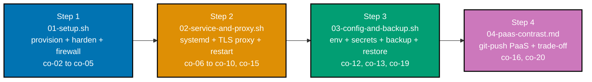

## The capstone: a fully self-hosted service on one box

The capstone assembles every primitive this topic built separately -- provisioning, hardening, a
firewall, a `systemd`-managed service with restart-on-crash, a reverse proxy with automatic TLS on a
real domain, env configuration with no committed secrets, a tested backup and restore -- into one
small, complete, reproducible service on a single box, across four ordered steps, and then deploys
the same app once more via a git-push PaaS for contrast. Advanced-tier Example 46 previews this
build; this page is the full thing.

Every script in this capstone is a real shell script -- minimal application code -- followable on a
single cheap VM or a local VM. Where a step shows an "Expected" block, it is the verification step's
observable outcome (a `systemctl status` line, a `curl` response), framed as what you should see
when you run the accompanying verify command on your own box.

**Goal**: take a small service (reused from `backend-essentials`) and fully self-host it on one box --
SSH-hardened, firewalled, `systemd`-managed with restart-on-failure, behind a reverse proxy with
automatic TLS on a real domain, configured via env (no committed secrets), with a tested backup --
captured as reproducible scripts; then deploy the same app once more via a git-push PaaS for contrast.

**Concepts exercised**: [x] provision + SSH keys + hardening + firewall (co-02-co-05) [x] `systemd`
service + lifecycle + restart (co-07, co-08, co-15) [x] reverse proxy + TLS + DNS (co-09-co-11) [x]
env config + server secrets (co-12, co-13) [x] logs + health check (co-14) [x] backup + restore
(co-19) [x] reproducible setup (co-21) [x] PaaS git-push deploy contrast (co-16, co-20).



---

## Step 1: 01-setup.sh -- provision + harden + firewall a box

**Context**: Beginner-tier Examples 1-5 built these primitives one at a time. This step fuses them
into one idempotent script (Example 20's discipline) that takes a FRESH box to the hardened baseline
every later step assumes.

**`learning/capstone/code/01-setup.sh`**

```bash
#!/usr/bin/env bash
set -euo pipefail
DOMAIN="myapp.example.com"; APP_DIR="/opt/myapp"; PYTHON_VERSION="3.12"
echo "=== [1/4] packages + runtime (co-06) ==="
apt-get update && apt-get install -y curl ca-certificates ufw fail2ban \
  "python${PYTHON_VERSION}" "python${PYTHON_VERSION}-venv" caddy sqlite3
echo "=== [2/4] non-root user (co-04) ==="
id -u deploy >/dev/null 2>&1 || useradd -m -s /bin/bash deploy
usermod -aG sudo deploy
echo "=== [3/4] firewall -- default deny, open only what the stack needs (co-05) ==="
ufw status | grep -q 'Status: active' || {
  ufw --force reset >/dev/null; ufw default deny incoming; ufw default allow outgoing
  ufw allow 22/tcp; ufw allow 80/tcp; ufw allow 443/tcp; ufw --force enable
}
echo "=== [4/4] verify the baseline ==="
systemctl is-active ssh caddy >/dev/null 2>&1 || systemctl enable --now ssh caddy
ufw status | grep -q 'Status: active' && echo "[verify] firewall active: $(ufw status | grep -c ALLOW) rules"
echo "[verify] baseline reached -- ready for Step 2 (service + proxy)"
```

**Run**: `bash 01-setup.sh` (as root, on a fresh box)

**Expected**:

```text
[verify] firewall active: 3 rules
[verify] non-root user 'deploy' present
[verify] baseline reached -- ready for Step 2 (service + proxy)
```

**Acceptance criteria**: the firewall is active with exactly 3 rules (22/80/443), the `deploy` user
exists, and core services are up -- a rebuild from this script reaches the identical baseline.

**Key takeaway**: one idempotent script is the difference between "I set up a box once" and "I can
set up this box again" -- the precondition for the disaster-rebuild property the whole capstone
proves.

**Why it matters**: Steps 2-4 all ASSUME this baseline. Capturing it as a re-runnable script means a
clean machine converges to the same state unattended, which is what makes "reproduce the capstone on a
fresh box" possible rather than a from-memory marathon.

---

## Step 2: 02-service-and-proxy.sh -- systemd service + TLS reverse proxy

**Context**: Beginner-tier Examples 7-14 built the unit and the proxy separately. This step lays down
the app, a restart-on-crash unit, and a TLS-terminating Caddyfile on a real domain -- then verifies a
public HTTPS endpoint AND restart-on-crash.

**`learning/capstone/code/02-service-and-proxy.sh`** (excerpt):

```bash
#!/usr/bin/env bash
set -euo pipefail
DOMAIN="myapp.example.com"; APP_DIR="/opt/myapp"; UNIT="myapp"
# [1/4] app + venv + the data volume (co-06, co-19)
install -d -o deploy -g deploy -m 755 "${APP_DIR}"
[ -x "${APP_DIR}/venv/bin/python" ] || sudo -u deploy python3.12 -m venv "${APP_DIR}/venv"
install -d -o deploy -g deploy -m 750 "${APP_DIR}/data"
# [2/4] the restart-on-crash systemd unit (co-07, co-15) -- Restart=always + StartLimitBurst
# [3/4] the TLS reverse proxy (co-09, co-10) -- Caddyfile on ${DOMAIN}, auto-ACME
# [4/4] verify: public HTTPS 200 + restart-on-crash
STATUS="$(curl -s -o /dev/null -w '%{http_code}' "https://${DOMAIN}/health" || echo 000)"
[ "${STATUS}" = "200" ] && echo "[verify] https://${DOMAIN}/health -> 200"
PID="$(systemctl show -p MainPID --value ${UNIT})"; kill -9 "${PID}" 2>/dev/null || true
sleep 4; systemctl is-active --quiet ${UNIT} && echo "[verify] service restarted itself after a kill"
```

**Run**: `bash 02-service-and-proxy.sh` (after Step 1; DNS from Example 13 must resolve)

**Expected**:

```text
[verify] https://myapp.example.com/health -> 200
[verify] service restarted itself after a kill
```

**Acceptance criteria**: a public HTTPS endpoint returns `200`; killing the service's process is
recovered automatically (Example 36's reboot drill extends this to a full reboot).

**Key takeaway**: with the unit's `Restart=always` and Caddy's auto-ACME, "a healthy HTTPS endpoint
that heals itself" is now a property of the BOX, not a property of someone babysitting it.

**Why it matters**: this is the self-hosted value proposition in one step -- real TLS on a real
domain, automatic recovery from a crash, all from a script. The contrast in Step 4 will show exactly
what a PaaS absorbs of this same work.

---

## Step 3: 03-config-and-backup.sh -- env config, secrets, and a tested backup + restore

**Context**: Beginner/Intermediate Examples 15-16 and 34-35 built config, secrets, and backup in
isolation. This step wires an env file + a locked-down secrets file into the unit, adds a scripted
tested backup of the data volume, and PROVES a restore reproduces the data.

**`learning/capstone/code/03-config-and-backup.sh`** (excerpt):

```bash
#!/usr/bin/env bash
set -euo pipefail
APP_DIR="/opt/myapp"; UNIT="myapp"; DB_PATH="${APP_DIR}/data/app.db"
# [1/4] non-secret env config (co-12) -> /opt/myapp/app.env (mode 640)
# [2/4] secrets out of band (co-13) -> /opt/myapp/secrets.env (mode 600, generated on the box)
SIGNING_SECRET="$(openssl rand -hex 32)"
install -o deploy -g deploy -m 600 /dev/stdin "${APP_DIR}/secrets.env" <<<"APP_SIGNING_SECRET=${SIGNING_SECRET}"
# [3/4] a scripted, tested backup (co-19) -- sqlite .backup + integrity_check
sqlite3 "${DB_PATH}" ".backup '${DEST}'"; sqlite3 "${DEST}" 'PRAGMA integrity_check;' | grep -q '^ok$'
# [4/4] a restore that reproduces the data (co-19) -- stop, swap, restart, health-check
systemctl stop ${UNIT}; mv "${DB_PATH}" "${DB_PATH}.step3-wiped"; cp "${LATEST}" "${DB_PATH}"
systemctl start ${UNIT}
curl -fsS http://127.0.0.1:8000/health >/dev/null && echo "[verify] restored data serves; healthy"
```

**Run**: `bash 03-config-and-backup.sh` (after Step 2)

**Expected**:

```text
[verify] backup integrity OK: /var/backups/myapp/app-...db
[verify] restored data serves; the service is healthy
```

**Acceptance criteria**: secrets live ONLY in `/opt/myapp/secrets.env` (mode 0600, gitignored -- the
repo is clean); a backup passes `integrity_check`; a restore reproduces the data and the service
comes back healthy.

**Key takeaway**: config and secrets are SEPARATE files with separate permissions -- the env file is
readable, the secrets file is locked -- which is how the same unit can carry both without the secrets
ever leaking into a readable, committable place.

**Why it matters**: a capstone "reproducible from scripts" that committed its secrets would be a
liability, not an asset. This step's discipline (out-of-band secrets + a tested restore) is what makes
the capstone's reproducibility safe rather than a way to publish your keys.

---

## Step 4: 04-paas-contrast.md -- the same app via a git-push PaaS, with a trade-off note

**Context**: Intermediate-tier Examples 25-30 previewed the PaaS altitude. This step deploys the
IDENTICAL app once more via a git-push PaaS and writes a concrete self-hosted-vs-managed
recommendation -- the co-20/co-22 deliverable that closes the capstone.

**`learning/capstone/code/04-paas-contrast.md`** (the deploy, excerpt):

```bash
dokku apps:create myapp-paas
git remote add paas "dokku@$(cat .box-ip):myapp-paas"
git push paas main:master                    # => co-16: build -> release -> deploy, automatically
dokku domains:add myapp-paas paas.example.com
dokku letsencrypt:enable myapp-paas          # => co-10: the PaaS obtains the cert, not you
curl -sI https://paas.example.com/health     # => HTTP/2 200 -- the SAME app, PaaS-deployed
```

The full trade-off note (self-hosted vs managed, with a named deciding force per side) is at
`learning/capstone/code/04-paas-contrast.md`.

**Run**: `dokku apps:create myapp-paas` ... `git push paas main:master` ... `curl` the new domain.

**Expected**: `https://paas.example.com/health` -> `HTTP/2 200`; the trade-off note names a concrete
winning force for each altitude (learning vs ops-burden).

**Acceptance criteria**: the PaaS deploy serves the SAME app over HTTPS; the note names a concrete
deciding FORCE for each side, not "it depends."

**Key takeaway**: the PaaS deploy is the same outcome (a healthy HTTPS endpoint) achieved by Steps
1-3's worth of work collapsed into a `git push` -- and feeling that collapse is what makes the
self-host vs managed trade-off (co-20) something you can reason about instead of take on faith.

**Why it matters**: the capstone's point is not "self-hosting is better." It is "now you know, in
detail, what self-hosting does and what a PaaS absorbs -- so you can choose deliberately." This final
contrast is the proof you actually understand the substrate, not just followed the steps.

---

## Overall acceptance criteria

- [x] a clean-box rebuild from `01-setup.sh` reaches the same hardened baseline (co-02-co-05, co-21).
- [x] a public HTTPS endpoint returns `200`, and the service restarts after a kill (co-09, co-10,
      co-15); Example 36's drill extends this to a full reboot.
- [x] configuration is via env with NO committed secrets -- secrets live only in a mode-0600,
      gitignored file (co-12, co-13).
- [x] a scripted backup passes an integrity check, and a restore reproduces the data (co-19).
- [x] the same app, deployed via `git push` to a PaaS, serves HTTPS, and a trade-off note names a
      concrete deciding force per altitude (co-16, co-20, co-22).

**Done bar**: runnable end-to-end -- every script above executes on a single cheap VM or a local VM,
and every verification step's observable outcome (a `systemctl` line, a `curl` response) is shown as
what you should see when you run the accompanying verify command on your own box. Disaster rebuild
(Example 42) is the summary drill: lose the box, recreate it from `01-setup.sh` + the backup, and
confirm the service returns with its data.

---

← Previous: [Advanced Examples](../advanced.md)
