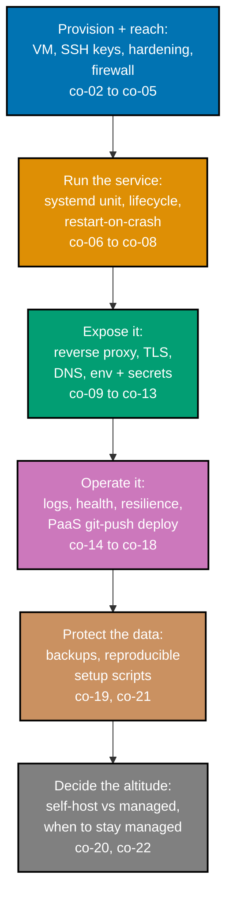

## Prerequisites

- **Prior topics**: [Backend Essentials](../../backend-essentials/learning/overview.md) -- the small
  HTTP service this course hosts (run locally and hit with `curl`); [Just Enough
  Bash](../../just-enough-bash/learning/overview.md) -- the shell, `ssh`, and reading a script, all
  assumed fluent because this course's artifacts ARE shell scripts, `systemd` unit files, and proxy
  configs rather than application code.
- **Tools & environment**: a macOS/Linux terminal; `ssh`; a single cheap Linux VM or a local VM;
  `systemd`; a reverse proxy (Caddy or Nginx) with automatic TLS; `ufw`; and, for the PaaS contrast,
  a git-push platform. No application framework is taught here.
- **Assumed knowledge**: running a service locally and reaching it with `curl`; basic Linux file and
  permission concepts; using `git`.

## Why this exists -- the big idea

A deployment is just _a process running on a machine, reachable through a proxy, over TLS, restarted
when it dies, reproducible from config_. Every one of this topic's 78 worked examples is a small,
complete illustration of one piece of that substrate -- from provisioning a box and logging in over
SSH, through running a `systemd`-managed service behind a TLS-terminating reverse proxy on a real
domain, to deploying the same app once via a git-push PaaS for contrast, and finally capturing the
whole box as reproducible scripts and a tested backup.

**Cross-cutting big ideas, taught here and carried through every tier**: `abstraction-and-its-cost`
-- a PaaS hides the box; self-hosting shows you what it was hiding and what you pay to peel that
abstraction back; `taming-state` -- a service's lifecycle, config, and data must be managed
deliberately, because on your own box nothing absorbs that responsibility for you.

## How this topic's examples are organized

- **Beginner** (Examples 1-16) -- the substrate, built by hand one primitive at a time: provisioning
  a Linux VM and recording its IP, key-only SSH, a non-root sudo user, a `ufw` firewall, installing
  the runtime, running the service in the foreground, a first `systemd` unit, enable-on-boot, reading
  status and `journalctl` logs, restart-on-crash, installing a reverse proxy, proxying public traffic
  to the app's local port, a DNS A record, automatic TLS via ACME, env-file configuration, and the
  hard rule that secrets never live in the repo.
- **Intermediate** (Examples 17-32) -- operating and automating: a health-check endpoint, a timer-
  based uptime check, a reproducible `setup.sh`, making that script idempotent, secret rotation,
  proxy security headers, a least-privilege firewall audit, log rotation, installing a git-push PaaS,
  a `git push` deploy, buildpack and Dockerfile builds compared, PaaS env config and TLS, a rollback,
  and a zero-downtime restart.
- **Advanced** (Examples 33-78) -- resilience, data, and the trade-off: a data-backed service with a
  persistent volume, a scripted tested backup and a restore drill, reboot resilience, multiple
  services on one box, `systemd` resource limits, a metrics endpoint, a git-driven deploy pipeline, a
  self-hosted-vs-managed writeup, a disaster rebuild, `fail2ban`, staging-vs-prod promotion, then a
  deep run of further `systemd` patterns (timer, socket activation, drop-in, graceful shutdown), the
  full proxy and TLS surface (Caddy-vs-Nginx, HTTPS redirect, HSTS, OCSP stapling, proxy rate
  limiting, multi-domain TLS), DNS CNAME/TTL/subdomain routing, env templating and the
  `EnvironmentFile` directive, secret rotation automation and a pre-commit secret scanner,
  structured logging and log shipping, health-failure alerting, a `systemd` watchdog and restart
  backoff, Procfile/release-phase/scaling PaaS patterns, blue-green and connection-drain deploys,
  restic and `pg_dump` backups with retention and restore verification, and a `cloud-init` first-boot
  reprovision -- closing with a capstone preview.
- **[Capstone](./capstone/overview.md)** -- take a small service and fully self-host it on one box:
  SSH-hardened, firewalled, `systemd`-managed with restart-on-failure, behind a reverse proxy with
  automatic TLS on a real domain, configured via env with no committed secrets, with a tested backup
  and restore -- all captured as reproducible scripts -- then deploy the same app once more via a
  git-push PaaS for contrast.

Every example is a real shell script, `systemd` unit, Caddy/Nginx config, cron entry, or setup
script -- minimal application code -- colocated under `learning/code/` and followable on a single
cheap VM or a local VM. Where an example shows an "Expected" block, it is the verification step's
observable outcome (a `systemctl status` line, a `curl` response, a `journalctl` entry), framed as
what you should see when you run the accompanying verify command on your own box.

## Concepts

Every worked example in this topic's follow-up pages cites the `co-NN` concept it exercises -- this
section is the 1:1 reference those citations point back to.

### co-01 · What Self-Hosting Is

Self-hosting is running your own software on a machine you control, versus handing it to a fully
managed platform that hides the box from you.

**Why it matters**: a managed platform is an abstraction over the exact primitives this course
exposes by hand -- once you have run a process, a proxy, TLS, a firewall, and a restart policy
yourself, you can reason about deployment anywhere, including inside the managed platform when its
abstraction leaks (and it always leaks).

**Verify it**: Example 41 stands the same app up both self-hosted and on a managed PaaS and writes up
the concrete trade-off; the capstone then proves a full self-host is reproducible end to end.

### co-02 · Provision a Box

Creating a Linux VM or instance and getting initial access is the first, reproducible step of any
self-host -- without a box, none of the later primitives have a place to run.

**Why it matters**: provisioning is where reproducibility either begins or never does -- recording
the box's IP and the exact steps that produced it is what lets Example 42's disaster rebuild succeed
later.

**Verify it**: Example 1 provisions a VM and records its IP; Example 78's `cloud-init` user-data
codifies the whole first-boot so a fresh box converges to the same baseline unattended.

### co-03 · SSH Access and Keys

Key-based SSH -- not passwords -- is the secure default for reaching a remote box: a private key on
your laptop authenticates against a public key on the server, with no secret transmitted.

**Why it matters**: passwords are brute-forceable and reuseable across boxes; a key pair is
unguessable and scoped to one machine, which is why disabling password login (Example 2) closes the
single most common remote-compromise vector.

**Verify it**: Example 2 generates a key, logs in with it, and verifies password login is refused;
Example 43 adds `fail2ban` to throttle the brute-force attempts that still hit the SSH port.

### co-04 · Basic Server Hardening

A non-root user, key-only SSH, and a firewall together form the minimum safe baseline for any box
exposed to the internet -- running services as root with password SSH and no firewall is a
compromise waiting to happen.

**Why it matters**: hardening is defense in depth -- each layer (no root login, no passwords,
least-privilege ports) independently blocks a different attack class, so a failure in one layer does
not hand the attacker the whole box.

**Verify it**: Examples 3 and 4 add the non-root user and the firewall; Example 22 layers security
headers at the proxy; Example 43 adds brute-force protection.

### co-05 · Firewall Basics

`ufw` (or nftables) allows only the ports a service genuinely needs (SSH, HTTP, HTTPS) and denies
the rest by default -- the single most effective way to shrink a box's attack surface.

**Why it matters**: a service bound to a port you forgot about is reachable by the whole internet
without a firewall; the default-deny stance means "open port" becomes a deliberate, auditable
decision rather than an accident.

**Verify it**: Example 4 opens SSH/HTTP/HTTPS and verifies a closed port is unreachable; Example 23
audits the open set down to the true minimum.

### co-06 · Run a Service

Starting your application process on the box so it actually serves requests is the literal definition
of hosting -- everything else exists to keep this one process reachable, safe, and alive.

**Why it matters**: running it in the foreground first (Example 6) separates "does the app work" from
"does the supervision work," which is the cleanest way to debug a deployment that won't respond.

**Verify it**: Example 6 runs the service in the foreground and curls it locally; Example 33 wraps a
data-backed version of the same idea.

### co-07 · systemd Service Units

A `systemd` unit declares how to start a service, what to do when it fails, and that it should start
on boot -- turning "a process I launched by hand" into "a managed service the OS owns."

**Why it matters**: a unit file is reproducible configuration (a `taming-state` move) replacing a
fragile "I typed this command in a shell that one time" -- it is what makes restart-on-crash and
boot-resilience expressible at all.

**Verify it**: Example 7 writes the unit; Example 48 adds socket activation; Example 49 uses a drop-in
override; Example 62 uses `EnvironmentFile`; Example 68 adds a watchdog; Example 38 sets resource
limits.

### co-08 · Process Lifecycle

Start, stop, status, enable, and reading logs (`journalctl`) are the operations that manage a running
service day to day -- the vocabulary every later resilience example assumes.

**Why it matters**: `systemctl status` and `journalctl -u` are the first two commands reached for
when "is it up and why did it fail" -- knowing them cold is what turns an outage into a five-minute
diagnosis instead of a guess.

**Verify it**: Example 9 reads status and logs; Example 21 rotates a secret and reloads; Example 50
tunes graceful shutdown; Example 47 replaces a cron job with a timer.

### co-09 · Reverse Proxy

A reverse proxy terminates public traffic on ports 80/443 and forwards it to the app on a local,
unprivileged port -- letting one box serve many services behind one public face and adding TLS,
headers, and rate limiting at a single chokepoint.

**Why it matters**: binding your app directly to port 443 means re-implementing TLS, virtual hosting,
and graceful shutdown inside the app; a proxy centralizes all of that and lets the app stay simple.

**Verify it**: Examples 11 and 12 install and configure the proxy; Example 37 hosts two services
behind one proxy; Example 51 contrasts Caddy and Nginx; Example 56 adds rate limiting at the proxy.

### co-10 · TLS and HTTPS

Automatic TLS via ACME (Let's Encrypt) gives the service a real HTTPS certificate with no manual
renewal chore -- the proxy obtains and rotates the cert on its own.

**Why it matters**: HTTPS is now table stakes for any public service -- browsers warn on plain HTTP,
and many APIs refuse it -- and ACME is the automation that makes "real TLS on a personal box"
practical rather than a weekend of `openssl` suffering.

**Verify it**: Example 14 enables ACME TLS; Example 53 forces the HTTP-to-HTTPS redirect; Example 54
adds HSTS; Example 55 enables OCSP stapling; Example 57 serves multiple domains.

### co-11 · DNS and Domains

An A (or AAAA) record points a domain name at the box's IP so the service is reachable by name --
without DNS, ACME cannot prove domain control and no browser can find you.

**Why it matters**: DNS is the mapping that turns "an IP" into "a name a certificate can be issued
for" -- it is the precondition for both TLS (co-10) and human-usable URLs, and getting the record
type and TTL right avoids subtle propagation bugs.

**Verify it**: Example 13 sets the A record; Example 58 contrasts CNAME vs A; Example 59 covers TTL
and propagation; Example 60 routes subdomains to multiple services.

### co-12 · Environment Config

Service configuration and non-secret values live in the environment (an env file on the box), never
hardcoded in the repo -- the same artifact runs everywhere, differing only by its environment.

**Why it matters**: separating config from code is what lets the identical image run in staging and
prod -- the difference between two environments becomes a set of env variables, not a second copy of
the application.

**Verify it**: Example 15 configures via an env file; Example 29 does the same on a PaaS; Example 61
templates the env file at deploy time; Example 62 uses `systemd`'s `EnvironmentFile` directive.

### co-13 · Secrets on a Server

Secrets are set out of band (an env file with locked-down permissions on the box), never committed to
the repo -- the hard-iron "no secrets in git" rule applies to servers exactly as it applies to source.

**Why it matters**: a committed secret is permanent (git history is forever) and a single
accidental push away from public -- the server-side discipline is to keep every secret in a
mode-0600 file the repo never sees, and to scan for slips before they land.

**Verify it**: Example 16 proves the repo is clean; Example 21 rotates a secret; Example 63 automates
rotation; Example 64 adds a pre-commit hook that blocks secrets.

### co-14 · Logs and Basic Monitoring

Reading logs (`journalctl`) and exposing a simple health check tell you whether the service is alive
and why it failed -- the floor of observability, without which you are flying blind.

**Why it matters**: "is it working" is unanswerable without logs and a health probe -- the moment a
service has users, the gap between "it crashed" and "someone told us it crashed" is exactly the gap
monitoring closes.

**Verify it**: Example 17 exposes a health endpoint; Example 18 runs an uptime check; Example 24 adds
log rotation; Example 39 adds a metrics endpoint; Examples 65 and 66 cover structured logging and
shipping; Example 67 alerts on health failure.

### co-15 · Restart and Resilience

A service must come back after a crash or a reboot without manual intervention -- `Restart=` for
crashes and `enable` + `WantedBy` for boot make "alive" the default state rather than a coincidence.

**Why it matters**: the difference between a 3am phone call and an unbroken night is whether the box
recovers on its own -- resilience is the property that turns a single crash from an incident into a
non-event.

**Verify it**: Example 10 restarts on crash; Example 36 verifies the whole stack survives a reboot;
Example 68 adds a watchdog for hung (not crashed) processes; Example 69 adds a restart backoff.

### co-16 · PaaS git-push Deploy

A PaaS builds and deploys your app from a `git push`, hiding the box while keeping it yours -- the
contrast case that shows what the manual substrate was automating.

**Why it matters**: feeling the PaaS absorb the build, the release, the process supervision, and the
TLS in one push is what makes the trade-off in co-20 concrete -- you can finally name what you pay a
managed platform for and what you give up when you self-host.

**Verify it**: Example 25 installs a PaaS; Example 26 deploys via `git push`; Example 40 wires a full
pipeline; Example 44 runs staging and prod with promotion; Examples 70-72 cover Procfile, release
phase, and scaling.

### co-17 · Buildpacks vs Dockerfile

A PaaS builds from either a buildpack (it detects your language and supplies the runtime) or a
Dockerfile (you specify the image exactly) -- each is a reproducible recipe for the runtime, trading
convenience for control.

**Why it matters**: a buildpack gets you deployed with zero image authoring but constrains you to
what it detects; a Dockerfile is fully explicit and portable but you own every layer -- knowing which
you reached for is knowing where your build's reproducibility actually comes from.

**Verify it**: Example 27 deploys via a buildpack; Example 28 deploys the same app via a Dockerfile
and checks parity.

### co-18 · Zero-Downtime Basics

A health-checked rolling restart (or a blue-green swap) avoids dropping requests during a deploy --
the light version of what a full orchestrator automates at fleet scale.

**Why it matters**: a naive "stop then start" deploy drops every in-flight request at the moment of
the stop; draining connections first (or swapping to a warmed-up instance) is what keeps a deploy
invisible to a caller.

**Verify it**: Example 32 does a health-checked zero-downtime restart; Example 73 does a blue-green
swap via the proxy; Example 74 drains in-flight requests before stop.

### co-19 · Backups Basics

A service with data needs a simple, tested backup of that data -- "tested" meaning you have actually
restored from it, not just that the backup file exists.

**Why it matters**: an untested backup is a wish, not a safeguard -- the restore drill (Example 35)
is the only proof a backup is worth anything, and it is the step most often skipped until the first
real data loss makes it tragically obvious.

**Verify it**: Example 34 takes a scripted backup; Example 35 restores from it; Example 75 uses
restic for files; Example 76 uses `pg_dump` for a database; Example 77 adds retention and restore
verification.

### co-20 · Self-Hosting vs Managed Trade-off

Self-hosting buys control and cost savings at the price of the operational responsibility (patching,
backups, 3am uptime) a managed platform absorbs -- a genuine trade-off, not a strict upgrade.

**Why it matters**: the right answer depends on which side of the trade-off your situation is on --
a solo developer learning the substrate and a small team shipping a product with no ops appetite are
on opposite sides, and confusing the two is how teams inherit pager duty they never wanted.

**Verify it**: Example 41 writes up the trade-off concretely; Example 45 turns it into a scoped
recommendation; the capstone's final step names when each wins.

### co-21 · Reproducible Server Config

The box's setup is captured as scripts and config so it can be rebuilt, not remembered -- a `setup.sh`
(or a `cloud-init` user-data) is what turns "the box works" into "the box works again, on fresh
hardware, without me."

**Why it matters**: reproducibility is the difference between a box you can lose and recover and one
whose loss is a rebuild-from-memory marathon -- Example 42's disaster rebuild succeeds only because
Example 19 captured the setup first.

**Verify it**: Example 19 writes the `setup.sh`; Example 20 makes it idempotent; Example 42 rebuilds
from it after a total loss; Example 78 codifies the same setup as `cloud-init`.

### co-22 · When to Stay Managed

Recognising when a managed platform is the right call -- small team, no ops appetite, stateful or
high-availability or compliance-bound workload -- is as important a skill as knowing how to
self-host.

**Why it matters**: the discipline of self-hosting is worthless if applied indiscriminately -- a
stateful, HA, compliance-bound system is a poor first self-host, and "we should self-host this"
without naming the specific force driving it is a decision waiting to become an incident.

**Verify it**: Example 45 gives a concrete recommendation; Example 41's writeup names the conditions
under which managed is the correct call.

## Examples by Level

### Beginner (Examples 1–16)

- [Example 1: Provision a Linux VM and Record Its IP](/en/learn/courses/self-hosting-essentials/learning/beginner#example-1-provision-a-linux-vm-and-record-its-ip)
- [Example 2: SSH Key-Only Login](/en/learn/courses/self-hosting-essentials/learning/beginner#example-2-ssh-key-only-login)
- [Example 3: Create a Non-Root Sudo User](/en/learn/courses/self-hosting-essentials/learning/beginner#example-3-create-a-non-root-sudo-user)
- [Example 4: Enable the Firewall with ufw](/en/learn/courses/self-hosting-essentials/learning/beginner#example-4-enable-the-firewall-with-ufw)
- [Example 5: Install the App Runtime](/en/learn/courses/self-hosting-essentials/learning/beginner#example-5-install-the-app-runtime)
- [Example 6: Run the Service in the Foreground](/en/learn/courses/self-hosting-essentials/learning/beginner#example-6-run-the-service-in-the-foreground)
- [Example 7: Write a systemd Unit for the Service](/en/learn/courses/self-hosting-essentials/learning/beginner#example-7-write-a-systemd-unit-for-the-service)
- [Example 8: Enable the Service on Boot](/en/learn/courses/self-hosting-essentials/learning/beginner#example-8-enable-the-service-on-boot)
- [Example 9: Read Service Status and Logs](/en/learn/courses/self-hosting-essentials/learning/beginner#example-9-read-service-status-and-logs)
- [Example 10: Restart on Crash](/en/learn/courses/self-hosting-essentials/learning/beginner#example-10-restart-on-crash)
- [Example 11: Install a Reverse Proxy](/en/learn/courses/self-hosting-essentials/learning/beginner#example-11-install-a-reverse-proxy)
- [Example 12: Proxy Public Traffic to the App](/en/learn/courses/self-hosting-essentials/learning/beginner#example-12-proxy-public-traffic-to-the-app)
- [Example 13: Point a DNS A Record at the Box](/en/learn/courses/self-hosting-essentials/learning/beginner#example-13-point-a-dns-a-record-at-the-box)
- [Example 14: Automatic TLS with ACME](/en/learn/courses/self-hosting-essentials/learning/beginner#example-14-automatic-tls-with-acme)
- [Example 15: Configure the App via an Env File](/en/learn/courses/self-hosting-essentials/learning/beginner#example-15-configure-the-app-via-an-env-file)
- [Example 16: Keep Secrets Out of the Repo](/en/learn/courses/self-hosting-essentials/learning/beginner#example-16-keep-secrets-out-of-the-repo)

### Intermediate (Examples 17–32)

- [Example 17: A Health-Check Endpoint Through the Proxy](/en/learn/courses/self-hosting-essentials/learning/intermediate#example-17-a-health-check-endpoint-through-the-proxy)
- [Example 18: A Basic Uptime Check on a Timer](/en/learn/courses/self-hosting-essentials/learning/intermediate#example-18-a-basic-uptime-check-on-a-timer)
- [Example 19: A Reproducible setup.sh](/en/learn/courses/self-hosting-essentials/learning/intermediate#example-19-a-reproducible-setupsh)
- [Example 20: Make the setup.sh Idempotent](/en/learn/courses/self-hosting-essentials/learning/intermediate#example-20-make-the-setupsh-idempotent)
- [Example 21: Rotate a Secret and Reload](/en/learn/courses/self-hosting-essentials/learning/intermediate#example-21-rotate-a-secret-and-reload)
- [Example 22: Security Headers at the Proxy](/en/learn/courses/self-hosting-essentials/learning/intermediate#example-22-security-headers-at-the-proxy)
- [Example 23: Firewall Least-Privilege Audit](/en/learn/courses/self-hosting-essentials/learning/intermediate#example-23-firewall-least-privilege-audit)
- [Example 24: Log Rotation for the Service](/en/learn/courses/self-hosting-essentials/learning/intermediate#example-24-log-rotation-for-the-service)
- [Example 25: Install a Git-Push PaaS](/en/learn/courses/self-hosting-essentials/learning/intermediate#example-25-install-a-git-push-paas)
- [Example 26: Deploy via git push](/en/learn/courses/self-hosting-essentials/learning/intermediate#example-26-deploy-via-git-push)
- [Example 27: Buildpack Deploy Without a Dockerfile](/en/learn/courses/self-hosting-essentials/learning/intermediate#example-27-buildpack-deploy-without-a-dockerfile)
- [Example 28: Dockerfile Deploy on the PaaS](/en/learn/courses/self-hosting-essentials/learning/intermediate#example-28-dockerfile-deploy-on-the-paas)
- [Example 29: PaaS Env Config and Secrets](/en/learn/courses/self-hosting-essentials/learning/intermediate#example-29-paas-env-config-and-secrets)
- [Example 30: Attach a Domain and TLS on the PaaS](/en/learn/courses/self-hosting-essentials/learning/intermediate#example-30-attach-a-domain-and-tls-on-the-paas)
- [Example 31: Roll Back a Deploy](/en/learn/courses/self-hosting-essentials/learning/intermediate#example-31-roll-back-a-deploy)
- [Example 32: A Zero-Downtime Restart](/en/learn/courses/self-hosting-essentials/learning/intermediate#example-32-a-zero-downtime-restart)

### Advanced (Examples 33–78)

- [Example 33: A Data-Backed Service with a Persistent Volume](/en/learn/courses/self-hosting-essentials/learning/advanced#example-33-a-data-backed-service-with-a-persistent-volume)
- [Example 34: A Scripted Tested Backup of the Data](/en/learn/courses/self-hosting-essentials/learning/advanced#example-34-a-scripted-tested-backup-of-the-data)
- [Example 35: A Restore Drill](/en/learn/courses/self-hosting-essentials/learning/advanced#example-35-a-restore-drill)
- [Example 36: Reboot Resilience for the Whole Stack](/en/learn/courses/self-hosting-essentials/learning/advanced#example-36-reboot-resilience-for-the-whole-stack)
- [Example 37: Two Services on One Box Behind One Proxy](/en/learn/courses/self-hosting-essentials/learning/advanced#example-37-two-services-on-one-box-behind-one-proxy)
- [Example 38: systemd Resource Limits on a Service](/en/learn/courses/self-hosting-essentials/learning/advanced#example-38-systemd-resource-limits-on-a-service)
- [Example 39: A Basic Metrics Endpoint](/en/learn/courses/self-hosting-essentials/learning/advanced#example-39-a-basic-metrics-endpoint)
- [Example 40: A Deploy Pipeline from Git](/en/learn/courses/self-hosting-essentials/learning/advanced#example-40-a-deploy-pipeline-from-git)
- [Example 41: Self-Hosted vs Managed Trade-Off Writeup](/en/learn/courses/self-hosting-essentials/learning/advanced#example-41-self-hosted-vs-managed-trade-off-writeup)
- [Example 42: Disaster Rebuild from Script and Backup](/en/learn/courses/self-hosting-essentials/learning/advanced#example-42-disaster-rebuild-from-script-and-backup)
- [Example 43: fail2ban Brute-Force Protection for SSH](/en/learn/courses/self-hosting-essentials/learning/advanced#example-43-fail2ban-brute-force-protection-for-ssh)
- [Example 44: Staging vs Prod on the PaaS with Promotion](/en/learn/courses/self-hosting-essentials/learning/advanced#example-44-staging-vs-prod-on-the-paas-with-promotion)
- [Example 45: A Cost-and-Scope Recommendation](/en/learn/courses/self-hosting-essentials/learning/advanced#example-45-a-cost-and-scope-recommendation)
- [Example 46: Capstone Preview of a Fully Self-Hosted Service](/en/learn/courses/self-hosting-essentials/learning/advanced#example-46-capstone-preview-of-a-fully-self-hosted-service)
- [Example 47: A systemd Timer Replacing a Cron Job](/en/learn/courses/self-hosting-essentials/learning/advanced#example-47-a-systemd-timer-replacing-a-cron-job)
- [Example 48: Socket Activation for Lazy Startup](/en/learn/courses/self-hosting-essentials/learning/advanced#example-48-socket-activation-for-lazy-startup)
- [Example 49: A systemd Drop-In Override](/en/learn/courses/self-hosting-essentials/learning/advanced#example-49-a-systemd-drop-in-override)
- [Example 50: Graceful Shutdown with TimeoutStopSec](/en/learn/courses/self-hosting-essentials/learning/advanced#example-50-graceful-shutdown-with-timeoutstopsec)
- [Example 51: The Same Proxy Rule in Caddy and Nginx](/en/learn/courses/self-hosting-essentials/learning/advanced#example-51-the-same-proxy-rule-in-caddy-and-nginx)
- [Example 52: An Nginx Reverse-Proxy Config](/en/learn/courses/self-hosting-essentials/learning/advanced#example-52-an-nginx-reverse-proxy-config)
- [Example 53: Force HTTP to HTTPS at the Proxy](/en/learn/courses/self-hosting-essentials/learning/advanced#example-53-force-http-to-https-at-the-proxy)
- [Example 54: The Strict-Transport-Security HSTS Header](/en/learn/courses/self-hosting-essentials/learning/advanced#example-54-the-strict-transport-security-hsts-header)
- [Example 55: OCSP Stapling at the Proxy](/en/learn/courses/self-hosting-essentials/learning/advanced#example-55-ocsp-stapling-at-the-proxy)
- [Example 56: Rate Limiting at the Proxy](/en/learn/courses/self-hosting-essentials/learning/advanced#example-56-rate-limiting-at-the-proxy)
- [Example 57: Multiple Domains and TLS on One Proxy](/en/learn/courses/self-hosting-essentials/learning/advanced#example-57-multiple-domains-and-tls-on-one-proxy)
- [Example 58: CNAME vs A Record](/en/learn/courses/self-hosting-essentials/learning/advanced#example-58-cname-vs-a-record)
- [Example 59: DNS TTL and Propagation Verification](/en/learn/courses/self-hosting-essentials/learning/advanced#example-59-dns-ttl-and-propagation-verification)
- [Example 60: Subdomain Routing to Multiple Services](/en/learn/courses/self-hosting-essentials/learning/advanced#example-60-subdomain-routing-to-multiple-services)
- [Example 61: Env-File Templating at Deploy Time](/en/learn/courses/self-hosting-essentials/learning/advanced#example-61-env-file-templating-at-deploy-time)
- [Example 62: The systemd EnvironmentFile Directive](/en/learn/courses/self-hosting-essentials/learning/advanced#example-62-the-systemd-environmentfile-directive)
- [Example 63: Automating Secret Rotation](/en/learn/courses/self-hosting-essentials/learning/advanced#example-63-automating-secret-rotation)
- [Example 64: A Pre-Commit Hook That Blocks Secrets](/en/learn/courses/self-hosting-essentials/learning/advanced#example-64-a-pre-commit-hook-that-blocks-secrets)
- [Example 65: Structured JSON Logging](/en/learn/courses/self-hosting-essentials/learning/advanced#example-65-structured-json-logging)
- [Example 66: Log Shipping and Rotation](/en/learn/courses/self-hosting-essentials/learning/advanced#example-66-log-shipping-and-rotation)
- [Example 67: Alert on Health-Check Failure](/en/learn/courses/self-hosting-essentials/learning/advanced#example-67-alert-on-health-check-failure)
- [Example 68: A systemd Watchdog for Hung Services](/en/learn/courses/self-hosting-essentials/learning/advanced#example-68-a-systemd-watchdog-for-hung-services)
- [Example 69: A Restart Backoff Strategy](/en/learn/courses/self-hosting-essentials/learning/advanced#example-69-a-restart-backoff-strategy)
- [Example 70: A Procfile Declaring Process Types](/en/learn/courses/self-hosting-essentials/learning/advanced#example-70-a-procfile-declaring-process-types)
- [Example 71: A PaaS Release Phase for Migrations](/en/learn/courses/self-hosting-essentials/learning/advanced#example-71-a-paas-release-phase-for-migrations)
- [Example 72: Scaling a Process Type](/en/learn/courses/self-hosting-essentials/learning/advanced#example-72-scaling-a-process-type)
- [Example 73: A Blue-Green Deploy via the Proxy](/en/learn/courses/self-hosting-essentials/learning/advanced#example-73-a-blue-green-deploy-via-the-proxy)
- [Example 74: Draining In-Flight Requests Before Stop](/en/learn/courses/self-hosting-essentials/learning/advanced#example-74-draining-in-flight-requests-before-stop)
- [Example 75: A restic File Backup](/en/learn/courses/self-hosting-essentials/learning/advanced#example-75-a-restic-file-backup)
- [Example 76: A pg_dump Database Backup](/en/learn/courses/self-hosting-essentials/learning/advanced#example-76-a-pg_dump-database-backup)
- [Example 77: Backup Retention and Restore Verification](/en/learn/courses/self-hosting-essentials/learning/advanced#example-77-backup-retention-and-restore-verification)
- [Example 78: A cloud-init User-Data for First-Boot Setup](/en/learn/courses/self-hosting-essentials/learning/advanced#example-78-a-cloud-init-user-data-for-first-boot-setup)

---

← Previous: [Overview](../overview.md) · Next: [Beginner Examples](./beginner.md) →
