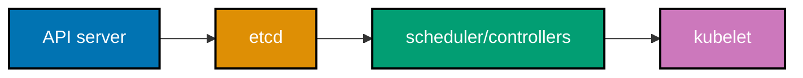

## Beginner: own the control-plane contract before touching a node

Every command prints a reviewable model or renders harmless local YAML. It does not install software,
contact a cluster, create a node, read a credential, or alter an owner-operated environment.

### Example 1: Why Self-Managed Kubernetes

_ex-01 · exercises co-01_

Self-managed Kubernetes exchanges provider convenience for control and responsibility. Name the full boundary
before choosing it for locality, data residency, air-gap needs, cost, or learning.

```sh
# => Prints the ownership boundary; it cannot create a cluster.
printf '%s\n' 'owner operates control plane, load balancer, storage, TLS, and recovery'
```

**Verification**: The output names duties a managed provider commonly supplies.

**Key takeaway**: Self-management is an operational commitment, not a cheaper distribution.

**Why it matters**: Application Pods can run while an unowned load balancer, storage system, certificate, or
backup path fails later. Naming the whole responsibility boundary makes staffing, review, budget, and on-call
expectations visible before the first bootstrap operation commits a team to those duties.

### Example 2: Control Plane and Workers

_ex-02 · exercises co-02_

Server nodes host control-plane duties; worker nodes primarily host scheduled workloads. A production-shaped
lab records both roles and verifies readiness rather than assuming a label proves health.

```sh
# => Models roles locally; no node is queried or labelled.
printf '%s\n' 'servers: API and datastore; workers: scheduled workload capacity'
```

**Verification**: The role split does not claim that every node has identical failure consequences.

**Key takeaway**: Topology is a documented responsibility split observed through node readiness.

**Why it matters**: Capacity, fault tolerance, and maintenance plans differ between control-plane and worker
nodes. Treating them as interchangeable can strand the API or evict workloads without remaining capacity
during ordinary maintenance, making a manageable operation become an availability incident.

### Example 3: Control Plane Components

_ex-03 · exercises co-03_

The API server accepts desired state, etcd persists it, the scheduler chooses placement, controllers reconcile,
and kubelet realizes assigned Pods. Diagnose the owner of a failed transition instead of changing random nodes.



```sh
# => Prints component ownership; it does not inspect host processes.
printf '%s\n' 'API accepts; etcd persists; scheduler places; controllers reconcile; kubelet runs'
```

**Verification**: Each component has a distinct job, so a Pending Pod differs from an API outage.

**Key takeaway**: Kubernetes is cooperating control loops, not one daemon or CLI command.

**Why it matters**: Correct component attribution reduces dangerous trial-and-error repairs. An unavailable
API, lost quorum, scheduling constraint, or runtime failure needs different evidence and recovery paths even
when the application symptom is simply unavailable service.

### Example 4: Declarative Reconciliation

_ex-04 · exercises co-04_

Declarative operation records target state and lets controllers converge live state. Diagnostic imperative
commands remain useful, but they cannot replace reviewed desired state.

```yaml
# => Declares an intended replica count; this YAML is not applied.
spec:
  # => The controller seeks three replicas after an authorized real apply.
  replicas: 3
```

**Verification**: The object says what should exist, not a shell sequence to mutate it.

**Key takeaway**: Declare desired state and verify convergence rather than memorizing mutations.

**Why it matters**: Controllers can replace deleted Pods only while durable desired state remains. This model
also enables Git review, drift detection, rollback, and recovery; a manual mutation without declared intent
is harder to reproduce and can disappear during the next reconciliation loop.

### Example 5: Etcd and Raft

_ex-05 · exercises co-05_

etcd is Kubernetes's consistent datastore and uses Raft consensus in clustered configurations. Its availability,
backup, and restore procedure are therefore control-plane survival concerns.

```sh
# => Records the state boundary without reading or changing an etcd member.
printf '%s\n' 'etcd stores cluster state; Raft requires a quorum to make progress'
```

**Verification**: The line connects persistent state and quorum rather than treating etcd as a cache.

**Key takeaway**: Protect etcd as the stateful heart of the control plane.

**Why it matters**: A healthy node fleet cannot reconstruct every Kubernetes object from memory after datastore
loss. Etcd quorum and snapshots deserve change control and restore evidence comparable to an application's
primary data store, because their loss can prevent the cluster from recognizing or reconciling desired state.

### Example 6: Quorum Math

_ex-06 · exercises co-05_

For `n` voting servers, quorum is `floor(n / 2) + 1`. Three voters tolerate one loss; four still require
three votes, so an even count does not improve that fault tolerance.

```sh
# => Performs only local arithmetic; no server is contacted.
for n in 1 2 3 4 5; do printf '%s\n' "$n servers need $((n / 2 + 1)) votes"; done
```

**Verification**: Local output is 1, 2, 2, 3, and 3 required votes for one through five servers.

**Key takeaway**: Use an odd control-plane voter count and design for the claimed loss.

**Why it matters**: Quorum prevents split-brain decisions, not just downtime. A two-server arrangement loses
safe majority with one failure; an odd voter count gives the control plane a decision-maker, provided power,
network, and storage failure domains are independent enough to make the model real.

### Example 7: Plan a k3s Server Install

_ex-07 · exercises co-06_

k3s is lightweight, but a production installation remains an owner-approved change. Record expected version,
node role, datastore, network, console access, backup, and rollback before using official instructions.

```sh
# => Prints an install gate; it does not download or pipe an installer into a shell.
printf '%s\n' 'review version, node identity, datastore, CNI, backup, console, and rollback before k3s install'
```

**Verification**: The gate contains recovery and networking information, not only a package command.

**Key takeaway**: A convenient installer is the final step of a reviewed bootstrap plan.

**Why it matters**: Piping an installer directly from a network collapses supply-chain, privilege, and rollback
decisions into one action. A written gate preserves operator control while allowing the selected distribution's
current official procedure in a lab with explicit ownership and recovery evidence.

### Example 8: k3s Single Binary

_ex-08 · exercises co-06_

k3s packages Kubernetes functions in a compact distribution with a single primary binary. Compact packaging
reduces installation friction; it does not remove control-plane or day-two operational duties.

```sh
# => States the packaging model without inspecting a real executable.
printf '%s\n' 'compact distribution packaging changes ergonomics; operator ownership remains'
```

**Verification**: The output separates installation convenience from operational accountability.

**Key takeaway**: Smaller packaging does not make a production system operationally small.

**Why it matters**: Teams can mistake a simple bootstrap for a simple platform. Backups, access control, node
lifecycle, policy, storage, observability, and recovery remain necessary after the binary is installed and a
node becomes Ready; packaging never substitutes for those deliberate operational controls.

### Example 9: Plan k3s Kubeconfig Access

_ex-09 · exercises co-06_

A kubeconfig grants cluster authority and may embed powerful credentials. Define recipient, RBAC scope, secure
storage, rotation, revocation, and audit trail without copying any kubeconfig into Git.

```sh
# => Prints an identity checklist; it never reads a kubeconfig path.
printf '%s\n' 'kubeconfig: owner, least privilege, secure storage, rotation, revocation, and audit'
```

**Verification**: The plan treats kubeconfig content as sensitive authority rather than sample material.

**Key takeaway**: Kubeconfig distribution is an identity-management decision.

**Why it matters**: A copied administrator kubeconfig can outlive its intended user or machine. Least privilege,
secure storage, rotation, and audit evidence constrain the blast radius without preventing authorized operators
from working, whereas a convenient shared file creates a durable and difficult-to-detect access path.

### Example 10: k3s SQLite Default

_ex-10 · exercises co-07_

Single-server k3s commonly uses an embedded SQLite datastore by default. It suits a non-HA boundary but
cannot create control-plane redundancy by itself.

```sh
# => Models the default decision; it does not inspect a datastore file.
printf '%s\n' 'single-server default datastore is not an HA control-plane design'
```

**Verification**: The statement identifies availability scope without claiming all configurations are identical.

**Key takeaway**: A datastore choice encodes the cluster failure model.

**Why it matters**: SQLite can reduce overhead for one server, while a production-style control plane needs a
tested recovery and quorum design. Calling a lone control-plane node HA because applications have replicas
hides the single point of failure that determines whether desired state remains available.

### Example 11: k3s Embedded Etcd

_ex-11 · exercises co-07_

The first HA server is initialized for embedded etcd before peer membership grows. Pair that architecture
choice with a snapshot and restore design at bootstrap, not after workloads depend on it.

```sh
# => Prints HA bootstrap intent without invoking k3s or changing a datastore.
printf '%s\n' 'select embedded etcd for HA; verify snapshots before adding server peers'
```

**Verification**: Datastore selection precedes membership growth and includes recovery evidence.

**Key takeaway**: Embedded etcd is a deliberate HA choice, not an afterthought.

**Why it matters**: Changing datastore assumptions after workloads exist complicates recovery and rollback.
Choosing and rehearsing an etcd path at bootstrap produces a stable basis for server membership, upgrades,
and disaster recovery instead of relying on an undocumented state transition during an incident.

### Example 12: Odd Server HA

_ex-12 · exercises co-08_

An HA control plane needs three or more server nodes with an odd voter count. The rule follows quorum math,
not a preference for any distribution, VM size, or cloud.

```sh
# => Prints a quorum rule only; it does not add a server.
printf '%s\n' 'three or more odd-numbered servers preserve majority through one server loss'
```

**Verification**: The rule states both the topology and its fault-tolerance claim.

**Key takeaway**: HA is a majority decision that survives a named loss.

**Why it matters**: Two servers cannot safely decide after a partition even if both were healthy before it.
Three voters provide a majority path, but shared power, network, or storage faults can still defeat it, so the
physical failure domains must support the mathematical claim.

### Example 13: Plan Three k3s Servers

_ex-13 · exercises co-08_

Joining a server changes shared control-plane membership. Each node needs verified identity, time, network
reachability, secure token handling, console access, a snapshot point, and a rollback owner.

```sh
# => Emits a preflight list with no token, address, or server name.
printf '%s\n' 'join after identity, time, network, token handling, snapshot, and console checks pass'
```

**Verification**: The plan includes recovery access and never exposes reusable bootstrap authority.

**Key takeaway**: Add HA members through a controlled, observable membership procedure.

**Why it matters**: A bad join endpoint or lost console can turn an availability change into a recovery event.
Explicit preflight evidence makes a failure diagnosable and prevents sensitive bootstrap material from spreading
through repositories or retained shell-history artifacts.

### Example 14: Plan kubeadm Init

_ex-14 · exercises co-09_

kubeadm is the upstream bootstrapper for control-plane and worker membership. It does not provision machines,
choose all add-ons, or make a bare-metal Service reachable.

```sh
# => Prints the bootstrap boundary without initializing a node.
printf '%s\n' 'kubeadm bootstraps; owner still supplies nodes, CNI, storage, LB, TLS, and recovery'
```

**Verification**: The boundary distinguishes bootstrap from the surrounding platform work.

**Key takeaway**: kubeadm supplies a bootstrap path, not a complete self-managed platform.

**Why it matters**: Assuming kubeadm solves machines, CNI, storage, and certificates leaves a cluster
incompletely designed. An explicit boundary lets an operator choose upstream control while planning missing
components as separately owned and tested changes.

### Example 15: Plan kubeadm Join

_ex-15 · exercises co-09_

A join command carries short-lived authority and target information. Generate it just in time, use an approved
channel, rotate it after exposure, and confirm CNI before expecting a new worker Ready.

```sh
# => Prints safe handling rules rather than a join command or token.
printf '%s\n' 'generate authority just in time; transmit securely; rotate on exposure; verify CNI before Ready'
```

**Verification**: The rule includes both secret handling and post-join network readiness.

**Key takeaway**: Node joins are identity and network operations, not copy-paste boilerplate.

**Why it matters**: A leaked join credential expands cluster-access risk, while a successful join can remain
unusable without a CNI. Separating those concerns creates an auditable procedure and prevents operators from
declaring success based on one command's exit code.

### Example 16: kubeadm Bootstrap Scope

_ex-16 · exercises co-09_

Bootstrap creates a minimal control plane; provisioning and day-two operations remain external. Make the
unowned tasks visible before a real installation so no dependency is discovered during an incident.

```sh
# => Lists tasks intentionally outside the bootstrapper.
printf '%s\n' 'outside bootstrap: machines, CNI, LB, storage, ingress, certificates, observability, backups'
```

**Verification**: The list is a platform backlog, not an assertion that kubeadm failed.

**Key takeaway**: A bootstrapper is useful because its boundary is explicit.

**Why it matters**: Operators need a complete ownership map rather than an all-in-one installer story. This
boundary supports safer handoffs: infrastructure owners supply durable nodes, while platform owners supply the
controllers and recovery evidence that Kubernetes workloads require.

### Example 17: Plan k0s Controller

_ex-17 · exercises co-10_

k0s is another single-binary Kubernetes distribution. Evaluate current support, datastore, lifecycle, add-ons,
and recovery from its official documentation instead of assuming all compact distributions work alike.

```sh
# => Prints an evaluation prompt; it installs no distribution.
printf '%s\n' 'evaluate k0s support, datastore, lifecycle, add-ons, recovery, and current documentation'
```

**Verification**: The prompt requires operational facts, not only a startup command.

**Key takeaway**: Distribution selection is a lifecycle decision with evidence requirements.

**Why it matters**: Conformance does not say how a team upgrades, recovers, integrates add-ons, or gets support.
Comparing the surrounding operations prevents a small bootstrap advantage from becoming a long-lived mismatch
with the team's constraints and incident response capability.

### Example 18: Talos Immutable Boundary

_ex-18 · exercises co-11_

Talos is an immutable, API-managed Kubernetes-focused operating system with no ordinary SSH shell or package
manager. Node changes move into reviewed declarative configuration and API workflows.

```sh
# => Describes the boundary without accessing a Talos node.
printf '%s\n' 'Talos: no SSH shell; node configuration is declared and applied through its API'
```

**Verification**: The output explains why an SSH repair habit cannot be the recovery plan.

**Key takeaway**: Immutable nodes replace ad-hoc repair with explicit configuration and rollback.

**Why it matters**: Removing interactive mutation reduces drift and narrows the node attack surface, but requires
teams to practice API-based diagnostics and recovery. Select this model when that discipline matches operational
needs, not as a cosmetic hardening feature.

### Example 19: Talos Machine Configuration

_ex-19 · exercises co-11_

Talos machine configuration is declarative input applied through its management API. A safe teaching object
uses documentation values only and never includes an address, token, disk, or bootstrap secret.

```yaml
# => Identifies an intended role without naming a host.
machine:
  # => Role belongs in reviewed configuration.
  type: controlplane
```

**Verification**: The YAML states role only and cannot target a real machine.

**Key takeaway**: Machine configuration is a reviewable contract, not a remote shell session.

**Why it matters**: Declarative node input supports peer review, reproducibility, and rollback. It makes missing
sensitive values obvious, helping teams keep endpoints and bootstrap credentials in an approved secret workflow
rather than distributing them through source files or copied runbooks.

### Example 20: Distribution Decision

_ex-20 · exercises co-12_

Choose k3s for lightweight operation, kubeadm for upstream control, k0s for its distribution model, or Talos
for immutable API-driven nodes. Re-check current vendor support before a production decision.

```sh
# => Prints selection factors rather than ranking tools or installing one.
printf '%s\n' 'choose by ownership: lightweight, upstream control, single-binary model, or immutable API nodes'
```

**Verification**: The factors describe operating needs rather than a universal winner.

**Key takeaway**: Choose the operational model your team can operate and recover.

**Why it matters**: Every distribution leaves someone responsible for incidents and upgrades. A documented
selection reveals support boundaries, staffing needs, and recovery tests, avoiding a production dependency
chosen solely because the first command looked shorter than its alternatives.

### Example 21: Immutable Node Updates

_ex-21 · exercises co-34_

Immutable nodes use image-based updates and rollback rather than hand-patching drifted hosts. The plan needs
version pinning, safe drain, health evidence, failure behavior, and a rollback owner.

```sh
# => Prints an update gate; no node image changes.
printf '%s\n' 'pin version; drain safely; verify health; retain rollback image; record evidence'
```

**Verification**: The gate protects workloads and specifies recovery.

**Key takeaway**: Immutable updates are safer only when rollback is rehearsed.

**Why it matters**: Image replacement reduces drift but can still fail through bad images, hardware, or
application compatibility. A drained node, health probe, and retained rollback path make the benefit
operational instead of simply architectural.

### Example 22: Read a Node Inventory

_ex-22 · exercises co-02_

An inventory must show identity, role, version, address, and Ready state. Print the expected schema locally
before using an owner-approved context to collect evidence.

```sh
# => Prints an inventory schema; it does not run kubectl.
printf '%s\n' 'NAME ROLE VERSION INTERNAL-IP READY'
```

**Verification**: Role and health are separate fields.

**Key takeaway**: Inventory is topology and readiness evidence, not merely a list.

**Why it matters**: Maintenance fails on stale role or capacity assumptions. A current inventory lets operators
plan node loss without accidentally breaking quorum or workload availability, and gives reviewers an objective
baseline before and after a change.

### Example 23: Plan Worker Join

_ex-23 · exercises co-13_

Workers become useful only after runtime, CNI, and resource conditions are healthy. Record labels, taints,
capacity, workload eligibility, console access, and removal ownership before joining.

```sh
# => Prints an admission checklist; it does not join or label a host.
printf '%s\n' 'verify runtime, CNI, capacity, labels, taints, health, console, and removal owner'
```

**Verification**: Scheduling policy and recovery access are distinct checks.

**Key takeaway**: Worker join is an admission decision with operational consequences.

**Why it matters**: A visible node can attract workloads before it has expected network, storage, or maintenance
properties. Documented eligibility prevents accidental placement on an incomplete node and gives responders a
clear removal path when the host fails.

### Example 24: Cordon a Node

_ex-24 · exercises co-13_

Cordoning prevents new scheduling while existing Pods run. It is the first maintenance control, not proof that
the node can be powered down safely.

```sh
# => Prints intended syntax only; it cannot cordon a node.
printf '%s\n' 'kubectl cordon <owner-approved-node>  # then verify SchedulingDisabled'
```

**Verification**: The observable result is no new workload placement.

**Key takeaway**: Cordon stops placement; drain separately relocates eligible Pods.

**Why it matters**: Skipping cordon allows the scheduler to place work during maintenance. This state creates a
pause point to verify capacity, replication, and disruption policy before eviction changes application
availability.

### Example 25: Drain a Node

_ex-25 · exercises co-13_

Draining evicts eligible workloads and respects disruption policy; daemon-managed Pods need explicit handling.
Review local storage, singletons, PDBs, replacement capacity, health, and rollback first.

```sh
# => Prints a drain safety gate; it does not evict any Pod.
printf '%s\n' 'verify PDBs, replica capacity, local data, daemon behavior, health, and rollback before drain'
```

**Verification**: Workload semantics are prerequisites, not after-drain surprises.

**Key takeaway**: Drain is a controlled eviction procedure, not a generic shutdown.

**Why it matters**: A drain can expose poor replication, unavailable storage, or overly strict PDBs. Reviewing
conditions first turns maintenance into a deliberate availability operation instead of forcing a choice between
unsafe eviction and an unplanned outage.

### Example 26: Uncordon a Node

_ex-26 · exercises co-13_

Uncordoning returns a repaired node to scheduling eligibility. Confirm Ready, CNI, runtime, security posture,
and intended version before allowing new workloads.

```sh
# => Prints a return-to-service gate without changing scheduling state.
printf '%s\n' 'verify Ready, CNI, runtime, version, and health before uncordon'
```

**Verification**: Health evidence precedes new placement.

**Key takeaway**: Returning capacity needs the same care as removing it.

**Why it matters**: A partially repaired node can receive critical workloads and recreate an incident. Health
and version checks establish that it has returned to the declared platform state before the scheduler is
invited to use it.

### Example 27: Plan an Etcd Snapshot

_ex-27 · exercises co-14_

An etcd snapshot needs schedule, protected destination, retention, access controls, monitoring, and restore
test. A successful file write alone does not prove recovery.

```sh
# => Prints backup requirements only; it creates no snapshot.
printf '%s\n' 'snapshot: schedule, protected destination, retention, access, alert, and restore drill'
```

**Verification**: Restore evidence is part of the policy.

**Key takeaway**: Snapshot policy is complete only when its restore is rehearsed.

**Why it matters**: Control-plane state loss can make surviving nodes insufficient to reconstruct the cluster.
Protected, observable snapshots reduce uncertainty, while periodic restores reveal permissions, compatibility,
and runbook gaps before a disaster depends on them.

### Example 28: Plan an Etcd Restore

_ex-28 · exercises co-14_

Restoring etcd replaces the control-plane state baseline. It needs an identified snapshot, fenced target,
compatible procedure, rollback decision, and post-restore workload checks.

```sh
# => Prints restore controls; it never resets a server.
printf '%s\n' 'restore only with snapshot, isolated target, runbook, rollback, and post-restore checks'
```

**Verification**: The controls forbid restore as exploratory troubleshooting.

**Key takeaway**: Restore is rehearsed recovery, never a first-response experiment.

**Why it matters**: An incorrect restore can overwrite newer state or compound an outage. A fenced target and
explicit evidence let teams validate objects, nodes, workloads, and client health before deciding recovered
state is safe to serve.

### Example 29: Upgrade Sequencing

_ex-29 · exercises co-15_

Upgrade control plane before workers, one supported minor version at a time, draining each node by its workload
contract. Check current skew guidance before the change window.

```sh
# => Prints a sequence; no package or cluster state changes.
printf '%s\n' 'backup → control plane → one drained worker → verify health → continue'
```

**Verification**: Recoverability starts the sequence and health appears between changes.

**Key takeaway**: Upgrades are staged availability operations, not fleet-wide refreshes.

**Why it matters**: Skipping supported skew or draining too much capacity can turn a valid upgrade into an
outage. Sequential evidence confines blast radius and exposes compatibility problems while most of the
platform remains stable.

### Example 30: Plan a k3s Upgrade

_ex-30 · exercises co-15_

A k3s upgrade uses current official compatibility guidance and an owner-pinned target release. Rehearse the
exact path in a matching lab before changing a production-shaped cluster.

```sh
# => Prints a vendor-check gate instead of rerunning an installer.
printf '%s\n' 'verify release notes, compatibility, backup, node order, health probes, and rollback image'
```

**Verification**: The plan requires primary-source review, not a stale embedded version.

**Key takeaway**: Pin and rehearse upgrades; do not rely on an automatic installer policy.

**Why it matters**: Releases affect APIs, runtimes, add-ons, and workloads. A tested sequence lets operators
choose a safe target and retain evidence to pause or roll back when an add-on or application fails to
converge.
