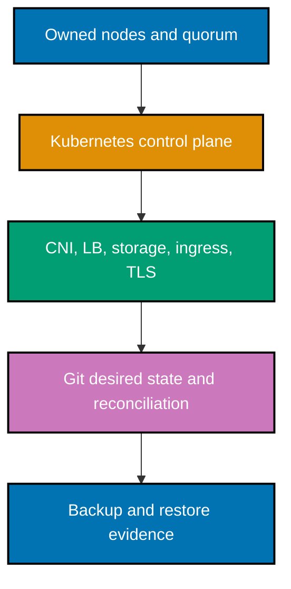

> **Review, render, then operate.** The examples are deliberately offline: `printf` records an operation
> plan; YAML is inline and has harmless documentation values; any `kubectl` form uses
> `--dry-run=client`. They prove syntax and intent, not a live cluster. A real control-plane, network,
> storage, certificate, GitOps, or restore change needs an owner-approved lab and a current primary-source
> command check.

## Concepts

The course maps `co-01`–`co-15` to ownership, topology, distribution selection, lifecycle, backup, and
upgrades; `co-16`–`co-24` to CNI, policy, bare-metal networking, storage, ingress, and TLS; and
`co-25`–`co-34` to GitOps, promotion, secret delivery, backup/restore, and immutable nodes. Each example
identifies the concept it exercises, so a reader can trace from a safe artifact to an operational duty.

## Platform map

The arrows show responsibility dependencies, not an installer order. A working application depends on all
of them, and a restore drill checks that the declared system can return after failure.

Next: [Beginner Examples](./beginner.md) →
