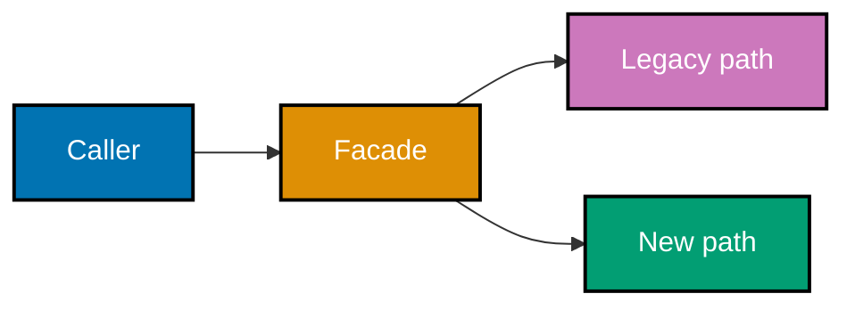

## Keep the design true as it changes

Architecture remains useful only when teams can detect drift and evolve an existing system safely.

### Worked Example 39: Add PACELC to the question

**Context**: CAP explains a partition; PACELC also asks what the design trades when the network is
healthy.

```text
Partition: prefer consistency over availability for payment confirmation.
Else: prefer a nearby read replica for catalog browsing, accepting bounded staleness.
```

**Key takeaway**: The latency-versus-consistency choice exists even without a partition.

**Why It Matters**: PACELC prevents a design review from treating the rare failure mode as the only
trade-off. Normal-path latency and replica freshness are product behavior that readers can observe.

### Worked Example 40: Test a forbidden import

**Context**: A fitness function turns a structural promise into a test that fails on regression.

```python
def test_domain_has_no_infrastructure_imports() -> None:
    imports = {"orders.domain": {"decimal", "typing"}}
    assert imports["orders.domain"].isdisjoint({"sqlalchemy", "fastapi"})
    # => A failure names a concrete inward-boundary violation rather than relying on review memory.
```

**Key takeaway**: Fitness functions encode an architectural characteristic as an executable check.

**Why It Matters**: The test is intentionally small. It protects a high-leverage rule continuously
and gives contributors a fast explanation when a convenient dependency would damage a boundary.

### Worked Example 41: Detect an import cycle

**Context**: Cycles make modules change and initialize together, which hides the real boundary.

```python
graph = {"orders": {"payments"}, "payments": {"orders"}}
# => Each module depends on the other, so neither can be understood or released independently.
has_cycle = "orders" in graph["payments"] and "payments" in graph["orders"]
# => A production checker would traverse the full graph; this tiny case exposes the property.
assert has_cycle
```

**Key takeaway**: A cycle is design feedback that calls for a shared abstraction or a changed direction.

**Why It Matters**: Moving one import often hides the cycle without removing its shared responsibility.
Name the stable concept or integration contract that both sides are trying to own.

### Worked Example 42: Plan a strangler migration

**Context**: A strangler migration moves one request path at a time behind a stable facade.



**Key takeaway**: The facade provides a controlled seam for incremental replacement.

**Why It Matters**: The migration can compare behavior and shift traffic gradually. The facade must
have a retirement plan or it becomes a permanent extra boundary with no owner.

### Worked Example 43: Route a cutover explicitly

**Context**: A facade makes the migration decision visible and reversible.

```python
def read_order(order_id: str, use_new: bool) -> str:
    if use_new:
        return f"new:{order_id}"  # => The new path can be verified for a bounded cohort.
    return f"legacy:{order_id}"  # => The fallback retains known behavior while evidence accumulates.
```

**Key takeaway**: Controlled routing is safer than a big-bang replacement.

**Why It Matters**: A flag is not a migration strategy by itself. Define compatibility data, rollout
evidence, rollback behavior, and the condition that permits deletion of the legacy path.

### Worked Example 44: Diagnose a big ball of mud

**Context**: A tangled system signals that responsibilities and change paths have become inseparable.

```text
Symptom: changing a receipt layout edits pricing, persistence, and email code.
Boundary proposal: isolate pricing as a pure calculation behind a small application interface.
First proof: add a characterization test before moving behavior.
```

**Key takeaway**: Diagnose the change path before choosing a fashionable replacement style.

**Why It Matters**: A big rewrite can recreate the same coupling under new names. A small boundary
with a characterization test produces evidence that the proposed seam actually reduces the blast radius.

### Worked Example 45: Classify complexity

**Context**: Some complexity belongs to the problem; other complexity is accidental machinery.

| Complexity                                    | Classification | Reason                                      |
| --------------------------------------------- | -------------- | ------------------------------------------- |
| Applying regional tax rules                   | Essential      | The business problem genuinely has the rule |
| Converting provider payloads in every handler | Accidental     | One adapter can isolate the vendor protocol |

**Key takeaway**: Remove accidental complexity without pretending essential complexity disappears.

**Why It Matters**: This classification prevents a harmful simplification: deleting a real business
rule merely hides it. The better move is to give essential complexity a clear model and boundary.

### Worked Example 46: Swap adapters without changing the core

**Context**: A domain function receives its port implementation as a dependency.

```python
def place(store: object, order_id: str) -> None:
    store.save(order_id)  # => The core knows the capability, not whether storage is memory or SQL.

class MemoryStore:
    def save(self, order_id: str) -> None:
        print(order_id)  # => This adapter exposes the same observable save contract for a test.
```

**Key takeaway**: Adapter substitution tests whether the boundary is real.

**Why It Matters**: The test should exercise the same application behavior with two adapters. If a
provider type leaks into the core, the substitution exposes the coupling immediately.

### Worked Example 47: Test a core in isolation

**Context**: A fake adapter makes infrastructure-free domain behavior fast to verify.

```python
class FakeStore:
    def __init__(self) -> None:
        self.saved: list[str] = []

    def save(self, order_id: str) -> None:
        self.saved.append(order_id)  # => The fake captures the observable effect for an assertion.
```

**Key takeaway**: A fake is useful when it models the port's observable contract.

**Why It Matters**: A fake must not silently invent production semantics. Use contract tests at the
adapter boundary when durability, ordering, or failure behavior matters to the application rule.

### Worked Example 48: Align stability and abstraction

**Context**: A heavily depended-on module should expose stable concepts rather than concrete details.

```text
Stable module: payment port protocol, used by many callers.
Concrete module: provider adapter, used by the composition root.
Check: callers depend on the protocol, not the provider client type.
```

**Key takeaway**: Stable abstractions reduce the cost of changing volatile details.

**Why It Matters**: Abstraction also costs indirection. Create it around a genuinely changing seam,
not around every value object or helper just to satisfy a numeric design metric.

### Worked Example 49: Select a style from a scenario

**Context**: A style selection should name the forces it serves and the cost it accepts.

```text
Scenario: one team, one deployable, several business areas, modest scale.
Choice: modular monolith with enforced module APIs.
Trade-off: defer independent deployment in exchange for local calls and simpler operations.
```

**Key takeaway**: The scenario chooses the style; the style does not choose the scenario.

**Why It Matters**: This keeps an architecture review falsifiable. If team topology or scaling
pressure changes, revisit the decision record instead of treating the initial style as identity.

### Worked Example 50: Measure a quality trade-off

**Context**: A security or consistency improvement can impose a measurable latency cost.

```text
Change: add a remote authorization check before a sensitive action.
Benefit: policy is centrally enforced.
Cost: request latency now includes authorization availability.
Measure: report p95 latency and the safe behavior when the policy service is unavailable.
```

**Key takeaway**: Trade-offs should have measures at the operation where users experience them.

**Why It Matters**: A qualitative “more secure” claim hides possible failure modes. The measure
creates a testable target and exposes when a cache, fallback, or different boundary is required.

### Worked Example 51: Review a set of ADRs

**Context**: A system's key decisions should be traceable as a connected set rather than scattered
comments.

| Decision            | Status   | Related consequence                         |
| ------------------- | -------- | ------------------------------------------- |
| Payment port        | Accepted | Provider types remain outside order policy  |
| Async receipt event | Accepted | Readers tolerate delayed email delivery     |
| Module import rule  | Accepted | The build checks forbidden internal imports |

**Key takeaway**: ADRs become an architecture map when their effects and relationships remain visible.

**Why It Matters**: A review can ask whether a new proposal conflicts with an existing decision or
supersedes it. Marking status prevents readers from treating every historical experiment as current policy.

### Worked Example 52: Re-architect a tangled service

**Context**: The capstone combines the course's boundary, documentation, and verification techniques.

```text
Baseline: characterize a tangled order flow with a test.
Core: extract pricing and order policy with no infrastructure imports.
Adapters: provide an in-memory and a persistent store behind one port.
Evidence: update C4 views and an ADR; run the import and adapter-substitution checks.
```

**Key takeaway**: Architecture work is complete when the boundary, evidence, and behavior agree.

**Why It Matters**: The result is not a prettier folder tree. It is a service whose change paths are
smaller, whose trade-offs are recorded, and whose most important structural promise is continuously verified.
