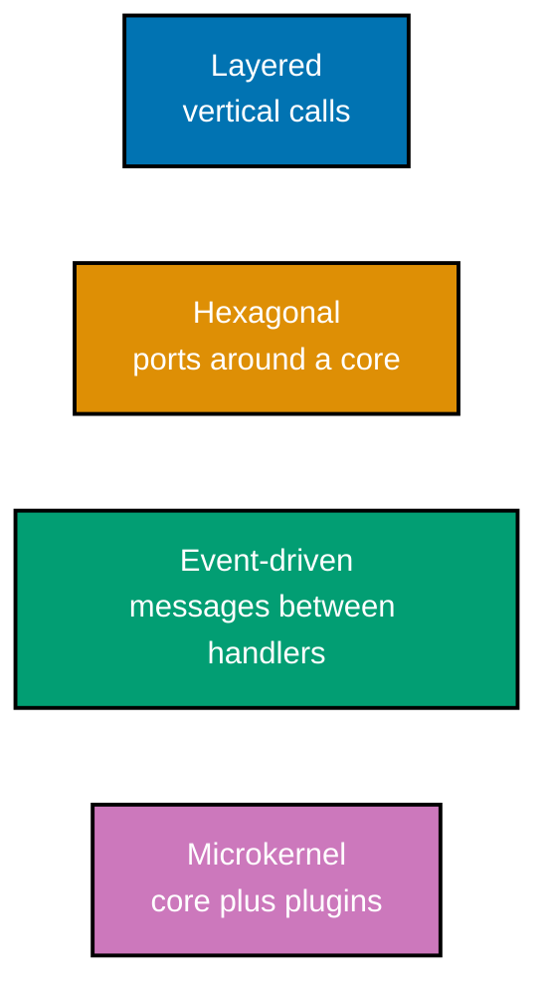
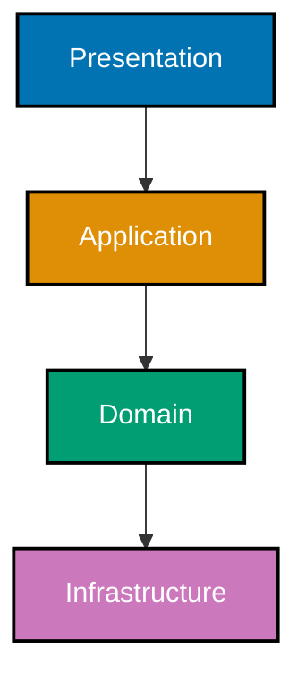

## Boundaries before styles

The first cluster makes boundaries observable before it gives them names. Read the annotation as a
claim that can be checked, not as decoration.

### Worked Example 1: Count outgoing and incoming dependencies

**Context**: Coupling becomes actionable when a team can distinguish what a module depends on from
what depends on it. This example calculates the two counts for a deliberately small graph.

**`learning/code/ex-01-coupling-count.py`**

```python
dependencies = {"orders": {"payments", "catalog"}, "payments": set(), "catalog": set()}
# => `orders` has two outgoing dependencies, so changing either dependency can affect it.
incoming = sum("orders" in targets for targets in dependencies.values())
# => No module names `orders`, so its afferent coupling is zero in this graph.
outgoing = len(dependencies["orders"])
# => Efferent coupling is two; the pair gives a starting point, not a quality verdict.
print({"Ca": incoming, "Ce": outgoing})
# => Output: {'Ca': 0, 'Ce': 2}; measure before deciding which dependency is inappropriate.
```

**Key takeaway**: Coupling is a relationship that can be counted, then discussed in the context of
change pressure.

**Why It Matters**: A number does not prove a design is bad. It makes a hidden dependency surface
visible so a team can decide whether the direction reflects a stable abstraction or a leaking detail.

### Worked Example 2: Calculate instability

**Context**: A module that many others use should not be forced to change for every caller. The
instability metric makes that pressure explicit.

**`learning/code/ex-02-instability-metric.py`**

```python
ca, ce = 5, 1
# => Five dependents create a reason to keep this module stable; one outgoing edge is its own pressure.
instability = ce / (ca + ce)
# => I = Ce / (Ca + Ce), so this module's instability is approximately 0.17.
print(round(instability, 2))
# => Output: 0.17; compare this value only with modules playing a similar architectural role.
```

**Key takeaway**: Stable modules tend to have more incoming than outgoing dependencies.

**Why It Matters**: The metric prevents an intuition trap: a widely reused concrete implementation
can be stable in count but still be a poor seam if it forces every dependent to inherit its details.

### Worked Example 3: Split a low-cohesion service

**Context**: A class that calculates totals, sends email, and formats reports changes for unrelated
reasons. Separate the domain rule from the side effect.

```python
def subtotal(lines: list[int]) -> int:
    return sum(lines)  # => The pure rule depends only on its explicit input.

def send_receipt(address: str, total: int) -> str:
    return f"sent {total} to {address}"  # => The effect now has its own change boundary.
```

**Key takeaway**: Cohesion improves when one unit owns one kind of reason to change.

**Why It Matters**: The split is not ceremony. A tax-rule change can now be tested without an email
system, while a delivery-provider change cannot accidentally alter money calculations.

### Worked Example 4: Invert a concrete dependency

**Context**: Application policy should depend on the capability it needs, not on one delivery
mechanism.

```python
from typing import Protocol

class Notifier(Protocol):
    def send(self, message: str) -> None: ...  # => The policy names a stable capability.

def confirm_order(notifier: Notifier, order_id: str) -> None:
    notifier.send(f"confirmed {order_id}")  # => An adapter supplies the transport at the edge.
```

**Key takeaway**: Dependency inversion moves volatile infrastructure behind a policy-owned port.

**Why It Matters**: A test can provide a fake notifier, and a production deployment can swap email
for a queue without editing the order-confirmation rule.

### Worked Example 5: Record the architecture definition you are using

**Context**: Teams talk past one another when “architecture” means a framework choice to one person
and a costly-to-change decision to another.

| Author        | Working definition                               | Review question                                  |
| ------------- | ------------------------------------------------ | ------------------------------------------------ |
| Ralph Johnson | The important stuff                              | What decision would be expensive to reverse?     |
| Grady Booch   | Significant decisions measured by cost of change | What future change does this decision constrain? |

**Key takeaway**: Start an architecture discussion by stating the decision and its cost of change.

**Why It Matters**: The table is a decision artifact, not a quotation contest. It turns vague design
preferences into claims that can be challenged with a likely future change.

### Worked Example 6: Compare style shapes

**Context**: Styles describe recurring boundary arrangements, not maturity levels. The diagram keeps
the distinction visible.



**Key takeaway**: A style is a reusable arrangement with explicit benefits and costs.

**Why It Matters**: Naming a style helps a team reason about its consequences, but it does not
select the style. Quality attributes and organizational constraints make that selection.

### Worked Example 7: Make layer direction explicit

**Context**: A layered design protects higher-level policy from lower-level detail only when its
dependency direction is enforced.



**Key takeaway**: Layers isolate change only when callers do not skip across them.

**Why It Matters**: A diagram alone does not stop a presentation handler from importing SQL. The
later fitness-function examples turn this intended direction into a checked rule.

### Worked Example 8: Replace persistence without changing presentation

**Context**: A boundary earns its cost when a change stays inside it. The presentation code receives
the same interface regardless of where data is stored.

```python
def render_order(repository: object, order_id: str) -> str:
    order = repository.get(order_id)  # => The presentation boundary needs a lookup, not SQL details.
    return f"Order {order_id}: {order}"  # => Swapping the repository preserves this output contract.
```

**Key takeaway**: A boundary succeeds when an expected change has a small, predictable blast radius.

**Why It Matters**: An in-memory repository can support a test while a database adapter supports
production. Neither substitution requires a template or handler rewrite.

### Worked Example 9: Diagnose a sinkhole layer

**Context**: Passing a request through a layer with no policy, transformation, or protection can add
cost without isolation.

```python
def service_get(order_id: str, repository: object) -> object:
    return repository.get(order_id)  # => This pass-through is a sinkhole unless it owns a real policy.
```

**Key takeaway**: A layer must justify its existence by owning a responsibility.

**Why It Matters**: Removing a sinkhole can improve readability; retaining one can still be valid if
it reserves a stable seam for a near-term policy. State that reason instead of relying on a template.

### Worked Example 10: Define a hexagonal port

**Context**: A port expresses the capability the domain needs, in the domain's vocabulary.

```python
from typing import Protocol

class OrderStore(Protocol):
    def save(self, order_id: str) -> None: ...  # => The core owns this contract, not a database library.
```

**Key takeaway**: Ports point inward from infrastructure to policy-owned abstractions.

**Why It Matters**: The domain can be tested and evolved without importing a driver. The adapter
absorbs the database protocol, retry policy, and connection configuration at the system edge.

### Worked Example 11: Implement an adapter

**Context**: An adapter translates an external mechanism into the port's vocabulary.

```python
class MemoryOrderStore:
    def __init__(self) -> None:
        self.ids: list[str] = []  # => This local state stands in for an external persistence mechanism.

    def save(self, order_id: str) -> None:
        self.ids.append(order_id)  # => The adapter fulfills the port without changing domain policy.
```

**Key takeaway**: Adapters are replaceable details that implement stable ports.

**Why It Matters**: The adapter boundary makes a fake honest: it has the same observable contract as
production code, while preserving the fact that durability and concurrency semantics may differ.

### Worked Example 12: Place ports around the core

**Context**: The hexagonal diagram shows why the core does not import its adapters.


**Key takeaway**: Ports define the core's boundary; adapters plug into it from outside.

**Why It Matters**: The same core can be driven by HTTP, a command-line job, or a test. The choice
of entry point becomes a deployment detail instead of a constraint on application policy.

### Worked Example 13: Keep the functional core pure

**Context**: A pure function makes a domain rule deterministic and cheap to test.

```python
def total_after_discount(subtotal: int, percent: int) -> int:
    return subtotal - subtotal * percent // 100  # => Same input always yields the same total, with no I/O.
```

**Key takeaway**: Keep business calculation in a pure core when its rule does not need an effect.

**Why It Matters**: The function has no database, clock, or network to arrange in a test. The
imperative shell supplies those effects around the decision rather than hiding them inside it.

### Worked Example 14: Put effects in the imperative shell

**Context**: The shell coordinates I/O and then calls the pure rule.

```python
def quote(repository: object, order_id: str) -> int:
    subtotal = repository.subtotal(order_id)  # => The shell performs the effect at the boundary.
    return total_after_discount(subtotal, 10)  # => The core remains a deterministic calculation.
```

**Key takeaway**: The shell should be thin enough that its effects are obvious and replaceable.

**Why It Matters**: This split does not eliminate complexity; it puts integration risk in a small
area and business-rule risk in a small, deterministic area that can be exercised independently.

### Worked Example 15: Turn a quality attribute into a measure

**Context**: “Fast” and “reliable” are preferences until a scenario identifies a stimulus,
environment, response, and measure.

| Attribute     | Scenario                               | Measure                                                      |
| ------------- | -------------------------------------- | ------------------------------------------------------------ |
| Availability  | A dependency times out during checkout | The system returns a safe result without corrupting an order |
| Modifiability | A payment provider changes its API     | The change remains inside one adapter                        |
| Performance   | A reader requests an order summary     | The response stays within the agreed latency budget          |

**Key takeaway**: Quality attributes guide architecture when they have observable measures.

**Why It Matters**: A metric creates a reviewable acceptance condition. It also exposes trade-offs:
retrying can improve availability while making a latency target harder to meet.

### Worked Example 16: Identify an architecturally significant requirement

**Context**: Not every requirement deserves a cross-system boundary. Distinguish an expensive or
risky change from an ordinary feature.

```text
Requirement: replace the payment provider without editing order policy
Assessment: architecturally significant
Reason: provider contracts are volatile and failure behavior affects a critical flow
```

**Key takeaway**: An architecturally significant requirement changes a structural decision.

**Why It Matters**: This test avoids two failures: treating every ticket as architecture, and
discovering a truly structural constraint only after a feature has coupled it to the whole system.

### Worked Example 17: Map a communication boundary

**Context**: Conway's Law is an observation to test, not an excuse to reproduce an org chart.

```text
Team: checkout
System boundary: checkout application module
Question: can the team change its module without coordinating with catalog implementation details?
```

**Key takeaway**: Organizational and software boundaries should be examined together.

**Why It Matters**: A mismatch can make ordinary work cross team queues. The remedy might be a
different code boundary, a different collaboration pattern, or both; Conway's Law does not dictate
a particular microservice count.

### Worked Example 18: Draw a C4 context boundary

**Context**: A context diagram communicates the system's responsibility and external relationships
without prematurely showing implementation details.


**Key takeaway**: Start documentation at the level where responsibility and external dependencies
are clear.

**Why It Matters**: A context diagram prevents a common review failure: debating class structure
before stakeholders agree on what the system owns and which external failure modes it must handle.
