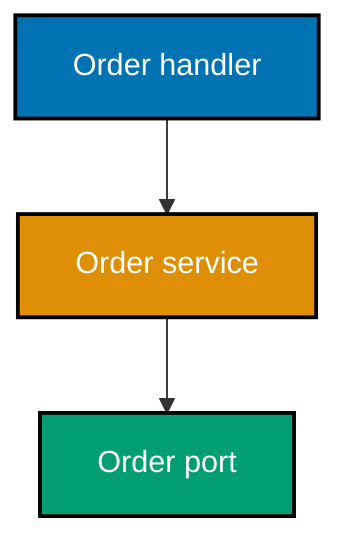
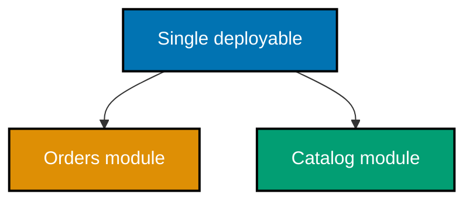
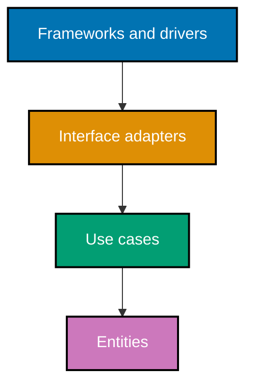

## Make decisions inspectable

The middle cluster turns an intended structure into reviewable views, requirements, and decisions.

### Worked Example 19: Draw a C4 container view

**Context**: A context view says what the system owns; a container view says which deployable units
collaborate to deliver that responsibility.


**Key takeaway**: A C4 container is an independently runnable or deployable technology boundary,
not necessarily a Docker container.

**Why It Matters**: The view gives operations and developers a shared map of runtime failure paths
without forcing them to read implementation-level classes or packages.

### Worked Example 20: Draw a C4 component view

**Context**: A component view opens one container only far enough to show responsibility and
dependency direction.



**Key takeaway**: Components communicate responsibilities and allowed edges, not every helper file.

**Why It Matters**: A component view is valuable only while it remains a design aid. Update it when
its named responsibilities or boundaries change, rather than turning it into a stale code inventory.

### Worked Example 21: Separate the 4+1 views

**Context**: One diagram cannot answer every architecture question. A view set keeps questions from
being conflated.

| View        | Question it answers                            |
| ----------- | ---------------------------------------------- |
| Logical     | What responsibilities and concepts exist?      |
| Process     | What runs concurrently and communicates?       |
| Development | How is code organized and built?               |
| Physical    | Where does it run?                             |
| Scenarios   | Do the chosen views handle important behavior? |

**Key takeaway**: Select a view for the concern under review.

**Why It Matters**: A deployment concern can be invisible in a class diagram, while a module-boundary
violation can be invisible in a topology diagram. The +1 scenarios join those partial views.

### Worked Example 22: Write a small ADR

**Context**: An ADR records why a decision was made while its alternatives and constraints are still
known.

```markdown
## Status

Accepted

## Context

The payment provider changes independently of order policy.

## Decision

Expose a payment port owned by the order application.

## Consequences

Add an adapter and contract tests; keep provider types outside the domain.
```

**Key takeaway**: An ADR captures a decision and its consequence, not a timeless rule.

**Why It Matters**: Future maintainers can revisit an accepted decision with the original pressure in
view instead of mistaking an old implementation detail for an unexplained invariant.

### Worked Example 23: Record a synchronous versus asynchronous trade-off

**Context**: Integration style changes failure, latency, and user-feedback behavior. Record both
sides before picking one.

| Option             | Benefit                                     | Cost                                              |
| ------------------ | ------------------------------------------- | ------------------------------------------------- |
| Synchronous call   | Immediate response and simple request trace | Caller waits for dependency availability          |
| Asynchronous event | Decouples availability and smooths bursts   | Adds eventual consistency and operational tracing |

**Key takeaway**: The right integration style follows the required user-visible behavior.

**Why It Matters**: “Async scales” is incomplete. If a user must know whether payment succeeded
before proceeding, the design needs a clear confirmation boundary even if the work continues later.

### Worked Example 24: Apply the trade-off first law

**Context**: A design claim becomes useful when it names what it optimizes and what it gives up.

```text
Decision: cache product reads for availability and latency.
Cost: readers can observe stale data until invalidation or expiry.
Guard: do not cache the checkout price confirmation.
```

**Key takeaway**: Every architectural choice spends one quality attribute to buy another.

**Why It Matters**: Naming the cost lets reviewers decide whether it belongs on this operation. It
also identifies the tests and monitoring that make the chosen compromise safe in production.

### Worked Example 25: Write an ATAM-style scenario

**Context**: A quality-attribute scenario gives a design review something concrete to analyze.

```text
Source: payment provider
Stimulus: 30-second timeout during checkout
Environment: normal traffic
Response: mark payment pending, retain the order, and allow safe retry
Measure: no duplicate charge and no lost order
```

**Key takeaway**: A quality scenario connects a business risk to a verifiable architectural response.

**Why It Matters**: The scenario reveals sensitivity points: idempotency keys, durable state, and
retry policy. A vague “high availability” requirement would hide all three.

### Worked Example 26: Describe a monolith honestly

**Context**: A monolith is one deployable unit, not automatically a tangled codebase.



**Key takeaway**: A modular monolith can have strong internal boundaries while shipping as one unit.

**Why It Matters**: A single deployment avoids network failure and distributed tracing costs. It is
a sound default when independent deployment or scaling is not a demonstrated need.

### Worked Example 27: Describe a microservice split

**Context**: A service boundary is justified only when it supports independent change, operations, or
team ownership that the system actually needs.


**Key takeaway**: A service boundary introduces a network and an operational contract.

**Why It Matters**: Independent deployment can be valuable, but every call now needs timeout,
retry, observability, and compatibility behavior that a local function call did not require.

### Worked Example 28: Spot a distributed monolith

**Context**: Multiple deployables that must release and fail together have paid the distributed cost
without gaining independence.

```text
Symptom: orders release is blocked until catalog and payment release together.
Evidence: shared database migration and synchronous startup dependency.
Action: restore a modular boundary first, then split only an independently operable seam.
```

**Key takeaway**: Deployment count does not prove architectural independence.

**Why It Matters**: The diagnosis directs effort toward contracts, data ownership, and failure
isolation instead of adding another service to an already coupled release train.

### Worked Example 29: Enforce a modular monolith seam

**Context**: A module boundary needs an API and a rule against importing another module's internals.

```python
PUBLIC_ORDERS_API = {"place_order", "get_order"}
# => Callers use names deliberately exported by the orders module.
requested_name = "_repository"
# => An underscored implementation name is not part of the module contract.
assert requested_name not in PUBLIC_ORDERS_API
# => The check rejects a dependency on an internal detail before it spreads.
```

**Key takeaway**: A modular monolith protects future options by enforcing today's internal seams.

**Why It Matters**: The rule is cheap while code runs in one process. It reduces the cost of later
extraction, but it does not promise that every module should become a service.

### Worked Example 30: Fail a boundary check

**Context**: A fitness function should fail when a prohibited dependency appears.

```python
imports = {"orders.handlers": {"payments._vendor_client"}}
# => The handler reaches into an external module's internal implementation.
forbidden = any("._" in target for targets in imports.values() for target in targets)
# => An internal import is a structural violation, not merely a naming preference.
assert forbidden
# => A real test would fail the build with the offending edge in its report.
```

**Key takeaway**: Make architectural direction executable before a violation becomes habitual.

**Why It Matters**: Code review alone is not reliable for graph-wide constraints. A small automated
check gives every contributor the same fast feedback, including contributors who did not draw the diagram.

### Worked Example 31: Map two bounded contexts

**Context**: A bounded context gives a model its own language and change boundary.

```text
Sales context: customer means a buyer and owns purchase history.
Support context: customer means a requester and owns case history.
Integration: translate through an anticorruption layer at the boundary.
```

**Key takeaway**: The same word can legitimately have different models in different contexts.

**Why It Matters**: Forcing one universal object often creates accidental coupling. Translation is
an explicit cost that preserves each model's integrity and exposes a real integration contract.

### Worked Example 32: Draw clean architecture direction

**Context**: Clean or onion architecture places policy inside and details outside.



**Key takeaway**: Source dependencies point toward policy, even when runtime control begins at an edge.

**Why It Matters**: The distinction prevents a common confusion: a web request may enter at a
framework, but the application need not import framework types into its business rules.

### Worked Example 33: Check the dependency rule

**Context**: The inner layer should not import an outer adapter.

```python
domain_imports = {"orders.domain": {"typing", "decimal"}}
# => Domain code relies only on language-level concepts here.
outer_packages = {"fastapi", "sqlalchemy"}
# => Framework and persistence packages belong outside the domain boundary.
assert domain_imports["orders.domain"].isdisjoint(outer_packages)
# => The check protects the inward-only source-dependency rule.
```

**Key takeaway**: A dependency rule is strongest when tooling checks it continuously.

**Why It Matters**: A clean diagram cannot compensate for a domain object that accepts a framework
request or persists itself. The import graph provides a concrete, reviewable signal.

### Worked Example 34: Apply cross-cutting logging at the edge

**Context**: Logging belongs in one boundary-wide mechanism rather than in every domain rule.

```python
def with_log(action):
    def wrapped(*args):
        print("start")  # => The shell records an operational fact outside the domain calculation.
        return action(*args)  # => The wrapped policy remains unaware of its logging mechanism.
    return wrapped
```

**Key takeaway**: Cross-cutting concerns need a deliberate placement to avoid repeated leaks.

**Why It Matters**: The wrapper provides consistent observability without turning each use case into
a logging implementation. The same pattern needs care for errors, transactions, and authorization.

### Worked Example 35: Define a transaction seam

**Context**: A transaction boundary should state exactly which local changes succeed or fail together.

```text
Begin: create order and reserve local inventory.
Commit: both local writes succeed.
Rollback: either write fails and neither local state change remains.
```

**Key takeaway**: Transactions protect a stated consistency boundary, not an entire distributed flow.

**Why It Matters**: Once a workflow crosses independent systems, compensations and idempotency are
needed. Pretending one local transaction spans them hides the failure behavior readers must design.

### Worked Example 36: Keep configuration outside policy

**Context**: Configuration changes per deployment; policy should receive it rather than hard-code it.

```python
import os

timeout_seconds = int(os.environ["PAYMENT_TIMEOUT_SECONDS"])
# => Deployment provides the volatile value without editing source code.
assert timeout_seconds > 0
# => The application validates the boundary before using the value.
```

**Key takeaway**: Externalized configuration prevents a deployment choice from becoming a code fork.

**Why It Matters**: The rule supports safe promotion across environments and makes configuration
visible in operations. It does not authorize putting secret values in source control.

### Worked Example 37: Audit a twelve-factor claim

**Context**: A checklist turns a slogan into evidence.

| Factor           | Evidence                                      | Result |
| ---------------- | --------------------------------------------- | ------ |
| Config           | Timeout comes from an environment variable    | Pass   |
| Logs             | Structured events go to standard output       | Pass   |
| Backing services | Database is addressed as an attached resource | Review |

**Key takeaway**: An architecture audit should report evidence and gaps, not a badge.

**Why It Matters**: The table invites follow-up where it matters. A partial result is more useful
than claiming compliance while leaving persistence, release, or disposability assumptions unexamined.

### Worked Example 38: Choose behavior during a partition

**Context**: CAP applies when a partition prevents replicas from communicating; the system must make
its chosen failure mode visible.

```text
Operation: withdraw money
Partition choice: reject or delay the request rather than risk two confirmed withdrawals
Quality priority: consistency for this operation
```

**Key takeaway**: During a partition, choose which guarantee an operation relaxes; do not claim both.

**Why It Matters**: CAP is not a database brand label. Different operations may choose differently,
but each choice must be represented in user-facing behavior, retry rules, and monitoring.
