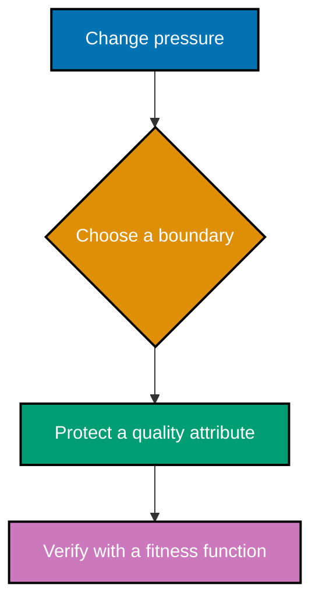

## Mental model

Architecture is not a diagram collection or a framework selection. It is the deliberately chosen
set of costly-to-change decisions: dependency direction, module boundaries, runtime topology, and
the quality attributes those decisions protect. The examples test each decision by asking what can
change without forcing unrelated code or teams to change with it.

## Concept map

- **Boundaries**: coupling and cohesion, dependency inversion, stable dependencies, layered,
  hexagonal, functional-core, clean/onion, and modular-monolith styles.
- **Decision quality**: quality attributes, ATAM scenarios, Conway's Law, CAP/PACELC, and explicit
  trade-offs.
- **Communication**: C4, 4+1 views, and Architecture Decision Records (ADRs).
- **Evolution**: fitness functions, strangler migration, and diagnosing a big ball of mud.

## Example progression

- **Foundations** (Examples 1–18) exposes coupling, layers, ports, quality attributes, and C4
  context diagrams.
- **Trade-offs** (Examples 19–38) compares styles and records decisions with evidence.
- **Evolution** (Examples 39–52) verifies architecture continuously and changes a system without a
  big-bang rewrite.

Every code-bearing example has a colocated file under `learning/code/`. Diagram and decision-artifact
examples are complete in their lesson page because their artifact is the runnable unit of reasoning.

Next: [Foundations](./beginner.md) →
