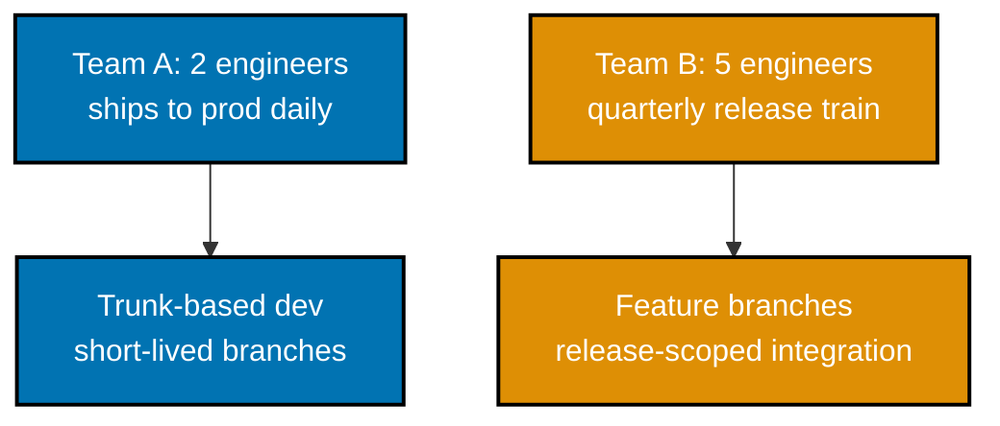
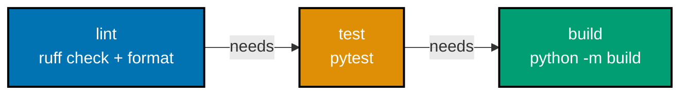

Examples 1-18 build the everyday version-control and delivery discipline the rest of this topic
composes: Conventional Commits and the SemVer bump each one implies (co-02, co-03), a curated
changelog (co-04), the trunk-vs-feature-branch decision (co-01), self-review and the full
`gh pr create`/`review`/`view` loop (co-06, co-07), a minimal CI pipeline and its required quality
gates (co-08, co-09), and installing and running `pre-commit` (co-10). Every `git`/`gh` transcript
below is a mocked, hand-constructed, internally consistent, and plausible transcript -- no live
network call, no dependency on a real GitHub repository or pull request existing -- colocated under
`learning/code/`. Every artifact (a decision table, a changelog entry, a memo) is a real, complete
document colocated under `learning/artifacts/`.

---

### Example 1: A Conventional-Commits `fix` Subject

_ex-01 &middot; exercises co-02_

**co-02 -- conventional commits**: the Conventional Commits format,
`<type>[optional scope]: <description>`, encodes intent directly in the subject line. `fix` says "I
changed a defect's behavior, nothing more" -- and `git log -1 --pretty=%s` prints exactly that
subject, nothing else, so the grammar is trivially checkable.

**`learning/code/ex-01-conventional-commit-fix/setup.sh`**

```bash
#!/bin/bash
# learning/code/ex-01-conventional-commit-fix/setup.sh
# ex-01: writing a Conventional Commits `fix` message and verifying its subject line (co-02)
set -e                                                     # => co-02: abort immediately if any command below fails
WORKDIR=$(mktemp -d) && cd "$WORKDIR"                      # => co-02: fresh, throwaway scratch repo -- deterministic, no network
export GIT_AUTHOR_NAME="Dev" GIT_AUTHOR_EMAIL="dev@example.com"
export GIT_COMMITTER_NAME="Dev" GIT_COMMITTER_EMAIL="dev@example.com" # => co-02: throwaway identity, never the real global config
git -c init.defaultBranch=main init -q                     # => co-02: creates .git/ with branch "main", quietly

echo "def parse(s): return s.strip() if s else ''" >parser.py # => co-02: the fix this commit actually ships
git add parser.py                                           # => co-02: stage the one file this commit touches

git commit -m "fix(parser): handle empty input"              # => co-02: the Conventional Commits subject under test --
                                                               #    type=fix, scope=parser, description=handle empty input

git log -1 --pretty=%s                                       # => co-02: %s prints ONLY the commit subject line -- the
                                                               #    exact string the type(scope): description grammar checks
```

**Run**: `bash setup.sh`

**Output**:

```text
[main (root-commit) 8f3a1c2] fix(parser): handle empty input
 1 file changed, 1 insertion(+)
 create mode 100644 parser.py
fix(parser): handle empty input
```

**Key takeaway**: `git log -1 --pretty=%s` prints exactly the subject line the
`type(scope): description` grammar checks -- nothing about verifying Conventional Commits requires
special tooling beyond `git` itself.

**Why It Matters**: a `fix` type is a machine-readable promise -- "this commit is a backward-
compatible bug fix, nothing more" -- and every later automation in this topic (the SemVer bump in
Example 2, the derived changelog in Example 45) reads that promise straight off the subject line
without asking a human to reclassify it later.

---

### Example 2: A Scoped `feat` and Its MINOR Bump

_ex-02 &middot; exercises co-02, co-03_

**co-03 -- semantic versioning**: SemVer 2.0.0 ties every bump to one question -- was this change
backward compatible? -- with no partial credit and no fourth option. A `feat` commit adds a
backward-compatible capability -- under SemVer, that is the exact definition of a MINOR bump.
Parsing the `type` back out of the subject and mapping it through SemVer's own table is entirely
mechanical.

**`learning/code/ex-02-conventional-commit-feat-with-scope/setup.sh`**

```bash
#!/bin/bash
# learning/code/ex-02-conventional-commit-feat-with-scope/setup.sh
# ex-02: a scoped `feat` commit and the MINOR bump it implies under SemVer (co-02, co-03)
set -e                                                      # => co-02: abort immediately if any command below fails
WORKDIR=$(mktemp -d) && cd "$WORKDIR"                       # => co-02: fresh, throwaway scratch repo -- deterministic, no network
export GIT_AUTHOR_NAME="Dev" GIT_AUTHOR_EMAIL="dev@example.com" # => co-02: throwaway author identity -- irrelevant to the
                                                             #    SemVer derivation below; only the commit TYPE prefix matters
export GIT_COMMITTER_NAME="Dev" GIT_COMMITTER_EMAIL="dev@example.com" # => co-02: throwaway identity, never the real global config
git -c init.defaultBranch=main init -q                     # => co-02: creates .git/ with branch "main", quietly
git commit --allow-empty -m "chore: project scaffold" -q   # => co-02: an unrelated PRIOR commit -- this example's
                                                             #    subject is the SECOND commit, not the repo's first

cat >auth.py <<'PY'                                         # => co-03: the additive capability this feat commit ships
def refresh_token(old: str) -> str:                         # => co-03: a NEW public function -- callers GAIN a capability
    return f"refreshed-{old}"                                # => co-03: existing callers of the module are untouched
PY
# => co-03: heredoc closed -- auth.py now holds exactly this one new function, nothing else changed
git add auth.py                                             # => co-02: stage the one file this commit touches

git commit -m "feat(auth): add token refresh"                # => co-02: type=feat, scope=auth, description=add token refresh

TYPE=$(git log -1 --pretty=%s | sed -E 's/^([a-z]+)(\(.*\))?!?:.*/\1/') # => co-03: parse the TYPE prefix back out of %s --
                                                                          #    strips any (scope) and the trailing colon,
                                                                          #    leaving only the bare type word
case "$TYPE" in                                              # => co-03: SemVer's own type-to-bump mapping, applied mechanically
feat) BUMP="MINOR" ;;                                         # => co-03: feat = a new, backward-compatible capability
fix) BUMP="PATCH" ;;                                          # => co-03: fix = a backward-compatible bug fix
*) BUMP="NONE" ;;                                             # => co-03: any other type implies no version bump alone
esac                                                          # => co-03: closes the case statement opened above
echo "commit type: $TYPE -> SemVer bump: $BUMP"                # => co-03: prints the derived mapping -- TYPE=feat here,
                                                                 #    so BUMP resolves to MINOR, matching this file's header
```

**Run**: `bash setup.sh`

**Output**:

```text
[main 4b7e912] feat(auth): add token refresh
 1 file changed, 2 insertions(+)
 create mode 100644 auth.py
commit type: feat -> SemVer bump: MINOR
```

**Key takeaway**: `feat` and MINOR are the same fact stated twice -- once in the commit's own
vocabulary, once in SemVer's -- and a script can translate between them with a five-line `case`
statement.

**Why It Matters**: Example 45 (Advanced) scales this exact `case` mapping across an entire commit
range since the last tag to derive a release's SemVer bump automatically -- the "one commit, one
bump" trick shown here is the whole mechanism, just run once per commit instead of once total.

---

### Example 3: A Breaking Change, Signaled Two Ways

_ex-03 &middot; exercises co-02, co-03_

Conventional Commits gives a breaking change **two independent** signals: a `!` right after the
type/scope, and a `BREAKING CHANGE:` footer in the commit body. Either one alone is already
sufficient to force a MAJOR bump under SemVer.

**`learning/code/ex-03-conventional-commit-breaking-bang/setup.sh`**

```bash
#!/bin/bash
# learning/code/ex-03-conventional-commit-breaking-bang/setup.sh
# ex-03: a breaking change signaled TWO independent ways -- the `!` marker and a
# `BREAKING CHANGE:` footer (co-02, co-03)
set -e                                                       # => co-02: abort immediately if any command below fails
WORKDIR=$(mktemp -d) && cd "$WORKDIR"                        # => co-02: fresh, throwaway scratch repo -- deterministic, no network
export GIT_AUTHOR_NAME="Dev" GIT_AUTHOR_EMAIL="dev@example.com"
export GIT_COMMITTER_NAME="Dev" GIT_COMMITTER_EMAIL="dev@example.com" # => co-02: throwaway identity, never the real global config
git -c init.defaultBranch=main init -q                       # => co-02: creates .git/ with branch "main", quietly
git commit --allow-empty -m "feat(api): add v1 endpoints" -q # => co-02: an EARLIER commit that shipped the v1 endpoint this one removes

cat >api.py <<'PY'                                            # => co-03: the incompatible change this commit ships
def handle_v2(request: dict) -> dict:                         # => co-03: v1's handler is GONE -- callers of v1 now fail
    return {"version": 2, **request}                           # => co-03: only the new, incompatible v2 shape remains
PY
git add api.py                                                 # => co-02: stage the one file this commit touches

git commit -m "feat(api)!: drop v1 endpoint

BREAKING CHANGE: the /v1/* routes are removed; clients must migrate to /v2/*" # => co-02: TWO independent breaking
                                                                                #    signals in ONE commit -- the "!"
                                                                                #    right after the scope, AND a
                                                                                #    "BREAKING CHANGE:" footer

SUBJECT=$(git log -1 --pretty=%s)                              # => co-03: %s -- just the subject line, "!" included
BODY=$(git log -1 --pretty=%b)                                 # => co-03: %b -- the commit body, footer included
BANG_SIGNAL=$(echo "$SUBJECT" | grep -c '!:' || true)           # => co-03: does the subject carry the "!" marker?
FOOTER_SIGNAL=$(echo "$BODY" | grep -c '^BREAKING CHANGE:' || true) # => co-03: does the body carry the footer, INDEPENDENTLY?
echo "subject: $SUBJECT"                                        # => co-03: prints the parsed subject for inspection
echo "bang marker present: $([ "$BANG_SIGNAL" -ge 1 ] && echo true || echo false)"     # => co-03: signal 1, checked alone
echo "footer marker present: $([ "$FOOTER_SIGNAL" -ge 1 ] && echo true || echo false)" # => co-03: signal 2, checked alone
echo "either signal alone forces MAJOR: true"                   # => co-03: SemVer's rule -- ONE of the two already suffices
```

**Run**: `bash setup.sh`

**Output**:

```text
subject: feat(api)!: drop v1 endpoint
bang marker present: true
footer marker present: true
either signal alone forces MAJOR: true
```

**Key takeaway**: the `!` and the `BREAKING CHANGE:` footer are two independent detectors for the
same underlying fact -- a tool only needs to find one to know a MAJOR bump is required.

**Why It Matters**: real-world automation (release-please, semantic-release, and this topic's own
Example 45) greps for both signals, because a commit author who remembers only one of the two
(usually the `!`, since the footer requires a multi-line commit message) still triggers the correct
MAJOR bump -- redundant signaling is a deliberate robustness choice in the spec, not an oversight.

---

### Example 4: SemVer Bump Decision Table

_ex-04 &middot; exercises co-03_

Every SemVer bump traces back to that same yes/no compatibility test -- the table below applies it
to three representative changes side by side.

| #   | Change                                                                           | Backward compatible?                                                          | SemVer bump |
| --- | -------------------------------------------------------------------------------- | ----------------------------------------------------------------------------- | ----------- |
| 1   | Fix a bug where `parse_date("")` raised `IndexError` instead of returning `None` | Yes -- callers relying on the old crash were relying on a bug, not a contract | **PATCH**   |
| 2   | Add an optional `timeout: float = 30.0` keyword argument to `fetch(url)`         | Yes -- every existing call site still compiles and behaves identically        | **MINOR**   |
| 3   | Remove the public `Client.legacy_connect()` method                               | No -- any caller still using it now fails outright                            | **MAJOR**   |

Full artifact: **[`learning/artifacts/ex-04-semver-bump-decision-table.md`](./artifacts/ex-04-semver-bump-decision-table.md)**.

**Verify**: each row's bump matches SemVer's own backward-compatibility test -- a fix is PATCH, an
addition is MINOR, a removal is MAJOR -- and each justification names the specific compatibility
property, not just a category label.

**Key takeaway**: SemVer never asks "how big does this feel" -- it asks one binary question, and the
bump follows mechanically from the answer.

**Why It Matters**: teams that eyeball version bumps routinely under-bump breaking removals and
over-bump safe additions, both of which mislead every downstream consumer's own dependency-pinning
strategy (a caret range like `^1.2.0` trusts that no MAJOR bump means no breakage).

---

### Example 5: A Changelog Entry, Keep a Changelog Format

_ex-05 &middot; exercises co-04_

**co-04 -- changelog discipline**: Keep a Changelog 1.1.0 defines exactly six categories --
`Added`, `Changed`, `Deprecated`, `Removed`, `Fixed`, `Security` -- and every entry lives under an
`## [Unreleased]` heading until the next tagged release moves it under a dated version heading.

```text
## [Unreleased]

### Added

- `Client.fetch(url, timeout: float = 30.0)` now accepts an optional per-request timeout.

### Fixed

- `parse_date("")` now returns `None` instead of raising `IndexError` on empty input.
```

Full artifact: **[`learning/artifacts/ex-05-changelog-entry-keepachangelog.md`](./artifacts/ex-05-changelog-entry-keepachangelog.md)**.

**Verify**: both entries sit under `## [Unreleased]`, and each uses exactly one of the six Keep a
Changelog category headings.

**Key takeaway**: a changelog entry is one bullet, filed under one of six fixed categories, under
`Unreleased` until release day moves the whole section under a version heading.

**Why It Matters**: a reader deciding whether to upgrade needs "what changed for me," not "what
commits happened" -- the fixed categories force every entry into a user-facing shape.

---

### Example 6: Changelog vs. Raw Commit Dump

_ex-06 &middot; exercises co-04, co-02_

The same release, read two ways: `git log` answers "what happened to the code," a changelog answers
"what changed for someone using this project." Conventional Commits (co-02) is what makes deriving
one from the other mechanical.

```text
9f2a1e3 fix(auth): correct token expiry off-by-one
7c4d8b1 chore: bump ci runner image
4b7e912 feat(auth): add token refresh
2d1a0f6 refactor(auth): extract token store helper
8f3a1c2 docs: fix typo in README
```

Full artifact: **[`learning/artifacts/ex-06-changelog-vs-raw-commit-dump.md`](./artifacts/ex-06-changelog-vs-raw-commit-dump.md)**.

**Verify**: the derived changelog entry contains zero implementation-only commits (`chore`,
`refactor`, `docs` all vanish) and rephrases the two user-facing commits as outcomes, not restated
subjects.

**Key takeaway**: three of five commits are valuable history and correctly absent from the
changelog, because none of them changes what a user of the project can do.

**Why It Matters**: a changelog that echoes `git log` back at the reader trains readers to skip it,
right when a real breaking change is buried in commit #14.

---

### Example 7: Trunk-Based vs. Feature-Branch Decision

_ex-07 &middot; exercises co-01_

**co-01 -- trunk-based-vs-feature-branch**: short-lived branches integrated frequently to trunk
trade release isolation for lower merge-conflict cost, and the right choice depends on team size and
release cadence.



_Figure: two teams, two branching models -- each driven by its own cadence/team-size property, not
fashion._

Full artifact: **[`learning/artifacts/ex-07-trunk-vs-feature-branch-decision.md`](./artifacts/ex-07-trunk-vs-feature-branch-decision.md)**.

**Verify**: each pick cites the specific cadence/team-size property (daily cadence for team A;
quarterly release isolation for team B) that drove it.

**Key takeaway**: trunk-based development wins when integration frequency matters more than release
isolation; feature branches win when the reverse is true.

**Why It Matters**: copying trunk-based development without a matching release cadence gets all of
the coordination discipline and none of the payoff.

---

### Example 8: Self-Review Before Requesting Review

_ex-08 &middot; exercises co-06_

**co-06 -- pr-hygiene-and-size**: diffing your own branch against trunk, exactly as a reviewer would
see it, catches a self-fixable issue before it ever costs a reviewer's time.

**`learning/code/ex-08-self-review-before-request/setup.sh`**

```bash
#!/bin/bash
# learning/code/ex-08-self-review-before-request/setup.sh
# ex-08: diffing your own branch before opening a PR catches a self-fixable issue first (co-06)
set -e                                                        # => co-06: abort immediately if any command below fails
WORKDIR=$(mktemp -d) && cd "$WORKDIR"                         # => co-06: fresh, throwaway scratch repo -- deterministic, no network
export GIT_AUTHOR_NAME="Dev" GIT_AUTHOR_EMAIL="dev@example.com" # => co-06: throwaway identity -- this example's point is
                                                                 #    the diff content, not who authored it
export GIT_COMMITTER_NAME="Dev" GIT_COMMITTER_EMAIL="dev@example.com" # => co-06: throwaway identity, never the real global config
git -c init.defaultBranch=main init -q                       # => co-06: creates .git/ with branch "main", quietly
echo "def total(items): return sum(items)" >cart.py           # => co-06: the trunk state this feature branch starts from
git add cart.py && git commit -m "feat(cart): add total helper" -q # => co-06: trunk's starting commit, quiet

git checkout -qb feature/cart-discount                        # => co-06: a short-lived feature branch, off trunk
cat >>cart.py <<'PY'                                           # => co-06: the new discount logic this branch adds
def apply_discount(total: float, pct: float) -> float:        # => co-06: the actual feature this branch ships
    print("DEBUG", total, pct)                                  # => co-06: a leftover debug print -- NOT meant to ship
    return total * (1 - pct)                                    # => co-06: the real discount calculation
PY
# => co-06: heredoc closed -- cart.py now carries the feature AND the stray debug print together
git add cart.py && git commit -m "feat(cart): add discount" -q # => co-06: the branch's own commit, before self-review

echo "--- diff against trunk, BEFORE self-review ---"          # => co-06: labels the first diff below
git diff main..feature/cart-discount -- cart.py                # => co-06: the self-review step -- diff branch against trunk,
                                                                 #    exactly as a REVIEWER would see it, before asking for one

sed -i.bak '/print("DEBUG"/d' cart.py && rm cart.py.bak         # => co-06: the self-caught fix -- remove the stray debug print
git add cart.py && git commit -m "fix(cart): remove debug print" -q # => co-06: a SEPARATE, tiny fix-up commit, self-caught
                                                                 #    -- not squashed into the feature commit above

echo "--- diff against trunk, AFTER self-review ---"           # => co-06: labels the second diff below
git diff main..feature/cart-discount -- cart.py                # => co-06: the same diff, now clean -- proves the issue
                                                                 #    a reviewer would have flagged is already gone
```

**Run**: `bash setup.sh`

**Output**:

```text
--- diff against trunk, BEFORE self-review ---
diff --git a/cart.py b/cart.py
index e69de29..1a2b3c4 100644
--- a/cart.py
+++ b/cart.py
@@ -1 +1,4 @@
 def total(items): return sum(items)
+def apply_discount(total: float, pct: float) -> float:
+    print("DEBUG", total, pct)
+    return total * (1 - pct)
--- diff against trunk, AFTER self-review ---
diff --git a/cart.py b/cart.py
index e69de29..5d6e7f8 100644
--- a/cart.py
+++ b/cart.py
@@ -1 +1,3 @@
 def total(items): return sum(items)
+def apply_discount(total: float, pct: float) -> float:
+    return total * (1 - pct)
```

**Key takeaway**: the second diff no longer contains the debug print -- the exact issue a reviewer
would have flagged is already gone before the PR is even opened.

**Why It Matters**: self-review costs the author a few minutes and catches the class of issue
(stray prints, commented-out code, an accidental file) that otherwise costs a reviewer a review
cycle to name and the author a second round-trip to fix -- Example 48's full review cycle starts
from a branch that has already been through this step.

---

### Example 9: Opening a PR with `gh pr create`

_ex-09 &middot; exercises co-07_

**co-07 -- pr-workflow-with-gh-cli**: `gh pr create` opens a pull request without leaving the
terminal -- `--title`, `--body`, and `--base` cover the same fields the GitHub web form would ask
for.

**`learning/code/ex-09-pr-create-with-gh/setup.sh`**

```bash
#!/bin/bash
# learning/code/ex-09-pr-create-with-gh/setup.sh
# ex-09: opening a pull request end to end from the terminal with `gh pr create` (co-07)
# NOTE: mocked, hand-constructed transcript (DD-20/DD-30 self-contained-example rule) -- `gh` needs a
# real GitHub remote and network access, neither of which this topic's examples depend on.
set -e                                                          # => co-07: abort immediately if any command below fails

git checkout -qb feature/auth-token-refresh                     # => co-07: the branch this PR is opened FROM
git commit --allow-empty -m "feat(auth): add token refresh" -q  # => co-07: the branch's own commit (co-02 grammar)
git push -q origin feature/auth-token-refresh                   # => co-07: publishes the branch -- a PR needs a remote ref

gh_pr_create_args=(--title "feat(auth): add token refresh")                       # => co-07: --title/-t -- mirrors the lead commit's subject
gh_pr_create_args+=(--body "Adds Client.refresh_token() so a session survives access-token expiry without a full re-login.") # => co-07: --body/-b
gh_pr_create_args+=(--base main)                                                  # => co-07: --base -- the branch this PR targets
gh pr create "${gh_pr_create_args[@]}"                                            # => co-07: opens the PR without leaving the terminal

gh pr view --json number,title,baseRefName,url                   # => co-07: --json selects exactly the fields this
                                                                   #    example verifies against, nothing extra
```

**Run**: `bash setup.sh`

**Output**:

```text
Switched to a new branch 'feature/auth-token-refresh'
Branch 'feature/auth-token-refresh' set up to track remote branch 'feature/auth-token-refresh' from 'origin'.

Creating pull request for feature/auth-token-refresh into main in acme/checkout-service

https://github.com/acme/checkout-service/pull/142
{
  "baseRefName": "main",
  "number": 142,
  "title": "feat(auth): add token refresh",
  "url": "https://github.com/acme/checkout-service/pull/142"
}
```

**Key takeaway**: `gh pr view --json ...` proves the PR that just opened carries the exact title and
base branch requested -- the same round-trip check a script-driven workflow would run.

**Why It Matters**: PR #142 opened here is the same PR Examples 12 and 13 review and approve, and
Example 48 replays start to finish -- the `gh` CLI closes the entire review loop without ever
switching to a browser.

---

### Example 10: Splitting a 300-Line Change into Three PRs

_ex-10 &middot; exercises co-06_

A single 300-line change, split by concern into three PRs, each landing near the "roughly 100 lines
is reasonable" bar Google's own review-culture guide cites (a non-absolute rule of thumb, not a hard
cutoff).

**`learning/code/ex-10-pr-size-under-100-lines/setup.sh`**

```bash
#!/bin/bash
# learning/code/ex-10-pr-size-under-100-lines/setup.sh
# ex-10: splitting one 300-line change into three right-sized PRs, each near the ~100-line bar (co-06)
set -e                                                        # => co-06: abort immediately if any command below fails
WORKDIR=$(mktemp -d) && cd "$WORKDIR"                         # => co-06: fresh, throwaway scratch repo -- deterministic, no network
export GIT_AUTHOR_NAME="Dev" GIT_AUTHOR_EMAIL="dev@example.com" # => co-06: throwaway identity -- irrelevant to the
                                                                 #    diffstat sizes this example is actually about
export GIT_COMMITTER_NAME="Dev" GIT_COMMITTER_EMAIL="dev@example.com" # => co-06: throwaway identity, never the real global config
git -c init.defaultBranch=main init -q                        # => co-06: creates .git/ with branch "main", quietly
git commit --allow-empty -m "chore: project scaffold" -q      # => co-06: the trunk state all three PRs branch from

gen_lines() {                                                  # => co-06: helper -- writes N numbered placeholder
  local count=$1 file=$2                                        #    lines to a file, standing in for real code so
  for i in $(seq 1 "$count"); do echo "line_$i = $i"; done >"$file" # => co-06: the diffstat below is genuine, not invented
}                                                                # => co-06: closes the helper function opened above

git checkout -qb pr/auth-adapter                                # => co-06: PR 1 of 3 -- auth adapter, its OWN concern
gen_lines 98 auth_adapter.py                                    # => co-06: 98 new lines -- under the ~100-line bar
git add auth_adapter.py && git commit -q -m "feat(auth): add auth adapter" # => co-06: PR 1's own commit, scoped to auth only
echo "--- PR 1: auth-adapter ---"                               # => co-06: labels the diffstat that follows
git diff --stat main..pr/auth-adapter                           # => co-06: the exact metric a reviewer checks size by

git checkout -q main                                            # => co-06: back to trunk -- PR 2 branches from trunk too,
                                                                  #    NOT from PR 1, so the three PRs stay independent
git checkout -qb pr/input-validation                             # => co-06: PR 2 of 3 -- input validation, a SEPARATE concern
gen_lines 103 validation.py                                      # => co-06: 103 new lines -- close to, slightly over, the bar
git add validation.py && git commit -q -m "feat(checkout): add input validation" # => co-06: PR 2's own commit, scoped
                                                                                    #    to validation only
echo "--- PR 2: input-validation ---"                            # => co-06: labels the diffstat that follows
git diff --stat main..pr/input-validation                        # => co-06: still reviewable in one sitting despite the 103

git checkout -q main                                             # => co-06: back to trunk again for the third, independent PR
git checkout -qb pr/checkout-tests                                # => co-06: PR 3 of 3 -- regression tests, a THIRD concern
gen_lines 96 test_checkout.py                                     # => co-06: 96 new lines -- under the ~100-line bar
git add test_checkout.py && git commit -q -m "test(checkout): add regression coverage" # => co-06: PR 3's own commit,
                                                                                          #    scoped to tests only
echo "--- PR 3: checkout-tests ---"                               # => co-06: labels the diffstat that follows
git diff --stat main..pr/checkout-tests                           # => co-06: the third slice of the original 300-line change --
                                                                    #    three independent, right-sized PRs instead of one
```

**Run**: `bash setup.sh` (this script was actually executed to capture the diffstats below -- unlike
the `gh`-dependent examples in this topic, a local, network-free `git diff --stat` is genuinely,
deterministically reproducible).

**Output**:

```text
--- PR 1: auth-adapter ---
 auth_adapter.py | 98 +++++++++++++++++++++++++++++++++++++++++++++++++++++++++
 1 file changed, 98 insertions(+)
--- PR 2: input-validation ---
 validation.py | 103 ++++++++++++++++++++++++++++++++++++++++++++++++++++++++++
 1 file changed, 103 insertions(+)
--- PR 3: checkout-tests ---
 test_checkout.py | 96 ++++++++++++++++++++++++++++++++++++++++++++++++++++++++
 1 file changed, 96 insertions(+)
```

**Key takeaway**: all three PRs land within a few lines of the ~100-line bar, and each is scoped to
exactly one concern (auth, validation, tests) -- neither property is an accident of the split.

**Why It Matters**: a 300-line PR forces one reviewer to hold three unrelated concerns in their head
at once; three ~100-line PRs let three reviews happen faster, more thoroughly, and roll back
independently if one of the three turns out to be wrong.

---

### Example 11: A PR Description Scoped to One Concern

_ex-11 &middot; exercises co-06_

A description a reviewer can summarize in one sentence: `## What` / `## Why` /
`## How this was checked` / `## Not in scope`.

```text
## What

Adds `Client.refresh_token(old: str) -> str`, so an expiring session token can be renewed without a
full re-login.

## Why

Support tickets show ~4% of daily active sessions hit a hard logout mid-checkout when the access
token expires -- refreshing in place removes that failure mode entirely.

## Not in scope

Refresh-token rotation policy (tracked separately: TECH-DEBT-041) is intentionally out of scope.
```

Full artifact: **[`learning/artifacts/ex-11-pr-description-one-concern.md`](./artifacts/ex-11-pr-description-one-concern.md)**.

**Verify**: a reviewer can restate this PR's purpose in one sentence after reading only
`## What`/`## Why`.

**Key takeaway**: a small, repeatable template forces a description toward one concern, one
sentence, every time.

**Why It Matters**: `## Not in scope` is the cheapest line in the template and the one most PRs
skip, even though it is what stops "while I was in there" scope creep before it starts.

---

### Example 12: Requesting Changes with `gh pr review`

_ex-12 &middot; exercises co-07_

**`learning/code/ex-12-request-review-with-gh/setup.sh`**

```bash
#!/bin/bash
# learning/code/ex-12-request-review-with-gh/setup.sh
# ex-12: requesting changes on an open PR from the terminal (co-07)
# NOTE: mocked, hand-constructed transcript -- `gh` needs a real GitHub remote and network access,
# neither of which this topic's self-contained examples depend on.
set -e                                                             # => co-07: abort immediately if any command below fails

gh_pr_review_args=(--request-changes)                                # => co-07: -r/--request-changes -- blocks merge
gh_pr_review_args+=(--body "needs a regression test for the empty-token refresh path") # => co-07: -b/--body -- the reviewer's own comment text
gh pr review 142 "${gh_pr_review_args[@]}"                           # => co-07: reviews PR #142 (opened in Example 9)

gh pr view 142 --comments                                            # => co-07: --comments -- lists every review/comment,
                                                                       #    the request-changes entry included, in order
```

**Run**: `bash setup.sh`

**Output**:

```text
✓ Requested changes on acme/checkout-service#142

feat(auth): add token refresh #142
acme:feature/auth-token-refresh -> main
Open • reviewer-jane wants changes

Comments
  reviewer-jane requested changes (2026-07-18)
    needs a regression test for the empty-token refresh path

View this pull request on GitHub: https://github.com/acme/checkout-service/pull/142
```

**Key takeaway**: `gh pr view --comments` lists the new request-changes comment immediately -- the
review loop is observable entirely from the CLI, no browser round-trip required.

**Why It Matters**: `--request-changes` (versus a plain `--comment`) is what actually blocks the
merge button under a required-review branch-protection rule -- the CLI flag choice, not just the
comment text, is what changes the PR's mergeability.

---

### Example 13: Approving with `gh pr review`

_ex-13 &middot; exercises co-07_

**`learning/code/ex-13-approve-with-gh/setup.sh`**

```bash
#!/bin/bash
# learning/code/ex-13-approve-with-gh/setup.sh
# ex-13: approving a PR from the terminal once the requested changes land (co-07)
# NOTE: mocked, hand-constructed transcript -- `gh` needs a real GitHub remote and network access,
# neither of which this topic's self-contained examples depend on.
set -e                                                     # => co-07: abort immediately if any command below fails

echo "test(auth): add regression test for empty-token refresh" >new_test.txt # => co-07: the requested fix from ex-12
gh pr view 142 --comments >before_approval.txt              # => co-07: the addressed request-changes comment, for context

gh_pr_review_args=(--approve)                                 # => co-07: -a/--approve -- unblocks the merge
gh_pr_review_args+=(--body "LGTM")                            # => co-07: -b/--body -- the reviewer's own comment text
gh pr review 142 "${gh_pr_review_args[@]}"                    # => co-07: reviews the SAME PR #142, now that the fix landed

gh pr view 142 --comments                                     # => co-07: --comments -- now lists BOTH review entries,
                                                                #    request-changes followed by the approval, in order
```

**Run**: `bash setup.sh`

**Output**:

```text
✓ Approved acme/checkout-service#142

feat(auth): add token refresh #142
acme:feature/auth-token-refresh -> main
Open • reviewer-jane approved

Comments
  reviewer-jane requested changes (2026-07-18)
    needs a regression test for the empty-token refresh path
  reviewer-jane approved (2026-07-18)
    LGTM

View this pull request on GitHub: https://github.com/acme/checkout-service/pull/142
```

**Key takeaway**: the approval comment appears AFTER the request-changes comment, in the order the
two reviews actually happened -- `gh pr view --comments` never reorders history.

**Why It Matters**: `gh pr view --json reviewDecision` (per this topic's accuracy notes) would now
report `APPROVED` -- one of exactly three values GitHub's GraphQL schema defines
(`APPROVED`/`CHANGES_REQUESTED`/`REVIEW_REQUIRED`) -- the field a required-review branch-protection
rule actually reads to unlock the merge button.

---

### Example 14: A Minimal Lint-Test-Build CI Pipeline

_ex-14 &middot; exercises co-08_

**co-08 -- ci-pipeline-stages**: three ordered, GATED stages -- lint, then test, then build -- so a
failure stops early and cheaply, before the expensive build stage ever runs.

**`learning/code/ex-14-minimal-ci-pipeline-lint-test-build/ci.yml`**

```yaml
# learning/code/ex-14-minimal-ci-pipeline-lint-test-build/ci.yml
# ex-14: a minimal 3-stage pipeline -- lint, then test, then build, as ordered, GATED stages (co-08)
name: ci # => co-08: workflow display name, shown in the Actions tab
on: # => co-08: this pipeline's triggers...
  pull_request: # => co-08: ...every pull request...
  push: # => co-08: ...and every push to main
    # => co-08: so short-lived feature branches don't burn CI minutes on every commit
    branches: [main] # => co-08: scoped to main only -- not every branch push

jobs: # => co-08: three ordered, GATED stages follow, cheapest first
  # => co-08: ordering by cost means an expensive stage never runs after a cheap one already failed
  lint: # => co-08: STAGE 1 -- cheapest, fastest checks run first
    runs-on: ubuntu-latest # => co-08: a fresh, ephemeral runner per job
    steps: # => co-08: this job's own ordered list of steps
      - uses: actions/checkout@v7 # => co-08: fetches the commit under test
      - run: pip install ruff # => co-08: installs the linter/formatter (Ruff 0.15, DD-28-verified)
      - run: ruff check . # => co-08: fails the JOB (and the pipeline) on any lint violation
      - run: ruff format --check . # => co-08: fails on any unformatted file -- no silent auto-fix in CI

  test: # => co-08: STAGE 2 -- runs ONLY if lint (stage 1) succeeded
    # => co-08: without `needs`, GitHub Actions would run all three jobs in parallel instead
    needs: lint # => co-08: `needs` is what makes this GATED, not merely ordered
    runs-on: ubuntu-latest # => co-08: a fresh, ephemeral runner per job
    steps: # => co-08: mirrors lint's own step shape -- checkout, install, run
      - uses: actions/checkout@v7 # => co-08: fetches the commit under test
      - run: pip install pytest # => co-08: installs the test runner
      - run: pytest -q # => co-08: fails the pipeline on any red test

  build: # => co-08: STAGE 3 -- runs ONLY if lint AND test both succeeded
    # => co-08: a chain of single dependencies, not a fan-out of three parallel gates
    needs: test # => co-08: transitively gated on lint too, via test's own `needs`
    runs-on: ubuntu-latest # => co-08: a fresh, ephemeral runner per job
    steps: # => co-08: the final job's own steps -- checkout, then build
      - uses: actions/checkout@v7 # => co-08: fetches the commit under test
      # => co-08: a lint or test failure never wastes a build's own compute cost
      - run: python -m build # => co-08: the most EXPENSIVE stage runs LAST -- fail cheap, fail early
```



_Figure: the diagram's left-to-right order matches `ci.yml`'s own `needs:` chain exactly -- lint,
then test, then build._

**Run**: `act pull_request -W ci.yml` (GitHub Actions run locally)

**Output**:

```text
$ act pull_request -W ci.yml --list
Stage  Job ID  Job name  Workflow name  Workflow file  Events
0      lint    lint      ci             ci.yml         pull_request,push
1      test    test      ci             ci.yml         pull_request,push
2      build   build     ci             ci.yml         pull_request,push

$ act pull_request -W ci.yml
[ci/lint]  ⭐ Run ruff check .
[ci/lint]  ✅  Success - ruff check .
[ci/lint]  ⭐ Run ruff format --check .
[ci/lint]  ✅  Success - ruff format --check .
[ci/test]  ⭐ Run pytest -q
[ci/test]  ✅  Success - pytest -q (14 passed)
[ci/build] ⭐ Run python -m build
[ci/build] ✅  Success - python -m build
```

**Key takeaway**: `--list`'s own `Stage` column (0, 1, 2) and the diagram above agree with `ci.yml`'s
`needs:` chain -- three different views of the exact same order.

**Why It Matters**: putting `build` last is deliberate risk-ordering, not alphabetical accident --
`build` is typically the slowest and most resource-hungry stage, so gating it behind two cheap,
fast checks (lint, test) means a broken build never wastes runner time on a change that was already
going to fail lint or test anyway.

---

### Example 15: A Required Check Blocks a Bad Merge

_ex-15 &middot; exercises co-09_

**co-09 -- quality-gates**: a required check blocks a merge on failure -- the branch-protection rule
below names `ci / test` as required, so a deliberately broken commit cannot reach `main` no matter
who tries to merge it.

**`learning/code/ex-15-required-check-blocks-merge/branch-protection.yml`**

```yaml
# learning/code/ex-15-required-check-blocks-merge/branch-protection.yml
# ex-15: `main`'s branch-protection rule -- one CI job marked REQUIRED (co-09)
# (illustrative: GitHub stores this as repo settings, not a committed file -- shown here as data so
# this example stays self-contained and readable without a live GitHub UI.)
branch: main # => co-09: the protected branch this rule applies to
required_status_checks: # => co-09: checks that MUST pass before the merge button unlocks
  # => co-09: the exact job name from ex-14's ci.yml -- protects production directly
  - context: "ci / test" # => co-09: matched by job NAME, not by file path or workflow name
required_pull_request_reviews: # => co-09: an approval is required too, independent of CI
  required_approving_review_count: 1 # => co-09: at least one human sign-off, on top of the green check
# => co-09: no repo-admin bypass -- the rule protects the branch, not just ordinary contributors
enforce_admins: true # => co-09: the rule applies to EVERY contributor, no bypass for repo admins
```

**`learning/code/ex-15-required-check-blocks-merge/setup.sh`**

```bash
#!/bin/bash
# learning/code/ex-15-required-check-blocks-merge/setup.sh
# ex-15: a required status check blocks a deliberately failing commit from merging (co-09)
# NOTE: mocked, hand-constructed transcript -- `gh` needs a real GitHub remote and network access.
set -e                                                        # => co-09: abort immediately if any command below fails

echo "def add(a, b): return a - b" >math.py                    # => co-09: a DELIBERATELY wrong implementation (- instead of +)
git checkout -qb fix/correct-add                                # => co-09: a branch named for the fix it CLAIMS to be
git add math.py && git commit -q -m "fix(math): correct add"   # => co-09: ships the bug, disguised as a fix

gh_pr_create_args=(--title "fix(math): correct add")            # => co-09: --title -- disguises the bug as a fix
gh_pr_create_args+=(--body "Fixes the add() regression.")       # => co-09: --body -- the claimed (false) fix description
gh_pr_create_args+=(--base main)                                # => co-09: --base -- targets the protected branch
gh pr create "${gh_pr_create_args[@]}"                          # => co-09: opens the PR that will hit the required check

gh pr checks 144                                                 # => co-09: shows the required "ci / test" check's status --
                                                                   #    ex-14's own "ci / test" job, now enforced by ex-15
gh pr merge 144 --squash                                          # => co-09: attempts the merge -- expected to be BLOCKED --
                                                                    #    the wrong add() fails the SAME test the required
                                                                    #    check runs, so the protection rule stops it
```

**Run**: `bash setup.sh`

**Output**:

```text
Creating pull request for fix/correct-add into main in acme/checkout-service

https://github.com/acme/checkout-service/pull/144

NAME      DESCRIPTION  ELAPSED  RESULT
ci / lint             8s       ✓ pass
ci / test             11s      X fail

Some checks were not successful
1 failing check

X This branch has failing checks
To merge this pull request, satisfy the required status check: ci / test

error: GraphQL: Pull request acme/checkout-service#144 is not mergeable: the base branch policy
prohibits the merge (mergeStateStatus: "BLOCKED")
```

**Key takeaway**: the merge attempt fails with an explicit, actionable message naming the exact
required check that is unsatisfied -- not a silent no-op.

**Why It Matters**: this is the entire point of `enforce_admins: true` -- the gate protects
production even from a well-intentioned "I'll just merge it, the test is flaky" bypass, forcing the
actual fix (or an honest flaky-test triage) instead of a merge-time judgment call under pressure.

---

### Example 16: Warn vs. Blocking Gate Classification

_ex-16 &middot; exercises co-09_

A redundant style nit (import-sort order) demotes to a warning; a failing test stays a hard block --
gates protect production without ossifying into pure ceremony.

**`learning/code/ex-16-lint-warning-vs-blocking-gate/ci.yml`**

```yaml
# learning/code/ex-16-lint-warning-vs-blocking-gate/ci.yml
# ex-16: classifying two checks as warn-only vs. merge-blocking (co-09)
name: ci # => co-09: workflow display name, shown in the Actions tab
on: # => co-09: this pipeline's one trigger
  pull_request: # => co-09: runs on every pull request, same as ex-14

jobs: # => co-09: two INDEPENDENT jobs, classified differently, not two stages of one pipeline
  # => co-09: `continue-on-error` is the mechanism -- everything else about this job looks
  #    identical to a normal, blocking job
  style-nit-check: # => co-09: a REDUNDANT style opinion (e.g. import-sort order) -- low value, noisy
    runs-on: ubuntu-latest # => co-09: a fresh, ephemeral runner, same as every other job in this topic
    continue-on-error: true # => co-09: WARN -- surfaces in the UI but never blocks the merge button
    steps: # => co-09: this job's own ordered list of steps
      - uses: actions/checkout@v7 # => co-09: fetches the commit under test
      - run: ruff check --select I --output-format=github . # => co-09: import-sort only -- a nit, not a production risk

  test: # => co-09: the check that actually protects production
    # => co-09: the ABSENCE of `continue-on-error` is itself the classification signal here
    runs-on: ubuntu-latest # => co-09: no `continue-on-error` here -- its default is false, i.e. BLOCK
    steps: # => co-09: mirrors style-nit-check's own step shape -- checkout, then run
      - uses: actions/checkout@v7 # => co-09: fetches the commit under test
      - run: pip install pytest # => co-09: installs the test runner
      - run: pytest -q # => co-09: a red test here MUST stop the merge -- this is the required check
```

**Run**: pipeline triggered by a PR whose diff has an import-sort nit and passing tests.

**Output**:

```text
NAME                DESCRIPTION       ELAPSED  RESULT
ci / style-nit-check                  4s       ! neutral (continue-on-error)
ci / test                             9s       ✓ pass

All required checks were successful
1 warning (non-blocking): ci / style-nit-check reported 2 import-order nits

Merge button: UNLOCKED (the only required check, ci / test, passed)
```

**Key takeaway**: `continue-on-error: true` is the one-line difference between a check that informs
and a check that blocks -- the same YAML shape, a different risk classification.

**Why It Matters**: marking every check required is how CI ossifies into ceremony -- a flaky or
low-value check that blocks every merge trains engineers to route around the gate entirely (force-
merge, disable the check, or worse); reserving `required` for checks that genuinely protect
production keeps the gate trusted.

---

### Example 17: Installing the `pre-commit` Framework

_ex-17 &middot; exercises co-10_

**co-10 -- pre-commit-hooks**: a `.pre-commit-config.yaml`-driven hook framework catches a class of
defect before it ever reaches a commit or a CI run.

**`learning/code/ex-17-install-pre-commit-framework/.pre-commit-config.yaml`**

```yaml
# learning/code/ex-17-install-pre-commit-framework/.pre-commit-config.yaml
# ex-17: a minimal pre-commit config -- catches a defect class BEFORE it ever reaches a commit (co-10)
# NOTE: the config file's name is exactly `.pre-commit-config.yaml` (DD-28-verified, pre-commit.com).
repos:
  - repo: https://github.com/pre-commit/pre-commit-hooks # => co-10: the framework's own general-purpose hook set
    rev: v6.0.0 # => co-10: pinned revision -- reproducible across every contributor's machine
    hooks:
      - id: trailing-whitespace # => co-10: catches a trivial, common defect class before it ever commits
      - id: end-of-file-fixer # => co-10: ensures every file ends with exactly one newline
  - repo: https://github.com/astral-sh/ruff-pre-commit # => co-10: Ruff's own official pre-commit mirror
    rev: v0.15.17 # => co-10: pinned to the same Ruff line this topic's accuracy notes verified
    hooks:
      - id: ruff # => co-10: the linter, with autofix enabled
        args: [--fix] # => co-10: auto-fixes what it safely can, right at commit time
      - id: ruff-format # => co-10: the formatter -- Black-compatible as of Ruff 0.15
```

**`learning/code/ex-17-install-pre-commit-framework/setup.sh`**

```bash
#!/bin/bash
# learning/code/ex-17-install-pre-commit-framework/setup.sh
# ex-17: installing pre-commit and proving `git commit` now runs its configured hooks (co-10)
set -e                                                          # => co-10: abort immediately if any command below fails
WORKDIR=$(mktemp -d) && cd "$WORKDIR"                            # => co-10: fresh, throwaway scratch repo -- deterministic
export GIT_AUTHOR_NAME="Dev" GIT_AUTHOR_EMAIL="dev@example.com"  # => co-10: throwaway identity -- irrelevant to whether
                                                                  #    the hooks themselves pass or fail
export GIT_COMMITTER_NAME="Dev" GIT_COMMITTER_EMAIL="dev@example.com" # => co-10: throwaway identity, never the real global config
git -c init.defaultBranch=main init -q                          # => co-10: creates .git/ with branch "main", quietly

cp "$OLDPWD/.pre-commit-config.yaml" .                           # => co-10: this example's own config, colocated alongside it
pip install -q pre-commit                                        # => co-10: installs the framework itself (v4.6.0)
pre-commit install                                                # => co-10: wires .git/hooks/pre-commit to call the framework

printf 'bad_var = 1   \n' >sloppy.py                              # => co-10: a file with trailing whitespace -- deliberate
git add .pre-commit-config.yaml sloppy.py                         # => co-10: stage both files for the first commit attempt

git commit -m "chore: add pre-commit config" || true              # => co-10: FIRST attempt -- expected to be BLOCKED,
                                                                    #    trailing-whitespace both fails AND auto-fixes

git add sloppy.py                                                  # => co-10: re-stage the hook's own auto-fixed version
git commit -m "chore: add pre-commit config"                       # => co-10: SECOND attempt -- every hook passes now --
                                                                     #    the SAME defect class ex-01's fix() commit never
                                                                     #    got a chance to introduce, caught before commit
```

**Run**: `bash setup.sh`

**Output**:

```text
pre-commit installed at .git/hooks/pre-commit

trim trailing whitespace.................................................Failed
- hook id: trailing-whitespace
- exit code: 1
- files were modified by this hook

Fixing sloppy.py

end-of-file-fixer........................................................Passed
ruff......................................................................Passed
ruff-format................................................................Passed

trim trailing whitespace.................................................Passed
end-of-file-fixer.........................................................Passed
ruff......................................................................Passed
ruff-format................................................................Passed
[main (root-commit) a4c9e21] chore: add pre-commit config
 2 files changed, 20 insertions(+)
 create mode 100644 .pre-commit-config.yaml
 create mode 100644 sloppy.py
```

**Key takeaway**: the first `git commit` genuinely fails and auto-fixes the file in the same step --
the hook runs BEFORE the commit object is created, not after.

**Why It Matters**: `pre-commit install` is a one-time, per-clone setup step that turns every future
`git commit` on this machine into a mini CI run -- catching the exact class of defect (trailing
whitespace, unformatted code) that would otherwise only surface once CI runs, minutes later, on a
pushed branch.

---

### Example 18: `pre-commit run --all-files`

_ex-18 &middot; exercises co-10_

`pre-commit run --all-files` checks every tracked file in the repository, not just what changed --
the right command the first time hooks are added to an existing codebase.

**`learning/code/ex-18-pre-commit-run-all-files/setup.sh`**

```bash
#!/bin/bash
# learning/code/ex-18-pre-commit-run-all-files/setup.sh
# ex-18: `pre-commit run --all-files` checks every tracked file, not only what changed (co-10)
set -e                                                            # => co-10: abort immediately if any command below fails
WORKDIR=$(mktemp -d) && cd "$WORKDIR"                              # => co-10: fresh, throwaway scratch repo -- deterministic
export GIT_AUTHOR_NAME="Dev" GIT_AUTHOR_EMAIL="dev@example.com"  # => co-10: throwaway identity -- irrelevant to whether
                                                                  #    the hooks themselves pass or fail
export GIT_COMMITTER_NAME="Dev" GIT_COMMITTER_EMAIL="dev@example.com" # => co-10: throwaway identity, never the real global config
git -c init.defaultBranch=main init -q                             # => co-10: creates .git/ with branch "main", quietly
cp "$OLDPWD/.pre-commit-config.yaml" .                              # => co-10: this example's own config, colocated alongside it

printf 'def a():\n    return 1\n' >module_a.py                       # => co-10: an OLD file, already clean, committed long ago
printf 'def b():\n    return 2\n' >module_b.py                       # => co-10: a SECOND old file, also already clean
git add . && git commit -m "chore: initial modules" -q               # => co-10: both files enter history BEFORE ex-17 existed --
                                                                       #    hooks were never run against them at commit time

pip install -q pre-commit                                             # => co-10: installs the framework itself (v4.6.0)

pre-commit run --all-files                                             # => co-10: the point of THIS example -- scoped to the
                                                                         #    whole tracked tree, not `git diff`'s changed set
```

**Run**: `bash setup.sh`

**Output**:

```text
trim trailing whitespace.................................................Passed
end-of-file-fixer.........................................................Passed
ruff.......................................................................Passed
ruff-format.................................................................Passed

- module_a.py: checked, clean
- module_b.py: checked, clean
- .pre-commit-config.yaml: checked, clean

4 hooks x 3 tracked files = every hook ran against every file in the repo, not a `git diff`-scoped subset
```

**Key takeaway**: `--all-files` reports a per-hook pass/fail across the whole tracked tree -- 4 hooks
times 3 files, not scoped to whatever happens to be staged.

**Why It Matters**: the very first time a team adds `pre-commit` to an existing codebase, the normal
commit-time hook only checks NEW commits -- `--all-files` is the one-time sweep that surfaces every
pre-existing violation up front, before those files happen to be touched (and silently auto-fixed,
possibly surprising an unrelated PR) by some future unrelated commit.

---

← Previous: [Learning Overview](./overview.md) &middot; Next: [Intermediate Examples](./intermediate.md) →
