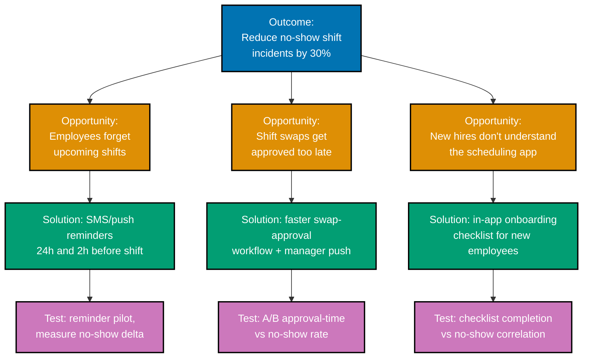

> An opportunity-solution tree for reducing no-show shift incidents -- exercises co-05. Kestrel is
> a fictional product; every quoted number, question, or finding here is an illustrative,
> constructed example, not real data or a real transcript.

_Diagram: one outcome, three opportunities, one solution and one assumption test per opportunity --
every solution traces upward to exactly one opportunity, and every opportunity traces upward to
the stated outcome._
