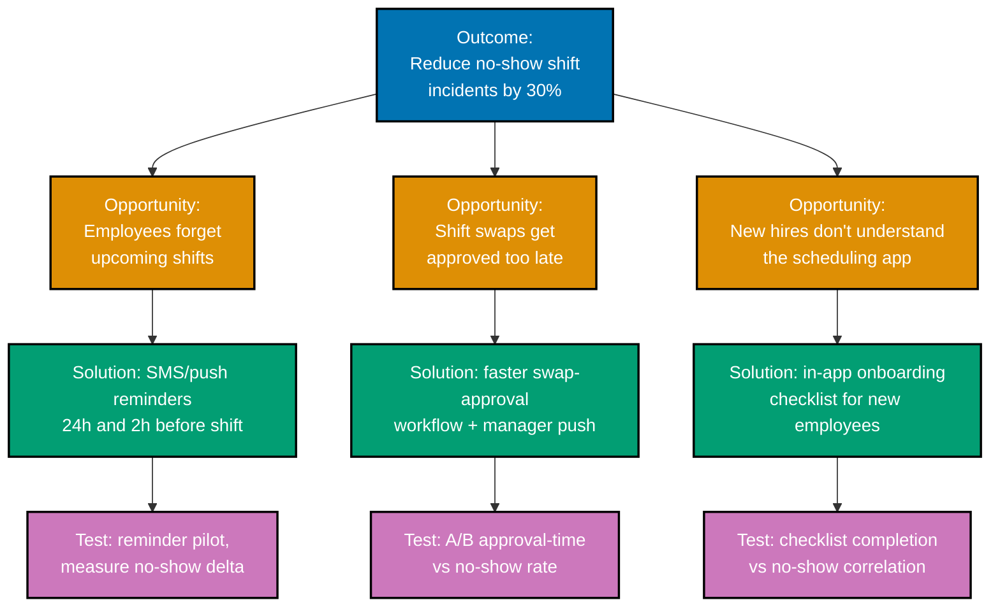

Scenarios 11-22 move from scoring one item at a time to reconciling competing prioritization
signals, sequencing by economic urgency, scoping an MVP around the riskiest assumption, slicing
delivery into signal-bearing increments, and designing trustworthy experiments and flags. All
twelve continue the **Kestrel** narrative from the Beginner scenarios -- every number and quote
below is an illustrative, constructed example written to teach the technique, not real usage data
or a real transcript. Every artifact below also lives, standalone, under `learning/artifacts/`.

---

### Worked Scenario 11: RICE Backlog Ranking

**Context**: Exercises co-07. Kestrel's team RICE-scores six backlog items together (extending
Worked Scenario 6's single score) and ranks the full list before committing next quarter's
capacity.

**Decision artifact**:

| Backlog item                 | Reach (per quarter) | Impact | Confidence | Effort (person-months) | RICE score                 |
| ---------------------------- | ------------------- | ------ | ---------- | ---------------------- | -------------------------- |
| Dark mode                    | 1000                | 0.5    | 1.0        | 1                      | (1000×0.5×1.0)÷1 = **500** |
| Mobile push notifications    | 800                 | 2      | 0.8        | 3                      | (800×2×0.8)÷3 = **426.7**  |
| CSV export                   | 400                 | 1      | 0.8        | 2                      | (400×1×0.8)÷2 = **160**    |
| Team messaging (MVP)         | 600                 | 2      | 0.5        | 4                      | (600×2×0.5)÷4 = **150**    |
| AI auto-schedule suggestions | 300                 | 3      | 0.5        | 6                      | (300×3×0.5)÷6 = **75**     |
| SSO login                    | 150                 | 1      | 0.8        | 2                      | (150×1×0.8)÷2 = **60**     |

> **Ranked order**: dark mode (500) > mobile push (426.7) > CSV export (160) > team messaging
> (150) > AI auto-schedule suggestions (75) > SSO login (60).

**Verify**: every score is recomputable as `(Reach × Impact × Confidence) ÷ Effort` from the
stated factors, and the ranked order follows the computed scores highest-to-lowest exactly --
satisfying co-07's rule.

**Key takeaway**: Dark mode ranks first not because it's the most _strategically_ important item,
but because its huge reach and near-zero effort make it the cheapest large-reach win available --
RICE surfaces that even though intuition might rank the AI feature higher.

**Why It Matters**: SSO ranks dead last by RICE despite unlocking a specific enterprise contract --
this is exactly the tension Worked Scenario 12 resolves next: a low RICE score does not
automatically mean "don't build it," it means "the diffuse-impact math doesn't capture why this
one matters."

---

### Worked Scenario 12: RICE-vs-MoSCoW Reconciliation

**Context**: Exercises co-07, co-08. SSO login is bucketed "Must" in the MoSCoW pass (Worked
Scenario 7) but ranks last of six items by RICE (Worked Scenario 11, score 60). The team writes
the reconciliation before finalizing next quarter's plan.

**Decision artifact**:

> **Reconciliation**: RICE assumes value scales with the number of people affected (Reach ×
> Impact) -- fine for features whose value is genuinely diffuse across the user base. SSO login is
> not that kind of feature: it gates one specific, already-signed enterprise contract worth more
> in annual revenue than the entire rest of this quarter's roadmap combined. Losing that contract
> is a binary, all-or-nothing outcome that RICE's per-user-averaged math cannot represent -- 150
> "reached" users understates a decision that is really "keep or lose one large deal." SSO stays
> "Must," overriding its RICE rank, because the business necessity behind it is contractual and
> gated, not a matter of diffuse user impact.

**Verify**: the reconciliation names the specific reason a business necessity overrides the score
-- a binary, contract-gated outcome that RICE's diffuse-impact averaging structurally cannot
represent -- satisfying the combined co-07/co-08 rule.

**Key takeaway**: RICE and MoSCoW disagreeing is not a bug in either framework -- it's a signal
that this particular item's value doesn't fit RICE's assumption (value scales with reach), and the
reconciliation is where a team writes down _why_, so the override doesn't quietly erode trust in
RICE for every future disagreement.

**Why It Matters**: Without a written reconciliation, the next time RICE and a stakeholder's "this
is a Must" collide, the team has no precedent to point to -- did SSO override its score because
low RICE scores don't matter, or because of a specific, narrow condition (a signed, revenue-gating
contract)? Writing the reason down keeps the override rare and defensible instead of becoming a
loophole every strong opinion routes through.

---

### Worked Scenario 13: Kano Classification

**Context**: Exercises co-10. Kestrel's team classifies six features by Kano category before
deciding which ones deserve continued polish versus a one-time "good enough" bar.

**Decision artifact**:

| Feature                                          | Category    | Presence-vs-satisfaction shape                                                                                               |
| ------------------------------------------------ | ----------- | ---------------------------------------------------------------------------------------------------------------------------- |
| No double-booked shifts (scheduling correctness) | Must-be     | Absence dissatisfies severely (a double-booking is a real operational failure); presence is simply expected, not delightful. |
| App uptime / reliability (no crashes)            | Must-be     | Absence dissatisfies severely; presence is neutral -- nobody praises an app for "not crashing."                              |
| Shift-swap approval turnaround time              | Performance | Linear: faster turnaround steadily increases satisfaction; slower steadily decreases it.                                     |
| Mobile push notifications for shift changes      | Performance | Linear: more reliable, more timely notifications steadily increase satisfaction; missed or late ones steadily decrease it.   |
| AI auto-schedule suggestions                     | Attractive  | Presence delights (an unexpected, helpful surprise); absence causes no dissatisfaction, since it was never expected.         |
| Confetti animation when a schedule publishes     | Attractive  | Presence delights briefly; absence is entirely neutral -- nobody expects or misses it.                                       |

**Verify**: each feature's row cites its specific presence-vs-satisfaction shape (dissatisfies-if-
absent-but-neutral-if-present for must-be; linear for performance; delights-if-present-but-
neutral-if-absent for attractive) as the justification for its bucket -- satisfying co-10's rule.

**Key takeaway**: The two must-be features get a "meet the bar and stop" treatment -- more
investment past reliable, correct scheduling returns almost nothing -- while the two performance
features are worth continued, proportional investment, and the two attractive features are cheap,
high-leverage delight rather than baseline expectations.

**Why It Matters**: Treating a must-be feature (uptime) the same as a performance feature (faster
notifications) would misallocate the team's limited polish budget -- gold-plating reliability
past "reliable" returns little, while that same effort spent on notification latency would have
kept paying off.

---

### Worked Scenario 14: WSJF Sequencing

**Context**: Exercises co-11. Kestrel's team sequences four jobs already agreed to be worth doing
by their economic urgency, using `WSJF = Cost of Delay ÷ Duration`.

**Decision artifact**:

| Job                                   | Cost of Delay (relative points) | Duration (weeks) | WSJF            |
| ------------------------------------- | ------------------------------- | ---------------- | --------------- |
| Fix the double-booking scheduling bug | 40                              | 2                | 40 ÷ 2 = **20** |
| SSO login (enterprise contract)       | 30                              | 3                | 30 ÷ 3 = **10** |
| Dark mode                             | 6                               | 1                | 6 ÷ 1 = **6**   |
| CSV export                            | 8                               | 2                | 8 ÷ 2 = **4**   |

> **Sequence**: fix the double-booking bug (WSJF 20) -> SSO login (WSJF 10) -> dark mode (WSJF 6)
> -> CSV export (WSJF 4).

**Verify**: the stated sequence matches the order produced by dividing each job's Cost of Delay by
its Duration, highest ratio first (20, 10, 6, 4) -- satisfying co-11's rule.

**Key takeaway**: CSV export sequences last here despite being cheap to build (2 weeks) because its
Cost of Delay is low relative to the other three -- WSJF ranks by urgency-per-week-of-commitment,
not by "which is fastest to ship."

**Why It Matters**: Sequencing purely by "shortest job first" would have put dark mode (1 week)
ahead of the double-booking bug fix (2 weeks) -- WSJF corrects for that by weighting duration
against actual economic urgency, keeping the operationally urgent bug fix first even though it
isn't the fastest job on the list.

---

### Worked Scenario 15: Riskiest-Assumption Triage

**Context**: Exercises co-06. Before committing real engineering time to "AI auto-schedule
suggestions," Kestrel's team triages the four big risks to decide which one to test first.

**Decision artifact**:

> - **Value risk**: will managers actually want and trust a suggested schedule enough to act on it?
>   Unconfirmed -- interviews so far (Worked Scenario 4) only established the underlying pain
>   (scheduling takes 40-60 minutes), not demand for an AI-generated answer to it.
> - **Usability risk**: can a manager understand and quickly edit a suggested schedule? Lower
>   uncertainty -- Kestrel already has an editable schedule grid; a suggestion just needs to
>   pre-populate it.
> - **Feasibility risk**: can the team generate a legal, conflict-free, availability-respecting
>   schedule automatically? Real but well-understood -- constraint-solving for shift scheduling is
>   a known, solvable problem.
> - **Business-viability risk**: does this justify its build cost given Kestrel's pricing model?
>   Depends entirely on the answer to the value question above.
>
> **Riskiest, chosen first**: value risk -- it's the most uncertain, and every other risk (and the
> viability question) is downstream of it.
>
> **Cheapest test**: a concierge (Wizard-of-Oz) pilot with 5 managers -- a human manually builds a
> "suggested schedule" each week and presents it as if auto-generated, then tracks how many
> managers actually use it versus rebuild from scratch. Costs a few hours a week for 5 managers, no
> ML engineering required.

**Verify**: the triage names all four risk types (value, usability, feasibility, viability) and
states, with a reason, that value risk is riskiest and names the concierge pilot as its cheapest
test -- satisfying co-06's rule.

**Key takeaway**: The cheapest test of the riskiest assumption here requires zero machine-learning
code -- a human pretending to be the algorithm for five managers answers the value question far
more cheaply than building the real feature and finding out afterward that nobody trusted its
suggestions.

**Why It Matters**: Had the team instead started with feasibility (the risk engineers are usually
most comfortable estimating), they could have spent real sprints building a solid constraint
solver only to discover, after shipping, that managers didn't want an algorithm making this call
for them at all -- testing the riskiest risk first, not the most comfortable one, is what makes
this triage valuable.

---

### Worked Scenario 16: MVP Scope Cut With Engineering Input

**Context**: Exercises co-12, co-06, co-26. Following the concierge pilot's promising signal
(Worked Scenario 15), product proposes a 12-feature "Smart Scheduling Suite" as the real build; an
engineer pushes back on scope before it's committed.

**Decision artifact**:

> **Original 12-feature scope**: full ML-based constraint solver, historical-pattern learning,
> multi-location optimization, staff-preference weighting, real-time re-optimization on
> cancellations, and seven more sub-features.
>
> **MVP, testing the riskiest assumption (co-06's value risk, now at real-usage scale, not a
> 5-manager pilot)**: a single-location, rule-based "suggested schedule" that pre-fills the
> existing editable grid using availability + max-hours constraints only, badged "Suggested" in
> the UI so managers know it's a recommendation they can freely override.
>
> **Engineer's cheaper, ~80%-value alternative**: instead of a full ML pipeline (an estimated 6
> engineering-weeks), build a simple greedy constraint-satisfaction scheduler (an estimated 1
> engineering-week) that respects the same availability and max-hours rules. It won't learn from
> history or optimize across locations, but it captures most of the concierge pilot's demonstrated
> value -- a pre-filled, editable starting point instead of a blank grid -- at roughly a sixth of
> the cost.

**Verify**: the MVP is scoped around testing the riskiest assumption from Worked Scenario 15 (will
managers trust and act on a suggested schedule at real scale) rather than being the smallest
version of the full 12-feature idea, and the engineer's cheaper, feasibility-driven alternative
(greedy scheduler, ~1 week, ~80% of the value) is explicitly named -- satisfying co-12's and
co-26's combined rule.

**Key takeaway**: "Minimum" here means "smallest thing that tests whether managers trust and use a
suggestion at real scale" -- not "smallest slice of the eventual full feature." The greedy
scheduler is a permanent simplification the team may never need to un-simplify, not a temporary
stub standing in for the ML version.

**Why It Matters**: Without the engineer in the scoping conversation, product might have committed
to the full 6-week ML build before confirming the value signal held at real scale -- the
feasibility-aware alternative turns a 6-week bet into a 1-week bet carrying almost the same
learning value, exactly the kind of collaboration co-26 describes.

---

### Worked Scenario 17: Build-Measure-Learn, Pivot or Persevere

**Context**: Exercises co-13. Two weeks after shipping the greedy-scheduler MVP (Worked Scenario
16), the team reviews its results against the original hypothesis.

**Decision artifact**:

> **Hypothesis**: managers will trust and act on an auto-suggested schedule enough to keep it as a
> starting point rather than deleting it and building from scratch.
>
> **Measurement**: 65% of managers who saw a suggested schedule kept it and edited it rather than
> discarding it; when separately asked whether they'd pay extra for the feature as a premium
> add-on, only 20% said yes.
>
> **Decision**: **persevere** on the suggestion mechanism itself -- 65% real usage confirms
> managers do trust and act on it, so it stays and continues to improve. **Pivot** away from the
> premium-add-on pricing model that was originally proposed alongside it -- 20% willingness-to-pay
> is too low to justify gating it behind an upsell; instead, bundle the suggestion feature into
> the existing plan as a retention driver, where its value is capturing managers who'd otherwise
> churn from scheduling friction, not a new revenue line.

**Verify**: the writeup states the original hypothesis, the measurement taken (65% usage, 20%
willingness-to-pay), and states both a persevere decision (keep the mechanism) and a pivot decision
(drop the premium pricing model), each with a stated reason tying the measurement to the decision
-- satisfying co-13's rule.

**Key takeaway**: Pivot and persevere aren't mutually exclusive at the level of a single feature --
this result splits cleanly: persevere on the _mechanism_ (it works), pivot on the _business model_
around it (it doesn't monetize the way it was assumed to).

**Why It Matters**: Treating the low willingness-to-pay number as a reason to kill the whole
feature would have thrown away the mechanism's real, demonstrated value (65% usage); treating the
high usage number as validation of the original pricing plan would have shipped a premium tier
almost nobody would buy. Splitting the decision by hypothesis is what avoids both mistakes.

---

### Worked Scenario 18: Release-Slicing Increments

**Context**: Exercises co-14. Kestrel's "team messaging" feature (last seen scoring 150 in Worked
Scenario 11) gets sliced into thin, end-to-end increments instead of one big-bang release.

**Decision artifact**:

> **Increment 1 -- one-way announcements**: a manager posts a broadcast message ("early close
> Friday") that every team member sees in-app; no replies yet. **Signal**: do managers use it at
> all, and how often?
>
> **Increment 2 -- two-way replies**: employees can reply to an announcement in a basic threaded
> view. **Signal**: do employees actually engage back, or does the channel stay one-way in
> practice?
>
> **Increment 3 -- shift-specific threads**: a message thread attaches directly to a specific
> published shift (e.g., "who can cover this Saturday close?"). **Signal**: does shift-attached
> messaging measurably reduce no-show incidents, tying back to the outcome named in Worked
> Scenario 19.

**Verify**: each of the three increments ships independently useful value on its own (a
one-way broadcast is useful even with no replies; replies are useful even without shift-linking)
and each returns a signal distinct from the other two -- satisfying co-14's rule.

**Key takeaway**: A team could ship only Increment 1 and stop -- it's a complete, standalone
improvement -- which is exactly the property that distinguishes a real increment from an
arbitrarily chopped fragment of one big release.

**Why It Matters**: Had the team instead built all three increments behind one flag and released
them together, a disappointing overall adoption number would leave no way to tell whether the
problem was the broadcast concept itself, the reply mechanism, or the shift-linking -- three
separate signals collapsed into one uninterpretable result.

---

### Worked Scenario 19: Opportunity-Solution Tree

**Context**: Exercises co-05. Kestrel's team maps a desired outcome down through opportunities and
solutions before committing to which one to build first.

**Decision artifact**:

_Diagram: one outcome, three opportunities, one solution and one assumption test per opportunity --
every solution traces upward to exactly one opportunity, and every opportunity traces upward to
the stated outcome._

**Verify**: each of the three solutions (S1, S2, S3) traces upward through exactly one opportunity
(OP1, OP2, OP3) to the stated outcome (O) -- no orphan solution with no opportunity above it --
satisfying co-05's rule.

**Key takeaway**: The tree doesn't pick a winner -- it makes all three competing bets visible side
by side, each with its own cheap assumption test, so the team can decide which opportunity to test
first based on evidence rather than whoever argues loudest in a planning meeting.

**Why It Matters**: Opportunity 3 (S3, the onboarding checklist) directly produces Worked Scenario
20's A/B experiment subject, and Opportunity 2 (S2, faster swap approval) directly feeds Worked
Scenario 27's discovery-vs-delivery call and Worked Scenario 29's Shape Up pitch -- the tree is
what keeps those later, more detailed artifacts traceable back to this one outcome instead of
becoming disconnected side-projects.

---

### Worked Scenario 20: A/B Experiment Design

**Context**: Exercises co-15. Kestrel's team designs an experiment for the onboarding checklist
solution named in Worked Scenario 19 (Opportunity 3).

**Decision artifact**:

> **Hypothesis**: adding a 3-step onboarding checklist during signup increases the share of new
> teams that publish their first schedule within 3 days (the activation metric, Worked Scenario
> 25), without hurting signup completion.
>
> **Primary metric (OEC)**: % of new signups that publish a first complete schedule within 3 days.
>
> **Guardrail**: signup completion rate (the % of people who start the signup form and finish it)
> must not drop by more than 2 percentage points -- a checklist that adds enough friction to scare
> people off during signup itself would be a worse outcome than the activation problem it's meant
> to fix.

**Verify**: the design names exactly one hypothesis, exactly one primary (OEC) metric (3-day
activation rate), and one guardrail metric distinct from the primary (signup completion rate) --
satisfying co-15's rule.

**Key takeaway**: The guardrail exists precisely because the checklist could plausibly _help_ the
primary metric while _hurting_ something the primary metric doesn't measure at all -- signup
completion needs its own explicit floor, not an assumption that it'll be fine.

**Why It Matters**: Without a named guardrail, a version of the checklist that pushed signup
completion down 8 percentage points while nudging 3-day activation up slightly could ship as a
"win" on the primary metric alone -- the guardrail is what catches that trade before it reaches
production.

---

### Worked Scenario 21: Guardrail Metric Selection

**Context**: Exercises co-15. Kestrel's team speeds up its own plan-upgrade checkout flow (5 steps
down to 3) and needs guardrails distinct from the primary conversion metric.

**Decision artifact**:

> **Primary metric (OEC)**: checkout completion rate (% of teams that start the upgrade flow and
> finish it).
>
> **Guardrail 1 -- payment-failure rate**: must not increase. A faster flow that rushes people past
> the payment-details step could increase mistyped card numbers or expiry dates, a cost the
> primary conversion metric alone wouldn't reveal (a failed payment still counts as "started
> checkout").
>
> **Guardrail 2 -- 48-hour refund-request rate**: must not increase. A too-frictionless checkout
> risks buyer's-remorse upgrades -- a team that upgraded almost accidentally, without fully
> registering the commitment, showing up a day or two later asking to downgrade.

**Verify**: each guardrail (payment-failure rate, 48-hour refund-request rate) is a must-not-
regress metric distinct from the primary conversion metric, and each names the specific harm it
catches that the primary metric alone would miss -- satisfying co-15's rule.

**Key takeaway**: Both guardrails target a failure mode a faster checkout specifically risks
_causing_ -- they aren't generic "make sure nothing breaks" metrics, they're chosen because
speeding up this particular flow plausibly trades against exactly these two things.

**Why It Matters**: A checkout redesign that only tracked completion rate could ship a version
that converts more teams to paid in the short term while quietly increasing refund requests a few
days later -- by the time that shows up in churn numbers, the team has already declared the
experiment a win and moved on.

---

### Worked Scenario 22: Feature-Flag Toggle Classification

**Context**: Exercises co-16. Kestrel's engineering team classifies five active feature flags
before a flag-debt cleanup pass.

**Decision artifact**:

| Flag                            | Category   | Expected lifespan                                                                                                                            |
| ------------------------------- | ---------- | -------------------------------------------------------------------------------------------------------------------------------------------- |
| `new_scheduling_ui`             | Release    | Short-lived -- removed once the new UI reaches 100% rollout with no rollback need.                                                           |
| `ai_suggestions_ab_test`        | Experiment | Short-lived -- removed once Worked Scenario 20's experiment concludes and a winner ships.                                                    |
| `disable_sms_provider_failover` | Ops        | Long-lived -- a permanent operational kill switch for the on-call team, never scheduled for removal.                                         |
| `enterprise_sso_enabled`        | Permission | Long-lived -- per-customer entitlement tied to the contract from Worked Scenario 12, active for as long as that customer's plan requires it. |
| `beta_team_messaging`           | Release    | Medium-lived -- removed once Worked Scenario 18's increments all reach general availability.                                                 |

**Verify**: each classification names one of the four categories (release, experiment, ops,
permission) and states the expected lifespan that category implies -- satisfying co-16's rule.

**Key takeaway**: `disable_sms_provider_failover` and `enterprise_sso_enabled` are correctly
long-lived by design -- the cleanup pass isn't "delete every old flag," it's "confirm every flag's
actual category matches its actual lifespan," and only the release/experiment flags are candidates
for removal once their rollout or experiment concludes.

**Why It Matters**: Without this classification, an engineer doing a routine cleanup could
mistakenly delete `disable_sms_provider_failover` because it "looks old" -- removing an ops kill
switch is exactly the kind of mistake this taxonomy exists to prevent, because its long lifespan is
correct, not an oversight.

---

← Previous: [Beginner Scenarios](./beginner.md) · Next: [Advanced Scenarios](./advanced.md) →
