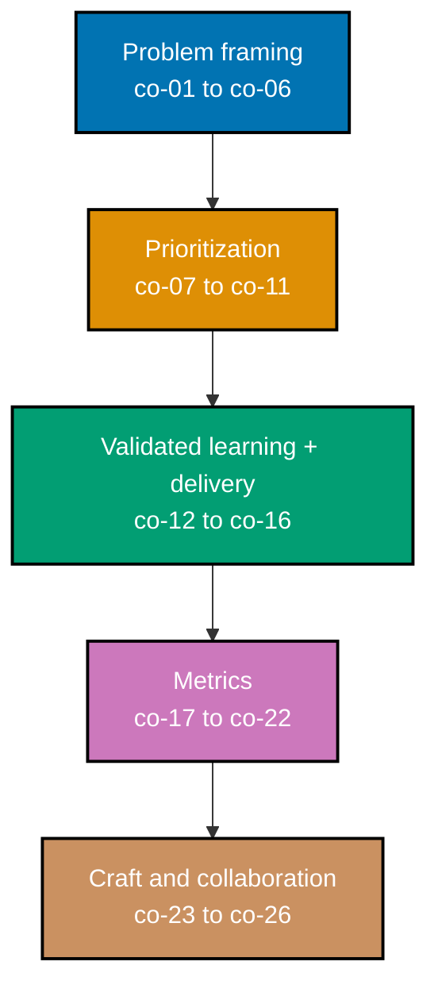

This topic is a **leadership no-code sub-mode** (`‡`) Annotated-concept topic: zero code, zero
runnable files. Every worked scenario produces a **product decision artifact** -- a rewritten
outcome statement, a scored backlog, an opportunity-solution tree, an experiment design, a
one-page PR-FAQ -- the kind of document a real product trio (engineering, design, product) could
act on directly, without a follow-up meeting to explain what it means. Most scenarios follow one
running, entirely fictional example product, **Kestrel**, a shift-scheduling SaaS for small
retail and restaurant teams, so the same backlog, metrics, and decisions keep compounding into one
internally consistent picture instead of thirty disconnected snippets. Every quote, interview
answer, and "customer said" line attributed to a Kestrel manager or employee in this topic is an
**illustrative, constructed example** written to teach a technique -- never a claim of a real
interview, a real company, or a real transcript.

## Prerequisites

- **Prior topics**: no code prerequisites, but this topic assumes the reader has **built working
  software** across Pass 1 -- [topic 11 Backend Essentials](/en/c/learn/fundamentally-strong/software-engineer/backend-essentials),
  [topic 14 Frontend Essentials](/en/c/learn/fundamentally-strong/software-engineer/frontend-essentials),
  and [topic 15 Software Testing](/en/c/learn/fundamentally-strong/software-engineer/software-testing)
  -- so the trade-offs in this topic land against real building experience, not abstract theory.
  This topic also pairs with [topic 9 Project Management](/en/c/learn/fundamentally-strong/software-engineer/project-management),
  which covers how already-validated work gets scoped and tracked; this topic covers how a team
  decides which work is worth scoping and tracking in the first place.
- **Tools & environment**: a macOS/Linux terminal and a Markdown editor for the written artifacts;
  no runtime or toolchain to install -- every deliverable in this topic is a decision document, not
  a program.
- **Assumed knowledge**: what it takes to ship a small feature end to end, and the ability to read
  a simple metric or funnel.

## Why this exists -- the big idea

Engineers optimize _building the thing right_ and can ship a flawless product nobody needs -- the
most expensive waste in software is a well-built wrong thing. The one idea worth keeping if you
forget everything else: **start from the user's problem and the outcome, not the feature.**
Output is what a team ships; outcome is the change in user behavior that shipping causes, and the
two are easy to confuse, because output is visible on a roadmap and outcome only shows up in data
a team has to go looking for.

**Cross-cutting big ideas**: `correctness-vs-pragmatism` -- an MVP and an A/B experiment are
deliberately incomplete-but-validated bets, not finished products; the discipline is choosing the
cheapest test that resolves the riskiest open question, not building the most complete answer
before anyone has confirmed the question is worth answering (co-06, co-12). `mechanism-vs-policy`
-- product decides _what_ to build and why; engineering is the mechanism that builds it, and the
strongest products come from engineers shaping that "what" alongside product and design, not
executing it as a handed-down spec (co-26).

## When NOT to reach for this

- **Discovery vs delivery**: too much research and a team analysis-paralyzes; too little and it
  builds confidently in the wrong direction. The bet is always made under uncertainty -- validate
  the _riskiest_ assumption most cheaply, then commit, rather than researching everything or
  nothing (co-06, co-24).
- **MVP vs credibility**: an MVP too thin damages trust and mis-measures demand -- users reject the
  rough execution, not the underlying idea; too fat, and the learning budget is spent before the
  first signal arrives. "Minimum" describes the _hypothesis under test_, never the smallest
  possible amount of code (co-12).
- **Metrics vs judgment**: a north-star metric focuses a team, but any single metric is gameable --
  engagement is not value, and a locally optimized funnel stage can quietly degrade the whole
  product. Quantitative signal informs product judgment; it never replaces it (co-21, co-22).

## Why these mechanisms -- lineage

Product engineering rose as a reaction to two failures: waterfall's build-the-full-spec-then-
discover-it's-wrong pattern (1970s-90s), and feature-factory Agile that shipped output velocity
while ignoring outcomes. Eric Ries's _Lean Startup_ (2011) reframed the unit of progress as
_validated learning_; Clayton Christensen's Jobs-to-be-Done reframed features as things customers
_hire_ a product to do; Teresa Torres's continuous discovery wove research into delivery instead
of front-loading it into a single upfront phase. The durable idea underneath the framework churn
is singular: _reduce the cost of being wrong._ That is why this topic pairs with
[topic 9 Project Management](/en/c/learn/fundamentally-strong/software-engineer/project-management)
(which delivers the validated thing) and matures into the strategic altitude of
[topic 33 Engineering Management](/en/c/learn/fundamentally-strong/software-engineer/engineering-management).

## How verification works in this topic

This topic has no interpreter to run: a problem statement, a RICE score, and an opportunity-
solution tree are not executable, so there is no command that confirms one is "correct" the way a
test suite confirms a function's return value. Verification here means checking an **observable
property of the written artifact itself** against a stated rule -- something you can point at on
the page, not a vague description of what a "good" decision should feel like. A few concrete
examples that recur throughout this topic:

- An **outcome statement** is verifiable: does it name a change in user _behavior_, or does it
  quietly still name a _feature_? Read the sentence, check.
- A **RICE score** is verifiable: does the arithmetic actually equal `(Reach × Impact ×
Confidence) ÷ Effort`, with every factor's unit stated? Recompute it, check.
- An **A/B experiment design** is verifiable: does it name exactly one hypothesis, exactly one
  primary metric, and at least one guardrail? Count them, check.

Every concept below and every worked scenario that follows states its own **Verify it** / **Verify**
rule in exactly this observable-property form -- read the artifact, check the stated property,
done.

_Diagram: the five concept clusters this topic teaches, in reading order -- from framing the right
problem, through prioritizing a backlog, through the validated-learning loop that ships and tests
it, through the metrics that tell a team whether it worked, to the craft and collaboration
judgment that cuts across every mechanism above it._

## Concepts

Every worked scenario in this topic's follow-up pages cites the `co-NN` concept it exercises --
this section is the 1:1 reference those citations point back to. Read it in order: each cluster
builds on the one before it, from "what problem is worth solving" through to "how does an
engineer's feasibility knowledge change what gets built."

### co-01 · Outcome vs Output

Output is what a team ships -- a feature, a release, a line on a changelog. Outcome is the change
in user _behavior_ that shipping causes. A team can maximize output (ship constantly) while
producing zero outcome (nothing users do actually changes), and the two are easy to confuse
because output is visible on a roadmap the moment it ships, while outcome only shows up later, in
data a team has to go looking for.

**Why it matters**: a roadmap full of shipped features says nothing about whether the business or
the user is better off -- "we shipped 12 things this quarter" is an output claim; "12% more users
completed the task they came to do" is an outcome claim, and only the second one justifies the
work.

**Verify it**: a statement is outcome-framed if it names a change in what a user _does_, not a
thing a team _built_ -- read the sentence and check whether removing every feature noun still
leaves a testable behavior claim standing.

### co-02 · Problem Before Solution

A well-formed problem statement names the user, the circumstance they're in, and the desired
outcome -- and deliberately withholds the solution, so the space of possible answers stays open
for the team that reads it, not just the person who wrote it.

**Why it matters**: a request that arrives pre-solved ("add an export button") smuggles in one
specific answer before anyone has confirmed the underlying problem, foreclosing every other
(possibly cheaper, possibly better) way to solve it.

**Verify it**: a problem statement is well-formed if it names the user, the circumstance, and the
desired outcome, and a reader cannot find a specific solution hiding inside the wording.

### co-03 · Jobs to Be Done

Customers "hire" a product to make progress against a job that arises in a specific circumstance
(Christensen, _HBR_ 2005 and 2016) -- the unit of analysis is the job and the circumstance, not
the customer's demographic profile. This is distinct from Ulwick's earlier, more quantitative
Outcome-Driven Innovation; related, but not the same technique.

**Why it matters**: two managers with identical job titles can hire the same feature for entirely
different jobs (one to look organized to their boss, one to actually avoid double-booking a
shift) -- demographic segmentation misses this, and circumstance-based JTBD catches it.

**Verify it**: a job story is well-formed if it names the circumstance ("when `___`"), the
motivation ("I want to `___`"), and the expected progress ("so I can `___`") -- all three, not just
one.

### co-04 · Customer Discovery Interviewing

The Mom Test (Fitzpatrick, 2013): ask about a person's real _past behavior_ and specifics, never
pitch the idea and never ask them to predict what they'd do -- because people are kind, and kind
people lie about hypothetical futures to spare a founder's feelings.

**Why it matters**: "would you use a feature that does X?" almost always gets a polite "yes" --
that "yes" predicts nothing, because it costs the person answering nothing to say it.

**Verify it**: an interview question passes the Mom Test if it asks about something the person
already did, with specifics (when, how often, what happened) -- not an opinion, a hypothetical, or
a prediction about the future.

### co-05 · Continuous Discovery / Opportunity-Solution Tree

Discovery is a habit, not a phase (Torres, 2021). An opportunity-solution tree maps a desired
outcome, down through the opportunities (unmet needs, pain points) that could move it, down to the
solutions that address each opportunity, down to the assumption tests that validate each solution
-- so every feature traces back to a validated need instead of a guess.

**Why it matters**: without the tree, a backlog is a flat list of solutions with no visible link
back to the outcome they're supposed to move -- two competing solutions can't be compared, because
nothing shows which opportunity, if any, either one actually addresses.

**Verify it**: an opportunity-solution tree is well-formed if every solution traces upward through
exactly one opportunity to the stated outcome -- no orphan solution with no opportunity above it.

### co-06 · Riskiest Assumption and the Four Big Risks

Every product bet carries value risk (will anyone want this), usability risk (can people figure
out how to use it), feasibility risk (can the team actually build it), and business-viability risk
(does it work for the business) -- Marty Cagan's framing (SVPG / _Inspired_). The discipline is
testing the _riskiest_ of the four most cheaply before committing, not researching everything or
nothing.

**Why it matters**: a team that always tests feasibility first (because that's the risk engineers
are most comfortable estimating) can spend months building something technically sound that nobody
wanted -- the cheapest, highest-leverage test targets whichever risk is actually most uncertain,
which shifts from bet to bet.

**Verify it**: a risk triage is well-formed if it names all four risk types for the bet at hand and
states, with a reason, which one is riskiest and what the cheapest test of it would be.

### co-07 · RICE Prioritization

RICE scores a backlog item as `(Reach × Impact × Confidence) ÷ Effort` (Sean McBride, Intercom,
2018). Reach is a count of users or events in a stated time window; Impact uses a discrete scale
(this topic uses Intercom's: 3 = massive, 2 = high, 1 = medium, 0.5 = low, 0.25 = minimal);
Confidence is a percentage; Effort is in person-months. Naming every factor's unit is what makes
the estimate -- and its uncertainty -- explicit and comparable across a backlog.

**Why it matters**: "this feels important" is not comparable across ten different backlog items
written by ten different people; a RICE score, computed the same way every time, is.

**Verify it**: a RICE score is well-formed if the arithmetic equals `(Reach × Impact × Confidence)
÷ Effort` exactly, and every factor's unit is stated alongside its number.

### co-08 · MoSCoW Prioritization

MoSCoW buckets requirements into Must / Should / Could / Won't-this-time (Dai Clegg, Oracle UK,
~1994, donated to the DSDM Consortium). "Won't" is scoped to the _current_ timebox -- it means
"not this release," not "rejected forever."

**Why it matters**: a "Won't" item silently reinterpreted as "never" quietly kills ideas that were
only ever meant to be deferred, and a team that treats every "Must" as equally load-bearing loses
the ability to say no to any of them when the timebox gets tight.

**Verify it**: a MoSCoW bucketing is well-formed if every "Won't" item is explicitly scoped to the
current release, not stated or implied as a permanent rejection.

### co-09 · Impact-Effort Matrix

A generic 2x2 of impact against effort surfaces quick wins (high-impact, low-effort) from
time-sinks (low-impact, high-effort) at a glance. It is a fast, folk tool with no single named
inventor -- useful for a quick first pass, not a substitute for a scored method like RICE when the
stakes are higher.

**Why it matters**: a backlog of forty items is too many to RICE-score by hand in a planning
meeting -- the 2x2 gives a team a five-minute first cut before spending real scoring effort on the
items that survive it.

**Verify it**: an impact-effort placement is well-formed if the initiatives named as "quick wins"
sit specifically in the high-impact, low-effort quadrant -- not merely somewhere on the chart.

### co-10 · Kano Model

Features relate to satisfaction non-linearly (Kano et al., 1984): **must-be** features dissatisfy
if absent but are merely neutral if present (a working login); **performance** features satisfy
linearly -- more is better, less is worse (faster response time); **attractive** features delight
if present but don't dissatisfy if absent (an unexpected nicety). This topic teaches these three as
the practically load-bearing categories; "indifferent" and "reverse" are recognized secondary
categories documented in the wider Kano literature.

**Why it matters**: treating every feature as equally "make it better" wastes effort -- a must-be
feature past its threshold returns almost nothing extra, while the same hour spent on an
attractive feature can meaningfully move satisfaction.

**Verify it**: a Kano classification is well-formed if it names, for each feature, the specific
presence-vs-satisfaction shape (dissatisfies-if-absent, linear, or delights-if-present) that
justifies its bucket.

### co-11 · Cost of Delay and WSJF

Weighted Shortest Job First sequences work by economic urgency: `WSJF = Cost of Delay ÷ Duration`
(Reinertsen's CD3, _Principles of Product Development Flow_, 2009). A short, high-urgency job
ranks ahead of a long, low-urgency one, even if the long job has a bigger absolute payoff --
because WSJF ranks by value delivered _per unit of time the team is committed to it_, not by
value alone.

**Why it matters**: ranking purely by "biggest payoff first" starves short, urgent jobs of
attention while a long project ties up the team -- WSJF corrects for that by dividing out the time
cost.

**Verify it**: a WSJF sequencing is well-formed if the stated job order matches the order produced
by dividing each job's relative Cost of Delay by its relative duration, highest ratio first.

### co-12 · MVP as a Hypothesis Test

An MVP is the fastest path through Build-Measure-Learn for one chosen hypothesis (Ries, 2011) --
not the smallest shippable product. "Minimum" qualifies the _learning bet_ under test, which may
even be a non-shippable artifact (a concierge service, a landing page with a waitlist) rather than
real, working code.

**Why it matters**: "smallest shippable product" and "cheapest way to test this specific
hypothesis" are frequently two different builds -- a landing page can validate demand for a
feature that would take a quarter to actually ship, at a fraction of the cost.

**Verify it**: an MVP is well-formed if it names the specific hypothesis it tests and the smallest
artifact -- shippable or not -- that tests it, not merely the smallest version of the final
product.

### co-13 · Build-Measure-Learn / Pivot or Persevere

The core Lean Startup loop turns a hypothesis into a measurement and a decision to _pivot_ (change
direction) or _persevere_ (double down), with **validated learning** -- not features shipped -- as
the unit of progress.

**Why it matters**: a team that measures without ever deciding pivot-or-persevere has turned
Build-Measure-Learn into Build-Measure-Shrug -- the loop only produces value once the measurement
actually changes what the team does next.

**Verify it**: a Build-Measure-Learn writeup is well-formed if it states the original hypothesis,
the measurement taken, and which of pivot or persevere follows, with a stated reason tying the
measurement to the decision.

### co-14 · Iterative, Incremental Delivery

Value ships in thin, end-to-end slices that each stand alone and return a distinct signal, rather
than one big-bang release at the end -- so learning and risk spread across the whole timeline
instead of concentrating at a single release date.

**Why it matters**: a big-bang release defers every signal (does anyone want this, does it work in
production, does it move the metric) to one date -- if that date reveals a wrong assumption, the
entire budget behind it is already spent.

**Verify it**: a release plan is well-formed if every named slice ships independently useful value
on its own and returns a signal distinct from every other slice's signal.

### co-15 · A/B Experimentation: Hypothesis and Guardrail

A trustworthy online experiment names a hypothesis, a single primary metric (the Overall Evaluation
Criterion, or OEC), and guardrail metrics that must not regress (Kohavi, Tang & Xu, _Trustworthy
Online Controlled Experiments_, 2020). Exactly one OEC keeps the experiment's success criterion
unambiguous; guardrails catch damage the OEC alone wouldn't reveal.

**Why it matters**: an experiment with three "primary" metrics has no real decision rule -- when
two of them move in opposite directions, nobody agreed in advance which one wins.

**Verify it**: an experiment design is well-formed if it names exactly one hypothesis, exactly one
primary (OEC) metric, and at least one guardrail metric distinct from the primary.

### co-16 · Feature-Flag Toggle Taxonomy

Release, experiment, ops, and permission toggles (Pete Hodgson, published on martinfowler.com, 2016) have different expected lifespans and owners. Conflating them creates flag debt -- a toggle
meant to live for two weeks that's still in the codebase, unowned, a year later.

**Why it matters**: a release toggle left in "just in case" long after full rollout is a dead
branch nobody remembers to delete; an ops toggle deleted too early removes a kill switch a team
may urgently need during an incident. Each category needs a different removal discipline.

**Verify it**: a flag classification is well-formed if it names, for each flag, which of the four
categories it belongs to and the expected lifespan that category implies.

### co-17 · North-Star and Input Metrics

A north-star metric is one durable metric that captures delivered value (popularized by Sean
Ellis; systematized as the North Star Framework by Amplitude's John Cutler), decomposed into a
handful of input metrics a team can actually move week to week. It is distinct from an **OMTM**
(One Metric That Matters -- Croll & Yoskovitz, _Lean Analytics_, 2013), which is a _stage-specific_
metric that rotates as the team's current focus changes; the north-star does not rotate.

**Why it matters**: a north-star with no input metrics is just a scoreboard nobody can move
directly -- the input metrics are what turn "we want this number to go up" into "here is the lever
a team actually pulls this sprint."

**Verify it**: a north-star setup is well-formed if the chosen metric measures delivered value
(not a vanity count) and every input metric is a lever the team directly controls.

### co-18 · AARRR Funnel

The customer lifecycle as Acquisition, Activation, Retention, Referral, Revenue (Dave McClure,
"Startup Metrics for Pirates," 2007) is a shared vocabulary for locating exactly where a product
leaks users -- a low signup rate is an acquisition problem; a high signup rate but low first-value
rate is an activation problem, and the fix for each is entirely different.

**Why it matters**: "growth is slow" is not actionable on its own -- naming which specific stage
is leaking tells a team which part of the product to actually go fix.

**Verify it**: an AARRR funnel map is well-formed if every one of the five stages names at least
one concrete, observable event, in the correct lifecycle order.

### co-19 · HEART Framework

Google's HEART framework (Rodden, Hutchinson & Fu, ACM CHI 2010) covers Happiness, Engagement,
Adoption, Retention, and Task-success, mapped through **Goals -> Signals -> Metrics** so a chosen
metric always traces back to a stated product goal, instead of being picked because it was easy to
chart.

**Why it matters**: a metric with no goal behind it invites Goodharting (co-22) the first time it's
inconvenient -- the Goals -> Signals -> Metrics chain is what lets a team check whether a metric
still represents the goal it was chosen to represent.

**Verify it**: a HEART row is well-formed if its goal, signal, and metric are all present and
mutually consistent -- the metric plausibly measures the signal, and the signal plausibly
indicates progress on the goal.

### co-20 · Activation and Retention

Activation is a user's first genuine value moment; retention is repeat value delivered over time.
These are the funnel's hardest and highest-leverage stages, and each needs an explicit, testable
definition -- "activated" cannot mean merely "created an account."

**Why it matters**: a vague activation definition ("logged in once") inflates the metric without
telling a team anything about whether the product actually delivered value -- a precise definition
("published a complete first schedule within 3 days") is falsifiable and therefore useful.

**Verify it**: an activation or retention definition is well-formed if it names the first genuine
value moment (not merely account creation or login) and states how it's measured.

### co-21 · Vanity vs Actionable Metrics

An actionable metric ties a specific change to a resulting effect against a stated hypothesis; a
vanity metric (a raw cumulative total) looks good on a slide but drives no decision (Ries, 2009).

**Why it matters**: "total signups" only ever goes up -- it cannot fall even when the product is
actively failing new users, which means it can never be the signal that tells a team something is
wrong.

**Verify it**: a metric is actionable if a stated change in its value would trigger a specific,
named decision -- a metric where no plausible change would change what the team does is vanity.

### co-22 · Goodhart's Law / Metric Gaming

"When a measure becomes a target, it ceases to be a good measure" (Marilyn Strathern's 1997
phrasing of Charles Goodhart's 1975 observation). Optimizing directly for a proxy metric degrades
the underlying thing that metric was ever meant to represent, so every target metric needs a
guardrail and ongoing judgment, not blind optimization.

**Why it matters**: a team rewarded purely for "shifts created" will find a way to create more
shifts, whether or not that action produces any real scheduling value -- the metric moves, the
outcome it was supposed to represent does not.

**Verify it**: a Goodhart diagnosis is well-formed if it names the specific gaming path (how the
metric can move without the underlying outcome moving) and a concrete countermeasure -- a
guardrail metric or a redefinition that closes that path.

### co-23 · Writing Specs and PR-FAQ

A good spec states the customer problem and the expected outcome _before_ the build. Amazon's
"working backwards" PR-FAQ (documented in Bryar & Carr, _Working Backwards_, 2021) writes the
press release and the FAQ _first_, forcing clarity on customer value before a single line of the
actual feature is built.

**Why it matters**: writing the press release first exposes a weak or unclear value proposition
immediately -- it is far cheaper to discover "we can't actually write a compelling announcement
for this" before the build than after it.

**Verify it**: a PR-FAQ is well-formed if the press release states the customer's problem (not
just the feature) and the FAQ section answers the reader's most likely objections or risks, not
just easy questions.

### co-24 · Dual-Track Discovery and Delivery

Discovery and delivery run as parallel, continuous activities inside one cross-functional team,
not a waterfall hand-off between a "discovery team" and a "delivery team" (Cagan, SVPG). The team
validates what to build next while it builds what was already validated -- both happening at once,
by the same people.

**Why it matters**: splitting discovery and delivery into two separate teams turns the delivery
team into order-takers executing someone else's decisions, and turns the discovery team into a
group whose learning nobody who has to build it was present to absorb.

**Verify it**: a team's working model is well-formed if the same cross-functional group performs
both discovery and delivery continuously, rather than one group handing pre-decided requirements
to another.

### co-25 · Shaping and Appetite

Shape Up (Ryan Singer, Basecamp, 2019) fixes an **appetite** -- a time budget -- and shapes a
problem to fit inside it, bets the cycle at a betting table, and uses a **circuit-breaker** so
unfinished work stops on schedule rather than silently overrunning into the next cycle.

**Why it matters**: an open-ended "how long will this take" question invites scope to expand to
fill whatever time is offered; fixing the appetite first and shaping the problem to fit it inverts
that -- time is fixed, scope flexes.

**Verify it**: a Shape Up pitch is well-formed if it states a fixed appetite (not an estimate) and
names a circuit-breaker: what happens if the work isn't done when the appetite runs out.

### co-26 · Engineer/Product/Design Collaboration

Engineers are not order-takers: their feasibility knowledge surfaces cheaper alternatives and
hidden constraints early, and the strongest products come from the full trio -- product,
engineering, design -- deciding together, not from product deciding and engineering executing.

**Why it matters**: a feasibility-aware alternative proposed during scoping (co-16's example: an
80%-value rule-based scheduler instead of a full ML pipeline) can turn a six-week bet into a
one-week bet with almost the same learning value -- but only if engineering is in the room while
the scope is still being decided, not after.

**Verify it**: a scoping decision is well-formed if it names a concrete point where an engineer's
feasibility input changed the shape of what was built, not merely how long it took to build the
pre-decided shape.

## Scenarios by Level

Thirty worked scenarios, grouped Beginner / Intermediate / Advanced, each producing a product
decision artifact and citing the `co-NN` it exercises. Most scenarios follow **Kestrel**, a
fictional shift-scheduling SaaS for small retail and restaurant teams, so the same backlog,
metrics, and decisions keep compounding into a larger, internally consistent picture, the same way
a real product team's decisions build on each other. Every artifact below also lives, standalone,
under `learning/artifacts/`.

### Beginner (Scenarios 1-10)

- [Worked Scenario 1: Outcome-vs-Output Rewrite](/en/c/learn/fundamentally-strong/software-engineer/software-product-engineering/learning/beginner#worked-scenario-1-outcome-vs-output-rewrite)
- [Worked Scenario 2: Problem Statement From a Request](/en/c/learn/fundamentally-strong/software-engineer/software-product-engineering/learning/beginner#worked-scenario-2-problem-statement-from-a-request)
- [Worked Scenario 3: JTBD Job Story](/en/c/learn/fundamentally-strong/software-engineer/software-product-engineering/learning/beginner#worked-scenario-3-jtbd-job-story)
- [Worked Scenario 4: Mom Test Interview Script](/en/c/learn/fundamentally-strong/software-engineer/software-product-engineering/learning/beginner#worked-scenario-4-mom-test-interview-script)
- [Worked Scenario 5: Mom Test Red-Flag Audit](/en/c/learn/fundamentally-strong/software-engineer/software-product-engineering/learning/beginner#worked-scenario-5-mom-test-red-flag-audit)
- [Worked Scenario 6: RICE Score for a Single Feature](/en/c/learn/fundamentally-strong/software-engineer/software-product-engineering/learning/beginner#worked-scenario-6-rice-score-for-a-single-feature)
- [Worked Scenario 7: MoSCoW Bucketing](/en/c/learn/fundamentally-strong/software-engineer/software-product-engineering/learning/beginner#worked-scenario-7-moscow-bucketing)
- [Worked Scenario 8: Impact-Effort Quadrant](/en/c/learn/fundamentally-strong/software-engineer/software-product-engineering/learning/beginner#worked-scenario-8-impact-effort-quadrant)
- [Worked Scenario 9: AARRR Funnel Map](/en/c/learn/fundamentally-strong/software-engineer/software-product-engineering/learning/beginner#worked-scenario-9-aarrr-funnel-map)
- [Worked Scenario 10: Vanity Metric Audit](/en/c/learn/fundamentally-strong/software-engineer/software-product-engineering/learning/beginner#worked-scenario-10-vanity-metric-audit)

### Intermediate (Scenarios 11-22)

- [Worked Scenario 11: RICE Backlog Ranking](/en/c/learn/fundamentally-strong/software-engineer/software-product-engineering/learning/intermediate#worked-scenario-11-rice-backlog-ranking)
- [Worked Scenario 12: RICE-vs-MoSCoW Reconciliation](/en/c/learn/fundamentally-strong/software-engineer/software-product-engineering/learning/intermediate#worked-scenario-12-rice-vs-moscow-reconciliation)
- [Worked Scenario 13: Kano Classification](/en/c/learn/fundamentally-strong/software-engineer/software-product-engineering/learning/intermediate#worked-scenario-13-kano-classification)
- [Worked Scenario 14: WSJF Sequencing](/en/c/learn/fundamentally-strong/software-engineer/software-product-engineering/learning/intermediate#worked-scenario-14-wsjf-sequencing)
- [Worked Scenario 15: Riskiest-Assumption Triage](/en/c/learn/fundamentally-strong/software-engineer/software-product-engineering/learning/intermediate#worked-scenario-15-riskiest-assumption-triage)
- [Worked Scenario 16: MVP Scope Cut With Engineering Input](/en/c/learn/fundamentally-strong/software-engineer/software-product-engineering/learning/intermediate#worked-scenario-16-mvp-scope-cut-with-engineering-input)
- [Worked Scenario 17: Build-Measure-Learn, Pivot or Persevere](/en/c/learn/fundamentally-strong/software-engineer/software-product-engineering/learning/intermediate#worked-scenario-17-build-measure-learn-pivot-or-persevere)
- [Worked Scenario 18: Release-Slicing Increments](/en/c/learn/fundamentally-strong/software-engineer/software-product-engineering/learning/intermediate#worked-scenario-18-release-slicing-increments)
- [Worked Scenario 19: Opportunity-Solution Tree](/en/c/learn/fundamentally-strong/software-engineer/software-product-engineering/learning/intermediate#worked-scenario-19-opportunity-solution-tree)
- [Worked Scenario 20: A/B Experiment Design](/en/c/learn/fundamentally-strong/software-engineer/software-product-engineering/learning/intermediate#worked-scenario-20-ab-experiment-design)
- [Worked Scenario 21: Guardrail Metric Selection](/en/c/learn/fundamentally-strong/software-engineer/software-product-engineering/learning/intermediate#worked-scenario-21-guardrail-metric-selection)
- [Worked Scenario 22: Feature-Flag Toggle Classification](/en/c/learn/fundamentally-strong/software-engineer/software-product-engineering/learning/intermediate#worked-scenario-22-feature-flag-toggle-classification)

### Advanced (Scenarios 23-30)

- [Worked Scenario 23: North-Star and Input Metrics](/en/c/learn/fundamentally-strong/software-engineer/software-product-engineering/learning/advanced#worked-scenario-23-north-star-and-input-metrics)
- [Worked Scenario 24: HEART Goals-Signals-Metrics](/en/c/learn/fundamentally-strong/software-engineer/software-product-engineering/learning/advanced#worked-scenario-24-heart-goals-signals-metrics)
- [Worked Scenario 25: Activation Metric Definition](/en/c/learn/fundamentally-strong/software-engineer/software-product-engineering/learning/advanced#worked-scenario-25-activation-metric-definition)
- [Worked Scenario 26: Goodhart Guardrail Memo](/en/c/learn/fundamentally-strong/software-engineer/software-product-engineering/learning/advanced#worked-scenario-26-goodhart-guardrail-memo)
- [Worked Scenario 27: Discovery-vs-Delivery Balance](/en/c/learn/fundamentally-strong/software-engineer/software-product-engineering/learning/advanced#worked-scenario-27-discovery-vs-delivery-balance)
- [Worked Scenario 28: PR-FAQ, Working Backwards](/en/c/learn/fundamentally-strong/software-engineer/software-product-engineering/learning/advanced#worked-scenario-28-pr-faq-working-backwards)
- [Worked Scenario 29: Shape Up Pitch](/en/c/learn/fundamentally-strong/software-engineer/software-product-engineering/learning/advanced#worked-scenario-29-shape-up-pitch)
- [Worked Scenario 30: Full Product Brief Consistency](/en/c/learn/fundamentally-strong/software-engineer/software-product-engineering/learning/advanced#worked-scenario-30-full-product-brief-consistency)

---

← Previous: [31 · Agentic Coding Drilling](../../agentic-coding/drilling/overview.md) · Next: [Beginner Scenarios](./beginner.md) →
