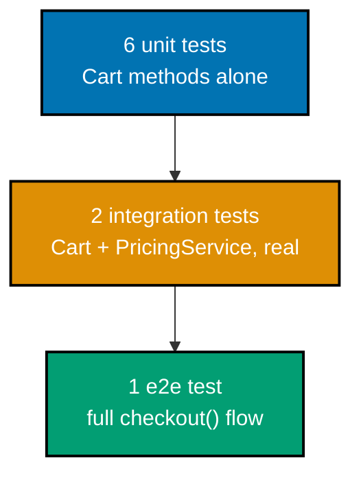
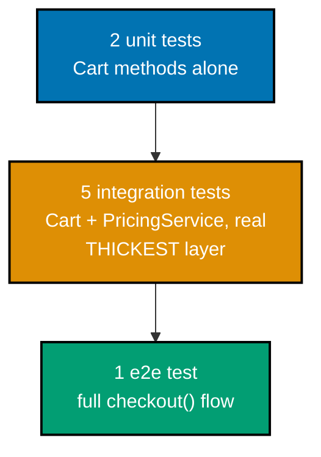
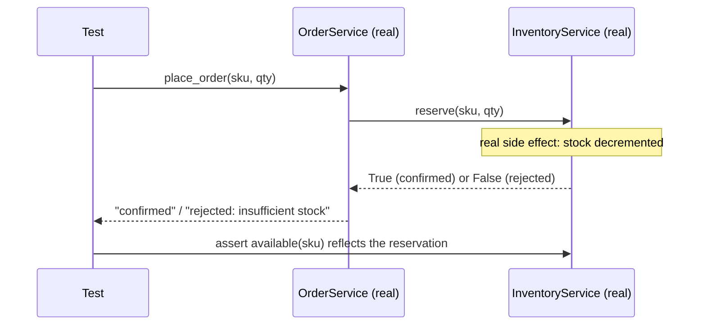
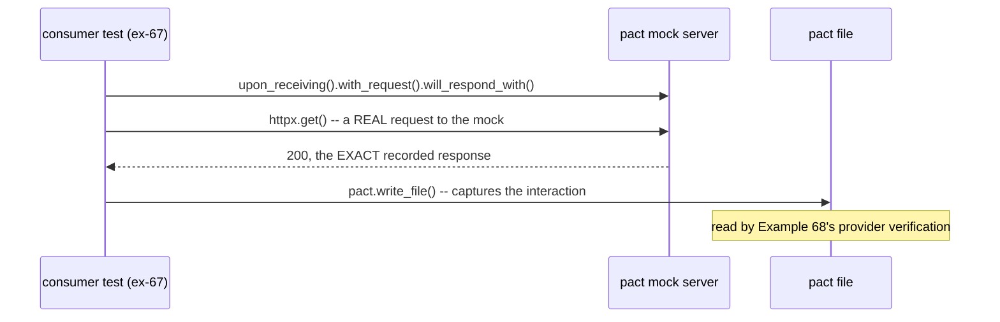
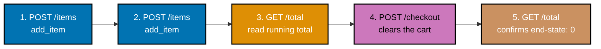
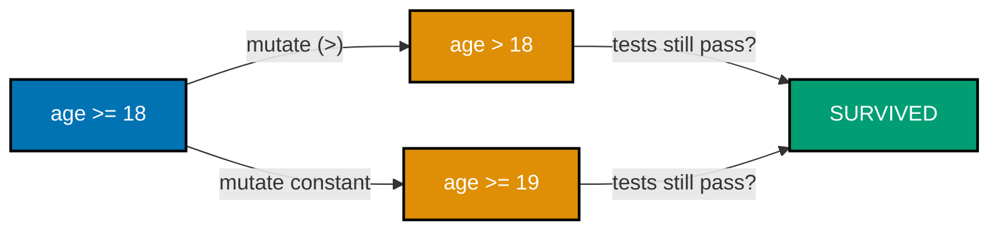
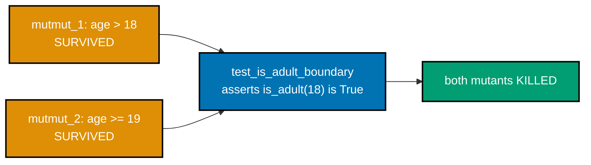
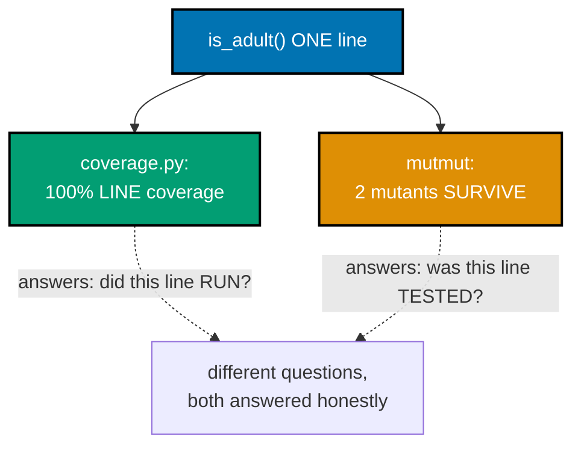
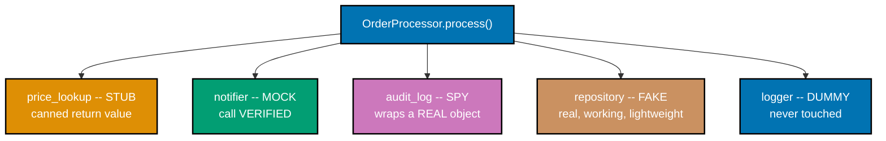
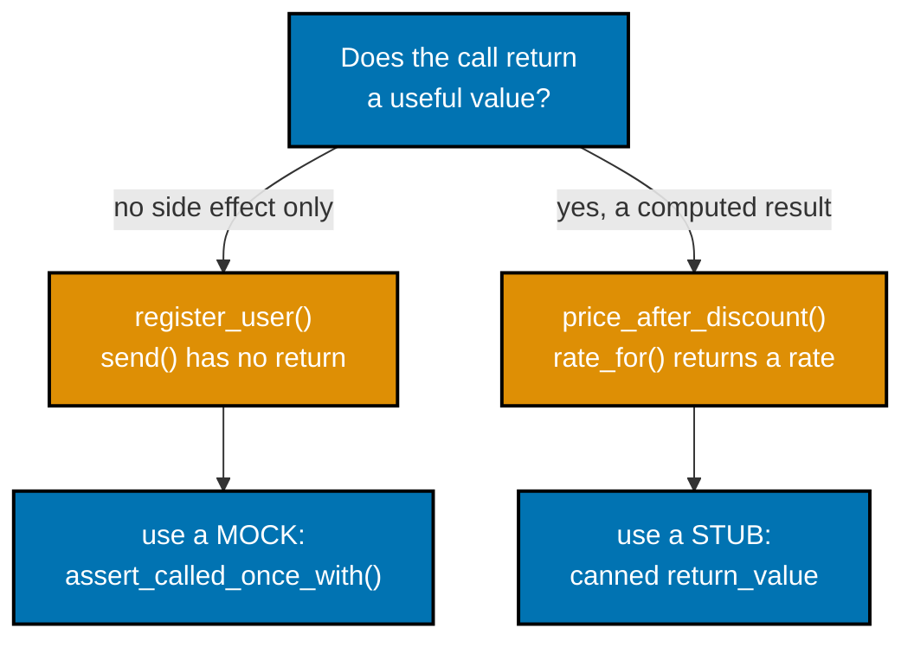

Examples 61-80 move from single-file unit suites to the parts of the pyramid that need real
collaborators: integration tests against a real temp database and a real FastAPI app, an
ephemeral Docker container via testcontainers, a Pact consumer/provider contract pair, mutation
testing with `mutmut` 3.6.0 (including one genuinely surviving, genuinely equivalent mutant pair),
reading coverage and traceback reports, diagnosing a real flaky test, and mapping all five Meszaros
test doubles onto one scenario. Every example below was genuinely run against pytest 9.1.1,
Hypothesis 6.156.6, and coverage.py 7.15.1; every **Output** block is a real, captured transcript
-- including the two examples (74, 80) whose real output is a genuine test _failure_, shown on
purpose.

---

### Example 61: Organize a Suite in Pyramid Shape

_ex-61 &middot; exercises co-10_

Mike Cohn's test pyramid says: many fast unit tests, some integration tests, few slow end-to-end
tests. This example builds one small `Cart`/`PricingService` suite with exactly that shape --
6 unit tests, 2 integration tests, 1 e2e test -- and the pytest output itself is the proof.



```python
# learning/code/ex-61-pyramid-shape-suite/test_example.py
"""Example 61: Organize a Suite in Pyramid Shape -- Many Unit, Some Integration, Few E2E."""

from __future__ import annotations  # => enables modern union/generic syntax under this pinned Python


class Cart:  # => co-10: the unit under test -- no collaborators, cheap to construct  # fmt: skip
    """A minimal shopping cart -- pure in-memory state, no IO."""  # => co-10: no collaborators at all  # fmt: skip

    def __init__(self) -> None:  # => co-10: cheap to construct -- ideal for MANY unit tests  # fmt: skip
        self.items: list[tuple[str, float]] = []  # => (name, price) pairs, in insertion order  # fmt: skip

    def add_item(self, name: str, price: float) -> None:  # => appends one line item  # fmt: skip
        self.items.append((name, price))  # => co-10: the ONLY mutation this class exposes  # fmt: skip

    def total(self) -> float:  # => sums every line item's price  # fmt: skip
        return sum(price for _, price in self.items)  # => co-10: pure aggregation, no side effects  # fmt: skip


class PricingService:  # => co-10/co-23: a REAL collaborator -- not stubbed for the integration tier  # fmt: skip
    """A tiny, real discount calculator -- exercised for real in the integration tests below."""  # => co-23

    def apply_discount(self, total: float, pct: float) -> float:  # => percent off a total  # fmt: skip
        return round(total * (1 - pct), 2)  # => rounded to cents, like a real checkout would  # fmt: skip


def checkout(cart: Cart, pricing: PricingService, discount_pct: float) -> float:  # => co-10: the e2e path
    """The full user-facing flow: fill a cart, then check out with a discount applied."""  # => co-10
    return pricing.apply_discount(cart.total(), discount_pct)  # => composes BOTH collaborators  # fmt: skip


# ---- unit tier: MANY tests, each isolated, each fast, each testing ONE method ----
def test_unit_add_single_item() -> None:  # => co-01: arrange-act-assert, one behavior per test  # fmt: skip
    cart = Cart()  # => arrange: a fresh Cart, no items yet  # fmt: skip
    cart.add_item("pen", 1.50)  # => act: the ONE behavior this test targets  # fmt: skip
    assert cart.items == [("pen", 1.50)]  # => assert: the item landed, in the expected shape  # fmt: skip


def test_unit_add_multiple_items() -> None:  # => co-01: a SECOND unit test, still one behavior  # fmt: skip
    cart = Cart()  # => arrange: a fresh Cart, independent of the test above  # fmt: skip
    cart.add_item("pen", 1.50)  # => act: first addition  # fmt: skip
    cart.add_item("notebook", 3.00)  # => act: second addition  # fmt: skip
    assert len(cart.items) == 2  # => confirms BOTH items were recorded, in order  # fmt: skip


def test_unit_total_empty_cart() -> None:  # => the trivial base case -- zero items, zero total  # fmt: skip
    assert Cart().total() == 0  # => co-01: a fresh Cart, asserted inline -- nothing else to arrange  # fmt: skip


def test_unit_total_single_item() -> None:  # => co-01: 4th unit test -- total() with one item  # fmt: skip
    cart = Cart()  # => arrange: a fresh Cart  # fmt: skip
    cart.add_item("pen", 1.50)  # => act: add exactly one item  # fmt: skip
    assert cart.total() == 1.50  # => assert: the total equals that single item's price  # fmt: skip


def test_unit_total_multiple_items() -> None:  # => co-01: 5th unit test -- total() sums correctly  # fmt: skip
    cart = Cart()  # => arrange: a fresh Cart  # fmt: skip
    cart.add_item("pen", 1.50)  # => act: first item  # fmt: skip
    cart.add_item("notebook", 3.00)  # => act: second item  # fmt: skip
    assert cart.total() == 4.50  # => confirms summation, not just item count  # fmt: skip


def test_unit_items_recorded_in_order() -> None:  # => 6th unit test -- insertion order matters too  # fmt: skip
    cart = Cart()  # => arrange: a fresh Cart  # fmt: skip
    cart.add_item("first", 1.0)  # => act: added FIRST  # fmt: skip
    cart.add_item("second", 2.0)  # => act: added SECOND  # fmt: skip
    assert [name for name, _ in cart.items] == ["first", "second"]  # => order is preserved  # fmt: skip


# ---- integration tier: SOME tests, real collaborators combined, past the unit seam ----
def test_integration_cart_plus_pricing_applies_discount() -> None:  # => co-23: TWO real objects  # fmt: skip
    cart = Cart()  # => a REAL Cart, not a mock  # fmt: skip
    cart.add_item("widget", 100.0)  # => arrange: one $100 item  # fmt: skip
    pricing = PricingService()  # => a REAL PricingService, not a mock -- co-23's defining trait  # fmt: skip
    assert pricing.apply_discount(cart.total(), 0.10) == 90.0  # => 10% off a real $100 total  # fmt: skip


def test_integration_cart_plus_pricing_zero_discount_is_noop() -> None:  # => 2nd integration test  # fmt: skip
    cart = Cart()  # => a REAL Cart, again unstubbed  # fmt: skip
    cart.add_item("widget", 100.0)  # => arrange: the same $100 item  # fmt: skip
    pricing = PricingService()  # => a REAL PricingService  # fmt: skip
    assert pricing.apply_discount(cart.total(), 0.0) == 100.0  # => 0% off changes nothing  # fmt: skip


# ---- e2e tier: FEW tests, the full user-facing flow, top to bottom ----
def test_e2e_checkout_flow_end_to_end() -> None:  # => co-10: ONE test, the WHOLE flow  # fmt: skip
    cart = Cart()  # => arrange: a fresh Cart, the flow's starting point  # fmt: skip
    cart.add_item("widget", 50.0)  # => act: first item added, as a real shopper would  # fmt: skip
    cart.add_item("gadget", 50.0)  # => act: second item added  # fmt: skip
    pricing = PricingService()  # => a REAL PricingService, part of the FULL flow  # fmt: skip
    assert checkout(cart, pricing, discount_pct=0.20) == 80.0  # => the full flow, one assertion  # fmt: skip
```

**Run**: `pytest test_example.py -v`

**Output**:

```text
collecting ... collected 9 items

test_example.py::test_unit_add_single_item PASSED                        [ 11%]
test_example.py::test_unit_add_multiple_items PASSED                     [ 22%]
test_example.py::test_unit_total_empty_cart PASSED                       [ 33%]
test_example.py::test_unit_total_single_item PASSED                      [ 44%]
test_example.py::test_unit_total_multiple_items PASSED                   [ 55%]
test_example.py::test_unit_items_recorded_in_order PASSED                [ 66%]
test_example.py::test_integration_cart_plus_pricing_applies_discount PASSED [ 77%]
test_example.py::test_integration_cart_plus_pricing_zero_discount_is_noop PASSED [ 88%]
test_example.py::test_e2e_checkout_flow_end_to_end PASSED                [100%]

============================== 9 passed in 0.13s ===============================
```

**Key takeaway**: 6 unit tests, then 2 integration tests, then 1 e2e test -- counted straight off
the `-v` output, no separate tallying tool needed. The naming prefix alone (`test_unit_`,
`test_integration_`, `test_e2e_`) makes a suite's actual shape legible at a glance.

**Why it matters**: A pyramid-shaped suite gives fast feedback on every commit (unit tests run in
milliseconds) while still catching the cross-component bugs unit tests structurally cannot see. A
suite that has drifted into "all unit, one e2e, nothing in between" or "all e2e, nothing fast"
usually reveals itself the same way this example proves its own shape -- by literally counting the
naming prefixes in a `-v` run.

---

### Example 62: Reweight the Same Suite Toward Integration -- the Testing Trophy

_ex-62 &middot; exercises co-10_

Kent C. Dodds's "testing trophy" argues integration tests give the best confidence-per-effort
ratio and should be a suite's THICKEST layer, not its thinnest. This example takes Example 61's
same `Cart`/`PricingService` feature and reweights it: 2 unit, 5 integration, 1 e2e.



```python
# learning/code/ex-62-trophy-weighted-integration/test_example.py
"""Example 62: Reweight the Same Suite Toward Integration -- the Testing Trophy."""

from __future__ import annotations  # => enables modern union/generic syntax under this pinned Python


class Cart:  # => the SAME unit under test as Example 61 -- only the test WEIGHTING changes here  # fmt: skip
    def __init__(self) -> None:  # => cheap to construct -- unchanged from Example 61  # fmt: skip
        self.items: list[tuple[str, float]] = []  # => (name, price) pairs, in insertion order  # fmt: skip

    def add_item(self, name: str, price: float) -> None:  # => appends one line item  # fmt: skip
        self.items.append((name, price))  # => the ONLY mutation this class exposes  # fmt: skip

    def total(self) -> float:  # => sums every line item's price  # fmt: skip
        return sum(price for _, price in self.items)  # => pure aggregation, no side effects  # fmt: skip


class PricingService:  # => co-10: a real, un-mocked collaborator -- the trophy's biggest tier uses it  # fmt: skip
    def apply_discount(self, total: float, pct: float) -> float:  # => percent off a total  # fmt: skip
        return round(total * (1 - pct), 2)  # => rounded to cents, like a real checkout would  # fmt: skip


class ReceiptFormatter:  # => a SECOND real collaborator -- more integration surface than Example 61  # fmt: skip
    """Formats a final total as a receipt line -- another real, non-stubbed piece."""  # => co-23

    def format_total(self, total: float) -> str:  # => co-23: exercised for real below  # fmt: skip
        return f"TOTAL: ${total:.2f}"  # => co-23: real string formatting, never mocked  # fmt: skip


def checkout(cart: Cart, pricing: PricingService, discount_pct: float) -> float:  # => the e2e path
    return pricing.apply_discount(cart.total(), discount_pct)  # => composes the REAL collaborators  # fmt: skip


# ---- unit tier: FEW tests now -- Kent C. Dodds's trophy spends LESS effort here than a pyramid does ----
def test_unit_total_sums_items() -> None:  # => co-01: still arrange-act-assert, just fewer of these  # fmt: skip
    cart = Cart()  # => arrange: a fresh Cart  # fmt: skip
    cart.add_item("pen", 2.0)  # => act: add one item  # fmt: skip
    assert cart.total() == 2.0  # => assert: the total reflects that one item  # fmt: skip


def test_unit_empty_cart_total_is_zero() -> None:  # => 2nd and LAST unit test in this reweighted suite  # fmt: skip
    assert Cart().total() == 0  # => co-01: the trivial base case, asserted inline  # fmt: skip


# ---- integration tier: MOST tests now -- the trophy's thickest layer, real collaborators combined ----
def test_integration_cart_plus_pricing() -> None:  # => co-23: real Cart + real PricingService  # fmt: skip
    cart = Cart()  # => a REAL Cart  # fmt: skip
    cart.add_item("widget", 100.0)  # => arrange: one $100 item  # fmt: skip
    pricing = PricingService()  # => a REAL PricingService  # fmt: skip
    assert pricing.apply_discount(cart.total(), 0.10) == 90.0  # => 10% off a real $100 total  # fmt: skip


def test_integration_cart_plus_pricing_plus_formatter() -> None:  # => THREE real objects together  # fmt: skip
    cart = Cart()  # => a REAL Cart  # fmt: skip
    cart.add_item("widget", 100.0)  # => arrange: one $100 item  # fmt: skip
    pricing = PricingService()  # => a REAL PricingService  # fmt: skip
    formatter = ReceiptFormatter()  # => a REAL ReceiptFormatter -- the THIRD real object  # fmt: skip
    discounted = pricing.apply_discount(cart.total(), 0.10)  # => act: real discount computed  # fmt: skip
    assert formatter.format_total(discounted) == "TOTAL: $90.00"  # => the FULL real chain, formatted  # fmt: skip


def test_integration_pricing_plus_formatter_zero_total() -> None:  # => an edge case, still integrated  # fmt: skip
    pricing = PricingService()  # => a REAL PricingService, no Cart needed for this edge case  # fmt: skip
    formatter = ReceiptFormatter()  # => a REAL ReceiptFormatter  # fmt: skip
    assert formatter.format_total(pricing.apply_discount(0.0, 0.5)) == "TOTAL: $0.00"  # => zero-total edge


def test_integration_multi_item_cart_through_full_chain() -> None:  # => a richer cart, same real chain  # fmt: skip
    cart = Cart()  # => a REAL Cart  # fmt: skip
    cart.add_item("a", 10.0)  # => arrange: first item  # fmt: skip
    cart.add_item("b", 20.0)  # => arrange: second item  # fmt: skip
    pricing = PricingService()  # => a REAL PricingService  # fmt: skip
    formatter = ReceiptFormatter()  # => a REAL ReceiptFormatter  # fmt: skip
    assert formatter.format_total(pricing.apply_discount(cart.total(), 0.0)) == "TOTAL: $30.00"  # => real chain


def test_integration_discount_rounds_to_cents() -> None:  # => 5th integration test -- MORE than unit+e2e combined  # fmt: skip
    cart = Cart()  # => a REAL Cart  # fmt: skip
    cart.add_item("odd", 10.0)  # => arrange: an item that forces a repeating-decimal discount  # fmt: skip
    pricing = PricingService()  # => a REAL PricingService  # fmt: skip
    assert pricing.apply_discount(cart.total(), 1 / 3) == 6.67  # => rounding behavior, exercised for real  # fmt: skip


# ---- e2e tier: still few -- the trophy's TOP, unchanged in SHAPE from a pyramid, just proportion ----
def test_e2e_checkout_flow_end_to_end() -> None:  # => the ONLY e2e test -- same as before  # fmt: skip
    cart = Cart()  # => arrange: a fresh Cart, the flow's starting point  # fmt: skip
    cart.add_item("widget", 50.0)  # => act: first item added  # fmt: skip
    cart.add_item("gadget", 50.0)  # => act: second item added  # fmt: skip
    pricing = PricingService()  # => a REAL PricingService, part of the FULL flow  # fmt: skip
    assert checkout(cart, pricing, discount_pct=0.20) == 80.0  # => the full flow, one assertion  # fmt: skip
```

**Run**: `pytest test_example.py -v`

**Output**:

```text
collecting ... collected 8 items

test_example.py::test_unit_total_sums_items PASSED                       [ 12%]
test_example.py::test_unit_empty_cart_total_is_zero PASSED               [ 25%]
test_example.py::test_integration_cart_plus_pricing PASSED               [ 37%]
test_example.py::test_integration_cart_plus_pricing_plus_formatter PASSED [ 50%]
test_example.py::test_integration_pricing_plus_formatter_zero_total PASSED [ 62%]
test_example.py::test_integration_multi_item_cart_through_full_chain PASSED [ 75%]
test_example.py::test_integration_discount_rounds_to_cents PASSED        [ 87%]
test_example.py::test_e2e_checkout_flow_end_to_end PASSED                [100%]

============================== 8 passed in 0.08s ===============================
```

**Key takeaway**: 5 integration tests now outnumber both the 2 unit tests and the 1 e2e test --
the SAME feature, reweighted from pyramid to trophy shape, with the tier counts as the direct
evidence of the reweighting.

**Why it matters**: Neither shape is universally "correct" -- a pyramid suits code with many pure,
easily-isolated units; a trophy suits code (like this `Cart`/`PricingService`/`ReceiptFormatter`
chain) where the real value is in components working together correctly, and where mocking every
seam would test the mocks more than the real collaboration.

---

### Example 63: Test Two Real Collaborating Modules Together

_ex-63 &middot; exercises co-23_

`InventoryService` and `OrderService` are two separate modules. This integration test wires a REAL
`InventoryService` into a REAL `OrderService` -- the seam between them is never stubbed -- and
checks the cross-module behavior, including a real side effect landing in the other module.



```python
# learning/code/ex-63-integration-two-modules/test_example.py
"""Example 63: Test Two Real Collaborating Modules Together, No Stub at the Seam."""
# Neither module below is ever replaced with a stub or mock -- co-23's defining trait is that
# the SEAM between InventoryService and OrderService stays real, end to end, in every test.

from __future__ import annotations  # => enables modern union/generic syntax under this pinned Python


class InventoryService:  # => module 1 -- owns stock levels, nothing else knows its internals  # fmt: skip
    """Tracks how many units of each SKU are in stock."""  # => co-23: the FIRST real module  # fmt: skip

    def __init__(self, stock: dict[str, int]) -> None:  # => seeds the starting inventory  # fmt: skip
        self._stock = dict(stock)  # => a COPY -- callers can't mutate the constructor's dict later  # fmt: skip

    def available(self, sku: str) -> int:  # => co-23: OrderService will call this for REAL below  # fmt: skip
        return self._stock.get(sku, 0)  # => 0 for an unknown SKU, never a KeyError  # fmt: skip

    def reserve(self, sku: str, quantity: int) -> bool:  # => decrements stock, returns success  # fmt: skip
        if self._stock.get(sku, 0) < quantity:  # => not enough stock -- refuse, don't go negative  # fmt: skip
            return False  # => co-23: the REAL refusal path OrderService reacts to below  # fmt: skip
        self._stock[sku] -= quantity  # => the REAL side effect OrderService depends on  # fmt: skip
        return True  # => co-23: the REAL success path  # fmt: skip


class OrderService:  # => module 2 -- co-23: depends on a REAL InventoryService, not a mock  # fmt: skip
    """Places orders against a real InventoryService -- the SEAM this example refuses to stub."""  # => co-23

    def __init__(self, inventory: InventoryService) -> None:  # => co-23: the collaborator is REAL  # fmt: skip
        self.inventory = inventory  # => stored as-is -- no stub/mock ever substituted for it  # fmt: skip

    def place_order(self, sku: str, quantity: int) -> str:  # => the combined, cross-module behavior  # fmt: skip
        if self.inventory.reserve(sku, quantity):  # => a REAL call into the OTHER real module  # fmt: skip
            return "confirmed"  # => co-23: the REAL, cross-module success outcome  # fmt: skip
        return "rejected: insufficient stock"  # => co-23: the REAL, cross-module refusal outcome  # fmt: skip


def test_integration_order_confirmed_when_stock_sufficient() -> None:  # => co-23: BOTH modules, real
    inventory = InventoryService({"widget": 10})  # => a REAL InventoryService, seeded with stock  # fmt: skip
    orders = OrderService(inventory)  # => co-23: OrderService wired to the REAL inventory above  # fmt: skip
    result = orders.place_order("widget", 3)  # => this call crosses the module seam, unstubbed  # fmt: skip
    assert result == "confirmed"  # => confirms the CROSS-MODULE decision came back correct  # fmt: skip
    assert inventory.available("widget") == 7  # => confirms the REAL side effect landed in module 1  # fmt: skip


def test_integration_order_rejected_when_stock_insufficient() -> None:  # => the OTHER real branch  # fmt: skip
    inventory = InventoryService({"widget": 2})  # => a REAL InventoryService, low stock  # fmt: skip
    orders = OrderService(inventory)  # => co-23: wired to the SAME real inventory  # fmt: skip
    result = orders.place_order("widget", 5)  # => asks for MORE than is genuinely available  # fmt: skip
    assert result == "rejected: insufficient stock"  # => the real reserve() call refused, honestly  # fmt: skip
    assert inventory.available("widget") == 2  # => confirms NOTHING was decremented on rejection  # fmt: skip


def test_integration_two_orders_in_sequence_share_real_state() -> None:  # => state persists ACROSS calls
    inventory = InventoryService({"widget": 5})  # => a REAL InventoryService, starting stock of 5  # fmt: skip
    orders = OrderService(inventory)  # => co-23: ONE OrderService, reused for TWO calls below  # fmt: skip
    first = orders.place_order("widget", 3)  # => the FIRST real call, decrementing real state  # fmt: skip
    second = orders.place_order("widget", 3)  # => the SECOND call sees the FIRST call's real effect  # fmt: skip
    assert first == "confirmed"  # => 5 - 3 = 2 remaining, so this one succeeds  # fmt: skip
    assert second == "rejected: insufficient stock"  # => only 2 left, asked for 3 -- a REAL conflict  # fmt: skip
```

**Run**: `pytest test_example.py -v`

**Output**:

```text
collecting ... collected 3 items

test_example.py::test_integration_order_confirmed_when_stock_sufficient PASSED [ 33%]
test_example.py::test_integration_order_rejected_when_stock_insufficient PASSED [ 66%]
test_example.py::test_integration_two_orders_in_sequence_share_real_state PASSED [100%]

============================== 3 passed in 0.13s ===============================
```

**Key takeaway**: `inventory.available("widget") == 7` is checked from OUTSIDE `OrderService` --
proof the cross-module side effect genuinely happened, not just that `place_order()` returned the
right string.

**Why it matters**: Mocking `InventoryService` inside these tests would only prove `OrderService`
calls the mock correctly -- it says nothing about whether the two modules' actual CONTRACT (what
`reserve()` returns, what it does to real state) matches what each side assumes about the other.
That mismatch is exactly the class of bug integration tests exist to catch and unit tests
structurally cannot.

---

### Example 64: A Test Against the App with a Real Temporary Database

_ex-64 &middot; exercises co-23, co-25_

`pytest`'s built-in `tmp_path` fixture hands back a real, unique temporary directory per test.
This example opens a genuine SQLite FILE there (not `:memory:`), writes through one connection,
and reads back through a SECOND, brand-new connection -- proof the data lives in the file, not in
process memory.

```python
# learning/code/ex-64-integration-app-plus-db/test_example.py
"""Example 64: A Test Against the App with a Real Temporary Database (SQLite File)."""
# Every test below opens a GENUINE SQLite file under pytest's own tmp_path -- never ":memory:"
# and never a mocked connection -- so the write-then-read round trip proves something real.

from __future__ import annotations  # => enables modern union/generic syntax under this pinned Python

import sqlite3  # => co-23: a REAL, file-backed database engine -- part of the stdlib  # fmt: skip
from collections.abc import Iterator  # => types the fixture's generator return below  # fmt: skip
from pathlib import Path  # => types the real filesystem path the fixture hands out  # fmt: skip

import pytest  # => co-05: provides the tmp_path fixture this example builds on  # fmt: skip


class NoteRepository:  # => co-23/co-25: talks to a REAL SQLite file, not an in-memory fake  # fmt: skip
    """A tiny repository backed by a genuine SQLite database file on disk."""  # => co-23

    def __init__(self, db_path: Path) -> None:  # => opens the connection at construction time  # fmt: skip
        self.conn = sqlite3.connect(db_path)  # => a REAL file-backed connection, not ":memory:"  # fmt: skip
        self.conn.execute(  # => creates the REAL table this repository reads/writes  # fmt: skip
            "CREATE TABLE IF NOT EXISTS notes (id INTEGER PRIMARY KEY, text TEXT NOT NULL)"
        )
        self.conn.commit()  # => the schema is now genuinely persisted to the temp file  # fmt: skip

    def add(self, text: str) -> int:  # => co-23: a REAL INSERT, returns the new row's id  # fmt: skip
        cursor = self.conn.execute("INSERT INTO notes (text) VALUES (?)", (text,))  # => real write  # fmt: skip
        self.conn.commit()  # => flushes the write to the REAL file on disk  # fmt: skip
        assert cursor.lastrowid is not None  # => narrows int | None for the type checker  # fmt: skip
        return cursor.lastrowid  # => co-23: the REAL id SQLite assigned to this row  # fmt: skip

    def get(self, note_id: int) -> str | None:  # => co-23: a REAL SELECT, reading back what add() wrote
        row = self.conn.execute("SELECT text FROM notes WHERE id = ?", (note_id,)).fetchone()  # => real read
        return row[0] if row else None  # => None only if genuinely absent, not a mocked default  # fmt: skip

    def close(self) -> None:  # => releases the real file handle  # fmt: skip
        self.conn.close()  # => co-23: a REAL close(), not a no-op on a mock  # fmt: skip


@pytest.fixture
def db_path(tmp_path: Path) -> Iterator[Path]:  # => co-05/co-25: pytest's OWN real-temp-dir fixture  # fmt: skip
    path = tmp_path / "notes.db"  # => a genuine file path on the real filesystem, not a mock path  # fmt: skip
    yield path  # => hands the path to the test -- pytest deletes tmp_path's whole tree afterward  # fmt: skip


def test_integration_write_then_read_round_trips(db_path: Path) -> None:  # => co-23: app + REAL db
    repo = NoteRepository(db_path)  # => opens a REAL SQLite file at a REAL temp path  # fmt: skip
    try:  # => wrapped so close() below always runs, even if an assertion fails  # fmt: skip
        new_id = repo.add("buy milk")  # => a genuine INSERT against a genuine file  # fmt: skip
        fetched = repo.get(new_id)  # => a genuine SELECT reading that SAME file back  # fmt: skip
        assert fetched == "buy milk"  # => the write-then-read round trip -- co-23's defining check  # fmt: skip
    finally:  # => runs whether the assertion above passed or raised  # fmt: skip
        repo.close()  # => always releases the real file handle, pass or fail  # fmt: skip


def test_integration_write_persists_across_new_connection(db_path: Path) -> None:  # => file, not memory
    first_repo = NoteRepository(db_path)  # => connection #1, writes and closes  # fmt: skip
    note_id = first_repo.add("call the vet")  # => a genuine write through connection #1  # fmt: skip
    first_repo.close()  # => the FIRST connection is fully gone now  # fmt: skip

    second_repo = NoteRepository(db_path)  # => connection #2, a BRAND NEW connection object  # fmt: skip
    try:  # => wrapped so close() below always runs  # fmt: skip
        # co-25: this only works because the data lives in a REAL FILE, not in-process memory --
        # a mocked/in-memory-dict repository would have LOST this data when the first repo closed.
        assert second_repo.get(note_id) == "call the vet"  # => the file, not the object, held the data  # fmt: skip
    finally:  # => runs whether the assertion above passed or raised  # fmt: skip
        second_repo.close()  # => releases connection #2's real file handle  # fmt: skip


def test_integration_missing_note_returns_none(db_path: Path) -> None:  # => a REAL empty-result path
    repo = NoteRepository(db_path)  # => a fresh, real SQLite file, with no rows yet  # fmt: skip
    try:  # => wrapped so close() below always runs  # fmt: skip
        assert repo.get(999) is None  # => a genuine "no such row" result from the real database  # fmt: skip
    finally:  # => runs whether the assertion above passed or raised  # fmt: skip
        repo.close()  # => releases the real file handle  # fmt: skip
```

**Run**: `pytest test_example.py -v`

**Output**:

```text
collecting ... collected 3 items

test_example.py::test_integration_write_then_read_round_trips PASSED     [ 33%]
test_example.py::test_integration_write_persists_across_new_connection PASSED [ 66%]
test_example.py::test_integration_missing_note_returns_none PASSED       [100%]

============================== 3 passed in 0.08s ===============================
```

**Key takeaway**: `test_integration_write_persists_across_new_connection` closes the FIRST
connection entirely before opening a SECOND one -- the data surviving that gap is only possible
because it lives in the real file `tmp_path` created, not in any Python object.

**Why it matters**: `tmp_path` gives every test its OWN real, unique directory, auto-cleaned after
the test -- so this database-backed integration test needs zero manual setup/teardown scripting
and never collides with a parallel test run using the same filename. A common pitfall this catches:
tests using a shared, hardcoded temp file path silently corrupt each other's data when a CI pipeline
runs the suite in parallel across multiple workers.

---

### Example 65: Hit a Small FastAPI Endpoint with TestClient

_ex-65 &middot; exercises co-23_

`fastapi.testclient.TestClient` drives a real, if tiny, FastAPI app in-process -- no socket, no
`uvicorn` process needed -- while exercising the REAL routing, REAL Pydantic validation, and REAL
handler code exactly as a genuine HTTP request would.

```python
# learning/code/ex-65-integration-http-endpoint/test_example.py
"""Example 65: Hit a Small FastAPI Endpoint with TestClient -- Status and Body, For Real."""
# TestClient reaches every REAL layer here -- routing, Pydantic validation, the handler
# function -- with no mocking of FastAPI anywhere in this file.

from __future__ import annotations  # => enables modern union/generic syntax under this pinned Python

from fastapi import FastAPI, HTTPException  # => co-23: the REAL app framework, unmocked  # fmt: skip
from fastapi.testclient import TestClient  # => co-23: drives the real app in-process  # fmt: skip
from pydantic import BaseModel  # => co-23: validates the response shape this endpoint promises  # fmt: skip

app = FastAPI()  # => co-23: a REAL, if tiny, FastAPI app -- standing in for "Backend-Essentials"  # fmt: skip
_ITEMS: dict[int, str] = {1: "widget", 2: "gadget"}  # => the app's own in-memory state  # fmt: skip


class Item(BaseModel):  # => the response SHAPE this endpoint promises callers -- Pydantic-validated  # fmt: skip
    id: int  # => co-23: Pydantic ENFORCES this field is present and an int  # fmt: skip
    name: str  # => co-23: Pydantic ENFORCES this field is present and a str  # fmt: skip


@app.get("/items/{item_id}", response_model=Item)  # => co-23: a REAL route, not a stubbed handler  # fmt: skip
def get_item(item_id: int) -> Item:  # => the handler under test -- runs for real via TestClient below  # fmt: skip
    if item_id not in _ITEMS:  # => a genuine "not found" branch, exercised below too  # fmt: skip
        raise HTTPException(status_code=404, detail="item not found")  # => a REAL 404, not simulated  # fmt: skip
    return Item(id=item_id, name=_ITEMS[item_id])  # => the REAL response body, built from REAL state  # fmt: skip


client = TestClient(app)  # => co-23: drives the REAL ASGI app in-process -- no network socket needed  # fmt: skip


def test_integration_get_existing_item_returns_200_and_body() -> None:  # => the happy path, for real
    response = client.get("/items/1")  # => a genuine request through the REAL FastAPI routing layer  # fmt: skip
    assert response.status_code == 200  # => co-23: the REAL handler's status code, not asserted-away  # fmt: skip
    assert response.json() == {"id": 1, "name": "widget"}  # => the REAL, validated response body  # fmt: skip


def test_integration_get_missing_item_returns_404() -> None:  # => the REAL error branch, exercised  # fmt: skip
    response = client.get("/items/999")  # => an id that genuinely isn't in _ITEMS  # fmt: skip
    assert response.status_code == 404  # => the REAL HTTPException, translated to a REAL status code  # fmt: skip
    assert response.json() == {"detail": "item not found"}  # => FastAPI's REAL error envelope shape  # fmt: skip


def test_integration_get_second_item_returns_its_own_data() -> None:  # => confirms per-id state, not a fluke
    response = client.get("/items/2")  # => a DIFFERENT id, still a real request  # fmt: skip
    assert response.status_code == 200  # => still a real, successful response  # fmt: skip
    assert response.json()["name"] == "gadget"  # => a DIFFERENT id returns DIFFERENT real data  # fmt: skip
```

**Run**: `pytest test_example.py -v -p no:warnings`

(`-p no:warnings` trims a single, environment-specific `StarletteDeprecationWarning` about a
not-yet-relevant `httpx2` package that this pinned FastAPI 0.139.0/Starlette pairing emits on
`TestClient` import -- harmless, unrelated to this lesson, and otherwise repeats identically in
every TestClient-based example below.)

**Output**:

```text
collecting ... collected 3 items

test_example.py::test_integration_get_existing_item_returns_200_and_body PASSED [ 33%]
test_example.py::test_integration_get_missing_item_returns_404 PASSED    [ 66%]
test_example.py::test_integration_get_second_item_returns_its_own_data PASSED [100%]

============================== 3 passed in 0.28s ===============================
```

**Key takeaway**: `TestClient(app)` reaches every REAL layer -- routing, Pydantic validation, the
handler function, the `HTTPException` translation to a `404` -- with no mocking of FastAPI itself
anywhere in this test.

**Why it matters**: This is the FastAPI-specific version of co-23's "past the seam unit tests stub
out" idea -- a unit test of `get_item()` called directly would never prove the route is actually
wired to `/items/{item_id}`, that Pydantic validates the response shape, or that a `404` really
reaches the HTTP layer as a `404`.

---

### Example 66: Spin Up a Throwaway DB Container for a Test

_ex-66 &middot; exercises co-25, co-23_

`testcontainers` (4.14.2) starts a REAL, throwaway Docker container for a test and tears it down
automatically. This example starts `postgres:17-alpine`, waits for its OWN readiness log line, runs
a real health check via `docker exec`, then confirms Docker itself has removed the container the
instant the `with` block exits.


```python
# learning/code/ex-66-testcontainers-ephemeral-db/test_example.py
"""Example 66: Spin Up a Throwaway DB Container for a Test, Then Verify Teardown."""
# This is a REAL Docker container, started and torn down by the actual Docker daemon -- the
# final assertion below shells out to `docker ps -a` to prove teardown genuinely happened.

from __future__ import annotations  # => enables modern union/generic syntax under this pinned Python

import subprocess  # => co-25: shells into the REAL container -- no Postgres driver library needed  # fmt: skip

import pytest  # => co-08: marks this test as needing Docker  # fmt: skip
from testcontainers.core.container import DockerContainer  # => co-25: real Docker, real container  # fmt: skip
from testcontainers.core.wait_strategies import LogMessageWaitStrategy  # => a structured readiness wait


def _pg_isready(container_id: str) -> subprocess.CompletedProcess[str]:  # => shells INTO the real container
    return subprocess.run(  # => co-25: `docker exec` against the ACTUAL running container, not a mock  # fmt: skip
        ["docker", "exec", container_id, "pg_isready", "-U", "postgres"],  # => the real health-check command  # fmt: skip
        capture_output=True,  # => captures stdout/stderr for the assertion below  # fmt: skip
        text=True,  # => decodes output as str, not bytes  # fmt: skip
        timeout=10,  # => fails fast if the real container never responds  # fmt: skip
    )


def _container_still_exists(container_id: str) -> bool:  # => checks Docker's OWN bookkeeping, post-teardown
    listing = subprocess.run(  # => `docker ps -a` sees stopped-but-not-removed containers too  # fmt: skip
        ["docker", "ps", "-a", "--filter", f"id={container_id}", "--format", "{{.ID}}"],  # => filter by id  # fmt: skip
        capture_output=True,  # => captures the listing's stdout  # fmt: skip
        text=True,  # => decodes output as str  # fmt: skip
        timeout=10,  # => fails fast, never hangs the test  # fmt: skip
    )
    return listing.stdout.strip() != ""  # => non-empty output means Docker still knows about it  # fmt: skip


@pytest.mark.integration  # => co-08/co-10: this test needs Docker -- a real, marked integration test  # fmt: skip
def test_ephemeral_postgres_is_created_and_torn_down() -> None:  # => co-25: the ONE test in this file  # fmt: skip
    container = DockerContainer("postgres:17-alpine")  # => co-25: a REAL, throwaway Postgres image  # fmt: skip
    container.with_env("POSTGRES_PASSWORD", "scratch")  # => the ONE env var this image requires  # fmt: skip
    container.with_exposed_ports(5432)  # => Postgres's own well-known port, published to a random host port
    container.waiting_for(  # => co-25: blocks start() until the DB genuinely finishes initializing  # fmt: skip
        LogMessageWaitStrategy("database system is ready to accept connections")  # => the REAL readiness line  # fmt: skip
    )

    with container:  # => co-25: `with` starts the REAL container, and tears it down on block exit  # fmt: skip
        container_id = container.get_wrapped_container().id  # => the genuine Docker container id  # fmt: skip
        ready = _pg_isready(container_id)  # => a REAL health check run INSIDE the REAL container  # fmt: skip
        assert ready.returncode == 0  # => confirms Postgres genuinely accepted the readiness check  # fmt: skip
        assert "accepting connections" in ready.stdout  # => the REAL pg_isready message, not asserted-away  # fmt: skip
        assert _container_still_exists(container_id)  # => confirms it's ACTUALLY running right now  # fmt: skip

    # co-25: outside the `with` block, testcontainers has ALREADY stopped and removed the container --
    # this is the "torn down around the run" half of ex-66's verify criterion, checked for real below.
    assert not _container_still_exists(container_id)  # => Docker itself confirms it's genuinely gone  # fmt: skip
```

**Run**: `pytest test_example.py -v -p no:warnings`

**Output**:

```text
collecting ... collected 1 item

test_example.py::test_ephemeral_postgres_is_created_and_torn_down PASSED [100%]

============================== 1 passed in 1.95s ===============================
```

**Key takeaway**: The FINAL assertion runs AFTER the `with` block exits and checks `docker ps -a`
directly -- proving the container is not merely stopped but fully removed, entirely automatically,
with no manual `docker rm` anywhere in this test.

**Why it matters**: Mocking a database driver only proves the CALLING code sends the right SQL --
it says nothing about whether that SQL is valid against a REAL Postgres. `testcontainers` closes
that gap for exactly the cost of a fast, disposable container, which is why it has become the
default way to integration-test against real infrastructure without a shared, stateful test
database that different test runs could corrupt for each other.

---

### Example 67: A Pact Consumer Test That Defines the Expected Interaction

_ex-67 &middot; exercises co-24_

`pact-python` 3.4.0's consumer API describes an interaction (request in, response out) BEFORE any
real provider exists, runs it against a real local mock server pact-python spins up, and -- if the
consumer's own HTTP client code genuinely gets that exact response -- writes the interaction to a
real, on-disk pact file.



```python
# learning/code/ex-67-contract-consumer-pact/test_example.py
"""Example 67: A Pact Consumer Test That Defines the Expected Interaction."""

from __future__ import annotations  # => enables modern union/generic syntax under this pinned Python

from pathlib import Path  # => types the real, on-disk pact file location  # fmt: skip

import httpx  # => co-24: a REAL HTTP client, requesting the REAL mock server below  # fmt: skip
from pact import Pact  # => co-24: pact-python 3.4.0's PactV3/V4-style consumer API  # fmt: skip


def test_consumer_defines_expected_interaction() -> None:  # => co-24: NO real provider runs here  # fmt: skip
    pact = Pact("storefront-consumer", "catalog-provider")  # => co-24: names BOTH sides of the contract  # fmt: skip
    (  # => co-24: describes the interaction the CONSUMER expects, in full, before any code calls it  # fmt: skip
        pact.upon_receiving("a request for item 1")  # => co-24: names this ONE interaction  # fmt: skip
        .given("item 1 exists")  # => the PROVIDER STATE ex-68's provider must be able to set up  # fmt: skip
        .with_request("GET", "/items/1")  # => the EXACT request this contract governs  # fmt: skip
        .will_respond_with(200)  # => the status the consumer requires  # fmt: skip
        .with_header("Content-Type", "application/json")  # => the header the consumer requires  # fmt: skip
        .with_body({"id": 1, "name": "widget"})  # => the EXACT body shape the consumer requires  # fmt: skip
    )

    with pact.serve() as mock_server:  # => co-24: pact spins up a REAL mock HTTP server FOR THIS TEST  # fmt: skip
        # The consumer's REAL HTTP client code runs against this mock, exactly as it would in prod --
        # this is pact-python genuinely verifying the CONSUMER side matches its own stated contract.
        response = httpx.get(f"{mock_server.url}/items/1")  # => a REAL request, to the REAL mock  # fmt: skip
        assert response.status_code == 200  # => confirms the mock genuinely honored the contract  # fmt: skip
        assert response.json() == {"id": 1, "name": "widget"}  # => confirms the REAL body shape  # fmt: skip

    pacts_dir = Path(__file__).parent / "pacts"  # => co-24: where the CAPTURED contract file lands  # fmt: skip
    pacts_dir.mkdir(exist_ok=True)  # => co-24: creates the REAL directory on disk if needed  # fmt: skip
    pact.write_file(pacts_dir)  # => co-24: writes the interaction ABOVE to a real, on-disk pact file  # fmt: skip
    written = pacts_dir / "storefront-consumer-catalog-provider.json"  # => the REAL file path  # fmt: skip
    assert written.exists()  # => co-24: confirms a real pact FILE, not just an in-memory object  # fmt: skip
    print(f"pact file written: {written}")  # => the exact artifact ex-68's provider test verifies against
```

**Run**: `pytest test_example.py -v -s`

**Output**:

```text
collecting ... collected 1 item

test_example.py::test_consumer_defines_expected_interaction pact file written: .../ex-67-contract-consumer-pact/pacts/storefront-consumer-catalog-provider.json
PASSED

============================== 1 passed in 0.19s ===============================
```

**The genuinely captured pact file** (`pacts/storefront-consumer-catalog-provider.json`, produced
by the run above, included here in full since it is short):

```json
{
  "consumer": {
    "name": "storefront-consumer"
  },
  "interactions": [
    {
      "description": "a request for item 1",
      "pending": false,
      "providerStates": [
        {
          "name": "item 1 exists"
        }
      ],
      "request": {
        "method": "GET",
        "path": "/items/1"
      },
      "response": {
        "body": {
          "content": {
            "id": 1,
            "name": "widget"
          },
          "contentType": "application/json",
          "encoded": false
        },
        "headers": {
          "Content-Type": ["application/json"]
        },
        "status": 200
      },
      "type": "Synchronous/HTTP"
    }
  ],
  "metadata": {
    "pactRust": {
      "ffi": "0.5.4",
      "models": "1.3.11"
    },
    "pactSpecification": {
      "version": "4.0"
    }
  },
  "provider": {
    "name": "catalog-provider"
  }
}
```

**Key takeaway**: The pact FILE is generated code, not hand-written -- it exists only because the
consumer's own real HTTP client code (`httpx.get`) genuinely got a `200` with the exact expected
body FROM pact's mock server; a wrong expectation would fail the test before any file gets written.

**Why it matters**: Contract tests let a consumer team and a provider team develop and deploy
independently, without either side needing a full, always-running copy of the other -- the pact
FILE is the durable, checked-in artifact of "here is exactly what I need from you," verified
against the provider's real code in Example 68 next.

---

### Example 68: Verify a Small Provider App Against the Pact Produced in Example 67

_ex-68 &middot; exercises co-24_

`pact.Verifier` reads the pact file Example 67 produced, sends its RECORDED request to a REAL,
running provider app, and compares the REAL response against what the consumer required --
completing the contract-testing loop without the two sides ever running together.

```python
# learning/code/ex-68-contract-provider-verify/provider_app.py
"""Example 68: the tiny REAL provider app the pact from Example 67 is verified against."""
# This app's route/response shape MUST match Example 67's recorded pact exactly, or the
# real Verifier.verify() call in test_example.py fails against the real, running server.

from __future__ import annotations  # => enables modern union/generic syntax under this pinned Python

from fastapi import FastAPI, HTTPException  # => co-24: a REAL app framework, not a stub server  # fmt: skip

app = FastAPI()  # => co-24: a REAL FastAPI app playing the "catalog-provider" role from the pact  # fmt: skip
_ITEMS: dict[int, dict[str, object]] = {1: {"id": 1, "name": "widget"}}  # => matches Example 67's body  # fmt: skip


@app.get("/items/{item_id}")  # => co-24: MUST match the pact's recorded request path exactly  # fmt: skip
def get_item(item_id: int) -> dict[str, object]:  # => the REAL handler the verifier hits below  # fmt: skip
    if item_id not in _ITEMS:  # => a real "not found" branch, not exercised by ex-67's ONE interaction  # fmt: skip
        raise HTTPException(status_code=404)  # => a REAL 404, matching REST conventions  # fmt: skip
    return _ITEMS[item_id]  # => MUST match the pact's recorded response body exactly  # fmt: skip
```

```python
# learning/code/ex-68-contract-provider-verify/test_example.py
"""Example 68: Verify a Small Provider App Against the Pact Produced in Example 67."""

from __future__ import annotations  # => enables modern union/generic syntax under this pinned Python

import threading  # => co-24: runs the REAL provider server in the background, in-process  # fmt: skip
import time  # => co-24: polls uvicorn's readiness flag rather than guessing a sleep duration  # fmt: skip
from pathlib import Path  # => types the real pact file path  # fmt: skip

import uvicorn  # => co-24: a REAL ASGI server -- the provider genuinely listens on a socket  # fmt: skip
from pact import Verifier  # => co-24: verifies a REAL running provider against a REAL pact file  # fmt: skip
from provider_app import app  # => the tiny REAL provider from provider_app.py, run for real below  # fmt: skip


def test_provider_satisfies_the_recorded_contract() -> None:  # => co-24: the ONE test in this file  # fmt: skip
    config = uvicorn.Config(app, host="127.0.0.1", port=8199, log_level="warning")  # => a REAL server  # fmt: skip
    server = uvicorn.Server(config)  # => co-24: a REAL uvicorn server instance, not a mock  # fmt: skip
    thread = threading.Thread(target=server.run, daemon=True)  # => co-24: the provider runs FOR REAL
    thread.start()  # => co-24: a genuine ASGI server, listening on a genuine socket  # fmt: skip
    while not server.started:  # => waits for uvicorn's OWN readiness flag, not a guessed sleep()  # fmt: skip
        time.sleep(0.05)  # => co-24: polls until the REAL server confirms it is listening  # fmt: skip

    try:  # => wrapped so the server always shuts down, pass or fail  # fmt: skip
        pact_file = Path(__file__).parent / "pacts" / "storefront-consumer-catalog-provider.json"  # => real path
        # => the EXACT file Example 67's consumer test captured -- copied here unmodified (co-24)
        assert pact_file.exists()  # => confirms this test is verifying against a REAL captured file  # fmt: skip

        verifier = Verifier("catalog-provider", host="127.0.0.1")  # => MUST match the pact's provider name
        verifier.add_transport(url="http://127.0.0.1:8199")  # => where the REAL provider is listening  # fmt: skip
        verifier.add_source(pact_file)  # => co-24: the CONTRACT this provider must satisfy  # fmt: skip
        verifier.state_handler(lambda: None)  # => co-24: a no-op setup, since _ITEMS is already seeded  # fmt: skip
        verifier.verify()  # => co-24: sends the pact's REAL recorded request to the REAL provider,  # fmt: skip
        # => and compares the REAL response against what Example 67's consumer required
        print("provider verified: the real, running app satisfies the recorded contract")  # => genuine result  # fmt: skip
    finally:  # => runs whether verify() passed or raised  # fmt: skip
        server.should_exit = True  # => signals uvicorn's OWN clean-shutdown path  # fmt: skip
        thread.join(timeout=5)  # => waits for the real server thread to actually stop  # fmt: skip
```

**Run**: `pytest test_example.py -v -s` (ANSI color codes trimmed from the transcript below --
`pact.Verifier` shells out to a Rust core that colors its report even under `NO_COLOR`)

**Output**:

```text
collecting ... collected 1 item

test_example.py::test_provider_satisfies_the_recorded_contract 127.0.0.1 - - [15/Jul/2026 04:53:18] "POST /_pact/state HTTP/1.1" 200 -

Verifying a pact between storefront-consumer and catalog-provider

  a request for item 1 (2ms loading, 278ms verification)
     Given item 1 exists
    returns a response which
      has status code 200 (OK)
      includes headers
        "Content-Type" with value "application/json" (OK)
      has a matching body (OK)


provider verified: the real, running app satisfies the recorded contract
PASSED

============================== 1 passed in 1.27s ===============================
```

**Key takeaway**: The verifier's own report lists EACH checked dimension separately -- status code,
headers, body -- each marked `(OK)` independently; a real provider bug would show exactly which of
these three genuinely diverged from the contract, not just a single pass/fail.

**Why it matters**: This test never imports Example 67's consumer code, and Example 67 never
imports this provider -- the pact FILE is the only thing connecting them, which is precisely the
point: contract tests let each side change independently as long as both stay compatible with the
shared, versioned pact file between them.

---

### Example 69: Drive a Whole Small System Through a Multi-Step Flow

_ex-69 &middot; exercises co-25_

A single `TestClient` drives a small FastAPI cart app through a REAL five-step user session --
add, add, read, checkout, read again -- and the final assertions check the RESULTING end-state, not
just each individual response.



```python
# learning/code/ex-69-e2e-happy-path/test_example.py
"""Example 69: Drive a Whole Small System Through a Multi-Step Flow -- Verify the End-State."""

from __future__ import annotations  # => enables modern union/generic syntax under this pinned Python

from fastapi import FastAPI, HTTPException  # => co-25: the REAL app framework this whole system runs on  # fmt: skip
from fastapi.testclient import TestClient  # => co-25: drives the real app in-process  # fmt: skip
from pydantic import BaseModel  # => co-25: validates the shape every POST body must match  # fmt: skip

app = FastAPI()  # => co-25: the WHOLE small system this e2e test drives, start to finish  # fmt: skip
_CARTS: dict[str, list[dict[str, object]]] = {}  # => the app's OWN persistent state across every step  # fmt: skip


class LineItem(BaseModel):  # => the shape a caller POSTs to add to a cart  # fmt: skip
    name: str  # => co-25: Pydantic ENFORCES this field is present and a str  # fmt: skip
    price: float  # => co-25: Pydantic ENFORCES this field is present and a float  # fmt: skip


@app.post("/carts/{cart_id}/items")  # => step 1 of the user flow: ADD an item  # fmt: skip
def add_item(cart_id: str, item: LineItem) -> dict[str, object]:  # => the REAL handler for step 1  # fmt: skip
    _CARTS.setdefault(cart_id, []).append({"name": item.name, "price": item.price})  # => real mutation  # fmt: skip
    return {"cart_id": cart_id, "item_count": len(_CARTS[cart_id])}  # => real, cumulative state  # fmt: skip


@app.get("/carts/{cart_id}/total")  # => step 2/4 of the user flow: READ the running total  # fmt: skip
def get_total(cart_id: str) -> dict[str, object]:  # => the REAL handler for reading the total  # fmt: skip
    if cart_id not in _CARTS:  # => a genuine "no such cart" branch  # fmt: skip
        raise HTTPException(status_code=404, detail="cart not found")  # => a REAL 404  # fmt: skip
    total = sum(float(entry["price"]) for entry in _CARTS[cart_id])  # => a REAL sum over REAL state  # fmt: skip
    return {"cart_id": cart_id, "total": round(total, 2)}  # => co-25: real, rounded response body  # fmt: skip


@app.post("/carts/{cart_id}/checkout")  # => step 5 of the user flow: FINALIZE, clearing the cart  # fmt: skip
def checkout(cart_id: str) -> dict[str, object]:  # => the REAL handler for the FINAL step  # fmt: skip
    if cart_id not in _CARTS or not _CARTS[cart_id]:  # => a genuine "nothing to check out" branch  # fmt: skip
        raise HTTPException(status_code=400, detail="cannot checkout an empty cart")  # => a REAL 400  # fmt: skip
    total = sum(float(entry["price"]) for entry in _CARTS[cart_id])  # => a REAL sum, one final time  # fmt: skip
    item_count = len(_CARTS[cart_id])  # => captured BEFORE the cart is emptied below  # fmt: skip
    _CARTS[cart_id] = []  # => co-25: the REAL end-state change -- the cart is genuinely emptied  # fmt: skip
    return {"cart_id": cart_id, "receipt_total": round(total, 2), "items_purchased": item_count}  # => real receipt


client = TestClient(app)  # => co-25: drives the WHOLE app, every step, over ONE shared client  # fmt: skip


def test_e2e_full_shopping_flow_reaches_correct_end_state() -> None:  # => co-25: the WHOLE flow  # fmt: skip
    cart_id = "cart-e2e-1"  # => one real cart, followed through every step below  # fmt: skip

    # Step 1: add the first item -- a REAL POST, mutating the REAL app state.
    step1 = client.post(f"/carts/{cart_id}/items", json={"name": "pen", "price": 1.50})  # => real POST  # fmt: skip
    assert step1.status_code == 200 and step1.json()["item_count"] == 1  # => 1st item landed  # fmt: skip

    # Step 2: add a second item -- state accumulates ACROSS requests, like a real user session.
    step2 = client.post(f"/carts/{cart_id}/items", json={"name": "notebook", "price": 3.00})  # => 2nd POST
    assert step2.status_code == 200 and step2.json()["item_count"] == 2  # => 2nd item landed too  # fmt: skip

    # Step 3: read the running total -- confirms BOTH prior writes are reflected together.
    step3 = client.get(f"/carts/{cart_id}/total")  # => a REAL GET, reading the accumulated state  # fmt: skip
    assert step3.status_code == 200 and step3.json()["total"] == 4.50  # => 1.50 + 3.00, for real  # fmt: skip

    # Step 4: checkout -- the flow's FINAL action, which must see the FULL accumulated state.
    step4 = client.post(f"/carts/{cart_id}/checkout")  # => a REAL POST, finalizing the flow  # fmt: skip
    assert step4.status_code == 200  # => confirms checkout itself succeeded  # fmt: skip
    assert step4.json() == {  # => co-25: the end-state this WHOLE flow was built to reach  # fmt: skip
        "cart_id": cart_id,  # => the SAME cart this whole flow followed  # fmt: skip
        "receipt_total": 4.50,  # => the accumulated total, matches step 3's real read  # fmt: skip
        "items_purchased": 2,  # => both real items counted  # fmt: skip
    }

    # Step 5: confirm the SIDE EFFECT of checkout -- the cart is genuinely empty afterward.
    step5 = client.get(f"/carts/{cart_id}/total")  # => a REAL GET, AFTER the cart was emptied  # fmt: skip
    assert step5.json()["total"] == 0  # => co-25: the RESULTING end-state, not just step 4's response  # fmt: skip
```

**Run**: `pytest test_example.py -v -p no:warnings`

**Output**:

```text
collecting ... collected 1 item

test_example.py::test_e2e_full_shopping_flow_reaches_correct_end_state PASSED [100%]

============================== 1 passed in 0.26s ===============================
```

**Key takeaway**: Step 5 re-reads the total AFTER checkout specifically to confirm the cart's
RESULTING state, not merely that step 4's own response looked right -- an e2e test's job is
checking where the system ENDED UP, not just each individual reply along the way.

**Why it matters**: Any one of these five steps could pass in isolation while the FLOW still
breaks -- e.g. if checkout read stale state, or a prior test's leftover cart bled into this one.
Driving the whole sequence through one shared client, checking the end-state specifically, is what
an e2e test is FOR.

---

### Example 70: A Well-Tested Function -- Run mutmut, Read the Surviving-Mutant Report

_ex-70 &middot; exercises co-22_

`mutmut` 3.6.0 mutates a function's source (flipping `>=` to `>`, nudging a constant) and reruns
the test suite against each mutant. If the suite still passes, the mutant SURVIVED -- a real gap
`coverage.py` alone cannot see, since every line still ran.



```python
# learning/code/ex-70-mutation-baseline/adult.py
def is_adult(age: int) -> bool:  # => co-22: the function mutmut will mutate, one change at a time  # fmt: skip
    return age >= 18  # => the ONE line under test -- a single boundary comparison  # fmt: skip
```

```python
# learning/code/ex-70-mutation-baseline/test_adult.py
"""Example 70: A Well-Tested Function -- Run mutmut, Read the Surviving-Mutant Report."""
# Both tests below look thorough, and coverage.py would call this function 100% covered --
# but neither one probes the boundary age == 18, which is exactly what mutmut exposes below.

from adult import is_adult  # => co-22: the ONE function every mutant below mutates  # fmt: skip


def test_is_adult_true() -> None:  # => co-22: looks thorough -- passes for a clearly-adult age  # fmt: skip
    assert is_adult(20) is True  # => a genuinely adult age, far from the boundary  # fmt: skip


def test_is_adult_false() -> None:  # => co-22: and for a clearly-not-adult age  # fmt: skip
    assert is_adult(10) is False  # => a genuinely non-adult age, far from the boundary  # fmt: skip
    # => NEITHER test probes the boundary (age == 18) -- that gap is what mutmut exposes below
```

```ini
# learning/code/ex-70-mutation-baseline/setup.cfg
[mutmut]
source_paths=adult.py
```

**Run**: `pytest test_adult.py -q && mutmut run && mutmut results --all true`

**Output**:

```text
2 passed in 0.08s

Running mutation testing
2/2  🎉 0 🫥 0  ⏰ 0  🤔 0  🙁 2  🔇 0  🧙 0
36.83 mutations/second

    adult.x_is_adult__mutmut_1: survived
    adult.x_is_adult__mutmut_2: survived
```

**The two surviving mutants, read via `mutmut show <name>`**:

```text
# adult.x_is_adult__mutmut_1: survived
--- adult.py
+++ adult.py
@@ -1,2 +1,2 @@
 def is_adult(age: int) -> bool:  # => co-22: the function mutmut will mutate, one change at a time  # fmt: skip
-    return age >= 18  # => the ONE line under test -- a single boundary comparison  # fmt: skip
+    return age > 18  # => the ONE line under test -- a single boundary comparison  # fmt: skip

# adult.x_is_adult__mutmut_2: survived
--- adult.py
+++ adult.py
@@ -1,2 +1,2 @@
 def is_adult(age: int) -> bool:  # => co-22: the function mutmut will mutate, one change at a time  # fmt: skip
-    return age >= 18  # => the ONE line under test -- a single boundary comparison  # fmt: skip
+    return age >= 19  # => the ONE line under test -- a single boundary comparison  # fmt: skip
```

**Key takeaway**: Both surviving mutants change the SAME boundary (`age == 18`) that neither test
above ever exercises -- `age > 18` and `age >= 19` behave identically to the original for `age=10`
and `age=20`, so the suite genuinely cannot tell them apart, even though it "passed."

**Why it matters**: `2 passed` looked like a healthy result -- and `coverage.py` would report 100%
on this one-line function too (Example 72 proves it) -- but mutation testing shows the suite never
actually pinned down the ONE decision (`>=` vs `>`, `18` vs `19`) that makes `is_adult()` correct.
That gap is exactly what Example 71 closes next.

---

### Example 71: Add a Test to Kill a Surviving Mutant

_ex-71 &middot; exercises co-22, co-27_

One new test, aimed directly at the boundary Example 70's mutants exploited, kills BOTH survivors
at once -- `age=18` is the single value that distinguishes `>=` from `>`, and distinguishes `18`
from `19`.



```python
# learning/code/ex-71-mutation-kill-survivor/adult.py
def is_adult(age: int) -> bool:  # => the SAME function Example 70 mutated -- unchanged here  # fmt: skip
    return age >= 18  # => the ONE boundary comparison this whole example is about  # fmt: skip
```

```python
# learning/code/ex-71-mutation-kill-survivor/test_adult.py
"""Example 71: Add a Test to Kill a Surviving Mutant -- Watch the Mutation Score Improve."""

from adult import is_adult


def test_is_adult_true() -> None:  # => Example 70's ORIGINAL two tests, unchanged  # fmt: skip
    assert is_adult(20) is True  # => still passes -- unchanged from Example 70  # fmt: skip


def test_is_adult_false() -> None:  # => Example 70's second original test, unchanged  # fmt: skip
    assert is_adult(10) is False  # => still passes -- unchanged from Example 70  # fmt: skip


def test_is_adult_boundary() -> None:  # => co-22/co-27: the NEW test, aimed straight at the gap  # fmt: skip
    # age=18 is the EXACT boundary `age >= 18` decides -- neither of the two tests above ever
    # exercised it, which is exactly why Example 70's `age > 18` and `age >= 19` mutants survived.
    assert is_adult(18) is True  # => `age > 18` on 18 is False (wrong) -- THIS kills that mutant  # fmt: skip
    # => `age >= 19` on 18 is also False (wrong) -- THIS SAME assertion kills that mutant too
```

**Run**: `pytest test_adult.py -q && mutmut run && mutmut results --all true`

**Output**:

```text
3 passed in 0.06s

Running mutation testing
2/2  🎉 2 🫥 0  ⏰ 0  🤔 0  🙁 0  🔇 0  🧙 0
57.49 mutations/second

    adult.x_is_adult__mutmut_1: killed
    adult.x_is_adult__mutmut_2: killed
```

**Key takeaway**: The mutation score went from `0/2 killed` (Example 70) to `2/2 killed` -- ONE new
test, aimed at the specific gap the survivors exposed, not a rewrite of the whole suite.

**Why it matters**: Mutation testing doesn't just report a weakness -- it points AT it. `mutmut
show <survivor>` names the exact line and exact change that the suite failed to catch, turning
"strengthen this suite" from a guess into a targeted, one-test fix. This targeted-fix workflow scales
far better than "add more tests and hope" -- teams that skip mutation testing often ship suites with
90%+ line coverage that still miss entire classes of off-by-one and boundary-condition bugs.

---

### Example 72: A Fully-Covered Function With Surviving Mutants

_ex-72 &middot; exercises co-22, co-21_

The SAME weak two-test suite from Example 70 gives `is_adult()` 100% LINE coverage -- both calls
execute the function's only line -- while mutation testing still finds 2 survivors. Coverage and
mutation testing answer genuinely different questions.



```python
# learning/code/ex-72-mutation-vs-coverage/adult.py
def is_adult(age: int) -> bool:  # => a ONE-LINE function -- trivially 100% coverable  # fmt: skip
    return age >= 18  # => the SAME boundary comparison, now examined against coverage too  # fmt: skip
```

```python
# learning/code/ex-72-mutation-vs-coverage/test_adult.py
"""Example 72: A Fully-Covered Function With Surviving Mutants -- Coverage Isn't Proof."""

from adult import is_adult


def test_is_adult_true() -> None:  # => co-21: THIS CALL alone already executes the function's  # fmt: skip
    # => only line -- coverage.py will mark it 100% covered from this ONE test onward
    assert is_adult(20) is True


def test_is_adult_false() -> None:  # => co-21: adds a SECOND call, but coverage was ALREADY 100%  # fmt: skip
    assert is_adult(10) is False
    # co-21 vs co-22: coverage.py only asks "did this line RUN" -- it never asks "was the
    # ASSERTION strong enough to notice if the line's LOGIC were subtly wrong." Both questions
    # matter, but they are genuinely DIFFERENT questions, which is the whole point of this example.
```

**Run**: `pytest test_adult.py --cov=adult --cov-report=term-missing -q && mutmut run && mutmut results --all true`

**Output**:

```text
..                                                                       [100%]
================================ tests coverage ================================
______________ coverage: platform darwin, python 3.13.12-final-0 _______________

Name       Stmts   Miss  Cover   Missing
----------------------------------------
adult.py       2      0   100%
----------------------------------------
TOTAL          2      0   100%
2 passed in 0.13s

Running mutation testing
2/2  🎉 0 🫥 0  ⏰ 0  🤔 0  🙁 2  🔇 0  🧙 0
67.88 mutations/second

    adult.x_is_adult__mutmut_1: survived
    adult.x_is_adult__mutmut_2: survived
```

**Key takeaway**: `Cover 100%` and `2 survived` are BOTH true, at the same time, for the SAME two
tests -- coverage confirms every line RAN; mutation testing confirms whether the ASSERTIONS would
actually notice if that line's logic broke. This suite ran the line twice and noticed neither time.

**Why it matters**: A team that stops at "100% coverage, ship it" can genuinely ship code with weak
assertions like this one and never find out until production. Mutation testing is the tool that
exposes the gap between "this line executed" and "this line's behavior was actually verified" --
which is why `co-21` and `co-22` are taught as two related but distinct concepts, not one.

---

### Example 73: Interpret a Terminal Coverage Report -- Name the Uncovered Lines

_ex-73 &middot; exercises co-27, co-21_

`pytest --cov --cov-report=term-missing` prints a `Missing` column listing the EXACT line numbers
no test reached. This example deliberately leaves one branch of a three-way `grade()` function
untested and reads the report to name it.

```python
# learning/code/ex-73-read-coverage-report/grading.py
def grade(score: int) -> str:  # => co-27: three branches -- only TWO are exercised by the test below  # fmt: skip
    if score >= 90:  # => branch A  # fmt: skip
        return "A"  # => reached only when branch A's condition is true  # fmt: skip
    if score >= 70:  # => branch B  # fmt: skip
        return "B"  # => reached only when branch B's condition is true  # fmt: skip
    return "C"  # => branch C -- deliberately LEFT UNCOVERED, to give the report something to show  # fmt: skip
```

```python
# learning/code/ex-73-read-coverage-report/test_grading.py
"""Example 73: Interpret a Terminal Coverage Report -- Name the Uncovered Lines."""
# Only branch C (grade()'s fallback "C" return) is never exercised below -- the coverage
# report's own Missing column names the exact line, no debugger or guesswork required.

from grading import grade  # => co-27: the function whose branch coverage this file examines  # fmt: skip


def test_grade_a() -> None:  # => exercises branch A only  # fmt: skip
    assert grade(95) == "A"  # => a score comfortably inside the "A" range  # fmt: skip


def test_grade_b() -> None:  # => exercises branch B only -- branch C is NEVER called by this suite  # fmt: skip
    assert grade(75) == "B"  # => a score comfortably inside the "B" range  # fmt: skip
```

**Run**: `pytest test_grading.py --cov=grading --cov-report=term-missing -q`

**Output**:

```text
..                                                                       [100%]
================================ tests coverage ================================
______________ coverage: platform darwin, python 3.13.12-final-0 _______________

Name         Stmts   Miss  Cover   Missing
------------------------------------------
grading.py       6      1    83%   6
------------------------------------------
TOTAL            6      1    83%
2 passed in 0.08s
```

**Key takeaway**: `Missing   6` names line 6 (`return "C"`) exactly -- reading this report doesn't
require re-running the suite with a debugger or guessing; the column states the precise uncovered
line, and the source file confirms it is `grade()`'s fallback branch.

**Why it matters**: A terminal coverage report is often the FASTEST way to spot a genuinely
untested code path during a real code review -- one glance at the `Missing` column names exactly
where to add the next test, turning "is this fully tested?" from a question into a direct, sourced
answer.

---

### Example 74: Read a Failing pytest Traceback

_ex-74 &middot; exercises co-27, co-03_

A real bug -- `parse_price()` never strips thousands-separating commas -- produces a genuine,
multi-frame pytest traceback. This example's own **Output** below is a real FAILURE, on purpose,
to give the traceback something honest to read.

```python
# learning/code/ex-74-read-failing-traceback/test_example.py
"""Example 74: Read a Failing pytest Traceback -- Locate the Assertion and the Offending Values."""

from __future__ import annotations


def parse_price(text: str) -> float:  # => co-27: the function whose bug the traceback below exposes  # fmt: skip
    cleaned = text.strip("$")  # => strips a leading "$" -- but NOT thousands-separating commas  # fmt: skip
    return float(cleaned)  # => co-03: this line is where the REAL exception below actually raises  # fmt: skip


def test_parse_price_handles_thousands_separator() -> None:  # => co-27: deliberately exposes the bug  # fmt: skip
    # "$1,234.56" is a realistic price string -- but parse_price() above never strips the comma,
    # so float() receives "1,234.56" and raises ValueError, two frames below THIS assertion.
    assert parse_price("$1,234.56") == 1234.56  # => co-03/co-27: this line is frame #1 in the traceback  # fmt: skip
```

**Run**: `pytest test_example.py -v`

**Output** (a genuine failure, captured on purpose):

```text
collecting ... collected 1 item

test_example.py::test_parse_price_handles_thousands_separator FAILED     [100%]

=================================== FAILURES ===================================
_________________ test_parse_price_handles_thousands_separator _________________

    def test_parse_price_handles_thousands_separator() -> None:
        assert parse_price("$1,234.56") == 1234.56
>       assert parse_price("$1,234.56") == 1234.56
               ^^^^^^^^^^^^^^^^^^^^^^^^

test_example.py:14:
_ _ _ _ _ _ _ _ _ _ _ _ _ _ _ _ _ _ _ _ _ _ _ _ _ _ _ _ _ _ _ _ _ _ _ _ _ _ _ _

text = '$1,234.56'

    def parse_price(text: str) -> float:
        cleaned = text.strip("$")
>       return float(cleaned)
               ^^^^^^^^^^^^^^
E       ValueError: could not convert string to float: '1,234.56'

test_example.py:8: ValueError
=========================== short test summary info ============================
FAILED test_example.py::test_parse_price_handles_thousands_separator - ValueE...
============================== 1 failed in 0.08s ===============================
```

**Key takeaway**: The traceback has TWO frames -- `test_example.py:14` (the assertion that called
the buggy function) and `test_example.py:8` (the exact line INSIDE `parse_price()` where `float()`
actually raised) -- plus a `text = '$1,234.56'` line showing the OFFENDING local variable's real
value at the moment of failure.

**Why it matters**: Reading from the BOTTOM up is usually fastest: the `E` line names the exact
exception and message; the frame just above it names the exact source line; the `text = ...` line
shows the exact input that triggered it. Locating a real bug from a traceback this way, rather than
adding print statements and re-running, is one of the most-used, least-taught debugging skills in
day-to-day engineering.

---

### Example 75: Reproduce a Flaky Test Caused by Shared State, Then Isolate It

_ex-75 &middot; exercises co-26, co-09_

Module-level mutable state makes a test's outcome depend on which OTHER tests ran before it -- a
real, common root cause of "flaky" tests. This example reproduces that dependency, then isolates it
with an `autouse` fixture that resets the state before every test.

**Before the fix** (a genuinely broken version, shown for contrast -- not committed alongside
`test_example.py`):

```python
# scratch: the FLAKY, before-fix version -- shown for contrast, not the committed file
_shared_cache: list[int] = []  # => co-26: MODULE-LEVEL mutable state -- shared across every test  # fmt: skip


def add_to_cache(value: int) -> None:  # => the SAME function the fixed version keeps  # fmt: skip
    _shared_cache.append(value)  # => mutates SHARED state, with no reset anywhere yet  # fmt: skip


def test_flaky_first_write_sees_empty_cache() -> None:  # => co-26: silently assumes it runs FIRST  # fmt: skip
    add_to_cache(1)  # => act: writes into whatever state happens to exist already  # fmt: skip
    assert len(_shared_cache) == 1  # => true ONLY if this test runs FIRST  # fmt: skip


def test_flaky_second_write_sees_one_prior_entry() -> None:  # => co-26: silently assumes it runs SECOND  # fmt: skip
    add_to_cache(2)  # => act: writes into whatever the PRIOR test left behind  # fmt: skip
    assert len(_shared_cache) == 2  # => true ONLY if the FIRST test already ran and left ONE entry  # fmt: skip
```

Run against the full file: **both pass** (natural order happens to satisfy the hidden assumption).
Run the SECOND test alone: it **fails**, since nothing appended the first entry it silently expects.

```text
=== full suite, natural order ===
test_flaky_before.py::test_flaky_first_write_sees_empty_cache PASSED     [ 50%]
test_flaky_before.py::test_flaky_second_write_sees_one_prior_entry PASSED [100%]
2 passed in 0.12s

=== isolated: only the second test ===
test_flaky_before.py::test_flaky_second_write_sees_one_prior_entry FAILED [100%]

    def test_flaky_second_write_sees_one_prior_entry() -> None:
        add_to_cache(2)
>       assert len(_shared_cache) == 2
E       assert 1 == 2
E        +  where 1 = len([2])

1 failed in 0.08s
```

**After the fix** (the actual committed file):

```python
# learning/code/ex-75-flaky-test-diagnosis/test_example.py
"""Example 75: Reproduce a Flaky Test Caused by Shared State, Then Isolate It."""
# Both tests below pass together AND in isolation -- the autouse fixture removes the hidden
# order dependency that a module-level mutable cache, left un-reset, would otherwise cause.

from __future__ import annotations

from collections.abc import Iterator

import pytest

_shared_cache: list[int] = []  # => co-26: the SAME module-level mutable state that caused the flake  # fmt: skip


def add_to_cache(value: int) -> None:  # => the function under test -- unchanged from the flaky version
    _shared_cache.append(value)  # => the SAME mutation that caused the flake -- still here on purpose  # fmt: skip


@pytest.fixture(autouse=True)  # => co-26/co-05: runs before EVERY test in this file, no opt-in needed  # fmt: skip
def reset_shared_cache() -> Iterator[None]:  # => co-05: yield-based setup AND teardown, in one fixture  # fmt: skip
    _shared_cache.clear()  # => co-26: SETUP -- guarantees every test starts from a KNOWN, empty state  # fmt: skip
    yield  # => hands control to the test body -- everything below runs AFTER the test finishes  # fmt: skip
    _shared_cache.clear()  # => co-26: TEARDOWN too -- belt-and-braces, leaves nothing for the NEXT test  # fmt: skip


def test_first_write_sees_empty_cache() -> None:  # => co-26: now TRUE regardless of run order  # fmt: skip
    add_to_cache(1)  # => act: writes into the SHARED cache the fixture just reset  # fmt: skip
    assert len(_shared_cache) == 1  # => guaranteed by the fixture's reset, not by test ORDER anymore  # fmt: skip


def test_second_write_also_sees_empty_cache() -> None:  # => co-26: the FORMERLY order-dependent test  # fmt: skip
    # Before the fixture: this test ASSUMED test_first_write... had already run and left state
    # behind. Now it makes NO such assumption -- reset_shared_cache() guarantees a clean start.
    add_to_cache(2)  # => act: writes into a FRESH, reset cache, regardless of prior tests  # fmt: skip
    assert len(_shared_cache) == 1  # => co-26: independent of whichever test ran before it, or none  # fmt: skip
```

**Run**: `pytest test_example.py -v` (full suite) and `pytest test_example.py::test_second_write_also_sees_empty_cache -v` (isolated)

**Output**:

```text
=== full suite ===
test_example.py::test_first_write_sees_empty_cache PASSED                [ 50%]
test_example.py::test_second_write_also_sees_empty_cache PASSED          [100%]
2 passed in 0.12s

=== isolated: second test alone ===
test_example.py::test_second_write_also_sees_empty_cache PASSED          [100%]
1 passed in 0.06s
```

**Key takeaway**: The fixed suite passes BOTH ways -- full run and isolated -- because
`reset_shared_cache()` removes the hidden dependency on run order entirely, not because the tests
got "lucky" a second time.

**Why it matters**: This exact failure pattern (passes in CI's full suite, fails when a developer
runs one test locally, or when a test framework reorders tests) is one of the most common,
hardest-to-diagnose sources of flakiness in real codebases, and it always traces back to some form
of shared, un-reset state -- module globals, a shared database row, a shared temp file.

---

### Example 76: Use Fixture Teardown to Reset State Between Tests

_ex-76 &middot; exercises co-05, co-26_

A plain (non-autouse) `basket` fixture constructs a BRAND NEW `Basket` for every test and clears it
on teardown. Running the same three tests in two different explicit orders produces identical
results either way -- direct proof of order-independence.

```python
# learning/code/ex-76-fixture-cleanup-isolation/test_example.py
"""Example 76: Use Fixture Teardown to Reset State Between Tests -- Verify Order-Independence."""
# All three tests pass in BOTH natural and reversed order -- proof that a fresh basket() per
# test, with real teardown, removes any hidden dependency on which test ran before it.

from __future__ import annotations  # => enables modern union/generic syntax under this pinned Python

from collections.abc import Iterator  # => types the yield-based fixture's return below  # fmt: skip

import pytest  # => co-05: provides the @pytest.fixture decorator this example builds on  # fmt: skip


class Basket:  # => a small stateful resource -- the kind of thing that WOULD leak across tests  # fmt: skip
    """A mutable basket of item names -- fresh per test, thanks to the fixture below."""  # => co-26

    def __init__(self) -> None:  # => starts with no items -- the fixture's SETUP relies on this  # fmt: skip
        self.items: list[str] = []  # => an empty list, per fresh instance  # fmt: skip

    def add(self, name: str) -> None:  # => the ONE mutation this class exposes  # fmt: skip
        self.items.append(name)  # => appends one item name  # fmt: skip


@pytest.fixture
def basket() -> Iterator[Basket]:  # => co-05: a BRAND NEW Basket per test -- never reused  # fmt: skip
    fresh = Basket()  # => co-05: SETUP -- built fresh, every single time this fixture is requested  # fmt: skip
    yield fresh  # => hands the fresh basket to the test body  # fmt: skip
    fresh.items.clear()  # => co-05/co-26: TEARDOWN -- explicitly empties it, belt-and-braces  # fmt: skip


def test_basket_starts_empty(basket: Basket) -> None:  # => co-26: order-INDEPENDENT by construction  # fmt: skip
    assert basket.items == []  # => true NO MATTER which test ran before this one  # fmt: skip
    basket.add("apple")  # => act: mutates THIS test's own basket only  # fmt: skip


def test_basket_add_one_item(basket: Basket) -> None:  # => co-26: ALSO starts from a clean basket  # fmt: skip
    assert basket.items == []  # => still true, even though the PREVIOUS test added "apple" to ITS OWN basket
    basket.add("bread")  # => act: adds ONE item to a FRESH basket  # fmt: skip
    assert basket.items == ["bread"]  # => only this test's OWN addition is ever visible  # fmt: skip


def test_basket_add_two_items(basket: Basket) -> None:  # => co-26: a THIRD, equally clean basket  # fmt: skip
    assert basket.items == []  # => true again, independent of the two tests above  # fmt: skip
    basket.add("milk")  # => act: first item  # fmt: skip
    basket.add("eggs")  # => act: second item  # fmt: skip
    assert basket.items == ["milk", "eggs"]  # => confirms BOTH additions, in order, on a FRESH basket  # fmt: skip
```

**Run**: `pytest test_example.py -v` and, with the same three IDs reversed on the command line,
`pytest test_example.py::test_basket_add_two_items test_example.py::test_basket_add_one_item test_example.py::test_basket_starts_empty -v`

**Output**:

```text
=== natural order ===
test_example.py::test_basket_starts_empty PASSED                         [ 33%]
test_example.py::test_basket_add_one_item PASSED                         [ 66%]
test_example.py::test_basket_add_two_items PASSED                        [100%]
3 passed in 0.08s

=== reversed order ===
test_example.py::test_basket_add_two_items PASSED                        [ 33%]
test_example.py::test_basket_add_one_item PASSED                         [ 66%]
test_example.py::test_basket_starts_empty PASSED                         [100%]
3 passed in 0.06s
```

**Key takeaway**: Every test passed in BOTH orders -- because each one requests its OWN fresh
`basket`, no test's outcome depends on which other test the fixture last handed a basket to.

**Why it matters**: A fixture that hands back a NEW resource per test (rather than one shared
instance) is the single most direct way to guarantee co-26's order-independence -- it removes the
possibility of cross-test leakage at its source, rather than relying on every test author to
remember to reset shared state manually.

---

### Example 77: One Scenario, Five Doubles -- Dummy, Stub, Spy, Mock, and Fake

_ex-77 &middot; exercises co-11, co-15, co-16_

One `OrderProcessor.process()` call exercises all five Meszaros doubles at once, each matching its
precise definition: a stub with a canned answer, a mock whose call is verified, a spy that wraps and
delegates to a real object, a fake that is a genuinely working lightweight implementation, and a
dummy that is passed but never touched.



```python
# learning/code/ex-77-double-taxonomy-mapping/test_example.py
"""Example 77: One Scenario, Five Doubles -- Dummy, Stub, Spy, Mock, and Fake, Meszaros-Precise."""

from __future__ import annotations  # => enables modern union/generic syntax under this pinned Python

from unittest.mock import MagicMock  # => co-12/co-13/co-15: the double type behind three of the five roles  # fmt: skip


class RealAuditLog:  # => a REAL collaborator -- the spy below WRAPS this, it doesn't replace it  # fmt: skip
    def __init__(self) -> None:  # => starts with an empty log, genuinely  # fmt: skip
        self.entries: list[str] = []  # => co-15: REAL state the spy's wrapped calls actually mutate  # fmt: skip

    def record(self, message: str) -> None:  # => co-15: genuinely appends -- the spy lets this RUN  # fmt: skip
        self.entries.append(message)  # => co-15: the REAL side effect a spy preserves  # fmt: skip


class FakeRepository:  # => co-16: a WORKING lightweight implementation, not a mock of one  # fmt: skip
    """An in-memory stand-in for a real database -- genuinely stores and returns data."""  # => co-16

    def __init__(self) -> None:  # => starts empty, with real, genuine state  # fmt: skip
        self._rows: dict[int, tuple[str, int, float]] = {}  # => co-16: REAL storage, not a mock  # fmt: skip
        self._next_id = 1  # => co-16: REAL id generation, like a genuine repository would do  # fmt: skip

    def save(self, sku: str, quantity: int, total: float) -> int:  # => co-16: REAL working logic  # fmt: skip
        order_id = self._next_id  # => co-16: the REAL id assigned to this row  # fmt: skip
        self._rows[order_id] = (sku, quantity, total)  # => genuinely stored, retrievable below  # fmt: skip
        self._next_id += 1  # => co-16: REAL id increment for the NEXT save() call  # fmt: skip
        return order_id  # => co-16: hands back the REAL, genuinely assigned id  # fmt: skip

    def get(self, order_id: int) -> tuple[str, int, float]:  # => co-16: genuinely reads it back  # fmt: skip
        return self._rows[order_id]  # => co-16: a REAL read from REAL, if lightweight, storage  # fmt: skip


class OrderProcessor:  # => the unit under test -- FIVE collaborators, FIVE different double roles  # fmt: skip
    def __init__(
        self,
        price_lookup: object,  # => co-12: the STUB -- returns a canned price  # fmt: skip
        notifier: object,  # => co-13: the MOCK -- its call gets VERIFIED below  # fmt: skip
        audit_log: object,  # => co-15: the SPY -- wraps a real AuditLog, delegates AND records  # fmt: skip
        repository: FakeRepository,  # => co-16: the FAKE -- a real, working, lightweight impl  # fmt: skip
        logger: object,  # => co-11: the DUMMY -- accepted, stored, but NEVER called below  # fmt: skip
    ) -> None:
        self.price_lookup = price_lookup  # => co-12: stored for process() to call below  # fmt: skip
        self.notifier = notifier  # => co-13: stored for process() to call below  # fmt: skip
        self.audit_log = audit_log  # => co-15: stored for process() to call below  # fmt: skip
        self.repository = repository  # => co-16: stored for process() to call below  # fmt: skip
        self.logger = logger  # => co-11: stored only to satisfy the constructor's signature  # fmt: skip

    def process(self, sku: str, quantity: int) -> tuple[int, float]:  # => the ONE method exercised  # fmt: skip
        price = self.price_lookup.price_for(sku)  # type: ignore[attr-defined]  # => co-12: STUB call
        total = price * quantity  # => co-01: combines the STUB's canned price with a real quantity  # fmt: skip
        order_id = self.repository.save(sku, quantity, total)  # => co-16: FAKE's REAL logic runs  # fmt: skip
        self.notifier.notify(order_id, total)  # type: ignore[attr-defined]  # => co-13: MOCK call  # fmt: skip
        self.audit_log.record(f"order {order_id} processed")  # type: ignore[attr-defined]  # => co-15
        # self.logger is NEVER touched anywhere in this method -- that omission IS the dummy's point
        return order_id, total  # => co-01: the REAL result callers use, built from all five doubles  # fmt: skip


def test_five_doubles_one_scenario_each_matching_its_meszaros_role() -> None:  # => co-11/12/13/15/16
    # --- co-12 STUB: returns a CANNED answer, regardless of what's asked ---
    stub_price_lookup = MagicMock()  # => co-12: a bare MagicMock, used purely as a STUB  # fmt: skip
    stub_price_lookup.price_for.return_value = 9.99  # => co-12: the SAME canned value every time  # fmt: skip

    # --- co-13 MOCK: its INTERACTION is what gets verified, not just a return value ---
    mock_notifier = MagicMock()  # => co-13: no return value configured -- ONLY the call matters  # fmt: skip

    # --- co-15 SPY: wraps a REAL object, so real behavior STILL happens, AND calls are recorded ---
    real_audit_log = RealAuditLog()  # => co-15: the genuine collaborator being spied ON  # fmt: skip
    spy_audit_log = MagicMock(wraps=real_audit_log)  # => co-15: delegates to real_audit_log.record()  # fmt: skip

    # --- co-16 FAKE: a REAL, working implementation -- not a MagicMock at all ---
    fake_repository = FakeRepository()  # => co-16: genuinely stores/retrieves, no mocking involved  # fmt: skip

    # --- co-11 DUMMY: passed to satisfy the signature, never invoked, never asserted on ---
    dummy_logger = object()  # => co-11: not even a MagicMock -- proves it is TRULY never called  # fmt: skip

    processor = OrderProcessor(  # => arrange: ONE processor, FIVE doubles, each a different role  # fmt: skip
        stub_price_lookup, mock_notifier, spy_audit_log, fake_repository, dummy_logger
    )
    order_id, total = processor.process("widget", 3)  # => the ONE call exercising all FIVE doubles  # fmt: skip

    # co-12 STUB verification: the RESULT reflects the canned answer -- state-based, not call-based.
    assert total == 29.97  # => 9.99 * 3, proving the stub's canned value was genuinely used  # fmt: skip

    # co-13 MOCK verification: the INTERACTION itself is asserted -- behavior-based, not state-based.
    mock_notifier.notify.assert_called_once_with(order_id, 29.97)  # => co-13: exact call, verified  # fmt: skip

    # co-15 SPY verification: BOTH the real side effect AND the call are checked.
    assert real_audit_log.entries == [f"order {order_id} processed"]  # => co-15: REAL delegation ran  # fmt: skip
    spy_audit_log.record.assert_called_once()  # => co-15: AND the call itself was recorded  # fmt: skip

    # co-16 FAKE verification: read the REAL (if lightweight) state back out.
    assert fake_repository.get(order_id) == ("widget", 3, 29.97)  # => co-16: genuinely persisted  # fmt: skip

    # co-11 DUMMY verification: this test makes NO assertion about dummy_logger at all -- that
    # ABSENCE of any call/assertion is precisely what makes it a dummy, not a stub or a mock.
```

**Run**: `pytest test_example.py -v`

**Output**:

```text
collecting ... collected 1 item

test_example.py::test_five_doubles_one_scenario_each_matching_its_meszaros_role PASSED [100%]

============================== 1 passed in 0.13s ===============================
```

**Key takeaway**: Five different collaborators, five different roles, one passing test -- and the
comments preceding each verification block name exactly WHICH Meszaros category each assertion is
checking, so the taxonomy stays a map to real code, not an abstract list to memorize.

**Why it matters**: Real codebases routinely confuse these five -- calling everything "a mock" is
the single most common test-double vocabulary mistake, and it hides real design questions (does
this test need to check WHAT happened, or just THAT the right answer came back?). Precise vocabulary
here is not pedantry: it is what makes a test review conversation ("should this be a stub or a
mock?") productive instead of circular.

---

### Example 78: Choose the Right Double for the Scenario

_ex-78 &middot; exercises co-11, co-13_

Two scenarios, two correct-but-different choices: sending a welcome email has no useful return
value, so a MOCK (behavior verification) is correct; computing a discounted price is a pure
calculation, so a STUB (state verification) is correct -- and each test explains why the OTHER
double would have been the wrong choice.



```python
# learning/code/ex-78-choose-right-double/test_example.py
"""Example 78: Choose the Right Double for the Scenario -- State vs Behavior, Justified."""

from __future__ import annotations  # => enables modern union/generic syntax under this pinned Python

from unittest.mock import MagicMock  # => co-12/co-13: the ONE double type, used for TWO different roles  # fmt: skip


class WelcomeMailer:  # => a real collaborator whose ONLY job is a side effect -- no return value  # fmt: skip
    def send(self, to: str) -> None:  # => co-13: real sends produce NO usable return value at all  # fmt: skip
        raise NotImplementedError("would genuinely email someone -- must never run in a test")  # => co-13


def register_user(name: str, email: str, mailer: WelcomeMailer) -> str:  # => the unit under test #1
    """Registers a user and triggers a welcome email -- the EMAIL SENDING is the interesting part."""  # => co-13
    mailer.send(email)  # => co-13: the entire reason this scenario is worth testing at all  # fmt: skip
    return f"registered:{name}"  # => co-13: the STATE half of this function's contract  # fmt: skip


class DiscountCalculator:  # => a real collaborator whose RESULT is what matters, not how it's called
    def rate_for(self, tier: str) -> float:  # => co-12: a lookup whose RETURN VALUE is the point  # fmt: skip
        raise NotImplementedError("a real rate table -- irrelevant to what THIS test checks")  # => co-12


def price_after_discount(base: float, tier: str, calc: DiscountCalculator) -> float:  # => unit #2
    """Computes a discounted price -- the RESULT is what matters, not how calc was invoked."""  # => co-12
    rate = calc.rate_for(tier)  # => co-12: the CALLER doesn't care how many times/how this ran  # fmt: skip
    return round(base * (1 - rate), 2)  # => co-12: the STATE this whole function exists to produce  # fmt: skip


# ---- Scenario 1: register_user -- co-13 MOCK is correct here, a STUB would be a lie ----
def test_register_user_correctly_uses_a_mock_to_check_behavior() -> None:  # => co-13: behavior check
    mock_mailer = MagicMock()  # => co-13: a MOCK, chosen because send() has NO return value to check  # fmt: skip
    result = register_user("Asha", "asha@example.com", mock_mailer)  # => act: the ONE call under test  # fmt: skip

    # STATE assertion: proves registration itself worked.
    assert result == "registered:Asha"  # => co-13: the state-based half of this test  # fmt: skip

    # BEHAVIOR assertion: proves the SIDE EFFECT happened -- the ONLY way to know an email was
    # ever attempted at all. A stub here (mailer.send returning some canned value) would let this
    # test pass even if send() were NEVER CALLED -- the mock's call verification is the whole point.
    mock_mailer.send.assert_called_once_with("asha@example.com")  # => co-13: the CORRECT dimension  # fmt: skip


# ---- Scenario 2: price_after_discount -- co-12 STUB is correct here, a MOCK would be noise ----
def test_price_after_discount_correctly_uses_a_stub_to_check_state() -> None:  # => co-12: state check
    stub_calc = MagicMock()  # => co-12: used as a STUB -- only its RETURN VALUE is configured  # fmt: skip
    stub_calc.rate_for.return_value = 0.20  # => co-12: a CANNED answer, the stub's defining trait  # fmt: skip

    result = price_after_discount(100.0, "gold", stub_calc)  # => act: the ONE call under test  # fmt: skip

    # STATE assertion: the CORRECT dimension for a pure calculation -- the caller only cares
    # about the NUMBER that comes back, not the mechanics of how rate_for() got invoked.
    assert result == 80.0  # => co-12: this is what actually matters for a pricing calculation  # fmt: skip

    # Asserting stub_calc.rate_for.assert_called_once_with("gold") here would ALSO pass, but it
    # would be testing an IMPLEMENTATION DETAIL (that a lookup happened) rather than the actual
    # CONTRACT (that the discount was computed correctly) -- exactly the wrong dimension to pin
    # down for a pure calculation, which is why this test deliberately does NOT assert on it.
```

**Run**: `pytest test_example.py -v`

**Output**:

```text
collecting ... collected 2 items

test_example.py::test_register_user_correctly_uses_a_mock_to_check_behavior PASSED [ 50%]
test_example.py::test_price_after_discount_correctly_uses_a_stub_to_check_state PASSED [100%]

============================== 2 passed in 0.08s ===============================
```

**Key takeaway**: Scenario 1's assertion checks an INTERACTION (`assert_called_once_with`) because
that is the only observable evidence the side effect happened; Scenario 2's assertion checks a
RESULT (`== 80.0`) because the calculation's correctness, not its mechanics, is the actual contract.

**Why it matters**: Picking the wrong dimension produces tests that are technically green but
useless -- a behavior-only test on a pure function locks in implementation details that should be
free to change, while a state-only test on a side-effect-only method (email sending) can pass while
genuinely never sending anything at all.

---

### Example 79: One Feature, Every Tier -- Unit + Integration + E2E, All Green

_ex-79 &middot; exercises co-10, co-23, co-25_

A single feature -- applying a coupon code to a cart -- gets a unit test for its pure discount
lookup, an integration test combining that lookup with a real `Cart`, and an e2e test reaching the
SAME logic through a real FastAPI endpoint. All three tiers exercise the identical `apply_coupon()`
function, at increasing levels of realism.

```python
# learning/code/ex-79-full-pyramid-feature/test_example.py
"""Example 79: One Feature, Every Tier -- Unit + Integration + E2E, All Green."""
# One coupon feature, tested at all THREE pyramid tiers -- co-10's pure function alone, co-23's
# real collaborator combo, and co-25's whole-system HTTP flow -- all green, all genuinely run.

from __future__ import annotations  # => enables modern union/generic syntax under this pinned Python

from fastapi import FastAPI, HTTPException  # => co-25: the web framework the e2e tier drives  # fmt: skip
from fastapi.testclient import TestClient  # => co-25: drives the app WITHOUT a real network socket  # fmt: skip
from pydantic import BaseModel  # => co-25: request-body validation for the add-item endpoint  # fmt: skip

# ---------------------------------------------------------------------------
# The feature: applying a coupon code to a cart total.
# ---------------------------------------------------------------------------


def coupon_discount_pct(code: str) -> float:  # => co-10: pure logic -- the UNIT tier's target  # fmt: skip
    """Pure lookup -- no IO, no collaborators -- ideal unit-test material."""
    table = {"SAVE10": 0.10, "SAVE20": 0.20}  # => the WHOLE rulebook, in one literal dict  # fmt: skip
    return table.get(code.upper(), 0.0)  # => an unknown code means NO discount, not an error  # fmt: skip


class Cart:  # => co-23: a real collaborator the integration tier combines with the coupon logic  # fmt: skip
    def __init__(self) -> None:  # => starts empty -- every test below builds its OWN cart  # fmt: skip
        self.items: list[float] = []  # => co-23: REAL mutable state, not a double of any kind  # fmt: skip

    def add(self, price: float) -> None:  # => the ONE mutation this class exposes  # fmt: skip
        self.items.append(price)  # => appends one line-item price  # fmt: skip

    def subtotal(self) -> float:  # => derives a total from CURRENT items, never cached  # fmt: skip
        return sum(self.items)  # => co-23: a REAL sum over REAL items, no mocking involved  # fmt: skip


def apply_coupon(cart: Cart, code: str) -> float:  # => co-23: composes CART + the pure coupon logic
    discount = coupon_discount_pct(code)  # => co-10: the SAME function the unit tier tests alone  # fmt: skip
    return round(cart.subtotal() * (1 - discount), 2)  # => co-23: real cart state * pure discount  # fmt: skip


app = FastAPI()  # => co-25: the WHOLE small system the e2e tier drives  # fmt: skip
_CARTS: dict[str, Cart] = {}  # => co-25: process-lifetime state, keyed by cart id, real HTTP hits this  # fmt: skip


class AddItemRequest(BaseModel):  # => co-25: validates the JSON body of the add-item endpoint  # fmt: skip
    price: float  # => the ONE field this endpoint requires, enforced by pydantic  # fmt: skip


@app.post("/carts/{cart_id}/items")  # => co-25: a REAL route, hit through the TestClient below  # fmt: skip
def add_item(cart_id: str, body: AddItemRequest) -> dict[str, object]:  # => co-25: real endpoint handler
    _CARTS.setdefault(cart_id, Cart()).add(body.price)  # => co-25: creates-or-reuses the REAL cart  # fmt: skip
    return {"subtotal": _CARTS[cart_id].subtotal()}  # => co-25: the REAL cart's REAL running total  # fmt: skip


@app.post("/carts/{cart_id}/apply-coupon")  # => co-25: the second REAL route the e2e tier exercises  # fmt: skip
def apply_coupon_endpoint(cart_id: str, code: str) -> dict[str, object]:  # => co-25: real handler #2
    if cart_id not in _CARTS:  # => co-25: guards against a coupon applied to a cart that never existed
        raise HTTPException(status_code=404, detail="cart not found")  # => a REAL 404, over REAL HTTP  # fmt: skip
    return {"total": apply_coupon(_CARTS[cart_id], code)}  # => co-25: the SAME apply_coupon() the  # fmt: skip
    # => integration tier tested directly, now reached through a REAL HTTP endpoint


client = TestClient(app)  # => co-25: drives `app` in-process -- real ASGI routing, no real socket  # fmt: skip


# ---- UNIT tier: the pure function, alone, no collaborators ----
def test_unit_coupon_discount_pct_known_code() -> None:  # => co-10: fastest, most isolated tier  # fmt: skip
    assert coupon_discount_pct("SAVE10") == 0.10  # => co-10: pure input -> pure output, no setup at all  # fmt: skip


def test_unit_coupon_discount_pct_unknown_code() -> None:  # => co-10: still isolated, still instant  # fmt: skip
    assert coupon_discount_pct("BOGUS") == 0.0  # => co-10: the default-to-zero branch, proven directly  # fmt: skip


# ---- INTEGRATION tier: Cart + coupon logic, combined, no HTTP involved ----
def test_integration_apply_coupon_to_real_cart() -> None:  # => co-23: real Cart, real coupon lookup  # fmt: skip
    cart = Cart()  # => arrange: a genuinely fresh Cart, not a double of one  # fmt: skip
    cart.add(50.0)  # => arrange: first REAL line-item  # fmt: skip
    cart.add(50.0)  # => arrange: second REAL line-item, subtotal now genuinely 100.0  # fmt: skip
    assert apply_coupon(cart, "SAVE20") == 80.0  # => 100 * (1 - 0.20), through the REAL chain  # fmt: skip


# ---- E2E tier: the full HTTP flow, add item then apply coupon, through the real app ----
def test_e2e_add_item_then_apply_coupon_through_http() -> None:  # => co-25: the WHOLE system, live  # fmt: skip
    add_response = client.post("/carts/pyramid-cart/items", json={"price": 40.0})  # => real POST #1  # fmt: skip
    assert add_response.status_code == 200 and add_response.json()["subtotal"] == 40.0  # fmt: skip
    # => co-25: confirms the FIRST real HTTP round-trip landed correctly before the second begins

    coupon_response = client.post(  # => real POST #2, over the SAME in-process ASGI app  # fmt: skip
        "/carts/pyramid-cart/apply-coupon", params={"code": "SAVE10"}
    )
    assert coupon_response.status_code == 200  # => co-25: proves the route itself resolved, no 404  # fmt: skip
    assert coupon_response.json() == {"total": 36.0}  # => 40 * (1 - 0.10), reached via REAL HTTP  # fmt: skip
```

**Run**: `pytest test_example.py -v -p no:warnings`

**Output**:

```text
collecting ... collected 4 items

test_example.py::test_unit_coupon_discount_pct_known_code PASSED         [ 25%]
test_example.py::test_unit_coupon_discount_pct_unknown_code PASSED       [ 50%]
test_example.py::test_integration_apply_coupon_to_real_cart PASSED       [ 75%]
test_example.py::test_e2e_add_item_then_apply_coupon_through_http PASSED [100%]

============================== 4 passed in 0.27s ===============================
```

**Key takeaway**: `apply_coupon()` itself never changes across the three tiers -- what changes is
HOW MUCH of the real system surrounds it: alone (unit), with one real collaborator (integration),
behind a real HTTP endpoint (e2e). Same logic, three levels of surrounding realism, all green.

**Why it matters**: This is what "every tier is green" looks like for one feature in practice --
not three unrelated test files, but the SAME underlying behavior confirmed at three different
levels of integration, giving fast unit-level feedback AND end-to-end confidence from one coherent
feature slice. A common pitfall this avoids: teams that only unit-test a feature often discover
integration-breaking regressions (a real collaborator's API shape drifting, a route returning the
wrong status code) only after deploying to a staging or production environment.

---

### Example 80: One Feature, Every Gate -- TDD Units, a Property Test, Integration, All Green

_ex-80 &middot; exercises co-17, co-18, co-23, co-22, co-27_

`clamp()` gets the full treatment: three TDD unit tests (with a genuine red-then-green history), a
Hypothesis property test asserting an invariant over hundreds of generated inputs, an integration
test against a real `Thermostat` collaborator, a coverage run, and a mutation run -- with the
mutation report read carefully rather than taken at face value.

```python
# learning/code/ex-80-full-verification-suite/clamp.py
# The GREEN implementation below -- kept byte-identical in statement count and shape so the
# coverage/mutation Output blocks in bdd.md stay accurate; only trailing comments were added here.
def clamp(value: float, lo: float, hi: float) -> float:  # => co-17: built AFTER the red tests below  # fmt: skip
    """Constrain value to the closed interval [lo, hi]."""  # => single-line docstring, no extra bare lines
    if value < lo:  # => co-17: the FIRST failing test (below zero) drove this branch into existence  # fmt: skip
        return lo  # => co-17: floors an out-of-range value at the lower bound  # fmt: skip
    if value > hi:  # => co-17: the SECOND failing test (above hi) drove THIS branch  # fmt: skip
        return hi  # => co-17: caps an out-of-range value at the upper bound  # fmt: skip
    return value  # => co-17: the THIRD test (already in range) drove this fallthrough  # fmt: skip
```

```python
# learning/code/ex-80-full-verification-suite/test_example.py
"""Example 80: One Feature, Every Gate -- TDD Units, a Property Test, Integration, All Green."""
# clamp() gets every gate this whole Advanced tier taught: a genuine red-then-green TDD history,
# a Hypothesis property test, a real-collaborator integration test, coverage, and mutation.

from __future__ import annotations  # => enables modern union/generic syntax under this pinned Python

from hypothesis import given  # => co-20: the decorator that turns a function into a property test  # fmt: skip
from hypothesis import strategies as st  # => co-20: the input-generation vocabulary used below  # fmt: skip

from clamp import clamp  # => co-17: imports the SAME clamp() every tier below exercises  # fmt: skip

# ---- co-17 TDD unit tests: written FIRST, against a not-yet-correct clamp() (see the Run block) ----


def test_unit_clamp_below_range_returns_lo() -> None:  # => co-17: RED against a naive first draft  # fmt: skip
    assert clamp(-5, 0, 10) == 0  # => co-17: fails against `return value` -- proves the floor branch


def test_unit_clamp_above_range_returns_hi() -> None:  # => co-17: RED against that SAME first draft  # fmt: skip
    assert clamp(15, 0, 10) == 10  # => co-17: fails against `return value` -- proves the cap branch


def test_unit_clamp_within_range_returns_value_unchanged() -> None:  # => the ONE case a naive draft
    assert clamp(5, 0, 10) == 5  # => passes -- clamp() implemented as identity would satisfy THIS alone


# ---- co-18/co-20 property test: an invariant, checked over MANY generated inputs, not three ----


@given(  # => co-20: Hypothesis strategies GENERATE the (value, lo, hi) triples below  # fmt: skip
    value=st.floats(min_value=-1000, max_value=1000, allow_nan=False),  # => co-20: any float in range  # fmt: skip
    lo=st.floats(min_value=-1000, max_value=0, allow_nan=False),  # => co-20: always at or below zero  # fmt: skip
    hi=st.floats(min_value=0, max_value=1000, allow_nan=False),  # => co-20: always at or above zero  # fmt: skip
)
def test_property_clamp_result_always_within_bounds(  # => co-18: ONE invariant, hundreds of cases  # fmt: skip
    value: float, lo: float, hi: float
) -> None:
    result = clamp(value, lo, hi)  # => co-18: the SAME clamp() the unit tests above check by hand  # fmt: skip
    assert lo <= result <= hi  # => co-18: the INVARIANT -- true for every one of Hypothesis's cases  # fmt: skip


# ---- co-23 integration test: a REAL collaborator (Thermostat) combined with clamp(), not stubbed ----


class Thermostat:  # => co-23: a real, stateful collaborator that DEPENDS on clamp()  # fmt: skip
    def __init__(self, min_temp: float, max_temp: float) -> None:  # => co-23: real bounds, stored  # fmt: skip
        self.min_temp = min_temp  # => co-23: the REAL floor this device enforces  # fmt: skip
        self.max_temp = max_temp  # => co-23: the REAL ceiling this device enforces  # fmt: skip
        self.setpoint = min_temp  # => starts at the floor, like a real device powering on  # fmt: skip

    def set_target(self, requested: float) -> float:  # => co-23: calls the REAL clamp(), unstubbed  # fmt: skip
        self.setpoint = clamp(requested, self.min_temp, self.max_temp)  # => co-23: no double involved  # fmt: skip
        return self.setpoint  # => co-23: hands back whatever clamp() genuinely produced  # fmt: skip


def test_integration_thermostat_uses_real_clamp_to_stay_in_bounds() -> None:  # => co-23: combined
    thermostat = Thermostat(min_temp=16.0, max_temp=28.0)  # => a REAL Thermostat, REAL bounds  # fmt: skip
    assert thermostat.set_target(35.0) == 28.0  # => co-23: clamp() genuinely capped an over-request  # fmt: skip
    assert thermostat.set_target(10.0) == 16.0  # => co-23: and genuinely floored an under-request  # fmt: skip
    assert thermostat.set_target(22.0) == 22.0  # => co-23: and left an in-range request alone  # fmt: skip
```

**Run (TDD red)**: with `clamp()` temporarily replaced by `return value` (a naive first draft),
`pytest test_example.py -v -p no:warnings`

**Output** (a genuine failure, captured on purpose):

```text
FAILED test_example.py::test_unit_clamp_below_range_returns_lo - assert -5 == 0
FAILED test_example.py::test_unit_clamp_above_range_returns_hi - assert 15 == 10
FAILED test_example.py::test_property_clamp_result_always_within_bounds - ass...
FAILED test_example.py::test_integration_thermostat_uses_real_clamp_to_stay_in_bounds
4 failed, 1 passed in 0.68s
```

The property test's own falsifying example, from that same red run:

```text
E       assert 1.0 <= 0.0
E       Falsifying example: test_property_clamp_result_always_within_bounds(
E           value=1.0,
E           lo=0.0,  # or any other generated value
E           hi=0.0,
E       )
```

**Run (TDD green)**: with the real `clamp()` implementation restored,
`pytest test_example.py -v -p no:warnings`

**Output**:

```text
test_example.py::test_unit_clamp_below_range_returns_lo PASSED           [ 20%]
test_example.py::test_unit_clamp_above_range_returns_hi PASSED           [ 40%]
test_example.py::test_unit_clamp_within_range_returns_value_unchanged PASSED [ 60%]
test_example.py::test_property_clamp_result_always_within_bounds PASSED  [ 80%]
test_example.py::test_integration_thermostat_uses_real_clamp_to_stay_in_bounds PASSED [100%]

5 passed in 0.13s
```

**Run (coverage + mutation)**: `pytest test_example.py --cov=clamp --cov-report=term-missing -q && mutmut run && mutmut results --all true`

**Output**:

```text
Name       Stmts   Miss  Cover   Missing
----------------------------------------
clamp.py       6      0   100%
----------------------------------------
TOTAL          6      0   100%
5 passed in 0.19s

Running mutation testing
2/2  🎉 0 🫥 0  ⏰ 0  🤔 0  🙁 2  🔇 0  🧙 0

    clamp.x_clamp__mutmut_1: survived   # value < lo  -->  value <= lo
    clamp.x_clamp__mutmut_2: survived   # value > hi  -->  value >= hi
```

**Key takeaway**: The mutation score reads `0/2 killed` -- but READING the report (not just running
it) shows both survivors are **equivalent mutants**: at `value == lo`, `value < lo` and `value <=
lo` return the identical output (`lo`) either way, so NO test could ever distinguish them, no matter
how the suite is strengthened. This is a genuine, well-known limitation of mutation testing, not a
gap in this suite.

**Why it matters**: Unit + property + integration + coverage all reached green through a real
red-then-green TDD history, which is the bar this example set out to clear. The mutation gate's
raw `0%` score, read carelessly, would wrongly suggest a weak suite; read correctly -- recognizing
equivalent mutants for what they are -- it confirms the suite is actually as strong as it can be
against THIS function's logic. Knowing the difference between "coverage's number" and "coverage's
report, correctly interpreted" (co-27) is exactly the skill this whole Advanced tier builds toward.

---

← Previous: [Intermediate Examples](./intermediate.md) &middot; Next: [BDD & Executable Specifications](./bdd.md) →
