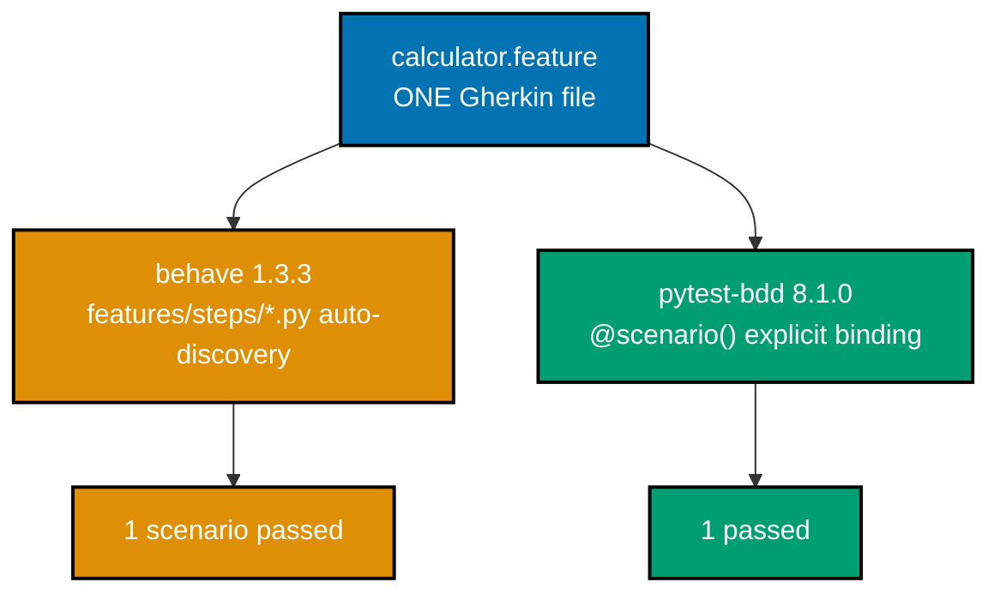

Behavior-Driven Development writes acceptance criteria as executable Gherkin -- Feature, Scenario,
Given/When/Then -- and binds each step to real code, so the SAME plain-language document that a
non-engineer can review is also the thing pytest (or behave) actually runs. Examples 81-86 build up
`pytest-bdd` 8.1.0 from a first scenario, through Gherkin's grammar and step-sharing mechanics, to a
Scenario Outline, a head-to-head with `behave` 1.3.3 against the identical `.feature` file, and a
worked BDD-vs-TDD decision. Every `.feature` file below is genuinely parsed and every scenario
genuinely executed -- none of this is prose describing what Gherkin "would" do.

---

### Example 81: One Given/When/Then Scenario, Bound to pytest-bdd

_ex-81 &middot; exercises co-28, co-30_

A `.feature` file describes ONE scenario in plain language; `@scenario` binds it to a pytest test;
`@given`/`@when`/`@then` supply the actual Python that runs when pytest executes it. The `.feature`
file is not documentation ABOUT the test -- it IS the test.


```gherkin
# learning/code/ex-81-pytest-bdd-first-scenario/features/greeting.feature
Feature: Greeting a user by name
  As a site visitor
  I want a personalized greeting
  So that the app feels welcoming

  Scenario: Say hello to a named visitor
    Given a visitor named "Ada"
    When the app greets the visitor
    Then the greeting is "Hello, Ada!"
```

```python
# learning/code/ex-81-pytest-bdd-first-scenario/test_example.py
"""Example 81: One Given/When/Then Scenario, Bound to pytest-bdd Step Definitions."""
# The .feature file below is not documentation ABOUT this test -- pytest-bdd PARSES it and
# @scenario binds it, so the plain-language Gherkin genuinely IS the executable test.

from __future__ import annotations  # => enables modern union/generic syntax under this pinned Python

from pytest_bdd import given, scenario, then, when  # => co-28/co-30: pytest-bdd 8.1.0's binding API  # fmt: skip
from pytest_bdd.parsers import parse  # => co-30: extracts the QUOTED "Ada" straight from the step text


@scenario("features/greeting.feature", "Say hello to a named visitor")  # => co-30: binds ONE  # fmt: skip
def test_say_hello_to_a_named_visitor() -> None:  # => co-02/co-28: the pytest TEST this scenario becomes
    """pytest-bdd generates the test body from the .feature file -- this docstring is just labeling."""  # fmt: skip


@given(parse('a visitor named "{name}"'), target_fixture="visitor_name")  # => co-30: captures {name}  # fmt: skip
def a_visitor_named(name: str) -> str:  # => co-28: the GIVEN -- establishes context  # fmt: skip
    return name  # => co-30: target_fixture publishes this AS a fixture later steps can request  # fmt: skip


@when("the app greets the visitor", target_fixture="greeting")  # => co-28: the WHEN -- the action  # fmt: skip
def the_app_greets_the_visitor(visitor_name: str) -> str:  # => co-30: requests the GIVEN's fixture  # fmt: skip
    return f"Hello, {visitor_name}!"  # => co-28: the action's OWN result, published as "greeting"  # fmt: skip


@then(parse('the greeting is "{expected}"'))  # => co-28: the THEN -- the outcome check  # fmt: skip
def the_greeting_is(greeting: str, expected: str) -> None:  # => co-30: requests the WHEN's fixture  # fmt: skip
    assert greeting == expected  # => co-28: ties the Gherkin scenario's outcome to a real assertion  # fmt: skip
```

**Run**: `pytest test_example.py -v -p no:warnings`

(`-p no:warnings` trims two `PytestRemovedIn10Warning` notices pytest-bdd 8.1.0 emits about its own
internal fixture-registration API against this pinned pytest 9.1.1 -- an upstream pytest-bdd/pytest
compatibility notice, unrelated to this lesson, and repeated in every pytest-bdd example below.)

**Output**:

```text
collecting ... collected 1 item

test_example.py::test_say_hello_to_a_named_visitor PASSED                [100%]

============================== 1 passed in 0.08s ===============================
```

**Key takeaway**: `@scenario` is the ONLY thing connecting the `.feature` file to this test -- the
scenario NAME string (`"Say hello to a named visitor"`) must match the Gherkin exactly, and pytest
reports the RESULT under a Python test name (`test_say_hello_to_a_named_visitor`) derived from the
decorated function, not from the Gherkin text itself.

**Why it matters**: The `.feature` file, written in plain Given/When/Then English, is the thing a
product owner or QA analyst can read and confirm WITHOUT ever opening `test_example.py` -- and it is
simultaneously the thing pytest actually executes. That dual role (readable spec AND executable
test) is BDD's entire value proposition, and this example is its smallest possible demonstration.

---

### Example 82: Gherkin's Grammar -- Feature, Scenario, Given, And, When, Then

_ex-82 &middot; exercises co-29_

Gherkin's `And` keyword inherits the type of the step immediately before it -- an `And` following a
`Given` IS a Given, bound with the SAME `@given` decorator, not a separate `@and` decorator that
does not exist.

```gherkin
# learning/code/ex-82-gherkin-feature-grammar/features/checkout_eligibility.feature
Feature: Checkout eligibility
  As a shopper
  I want to know when my cart can be checked out
  So that I am not blocked at the last step

  Scenario: A cart with items is eligible for checkout
    Given an empty cart
    And the cart has 2 items added to it
    When the shopper checks checkout eligibility
    Then the cart is eligible for checkout
```

```python
# learning/code/ex-82-gherkin-feature-grammar/test_example.py
"""Example 82: Gherkin Grammar -- Feature / Scenario / Given / And / When / Then, Parsed for Real."""
# There is no @and decorator in pytest-bdd's API -- Gherkin's And/But simply repeat the TYPE of
# the step immediately before them, and this file proves it by binding an "And" with plain @given.

from __future__ import annotations  # => enables modern union/generic syntax under this pinned Python

from pytest_bdd import given, scenario, then, when  # => co-29: Gherkin's And/But INHERIT the type  # fmt: skip
# => of the step before them -- pytest-bdd binds an "And" using the SAME decorator as its Given/When/Then


@scenario(  # => co-29: pytest-bdd PARSES the .feature file below -- this is not hand-written prose  # fmt: skip
    "features/checkout_eligibility.feature", "A cart with items is eligible for checkout"
)
def test_a_cart_with_items_is_eligible_for_checkout() -> None:  # => co-29: the parsed scenario's name  # fmt: skip
    """The Gherkin grammar drives this test -- Feature/Scenario/Given/And/When/Then, all present."""  # fmt: skip


@given("an empty cart", target_fixture="cart")  # => co-29: the Given keyword  # fmt: skip
def an_empty_cart() -> list[str]:  # => co-29: the very first step in the scenario  # fmt: skip
    return []  # => co-29: an empty list represents an empty cart  # fmt: skip


@given("the cart has 2 items added to it")  # => co-29: "And" after a Given IS a Given -- same binder  # fmt: skip
def the_cart_has_2_items(cart: list[str]) -> None:  # => co-29: receives the SAME "cart" fixture  # fmt: skip
    cart.append("item-1")  # => co-29: And-steps read the SAME Gherkin grammar as Given/When/Then  # fmt: skip
    cart.append("item-2")  # => co-29: the SECOND item -- cart now genuinely has two entries  # fmt: skip


@when("the shopper checks checkout eligibility", target_fixture="is_eligible")  # => co-29: When
def checks_checkout_eligibility(cart: list[str]) -> bool:  # => co-29: the ACTION step of the scenario  # fmt: skip
    return len(cart) > 0  # => co-29: eligibility rule -- a non-empty cart may check out  # fmt: skip


@then("the cart is eligible for checkout")  # => co-29: the Then keyword  # fmt: skip
def the_cart_is_eligible(is_eligible: bool) -> None:  # => co-29: requests the WHEN step's fixture  # fmt: skip
    assert is_eligible is True  # => co-29: ties the Gherkin outcome to a real Python assertion  # fmt: skip
```

**Run**: `pytest test_example.py -v -p no:warnings` and, separately,
`pytest test_example.py --collect-only -q` to show the Gherkin's own scenario NAME reaching pytest's
own collection output.

**Output**:

```text
collecting ... collected 1 item

test_example.py::test_a_cart_with_items_is_eligible_for_checkout PASSED  [100%]

============================== 1 passed in 0.11s ===============================
```

```text
test_example.py::test_a_cart_with_items_is_eligible_for_checkout

1 test collected in 0.06s
```

**Key takeaway**: There is no `@and` decorator anywhere in pytest-bdd's API -- Gherkin's `And` is
purely a REPETITION of the type before it (Given, When, or Then), and this example's `and`-step is
bound with a plain `@given`, proving that inheritance directly rather than asserting it in prose.

**Why it matters**: Misreading `And` as its own step type is a common first mistake when learning
Gherkin -- understanding that `And`/`But` simply continue the preceding keyword's category is what
makes a `.feature` file's grammar predictable to both the humans reading it and the framework
parsing it. This distinction also matters for step-definition reuse: because `And` binds to whichever
decorator matches its preceding keyword's category, a single `@given` (or `@when`, or `@then`) step
function can serve every `And` continuation in a scenario without any Gherkin-specific glue code.

---

### Example 83: Steps That Share State via a Context Fixture

_ex-83 &middot; exercises co-30_

A plain pytest fixture named `context` -- an ordinary mutable `dict` -- is requested by all three
step functions in this scenario. `Given` writes to it, `When` mutates it, `Then` reads it: ONE
fixture instance, flowing through the whole scenario.

```gherkin
# learning/code/ex-83-step-definition-shared-context/features/account_balance.feature
Feature: Account balance after a withdrawal
  As an account holder
  I want my balance updated after a withdrawal
  So that I always see the correct amount

  Scenario: Withdrawing less than the balance succeeds
    Given an account with a balance of 100
    When 50 is withdrawn from the account
    Then the account balance is 50
```

```python
# learning/code/ex-83-step-definition-shared-context/test_example.py
"""Example 83: Steps That Share State via a Context Fixture -- Set in Given, Asserted in Then."""
# A plain pytest fixture named "context" -- an ordinary mutable dict -- is requested by all three
# step functions below: Given writes to it, When mutates it, Then reads it -- ONE instance, shared.

from __future__ import annotations  # => enables modern union/generic syntax under this pinned Python

from collections.abc import Iterator  # => types the yield-based fixture's return below  # fmt: skip

import pytest  # => co-05: provides the @pytest.fixture decorator this example builds on  # fmt: skip
from pytest_bdd import given, scenario, then, when  # => co-30: pytest-bdd's binding decorators  # fmt: skip
from pytest_bdd.parsers import parse  # => co-30: extracts the TYPED {amount:d} placeholders below  # fmt: skip


@pytest.fixture
def context() -> Iterator[dict[str, int]]:  # => co-05/co-30: ONE mutable dict, shared by EVERY step  # fmt: skip
    """A plain pytest fixture -- pytest-bdd steps can request ordinary fixtures like this one too."""  # fmt: skip
    yield {}  # => co-30: starts EMPTY -- each step below reads/writes the SAME dict instance  # fmt: skip


@scenario("features/account_balance.feature", "Withdrawing less than the balance succeeds")
def test_withdrawing_less_than_the_balance_succeeds() -> None: ...  # => co-30: the bound scenario  # fmt: skip


@given(parse("an account with a balance of {amount:d}"))  # => co-30: {amount:d} parses an INT  # fmt: skip
def an_account_with_a_balance(context: dict[str, int], amount: int) -> None:  # => co-30: requests "context"
    context["balance"] = amount  # => co-30: WRITES into the SHARED context -- this is the "set" half  # fmt: skip


@when(parse("{amount:d} is withdrawn from the account"))  # => co-30: a SECOND typed parameter  # fmt: skip
def withdraw_from_the_account(context: dict[str, int], amount: int) -> None:  # => the SAME context  # fmt: skip
    context["balance"] -= amount  # => co-30: MUTATES the value the Given step wrote, in place  # fmt: skip


@then(parse("the account balance is {expected:d}"))  # => co-30: the THEN reads what changed  # fmt: skip
def the_account_balance_is(context: dict[str, int], expected: int) -> None:  # => the SAME context AGAIN
    assert context["balance"] == expected  # => co-30: the value set in Given, mutated in When, is  # fmt: skip
    # => now asserted in Then -- ONE dict instance, flowing through all three step functions  # fmt: skip
```

**Run**: `pytest test_example.py -v`

**Output**:

```text
collecting ... collected 1 item

test_example.py::test_withdrawing_less_than_the_balance_succeeds PASSED  [100%]

============================== 1 passed in 0.08s ===============================
```

**Key takeaway**: `context["balance"]` is set to `100` in the `@given`, mutated to `50` in the
`@when`, and read as `50` in the `@then` -- pytest's own fixture-injection mechanism is what threads
this ONE dict through three separately-defined functions, requiring no manual wiring.

**Why it matters**: Gherkin scenarios routinely need to pass state from Given through When to Then
(a created ID, a computed value, an account balance) -- a shared fixture is pytest-bdd's idiomatic
way to do this, reusing pytest's own dependency-injection mechanism rather than introducing a
separate, BDD-specific state-passing convention.

---

### Example 84: One Scenario Outline, Driven Over an Examples Table

_ex-84 &middot; exercises co-31_

A `Scenario Outline` with an `Examples` table runs its `<placeholder>`-templated steps once PER ROW
-- pytest-bdd expands three table rows into three separate, separately-reported test cases, each
substituting its own row's values.

```gherkin
# learning/code/ex-84-scenario-outline-examples-table/features/shipping_tier.feature
Feature: Shipping tier by order total
  As a store
  I want the shipping tier to depend on the order total
  So that larger orders qualify for cheaper shipping

  Scenario Outline: Order total determines the shipping tier
    Given an order total of <total>
    When the shipping tier is computed
    Then the tier is "<tier>"

    Examples:
      | total | tier      |
      | 10    | standard  |
      | 60    | discounted|
      | 150   | free      |
```

```python
# learning/code/ex-84-scenario-outline-examples-table/test_example.py
"""Example 84: One Scenario Outline, Driven Over an Examples Table -- Each Row, Its Own Case."""
# A Scenario Outline with an Examples table runs its <placeholder>-templated steps once PER ROW --
# pytest-bdd expands three table rows into three separately-reported test cases, Gherkin's own
# version of parametrization (co-06), covering three shipping thresholds without repeating prose.

from __future__ import annotations  # => enables modern union/generic syntax under this pinned Python

from pytest_bdd import given, scenario, then, when  # => co-31: pytest-bdd's binding decorators  # fmt: skip
from pytest_bdd.parsers import parse  # => co-31: extracts the TYPED <total>/<tier> placeholders  # fmt: skip


def shipping_tier(total: float) -> str:  # => co-31: the pure logic each Examples row exercises  # fmt: skip
    if total >= 100:  # => co-31: the THIRD row's threshold -- exercised by total=150  # fmt: skip
        return "free"  # => co-31: the highest tier, reached only above the top threshold  # fmt: skip
    if total >= 50:  # => co-31: the SECOND row's threshold -- exercised by total=60  # fmt: skip
        return "discounted"  # => co-31: the middle tier  # fmt: skip
    return "standard"  # => co-31: the FIRST row's fallback -- exercised by total=10  # fmt: skip


@scenario(  # => co-31: pytest-bdd expands the Examples TABLE into one test PER ROW automatically  # fmt: skip
    "features/shipping_tier.feature", "Order total determines the shipping tier"
)
def test_order_total_determines_the_shipping_tier() -> None: ...  # => co-31/co-06: the outline's ONE  # fmt: skip
# => scenario name -- pytest reports it as MULTIPLE test IDs, one per Examples row, below


@given(parse("an order total of {total:d}"), target_fixture="total")  # => co-31: <total> substituted  # fmt: skip
def an_order_total(total: int) -> int:  # => co-06: a DIFFERENT int per row -- 10, then 60, then 150  # fmt: skip
    return total  # => co-31: published as the "total" fixture the WHEN step below requests  # fmt: skip


@when("the shipping tier is computed", target_fixture="tier")  # => co-31: the SAME action, every row  # fmt: skip
def the_shipping_tier_is_computed(total: int) -> str:  # => co-31: requests the GIVEN's "total" fixture  # fmt: skip
    return shipping_tier(total)  # => co-31: the SAME pure function tested directly at the top of this file


@then(parse('the tier is "{expected}"'))  # => co-31: <tier> substituted -- checked against EACH row's own value
def the_tier_is(tier: str, expected: str) -> None:  # => co-31: requests the WHEN step's "tier" fixture  # fmt: skip
    assert tier == expected  # => co-31: three DIFFERENT expected values, three DIFFERENT real checks  # fmt: skip
```

**Run**: `pytest test_example.py -v -p no:warnings`

**Output**:

```text
collecting ... collected 3 items

test_example.py::test_order_total_determines_the_shipping_tier[10-standard] PASSED [ 33%]
test_example.py::test_order_total_determines_the_shipping_tier[60-discounted] PASSED [ 66%]
test_example.py::test_order_total_determines_the_shipping_tier[150-free] PASSED [100%]

============================== 3 passed in 0.13s ===============================
```

**Key takeaway**: `collected 3 items` -- ONE `Scenario Outline` block in the `.feature` file became
THREE independently-reported pytest test IDs, each named after its own row's `total`/`tier` pair
(`[10-standard]`, `[60-discounted]`, `[150-free]`), exactly the way `@pytest.mark.parametrize` (co-06)
names parametrized cases.

**Why it matters**: A `Scenario Outline` is Gherkin's own version of parametrization (co-06) -- it
lets a single, readable behavior description cover many concrete cases (here: three shipping-total
thresholds) without duplicating the Given/When/Then prose three times, while still reporting each
row as its own separately pass/fail-able test. A common pitfall: teams new to BDD sometimes write a
separate Scenario for each row instead, which duplicates the same Given/When/Then text repeatedly
and makes it easy for the scenarios to silently drift out of sync as the feature evolves.

---

### Example 85: behave and pytest-bdd, Run Against the Identical `.feature` File

_ex-85 &middot; exercises co-29, co-30_

The SAME `calculator.feature` file, unmodified, is genuinely bound and run by TWO independent BDD
tools: `behave` 1.3.3 (via its own `features/steps/` auto-discovery convention) and `pytest-bdd`
8.1.0 (via `@scenario`). Both tools parse the identical Gherkin text and both report the identical
scenario green -- through entirely separate binding mechanisms.



```gherkin
# learning/code/ex-85-behave-vs-pytest-bdd-same-feature/features/calculator.feature
Feature: Adding two numbers
  As a user of the calculator
  I want to add two numbers
  So that I get their sum

  Scenario: Add two positive numbers
    Given the number 4
    And the number 5
    When the numbers are added
    Then the result is 9
```

**Half 1 -- behave** (auto-discovered from `features/steps/calculator_steps.py`, behave's own
convention -- no explicit `@scenario` binding needed, unlike pytest-bdd):

```python
# learning/code/ex-85-behave-vs-pytest-bdd-same-feature/features/steps/calculator_steps.py
"""Example 85 (behave half): step definitions for features/calculator.feature, behave-style."""
# behave auto-discovers THIS file from features/steps/ -- no explicit @scenario binding call
# anywhere, unlike pytest-bdd's half of this same example, further down in the same .feature file.

from __future__ import annotations  # => enables modern union/generic syntax under this pinned Python

from behave import given, then, when  # => co-30: behave 1.3.3's OWN decorator API, not pytest-bdd's  # fmt: skip
from behave.runner import Context  # => co-30: behave passes "context" as the FIRST arg to every step


@given("the number {value:d}")  # => co-29/co-30: behave ALSO supports typed {value:d} parsing  # fmt: skip
def step_given_number(context: Context, value: int) -> None:  # => co-30: "context" carries state  # fmt: skip
    if not hasattr(context, "numbers"):  # => co-30: context PERSISTS across every step in a scenario  # fmt: skip
        context.numbers = []  # type: ignore[attr-defined]  # => co-30: initialized ONCE, on the FIRST Given
    context.numbers.append(value)  # type: ignore[attr-defined]  # => co-30: "And" reuses this SAME @given  # fmt: skip


@when("the numbers are added")  # => co-30: behave's own @when decorator  # fmt: skip
def step_when_added(context: Context) -> None:  # => co-30: reads the numbers the Given steps built up  # fmt: skip
    context.result = sum(context.numbers)  # type: ignore[attr-defined]  # => co-30: WRITES to context  # fmt: skip


@then("the result is {expected:d}")  # => co-30: behave's own @then decorator  # fmt: skip
def step_then_result(context: Context, expected: int) -> None:  # => co-30: the SAME context, final read
    assert context.result == expected  # type: ignore[attr-defined]  # => co-30: READS from context  # fmt: skip
```

**Half 2 -- pytest-bdd** (a plain fixture playing behave's `context`-persistence role, mutated in
place across steps, exactly as Example 83's `context` fixture was):

```python
# learning/code/ex-85-behave-vs-pytest-bdd-same-feature/test_example.py
"""Example 85 (pytest-bdd half): the SAME features/calculator.feature, bound a SECOND way."""
# Run this file's scenario with pytest, and run the identical features/calculator.feature with
# behave (see features/steps/calculator_steps.py) -- both tools parse the SAME Gherkin text and
# both report the SAME scenario green, via two entirely independent binding mechanisms (co-29,
# co-30). A TypeScript project would reach for Cucumber.js (@cucumber/cucumber 13.1.0) to run
# this same .feature file instead -- not exercised here, since this repo's pinned BDD stack for
# the actually-run half is Python-only (pytest-bdd + behave).

from __future__ import annotations  # => enables modern union/generic syntax under this pinned Python

import pytest  # => co-05: provides the plain @pytest.fixture below, alongside pytest-bdd's own API
from pytest_bdd import given, scenario, then, when  # => co-30: pytest-bdd's OWN, DIFFERENT binding API  # fmt: skip
from pytest_bdd.parsers import parse  # => co-30: extracts the TYPED {value:d}/{expected:d} placeholders


@pytest.fixture
def numbers() -> list[int]:  # => co-30: a PLAIN pytest fixture -- mutated in place by BOTH the  # fmt: skip
    return []  # => Given AND the And step below, exactly like behave's "context" list did  # fmt: skip


@scenario("features/calculator.feature", "Add two positive numbers")  # => co-29: the SAME .feature file  # fmt: skip
def test_add_two_positive_numbers() -> None: ...  # => co-30: pytest-bdd's binding, independent of behave's


@given(parse("the number {value:d}"))  # => co-29/co-30: pytest-bdd binds this SAME pattern to BOTH  # fmt: skip
def the_number(value: int, numbers: list[int]) -> None:  # => "Given the number 4" AND "And the number 5"  # fmt: skip
    numbers.append(value)  # => co-30: mutates the SHARED "numbers" fixture in place, called TWICE  # fmt: skip


@when("the numbers are added", target_fixture="result")  # => co-30: pytest-bdd's @when  # fmt: skip
def the_numbers_are_added(numbers: list[int]) -> int:  # => co-30: requests the SAME "numbers" fixture  # fmt: skip
    return sum(numbers)  # => co-30: published as "result" for the THEN step to request below  # fmt: skip


@then(parse("the result is {expected:d}"))  # => co-30: pytest-bdd's @then  # fmt: skip
def the_result_is(result: int, expected: int) -> None:  # => co-30: requests the WHEN step's "result"  # fmt: skip
    assert result == expected  # => co-30: the SAME outcome behave's step_then_result() checked too  # fmt: skip
```

**Run**: `behave` (from the example root, auto-discovers `features/`) and, separately,
`pytest test_example.py -v -p no:warnings`

**Output** (behave):

```text
USING RUNNER: behave.runner:Runner
Feature: Adding two numbers # features/calculator.feature:1
  As a user of the calculator
  I want to add two numbers
  So that I get their sum
  Scenario: Add two positive numbers  # features/calculator.feature:6
    Given the number 4                # features/steps/calculator_steps.py:11
    And the number 5                  # features/steps/calculator_steps.py:11
    When the numbers are added        # features/steps/calculator_steps.py:18
    Then the result is 9              # features/steps/calculator_steps.py:23

1 feature passed, 0 failed, 0 skipped
1 scenario passed, 0 failed, 0 skipped
4 steps passed, 0 failed, 0 skipped
Took 0min 0.000s
```

**Output** (pytest-bdd):

```text
collecting ... collected 1 item

test_example.py::test_add_two_positive_numbers PASSED                    [100%]

============================== 1 passed in 0.08s ===============================
```

**Key takeaway**: behave's own report shows the Gherkin steps THEMSELVES, annotated with which line
of `calculator_steps.py` matched each one -- a direct, line-level trace from feature text to Python
step -- while pytest-bdd folds the same scenario into ONE pytest test ID, reported like any other
pytest result.

**Why it matters**: `pytest-bdd` and `behave` are the two dominant Python BDD runners, and they
genuinely differ in binding style -- `behave`'s convention-based `features/steps/` auto-discovery
versus `pytest-bdd`'s explicit `@scenario` decorator -- while both correctly execute the identical,
tool-agnostic Gherkin `.feature` file. A team choosing between them is choosing a BINDING mechanism
and a reporting style, not a different behavior specification language.

---

### Example 86: One Codebase, Two Changes -- Which Gets a Unit Test, Which Gets a BDD Scenario

_ex-86 &middot; exercises co-32_

`round_to_cents()` is an internal utility -- low risk, engineer-only audience -- and gets a fast TDD
unit test. `calculate_late_fee()` is a business RULE that charges real members real money -- higher
risk, and a librarian/product owner needs to be able to read and confirm it -- so it gets a Gherkin
scenario instead. Same file, same test run, two deliberately different testing choices, each
justified by co-32's risk-and-audience framework.

```gherkin
# learning/code/ex-86-bdd-vs-tdd-decision/features/late_fee.feature
Feature: Late fee for overdue book returns
  As a librarian
  I want overdue books to accrue a fee
  So that members return books on time

  Scenario: A book returned 3 days late accrues a fee
    Given a book is 3 days overdue
    When the late fee is calculated
    Then the fee is 1.50
```

```python
# learning/code/ex-86-bdd-vs-tdd-decision/test_example.py
"""Example 86: One Change, Two Changes -- Which One Earns a TDD Unit Test, Which One a BDD Scenario."""
# round_to_cents() is internal -- low risk, engineer-only audience -- so it gets a fast TDD unit
# test. calculate_late_fee() charges real members real money -- higher risk, and a librarian
# needs to read and confirm it -- so it gets a Gherkin scenario instead (co-32's framework).

from __future__ import annotations  # => enables modern union/generic syntax under this pinned Python

from pytest_bdd import given, scenario, then, when  # => co-28/co-30: only Change B below needs this  # fmt: skip
from pytest_bdd.parsers import parse  # => co-30: extracts Change B's typed {days:d}/{expected:f}  # fmt: skip

# =============================================================================
# Change A: round_to_cents() -- an INTERNAL utility. co-32 decision: unit TDD.
#
# Risk: low, contained to one pure function. Audience: only engineers ever read
# or care about this code's internals -- a librarian has no opinion on IEEE-754
# rounding. A Gherkin scenario here would translate a math detail into fake
# "ubiquitous language" nobody outside engineering would ever actually read.
# =============================================================================


def round_to_cents(amount: float) -> float:  # => co-17: unit-TDD'd -- see Run block for red->green
    return round(amount, 2)  # => co-17: Python's OWN banker's rounding -- the behavior under test  # fmt: skip


def test_unit_round_to_cents_handles_floating_point_noise() -> None:  # => co-01/co-17: fast, isolated
    assert round_to_cents(1.005) == 1.0  # => co-17: pins down a KNOWN float-rounding edge case  # fmt: skip


def test_unit_round_to_cents_leaves_exact_values_unchanged() -> None:  # => co-01: a second, boring case
    assert round_to_cents(2.50) == 2.50  # => co-17: confirms an already-exact value stays untouched  # fmt: skip


# =============================================================================
# Change B: the "late fee" RULE -- a business policy. co-32 decision: BDD scenario.
#
# Risk: getting the RULE wrong charges (or fails to charge) real members real
# money -- a librarian/product owner MUST be able to read and confirm this
# exact behavior without reading Python. That is precisely BDD's audience
# argument (co-28): the .feature file IS the shared, readable spec.
# =============================================================================


def calculate_late_fee(days_overdue: int, rate_per_day: float = 0.50) -> float:  # => co-28: the RULE
    return round(days_overdue * rate_per_day, 2)  # => co-28: the exact math a librarian never reads  # fmt: skip


@scenario("features/late_fee.feature", "A book returned 3 days late accrues a fee")  # => co-28: bound
def test_a_book_returned_3_days_late_accrues_a_fee() -> None: ...  # => co-32: THIS is the acceptance  # fmt: skip
# => test a librarian could review by reading the .feature file alone, never opening this .py file


@given(parse("a book is {days:d} days overdue"), target_fixture="days_overdue")  # => co-28: the GIVEN  # fmt: skip
def a_book_is_days_overdue(days: int) -> int:  # => co-30: captures the typed {days:d} placeholder  # fmt: skip
    return days  # => co-30: published as "days_overdue" for the WHEN step below to request  # fmt: skip


@when("the late fee is calculated", target_fixture="fee")  # => co-28: the WHEN -- the action itself  # fmt: skip
def the_late_fee_is_calculated(days_overdue: int) -> float:  # => co-30: requests the GIVEN's fixture  # fmt: skip
    return calculate_late_fee(days_overdue)  # => co-32: the SAME rule the unit tier could ALSO test  # fmt: skip
    # => directly -- but the STAKEHOLDER-FACING contract lives here, in Gherkin, not in a unit test


@then(parse("the fee is {expected:f}"))  # => co-28: the THEN -- the librarian-readable outcome check  # fmt: skip
def the_fee_is(fee: float, expected: float) -> None:  # => co-30: requests the WHEN step's "fee" fixture
    assert fee == expected  # => co-28: ties the Gherkin scenario's outcome to a real Python assertion  # fmt: skip
```

**Run**: `pytest test_example.py -v -p no:warnings`

**Output**:

```text
collecting ... collected 3 items

test_example.py::test_unit_round_to_cents_handles_floating_point_noise PASSED [ 33%]
test_example.py::test_unit_round_to_cents_leaves_exact_values_unchanged PASSED [ 66%]
test_example.py::test_a_book_returned_3_days_late_accrues_a_fee PASSED   [100%]

============================== 3 passed in 0.08s ===============================
```

**Key takeaway**: All three tests pass in the SAME pytest run, using TWO different testing
approaches side by side -- the first two IDs are ordinary unit tests with no Gherkin involved at
all, and the third ID is the SAME kind of pytest result, but generated FROM a `.feature` file a
non-engineer could review independently.

**Why it matters**: BDD is not a replacement for unit testing -- co-32's decision framework says
choose BDD when a scenario's RISK (a wrong business rule reaching production) and AUDIENCE (people
who cannot read Python) both justify the extra ceremony of a `.feature` file, and choose plain unit
TDD everywhere else. Applying BDD to every internal utility function produces `.feature` files no
one outside engineering ever reads -- exactly the failure mode this example's Change A deliberately
avoids.

---

← Previous: [Advanced Examples](./advanced.md) &middot; Next: [Capstone](./capstone/overview.md) →
