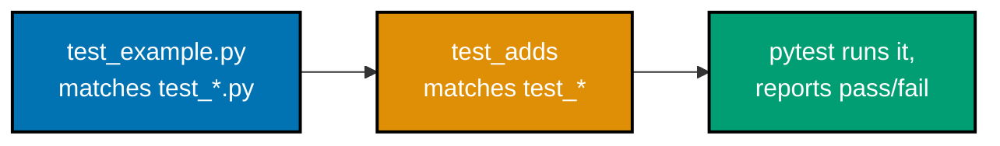
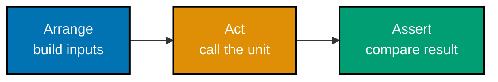
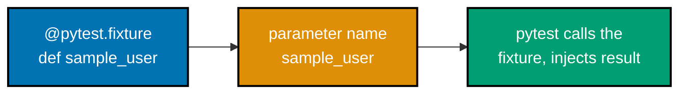
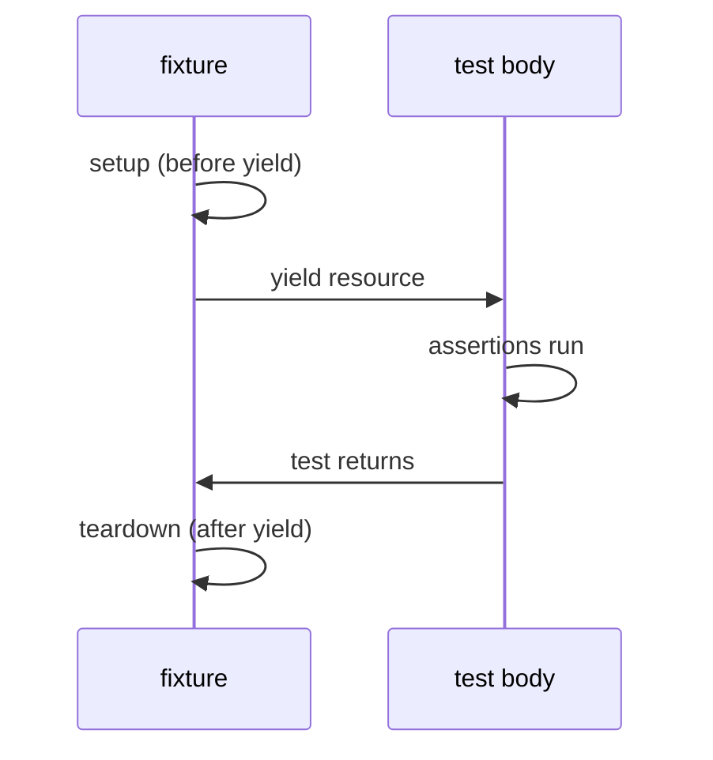
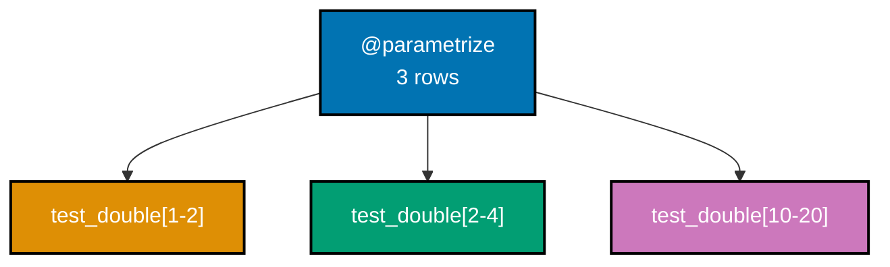
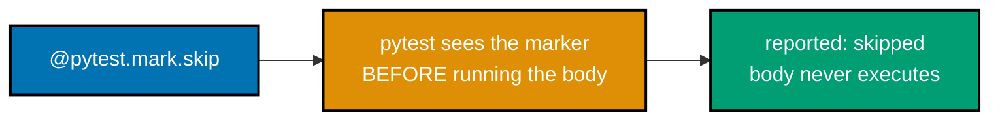
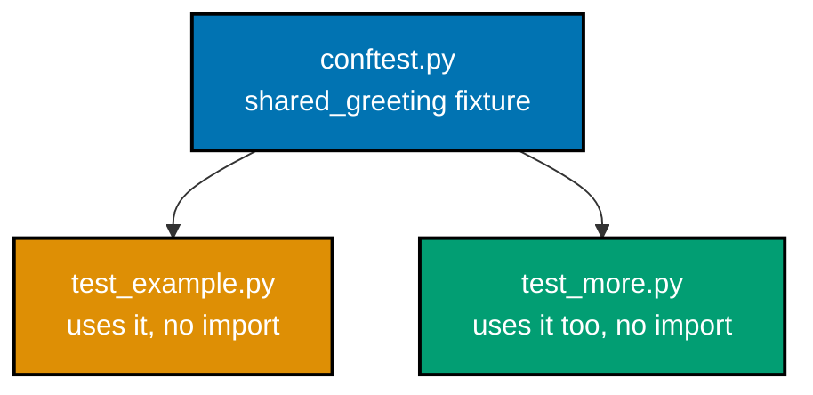
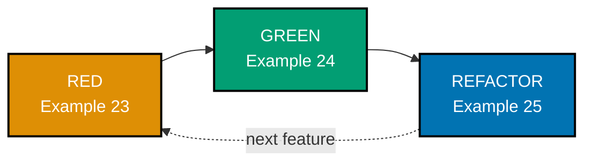

Examples 1-28 cover pytest's core vocabulary: discovery, plain `assert`, exceptions, floats,
fixtures, parametrization, markers, class-based grouping, `conftest.py`, and a first pass through
TDD's red-green-refactor cycle. Every `test_example.py` below is a complete, self-contained file
under `learning/code/ex-NN-*/`, run for real with **pytest 9.1.1** on **Python 3.13.12**. Every
`**Output**` block is a genuine, captured transcript, trimmed only of the identical
`platform`/`cachedir`/`hypothesis profile`/`rootdir`/`plugins` preamble lines pytest prints on every
run in this sandbox -- every remaining line, including every failure, skip, and xfail, is verbatim.

---

### Example 1: First Passing Test

_ex-01 &middot; exercises co-01, co-02_

The smallest possible pytest test: one function whose name starts with `test_`, in a file whose name
starts with `test_`, containing one `assert`. Nothing about this requires a test class, a base class,
or any registration step -- pytest's discovery rule alone is enough (co-02).



```python
# learning/code/ex-01-first-passing-test/test_example.py
"""Example 1: First Passing Test."""

# ex-01: the smallest possible pytest test -- one function, one assert
# -- pytest discovers this file because it matches test_*.py (co-02)
# -- and discovers the function below because it matches test_* (co-02)
def add(a: int, b: int) -> int:  # => the unit under test: a plain, pure function
    return a + b  # => no test framework involvement at all inside the function itself


def test_adds() -> None:  # => the test function -- name MUST start with test_ to be discovered
    assert add(2, 3) == 5  # => arrange (2, 3) + act (call add) + assert, all on one line (co-01)
    # => if add(2, 3) had returned anything other than 5, pytest would report a failure here
```

**Run**: `pytest -v test_example.py`

**Output**:

```text
collected 1 item

test_example.py::test_adds PASSED                                        [100%]

============================== 1 passed in 0.08s ===============================
```

**Key takeaway**: A file named `test_*.py` containing a function named `test_*` is a complete, valid
pytest test -- no imports of a testing framework's base class, no registration, no boilerplate.

**Why it matters**: Every other example in this topic builds on exactly this discovery mechanism --
fixtures, parametrization, and markers all attach to a `test_*` function discovered this same way.
Contrast this with frameworks that require inheriting from a `TestCase` base class: pytest's
convention-over-configuration discovery is precisely why a brand-new test file needs zero setup
before its first assertion runs, which matters the first time a new engineer adds a test to an
unfamiliar codebase.

---

### Example 2: Failing Test Output

_ex-02 &middot; exercises co-03_

A deliberately wrong assertion, so the actual failure report can be read. pytest rewrites the `assert`
statement at import time to capture and print both sides of the comparison -- no `assertEqual`-style
method is needed for this introspection (co-03).

```python
# learning/code/ex-02-failing-test-output/test_example.py
"""Example 2: Failing Test Output."""

# ex-02: a DELIBERATELY wrong assertion -- this test is meant to fail
# -- the point is to see pytest's expression introspection, not to pass (co-03)
def add(a: int, b: int) -> int:  # => the same pure function as ex-01
    return a + b  # => genuinely returns 5 for add(2, 3) -- the test below expects 6 instead


def test_adds_wrong_expectation() -> None:  # => named honestly -- this SHOULD fail
    assert add(2, 3) == 6  # => plain assert -- pytest rewrites this at import time (co-03)
    # => pytest's assertion rewriting inspects BOTH sides of == and shows the actual
    # => value (5) next to the expected literal (6), with no assertNotEqual-style API needed
```

**Run**: `pytest -v test_example.py`

**Output**:

```text
collected 1 item

test_example.py::test_adds_wrong_expectation FAILED                      [100%]

=================================== FAILURES ===================================
_________________________ test_adds_wrong_expectation __________________________

    def test_adds_wrong_expectation() -> None:  # => named honestly -- this SHOULD fail
>       assert add(2, 3) == 6  # => plain assert -- pytest rewrites this at import time (co-03)
        ^^^^^^^^^^^^^^^^^^^^^
E       assert 5 == 6
E        +  where 5 = add(2, 3)

test_example.py:11: AssertionError
=========================== short test summary info ============================
FAILED test_example.py::test_adds_wrong_expectation - assert 5 == 6
============================== 1 failed in 0.09s ===============================
```

**Key takeaway**: `assert 5 == 6` plus `+ where 5 = add(2, 3)` is pytest's introspection showing BOTH
the literal comparison and where the actual value (`5`) came from -- a plain `assert`, no special API.

**Why it matters**: This exact introspection is why pytest needs no `assertEqual`/`assertTrue`/
`assertIn` method zoo the way `unittest` does -- one keyword, `assert`, covers every comparison, and
the failure report is generated by inspecting the expression itself. Reading a report like this
quickly, distinguishing the expected literal from the actual computed value, is the single most
common skill in day-to-day test-driven work -- Example 74 (Advanced tier) returns to reading a more
elaborate traceback under real production pressure.

---

### Example 3: Arrange-Act-Assert

_ex-03 &middot; exercises co-01_

The same shape as Example 1, restructured into three visually distinct phases: Arrange (build
inputs), Act (call the one thing under test), Assert (compare the result). AAA is a naming
convention, not a pytest feature -- nothing here is pytest-specific syntax (co-01).



```python
# learning/code/ex-03-arrange-act-assert/test_example.py
"""Example 3: Arrange-Act-Assert."""

# ex-03: the SAME test as ex-01, restructured into three visually distinct phases (co-01)
# -- AAA is a convention, not a pytest feature -- nothing here is pytest-specific syntax
def multiply(a: int, b: int) -> int:  # => the unit under test
    return a * b  # => a pure function -- no I/O, no hidden state (co-26)


def test_multiply_arrange_act_assert() -> None:
    # --- Arrange: build the inputs the test needs, named clearly ---
    first_factor = 6  # => arrange phase, part 1: a plain input value
    second_factor = 7  # => arrange phase, part 2: a second plain input value
    expected = 42  # => arrange phase, part 3: the expected RESULT, computed by hand

    # --- Act: call the ONE thing under test, exactly once ---
    actual = multiply(first_factor, second_factor)  # => act phase -- the single call being tested  # fmt: skip

    # --- Assert: compare what happened against what was expected ---
    assert actual == expected  # => assert phase -- the only line that can fail this test
```

**Run**: `pytest -v test_example.py`

**Output**:

```text
collected 1 item

test_example.py::test_multiply_arrange_act_assert PASSED                 [100%]

============================== 1 passed in 0.07s ===============================
```

**Key takeaway**: Naming and grouping a test's three phases -- even in a test this small -- makes
intent legible at a glance, which pays off enormously once a test body grows past a few lines.

**Why it matters**: A test with tangled setup, action, and checking is hard to review and hard to
extend safely; AAA is the cheapest possible discipline against that drift. Example 57 (Intermediate
tier) shows AAA applied to a test that also involves a test double, where the phase boundaries matter
even more -- knowing which lines are "arrange" versus "assert" is what lets a reviewer spot a test
that is checking the wrong thing at a glance.

---

### Example 4: Run a Single Test by Name

_ex-04 &middot; exercises co-02_

Three tests live in one file; `pytest path::test_name` runs exactly one of them. pytest's node ID
syntax (`file::function`) is how the CLI selects a single test out of a larger collection (co-02).

```python
# learning/code/ex-04-run-single-test/test_example.py
"""Example 4: Run a Single Test by Name."""

# ex-04: THREE tests in one file -- run only ONE of them by name (co-02)
def square(n: int) -> int:  # => the unit under test
    return n * n  # => a pure function, reused by all three tests below


def test_square_of_two() -> None:  # => test A -- the one we will select by name below
    assert square(2) == 4  # => 2*2 -- passes


def test_square_of_three() -> None:  # => test B -- deliberately NOT selected below
    assert square(3) == 9  # => 3*3 -- passes, but never runs in this example's command


def test_square_of_negative() -> None:  # => test C -- also NOT selected below
    assert square(-4) == 16  # => (-4)*(-4) -- passes, but also skipped by the selector
```

**Run**: `pytest -v test_example.py` (all three), then `pytest -v test_example.py::test_square_of_two`
(one)

**Output** (all three):

```text
collected 3 items

test_example.py::test_square_of_two PASSED                               [ 33%]
test_example.py::test_square_of_three PASSED                             [ 66%]
test_example.py::test_square_of_negative PASSED                          [100%]

============================== 3 passed in 0.07s ===============================
```

**Output** (single test):

```text
collected 1 item

test_example.py::test_square_of_two PASSED                               [100%]

============================== 1 passed in 0.07s ===============================
```

**Key takeaway**: `pytest test_example.py::test_square_of_two` collects exactly one item, not three --
the `::` node-ID syntax is pytest's way to address a single test unambiguously from the CLI.

**Why it matters**: Running one test by name is the fastest possible feedback loop while actively
writing or debugging that specific test -- re-running an entire suite (or even an entire file) for
every keystroke wastes time that adds up across a working session. Example 20's `-k` keyword
selection and Example 19's `-m` marker selection both generalize this same idea to running MORE than
one, but still fewer than all, tests.

---

### Example 5: Assert Equality

_ex-05 &middot; exercises co-03_

`==` and `!=` are the most common assertion shapes in any suite -- both are ordinary Python operators,
compared by value rather than identity, and both work directly inside a plain `assert` (co-03).

```python
# learning/code/ex-05-assert-equality/test_example.py
"""Example 5: Assert Equality."""

# ex-05: equality assertions -- the most common assertion shape in any test suite (co-03)
def to_upper(text: str) -> str:  # => the unit under test
    return text.upper()  # => stdlib str.upper -- deterministic, no locale surprises here


def test_equality_passes_on_a_match() -> None:  # => the "happy path" half of this example
    assert to_upper("hello") == "HELLO"  # => == compares by VALUE, not identity (co-03)


def test_equality_fails_on_a_mismatch() -> None:  # => proves == genuinely discriminates
    assert to_upper("hello") != "hello"  # => != is equality's negation -- also a plain assert
    # => this line is deliberately the OPPOSITE assertion (!=) so the test itself passes
    # => while still demonstrating that a naive equality check would have failed here
```

**Run**: `pytest -v test_example.py`

**Output**:

```text
collected 2 items

test_example.py::test_equality_passes_on_a_match PASSED                  [ 50%]
test_example.py::test_equality_fails_on_a_mismatch PASSED                [100%]

============================== 2 passed in 0.06s ===============================
```

**Key takeaway**: `==` and `!=` inside a plain `assert` are all pytest needs for value-based equality
checks -- there is no separate `assertEquals`/`assertNotEquals` method to remember or import.

**Why it matters**: Equality checks are the backbone of almost every test in this entire topic --
every fixture, mock, and property-based test eventually reduces to comparing an actual value against
an expected one with `==`. Being fluent in reading `assert actual == expected` on sight, and knowing
it is ordinary Python rather than pytest-specific magic, is the foundation every later, fancier
assertion style in this topic builds on.

---

### Example 6: Assert Truthiness

_ex-06 &middot; exercises co-03_

A bare boolean condition is a complete assertion -- no `== True` needed. The second test here
deliberately fails, to show pytest reporting both the failing expression and an optional custom
message string (co-03).

```python
# learning/code/ex-06-assert-truthiness/test_example.py
"""Example 6: Assert Truthiness."""

# ex-06: a plain boolean-condition assert, then a DELIBERATE failure right after it (co-03)
def is_even(n: int) -> bool:  # => the unit under test
    return n % 2 == 0  # => returns a genuine bool, not a string or 0/1


def test_truthiness_of_a_boolean_condition() -> None:  # => passes -- shown for contrast below
    assert is_even(4)  # => truthy assert: no "== True" needed, a bare bool is enough (co-03)


def test_truthiness_reports_operands_on_failure() -> None:  # => THIS ONE deliberately fails
    assert is_even(7), "7 should be odd, so is_even(7) must be False"  # => optional message string  # fmt: skip
    # => pytest prints BOTH the failing expression (is_even(7)) and this custom message --
    # => the introspection shown here is what "assert truthiness reports operands" means
```

**Run**: `pytest -v test_example.py`

**Output**:

```text
collected 2 items

test_example.py::test_truthiness_of_a_boolean_condition PASSED           [ 50%]
test_example.py::test_truthiness_reports_operands_on_failure FAILED      [100%]

=================================== FAILURES ===================================
_________________ test_truthiness_reports_operands_on_failure __________________

    def test_truthiness_reports_operands_on_failure() -> None:  # => THIS ONE deliberately fails
>       assert is_even(7), "7 should be odd, so is_even(7) must be False"  # => optional message string  # fmt: skip
        ^^^^^^^^^^^^^^^^^^^^^^^^^^^^^^^^^^^^^^^^^^^^^^^^^^^^^^^^^^^^^^^^^
E       AssertionError: 7 should be odd, so is_even(7) must be False
E       assert False
E        +  where False = is_even(7)

test_example.py:14: AssertionError
=========================== short test summary info ============================
FAILED test_example.py::test_truthiness_reports_operands_on_failure - Asserti...
========================= 1 failed, 1 passed in 0.09s ==========================
```

**Key takeaway**: A bare `assert is_even(4)` needs no comparison operator at all -- and an optional
message string after a comma prints alongside pytest's own automatic operand introspection on failure.

**Why it matters**: Custom assertion messages matter most on a boolean condition, since pytest's
automatic introspection can only show `assert False` -- it cannot show WHAT was expected to be true
without your own words. In a CI failure log read by a teammate who did not write the test, a message
like this one is frequently the difference between an instant diagnosis and a multi-minute dig through
the test's source code.

---

### Example 7: Assert Membership

_ex-07 &middot; exercises co-03_

Membership -- "is X inside this collection?" -- uses Python's own `in`/`not in` operators directly
inside a plain `assert`, with no separate `assertIn`/`assertNotIn` API (co-03).

```python
# learning/code/ex-07-assert-membership/test_example.py
"""Example 7: Assert Membership."""

# ex-07: membership assertions -- "is X inside this collection?" (co-03)
def supported_formats() -> list[str]:  # => the unit under test: a fixed list of formats
    return ["json", "xml", "csv"]  # => a plain list -- membership uses Python's "in" operator


def test_membership_passes_for_a_present_element() -> None:  # => the "in" happy path
    formats = supported_formats()  # => arrange: call the function once, reuse the result
    assert "json" in formats  # => act+assert combined: "in" is itself the check (co-03)


def test_membership_for_an_absent_element() -> None:  # => the "not in" negation, its own test
    formats = supported_formats()  # => same arrange step, independent test (co-26 isolation)
    assert "yaml" not in formats  # => "not in" is membership's negation -- equally a plain assert  # fmt: skip
```

**Run**: `pytest -v test_example.py`

**Output**:

```text
collected 2 items

test_example.py::test_membership_passes_for_a_present_element PASSED     [ 50%]
test_example.py::test_membership_for_an_absent_element PASSED            [100%]

============================== 2 passed in 0.07s ===============================
```

**Key takeaway**: `"json" in formats` and `"yaml" not in formats` are complete assertions on their
own -- membership checking needs no framework-specific method, only Python's built-in `in` operator.

**Why it matters**: Collections (lists, sets, dicts) show up constantly as return values and
intermediate state, and confirming "did this collection end up containing the right thing" is one of
the most common assertions written day to day. Fluency with `in`/`not in` inside `assert` avoids the
common anti-pattern of writing a manual loop with a flag variable just to check membership -- Python's
operator already does exactly that, tested and correct.

---

### Example 8: Raises ValueError

_ex-08 &middot; exercises co-04_

`pytest.raises(ExceptionType)` wraps a block of code and asserts it raises exactly that exception type
-- checking both that the exception fires AND that nothing unexpected happens instead (co-04).

```python
# learning/code/ex-08-raises-valueerror/test_example.py
"""Example 8: Raises ValueError."""

import pytest  # => brings in pytest.raises, the exception-testing context manager (co-04)


def parse_positive_int(text: str) -> int:  # => the unit under test
    value = int(text)  # => may itself raise ValueError for non-numeric text -- not caught here
    if value <= 0:  # => a SECOND way to reach the same exception type
        raise ValueError(f"expected a positive integer, got {value}")  # => explicit raise
    return value  # => only reached when value is a genuine positive integer


def test_raises_valueerror_on_non_positive_input() -> None:
    with pytest.raises(ValueError):  # => wraps the call -- the block must raise EXACTLY this  # fmt: skip
        parse_positive_int("-5")  # => act: -5 is not positive, so ValueError fires as expected
    # => if parse_positive_int("-5") had returned normally instead of raising, this test
    # => would fail with "DID NOT RAISE ValueError" -- pytest.raises checks BOTH directions
```

**Run**: `pytest -v test_example.py`

**Output**:

```text
collected 1 item

test_example.py::test_raises_valueerror_on_non_positive_input PASSED     [100%]

============================== 1 passed in 0.06s ===============================
```

**Key takeaway**: `with pytest.raises(ValueError): ...` passes only if the wrapped block raises
`ValueError` -- both "raised nothing" and "raised a different exception type" fail the test.

**Why it matters**: Exceptions are part of a function's real contract, exactly as much as its return
value -- a function that is SUPPOSED to reject bad input needs a test proving it actually does, not
just tests of its happy path. Example 9 tightens this same check to the exception's message text, not
just its type, which matters whenever the message itself carries information a caller depends on.

---

### Example 9: Raises with a Matching Message

_ex-09 &middot; exercises co-04_

`pytest.raises(Error, match="...")` adds a regex check (via `re.search`) against the exception's
string representation -- asserting on the exception's CONTENT, not merely its type (co-04).

```python
# learning/code/ex-09-raises-match-message/test_example.py
"""Example 9: Raises with a Matching Message."""

import pytest  # => same pytest.raises context manager as ex-08, plus its match= parameter


def parse_positive_int(text: str) -> int:  # => identical unit under test to ex-08
    value = int(text)  # => ValueError here if text is not numeric at all
    if value <= 0:  # => the branch this example specifically targets
        raise ValueError(f"expected a positive integer, got {value}")  # => message MATTERS here  # fmt: skip
    return value  # => the success path, not exercised by this particular test


def test_raises_match_checks_the_message_text() -> None:
    # match= takes a regex, checked with re.search against str(exception) -- not equality
    with pytest.raises(ValueError, match="expected a positive integer, got -5"):  # => co-04  # fmt: skip
        parse_positive_int("-5")  # => act: raises ValueError("expected a positive integer, got -5")  # fmt: skip
    # => a DIFFERENT message (say, "bad input") would make this test fail even though a
    # => ValueError still fired -- match= asserts on THE EXCEPTION'S CONTENT, not just its type
```

**Run**: `pytest -v test_example.py`

**Output**:

```text
collected 1 item

test_example.py::test_raises_match_checks_the_message_text PASSED        [100%]

============================== 1 passed in 0.07s ===============================
```

**Key takeaway**: `match=` is checked with `re.search` against the exception's string form -- a
`ValueError` with the WRONG message fails this test even though the correct exception type still fired.

**Why it matters**: A test that only checks the exception TYPE can pass even when the error message
is wrong, unhelpful, or accidentally regresses to a previous (misleading) wording -- `match=` closes
that gap. This matters most for user-facing or API error messages, where the text itself is part of
the contract callers or operators depend on to diagnose a failure correctly.

---

### Example 10: Approx for Floats

_ex-10 &middot; exercises co-07_

`pytest.approx` wraps a float in a tolerance-aware comparator, because binary floating point cannot
represent most decimal fractions exactly -- `0.1 + 0.2` is genuinely not `0.3` bit-for-bit (co-07).

```python
# learning/code/ex-10-approx-float/test_example.py
"""Example 10: Approx for Floats."""

import pytest  # => brings in pytest.approx, the tolerance-based float comparator (co-07)


def test_float_addition_is_not_exact() -> None:  # => documents WHY approx exists at all
    assert 0.1 + 0.2 != 0.3  # => binary floating point cannot represent 0.1 exactly (IEEE 754)
    # => this assert PASSES specifically because 0.1 + 0.2 is 0.30000000000000004, not 0.3


def test_approx_treats_them_as_equal_anyway() -> None:
    assert 0.1 + 0.2 == pytest.approx(0.3)  # => approx wraps 0.3 in a tolerance-aware comparator  # fmt: skip
    # => approx's default relative tolerance is 1e-6 -- the 4e-17 error above is far inside it,
    # => so this comparison succeeds even though the plain == in the test above it fails
```

**Run**: `pytest -v test_example.py`

**Output**:

```text
collected 2 items

test_example.py::test_float_addition_is_not_exact PASSED                 [ 50%]
test_example.py::test_approx_treats_them_as_equal_anyway PASSED          [100%]

============================== 2 passed in 0.07s ===============================
```

**Key takeaway**: `0.1 + 0.2 != 0.3` genuinely passes -- floating-point error is real, not a rounding
display artifact -- and `pytest.approx(0.3)`'s default relative tolerance (1e-6) is what treats the
two as equal.

**Why it matters**: Any test asserting on a computed float (an average, a percentage, a physics
calculation) that uses plain `==` is a latent, environment-dependent flake waiting to happen --
`pytest.approx` is the correct default for float comparisons, not an edge-case tool. Example 55
(Intermediate tier) shows a subtler failure mode where even a correctly-passing float comparison can
still hide a real bug that only a property test catches.

---

### Example 11: A Simple Fixture

_ex-11 &middot; exercises co-05_

A `@pytest.fixture`-decorated function is reusable setup, injected into any test that declares a
parameter with the SAME name -- pytest matches by name alone, calls the fixture, and passes its return
value in (co-05).



```python
# learning/code/ex-11-simple-fixture/test_example.py
"""Example 11: A Simple Fixture."""

import pytest  # => brings in the @pytest.fixture decorator (co-05)


@pytest.fixture
def sample_user() -> dict[str, str]:  # => a fixture: reusable setup, injected by NAME (co-05)
    return {"name": "Ada", "role": "engineer"}  # => a fresh dict built fresh for each test  # fmt: skip


def test_fixture_is_injected_by_parameter_name(sample_user: dict[str, str]) -> None:
    # => pytest sees the parameter name "sample_user", matches it to the fixture ABOVE
    # => by name alone, calls the fixture function, and passes its return value in here
    assert sample_user["name"] == "Ada"  # => confirms the injected value is the real fixture output  # fmt: skip
    assert sample_user["role"] == "engineer"  # => a second field, same injected dict


def test_fixture_gives_a_fresh_copy_each_test(sample_user: dict[str, str]) -> None:
    sample_user["role"] = "mutated"  # => mutate the dict THIS test received
    assert sample_user["role"] == "mutated"  # => confirms the mutation stuck for this test only
    # => the test above never sees "mutated" -- pytest calls sample_user() again per test,
    # => by default (function scope), so each test gets its OWN independent dict instance
```

**Run**: `pytest -v test_example.py`

**Output**:

```text
collected 2 items

test_example.py::test_fixture_is_injected_by_parameter_name PASSED       [ 50%]
test_example.py::test_fixture_gives_a_fresh_copy_each_test PASSED        [100%]

============================== 2 passed in 0.07s ===============================
```

**Key takeaway**: Declaring a test parameter named `sample_user` is enough for pytest to find and
inject the `sample_user` fixture -- no explicit import or manual call site, purely name-based wiring.

**Why it matters**: Fixtures are pytest's single mechanism for shared setup, and they scale from this
tiny example up through database connections, HTTP test clients, and temporary directories, all using
the exact same name-based injection. Recognizing that a test parameter is a fixture reference (rather
than a value the test provides itself) is essential for reading any real-world pytest suite, where
fixtures are often defined far away in a `conftest.py` (Example 22).

---

### Example 12: Fixture Teardown with yield

_ex-12 &middot; exercises co-05_

A fixture using `yield` instead of `return` splits into setup (before the `yield`) and teardown (after
it) -- pytest runs the setup, hands control to the test, then resumes the fixture to run cleanup once
the test finishes (co-05).



```python
# learning/code/ex-12-fixture-teardown/test_example.py
"""Example 12: Fixture Teardown with yield."""

import pytest  # => same @pytest.fixture decorator, this time using yield instead of return

teardown_log: list[str] = []  # => module-level list -- proves teardown genuinely ran, in order  # fmt: skip


@pytest.fixture
def managed_resource():  # => a fixture with SETUP before yield, TEARDOWN after it (co-05)
    teardown_log.append("setup")  # => runs BEFORE the test body -- setup half of the fixture
    resource = {"open": True}  # => the value the test body actually receives
    yield resource  # => pytest pauses HERE, hands `resource` to the test, resumes after the test returns  # fmt: skip
    # => everything below this yield is teardown -- it runs even if the test body raised
    resource["open"] = False  # => simulates closing/releasing the resource
    teardown_log.append("teardown")  # => proves this line genuinely executed, and in what order


def test_resource_is_open_during_the_test(managed_resource: dict[str, bool]) -> None:
    assert managed_resource["open"] is True  # => teardown has NOT run yet -- test body sees "open"  # fmt: skip
    assert teardown_log == ["setup"]  # => confirms setup ran, teardown has not, at this exact point  # fmt: skip


def test_teardown_ran_after_the_previous_test() -> None:
    # => this SECOND test runs after the FIRST test's fixture instance has already
    # => been torn down (function-scoped fixtures tear down before the next test starts)
    assert teardown_log == ["setup", "teardown"]  # => "teardown" is now present, appended after the yield  # fmt: skip
```

**Run**: `pytest -v test_example.py`

**Output**:

```text
collected 2 items

test_example.py::test_resource_is_open_during_the_test PASSED            [ 50%]
test_example.py::test_teardown_ran_after_the_previous_test PASSED        [100%]

============================== 2 passed in 0.07s ===============================
```

**Key takeaway**: `teardown_log` reads `["setup"]` during the first test and `["setup", "teardown"]`
by the second test -- direct, observable proof that the code after `yield` genuinely runs, and exactly
once per test.

**Why it matters**: `yield`-based teardown is how pytest fixtures close files, drop database
connections, or stop background threads deterministically, even if the test itself fails or raises --
the code after `yield` still runs. Example 39's in-memory fake and Example 66's (Advanced tier)
ephemeral test-container both rely on this exact guarantee to avoid leaking resources between test runs.

---

### Example 13: Fixture Scope -- Module

_ex-13 &middot; exercises co-05_

`@pytest.fixture(scope="module")` builds the fixture ONCE per file and reuses the same instance across
every test in that file, instead of pytest's default per-test (`function`) scope (co-05).

```python
# learning/code/ex-13-fixture-scope/test_example.py
"""Example 13: Fixture Scope -- Module."""

import pytest  # => same @pytest.fixture decorator, this time with an explicit scope= (co-05)

# => module-level state is the ONLY way to observe how many times a fixture body ran
build_count = 0  # => module-level counter -- proves HOW MANY TIMES the fixture body ran  # fmt: skip


@pytest.fixture(scope="module")  # => scope="module": built ONCE, shared across this whole file  # fmt: skip
def shared_connection() -> dict[str, int]:  # => the fixture body -- WHEN it reruns is the decorator's job  # fmt: skip
    global build_count  # => needed to mutate the module-level counter from inside the fixture
    build_count += 1  # => increments EXACTLY once per module, not once per test, if scope works
    return {"connection_id": build_count}  # => the same dict object every test in this file receives  # fmt: skip


def test_first_test_sees_connection_id_one(shared_connection: dict[str, int]) -> None:  # => pytest resolves the param via the fixture above  # fmt: skip
    assert shared_connection["connection_id"] == 1  # => first use -- fixture just built it  # fmt: skip
    assert build_count == 1  # => confirms the fixture body has run exactly once so far


def test_second_test_reuses_the_same_instance(shared_connection: dict[str, int]) -> None:  # => same param name -- pytest injects the ALREADY-BUILT instance  # fmt: skip
    assert shared_connection["connection_id"] == 1  # => SAME id as the first test -- not rebuilt  # fmt: skip
    assert build_count == 1  # => STILL 1 -- proves scope="module" built it only once for the file  # fmt: skip
```

**Run**: `pytest -v test_example.py`

**Output**:

```text
collected 2 items

test_example.py::test_first_test_sees_connection_id_one PASSED           [ 50%]
test_example.py::test_second_test_reuses_the_same_instance PASSED        [100%]

============================== 2 passed in 0.07s ===============================
```

**Key takeaway**: `build_count` stays `1` across BOTH tests -- `scope="module"` builds
`shared_connection` exactly once for the whole file, not once per test, unlike the default
`function` scope Example 11 used.

**Why it matters**: Expensive setup (a real database connection, a spun-up test server) is often too
slow to rebuild per test -- module or session scope amortizes that cost across many tests. The
tradeoff is real: a wider-scoped fixture is shared mutable state between tests, so a test that mutates
it (as Example 11's function-scoped fixture safely does) can leak state into later tests under a wider
scope -- choosing scope is a genuine design decision, not just a performance knob.

---

### Example 14: Parametrize Three Cases

_ex-14 &middot; exercises co-06_

`@pytest.mark.parametrize` runs ONE test body multiple times, once per row of data supplied -- each
row reports as its own pass/fail case in the output, instead of one test covering three inputs with a
manual loop (co-06).



```python
# learning/code/ex-14-parametrize-cases/test_example.py
"""Example 14: Parametrize Three Cases."""

import pytest  # => brings in @pytest.mark.parametrize (co-06)


def double(n: int) -> int:  # => the unit under test
    return n * 2  # => a pure function -- exactly what parametrize is best suited to exercise


@pytest.mark.parametrize(  # => starts the parametrize call -- ids are inferred below (Example 15 gives them explicitly)  # fmt: skip
    "input_value, expected",  # => two parameter NAMES, matched to the test function's args
    [  # => the list of rows -- each tuple below becomes one independently-reported test case  # fmt: skip
        (1, 2),  # => row 1: double(1) should be 2
        (2, 4),  # => row 2: double(2) should be 4
        (10, 20),  # => row 3: double(10) should be 20
    ],
)  # => end of parametrize's argument list -- three rows queued above  # fmt: skip
def test_double_over_three_rows(input_value: int, expected: int) -> None:  # => the SAME body runs once per row  # fmt: skip
    # => pytest runs THIS ONE function body three separate times, once per row above,
    # => reporting each row as its OWN pass/fail case in the output (co-06)
    assert double(input_value) == expected  # => act+assert, identical logic, different data each run  # fmt: skip
```

**Run**: `pytest -v test_example.py`

**Output**:

```text
collected 3 items

test_example.py::test_double_over_three_rows[1-2] PASSED                 [ 33%]
test_example.py::test_double_over_three_rows[2-4] PASSED                 [ 66%]
test_example.py::test_double_over_three_rows[10-20] PASSED               [100%]

============================== 3 passed in 0.07s ===============================
```

**Key takeaway**: One `@parametrize` decorator with three rows produced three independently-reported
test cases -- `test_double_over_three_rows[1-2]`, `[2-4]`, `[10-20]` -- from a single test body.

**Why it matters**: Parametrization replaces a manual `for` loop with an assertion inside it -- which
would report ONE pass/fail for all inputs combined, hiding which specific input failed -- with N
independently-reported cases, each pinpointing exactly which input broke. This is the single highest
leverage technique for testing a pure function against many inputs without duplicating the test body,
and Example 56 (Intermediate tier) later parametrizes a FIXTURE the same way.

---

### Example 15: Parametrize with Readable ids

_ex-15 &middot; exercises co-06_

Without explicit `ids=`, pytest derives a parametrized case's ID from the row's own values, which
becomes unreadable for anything beyond simple scalars. `ids=[...]` supplies one readable label per row
directly (co-06).

```python
# learning/code/ex-15-parametrize-ids/test_example.py
"""Example 15: Parametrize with Readable ids."""

import pytest  # => same @pytest.mark.parametrize as ex-14, this time with explicit ids= (co-06)


def classify_sign(n: int) -> str:  # => the unit under test
    if n > 0:  # => branch 1
        return "positive"  # => label for anything above zero
    if n < 0:  # => branch 2
        return "negative"  # => label for anything below zero
    return "zero"  # => branch 3 -- exactly n == 0


@pytest.mark.parametrize(  # => same decorator as ex-14, now with an explicit ids= argument below  # fmt: skip
    "value, expected",  # => the two parameter NAMES, unchanged from ex-14's shape  # fmt: skip
    [  # => the same three rows as ex-14 in spirit, now paired with readable ids=  # fmt: skip
        (5, "positive"),  # => row 1 -- would otherwise show as an opaque "test_...[5-positive0]"  # fmt: skip
        (-3, "negative"),  # => row 2 -- same problem without a readable id
        (0, "zero"),  # => row 3 -- hardest row to recognize by VALUE alone in a report
    ],
    ids=["positive-input", "negative-input", "zero-input"],  # => one readable id per row, in order  # fmt: skip
)  # => end of parametrize's argument list -- three rows, three matching ids, queued above  # fmt: skip
def test_classify_sign_with_readable_ids(value: int, expected: str) -> None:  # => the SAME body runs once per row  # fmt: skip
    assert classify_sign(value) == expected  # => the assertion itself is identical to ex-14's shape  # fmt: skip
    # => what differs is purely REPORTING: -v output shows test_...[positive-input] instead
    # => of test_...[5-positive0], which matters once a suite has dozens of parametrized rows
```

**Run**: `pytest -v test_example.py`

**Output**:

```text
collected 3 items

test_example.py::test_classify_sign_with_readable_ids[positive-input] PASSED [ 33%]
test_example.py::test_classify_sign_with_readable_ids[negative-input] PASSED [ 66%]
test_example.py::test_classify_sign_with_readable_ids[zero-input] PASSED [100%]

============================== 3 passed in 0.08s ===============================
```

**Key takeaway**: `ids=["positive-input", "negative-input", "zero-input"]` makes every row's report
line self-explanatory -- `test_...[zero-input]` instead of an opaque `test_...[0-zero0]`.

**Why it matters**: A CI failure notification only ever shows the test's NAME -- if that name is an
opaque tuple of raw parameter values, diagnosing which specific business case failed means opening the
source file and counting rows. Explicit `ids=` is a small investment that pays off every single time a
parametrized test fails in a log a teammate has to read without IDE access.

---

### Example 16: Parametrize Multiple Arguments

_ex-16 &middot; exercises co-06_

Two separate `@pytest.mark.parametrize` decorators STACK, multiplying their axes -- 2 names x 2
punctuation marks yields 4 total test runs, one per combination, from two independent one-dimensional
lists (co-06).

```python
# learning/code/ex-16-parametrize-multiple-args/test_example.py
"""Example 16: Parametrize Multiple Arguments."""

import pytest  # => same parametrize mark, now stacking TWO separate decorators (co-06)


def format_greeting(name: str, punctuation: str) -> str:  # => the unit under test, two inputs
    return f"Hello, {name}{punctuation}"  # => combines both parameters into one string


@pytest.mark.parametrize("name", ["Ada", "Grace"])  # => axis 1: two possible names  # fmt: skip
@pytest.mark.parametrize("punctuation", ["!", "."])  # => axis 2: two possible punctuation marks  # fmt: skip
def test_greeting_over_every_combination(name: str, punctuation: str) -> None:
    # => STACKING two @parametrize decorators multiplies the axes: 2 names x 2 punctuation
    # => marks = 4 total test runs, one per (name, punctuation) COMBINATION (co-06)
    result = format_greeting(name, punctuation)  # => act: build the actual greeting string
    assert result.startswith("Hello, ")  # => assert 1: the fixed prefix is always present
    assert result.endswith(punctuation)  # => assert 2: the LAST character is always this row's mark  # fmt: skip
    assert name in result  # => assert 3: this row's name appears somewhere in the middle
```

**Run**: `pytest -v test_example.py`

**Output**:

```text
collected 4 items

test_example.py::test_greeting_over_every_combination[!-Ada] PASSED      [ 25%]
test_example.py::test_greeting_over_every_combination[!-Grace] PASSED    [ 50%]
test_example.py::test_greeting_over_every_combination[.-Ada] PASSED      [ 75%]
test_example.py::test_greeting_over_every_combination[.-Grace] PASSED    [100%]

============================== 4 passed in 0.07s ===============================
```

**Key takeaway**: Two names x two punctuation marks produced FOUR test runs -- stacking
`@parametrize` decorators is Cartesian-product fan-out, not a simple concatenation of two lists.

**Why it matters**: This fan-out grows fast -- three independent axes of three values each becomes 27
test cases from three short lists, which is both parametrize's greatest strength (near-total coverage
of a small combination space with almost no code) and its sharpest risk (an accidental fourth stacked
axis can silently balloon a suite's run time). Knowing the multiplication is happening is essential
before reaching for it on anything with more than two or three axes.

---

### Example 17: Mark a Test skip

_ex-17 &middot; exercises co-08_

`@pytest.mark.skip(reason=...)` is a builtin marker needing no registration -- pytest never even
executes the decorated function's body, reporting it as `skipped` before a single line inside it runs
(co-08).



```python
# learning/code/ex-17-mark-skip/test_example.py
"""Example 17: Mark a Test skip."""

import pytest  # => brings in @pytest.mark.skip, a BUILTIN marker needing no registration (co-08)


def divide(a: int, b: int) -> float:  # => the unit under test
    return a / b  # => raises ZeroDivisionError if b == 0 -- not handled here on purpose


def test_divide_normal_case() -> None:  # => runs normally -- included only for contrast
    assert divide(10, 2) == 5.0  # => a plain, unskipped assertion


@pytest.mark.skip(reason="division-by-zero handling not implemented yet")  # => co-08: skip, with a REQUIRED-by-convention reason string  # fmt: skip
def test_divide_by_zero_not_yet_supported() -> None:
    # => pytest never even EXECUTES this function body -- it is reported as "skipped"
    # => before a single line inside it runs, which is why this can safely contain
    # => code that would otherwise crash (ZeroDivisionError) without failing the suite
    assert divide(10, 0) == float("inf")  # => this line never actually runs -- entirely skipped  # fmt: skip
```

**Run**: `pytest -v test_example.py`

**Output**:

```text
collected 2 items

test_example.py::test_divide_normal_case PASSED                          [ 50%]
test_example.py::test_divide_by_zero_not_yet_supported SKIPPED (divi...) [100%]

========================= 1 passed, 1 skipped in 0.10s =========================
```

**Key takeaway**: The skipped test's `ZeroDivisionError`-triggering line never runs at all -- `skip`
reports as its own outcome category, distinct from both `passed` and `failed`.

**Why it matters**: `skip` is the honest way to mark "not yet implemented" or "not applicable on this
platform" work without either deleting the test (losing the reminder) or leaving it failing (masking
real regressions in CI's pass/fail signal). The required `reason=` string means a skipped test's
report line always explains WHY, so a skip is never a silent, unexplained gap in coverage.

---

### Example 18: Mark a Test xfail

_ex-18 &middot; exercises co-08_

`@pytest.mark.xfail` marks a test as an EXPECTED failure -- it still runs (unlike `skip`), but a
failure inside it reports as `xfail`, not as a suite-breaking `failed` (co-08).

```python
# learning/code/ex-18-mark-xfail/test_example.py
"""Example 18: Mark a Test xfail."""

import pytest  # => brings in @pytest.mark.xfail, another builtin marker (co-08)


def reverse_words(sentence: str) -> str:  # => the unit under test -- has a KNOWN bug below
    words = sentence.split(" ")  # => splits on a single space only
    return " ".join(words)  # => bug: this REJOINS in the SAME order -- it never reverses anything  # fmt: skip


def test_reverse_words_normal_case() -> None:  # => runs normally -- passes, included for contrast
    assert reverse_words("a b") != "a b b"  # => a trivially true assertion, unrelated to the known bug  # fmt: skip


@pytest.mark.xfail(reason="reverse_words has a known bug -- it never actually reverses")  # => co-08  # fmt: skip
def test_reverse_words_is_known_broken() -> None:
    # => this assertion is EXPECTED to fail, because of the real bug in reverse_words above
    assert reverse_words("hello world") == "world hello"  # => genuinely fails: bug returns "hello world"  # fmt: skip
    # => pytest reports this as "xfail" (expected failure), NOT as a suite-breaking "failed" --
    # => if this line ever started passing unexpectedly, pytest would instead report "XPASS"
```

**Run**: `pytest -v test_example.py`

**Output**:

```text
collected 2 items

test_example.py::test_reverse_words_normal_case PASSED                   [ 50%]
test_example.py::test_reverse_words_is_known_broken XFAIL (reverse_w...) [100%]

========================= 1 passed, 1 xfailed in 0.08s =========================
```

**Key takeaway**: `xfailed` -- not `failed` -- is the outcome for a genuinely-failing assertion inside
an `xfail`-marked test; the suite's overall exit stays green, while the known-broken behavior is still
tracked, executed, and visible in the report.

**Why it matters**: `xfail` documents a known bug IN the test suite itself, executably -- unlike a
`# TODO` comment, it actively runs, and if the underlying bug ever gets accidentally fixed, `xfail`
turns into `XPASS`, flagging that the marker (and probably an old workaround) is now stale and should
be removed. This is a stronger signal than `skip` for genuinely-broken-but-known behavior, since the
test keeps exercising the code path instead of ignoring it entirely.

---

### Example 19: A Custom Marker and -m Selection

_ex-19 &middot; exercises co-08_

Beyond the builtin `skip`/`xfail`, pytest supports CUSTOM markers -- arbitrary labels registered in
`pytest.ini` and then used to select or exclude subsets of a suite with `-m` (co-08).

```python
# learning/code/ex-19-custom-marker-select/test_example.py
"""Example 19: A Custom Marker and -m Selection."""

import pytest  # => brings in @pytest.mark.slow -- a CUSTOM marker, registered in pytest.ini (co-08)


def fast_lookup(n: int) -> int:  # => a cheap, instant computation -- stands in for "fast" work
    return n * n  # => no sleep, no I/O -- genuinely fast


def heavy_computation(n: int) -> int:  # => stands in for "slow" work, without an ACTUAL sleep()  # fmt: skip
    return sum(range(n))  # => still fast in wall-clock time -- the MARKER, not real duration, is the point  # fmt: skip


def test_fast_lookup_always_runs() -> None:  # => no marker at all -- included in every run
    assert fast_lookup(5) == 25  # => a plain, unmarked test


@pytest.mark.slow  # => co-08: a CUSTOM label, meaningful only because of pytest.ini's registration  # fmt: skip
def test_heavy_computation_is_marked_slow() -> None:
    assert heavy_computation(100) == 4950  # => sum(range(100)) == 4950 -- still correct, just labeled  # fmt: skip
    # => running plain `pytest` executes BOTH tests; running `pytest -m "not slow"`
    # => excludes THIS test specifically, based purely on the marker name above
```

`learning/code/ex-19-custom-marker-select/pytest.ini` (registers the marker, so pytest never
warns about an unregistered custom name):

```ini
; ex-19: registers the CUSTOM "slow" marker used by test_example.py in this directory --
; without this file, pytest still runs the tests correctly, but prints a
; PytestUnknownMarkWarning for every use of an unregistered custom marker (co-08)
[pytest]
markers =
    slow: marks a test as slow, excludable via -m "not slow"
```

**Run**: `pytest -v test_example.py` (all), then `pytest -v -m "not slow" test_example.py` (excluding
`slow`)

**Output** (all):

```text
collected 2 items

test_example.py::test_fast_lookup_always_runs PASSED                     [ 50%]
test_example.py::test_heavy_computation_is_marked_slow PASSED            [100%]

============================== 2 passed in 0.06s ===============================
```

**Output** (`-m "not slow"`):

```text
collected 2 items / 1 deselected / 1 selected

test_example.py::test_fast_lookup_always_runs PASSED                     [100%]

======================= 1 passed, 1 deselected in 0.06s ========================
```

**Key takeaway**: `-m "not slow"` deselects exactly the one test carrying `@pytest.mark.slow`,
leaving the unmarked test to run -- a custom marker plus `-m` is how a large suite splits into an
always-fast subset and an occasionally-run full subset.

**Why it matters**: CI pipelines routinely run a fast subset (`-m "not slow"`) on every push and the
full suite (including genuinely slow integration/e2e tests) less often -- custom markers are the exact
mechanism that split relies on. Example 60 (Intermediate tier) applies this same pattern to an
`integration` marker specifically, keeping a fast unit-only run separate from a slower run that
touches real dependencies.

---

### Example 20: Keyword Selection with -k

_ex-20 &middot; exercises co-08_

`pytest -k "expression"` selects tests whose NAME matches the given expression -- a substring match by
default, with `and`/`or`/`not` supported for more complex filters (co-08).

```python
# learning/code/ex-20-keyword-select/test_example.py
"""Example 20: Keyword Selection with -k."""

# ex-20: four tests, only SOME of whose NAMES contain the substring "add" (co-08)
def add(a: int, b: int) -> int:  # => the unit under test for the matching tests
    return a + b  # => a plain pure function


def subtract(a: int, b: int) -> int:  # => a second, unrelated unit under test
    return a - b  # => used by the NON-matching tests below


def test_add_two_positives() -> None:  # => name CONTAINS "add" -- selected by -k "add"
    assert add(2, 3) == 5  # => passes


def test_add_negative_numbers() -> None:  # => name ALSO contains "add" -- also selected
    assert add(-2, -3) == -5  # => passes


def test_subtract_two_positives() -> None:  # => name does NOT contain "add" -- excluded
    assert subtract(5, 3) == 2  # => passes, but never runs under `pytest -k "add"`


def test_subtract_negative_numbers() -> None:  # => name does NOT contain "add" -- also excluded  # fmt: skip
    assert subtract(-5, -3) == -2  # => passes, but also skipped by the keyword filter
```

**Run**: `pytest -v -k "add" test_example.py`

**Output**:

```text
collected 4 items / 2 deselected / 2 selected

test_example.py::test_add_two_positives PASSED                           [ 50%]
test_example.py::test_add_negative_numbers PASSED                        [100%]

======================= 2 passed, 2 deselected in 0.07s ========================
```

**Key takeaway**: `-k "add"` selected exactly the two tests whose NAME contains the substring
`"add"`, deselecting the two `subtract`-named tests -- pure name-based substring matching, no markers
involved.

**Why it matters**: `-k` needs no upfront marker registration (unlike Example 19's `-m`), which makes
it the fastest ad-hoc way to run "everything related to X" while iterating on one feature's tests
during development. It composes with boolean operators too -- `-k "add and not negative"` narrows
further -- making it a genuinely expressive filter, not just a plain substring match.

---

### Example 21: Group Tests in a Class

_ex-21 &middot; exercises co-09_

pytest discovers `Test*`-prefixed classes automatically, running each `test_*` method inside them --
`setup_method` runs before EVERY test method in the class, giving each one fresh, isolated state
(co-09).

```python
# learning/code/ex-21-group-tests-in-class/test_example.py
"""Example 21: Group Tests in a Class."""

# ex-21: related tests grouped in a class -- pytest discovers Test* classes automatically (co-09)
class Adder:  # => the unit under test -- a tiny class, not itself a test class
    def add(self, a: int, b: int) -> int:  # => instance method under test
        return a + b  # => a plain, pure computation


class TestAdder:  # => MUST start with "Test" (capital T) for pytest to discover it (co-09)
    def setup_method(self) -> None:  # => pytest calls this before EACH test method in the class  # fmt: skip
        self.adder = Adder()  # => fresh Adder instance per test -- shared setup, isolated state  # fmt: skip

    def test_add_two_positive_numbers(self) -> None:  # => method name still needs the test_ prefix  # fmt: skip
        assert self.adder.add(2, 3) == 5  # => uses the instance setup_method just built

    def test_add_a_positive_and_a_negative(self) -> None:  # => a SECOND method in the same class
        assert self.adder.add(10, -4) == 6  # => a SECOND test, sharing setup_method's fresh instance  # fmt: skip

    def test_add_two_negative_numbers(self) -> None:  # => a THIRD method, same class, same setup
        assert self.adder.add(-3, -7) == -10  # => grouped alongside the other two -- one coherent unit  # fmt: skip
```

**Run**: `pytest -v test_example.py`

**Output**:

```text
collected 3 items

test_example.py::TestAdder::test_add_two_positive_numbers PASSED         [ 33%]
test_example.py::TestAdder::test_add_a_positive_and_a_negative PASSED    [ 66%]
test_example.py::TestAdder::test_add_two_negative_numbers PASSED         [100%]

============================== 3 passed in 0.06s ===============================
```

**Key takeaway**: `TestAdder::test_add_two_positive_numbers`'s node ID includes the class name --
grouping related tests in a `Test*` class both organizes them visually and gives every test in the
group a fresh `self.adder` via `setup_method`.

**Why it matters**: Grouping tests by the unit they exercise (one class per class/module under test)
keeps a large suite navigable -- a reviewer can find "everything that tests `Adder`" in one place,
rather than scattered function names across a file. `setup_method` is class-scoped `function`-level
setup; Example 22's `conftest.py` generalizes shared setup ACROSS entire files instead of within one
class.

---

### Example 22: A Shared Fixture in conftest.py

_ex-22 &middot; exercises co-09, co-05_

`conftest.py` is pytest's auto-discovered fixture home -- any fixture defined there is available, by
name, to EVERY test file in the same directory (and below), with no explicit import required (co-09).



```python
# learning/code/ex-22-shared-conftest-fixture/conftest.py
import pytest  # => conftest.py is pytest's AUTO-DISCOVERED, no-import-needed fixture home (co-09)


@pytest.fixture
def shared_greeting() -> str:  # => defined ONCE here, usable by EVERY test file in this directory  # fmt: skip
    return "hello from conftest"  # => a plain string -- the content itself is not the point here  # fmt: skip
    # => neither test_example.py nor test_more.py IMPORTS this fixture explicitly --
    # => pytest finds conftest.py automatically and makes its fixtures available by name
```

```python
# learning/code/ex-22-shared-conftest-fixture/test_example.py
"""Example 22: A Shared Fixture in conftest.py."""

# ex-22a: this file uses shared_greeting WITHOUT ever importing it (co-09, co-05)
def test_first_file_sees_the_shared_fixture(shared_greeting: str) -> None:
    # => "shared_greeting" resolves purely by matching this PARAMETER NAME against
    # => conftest.py's fixture of the same name -- pytest wires this up automatically
    assert shared_greeting == "hello from conftest"  # => confirms the injected value is real  # fmt: skip
```

```python
# learning/code/ex-22-shared-conftest-fixture/test_more.py
# ex-22b: a COMPLETELY SEPARATE test file, reusing the SAME conftest.py fixture (co-09)
def test_second_file_also_sees_it(shared_greeting: str) -> None:
    # => this file never imports test_example.py OR conftest.py directly -- the fixture
    # => is shared purely because both files live in the same directory as conftest.py
    assert len(shared_greeting) > 0  # => a second, independent assertion on the same shared value  # fmt: skip
    assert "conftest" in shared_greeting  # => confirms it's genuinely the SAME string both files see  # fmt: skip
```

**Run**: `pytest -v` (from inside the `ex-22-shared-conftest-fixture/` directory, so both test files
are collected)

**Output**:

```text
collected 2 items

test_example.py::test_first_file_sees_the_shared_fixture PASSED          [ 50%]
test_more.py::test_second_file_also_sees_it PASSED                       [100%]

============================== 2 passed in 0.07s ===============================
```

**Key takeaway**: `test_more.py` never imports `conftest.py` or `test_example.py`, yet its
`shared_greeting` parameter resolves correctly -- `conftest.py` fixtures are automatically visible to
every test file in the same directory tree.

**Why it matters**: `conftest.py` is how real pytest suites avoid copy-pasting the same fixture into
every test file -- database connections, HTTP clients, and sample data all typically live in one
project-level (or per-directory) `conftest.py`, shared across hundreds of test files with zero import
boilerplate. This is a deviation from this topic's usual single-`test_example.py`-file convention,
justified because sharing across files is the entire point of the concept being demonstrated.

---

### Example 23: TDD Step 1 -- Red

_ex-23 &middot; exercises co-17_

TDD's first step: write the test BEFORE the function it tests exists. `clamp()` is called below but
defined nowhere in this file -- the test is genuinely red, failing with a real, informative error
(co-17).



```python
# learning/code/ex-23-tdd-write-failing-first/test_example.py
"""Example 23: TDD Step 1 -- Red."""

# ex-23: TDD step 1 -- RED. clamp() is called below but never defined anywhere in this file (co-17)


def test_clamp_restricts_value_to_a_range() -> None:
    # => act: calls a function that does not exist yet anywhere in this module or an import
    result = clamp(15, minimum=0, maximum=10)  # => NameError: 'clamp' is not defined  # fmt: skip
    # => this line is UNREACHABLE right now -- pytest reports the NameError from the line
    # => above as the test's failure, before this assert is ever evaluated at all
    assert result == 10  # => the eventual, INTENDED behavior -- not yet true, not yet checked
```

**Run**: `pytest -v test_example.py`

**Output**:

```text
collected 1 item

test_example.py::test_clamp_restricts_value_to_a_range FAILED            [100%]

=================================== FAILURES ===================================
____________________ test_clamp_restricts_value_to_a_range _____________________

    def test_clamp_restricts_value_to_a_range() -> None:
        # => act: calls a function that does not exist yet anywhere in this module or an import
>       result = clamp(15, minimum=0, maximum=10)  # => NameError: 'clamp' is not defined  # fmt: skip
                 ^^^^^
E       NameError: name 'clamp' is not defined

test_example.py:9: NameError
=========================== short test summary info ============================
FAILED test_example.py::test_clamp_restricts_value_to_a_range - NameError: na...
============================== 1 failed in 0.08s ===============================
```

**Key takeaway**: A `NameError` -- not merely a failed assertion -- is genuinely "red": the test
cannot even reach its own `assert` yet, because the behavior it describes does not exist in code at
all.

**Why it matters**: Writing the test first forces a concrete, executable statement of what "done"
means BEFORE any implementation exists to bias that statement -- the test describes the desired
`clamp(15, minimum=0, maximum=10) == 10` behavior precisely, in a form that can only be satisfied by
actually building it. Example 24 shows the exact same test turning green with the smallest correct
implementation.

---

### Example 24: TDD Step 2 -- Green

_ex-24 &middot; exercises co-17_

TDD's second step: the SAME test as Example 23, now made to pass with the smallest implementation that
correctly satisfies it -- no more code than the test demands, nothing speculative (co-17).

```python
# learning/code/ex-24-tdd-make-it-pass/test_example.py
"""Example 24: TDD Step 2 -- Green."""

# ex-24: TDD step 2 -- GREEN. The SAME test as ex-23, now with a MINIMAL implementation (co-17)
def clamp(value: int, minimum: int, maximum: int) -> int:  # => just enough code to pass  # fmt: skip
    if value < minimum:  # => branch 1: value is too low
        return minimum  # => clamp it UP to the floor
    if value > maximum:  # => branch 2: value is too high
        return maximum  # => clamp it DOWN to the ceiling
    return value  # => branch 3: value is already inside [minimum, maximum] -- leave it alone  # fmt: skip


def test_clamp_restricts_value_to_a_range() -> None:  # => IDENTICAL test body to ex-23's red version  # fmt: skip
    result = clamp(15, minimum=0, maximum=10)  # => now resolves -- clamp() exists in this file  # fmt: skip
    assert result == 10  # => 15 is above maximum=10, so it clamps DOWN to 10 -- now genuinely true  # fmt: skip
    # => this exact assertion was FALSE-BY-NONEXISTENCE in ex-23 (NameError) and is now
    # => a real, passing check -- red became green by adding the smallest correct implementation
```

**Run**: `pytest -v test_example.py`

**Output**:

```text
collected 1 item

test_example.py::test_clamp_restricts_value_to_a_range PASSED            [100%]

============================== 1 passed in 0.07s ===============================
```

**Key takeaway**: The identical assertion (`clamp(15, minimum=0, maximum=10) == 10`) that raised
`NameError` in Example 23 now passes -- the ONLY change was adding a minimal, correct `clamp`
function, nothing about the test itself.

**Why it matters**: "Minimal" is a real constraint, not a suggestion -- a three-branch `if`/`return`
chain is exactly enough to satisfy the one test case written so far, no more. Resisting the urge to
add untested edge-case handling here is what keeps TDD's feedback loop tight; Example 25's refactor
step is where the implementation gets to improve, once a passing test already protects its behavior.

---

### Example 25: TDD Step 3 -- Refactor

_ex-25 &middot; exercises co-17_

TDD's third step: the passing test from Example 24 stays UNCHANGED while the implementation is
rewritten to be shorter -- the test suite is what makes rewriting safe, since any behavior change
would be caught immediately (co-17).

```python
# learning/code/ex-25-tdd-refactor-under-green/test_example.py
"""Example 25: TDD Step 3 -- Refactor."""

# ex-25: TDD step 3 -- REFACTOR. Same test, DIFFERENT (shorter) implementation (co-17)
def clamp(value: int, minimum: int, maximum: int) -> int:  # => refactored: one expression  # fmt: skip
    # => max(minimum, ...) rules out anything below the floor; min(maximum, ...) then rules
    # => out anything above the ceiling -- functionally IDENTICAL to ex-24's three branches
    return max(minimum, min(maximum, value))  # => a single line replaces three if/return statements  # fmt: skip


def test_clamp_restricts_value_to_a_range() -> None:  # => the EXACT SAME test as ex-23 and ex-24  # fmt: skip
    result = clamp(15, minimum=0, maximum=10)  # => still resolves to 10 -- behavior unchanged  # fmt: skip
    assert result == 10  # => still passes -- the refactor changed the CODE, not the CONTRACT
    # => this is TDD's third step in miniature: the test suite (unchanged) is what makes
    # => it safe to rewrite the implementation -- if the refactor broke something, this
    # => exact same assertion would have caught it immediately


def test_clamp_also_handles_the_low_side() -> None:  # => a SECOND case, added during refactor  # fmt: skip
    assert clamp(-5, minimum=0, maximum=10) == 0  # => -5 is below minimum=0, clamps UP to 0  # fmt: skip
    # => confirms the refactored one-liner covers BOTH directions, not just the high side
    # => ex-23/ex-24 exercised directly -- refactoring is also a natural point to add coverage
```

**Run**: `pytest -v test_example.py`

**Output**:

```text
collected 2 items

test_example.py::test_clamp_restricts_value_to_a_range PASSED            [ 50%]
test_example.py::test_clamp_also_handles_the_low_side PASSED             [100%]

============================== 2 passed in 0.07s ===============================
```

**Key takeaway**: The three-branch `if`/`return` chain from Example 24 became a single
`max(minimum, min(maximum, value))` expression -- same test, same passing result, genuinely different
implementation.

**Why it matters**: This is the payoff of red-green-refactor as a CYCLE, not three isolated steps: the
test written in Example 23 is what makes THIS rewrite provably safe, rather than merely
"looks-equivalent-by-eye." A production codebase without this discipline tends to accumulate
implementations nobody dares simplify, because there is no fast, automated way to confirm a rewrite
preserved behavior -- exactly the gap red-green-refactor closes.

---

### Example 26: Testing a Pure Function

_ex-26 &middot; exercises co-01, co-26_

A pure function -- same input always produces the same output, with no side effects -- is the easiest
kind of code to test exhaustively, and the last test here directly demonstrates that purity by calling
it twice (co-01, co-26).

```python
# learning/code/ex-26-test-pure-function/test_example.py
"""Example 26: Testing a Pure Function."""

# ex-26: a PURE function -- same input always gives the same output, no side effects (co-01, co-26)  # fmt: skip
def celsius_to_fahrenheit(celsius: float) -> float:  # => the unit under test
    return celsius * 9 / 5 + 32  # => a pure formula -- reads no state, writes no state


def test_freezing_point_of_water() -> None:  # => a well-known, easily-verified reference point  # fmt: skip
    assert celsius_to_fahrenheit(0) == 32  # => 0C is EXACTLY 32F -- an integer-clean case


def test_boiling_point_of_water() -> None:  # => a second well-known reference point
    assert celsius_to_fahrenheit(100) == 212  # => 100C is EXACTLY 212F -- also integer-clean


def test_a_negative_temperature() -> None:  # => confirms the formula works below zero too
    assert celsius_to_fahrenheit(-40) == -40  # => -40 is the ONE temperature where C and F agree  # fmt: skip


def test_calling_it_twice_gives_the_same_result() -> None:  # => directly demonstrates PURITY  # fmt: skip
    first_call = celsius_to_fahrenheit(37)  # => call 1, same input as call 2 below
    second_call = celsius_to_fahrenheit(37)  # => call 2, no state changed between calls
    assert first_call == second_call  # => a pure function can never disagree with itself (co-26)
```

**Run**: `pytest -v test_example.py`

**Output**:

```text
collected 4 items

test_example.py::test_freezing_point_of_water PASSED                     [ 25%]
test_example.py::test_boiling_point_of_water PASSED                      [ 50%]
test_example.py::test_a_negative_temperature PASSED                      [ 75%]
test_example.py::test_calling_it_twice_gives_the_same_result PASSED      [100%]

============================== 4 passed in 0.07s ===============================
```

**Key takeaway**: Four independent tests -- three fixed reference points plus a direct
call-it-twice check -- fully characterize this pure function's behavior with no setup, teardown, or
mocking required anywhere.

**Why it matters**: Pure functions are the cheapest code in any codebase to test thoroughly, which is
exactly why extracting pure logic out of a stateful, I/O-heavy function (a common refactor) pays off
disproportionately in test quality. Property-based testing (Examples 43-46, Intermediate tier) takes
this same idea further, generating hundreds of inputs automatically instead of hand-picking a handful
of reference points.

---

### Example 27: Deterministic, Order-Independent Tests

_ex-27 &middot; exercises co-26_

Two tests that could, in principle, run in either order -- neither depends on state the other test
left behind, because each builds its own fresh input rather than sharing mutable module-level state
(co-26).

```python
# learning/code/ex-27-deterministic-no-hidden-state/test_example.py
"""Example 27: Deterministic, Order-Independent Tests."""

# ex-27: two tests that could, in principle, run in EITHER order -- neither depends on the other (co-26)  # fmt: skip
_counter_state = {"value": 0}  # => module-level state that COULD leak between tests if misused  # fmt: skip


def increment_and_reset(state: dict[str, int]) -> int:  # => the unit under test
    state["value"] += 1  # => mutates the PASSED-IN dict, not the module-level one directly  # fmt: skip
    result = state["value"]  # => capture before resetting
    state["value"] = 0  # => reset immediately -- the function itself leaves no lasting trace  # fmt: skip
    return result  # => returns exactly 1, every single time, regardless of call order


def test_increment_and_reset_called_first() -> None:
    fresh_state = {"value": 0}  # => arrange: a FRESH dict, not the shared module-level one  # fmt: skip
    assert increment_and_reset(fresh_state) == 1  # => always 1 -- no hidden dependency on prior calls  # fmt: skip
    assert fresh_state["value"] == 0  # => confirms the function reset its OWN input, leaking nothing  # fmt: skip


def test_increment_and_reset_called_second() -> None:
    fresh_state = {"value": 0}  # => a SEPARATE fresh dict -- identical starting point to the test above  # fmt: skip
    assert increment_and_reset(fresh_state) == 1  # => IDENTICAL result -- order-independent (co-26)  # fmt: skip
    # => if this test depended on test_increment_and_reset_called_first running earlier
    # => and mutating shared state, running these two tests in reverse order (pytest
    # => supports random ordering via plugins) would produce a DIFFERENT result here
```

**Run**: `pytest -v test_example.py` (run twice, back to back)

**Output** (both runs, identical):

```text
collected 2 items

test_example.py::test_increment_and_reset_called_first PASSED            [ 50%]
test_example.py::test_increment_and_reset_called_second PASSED           [100%]

============================== 2 passed in 0.07s ===============================
```

**Key takeaway**: Running this exact file twice, back to back, produced byte-identical results both
times -- each test built its own fresh `fresh_state` dict rather than relying on the OTHER test's side
effects on the shared `_counter_state`.

**Why it matters**: Hidden order dependence is one of the most common causes of "flaky" CI failures --
a test that only fails when run after (or before, or in parallel with) a specific other test is a real
production headache, because the failure is not reproducible by running the failing test alone.
Example 75 (Advanced tier) diagnoses and fixes exactly this kind of flake caused by genuinely shared
state.

---

### Example 28: A Verbose Test Report

_ex-28 &middot; exercises co-27, co-02_

`pytest -v` prints every collected test's full name alongside its individual PASSED/FAILED outcome --
turning a terse dot-per-test summary into a scannable, per-test report (co-27, co-02).

```python
# learning/code/ex-28-run-verbose-report/test_example.py
"""Example 28: A Verbose Test Report."""

# ex-28: three tests -- two pass, one fails -- run with -v to see each one named individually (co-27, co-02)  # fmt: skip
def is_palindrome(text: str) -> bool:  # => the unit under test
    return text == text[::-1]  # => reversed-string comparison -- simple, deliberately no normalization  # fmt: skip


def test_racecar_is_a_palindrome() -> None:  # => PASSES -- shown by name in -v output
    assert is_palindrome("racecar")  # => "racecar" reversed is still "racecar"


def test_hello_is_not_a_palindrome() -> None:  # => PASSES -- also shown by name in -v output
    assert not is_palindrome("hello")  # => "hello" reversed is "olleh" -- correctly not equal


def test_mixed_case_palindrome_without_normalization() -> None:  # => FAILS -- deliberately, to show -v's PASS/FAIL mix  # fmt: skip
    # => "Racecar" reversed is "racecaR" -- differs by case, since is_palindrome does
    # => no case-folding -- this test intentionally exposes that limitation
    assert is_palindrome("Racecar")  # => genuinely False -- this assert fails on purpose
```

**Run**: `pytest -v test_example.py`

**Output**:

```text
collected 3 items

test_example.py::test_racecar_is_a_palindrome PASSED                     [ 33%]
test_example.py::test_hello_is_not_a_palindrome PASSED                   [ 66%]
test_example.py::test_mixed_case_palindrome_without_normalization FAILED [100%]

=================================== FAILURES ===================================
_______________ test_mixed_case_palindrome_without_normalization _______________

    def test_mixed_case_palindrome_without_normalization() -> None:  # => FAILS -- deliberately, to show -v's PASS/FAIL mix  # fmt: skip
        # => "Racecar" reversed is "racecaR" -- differs by case, since is_palindrome does
        # => no case-folding -- this test intentionally exposes that limitation
>       assert is_palindrome("Racecar")  # => genuinely False -- this assert fails on purpose
        ^^^^^^^^^^^^^^^^^^^^^^^^^^^^^^^
E       AssertionError: assert False
E        +  where False = is_palindrome('Racecar')

test_example.py:17: AssertionError
=========================== short test summary info ============================
FAILED test_example.py::test_mixed_case_palindrome_without_normalization - As...
========================= 1 failed, 2 passed in 0.09s ==========================
```

**Key takeaway**: `-v` lists each of the three tests by its full name with its own PASSED/FAILED
marker, immediately showing WHICH specific test in the file failed among the three, not merely that
"something in this file failed."

**Why it matters**: Plain `pytest` (without `-v`) prints one character per test (`.` for pass, `F` for
fail) -- fine for a quick glance at a small, all-green run, but useless for identifying which of dozens
of tests just broke. `-v`'s per-test names are the first thing to reach for the moment a suite's
summary line shows anything other than "all passed," and Example 74 (Advanced tier) builds on this
same report-reading skill to interpret a full traceback under real debugging pressure.

---

← Previous: [Overview](./overview.md) &middot; Next: [Intermediate Examples](./intermediate.md) →
