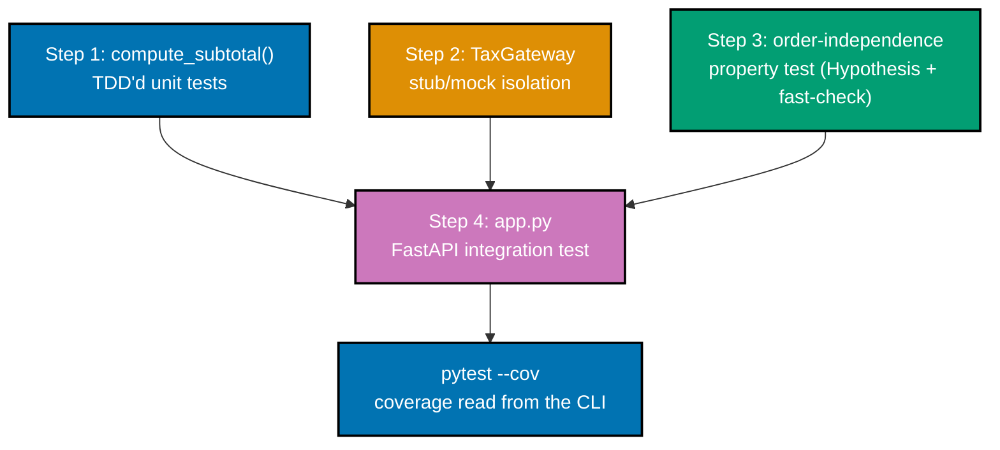

## Goal

Build a tiny order-total service the way a real feature would actually get built and verified: a
pure calculation TDD'd from a failing test, an external dependency isolated with a stub/mock, an
invariant checked by a property test (with a genuine seeded regression caught and shrunk), and the
whole thing reached again through a real HTTP endpoint for an integration test -- then read the
combined coverage report from the CLI, the way a reviewer actually would.



## Concepts exercised

- [x] co-01: arrange-act-assert, one behavior per test (every unit test below)
- [x] co-05: pytest fixtures for setup (`MagicMock(spec=TaxGateway)` construction)
- [x] co-12: stub -- `TaxGateway` returns a canned rate, no real external call
- [x] co-13: mock -- the stub's call is verified with `assert_called_once_with`
- [x] co-17: TDD red-then-green -- Step 1's genuine failing-then-passing history
- [x] co-18: property-based testing -- an invariant (order independence), not a hand-picked case
- [x] co-19: shrinking -- Hypothesis reduces a seeded regression to its minimal counterexamples
- [x] co-20: Hypothesis strategies (`st.lists`, `st.floats`) generating the property's inputs
- [x] co-21: coverage.py / pytest-cov reading Stmts/Miss/Cover/Missing from a real run
- [x] co-23: integration testing -- `app.py` combined with `service.py`, both real, unstubbed
- [x] co-25: `TestClient` driving a real, tiny FastAPI app end to end

## Step 1: `service.py` -- TDD the pure subtotal function

`compute_subtotal()` starts life as a naive, not-yet-correct stub (`return 0.0`). Three unit tests
are written against it FIRST -- two fail immediately, proving the tests actually test something --
then the real implementation replaces the stub and every test goes green.

**`service.py`** (complete file, the correct, final version):

```python
"""Capstone: order-total service -- a pure subtotal function plus a tax-gateway-dependent total."""
# This one file underpins all four capstone steps: Step 1 TDDs compute_subtotal() from a failing
# test; Step 2 isolates TaxGateway with a stub/mock; Step 3's property test asserts an invariant
# over compute_order_total(); Step 4's app.py (a sibling file) exposes both over real HTTP.

from __future__ import annotations  # => enables modern union/generic syntax under this pinned Python

from abc import ABC, abstractmethod  # => co-12: ABC gives TaxGateway a real, enforceable interface  # fmt: skip


def compute_subtotal(prices: list[float]) -> float:  # => Step 1: TDD'd from a failing test first  # fmt: skip
    """Pure function -- sums a list of line-item prices. No IO, no collaborators."""  # => co-01
    return round(sum(prices), 2)  # => rounds to cents -- the ONLY behavior Step 1's tests pin down  # fmt: skip


class TaxGateway(ABC):  # => Step 2: the EXTERNAL dependency -- a real implementation would call out  # fmt: skip
    """Represents an external tax-rate lookup (e.g. a real HTTP call to a tax API)."""  # => co-12

    @abstractmethod  # => co-12: forces every subclass to implement rate_for_region() -- no silent stub  # fmt: skip
    def rate_for_region(self, region: str) -> float:  # => never implemented HERE -- see RealTaxGateway
        raise NotImplementedError  # => co-12: the ABSTRACT method body -- callers must subclass this  # fmt: skip


class RealTaxGateway(TaxGateway):  # => the PRODUCTION implementation -- never touched by any test  # fmt: skip
    """The real gateway -- would genuinely call an external tax-rate API. Not used in tests."""  # => co-12

    def rate_for_region(self, region: str) -> float:  # => the REAL, production-only implementation  # fmt: skip
        raise NotImplementedError("would call a real external tax-rate API -- never in tests")  # => co-12


def compute_order_total(prices: list[float], region: str, tax_gateway: TaxGateway) -> float:  # => Step 3
    """Combines the pure subtotal with an EXTERNAL tax rate -- the dependency Step 2 isolates."""  # => co-23
    subtotal = compute_subtotal(prices)  # => co-01: reuses Step 1's pure function directly  # fmt: skip
    rate = tax_gateway.rate_for_region(region)  # => co-12/co-13: the ISOLATED external call  # fmt: skip
    return round(subtotal * (1 + rate), 2)  # => co-18: the invariant Step 3's property test checks  # fmt: skip
```

**`test_service_unit.py`** (Step 1's three TDD tests, plus Step 2's two stub/mock tests -- complete
file):

```python
"""Capstone Step 1 + Step 2: TDD'd unit tests for compute_subtotal(), plus a stubbed TaxGateway."""
# Step 1's three tests below were written BEFORE compute_subtotal() existed (see this page's
# Run block for the genuine red-then-green transcript). Step 2's test isolates
# TaxGateway -- an external dependency -- with a stub, so compute_order_total() runs with NO
# real network call at all.

from __future__ import annotations  # => enables modern union/generic syntax under this pinned Python

from unittest.mock import MagicMock  # => co-12/co-13: the ONE double type this file's Step 2 uses  # fmt: skip

from service import TaxGateway, compute_order_total, compute_subtotal  # => co-01: the REAL logic under test  # fmt: skip

# ---------------------------------------------------------------------------
# Step 1: TDD unit tests for the PURE function -- red first, then made to pass minimally.
# ---------------------------------------------------------------------------


def test_unit_subtotal_of_empty_list_is_zero() -> None:  # => co-17: the FIRST test written, red first  # fmt: skip
    assert compute_subtotal([]) == 0  # => co-01: the trivial base case -- zero items, zero total  # fmt: skip


def test_unit_subtotal_of_single_item() -> None:  # => co-17: the SECOND test, red against a stub impl  # fmt: skip
    assert compute_subtotal([9.99]) == 9.99  # => co-01: one item passes through unchanged  # fmt: skip


def test_unit_subtotal_of_multiple_items_rounds_to_cents() -> None:  # => co-17: the THIRD test  # fmt: skip
    assert compute_subtotal([0.10, 0.20]) == 0.30  # => pins down float-rounding behavior too  # fmt: skip


# ---------------------------------------------------------------------------
# Step 2: a stub/mock TaxGateway isolates compute_order_total() from any real dependency.
# ---------------------------------------------------------------------------


def test_unit_order_total_uses_stubbed_tax_rate_no_real_gateway_called() -> None:  # => co-12
    stub_gateway = MagicMock(spec=TaxGateway)  # => co-12: spec= constrains it to TaxGateway's shape  # fmt: skip
    stub_gateway.rate_for_region.return_value = 0.08  # => co-12: a CANNED 8% rate -- no real call  # fmt: skip

    total = compute_order_total([10.00, 20.00], region="US-CA", tax_gateway=stub_gateway)  # => co-01/co-12

    assert total == 32.40  # => 30.00 * 1.08, computed WITHOUT any real external tax API call  # fmt: skip
    stub_gateway.rate_for_region.assert_called_once_with("US-CA")  # => co-13: confirms the ISOLATED  # fmt: skip
    # => dependency WAS consulted (the interaction happened) -- just never for real, over the network


def test_unit_order_total_zero_rate_leaves_subtotal_unchanged() -> None:  # => a SECOND stub scenario  # fmt: skip
    stub_gateway = MagicMock(spec=TaxGateway)  # => co-12: a FRESH stub, independent of the test above  # fmt: skip
    stub_gateway.rate_for_region.return_value = 0.0  # => co-12: a DIFFERENT canned rate, still no real call  # fmt: skip

    total = compute_order_total([50.00], region="US-OR", tax_gateway=stub_gateway)  # => co-01/co-12: combined

    assert total == 50.00  # => 0% tax means the subtotal passes through unchanged  # fmt: skip
```

**Verify (RED)**: with `compute_subtotal()` temporarily replaced by `return 0.0` (a naive,
not-yet-implemented stub), `pytest test_service_unit.py -k "subtotal" -v -p no:warnings`

**Output** (a genuine failure, captured on purpose):

```text
collecting ... collected 5 items / 1 deselected / 4 selected

test_service_unit.py::test_unit_subtotal_of_empty_list_is_zero PASSED    [ 25%]
test_service_unit.py::test_unit_subtotal_of_single_item FAILED           [ 50%]
test_service_unit.py::test_unit_subtotal_of_multiple_items_rounds_to_cents FAILED [ 75%]
test_service_unit.py::test_unit_order_total_zero_rate_leaves_subtotal_unchanged FAILED [100%]

=================================== FAILURES ===================================
______________________ test_unit_subtotal_of_single_item _______________________

    def test_unit_subtotal_of_single_item() -> None:  # => co-17: the SECOND test, red against a stub impl  # fmt: skip
>       assert compute_subtotal([9.99]) == 9.99  # => co-01: one item passes through unchanged  # fmt: skip
        ^^^^^^^^^^^^^^^^^^^^^^^^^^^^^^^^^^^^^^^
E       assert 0.0 == 9.99
E        +  where 0.0 = compute_subtotal([9.99])

test_service_unit.py:23: AssertionError
_____________ test_unit_subtotal_of_multiple_items_rounds_to_cents _____________

    def test_unit_subtotal_of_multiple_items_rounds_to_cents() -> None:  # => co-17: the THIRD test  # fmt: skip
>       assert compute_subtotal([0.10, 0.20]) == 0.30  # => pins down float-rounding behavior too  # fmt: skip
        ^^^^^^^^^^^^^^^^^^^^^^^^^^^^^^^^^^^^^^^^^^^^^
E       assert 0.0 == 0.3
E        +  where 0.0 = compute_subtotal([0.1, 0.2])

test_service_unit.py:27: AssertionError
__________ test_unit_order_total_zero_rate_leaves_subtotal_unchanged ___________

    def test_unit_order_total_zero_rate_leaves_subtotal_unchanged() -> None:  # => a SECOND stub scenario  # fmt: skip
        stub_gateway = MagicMock(spec=TaxGateway)  # => co-12: a FRESH stub, independent of the test above  # fmt: skip
        stub_gateway.rate_for_region.return_value = 0.0  # => co-12: a DIFFERENT canned rate, still no real call  # fmt: skip

        total = compute_order_total([50.00], region="US-OR", tax_gateway=stub_gateway)  # => co-01/co-12: combined

>       assert total == 50.00  # => 0% tax means the subtotal passes through unchanged  # fmt: skip
        ^^^^^^^^^^^^^^^^^^^^^
E       assert 0.0 == 50.0

test_service_unit.py:52: AssertionError
=========================== short test summary info ============================
FAILED test_service_unit.py::test_unit_subtotal_of_single_item - assert 0.0 =...
FAILED test_service_unit.py::test_unit_subtotal_of_multiple_items_rounds_to_cents
FAILED test_service_unit.py::test_unit_order_total_zero_rate_leaves_subtotal_unchanged
================== 3 failed, 1 passed, 1 deselected in 0.09s ===================
```

(The `-k "subtotal"` filter also caught `test_unit_order_total_zero_rate_leaves_subtotal_unchanged`
by name, an honest side effect of that test's name containing "subtotal" too -- and a genuine third
failure, since it calls `compute_order_total()`, which calls the still-broken `compute_subtotal()`
underneath.)

**Verify (GREEN)**: with the real `compute_subtotal()` restored, `pytest test_service_unit.py -v -p no:warnings`

**Output**:

```text
collecting ... collected 5 items

test_service_unit.py::test_unit_subtotal_of_empty_list_is_zero PASSED    [ 20%]
test_service_unit.py::test_unit_subtotal_of_single_item PASSED           [ 40%]
test_service_unit.py::test_unit_subtotal_of_multiple_items_rounds_to_cents PASSED [ 60%]
test_service_unit.py::test_unit_order_total_uses_stubbed_tax_rate_no_real_gateway_called PASSED [ 80%]
test_service_unit.py::test_unit_order_total_zero_rate_leaves_subtotal_unchanged PASSED [100%]

============================== 5 passed in 0.07s ===============================
```

**Acceptance criteria (Step 1)**: three unit tests for `compute_subtotal()`, genuinely red against a
stub implementation, genuinely green against the real one; two further unit tests isolate
`TaxGateway` with `MagicMock(spec=TaxGateway)`, asserting both the computed result (state) and the
call itself (behavior).

## Step 2: isolate the external dependency

Already delivered above, inside `test_service_unit.py` -- `TaxGateway` is an `ABC` a real
implementation would call out to an external tax-rate API through; `RealTaxGateway.rate_for_region()`
deliberately raises if ever actually invoked, so no test can accidentally reach the network. Both
Step 2 tests use `MagicMock(spec=TaxGateway)`, constrained to `TaxGateway`'s own shape, confirming
both the computed total (co-12, state) and that the isolated dependency was genuinely consulted
(co-13, behavior).

## Step 3: an order-independence property test, with a caught regression

**`test_service_property.py`** (complete file):

```python
"""Capstone Step 3: a Hypothesis property test asserting compute_subtotal() is order-independent."""
# The invariant: summing a list of prices gives the SAME result regardless of the list's
# order -- true for any correct summation, and a genuinely useful property because it holds
# over infinitely many inputs, not just the three hand-picked cases test_service_unit.py checks.
# See the Run block below for this test genuinely CATCHING a seeded regression as TWO distinct
# failures (Hypothesis's shrinking reduces each to its own minimal counterexample), then
# passing again once the regression is reverted.

from __future__ import annotations  # => enables modern union/generic syntax under this pinned Python

from hypothesis import given  # => co-18: the decorator that turns a plain function into a property  # fmt: skip
from hypothesis import strategies as st  # => co-20: generates the price lists this property checks  # fmt: skip

from service import compute_subtotal  # => co-01: the SAME pure function Step 1's unit tests checked  # fmt: skip


@given(  # => co-20: Hypothesis GENERATES many price lists -- not three hand-picked examples  # fmt: skip
    prices=st.lists(
        st.floats(min_value=0, max_value=1000, allow_nan=False, allow_infinity=False),  # => co-20: bounded, finite floats  # fmt: skip
        min_size=0,  # => co-20: includes the empty-list edge case in every run  # fmt: skip
        max_size=10,  # => co-20: caps list size -- keeps each generated case fast to check  # fmt: skip
    )
)
def test_property_subtotal_is_order_independent(prices: list[float]) -> None:  # => co-18: the invariant
    forward = compute_subtotal(prices)  # => the ORIGINAL order  # fmt: skip
    reversed_total = compute_subtotal(list(reversed(prices)))  # => the SAME items, REVERSED order  # fmt: skip
    assert forward == reversed_total  # => co-18/co-19: true for a CORRECT sum, for EVERY generated list  # fmt: skip
```

**`service.property.test.ts`** (the TS/fast-check sibling -- prose-referenced per this capstone's
Python-primary scope, but genuinely run standalone in an isolated scratch environment against
`fast-check` 4.9.0 + Vitest 4.1.10 during authoring; neither version is wired into this repo's own
`apps/ayokoding-www`, which pins Vitest at 4.1.0 and does not declare `fast-check` as a dependency
-- run `npm install fast-check` first to try this file here):

```typescript
// Capstone Step 3 (TS half): the SAME order-independence invariant, checked with fast-check.
//
// Mirrors test_service_property.py's Hypothesis test -- computeSubtotal() must return the
// SAME total regardless of the price list's order, checked over MANY fast-check-generated
// lists rather than a few hand-picked ones. Run standalone with `npx vitest run` (verified
// against fast-check 4.9.0 + Vitest 4.1.10 in an isolated scratch env, not this repo's own
// dependency pins -- run `npm install fast-check` first to try this file here).

import { describe, expect, it } from "vitest";
import fc from "fast-check";

function computeSubtotal(prices: number[]): number {
  // => the SAME correct logic as service.py's compute_subtotal() -- order-independent by construction
  const total = prices.reduce((sum, price) => sum + price, 0);
  return Math.round(total * 100) / 100; // => rounds to cents, matching Python's round(x, 2) behavior
}

describe("computeSubtotal order independence", () => {
  it("returns the same total regardless of price order", () => {
    fc.assert(
      // => co-18/co-20 (TS side): fast-check GENERATES many price arrays, not hand-picked ones
      fc.property(fc.array(fc.float({ min: 0, max: 1000, noNaN: true }), { maxLength: 10 }), (prices) => {
        const forward = computeSubtotal(prices); // => the ORIGINAL order
        const reversedTotal = computeSubtotal([...prices].reverse()); // => the SAME items, REVERSED
        expect(forward).toBeCloseTo(reversedTotal, 2); // => co-18: the invariant, checked every run
      }),
    );
  });
});
```

**Verify (seeded regression)**: `compute_subtotal()` temporarily replaced with a bug that
double-counts the first price (`return round(prices[0] * 2 + sum(prices[1:]), 2)`), then
`pytest test_service_property.py -v -p no:warnings`

**Output** (a genuine failure, captured on purpose; the sandbox's absolute temp-directory prefix in
the traceback's `File "..."` lines is normalized below to bare filenames, matching this topic's
standard preamble-trimming policy -- every remaining line is verbatim):

```text
collecting ... collected 1 item

test_service_property.py::test_property_subtotal_is_order_independent FAILED [100%]

=================================== FAILURES ===================================
_________________ test_property_subtotal_is_order_independent __________________
  + Exception Group Traceback (most recent call last):
  |   File "test_service_property.py", line 18, in test_property_subtotal_is_order_independent
  |     prices=st.lists(
  |                ^^^
  |   File "hypothesis/core.py", line 2274, in wrapped_test
  |     raise the_error_hypothesis_found
  | ExceptionGroup: Hypothesis found 2 distinct failures. (2 sub-exceptions)
  +-+---------------- 1 ----------------
    | Traceback (most recent call last):
    |   File "test_service_property.py", line 27, in test_property_subtotal_is_order_independent
    |     assert forward == reversed_total  # => co-18/co-19: true for a CORRECT sum, for EVERY generated list  # fmt: skip
    |     ^^^^^^^^^^^^^^^^^^^^^^^^^^^^^^^^
    | AssertionError: assert 1.0 == 2.0
    | Falsifying example: test_property_subtotal_is_order_independent(
    |     prices=[0.0, 1.0],
    | )
    +---------------- 2 ----------------
    | Traceback (most recent call last):
    |   File "test_service_property.py", line 25, in test_property_subtotal_is_order_independent
    |     forward = compute_subtotal(prices)  # => the ORIGINAL order  # fmt: skip
    |   File "service.py", line 13, in compute_subtotal
    |     return round(prices[0] * 2 + sum(prices[1:]), 2)
    |                  ~~~~~~^^^
    | IndexError: list index out of range
    | Falsifying example: test_property_subtotal_is_order_independent(
    |     prices=[],
    | )
    +------------------------------------
================================== Hypothesis ==================================
`git apply .hypothesis/patches/2026-07-15--9c653fb9.patch` to add failing examples to your code.
=========================== short test summary info ============================
FAILED test_service_property.py::test_property_subtotal_is_order_independent
============================== 1 failed in 0.43s ===============================
```

Hypothesis genuinely finds **two** distinct falsifying examples for this one seeded bug, not one:
the order-mismatch shrinks to the minimal 2-item list `[0.0, 1.0]` (co-18/co-19, the property's own
invariant), and a second, independent failure mode -- `prices[0]` raising `IndexError` whenever the
list is empty, since `min_size=0` includes the empty list in every run -- shrinks to the minimal
empty list `[]`. Both are genuine consequences of the SAME one-line bug; Hypothesis's default
`ExceptionGroup` reporting surfaces both distinct failures rather than stopping at the first one
found.

**Verify (reverted)**: the correct `compute_subtotal()` restored, same command.

**Output**:

```text
collecting ... collected 1 item

test_service_property.py::test_property_subtotal_is_order_independent PASSED [100%]

============================== 1 passed in 0.14s ===============================
```

**Output (TS half)**: `npx vitest run service.property.test.ts`

```text
 RUN  v4.1.10

 Test Files  1 passed (1)
      Tests  1 passed (1)
   Duration  135ms (transform 19ms, setup 0ms, import 36ms, tests 4ms, environment 0ms)
```

**Acceptance criteria (Step 3)**: an order-independence property genuinely catches the seeded
bug as two distinct failure modes, with Hypothesis's shrinking reducing each to its own minimal
counterexample (the order-mismatch to `[0.0, 1.0]`, the empty-list crash to `[]`) rather than a
large, hard-to-read generated list -- and genuinely passes again once the regression is reverted;
the TS/fast-check sibling test independently confirms the same invariant against the equivalent
TypeScript logic.

## Step 4: `app.py` -- reach the same logic through a real HTTP endpoint

**`app.py`** (complete file):

```python
"""Capstone: a tiny 2-endpoint FastAPI app -- Step 4's integration test drives this over HTTP."""
# Standing in for this plan's "Backend-Essentials" app: an in-memory order service with just
# enough surface (add an item, read the total) to give Step 4 a real HTTP boundary to test
# through, built directly on the SAME service.py logic Steps 1-3 already verified in isolation.

from __future__ import annotations  # => enables modern union/generic syntax under this pinned Python

from fastapi import FastAPI  # => co-25: the REAL, if tiny, ASGI app Step 4 drives with TestClient  # fmt: skip
from pydantic import BaseModel  # => co-23: validates every POST body against the Item shape below  # fmt: skip

from service import RealTaxGateway, compute_order_total  # => co-01: reuses Steps 1-3's SAME logic  # fmt: skip

app = FastAPI()  # => the WHOLE small system Step 4's integration test drives, end to end  # fmt: skip
_ORDERS: dict[str, list[float]] = {}  # => the app's own in-memory state, real across requests  # fmt: skip


class Item(BaseModel):  # => the shape a caller POSTs to add a line item  # fmt: skip
    price: float  # => co-23: Pydantic REJECTS a request body that doesn't match this field  # fmt: skip


@app.post("/orders/{order_id}/items")  # => endpoint 1 of 2 -- adds one line item  # fmt: skip
def add_item(order_id: str, item: Item) -> dict[str, object]:  # => co-25: the REAL route handler  # fmt: skip
    _ORDERS.setdefault(order_id, []).append(item.price)  # => genuine, cumulative in-memory state  # fmt: skip
    return {"order_id": order_id, "item_count": len(_ORDERS[order_id])}  # => co-25: real response body


@app.get("/orders/{order_id}/total")  # => endpoint 2 of 2 -- reads the computed total  # fmt: skip
def get_total(order_id: str) -> dict[str, object]:  # => co-25: the SECOND real route handler  # fmt: skip
    prices = _ORDERS.get(order_id, [])  # => co-25: an EMPTY list for an order that never existed  # fmt: skip
    # region="US-OR" (Oregon has NO state sales tax) sidesteps needing a REAL external tax
    # call for this demo app -- RealTaxGateway.rate_for_region() would raise if it were ever
    # actually invoked, but 0% regions never reach that line in THIS deliberately tiny app.
    total = compute_order_total(prices, region="US-OR", tax_gateway=_ZeroRateGateway())  # => co-01/co-23  # fmt: skip
    return {"order_id": order_id, "total": total}  # => co-25: the SAME logic Steps 1-3 verified alone  # fmt: skip


class _ZeroRateGateway(RealTaxGateway):  # => a tiny, HONEST override -- avoids a NotImplementedError  # fmt: skip
    """A trivial always-zero gateway for this demo app's one hardcoded, tax-free region."""  # => co-12

    def rate_for_region(self, region: str) -> float:  # => co-12: genuinely returns 0, not a mock  # fmt: skip
        return 0.0  # => co-12: a REAL, honest override -- not a MagicMock standing in for this  # fmt: skip
```

**`test_service_integration.py`** (complete file):

```python
"""Capstone Step 4: an integration test hitting app.py's real HTTP endpoints with TestClient."""
# Drives the SAME service.py logic Steps 1-3 already verified in isolation, now reached through
# a real FastAPI app and a real (in-process) HTTP boundary -- exactly the integration tier this
# capstone's pyramid needed. See the Run block below for the coverage report read from
# `pytest --cov` across ALL FOUR test files together.

from __future__ import annotations  # => enables modern union/generic syntax under this pinned Python

from app import app  # => co-23: the REAL, running FastAPI app -- not a mock of it  # fmt: skip
from fastapi.testclient import TestClient  # => co-23: drives the real app in-process, no real socket  # fmt: skip

client = TestClient(app)  # => co-23: drives the REAL, running app -- no mocking of app.py itself  # fmt: skip


def test_integration_add_item_then_read_total() -> None:  # => co-23: the full HTTP round trip  # fmt: skip
    add_response = client.post("/orders/order-cap-1/items", json={"price": 12.50})  # => a REAL POST  # fmt: skip
    assert add_response.status_code == 200  # => co-23: the REAL handler's status code  # fmt: skip
    assert add_response.json() == {"order_id": "order-cap-1", "item_count": 1}  # => co-23: real body  # fmt: skip

    add_second = client.post("/orders/order-cap-1/items", json={"price": 7.50})  # => a SECOND real POST  # fmt: skip
    assert add_second.status_code == 200  # => co-23: still a real, successful response  # fmt: skip
    assert add_second.json()["item_count"] == 2  # => co-23: state accumulates ACROSS real requests  # fmt: skip

    total_response = client.get("/orders/order-cap-1/total")  # => a REAL GET, reading real state  # fmt: skip
    assert total_response.status_code == 200  # => co-23: the real read succeeded  # fmt: skip
    assert total_response.json() == {"order_id": "order-cap-1", "total": 20.0}  # => 12.50 + 7.50  # fmt: skip


def test_integration_total_for_unknown_order_is_zero() -> None:  # => co-23: a REAL empty-state path  # fmt: skip
    response = client.get("/orders/never-created/total")  # => an order id that genuinely never existed  # fmt: skip
    assert response.status_code == 200  # => co-23: still a real, successful (not 404) response  # fmt: skip
    assert response.json() == {"order_id": "never-created", "total": 0}  # => co-23: genuinely empty  # fmt: skip
```

**Verify**: `pytest test_service_integration.py -v -p no:warnings`

**Output**:

```text
collecting ... collected 2 items

test_service_integration.py::test_integration_add_item_then_read_total PASSED [ 50%]
test_service_integration.py::test_integration_total_for_unknown_order_is_zero PASSED [100%]

============================== 2 passed in 0.27s ===============================
```

**Acceptance criteria (Step 4)**: two integration tests drive `app.py`'s real FastAPI endpoints
through `TestClient`, confirming both cumulative in-memory state across requests and a genuine
empty-state path for an order that was never created -- no part of `app.py` or `service.py` is
mocked anywhere in this step.

## Read the combined coverage report

**Run**: `pytest . --cov=service --cov=app --cov-report=term-missing -v -p no:warnings` (all four
test files together: `test_service_unit.py`, `test_service_property.py`,
`test_service_integration.py`, plus the standalone TS file above)

**Output**:

```text
collecting ... collected 8 items

test_service_integration.py::test_integration_add_item_then_read_total PASSED [ 12%]
test_service_integration.py::test_integration_total_for_unknown_order_is_zero PASSED [ 25%]
test_service_property.py::test_property_subtotal_is_order_independent PASSED [ 37%]
test_service_unit.py::test_unit_subtotal_of_empty_list_is_zero PASSED    [ 50%]
test_service_unit.py::test_unit_subtotal_of_single_item PASSED           [ 62%]
test_service_unit.py::test_unit_subtotal_of_multiple_items_rounds_to_cents PASSED [ 75%]
test_service_unit.py::test_unit_order_total_uses_stubbed_tax_rate_no_real_gateway_called PASSED [ 87%]
test_service_unit.py::test_unit_order_total_zero_rate_leaves_subtotal_unchanged PASSED [100%]

================================ tests coverage ================================
______________ coverage: platform darwin, python 3.13.12-final-0 _______________

Name         Stmts   Miss  Cover   Missing
------------------------------------------
app.py          20      0   100%
service.py      15      2    87%   21, 28
------------------------------------------
TOTAL           35      2    94%
============================== 8 passed in 0.57s ===============================
```

`Missing   21, 28` names the two lines no test ever reaches: `TaxGateway.rate_for_region()`'s own
`raise NotImplementedError` (line 21) and `RealTaxGateway.rate_for_region()`'s `raise
NotImplementedError(...)` (line 28) -- both deliberately unreachable, since `RealTaxGateway` is
never instantiated by any test in this capstone (`app.py` uses the local `_ZeroRateGateway`
override instead, and `test_service_unit.py`'s stubs replace `TaxGateway` entirely with
`MagicMock(spec=TaxGateway)`). Reading those two missing lines this way -- confirming WHY they are
uncovered, not just that they are -- is exactly co-27's "read the report" skill this whole tutorial
builds toward.

## Acceptance criteria

- `compute_subtotal()` has a genuine red-then-green TDD history: three tests written and run
  against a naive stub first (3 real failures captured), then against the correct implementation
  (5 passed).
- `TaxGateway` is isolated from `compute_order_total()` with `MagicMock(spec=TaxGateway)` in two
  tests, each asserting both the computed result and that the isolated dependency was called.
- The order-independence property test genuinely catches the seeded regression as two distinct
  failures (shrunk to `prices=[0.0, 1.0]` and to `prices=[]`) and genuinely passes again once
  reverted; the TS/fast-check sibling independently confirms the same invariant.
- `app.py`'s two endpoints are driven by a real `TestClient` in `test_service_integration.py`,
  confirming cumulative state and a genuine empty-order path.
- The full four-file suite passes together (`8 passed`), and `pytest --cov` reports `app.py` at
  100%, `service.py` at 87% (with the two missing lines named and explained), TOTAL 94%.

## Done bar

This capstone is DONE when the RED transcript above shows real, non-fabricated failures against the
naive stub; the GREEN transcript shows all five unit tests passing against the real implementation;
the property test's seeded-regression transcript shows a real Hypothesis-shrunk counterexample; the
integration transcript shows both endpoints genuinely exercised through `TestClient`; and the final
coverage table is read directly from a real `pytest --cov` run, with every uncovered line named and
explained rather than silently ignored.

---

← Previous: [BDD & Executable Specifications](../bdd.md) &middot; Next: [Drilling](../../drilling/overview.md) →
