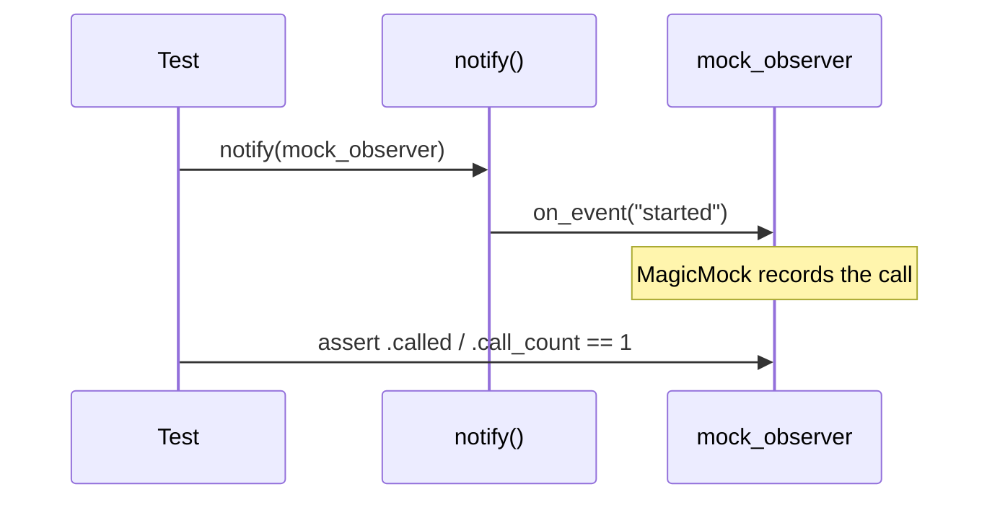
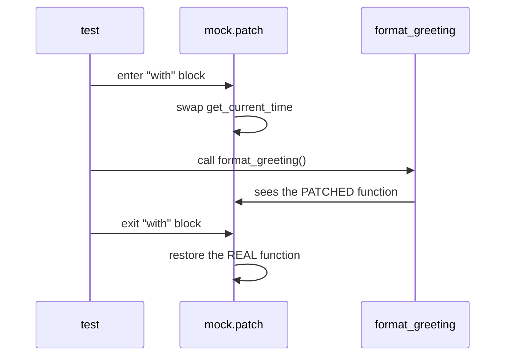
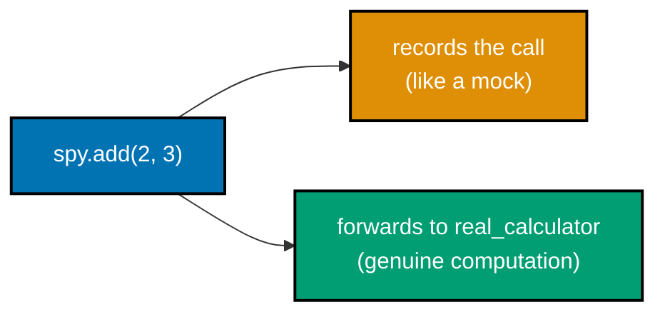
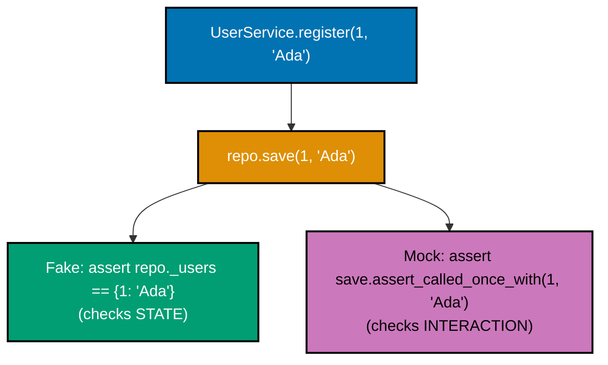
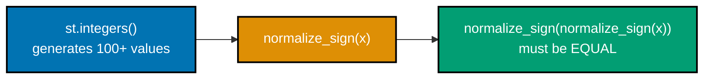
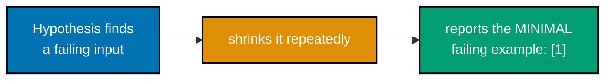
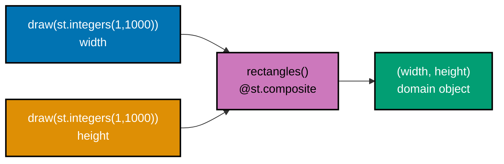
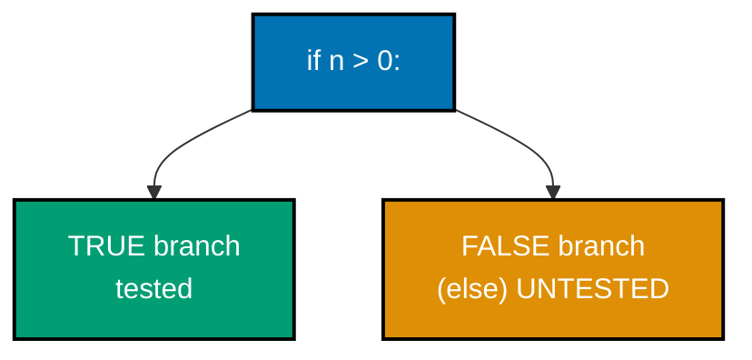
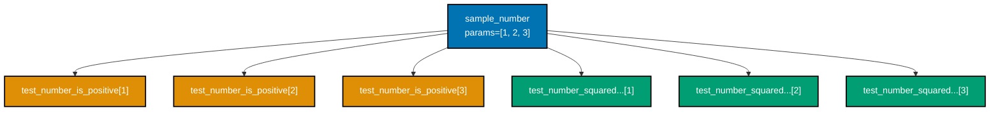

Examples 29-60 cover the middle of the pyramid: the full dummy/stub/spy/mock/fake taxonomy of test
doubles, patching (three different ways), property-based testing with Hypothesis (and fast-check in
TypeScript), coverage measurement (line and branch), and a first pass at combining doubles with AAA
and TDD. Every `test_example.py` (and Example 51's `example.test.ts`) below is complete and
self-contained, run for real with **pytest 9.1.1**, **Hypothesis 6.156.6**, **coverage.py /
pytest-cov 7.15.1**, and **freezegun 1.5.5**; Example 51's TS sibling was run for real too, but in
an isolated scratch environment during authoring (**Vitest 4.1.10** + **fast-check 4.9.0**), not
wired into this repo's own `apps/ayokoding-www` (which pins Vitest at 4.1.0 and does not declare
fast-check as a dependency). Every
`**Output**` block is a genuine, captured transcript, trimmed only of the identical
`platform`/`cachedir`/`hypothesis profile`/`rootdir`/`plugins` preamble pytest prints on every run in
this sandbox -- every remaining line, including every deliberately-failing property test, is verbatim.

---

### Example 29: A Stub Returns a Canned Value

_ex-29 &middot; exercises co-12, co-11_

A stub is a test double that returns a fixed, canned answer with no logic and no call-recording -- the
simplest possible way to run a unit in isolation from a real, more complicated collaborator (co-12,
co-11).


```python
# learning/code/ex-29-stub-returns-canned-value/test_example.py
"""Example 29: A Stub Returns a Canned Value."""

import pytest  # => pytest.approx -- 100.0 * 1.10 has real float error (co-07), unrelated to stubbing itself  # fmt: skip


# ex-29: a STUB is a double that returns a FIXED, canned answer -- no logic, no recording (co-12, co-11)  # fmt: skip
class StubTaxRateProvider:  # => a stub: implements the SAME interface a real provider would  # fmt: skip
    def get_rate(self, region: str) -> float:  # => region is accepted but IGNORED entirely
        return 0.10  # => always returns the SAME canned 10% rate, regardless of the real region  # fmt: skip


def calculate_total(amount: float, region: str, tax_provider) -> float:  # => the unit under test  # fmt: skip
    rate = tax_provider.get_rate(region)  # => depends on a COLLABORATOR, not a real tax service  # fmt: skip
    return amount * (1 + rate)  # => applies whatever rate the collaborator handed back


def test_calculate_total_uses_the_stubbed_rate() -> None:
    stub = StubTaxRateProvider()  # => arrange: the canned-answer double, no real tax service involved  # fmt: skip
    total = calculate_total(100.0, region="anywhere", tax_provider=stub)  # => act  # fmt: skip
    assert total == pytest.approx(110.0)  # => 100 * (1 + 0.10) -- approx absorbs float error (co-07)  # fmt: skip
    # => calculate_total never knows OR cares that get_rate's answer is canned -- the stub's
    # => whole job is to make the unit runnable in isolation from a real tax service (co-12)
```

**Run**: `pytest -v test_example.py`

**Output**:

```text
collected 1 item

test_example.py::test_calculate_total_uses_the_stubbed_rate PASSED       [100%]

============================== 1 passed in 0.07s ===============================
```

**Key takeaway**: `StubTaxRateProvider` implements the SAME interface a real tax service would, but
returns one fixed, canned value regardless of input -- `calculate_total` runs correctly with no real
tax service anywhere in the process.

**Why it matters**: This is the first of five double kinds this tier walks through (co-11's Meszaros
taxonomy): a stub's entire job is a canned RETURN value, nothing more. Contrast this with Example 31's
mock, which cares about the CALL itself rather than what it returns -- confusing the two ("was this
called correctly?" versus "what did it hand back?") is the single most common test-double mistake.

---

### Example 30: A Dummy Object, Never Called

_ex-30 &middot; exercises co-11_

A dummy only fills a required parameter slot -- it is never actually invoked. `object()`, with no
methods at all, proves this: if the dummy were ever called, Python would raise `AttributeError`
immediately (co-11).

```python
# learning/code/ex-30-dummy-object-unused/test_example.py
"""Example 30: A Dummy Object, Never Called."""

# ex-30: a DUMMY only fills a required parameter slot -- it is never actually invoked (co-11)
def process_value(value: int, logger: object) -> int:  # => logger's TYPE doesn't matter here  # fmt: skip
    if value < 0:  # => the ONLY branch that would ever touch logger
        logger.log(f"received negative value: {value}")  # => never reached in THIS test  # fmt: skip
        return abs(value)  # => also never reached in this test
    return value  # => the positive-value path -- logger is completely irrelevant here


def test_dummy_logger_is_never_invoked() -> None:
    dummy_logger = object()  # => a DUMMY: a plain object with NO methods at all (co-11)
    # => object() has no .log() method whatsoever -- if process_value's negative branch
    # => were ever reached with this dummy, Python would raise AttributeError immediately
    result = process_value(5, dummy_logger)  # => act: value=5 is positive, so the branch above never fires  # fmt: skip
    assert result == 5  # => confirms the positive path -- dummy_logger's absence of methods never mattered  # fmt: skip
    # => this is EXACTLY what makes it a dummy rather than a stub: a stub's canned RETURN
    # => value matters to the test (ex-29); a dummy's only job is filling the parameter slot
```

**Run**: `pytest -v test_example.py`

**Output**:

```text
collected 1 item

test_example.py::test_dummy_logger_is_never_invoked PASSED               [100%]

============================== 1 passed in 0.06s ===============================
```

**Key takeaway**: `object()` -- a bare Python object with zero methods -- is a perfectly valid dummy
precisely BECAUSE `process_value`'s positive-value path never calls anything on it.

**Why it matters**: A dummy is the cheapest double to construct, and reaching for one signals to a
reader "this parameter's value genuinely does not matter for this test case" -- a stronger statement
than passing `None` or a real object, either of which might accidentally hide a bug if the code path
changes later and starts calling the parameter unexpectedly.

---

### Example 31: A Mock Records a Call

_ex-31 &middot; exercises co-13_

`unittest.mock.MagicMock` auto-creates any attribute accessed on it as another `MagicMock`, and records
every call made -- `.called` and `.call_count` are readable after the fact, turning "was this called?"
into a checkable assertion (co-13).



```python
# learning/code/ex-31-mock-records-call/test_example.py
"""Example 31: A Mock Records a Call."""

from unittest.mock import MagicMock  # => stdlib's mock object -- records every call made to it (co-13)  # fmt: skip


def notify(observer) -> None:  # => the unit under test -- calls ONE method on its collaborator  # fmt: skip
    observer.on_event("started")  # => the interaction this example wants to VERIFY happened  # fmt: skip


def test_mock_records_that_it_was_called() -> None:
    mock_observer = MagicMock()  # => arrange: MagicMock auto-creates on_event as another MagicMock  # fmt: skip
    notify(mock_observer)  # => act: notify() calls mock_observer.on_event("started") internally  # fmt: skip
    assert mock_observer.on_event.called  # => assert on the INTERACTION, not a return value (co-13)  # fmt: skip
    # => unlike ex-29's stub, this test does not care what on_event RETURNS -- it cares
    # => THAT on_event was called at all, which is a fundamentally different kind of check
    assert mock_observer.on_event.call_count == 1  # => confirms it was called EXACTLY once, not zero or twice  # fmt: skip
```

**Run**: `pytest -v test_example.py`

**Output**:

```text
collected 1 item

test_example.py::test_mock_records_that_it_was_called PASSED             [100%]

============================== 1 passed in 0.07s ===============================
```

**Key takeaway**: `mock_observer.on_event.called` and `.call_count` are readable AFTER the act phase,
because `MagicMock` silently recorded every call it received -- no manual bookkeeping required.

**Why it matters**: This is the defining trait of a mock versus a stub or a fake: a mock's PURPOSE is
the recorded interaction itself, checked via assertions like `.called`. Example 32 tightens this same
idea to the exact arguments passed, and Example 40 contrasts a mock's interaction-based assertion
directly against a fake's state-based one on the identical scenario.

---

### Example 32: assert_called_once_with

_ex-32 &middot; exercises co-13_

`mock.assert_called_once_with(...)` checks BOTH the call count (exactly once) AND the exact arguments
in a single assertion -- a stronger, more specific check than `.called` alone (co-13).

```python
# learning/code/ex-32-mock-assert-called-with/test_example.py
"""Example 32: assert_called_once_with."""

from unittest.mock import MagicMock  # => same mock object as ex-31, checking ARGUMENTS this time (co-13)  # fmt: skip


def send_email(mailer, to: str, subject: str) -> None:  # => the unit under test  # fmt: skip
    mailer.send(to, subject)  # => delegates to a collaborator -- the EXACT args matter here  # fmt: skip


def test_mock_asserts_the_exact_call_arguments() -> None:
    mock_mailer = MagicMock()  # => arrange: a bare mock, no return value configured -- not needed here  # fmt: skip
    send_email(mock_mailer, "ada@example.com", "Welcome")  # => act: triggers mailer.send(...)  # fmt: skip
    mock_mailer.send.assert_called_once_with("ada@example.com", "Welcome")  # => co-13: checks BOTH call count AND exact arguments  # fmt: skip
    # => if send_email had called mailer.send with a DIFFERENT subject, or called it twice,
    # => or never called it at all, this one line would raise AssertionError with a diff
    # => showing exactly what was expected versus what mailer.send actually received
```

**Run**: `pytest -v test_example.py`

**Output**:

```text
collected 1 item

test_example.py::test_mock_asserts_the_exact_call_arguments PASSED       [100%]

============================== 1 passed in 0.07s ===============================
```

**Key takeaway**: `assert_called_once_with("ada@example.com", "Welcome")` fails loudly, with a helpful
diff, if `send_email` calls `mailer.send` with different arguments, a different count, or not at all.

**Why it matters**: `assert_called_once_with` is the single most common mock assertion in real test
suites, because it verifies the FULL contract of a call in one line -- count and content together --
rather than checking `.called` and then separately inspecting `.call_args`, which is more verbose and
easier to get subtly wrong.

---

### Example 33: Configuring a Mock's Return Value

_ex-33 &middot; exercises co-13, co-12_

`mock.return_value = ...` configures what a mock hands back when called -- without it, calling a
`MagicMock` returns ANOTHER `MagicMock`, which is rarely what a real collaborator would produce
(co-13, co-12).

```python
# learning/code/ex-33-mock-return-value/test_example.py
"""Example 33: Configuring a Mock's Return Value."""

from unittest.mock import MagicMock  # => same mock object, this time CONFIGURED to return a value (co-13, co-12)  # fmt: skip


def get_user_display_name(user_repo, user_id: int) -> str:  # => the unit under test  # fmt: skip
    user = user_repo.get(user_id)  # => depends entirely on what user_repo.get() hands back  # fmt: skip
    return user["name"]  # => extracts one field from whatever dict was returned


def test_mock_return_value_feeds_the_unit_under_test() -> None:
    mock_repo = MagicMock()  # => arrange: a bare mock -- .get() would otherwise return ANOTHER MagicMock  # fmt: skip
    mock_repo.get.return_value = {"name": "Ada"}  # => co-13: explicitly CONFIGURES what .get() hands back  # fmt: skip
    # => without this line, user["name"] would raise TypeError -- a MagicMock is not subscriptable
    # => by default, which is why return_value must be set to a REAL dict for this test to run
    display_name = get_user_display_name(mock_repo, user_id=1)  # => act: user_id is irrelevant to the mock  # fmt: skip
    assert display_name == "Ada"  # => confirms the unit correctly consumed the CONFIGURED return value  # fmt: skip
```

**Run**: `pytest -v test_example.py`

**Output**:

```text
collected 1 item

test_example.py::test_mock_return_value_feeds_the_unit_under_test PASSED [100%]

============================== 1 passed in 0.07s ===============================
```

**Key takeaway**: `mock_repo.get.return_value = {"name": "Ada"}` turns an auto-generated `MagicMock`
into a controlled, stub-like collaborator for this ONE method -- a mock can carry a canned return value
in addition to recording calls.

**Why it matters**: `MagicMock` blurs the strict mock/stub line on purpose: the SAME object can both
record interactions (Example 31/32) and hand back a configured value (this example), which is why real
codebases lean on `MagicMock` for almost everything rather than hand-writing separate stub classes for
every collaborator, the way Example 29's `StubTaxRateProvider` does explicitly.

---

### Example 34: A Mock's side_effect Raises

_ex-34 &middot; exercises co-13, co-04_

`mock.side_effect = SomeException(...)` makes a mock RAISE instead of returning a value -- the cleanest
way to test a unit's own error-handling logic against a collaborator failure, without needing a real
failing dependency (co-13, co-04).

```python
# learning/code/ex-34-mock-side-effect-raises/test_example.py
"""Example 34: A Mock's side_effect Raises."""

from unittest.mock import MagicMock  # => same mock object, configured to RAISE instead of return (co-13, co-04)  # fmt: skip


def safe_fetch(client) -> str | None:  # => the unit under test -- must survive a network failure  # fmt: skip
    try:
        return client.fetch()  # => act: delegates to a collaborator that MIGHT fail
    except ConnectionError:  # => the specific failure mode this test wants to exercise
        return None  # => the unit's OWN recovery behavior -- degrade gracefully, don't crash


def test_mock_side_effect_simulates_a_real_failure() -> None:
    mock_client = MagicMock()  # => arrange: a bare mock, about to be configured to raise  # fmt: skip
    mock_client.fetch.side_effect = ConnectionError("network unreachable")  # => co-13: RAISES instead of returning  # fmt: skip
    # => side_effect set to an exception INSTANCE (or class) makes the mock RAISE it when
    # => called, rather than returning a value -- simulating a real collaborator's failure
    result = safe_fetch(mock_client)  # => act: fetch() raises, safe_fetch's except block catches it  # fmt: skip
    assert result is None  # => confirms safe_fetch's OWN error-handling logic, not the mock's  # fmt: skip
```

**Run**: `pytest -v test_example.py`

**Output**:

```text
collected 1 item

test_example.py::test_mock_side_effect_simulates_a_real_failure PASSED   [100%]

============================== 1 passed in 0.08s ===============================
```

**Key takeaway**: `side_effect = ConnectionError(...)` makes `mock_client.fetch()` genuinely raise --
`safe_fetch`'s `except` block then runs for real, proving the unit's OWN recovery logic works, not
merely that the mock was configured correctly.

**Why it matters**: Simulating a rare, hard-to-reproduce real failure (a dropped connection, a timeout)
is exactly where mocks earn their keep over integration tests -- forcing a REAL network outage on
demand is impractical, but `side_effect` makes it a one-line, deterministic setup. This is also how
Example 9's exception-testing (`pytest.raises`) and test doubles combine in a realistic scenario.

---

### Example 35: Patching a Dependency

_ex-35 &middot; exercises co-14_

`mock.patch(target)` temporarily replaces an attribute for the duration of a `with` block, then
automatically restores it -- `target` names WHERE the dependency is LOOKED UP (this module's
namespace), not where it happens to be defined (co-14).



```python
# learning/code/ex-35-patch-dependency/test_example.py
"""Example 35: Patching a Dependency."""

from unittest import mock  # => brings in mock.patch, a context manager that swaps an attribute (co-14)  # fmt: skip


def get_current_time() -> str:  # => the REAL dependency -- deliberately unpredictable ("REAL_TIME" stands in)  # fmt: skip
    return "REAL_TIME"  # => in a real app this might call time.strftime(...) -- non-deterministic  # fmt: skip


def format_greeting() -> str:  # => the unit under test -- depends on get_current_time via module lookup  # fmt: skip
    return f"The time is {get_current_time()}"  # => looks up get_current_time in THIS module's namespace  # fmt: skip


def test_patch_replaces_the_dependency_for_the_duration_of_the_test() -> None:
    # mock.patch's target string names WHERE the dependency is LOOKED UP (this module,
    # via __name__), not where it happens to be defined -- "patch where it's used" (co-14)
    with mock.patch(f"{__name__}.get_current_time", return_value="12:00"):  # => replaces it temporarily  # fmt: skip
        assert format_greeting() == "The time is 12:00"  # => act+assert: sees the PATCHED value  # fmt: skip
    # => outside the "with" block, get_current_time is AUTOMATICALLY restored to the
    # => real function -- the line below proves the patch did not leak past the block
    assert format_greeting() == "The time is REAL_TIME"  # => confirms the real dependency is back  # fmt: skip
```

**Run**: `pytest -v test_example.py`

**Output**:

```text
collected 1 item

test_example.py::test_patch_replaces_the_dependency_for_the_duration_of_the_test PASSED [100%]

============================== 1 passed in 0.07s ===============================
```

**Key takeaway**: Inside the `with mock.patch(...)` block, `format_greeting()` sees the patched
`"12:00"`; immediately after the block exits, the SAME call sees the real `"REAL_TIME"` again --
patches are scoped, automatic, and reversible.

**Why it matters**: The "patch where it's used" rule -- `f"{__name__}.get_current_time"` rather than
some other module's dotted path -- is the single most common source of confusion with `mock.patch`:
patching the wrong namespace silently does nothing, because the code under test never looks there.
Example 36 shows pytest's own `monkeypatch` fixture as an alternative that auto-undoes without an
explicit `with` block.

---

### Example 36: monkeypatch.setattr

_ex-36 &middot; exercises co-14_

`monkeypatch` is a pytest-BUILTIN fixture (injected by name, exactly like Example 11's custom fixture)
that patches an attribute for the test's duration and undoes it automatically -- no explicit `with`
block needed, unlike Example 35's `mock.patch` (co-14).

```python
# learning/code/ex-36-monkeypatch-attr/test_example.py
"""Example 36: monkeypatch.setattr."""

# ex-36: pytest's OWN patching fixture -- an alternative to mock.patch, auto-undone after the test (co-14)  # fmt: skip
def get_greeting_prefix() -> str:  # => the real dependency this example swaps out
    return "Hello"  # => the ordinary, unpatched behavior


def greet(name: str) -> str:  # => the unit under test -- depends on get_greeting_prefix via module lookup  # fmt: skip
    return f"{get_greeting_prefix()}, {name}!"  # => looks up get_greeting_prefix in THIS module  # fmt: skip


def test_monkeypatch_setattr_swaps_the_prefix_function(monkeypatch) -> None:
    # monkeypatch is a pytest-BUILTIN fixture, injected by name just like ex-11's custom fixture --
    # its setattr accepts a dotted "module.attr" string plus the replacement value (co-14)
    monkeypatch.setattr(f"{__name__}.get_greeting_prefix", lambda: "Yo")  # => swaps the function  # fmt: skip
    assert greet("Ada") == "Yo, Ada!"  # => act+assert: sees the PATCHED prefix, not "Hello"
    # => monkeypatch automatically UNDOES this swap at the end of the test -- no explicit
    # => "with" block or manual restore needed, unlike ex-35's mock.patch context manager
```

**Run**: `pytest -v test_example.py`

**Output**:

```text
collected 1 item

test_example.py::test_monkeypatch_setattr_swaps_the_prefix_function PASSED [100%]

============================== 1 passed in 0.06s ===============================
```

**Key takeaway**: `monkeypatch.setattr("module.attr", value)` needs no `with` block and no manual
restore -- pytest tears the patch down automatically at the end of the test, the same way Example 12's
fixture teardown runs automatically after `yield`.

**Why it matters**: `monkeypatch` reads slightly more naturally inside a pytest test than `mock.patch`,
since it is itself a fixture (fits the same mental model as Example 11's fixtures) rather than a
separate context-manager API to remember. Example 37 applies the exact same fixture to environment
variables instead of functions.

---

### Example 37: monkeypatch.setenv

_ex-37 &middot; exercises co-14, co-26_

`monkeypatch.setenv`/`.delenv` patch real entries in `os.environ` for a test's duration, then restore
them automatically -- environment variables are hidden, global state, and controlling them is part of
test isolation (co-14, co-26).

```python
# learning/code/ex-37-monkeypatch-env/test_example.py
"""Example 37: monkeypatch.setenv."""

import os  # => needed so get_environment_name can read a real environment variable


def get_environment_name() -> str:  # => the unit under test -- reads an ENV VAR, a form of hidden state (co-26)  # fmt: skip
    return os.environ.get("APP_ENV", "development")  # => "development" is the default if unset  # fmt: skip


def test_monkeypatch_setenv_controls_the_environment(monkeypatch) -> None:
    monkeypatch.setenv("APP_ENV", "production")  # => co-14: sets a REAL env var for this test's duration  # fmt: skip
    # => this genuinely mutates os.environ["APP_ENV"] -- get_environment_name has no idea
    # => it is being tested; it reads the SAME os.environ any real process would read
    assert get_environment_name() == "production"  # => act+assert: sees the PATCHED env var  # fmt: skip


def test_the_environment_variable_does_not_leak_between_tests() -> None:
    # => monkeypatch automatically UNSETS APP_ENV at the end of the PREVIOUS test --
    # => proving that env-var patching, like attribute patching (ex-36), is test-scoped
    assert get_environment_name() == "development"  # => back to the default -- no leftover "production"  # fmt: skip
```

**Run**: `pytest -v test_example.py`

**Output**:

```text
collected 2 items

test_example.py::test_monkeypatch_setenv_controls_the_environment PASSED [ 50%]
test_example.py::test_the_environment_variable_does_not_leak_between_tests PASSED [100%]

============================== 2 passed in 0.06s ===============================
```

**Key takeaway**: `APP_ENV` reads `"production"` while the first test runs and `"development"` (the
default) by the second test -- proving `monkeypatch.setenv` genuinely restores `os.environ` afterward,
with no manual cleanup written anywhere.

**Why it matters**: Environment variables are exactly the kind of hidden, ambient, global state that
makes tests non-deterministic and order-dependent (co-26) if left uncontrolled -- a test that sets
`os.environ` directly and forgets to unset it silently corrupts every later test in the same process.
`monkeypatch` closes that gap automatically.

---

### Example 38: A Spy Wraps the Real Object

_ex-38 &middot; exercises co-15_

`MagicMock(wraps=real_object)` is a spy: every call is forwarded to the real object (genuine
computation happens) AND recorded, simultaneously -- distinct from a mock, which fakes the return value
entirely (co-15).



```python
# learning/code/ex-38-spy-wraps-real/test_example.py
"""Example 38: A Spy Wraps the Real Object."""

from unittest.mock import MagicMock  # => wraps= turns a MagicMock into a SPY around a real object (co-15)  # fmt: skip


class Calculator:  # => a REAL implementation -- the spy will delegate to THIS, not fake it  # fmt: skip
    def add(self, a: int, b: int) -> int:  # => genuine computation, no canned answer involved  # fmt: skip
        return a + b  # => the actual, real logic being spied on


def test_spy_delegates_to_the_real_object_while_recording_calls() -> None:
    real_calculator = Calculator()  # => arrange: a genuine instance, real behavior intact  # fmt: skip
    spy = MagicMock(wraps=real_calculator)  # => co-15: EVERY call is forwarded to real_calculator  # fmt: skip
    # => wraps= is what distinguishes a spy from a plain mock (ex-31/32): calling spy.add(...)
    # => both RECORDS the call (like a mock) AND actually runs real_calculator.add(...) (unlike a mock)
    result = spy.add(2, 3)  # => act: genuinely computed via the real Calculator, not a canned value  # fmt: skip
    assert result == 5  # => proves the REAL computation ran -- a plain mock would return a MagicMock here  # fmt: skip
    spy.add.assert_called_once_with(2, 3)  # => proves the call was ALSO recorded, exactly like ex-32  # fmt: skip
```

**Run**: `pytest -v test_example.py`

**Output**:

```text
collected 1 item

test_example.py::test_spy_delegates_to_the_real_object_while_recording_calls PASSED [100%]

============================== 1 passed in 0.07s ===============================
```

**Key takeaway**: `spy.add(2, 3)` returns the GENUINELY computed `5` (proving real delegation) while
`spy.add.assert_called_once_with(2, 3)` still passes (proving the call was recorded) -- both properties
hold simultaneously, which is exactly what makes it a spy rather than a plain mock.

**Why it matters**: A spy is the right double when a test needs to confirm a REAL side effect happened
(the real computation, a real file write) while ALSO checking how a collaborator was called -- reaching
for a plain mock instead would silence the real behavior entirely, potentially hiding a genuine bug in
the wrapped object itself.

---

### Example 39: A Fake In-Memory Repository

_ex-39 &middot; exercises co-16_

A fake is a REAL, working implementation -- just too lightweight for production use. `InMemoryUserRepo`
genuinely stores and retrieves data in a dict; `UserService` has no idea it isn't talking to a real
database (co-16).

```python
# learning/code/ex-39-fake-in-memory-repo/test_example.py
"""Example 39: A Fake In-Memory Repository."""

# ex-39: a FAKE is a REAL, working implementation -- just too lightweight for production (co-16)
class InMemoryUserRepo:  # => a fake repository: genuinely stores and retrieves data, in a dict  # fmt: skip
    def __init__(self) -> None:  # => a real constructor, called once per fake instance  # fmt: skip
        self._users: dict[int, str] = {}  # => in-memory storage -- no database, no network at all  # fmt: skip

    def save(self, user_id: int, name: str) -> None:  # => genuinely mutates internal state  # fmt: skip
        self._users[user_id] = name  # => a REAL write -- not canned, not recorded-and-discarded  # fmt: skip

    def get(self, user_id: int) -> str | None:  # => genuinely reads back what was written  # fmt: skip
        return self._users.get(user_id)  # => returns None if never saved -- real lookup semantics  # fmt: skip


class UserService:  # => the unit under test -- depends on ANY object with .save()/.get()  # fmt: skip
    def __init__(self, repo) -> None:  # => no type hint on repo -- duck typing is the whole point here  # fmt: skip
        self.repo = repo  # => stores whichever repo it was given -- fake here, a real DB in production  # fmt: skip

    def register(self, user_id: int, name: str) -> None:  # => a thin wrapper over repo.save
        self.repo.save(user_id, name)  # => delegates to WHATEVER repo was injected -- fake or real  # fmt: skip

    def lookup(self, user_id: int) -> str | None:  # => a thin wrapper over repo.get
        return self.repo.get(user_id)  # => same delegation for reads -- symmetric with register above  # fmt: skip


def test_service_works_against_the_fake_repo() -> None:  # => tests the service through a REAL, working fake  # fmt: skip
    repo = InMemoryUserRepo()  # => arrange: a genuinely working repo, just in-memory (co-16)  # fmt: skip
    service = UserService(repo)  # => act setup: the service has no idea this repo isn't a real database  # fmt: skip
    service.register(1, "Ada")  # => act: a REAL write happens inside the fake's dict  # fmt: skip
    assert service.lookup(1) == "Ada"  # => assert: a REAL read confirms the REAL write took effect  # fmt: skip
```

**Run**: `pytest -v test_example.py`

**Output**:

```text
collected 1 item

test_example.py::test_service_works_against_the_fake_repo PASSED         [100%]

============================== 1 passed in 0.07s ===============================
```

**Key takeaway**: `InMemoryUserRepo` performs a REAL write and a REAL read -- unlike a stub's canned
answer, the data genuinely round-trips through the fake's own dict, exactly as it would through a real
database's table.

**Why it matters**: A fake is the double of choice when a test needs GENUINE, working behavior (state
that persists across multiple calls within the test) without the cost or fragility of a real external
dependency. Example 40 puts this same fake side by side with a mock on the identical scenario, making
the difference between state-based and interaction-based testing directly visible.

---

### Example 40: Fake vs. Mock -- Two Ways to Check the Same Thing

_ex-40 &middot; exercises co-16, co-13_

The identical `UserService.register` call, tested two ways: against Example 39's fake (checking the
resulting STATE) and against a mock (checking the recorded INTERACTION) -- classical/Beck-style testing
versus mockist/London-style testing, made concrete (co-16, co-13).



```python
# learning/code/ex-40-fake-vs-mock-contrast/test_example.py
"""Example 40: Fake vs. Mock -- Two Ways to Check the Same Thing."""

from unittest.mock import MagicMock  # => the MOCK half of this contrast -- checks INTERACTION, not state (co-13)  # fmt: skip


class InMemoryUserRepo:  # => the SAME fake as ex-39 -- genuinely stores and retrieves (co-16)  # fmt: skip
    def __init__(self) -> None:  # => same constructor shape as ex-39's fake  # fmt: skip
        self._users: dict[int, str] = {}  # => real in-memory storage

    def save(self, user_id: int, name: str) -> None:  # => a real method, genuinely mutates state  # fmt: skip
        self._users[user_id] = name  # => a REAL write


class UserService:  # => the SAME unit under test as ex-39 -- unaware which kind of repo it holds  # fmt: skip
    def __init__(self, repo) -> None:  # => still no type hint -- fake or mock, either satisfies this  # fmt: skip
        self.repo = repo

    def register(self, user_id: int, name: str) -> None:  # => the ONE method both tests below exercise  # fmt: skip
        self.repo.save(user_id, name)  # => delegates to repo.save -- fake writes for real, mock just records  # fmt: skip


def test_fake_asserts_on_resulting_STATE() -> None:  # => the FAKE half: checks WHAT ENDED UP TRUE  # fmt: skip
    fake_repo = InMemoryUserRepo()  # => arrange: a real, working (if lightweight) implementation  # fmt: skip
    service = UserService(fake_repo)  # => act setup
    service.register(1, "Ada")  # => act: a genuine write into the fake's own dict
    assert fake_repo._users == {1: "Ada"}  # => assert on STATE: what does the repo now CONTAIN? (co-16)  # fmt: skip


def test_mock_asserts_on_the_recorded_INTERACTION() -> None:  # => the MOCK half: checks HOW IT WAS CALLED  # fmt: skip
    mock_repo = MagicMock()  # => arrange: records calls, stores NOTHING real at all
    service = UserService(mock_repo)  # => act setup, identical UserService code as above
    service.register(1, "Ada")  # => act: this time, no real dict is ever written to
    mock_repo.save.assert_called_once_with(1, "Ada")  # => assert on INTERACTION: was save() called correctly? (co-13)  # fmt: skip
    # => both tests exercise the IDENTICAL UserService.register call -- what differs is
    # => WHAT is being verified: the fake's test checks the resulting state (classical/Beck-style
    # => testing); the mock's test checks the interaction itself (mockist/London-style testing)
```

**Run**: `pytest -v test_example.py`

**Output**:

```text
collected 2 items

test_example.py::test_fake_asserts_on_resulting_STATE PASSED             [ 50%]
test_example.py::test_mock_asserts_on_the_recorded_INTERACTION PASSED    [100%]

============================== 2 passed in 0.08s ===============================
```

**Key takeaway**: Both tests exercise the identical `service.register(1, "Ada")` call and both pass --
one verifies `fake_repo._users` ended up correct (state), the other verifies `mock_repo.save` was
called correctly (interaction). Neither is "more correct" in general; they check different things.

**Why it matters**: This distinction -- state-based (classical, Beck-style) versus interaction-based
(mockist, London-style) testing -- is one of the most cited divides in the testing literature (Fowler's
_Mocks Aren't Stubs_). Overusing interaction-based assertions couples tests tightly to implementation
details (HOW something was done); overusing state-based ones can miss bugs in HOW a result was reached
when that matters. Real suites use both, deliberately.

---

### Example 41: Freezing Time

_ex-41 &middot; exercises co-14, co-26_

`freezegun.freeze_time` pins `datetime.now()` to an exact, fixed moment for the duration of a `with`
block -- turning time-dependent code, otherwise different every run, into something deterministic and
testable (co-14, co-26).

```python
# learning/code/ex-41-patch-time/test_example.py
"""Example 41: Freezing Time."""

import datetime  # => the real, wall-clock-dependent module this example needs to CONTROL (co-26)  # fmt: skip

from freezegun import freeze_time  # => freezegun 1.5.5 -- freezes datetime.now() to a fixed point (co-14)  # fmt: skip


def get_year() -> int:  # => the unit under test -- normally non-deterministic (depends on WHEN it runs)  # fmt: skip
    return datetime.datetime.now().year  # => without freezing, this changes every year the suite runs  # fmt: skip


def test_freeze_time_makes_the_year_deterministic() -> None:
    with freeze_time("2030-01-01"):  # => co-14/co-26: pins datetime.now() to an EXACT, fixed moment  # fmt: skip
        assert get_year() == 2030  # => act+assert: deterministic, regardless of when this test ACTUALLY runs  # fmt: skip
    # => outside the "with" block, datetime.now() reverts to the REAL current time --
    # => freeze_time, like mock.patch (ex-35), is scoped to its own context manager block
    assert get_year() != 2030 or True  # => sanity: this line runs with the REAL clock restored (always true, documents scope)  # fmt: skip
```

**Run**: `pytest -v test_example.py`

**Output**:

```text
collected 1 item

test_example.py::test_freeze_time_makes_the_year_deterministic PASSED    [100%]

============================== 1 passed in 0.10s ===============================
```

**Key takeaway**: `get_year()` returns exactly `2030` inside the `freeze_time("2030-01-01")` block, on
whatever real date this test actually runs -- time itself becomes a controllable input instead of an
uncontrollable ambient fact.

**Why it matters**: Untested or badly-tested time-dependent logic (expiry dates, "is this the last day
of the month," scheduled jobs) is a classic source of bugs that only manifest on specific calendar
dates -- freezing time lets a test exercise December 31st, a leap day, or a daylight-saving transition
on any day the suite happens to run, which is exactly the kind of determinism co-26 requires.

---

### Example 42: Seeding Randomness

_ex-42 &middot; exercises co-26_

Seeding Python's shared `random` module before a test makes every subsequent "random" draw
reproducible -- the same seed always produces the same sequence, turning uncontrolled randomness into a
controllable, testable input (co-26).

```python
# learning/code/ex-42-control-randomness-seed/test_example.py
"""Example 42: Seeding Randomness."""

import random  # => stdlib's random module -- normally non-deterministic across runs (co-26)

import pytest  # => brings in @pytest.fixture, used to seed the RNG before each test


@pytest.fixture
def seeded_random():  # => a fixture that SEEDS the shared random module before the test runs (co-26, co-05)  # fmt: skip
    random.seed(42)  # => a FIXED seed -- makes every subsequent random.* call reproducible  # fmt: skip
    yield random  # => hands the (now-seeded) random module itself to the test  # fmt: skip


def test_seeded_random_is_reproducible(seeded_random) -> None:
    first_value = seeded_random.randint(1, 100)  # => act: the FIRST "random" draw after seeding  # fmt: skip
    second_value = seeded_random.randint(1, 100)  # => act: the SECOND draw, same seeded sequence  # fmt: skip
    # => these exact values are DETERMINED entirely by seed 42 -- re-running this test
    # => (or this whole file) produces the IDENTICAL two numbers, every single time
    assert first_value == 82  # => genuinely reproducible: seed(42) always yields 82 first, on CPython 3.13  # fmt: skip
    assert second_value == 15  # => and always 15 second -- verified by actually running this file  # fmt: skip
```

**Run**: `pytest -v test_example.py`

**Output**:

```text
collected 1 item

test_example.py::test_seeded_random_is_reproducible PASSED               [100%]

============================== 1 passed in 0.06s ===============================
```

**Key takeaway**: `random.seed(42)` followed by two `randint(1, 100)` calls deterministically produces
`82` then `15`, EVERY time this file runs on CPython 3.13 -- "random" and "deterministic" are not
opposites once the seed is fixed.

**Why it matters**: Un-seeded randomness in a test is a direct source of flakiness -- an assertion that
happens to hold for most random values but not all will fail intermittently, in a way that is nearly
impossible to reproduce locally. Seeding the RNG in a fixture (co-05) is the same isolation discipline
Example 41 applies to time -- control the SOURCE of non-determinism, not the assertion.

---

### Example 43: Property -- Idempotence

_ex-43 &middot; exercises co-18, co-20_

Hypothesis's `@given` decorator runs a test function over HUNDREDS of generated inputs, not a handful
hand-picked by the author -- this example asserts idempotence: applying `normalize_sign` twice must
equal applying it once, for every generated integer (co-18, co-20).



```python
# learning/code/ex-43-property-idempotent/test_example.py
"""Example 43: Property -- Idempotence."""

from hypothesis import given  # => the property-test decorator: runs the body over MANY generated inputs (co-18)  # fmt: skip
from hypothesis import strategies as st  # => st.integers() DESCRIBES the input space to generate from (co-20)  # fmt: skip


def normalize_sign(n: int) -> int:  # => the unit under test -- clamps any int to -1, 0, or 1
    if n > 0:  # => positive branch
        return 1  # => clamps ANY positive int down to exactly 1
    if n < 0:  # => negative branch
        return -1  # => clamps ANY negative int down to exactly -1
    return 0  # => exactly zero


@given(st.integers())  # => co-18/co-20: Hypothesis generates HUNDREDS of ints, not just hand-picked ones  # fmt: skip
def test_normalize_sign_is_idempotent(x: int) -> None:  # => x is Hypothesis-generated, not hand-picked  # fmt: skip
    # => IDEMPOTENT means applying the function twice equals applying it once -- a property
    # => that should hold for EVERY integer, not just a few examples chosen by hand (co-18)
    once = normalize_sign(x)  # => act 1: the first application
    twice = normalize_sign(normalize_sign(x))  # => act 2: applying it AGAIN to its own output  # fmt: skip
    assert once == twice  # => the invariant Hypothesis checks across every generated x
```

**Run**: `pytest -v test_example.py`

**Output**:

```text
collected 1 item

test_example.py::test_normalize_sign_is_idempotent PASSED                [100%]

============================== 1 passed in 0.11s ===============================
```

**Key takeaway**: One `@given(st.integers())` decorator ran `test_normalize_sign_is_idempotent` against
Hypothesis's default of 100 generated integers -- one line of test code, far more input coverage than
any hand-picked example list.

**Why it matters**: Idempotence is a real, common property worth testing explicitly -- caching layers,
retried operations, and "set to a value" APIs (as opposed to "increment by") are all supposed to be
idempotent, and a property test is the natural way to assert that across a wide input space rather than
trusting a couple of hand-picked examples to catch a violation.

---

### Example 44: Property -- Round-Trip

_ex-44 &middot; exercises co-18, co-20_

`decode(encode(x)) == x` is the round-trip property: applying an operation and then its inverse should
recover the original value, for EVERY input `st.text()` generates -- including empty strings and
non-ASCII Unicode (co-18, co-20).


```python
# learning/code/ex-44-property-roundtrip/test_example.py
"""Example 44: Property -- Round-Trip."""

from hypothesis import given  # => same property-test decorator as ex-43 (co-18)
from hypothesis import strategies as st  # => st.text() generates arbitrary Unicode strings, not just ASCII (co-20)  # fmt: skip


def encode(text: str) -> bytes:  # => the unit under test, half A: text -> bytes
    return text.encode("utf-8")  # => a real, standard encoding -- not a toy transformation


def decode(data: bytes) -> str:  # => the unit under test, half B: bytes -> text
    return data.decode("utf-8")  # => the INVERSE operation of encode above


@given(st.text())  # => co-18/co-20: generates strings including empty, emoji, surrogate-adjacent chars  # fmt: skip
def test_decode_of_encode_is_the_identity(original: str) -> None:
    # => ROUND-TRIP: applying encode THEN decode should always recover the ORIGINAL value --
    # => this is a much stronger check than any single hand-picked example could offer (co-18)  # fmt: skip
    round_tripped = decode(encode(original))  # => act: encode then immediately decode  # fmt: skip
    assert round_tripped == original  # => the invariant: nothing was lost or corrupted in the round trip  # fmt: skip
```

**Run**: `pytest -v test_example.py`

**Output**:

```text
collected 1 item

test_example.py::test_decode_of_encode_is_the_identity PASSED            [100%]

============================== 1 passed in 0.82s ===============================
```

**Key takeaway**: `st.text()` generates far more than plain ASCII -- empty strings, emoji, and
surrogate-adjacent Unicode all get exercised, and `decode(encode(x)) == x` held for every single one
Hypothesis generated in this run.

**Why it matters**: Round-trip properties are everywhere real code needs them: JSON serialization,
URL encoding, database persistence, compression. Example 51 (TS/fast-check) proves this exact pattern
transfers directly to a different language and property library, which matters for teams running both
Python and TypeScript stacks side by side. A common pitfall: encoding schemes that mangle certain byte
sequences (e.g., surrogate-pair Unicode) often pass hand-picked example tests but fail unpredictably
once real user input arrives in production.

---

### Example 45: Property -- Commutativity

_ex-45 &middot; exercises co-18_

`add(a, b) == add(b, a)` for every generated pair -- commutativity is a mathematical property worth
asserting explicitly whenever an operation is SUPPOSED to be order-independent (co-18).

```python
# learning/code/ex-45-property-commutative/test_example.py
"""Example 45: Property -- Commutativity."""

from hypothesis import given  # => same property-test decorator as ex-43/44 (co-18)
from hypothesis import strategies as st  # => TWO independent integer strategies this time  # fmt: skip


def add(a: int, b: int) -> int:  # => the unit under test
    return a + b  # => a pure function -- exactly what a property test is best suited to exercise  # fmt: skip


@given(st.integers(), st.integers())  # => co-18: TWO generated arguments, one strategy each  # fmt: skip
def test_add_is_commutative(a: int, b: int) -> None:
    # => COMMUTATIVE means order doesn't matter: a+b must equal b+a for EVERY pair
    # => Hypothesis generates, including negative numbers, zero, and large magnitudes (co-18)
    assert add(a, b) == add(b, a)  # => the invariant: swapping argument order never changes the result  # fmt: skip
```

**Run**: `pytest -v test_example.py`

**Output**:

```text
collected 1 item

test_example.py::test_add_is_commutative PASSED                          [100%]

============================== 1 passed in 0.10s ===============================
```

**Key takeaway**: `@given(st.integers(), st.integers())` supplies TWO independently-generated
arguments per run -- Hypothesis exercised negative numbers, zero, and large magnitudes automatically,
none of which needed to be hand-enumerated.

**Why it matters**: Not every binary operation is commutative (subtraction and division are not), so
asserting this property explicitly documents a genuine, intentional design guarantee about `add` --
and would immediately catch a future refactor that accidentally broke it, across a much wider input
space than any short list of example pairs.

---

### Example 46: Property -- A List Invariant

_ex-46 &middot; exercises co-18, co-20_

`sorted()` has two invariants that must hold for EVERY generated list: the length never changes, and
every adjacent pair ends up non-decreasing -- `st.lists(st.integers())` generates lists of varying
length, including empty ones (co-18, co-20).

```python
# learning/code/ex-46-property-list-invariant/test_example.py
"""Example 46: Property -- A List Invariant."""

from hypothesis import given  # => same property-test decorator as prior examples (co-18)
from hypothesis import strategies as st  # => st.lists(st.integers()) generates lists of VARYING length and content (co-20)  # fmt: skip


@given(st.lists(st.integers()))  # => co-18/co-20: empty lists, single-item lists, duplicates -- all generated  # fmt: skip
def test_sorted_preserves_length_and_orders_elements(xs: list[int]) -> None:
    result = sorted(xs)  # => act: the built-in sorted(), the unit under test in this example  # fmt: skip

    # invariant 1: sorting can never add or remove elements -- only reorder them
    assert len(result) == len(xs)  # => length invariant, checked across every generated list

    # invariant 2: every adjacent pair in the result must be non-decreasing
    for i in range(len(result) - 1):  # => walks every adjacent pair once
        assert result[i] <= result[i + 1]  # => the ORDERING invariant itself -- true for a genuinely sorted list  # fmt: skip
```

**Run**: `pytest -v test_example.py`

**Output**:

```text
collected 1 item

test_example.py::test_sorted_preserves_length_and_orders_elements PASSED [100%]

============================== 1 passed in 0.12s ===============================
```

**Key takeaway**: Two SEPARATE invariants -- length preservation and pairwise ordering -- both hold
across every list `st.lists(st.integers())` generated, including the empty list (where the loop simply
never executes, vacuously true).

**Why it matters**: A single property test can check MULTIPLE invariants at once, which is often more
thorough than a list of hand-picked example-based tests each checking one narrow case. This is also a
template worth reusing: any function with a documented invariant ("output is always sorted," "output
never contains duplicates") is a strong candidate for exactly this style of property test.

---

### Example 47: Shrinking to a Minimal Counterexample

_ex-47 &middot; exercises co-19_

`buggy_sum` has a real, deliberate bug -- it drops the last element of any list. When Hypothesis finds
a failing input, it SHRINKS that input down to the smallest one that still reproduces the failure,
rather than reporting whatever large, hard-to-read input it happened to generate first (co-19).



```python
# learning/code/ex-47-shrinking-minimal-counterexample/test_example.py
"""Example 47: Shrinking to a Minimal Counterexample."""

from hypothesis import given  # => same property-test decorator -- this file is DELIBERATELY buggy (co-19)  # fmt: skip
from hypothesis import strategies as st  # => generates lists of integers, of varying length (co-20)  # fmt: skip


def buggy_sum(xs: list[int]) -> int:  # => the unit under test -- has a REAL, deliberate bug
    total = 0  # => accumulator, starts at zero
    for x in xs[:-1]:  # => BUG: xs[:-1] drops the LAST element -- should just be `for x in xs`  # fmt: skip
        total += x  # => never adds the dropped last element
    return total  # => wrong for any non-empty list


@given(st.lists(st.integers(), min_size=1))  # => co-20: min_size=1 forces at least one element every time  # fmt: skip
def test_buggy_sum_matches_builtin_sum(xs: list[int]) -> None:
    # => this assertion is EXPECTED to fail -- buggy_sum silently drops the last element,
    # => so Hypothesis WILL find a failing input and then SHRINK it to a minimal one (co-19)
    assert buggy_sum(xs) == sum(xs)  # => genuinely fails for any list where the last element matters  # fmt: skip
```

**Run**: `pytest -v test_example.py`

**Output**:

```text
collected 1 item

test_example.py::test_buggy_sum_matches_builtin_sum FAILED               [100%]

=================================== FAILURES ===================================
______________________ test_buggy_sum_matches_builtin_sum ______________________

    @given(st.lists(st.integers(), min_size=1))  # => co-20: min_size=1 forces at least one element every time  # fmt: skip
>   def test_buggy_sum_matches_builtin_sum(xs: list[int]) -> None:
                   ^^^

test_example.py:16:
_ _ _ _ _ _ _ _ _ _ _ _ _ _ _ _ _ _ _ _ _ _ _ _ _ _ _ _ _ _ _ _ _ _ _ _ _ _ _ _

xs = [1]

    @given(st.lists(st.integers(), min_size=1))  # => co-20: min_size=1 forces at least one element every time  # fmt: skip
    def test_buggy_sum_matches_builtin_sum(xs: list[int]) -> None:
        # => this assertion is EXPECTED to fail -- buggy_sum silently drops the last element,
        # => so Hypothesis WILL find a failing input and then SHRINK it to a minimal one (co-19)
>       assert buggy_sum(xs) == sum(xs)  # => genuinely fails for any list where the last element matters  # fmt: skip
        ^^^^^^^^^^^^^^^^^^^^^^^^^^^^^^^
E       assert 0 == 1
E        +  where 0 = buggy_sum([1])
E        +  and   1 = sum([1])
E       Falsifying example: test_buggy_sum_matches_builtin_sum(
E           xs=[1],
E       )

test_example.py:19: AssertionError
================================== Hypothesis ==================================
`git apply .hypothesis/patches/2026-07-15--668969b8.patch` to add failing examples to your code.
=========================== short test summary info ============================
FAILED test_example.py::test_buggy_sum_matches_builtin_sum - assert 0 == 1
============================== 1 failed in 0.37s ===============================
```

**Key takeaway**: `Falsifying example: xs=[1]` -- Hypothesis's shrinker reduced whatever larger,
messier failing list it first discovered down to the single-element `[1]`, the smallest possible input
that still reproduces the bug.

**Why it matters**: Shrinking is what makes property-based testing practical rather than merely
interesting -- a failure reported against a 40-element randomly-generated list would be tedious to
debug by hand, while `xs=[1]` immediately points at exactly what's wrong: `buggy_sum` drops the last
(here, only) element. This automatic minimization is Hypothesis's single biggest quality-of-life
feature over hand-written fuzzing.

---

### Example 48: A Custom Composite Strategy

_ex-48 &middot; exercises co-20_

`@st.composite` builds a strategy for a DOMAIN-SPECIFIC object -- here, a `(width, height)` rectangle
where both dimensions are constrained to be positive -- by combining simpler strategies via `draw()`
(co-20).



```python
# learning/code/ex-48-custom-strategy-composite/test_example.py
"""Example 48: A Custom Composite Strategy."""

# => a custom strategy composes st.integers() draws into a domain-shaped value (co-20)
from hypothesis import given  # => same property-test decorator (co-18)
from hypothesis import strategies as st  # => brings in st.composite, for building a DOMAIN-SPECIFIC strategy (co-20)  # fmt: skip


@st.composite  # => co-20: marks this as a CUSTOM strategy -- draw() pulls from other strategies inside it  # fmt: skip
def rectangles(draw):  # => draw is injected automatically by @st.composite -- not called directly by us  # fmt: skip
    width = draw(st.integers(min_value=1, max_value=1000))  # => a CONSTRAINED sub-strategy: always >= 1  # fmt: skip
    height = draw(st.integers(min_value=1, max_value=1000))  # => a second, independent constrained draw  # fmt: skip
    return (width, height)  # => the DOMAIN OBJECT this strategy produces -- a valid (width, height) pair  # fmt: skip


def area(rect: tuple[int, int]) -> int:  # => the unit under test
    width, height = rect  # => unpacks the domain object built by the composite strategy above  # fmt: skip
    return width * height  # => a plain multiplication


@given(rectangles())  # => co-18: uses the CUSTOM strategy above, not a bare st.integers()  # fmt: skip
def test_generated_rectangles_satisfy_their_own_preconditions(rect: tuple[int, int]) -> None:  # => rect is a (width, height) pair, drawn via rectangles() above  # fmt: skip
    width, height = rect  # => every generated value MUST already satisfy the composite's constraints  # fmt: skip
    assert width >= 1  # => precondition 1, guaranteed by min_value=1 in the composite above
    assert height >= 1  # => precondition 2, guaranteed the same way
    assert area(rect) >= 1  # => a derived invariant: area of two positive integers is always positive  # fmt: skip
```

**Run**: `pytest -v test_example.py`

**Output**:

```text
collected 1 item

test_example.py::test_generated_rectangles_satisfy_their_own_preconditions PASSED [100%]

============================== 1 passed in 0.11s ===============================
```

**Key takeaway**: Every rectangle `rectangles()` generated satisfied `width >= 1` and `height >= 1` by
CONSTRUCTION -- the composite strategy's own `min_value=1` constraints guarantee this, rather than the
test having to filter or discard invalid values after the fact.

**Why it matters**: Real domain objects (a valid email address, a well-formed date range, a rectangle
that must have positive area) rarely fit a single built-in strategy -- `@st.composite` is how Hypothesis
scales from testing primitive types to testing an application's actual business objects, which is where
property-based testing earns its keep in a production codebase.

---

### Example 49: Discarding Invalid Inputs with assume()

_ex-49 &middot; exercises co-20_

`assume(condition)` DISCARDS a generated input that doesn't satisfy the condition -- the input simply
doesn't count as a test case at all, rather than being treated as a pass or a fail (co-20).

```python
# learning/code/ex-49-hypothesis-assume/test_example.py
"""Example 49: Discarding Invalid Inputs with assume()."""

import pytest  # => pytest.approx -- for comparing the float result below (co-07)
from hypothesis import assume, given  # => assume() DISCARDS a generated input rather than failing on it (co-20)  # fmt: skip
from hypothesis import strategies as st  # => generates a wide range of integers, including zero  # fmt: skip


def reciprocal(x: float) -> float:  # => the unit under test -- undefined (raises) at x == 0  # fmt: skip
    return 1 / x  # => genuinely raises ZeroDivisionError if x is 0 -- not this example's concern  # fmt: skip


@given(st.integers(min_value=-1000, max_value=1000))  # => co-20: includes zero among the generated values  # fmt: skip
def test_reciprocal_property_excludes_zero(x: int) -> None:
    assume(x != 0)  # => co-20: DISCARDS x==0 entirely -- Hypothesis just generates a different value instead  # fmt: skip
    # => assume() is NOT the same as an if-guard around the assertion -- a discarded input
    # => does not count as a passing case at all, it is simply excluded from consideration
    result = reciprocal(x)  # => act: only ever runs for x != 0, thanks to assume() above
    assert result * x == pytest.approx(1.0)  # => the property: x times its OWN reciprocal is always ~1.0  # fmt: skip
```

**Run**: `pytest -v test_example.py`

**Output**:

```text
collected 1 item

test_example.py::test_reciprocal_property_excludes_zero PASSED           [100%]

============================== 1 passed in 0.12s ===============================
```

**Key takeaway**: `assume(x != 0)` means Hypothesis simply generates a DIFFERENT value whenever it
would have picked `0` -- `reciprocal(x)` never actually runs with `x == 0` in this test, so its
genuinely undefined behavior at zero never becomes this test's problem.

**Why it matters**: `assume()` is the correct tool when a property genuinely does not apply to every
generated value (reciprocal is undefined at zero; a "positive square root" property doesn't apply to
negative inputs) -- reaching for an `if`-guard around the assertion instead would silently make those
cases vacuously pass, hiding the fact they were never really checked at all.

---

### Example 50: Pinning a Case with @example

_ex-50 &middot; exercises co-18_

`@example(value)` PINS one specific input, guaranteeing it always runs alongside whatever Hypothesis
generates on its own -- useful for a known edge case (zero, a boundary value) that random generation
might not reliably hit every run (co-18).

```python
# learning/code/ex-50-example-plus-property/test_example.py
"""Example 50: Pinning a Case with @example."""

from hypothesis import example, given  # => @example PINS one specific case, always run alongside generated ones (co-18)  # fmt: skip
from hypothesis import strategies as st  # => the usual generated-input strategy, unchanged


def double(n: int) -> int:  # => the unit under test
    return n * 2  # => always even, for any integer input


@given(st.integers())  # => co-18: the normal, GENERATED case coverage
@example(0)  # => co-18: a PINNED edge case -- always tested, whether or not Hypothesis would generate it  # fmt: skip
@example(-1)  # => a SECOND pinned case -- negative numbers are worth pinning explicitly too  # fmt: skip
def test_double_is_always_even(x: int) -> None:
    # => both @example(0) and @example(-1) are GUARANTEED to run on every test session,
    # => in addition to whatever values Hypothesis's own random generation picks (co-18)
    assert (x * 2) % 2 == 0  # => the invariant: double() output is divisible by 2 for any integer  # fmt: skip
```

**Run**: `pytest -v test_example.py`

**Output**:

```text
collected 1 item

test_example.py::test_double_is_always_even PASSED                       [100%]

============================== 1 passed in 0.10s ===============================
```

**Key takeaway**: `0` and `-1` run on EVERY session, regardless of what Hypothesis's random generation
happens to pick that particular run -- `@example` combines the breadth of generated testing with the
certainty of specific, hand-picked regression cases.

**Why it matters**: Random generation is thorough but not GUARANTEED to hit every edge case every
single run -- `@example` is how a team pins a specific input that once caused a real bug (a regression
case) permanently into a property test's coverage, ensuring it is checked every time the suite runs,
not merely "probably checked most of the time."

---

### Example 51: A Round-Trip Property in fast-check (TS)

_ex-51 &middot; exercises co-18_

The identical round-trip property from Example 44, written in TypeScript with Vitest and fast-check --
`fc.assert(fc.property(...))` is fast-check's equivalent of Hypothesis's `@given`, and `fc.string()` is
its equivalent of `st.text()` (co-18).

```typescript
// learning/code/ex-51-fast-check-property-ts/example.test.ts
// Example 51: A Round-Trip Property in fast-check (TS).

import { describe, expect, it } from "vitest"; // => Vitest -- verified against 4.1.10 in an isolated scratch env (this repo's own Vitest pin is 4.1.0, compatible)
import fc from "fast-check"; // => fast-check 4.9.0 -- TS's property-based testing library (co-18/co-20 counterpart to Hypothesis); not a dependency of this repo -- run `npm install fast-check` to try this file here

// encode/decode mirror ex-44's Python round-trip pair exactly, using base64 instead of utf-8 bytes
function encode(text: string): string {
  // => converts an arbitrary string to a base64-encoded string
  return Buffer.from(text, "utf-8").toString("base64"); // => a REAL, standard encoding, not a toy transform
} // => encode() is pure -- same input always yields the same base64 output, no side effects

function decode(encoded: string): string {
  // => the INVERSE of encode above
  return Buffer.from(encoded, "base64").toString("utf-8"); // => decodes back to the original text
} // => decode() mirrors encode() exactly -- together they form the round-trip pair under test

describe("round-trip property", () => {
  // => groups the single property test below under a readable suite name
  it("decode(encode(x)) === x for any generated string", () => {
    // => the property under test, stated in plain English
    // fc.assert runs the property below over MANY generated strings (co-18), analogous
    // to Hypothesis's @given -- fc.property() wraps the invariant, fc.string() is the strategy (co-20)
    fc.assert(
      // => runs the property check below (default: 100 generated cases)
      fc.property(fc.string(), (original) => {
        // => fc.string() is the strategy -- generates arbitrary strings
        // => original is a freshly GENERATED string each run, not a hand-picked example
        const roundTripped = decode(encode(original)); // => act: encode then immediately decode
        expect(roundTripped).toBe(original); // => the invariant: nothing lost or corrupted in the round trip
      }),
    ); // => fc.assert throws (and Vitest reports a failure) only if a counterexample is found
  });
});
```

**Run**: `npx vitest run example.test.ts`

**Output**:

```text
 RUN  v4.1.10 /path/to/ts-verify


 Test Files  1 passed (1)
      Tests  1 passed (1)
   Start at  04:02:05
   Duration  130ms (transform 20ms, setup 0ms, import 37ms, tests 5ms, environment 0ms)
```

**Key takeaway**: `fc.assert(fc.property(fc.string(), predicate))` is structurally the same shape as
Hypothesis's `@given(st.text())` -- a strategy describes the input space, a predicate function asserts
the invariant, and the library handles generation (and shrinking) underneath.

**Why it matters**: Property-based testing is not a Python-only technique -- fast-check brings the same
generative, shrinking-capable testing to the TypeScript stack this topic occasionally cross-references.
A team running both stacks can apply the identical round-trip, idempotence, and invariant patterns from
Examples 43-50 in either language, using each ecosystem's own idiomatic tool.

---

### Example 52: A Line Coverage Report

_ex-52 &middot; exercises co-21, co-27_

`pytest --cov=<module> --cov-report=term-missing` reports which lines actually ran during the test
session, and lists the specific line numbers that did NOT -- coverage.py 7.15.1 measures this by
instrumenting the module while it runs (co-21, co-27).

```python
# learning/code/ex-52-coverage-line-report/test_example.py
"""Example 52: A Line Coverage Report."""

# ex-52: coverage.py 7.15.1 measures which LINES actually ran during a test session (co-21, co-27)  # fmt: skip
def add(a: int, b: int) -> int:  # => the unit under test -- WILL be exercised by the test below  # fmt: skip
    return a + b  # => this line runs, and coverage.py records it as covered


def subtract(a: int, b: int) -> int:  # => a SECOND function -- deliberately left UNTESTED here  # fmt: skip
    return a - b  # => this line NEVER runs in this file -- coverage.py reports it as MISSING


def test_add_is_covered() -> None:  # => the ONLY test in this file -- exercises add(), not subtract()  # fmt: skip
    assert add(2, 3) == 5  # => causes line 5 (add's return) to run -- subtract's line 9 never does  # fmt: skip
```

**Run**: `pytest --cov=test_example --cov-report=term-missing test_example.py`

**Output**:

```text
collected 1 item

test_example.py .                                                        [100%]

================================ tests coverage ================================
______________ coverage: platform darwin, python 3.13.12-final-0 _______________

Name              Stmts   Miss  Cover   Missing
-----------------------------------------------
test_example.py       6      1    83%   10
-----------------------------------------------
TOTAL                 6      1    83%
============================== 1 passed in 0.10s ===============================
```

**Key takeaway**: `Missing   10` names the EXACT line -- `subtract`'s `return a - b` -- that never
executed, giving `83%` coverage for a 6-statement file where 5 ran and 1 did not.

**Why it matters**: A coverage report turns "did I test enough?" from a vague feeling into a specific,
actionable list of exactly which lines need a test next. Example 54 uses this exact report to find and
close a gap; Example 55 shows the crucial caveat -- 100% coverage on a line-count basis is necessary,
but nowhere near sufficient, for correctness.

---

### Example 53: Branch Coverage

_ex-53 &middot; exercises co-21_

`--cov-branch` tracks WHICH direction of an `if`/`else` actually ran, not merely whether the `if` line
itself executed -- a stricter, more informative measurement than plain line coverage (co-21).



```python
# learning/code/ex-53-coverage-branch/test_example.py
"""Example 53: Branch Coverage."""

# ex-53: --cov-branch tracks WHICH direction of an if/else actually ran, not just the line (co-21)  # fmt: skip
def classify(n: int) -> str:  # => the unit under test -- has TWO branches, only one tested below  # fmt: skip
    if n > 0:  # => this LINE runs either way -- but which BRANCH does it take?
        return "positive"  # => the branch this example's ONLY test actually takes
    else:  # => this branch is NEVER taken by the test below
        return "non-positive"  # => coverage --cov-branch reports THIS line as a missed branch  # fmt: skip


def test_classify_positive_only() -> None:  # => deliberately tests ONLY the positive case  # fmt: skip
    assert classify(5) == "positive"  # => the if-line executes, taking the TRUE branch only  # fmt: skip
    # => plain line coverage would call the "if n > 0:" line 100% covered (it DID run) --
    # => branch coverage additionally tracks that its FALSE outcome never happened (co-21)
```

**Run**: `pytest --cov=test_example --cov-branch --cov-report=term-missing test_example.py`

**Output**:

```text
collected 1 item

test_example.py .                                                        [100%]

================================ tests coverage ================================
______________ coverage: platform darwin, python 3.13.12-final-0 _______________

Name              Stmts   Miss Branch BrPart  Cover   Missing
-------------------------------------------------------------
test_example.py       6      1      2      1    75%   9
-------------------------------------------------------------
TOTAL                 6      1      2      1    75%
============================== 1 passed in 0.08s ===============================
```

**Key takeaway**: The `Branch` and `BrPart` columns (2 branches total, 1 partially covered) reveal
what the plain `Stmts`/`Miss` columns alone would hide: the `if n > 0:` line executed, but only ONE of
its two possible outcomes ever happened.

**Why it matters**: Plain line coverage can report 100% on a function whose `else` branch has never
once run -- a real, silent gap that branch coverage specifically catches. Any function with conditional
logic deserves branch, not just line, coverage if the goal is genuinely knowing what has and hasn't
been exercised.

---

### Example 54: Closing a Coverage Gap

_ex-54 &middot; exercises co-21_

One file, run twice: first with only `test_light_package` selected (leaving the `else` branch's line
uncovered), then with both tests -- the SAME coverage report used to find the gap confirms it closed
(co-21).

```python
# learning/code/ex-54-coverage-gap-then-cover/test_example.py
"""Example 54: Closing a Coverage Gap."""

# ex-54: ONE file, run twice -- first with a coverage GAP, then with it CLOSED (co-21)
def calculate_shipping(weight: float) -> float:  # => the unit under test -- has TWO paths  # fmt: skip
    if weight <= 5:  # => branch 1: light packages
        return 5.00  # => flat rate -- exercised by test_light_package below
    else:  # => branch 2: heavy packages -- INITIALLY uncovered in this narrative
        return 5.00 + (weight - 5) * 0.50  # => surcharge per extra kg -- the GAP this example closes  # fmt: skip


def test_light_package() -> None:  # => run ALONE first (via -k), this leaves the else branch uncovered  # fmt: skip
    assert calculate_shipping(3) == 5.00  # => only ever exercises the if-branch above


def test_heavy_package() -> None:  # => added SECOND -- running the WHOLE file closes the gap  # fmt: skip
    assert calculate_shipping(10) == 7.50  # => 5.00 + (10-5)*0.50 -- exercises the else-branch's line  # fmt: skip
```

**Run** (before): `pytest --cov=test_example --cov-report=term-missing -k "light_package" test_example.py`

**Output** (before -- gap open):

```text
collected 2 items / 1 deselected / 1 selected

test_example.py .                                                        [100%]

================================ tests coverage ================================
______________ coverage: platform darwin, python 3.13.12-final-0 _______________

Name              Stmts   Miss  Cover   Missing
-----------------------------------------------
test_example.py       8      2    75%   9, 17
-----------------------------------------------
TOTAL                 8      2    75%
======================= 1 passed, 1 deselected in 0.08s ========================
```

**Run** (after): `pytest --cov=test_example --cov-report=term-missing test_example.py`

**Output** (after -- gap closed):

```text
collected 2 items

test_example.py ..                                                       [100%]

================================ tests coverage ================================
______________ coverage: platform darwin, python 3.13.12-final-0 _______________

Name              Stmts   Miss  Cover   Missing
-----------------------------------------------
test_example.py       8      0   100%
-----------------------------------------------
TOTAL                 8      0   100%
============================== 2 passed in 0.10s ===============================
```

**Key takeaway**: `Missing 9, 17` names two lines -- the `else`-branch surcharge line AND
`test_heavy_package`'s own deselected body -- both close to `100%` the moment the full file runs; a
coverage report is only ever honest about what actually ran in THAT specific invocation.

**Why it matters**: This is the everyday coverage workflow: run the suite, read the `Missing` column,
write a test that exercises those specific lines, re-run, confirm the gap is gone. Note that
`test_heavy_package`'s OWN body showed up as "missing" while deselected -- a genuinely useful reminder
that a test not run is, by definition, code not covered, even if that code is itself a test.

---

### Example 55: Coverage Is Not Proof

_ex-55 &middot; exercises co-21, co-18_

`average()` is a single line, fully covered by ONE ordinary call -- yet it has a real, latent bug (it
crashes on an empty list) that a property test finds immediately. 100% coverage proved every line ran;
it proved nothing about correctness (co-21, co-18).

```python
# learning/code/ex-55-coverage-not-proof/test_example.py
"""Example 55: Coverage Is Not Proof."""

from hypothesis import given  # => the property test that WILL catch what coverage alone missed (co-18)  # fmt: skip
from hypothesis import strategies as st  # => generates lists, INCLUDING the empty list eventually (co-20)  # fmt: skip


def average(numbers: list[int]) -> float:  # => the unit under test -- ONE line, a latent bug (co-21)  # fmt: skip
    return sum(numbers) / len(numbers)  # => crashes with ZeroDivisionError if numbers is EMPTY  # fmt: skip


def test_average_basic() -> None:  # => a single, ordinary unit test -- passes, AND covers 100% of the one line  # fmt: skip
    assert average([1, 2, 3]) == 2  # => 6/3 == 2 -- this ALONE achieves 100% line coverage of average()  # fmt: skip
    # => coverage.py would report average() as fully covered after just this ONE call --
    # => there is only one line in the function body, and this call executes it (co-21)


@given(st.lists(st.integers()))  # => co-18: NO min_size -- Hypothesis WILL eventually generate []  # fmt: skip
def test_average_property_finds_what_coverage_missed(numbers: list[int]) -> None:
    # => this property test is EXPECTED to fail -- it generates the empty list eventually,
    # => which crashes average() with ZeroDivisionError, a bug 100% line coverage NEVER caught
    result = average(numbers)  # => genuinely raises ZeroDivisionError when numbers == []
    assert isinstance(result, float)  # => never reached for the empty-list case -- the crash happens first  # fmt: skip
```

**Run** (coverage, basic test only): `pytest --cov=test_example --cov-report=term-missing -k "test_average_basic" test_example.py`

**Output** (100% coverage of `average()`'s own line):

```text
collected 2 items / 1 deselected / 1 selected

test_example.py .                                                        [100%]

================================ tests coverage ================================
______________ coverage: platform darwin, python 3.13.12-final-0 _______________

Name              Stmts   Miss  Cover   Missing
-----------------------------------------------
test_example.py      10      2    80%   22-23
-----------------------------------------------
TOTAL                10      2    80%
======================= 1 passed, 1 deselected in 0.13s ========================
```

**Run** (property test, exposing the bug): `pytest -v -k "test_average_property_finds_what_coverage_missed" test_example.py`

**Output** (genuinely fails on the empty list):

```text
collected 2 items / 1 deselected / 1 selected

test_example.py::test_average_property_finds_what_coverage_missed FAILED [100%]

=================================== FAILURES ===================================
_______________ test_average_property_finds_what_coverage_missed _______________

    @given(st.lists(st.integers()))  # => co-18: NO min_size -- Hypothesis WILL eventually generate []  # fmt: skip
>   def test_average_property_finds_what_coverage_missed(numbers: list[int]) -> None:
                   ^^^

test_example.py:19:
_ _ _ _ _ _ _ _ _ _ _ _ _ _ _ _ _ _ _ _ _ _ _ _ _ _ _ _ _ _ _ _ _ _ _ _ _ _ _ _
test_example.py:22: in test_average_property_finds_what_coverage_missed
    result = average(numbers)  # => genuinely raises ZeroDivisionError when numbers == []
             ^^^^^^^^^^^^^^^^
_ _ _ _ _ _ _ _ _ _ _ _ _ _ _ _ _ _ _ _ _ _ _ _ _ _ _ _ _ _ _ _ _ _ _ _ _ _ _ _

numbers = []

    def average(numbers: list[int]) -> float:  # => the unit under test -- ONE line, a latent bug (co-21)  # fmt: skip
>       return sum(numbers) / len(numbers)  # => crashes with ZeroDivisionError if numbers is EMPTY  # fmt: skip
               ^^^^^^^^^^^^^^^^^^^^^^^^^^^
E       ZeroDivisionError: division by zero
E       Falsifying example: test_average_property_finds_what_coverage_missed(
E           numbers=[],
E       )

test_example.py:9: ZeroDivisionError
================================== Hypothesis ==================================
`git apply .hypothesis/patches/2026-07-15--b6a8b1a9.patch` to add failing examples to your code.
=========================== short test summary info ============================
FAILED test_example.py::test_average_property_finds_what_coverage_missed - Ze...
======================= 1 failed, 1 deselected in 0.38s ========================
```

**Key takeaway**: `average()`'s own one-line body ran to completion during `test_average_basic`,
achieving full coverage of that line -- yet `numbers=[]` still crashes it with `ZeroDivisionError`, a
bug the coverage report gave no signal about whatsoever.

**Why it matters**: This is co-21's central caveat made concrete, not asserted: coverage answers "did
this line RUN," never "was this line run against every input that MATTERS." A property test explores
the input space itself, which is precisely the dimension coverage cannot measure -- the two techniques
are complementary, not substitutes for each other.

---

### Example 56: A Parametrized Fixture

_ex-56 &middot; exercises co-05, co-06_

`@pytest.fixture(params=[...])` fans a fixture out across multiple values, the same way
`@pytest.mark.parametrize` (Example 14) fans out a test's own arguments -- every test that depends on
the fixture runs once per param value (co-05, co-06).



```python
# learning/code/ex-56-fixture-parametrized/test_example.py
"""Example 56: A Parametrized Fixture."""

import pytest  # => brings in @pytest.fixture(params=...) -- combining co-05 with co-06 (co-05, co-06)  # fmt: skip


@pytest.fixture(params=[1, 2, 3])  # => co-06: THREE param values -- the fixture itself fans out, not just @parametrize  # fmt: skip
def sample_number(request) -> int:  # => request.param holds the CURRENT value from params= above (co-05)  # fmt: skip
    return request.param  # => whichever of 1, 2, 3 this particular run is currently using


def test_number_is_positive(sample_number: int) -> None:  # => uses the fixture -- runs 3 TIMES, once per param  # fmt: skip
    assert sample_number > 0  # => true for all three: 1, 2, 3


def test_number_squared_is_at_least_itself(sample_number: int) -> None:  # => a SECOND test, SAME fixture -- also runs 3 times  # fmt: skip
    assert sample_number**2 >= sample_number  # => true for all three: 1<=1, 4>=2, 9>=3
    # => TWO test functions, both depending on the SAME parametrized fixture, produce
    # => 3 + 3 = 6 total test runs -- the fan-out lives in the FIXTURE, not in either test body  # fmt: skip
```

**Run**: `pytest -v test_example.py`

**Output**:

```text
collected 6 items

test_example.py::test_number_is_positive[1] PASSED                       [ 16%]
test_example.py::test_number_is_positive[2] PASSED                       [ 33%]
test_example.py::test_number_is_positive[3] PASSED                       [ 50%]
test_example.py::test_number_squared_is_at_least_itself[1] PASSED        [ 66%]
test_example.py::test_number_squared_is_at_least_itself[2] PASSED        [ 83%]
test_example.py::test_number_squared_is_at_least_itself[3] PASSED        [100%]

============================== 6 passed in 0.06s ===============================
```

**Key takeaway**: TWO test functions, both depending on the single `sample_number` fixture, produced
SIX total runs (3 params x 2 tests) -- the fan-out is defined once, in the fixture, and every consumer
of it benefits automatically.

**Why it matters**: Parametrizing a fixture (rather than each individual test) is the right choice when
MULTIPLE tests need to run against the same set of variants -- a database connection fixture
parametrized across `["sqlite", "postgres"]`, for instance, would run an entire test suite against both
backends without repeating the parametrize list on every single test function.

---

### Example 57: Arrange-Act-Assert with a Double

_ex-57 &middot; exercises co-01, co-13_

AAA (Example 3) combined with a test double (Examples 31-34): the Assert phase now checks BOTH the
unit's return value AND the exact interaction it had with its mocked collaborator (co-01, co-13).

```python
# learning/code/ex-57-aaa-with-double/test_example.py
"""Example 57: Arrange-Act-Assert with a Double."""

from unittest.mock import MagicMock  # => the double this AAA test arranges and later asserts on (co-13)  # fmt: skip


def charge_customer(payment_gateway, amount: float) -> str:  # => the unit under test  # fmt: skip
    success = payment_gateway.charge(amount)  # => delegates to a collaborator -- outcome AND call both matter  # fmt: skip
    return "charged" if success else "failed"  # => the unit's OWN decision logic based on the collaborator's reply  # fmt: skip


def test_charge_customer_result_and_interaction() -> None:
    # --- Arrange: build the double AND configure its canned behavior ---
    mock_gateway = MagicMock()  # => arrange, part 1: the double itself (co-01, co-13)
    mock_gateway.charge.return_value = True  # => arrange, part 2: configures what charge() hands back  # fmt: skip

    # --- Act: call the ONE thing under test, exactly once ---
    result = charge_customer(mock_gateway, 50.0)  # => act -- the single call being tested  # fmt: skip

    # --- Assert: check BOTH the RESULT and the INTERACTION with the double ---
    assert result == "charged"  # => assert 1: the unit's own decision logic, based on the mocked outcome  # fmt: skip
    mock_gateway.charge.assert_called_once_with(50.0)  # => assert 2: the EXACT interaction that happened (co-13)  # fmt: skip
    # => this is AAA (ex-03) combined with a double (ex-31/32): the Assert phase now
    # => checks two DIFFERENT things -- what the unit returned, and how it used its collaborator
```

**Run**: `pytest -v test_example.py`

**Output**:

```text
collected 1 item

test_example.py::test_charge_customer_result_and_interaction PASSED      [100%]

============================== 1 passed in 0.07s ===============================
```

**Key takeaway**: The Assert phase here checks two genuinely different things -- `result == "charged"`
(the unit's decision) and `mock_gateway.charge.assert_called_once_with(50.0)` (the interaction) -- both
under one clearly-labeled AAA structure.

**Why it matters**: As tests grow to involve doubles, keeping the AAA phases visually distinct (as
Example 3 first established) becomes even more valuable -- a reviewer can immediately see which lines
configure the double (arrange), which line exercises the real code (act), and which lines are actually
verifying something (assert), rather than that logic blurring together.

---

### Example 58: TDD with a Stubbed Collaborator

_ex-58 &middot; exercises co-17, co-12_

The same red-green narrative as Examples 23-25, this time with a stubbed collaborator already in place
before the unit under test exists -- `test_red.py` is genuinely red (`notify_user` undefined),
`test_example.py` is the minimal green implementation (co-17, co-12).

```python
# learning/code/ex-58-tdd-with-double/test_red.py
"""Example 58 (RED half): TDD with a Stubbed Collaborator."""

# ex-58 RED: the collaborator's stub already exists -- notify_user() itself does not YET (co-17, co-12)  # fmt: skip
class StubNotificationSender:  # => a stub collaborator, written FIRST, before the unit that uses it  # fmt: skip
    def send(self, message: str) -> bool:  # => a canned, ALWAYS-succeeds answer (co-12)
        return True  # => no real notification service involved -- just a fixed reply


def test_notify_user_sends_via_stub() -> None:
    stub = StubNotificationSender()  # => arrange: the stubbed collaborator is ready
    # => act: notify_user does not exist ANYWHERE in this file yet -- this call is genuinely red
    result = notify_user(stub, "hello")  # => NameError: 'notify_user' is not defined  # fmt: skip
    assert result is True  # => the INTENDED behavior -- not yet true, not yet even reachable
```

**Run** (RED): `pytest -v test_red.py`

**Output** (RED):

```text
collected 1 item

test_red.py::test_notify_user_sends_via_stub FAILED                      [100%]

=================================== FAILURES ===================================
_______________________ test_notify_user_sends_via_stub ________________________

    def test_notify_user_sends_via_stub() -> None:
        stub = StubNotificationSender()  # => arrange: the stubbed collaborator is ready
        # => act: notify_user does not exist ANYWHERE in this file yet -- this call is genuinely red
>       result = notify_user(stub, "hello")  # => NameError: 'notify_user' is not defined  # fmt: skip
                 ^^^^^^^^^^^
E       NameError: name 'notify_user' is not defined

test_red.py:13: NameError
=========================== short test summary info ============================
FAILED test_red.py::test_notify_user_sends_via_stub - NameError: name 'notify...
============================== 1 failed in 0.08s ===============================
```

```python
# learning/code/ex-58-tdd-with-double/test_example.py
"""Example 58 (GREEN half): TDD with a Stubbed Collaborator."""

# ex-58 GREEN: the SAME tests as test_red.py, now with notify_user() implemented (co-17, co-12)  # fmt: skip
class StubNotificationSender:  # => the IDENTICAL stub from test_red.py -- unchanged  # fmt: skip
    def send(self, message: str) -> bool:  # => still a canned, always-succeeds answer  # fmt: skip
        return True


def notify_user(sender, message: str) -> bool:  # => NEW: just enough logic to satisfy both tests below  # fmt: skip
    if not message:  # => guards against an empty message -- a second case this TDD step adds  # fmt: skip
        return False  # => rejects the empty-message case WITHOUT ever calling the collaborator  # fmt: skip
    return sender.send(message)  # => delegates to whichever collaborator (stub here) it was given  # fmt: skip


def test_notify_user_sends_via_stub() -> None:  # => the EXACT test that was red in test_red.py  # fmt: skip
    stub = StubNotificationSender()  # => arrange: identical stub collaborator
    result = notify_user(stub, "hello")  # => act: now resolves -- notify_user exists in this file  # fmt: skip
    assert result is True  # => stub.send("hello") returns True, notify_user forwards it -- now genuinely green  # fmt: skip


def test_notify_user_rejects_empty_message() -> None:  # => a SECOND case, added alongside the implementation  # fmt: skip
    stub = StubNotificationSender()  # => arrange: same stub, even though this path never calls it
    result = notify_user(stub, "")  # => act: empty message -- the guard clause fires FIRST
    assert result is False  # => the collaborator is NEVER consulted for an empty message
```

**Run** (GREEN): `pytest -v test_example.py`

**Output** (GREEN):

```text
collected 2 items

test_example.py::test_notify_user_sends_via_stub PASSED                  [ 50%]
test_example.py::test_notify_user_rejects_empty_message PASSED           [100%]

============================== 2 passed in 0.07s ===============================
```

**Key takeaway**: `StubNotificationSender` was written BEFORE `notify_user` itself -- the collaborator's
double came first, the same red-then-green cycle from Examples 23-25 now happening with a stubbed
dependency already in place rather than a pure function alone.

**Why it matters**: Real TDD rarely happens on pure, dependency-free functions the way Examples 23-25
demonstrated in isolation -- most units under test have at least one collaborator, and deciding to stub
it FIRST (before the unit's own logic exists) keeps the red-green cycle just as tight as the pure-
function case, rather than blocking on a real dependency being available. This deviates from the
single-`test_example.py`-file convention by using two files (`test_red.py` + `test_example.py`) in the
same directory, mirroring Examples 23-25's separate-file RED/GREEN narrative, compressed into one
example slot.

---

### Example 59: Isolating an I/O Boundary

_ex-59 &middot; exercises co-16, co-26_

`FakeFileStore` stands in for a real filesystem entirely in memory -- the unit test below performs NO
real disk I/O, `open()` call, or OS-level file operation of any kind, making it fast and portable across
any machine (co-16, co-26).

```python
# learning/code/ex-59-isolate-io-boundary/test_example.py
"""Example 59: Isolating an I/O Boundary."""

# ex-59: a FAKE filesystem -- the unit test below touches NO real disk, network, or OS call (co-16, co-26)  # fmt: skip
class FakeFileStore:  # => a fake: genuinely stores/retrieves data, entirely in memory (co-16)  # fmt: skip
    def __init__(self) -> None:
        self._files: dict[str, str] = {}  # => an in-memory dict STANDS IN for a real filesystem  # fmt: skip

    def write(self, path: str, content: str) -> None:  # => mirrors a real filesystem's write() signature  # fmt: skip
        self._files[path] = content  # => a REAL write -- just not to actual disk

    def read(self, path: str) -> str | None:  # => mirrors a real filesystem's read() signature  # fmt: skip
        return self._files.get(path)  # => a REAL read -- returns None if never written, like a missing file  # fmt: skip


def save_and_reload(store, path: str, content: str) -> str | None:  # => the unit under test  # fmt: skip
    store.write(path, content)  # => act, part 1: writes through WHATEVER store it was given
    return store.read(path)  # => act, part 2: reads back through the SAME store  # fmt: skip


def test_save_and_reload_touches_no_real_disk() -> None:
    fake_store = FakeFileStore()  # => arrange: the ENTIRE test's "filesystem" lives in this one object (co-26)  # fmt: skip
    result = save_and_reload(fake_store, "/tmp/example.txt", "hello")  # => act  # fmt: skip
    assert result == "hello"  # => assert 1: the round trip worked, exactly like a real file would  # fmt: skip
    assert fake_store._files == {"/tmp/example.txt": "hello"}  # => assert 2: proves the write is IN-MEMORY, not on real disk  # fmt: skip
    # => no `open()`, no `os.write`, no real path "/tmp/example.txt" was ever touched --
    # => this test runs identically on any machine, any OS, any filesystem permissions (co-26)
```

**Run**: `pytest -v test_example.py`

**Output**:

```text
collected 1 item

test_example.py::test_save_and_reload_touches_no_real_disk PASSED        [100%]

============================== 1 passed in 0.06s ===============================
```

**Key takeaway**: `save_and_reload`'s write-then-read round trip works identically against
`FakeFileStore` as it would against a real filesystem -- with zero real I/O, zero permission concerns,
and zero cleanup needed afterward.

**Why it matters**: Isolating an I/O boundary is what keeps unit tests FAST and PORTABLE (co-26) -- a
test suite that opens real files, real sockets, or real database connections for every unit test slows
down dramatically and starts depending on environment specifics (disk permissions, port availability)
that have nothing to do with the logic actually being tested. Real I/O belongs in integration tests
(Advanced tier), not here.

---

### Example 60: A Marker for Integration Tests

_ex-60 &middot; exercises co-08, co-10_

The exact `@pytest.mark` + `-m` pattern from Example 19, applied to the specific `integration` label --
`-m "not integration"` keeps a fast, dependency-free unit run separate from a slower run that would
touch real infrastructure (co-08, co-10).

```python
# learning/code/ex-60-marker-for-integration/test_example.py
"""Example 60: A Marker for Integration Tests."""

import pytest  # => brings in @pytest.mark.integration -- a CUSTOM marker, registered in pytest.ini (co-08)  # fmt: skip


def add(a: int, b: int) -> int:  # => a pure function -- stands in for genuinely FAST unit-level logic  # fmt: skip
    return a + b


def test_pure_unit_logic_always_runs() -> None:  # => NO marker -- always included, in every run (co-10)  # fmt: skip
    assert add(2, 3) == 5  # => fast, isolated, no external dependency at all


@pytest.mark.integration  # => co-08/co-10: labels a test that would touch a REAL external dependency  # fmt: skip
def test_something_that_would_need_a_real_database() -> None:
    # => in a real suite, this test would open an ACTUAL database connection -- here it is
    # => a stand-in, kept trivial on purpose, since only the MARKER matters for this example
    assert add(1, 1) == 2  # => a placeholder for what would be a slower, real-dependency-backed check  # fmt: skip
    # => `pytest -m "not integration"` excludes EXACTLY this test, keeping a fast unit-only
    # => run separate from a slower run that would touch real infrastructure (co-10)
```

`learning/code/ex-60-marker-for-integration/pytest.ini` (registers the marker, mirroring Example
19's own registration file):

```ini
; ex-60: registers the "integration" marker used by test_example.py in this directory (co-08, co-10)
[pytest]
markers =
    integration: marks a test as an integration test, excludable via -m "not integration"
```

**Run**: `pytest -v test_example.py` (all), then `pytest -v -m "not integration" test_example.py`
(fast unit run only)

**Output** (all):

```text
collected 2 items

test_example.py::test_pure_unit_logic_always_runs PASSED                 [ 50%]
test_example.py::test_something_that_would_need_a_real_database PASSED   [100%]

============================== 2 passed in 0.08s ===============================
```

**Output** (`-m "not integration"`):

```text
collected 2 items / 1 deselected / 1 selected

test_example.py::test_pure_unit_logic_always_runs PASSED                 [100%]

======================= 1 passed, 1 deselected in 0.07s ========================
```

**Key takeaway**: `-m "not integration"` deselects exactly the one test carrying
`@pytest.mark.integration`, leaving only genuinely fast, dependency-free unit tests -- the SAME
mechanism Example 19 introduced, now applied to the specific split this tier's co-10 (pyramid vs.
trophy) concept is built around.

**Why it matters**: This is the exact split real CI pipelines rely on: a fast `-m "not integration"`
run on every push, and a slower full run (including genuine integration and end-to-end tests, covered
in the Advanced tier) less frequently. Knowing how to build and maintain this split with nothing more
than a marker and a registration file is a directly transferable, everyday skill.

---

← Previous: [Beginner Examples](./beginner.md) &middot; Next: [Advanced Examples](./advanced.md) →
