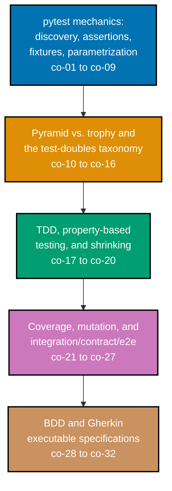

## Prerequisites

- **Prior topics**: [4 · Just Enough Python](../../just-enough-python/learning/overview.md) --
  every Python example in this topic assumes you can already read and write functions, classes,
  `list`/`dict` literals, and exceptions the way that primer taught them; [13 · Just Enough
  TypeScript](../../just-enough-typescript/learning/overview.md) covers the same ground for the
  one TypeScript example (Example 51) and the Advanced-tier TS cross-refs; [11 · Backend
  Essentials](../../backend-essentials/learning/overview.md) is a useful style reference -- the
  Advanced tier's integration and contract tests build their own small, self-contained FastAPI
  stand-in app rather than importing code from Topic 11.
- **Tools & environment**: a macOS/Linux terminal; **Python 3.13** with **pytest 9.1.1**,
  **Hypothesis 6.156.6**, **coverage.py 7.15.1** (via `pytest-cov`), and **freezegun 1.5.5**
  installed; **Node.js** with **Vitest** (this repo already depends on 4.1.0; the one TypeScript
  example was verified against 4.1.10) and **fast-check** (verified against 4.9.0 -- not a
  dependency of this repo, so run `npm install fast-check` yourself to try that example locally).
  The Advanced/BDD tiers additionally use **pytest-bdd 8.1.0**, **behave
  1.3.3**, **mutmut 3.6.0**, **pact-python 3.4.0**, and **testcontainers** -- none of which the
  Beginner or Intermediate tier needs.
- **Assumed knowledge**: reading/writing basic Python and TypeScript; running a program and a test
  suite from the CLI. No prior testing background is required -- this topic is where that
  background starts.

## Why this exists -- the big idea

The problem before the solution: you cannot prove code works by re-reading it, and regressions
creep back in silently as a system grows -- a test is how you make "it works" durable and
repeatable, checked automatically instead of trusted by memory. The one idea worth keeping if you
forget everything else: **a test encodes an expectation as executable truth**, and the test
pyramid (many fast unit tests, few slow end-to-end ones) is a deliberate trade of breadth of
confidence against speed of feedback -- not a rule to follow blindly, but a judgment to make
consciously for each risk you are actually covering.

**Cross-cutting big ideas, taught here and then reused for the rest of this topic**:
`correctness-vs-pragmatism` -- coverage (co-21) tells you which lines RAN, never which inputs
matter; Example 55 proves this directly by fully covering a one-line function with a real, latent
bug that only a property test catches. `pyramid-vs-trophy` (co-10) -- the classic pyramid (many
unit, some integration, few e2e) and Kent C. Dodds's integration-weighted "testing trophy" are
both legitimate shapes for a suite, and choosing between them is a judgment about where a given
codebase's real risk concentrates, not a universal ranking of one style over the other.

## Install and run your first example

Confirm the core toolchain this topic's Beginner and Intermediate tiers use is installed:

```text
$ python3 --version
Python 3.13.12
$ pytest --version
pytest 9.1.1
$ python3 -c "import hypothesis; print('hypothesis', hypothesis.__version__)"
hypothesis 6.156.6
$ python3 -c "import coverage; print('coverage', coverage.__version__)"
coverage 7.15.1
$ python3 -c "import freezegun; print('freezegun', freezegun.__version__)"
freezegun 1.5.5
```

Install everything this topic's Beginner and Intermediate tiers need with one `pip` command:

```text
pip install pytest==9.1.1 hypothesis==6.156.6 pytest-cov==7.15.1 freezegun==1.5.5
```

**A note on versions**: this topic's examples were authored and verified against these exact tool
versions, in this sandbox, on 2026-07-15. Any reasonably current pytest 9.x, Hypothesis 6.x, and
coverage.py 7.x behaves identically for everything the Beginner and Intermediate tiers teach --
`assert` rewriting, fixtures, parametrization, and Hypothesis's `@given`/strategies API have all
been stable across many releases (see the syllabus's DD-35 primary-source citations, re-confirmed
2026-07-12).

Every example in this topic is a complete, self-contained `test_example.py` file (or, for Example
51 only, `example.test.ts`) colocated under `learning/code/`. The command you will run for nearly
every Beginner- and Intermediate-tier example is exactly this:

```text
pytest -v test_example.py
```

Example 51 is the one exception -- run it with Vitest instead:

```text
npx vitest run example.test.ts
```

A handful of examples are deliberately split across more than one file in their own directory, to
show something a single file cannot: Example 19 and Example 60 each ship a `pytest.ini` alongside
`test_example.py` to register a custom marker; Example 22 ships a shared `conftest.py` plus two
test files to demonstrate cross-file fixture sharing; Examples 23-25 and Example 58 each narrate a
genuine TDD red-then-green transition across separate files, one file per state.

## How this topic's examples are organized

- **Beginner** (Examples 1-28) -- pytest's own mechanics from the ground up: writing and running a
  first test, reading pytest's assertion introspection on failure, arrange-act-assert structure,
  `pytest.raises`, fixtures (with scope and teardown), `@pytest.mark.parametrize`, `pytest.approx`
  for floats, markers and selection (`skip`, `xfail`, custom markers, `-k`/`-m`), test
  organization (classes, `conftest.py`), a first hands-on TDD red-green-refactor cycle, and
  reading a verbose test report.
- **Intermediate** (Examples 29-60) -- the full dummy/stub/spy/mock/fake test-double taxonomy,
  three ways to patch a dependency (`mock.patch`, `monkeypatch.setattr`, `monkeypatch.setenv`),
  controlling time and randomness, property-based testing with Hypothesis (idempotence,
  round-trips, commutativity, list invariants, shrinking, custom strategies, `assume()`,
  `@example`) plus the identical round-trip property in TypeScript's fast-check, line and branch
  coverage, the "coverage is not proof" caveat made concrete, a parametrized fixture, and a second
  TDD cycle combined with a stubbed collaborator.
- **Advanced** (Examples 61-80) -- the pyramid and trophy shapes built as real suites, genuine
  integration tests (two real modules, an app against a real temporary database, an HTTP
  endpoint), `testcontainers`-backed ephemeral dependencies, Pact consumer/provider contract
  testing, a full end-to-end happy path, mutation testing with `mutmut` (a baseline run, killing a
  surviving mutant, and mutation exposing what coverage alone missed), reading real coverage and
  traceback output, diagnosing and fixing a genuinely flaky test, the full dummy/stub/spy/mock/fake
  taxonomy mapped onto one scenario, and two capstone-style full-pyramid/full-verification
  examples.
- **BDD & Executable Specifications** (Examples 81-86) -- Gherkin `.feature` files run by
  `pytest-bdd`, the `Feature`/`Scenario`/`Given`/`When`/`Then`/`And` grammar itself, step
  definitions sharing state across a scenario, a `Scenario Outline` with an `Examples` table, the
  identical `.feature` run under both `behave` and `pytest-bdd` (or Cucumber.js), and a worked
  decision between a unit TDD test and a BDD acceptance scenario.
- **Capstone** -- one small feature built out across the full pyramid: TDD'd unit tests, a mocked
  dependency, a Hypothesis (+ fast-check) property test with a demonstrated shrink, and an
  integration test against its own small, self-contained FastAPI stand-in app (modeled on Backend
  Essentials' style), with a coverage report read from the CLI.

Every example cites the concept (`co-NN`) it exercises, and every version pin and API claim traces
to `docs.pytest.org`, `docs.python.org/unittest.mock`, `hypothesis.readthedocs.io`,
`coverage.readthedocs.io`, the `pytest-bdd`/`behave`/`@cucumber/cucumber` project pages, and the
primary author sources named in the syllabus's DD-35 citations, web-verified 2026-07-12 and
re-confirmed 2026-07-15.



## Concepts

Every worked example in this topic's follow-up pages cites the `co-NN` concept it exercises --
this section is the 1:1 reference those citations point back to. Read it in order: pytest's own
mechanics come first because every later concept (a double, a property test, a coverage report) is
described in terms of a plain pytest test that already makes sense on its own.

### co-01 · Why Test and AAA

A test encodes an expectation as executable truth, structured as arrange-act-assert (set up the
world, do the one thing under test, check what happened) so a reader can see the test's intent at
a glance rather than reconstructing it from an undifferentiated block of code.

**Why it matters**: every other concept in this topic's Concepts section is, underneath, still an
arrange-act-assert test -- a fixture changes what "arrange" looks like, a mock changes what
"assert" checks, but the three-phase shape itself never goes away.

**Verify it**: Example 1 is the smallest complete instance of "a test encodes an expectation";
Example 3 makes the three AAA phases visually explicit with comments; Example 57 shows AAA still
holding together once a test double is added to the mix.

### co-02 · Test Discovery and Run

`pytest` discovers files named `test_*.py` and functions named `test_*` automatically, and can run
the whole suite, one file, or a single named test (`pytest path::test_name`) from the CLI with no
separate test registration step.

**Why it matters**: naming convention IS the registration mechanism -- a function that fails to
start with `test_` simply never runs as a test, silently, which is a common source of "why didn't
this test catch that" confusion for newcomers.

**Verify it**: Example 1 is the first file pytest ever discovers in this topic; Example 4 runs one
specific test by its full `path::name`, proving discovery works at any granularity.

### co-03 · Assertions

Plain Python `assert` plus pytest's own assertion-rewriting reports the failing operands directly
in the traceback -- no `self.assertEqual`/`self.assertTrue` method zoo is needed, unlike
`unittest`.

**Why it matters**: a failure message that already shows both the expected and actual values
(without extra `assertEqual`-style boilerplate) is the single biggest reason plain `assert` reads
more naturally than most other frameworks' assertion APIs.

**Verify it**: Example 2 shows pytest's introspected failure output for a wrong value; Examples 5,
6, and 7 apply plain `assert` to equality, truthiness, and membership checks respectively.

### co-04 · Exception Testing

`pytest.raises(SomeError, match="...")` asserts that a block of code raises the expected exception
type, and (with `match=`) that its message matches a given regular expression via `re.search`.

**Why it matters**: testing that an error path fails LOUDLY and CORRECTLY is just as important as
testing a success path -- a function that should raise but silently returns `None` instead is a
real, common bug class this concept exists to catch.

**Verify it**: Example 8 confirms a `ValueError` is raised; Example 9 additionally asserts the
exact message text; Example 34 combines this with a mock's `side_effect` to test a unit's own
error-recovery logic.

### co-05 · Fixtures

`@pytest.fixture` provides reusable setup (and, via `yield`, teardown) injected into a test simply
by naming the fixture as a parameter -- pytest resolves the dependency by matching names, with no
explicit wiring required.

**Why it matters**: fixtures are how pytest keeps setup code out of every individual test body --
Example 42 reuses this exact mechanism to seed a random-number generator, and Example 56
parametrizes a fixture to fan a single setup out across many values.

**Verify it**: Example 11 injects a fixture by name for the first time; Example 12 proves teardown
genuinely runs after the test body via `yield`; Example 13 shows a `scope="module"` fixture built
only once.

### co-06 · Parametrization

`@pytest.mark.parametrize` runs one test body over many `(input, expected)` rows, each reported by
pytest as its own separately-named test case rather than as one test silently looping internally.

**Why it matters**: a parametrized test that fails on row 3 out of 5 tells you EXACTLY which input
broke, immediately -- a hand-written `for` loop over the same cases inside one test body would
instead stop at the first failure and hide the other four results entirely.

**Verify it**: Example 14 runs three cases; Example 15 adds readable `ids` to each case; Example 16
parametrizes two arguments together; Example 56 parametrizes a fixture rather than a test directly.

### co-07 · Approx and Floats

`pytest.approx` compares floating-point values within a small tolerance rather than by exact
equality, because binary floating-point arithmetic genuinely cannot represent most decimal values
exactly.

**Why it matters**: `0.1 + 0.2 == 0.3` is `False` in Python (and nearly every language using IEEE
754 floats) -- Example 29's `100.0 * 1.10` similarly does not equal `110.0` bit-for-bit, which is
exactly the class of bug `pytest.approx` exists to sidestep, not paper over.

**Verify it**: Example 10 verifies `0.1 + 0.2 == pytest.approx(0.3)` directly; Example 29 needed
`pytest.approx` to make a real, otherwise-failing float assertion pass correctly.

### co-08 · Markers and Selection

Markers -- built-in (`skip`, `xfail`) and custom (registered in `pytest.ini`) -- label subsets of a
suite, and `-k` (keyword) / `-m` (marker expression) select which subset actually runs on a given
invocation.

**Why it matters**: `-m "not integration"` and `-m "not slow"` are the exact mechanism real CI
pipelines use to run a fast subset on every push and a slower full run less often -- this is not a
toy feature, it is how test suites scale past a few seconds of runtime.

**Verify it**: Example 17 marks a test `skip`; Example 18 marks one `xfail`; Example 19 registers
and selects a custom `slow` marker; Example 20 selects by keyword instead; Example 60 applies the
identical pattern to an `integration` marker.

### co-09 · Test Organization

Grouping related tests inside a class (`class TestAdder`) and sharing fixtures across multiple
files via `conftest.py` keeps a growing suite navigable, rather than one flat, ever-longer list of
unrelated test functions.

**Why it matters**: `conftest.py` is pytest's answer to "how do multiple test files share the same
setup without importing from each other" -- Example 22 demonstrates the sharing directly across two
separate test files.

**Verify it**: Example 21 groups tests inside a `TestAdder` class; Example 22 shares one fixture
from `conftest.py` across `test_example.py` and `test_more.py`.

### co-10 · Test Pyramid vs. Trophy

Many fast unit tests and few slow end-to-end tests (the pyramid, credited to Mike Cohn) versus a
"testing trophy" (Kent C. Dodds) that weights integration tests most heavily -- both are legitimate,
risk-driven judgments about where a given codebase's real defects tend to hide, not a universal
ranking of one shape over the other.

**Why it matters**: picking a shape is a genuine design decision, not a default to accept
unexamined -- a codebase that is mostly thin glue between well-tested libraries earns a trophy
shape; a codebase with complex, pure business logic earns a classic pyramid.

**Verify it**: Example 60's `-m "not integration"` split is the mechanical seam pyramid-vs-trophy
decisions are built on; the Advanced tier's Example 61 and Example 62 build the pyramid and trophy
shapes as literal, countable suites side by side.

### co-11 · Test-Doubles Taxonomy

Dummy, stub, spy, mock, and fake are five DISTINCT kinds of test double, each solving a different
problem -- this is Gerard Meszaros's taxonomy (_xUnit Test Patterns_, 2007), popularized (and
correctly credited to Meszaros) by Martin Fowler's _Mocks Aren't Stubs_.

**Why it matters**: reaching for "a mock" as a catch-all term for every kind of double blurs real
distinctions that matter -- a dummy is never called at all, a stub returns a canned value, a spy
delegates to the real thing while recording calls, a mock's whole point is the recorded
interaction, and a fake is a genuinely working (just lightweight) implementation.

**Verify it**: Examples 29-40 demonstrate each kind of double distinctly and side by side; the
Advanced tier's Example 77 implements one single scenario with all five kinds in a row, mapped
explicitly back to Meszaros's own definitions.

### co-12 · Stubbing

A stub returns a fixed, canned answer with no logic of its own, letting the unit under test run
correctly in isolation from a real, more complicated (or slower, or less reliable) collaborator.

**Why it matters**: a stub is the cheapest way to make a unit's test deterministic when that unit
depends on something whose real answer would otherwise vary (a live tax-rate service, a live
pricing API) -- co-26's determinism requirement, satisfied at the collaborator boundary.

**Verify it**: Example 29 is the first stub in this topic; Example 33 configures a `MagicMock`'s
`return_value` to behave stub-like; Example 58 stubs a collaborator as the very first step of a TDD
cycle, before the unit under test even exists yet.

### co-13 · Mocking and Verification

`unittest.mock`'s `MagicMock` records every call made to it, so a test can assert on the
INTERACTION itself (`mock.called`, `mock.assert_called_once_with(...)`) rather than only on a
return value.

**Why it matters**: some behavior genuinely has no return value to check -- a notification that
gets sent, a log line that gets written -- and a mock's recorded call is the only way to verify that
side effect happened at all, short of a real integration test.

**Verify it**: Example 31 checks `.called`; Example 32 checks the exact call arguments; Example 33
configures a return value; Example 34 configures a `side_effect` that raises; Example 40 puts a
mock's interaction-based check directly next to a fake's state-based one, on the identical
scenario.

### co-14 · Patching

`monkeypatch` (a pytest-builtin fixture) and `mock.patch` (a context manager) both replace a
dependency at its USE SITE for the duration of a test, then automatically restore the original --
`monkeypatch` needs no explicit `with` block, while `mock.patch` needs one.

**Why it matters**: "patch where it's used" -- the exact module namespace that LOOKS UP the
dependency, not wherever the dependency happens to be defined -- is the single most common source of
confusion with patching; get the target string wrong and the patch silently does nothing.

**Verify it**: Example 35 patches with `mock.patch` inside a `with` block; Example 36 patches the
same kind of thing with `monkeypatch.setattr` instead; Example 37 patches an environment variable
with `monkeypatch.setenv`; Examples 41 and 42 patch time and randomness respectively, using this
same family of technique.

### co-15 · Spies

A spy wraps a REAL object (`MagicMock(wraps=real_object)`) so that calls are both recorded (like a
mock) and genuinely forwarded to the real implementation (unlike a mock, which fakes the return
value entirely).

**Why it matters**: a spy is the right choice when a test needs to confirm a real side effect
happened (real computation, a real write) while ALSO checking how a collaborator was called --
reaching for a plain mock instead would silence the real behavior, potentially hiding a genuine bug
in the wrapped object itself.

**Verify it**: Example 38 is the first spy in this topic, wrapping a real `Calculator`; the
Advanced tier's Example 77 places a spy alongside all four other double kinds on one scenario.

### co-16 · Fakes

A fake is a real, WORKING implementation -- just too lightweight for production use (an in-memory
dictionary standing in for a real database) -- unlike a stub, which returns one canned answer with
no real logic behind it.

**Why it matters**: a fake is the double of choice whenever a test needs genuine, persistent state
across multiple calls within itself (write then read back) without the cost or fragility of a real
external dependency -- an I/O boundary (Example 59) is exactly where this pays off most.

**Verify it**: Example 39 builds `InMemoryUserRepo`, a genuinely working fake repository; Example
40 puts that same fake directly beside a mock on the identical scenario; Example 59 fakes an entire
filesystem boundary so a unit test performs zero real I/O.

### co-17 · TDD Red-Green-Refactor

Write a failing test FIRST (red), implement just enough to make it pass (green), then improve the
implementation while the test suite stays green throughout (refactor) -- the originating discipline
of Kent Beck's _Test-Driven Development: By Example_ (2002).

**Why it matters**: writing the test first forces you to decide what "correct" means BEFORE you
write the implementation, which tends to produce a more focused, more testable design than writing
the test after the fact, once the implementation's shape is already fixed in your head.

**Verify it**: Examples 23, 24, and 25 walk the full cycle across three separate files (genuinely
red, then genuinely green, then refactored while still green); Example 58 repeats the cycle with a
stubbed collaborator already in place; the Advanced tier's Example 80 combines this cycle with
property tests, coverage, and an integration test in one full-verification example.

### co-18 · Property-Based Testing

Hypothesis (and fast-check in TypeScript) generates MANY inputs -- typically over a hundred per
run -- and asserts a general invariant holds across all of them, rather than checking a handful of
hand-picked example inputs.

**Why it matters**: hand-picked examples only ever prove correctness for the specific values a
human happened to think of -- property-based testing exercises a far wider slice of the input space
automatically, which is exactly how Example 47's deliberately buggy function gets caught.

**Verify it**: Examples 43-50 each assert one distinct kind of property (idempotence, round-trip,
commutativity, a list invariant, a pinned edge case); Example 51 proves the same technique
transfers directly to fast-check in TypeScript; Example 55 shows property testing catching a bug
that full line coverage completely missed.

### co-19 · Shrinking

When a property test finds a failing input, Hypothesis automatically SHRINKS it down to the
smallest input that still reproduces the failure, rather than reporting whatever larger, messier
input it happened to generate first.

**Why it matters**: a failure reported against a large, randomly-generated input would be tedious
to debug by hand -- a shrunk, minimal counterexample (Example 47's `xs=[1]`) points directly at what
is actually wrong, which is Hypothesis's single biggest advantage over hand-written fuzzing.

**Verify it**: Example 47 is a genuinely buggy function, deliberately included so Hypothesis's
shrinker has something real to shrink; its captured output shows the exact minimal counterexample
found.

### co-20 · Strategies

Hypothesis strategies (`st.integers()`, `st.text()`, `st.lists()`, `@st.composite` for
domain-specific objects, `assume()` to discard invalid inputs) describe and constrain the space of
values a property test generates from.

**Why it matters**: real domain objects (a valid rectangle, a non-empty list, a case that excludes
zero) rarely fit a single built-in strategy untouched -- `@st.composite` and `assume()` are how
Hypothesis scales from testing primitive types to testing an application's own business objects.

**Verify it**: Example 48 builds a custom `@st.composite` strategy for a `(width, height)`
rectangle; Example 49 uses `assume()` to discard the one input (`x == 0`) a property does not apply
to; Example 50 pins a specific case with `@example` alongside the generated ones.

### co-21 · Coverage

`coverage.py` measures which lines (and, with `--branch`, which branches) actually ran during a
test session -- a necessary signal for "did I test enough," but never a sufficient one for "is this
correct."

**Why it matters**: 100% line coverage answers only "did every line RUN," never "was it run against
every input that matters" -- Example 55 makes this distinction concrete, not abstract, by fully
covering a one-line function that still crashes on an input the covering test never tried.

**Verify it**: Example 52 reads a line coverage report; Example 53 reads a branch coverage report;
Example 54 uses that same report to find and then close a real gap; Example 55 is this concept's
central caveat, proven rather than merely stated.

### co-22 · Mutation Testing

`mutmut` (Python) and Stryker (TypeScript) deliberately mutate the code under test (flip a
comparison, change a constant) and check whether the existing test suite actually catches each
mutation -- a stronger signal of test STRENGTH than coverage alone provides.

**Why it matters**: a test suite can achieve 100% coverage while asserting almost nothing
meaningful (a test that calls a function but never checks its return value, for instance) -- a
surviving mutant is coverage's blind spot made visible and specific.

**Verify it**: the Advanced tier's Example 70 runs a mutation baseline; Example 71 adds a test that
kills a surviving mutant; Example 72 shows a fully covered function whose surviving mutants reveal
weak assertions coverage alone never flagged.

### co-23 · Integration Testing

An integration test exercises multiple REAL components together (an app and a real database, two
real collaborating modules) past the seams a unit test would otherwise stub out -- proving the
pieces actually work together, not merely that each piece works alone.

**Why it matters**: unit tests with every collaborator stubbed can all pass while the REAL
integration between components is silently broken -- a mismatched database column name, a
serialization format neither side actually agrees on -- which is exactly the gap integration tests
close.

**Verify it**: the Advanced tier's Example 63 tests two real modules together; Example 64 runs
against a real temporary database; Example 65 hits a real HTTP endpoint on the tier's own small,
self-contained FastAPI stand-in app.

### co-24 · Contract Testing

Pact lets a consumer and a provider agree on an interface and verify each side independently --
the consumer records its expectations as a "pact," and the provider replays that pact against its
own real implementation -- without either side needing the other running for a full integration
test.

**Why it matters**: a full integration test between two independently-deployed services requires
BOTH to be running simultaneously, which does not scale across many services -- contract testing
verifies the same interface agreement without that coordination cost.

**Verify it**: the Advanced tier's Example 67 writes a Pact consumer test and produces a pact file;
Example 68 verifies the provider against that same recorded pact.

### co-25 · E2E and Test Containers

End-to-end tests drive the WHOLE system through a real user-facing flow; `testcontainers` supplies
ephemeral, genuinely real dependencies (a real database, in a real container, torn down
automatically afterward) for exactly the tests that need them.

**Why it matters**: `testcontainers` removes the excuse for skipping a real-dependency test out of
fear of a shared, stateful, hand-maintained test database -- each test run gets a fresh, disposable
instance instead.

**Verify it**: the Advanced tier's Example 66 spins up an ephemeral database container for one
test; Example 69 drives a full end-to-end happy path through the whole system.

### co-26 · Test Isolation and Determinism

Tests must be independent (no test's outcome depends on another test having run first), order-free
(the suite passes in any run order), and deterministic (the same test produces the same result
every time) -- achieved by controlling time, randomness, and I/O rather than leaving them ambient.

**Why it matters**: a test that depends on the real system clock, real un-seeded randomness, or a
real shared file is a test that will eventually fail intermittently, in a way that is nearly
impossible to reproduce locally -- Examples 41 and 42 show exactly how to remove each of those
sources of non-determinism.

**Verify it**: Example 27 runs the identical test twice and confirms identical results; Example 37
proves a patched environment variable does not leak between tests; Example 59 proves a unit test
touches zero real disk I/O.

### co-27 · Reading Reports

Reading pytest's own terminal output, a coverage report's `Missing` column, and (in the Advanced
tier) a mutation score turns a test run from a pass/fail signal into an ACTIONABLE one -- knowing
exactly which line, branch, or mutant needs attention next.

**Why it matters**: "the tests passed" and "the tests are thorough" are different claims -- being
able to read WHAT a report is actually telling you (not just its bottom-line percentage) is what
turns a report into a next action rather than a number to glance at and dismiss.

**Verify it**: Example 28 reads a verbose `-v` test report; Example 52 reads a line coverage
report's `Missing` column directly; the Advanced tier's Example 73 and Example 74 read a coverage
report and a failing traceback respectively, as dedicated skills in their own right.

### co-28 · BDD Given-When-Then

Behavior-driven development (BDD, coined by Dan North in 2006) frames each behavior as a Given
(context) / When (action) / Then (outcome) scenario in ubiquitous language shared with
non-engineers, pushing the TDD discipline outward from individual units to whole, describable
behaviors.

**Why it matters**: a Given/When/Then scenario is readable by a product owner or a QA engineer who
has never opened the codebase, which is exactly the audience unit-level TDD (co-17) was never
designed to reach.

**Verify it**: the BDD tier's Example 81 writes the first Given/When/Then scenario and its
`pytest-bdd` step definitions, running it green end to end.

### co-29 · Gherkin Feature-Scenario

Gherkin's `Feature` / `Scenario` / `Given` / `When` / `Then` / `And` / `But` grammar (the Cucumber
project's own reference grammar) expresses an executable specification in near-natural language
that both a test runner and a non-engineer stakeholder can read without translation.

**Why it matters**: because the SAME `.feature` file is both the specification a stakeholder reads
and the executable test a runner executes, the specification and the test can never silently drift
apart the way a prose requirements document and a separately-maintained test suite eventually do.

**Verify it**: the BDD tier's Example 82 authors a `.feature` file using this exact grammar and
confirms the runner parses and lists the named scenario; Example 85 runs the identical `.feature`
under two different runners to prove the grammar itself is runner-independent.

### co-30 · Step Definitions

A step definition binds ONE Gherkin step to executable code via a matching pattern; `pytest-bdd`
and `behave` (Python) or Cucumber.js (TypeScript) run a `.feature` file's scenarios against
whichever step definitions match its text.

**Why it matters**: the `.feature` file itself never changes when the underlying implementation
does -- only its step definitions need updating -- which is exactly what keeps the specification
stable and readable even as the code behind it evolves.

**Verify it**: the BDD tier's Example 81 binds its first step definitions; Example 83 shares state
across steps within one scenario via a context/fixture, proving a value set in `Given` is visible
in `Then`.

### co-31 · Scenario Outline Examples

A `Scenario Outline` combined with an `Examples` table runs one scenario body over many rows of
data -- Gherkin's own analog of pytest's `@pytest.mark.parametrize` (co-06), keeping a data-driven
set of cases readable as a table rather than as repeated, near-identical scenarios.

**Why it matters**: without `Scenario Outline`, testing the same behavior across five different
input rows would mean writing the SAME scenario five separate times -- the table format keeps the
data-driven cases both DRY and, unlike a raw parametrize call, still readable by a non-engineer.

**Verify it**: the BDD tier's Example 84 drives one `Scenario Outline` over an `Examples` table and
confirms each row runs as its own independently-reported case.

### co-32 · BDD vs. TDD and ATDD

BDD, ATDD (acceptance-test-driven development), and specification-by-example add shared-language
acceptance tests at the OUTSIDE of the test pyramid -- they complement, and never replace, unit-level
TDD (co-17); which one a given change actually earns is a judgment call about that change's real
risk and its real audience.

**Why it matters**: writing a full Given/When/Then scenario for a purely internal helper function
is disproportionate ceremony for something only engineers will ever read -- and, in the other
direction, verifying a customer-facing checkout flow with nothing but internal unit tests misses
the audience that actually needs to read and trust the specification.

**Verify it**: the BDD tier's Example 86 annotates one real change with whether a unit TDD test or
a BDD acceptance scenario fits it better, and verifies the choice against both the change's risk
and its intended audience.

## Examples by Level

### Beginner (Examples 1–28)

- [Example 1: First Passing Test](/en/c/learn/fundamentally-strong/software-engineer/software-testing/learning/beginner#example-1-first-passing-test)
- [Example 2: Failing Test Output](/en/c/learn/fundamentally-strong/software-engineer/software-testing/learning/beginner#example-2-failing-test-output)
- [Example 3: Arrange-Act-Assert](/en/c/learn/fundamentally-strong/software-engineer/software-testing/learning/beginner#example-3-arrange-act-assert)
- [Example 4: Run a Single Test by Name](/en/c/learn/fundamentally-strong/software-engineer/software-testing/learning/beginner#example-4-run-a-single-test-by-name)
- [Example 5: Assert Equality](/en/c/learn/fundamentally-strong/software-engineer/software-testing/learning/beginner#example-5-assert-equality)
- [Example 6: Assert Truthiness](/en/c/learn/fundamentally-strong/software-engineer/software-testing/learning/beginner#example-6-assert-truthiness)
- [Example 7: Assert Membership](/en/c/learn/fundamentally-strong/software-engineer/software-testing/learning/beginner#example-7-assert-membership)
- [Example 8: Raises ValueError](/en/c/learn/fundamentally-strong/software-engineer/software-testing/learning/beginner#example-8-raises-valueerror)
- [Example 9: Raises with a Matching Message](/en/c/learn/fundamentally-strong/software-engineer/software-testing/learning/beginner#example-9-raises-with-a-matching-message)
- [Example 10: Approx for Floats](/en/c/learn/fundamentally-strong/software-engineer/software-testing/learning/beginner#example-10-approx-for-floats)
- [Example 11: A Simple Fixture](/en/c/learn/fundamentally-strong/software-engineer/software-testing/learning/beginner#example-11-a-simple-fixture)
- [Example 12: Fixture Teardown with yield](/en/c/learn/fundamentally-strong/software-engineer/software-testing/learning/beginner#example-12-fixture-teardown-with-yield)
- [Example 13: Fixture Scope -- Module](/en/c/learn/fundamentally-strong/software-engineer/software-testing/learning/beginner#example-13-fixture-scope----module)
- [Example 14: Parametrize Three Cases](/en/c/learn/fundamentally-strong/software-engineer/software-testing/learning/beginner#example-14-parametrize-three-cases)
- [Example 15: Parametrize with Readable ids](/en/c/learn/fundamentally-strong/software-engineer/software-testing/learning/beginner#example-15-parametrize-with-readable-ids)
- [Example 16: Parametrize Multiple Arguments](/en/c/learn/fundamentally-strong/software-engineer/software-testing/learning/beginner#example-16-parametrize-multiple-arguments)
- [Example 17: Mark a Test skip](/en/c/learn/fundamentally-strong/software-engineer/software-testing/learning/beginner#example-17-mark-a-test-skip)
- [Example 18: Mark a Test xfail](/en/c/learn/fundamentally-strong/software-engineer/software-testing/learning/beginner#example-18-mark-a-test-xfail)
- [Example 19: A Custom Marker and -m Selection](/en/c/learn/fundamentally-strong/software-engineer/software-testing/learning/beginner#example-19-a-custom-marker-and--m-selection)
- [Example 20: Keyword Selection with -k](/en/c/learn/fundamentally-strong/software-engineer/software-testing/learning/beginner#example-20-keyword-selection-with--k)
- [Example 21: Group Tests in a Class](/en/c/learn/fundamentally-strong/software-engineer/software-testing/learning/beginner#example-21-group-tests-in-a-class)
- [Example 22: A Shared Fixture in conftest.py](/en/c/learn/fundamentally-strong/software-engineer/software-testing/learning/beginner#example-22-a-shared-fixture-in-conftestpy)
- [Example 23: TDD Step 1 -- Red](/en/c/learn/fundamentally-strong/software-engineer/software-testing/learning/beginner#example-23-tdd-step-1----red)
- [Example 24: TDD Step 2 -- Green](/en/c/learn/fundamentally-strong/software-engineer/software-testing/learning/beginner#example-24-tdd-step-2----green)
- [Example 25: TDD Step 3 -- Refactor](/en/c/learn/fundamentally-strong/software-engineer/software-testing/learning/beginner#example-25-tdd-step-3----refactor)
- [Example 26: Testing a Pure Function](/en/c/learn/fundamentally-strong/software-engineer/software-testing/learning/beginner#example-26-testing-a-pure-function)
- [Example 27: Deterministic, Order-Independent Tests](/en/c/learn/fundamentally-strong/software-engineer/software-testing/learning/beginner#example-27-deterministic-order-independent-tests)
- [Example 28: A Verbose Test Report](/en/c/learn/fundamentally-strong/software-engineer/software-testing/learning/beginner#example-28-a-verbose-test-report)

### Intermediate (Examples 29–60)

- [Example 29: A Stub Returns a Canned Value](/en/c/learn/fundamentally-strong/software-engineer/software-testing/learning/intermediate#example-29-a-stub-returns-a-canned-value)
- [Example 30: A Dummy Object, Never Called](/en/c/learn/fundamentally-strong/software-engineer/software-testing/learning/intermediate#example-30-a-dummy-object-never-called)
- [Example 31: A Mock Records a Call](/en/c/learn/fundamentally-strong/software-engineer/software-testing/learning/intermediate#example-31-a-mock-records-a-call)
- [Example 32: assert_called_once_with](/en/c/learn/fundamentally-strong/software-engineer/software-testing/learning/intermediate#example-32-assert_called_once_with)
- [Example 33: Configuring a Mock's Return Value](/en/c/learn/fundamentally-strong/software-engineer/software-testing/learning/intermediate#example-33-configuring-a-mocks-return-value)
- [Example 34: A Mock's side_effect Raises](/en/c/learn/fundamentally-strong/software-engineer/software-testing/learning/intermediate#example-34-a-mocks-side_effect-raises)
- [Example 35: Patching a Dependency](/en/c/learn/fundamentally-strong/software-engineer/software-testing/learning/intermediate#example-35-patching-a-dependency)
- [Example 36: monkeypatch.setattr](/en/c/learn/fundamentally-strong/software-engineer/software-testing/learning/intermediate#example-36-monkeypatchsetattr)
- [Example 37: monkeypatch.setenv](/en/c/learn/fundamentally-strong/software-engineer/software-testing/learning/intermediate#example-37-monkeypatchsetenv)
- [Example 38: A Spy Wraps the Real Object](/en/c/learn/fundamentally-strong/software-engineer/software-testing/learning/intermediate#example-38-a-spy-wraps-the-real-object)
- [Example 39: A Fake In-Memory Repository](/en/c/learn/fundamentally-strong/software-engineer/software-testing/learning/intermediate#example-39-a-fake-in-memory-repository)
- [Example 40: Fake vs. Mock -- Two Ways to Check the Same Thing](/en/c/learn/fundamentally-strong/software-engineer/software-testing/learning/intermediate#example-40-fake-vs-mock----two-ways-to-check-the-same-thing)
- [Example 41: Freezing Time](/en/c/learn/fundamentally-strong/software-engineer/software-testing/learning/intermediate#example-41-freezing-time)
- [Example 42: Seeding Randomness](/en/c/learn/fundamentally-strong/software-engineer/software-testing/learning/intermediate#example-42-seeding-randomness)
- [Example 43: Property -- Idempotence](/en/c/learn/fundamentally-strong/software-engineer/software-testing/learning/intermediate#example-43-property----idempotence)
- [Example 44: Property -- Round-Trip](/en/c/learn/fundamentally-strong/software-engineer/software-testing/learning/intermediate#example-44-property----round-trip)
- [Example 45: Property -- Commutativity](/en/c/learn/fundamentally-strong/software-engineer/software-testing/learning/intermediate#example-45-property----commutativity)
- [Example 46: Property -- A List Invariant](/en/c/learn/fundamentally-strong/software-engineer/software-testing/learning/intermediate#example-46-property----a-list-invariant)
- [Example 47: Shrinking to a Minimal Counterexample](/en/c/learn/fundamentally-strong/software-engineer/software-testing/learning/intermediate#example-47-shrinking-to-a-minimal-counterexample)
- [Example 48: A Custom Composite Strategy](/en/c/learn/fundamentally-strong/software-engineer/software-testing/learning/intermediate#example-48-a-custom-composite-strategy)
- [Example 49: Discarding Invalid Inputs with assume()](/en/c/learn/fundamentally-strong/software-engineer/software-testing/learning/intermediate#example-49-discarding-invalid-inputs-with-assume)
- [Example 50: Pinning a Case with @example](/en/c/learn/fundamentally-strong/software-engineer/software-testing/learning/intermediate#example-50-pinning-a-case-with-example)
- [Example 51: A Round-Trip Property in fast-check (TS)](/en/c/learn/fundamentally-strong/software-engineer/software-testing/learning/intermediate#example-51-a-round-trip-property-in-fast-check-ts)
- [Example 52: A Line Coverage Report](/en/c/learn/fundamentally-strong/software-engineer/software-testing/learning/intermediate#example-52-a-line-coverage-report)
- [Example 53: Branch Coverage](/en/c/learn/fundamentally-strong/software-engineer/software-testing/learning/intermediate#example-53-branch-coverage)
- [Example 54: Closing a Coverage Gap](/en/c/learn/fundamentally-strong/software-engineer/software-testing/learning/intermediate#example-54-closing-a-coverage-gap)
- [Example 55: Coverage Is Not Proof](/en/c/learn/fundamentally-strong/software-engineer/software-testing/learning/intermediate#example-55-coverage-is-not-proof)
- [Example 56: A Parametrized Fixture](/en/c/learn/fundamentally-strong/software-engineer/software-testing/learning/intermediate#example-56-a-parametrized-fixture)
- [Example 57: Arrange-Act-Assert with a Double](/en/c/learn/fundamentally-strong/software-engineer/software-testing/learning/intermediate#example-57-arrange-act-assert-with-a-double)
- [Example 58: TDD with a Stubbed Collaborator](/en/c/learn/fundamentally-strong/software-engineer/software-testing/learning/intermediate#example-58-tdd-with-a-stubbed-collaborator)
- [Example 59: Isolating an I/O Boundary](/en/c/learn/fundamentally-strong/software-engineer/software-testing/learning/intermediate#example-59-isolating-an-io-boundary)
- [Example 60: A Marker for Integration Tests](/en/c/learn/fundamentally-strong/software-engineer/software-testing/learning/intermediate#example-60-a-marker-for-integration-tests)

### Advanced (Examples 61–80)

- [Example 61: Organize a Suite in Pyramid Shape](/en/c/learn/fundamentally-strong/software-engineer/software-testing/learning/advanced#example-61-organize-a-suite-in-pyramid-shape)
- [Example 62: Reweight the Same Suite Toward Integration -- the Testing Trophy](/en/c/learn/fundamentally-strong/software-engineer/software-testing/learning/advanced#example-62-reweight-the-same-suite-toward-integration----the-testing-trophy)
- [Example 63: Test Two Real Collaborating Modules Together](/en/c/learn/fundamentally-strong/software-engineer/software-testing/learning/advanced#example-63-test-two-real-collaborating-modules-together)
- [Example 64: A Test Against the App with a Real Temporary Database](/en/c/learn/fundamentally-strong/software-engineer/software-testing/learning/advanced#example-64-a-test-against-the-app-with-a-real-temporary-database)
- [Example 65: Hit a Small FastAPI Endpoint with TestClient](/en/c/learn/fundamentally-strong/software-engineer/software-testing/learning/advanced#example-65-hit-a-small-fastapi-endpoint-with-testclient)
- [Example 66: Spin Up a Throwaway DB Container for a Test](/en/c/learn/fundamentally-strong/software-engineer/software-testing/learning/advanced#example-66-spin-up-a-throwaway-db-container-for-a-test)
- [Example 67: A Pact Consumer Test That Defines the Expected Interaction](/en/c/learn/fundamentally-strong/software-engineer/software-testing/learning/advanced#example-67-a-pact-consumer-test-that-defines-the-expected-interaction)
- [Example 68: Verify a Small Provider App Against the Pact Produced in Example 67](/en/c/learn/fundamentally-strong/software-engineer/software-testing/learning/advanced#example-68-verify-a-small-provider-app-against-the-pact-produced-in-example-67)
- [Example 69: Drive a Whole Small System Through a Multi-Step Flow](/en/c/learn/fundamentally-strong/software-engineer/software-testing/learning/advanced#example-69-drive-a-whole-small-system-through-a-multi-step-flow)
- [Example 70: A Well-Tested Function -- Run mutmut, Read the Surviving-Mutant Report](/en/c/learn/fundamentally-strong/software-engineer/software-testing/learning/advanced#example-70-a-well-tested-function----run-mutmut-read-the-surviving-mutant-report)
- [Example 71: Add a Test to Kill a Surviving Mutant](/en/c/learn/fundamentally-strong/software-engineer/software-testing/learning/advanced#example-71-add-a-test-to-kill-a-surviving-mutant)
- [Example 72: A Fully-Covered Function With Surviving Mutants](/en/c/learn/fundamentally-strong/software-engineer/software-testing/learning/advanced#example-72-a-fully-covered-function-with-surviving-mutants)
- [Example 73: Interpret a Terminal Coverage Report -- Name the Uncovered Lines](/en/c/learn/fundamentally-strong/software-engineer/software-testing/learning/advanced#example-73-interpret-a-terminal-coverage-report----name-the-uncovered-lines)
- [Example 74: Read a Failing pytest Traceback](/en/c/learn/fundamentally-strong/software-engineer/software-testing/learning/advanced#example-74-read-a-failing-pytest-traceback)
- [Example 75: Reproduce a Flaky Test Caused by Shared State, Then Isolate It](/en/c/learn/fundamentally-strong/software-engineer/software-testing/learning/advanced#example-75-reproduce-a-flaky-test-caused-by-shared-state-then-isolate-it)
- [Example 76: Use Fixture Teardown to Reset State Between Tests](/en/c/learn/fundamentally-strong/software-engineer/software-testing/learning/advanced#example-76-use-fixture-teardown-to-reset-state-between-tests)
- [Example 77: One Scenario, Five Doubles -- Dummy, Stub, Spy, Mock, and Fake](/en/c/learn/fundamentally-strong/software-engineer/software-testing/learning/advanced#example-77-one-scenario-five-doubles----dummy-stub-spy-mock-and-fake)
- [Example 78: Choose the Right Double for the Scenario](/en/c/learn/fundamentally-strong/software-engineer/software-testing/learning/advanced#example-78-choose-the-right-double-for-the-scenario)
- [Example 79: One Feature, Every Tier -- Unit + Integration + E2E, All Green](/en/c/learn/fundamentally-strong/software-engineer/software-testing/learning/advanced#example-79-one-feature-every-tier----unit--integration--e2e-all-green)
- [Example 80: One Feature, Every Gate -- TDD Units, a Property Test, Integration, All Green](/en/c/learn/fundamentally-strong/software-engineer/software-testing/learning/advanced#example-80-one-feature-every-gate----tdd-units-a-property-test-integration-all-green)

### BDD & Executable Specifications (Examples 81–86)

- [Example 81: One Given/When/Then Scenario, Bound to pytest-bdd](/en/c/learn/fundamentally-strong/software-engineer/software-testing/learning/bdd#example-81-one-givenwhenthen-scenario-bound-to-pytest-bdd)
- [Example 82: Gherkin's Grammar -- Feature, Scenario, Given, And, When, Then](/en/c/learn/fundamentally-strong/software-engineer/software-testing/learning/bdd#example-82-gherkins-grammar----feature-scenario-given-and-when-then)
- [Example 83: Steps That Share State via a Context Fixture](/en/c/learn/fundamentally-strong/software-engineer/software-testing/learning/bdd#example-83-steps-that-share-state-via-a-context-fixture)
- [Example 84: One Scenario Outline, Driven Over an Examples Table](/en/c/learn/fundamentally-strong/software-engineer/software-testing/learning/bdd#example-84-one-scenario-outline-driven-over-an-examples-table)
- [Example 85: behave and pytest-bdd, Run Against the Identical `.feature` File](/en/c/learn/fundamentally-strong/software-engineer/software-testing/learning/bdd#example-85-behave-and-pytest-bdd-run-against-the-identical-feature-file)
- [Example 86: One Codebase, Two Changes -- Which Gets a Unit Test, Which Gets a BDD Scenario](/en/c/learn/fundamentally-strong/software-engineer/software-testing/learning/bdd#example-86-one-codebase-two-changes----which-gets-a-unit-test-which-gets-a-bdd-scenario)

---

← Previous: [Overview](../overview.md) · Next: [Beginner Examples](./beginner.md) →
