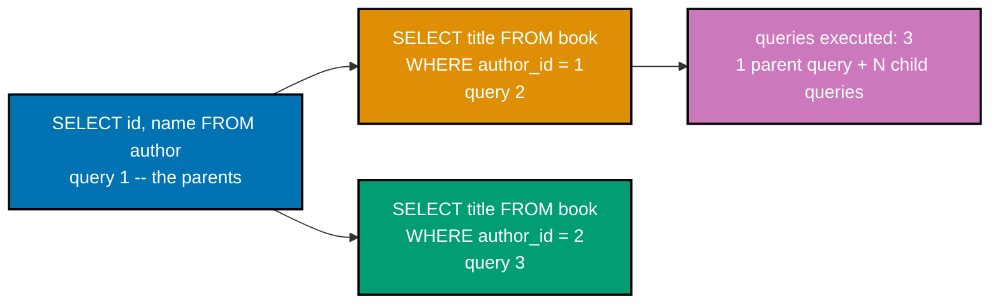
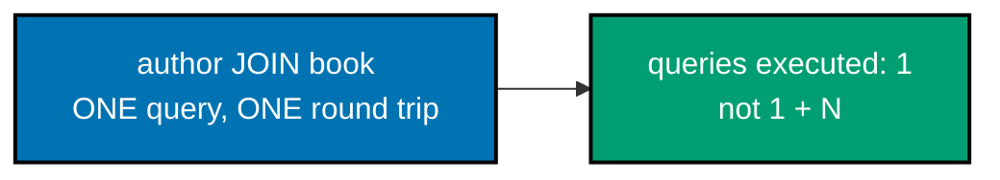
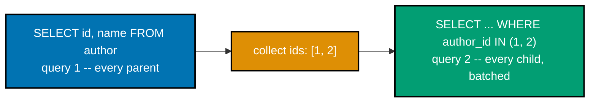
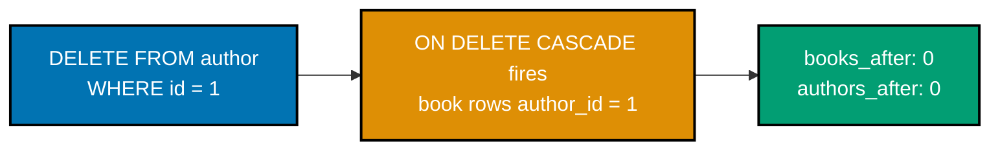
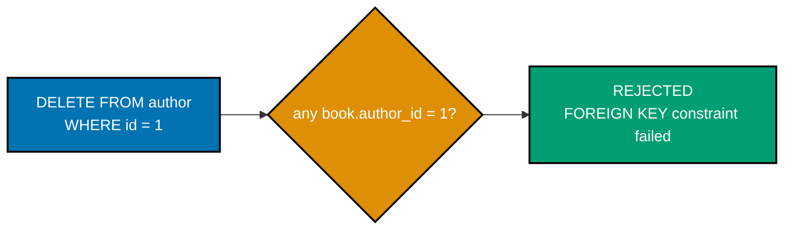
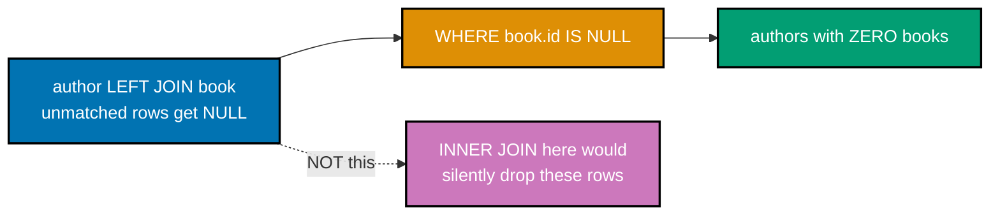
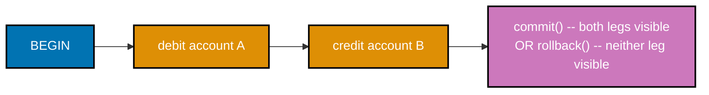
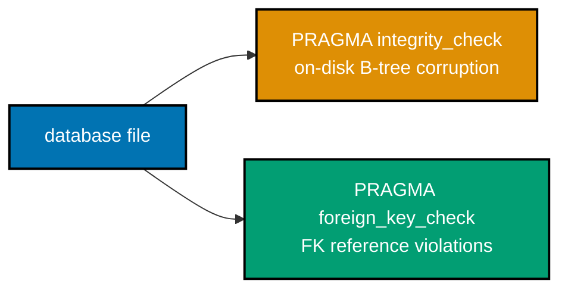
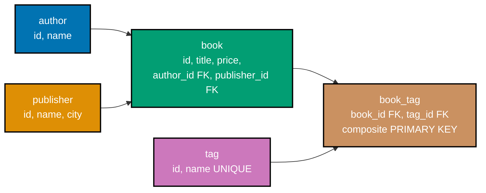

Examples 59-80 cover safe additive schema migrations with `PRAGMA user_version` version tracking,
diagnosing and fixing the N+1 query problem three different ways, composite primary keys, `ON DELETE
CASCADE`/`RESTRICT`, `SAVEPOINT`/`ROLLBACK TO` partial-transaction undo, a typed Python data-access-layer
module tested with `pytest`, seeding a database from a separate `.sql` file, CSV export via the CLI,
integrity-check pragmas, designing a full 3NF schema from scratch, correlated subqueries, and a combined
join-group-having report. Every example is fully self-contained: each one creates its own table(s) and
inserts its own rows, so none of them depend on state left behind by an earlier example. Run each `.sql`
example with `sqlite3 app.db < example.sql` from inside a fresh, empty directory; run each single-file
`.py` example with `python3 example.py`; run each `pytest`-marked example with `pytest -q` from inside
its own example directory. Every Python file starts with `# pyright: strict` and was verified with
`pyright` -- a single file with `pyright example.py`, or the whole example directory with `pyright .`
for the two examples whose `tests/` package imports a sibling module.

---

### Example 59: Migration Add Column

_ex-59 &middot; exercises co-22_

Adding a column with a `DEFAULT` clause is SQLite's safest schema change: it rewrites only the schema
catalog, never touches existing row data, and every pre-existing row reads back the declared default
instead of `NULL` or a table rebuild.

**`learning/code/ex-59-migration-add-column/example.sql`**

```sql
-- Example 59: Migration Add Column.
-- An additive migration -- adding a nullable-or-defaulted column -- never breaks existing rows.
CREATE TABLE author(id INTEGER PRIMARY KEY, name TEXT NOT NULL);
                                    -- => a minimal parent table -- just enough for a book to reference
CREATE TABLE book(
    id INTEGER PRIMARY KEY,        -- => aliases rowid (co-02) -- auto-assigned on insert
    title TEXT NOT NULL,           -- => every book needs a title -- NOT NULL enforced
    author_id INTEGER NOT NULL REFERENCES author(id),
                                    -- => the FK link -- declared, though not yet enforced (co-03)
    price REAL NOT NULL            -- => the schema BEFORE this example's migration runs
);

INSERT INTO author(id, name) VALUES (1, 'Ada Lovelace');
                                    -- => 1 author row -- author_id = 1 will be referenced below
INSERT INTO book(id, title, author_id, price) VALUES
    (1, 'Notes on the Analytical Engine', 1, 12.5),
    (2, 'Sketch of the Analytical Engine', 1, 9.0);
                                    -- => book now holds 2 rows, written BEFORE the migration below

.headers on
.mode column
-- The pre-migration shape -- no "edition" column exists yet.
SELECT id, title, price FROM book; -- => 2 rows, 3 columns -- the schema before any change

-- ADD COLUMN ... DEFAULT is SQLite's safe, additive migration: no table rewrite,
-- no downtime, and every EXISTING row reads back with the declared default (co-22).
ALTER TABLE book ADD COLUMN edition INTEGER DEFAULT 1;
                                    -- => rewrites ONLY the schema catalog -- row data is untouched

-- Same 2 rows, now with a 4th column -- both pre-existing rows got the default, not NULL.
SELECT id, title, price, edition FROM book;
                                    -- => edition is 1 for BOTH rows -- neither was NULL or dropped
```

**Run**: `sqlite3 app.db < example.sql`

**Output**:

```text
id  title                            price
--  -------------------------------  -----
1   Notes on the Analytical Engine   12.5
2   Sketch of the Analytical Engine  9.0
id  title                            price  edition
--  -------------------------------  -----  -------
1   Notes on the Analytical Engine   12.5   1
2   Sketch of the Analytical Engine  9.0    1
```

**Key takeaway**: `ALTER TABLE ... ADD COLUMN ... DEFAULT` is additive, not destructive -- both
pre-existing rows come back with `edition = 1`, never `NULL` and never dropped.

**Why it matters**: production schemas evolve constantly, and a migration that locks the table or
requires a maintenance window is a real operational cost. SQLite's `ADD COLUMN` avoids both: it edits
only the stored schema text, so existing rows are reinterpreted on the next read rather than physically
rewritten. This is the shape every later migration in this tier builds on -- Example 60 backfills a
computed value, and Example 61 wraps this exact statement in an idempotent, version-tracked runner.

---

### Example 60: Migration Backfill

_ex-60 &middot; exercises co-22, co-11_

Adding a column is only half a migration when the new column needs a **computed** value, not a static
default -- this example adds a nullable column, then backfills it with an `UPDATE` that has no `WHERE`
clause on purpose.

**`learning/code/ex-60-migration-backfill/example.sql`**

```sql
-- Example 60: Migration Backfill.
-- Adding a column is only half a migration -- existing rows often need a COMPUTED value,
-- not just a static DEFAULT (co-11).
CREATE TABLE author(id INTEGER PRIMARY KEY, name TEXT NOT NULL);
                                    -- => minimal parent table -- just enough to reference below
CREATE TABLE book(
    id INTEGER PRIMARY KEY,        -- => aliases rowid (co-02)
    title TEXT NOT NULL,           -- => NOT NULL -- every book needs a title
    author_id INTEGER NOT NULL REFERENCES author(id),
                                    -- => the FK link -- one row per book, per author
    price REAL NOT NULL,           -- => unit price, before the quantity multiplication below
    quantity INTEGER NOT NULL      -- => how many copies -- the OTHER input to total_value
);

INSERT INTO author(id, name) VALUES (1, 'Ada Lovelace');
                                    -- => 1 author row -- author_id = 1 is referenced below
INSERT INTO book(id, title, author_id, price, quantity) VALUES
    (1, 'Notes on the Analytical Engine', 1, 12.5, 4),
    (2, 'Sketch of the Analytical Engine', 1, 9.0, 10);
                                    -- => 2 rows -- price and quantity now set for BOTH

-- .headers on shows column names above every result set below; .mode column aligns them --
-- both are a display preference only, with no effect on the migration itself.
.headers on
.mode column
-- A nullable ADD COLUMN (no DEFAULT) -- every existing row reads back NULL until backfilled.
ALTER TABLE book ADD COLUMN total_value REAL;
                                    -- => no DEFAULT clause -- deliberately NULL, awaiting the backfill

SELECT id, title, total_value FROM book;
                                    -- => both rows show total_value = <blank> (NULL) -- not yet computed

-- Backfill: compute the derived value for every row that just gained the new column.
UPDATE book SET total_value = price * quantity;
                                    -- => no WHERE clause -- every row needs backfilling this time (co-11)

SELECT id, title, price, quantity, total_value FROM book;
                                    -- => row 1: 12.5 * 4 = 50.0 -- row 2: 9.0 * 10 = 90.0
```

**Run**: `sqlite3 app.db < example.sql`

**Output**:

```text
id  title                            total_value
--  -------------------------------  -----------
1   Notes on the Analytical Engine
2   Sketch of the Analytical Engine
id  title                            price  quantity  total_value
--  -------------------------------  -----  --------  -----------
1   Notes on the Analytical Engine   12.5   4         50.0
2   Sketch of the Analytical Engine  9.0    10        90.0
```

**Key takeaway**: the un-backfilled column prints blank (`NULL`) for both rows immediately after `ADD
COLUMN`; a follow-up `UPDATE` with no `WHERE` clause fills every row in one statement.

**Why it matters**: a nullable `ADD COLUMN` and its backfill are two separate, sequential
statements on purpose -- SQLite cannot compute `price * quantity` at column-creation time, so it must
add the column first and populate it second. Splitting migration structure from migration data this
way is also what lets a team review the schema change and the backfill logic as two independently
reviewable diffs, rather than one opaque statement.

---

### Example 61: Migration Version Tracking

_ex-61 &middot; exercises co-22, co-24_

`PRAGMA user_version` stores a plain integer inside the database file's own header, with no extra
tracking table required -- a thin shell wrapper reads it before deciding whether to apply a migration,
making the whole runner safe to invoke any number of times.

**`learning/code/ex-61-migration-version-tracking/schema.sql`**

```sql
-- Example 61: Migration Version Tracking -- initial schema (version 0, the SQLite default).
CREATE TABLE book (
  id INTEGER PRIMARY KEY,
  title TEXT NOT NULL,
  price REAL NOT NULL
);

-- => a fresh database file -- PRAGMA user_version starts at 0
INSERT INTO
  book (id, title, price)
VALUES
  (1, 'Notes on the Analytical Engine', 12.5),
  (2, 'Sketch of the Analytical Engine', 9.0);

-- => 2 pre-existing rows -- the migration below must not break them
```

**`learning/code/ex-61-migration-version-tracking/migration.sql`**

```sql
-- Example 61: the migration body itself -- only ever meant to run ONCE, guarded by migrate.sh.
ALTER TABLE book
ADD COLUMN edition INTEGER DEFAULT 1;

-- => the additive change, identical in shape to Example 59
-- PRAGMA user_version stores a plain integer INSIDE the database file's header (co-24) --
-- no extra "schema_migrations" table needed to remember which migration already ran.
PRAGMA user_version = 1;
```

**`learning/code/ex-61-migration-version-tracking/migrate.sh`**

```bash
#!/usr/bin/env bash
# Example 61: a minimal migration RUNNER -- reads PRAGMA user_version first (co-24),
# and only applies migration.sql if the database hasn't already been migrated.
set -euo pipefail                  # => fail fast on any error, unset variable, or pipe failure

DB="app.db"                        # => the single database file this runner targets
CURRENT=$(sqlite3 "$DB" "PRAGMA user_version;")
                                    # => reads the CURRENT version straight out of the file header

if [ "$CURRENT" -lt 1 ]; then      # => version 0 (or lower) means migration.sql has NOT run yet
    sqlite3 "$DB" < migration.sql  # => applies the ALTER TABLE + bumps PRAGMA user_version to 1
    NEW=$(sqlite3 "$DB" "PRAGMA user_version;")
                                    # => re-reads the version -- confirms the bump actually landed
    echo "migrated to version $NEW"
                                    # => the FIRST-run message -- printed exactly once, ever
else
    # => version is ALREADY >= 1 -- re-running would fail with "duplicate column name"
    echo "already at version $CURRENT, skipping"
                                    # => the IDEMPOTENT path -- safe to call this script repeatedly
fi
```

**Run**: `sqlite3 app.db < schema.sql`, then `chmod +x migrate.sh && ./migrate.sh` twice in a row.

**Output**:

```text
--- first run ---
migrated to version 1
--- second run ---
already at version 1, skipping
--- final state ---
id  title                            price  edition
--  -------------------------------  -----  -------
1   Notes on the Analytical Engine   12.5   1
2   Sketch of the Analytical Engine  9.0    1
```

**Key takeaway**: the first `migrate.sh` run bumps `PRAGMA user_version` from 0 to 1 and applies the
migration; the second run reads that same version, sees it is no longer 0, and skips -- no
`schema_migrations` table was ever needed.

**Why it matters**: a migration script that is not idempotent is a landmine -- rerunning it after a
deploy hiccup (or a CI retry) either fails outright (`duplicate column name`) or silently corrupts data.
`PRAGMA user_version` gives every SQLite database a free, built-in place to record "which migration
already ran," so a thin wrapper script -- not a bespoke tracking table -- is enough to make the whole
migration pipeline safe to invoke more than once.

---

### Example 62: N+1 Query Problem Demonstrated

_ex-62 &middot; exercises co-23_

A Python loop that issues one `SELECT` per parent row -- once for the list of authors, then once more
per author to fetch their books -- costs `1 + N` round trips to the database engine; this example counts
every query as it fires to make that cost visible.



**`learning/code/ex-62-n-plus-1-demonstrated/example.py`**

```python
# pyright: strict
"""Example 62: N+1 Query Problem Demonstrated."""

import sqlite3  # => stdlib DB-API module (co-19) -- no third-party driver needed


def setup(conn: sqlite3.Connection) -> None:
    # A fresh in-memory schema + seed data -- this example needs NO leftover state (self-contained).
    conn.executescript(
        """
        -- a minimal parent table -- just enough to demonstrate the per-parent loop below
        CREATE TABLE author(id INTEGER PRIMARY KEY, name TEXT NOT NULL);  -- 1 parent table
        -- author_id is NOT a foreign key here -- the point is the QUERY PATTERN, not the schema
        CREATE TABLE book(id INTEGER PRIMARY KEY, title TEXT NOT NULL, author_id INTEGER NOT NULL);
        -- 2 authors -- Ada will end up with 2 books below, Grace with 1
        INSERT INTO author(id, name) VALUES (1, 'Ada Lovelace'), (2, 'Grace Hopper');  -- 2 rows
        -- 3 books total, split 2-and-1 across the 2 authors above
        INSERT INTO book(id, title, author_id) VALUES  -- a 3-row multi-VALUES insert
            (1, 'Notes on the Analytical Engine', 1),  -- Ada's first book
            (2, 'Sketch of the Analytical Engine', 1),  -- Ada's second book
            (3, 'The First Computer Bug', 2);  -- Grace's only book
        """
    )  # => author has 2 rows, book has 3 rows -- 2 belong to author 1, 1 belongs to author 2
    conn.commit()  # => persists the schema + seed data before any reporting query runs


def main() -> None:  # => the entry point -- runs setup(), then the N+1 loop, then a summary
    conn: sqlite3.Connection = sqlite3.connect(":memory:")  # => a throwaway, process-local DB
    setup(conn)  # => builds the 2-author, 3-book fixture this whole example reads from

    query_count: int = 0  # => a manual counter -- makes the "N+1" round trips VISIBLE
    authors: list[tuple[int, str]] = conn.execute(  # => query #1, below -- the parent fetch
        "SELECT id, name FROM author"  # => no WHERE -- every author row, unconditionally
    ).fetchall()  # => drains the cursor into a plain Python list right away
    # => fetchall() drains the cursor into a plain list -- 2 rows, one PER author
    query_count += 1  # => query #1 -- fetches every parent (author) row, once

    results: list[tuple[str, list[str]]] = []  # => accumulates (author_name, titles) pairs
    for author_id, author_name in authors:  # => THIS loop is the anti-pattern -- N iterations
        # A SEPARATE round trip to the engine, PER author -- the "N" in "N+1" (co-23).
        titles_cur: sqlite3.Cursor = conn.execute(  # => opens a FRESH cursor every iteration
            "SELECT title FROM book WHERE author_id = ?",  # => filters to ONE author per call
            (author_id,),  # => the single bound parameter for THIS iteration
        )  # => runs a fresh query EVERY time the loop body executes
        titles: list[str] = [row[0] for row in titles_cur.fetchall()]  # => unwraps 1-tuples
        query_count += 1  # => tallies each per-author query as it fires
        results.append((author_name, titles))  # => appends this author's (name, titles) pair

    for name, titles in results:  # => a SEPARATE loop -- just prints what was already fetched
        print(name, titles)  # => Output: one line per author, its titles as a Python list
    print(f"queries executed: {query_count}")  # => 1 + 2 = 3 total -- co-23's cost, made visible
    conn.close()  # => releases the in-memory connection -- nothing to clean up on disk


if __name__ == "__main__":  # => guards main() so importing this module never runs it
    main()  # => runs the whole demonstration end to end
```

**Run**: `python3 example.py`

**Output**:

```text
Ada Lovelace ['Notes on the Analytical Engine', 'Sketch of the Analytical Engine']
Grace Hopper ['The First Computer Bug']
queries executed: 3
```

**pyright**: `pyright example.py` reports `0 errors, 0 warnings, 0 informations` under `# pyright:
strict`.

**Key takeaway**: 2 authors turned into 3 total queries -- 1 to fetch every author, plus 1 more per
author inside the loop -- and that cost grows linearly with the number of parent rows, not the number
of books.

**Why it matters**: the N+1 pattern is one of the most common real-world performance bugs in
database-backed applications, and it is easy to write by accident: the loop body looks correct in
isolation, and it even returns the right data. The bug only shows up as latency once the parent table
has hundreds or thousands of rows, each triggering its own round trip. Examples 63 and 64 fix the exact
same output two different ways, without ever looping a query per parent.

---

### Example 63: N+1 Fixed with a Single Join

_ex-63 &middot; exercises co-23, co-13_

Replacing the per-author loop with one `JOIN` query collapses `1 + N` round trips into exactly 1 --
SQL does the recombination work that Example 62's Python loop did manually, one iteration at a time.



**`learning/code/ex-63-n-plus-1-fixed-join/example.py`**

```python
# pyright: strict
"""Example 63: N+1 Fixed with a Single JOIN."""

import sqlite3  # => stdlib DB-API module (co-19)


def setup(conn: sqlite3.Connection) -> None:  # => builds the SAME fixture as Example 62
    # Identical schema and seed data to Example 62 -- same problem, different query shape.
    conn.executescript(
        """
        -- same fixture shape as Example 62 -- comparing the FIX, not the data
        CREATE TABLE author(id INTEGER PRIMARY KEY, name TEXT NOT NULL);  -- 1 parent table
        CREATE TABLE book(id INTEGER PRIMARY KEY, title TEXT NOT NULL, author_id INTEGER NOT NULL);
        -- author_id is a plain integer column here too -- the fix is the QUERY, not the schema
        -- 2 authors, exactly as in Example 62
        INSERT INTO author(id, name) VALUES (1, 'Ada Lovelace'), (2, 'Grace Hopper');  -- 2 rows
        -- 3 books, split 2-and-1, exactly as in Example 62
        INSERT INTO book(id, title, author_id) VALUES  -- a 3-row multi-VALUES insert
            (1, 'Notes on the Analytical Engine', 1),  -- Ada's first book
            (2, 'Sketch of the Analytical Engine', 1),  -- Ada's second book
            (3, 'The First Computer Bug', 2);  -- Grace's only book
        """
    )  # => same fixture as Example 62 -- 2 authors, 3 books, split 2-and-1
    conn.commit()  # => persists the fixture before the single report query runs


def main() -> None:  # => the entry point -- setup(), one JOIN query, then a print summary
    conn: sqlite3.Connection = sqlite3.connect(":memory:")  # => a throwaway, process-local DB
    setup(conn)  # => builds the identical fixture Example 62 used

    query_count: int = 0  # => tracks round trips -- watch this stay at 1, unlike Example 62's 3
    # ONE query -- author JOIN book (co-13) -- replaces the whole per-author loop from Example 62.
    # No Python for loop issues per-author SELECTs anymore -- the JOIN does that work in SQL.
    rows: list[tuple[str, str]] = conn.execute(  # => a single multi-line SQL string, one call
        """
        -- ONE query does what Example 62 needed 3 separate round trips to do
        SELECT author.name, book.title
        FROM author
        JOIN book ON book.author_id = author.id
        ORDER BY author.name, book.title
        """
    ).fetchall()  # => 3 rows total, one PER BOOK, author name repeated where an author has 2 books
    query_count += 1  # => the round trip count no longer scales with the number of authors

    # Groups the flat rows back into "author -> list of titles" in PLAIN PYTHON, not another query.
    grouped: dict[str, list[str]] = {}  # => empty until the loop below fills it in
    for author_name, title in rows:  # => iterates the 3 FLAT rows returned by the join
        grouped.setdefault(author_name, []).append(title)  # => builds the grouping in Python
        # => setdefault(author_name, []) creates the list on first sight, appends every time after

    for name, titles in grouped.items():  # => iterates the GROUPED dict, not the raw rows
        print(name, titles)  # => Output: identical two lines to Example 62, from ONE query
    print(f"queries executed: {query_count}")  # => 1 -- versus Example 62's 3
    conn.close()  # => releases the in-memory connection -- nothing to clean up on disk


if __name__ == "__main__":  # => guards main() so importing this module never runs it
    main()  # => runs the whole demonstration end to end
```

**Run**: `python3 example.py`

**Output**:

```text
Ada Lovelace ['Notes on the Analytical Engine', 'Sketch of the Analytical Engine']
Grace Hopper ['The First Computer Bug']
queries executed: 1
```

**pyright**: `pyright example.py` reports `0 errors, 0 warnings, 0 informations` under `# pyright:
strict`.

**Key takeaway**: the printed data is byte-for-byte identical to Example 62's, but `queries executed`
drops from 3 to 1 -- the JOIN moved the recombination work from a Python loop into the query engine.

**Why it matters**: `JOIN` exists precisely to answer "give me parent rows together with their related
child rows" in a single round trip -- it is the database doing, in one pass over indexed or
sequentially-scanned data, what a client-side loop would otherwise do one network hop at a time. The
tradeoff is that the flat, one-row-per-book result needs a small amount of Python-side regrouping
(`setdefault`), which is far cheaper than N extra queries ever were.

---

### Example 64: N+1 Fixed with a Batched Fetch

_ex-64 &middot; exercises co-23, co-20_

A second way to fix the identical N+1 problem: fetch every parent row first, collect their ids, then
issue exactly one more query with `WHERE author_id IN (?, ?, ...)` to grab every child row in a single
batched round trip -- 2 total queries, independent of how many authors there are.



**`learning/code/ex-64-n-plus-1-fixed-in/example.py`**

```python
# pyright: strict
"""Example 64: N+1 Fixed with a Batched IN(...) Fetch."""

import sqlite3  # => stdlib DB-API module (co-19)


def setup(conn: sqlite3.Connection) -> None:
    # Same schema and seed data as Examples 62-63 -- a third way to fix the identical problem.
    conn.executescript(
        """
        -- same fixture shape as Examples 62-63 -- comparing a THIRD fix to the identical problem
        CREATE TABLE author(id INTEGER PRIMARY KEY, name TEXT NOT NULL);  -- 1 parent table
        CREATE TABLE book(id INTEGER PRIMARY KEY, title TEXT NOT NULL, author_id INTEGER NOT NULL);
        -- author_id is a plain integer column here too -- the fix is a SECOND batched query
        -- 2 authors, exactly as in Examples 62-63
        INSERT INTO author(id, name) VALUES (1, 'Ada Lovelace'), (2, 'Grace Hopper');  -- 2 rows
        -- 3 books, split 2-and-1, exactly as in Examples 62-63
        INSERT INTO book(id, title, author_id) VALUES  -- a 3-row multi-VALUES insert
            (1, 'Notes on the Analytical Engine', 1),  -- Ada's first book
            (2, 'Sketch of the Analytical Engine', 1),  -- Ada's second book
            (3, 'The First Computer Bug', 2);  -- Grace's only book
        """
    )  # => same fixture as Examples 62-63 -- 2 authors, 3 books, split 2-and-1
    conn.commit()  # => persists the fixture before the two batched queries run


def main() -> None:  # => entry point -- setup(), a parent fetch, a batched IN(...) fetch, print
    conn: sqlite3.Connection = sqlite3.connect(":memory:")  # => a throwaway, process-local DB
    setup(conn)  # => builds the identical fixture Examples 62-63 used

    query_count: int = 0  # => tracks round trips -- watch this settle at 2, not 1 or 3
    authors: list[tuple[int, str]] = conn.execute(  # => query #1 -- the parent fetch
        "SELECT id, name FROM author"  # => no WHERE -- every author row, unconditionally
    ).fetchall()  # => drains the cursor -- 2 author rows, exactly like Example 62's first query
    query_count += 1  # => query #1 -- the parent rows, exactly like Example 62's first query

    author_ids: list[int] = [author_id for author_id, _ in authors]  # => just the ids, in order
    # => extracts JUST the ids from the (id, name) pairs -- discards name via the _ placeholder
    # Builds "?, ?, ..." -- ONE placeholder per id -- the values themselves stay fully parameterized.
    placeholders: str = ",".join("?" for _ in author_ids)  # => "?,?" for 2 authors
    books: list[tuple[int, str]] = conn.execute(  # => query #2 -- the ONLY child fetch, batched
        f"SELECT author_id, title FROM book WHERE author_id IN ({placeholders})",
        # => the f-string only splices in "?,?" placeholder MARKS -- never a real data value
        author_ids,  # => co-20 -- every id is still bound as a real parameter, never interpolated
    ).fetchall()  # => query #2 -- ALL children for EVERY parent, in a single batched round trip
    query_count += 1  # => the second and FINAL query -- independent of how many authors there are

    grouped: dict[int, list[str]] = {}  # => empty until the loop below fills it in
    for author_id, title in books:  # => groups the flat rows by author_id, in plain Python
        grouped.setdefault(author_id, []).append(title)  # => builds the grouping in Python
        # => same setdefault-and-append pattern Example 63 used, applied to a different key

    for author_id, author_name in authors:  # => iterates in the ORIGINAL author order
        print(author_name, grouped.get(author_id, []))  # => .get(..., []) -- safe for zero books
        # => Output: identical two lines to Examples 62-63 -- same data, now via 2 total queries
    print(f"queries executed: {query_count}")  # => 2 -- one parent query PLUS one batched fetch
    conn.close()  # => releases the in-memory connection


if __name__ == "__main__":  # => guards main() so importing this module never runs it
    main()  # => runs the whole demonstration end to end
```

**Run**: `python3 example.py`

**Output**:

```text
Ada Lovelace ['Notes on the Analytical Engine', 'Sketch of the Analytical Engine']
Grace Hopper ['The First Computer Bug']
queries executed: 2
```

**pyright**: `pyright example.py` reports `0 errors, 0 warnings, 0 informations` under `# pyright:
strict`.

**Key takeaway**: `WHERE author_id IN (?, ?, ...)` fetches every child row for every parent in one
call, using exactly as many `?` placeholders as there are parent ids -- the ids are still fully
parameterized, only the placeholder marks themselves are built dynamically.

**Why it matters**: the batched-`IN` fix is useful when a single JOIN either does not fit the access
pattern (for example, fetching children from a different data source entirely) or would return an
awkwardly large, heavily-duplicated flat result. Building the `?, ?, ...` placeholder string
dynamically -- while still binding every value through the parameter list, never through string
interpolation -- keeps the query injection-safe (co-20) even though its shape depends on how many
parents were fetched.

---

### Example 65: Composite Primary Key

_ex-65 &middot; exercises co-02, co-05_

A many-to-many junction table's identity is the **pair** of foreign keys it links, not a separate
surrogate id column -- `PRIMARY KEY (book_id, tag_id)` makes that pair unique, and a duplicate pair is
rejected by the engine itself.


**`learning/code/ex-65-composite-primary-key/example.sql`**

```sql
-- Example 65: Composite Primary Key.
-- A junction table's identity is the PAIR of foreign keys, not a surrogate id column (co-02, co-05).
CREATE TABLE book(id INTEGER PRIMARY KEY, title TEXT NOT NULL);
                                    -- => minimal parent -- just enough for book_tag to reference
CREATE TABLE tag(id INTEGER PRIMARY KEY, name TEXT NOT NULL);
                                    -- => the OTHER parent -- book_tag links book to tag, many-to-many
CREATE TABLE book_tag(
    book_id INTEGER NOT NULL REFERENCES book(id),
                                    -- => FK half of the composite key
    tag_id INTEGER NOT NULL REFERENCES tag(id),
                                    -- => the OTHER FK half of the composite key
    PRIMARY KEY (book_id, tag_id)  -- => the PAIR must be unique -- no separate id column needed
);

INSERT INTO book(id, title) VALUES (1, 'Notes on the Analytical Engine');
                                    -- => 1 book row -- book_id = 1 is referenced below
INSERT INTO tag(id, name) VALUES (1, 'history'), (2, 'computing');
                                    -- => 2 tag rows -- tag_id 1 and 2 are referenced below

-- .headers on and .mode column below are display preferences only -- no dot-command
-- takes a trailing comment on its own line, so these two notes live here instead.
.headers on
.mode column
INSERT INTO book_tag(book_id, tag_id) VALUES (1, 1), (1, 2);
                                    -- => two DIFFERENT pairs -- both accepted
SELECT * FROM book_tag;            -- => 2 rows -- book 1 tagged 'history' AND 'computing'

-- The SAME (book_id, tag_id) pair a second time -- this violates the composite PRIMARY KEY.
INSERT INTO book_tag(book_id, tag_id) VALUES (1, 1);
                                    -- => rejected -- (1, 1) already exists as a row
```

**Run**: `sqlite3 app.db < example.sql`

**Output** (the final `INSERT` deliberately fails; exit code `1` is expected):

```text
book_id  tag_id
-------  ------
1        1
1        2
Runtime error near line 29: UNIQUE constraint failed: book_tag.book_id, book_tag.tag_id (19)
```

**Key takeaway**: `PRIMARY KEY (book_id, tag_id)` treats the two-column combination as one composite
identity -- `(1, 1)` and `(1, 2)` are both accepted as distinct pairs, but a repeated `(1, 1)` is
rejected exactly like a duplicate single-column primary key would be.

**Why it matters**: a junction table almost never needs its own surrogate id -- the pair of foreign
keys it links already uniquely identifies each row, and giving that pair a `PRIMARY KEY` constraint
gets duplicate-prevention for free, enforced by the engine rather than application code. This same
composite-key pattern reappears in Example 77's `book_tag` table and the capstone's own junction table.

---

### Example 66: Cascade Delete

_ex-66 &middot; exercises co-03_

`ON DELETE CASCADE` propagates a parent row's deletion to every matching child row automatically --
but only once `PRAGMA foreign_keys = ON` has actually turned on enforcement for the connection.



**`learning/code/ex-66-cascade-delete/example.sql`**

```sql
-- Example 66: Cascade Delete.
-- SQLite disables foreign-key ENFORCEMENT by default -- ON DELETE actions need it turned on (co-03).
PRAGMA foreign_keys = ON;          -- => a per-connection setting -- must be re-issued every connect

CREATE TABLE author(id INTEGER PRIMARY KEY, name TEXT NOT NULL);
                                    -- => the PARENT side of the relationship below
CREATE TABLE book(
    id INTEGER PRIMARY KEY,        -- => aliases rowid (co-02)
    title TEXT NOT NULL,           -- => every book needs a title
    author_id INTEGER REFERENCES author(id) ON DELETE CASCADE
                                    -- => CASCADE propagates a parent delete to every matching child
);

INSERT INTO author(id, name) VALUES (1, 'Ada Lovelace');
                                    -- => 1 author row -- the parent this example deletes below
INSERT INTO book(id, title, author_id) VALUES
    (1, 'Notes on the Analytical Engine', 1),
    (2, 'Sketch of the Analytical Engine', 1);
                                    -- => 2 child rows, both pointing at author 1

-- .headers on shows column names above every count(*) result below; .mode column aligns
-- them for readability -- purely display, unrelated to the CASCADE behavior below.
.headers on
.mode column
SELECT count(*) AS books_before FROM book WHERE author_id = 1;
                                    -- => 2 -- both books still reference author 1

DELETE FROM author WHERE id = 1;   -- => deletes the PARENT row -- CASCADE fires automatically
                                    -- => a SINGLE statement triggers both the parent AND child deletes

SELECT count(*) AS books_after FROM book WHERE author_id = 1;
                                    -- => 0 -- both child rows were removed too, not just orphaned
SELECT count(*) AS authors_after FROM author;
                                    -- => 0 -- the author row itself is gone
                                    -- => contrast Example 67: RESTRICT would have BLOCKED this delete
```

**Run**: `sqlite3 app.db < example.sql`

**Output**:

```text
books_before
------------
2
books_after
-----------
0
authors_after
-------------
0
```

**Key takeaway**: one `DELETE FROM author` statement removed both the author row and its two book rows
-- `books_after` and `authors_after` both land at `0`, with no separate `DELETE FROM book` statement
ever issued.

**Why it matters**: `ON DELETE CASCADE` is the right choice when child rows have no meaning without
their parent -- a book without an author is a data-integrity problem, not a valid state, so letting the
deletion propagate automatically is safer than leaving orphaned rows behind. The tradeoff is that a
single `DELETE` can now silently remove far more data than the statement itself suggests, which is
exactly why Example 67 shows the opposite policy for cases where that silent propagation is dangerous.

---

### Example 67: Restrict Delete

_ex-67 &middot; exercises co-03_

`ON DELETE RESTRICT` is the opposite policy from Example 66's `CASCADE`: the engine refuses to delete
a parent row while any child row still references it, forcing the caller to deal with the dependency
explicitly.



**`learning/code/ex-67-restrict-delete/example.sql`**

```sql
-- Example 67: Restrict Delete.
PRAGMA foreign_keys = ON;          -- => enforcement must be on for RESTRICT to actually block anything

CREATE TABLE author(id INTEGER PRIMARY KEY, name TEXT NOT NULL);
                                    -- => the PARENT side -- the row this example tries to delete
CREATE TABLE book(
    id INTEGER PRIMARY KEY,        -- => aliases rowid (co-02)
    title TEXT NOT NULL,           -- => every book needs a title
    author_id INTEGER REFERENCES author(id) ON DELETE RESTRICT
                                    -- => RESTRICT is the opposite of CASCADE: blocks the parent delete
);

INSERT INTO author(id, name) VALUES (1, 'Ada Lovelace');
                                    -- => 1 author row -- still referenced by the book below
INSERT INTO book(id, title, author_id) VALUES (1, 'Notes on the Analytical Engine', 1);
                                    -- => the ONE child row that makes the delete below illegal

-- .headers on and .mode column below are display preferences, consistent with every other
-- example in this tier -- they have no bearing on the RESTRICT behavior demonstrated next.
.headers on
.mode column
-- Blocked: author 1 still has a referencing book row -- RESTRICT rejects this delete outright.
DELETE FROM author WHERE id = 1;   -- => fails -- the engine refuses to orphan the book row above
                                    -- => contrast Example 66: CASCADE ALLOWS this same shape of delete
```

**Run**: `sqlite3 app.db < example.sql`

**Output** (the `DELETE` deliberately fails; exit code `1` is expected):

```text
Runtime error near line 23: FOREIGN KEY constraint failed (19)
```

**Key takeaway**: the exact same `DELETE FROM author WHERE id = 1` statement that succeeded in Example
66 fails here with `FOREIGN KEY constraint failed` -- the only difference is `ON DELETE CASCADE` versus
`ON DELETE RESTRICT` in the child table's own column definition.

**Why it matters**: `RESTRICT` is the right choice when a silent, cascading deletion would be a bug
rather than a feature -- deleting a customer account should not silently vaporize their entire order
history, for example. Forcing the delete to fail makes the dependency visible at the moment it matters,
so the caller can decide explicitly (reassign the books, archive them, or refuse the delete) rather than
discovering the missing data days later.

---

### Example 68: Savepoint Partial Rollback

_ex-68 &middot; exercises co-18_

`SAVEPOINT` marks a point inside an already-open transaction; `ROLLBACK TO` that savepoint undoes only
the work done since it was set, while the outer transaction itself stays open and can keep going.


**`learning/code/ex-68-savepoint-partial-rollback/example.sql`**

```sql
-- Example 68: Savepoint Partial Rollback.
CREATE TABLE book(id INTEGER PRIMARY KEY, title TEXT NOT NULL, price REAL NOT NULL);
                                    -- => a single table -- enough to demonstrate the savepoint dance

-- .headers on shows column names above the final SELECT below; .mode column aligns the
-- display -- both are readability preferences, set before the transaction even opens.
.headers on
.mode column
BEGIN;                              -- => opens the OUTER transaction (co-18)
INSERT INTO book(id, title, price) VALUES (1, 'Notes on the Analytical Engine', 12.5);
                                    -- => row 1 -- committed at the END, along with row 3 below

SAVEPOINT sp;                       -- => marks a point INSIDE the still-open transaction
INSERT INTO book(id, title, price) VALUES (2, 'Bad Draft', -5.0);
                                    -- => a mistake we want to undo WITHOUT losing row 1 too
ROLLBACK TO sp;                     -- => undoes ONLY work since sp -- the outer transaction stays open

INSERT INTO book(id, title, price) VALUES (3, 'Sketch of the Analytical Engine', 9.0);
                                    -- => row 3 -- inserted AFTER the rollback, in the same transaction
COMMIT;                             -- => finalizes rows 1 and 3 -- row 2 never existed past the savepoint

SELECT id, title, price FROM book;  -- => 2 rows: ids 1 and 3 -- the bad draft (id 2) is nowhere
```

**Run**: `sqlite3 app.db < example.sql`

**Output**:

```text
id  title                            price
--  -------------------------------  -----
1   Notes on the Analytical Engine   12.5
3   Sketch of the Analytical Engine  9.0
```

**Key takeaway**: `ROLLBACK TO sp` erased only the "Bad Draft" insert -- the row inserted before the
savepoint and the row inserted after `ROLLBACK TO` both survive the final `COMMIT`.

**Why it matters**: a plain `ROLLBACK` throws away an entire transaction's work; a savepoint gives that
same undo power over just a portion of it, which matters when a transaction legitimately needs to try
something, discover it was wrong, and keep going without restarting from scratch. This is the same
mechanism batch-import and multi-step workflow code relies on to skip one bad record without abandoning
every record already processed in the same transaction.

---

### Example 69: Python Report Function

_ex-69 &middot; exercises co-15, co-21_

Splitting fetch-and-shape logic into a typed function -- `report(conn) -> list[tuple[str, int]]` --
makes the reporting query independently callable and its return shape visible in the signature itself,
not just in a comment.

**`learning/code/ex-69-python-report-function/example.py`**

```python
# pyright: strict
"""Example 69: Typed report() Function Running a GROUP BY."""
# Splitting fetch-and-shape logic into a typed function is what makes it independently testable.

import sqlite3  # => stdlib DB-API module (co-19) -- the only import this whole file needs


def setup(conn: sqlite3.Connection) -> None:  # => builds the fixture report() reads from
    conn.executescript(
        """
        -- a minimal author/book fixture -- just enough for one GROUP BY report
        CREATE TABLE author(id INTEGER PRIMARY KEY, name TEXT NOT NULL);  -- 1 parent table
        CREATE TABLE book(id INTEGER PRIMARY KEY, title TEXT NOT NULL, author_id INTEGER NOT NULL);
        -- author_id is a plain integer column -- report() below GROUPs by the author's NAME
        -- 2 authors -- Ada ends up with 2 books, Grace with 1
        INSERT INTO author(id, name) VALUES (1, 'Ada Lovelace'), (2, 'Grace Hopper');  -- 2 rows
        -- 3 books, split 2-and-1 -- the exact counts main()'s hand-computed assert checks
        INSERT INTO book(id, title, author_id) VALUES  -- a 3-row multi-VALUES insert
            (1, 'Notes on the Analytical Engine', 1),  -- Ada's first book
            (2, 'Sketch of the Analytical Engine', 1),  -- Ada's second book
            (3, 'The First Computer Bug', 2);  -- Grace's only book
        """
    )  # => 2 authors, 3 books -- Ada has 2, Grace has 1, the fixture report() summarizes
    conn.commit()  # => persists the fixture before report() ever runs against it


def report(conn: sqlite3.Connection) -> list[tuple[str, int]]:  # => the function under test
    # A fully typed function signature (co-21): the return shape is documented in the type,
    # not just in a comment -- any caller sees "name, count" pairs without reading the body.
    cur: sqlite3.Cursor = conn.execute(  # => a single multi-line SQL string, one call
        """
        -- one JOIN, one GROUP BY -- the report's ENTIRE logic lives in this one query
        SELECT author.name, count(*)
        FROM author
        JOIN book ON book.author_id = author.id
        GROUP BY author.name
        ORDER BY author.name
        """
    )  # => GROUP BY collapses per-book rows into per-author counts (co-15)
    rows: list[tuple[str, int]] = cur.fetchall()  # => drains the cursor into a typed list
    return rows  # => e.g. [('Ada Lovelace', 2), ('Grace Hopper', 1)]
    # Nothing about this function's SHAPE would change for a bigger fixture -- SQL scales, not Python


def main() -> None:  # => entry point -- builds the fixture, calls report(), checks the answer
    conn: sqlite3.Connection = sqlite3.connect(":memory:")  # => a throwaway, process-local DB
    setup(conn)  # => builds the 2-author, 3-book fixture report() reads from

    rows: list[tuple[str, int]] = report(conn)  # => calls the typed function under test
    # No caller here needs to know report()'s SQL -- the typed return value is the contract.
    for name, count in rows:  # => unpacks each (name, count) pair from the returned list
        print(name, count)  # => Output: one line per author, its book count

    # Hand-computed: Ada has 2 books (ids 1, 2), Grace has 1 book (id 3) -- matches the seed above.
    expected: list[tuple[str, int]] = [("Ada Lovelace", 2), ("Grace Hopper", 1)]  # => by hand
    assert rows == expected  # => proves report()'s SQL matches what a human counted by hand
    print("matches hand-computed expectation")  # => only reached if the assert above passed
    conn.close()  # => releases the in-memory connection -- nothing to clean up on disk


if __name__ == "__main__":  # => guards main() so importing this module never runs it
    main()  # => runs the whole demonstration end to end
```

**Run**: `python3 example.py`

**Output**:

```text
Ada Lovelace 2
Grace Hopper 1
matches hand-computed expectation
```

**pyright**: `pyright example.py` reports `0 errors, 0 warnings, 0 informations` under `# pyright:
strict`.

**Key takeaway**: `report()`'s return type, `list[tuple[str, int]]`, tells a reader exactly what shape
of data to expect without reading the SQL inside it -- and the hand-computed `assert` proves that shape
actually matches reality for this fixture.

**Why it matters**: a bare SQL string scattered through application code is hard to test in isolation;
a typed function wrapping it can be called directly from a test with a known fixture and a known
expected result, exactly as `main()` does here. Example 73 takes this one step further by moving
several such functions into their own module and testing them with `pytest` instead of a bare `assert`.

---

### Example 70: Group Concat

_ex-70 &middot; exercises co-15_

`group_concat(column, separator)` folds every row's value within a `GROUP BY` group into a single,
separator-joined string -- useful for a one-line summary without a second round trip per group.

**`learning/code/ex-70-group-concat/example.sql`**

```sql
-- Example 70: group_concat.
CREATE TABLE author(id INTEGER PRIMARY KEY, name TEXT NOT NULL);
                                    -- => the GROUPing key this example concatenates around
CREATE TABLE book(id INTEGER PRIMARY KEY, title TEXT NOT NULL, author_id INTEGER NOT NULL);
                                    -- => the column whose VALUES get folded into one string

INSERT INTO author(id, name) VALUES (1, 'Ada Lovelace');
                                    -- => 1 author -- author_id = 1 groups both books below
INSERT INTO book(id, title, author_id) VALUES
    (1, 'Notes on the Analytical Engine', 1),
    (2, 'Sketch of the Analytical Engine', 1);
                                    -- => 2 books, SAME author -- one group_concat row results

-- .headers on shows the "author_id | titles" header row below. .mode list switches away
-- from .mode column -- a long concatenated string would WRAP mid-word there (see Example
-- 65's .mode column note); .separator " | " picks a readable delimiter for list mode.
.headers on
.mode list
.separator " | "
-- list mode (pipe-separated, no column wrapping) keeps the long concatenated string on one line.
-- group_concat(X, sep) folds every GROUPed row's X value into ONE string, sep-joined (co-15).
SELECT author_id, group_concat(title, '; ') AS titles
FROM book
GROUP BY author_id;                -- => one row per author_id -- titles collapsed into one string
                                    -- => the '; ' second argument is the JOINER between titles
```

**Run**: `sqlite3 app.db < example.sql`

**Output**:

```text
author_id | titles
1 | Notes on the Analytical Engine; Sketch of the Analytical Engine
```

**Key takeaway**: `group_concat(title, '; ')` produced one row per `author_id`, with both of that
author's book titles folded into a single `;`-joined string -- no client-side loop needed to build
that summary.

**Why it matters**: `group_concat` is the SQL-native answer to "give me a comma-separated (or any
separator) summary per group" -- a common reporting need that would otherwise require fetching every
raw row and joining strings in application code. Because the switch away from `.mode column` here is
purely a display choice, it is also a reminder that the CLI's output formatting and the underlying
query result are two separate concerns.

---

### Example 71: Anti-Join Missing Rows

_ex-71 &middot; exercises co-14, co-17_

`LEFT JOIN ... WHERE right.id IS NULL` is the standard "find rows on the left with **no** match on the
right" pattern -- an `INNER JOIN` would silently drop exactly the rows this query exists to find.



**`learning/code/ex-71-anti-join-missing/example.sql`**

```sql
-- Example 71: Anti-Join -- Missing Rows.
CREATE TABLE author(id INTEGER PRIMARY KEY, name TEXT NOT NULL);
                                    -- => the LEFT side of the join -- every row here must appear
CREATE TABLE book(id INTEGER PRIMARY KEY, title TEXT NOT NULL, author_id INTEGER NOT NULL);
                                    -- => the RIGHT side -- deliberately missing for one author below

INSERT INTO author(id, name) VALUES (1, 'Ada Lovelace'), (2, 'Grace Hopper'), (3, 'Alan Turing');
                                    -- => 3 authors -- only 2 will have a matching book
INSERT INTO book(id, title, author_id) VALUES
    (1, 'Notes on the Analytical Engine', 1),
    (2, 'The First Computer Bug', 2);
                                    -- => Alan Turing (id 3) intentionally has ZERO books

-- .headers on shows the "name" header row below; .mode column aligns the display --
-- both are readability preferences only, unrelated to the anti-join logic below.
.headers on
.mode column
-- LEFT JOIN keeps EVERY author row -- unmatched book columns come back NULL (co-14).
-- WHERE book.id IS NULL then isolates ONLY the authors that never matched anything (co-17).
SELECT author.name
FROM author
LEFT JOIN book ON book.author_id = author.id
WHERE book.id IS NULL;             -- => Alan Turing only -- the "missing rows" anti-join pattern
                                    -- => an INNER JOIN here would have DROPPED Alan entirely
                                    -- => "= NULL" would NOT work here -- co-17's three-valued logic
```

**Run**: `sqlite3 app.db < example.sql`

**Output**:

```text
name
-----------
Alan Turing
```

**Key takeaway**: `LEFT JOIN` kept all 3 authors, with `book.id` coming back `NULL` for Alan Turing's
row specifically because nothing in `book` matched him; `WHERE book.id IS NULL` then filters down to
exactly that one row.

**Why it matters**: "find customers with no orders" or "find authors with no published books" are
common real-world questions, and they are structurally impossible to answer with an `INNER JOIN` --
there is no matching row to return in the first place. The `IS NULL` check (not `= NULL`, which never
matches anything under SQL's three-valued logic) is the deliberate signal that a `LEFT JOIN` found no
partner for that row.

---

### Example 72: Atomic Transfer

_ex-72 &middot; exercises co-18_

A two-row debit-and-credit transfer inside a single transaction is either fully visible or not visible
at all -- this example shows both a transfer that commits successfully and one that is deliberately
abandoned with `ROLLBACK` before either leg ever lands.



**`learning/code/ex-72-atomic-transfer/example.sql`**

```sql
-- Example 72: Atomic Transfer.
CREATE TABLE account(id INTEGER PRIMARY KEY, name TEXT NOT NULL, balance REAL NOT NULL);
                                    -- => a tiny ledger -- 2 accounts, one debit/credit pair below
INSERT INTO account(id, name, balance) VALUES (1, 'checking', 100.0), (2, 'savings', 50.0);
                                    -- => starting balances -- the baseline for every check below

.headers on
.mode column
SELECT id, name, balance FROM account;
                                    -- => checking 100.0, savings 50.0 -- the starting state

-- A successful transfer: BOTH legs (debit + credit) succeed inside ONE transaction (co-18).
BEGIN;                              -- => opens the transaction -- neither leg is visible yet
UPDATE account SET balance = balance - 30.0 WHERE id = 1;
                                    -- => debit leg -- checking drops by 30
UPDATE account SET balance = balance + 30.0 WHERE id = 2;
                                    -- => credit leg -- savings gains the SAME 30
COMMIT;                            -- => both legs land together -- no half-transfer is EVER visible

SELECT id, name, balance FROM account;
                                    -- => checking 70.0, savings 80.0 -- 30 moved, nothing lost

-- A transfer we DELIBERATELY abandon after detecting a problem, before committing either leg.
BEGIN;                              -- => opens a SECOND, independent transaction
UPDATE account SET balance = balance - 1000.0 WHERE id = 1;
                                    -- => this debit would drive checking NEGATIVE -- a business rule
                                    -- => violation this application layer checks for itself
ROLLBACK;                          -- => undoes the just-issued debit -- nothing was ever persisted

SELECT id, name, balance FROM account;
                                    -- => STILL checking 70.0, savings 80.0 -- all-or-nothing held
```

**Run**: `sqlite3 app.db < example.sql`

**Output**:

```text
id  name      balance
--  --------  -------
1   checking  100.0
2   savings   50.0
id  name      balance
--  --------  -------
1   checking  70.0
2   savings   80.0
id  name      balance
--  --------  -------
1   checking  70.0
2   savings   80.0
```

**Key takeaway**: the successful transfer moved exactly 30 from checking to savings with both legs
landing together; the abandoned transfer's debit never shows up anywhere, because `ROLLBACK` ran before
`COMMIT` ever could.

**Why it matters**: a transfer that debits one account and then fails before crediting the other would
destroy money -- the entire point of wrapping both legs in one transaction is that partial completion
is not a state the database ever exposes to a reader. The second, abandoned transfer here models an
application-level business-rule check (an insufficient-funds guard) catching a problem and rolling back
before any write becomes visible, rather than relying on the database to enforce that rule itself.

---

### Example 73: Python DAL Module

_ex-73 &middot; exercises co-19, co-20_

A small, typed data-access-layer module wraps parameterized CRUD operations behind plain function
calls -- every SQL string uses `?` placeholders, and a `pytest` suite exercises each function against a
fresh, seeded in-memory fixture.

**`learning/code/ex-73-python-dal-module/dal.py`**

```python
# pyright: strict
"""Example 73: A Typed Data-Access-Layer Module -- Parameterized CRUD."""

import sqlite3  # => stdlib DB-API module (co-19) -- no third-party driver anywhere in this file


def create_schema(conn: sqlite3.Connection) -> None:  # => called once per test, in the fixture
    # Every function in this module takes an ALREADY-OPEN connection -- callers (including
    # tests) control the connection's lifetime, this module never opens or closes one itself.
    conn.executescript(  # => executescript, not execute -- runs raw DDL, no placeholders needed
        "CREATE TABLE author(id INTEGER PRIMARY KEY, name TEXT NOT NULL);"  # => single DDL statement
    )  # => the ONLY table this module manages -- a minimal fixture for CRUD demonstration


def insert_author(conn: sqlite3.Connection, name: str) -> int:  # => the "C" in CRUD
    # `?` (qmark) parameterization -- name is BOUND, never string-interpolated (co-20).
    cur: sqlite3.Cursor = conn.execute(  # => returns a Cursor -- lastrowid is read off it below
        "INSERT INTO author(name) VALUES (?)",  # => one placeholder, one bound value
        (name,),  # => a 1-tuple -- the trailing comma is REQUIRED for a single-element tuple
    )
    conn.commit()  # => persists the insert before returning the new row's id to the caller
    new_id: int | None = cur.lastrowid  # => the rowid SQLite just assigned (co-02)
    assert new_id is not None  # => narrows int | None to int -- always set right after an INSERT
    return new_id  # => the caller uses this id for every follow-up get/update/delete call


def get_author(conn: sqlite3.Connection, author_id: int) -> tuple[int, str] | None:  # "R" in CRUD
    cur: sqlite3.Cursor = conn.execute(  # => a read -- no conn.commit() needed for a SELECT
        "SELECT id, name FROM author WHERE id = ?",  # => a single bound parameter
        (author_id,),  # => co-20 again, this time for a lookup, not an insert
    )
    row: tuple[int, str] | None = cur.fetchone()  # => None if no row matched the given id
    return row  # => the caller must handle the None case -- pyright enforces this via the type


def list_authors(conn: sqlite3.Connection) -> list[tuple[int, str]]:  # => reads EVERY row
    cur: sqlite3.Cursor = conn.execute("SELECT id, name FROM author ORDER BY id")  # => the bulk read
    # => no WHERE clause -- every row, oldest id first
    return cur.fetchall()  # => every row by this ONE call -- no filter needed for a full listing


def update_author_name(conn: sqlite3.Connection, author_id: int, new_name: str) -> None:  # "U"
    conn.execute(  # => a write -- conn.commit() below persists it
        "UPDATE author SET name = ? WHERE id = ?",  # => TWO placeholders -- order matters below
        (new_name, author_id),  # => the SAME order as the ?s in the SQL text (co-20)
    )
    conn.commit()  # => this module commits eagerly -- no long-lived open transaction to forget


def delete_author(conn: sqlite3.Connection, author_id: int) -> None:  # => the "D" in CRUD
    conn.execute("DELETE FROM author WHERE id = ?", (author_id,))
    # => DELETE ... WHERE with a bound id -- co-20 once more, no string interpolation anywhere
    conn.commit()  # => a no-op commit if author_id didn't exist -- DELETE ... WHERE is safe to repeat
```

**`learning/code/ex-73-python-dal-module/tests/__init__.py`**

```python

```

(An empty file. Making `tests/` an importable package causes `pytest`'s default "prepend" import
mode to walk up to this example's root directory -- the one directory in this tree that has **no**
`__init__.py` -- and insert that root into `sys.path`, which is what makes `from dal import ...` below
resolve at all.)

**`learning/code/ex-73-python-dal-module/tests/test_dal.py`**

```python
"""Example 73: pytest coverage for dal.py against a seeded, in-memory fixture DB."""

import sqlite3  # => stdlib DB-API module -- only needed here to type the fixture's connection
from collections.abc import Iterator  # => types the fixture's generator return

import pytest  # => the testing framework -- provides the @pytest.fixture decorator below

# tests/__init__.py makes THIS directory a package, so pytest inserts the PARENT dir (the
# example's root) into sys.path -- that is what makes `from dal import ...` resolve at all.
from dal import (  # => imports the module UNDER TEST
    create_schema,  # => builds the schema -- called once per test, via the fixture below
    delete_author,  # => the "D" in CRUD -- covered by test_delete_author
    get_author,  # => the "R" in CRUD -- covered by every test below
    insert_author,  # => the "C" in CRUD -- covered by every test below
    list_authors,  # => a bulk read -- covered by test_list_authors_returns_every_row
    update_author_name,  # => the "U" in CRUD -- covered by test_update_author_name
)  # => closes the import list -- all five dal.py functions under test in this file


@pytest.fixture  # => runs before EVERY test function below, fresh each time
def conn() -> Iterator[sqlite3.Connection]:  # => Iterator, not Connection -- this is a generator
    # A FRESH in-memory DB per test -- no test can see another test's leftover rows.
    connection: sqlite3.Connection = sqlite3.connect(":memory:")  # => a throwaway, per-test DB
    create_schema(connection)  # => builds the ONE table every test below reads and writes
    yield connection  # => hands the ready connection to the test function below
    connection.close()  # => runs AFTER the test, whether it passed or failed


def test_insert_and_get_author(conn: sqlite3.Connection) -> None:  # => covers insert + get
    author_id: int = insert_author(conn, "Ada Lovelace")  # => the function under test, first call
    assert get_author(conn, author_id) == (author_id, "Ada Lovelace")  # => round-trips correctly


def test_list_authors_returns_every_row(conn: sqlite3.Connection) -> None:  # => covers the bulk read
    insert_author(conn, "Ada Lovelace")  # => row 1
    insert_author(conn, "Grace Hopper")  # => row 2
    assert list_authors(conn) == [(1, "Ada Lovelace"), (2, "Grace Hopper")]  # => both, in order


def test_update_author_name(conn: sqlite3.Connection) -> None:  # => covers the "U" in CRUD
    author_id: int = insert_author(conn, "Ada")  # => an initial, incomplete name
    update_author_name(conn, author_id, "Ada Lovelace")  # => the function under test
    assert get_author(conn, author_id) == (author_id, "Ada Lovelace")  # => the UPDATE persisted


def test_delete_author(conn: sqlite3.Connection) -> None:  # => covers the "D" in CRUD
    author_id: int = insert_author(conn, "Ada Lovelace")  # => the row this test deletes
    delete_author(conn, author_id)  # => the function under test
    assert get_author(conn, author_id) is None  # => the row is genuinely gone, not just renamed
```

**Run**: `pytest -q` (from inside `ex-73-python-dal-module/`)

**Output**:

```text
....                                                                     [100%]
4 passed in 0.01s
```

**pyright**: `pyright dal.py` reports `0 errors, 0 warnings, 0 informations` under `# pyright: strict`.
Running `pyright .` from inside `ex-73-python-dal-module/` -- rather than pointing `pyright` at
`tests/test_dal.py` in isolation -- also reports `0 errors, 0 warnings, 0 informations`: analyzing the
whole directory as one unit lets `pyright` resolve `from dal import ...` the same way `pytest`'s own
`sys.path` trick does.

**Key takeaway**: every one of `dal.py`'s five functions takes an already-open connection and never
opens or closes one itself, which is exactly what let 4 independent tests each get a fresh,
isolated `:memory:` database from the same `conn` fixture without any function in `dal.py` needing to
know it is under test.

**Why it matters**: separating "how to talk to this table" (`dal.py`) from "how to obtain a
connection" (the caller, or the test fixture) is the core idea behind a data-access layer -- it makes
every CRUD operation independently unit-testable against a throwaway fixture, with zero risk of one
test's rows leaking into another. The capstone's own `dal.py` extends this exact pattern to a
4-table schema with a reporting query and a rollback-on-failure batch update.

---

### Example 74: Seed from SQL File

_ex-74 &middot; exercises co-24, co-10_

Splitting a database's structure from its data is a common convention: `schema.sql` defines the shape,
`seed.sql` fills it, and each is applied as its own separate `sqlite3` CLI invocation.

**`learning/code/ex-74-seed-from-sql-file/schema.sql`**

```sql
-- Example 74: Seed from SQL File -- schema.sql (structure only, no data).
-- Splitting structure from data is a common convention: schema.sql defines the shape,
-- seed.sql fills it -- each applied as its own separate sqlite3 CLI invocation (co-24).
CREATE TABLE author (id INTEGER PRIMARY KEY, name TEXT NOT NULL);

-- => the parent table
CREATE TABLE book (
  id INTEGER PRIMARY KEY,
  title TEXT NOT NULL,
  author_id INTEGER NOT NULL REFERENCES author (id)
);

-- => the child table -- zero rows in EITHER table yet
```

**`learning/code/ex-74-seed-from-sql-file/seed.sql`**

```sql
-- Example 74: Seed from SQL File -- seed.sql (data only, applied AFTER schema.sql, co-10).
-- This file assumes schema.sql ALREADY ran -- applying seed.sql alone, first, would fail
-- with "no such table: author".
INSERT INTO
  author (id, name)
VALUES
  (1, 'Ada Lovelace'),
  (2, 'Grace Hopper');

-- => 2 author rows -- author_id 1 and 2 below reference these
INSERT INTO
  book (id, title, author_id)
VALUES
  (1, 'Notes on the Analytical Engine', 1), -- Ada's first book
  (2, 'Sketch of the Analytical Engine', 1), -- Ada's second book
  (3, 'The First Computer Bug', 2);

-- Grace's only book
-- => 3 book rows -- the count Example 74's verify checks
```

**Run**: `sqlite3 app.db < schema.sql`, then `sqlite3 app.db < seed.sql`, then
`sqlite3 app.db ".tables" "SELECT count(*) FROM book;"`

**Output**:

```text
author  book
3
```

**Key takeaway**: `.tables` confirms both tables exist after `schema.sql` runs, and the follow-up
`SELECT count(*) FROM book` -- run only after `seed.sql` has also applied -- confirms all 3 seeded book
rows landed.

**Why it matters**: separating structure from data lets a schema be version-controlled and reviewed
independently of the sample or fixture data that happens to populate it -- the same `schema.sql` can
be paired with different `seed.sql` files for development, testing, or a demo environment. This is also
the exact split the capstone uses for its own `schema.sql` + `seed.sql` pair, and the split Example
61's migration runner assumes when it applies `migration.sql` against an already-schema'd database.

---

### Example 75: Export Query to CSV

_ex-75 &middot; exercises co-24_

`.mode csv` plus `.output <file>` redirects every subsequent query's result into a file instead of the
terminal, until `.output stdout` switches back -- a full CSV export pipeline in three dot-commands.

**`learning/code/ex-75-export-query-to-csv/example.sql`**

```sql
-- Example 75: Export Query to CSV.
CREATE TABLE book(id INTEGER PRIMARY KEY, title TEXT NOT NULL, price REAL NOT NULL);
                                    -- => a single table -- enough to demonstrate export
INSERT INTO book(id, title, price) VALUES  -- a 2-row multi-VALUES insert
    (1, 'Notes on the Analytical Engine', 12.5),  -- row 1 -- exported below
    (2, 'Sketch of the Analytical Engine', 9.0);   -- row 2 -- exported below

-- .headers on, .mode csv, and .output out.csv below are display/format preferences only.
.headers on
.mode csv
.output out.csv
-- .output REDIRECTS every subsequent result to the named file -- nothing prints to the terminal
-- until .output stdout runs again (co-24). Note: no trailing "--" comment on a dot-command line.
SELECT id, title, price FROM book; -- => written to out.csv, NOT the terminal, while redirected
.output stdout
-- Back on the terminal -- confirms the CLI itself is unaffected by the redirect that just ended.
SELECT 'export done' AS status;    -- => prints on the terminal -- proves .output stdout worked
```

**Run**: `sqlite3 app.db < example.sql`

**Output** (printed on the terminal -- the exported `SELECT` above produced no terminal output at all,
because it ran while `.output` was still redirected):

```text
status
"export done"
```

**`out.csv`** (written to disk while `.output out.csv` was active, never printed to the terminal):

```text
id,title,price
1,"Notes on the Analytical Engine",12.5
2,"Sketch of the Analytical Engine",9.0
```

**Key takeaway**: only the query issued **after** `.output stdout` printed anything to the terminal --
the earlier `SELECT` silently went to `out.csv` instead, which is exactly the redirect `.output`
promises.

**Why it matters**: exporting query results to CSV directly from the CLI, with no external scripting
language involved, is a common operational task -- generating a report for a spreadsheet, handing data
to a non-technical stakeholder, or feeding another tool's CSV import. Forgetting to run `.output
stdout` afterward is a classic footgun: every later query in the same session would keep writing
silently to the same file instead of the terminal, which is why this example deliberately shows the
"switch back" step as part of the pattern, not as an afterthought.

---

### Example 76: Integrity Checks

_ex-76 &middot; exercises co-24, co-03_

`PRAGMA integrity_check` walks the database file's own B-tree structure looking for on-disk
corruption; `PRAGMA foreign_key_check` is a separate pragma that instead scans for foreign-key
violations -- neither one checks what the other checks.



**`learning/code/ex-76-integrity-checks/example.sql`**

```sql
-- Example 76: Integrity Checks.
PRAGMA foreign_keys = ON;          -- => enforcement on -- relevant to foreign_key_check below
CREATE TABLE author(id INTEGER PRIMARY KEY, name TEXT NOT NULL);
                                    -- => the parent table foreign_key_check will verify against
CREATE TABLE book(id INTEGER PRIMARY KEY, title TEXT NOT NULL, author_id INTEGER REFERENCES author(id));
                                    -- => the child table -- its FK is what gets checked below
INSERT INTO author(id, name) VALUES (1, 'Ada Lovelace');
                                    -- => 1 author row -- author_id = 1 is referenced below
INSERT INTO book(id, title, author_id) VALUES (1, 'Notes on the Analytical Engine', 1);
                                    -- => 1 book row, correctly referencing an EXISTING author

-- .headers on and .mode column below are display preferences only -- unrelated to the checks.
.headers on
.mode column
-- integrity_check walks the B-tree structure itself -- page corruption, not foreign keys (co-24).
PRAGMA integrity_check;            -- => "ok" means the on-disk structure is sound

-- integrity_check deliberately does NOT check foreign keys -- foreign_key_check does that instead.
PRAGMA foreign_key_check;          -- => zero ROWS returned means zero foreign-key violations (co-03)
```

**Run**: `sqlite3 app.db < example.sql`

**Output**:

```text
integrity_check
---------------
ok
```

(`PRAGMA foreign_key_check` printed nothing at all -- zero rows is exactly its "no violations found"
signal, not an error.)

**Key takeaway**: `integrity_check` returning the single string `"ok"` means the file's own storage
structure is sound; `foreign_key_check` returning **zero rows** (not the word `"ok"`) means every
foreign key in the database currently points at a row that actually exists.

**Why it matters**: these two pragmas answer genuinely different questions, and conflating them is a
real operational mistake -- a database file can be perfectly sound at the storage-engine level while
still holding foreign-key violations (for example, after a bulk import with `PRAGMA foreign_keys =
OFF`), or vice versa in the presence of rare on-disk corruption. Running both after a bulk load or a
migration is a cheap way to catch either failure mode before it reaches a production query.

---

### Example 77: Design a 3NF Schema

_ex-77 &middot; exercises co-05, co-07, co-01_

A 3NF design puts each fact-type in exactly one relation, related to the others purely by key values
-- this example builds a 5-table schema (author, publisher, book, tag, and the `book_tag` junction)
with no transitive dependency anywhere in it.



**`learning/code/ex-77-design-3nf-schema/example.sql`**

```sql
-- Example 77: Design a 3NF Schema.
-- Four relations, each holding ONE fact-type, related purely by key values (co-01, co-05):
CREATE TABLE author(                -- => relation 1 of 4 -- one row per author
    id INTEGER PRIMARY KEY,        -- => aliases rowid (co-02)
    name TEXT NOT NULL             -- => the ONE fact-type this table holds
);                                  -- => an author's facts live HERE, nowhere else (co-07)

CREATE TABLE publisher(             -- => relation 2 of 4 -- INDEPENDENT of author, no shared row
    id INTEGER PRIMARY KEY,        -- => aliases rowid (co-02)
    name TEXT NOT NULL,            -- => a SECOND, independent fact-type -- its own table
    city TEXT                      -- => city depends ONLY on publisher.id -- no transitive path
);                                  -- => a publisher's facts live HERE, nowhere else

CREATE TABLE book(                  -- => relation 3 of 4 -- the table with the MOST foreign keys
    id INTEGER PRIMARY KEY,        -- => aliases rowid (co-02)
    title TEXT NOT NULL,           -- => the book's OWN fact -- not duplicated from anywhere
    author_id INTEGER NOT NULL REFERENCES author(id),
                                    -- => book POINTS AT an author -- never repeats the author's name
    publisher_id INTEGER REFERENCES publisher(id),
                                    -- => book POINTS AT a publisher -- never repeats its city
    price REAL NOT NULL            -- => a fact about THIS book -- not about its author or publisher
);                                  -- => a book's facts live HERE, nowhere else

CREATE TABLE tag(                   -- => relation 4 of 4 -- a controlled vocabulary of labels
    id INTEGER PRIMARY KEY,        -- => aliases rowid (co-02)
    name TEXT NOT NULL UNIQUE      -- => UNIQUE (co-04) -- 'history' can only exist as ONE row
);                                  -- => a tag's facts live HERE, nowhere else

CREATE TABLE book_tag(              -- => the many-to-many JUNCTION -- not a "5th fact-type" table
    book_id INTEGER NOT NULL REFERENCES book(id),
                                    -- => FK half of the composite key (Example 65's pattern)
    tag_id INTEGER NOT NULL REFERENCES tag(id),
                                    -- => the OTHER FK half of the composite key
    PRIMARY KEY (book_id, tag_id)  -- => the many-to-many junction from Example 65, reused here
);                                  -- => book_tag holds ONLY key pairs -- no other columns at all

-- .schema (no argument) prints EVERY stored CREATE TABLE -- proof the design landed as intended.
.schema
```

**Run**: `sqlite3 app.db < example.sql`

**Output** (`.schema` echoes every stored `CREATE TABLE` back verbatim, comments included):

```text
CREATE TABLE author(                -- => relation 1 of 4 -- one row per author
    id INTEGER PRIMARY KEY,        -- => aliases rowid (co-02)
    name TEXT NOT NULL             -- => the ONE fact-type this table holds
);
CREATE TABLE publisher(             -- => relation 2 of 4 -- INDEPENDENT of author, no shared row
    id INTEGER PRIMARY KEY,        -- => aliases rowid (co-02)
    name TEXT NOT NULL,            -- => a SECOND, independent fact-type -- its own table
    city TEXT                      -- => city depends ONLY on publisher.id -- no transitive path
);
CREATE TABLE book(                  -- => relation 3 of 4 -- the table with the MOST foreign keys
    id INTEGER PRIMARY KEY,        -- => aliases rowid (co-02)
    title TEXT NOT NULL,           -- => the book's OWN fact -- not duplicated from anywhere
    author_id INTEGER NOT NULL REFERENCES author(id),
                                    -- => book POINTS AT an author -- never repeats the author's name
    publisher_id INTEGER REFERENCES publisher(id),
                                    -- => book POINTS AT a publisher -- never repeats its city
    price REAL NOT NULL            -- => a fact about THIS book -- not about its author or publisher
);
CREATE TABLE tag(                   -- => relation 4 of 4 -- a controlled vocabulary of labels
    id INTEGER PRIMARY KEY,        -- => aliases rowid (co-02)
    name TEXT NOT NULL UNIQUE      -- => UNIQUE (co-04) -- 'history' can only exist as ONE row
);
CREATE TABLE book_tag(              -- => the many-to-many JUNCTION -- not a "5th fact-type" table
    book_id INTEGER NOT NULL REFERENCES book(id),
                                    -- => FK half of the composite key (Example 65's pattern)
    tag_id INTEGER NOT NULL REFERENCES tag(id),
                                    -- => the OTHER FK half of the composite key
    PRIMARY KEY (book_id, tag_id)  -- => the many-to-many junction from Example 65, reused here
);
```

**Key takeaway**: `.schema`'s output proves SQLite stored the `CREATE TABLE` text verbatim, comments
included -- and reading through the 5 tables confirms no column anywhere repeats a fact that already
lives in another table's row (an author's name, a publisher's city).

**Why it matters**: this is the same normalization discipline Intermediate Examples 45-46 walked
through step by step, applied here as a single, complete design instead of a before-and-after
transformation. A schema with no transitive dependency means updating one fact (an author's name, a
publisher's city) never requires hunting down every row that might have repeated it -- the fact lives
in exactly one place, and every other table merely points at it by key. This is the exact schema shape
the capstone reuses, extended with `CHECK (price >= 0)` and `ON DELETE CASCADE`.

---

### Example 78: Correlated Subquery

_ex-78 &middot; exercises co-08_

A correlated subquery re-runs once per outer row, with its `WHERE` clause referencing a column from
the enclosing query -- `r.book_id = book.id` ties the inner `count(*)` to whichever `book` row is
currently being projected.

**`learning/code/ex-78-correlated-subquery/example.sql`**

```sql
-- Example 78: Correlated Subquery.
CREATE TABLE book(id INTEGER PRIMARY KEY, title TEXT NOT NULL);
                                    -- => the OUTER table -- one output row per book
CREATE TABLE review(id INTEGER PRIMARY KEY, book_id INTEGER NOT NULL REFERENCES book(id), rating INTEGER NOT NULL);
                                    -- => the table the INNER subquery counts against

INSERT INTO book(id, title) VALUES (1, 'Notes on the Analytical Engine'), (2, 'Sketch of the Analytical Engine');
                                    -- => 2 books -- 1 gets 2 reviews below, 2 gets 1 review
INSERT INTO review(id, book_id, rating) VALUES (1, 1, 5), (2, 1, 4), (3, 2, 3);
                                    -- => book 1 has 2 reviews, book 2 has 1 review

.headers on
.mode column
-- The inner SELECT re-runs ONCE PER OUTER ROW -- "r.book_id = book.id" CORRELATES it to
-- whichever book row is currently being projected (co-08). Not a join -- a per-row scalar.
SELECT title, (SELECT count(*) FROM review r WHERE r.book_id = book.id) AS review_count
FROM book;                         -- => 2 rows -- each with its OWN computed review count
```

**Run**: `sqlite3 app.db < example.sql`

**Output**:

```text
title                            review_count
-------------------------------  ------------
Notes on the Analytical Engine   2
Sketch of the Analytical Engine  1
```

**Key takeaway**: the subquery's `WHERE r.book_id = book.id` clause reaches outward into the enclosing
query's current row -- it is not a standalone query, and its result changes on every one of the 2
outer-row evaluations.

**Why it matters**: a correlated subquery is the right tool for "one computed scalar value per outer
row" when a `JOIN` + `GROUP BY` would be awkward or would multiply the outer row for every match (a
plain join between `book` and `review` would return one row per review, not one row per book).
Because it re-runs per outer row, it can also be slower than an equivalent join on very large tables --
a tradeoff worth knowing before reaching for this pattern on a hot query path.

---

### Example 79: Join, Group, and Having Report

_ex-79 &middot; exercises co-15, co-16, co-13_

Three concepts combine in one query here: `JOIN` recombines the normalized `author` and `book` tables,
`GROUP BY` collapses the joined rows per author, and `HAVING` then filters the **aggregated** groups --
not the raw rows -- down to authors with more than one book.


**`learning/code/ex-79-report-join-group-having/example.sql`**

```sql
-- Example 79: Report -- Join + Group + Having.
CREATE TABLE author(id INTEGER PRIMARY KEY, name TEXT NOT NULL);
                                    -- => the GROUPing key for the report below
CREATE TABLE book(id INTEGER PRIMARY KEY, title TEXT NOT NULL, author_id INTEGER NOT NULL REFERENCES author(id), price REAL NOT NULL);
                                    -- => the joined-and-aggregated table
                                    -- => price is what sum(book.price) totals per author, below

INSERT INTO author(id, name) VALUES (1, 'Ada Lovelace'), (2, 'Grace Hopper');
                                    -- => 2 authors -- only Ada survives the HAVING filter below
INSERT INTO book(id, title, author_id, price) VALUES  -- a 3-row multi-VALUES insert
    (1, 'Notes on the Analytical Engine', 1, 12.5),  -- Ada's first book
    (2, 'Sketch of the Analytical Engine', 1, 9.0),   -- Ada's second book
    (3, 'The First Computer Bug', 2, 15.0);           -- Grace's only book
                                    -- => Ada has 2 books (21.5 total), Grace has 1 book (15.0)

-- .headers on and .mode column below are display preferences only -- unrelated to the report logic.
.headers on
.mode column
-- Three concepts in ONE query: JOIN recombines normalized rows (co-13), GROUP BY collapses
-- them per author (co-15), HAVING then filters the AGGREGATED groups, not the raw rows (co-16).
SELECT author.name, count(*) AS book_count, sum(book.price) AS total_value
                                    -- => count(*) and sum(book.price) are the AGGREGATES per group
FROM author
JOIN book ON book.author_id = author.id
                                    -- => the JOIN -- recombines the two normalized tables (co-13)
GROUP BY author.name
                                    -- => collapses per-book rows into per-author groups (co-15)
HAVING count(*) > 1;               -- => only Ada survives -- Grace's single-book group is filtered out
```

**Run**: `sqlite3 app.db < example.sql`

**Output**:

```text
name          book_count  total_value
------------  ----------  -----------
Ada Lovelace  2           21.5
```

**Key takeaway**: `HAVING count(*) > 1` dropped Grace's row entirely -- `WHERE` cannot express this
filter, because `count(*)` does not exist until after `GROUP BY` has already collapsed the joined rows.

**Why it matters**: this is the shape of report almost every dashboard or analytics query eventually
needs -- "give me an aggregate per group, but only the groups meeting some threshold." Keeping `WHERE`
(filters raw rows, before grouping) and `HAVING` (filters aggregated groups, after grouping) as
distinct clauses is what makes a query like "authors with more than one book" expressible in SQL at
all, in a single round trip, rather than as a two-step fetch-then-filter in application code.

---

### Example 80: pytest Rollback Integration

_ex-80 &middot; exercises co-18, co-19_

`transfer()` wraps two writes in `with conn:`, which commits both together on a clean exit and rolls
back the entire block the instant either write raises -- this example's `pytest` suite proves a
`CHECK`-violating transfer leaves every row, and every balance, bit-for-bit unchanged.

**`learning/code/ex-80-pytest-rollback-integration/transfer.py`**

```python
# pyright: strict
"""Example 80: transfer.py -- a transaction that rolls back when a CHECK constraint fails."""

import sqlite3  # => stdlib DB-API module (co-19)


def create_schema(conn: sqlite3.Connection) -> None:  # => called once per test, in the fixture
    # CHECK(balance >= 0) is the ENGINE-enforced invariant this example deliberately trips.
    conn.executescript(  # => raw DDL -- no placeholders needed for schema statements
        """
        -- a single-table ledger -- just enough to demonstrate a rolled-back transfer
        CREATE TABLE account(  -- => the ledger this whole test suite exercises
            id INTEGER PRIMARY KEY,           -- => aliases rowid (co-02)
            name TEXT NOT NULL,               -- => a human-readable label, not used for logic
            balance REAL NOT NULL CHECK (balance >= 0)
                                                -- => co-04 -- the engine itself rejects a negative balance
        );
        """
    )  # => one CHECK constraint is the ENTIRE mechanism this example's rollback relies on


def transfer(conn: sqlite3.Connection, from_id: int, to_id: int, amount: float) -> None:  # co-18
    # `with conn:` opens an implicit transaction on the FIRST write below, commits on a clean
    # exit, and auto-ROLLBACKs the whole block if ANY statement inside raises (co-18).
    with conn:  # => the transaction boundary -- everything inside is all-or-nothing
        conn.execute(  # => the FIRST write -- opens the implicit transaction
            "UPDATE account SET balance = balance - ? WHERE id = ?",  # => the debit leg
            (amount, from_id),  # => if this drives balance negative, CHECK fails HERE
        )  # => the credit below never runs if this statement raises
        conn.execute(  # => the SECOND write -- only reached if the debit above succeeded
            "UPDATE account SET balance = balance + ? WHERE id = ?",  # => the credit leg
            (amount, to_id),  # => co-20 -- every value above is bound, never string-interpolated
        )  # => both legs commit TOGETHER when the with block exits cleanly
```

**`learning/code/ex-80-pytest-rollback-integration/tests/__init__.py`**

```python

```

(An empty file, identical in purpose to Example 73's -- it makes `tests/` an importable package so
`pytest` inserts this example's root directory into `sys.path`, which is what makes `from transfer
import ...` below resolve at all.)

**`learning/code/ex-80-pytest-rollback-integration/tests/test_transfer.py`**

```python
"""Example 80: pytest integration test -- a failing transfer leaves the DB unchanged."""

import sqlite3  # => stdlib DB-API module -- only needed here to type the fixture's connection
from collections.abc import Iterator  # => types the fixture's generator return

import pytest  # => the testing framework -- provides @pytest.fixture and pytest.raises below

# tests/__init__.py makes THIS directory a package, so pytest inserts the PARENT dir (the
# example's root) into sys.path -- that is what makes `from transfer import ...` resolve at all.
from transfer import create_schema, transfer  # => imports the module UNDER TEST


@pytest.fixture  # => runs before EVERY test function below, fresh each time
def conn() -> Iterator[sqlite3.Connection]:  # => Iterator, not Connection -- this is a generator
    connection: sqlite3.Connection = sqlite3.connect(":memory:")  # => a throwaway, per-test DB
    create_schema(connection)  # => builds the ONE table both tests below read and write
    connection.execute(  # => a direct execute, not the transfer() function -- just seeding
        "INSERT INTO account(id, name, balance) VALUES (1, 'checking', 100.0), (2, 'savings', 50.0)"  # seed
        # => two seeded accounts -- checking starts with exactly 100.0, savings with 50.0
    )
    connection.commit()  # => persists the seed before either test's transfer() call runs
    yield connection  # => hands the ready connection to the test function below
    connection.close()  # => runs AFTER the test, whether it passed or failed


def test_transfer_commits_on_success(conn: sqlite3.Connection) -> None:  # => co-18's happy path
    transfer(conn, 1, 2, 30.0)  # => the function under test -- a valid, affordable transfer
    rows: list[tuple[int, float]] = conn.execute(  # => re-reads BOTH accounts, post-transfer
        "SELECT id, balance FROM account ORDER BY id"  # => ordered so the assertion is deterministic
    ).fetchall()  # => reads BOTH accounts back, in id order
    assert rows == [(1, 70.0), (2, 80.0)]  # => both legs landed together -- co-18's happy path


def test_failed_transfer_leaves_db_unchanged(conn: sqlite3.Connection) -> None:  # => the ROLLBACK path
    before: list[tuple[int, float]] = conn.execute(  # => the pre-failure snapshot, read FIRST
        "SELECT id, balance FROM account ORDER BY id"
    ).fetchall()  # => captured BEFORE the failing call -- the baseline this test proves is preserved

    # 1000.0 exceeds checking's 100.0 balance -- the debit alone would violate CHECK(balance >= 0).
    with pytest.raises(sqlite3.IntegrityError):  # => asserts the CHECK violation actually fires
        transfer(conn, 1, 2, 1000.0)  # => `with conn:` inside transfer() auto-rolls-back on failure

    after: list[tuple[int, float]] = conn.execute(  # => the post-failure snapshot, read SECOND
        "SELECT id, balance FROM account ORDER BY id"
    ).fetchall()  # => re-reads BOTH accounts, AFTER the failed call
    assert before == after  # => the failed debit never persisted -- balances are BIT-for-bit identical
    count: int = conn.execute("SELECT count(*) FROM account").fetchone()[0]  # co-19 scalar read
    # => a SEPARATE, independent check -- row count, not just balance values
    assert count == 2  # => row COUNT is unchanged too -- no half-applied transfer left a trace
```

**Run**: `pytest -q` (from inside `ex-80-pytest-rollback-integration/`)

**Output**:

```text
..                                                                       [100%]
2 passed in 0.01s
```

**pyright**: `pyright transfer.py` reports `0 errors, 0 warnings, 0 informations` under `# pyright:
strict`. Running `pyright .` from inside `ex-80-pytest-rollback-integration/` also reports `0 errors, 0
warnings, 0 informations`, resolving `from transfer import ...` the same way Example 73's `pyright .`
resolved `from dal import ...`.

**Key takeaway**: `test_failed_transfer_leaves_db_unchanged` checks two independent things after the
caught `IntegrityError` -- every balance is bit-for-bit identical to before, and the row count itself
is unchanged -- because a rollback that merely undid the balance change but left a stray row behind
would still be a bug.

**Why it matters**: `with conn:`'s automatic rollback-on-exception is what makes `transfer()` safe to
call with untrusted amounts -- the caller never needs a manual `try`/`except`/`rollback()` block around
every multi-statement write. Testing that safety property with `pytest.raises` and a before/after
snapshot, rather than only testing the happy path, is exactly the discipline the capstone's own
`bulk_update_prices` rollback test (Step 2) reuses at a larger scale.

---

← Previous: [Intermediate Examples](./intermediate.md) · Next: [Capstone](./capstone/overview.md) →
