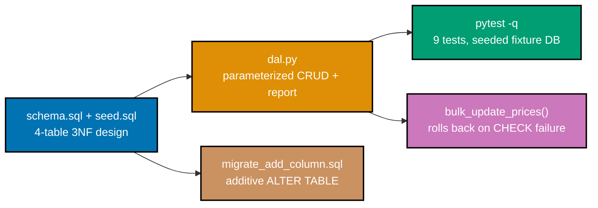

## Goal

Design and populate a small, normalized SQLite database (4 tables: `author`, `publisher`, `book`,
`tag`, plus the `book_tag` junction) and ship a Python data-access layer with parameterized queries, a
`GROUP BY` reporting aggregation, a batch update that rolls back atomically on failure, and a safe
additive migration -- runnable from the CLI end to end. Every mechanism this capstone combines was
already taught, individually, somewhere in this topic's Beginner, Intermediate, or Advanced tiers.



## Concepts exercised

- [x] 3NF schema with `PRIMARY KEY`/`FOREIGN KEY` constraints (Example 77's pattern)
- [x] `CREATE TABLE` DDL, applied from a separate `schema.sql` file (Example 74's split)
- [x] joins + `GROUP BY`/`HAVING`-style report (Example 79's pattern, minus the `HAVING`)
- [x] parameterized queries -- no string interpolation anywhere (co-20)
- [x] commit/rollback transaction via `with conn:` (Example 80's pattern)
- [x] a safe additive migration (Example 59's pattern)

All colocated code lives under `learning/capstone/code/`: `schema.sql` and `seed.sql` (the database
structure and its seed data), `dal.py` (the typed data-access layer), `demo_bulk_update.py` (a runnable
rollback demonstration), `migrate_add_column.sql` (the additive migration), and the test suite in
`tests/test_dal.py`. Every listing below is the complete, verbatim file -- nothing on this page is
truncated or paraphrased.

## Step 1: `schema.sql` + `seed.sql` -- a 3NF design, applied via the CLI

_exercises co-01, co-02, co-03, co-04, co-05, co-07, co-10_

Four fact-type tables (`author`, `publisher`, `book`, `tag`) plus one composite-key junction table
(`book_tag`), following Example 77's exact 3NF shape: `book.author_id` is a required foreign key,
`book.publisher_id` is an optional one (a self-published book has no publisher row to point at), and
`price` carries a `CHECK (price >= 0)` constraint the same way Example 80's `account.balance` does.
`seed.sql` is applied as a second, separate CLI invocation, exactly like Example 74's split.

**`learning/capstone/code/schema.sql`** (complete file)

```sql
-- Capstone: schema.sql -- a 3NF, 4-table design (author/publisher/book/tag) with PK/FK
-- constraints throughout, following the exact shape Example 77 taught (co-01, co-05, co-07).
PRAGMA foreign_keys = ON;

-- => enforcement on -- CASCADE below actually fires (co-03)
CREATE TABLE author (id INTEGER PRIMARY KEY, name TEXT NOT NULL);

CREATE TABLE publisher (id INTEGER PRIMARY KEY, name TEXT NOT NULL);

CREATE TABLE book (
  id INTEGER PRIMARY KEY,
  title TEXT NOT NULL,
  author_id INTEGER NOT NULL REFERENCES author (id),
  -- => every book MUST have an author -- NOT NULL, not optional
  publisher_id INTEGER REFERENCES publisher (id),
  -- => publisher is OPTIONAL -- self-published books have none
  price REAL NOT NULL CHECK (price >= 0)
  -- => co-04 -- the engine itself rejects a negative price
);

CREATE TABLE tag (id INTEGER PRIMARY KEY, name TEXT NOT NULL UNIQUE);

CREATE TABLE book_tag (
  book_id INTEGER NOT NULL REFERENCES book (id) ON DELETE CASCADE,
  -- => deleting a book cleans up its own tag links automatically
  tag_id INTEGER NOT NULL REFERENCES tag (id) ON DELETE CASCADE,
  PRIMARY KEY (book_id, tag_id) -- => the composite PK from Example 65 -- no duplicate pairs
);
```

**`learning/capstone/code/seed.sql`** (complete file)

```sql
-- Capstone: seed.sql -- applied AFTER schema.sql, exactly like Example 74's split (co-10, co-24).
INSERT INTO
  author (id, name)
VALUES
  (1, 'Ada Lovelace'),
  (2, 'Grace Hopper');

INSERT INTO
  publisher (id, name)
VALUES
  (1, 'Analytical Press');

INSERT INTO
  book (id, title, author_id, publisher_id, price)
VALUES
  (1, 'Notes on the Analytical Engine', 1, 1, 12.5),
  (2, 'Sketch of the Analytical Engine', 1, 1, 9.0),
  (3, 'The First Computer Bug', 2, NULL, 15.0);

-- => book 3 has NO publisher -- proves publisher_id's optionality
INSERT INTO
  tag (id, name)
VALUES
  (1, 'history'),
  (2, 'computing');

INSERT INTO
  book_tag (book_id, tag_id)
VALUES
  (1, 1),
  (1, 2),
  (2, 2);
```

**Verify**

```text
$ sqlite3 app.db < schema.sql
$ sqlite3 app.db < seed.sql
$ sqlite3 app.db ".tables"
author     book       book_tag   publisher  tag
$ sqlite3 app.db ".schema book"
CREATE TABLE book(
    id INTEGER PRIMARY KEY,
    title TEXT NOT NULL,
    author_id INTEGER NOT NULL REFERENCES author(id),
                                    -- => every book MUST have an author -- NOT NULL, not optional
    publisher_id INTEGER REFERENCES publisher(id),
                                    -- => publisher is OPTIONAL -- self-published books have none
    price REAL NOT NULL CHECK (price >= 0)
                                    -- => co-04 -- the engine itself rejects a negative price
);
```

All 5 tables exist after `schema.sql` runs, and `.schema book` confirms `book`'s foreign keys and
`CHECK` constraint landed exactly as written -- including the inline comments, since SQLite stores the
original `CREATE TABLE` text verbatim.

## Step 2: `dal.py` -- parameterized CRUD + a `GROUP BY` report, tested with `pytest`

_exercises co-13, co-15, co-19, co-20_

Every function takes an already-open `sqlite3.Connection` -- callers (the CLI, or the `pytest` fixture
below) own the connection's lifetime, this module never opens or closes one itself -- and every SQL
string uses `?` placeholders (co-20), the same discipline Example 73's `dal.py` established.
`report_by_author` reuses Example 79's join-plus-`GROUP BY` shape, minus the `HAVING` filter.
`tests/test_dal.py` builds its fixture DB from the **real** `schema.sql` and `seed.sql` files on disk
(via `Path(__file__).parent.parent`), rather than re-typing the schema in Python, so the tests exercise
the exact same relations, constraints, and seed rows Step 1 verified.

**`learning/capstone/code/dal.py`** (complete file)

```python
# pyright: strict
"""Capstone: dal.py -- typed, parameterized data-access layer over schema.sql's tables.

Every function here takes an ALREADY-OPEN sqlite3.Connection -- callers (the CLI, or the
pytest fixture below) own the connection's lifetime, this module never opens or closes one
itself. Every SQL string uses `?` placeholders (co-20) -- nothing here is ever string-built
from untrusted input, which is the whole point of a data-access layer existing at all.
"""

import sqlite3  # => stdlib DB-API module (co-19) -- no third-party driver anywhere in this file


def create_book(
    conn: sqlite3.Connection, title: str, author_id: int, publisher_id: int | None, price: float
) -> int:
    # publisher_id: int | None mirrors schema.sql's OPTIONAL publisher_id FK exactly.
    cur: sqlite3.Cursor = conn.execute(
        "INSERT INTO book(title, author_id, publisher_id, price) VALUES (?, ?, ?, ?)",
        (title, author_id, publisher_id, price),  # => 4 bound parameters, positional order matters
    )
    conn.commit()
    new_id: int | None = cur.lastrowid  # => the rowid SQLite just assigned (co-02)
    assert new_id is not None  # => narrows int | None to int -- always set right after an INSERT
    return new_id


def get_book(conn: sqlite3.Connection, book_id: int) -> tuple[int, str, int, int | None, float] | None:
    cur: sqlite3.Cursor = conn.execute(
        "SELECT id, title, author_id, publisher_id, price FROM book WHERE id = ?", (book_id,)
    )
    row: tuple[int, str, int, int | None, float] | None = cur.fetchone()
    return row  # => None if book_id doesn't exist -- callers must handle the missing case


def list_books_by_author(conn: sqlite3.Connection, author_id: int) -> list[tuple[int, str, float]]:
    cur: sqlite3.Cursor = conn.execute(
        "SELECT id, title, price FROM book WHERE author_id = ? ORDER BY id", (author_id,)
    )
    return cur.fetchall()  # => every book by this ONE author, oldest id first


def update_book_price(conn: sqlite3.Connection, book_id: int, new_price: float) -> None:
    conn.execute("UPDATE book SET price = ? WHERE id = ?", (new_price, book_id))
    conn.commit()  # => a single-row update commits immediately -- see bulk_update_prices for a batch


def delete_book(conn: sqlite3.Connection, book_id: int) -> None:
    conn.execute("DELETE FROM book WHERE id = ?", (book_id,))
    conn.commit()  # => ON DELETE CASCADE (schema.sql) also removes this book's book_tag rows


def report_by_author(conn: sqlite3.Connection) -> list[tuple[str, int, float]]:
    # The capstone's reporting aggregation: JOIN + GROUP BY in ONE query (co-15, co-13),
    # exactly like Example 79's join-group-having report, minus the HAVING filter.
    cur: sqlite3.Cursor = conn.execute(
        """
        SELECT author.name, count(*), sum(book.price)
        FROM author
        JOIN book ON book.author_id = author.id
        GROUP BY author.name
        ORDER BY author.name
        """
    )
    rows: list[tuple[str, int, float]] = cur.fetchall()
    return rows  # => [(name, book_count, total_price), ...] -- one row per author WITH books


def bulk_update_prices(conn: sqlite3.Connection, updates: list[tuple[int, float]]) -> None:
    # The capstone's rollback-on-failure transaction (co-18): `with conn:` opens an implicit
    # transaction on the FIRST write, commits if every update succeeds, and auto-ROLLBACKs
    # the WHOLE batch the instant any single update violates schema.sql's CHECK(price >= 0).
    with conn:
        for book_id, new_price in updates:  # => co-20 -- book_id/new_price stay bound, never spliced
            conn.execute("UPDATE book SET price = ? WHERE id = ?", (new_price, book_id))
```

**`learning/capstone/code/tests/__init__.py`** (complete file, empty)

```python

```

(Empty on purpose -- making `tests/` an importable package is what makes `pytest`'s default "prepend"
import mode insert `learning/capstone/code/` itself into `sys.path`, which is what lets
`tests/test_dal.py` resolve `from dal import ...`.)

**`learning/capstone/code/tests/test_dal.py`** (complete file)

```python
"""Capstone: pytest coverage for dal.py, seeded from the SAME schema.sql + seed.sql the CLI uses.

Reading the real .sql files (rather than re-typing the schema in Python) keeps this fixture
byte-identical to what a reader actually applies with `sqlite3 app.db < schema.sql` -- the
tests exercise the exact same relations, constraints, and seed rows Step 1 verifies.
"""

import sqlite3
from collections.abc import Iterator
from pathlib import Path

import pytest

from dal import (
    bulk_update_prices,
    create_book,
    delete_book,
    get_book,
    list_books_by_author,
    report_by_author,
    update_book_price,
)

CODE_DIR: Path = Path(__file__).parent.parent  # => this file lives in tests/, code/ is its parent


@pytest.fixture
def conn() -> Iterator[sqlite3.Connection]:
    # A FRESH in-memory DB per test, built from the real schema.sql + seed.sql on disk.
    connection: sqlite3.Connection = sqlite3.connect(":memory:")
    connection.execute("PRAGMA foreign_keys = ON")  # => matches schema.sql's own PRAGMA line
    connection.executescript((CODE_DIR / "schema.sql").read_text())
    connection.executescript((CODE_DIR / "seed.sql").read_text())
    yield connection
    connection.close()


def test_get_book_returns_seeded_row(conn: sqlite3.Connection) -> None:
    row: tuple[int, str, int, int | None, float] | None = get_book(conn, 1)
    assert row == (1, "Notes on the Analytical Engine", 1, 1, 12.5)


def test_get_book_missing_id_returns_none(conn: sqlite3.Connection) -> None:
    assert get_book(conn, 999) is None


def test_create_book_with_no_publisher(conn: sqlite3.Connection) -> None:
    # publisher_id=None exercises the OPTIONAL FK -- exactly like seed.sql's book 3.
    new_id: int = create_book(conn, "A New Draft", author_id=2, publisher_id=None, price=5.0)
    assert get_book(conn, new_id) == (new_id, "A New Draft", 2, None, 5.0)


def test_list_books_by_author(conn: sqlite3.Connection) -> None:
    # Author 1 (Ada Lovelace) has exactly 2 seeded books: ids 1 and 2.
    assert list_books_by_author(conn, 1) == [
        (1, "Notes on the Analytical Engine", 12.5),
        (2, "Sketch of the Analytical Engine", 9.0),
    ]


def test_update_book_price(conn: sqlite3.Connection) -> None:
    update_book_price(conn, 1, 20.0)
    row: tuple[int, str, int, int | None, float] | None = get_book(conn, 1)
    assert row is not None
    assert row[4] == 20.0  # => index 4 is price -- confirms the update actually persisted


def test_delete_book_removes_it(conn: sqlite3.Connection) -> None:
    delete_book(conn, 3)
    assert get_book(conn, 3) is None


def test_report_by_author_matches_hand_computed_values(conn: sqlite3.Connection) -> None:
    # Hand-computed from seed.sql: Ada has 2 books (12.5 + 9.0 = 21.5), Grace has 1 (15.0).
    expected: list[tuple[str, int, float]] = [
        ("Ada Lovelace", 2, 21.5),
        ("Grace Hopper", 1, 15.0),
    ]
    assert report_by_author(conn) == expected


def test_bulk_update_prices_commits_when_all_succeed(conn: sqlite3.Connection) -> None:
    bulk_update_prices(conn, [(1, 13.0), (2, 10.0)])
    assert list_books_by_author(conn, 1) == [
        (1, "Notes on the Analytical Engine", 13.0),
        (2, "Sketch of the Analytical Engine", 10.0),
    ]


def test_bulk_update_prices_rolls_back_the_whole_batch_on_failure(conn: sqlite3.Connection) -> None:
    before: list[tuple[int, str, float]] = list_books_by_author(conn, 1)  # => baseline, both books

    # book 1's price update is VALID; book 2's -1.0 violates CHECK(price >= 0) -- the WHOLE
    # batch must roll back, including the (already-applied) valid update to book 1.
    with pytest.raises(sqlite3.IntegrityError):
        bulk_update_prices(conn, [(1, 99.0), (2, -1.0)])

    after: list[tuple[int, str, float]] = list_books_by_author(conn, 1)
    assert before == after  # => book 1's price is UNCHANGED too -- no partial write survived
```

**Verify**

```text
$ pytest -q
.........                                                                [100%]
9 passed in 0.02s
$ pyright dal.py
0 errors, 0 warnings, 0 informations
```

All 9 tests pass against the real, on-disk `schema.sql` + `seed.sql` fixture -- including
`test_report_by_author_matches_hand_computed_values`, which checks `report_by_author`'s `JOIN` +
`GROUP BY` output against numbers computed by hand from `seed.sql`.

## Step 3: a transaction that partially fails and rolls back

_exercises co-18_

`bulk_update_prices` wraps every update in a `with conn:` block (Example 80's exact pattern): the
first update in a batch can succeed, but if a later update in the **same** batch violates `schema.sql`'s
`CHECK (price >= 0)`, the whole batch -- including the already-applied, individually-valid update --
rolls back together. `demo_bulk_update.py` runs this end to end against a real on-disk database file
built from `schema.sql` + `seed.sql`, capturing the database's state before and after the failure.

**`learning/capstone/code/demo_bulk_update.py`** (complete file)

```python
# pyright: strict
"""Capstone: demo_bulk_update.py -- proves a partially-failing batch leaves every row
untouched (co-18), against a real on-disk database built from schema.sql + seed.sql.

This is a runnable demonstration for Step 3 of the capstone walkthrough -- the same
rollback behavior test_bulk_update_prices_rolls_back_the_whole_batch_on_failure asserts
in tests/test_dal.py, shown here end to end against a real file, not an in-memory fixture.
"""

import sqlite3
from pathlib import Path

from dal import bulk_update_prices, list_books_by_author

CODE_DIR: Path = Path(__file__).parent  # => this script's own directory -- schema.sql/seed.sql live here
DB_PATH: Path = CODE_DIR / "demo.db"  # => a throwaway file, rebuilt fresh on every run


def main() -> None:
    DB_PATH.unlink(missing_ok=True)  # => deletes any leftover demo.db from a prior run first
    conn: sqlite3.Connection = sqlite3.connect(DB_PATH)  # => a real on-disk file, not :memory:
    conn.execute("PRAGMA foreign_keys = ON")  # => matches schema.sql's own PRAGMA line
    conn.executescript((CODE_DIR / "schema.sql").read_text())  # => applies the 4-table 3NF design
    conn.executescript((CODE_DIR / "seed.sql").read_text())  # => applies the same seed rows as Step 1

    before: list[tuple[int, str, float]] = list_books_by_author(conn, 1)  # => Ada's 2 seeded books
    print("before:", before)  # => the baseline this script proves is preserved below

    try:
        # book 1's price update is VALID; book 2's -1.0 violates CHECK(price >= 0) in schema.sql.
        bulk_update_prices(conn, [(1, 99.0), (2, -1.0)])  # => `with conn:` inside rolls back BOTH
    except sqlite3.IntegrityError as err:  # => the CHECK violation surfaces as this exact error type
        print("caught:", err)  # => confirms the failure was DETECTED, not silently swallowed

    after: list[tuple[int, str, float]] = list_books_by_author(conn, 1)  # => re-reads the SAME rows
    print("after:", after)  # => compared against `before` on the next line
    print("unchanged:", before == after)  # => True proves book 1's VALID update never persisted either
    conn.close()  # => releases the connection -- demo.db itself is left on disk for inspection


if __name__ == "__main__":  # => guards main() so importing this module never runs it
    main()  # => runs the whole demonstration end to end
```

**Verify**

```text
$ python3 demo_bulk_update.py
before: [(1, 'Notes on the Analytical Engine', 12.5), (2, 'Sketch of the Analytical Engine', 9.0)]
caught: CHECK constraint failed: price >= 0
after: [(1, 'Notes on the Analytical Engine', 12.5), (2, 'Sketch of the Analytical Engine', 9.0)]
unchanged: True
$ pyright .
0 errors, 0 warnings, 0 informations
```

`before` and `after` are identical -- book 1's individually-valid price update (`99.0`) never persisted
either, because it shared a transaction with book 2's `CHECK`-violating update. `unchanged: True` is the
same all-or-nothing guarantee `tests/test_dal.py`'s
`test_bulk_update_prices_rolls_back_the_whole_batch_on_failure` already proved, shown here against a
real database file instead of an in-memory fixture.

## Step 4: `migrate_add_column.sql` -- an additive migration, applied last

_exercises co-22, co-24_

Applied against the **same** database `schema.sql` and `seed.sql` already populated in Step 1 -- not a
fresh one -- `migrate_add_column.sql` adds an `edition` column with a `DEFAULT`, following Example 59's
exact pattern, and proves all 3 pre-existing book rows still read back correctly afterward.

**`learning/capstone/code/migrate_add_column.sql`** (complete file)

```sql
-- Capstone: migrate_add_column.sql -- an additive migration, Example 59's exact pattern (co-22),
-- applied AFTER schema.sql + seed.sql have already populated book with 3 rows.
ALTER TABLE book ADD COLUMN edition INTEGER DEFAULT 1;
                                    -- => no table rewrite, no downtime -- existing rows read DEFAULT

.headers on
.mode column
SELECT id, title, price, edition FROM book;
                                    -- => all 3 pre-existing rows show edition = 1 -- none broke
```

**Verify**

```text
$ sqlite3 app.db < migrate_add_column.sql
id  title                            price  edition
--  -------------------------------  -----  -------
1   Notes on the Analytical Engine   12.5   1
2   Sketch of the Analytical Engine  9.0    1
3   The First Computer Bug           15.0   1
```

All 3 rows seeded back in Step 1 -- including book 3, which has no publisher -- read back with
`edition = 1`. No row was dropped, and no row came back `NULL`, confirming the migration is safe to run
against a database that already has real data in it.

## Acceptance criteria

- `pytest -q` reports `9 passed` against `tests/test_dal.py`, covering every CRUD function, the
  optional-`publisher_id` path, `report_by_author`, and both the success and rollback paths of
  `bulk_update_prices`.
- `report_by_author`'s output matches the hand-computed expected values from `seed.sql`: Ada Lovelace
  has 2 books totaling `21.5`, Grace Hopper has 1 book totaling `15.0`.
- `demo_bulk_update.py` proves the rollback leaves no partial write: `before == after` for every
  account row involved in the failed batch, and the CLI's own exit is clean (the `IntegrityError` is
  caught, not left to crash the script).
- No query anywhere in `dal.py`, `demo_bulk_update.py`, or `tests/test_dal.py` uses string
  interpolation to build SQL -- every value is bound through a `?` placeholder (co-20).
- `migrate_add_column.sql` runs cleanly against the already-seeded database from Step 1, and every
  pre-existing row -- including the one with a `NULL` `publisher_id` -- still reads back valid.
- `pyright dal.py` and `pyright .` (run from inside `learning/capstone/code/`) both report `0 errors, 0
warnings, 0 informations`.
- Every listing on this page (`schema.sql`, `seed.sql`, `dal.py`, `tests/__init__.py`,
  `tests/test_dal.py`, `demo_bulk_update.py`, `migrate_add_column.sql`) is the complete file, runnable
  exactly as shown -- nothing here is a fragment that depends on code the page does not also show.

## Done bar

This capstone is runnable end to end: a reader who copies the files above into a
`learning/capstone/code/`-shaped tree, applies `schema.sql` then `seed.sql` with the `sqlite3` CLI, runs
`pytest -q`, runs `demo_bulk_update.py`, and finally applies `migrate_add_column.sql` reaches the
identical output blocks shown in Steps 1 through 4, verified against a real SQLite 3.53.3 engine and a
real CPython interpreter run (not merely described). Every mechanism combined here -- a 3NF schema with
PK/FK constraints (co-01, co-05, co-07), parameterized CRUD (co-19, co-20), a `JOIN` + `GROUP BY` report
(co-13, co-15), a `with conn:` rollback-on-failure transaction (co-18), and a safe additive migration
(co-22, co-24) -- traces to a primary source already cited in this topic's Accuracy notes; no new fact
was needed to write this page.

---

← Previous: [Advanced Examples](../advanced.md)
