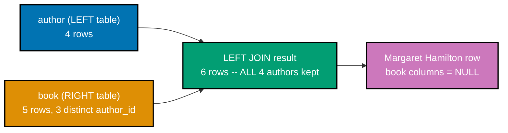
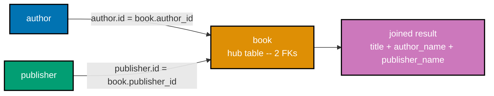
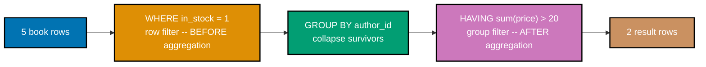
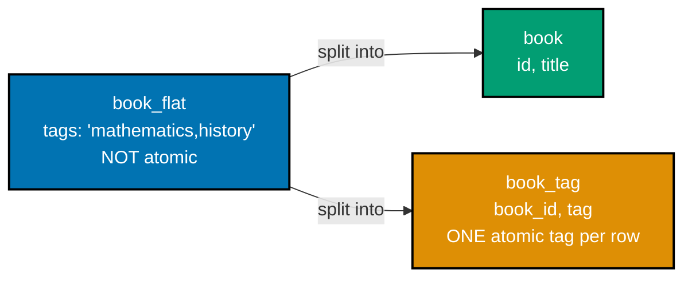
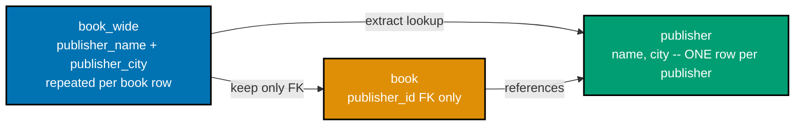
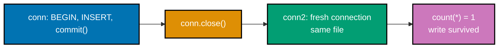
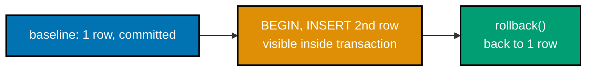
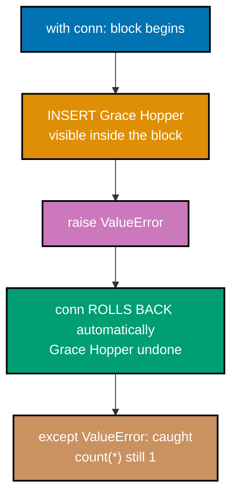
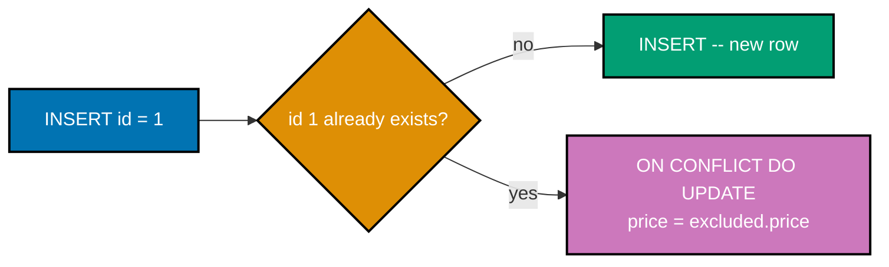
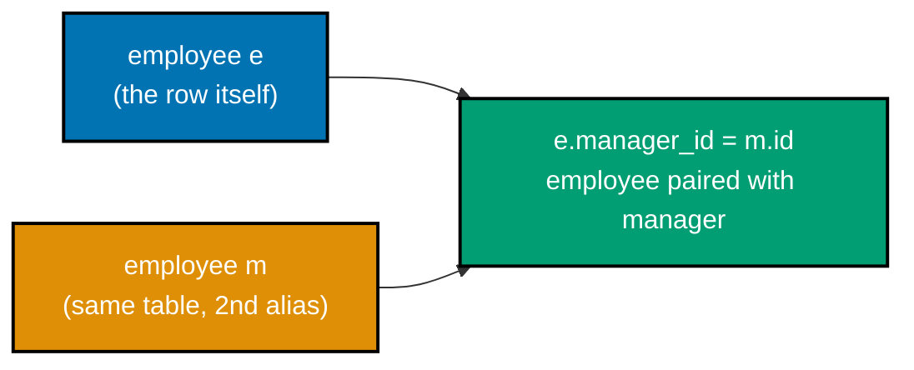

Examples 31-58 cover multi-table joins and aliasing, `GROUP BY`/`HAVING` aggregation, NULL's
three-valued logic, splitting a schema toward 1NF and 3NF, more of Python's `sqlite3` module (named
parameters, `executemany`, a `fetchone` loop, and the `Row` factory), transactions
(`commit`/`rollback`/context-manager), injection safety, upsert, a subquery, a self-join, and `CASE`
expressions. Run each `.sql` example with `sqlite3 app.db < example.sql` and each `.py` example with
`python3 <file>.py`, from inside its own directory, unless a caption says otherwise.

---

### Example 31: Left Join Unmatched

_ex-31 &middot; exercises co-14_

An inner join silently drops any row with no match on the other side. `LEFT JOIN` keeps every row from
the left table regardless, filling any unmatched right-side columns with NULL -- exactly what a
"which authors have zero books" report needs.



**`learning/code/ex-31-left-join-unmatched/example.sql`**

```sql
-- Example 31: Left Join Unmatched
-- Run: sqlite3 app.db < example.sql

-- Dot-commands (CLI-only, no trailing comment allowed on their own line):
-- print column headers, align into columns, and spell out NULL instead of blank.
.headers on
.mode column
.nullvalue NULL

-- Schema: author (parent) and book (child, referencing author via author_id).
CREATE TABLE author (                          -- => parent table -- referenced by book below
  id INTEGER PRIMARY KEY,                     -- => aliases rowid, auto-assigned on insert
  name TEXT NOT NULL,                         -- => every author needs a name
  country TEXT                                -- => nullable -- not used in this example
);

CREATE TABLE book (                            -- => child table -- author_id links back up
  id INTEGER PRIMARY KEY,                     -- => aliases rowid, auto-assigned on insert
  title TEXT NOT NULL,                        -- => every book needs a title
  author_id INTEGER REFERENCES author(id)     -- => FK -- not enforced without PRAGMA foreign_keys=ON
);

-- 4 authors -- Margaret Hamilton (id 4) deliberately has ZERO books below.
INSERT INTO author (id, name, country) VALUES
  (1, 'Ada Lovelace', 'UK'),                  -- => author 1 -- has 1 book below
  (2, 'Grace Hopper', 'US'),                  -- => author 2 -- has 2 books below
  (3, 'Alan Turing', 'UK'),                   -- => author 3 -- has 2 books below
  (4, 'Margaret Hamilton', 'US');              -- => no book row references author_id 4

-- Only 5 books, spread across authors 1-3 -- author 4 is never referenced.
INSERT INTO book (id, title, author_id) VALUES
  (1, 'Notes on the Analytical Engine', 1),   -- => author_id 1
  (2, 'Introduction to Computing', 2),        -- => author_id 2
  (3, 'Compilers and Common Sense', 2),       -- => author_id 2, same author as row above
  (4, 'On Computable Numbers', 3),            -- => author_id 3
  (5, 'The Enigma Papers', 3);                -- => author_id 3, same author as row above

-- An INNER JOIN here would silently DROP Margaret Hamilton -- she has no match.
-- LEFT JOIN keeps every row from the LEFT table (author), regardless of a match.
SELECT author.name, book.title                -- => columns pulled from BOTH tables
FROM author                                    -- => left table -- every row is kept
LEFT JOIN book ON book.author_id = author.id   -- => right side (book) may be all-NULL per row
ORDER BY author.id;                             -- => deterministic, stable row order
```

**Run**: `sqlite3 app.db < example.sql`

**Output**:

```text
name               title
-----------------  ------------------------------
Ada Lovelace       Notes on the Analytical Engine
Grace Hopper       Compilers and Common Sense
Grace Hopper       Introduction to Computing
Alan Turing        On Computable Numbers
Alan Turing        The Enigma Papers
Margaret Hamilton  NULL
```

**Key takeaway**: `LEFT JOIN` keeps every left-table row even without a match -- Margaret Hamilton
appears with a literal NULL in place of `book.title`, instead of vanishing the way an inner join would
silently drop her.

**Why it matters**: "Show me every X, including ones with zero related Y" is one of the most common
reporting shapes in real applications -- authors with no books, customers with no orders, users with no
logins. `LEFT JOIN` is the standard tool for it, and Example 71 (advanced tier) builds directly on this
same NULL-detection pattern to isolate exactly the unmatched rows via `WHERE ... IS NULL`.

---

### Example 32: Join with Aliases

_ex-32 &middot; exercises co-13_

Table aliases give a table a short, temporary name for the rest of the query -- `FROM book b JOIN
author a` lets every later reference use `b.` and `a.` instead of the full table names.

**`learning/code/ex-32-join-with-aliases/example.sql`**

```sql
-- Example 32: Join with Aliases
-- Run: sqlite3 app.db < example.sql

-- Dot-commands: print headers, align columns, spell out NULL instead of blank.
.headers on
.mode column
.nullvalue NULL

CREATE TABLE author (                          -- => parent table -- referenced by book below
  id INTEGER PRIMARY KEY,                     -- => aliases rowid, auto-assigned
  name TEXT NOT NULL                          -- => author's name, required
);

CREATE TABLE book (                            -- => child table -- author_id links back up
  id INTEGER PRIMARY KEY,                     -- => aliases rowid, auto-assigned
  title TEXT NOT NULL,                        -- => book title, required
  author_id INTEGER REFERENCES author(id)     -- => FK, matched against author.id below
);

INSERT INTO author (id, name) VALUES           -- => 2 authors, joined against book below
  (1, 'Ada Lovelace'),                        -- => author 1 -- has 1 book below
  (2, 'Grace Hopper');                        -- => author 2 -- has 2 books below

INSERT INTO book (id, title, author_id) VALUES -- => 3 books, referencing the 2 authors above
  (1, 'Notes on the Analytical Engine', 1),   -- => author_id 1
  (2, 'Introduction to Computing', 2),        -- => author_id 2
  (3, 'Compilers and Common Sense', 2);       -- => author_id 2, same author as row above

-- Same query as Example 31's join, written with table aliases -- `b` and `a`.
-- Aliases shorten `FROM book b JOIN author a` so `b.author_id = a.id` reads cleanly
-- without repeating the full table names in every qualified column reference.
SELECT b.title, a.name                         -- => columns pulled through both aliases
FROM book b                                    -- => `b` now stands in for `book`
JOIN author a ON b.author_id = a.id            -- => `a` now stands in for `author`
ORDER BY b.id;                                 -- => deterministic row order
```

**Run**: `sqlite3 app.db < example.sql`

**Output**:

```text
title                           name
------------------------------  ------------
Notes on the Analytical Engine  Ada Lovelace
Introduction to Computing       Grace Hopper
Compilers and Common Sense      Grace Hopper
```

**Key takeaway**: `book b JOIN author a` binds `b` and `a` as short-lived names for the duration of the
query -- every later column reference uses the alias, never the original table name.

**Why it matters**: Aliases stop being cosmetic the moment a query joins three or more tables, or joins
a table to itself (Example 57) -- at that point, short aliases are the only readable way to say which
occurrence of a column you mean. Getting comfortable with `t.col` syntax here pays off immediately in
Example 33's three-table join.

---

### Example 33: Three-Table Join

_ex-33 &middot; exercises co-13_

`book` has two parent tables -- `author` and `publisher` -- so recombining the full picture takes two
chained `JOIN` clauses, one per parent, both keyed off `book`'s two foreign keys.



**`learning/code/ex-33-three-table-join/example.sql`**

```sql
-- Example 33: Three-Table Join
-- Run: sqlite3 app.db < example.sql

-- Dot-commands: print headers, align columns, spell out NULL instead of blank.
.headers on
.mode column
.nullvalue NULL

-- Three related tables: author and publisher are both parents of book.
CREATE TABLE author (                          -- => first parent table
  id INTEGER PRIMARY KEY,                     -- => aliases rowid, auto-assigned
  name TEXT NOT NULL                          -- => author's name, required
);

CREATE TABLE publisher (                       -- => second parent table
  id INTEGER PRIMARY KEY,                     -- => aliases rowid, auto-assigned
  name TEXT NOT NULL                          -- => publisher's name, required
);

CREATE TABLE book (                            -- => hub table -- has TWO parents
  id INTEGER PRIMARY KEY,                     -- => aliases rowid, auto-assigned
  title TEXT NOT NULL,                        -- => book title, required
  author_id INTEGER REFERENCES author(id),     -- => FK #1 -- links to author
  publisher_id INTEGER REFERENCES publisher(id) -- => FK #2 -- links to publisher
);
-- Both FKs are simple (single-column), unlike Example 65's composite key.

INSERT INTO author (id, name) VALUES           -- => 2 authors, both referenced below
  (1, 'Ada Lovelace'),                        -- => author 1 -- writes 1 book below
  (2, 'Alan Turing');                         -- => author 2 -- writes 2 books below

INSERT INTO publisher (id, name) VALUES        -- => 2 publishers, both referenced below
  (1, 'Oxford Press'),                        -- => publisher 1 -- publishes 2 books below
  (2, 'Harbor Books');                        -- => publisher 2 -- publishes 1 book below

INSERT INTO book (id, title, author_id, publisher_id) VALUES -- => links both parent FKs
  (1, 'Notes on the Analytical Engine', 1, 1),   -- => Ada Lovelace, Oxford Press
  (2, 'On Computable Numbers', 2, 1),            -- => Alan Turing, Oxford Press
  (3, 'The Enigma Papers', 2, 2);                -- => Alan Turing, Harbor Books

-- Two JOIN clauses chain together -- book is the hub, author and publisher are
-- both its parents. Each JOIN adds one more parent table's columns to the row.
SELECT book.title, author.name AS author_name, publisher.name AS publisher_name
                                                 -- => columns pulled from all three tables
FROM book                                       -- => hub table -- the join starts here
JOIN author ON author.id = book.author_id          -- => pulls in the author's columns
JOIN publisher ON publisher.id = book.publisher_id  -- => pulls in the publisher's columns
ORDER BY book.id;                                    -- => deterministic row order
```

**Run**: `sqlite3 app.db < example.sql`

**Output**:

```text
title                           author_name   publisher_name
------------------------------  ------------  --------------
Notes on the Analytical Engine  Ada Lovelace  Oxford Press
On Computable Numbers           Alan Turing   Oxford Press
The Enigma Papers               Alan Turing   Harbor Books
```

**Key takeaway**: each additional `JOIN` clause pulls in one more table's columns -- book stays the
single hub table, and author/publisher each attach independently through their own `ON` condition.

**Why it matters**: Real schemas rarely stop at two tables -- a normalized design (co-05) deliberately
splits facts into many small tables, and joins are how a query stitches them back into one readable
row. Chaining `JOIN` clauses like this scales to four, five, or more tables with no new syntax --
Example 77 (advanced tier) designs a full 3-4 table schema built on exactly this pattern.

---

### Example 34: Group By Count

_ex-34 &middot; exercises co-15_

`GROUP BY` collapses rows that share the same value in a column into a single group; `count(*)` then
reports how many original rows fell into each group.

**`learning/code/ex-34-group-by-count/example.sql`**

```sql
-- Example 34: Group By Count
-- Run: sqlite3 app.db < example.sql

-- Dot-commands: print headers, align columns, spell out NULL instead of blank.
.headers on
.mode column
.nullvalue NULL

CREATE TABLE book (                            -- => single flat table -- no author table here
  id INTEGER PRIMARY KEY,                     -- => aliases rowid, auto-assigned
  title TEXT NOT NULL,                        -- => book title, required
  author_id INTEGER,                          -- => no FK needed -- just a grouping key here
  price REAL,                                 -- => not used by this example's query
  in_stock INTEGER,                           -- => not used by this example's query
  published_year INTEGER                      -- => not used by this example's query
);

-- 5 books: author_id 1 has 1 book, author_id 2 has 2, author_id 3 has 2.
INSERT INTO book (id, title, author_id, price, in_stock, published_year) VALUES
  (1, 'Notes on the Analytical Engine', 1, 25.00, 1, 1843),  -- => author_id 1, group of 1
  (2, 'Introduction to Computing',       2, 18.50, 1, 1952), -- => author_id 2, group of 2
  (3, 'Compilers and Common Sense',      2, 22.00, 0, NULL), -- => author_id 2, group of 2
  (4, 'On Computable Numbers',           3, 30.00, 1, 1936), -- => author_id 3, group of 2
  (5, 'The Enigma Papers',               3, 15.00, 1, NULL); -- => author_id 3, group of 2

-- GROUP BY collapses rows sharing the same author_id into one row per group;
-- count(*) then counts how many original rows collapsed into each group.
SELECT author_id, count(*) AS book_count       -- => count(*) per group, computed below
FROM book                                       -- => the 5-row source table above
GROUP BY author_id                             -- => one output row per distinct author_id
ORDER BY author_id;                            -- => deterministic group order
```

**Run**: `sqlite3 app.db < example.sql`

**Output**:

```text
author_id  book_count
---------  ----------
1          1
2          2
3          2
```

**Key takeaway**: `GROUP BY author_id` produces exactly one output row per distinct `author_id` value
-- `count(*)` inside that group reports how many source rows collapsed into it.

**Why it matters**: `GROUP BY` plus an aggregate function is how a database answers "how many per
category" without pulling every row back to the client and counting there -- the engine does the
counting where the data already lives. This is the foundation Examples 35-40 build on, each swapping
in a different aggregate function over the same grouping mechanism.

---

### Example 35: Group By Sum

_ex-35 &middot; exercises co-15_

`sum(price)` totals a numeric column within each group, the same way `count(*)` counted rows in
Example 34 -- swap the aggregate function, keep the identical `GROUP BY` shape.

**`learning/code/ex-35-group-by-sum/example.sql`**

```sql
-- Example 35: Group By Sum
-- Run: sqlite3 app.db < example.sql

-- Dot-commands: print headers, align columns, spell out NULL instead of blank.
.headers on
.mode column
.nullvalue NULL

CREATE TABLE book (                            -- => single flat table, same shape as Example 34
  id INTEGER PRIMARY KEY,                     -- => aliases rowid, auto-assigned
  title TEXT NOT NULL,                        -- => book title, required
  author_id INTEGER,                          -- => the grouping key for sum() below
  price REAL,                                 -- => summed per group below
  in_stock INTEGER,                           -- => not used by this example's query
  published_year INTEGER                      -- => not used by this example's query
);

-- Same 5-book dataset used across this tier's aggregation examples.
INSERT INTO book (id, title, author_id, price, in_stock, published_year) VALUES
  (1, 'Notes on the Analytical Engine', 1, 25.00, 1, 1843),  -- => author_id 1, price 25.00
  (2, 'Introduction to Computing',       2, 18.50, 1, 1952), -- => author_id 2, price 18.50
  (3, 'Compilers and Common Sense',      2, 22.00, 0, NULL), -- => author_id 2, price 22.00
  (4, 'On Computable Numbers',           3, 30.00, 1, 1936), -- => author_id 3, price 30.00
  (5, 'The Enigma Papers',               3, 15.00, 1, NULL); -- => author_id 3, price 15.00

-- sum(price) totals the price column WITHIN each author_id group -- author_id 2's
-- two books (18.50 + 22.00) collapse into one summed row, same for author_id 3.
SELECT author_id, sum(price) AS total_price    -- => sum(price) per group, computed below
FROM book                                       -- => the 5-row source table above
GROUP BY author_id                             -- => one output row per distinct author_id
ORDER BY author_id;                            -- => deterministic group order
```

**Run**: `sqlite3 app.db < example.sql`

**Output**:

```text
author_id  total_price
---------  -----------
1          25.0
2          40.5
3          45.0
```

**Key takeaway**: `sum(price)` adds up every `price` value inside a group -- author_id 2's two books
(18.50 + 22.00) become the single value 40.5, not two separate rows.

**Why it matters**: `sum` per group is the exact query behind a revenue-per-customer or
spend-per-category report -- swap `author_id` for `customer_id` and the shape barely changes. Example
44 later layers this same `GROUP BY sum()` on top of a join, computing per-author totals across
recombined normalized tables instead of one flat table.

---

### Example 36: Group By Avg

_ex-36 &middot; exercises co-15_

`avg(price)` computes the arithmetic mean of a column within each group -- the sum from Example 35
divided by that group's row count, done in a single aggregate call.

**`learning/code/ex-36-group-by-avg/example.sql`**

```sql
-- Example 36: Group By Avg
-- Run: sqlite3 app.db < example.sql

-- Dot-commands: print headers, align columns, spell out NULL instead of blank.
.headers on
.mode column
.nullvalue NULL

CREATE TABLE book (                            -- => single flat table, same shape as Example 34
  id INTEGER PRIMARY KEY,                     -- => aliases rowid, auto-assigned
  title TEXT NOT NULL,                        -- => book title, required
  author_id INTEGER,                          -- => the grouping key for avg() below
  price REAL,                                 -- => averaged per group below
  in_stock INTEGER,                           -- => not used by this example's query
  published_year INTEGER                      -- => not used by this example's query
);

-- Same 5-book dataset used across this tier's aggregation examples.
INSERT INTO book (id, title, author_id, price, in_stock, published_year) VALUES
  (1, 'Notes on the Analytical Engine', 1, 25.00, 1, 1843),  -- => author_id 1, price 25.00
  (2, 'Introduction to Computing',       2, 18.50, 1, 1952), -- => author_id 2, price 18.50
  (3, 'Compilers and Common Sense',      2, 22.00, 0, NULL), -- => author_id 2, price 22.00
  (4, 'On Computable Numbers',           3, 30.00, 1, 1936), -- => author_id 3, price 30.00
  (5, 'The Enigma Papers',               3, 15.00, 1, NULL); -- => author_id 3, price 15.00

-- avg(price) computes the mean price WITHIN each author_id group -- author_id 2's
-- (18.50 + 22.00) / 2 = 20.25, author_id 3's (30.00 + 15.00) / 2 = 22.5.
SELECT author_id, avg(price) AS avg_price      -- => avg(price) per group, computed below
FROM book                                       -- => the 5-row source table above
GROUP BY author_id                             -- => one output row per distinct author_id
ORDER BY author_id;                            -- => deterministic group order
```

**Run**: `sqlite3 app.db < example.sql`

**Output**:

```text
author_id  avg_price
---------  ---------
1          25.0
2          20.25
3          22.5
```

**Key takeaway**: `avg(price)` returns each group's mean directly -- `(18.50 + 22.00) / 2 = 20.25` for
author_id 2 -- with no separate `sum() / count()` division needed in the query.

**Why it matters**: `count`, `sum`, `avg`, and Example 37's `min`/`max` are SQLite's core aggregate
functions (co-15) -- they all share the identical `GROUP BY` mechanics shown across Examples 34-36,
differing only in which single number each summarizes per group.

---

### Example 37: Min-Max Aggregate

_ex-37 &middot; exercises co-15_

With no `GROUP BY` clause at all, `min()`/`max()` collapse the **entire table** into a single summary
row -- the global cheapest and priciest values, not one pair per group.

**`learning/code/ex-37-min-max-aggregate/example.sql`**

```sql
-- Example 37: Min Max Aggregate
-- Run: sqlite3 app.db < example.sql

-- Dot-commands: print headers, align columns, spell out NULL instead of blank.
.headers on
.mode column
.nullvalue NULL

CREATE TABLE book (                            -- => a single flat table, no grouping key here
  id INTEGER PRIMARY KEY,                     -- => aliases rowid, auto-assigned
  title TEXT NOT NULL,                        -- => book title, required
  price REAL                                  -- => min/max computed over this column
);

-- 5 books with distinct prices, ranging from 15.00 to 30.00.
INSERT INTO book (id, title, price) VALUES     -- => 5 rows, no author_id this time
  (1, 'Notes on the Analytical Engine', 25.00), -- => neither the min nor the max
  (2, 'Introduction to Computing', 18.50),      -- => neither the min nor the max
  (3, 'Compilers and Common Sense', 22.00),     -- => neither the min nor the max
  (4, 'On Computable Numbers', 30.00),          -- => the max -- priciest book
  (5, 'The Enigma Papers', 15.00);              -- => the min -- cheapest book

-- With NO GROUP BY, min()/max() collapse the ENTIRE table into a single row --
-- the cheapest and priciest book across all 5 rows, not per-group like Examples 34-36.
SELECT min(price) AS cheapest, max(price) AS priciest -- => one summary row, no grouping key
FROM book;                                      -- => the 5-row source table above
```

**Run**: `sqlite3 app.db < example.sql`

**Output**:

```text
cheapest  priciest
--------  --------
15.0      30.0
```

**Key takeaway**: an aggregate function with no `GROUP BY` treats the whole table as one implicit
group -- exactly one output row summarizing all 5 source rows, never one row per book.

**Why it matters**: Forgetting whether a query has a `GROUP BY` clause is a common source of confusion
-- with it, an aggregate summarizes per group; without it, the aggregate summarizes everything. Reading
`SELECT min(price), max(price) FROM book;` correctly (a single-row price-range summary) versus
misreading it as per-book output is exactly the distinction this example isolates.

---

### Example 38: Having Filter Groups

_ex-38 &middot; exercises co-16_

`WHERE` cannot filter on an aggregate result -- by the time `WHERE` runs, no aggregation has happened
yet. `HAVING` exists specifically to filter groups **after** `GROUP BY` has collapsed them.

**`learning/code/ex-38-having-filter-groups/example.sql`**

```sql
-- Example 38: Having Filter Groups
-- Run: sqlite3 app.db < example.sql

-- Dot-commands: print headers, align columns, spell out NULL instead of blank.
.headers on
.mode column
.nullvalue NULL

CREATE TABLE book (                            -- => a single flat table
  id INTEGER PRIMARY KEY,                     -- => aliases rowid, auto-assigned
  title TEXT NOT NULL,                        -- => book title, required
  author_id INTEGER                           -- => the grouping key HAVING filters on
);

-- author_id 1 has 1 book, author_id 2 has 2 books, author_id 3 has 2 books.
INSERT INTO book (id, title, author_id) VALUES -- => 5 books across 3 author_id groups
  (1, 'Notes on the Analytical Engine', 1),   -- => author_id 1, group of 1 -- fails HAVING
  (2, 'Introduction to Computing', 2),        -- => author_id 2, group of 2 -- passes HAVING
  (3, 'Compilers and Common Sense', 2),       -- => author_id 2, group of 2 -- passes HAVING
  (4, 'On Computable Numbers', 3),            -- => author_id 3, group of 2 -- passes HAVING
  (5, 'The Enigma Papers', 3);                -- => author_id 3, group of 2 -- passes HAVING

-- HAVING filters GROUPS after aggregation -- the opposite of WHERE, which filters
-- ROWS before aggregation. count(*) > 1 keeps only groups with more than one book,
-- so author_id 1 (exactly 1 book) is dropped from the result entirely.
SELECT author_id, count(*) AS book_count       -- => count(*) per surviving group
FROM book                                       -- => the 5-row source table above
GROUP BY author_id                             -- => first, collapse rows into groups
HAVING count(*) > 1                            -- => then, keep only groups matching this
ORDER BY author_id;                            -- => deterministic group order
```

**Run**: `sqlite3 app.db < example.sql`

**Output**:

```text
author_id  book_count
---------  ----------
2          2
3          2
```

**Key takeaway**: `HAVING count(*) > 1` runs strictly after `GROUP BY` has produced group summaries --
author_id 1's single book means its group fails the test and never reaches the output.

**Why it matters**: `HAVING` is the piece that makes "authors with more than N books" or "products
selling above a revenue threshold" possible in a single query -- `WHERE` physically cannot express
either, since the value being tested (`count(*)`) does not exist until after aggregation. Example 39
next contrasts both filters working together in the same query.

---

### Example 39: Where Plus Having

_ex-39 &middot; exercises co-16, co-08_

`WHERE` and `HAVING` can appear in the same query, filtering at two different phases: `WHERE` removes
individual rows first, then `GROUP BY` aggregates the survivors, then `HAVING` filters the resulting
groups.



**`learning/code/ex-39-where-plus-having/example.sql`**

```sql
-- Example 39: Where Plus Having
-- Run: sqlite3 app.db < example.sql

-- Dot-commands: print headers, align columns, spell out NULL instead of blank.
.headers on
.mode column
.nullvalue NULL

CREATE TABLE book (                            -- => a single flat table
  id INTEGER PRIMARY KEY,                     -- => aliases rowid, auto-assigned
  title TEXT NOT NULL,                        -- => book title, required
  author_id INTEGER,                          -- => the grouping key for sum() below
  price REAL,                                 -- => summed per group after WHERE filters
  in_stock INTEGER                            -- => 1 = in stock, 0 = out of stock
);

-- Book id 3 is the ONLY out-of-stock row -- watch it disappear before grouping.
INSERT INTO book (id, title, author_id, price, in_stock) VALUES -- => 5 rows, 1 out-of-stock
  (1, 'Notes on the Analytical Engine', 1, 25.00, 1),   -- => in stock -- survives WHERE
  (2, 'Introduction to Computing',       2, 18.50, 1),  -- => in stock -- survives WHERE
  (3, 'Compilers and Common Sense',      2, 22.00, 0),   -- => dropped by WHERE, first
  (4, 'On Computable Numbers',           3, 30.00, 1),  -- => in stock -- survives WHERE
  (5, 'The Enigma Papers',               3, 15.00, 1);  -- => in stock -- survives WHERE

-- Two filters, two different phases. WHERE runs FIRST, on individual rows, before
-- any grouping happens -- it removes book id 3 (in_stock = 0) entirely. GROUP BY
-- then collapses the SURVIVING rows. HAVING runs LAST, on the resulting groups --
-- author_id 2's remaining sum (18.50, book id 3 already gone) fails the > 20 test.
SELECT author_id, sum(price) AS total_price    -- => sum(price) per surviving group
FROM book                                       -- => the 5-row source table above
WHERE in_stock = 1                             -- => row filter -- BEFORE aggregation
GROUP BY author_id                             -- => collapse the surviving rows
HAVING sum(price) > 20                         -- => group filter -- AFTER aggregation
ORDER BY author_id;                            -- => deterministic group order
```

**Run**: `sqlite3 app.db < example.sql`

**Output**:

```text
author_id  total_price
---------  -----------
1          25.0
3          45.0
```

**Key takeaway**: author_id 2 disappears from the result for two DIFFERENT reasons stacked together --
its out-of-stock book is removed by `WHERE` first, and what remains (18.50) then fails the `HAVING
sum(price) > 20` test.

**Why it matters**: Knowing exactly which clause runs when -- `WHERE` before aggregation, `HAVING`
after -- prevents a common class of bug: writing `WHERE count(*) > 1` (a syntax error, since `count(*)`
does not exist yet at `WHERE` time) or writing `HAVING in_stock = 1` (technically legal but wasteful,
since it filters late instead of early). Example 79 (advanced tier) combines this exact join +
`GROUP BY` + `HAVING` shape into a full report query.

---

### Example 40: Count Star vs Column

_ex-40 &middot; exercises co-15, co-17_

`count(*)` counts every row, full stop. `count(column)` counts only the rows where that specific
column is **not** NULL -- the two forms diverge the moment the counted column can hold NULL.

**`learning/code/ex-40-count-star-vs-column/example.sql`**

```sql
-- Example 40: Count Star vs Column
-- Run: sqlite3 app.db < example.sql

-- Dot-commands: print headers, align columns, spell out NULL instead of blank.
.headers on
.mode column
.nullvalue NULL

CREATE TABLE book (                            -- => a single flat table
  id INTEGER PRIMARY KEY,                     -- => aliases rowid, auto-assigned
  title TEXT NOT NULL,                        -- => book title, required
  published_year INTEGER                      -- => 2 of the 5 rows leave this NULL
);

-- Books 3 and 5 have an unknown (NULL) published_year.
INSERT INTO book (id, title, published_year) VALUES -- => 5 rows, 2 with a NULL year
  (1, 'Notes on the Analytical Engine', 1843), -- => known year -- counted by both forms
  (2, 'Introduction to Computing', 1952),      -- => known year -- counted by both forms
  (3, 'Compilers and Common Sense', NULL),      -- => unknown year -- excluded below
  (4, 'On Computable Numbers', 1936),          -- => known year -- counted by both forms
  (5, 'The Enigma Papers', NULL);               -- => unknown year -- excluded below

-- count(*) counts ROWS, full stop -- NULLs included. count(column) counts only
-- NON-NULL values in that specific column -- the two forms diverge whenever the
-- counted column itself can hold NULL, exactly like published_year here.
SELECT count(*) AS row_count, count(published_year) AS known_year_count
                                                 -- => two different counts, same table
FROM book;                                      -- => the 5-row source table above
```

**Run**: `sqlite3 app.db < example.sql`

**Output**:

```text
row_count  known_year_count
---------  ----------------
5          3
```

**Key takeaway**: `count(*)` returns 5 (every row); `count(published_year)` returns 3 (only the rows
where `published_year` is not NULL) -- the same table, two genuinely different answers.

**Why it matters**: This distinction quietly breaks a lot of "percentage complete" or "data quality"
reports -- if you want "how many rows have a known year", `count(published_year)` is correct;
`count(*)` would silently overcount by including the unknowns. Example 42's `coalesce()` shows the
complementary technique: substituting a placeholder instead of excluding the NULL.

---

### Example 41: Null Is Null

_ex-41 &middot; exercises co-17_

NULL means "unknown", not zero or empty string -- testing for it needs the dedicated `IS NULL`
operator, since ordinary comparison operators cannot detect it (Example 43 shows exactly why).

**`learning/code/ex-41-null-is-null/example.sql`**

```sql
-- Example 41: Null Is Null
-- Run: sqlite3 app.db < example.sql

-- Dot-commands: print headers, align columns, spell out NULL instead of blank.
.headers on
.mode column
.nullvalue NULL

CREATE TABLE book (                            -- => a single flat table
  id INTEGER PRIMARY KEY,                     -- => aliases rowid, auto-assigned
  title TEXT NOT NULL,                        -- => book title, required
  published_year INTEGER                      -- => unknown for 2 of the 5 rows
);

INSERT INTO book (id, title, published_year) VALUES -- => 5 rows, 2 with a NULL year
  (1, 'Notes on the Analytical Engine', 1843), -- => known year -- excluded from result
  (2, 'Introduction to Computing', 1952),      -- => known year -- excluded from result
  (3, 'Compilers and Common Sense', NULL),      -- => year genuinely unknown
  (4, 'On Computable Numbers', 1936),          -- => known year -- excluded from result
  (5, 'The Enigma Papers', NULL);               -- => year genuinely unknown

-- NULL means "unknown", not zero or empty string -- so testing for it needs its
-- own operator. IS NULL is that operator; Example 43 shows why `= NULL` fails.
SELECT id, title                                -- => the two columns shown for matches
FROM book                                       -- => the 5-row source table above
WHERE published_year IS NULL                   -- => matches exactly the 2 unknown rows
ORDER BY id;                                    -- => deterministic row order
```

**Run**: `sqlite3 app.db < example.sql`

**Output**:

```text
id  title
--  --------------------------
3   Compilers and Common Sense
5   The Enigma Papers
```

**Key takeaway**: `IS NULL` correctly matches both books with an unknown `published_year` -- the one
operator built specifically to test for NULL, unlike `=` (Example 43).

**Why it matters**: Every schema eventually has optional data -- an unset deadline, an unknown
publication year, a customer who never entered a phone number. `IS NULL`/`IS NOT NULL` are the only
reliable way to query for "unknown" versus "known" values, and getting this right from the start avoids
the silent zero-row bug Example 43 demonstrates.

---

### Example 42: Null Coalesce

_ex-42 &middot; exercises co-17_

`coalesce(a, b, ...)` returns the first non-NULL argument, scanning left to right -- a one-line way to
substitute a fallback value wherever a column might be NULL.

**`learning/code/ex-42-null-coalesce/example.sql`**

```sql
-- Example 42: Null Coalesce
-- Run: sqlite3 app.db < example.sql

-- Dot-commands: print headers, align columns, spell out NULL instead of blank.
.headers on
.mode column
.nullvalue NULL

CREATE TABLE book (                            -- => a single flat table
  id INTEGER PRIMARY KEY,                     -- => aliases rowid, auto-assigned
  title TEXT NOT NULL,                        -- => book title, required
  published_year INTEGER                      -- => unknown for 2 of the 5 rows
);

INSERT INTO book (id, title, published_year) VALUES -- => 5 rows, 2 with a NULL year
  (1, 'Notes on the Analytical Engine', 1843), -- => known year -- coalesce() passes it through
  (2, 'Introduction to Computing', 1952),      -- => known year -- coalesce() passes it through
  (3, 'Compilers and Common Sense', NULL),      -- => becomes 0 below, not left blank
  (4, 'On Computable Numbers', 1936),          -- => known year -- coalesce() passes it through
  (5, 'The Enigma Papers', NULL);               -- => becomes 0 below, not left blank

-- coalesce(a, b, ...) returns the FIRST non-NULL argument, left to right -- here,
-- published_year if it exists, otherwise the literal 0 as a placeholder value.
SELECT id, title, coalesce(published_year, 0) AS year_or_zero
                                                 -- => year_or_zero never shows NULL
FROM book                                       -- => the 5-row source table above
ORDER BY id;                                    -- => deterministic row order
```

**Run**: `sqlite3 app.db < example.sql`

**Output**:

```text
id  title                           year_or_zero
--  ------------------------------  ------------
1   Notes on the Analytical Engine  1843
2   Introduction to Computing       1952
3   Compilers and Common Sense      0
4   On Computable Numbers           1936
5   The Enigma Papers               0
```

**Key takeaway**: `coalesce(published_year, 0)` leaves known years untouched and substitutes `0`
wherever `published_year` was NULL -- a single expression, no `CASE WHEN ... IS NULL` needed.

**Why it matters**: `coalesce()` is the standard SQL way to give NULL a display-friendly fallback --
"Unknown" for a missing name, `0` for a missing count, an empty string for a missing note -- without
excluding the row the way Example 40's `count(column)` does. It composes with any expression, including
another `coalesce()` call for a chain of fallbacks.

---

### Example 43: Null Three-Valued

_ex-43 &middot; exercises co-17_

SQL comparisons are three-valued -- TRUE, FALSE, or UNKNOWN -- and any comparison against NULL,
including `NULL = NULL`, evaluates to UNKNOWN, never TRUE. A `WHERE` clause built on `= NULL` can
therefore never match a single row.

**`learning/code/ex-43-null-three-valued/example.sql`**

```sql
-- Example 43: Null Three-Valued
-- Run: sqlite3 app.db < example.sql

-- Dot-commands: print headers, align columns, spell out NULL instead of blank.
.headers on
.mode column
.nullvalue NULL

CREATE TABLE book (                            -- => a single flat table
  id INTEGER PRIMARY KEY,                     -- => aliases rowid, auto-assigned
  title TEXT NOT NULL,                        -- => book title, required
  published_year INTEGER                      -- => 2 of 5 rows leave this NULL
);

INSERT INTO book (id, title, published_year) VALUES -- => 5 rows, 2 with a NULL year
  (1, 'Notes on the Analytical Engine', 1843), -- => known year -- still never matches = NULL
  (2, 'Introduction to Computing', 1952),      -- => known year -- still never matches = NULL
  (3, 'Compilers and Common Sense', NULL),      -- => year genuinely unknown
  (4, 'On Computable Numbers', 1936),          -- => known year -- still never matches = NULL
  (5, 'The Enigma Papers', NULL);               -- => year genuinely unknown

-- SQL comparisons are three-valued: TRUE, FALSE, or UNKNOWN. Any comparison
-- against NULL (even `NULL = NULL`) evaluates to UNKNOWN, never TRUE -- so a
-- WHERE clause built on `= NULL` can NEVER match a row, no matter the data.
-- This returns ZERO rows, even though books 3 and 5 genuinely have a NULL year.
SELECT id, title                                -- => never reached -- WHERE matches nothing
FROM book                                       -- => the 5-row source table above
WHERE published_year = NULL                    -- => WRONG -- always UNKNOWN, never TRUE
ORDER BY id;                                    -- => deterministic row order, if any rows matched
```

**Run**: `sqlite3 app.db < example.sql`

**Output**:

```text

```

**Key takeaway**: `WHERE published_year = NULL` returns **zero rows** on this exact data set, even
though two rows genuinely have a NULL year -- `=` can never evaluate to TRUE when either side is NULL.

**Why it matters**: This is one of SQL's most common silent bugs -- the query runs without error, just
returns the wrong (empty) answer, with nothing in the output to hint that `= NULL` was the mistake.
Every SQL style guide flags this identically: always use `IS NULL`/`IS NOT NULL` (Example 41) to test
for NULL, never `=` or `!=`.

---

### Example 44: Aggregate Over Join

_ex-44 &middot; exercises co-15, co-13_

`JOIN` and `GROUP BY` compose freely -- the join recombines normalized tables first, and the
aggregation then summarizes the joined result, exactly how a per-author revenue report works.


**`learning/code/ex-44-aggregate-over-join/example.sql`**

```sql
-- Example 44: Aggregate Over Join
-- Run: sqlite3 app.db < example.sql

-- Dot-commands: print headers, align columns, spell out NULL instead of blank.
.headers on
.mode column
.nullvalue NULL

CREATE TABLE author (                          -- => parent table -- referenced by book below
  id INTEGER PRIMARY KEY,                     -- => aliases rowid, auto-assigned
  name TEXT NOT NULL                          -- => author's name, required
);

CREATE TABLE book (                            -- => child table -- author_id links back up
  id INTEGER PRIMARY KEY,                     -- => aliases rowid, auto-assigned
  title TEXT NOT NULL,                        -- => book title, required
  author_id INTEGER REFERENCES author(id),     -- => FK, joined against author.id below
  price REAL                                  -- => summed per author after the join
);

INSERT INTO author (id, name) VALUES           -- => 3 authors, all referenced below
  (1, 'Ada Lovelace'),                        -- => author 1 -- has 1 book below
  (2, 'Grace Hopper'),                        -- => author 2 -- has 2 books below
  (3, 'Alan Turing');                         -- => author 3 -- has 2 books below

-- Grace Hopper (id 2) and Alan Turing (id 3) each have TWO books -- their totals
-- sum across the join, unlike Ada Lovelace's single-book total.
INSERT INTO book (id, title, author_id, price) VALUES -- => 5 books across 3 authors
  (1, 'Notes on the Analytical Engine', 1, 25.00),  -- => author_id 1, price 25.00
  (2, 'Introduction to Computing',       2, 18.50), -- => author_id 2, price 18.50
  (3, 'Compilers and Common Sense',      2, 22.00), -- => author_id 2, price 22.00
  (4, 'On Computable Numbers',           3, 30.00), -- => author_id 3, price 30.00
  (5, 'The Enigma Papers',               3, 15.00); -- => author_id 3, price 15.00

-- JOIN recombines the normalized tables FIRST; GROUP BY/sum() aggregate the
-- JOINED result SECOND -- this is exactly how a per-author revenue report works.
SELECT a.name, sum(b.price) AS total_price     -- => sum(price) per author, after the join
FROM author a                                   -- => left side of the join -- one row per author
JOIN book b ON b.author_id = a.id              -- => recombine author with its books
GROUP BY a.name                                 -- => then collapse into per-author totals
ORDER BY a.id;                                  -- => deterministic group order
```

**Run**: `sqlite3 app.db < example.sql`

**Output**:

```text
name          total_price
------------  -----------
Ada Lovelace  25.0
Grace Hopper  40.5
Alan Turing   45.0
```

**Key takeaway**: the `JOIN` runs first, recombining each book with its author; `GROUP BY a.name` then
collapses the joined rows into one total per author -- the two operations compose in that order, not
in parallel.

**Why it matters**: This exact pattern -- join to recombine normalized data, then aggregate the result
-- is how the vast majority of real reporting queries are built. A normalized schema (co-05) splits
facts across tables specifically so each fact lives in one place; joins and aggregation are how you get
a summarized answer back out without denormalizing the storage itself.

---

### Example 45: Normalize Repeating Group (1NF)

_ex-45 &middot; exercises co-05_

A comma-separated list packed into one text column is a "repeating group" -- not an atomic value, and
therefore not 1NF. Splitting it into a child table, one row per tag, is specifically a **1NF** fix
(atomicity) -- not 2NF, which concerns partial dependency on a composite key, a different problem this
split alone does not address.



**`learning/code/ex-45-normalize-repeating-group/example.sql`**

```sql
-- Example 45: Normalize Repeating Group (1NF)
-- Run: sqlite3 app.db < example.sql
--
-- IMPORTANT: this split fixes 1NF (atomicity) specifically -- NOT 2NF. 2NF is
-- about partial dependency on a COMPOSITE key, a different problem this single
-- split does not address.

-- Dot-commands: print headers, align columns, spell out NULL instead of blank.
.headers on
.mode column
.nullvalue NULL

-- PROBLEM: `tags` packs a variable-length list into ONE text column -- a
-- "repeating group". This column is NOT atomic (1NF requires atomic values).
CREATE TABLE book_flat (                       -- => the BEFORE table -- not yet 1NF
  id INTEGER PRIMARY KEY,                     -- => aliases rowid, auto-assigned
  title TEXT NOT NULL,                        -- => book title, required
  tags TEXT                                   -- => e.g. 'mathematics,history' -- not atomic
);

INSERT INTO book_flat (id, title, tags) VALUES -- => 2 rows, each packing multiple tags
  (1, 'Notes on the Analytical Engine', 'mathematics,history'),          -- => 2 tags packed
  (2, 'On Computable Numbers', 'mathematics,computer-science');          -- => 2 tags packed

-- Finding "every book tagged mathematics" here needs a fragile LIKE '%mathematics%'
-- pattern -- and it would also false-match a hypothetical tag like 'mathematics-history'.
SELECT * FROM book_flat;                        -- => shows the packed, non-atomic tags column

-- FIX: split the repeating group into its own child table, one row PER TAG.
-- Now every value in every column is a single, atomic fact -- 1NF satisfied.
CREATE TABLE book (                            -- => the AFTER hub table -- tags moved out
  id INTEGER PRIMARY KEY,                     -- => aliases rowid, auto-assigned
  title TEXT NOT NULL                         -- => book title, required
);

CREATE TABLE book_tag (                        -- => the AFTER child table -- one row per tag
  book_id INTEGER REFERENCES book(id),        -- => FK back to the owning book
  tag TEXT NOT NULL,                          -- => exactly ONE atomic tag per row
  PRIMARY KEY (book_id, tag)                  -- => a composite key -- no duplicate pairs
);

INSERT INTO book (id, title) VALUES            -- => same 2 books, tags no longer inline
  (1, 'Notes on the Analytical Engine'),      -- => book 1 -- 2 tags in book_tag below
  (2, 'On Computable Numbers');                -- => book 2 -- 2 tags in book_tag below

INSERT INTO book_tag (book_id, tag) VALUES     -- => 4 rows -- one row PER atomic tag
  (1, 'mathematics'),                         -- => book 1's first tag
  (1, 'history'),                             -- => book 1's second tag
  (2, 'mathematics'),                         -- => book 2's first tag
  (2, 'computer-science');                     -- => book 2's second tag

-- Now "every book tagged mathematics" is a plain, exact WHERE tag = 'mathematics'
-- on book_tag -- no string-pattern hack, no false-positive risk.
SELECT book.title, book_tag.tag                -- => one output row PER book/tag pair
FROM book                                       -- => left side of the join
JOIN book_tag ON book_tag.book_id = book.id    -- => recombines book with its atomic tags
ORDER BY book.id, book_tag.tag;                 -- => deterministic row order
```

**Run**: `sqlite3 app.db < example.sql`

**Output** (sqlite3 prints consecutive result sets back-to-back, with no blank line between them):

```text
id  title                           tags
--  ------------------------------  ----------------------------
1   Notes on the Analytical Engine  mathematics,history
2   On Computable Numbers           mathematics,computer-science
title                           tag
------------------------------  ----------------
Notes on the Analytical Engine  history
Notes on the Analytical Engine  mathematics
On Computable Numbers           computer-science
On Computable Numbers           mathematics
```

**Key takeaway**: splitting `tags` into a `book_tag` child table (one row per tag) fixes **1NF**
specifically -- every column value is now atomic -- and is a different, narrower fix than 2NF, which
addresses partial dependency on a composite key.

**Why it matters**: a comma-packed column is one of the most common denormalization mistakes in
real schemas -- it looks convenient until you need to filter, count, or join on an individual item
inside the list, at which point every query becomes a fragile string-pattern hack. Recognizing "this
column holds more than one fact" is the first step toward 1NF; Example 46 tackles the next kind of
normalization problem, a transitive dependency.

---

### Example 46: Normalize Transitive Dependency (3NF)

_ex-46 &middot; exercises co-05_

When a non-key column depends on another non-key column rather than on the primary key directly
(`id -> publisher_name -> publisher_city`), that's a transitive dependency -- extracting the dependent
fact into its own lookup table is the 3NF fix.



**`learning/code/ex-46-normalize-transitive-dep/example.sql`**

```sql
-- Example 46: Normalize Transitive Dependency (3NF)
-- Run: sqlite3 app.db < example.sql

-- Dot-commands: print headers, align columns, spell out NULL instead of blank.
.headers on
.mode column
.nullvalue NULL

-- PROBLEM: publisher_city depends on publisher_name, NOT directly on id -- a
-- TRANSITIVE dependency (id -> publisher_name -> publisher_city). Both books
-- from 'Oxford Press' repeat 'Oxford' -- change one city and the other silently
-- goes stale, an update anomaly 3NF exists specifically to prevent.
CREATE TABLE book_wide (                       -- => the BEFORE table -- not yet 3NF
  id INTEGER PRIMARY KEY,                     -- => aliases rowid, auto-assigned
  title TEXT NOT NULL,                        -- => book title, required
  publisher_name TEXT NOT NULL,               -- => repeated fact, one copy per book row
  publisher_city TEXT NOT NULL                -- => repeated fact, one copy per book row
);

INSERT INTO book_wide (id, title, publisher_name, publisher_city) VALUES -- => 3 rows
  (1, 'Notes on the Analytical Engine', 'Oxford Press', 'Oxford'),        -- => 'Oxford' repeated below
  (2, 'On Computable Numbers', 'Oxford Press', 'Oxford'),      -- => 'Oxford' repeated
  (3, 'Introduction to Computing', 'Harbor Books', 'Boston');  -- => a different publisher

SELECT * FROM book_wide;                        -- => shows publisher_city repeated twice

-- FIX: extract publisher into its own table -- publisher_city now lives in
-- exactly ONE row per publisher, referenced by id instead of copied by value.
CREATE TABLE publisher (                       -- => the AFTER lookup table -- one row per publisher
  id INTEGER PRIMARY KEY,                     -- => aliases rowid, auto-assigned
  name TEXT NOT NULL,                         -- => publisher's name, required
  city TEXT NOT NULL                          -- => one fact, one place -- 3NF
);

CREATE TABLE book (                            -- => the AFTER hub table -- FK instead of copies
  id INTEGER PRIMARY KEY,                     -- => aliases rowid, auto-assigned
  title TEXT NOT NULL,                        -- => book title, required
  publisher_id INTEGER REFERENCES publisher(id) -- => FK -- no more repeated publisher text
);

INSERT INTO publisher (id, name, city) VALUES  -- => 2 publishers, each stored exactly once
  (1, 'Oxford Press', 'Oxford'),               -- => publisher 1 -- referenced by 2 books below
  (2, 'Harbor Books', 'Boston');                -- => publisher 2 -- referenced by 1 book below

INSERT INTO book (id, title, publisher_id) VALUES -- => same 3 books, publisher_city no longer inline
  (1, 'Notes on the Analytical Engine', 1),   -- => publisher_id 1
  (2, 'On Computable Numbers', 1),             -- => shares publisher_id 1, not the city text
  (3, 'Introduction to Computing', 2);         -- => publisher_id 2

-- Updating Oxford Press's city now means changing ONE row (publisher.city) --
-- both of its books pick up the change automatically through the join.
SELECT book.title, publisher.name, publisher.city -- => city now read through the join
FROM book                                       -- => left side of the join
JOIN publisher ON publisher.id = book.publisher_id -- => recombines book with its publisher
ORDER BY book.id;                               -- => deterministic row order
```

**Run**: `sqlite3 app.db < example.sql`

**Output** (two consecutive result sets, no blank line between them):

```text
id  title                           publisher_name  publisher_city
--  ------------------------------  --------------  --------------
1   Notes on the Analytical Engine  Oxford Press    Oxford
2   On Computable Numbers           Oxford Press    Oxford
3   Introduction to Computing       Harbor Books    Boston
title                           name          city
------------------------------  ------------  ------
Notes on the Analytical Engine  Oxford Press  Oxford
On Computable Numbers           Oxford Press  Oxford
Introduction to Computing       Harbor Books  Boston
```

**Key takeaway**: `publisher_city` moves from being copied on every `book_wide` row into exactly one
row per publisher -- a single `UPDATE publisher SET city = ...` now corrects every book from that
publisher at once, instead of needing to find and fix every repeated copy.

**Why it matters**: transitive dependencies are the classic source of update anomalies -- data that
looks consistent today silently drifts out of sync the first time someone updates one copy and forgets
the others. 3NF's rule ("every non-key column depends on the key, the whole key, and nothing but the
key") is precisely the discipline that prevents this; Example 77 (advanced tier) applies both this and
Example 45's 1NF fix together in one from-scratch schema design.

---

### Example 47: Python Named Params

_ex-47 &middot; exercises co-20_

`:name` is a **named** placeholder, bound from a dictionary key instead of positional order -- the same
injection-safety guarantee as `?` (Beginner Example 30), useful when a query has several parameters and
positional order would be easy to get wrong.

**`learning/code/ex-47-python-named-params/example.py`**

```python
# pyright: strict
"""Example 47: Python Named Params."""

import sqlite3  # => sqlite3 is stdlib -- no pip install needed

# ":memory:" is an ephemeral, file-less database -- perfect for a self-contained
# example that needs no cleanup and leaves nothing on disk.
conn: sqlite3.Connection = sqlite3.connect(":memory:")  # => opens an in-memory database
conn.execute(  # => a minimal one-table schema
    "CREATE TABLE author (id INTEGER PRIMARY KEY, name TEXT NOT NULL)"  # => id + name only
)  # => defines a minimal one-table schema
conn.execute("INSERT INTO author (id, name) VALUES (1, 'Ada Lovelace')")  # => author 1
conn.execute("INSERT INTO author (id, name) VALUES (2, 'Grace Hopper')")  # => author 2
conn.commit()  # => persists both inserts to this connection's database

cur: sqlite3.Cursor = conn.cursor()  # => a cursor executes SQL and holds results

# :name is a NAMED placeholder -- bound from a dict KEY, not positional order.
# This is the exact same injection-safety guarantee as `?` (Example 30), just
# addressed by name instead of position -- useful when a query has many params.
params: dict[str, str] = {"name": "Grace Hopper"}  # => the dict key MUST match :name
cur.execute("SELECT id, name FROM author WHERE name = :name", params)  # => :name bound from params
row: tuple[int, str] | None = cur.fetchone()  # => None if no row matched
print(row)  # => Output: (2, 'Grace Hopper')

conn.close()  # => releases the connection -- irrelevant here since it's in-memory
```

**Run**: `python3 example.py`

**Output**:

```text
(2, 'Grace Hopper')
```

**pyright**: `pyright example.py` reports `0 errors, 0 warnings, 0 informations` under `# pyright:
strict`.

**Key takeaway**: `:name` in the SQL text pairs with a dict key of the identical name in the second
argument to `execute()` -- SQLite substitutes the bound value at execution time, never at Python
string-formatting time.

**Why it matters**: named parameters read far more clearly than `?` once a query has three or more
bound values -- `WHERE name = :name AND country = :country` self-documents which value goes where,
unlike a row of `?`s that depends entirely on positional order matching a separate tuple. Example 54
later shows exactly what goes wrong when parameterization is skipped altogether.

---

### Example 48: Python Executemany

_ex-48 &middot; exercises co-21, co-10_

`executemany()` runs the same parameterized statement once per item in a list -- one bulk call instead
of a Python loop issuing a separate `.execute()` round-trip for every row.

**`learning/code/ex-48-python-executemany/example.py`**

```python
# pyright: strict
"""Example 48: Python Executemany."""

import sqlite3  # => sqlite3 is stdlib -- no pip install needed

conn: sqlite3.Connection = sqlite3.connect(":memory:")  # => opens an in-memory database
conn.execute(  # => a single-column-of-interest table, ideal for a bulk-insert demo
    "CREATE TABLE author (id INTEGER PRIMARY KEY, name TEXT NOT NULL)"  # => id + name only
)  # => a single-column-of-interest table, ideal for a bulk-insert demo

# executemany() runs the SAME statement once PER tuple in this list -- one bulk
# call instead of a Python loop issuing N separate .execute() round-trips.
rows: list[tuple[str]] = [("Ada Lovelace",), ("Grace Hopper",), ("Alan Turing",)]
# => 3 single-element tuples -- one tuple per row to insert
conn.executemany(  # => one bulk call, not 3 separate .execute() calls
    "INSERT INTO author (name) VALUES (?)", rows
)  # => 3 rows inserted in one call -- id auto-assigns 1, 2, 3
conn.commit()  # => persists all 3 inserts together

cur: sqlite3.Cursor = conn.cursor()  # => a cursor executes SQL and holds results
cur.execute("SELECT count(*) FROM author")  # => confirms all 3 rows landed
count: tuple[int] = cur.fetchone()  # => a 1-tuple: (row_count,)
print(count[0])  # => Output: 3

conn.close()  # => releases the connection -- irrelevant here since it's in-memory
```

**Run**: `python3 example.py`

**Output**:

```text
3
```

**pyright**: `pyright example.py` reports `0 errors, 0 warnings, 0 informations` under `# pyright:
strict`.

**Key takeaway**: `rows: list[tuple[str]]` paired with `executemany("INSERT ... VALUES (?)", rows)`
inserts every tuple in the list in a single call -- each tuple binds to the statement's one `?`
placeholder, once per row.

**Why it matters**: `executemany()` is the standard tool for bulk-loading data -- a CSV import, a
seed script, a batch of API results -- without paying the round-trip cost of one `.execute()` call per
row. Example 64 (advanced tier) applies the same batching instinct to reads, replacing a per-row `SELECT`
loop with a single `WHERE id IN (...)` fetch.

---

### Example 49: Python Fetchone Loop

_ex-49 &middot; exercises co-21_

`fetchall()` loads every row into memory at once; `fetchone()` streams exactly one row per call --
combined with the walrus operator, a `while` loop can both fetch and check for the end-of-results
sentinel (`None`) in a single expression.

**`learning/code/ex-49-python-fetchone-loop/example.py`**

```python
# pyright: strict
"""Example 49: Python Fetchone Loop."""

import sqlite3  # => sqlite3 is stdlib -- no pip install needed

conn: sqlite3.Connection = sqlite3.connect(":memory:")  # => opens an in-memory database
conn.execute("CREATE TABLE book (id INTEGER PRIMARY KEY, title TEXT NOT NULL)")  # => id + title
conn.execute("INSERT INTO book (title) VALUES ('Notes on the Analytical Engine')")  # => book 1
conn.execute("INSERT INTO book (title) VALUES ('On Computable Numbers')")  # => book 2
conn.commit()  # => persists both inserts

cur: sqlite3.Cursor = conn.cursor()  # => a cursor executes SQL and holds results
cur.execute("SELECT id, title FROM book ORDER BY id")  # => 2 rows, not yet fetched

# fetchall() would load every row into memory at once; fetchone() streams ONE
# row per call instead -- the := walrus operator both assigns row AND checks
# it against None in the same expression, ending the loop at the sentinel.
row: tuple[int, str] | None  # => declared before the loop -- streamed one row at a time
while (row := cur.fetchone()) is not None:  # => None marks "no more rows"
    book_id, title = row  # => unpacks the 2-tuple into two typed names
    print(book_id, title)  # => one line printed per row, streamed

conn.close()  # => releases the connection -- irrelevant here since it's in-memory
```

**Run**: `python3 example.py`

**Output**:

```text
1 Notes on the Analytical Engine
2 On Computable Numbers
```

**pyright**: `pyright example.py` reports `0 errors, 0 warnings, 0 informations` under `# pyright:
strict`.

**Key takeaway**: `while (row := cur.fetchone()) is not None:` both retrieves the next row and tests
for the end of the result set in one expression -- the loop naturally terminates the moment `fetchone()`
returns `None`.

**Why it matters**: `fetchone()` in a loop keeps memory usage constant regardless of result-set size --
a genuinely important property once a query might return millions of rows, where `fetchall()` would try
to materialize the entire result set in memory before your code sees the first row.

---

### Example 50: Python Row Factory

_ex-50 &middot; exercises co-21_

Setting `conn.row_factory = sqlite3.Row` changes every subsequent row from a plain tuple into a
`sqlite3.Row` object -- one that supports both positional indexing **and** lookup by column name.

**`learning/code/ex-50-python-row-factory/example.py`**

```python
# pyright: strict
"""Example 50: Python Row Factory."""

import sqlite3  # => sqlite3 is stdlib -- no pip install needed

conn: sqlite3.Connection = sqlite3.connect(":memory:")  # => opens an in-memory database
# row_factory swaps the default plain-tuple row shape for sqlite3.Row -- every
# row returned from now on supports BOTH positional AND column-name access.
conn.row_factory = sqlite3.Row  # => applies to every cursor opened after this line

conn.execute("CREATE TABLE author (id INTEGER PRIMARY KEY, name TEXT NOT NULL)")  # => id + name
conn.execute("INSERT INTO author (name) VALUES ('Ada Lovelace')")  # => id auto-assigns to 1
conn.commit()  # => persists the insert

cur: sqlite3.Cursor = conn.cursor()  # => a cursor executes SQL and holds results
cur.execute("SELECT id, name FROM author")  # => 1 row, not yet fetched
row: sqlite3.Row | None = cur.fetchone()  # => a sqlite3.Row, not a plain tuple
if row is not None:  # => narrows away None so indexing below is type-safe
    # row["name"] reads by COLUMN NAME -- no need to remember column ORDER,
    # unlike the plain-tuple row[1] this same query would otherwise return.
    print(row["id"], row["name"])  # => Output: 1 Ada Lovelace

conn.close()  # => releases the connection -- irrelevant here since it's in-memory
```

**Run**: `python3 example.py`

**Output**:

```text
1 Ada Lovelace
```

**pyright**: `pyright example.py` reports `0 errors, 0 warnings, 0 informations` under `# pyright:
strict`.

**Key takeaway**: after `conn.row_factory = sqlite3.Row`, `row["name"]` reads by column name instead of
`row[1]` by position -- the query's column order can change without breaking code that reads by name.

**Why it matters**: column-name access makes code resilient to a `SELECT *` column reorder, and it is
dramatically more readable at the call site than remembering "column 1 is the price, column 3 is the
stock flag." Most real-world Python `sqlite3` code sets `row_factory` once, right after opening the
connection, and uses name access everywhere after that.

---

### Example 51: Transaction Commit

_ex-51 &middot; exercises co-18_

`BEGIN` opens an explicit transaction; `.commit()` makes every write inside it permanent. Opening a
**second, independent** connection to the same file afterward proves the write survived past the
original connection's lifetime.



**`learning/code/ex-51-transaction-commit/example.py`**

```python
# pyright: strict
"""Example 51: Transaction Commit."""

import os  # => stdlib -- used below to reset the file between runs
import sqlite3  # => sqlite3 is stdlib -- no pip install needed

DB_PATH: str = "app.db"  # => a real file, unlike Examples 47-50's ":memory:"
if os.path.exists(DB_PATH):  # => start from a clean file every run
    os.remove(DB_PATH)

# A FILE-based database (not ":memory:") is required here -- only a real file
# on disk can be reopened by a SECOND, independent connection below.
conn: sqlite3.Connection = sqlite3.connect(DB_PATH)  # => opens/creates the file
conn.execute("CREATE TABLE author (id INTEGER PRIMARY KEY, name TEXT NOT NULL)")  # => id + name
conn.execute("BEGIN")  # => explicitly opens a transaction
conn.execute("INSERT INTO author (name) VALUES ('Ada Lovelace')")  # => id auto-assigns to 1
conn.commit()  # => makes the insert PERMANENT -- durable across connections
conn.close()  # => close the FIRST connection entirely

# A brand-new, independent connection to the SAME file -- proves the write
# survived past the original connection's lifetime, not just in its own cache.
conn2: sqlite3.Connection = sqlite3.connect(DB_PATH)  # => a SECOND, independent connection
cur: sqlite3.Cursor = conn2.cursor()  # => a cursor executes SQL and holds results
cur.execute("SELECT count(*) FROM author")  # => reads through the second connection
count: tuple[int] = cur.fetchone()  # => a 1-tuple: (row_count,)
print(count[0])  # => Output: 1 -- the committed write persisted

conn2.close()  # => releases the second connection
os.remove(DB_PATH)  # => tidy up the file this script created
```

**Run**: `python3 example.py`

**Output**:

```text
1
```

**pyright**: `pyright example.py` reports `0 errors, 0 warnings, 0 informations` under `# pyright:
strict`.

**Key takeaway**: the second connection (`conn2`) sees the insert made by the first connection only
because `.commit()` ran -- a durable write, not something scoped to a single in-process connection
object.

**Why it matters**: this is the property that makes a database useful across process restarts,
multiple application instances, or a crashed process reconnecting -- committed data outlives the
connection object that wrote it. Example 52 next shows the opposite path: what happens when
`.rollback()` runs instead of `.commit()`.

---

### Example 52: Transaction Rollback

_ex-52 &middot; exercises co-18_

`.rollback()` discards every write made since the transaction began, as if it never happened --
verified here by re-checking the row count returns to its pre-transaction baseline.



**`learning/code/ex-52-transaction-rollback/example.py`**

```python
# pyright: strict
"""Example 52: Transaction Rollback."""

import os  # => stdlib -- used below to reset the file between runs
import sqlite3  # => sqlite3 is stdlib -- no pip install needed

DB_PATH: str = "app.db"  # => a real file -- rollback needs a durable baseline first
if os.path.exists(DB_PATH):  # => start from a clean file every run
    os.remove(DB_PATH)  # => wipes any leftover file from a previous run

conn: sqlite3.Connection = sqlite3.connect(DB_PATH)  # => opens/creates the file
conn.execute("CREATE TABLE author (id INTEGER PRIMARY KEY, name TEXT NOT NULL)")  # => id + name
conn.execute("INSERT INTO author (name) VALUES ('Ada Lovelace')")  # => id auto-assigns to 1
conn.commit()  # => this ONE row is the durable baseline -- 1 row

conn.execute("BEGIN")  # => opens a new transaction around the next insert
conn.execute(  # => second insert, about to be rolled back
    "INSERT INTO author (name) VALUES ('Grace Hopper')"  # => the row about to be undone
)  # => this insert is visible WITHIN this connection right now
conn.rollback()  # => discards everything since BEGIN -- Grace Hopper is undone

# a fresh cursor verifies the post-rollback state matches the pre-transaction baseline
cur: sqlite3.Cursor = conn.cursor()  # => a cursor executes SQL and holds results
cur.execute("SELECT count(*) FROM author")  # => re-checks the row count after rollback
count: tuple[int] = cur.fetchone()  # => a 1-tuple: (row_count,)
print(count[0])  # => Output: 1 -- back to the pre-transaction baseline, not 2

conn.close()  # => releases the connection
os.remove(DB_PATH)  # => tidy up the file this script created
```

**Run**: `python3 example.py`

**Output**:

```text
1
```

**pyright**: `pyright example.py` reports `0 errors, 0 warnings, 0 informations` under `# pyright:
strict`.

**Key takeaway**: the count stays at 1 (not 2) after `.rollback()` -- Grace Hopper's insert was visible
inside the transaction while it was open, but `.rollback()` erases it as though it never ran.

**Why it matters**: `.rollback()` is what makes "try this write, and undo it if something goes wrong"
possible -- the exact capability every multi-step write operation (a bank transfer, a multi-table
insert, a batch import) depends on. Example 53 next shows the more common real-world shape: an
automatic rollback triggered by an exception, not a manual `.rollback()` call.

---

### Example 53: Transaction Context Manager

_ex-53 &middot; exercises co-18_

`with conn:` (unlike `with open(...)`) does not close the connection -- it commits automatically on a
clean exit, or rolls back automatically the moment an exception propagates out of the block.



**`learning/code/ex-53-transaction-context-manager/example.py`**

```python
# pyright: strict
"""Example 53: Transaction Context Manager."""

import os  # => stdlib -- used below to reset the file between runs
import sqlite3  # => sqlite3 is stdlib -- no pip install needed

DB_PATH: str = "app.db"  # => a real file -- automatic rollback needs a durable baseline
if os.path.exists(DB_PATH):  # => start from a clean file every run
    os.remove(DB_PATH)  # => wipes any leftover file from a previous run

conn: sqlite3.Connection = sqlite3.connect(DB_PATH)  # => opens/creates the file
conn.execute("CREATE TABLE author (id INTEGER PRIMARY KEY, name TEXT NOT NULL)")  # => id + name
conn.execute("INSERT INTO author (name) VALUES ('Ada Lovelace')")  # => id auto-assigns to 1
conn.commit()  # => durable baseline -- exactly 1 row

# `with conn:` (unlike `with open(...)`) does NOT close the connection -- it
# commits on a clean exit, or ROLLS BACK automatically if the block raises.
try:  # => opens a block that may raise
    with conn:  # => opens an implicit transaction for this block
        conn.execute(  # => second insert, about to be rolled back
            "INSERT INTO author (name) VALUES ('Grace Hopper')"  # => the row about to be undone
        )  # => visible inside the block, but not yet committed
        raise ValueError("simulated mid-transaction failure")  # => triggers rollback
except ValueError:  # => catches the simulated failure, after auto-rollback already ran
    print("caught: simulated mid-transaction failure")  # => Output line 1

cur: sqlite3.Cursor = conn.cursor()  # => a cursor executes SQL and holds results
cur.execute("SELECT count(*) FROM author")  # => re-checks the row count after auto-rollback
count: tuple[int] = cur.fetchone()  # => a 1-tuple: (row_count,)
print(count[0])  # => Output line 2: 1 -- the failed insert left no partial write

conn.close()  # => releases the connection -- `with conn:` above did NOT close it
os.remove(DB_PATH)  # => tidy up the file this script created
```

**Run**: `python3 example.py`

**Output**:

```text
caught: simulated mid-transaction failure
1
```

**pyright**: `pyright example.py` reports `0 errors, 0 warnings, 0 informations` under `# pyright:
strict`.

**Key takeaway**: the raised `ValueError` triggers an automatic rollback of the `with conn:` block --
Grace Hopper's insert never becomes permanent, and the connection itself stays open and usable
afterward (unlike a `with open(...)` file handle, which the block would have closed).

**Why it matters**: this is the idiomatic, safest way to write a transaction in Python's `sqlite3` --
no risk of forgetting a manual `.rollback()` call on the failure path, since the context manager
handles both outcomes (commit or rollback) automatically based on whether the block raised. Example 72
(advanced tier) applies this exact pattern to a two-row debit/credit transfer that must be all-or-nothing.

---

### Example 54: Injection Safe vs Unsafe

_ex-54 &middot; exercises co-20_

Building a query with f-string interpolation lets attacker-controlled input change the query's
**structure**, not just its data. Passing the identical payload as a `?` bound parameter instead keeps
the query structure fixed and treats the input as a plain value, no matter what it contains.

**`learning/code/ex-54-injection-safe-vs-unsafe/unsafe.py`**

```python
# pyright: strict
"""Example 54: injection-UNSAFE query, built via f-string interpolation."""

import sqlite3  # => sqlite3 is stdlib -- no pip install needed

# The classic attack payload: it tries to CLOSE the current string literal,
# then chain a second, attacker-controlled statement onto the query.
PAYLOAD: str = "'; DROP TABLE book;--"

conn: sqlite3.Connection = sqlite3.connect(":memory:")  # => opens an in-memory database
conn.execute("CREATE TABLE book (id INTEGER PRIMARY KEY, title TEXT NOT NULL)")  # => id + title
conn.execute("INSERT INTO book (title) VALUES ('Alpha')")  # => one seed row, id auto-assigns to 1
conn.commit()  # => persists the seed row

# UNSAFE: f-string interpolation splices PAYLOAD directly into the SQL text --
# the query's STRUCTURE now depends on attacker-controlled input, not just its
# data. Whatever the attacker types becomes part of the statement itself.
unsafe_query: str = f"SELECT * FROM book WHERE title = '{PAYLOAD}'"
print(unsafe_query)  # => the query text now literally contains a 2nd statement

try:  # => attempts to run the attacker-shaped query text
    conn.execute(unsafe_query)  # => may raise, depending on the payload shape
except sqlite3.ProgrammingError as exc:
    # This Python 3.13.12 sqlite3 build refuses to run more than one SQL
    # statement per execute() call -- it blocks THIS specific payload shape.
    # That is NOT proof f-string interpolation is safe: it only means this
    # particular stacked-statement attack collides with an UNRELATED guard.
    # A same-statement payload (e.g. `' OR '1'='1`) still bypasses the
    # intended WHERE filter entirely when the query is built by interpolation.
    print(f"blocked: {exc}")  # => real sqlite3 error text, captured verbatim

cur: sqlite3.Cursor = conn.cursor()  # => a cursor executes SQL and holds results
cur.execute("SELECT count(*) FROM book")  # => confirms whether the table survived
count: tuple[int] = cur.fetchone()  # => a 1-tuple: (row_count,)
print(count[0])  # => Output: 1 -- the table happened to survive THIS attempt

conn.close()  # => releases the connection -- irrelevant here since it's in-memory
```

**Run**: `python3 unsafe.py`

**Output**:

```text
SELECT * FROM book WHERE title = ''; DROP TABLE book;--'
blocked: You can only execute one statement at a time.
1
```

**pyright**: `pyright unsafe.py` reports `0 errors, 0 warnings, 0 informations` under `# pyright:
strict`.

Note how the query text itself changed shape once `PAYLOAD` was spliced in -- it now contains a
`DROP TABLE` statement chained onto the original `SELECT`. This exact attempt happens to be blocked by
Python's own `sqlite3.ProgrammingError: You can only execute one statement at a time.` guard, which is
unrelated to whether the input was "safe" -- it merely refuses to run more than one statement per
`execute()` call. A same-statement payload (`' OR '1'='1`, for example) has no second statement to
trigger that guard, and would still silently defeat the intended `WHERE` filter when built this way.

**`learning/code/ex-54-injection-safe-vs-unsafe/safe.py`**

```python
# pyright: strict
"""Example 54: injection-SAFE query, built via a `?` bound parameter."""

import sqlite3  # => sqlite3 is stdlib -- no pip install needed

# The identical payload from unsafe.py -- same attacker input, different result.
PAYLOAD: str = "'; DROP TABLE book;--"

conn: sqlite3.Connection = sqlite3.connect(":memory:")  # => opens an in-memory database
conn.execute("CREATE TABLE book (id INTEGER PRIMARY KEY, title TEXT NOT NULL)")  # => id + title
conn.execute("INSERT INTO book (title) VALUES ('Alpha')")  # => one seed row, id auto-assigns to 1
conn.commit()  # => persists the seed row

cur: sqlite3.Cursor = conn.cursor()  # => a cursor executes SQL and holds results
# SAFE: `?` passes PAYLOAD as a bound VALUE, never as SQL text -- the query's
# structure is fixed at prepare time, before SQLite ever inspects the value.
cur.execute("SELECT * FROM book WHERE title = ?", (PAYLOAD,))  # => PAYLOAD bound, not spliced
rows: list[tuple[int, str]] = cur.fetchall()  # => every matching row, fetched at once
print(rows)  # => Output: [] -- no title literally equals the payload string

cur.execute("SELECT count(*) FROM book")  # => confirms the table is fully intact
count: tuple[int] = cur.fetchone()  # => a 1-tuple: (row_count,)
print(count[0])  # => Output: 1 -- book table is fully intact, unaffected

conn.close()  # => releases the connection -- irrelevant here since it's in-memory
```

**Run**: `python3 safe.py`

**Output**:

```text
[]
1
```

**pyright**: `pyright safe.py` reports `0 errors, 0 warnings, 0 informations` under `# pyright: strict`.

**Key takeaway**: the `?` version treats the entire malicious payload as one opaque string value --
`title = ?` compares literally against a title nobody has, returning an empty result -- while the
f-string version let the same input change what SQL actually ran.

**Why it matters**: "this one attempt got blocked" is not the same claim as "this approach is safe" --
`unsafe.py`'s payload happened to collide with an unrelated single-statement guard in this Python
version, but string interpolation remains structurally unsafe: any single-statement payload that
doesn't need a second statement (a tautology like `' OR '1'='1`, for instance) sails straight through.
Parameterized queries (`?` or `:name`, Example 47) are the only construct that closes this entire class
of bug, by design, regardless of payload shape.

---

### Example 55: Upsert On Conflict

_ex-55 &middot; exercises co-10, co-11_

A plain `INSERT` targeting an existing primary key raises a constraint error. `INSERT ... ON
CONFLICT(id) DO UPDATE SET ...` turns that error into an update instead -- insert if the row is new,
update if it already exists, in one statement.



**`learning/code/ex-55-upsert-on-conflict/example.sql`**

```sql
-- Example 55: Upsert On Conflict
-- Run: sqlite3 app.db < example.sql

-- Dot-commands: print headers, align columns, spell out NULL instead of blank.
.headers on
.mode column
.nullvalue NULL

CREATE TABLE book (                            -- => a single flat table
  id INTEGER PRIMARY KEY,                     -- => the conflict target below
  title TEXT NOT NULL,                        -- => book title, required
  price REAL                                  -- => the column the upsert corrects
);

-- First insert: a plain new row, id 1.
INSERT INTO book (id, title, price) VALUES (1, 'On Computable Numbers', 30.00); -- => row exists now

SELECT * FROM book;                             -- => one row, price 30.00

-- Second "insert" targets the SAME id (1) -- a plain INSERT here would raise a
-- UNIQUE/PRIMARY KEY constraint error. ON CONFLICT(id) DO UPDATE turns that
-- error into an UPDATE instead: an "upsert" -- insert if new, update if it exists.
INSERT INTO book (id, title, price)             -- => targets the same id as the first insert
VALUES (1, 'On Computable Numbers', 32.50)      -- => same id 1, a corrected price
ON CONFLICT (id) DO UPDATE SET                  -- => fires because id 1 already exists
  price = excluded.price;                       -- => excluded.price is the NEW attempted value

SELECT * FROM book;                             -- => still ONE row, price now 32.50
```

**Run**: `sqlite3 app.db < example.sql`

**Output** (two consecutive result sets, no blank line between them):

```text
id  title                   price
--  ----------------------  -----
1   On Computable Numbers  30.0
id  title                   price
--  ----------------------  -----
1   On Computable Numbers  32.5
```

**Key takeaway**: the second `INSERT` never creates a second row -- `ON CONFLICT (id) DO UPDATE SET
price = excluded.price` detects the primary-key collision and updates the existing row's `price`
instead, leaving the table with exactly one row throughout.

**Why it matters**: "insert if new, otherwise update" is an extremely common data-loading shape --
syncing an external feed, re-running a seed script safely, or caching a computed value -- and without
`ON CONFLICT`, that logic needs a separate `SELECT` to check existence first, then branch between
`INSERT` and `UPDATE`, with a race condition between the check and the write. `excluded.<column>`
refers to the row values the failed `INSERT` was attempting, available specifically inside the
`DO UPDATE SET` clause.

---

### Example 56: Subquery in Where

_ex-56 &middot; exercises co-08_

A subquery inside `WHERE ... IN (...)` runs first, producing a list of values; the outer query then
filters rows against that list -- here, books whose author is based in the UK.

**`learning/code/ex-56-subquery-in-where/example.sql`**

```sql
-- Example 56: Subquery in Where
-- Run: sqlite3 app.db < example.sql

-- Dot-commands: print headers, align columns, spell out NULL instead of blank.
.headers on
.mode column
.nullvalue NULL

CREATE TABLE author (                          -- => parent table -- referenced by book below
  id INTEGER PRIMARY KEY,                     -- => aliases rowid, auto-assigned
  name TEXT NOT NULL,                         -- => author's name, required
  country TEXT                                -- => filtered by the subquery below
);

CREATE TABLE book (                            -- => child table -- author_id links back up
  id INTEGER PRIMARY KEY,                     -- => aliases rowid, auto-assigned
  title TEXT NOT NULL,                        -- => book title, required
  author_id INTEGER REFERENCES author(id)     -- => FK, matched against the subquery result
);

-- Two UK authors, one US author -- Grace Hopper's book should NOT appear below.
INSERT INTO author (id, name, country) VALUES  -- => 3 authors, 2 in the subquery's result set
  (1, 'Ada Lovelace', 'UK'),                  -- => UK -- id 1 IS in the subquery result
  (2, 'Grace Hopper', 'US'),                  -- => US -- id 2 is NOT in the subquery result
  (3, 'Alan Turing', 'UK');                   -- => UK -- id 3 IS in the subquery result

INSERT INTO book (id, title, author_id) VALUES -- => 4 books across the 3 authors
  (1, 'Notes on the Analytical Engine', 1),   -- => author_id 1 -- kept by the outer filter
  (2, 'Introduction to Computing', 2),        -- => author_id 2 -- excluded by the outer filter
  (3, 'On Computable Numbers', 3),            -- => author_id 3 -- kept by the outer filter
  (4, 'The Enigma Papers', 3);                -- => author_id 3 -- kept by the outer filter

-- The inner SELECT runs FIRST, producing a list of UK author ids (1, 3). The
-- outer WHERE ... IN (...) then keeps only book rows whose author_id is in
-- that list -- Grace Hopper's book (author_id 2, country US) is excluded.
SELECT title                                    -- => only the title column is needed
FROM book                                       -- => the 4-row source table above
WHERE author_id IN (                            -- => subquery result: {1, 3}
  SELECT id FROM author WHERE country = 'UK'    -- => runs first, before the outer filter
)
ORDER BY id;                                    -- => deterministic row order
```

**Run**: `sqlite3 app.db < example.sql`

**Output**:

```text
title
------------------------------
Notes on the Analytical Engine
On Computable Numbers
The Enigma Papers
```

**Key takeaway**: the subquery `SELECT id FROM author WHERE country = 'UK'` evaluates to the set `{1,
3}` before the outer query runs -- `WHERE author_id IN (...)` then filters `book` against that fixed
set, excluding Grace Hopper's book without a `JOIN` at all.

**Why it matters**: a subquery in `WHERE ... IN (...)` is often more readable than an equivalent join
when the outer query only needs to filter, not pull in extra columns from the related table -- there is
no need to `SELECT author.country` here, so no join columns are wasted. Example 78 (advanced tier)
extends this into a correlated subquery, one that re-evaluates once per outer row instead of once
overall.

---

### Example 57: Self Join

_ex-57 &middot; exercises co-13_

A self-join relates a table to itself -- `manager_id` points back into the same `employee` table, so
joining `employee` to a second aliased copy of itself pairs every employee with their manager's row.



**`learning/code/ex-57-self-join/example.sql`**

```sql
-- Example 57: Self Join
-- Run: sqlite3 app.db < example.sql

-- Dot-commands: print headers, align columns, spell out NULL instead of blank.
.headers on
.mode column
.nullvalue NULL

-- A self-join relates a table to ITSELF -- manager_id points back into the
-- SAME employee table, so every row can reference another row in that table.
CREATE TABLE employee (                        -- => a single table -- no separate manager table
  id INTEGER PRIMARY KEY,                     -- => aliases rowid, auto-assigned
  name TEXT NOT NULL,                         -- => employee's name, required
  manager_id INTEGER REFERENCES employee(id)  -- => FK to this SAME table's id
);

-- Ada has no manager (NULL) -- she's the top of the tree. Grace and Alan both
-- report to Ada; nobody reports to Grace or Alan.
INSERT INTO employee (id, name, manager_id) VALUES -- => 3 employees, 1 at the top
  (1, 'Ada Lovelace', NULL),                  -- => top of the tree -- no manager
  (2, 'Grace Hopper', 1),                     -- => reports to employee id 1 (Ada)
  (3, 'Alan Turing', 1);                      -- => reports to employee id 1 (Ada)

-- Join the table to a SECOND aliased copy of itself -- `e` for the employee
-- row, `m` for that same row's manager (also a row in employee). A plain JOIN
-- (not LEFT JOIN) drops Ada here since her manager_id is NULL -- no match in `m`.
SELECT e.name AS employee_name, m.name AS manager_name -- => two names, from the same table
FROM employee e                                 -- => `e` -- the employee's own row
JOIN employee m ON e.manager_id = m.id          -- => `m` is `e`'s manager row
ORDER BY e.id;                                  -- => deterministic row order
```

**Run**: `sqlite3 app.db < example.sql`

**Output**:

```text
employee_name  manager_name
-------------  ------------
Grace Hopper   Ada Lovelace
Alan Turing    Ada Lovelace
```

**Key takeaway**: aliasing the same table twice (`employee e` and `employee m`) is what makes a
self-join possible -- SQLite treats `e` and `m` as two independent references to `employee`, joined on
`e.manager_id = m.id`. Ada Lovelace never appears as an `employee_name` here because her `manager_id`
is NULL, and a plain `JOIN` (not `LEFT JOIN`) drops any row with no match.

**Why it matters**: hierarchical data -- an org chart, a category tree, a comment-reply thread -- is
almost always modeled with a self-referencing foreign key like `manager_id`, and a self-join is the
standard single-level way to query it ("show me everyone's direct manager"). Deeper hierarchies (every
ancestor, not just the direct manager) need a recursive query, out of scope for this topic (see the
Scope note on `26-advanced-sql-and-query-performance`).

---

### Example 58: Case Expression

_ex-58 &middot; exercises co-08_

`CASE WHEN ... THEN ... ELSE ... END` is an inline conditional expression -- it derives a brand-new
column value per row, directly inside a `SELECT`, without a separate `UPDATE` or client-side branching.

**`learning/code/ex-58-case-expression/example.sql`**

```sql
-- Example 58: Case Expression
-- Run: sqlite3 app.db < example.sql

-- Dot-commands: print headers, align columns, spell out NULL instead of blank.
.headers on
.mode column
.nullvalue NULL

CREATE TABLE book (                            -- => a single flat table
  id INTEGER PRIMARY KEY,                     -- => aliases rowid, auto-assigned
  title TEXT NOT NULL,                        -- => book title, required
  price REAL                                  -- => drives the CASE branch below
);

-- Prices straddle the 20.00 threshold on both sides, plus exactly ON it (book 5).
INSERT INTO book (id, title, price) VALUES     -- => 5 rows spanning the 20.00 threshold
  (1, 'Notes on the Analytical Engine', 25.00), -- => above 20 -- lands in 'premium'
  (2, 'Introduction to Computing', 18.50),      -- => below 20 -- lands in 'standard'
  (3, 'On Computable Numbers', 30.00),          -- => above 20 -- lands in 'premium'
  (4, 'The Enigma Papers', 15.00),              -- => below 20 -- lands in 'standard'
  (5, 'Compilers and Common Sense', 20.00);    -- => exactly 20.00 -- NOT > 20, so 'standard'

-- CASE WHEN ... THEN ... ELSE ... END is an inline conditional expression --
-- it derives a brand-new column value per row, without a separate UPDATE or
-- a client-side loop. WHEN conditions are checked top to bottom, first match wins.
SELECT title, price,                            -- => the raw columns, plus a derived one below
  CASE                                           -- => the derived tier column starts here
    WHEN price > 20 THEN 'premium'              -- => strictly greater than 20
    ELSE 'standard'                              -- => everything else, including = 20
  END AS tier
FROM book                                       -- => the 5-row source table above
ORDER BY id;                                    -- => deterministic row order
```

**Run**: `sqlite3 app.db < example.sql`

**Output**:

```text
title                           price  tier
------------------------------  -----  --------
Notes on the Analytical Engine  25.0   premium
Introduction to Computing       18.5   standard
On Computable Numbers           30.0   premium
The Enigma Papers               15.0   standard
Compilers and Common Sense      20.0   standard
```

**Key takeaway**: book id 5, priced at exactly 20.00, lands in `'standard'` -- `price > 20` is a strict
inequality, so a value equal to the threshold falls through to the `ELSE` branch, not the `THEN`
branch.

**Why it matters**: `CASE` is how derived, conditional columns get computed inside the database itself
-- a price tier, a pass/fail label, a bucketed age range -- instead of pulling raw values back to the
client and branching there. It also composes with aggregates (`SUM(CASE WHEN ... THEN 1 ELSE 0 END)`
is a common conditional-count idiom), though that combination is out of this topic's scope.

---

← Previous: [Beginner Examples](./beginner.md) · Next: [Advanced Examples](./advanced.md) →
