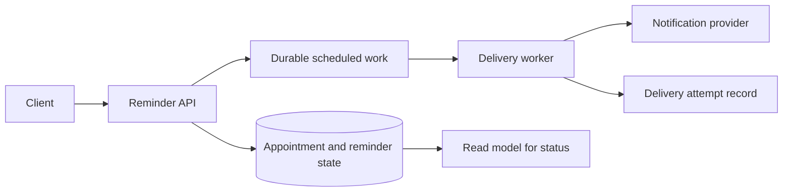

This is one constructed walkthrough, not the only correct design.

## Clarify and scope

“I will first confirm behavior and constraints, estimate the peak, sketch the flow, then deep-dive
delivery safety and close with failure behavior and trade-offs.” The core is create, update, cancel,
and send one reminder. A reasonable baseline is a single region; multi-region recovery is an open
question, not an unstated requirement. Important constraints are a user-visible send window,
duplicate avoidance, delivery delay visibility, and bounded operating cost.

## Estimate

Assume 600,000 reminders per day and a peak factor of 10 around booking windows. Average dispatch is
about seven per second; plan around 70 per second and state that this estimate drives worker
capacity and queue lag alerts. Retention and payload size remain explicit assumptions to validate.

## High-level flow

The API owns idempotent create, update, and cancel operations. Scheduled work separates request
latency from delivery time. A delivery-attempt record makes duplicates and late sends inspectable.

## Deep dive: delivery safety

Use a stable reminder identifier as an idempotency key. A worker records the attempt state before
and after provider handoff; retries use the same key and do not create a second logical send. A
timeout is not assumed to mean failure, so the outcome is reconciled before blindly retrying.

## Bottleneck, failures, and observability

The likely first bottleneck is dispatch lag during the peak. Measure queue age, work completion rate,
provider error rate, and duplicate-suppression count. If the provider slows, bound retries, surface
a delayed status, and preserve appointment state rather than blocking updates. A provider outage
degrades the reminder enhancement while the core appointment workflow remains usable.

## Trade-offs and close

A durable scheduled-work path adds operating complexity but prevents request handlers from holding
long timers. A conservative retry policy reduces duplicate risk but may delay a reminder after an
ambiguous provider timeout. I would validate actual peak clustering and delivery-provider behavior
next, then roll out behind an observable, reversible cohort before expanding ownership.
