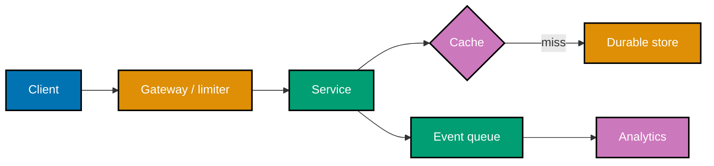

## Goal

Design a URL shortener or news feed as a production design artifact. Show requirements, capacity
estimates, API, data model, high-level architecture, bottlenecks, failure modes, and deliberate
degradation. Implement the two mechanisms that make its scale claims concrete.

## Design artifact

1. State functional and non-functional requirements, including an SLO and a partition-time choice.
2. Compute peak QPS, five-year storage, bandwidth, and a latency budget; label every assumption.
3. Define APIs, idempotency, and indexed storage records for the dominant access path.
4. Draw the request path, cache/replica/shard boundary, and asynchronous analytics path.
5. Name a measured scaling trigger and the cost of the selected building block.
6. Describe overload, dependency failure, stale data, and the user-visible degraded behaviour.

## Runnable components

- `code/rate_limiter.py` proves capacity-based admission and quick rejection.
- `code/hashing.py` proves deterministic placement and bounded remapping after a node is added.

Run them from this directory with `python code/rate_limiter.py` and `python code/hashing.py`.

## Acceptance criteria

- Capacity arithmetic is checked and affects at least one architectural choice.
- API, data model, and diagram agree on ownership and request path.
- Both Python components run successfully and contain assertions for their stated mechanics.
- The design records one bottleneck, one failure mode, one degradation response, and what each
  accepted trade-off gives up.

## Reflection

State which assumption would most change the design if it proved false. A useful answer points to
a number, a workload skew, or a correctness promise—not merely to a different product name.
