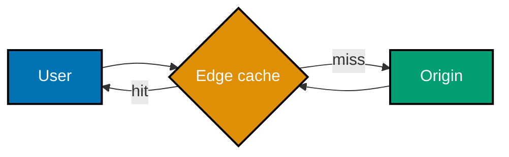

## Distribute work without hiding its costs

The following mechanisms are intentionally small. Run each Python file, then ask which production
semantics it leaves out: clocks, concurrent writers, retries, persistence, and node failure are
design concerns rather than details to wish away.

### Worked Example 19: Rotate requests with round robin

**Context**: Equal-capacity backends can receive requests in a stable cycle.

Run: `python learning/code/ex-19-round-robin-lb.py`.

**Key takeaway**: Round robin distributes count, not work duration.

**Why It Matters**: It is a reasonable default only when requests cost roughly the same. Long-lived
connections or uneven backends call for health-aware, least-connections, or weighted routing. (co-06)

### Worked Example 20: Favor larger backends with weights

**Context**: A backend with twice the capacity should receive twice the slots in a simple schedule.

Run: `python learning/code/ex-20-weighted-lb.py`.

**Key takeaway**: Weights express a capacity assumption that must be measured and revised.

**Why It Matters**: Weighted routing avoids wasting a larger node, but stale weights can overload it.
Health checks and saturation metrics are required before an algorithm becomes production routing.
(co-06)

### Worked Example 21: Locate keys on a consistent-hashing ring

**Context**: Hashing key and nodes onto one ordered circle limits movement when membership changes.

Run: `python learning/code/ex-21-consistent-hashing-ring.py`.

**Key takeaway**: A key moves to the next clockwise node, so a node change remaps only its interval.

**Why It Matters**: The ring trades a central lookup table for deterministic placement. It still
needs membership agreement, replication, and data movement; hashing does not make those disappear.
(co-07)

### Worked Example 22: Smooth distribution with virtual nodes

**Context**: A few physical nodes make a sparse ring with large uneven intervals.

Run: `python learning/code/ex-22-consistent-hashing-vnodes.py`.

**Key takeaway**: Several virtual positions per physical node reduce variance.

**Why It Matters**: Virtual nodes improve balance and allow proportional capacity, but they increase
metadata and rebalance activity. Monitor actual key sizes too: equal key count is not equal load.
(co-07)

### Worked Example 23: Populate a cache on a miss

**Context**: Cache-aside lets the application own the miss path and durable source of truth.

Run: `python learning/code/ex-23-cache-aside.py`.

**Key takeaway**: Read cache, load a miss from storage, then populate the cache.

**Why It Matters**: The second read demonstrates the benefit, while the first reveals the cost.
Writes need explicit invalidation or update policy; otherwise a fast cache returns obsolete state.
(co-08)

### Worked Example 24: Evict least-recently-used data

**Context**: A bounded cache must choose what to forget rather than grow until process failure.

Run: `python learning/code/ex-24-lru-cache.py`.

**Key takeaway**: LRU retains recently accessed keys and evicts the least recently used one at capacity.

**Why It Matters**: LRU fits recency-heavy access but may be poor for scans or a very hot large item.
The eviction policy is part of the product latency and memory decision. (co-08)

### Worked Example 25: Expire a TTL cache entry

**Context**: A cached value needs a freshness boundary even when no writer sends invalidation.

Run: `python learning/code/ex-25-ttl-cache.py`.

**Key takeaway**: Expiry turns an old cached value into a miss that reloads authoritative data.

**Why It Matters**: A short TTL improves freshness and increases origin traffic; a long one protects
the origin and permits stale reads. Pick it from a user-visible staleness budget. (co-08)

### Worked Example 26: Jitter cache expiries

**Context**: Identical TTLs can expire a popular set at once and stampede the origin.

Run: `python learning/code/ex-26-cache-stampede-jitter.py`.

**Key takeaway**: A bounded random offset spreads refreshes over time.

**Why It Matters**: Jitter reduces synchronized misses but cannot protect an origin alone. Combine
it with request coalescing, stale-while-revalidate, or pre-warming for an expensive hot key. (co-09)

### Worked Example 27: Admit work with a token bucket

**Context**: A bucket refills at a steady rate and allows short bursts up to its capacity.

Run: `python learning/code/ex-27-token-bucket-limiter.py`.

**Key takeaway**: Admit while tokens remain; reject excess work quickly.

**Why It Matters**: A rate limiter protects a shared downstream dependency, but a local bucket is
not a global limit. Distributed designs need an agreed store or partitioning strategy. (co-22)

### Worked Example 28: Count a sliding window

**Context**: A rolling time window makes a limit’s boundary explicit instead of resetting at a wall clock.

Run: `python learning/code/ex-28-sliding-window-limiter.py`.

**Key takeaway**: Retain only timestamps inside the interval before deciding whether to admit.

**Why It Matters**: Sliding windows are fairer around boundaries than a fixed bucket, at the cost of
more state. A high-cardinality key needs bounded storage and cleanup. (co-22)

### Worked Example 29: Observe replica lag

**Context**: Followers can serve reads only after a leader’s write has replicated.

Run: `python learning/code/ex-29-leader-follower-replication.py`.

**Key takeaway**: A follower read can be stale even when the leader accepted the write.

**Why It Matters**: Replica routing needs a contract: stale-tolerant reads can fan out, while a
writer’s next read may need leader affinity or a minimum replication position. (co-11)

### Worked Example 30: Route reads and writes differently

**Context**: The request type, not random load, determines a safe replica destination.

Run: `python learning/code/ex-30-read-replica-routing.py`.

**Key takeaway**: Writes route to the leader; eligible reads route to a replica.

**Why It Matters**: Sending a write to a follower is a correctness bug, not a balancing decision.
The router must also remove unhealthy or lagging replicas from its candidate set. (co-11)

### Worked Example 31: See a range-shard hotspot

**Context**: Sequential IDs concentrate recent writes on the highest range.

Run: `python learning/code/ex-31-range-partition.py`.

**Key takeaway**: Ranges preserve ordering and scans but can concentrate a growing edge.

**Why It Matters**: Range partitioning fits location or time queries, yet a hot range needs
splitting, an additional routing tier, or a different partition key. (co-12, co-13)

### Worked Example 32: Spread keys with hash partitions

**Context**: A stable hash makes sequential IDs appear uniformly distributed across shards.

Run: `python learning/code/ex-32-hash-partition.py`.

**Key takeaway**: Hash partitions balance keys while giving up efficient ordered range scans.

**Why It Matters**: The trade-off moves work: a cross-range query becomes scatter-gather or a
separate index. Data access patterns, not an abstract preference, choose the strategy. (co-12)

### Worked Example 33: Salt a celebrity key

**Context**: One popular account can overwhelm the otherwise balanced shard that owns it.

Run: `python learning/code/ex-33-hotspot-salting.py`.

**Key takeaway**: Add a deterministic sub-key to spread independent writes, then aggregate when reading.

**Why It Matters**: Salting trades a hot write for multiple reads and a sum. It works for counters
and append-only events, not for a value that must be atomically read and updated as one record.
(co-13)

### Worked Example 34: Check quorum overlap

**Context**: With three replicas, W=2 and R=2 overlap in at least one replica after a completed write.

Run: `python learning/code/ex-34-quorum-rw.py`.

**Key takeaway**: `R + W > N` is a useful overlap condition, not a complete distributed protocol.

**Why It Matters**: Failures, concurrent writes, repair, and sloppy quorums still require version
handling. The arithmetic tells a reviewer what promise the chosen read and write paths attempt.
(co-18)

### Worked Example 35: Decouple a producer and consumer

**Context**: A producer can enqueue a notification and return without waiting for delivery work.

Run: `python learning/code/ex-35-message-queue-decouple.py`.

**Key takeaway**: A queue isolates producer latency from consumer throughput.

**Why It Matters**: The queue moves, rather than removes, failure. Retention, retries, poison
messages, and the user's expectation for eventual completion become part of the design. (co-20)

### Worked Example 36: Compete consumers for work

**Context**: Several consumers can take independent jobs from one queue.

Run: `python learning/code/ex-36-queue-competing-consumers.py`.

**Key takeaway**: Competing consumers scale throughput, not ordering across all messages.

**Why It Matters**: A work queue needs idempotent handlers because a crash after processing and
before acknowledgement produces a redelivery. Fairness is also affected by job duration. (co-20)

### Worked Example 37: Make redelivery a no-op

**Context**: At-least-once delivery replays a message; a consumer records a processed ID first.

Run: `python learning/code/ex-37-idempotent-consumer.py`.

**Key takeaway**: Idempotency turns duplicate delivery into an explicit, safe outcome.

**Why It Matters**: The durable dedup record must share a transaction or carefully designed ordering
with the side effect. An in-memory set demonstrates the rule but not crash-safe production storage.
(co-23)

### Worked Example 38: Trace an edge-cache hit

**Context**: A CDN serves cacheable static bytes near the requester and avoids an origin trip on a hit.

**Key takeaway**: A cache hit skips the origin; a miss must still be safe and bounded.

**Why It Matters**: CDN configuration needs cache keys, invalidation, and privacy rules. Serving
personalized or mutable responses from a shared edge without those rules is a data leak. (co-10)
