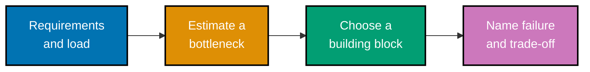

## Mental model

A system is a chain of finite resources. A capacity estimate identifies the scarce one; a building
block changes how the chain fails; a design is complete only when it documents that new failure
mode and the trade-off the team accepts.

## Concept map

- **Method**: requirements, capacity estimates, APIs, data models, and named trade-offs.
- **Scale blocks**: load balancing, consistent hashing, cache-aside, CDN, replicas, shards, queues,
  streams, and object storage.
- **Correctness under distribution**: CAP/PACELC, consistency models, quorums, idempotency, and
  replication lag.
- **Resilience and case studies**: rate limits, backpressure, circuit breakers, graceful
  degradation, URL shorteners, and news feeds.

## Example progression

- **Estimation and foundations** (Examples 1–18) makes requirements, numbers, and consistency
  promises testable.
- **Building blocks** (Examples 19–38) implements the mechanisms that distribute traffic and
  work, alongside their staleness and ordering costs.
- **Case studies and resilience** (Examples 39–53) assembles complete designs and keeps them
  useful when dependencies or capacity fail.

Next: [Estimation and foundations](./beginner.md) →
