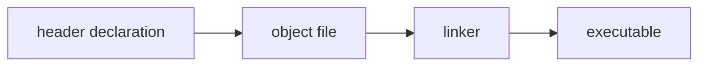
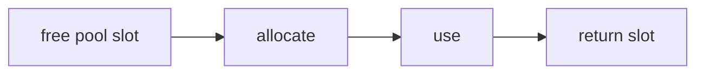
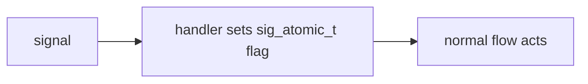
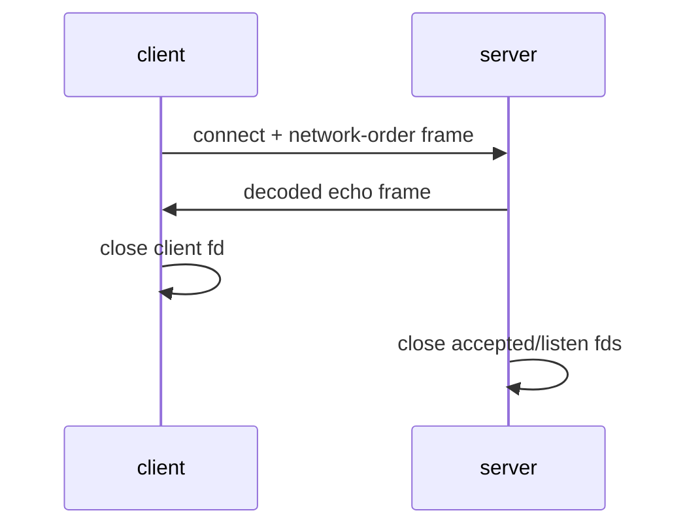

Examples 53–78 bring the basic discipline to binary boundaries, allocators, signals, and local TCP.

| Examples                                                                                            | Focus                                              |
| --------------------------------------------------------------------------------------------------- | -------------------------------------------------- |
| 53 compilation-units; 54 include-guard; 55 static-library; 56 dynamic-library; 57 abi-struct-layout | interfaces and binary contracts                    |
| 58 memory-pool; 59 arena-allocator; 60 pool-reuse; 61 aligned-alloc                                 | bounded allocation strategies                      |
| 62 signal-handler; 63 signal-safe-flag; 64 sigaction                                                | minimum work in a handler                          |
| 65 socket-create; 66 socket-bind-listen; 67 socket-accept; 68 socket-connect; 69 socket-send-recv   | TCP endpoint lifecycle                             |
| 70 socket-serialized; 71 client-server-echo                                                         | message bytes over a connection                    |
| 72 overflow-then-fix; 73 uaf-then-fix; 74 valgrind-clean; 75 asan-clean                             | verify the safe implementation                     |
| 76 full-systems-slice; 77 integration-memclean; 78 capstone-systems-component                       | pool, serialization, and socket ownership together |

The capstone source is a distinct, complete program with its own build script. It is the required
proof that the patterns compose; the numbered files are deliberately small local experiments.
